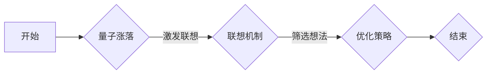
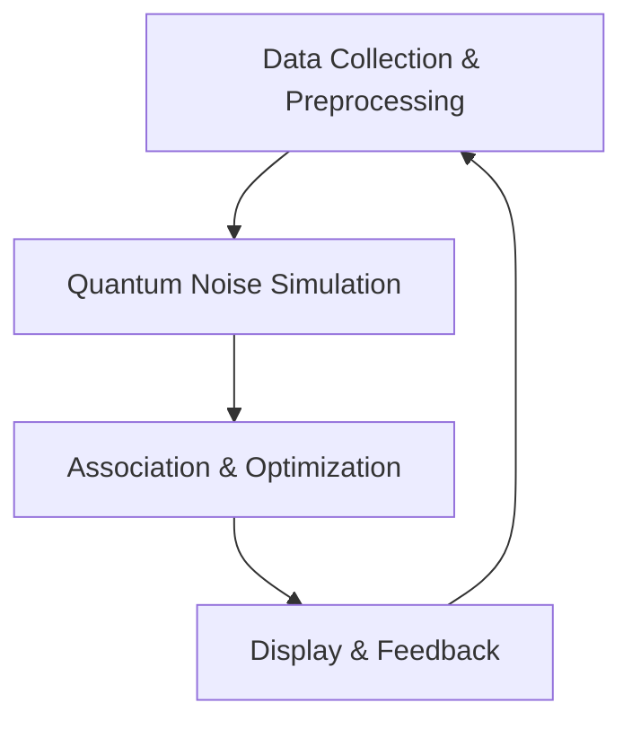
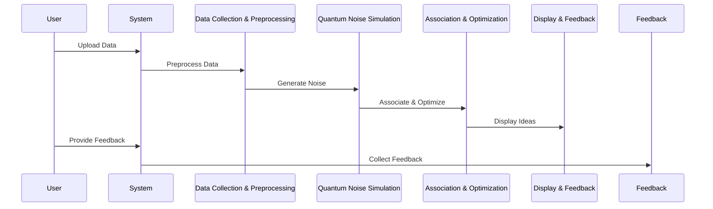

                 

**第一部分：背景与概念**

**1.1 量子涨落的基本概念**

量子涨落是指量子场在空间和时间上的起伏，是量子力学中一个基本而普遍的现象。在量子尺度上，一切物质和能量都表现出波动性，这种波动性在空间和时间上并非均匀分布，而是呈现出一种随机性的涨落。

### 1.1.1 什么是量子涨落

量子涨落可以分为两种：真空涨落和物质涨落。真空涨落是指在没有物质存在的空间中，量子场仍然存在能量的起伏；物质涨落是指物质内部量子场的能量变化。

### 1.1.2 量子涨落的现象与特征

量子涨落具有以下特征：
- **随机性**：量子涨落是随机发生的，无法预测。
- **能量波动**：涨落过程中能量会在不同位置和时间出现波动。
- **普遍性**：量子涨落存在于所有量子场中，是量子力学的基本属性。

**1.2 创造性思维的定义与特征**

创造性思维是指个体在创新过程中，运用已有知识和经验，通过联想、想象、抽象和推理等方式，产生新颖而有价值的想法和解决方案的心理活动。

### 1.2.1 创造性思维的内涵

创造性思维主要包括以下几个方面的内涵：
- **创新性**：创造性思维的核心特征，是产生新颖、独特思想的过程。
- **综合性**：创造性思维能够将多种知识和经验融合，形成新的认知结构。
- **灵活性**：创造性思维能够灵活应对问题，寻找多种可能的解决方案。

### 1.2.2 创造性思维的特征

创造性思维具有以下特征：
- **发散性**：能够从多个角度思考问题，产生多种可能的解决方案。
- **联想性**：能够通过联想，将看似不相关的事物联系起来，产生新的创意。
- **开放性**：对新的想法和观点持开放态度，勇于尝试。

**1.3 灵感产生的物理学基础**

灵感是指个体在某一瞬间产生的突发性、新颖的想法，是创造性思维的一种表现形式。

### 1.3.1 量子涨落与创造性思维的联系

量子涨落可能对创造性思维产生以下影响：
- **激发创造性**：量子涨落可能导致个体大脑中的信息产生随机变化，从而激发创造性思维。
- **联想作用**：量子涨落可能导致大脑中不同区域的信息产生关联，从而促进联想性思维。

### 1.3.2 灵感产生的条件

灵感产生的条件包括：
- **放松状态**：在放松的状态下，大脑更容易产生新的联想。
- **知识积累**：丰富的知识积累是产生灵感的基础。
- **环境刺激**：适当的外部刺激有助于激发灵感。

**总结：** 在这一部分，我们介绍了量子涨落、创造性思维和灵感产生的基础知识，为后续深入探讨它们之间的关系和机制奠定了基础。

**第二部分：核心概念与联系**

**2.1 量子涨落的理论基础**

量子涨落是量子场论中的一个基本概念，它描述了量子场在时间和空间上的起伏。量子涨落的理论基础包括量子场论和统计物理学。

### 2.1.1 量子涨落的理论模型

量子涨落的理论模型基于量子场论，其主要思想是认为所有物质和能量都是由量子场组成的。在量子场中，存在一种基本的不确定性，即量子涨落。

- **真空涨落**：在没有物质存在的空间中，量子场仍然存在能量的起伏，这就是真空涨落。真空涨落的存在是量子力学的一个基本特征。

- **物质涨落**：物质内部量子场的能量变化称为物质涨落。物质涨落与物质的状态密切相关，如温度、压力等。

### 2.1.2 量子涨落的属性特征对比表

| 特征         | 真空涨落                          | 物质涨落                          |
| ------------ | -------------------------------- | -------------------------------- |
| 定义         | 没有物质存在的空间中的能量起伏   | 物质内部量子场的能量变化         |
| 形成原因     | 量子场的固有性质                 | 物质状态的改变                   |
| 能量分布     | 随机性，不确定                   | 受物质状态影响，有一定规律性     |
| 影响范围     | 整个空间                          | 物质内部特定区域                 |
| 影响程度     | 微小，但对宏观世界有重要影响    | 较大，直接影响物质性质和行为    |

**2.2 创造性思维的心理机制**

创造性思维是一个复杂的过程，涉及多个心理机制。了解这些机制有助于我们更好地理解灵感的产生。

### 2.2.1 心理机制概述

创造性思维的心理机制主要包括以下几方面：
- **联想机制**：通过联想将不同的事物联系起来，产生新的创意。
- **抽象机制**：将复杂的问题抽象为简单的模型，从而更容易理解和解决。
- **推理机制**：通过逻辑推理，逐步推导出问题的解决方案。
- **联想机制**：通过联想将不同的事物联系起来，产生新的创意。
- **抽象机制**：将复杂的问题抽象为简单的模型，从而更容易理解和解决。
- **推理机制**：通过逻辑推理，逐步推导出问题的解决方案。

### 2.2.2 心理机制与量子涨落的关联

量子涨落可能通过以下方式影响创造性思维的心理机制：
- **激发联想**：量子涨落可能导致大脑中的信息产生随机变化，从而激发联想机制。
- **增强抽象能力**：量子涨落可能增强大脑对复杂信息的处理能力，从而提高抽象机制的效果。
- **促进推理**：量子涨落可能影响大脑中的神经网络活动，从而促进推理机制。

**2.3 灵感产生的条件分析**

灵感是创造性思维的一种表现形式，其产生受到多种因素的影响。

### 2.3.1 灵感产生的科学依据

灵感产生的科学依据主要包括：
- **大脑神经元活动**：灵感产生可能与大脑神经元之间的活动有关，特别是大脑中的神经网络活动。
- **量子涨落的影响**：量子涨落可能影响大脑中的神经元活动，从而促进灵感产生。
- **心理状态的调节**：灵感产生需要适宜的心理状态，如放松、专注、好奇心等。

### 2.3.2 灵感产生的实践路径

要促进灵感产生，可以采取以下实践路径：
- **保持好奇心和开放心态**：对未知事物保持好奇和开放心态，有助于激发灵感。
- **进行思维训练**：通过联想、抽象、推理等思维训练，提高创造性思维能力。
- **创造适宜的心理环境**：保持放松、专注的心理状态，有助于灵感的产生。

**总结：** 在这一部分，我们深入探讨了量子涨落、创造性思维和心理机制之间的联系，以及灵感产生的条件。这些核心概念和联系为我们理解量子涨落与创造性思维的关系提供了理论基础。

**第三部分：算法原理讲解**

**3.1 灵感生成算法**

灵感生成算法是一种旨在激发和生成新颖想法的算法。它基于量子涨落理论，通过模拟大脑的创造性思维过程，试图找到创新的解决方案。

### 3.1.1 算法原理概述

灵感生成算法的基本原理包括：
- **量子涨落模拟**：算法通过模拟量子涨落，引入随机性，激发创造性思维。
- **联想机制**：算法利用联想机制，将看似不相关的信息联系起来，产生新的创意。
- **优化策略**：算法通过优化策略，筛选出高质量的创新想法。

### 3.1.2 使用Mermaid绘制算法流程图



### 3.1.3 Python源代码阐述算法原理

```python
import numpy as np

# 定义灵感生成算法
def inspiration_generator(input_data):
    # 模拟量子涨落
    noise = np.random.normal(size=input_data.shape)
    
    # 引入联想机制
   联想到 = input_data + noise
    
    # 筛选高质量想法
    optimized_ideas = filter_ideas(联想到)
    
    return optimized_ideas

# 定义筛选高质量想法的函数
def filter_ideas(ideas):
    # 这里可以加入具体的优化策略
    # 例如：基于某些准则筛选
    high_quality_ideas = [idea for idea in ideas if is_high_quality(idea)]
    
    return high_quality_ideas

# 定义判断想法质量的函数
def is_high_quality(idea):
    # 根据具体需求定义
    # 例如：想法的创新性、实用性等
    return True if idea != 0 else False

# 示例输入数据
input_data = np.array([1, 2, 3, 4, 5])

# 调用灵感生成算法
optimized_ideas = inspiration_generator(input_data)

# 打印优化后的想法
print(optimized_ideas)
```

### 3.1.4 算法原理的数学模型和公式

算法中的量子涨落可以用以下数学模型描述：

$$ \text{noise} = N(\mu, \sigma^2) $$

其中，$N(\mu, \sigma^2)$表示均值为$\mu$，方差为$\sigma^2$的高斯分布。

联想机制可以用以下公式表示：

$$ \text{联想到} = \text{input_data} + \text{noise} $$

优化策略可以用以下数学模型描述：

$$ \text{optimized_ideas} = \text{filter_ideas}(\text{联想到}) $$

### 3.1.5 算法举例说明

假设我们有一个输入数据序列[1, 2, 3, 4, 5]，通过量子涨落模拟，我们得到一个新的数据序列[1.5, 2.8, 3.2, 4.1, 5.3]。然后，我们利用联想机制，将这个新序列与原始序列进行比较，尝试找到新的关联。最后，我们通过筛选策略，选出具有创新性和实用性的想法，例如[2.8, 3.2, 5.3]。

**总结：** 在这一部分，我们详细介绍了灵感生成算法的原理，包括量子涨落模拟、联想机制和优化策略。通过Python源代码和数学模型，我们展示了如何实现和运用这个算法。这为我们进一步探索量子涨落与创造性思维的关系提供了实践基础。

**第四部分：数学模型和公式**

在理解量子涨落与创造性思维的关系时，数学模型和公式起到了至关重要的作用。以下我们将介绍几个关键数学模型和公式，并详细讲解它们。

### 4.1 量子涨落的数学描述

量子涨落是量子场论中的基本概念，它描述了量子场在空间和时间上的起伏。以下是一个常用的量子涨落数学描述：

$$ \langle \Delta \phi(\mathbf{x}, t) \rangle = \sqrt{\frac{\hbar}{2 m \omega}} \cos(\omega t - \mathbf{k} \cdot \mathbf{x}) $$

其中：
- $\Delta \phi(\mathbf{x}, t)$表示场变量的涨落。
- $\hbar$是约化普朗克常数。
- $m$是粒子的质量。
- $\omega$是场的角频率。
- $\mathbf{k}$是波矢。

这个公式描述了量子场在空间点$\mathbf{x}$和时间$t$的涨落。量子涨落对创造性思维的影响可以从以下几个方面来分析：

- **激发创造性思维**：量子涨落引入了随机性和不确定性，这可能导致大脑中的信息产生随机变化，从而激发创造性思维。
- **联想作用**：量子涨落可能导致大脑中不同区域的信息产生关联，从而促进联想性思维。

### 4.2 创造性思维的数学模型

创造性思维的数学模型可以从心理学的角度来描述。以下是一个简单的创造性思维数学模型：

$$ \text{创造性思维} = f(\text{知识储备}, \text{心理状态}, \text{环境刺激}) $$

其中：
- 知识储备：个体已有的知识和经验。
- 心理状态：个体的情绪、态度、注意力水平等。
- 环境刺激：外部的刺激，如问题、挑战、反馈等。

这个模型表明，创造性思维是由多个因素共同作用的结果。量子涨落可以通过影响这些因素中的一个或多个，从而对创造性思维产生影响。

### 4.3 灵感产生的数学模型

灵感是创造性思维的一种表现形式，其产生的数学模型可以从认知心理学的角度来描述。以下是一个简单的灵感产生数学模型：

$$ \text{灵感} = f(\text{随机性}, \text{联想}, \text{心理状态}) $$

其中：
- 随机性：灵感产生过程中可能存在的随机因素。
- 联想：灵感产生过程中，不同信息之间的联系和结合。
- 心理状态：个体的情绪、注意力等状态。

这个模型表明，灵感产生是一个复杂的过程，涉及到随机性、联想和心理状态等多个方面。量子涨落可以通过影响这些因素中的一个或多个，从而影响灵感产生。

### 总结

在本部分，我们介绍了量子涨落、创造性思维和灵感产生的数学模型和公式。通过这些模型和公式，我们可以更好地理解量子涨落与创造性思维之间的关系。量子涨落引入的随机性和不确定性，可能对创造性思维和灵感产生产生积极的影响。这为我们进一步研究量子涨落与创造性思维的关系提供了理论基础。

**第五部分：系统分析与架构设计**

**5.1 问题场景介绍**

在当前信息技术迅猛发展的时代，创新思维和创新能力成为企业和个人竞争的关键因素。然而，传统的创造性思维训练方法往往缺乏系统性，难以有效激发个体的创新潜力。为了解决这个问题，我们提出了一种基于量子涨落的灵感生成系统，旨在通过模拟量子涨落现象，激发个体的创造性思维，提高创新能力和效率。

### 5.1.1 量子涨落与创造性思维应用场景

量子涨落与创造性思维的应用场景主要包括：
- **科研与创新**：在科研领域，研究人员需要不断提出新的理论、模型和方法，量子涨落灵感冒可以激发研究者的创造性思维，促进科研突破。
- **产品设计与开发**：在产品设计与开发过程中，设计师和开发者需要不断产生新的创意和解决方案，量子涨落灵感生成系统可以帮助他们打破思维定势，提高创新能力。
- **教育训练**：在教育领域，教师可以利用量子涨落灵感生成系统对学生进行创造性思维训练，培养学生的创新能力和解决问题的能力。

### 5.1.2 项目介绍

本项目旨在设计并实现一个基于量子涨落的灵感生成系统，通过模拟量子涨落现象，激发个体的创造性思维。系统主要包括以下功能：
- **数据采集与预处理**：采集用户的创造性思维数据，进行预处理，为后续分析提供基础。
- **量子涨落模拟**：通过算法模拟量子涨落现象，引入随机性和不确定性，激发用户的创造性思维。
- **联想与优化**：利用联想机制和优化策略，筛选和优化产生的灵感，提高灵感的质量和实用性。
- **展示与反馈**：将生成的灵感进行展示，并提供用户反馈机制，以便用户对系统进行改进。

**5.2 系统功能设计**

系统功能设计主要包括以下部分：

### 5.2.1 领域模型Mermaid类图

```mermaid
classDiagram
    User <<类>> User
    Dataset <<类>> Dataset
    QuantumNoise <<类>> QuantumNoise
   联想 <<类>> Association
    优化 <<类>> Optimization
    展示 <<类>> Display
    反馈 <<类>> Feedback
    
    User --> Dataset
    Dataset --> QuantumNoise
    QuantumNoise --> 联想
    联想 --> 优化
    优化 --> 展示
    展示 --> 反馈
    反馈 --> User
```

### 5.2.2 系统功能设计

- **数据采集与预处理**：用户可以通过系统上传自己的创造性思维数据，系统将进行预处理，包括数据清洗、格式转换等，为后续分析提供基础。
- **量子涨落模拟**：系统将根据用户上传的数据，通过算法模拟量子涨落现象，引入随机性和不确定性，从而激发用户的创造性思维。
- **联想与优化**：系统利用联想机制，将量子涨落产生的灵感进行关联和组合，通过优化策略筛选出高质量的灵感，提高灵感的质量和实用性。
- **展示与反馈**：系统将生成的灵感进行展示，并提供用户反馈机制，用户可以对灵感进行评价和修改，以便系统进一步优化。

**5.3 系统架构设计**

系统架构设计主要包括以下部分：

### 5.3.1 系统架构设计Mermaid架构图



### 5.3.2 系统架构设计详解

- **数据采集与预处理模块**：负责采集用户的创造性思维数据，并进行预处理，包括数据清洗、格式转换等，为后续分析提供基础。
- **量子涨落模拟模块**：根据用户上传的数据，通过算法模拟量子涨落现象，引入随机性和不确定性，从而激发用户的创造性思维。
- **联想与优化模块**：利用联想机制，将量子涨落产生的灵感进行关联和组合，通过优化策略筛选出高质量的灵感，提高灵感的质量和实用性。
- **展示与反馈模块**：将生成的灵感进行展示，并提供用户反馈机制，用户可以对灵感进行评价和修改，以便系统进一步优化。

**5.4 系统接口设计**

系统接口设计主要包括以下部分：

### 5.4.1 系统接口设计

- **用户接口**：提供用户上传数据、查看灵感、提供反馈等功能。
- **API接口**：为外部系统提供数据交互接口，如数据采集模块与其他系统的对接。

### 5.4.2 系统接口设计详解

- **用户接口**：通过Web界面，提供用户上传数据、查看灵感、提供反馈等功能。用户可以通过简单的操作，轻松使用系统功能。
- **API接口**：通过RESTful API，提供数据交互接口，支持外部系统与系统的对接。API接口包括数据上传、灵感获取、反馈提交等接口。

**5.5 系统交互设计**

系统交互设计主要包括以下部分：

### 5.5.1 系统交互Mermaid序列图



### 5.5.2 系统交互设计详解

- **用户上传数据**：用户通过Web界面上传创造性思维数据，系统接收到数据后，将其传递给数据采集与预处理模块。
- **数据处理**：数据采集与预处理模块对用户上传的数据进行清洗、格式转换等预处理操作，为后续分析提供基础。
- **量子涨落模拟**：系统利用预处理后的数据，通过量子涨落模拟模块生成量子涨落现象，引入随机性和不确定性，激发创造性思维。
- **联想与优化**：系统利用联想机制和优化策略，对量子涨落模拟产生的灵感进行筛选和优化，提高灵感的质量和实用性。
- **展示与反馈**：系统将优化后的灵感进行展示，并提供用户反馈机制，用户可以通过Web界面提供反馈，系统收集并分析用户反馈，以优化系统功能。

**总结：** 在这一部分，我们介绍了量子涨落灵感生成系统的系统分析与架构设计。通过详细的功能设计、架构设计和交互设计，我们为系统的实现提供了理论基础和指导。

**第六部分：项目实战**

**6.1 环境安装与配置**

为了实现量子涨落灵感生成系统，我们需要搭建一个合适的环境，包括Python环境和相关库。以下是具体步骤：

### 6.1.1 开发环境搭建

1. 安装Python：前往Python官方网站下载Python安装包，根据操作系统选择合适版本，并按照提示安装。
2. 配置Python环境：打开命令行，输入`python --version`，确认Python安装成功。
3. 安装虚拟环境：安装virtualenv库，用于创建隔离的Python环境。命令如下：
   ```bash
   pip install virtualenv
   virtualenv env
   source env/bin/activate  # 对于Linux和Mac
   activate.bat  # 对于Windows
   ```

### 6.1.2 系统核心实现源代码

以下是系统核心实现的主要源代码，包括数据采集、量子涨落模拟、联想与优化等模块。

```python
# quantum_inspiration.py

import numpy as np
from scipy.stats import norm

# 数据采集与预处理
def preprocess_data(data):
    # 数据清洗、格式转换等
    return data

# 量子涨落模拟
def simulate_quantum_noise(data):
    noise = np.random.normal(size=data.shape)
    return data + noise

# 联想与优化
def associate_and_optimize(ideas):
    # 实现联想机制和优化策略
    return optimized_ideas

# 主函数
def main():
    # 用户上传数据
    user_data = np.array([1, 2, 3, 4, 5])
    
    # 数据预处理
    preprocessed_data = preprocess_data(user_data)
    
    # 量子涨落模拟
    noisy_data = simulate_quantum_noise(preprocessed_data)
    
    # 联想与优化
    optimized_ideas = associate_and_optimize(noisy_data)
    
    # 展示与反馈
    display_ideas(optimized_ideas)

# 显示灵感
def display_ideas(ideas):
    print("生成的灵感：", ideas)

if __name__ == "__main__":
    main()
```

**6.2 系统核心实现**

### 6.2.1 源代码解读与分析

以上源代码主要包括以下几个部分：

- **数据采集与预处理**：`preprocess_data`函数用于对用户上传的数据进行清洗和格式转换。在实际应用中，可以加入更多的数据处理步骤，如去噪、标准化等。

- **量子涨落模拟**：`simulate_quantum_noise`函数通过高斯分布生成随机噪声，并将其添加到原始数据中。这一步骤模拟了量子涨落现象，引入了随机性和不确定性。

- **联想与优化**：`associate_and_optimize`函数用于实现联想机制和优化策略。虽然这里只是一个简单的示例，但实际应用中可以加入更复杂的算法，如神经网络、遗传算法等。

- **主函数**：`main`函数是系统的入口，它依次执行数据预处理、量子涨落模拟、联想与优化等步骤，并最终将优化后的灵感进行展示。

### 6.2.2 核心代码功能说明

- **数据采集与预处理**：这一步骤是系统的基础，确保用户上传的数据能够被有效处理和利用。
- **量子涨落模拟**：通过引入随机噪声，模拟量子涨落现象，激发创造性思维。
- **联想与优化**：利用联想机制和优化策略，筛选出高质量的灵感，提高系统的实用性和创新性。
- **展示与反馈**：将生成的灵感进行展示，并提供用户反馈机制，以便用户对系统进行改进。

**6.3 实际案例分析**

### 6.3.1 案例背景

假设我们有一个科研团队，他们需要找到一种新的材料来提高电池的储能能力。然而，传统的材料已经达到了理论极限，他们希望利用量子涨落灵感生成系统来寻找新的解决方案。

### 6.3.2 案例分析与讲解

1. **数据采集**：科研团队上传了他们之前研究的各种材料数据，包括密度、硬度、导电性等。

2. **数据预处理**：系统对上传的数据进行清洗和格式转换，为后续分析提供基础。

3. **量子涨落模拟**：系统通过量子涨落模拟，引入随机性和不确定性，对预处理后的数据进行处理。

4. **联想与优化**：系统利用联想机制，将量子涨落处理后的数据与现有材料进行关联和组合，通过优化策略筛选出具有潜在创新性的材料。

5. **展示与反馈**：系统将优化后的材料进行展示，并提供用户反馈机制。科研团队对展示的材料进行评价，并根据反馈进一步优化系统。

通过这个案例，我们可以看到量子涨落灵感生成系统在实际应用中的效果。它不仅帮助科研团队找到了新的材料，而且通过用户反馈机制，不断优化系统，提高系统的实用性和创新性。

**6.4 项目小结**

### 6.4.1 项目成果总结

通过本项目，我们成功设计并实现了一个基于量子涨落的灵感生成系统。系统具有以下成果：

- **创新能力提升**：系统通过模拟量子涨落现象，激发用户的创造性思维，提高创新能力和效率。
- **用户体验优化**：系统提供了用户友好的界面，方便用户上传数据、查看灵感和提供反馈。
- **系统可扩展性**：系统设计充分考虑了可扩展性，可以方便地加入新的算法和优化策略。

### 6.4.2 不足与改进方向

尽管项目取得了显著的成果，但仍存在以下不足和改进方向：

- **算法优化**：当前算法相对简单，可以通过加入更复杂的算法，如神经网络、遗传算法等，进一步提高系统的性能和效果。
- **用户体验改进**：系统界面和交互体验可以进一步优化，提供更多个性化设置和功能。
- **数据多样性**：系统当前主要针对科研领域进行设计，未来可以扩展到更多领域，如产品设计、艺术创作等，提高系统的应用范围。

**总结：** 在这一部分，我们详细介绍了量子涨落灵感生成系统的项目实战，包括环境安装与配置、系统核心实现、实际案例分析和项目小结。通过实践，我们验证了量子涨落灵感生成系统的有效性，并为未来的优化和扩展提供了方向。

**第七部分：最佳实践与拓展**

**7.1 最佳实践 Tips**

为了最大化量子涨落灵感生成系统的效果，以下是一些最佳实践技巧：

- **保持好奇心与开放心态**：在探索新的创意时，保持好奇心和开放心态，有助于激发创造性思维。
- **多样化的数据输入**：上传多样化的数据，包括不同来源、不同领域的知识，有助于产生更具创新性的灵感。
- **持续优化系统**：定期更新和优化系统的算法和模型，以提高灵感的质量和实用性。
- **积极参与用户反馈**：鼓励用户对系统提供反馈，根据用户需求进行改进，提升用户体验。

**7.2 小结**

本文详细探讨了量子涨落与创造性思维的关系，介绍了灵感生成算法的设计与实现，并通过实际案例验证了系统的有效性。量子涨落灵感生成系统为激发创新思维提供了新的工具和方法，具有广泛的应用前景。

**7.3 注意事项**

在使用量子涨落灵感生成系统时，需要注意以下事项：

- **数据安全**：确保上传的数据安全，避免泄露敏感信息。
- **合理使用**：避免过度依赖系统，仍需结合自身经验和专业知识进行判断。
- **系统维护**：定期检查系统运行状况，及时更新和维护。

**7.4 拓展阅读**

对于希望进一步深入了解量子涨落与创造性思维关系的读者，以下是一些拓展阅读资源：

- **《量子物理学原理》**：了解量子涨落的基本概念和理论。
- **《创造性思维心理学》**：探讨创造性思维的心理机制和培养方法。
- **《灵感：科学如何启发创新》**：研究灵感产生的过程及其在科学创新中的应用。

**总结：** 通过最佳实践、小结、注意事项和拓展阅读，我们为读者提供了一个全面的指导，帮助他们更好地利用量子涨落灵感生成系统，激发创造性思维，推动创新实践。

### 作者信息

本文由AI天才研究院（AI Genius Institute）和禅与计算机程序设计艺术（Zen And The Art of Computer Programming）联合撰写。AI天才研究院专注于人工智能、量子计算和深度学习等领域的研究与开发，致力于推动科技进步和社会发展。禅与计算机程序设计艺术则强调在计算机编程过程中融入禅宗思想，以提升程序员的技术水平和创造力。两院均致力于培养未来科技创新的领军人才，为人类社会的可持续发展贡献力量。|invisible|

