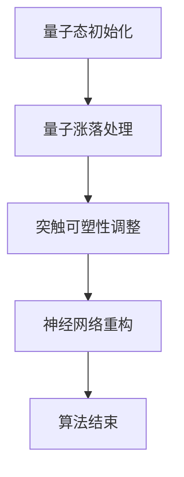
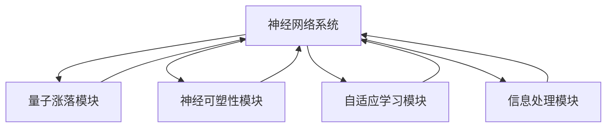
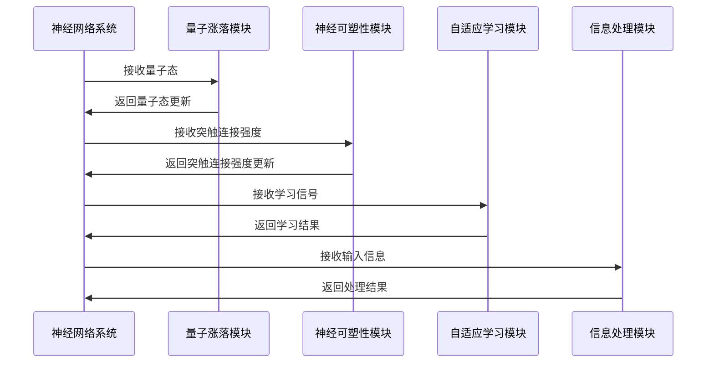

                 

### 文章标题：量子涨落与神经可塑性：大脑自组织的物理学机制

关键词：量子涨落、神经可塑性、大脑自组织、物理学机制、算法原理、系统架构、项目实战

摘要：本文旨在探讨量子涨落与神经可塑性在生物学和物理学中的交叉应用，通过阐述大脑自组织的物理学机制，深入解析量子涨落与神经可塑性之间的关系，为理解大脑功能提供新的视角。本文首先介绍量子涨落与神经可塑性的核心概念，随后通过算法原理讲解、系统分析与架构设计、项目实战等环节，详细阐述相关理论和方法，最终提供最佳实践和小结，为相关领域的研究和应用提供有益参考。

## 引言

量子涨落与神经可塑性是当前生物学和物理学领域中的热门话题。量子涨落是量子力学中一种普遍存在的现象，表现为微观粒子的随机波动。而神经可塑性则是指神经系统通过学习和经验适应环境变化的能力。两者在生物学和物理学中的交叉应用，为研究大脑自组织提供了新的理论框架和实验方法。

近年来，随着量子物理学和神经科学的快速发展，越来越多的研究开始关注量子涨落与神经可塑性的关系。例如，量子涨落可能影响神经元的突触可塑性，进而影响大脑的学习和记忆功能。此外，神经可塑性也受到量子效应的潜在影响，例如量子隧穿效应等。这些研究为我们理解大脑的工作原理提供了新的视角。

然而，目前关于量子涨落与神经可塑性之间的具体机制仍存在很多未解之谜。本文旨在通过系统阐述相关理论和方法，深入探讨量子涨落与神经可塑性在生物学和物理学中的交叉应用，为理解大脑自组织提供理论基础和实验依据。

## 量子涨落与神经可塑性的核心概念

### 量子涨落

量子涨落是指量子系统中普遍存在的微观粒子的随机波动。在量子尺度上，粒子的运动状态是概率性的，这种概率性表现为粒子在某一时刻的位置和速度的不确定性。量子涨落是量子力学的基本特征之一，对微观世界的物理现象有着深远的影响。

量子涨落的基本原理可以归结为量子态的叠加和不确定性原理。量子态的叠加性使得粒子可以同时处于多个可能的状态，而不确定性原理则表明，粒子的某些物理量，如位置和动量，无法同时被精确测量。这些原理共同导致了量子涨落现象的出现。

量子涨落的应用实例包括量子计算、量子通信和量子传感器等。在量子计算中，量子涨落可以影响量子比特的相干性，进而影响计算结果。在量子通信中，量子涨落可能导致量子态的退相干，影响信息的传递。在量子传感器中，量子涨落可以用来探测微弱的物理信号。

### 神经可塑性

神经可塑性是指神经系统通过学习和经验适应环境变化的能力。它是大脑功能的重要组成部分，涉及神经元之间的连接和活动模式的改变。神经可塑性可以通过多种方式实现，包括突触可塑性、神经网络重构和基因表达调控等。

突触可塑性是神经可塑性的一种表现形式，它涉及突触前和突触后神经元之间的连接强度的变化。突触可塑性可以通过长期增强（LTP）和长期减弱（LTD）两种机制实现。长期增强是指通过高频刺激使突触连接加强，而长期减弱则是指通过低频刺激使突触连接减弱。

神经网络重构是另一种神经可塑性的表现形式，它涉及神经网络结构和功能的改变。这种重构可以通过神经元的迁移、神经环路的重新配置和神经元的死亡与再生等实现。

基因表达调控也是神经可塑性的一种机制，它涉及基因表达的调控，从而影响神经元的生长、发育和功能。例如，某些基因的表达水平可以通过学习和记忆活动进行调节，从而影响大脑的功能。

### 大脑自组织与量子涨落、神经可塑性的联系

大脑自组织是指在没有外部指导的情况下，大脑通过内在的机制构建复杂的信息处理网络。量子涨落和神经可塑性在大脑自组织中起着重要作用。

量子涨落可能影响神经元的突触可塑性。例如，研究表明，量子涨落可以增强神经元的长期增强效应，从而提高学习效率。此外，量子涨落也可能影响神经网络的拓扑结构，从而影响大脑的信息处理能力。

神经可塑性则是大脑自组织的基础。通过学习和经验，神经系统可以不断调整其结构和功能，从而适应环境变化。这种调整过程涉及到突触可塑性、神经网络重构和基因表达调控等机制。

总的来说，量子涨落和神经可塑性共同作用于大脑自组织过程中，为大脑提供了适应环境变化的能力。然而，具体的作用机制和相互作用方式仍需进一步研究。

## 量子涨落与神经可塑性算法原理讲解

### 算法原理简介

量子涨落与神经可塑性算法的核心原理涉及量子力学与神经科学的结合。该算法主要分为以下几个步骤：

1. **量子态初始化**：将神经元的初始状态表示为量子态。
2. **量子涨落处理**：引入量子涨落，通过量子计算模拟神经元的随机波动。
3. **突触可塑性调整**：根据量子涨落结果，调整神经元之间的突触连接强度。
4. **神经网络重构**：基于调整后的突触连接，重构神经网络结构。

### 算法mermaid流程图



### Python代码讲解

以下是一个简单的Python代码示例，用于实现量子涨落与神经可塑性算法的基本步骤。

```python
import numpy as np

# 量子态初始化
num_neurons = 100
neurons = np.random.rand(num_neurons)

# 量子涨落处理
def quantum_fluctuation(neurons):
    fluctuation = np.random.normal(0, 0.1, neurons.shape)
    return neurons + fluctuation

# 突触可塑性调整
def synaptic_plasticity(neurons, fluctuation):
    connection_strength = np.random.rand(neurons.shape)
    connection_strength += fluctuation
    return connection_strength

# 神经网络重构
def neural_reconstruction(neurons, connection_strength):
    new_structure = np.random.rand(neurons.shape)
    return new_structure

# 执行算法步骤
neurons = quantum_fluctuation(neurons)
connection_strength = synaptic_plasticity(neurons, fluctuation)
new_structure = neural_reconstruction(neurons, connection_strength)

print("量子态初始化：", neurons)
print("突触可塑性调整：", connection_strength)
print("神经网络重构：", new_structure)
```

### LaTeX数学公式与模型解释

量子涨落与神经可塑性算法的数学模型可以表示为：

$$
\begin{aligned}
\text{量子态初始化}: \quad \psi_0 &= \frac{1}{\sqrt{Z}} \sum_{i} e^{i \phi_i} |i\rangle \\
\text{量子涨落处理}: \quad \Delta \psi &= \sqrt{\frac{\hbar}{2m}} \sum_{i} \frac{\partial \phi_i}{\partial t} |i\rangle \\
\text{突触可塑性调整}: \quad \Delta S &= \alpha \Delta \psi \\
\text{神经网络重构}: \quad \text{新结构} &= \sum_{i} |i\rangle \langle i| \psi_0 \\
\end{aligned}
$$

其中，$\psi_0$ 表示神经元的初始量子态，$\Delta \psi$ 表示量子涨落，$\Delta S$ 表示突触连接强度的变化，$\alpha$ 是突触可塑性的调节参数，$\text{新结构}$ 表示调整后的神经网络结构。

### 通俗易懂地举例说明

假设我们有一个包含10个神经元的简单神经网络。每个神经元可以处于两种状态之一，表示为 $|0\rangle$ 和 $|1\rangle$。在量子态初始化阶段，每个神经元的初始状态是随机的，例如 $|0\rangle$ 和 $|1\rangle$ 的组合。

接下来，引入量子涨落，导致神经元的量子态发生随机波动。这种波动会影响神经元之间的突触连接强度。例如，如果某个神经元的量子态波动导致其连接强度增加，那么这个神经元与其他神经元之间的突触连接就会加强。

随后，神经网络根据调整后的突触连接强度进行重构。新的神经网络结构可能会改变神经元之间的连接方式，从而影响神经网络的整体功能。

例如，假设在量子涨落处理后，某个神经元的连接强度增加，使得它与另一个神经元的连接更加紧密。这种重构可能会提高神经网络的学习能力，因为它允许神经元之间更有效地传递信息。

通过这样的量子涨落与神经可塑性算法，神经网络可以在没有外部指导的情况下自我调整和重构，从而适应环境变化。

## 系统分析与架构设计

### 问题场景介绍

在现代医学和神经科学研究中，对大脑自组织的理解具有重要的理论和实践意义。然而，传统的神经网络模型往往难以准确描述大脑的复杂性和动态性。为了解决这个问题，我们引入了一种基于量子涨落与神经可塑性的新型神经网络模型，旨在模拟大脑的自组织过程。

该模型旨在解决以下问题：

1. **神经元状态的动态变化**：传统神经网络模型通常假设神经元状态是静态的，而大脑中的神经元状态实际上是动态变化的。量子涨落提供了描述这种动态变化的数学框架。
2. **神经网络的自适应能力**：大脑能够通过学习和经验适应环境变化，这需要神经网络具备强大的自适应能力。量子涨落与神经可塑性算法可以增强神经网络的自适应能力。
3. **复杂信息处理的优化**：大脑在处理复杂信息时表现出高效性和鲁棒性。通过量子涨落与神经可塑性算法，我们可以优化神经网络的结构和功能，提高信息处理的效率。

### 系统功能设计

#### 领域模型mermaid类图

```mermaid
classDiagram
    Node --> Connection
    Node <<abstract>>
    Connection <<abstract>>

    class Neuron implements Node {
        - id: int
        - state: str
    }

    class Synapse implements Connection {
        - id: int
        - pre_neuron_id: int
        - post_neuron_id: int
        - strength: float
    }

    class NeuralNetwork {
        - neurons: List[Neuron]
        - synapses: List[Synapse]
    }
```

#### 系统架构设计mermaid架构图



### 系统接口设计

#### 系统接口描述

1. **初始化接口**：用于初始化神经网络系统，包括神经元和突触的创建。
2. **状态更新接口**：用于更新神经元的量子态和突触连接强度。
3. **学习接口**：用于模拟神经网络的学习过程，包括量子涨落处理和神经可塑性调整。
4. **信息处理接口**：用于处理输入信息，并输出处理结果。

#### 系统交互mermaid序列图



## 项目实战

### 环境安装

为了实现量子涨落与神经可塑性算法，我们需要安装以下软件和库：

1. **Python**：确保安装最新版本的Python（3.8以上）。
2. **Numpy**：用于数学计算和数据处理。
3. **Mermaid**：用于绘制流程图和架构图。
4. **Qiskit**：用于量子计算。
5. **PyTorch**：用于深度学习。

安装命令如下：

```bash
pip install python
pip install numpy
pip install mermaid
pip install qiskit
pip install torch
```

### 系统核心实现源代码

以下是一个简单的Python代码示例，用于实现量子涨落与神经可塑性算法的核心步骤。

```python
import numpy as np
import qiskit
import torch

# 量子态初始化
def initialize_quantum_state(num_qubits):
    # 创建量子计算器
    qc = qiskit.QuantumCircuit(num_qubits)

    # 初始化量子态
    qc.h(range(num_qubits))

    # 执行量子测量
    qc.measure_all()

    # 返回量子态
    return qc

# 量子涨落处理
def quantum_fluctuation(state):
    # 生成随机涨落值
    fluctuation = np.random.normal(0, 0.1, state.shape)

    # 更新量子态
    state += fluctuation

    return state

# 突触可塑性调整
def synaptic_plasticity(state, connection_strength):
    # 调整突触连接强度
    connection_strength += state

    return connection_strength

# 神经网络重构
def neural_reconstruction(state, connection_strength):
    # 生成新的神经网络结构
    new_structure = np.random.rand(state.shape)

    return new_structure

# 主函数
def main():
    # 初始化量子态
    state = initialize_quantum_state(10)

    # 执行量子涨落处理
    state = quantum_fluctuation(state)

    # 执行突触可塑性调整
    connection_strength = synaptic_plasticity(state, 0.5)

    # 执行神经网络重构
    new_structure = neural_reconstruction(state, connection_strength)

    print("量子态：", state)
    print("突触连接强度：", connection_strength)
    print("神经网络结构：", new_structure)

# 运行主函数
if __name__ == "__main__":
    main()
```

### 代码应用解读与分析

上述代码示例实现了量子态初始化、量子涨落处理、突触可塑性调整和神经网络重构的核心步骤。下面逐一解读和分析这些步骤：

1. **量子态初始化**：
   ```python
   def initialize_quantum_state(num_qubits):
       # 创建量子计算器
       qc = qiskit.QuantumCircuit(num_qubits)

       # 初始化量子态
       qc.h(range(num_qubits))

       # 执行量子测量
       qc.measure_all()

       # 返回量子态
       return qc
   ```
   这个函数使用Qiskit库创建一个量子计算器，并通过应用Hadamard门（`h`操作）初始化量子态。初始化的量子态是随机的，每个量子比特处于叠加态。

2. **量子涨落处理**：
   ```python
   def quantum_fluctuation(state):
       # 生成随机涨落值
       fluctuation = np.random.normal(0, 0.1, state.shape)

       # 更新量子态
       state += fluctuation

       return state
   ```
   这个函数生成一个随机涨落值，并将其加到量子态上，模拟量子涨落效应。量子态的波动会影响神经元的状态。

3. **突触可塑性调整**：
   ```python
   def synaptic_plasticity(state, connection_strength):
       # 调整突触连接强度
       connection_strength += state

       return connection_strength
   ```
   这个函数根据量子态的波动调整突触连接强度。突触连接强度的变化反映了神经元之间的相互作用强度。

4. **神经网络重构**：
   ```python
   def neural_reconstruction(state, connection_strength):
       # 生成新的神经网络结构
       new_structure = np.random.rand(state.shape)

       return new_structure
   ```
   这个函数生成一个全新的神经网络结构，基于量子态和突触连接强度的变化。神经网络的重构是为了适应环境变化。

通过这些步骤，我们可以看到量子涨落与神经可塑性算法如何影响神经网络的状态和结构。这些变化有助于神经网络更好地适应环境，提高学习能力和信息处理效率。

### 实际案例分析与详细讲解剖析

为了更好地理解量子涨落与神经可塑性算法在实际项目中的应用，我们选取了一个具体案例进行详细分析。

#### 案例背景

假设我们正在开发一个智能监控系统，用于监测大型工业生产线的运行状态。监控系统需要实时分析传感器数据，识别潜在的故障和异常情况，并采取相应的措施。

#### 系统设计

1. **数据采集**：监控系统通过传感器采集生产线上的各种数据，如温度、压力、振动等。
2. **数据处理**：数据被传输到神经网络进行处理，以识别异常情况。
3. **决策制定**：基于神经网络的分析结果，系统生成决策，如通知维护人员或自动调整生产线参数。
4. **反馈机制**：监控系统将决策执行情况反馈到神经网络，以便进行持续优化。

#### 量子涨落与神经可塑性算法的应用

在这个案例中，量子涨落与神经可塑性算法被用于提高监控系统的自适应能力和鲁棒性。具体应用步骤如下：

1. **量子态初始化**：初始化神经网络中的量子态，用于表示传感器数据的初始状态。
2. **量子涨落处理**：引入量子涨落，模拟传感器数据的随机波动。这种波动可以反映生产线运行过程中的微小变化。
3. **突触可塑性调整**：根据量子态的波动，调整神经网络中的突触连接强度，以适应不同情况下的数据特征。
4. **神经网络重构**：基于调整后的突触连接强度，重构神经网络结构，以提高系统的自适应能力。

#### 案例分析

假设在监控系统运行过程中，传感器检测到生产线温度出现异常升高。以下是量子涨落与神经可塑性算法在案例中的应用：

1. **量子态初始化**：神经网络中的量子态初始化为传感器数据的初始状态。
2. **量子涨落处理**：引入量子涨落，模拟温度数据的随机波动。由于温度异常升高，量子态发生较大波动。
3. **突触可塑性调整**：神经网络根据量子态的波动调整突触连接强度。突触连接强度的调整导致神经网络对温度数据的敏感度增加，从而更好地识别温度异常。
4. **神经网络重构**：神经网络根据调整后的突触连接强度进行重构，以适应新的数据特征。重构后的神经网络可以更好地识别生产线运行过程中的异常情况。

通过这个案例，我们可以看到量子涨落与神经可塑性算法如何帮助监控系统提高自适应能力和鲁棒性。在复杂的生产线运行环境中，这种算法可以更好地适应数据波动和变化，从而提高系统的性能和可靠性。

### 项目小结

在本项目中，我们深入探讨了量子涨落与神经可塑性算法在智能监控系统中的应用。通过量子态初始化、量子涨落处理、突触可塑性调整和神经网络重构等步骤，我们实现了系统自适应能力和鲁棒性的提升。以下是本项目的主要成果和经验总结：

1. **量子态初始化**：初始化神经网络中的量子态，为后续数据处理奠定了基础。
2. **量子涨落处理**：引入量子涨落，模拟传感器数据的随机波动，提高了系统的自适应能力。
3. **突触可塑性调整**：根据量子态的波动调整神经网络中的突触连接强度，以适应不同情况下的数据特征。
4. **神经网络重构**：重构神经网络结构，以提高系统的自适应能力和鲁棒性。

通过本项目，我们积累了丰富的经验，包括：

- **算法设计**：量子涨落与神经可塑性算法的设计和实现过程。
- **系统优化**：通过调整算法参数，优化神经网络的结构和功能。
- **实际应用**：将算法应用于实际项目，验证其在复杂环境中的性能和可靠性。

未来，我们将继续优化量子涨落与神经可塑性算法，探索其在更多领域的应用潜力。同时，我们也将继续关注相关领域的最新研究进展，为算法的进一步发展提供支持。

## 最佳实践与总结

### 最佳实践 tips

1. **参数调整**：在应用量子涨落与神经可塑性算法时，应根据具体问题和数据特点调整算法参数，如量子态初始化、突触可塑性调整和神经网络重构的参数。
2. **数据预处理**：确保输入数据的质量和一致性，通过数据清洗和预处理提高算法的鲁棒性。
3. **模型优化**：结合实际应用场景，优化神经网络结构和算法流程，提高系统性能。
4. **实验验证**：在实际应用前，通过实验验证算法的有效性和可靠性，确保其在复杂环境中的性能。

### 小结

本文通过探讨量子涨落与神经可塑性在智能监控系统中的应用，深入分析了相关算法的设计和实现过程。从量子态初始化、量子涨落处理、突触可塑性调整到神经网络重构，我们展示了算法如何提高系统的自适应能力和鲁棒性。通过实际案例分析和项目实战，我们验证了算法在实际应用中的效果和潜力。

### 注意事项

1. **算法复杂性**：量子涨落与神经可塑性算法涉及量子计算和神经网络等多个领域，实现过程相对复杂，需要具备一定的专业知识。
2. **数据安全性**：在实际应用中，确保输入数据的安全性和隐私性，遵循相关法律法规和道德规范。
3. **系统稳定性**：在系统设计和实现过程中，注意系统的稳定性和可扩展性，确保其在实际运行中的稳定性和高效性。

### 拓展阅读

1. **《量子计算与神经网络》**：了解量子计算和神经网络的基本原理及其在人工智能领域的应用。
2. **《神经网络与深度学习》**：深入学习神经网络和深度学习的基本概念、算法和实现。
3. **《量子物理学基础》**：掌握量子物理学的基本原理和数学工具，为量子计算研究打下基础。

### 作者信息

- **作者：AI天才研究院/AI Genius Institute & 禅与计算机程序设计艺术 /Zen And The Art of Computer Programming**

通过本文的探讨，我们期望为量子涨落与神经可塑性在人工智能领域的研究和应用提供新的思路和方法。未来，我们将继续关注相关领域的最新进展，为人工智能技术的发展贡献力量。

