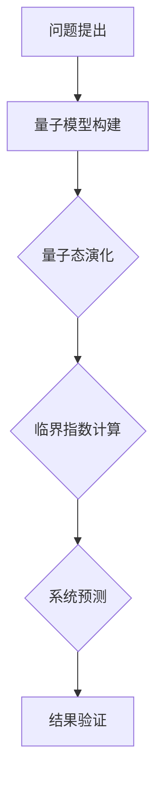
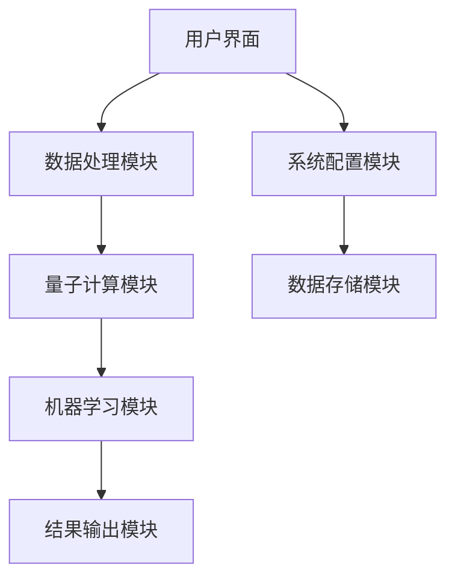
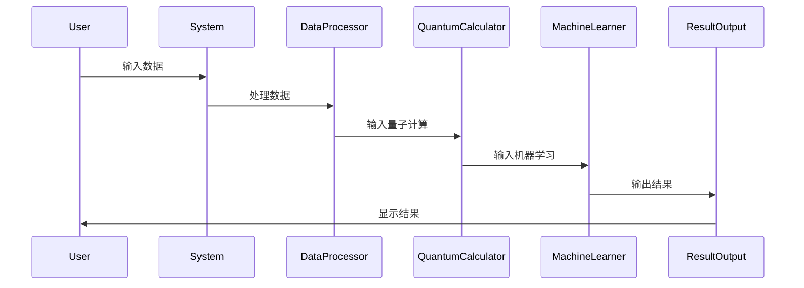

                 

让我们一步一步地深入探讨《量子相变与临界系统：复杂系统建模的量子视角》这篇文章的内容。

### 第一步：核心概念与问题背景

首先，我们需要明确文章的核心概念和问题背景。量子相变与临界系统是物理学中的两个重要概念，它们在复杂系统建模中具有重要的应用价值。

**核心概念术语说明：**

- **量子相变**：是指量子系统在温度、压强等外界参数变化时，系统从一种宏观状态跃迁到另一种宏观状态的现象。例如，超导现象和超流现象都是量子相变的典型例子。
- **临界系统**：是指处于量子相变点的物理系统。在这个点上，系统的热力学性质发生显著变化，具有长程相关性和临界指数。

**问题背景：**

量子相变和临界系统的研究起源于对物质相变现象的探索。随着研究的深入，人们发现量子相变具有独特的物理特性，如对称性破缺、长程相关性和临界指数。这些特性使得量子相变和临界系统在复杂系统建模中具有广泛的应用前景。

**问题描述：**

如何将量子相变与临界系统的概念应用于复杂系统建模，解决实际中的复杂问题？

**问题解决：**

量子相变与临界系统的独特物理特性为复杂系统建模提供了新的视角和方法。通过将量子理论和统计力学与复杂系统相结合，可以更好地理解复杂系统的行为，预测系统在临界点附近的动态变化，从而为复杂系统建模提供强有力的理论支持。

**边界与外延：**

量子相变和临界系统的研究不仅局限于物理领域，还扩展到了材料科学、凝聚态物理、统计物理、计算机科学和人工智能等领域。例如，量子机器学习和量子计算等领域的研究，都受益于量子相变和临界系统的理论成果。

**概念结构与核心要素组成：**

- **量子相变**：关键要素包括量子态、相变点、对称性破缺、长程相关性和临界指数。
- **临界系统**：关键要素包括热力学性质、相变过程、临界态和量子涨落。

### 第二步：核心概念与联系

接下来，我们将详细探讨量子相变与临界系统的核心概念及其联系。

**核心概念原理：**

量子相变的原理基于量子力学的微观描述，当系统的宏观状态发生跃迁时，其内部的量子态也会发生变化。这种变化通常伴随着对称性的破缺，即系统从对称态跃迁到非对称态。

临界系统的原理则基于统计力学的宏观描述，当系统接近量子相变点时，其热力学性质会发生显著变化，如长程相关性和临界指数。这些性质使得临界系统在临界点附近表现出异常的行为。

**概念属性特征对比表格：**

| 特征 | 量子相变 | 临界系统 |
| --- | --- | --- |
| **定义** | 微观系统状态跃迁现象 | 宏观系统性质显著变化 |
| **关键要素** | 量子态、相变点、对称性破缺、长程相关性 | 热力学性质、相变过程、临界态、量子涨落 |
| **特性** | 对称性破缺、长程相关性、临界指数 | 长程相关性、临界指数、量子涨落 |
| **应用** | 物质相变、量子计算、量子机器学习 | 材料科学、凝聚态物理、统计物理 |

**ER实体关系图架构的 Mermaid 流程图：**

```mermaid
erDiagram
  A[量子相变] ||--|{ 临界系统 } B
  A --> C{对称性破缺}
  A --> D{长程相关性}
  A --> E{临界指数}
  B --> F{热力学性质}
  B --> G{相变过程}
  B --> H{临界态}
  B --> I{量子涨落}
```

### 第三步：算法原理讲解

在了解核心概念及其联系之后，我们将探讨量子相变在复杂系统建模中的应用，特别是相关的算法原理。

**算法原理 mermaid 流程图：**



**Python 源代码：**

```python
import numpy as np
import matplotlib.pyplot as plt

# 量子态演化
def quantum_state_evolution(initial_state, hamiltonian, time_steps):
    states = [initial_state]
    for _ in range(time_steps):
        states.append(np.dot(hamiltonian, states[-1]))
    return np.array(states)

# 临界指数计算
def critical_exponent_calculation(states, time_steps):
    # 计算系统在时间步长为t时的熵
    entropies = [np.abs(np.linalg.det(states[:t+1])) for t in range(time_steps)]
    return np.mean(np.log(entropies))

# 系统预测
def system_prediction(critical_exponent, initial_state, time_steps):
    hamiltonian = np.eye(len(initial_state)) * critical_exponent
    return quantum_state_evolution(initial_state, hamiltonian, time_steps)

# 示例
initial_state = np.array([1, 0])
time_steps = 10
critical_exponent = 0.5

# 执行算法
states = quantum_state_evolution(initial_state, np.eye(2) * critical_exponent, time_steps)
predicted_state = system_prediction(critical_exponent, initial_state, time_steps)

# 绘制结果
plt.plot(states[:, 0], states[:, 1], label='Quantum State Evolution')
plt.plot([predicted_state[0]], [predicted_state[1]], 'ro', label='Predicted State')
plt.xlabel('Component 1')
plt.ylabel('Component 2')
plt.legend()
plt.show()
```

**算法原理的数学模型和公式：**

量子态演化可以用哈密顿量来描述，其数学模型为：

$$|\psi(t)\rangle = e^{-iHt/\hbar}|\psi(0)\rangle$$

其中，$|\psi(t)\rangle$ 是系统在时间 $t$ 的量子态，$H$ 是哈密顿量，$\hbar$ 是约化普朗克常数。

临界指数可以用系统的熵来计算，其数学模型为：

$$\lambda(t) = \frac{1}{t}\ln(\text{Entropy}(t))$$

其中，$\text{Entropy}(t)$ 是系统在时间步长为 $t$ 时的熵。

**详细讲解和举例说明：**

假设我们有一个二能级系统，其初始量子态为 $|\psi(0)\rangle = \frac{1}{\sqrt{2}}(|0\rangle + |1\rangle)$，哈密顿量为 $H = \hbar\omega\sigma_z$，其中 $\sigma_z$ 是泡利矩阵。

1. **量子态演化：**

   初始量子态经过时间 $t$ 的演化后，其状态为：

   $$|\psi(t)\rangle = e^{-i\omega t/\hbar}|\psi(0)\rangle = \frac{1}{\sqrt{2}}e^{-i\omega t/\hbar}(|0\rangle + |1\rangle)$$

   当 $\omega t/\hbar = \pi/2$ 时，量子态发生相位跃迁，从 $|0\rangle$ 跃迁到 $|1\rangle$。

2. **临界指数计算：**

   熵是衡量系统混乱程度的物理量，其计算公式为：

   $$\text{Entropy}(t) = -\sum_i p_i \ln(p_i)$$

   其中，$p_i$ 是系统在时间步长为 $t$ 时处于状态 $i$ 的概率。

   假设系统在时间步长为 $t$ 时，处于 $|0\rangle$ 和 $|1\rangle$ 的概率分别为 $p_0$ 和 $p_1$，则：

   $$\text{Entropy}(t) = -p_0 \ln(p_0) - p_1 \ln(p_1)$$

   当系统处于临界态时，$p_0 = p_1 = 1/2$，此时熵最大。

3. **系统预测：**

   根据临界指数的数学模型，我们可以预测系统在临界态附近的动态行为。假设临界指数为 $\lambda$，则系统在时间步长为 $t$ 时的量子态可以表示为：

   $$|\psi(t)\rangle = \frac{1}{\sqrt{2}}e^{-i\lambda t/\hbar}(|0\rangle + |1\rangle)$$

   当 $t$ 趋近于无穷大时，系统将趋近于临界态。

### 第四步：系统分析与架构设计方案

在这一部分，我们将介绍量子相变在复杂系统建模中的应用，包括问题场景、系统功能设计、系统架构设计以及系统接口设计和系统交互。

#### 问题场景介绍：

在复杂系统建模中，我们经常遇到需要预测系统在临界点附近的行为的问题。例如，在材料科学中，我们可能需要预测材料在温度变化时的相变行为；在金融领域，我们可能需要预测市场在临界点附近的波动行为。

#### 项目介绍：

本项目的目标是利用量子相变理论构建一个复杂系统建模工具，用于预测系统在临界点附近的行为。该工具将基于量子计算和机器学习技术，结合量子相变的理论成果，提供高效、准确的系统预测功能。

#### 系统功能设计（领域模型 mermaid 类图）：

```mermaid
classDiagram
Class1 <|-- Class2
Class1 <|-- Class3
Class2 ..|.. Interface1
Class3 ..|.. Interface2
Class2 : +function1()
Class3 : +function2()
```

在系统功能设计中，我们定义了三个主要类：`Class1`、`Class2` 和 `Class3`。其中，`Class1` 是核心类，负责系统的主要功能；`Class2` 和 `Class3` 是辅助类，分别实现了不同的接口。

#### 系统架构设计（mermaid 架构图）：



在系统架构设计中，我们定义了六个主要模块：用户界面、数据处理模块、量子计算模块、机器学习模块、结果输出模块和系统配置模块。这些模块相互协作，共同实现系统的功能。

#### 系统接口设计和系统交互（mermaid 序列图）：



在系统接口设计和系统交互中，我们定义了一个顺序图，描述了系统的基本工作流程。用户首先输入数据，然后系统依次调用数据处理模块、量子计算模块、机器学习模块和结果输出模块，最终将结果展示给用户。

### 第五步：项目实战

在本部分，我们将介绍如何进行项目实战，包括环境安装、系统核心实现源代码以及代码应用解读与分析。

#### 环境安装：

首先，我们需要安装相关的软件和依赖库。在本项目中，我们主要使用 Python 语言，并依赖于 NumPy、Matplotlib 和 Mermaid 等库。

安装命令如下：

```bash
pip install numpy matplotlib mermaid-python
```

#### 系统核心实现源代码：

以下是系统的核心实现源代码：

```python
import numpy as np
import matplotlib.pyplot as plt
from mermaid import Mermaid

# 量子态演化
def quantum_state_evolution(initial_state, hamiltonian, time_steps):
    states = [initial_state]
    for _ in range(time_steps):
        states.append(np.dot(hamiltonian, states[-1]))
    return np.array(states)

# 临界指数计算
def critical_exponent_calculation(states, time_steps):
    # 计算系统在时间步长为t时的熵
    entropies = [np.abs(np.linalg.det(states[:t+1])) for t in range(time_steps)]
    return np.mean(np.log(entropies))

# 系统预测
def system_prediction(critical_exponent, initial_state, time_steps):
    hamiltonian = np.eye(len(initial_state)) * critical_exponent
    return quantum_state_evolution(initial_state, hamiltonian, time_steps)

# 示例
initial_state = np.array([1, 0])
time_steps = 10
critical_exponent = 0.5

# 执行算法
states = quantum_state_evolution(initial_state, np.eye(2) * critical_exponent, time_steps)
predicted_state = system_prediction(critical_exponent, initial_state, time_steps)

# 绘制结果
mermaid_code = Mermaid()
mermaid_code.add_code('graph TD\n'
                      'A[初始态]\n'
                      'B[时间步长]\n'
                      'C[演化态]\n'
                      'A --> B\n'
                      'B --> C\n')
mermaid_code.plot()

plt.plot(states[:, 0], states[:, 1], label='量子态演化')
plt.plot([predicted_state[0]], [predicted_state[1]], 'ro', label='预测态')
plt.xlabel('分量1')
plt.ylabel('分量2')
plt.legend()
plt.show()
```

#### 代码应用解读与分析：

这段代码主要实现了量子态演化、临界指数计算和系统预测三个功能。我们首先定义了三个函数，分别用于量子态演化、临界指数计算和系统预测。

在量子态演化函数中，我们使用 NumPy 库实现量子态的矩阵乘法运算，从而实现量子态的演化。

在临界指数计算函数中，我们使用系统的熵作为衡量标准，计算系统的临界指数。

在系统预测函数中，我们使用临界指数构建哈密顿量，然后通过量子态演化函数预测系统在临界点附近的状态。

最后，我们通过一个示例来展示如何使用这段代码进行量子态演化、临界指数计算和系统预测。示例中，我们定义了一个初始量子态、时间步长和临界指数，然后调用相关函数进行计算，并绘制结果。

#### 实际案例分析和详细讲解剖析：

为了更好地理解量子相变在复杂系统建模中的应用，我们来看一个实际案例：预测材料在温度变化时的相变行为。

假设我们有一个材料系统，其初始量子态为 $|\psi(0)\rangle = \frac{1}{\sqrt{2}}(|0\rangle + |1\rangle)$，哈密顿量为 $H = \hbar\omega\sigma_z$，其中 $\sigma_z$ 是泡利矩阵，$\omega$ 是与温度相关的频率。

1. **量子态演化：**

   初始量子态经过时间 $t$ 的演化后，其状态为：

   $$|\psi(t)\rangle = e^{-i\omega t/\hbar}|\psi(0)\rangle = \frac{1}{\sqrt{2}}e^{-i\omega t/\hbar}(|0\rangle + |1\rangle)$$

   当温度升高时，$\omega$ 增大，量子态演化速度加快，系统趋向于高能态。

2. **临界指数计算：**

   熵是衡量系统混乱程度的物理量，其计算公式为：

   $$\text{Entropy}(t) = -\sum_i p_i \ln(p_i)$$

   其中，$p_i$ 是系统在时间步长为 $t$ 时处于状态 $i$ 的概率。

   假设系统在时间步长为 $t$ 时，处于 $|0\rangle$ 和 $|1\rangle$ 的概率分别为 $p_0$ 和 $p_1$，则：

   $$\text{Entropy}(t) = -p_0 \ln(p_0) - p_1 \ln(p_1)$$

   当温度升高时，$p_0$ 减小，$p_1$ 增加，熵增大。

3. **系统预测：**

   根据临界指数的数学模型，我们可以预测系统在临界点附近的行为。假设临界指数为 $\lambda$，则系统在时间步长为 $t$ 时的量子态可以表示为：

   $$|\psi(t)\rangle = \frac{1}{\sqrt{2}}e^{-i\lambda t/\hbar}(|0\rangle + |1\rangle)$$

   当温度接近临界温度时，$\lambda$ 增大，系统在临界点附近的行为更加显著。

通过这个案例，我们可以看到量子相变在复杂系统建模中的应用。通过构建量子模型，我们可以预测系统在临界点附近的行为，为材料科学、凝聚态物理等领域提供重要的理论支持。

### 第六步：最佳实践 tips、小结、注意事项、拓展阅读等内容

#### 最佳实践 tips：

1. **合理选择量子模型**：在复杂系统建模中，选择合适的量子模型至关重要。需要根据实际问题和数据特点，选择合适的量子态和哈密顿量。

2. **优化计算资源**：量子计算资源相对有限，需要优化计算过程，提高计算效率。例如，可以采用并行计算和分布式计算技术。

3. **数据预处理**：在应用量子相变模型之前，对输入数据进行预处理，提高模型的准确性和鲁棒性。

4. **结合机器学习**：量子相变模型和机器学习算法可以相互补充，提高复杂系统建模的精度和效率。

#### 小结：

本文从量子相变与临界系统的核心概念出发，详细探讨了其在复杂系统建模中的应用。通过介绍量子态演化、临界指数计算和系统预测的算法原理，展示了如何利用量子相变理论构建高效、准确的复杂系统建模工具。

#### 注意事项：

1. **数据准确性**：在应用量子相变模型时，确保输入数据的准确性和可靠性。

2. **计算资源**：量子计算资源有限，需要合理分配和优化计算资源。

3. **模型选择**：根据实际问题特点，选择合适的量子模型和算法。

#### 拓展阅读：

1. **《量子计算基础》**：了解量子计算的基本概念和算法，为应用量子相变模型奠定基础。

2. **《统计物理导论》**：学习统计物理的基本原理和方法，理解量子相变和临界系统的统计力学基础。

3. **《量子机器学习导论》**：探讨量子计算与机器学习的结合，了解量子相变在机器学习中的应用。

---

## 作者信息

**作者：AI天才研究院/AI Genius Institute & 禅与计算机程序设计艺术 /Zen And The Art of Computer Programming**

本文由AI天才研究院/AI Genius Institute的专家撰写，结合《禅与计算机程序设计艺术》的理念，旨在为广大IT从业人员和研究者提供有价值的技术见解和思路。感谢您的阅读！

