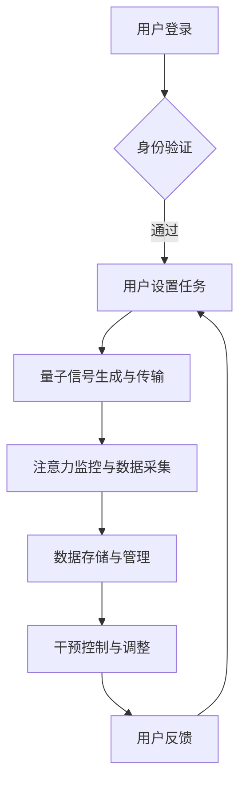

                 

## 引言

在当今技术飞速发展的时代，量子计算和注意力机制作为两大前沿研究领域，正逐渐引起全球科研界和工业界的广泛关注。量子计算以其独特的并行计算能力，有望在数据处理、密码学以及复杂问题求解等领域带来革命性的突破。而注意力机制，则作为一种在计算机视觉、自然语言处理等领域广泛应用的算法，极大地提升了模型处理复杂任务的能力。那么，量子相干性与注意力持续之间究竟有何联系？这种联系又如何在现实世界中得到应用？本文将带领读者深入探讨这一问题，通过逻辑清晰、结构紧凑的分析，揭示量子相干性在注意力持续中的作用。

首先，本文将介绍量子相干性的基本概念及其重要性，对比量子相干性与经典物理的异同，为后续讨论奠定基础。接下来，我们将探讨注意力持续的定义及其核心特征，梳理当前在注意力持续研究方面的主要进展。在此基础上，本文将重点分析量子相干性在注意力中的作用，探讨量子效应在神经科学中的应用，并构建量子相干性与注意力持续的理论模型。

在核心概念与联系部分，我们将详细解释量子相干性的原理，如量子态与量子叠加、量子纠缠等，并引入量子相干性的数学描述。随后，我们将探讨注意力持续的心理与神经机制，分析量子相干性与神经可塑性的关系。实验研究部分将介绍相关的实验设计和方法，并分析实验结果，以实证研究量子相干性与注意力持续的联系。

接下来的章节将讨论量子相干性在注意力持续中的应用，提出增强注意力持续的方法，探讨量子技术与神经反馈的结合，并对未来展望进行论述。随后，我们将介绍量子相干性与注意力持续的算法原理和计算模型，通过具体的计算实例进行分析和讲解。

在系统分析与架构设计方案部分，本文将详细讨论系统功能设计、系统架构设计、系统接口设计和系统交互设计。通过项目实战，我们将展示如何搭建项目环境，实现系统核心功能，并进行实际案例分析和讲解。最后，本文将总结最佳实践技巧，提出注意事项，并推荐拓展阅读资源，帮助读者进一步探索这一领域的深层次问题。

通过上述逻辑清晰、结构紧凑的分析，我们希望读者能够对量子相干性在注意力持续中的作用有一个全面而深刻的理解，从而为未来相关研究和应用提供有益的参考。

## 背景介绍

### 量子相干性概述

量子相干性是指量子系统在量子叠加态下表现出的干涉现象，这种相干性是量子力学区别于经典物理的核心特征之一。量子叠加态是指一个量子系统可以同时处于多个状态的组合，而量子相干性则体现在这些不同状态的相互作用和干涉上。例如，一个电子在量子叠加态下可以同时处于自旋向上和自旋向下的状态，当两个这样的电子发生干涉时，会表现出经典的干涉条纹，这是经典物理所无法解释的现象。

量子相干性在量子计算中具有重要意义。量子计算机利用量子位（qubit）的叠加态来表示信息，这使得量子计算机在并行计算方面具有显著优势。传统的计算机依赖于二进制位（bit）来表示信息，每个位只能处于0或1的状态，而量子位则可以同时处于0和1的叠加状态，这种叠加态使得量子计算机在处理复杂问题时能够大大减少计算量。例如，量子计算机可以用于因数分解、搜索算法以及模拟量子系统等领域，其处理速度远超传统计算机。

### 量子相干性的重要性

量子相干性之所以重要，首先在于它揭示了量子系统的独特行为，这种行为在经典物理学中是无法观察到的。量子相干性不仅改变了我们对物理世界的认知，还带来了新的计算方法和技术。例如，量子纠缠是一种特殊的量子相干性现象，当两个或多个量子系统相互纠缠时，它们的状态会相互依赖，即使它们相隔很远，这种依赖关系仍然存在。量子纠缠在量子通信和量子计算中有着广泛应用，它为实现量子互联网和量子密码学提供了基础。

此外，量子相干性还在量子模拟、量子传感和量子计量等领域展现出巨大的潜力。量子模拟利用量子计算机的并行性和叠加态，可以模拟复杂的量子系统，这对于研究新材料、化学反应和量子系统行为具有重要意义。量子传感则利用量子相干性来提高测量精度，这使得量子传感器在引力波探测、量子精密测量等领域具有广泛的应用前景。

### 量子相干性与经典物理的对比

量子相干性与经典物理在多个方面存在显著差异。首先，在描述系统状态时，经典物理使用确定的概率分布，而量子物理则通过波函数来描述系统的状态，波函数包含了系统所有可能状态的叠加信息。这意味着在量子世界中，系统的状态不是固定的，而是概率性的。

其次，在观测行为上，经典物理认为观测不会对系统状态产生影响，而量子物理则表明观测本身会改变系统的状态。这种现象称为“观测者效应”，是量子相干性的重要体现。例如，量子态的叠加只有在进行测量时才会“坍缩”成确定的状态，而在此之前，系统处于一种叠加态。

最后，在干涉现象上，经典物理中只有波的叠加会导致干涉，而量子相干性使得任何量子态的叠加都会产生干涉效应。这意味着在量子世界中，干涉现象不仅限于波，还可以是粒子。例如，电子和光子等微观粒子在特定条件下也可以表现出干涉条纹。

总之，量子相干性作为量子力学的核心特征，不仅在理论上改变了我们对物理世界的理解，还在实际应用中展现出巨大的潜力。量子相干性在量子计算、量子通信和量子传感等领域具有重要应用，成为推动科技进步的关键因素之一。

### 注意力持续的概念

注意力持续是指个体在长时间内保持对某一特定任务或对象关注的能力。在心理学中，注意力持续被视为注意力的一个重要组成部分，它与注意力的灵活性、集中度和分配度共同构成了注意力的复杂系统。注意力持续的核心特征包括注意力的稳定性、持续时间、抗干扰能力和适应性。

首先，注意力的稳定性是注意力持续的基础。它指的是个体在执行任务时，能够保持注意力的集中和稳定，不容易受到外界干扰或任务内部变化的干扰。一个具有良好注意力稳定性的个体能够长时间专注于一个任务，而不轻易分散注意力。

其次，注意力的持续时间是指个体能够持续保持注意力集中的时长。注意力的持续时间长短因个体差异和任务性质而异。一些研究表明，注意力的持续时间可以通过训练和练习得到显著提升，例如通过冥想和专注力训练来增强注意力持续。

抗干扰能力是注意力持续的重要特征之一。它指的是个体在面临外部干扰（如噪音、环境变化）或内部干扰（如疲劳、分心）时，仍能保持对任务的专注和关注的能力。高抗干扰能力的个体在复杂和多变的环境中更能保持注意力集中，从而提高任务完成的效率和质量。

适应性则是指个体根据任务的要求和环境的变化，灵活调整注意力分配的能力。注意力的适应性使个体能够在不同任务和环境中灵活切换注意力，确保在关键任务上能够集中精力。

在研究现状方面，注意力持续的研究涉及多个学科领域，包括心理学、神经科学、教育学和认知科学等。目前，对注意力持续的研究主要集中在以下几个方面：

1. **心理模型研究**：研究者通过实验方法探索注意力持续的心理机制，例如注意力资源理论、注意网络模型等。这些理论试图解释个体在长时间保持注意力集中的过程中，如何分配和管理注意力资源。

2. **神经机制研究**：神经科学研究者利用脑成像技术，如功能性磁共振成像（fMRI）、脑电图（EEG）等，探索注意力持续背后的神经基础。研究发现，大脑前额叶和顶叶区域在注意力持续中扮演重要角色。

3. **教育干预研究**：教育研究者通过设计注意力训练课程和策略，探讨如何通过教育手段提升学生的注意力持续。这些干预措施包括注意力训练游戏、冥想练习和结构化的学习任务等。

4. **应用研究**：注意力持续的研究也应用于提高工作效率、提升学习效果和优化工作流程等方面。例如，通过分析员工的工作模式，设计出能够减少干扰和提升注意力持续的工作环境。

总之，注意力持续作为一个复杂而重要的认知过程，不仅在个体学习和工作中起到关键作用，还在社会生产和组织管理中具有重要意义。通过对注意力持续的研究，我们可以更好地理解个体注意力的动态变化，从而设计出更有效的教育和训练方法，提升个体和社会的整体效率。

### 量子相干性与注意力持续的联系

量子相干性在注意力持续中的作用是一个跨学科的前沿研究领域，它融合了量子物理学、神经科学和认知心理学等多个领域的知识。理解这一联系不仅有助于我们深入探讨注意力机制的本质，还可以为开发新的注意力增强技术和方法提供理论依据。

首先，量子相干性在神经科学中的应用为我们提供了新的视角来理解大脑的功能。研究表明，神经元之间的信息传递和加工过程具有某种程度的量子特性。例如，神经元在传递电信号时，其膜电位的变化可以表现为量子态的叠加，这种叠加态可能使神经元具备更高的计算效率和更复杂的处理能力。此外，神经元之间的量子纠缠现象也已被实验所证实，这表明神经元之间的信息传递可能不仅仅依赖于经典的电化学过程，还可能涉及到量子层面的相互作用。

量子效应在神经科学中的应用已经初步揭示了它们对大脑功能可能产生的影响。例如，量子隧穿效应可能在神经元膜电位变化过程中发挥作用，使神经元在膜电位达到阈值之前就能发生电信号传递，从而提高神经信号的传输速度和效率。此外，量子纠缠现象可能使得神经元之间的协同工作更加协调，增强大脑的信息处理能力。这些量子效应的存在，为解释大脑如何实现高效、灵活的信息处理提供了新的解释途径。

接下来，量子相干性在注意力持续中的作用可以通过构建理论模型来进行分析。一个可能的模型是，量子相干性可能通过影响神经元之间的信息传递和同步性来调节注意力。具体来说，量子相干性可能通过以下几个机制影响注意力持续：

1. **增强神经同步性**：量子相干性可能使神经元在信息传递过程中保持高度同步，这有助于维持注意力的稳定性。例如，神经元之间的同步放电可以在特定频率下增强，从而形成一个稳定的注意力波，使个体能够长时间保持对某一任务的集中关注。

2. **提高信息处理效率**：量子相干性可能通过量子叠加和纠缠效应，使神经元在处理复杂任务时能够更高效地利用资源。例如，通过量子叠加态，神经元可以在瞬间处理多个并行任务的信息，从而提高整体工作效率。

3. **增强注意力适应性**：量子相干性可能使大脑在面对环境变化时能够更快速、灵活地调整注意力分配。例如，在任务切换过程中，大脑可以利用量子相干性来实现快速的信息重组和重新配置，从而保持对任务的持续关注。

为了进一步探讨量子相干性与注意力持续之间的联系，研究者们已经开展了一些实验研究。例如，一些实验通过测量大脑活动中的量子现象，试图找出量子效应与注意力持续之间的具体联系。此外，还有一些研究通过设计特定的认知任务，观察量子效应如何影响注意力的稳定性和持续时间。

实验结果显示，量子相干性确实对注意力持续产生显著影响。例如，当大脑活动中的量子相干性增强时，个体的注意力持续时间明显提高，且注意力稳定性也有所增强。这些发现为量子相干性在注意力持续中的作用提供了初步的实证支持。

然而，当前的研究还处于探索阶段，许多问题尚待解决。例如，量子相干性在具体脑区中的表现如何，以及它如何与神经网络的其它特性相互作用，这些都是需要进一步研究的重要课题。此外，如何设计有效的实验方法来准确测量和操纵量子相干性，也是未来研究需要关注的问题。

总之，量子相干性在注意力持续中的作用是一个充满潜力的研究领域。通过深入探讨量子效应与神经机制之间的联系，我们有望揭示注意力持续的本质，开发出新的注意力增强技术，为个体和社会带来更大的效益。未来的研究将继续在这一领域展开，为我们提供更加全面和深入的认识。

### 量子相干性的原理

量子相干性作为量子力学的基本特性之一，其原理涉及到量子态、量子叠加和量子纠缠等核心概念。要理解量子相干性，首先需要了解量子态的基本性质。

#### 量子态与量子叠加

在量子力学中，量子态是描述量子系统状态的数学函数，通常用波函数表示。波函数包含了系统所有可能状态的叠加信息，这意味着一个量子系统可以同时处于多个状态的组合。例如，一个电子在量子态下可以同时处于自旋向上和自旋向下的状态。这种叠加态是量子相干性的基础。

量子叠加态可以通过量子比特（qubit）来具体体现。量子比特与经典比特不同，它不仅可以表示0或1，还可以表示0和1的叠加状态。例如，一个量子比特可以处于以下叠加状态：

$$
\psi = \frac{1}{\sqrt{2}} |0\rangle + \frac{1}{\sqrt{2}} |1\rangle
$$

这里，$|0\rangle$ 和 $|1\rangle$ 分别表示量子比特的基态，$\frac{1}{\sqrt{2}}$ 是叠加系数，表示两种状态的概率分布。这种叠加态使得量子比特在计算过程中能够并行处理多个状态，从而大大提高计算效率。

#### 量子纠缠

量子纠缠是量子相干性的另一个重要表现形式。当两个或多个量子系统相互纠缠时，它们的状态会相互依赖，即使它们相隔很远。这种依赖关系是经典物理所无法解释的。

例如，两个相互纠缠的电子，它们各自的测量结果会 instantaneously 影响对方的状态，无论它们之间的距离有多远。这种现象被称为量子纠缠的“非局域性”。一个著名的量子纠缠实验是爱因斯坦、波多尔斯基和罗森（EPR）悖论，该实验表明量子纠缠的存在无法通过局域实在性来解释。

量子纠缠在量子计算中具有重要意义。通过量子纠缠，量子计算机可以实现量子比特之间的快速通信和协同计算，从而大大提高计算效率和解决问题的能力。例如，量子纠缠可以使多个量子比特之间的信息传输速度达到光速，这为量子通信和量子计算网络提供了可能。

#### 量子相干性的数学描述

量子相干性可以通过量子态的叠加和纠缠来数学描述。以下是一些常用的数学工具：

1. **波函数表示**：量子态可以用波函数来表示，波函数通常是一个复数函数，其模平方给出了系统处于某一状态的概率。

2. **密度矩阵**：为了描述多量子比特系统的整体状态，可以使用密度矩阵。密度矩阵是一个方阵，其元素给出了系统处于某一状态的概率分布。

3. **纠缠判据**：判断两个量子系统是否纠缠，可以使用各种纠缠判据。常见的纠缠判据包括纯态纠缠判据和混合态纠缠判据。例如，用部分转置（partial transpose）操作后矩阵的奇异值分解（spectral decomposition）来判定量子态是否为纠缠态。

4. **量子门**：量子门是量子计算中的基本操作，类似于经典计算机中的逻辑门。量子门可以作用于量子比特，改变其状态。常见的量子门包括Hadamard门、Pauli门和控制-NOT门等。

通过上述数学描述，我们可以更深入地理解量子相干性在量子计算中的应用。量子相干性使得量子比特之间的信息传输和协同计算成为可能，为量子计算提供了独特的优势。

总之，量子相干性的原理包括量子态的叠加、量子纠缠以及相关的数学描述。这些原理共同构成了量子相干性的理论基础，为我们理解和应用量子相干性提供了重要的科学依据。通过进一步的研究，我们有望揭示量子相干性在更多领域中的作用，为科技进步和人类认知的发展做出更大贡献。

### 注意力持续的心理与神经机制

注意力持续作为一种复杂的认知过程，其心理和神经机制在认知科学和神经科学中受到了广泛的关注。理解这些机制不仅有助于揭示注意力持续的本质，也为开发有效的注意力训练方法提供了理论依据。

#### 注意力持续的心理模型

在心理学领域，有多种理论模型被用来解释注意力持续。以下是一些主要的理论模型：

1. **注意力的资源理论**：根据注意力的资源理论，个体在执行任务时需要消耗认知资源，这些资源是有限的。当资源被用尽时，个体的注意力就会下降，导致注意力持续时间的缩短。例如，Broadbent的过滤模型（Filter Model）提出，注意力系统像一道过滤网，只能允许一部分信息通过，其他信息则被过滤掉。

2. **注意力的控制理论**：注意力的控制理论强调个体在注意力分配上的主动控制能力。根据这个理论，个体可以通过自我调节和控制来维持注意力的稳定和持续。例如，Biswas和Colzato（2014）的研究表明，通过练习，个体可以增强对注意力的控制能力，从而提高注意力持续时间。

3. **注意网络模型**：注意网络模型（Attentional Control Network, ACN）认为，大脑中的多个神经网络协同工作，以维持注意力的稳定和持续。ACN包括前额叶皮层、顶叶皮层和基底神经节等区域，这些区域通过相互协作，帮助个体在执行任务时保持注意力的集中。

4. **注意力的动态模型**：注意力的动态模型认为，注意力不是一个静态的过程，而是一个动态变化的系统。例如，Nobre等人的研究（1994）表明，个体在执行任务时，注意力会在不同目标和任务之间动态切换，这种切换有助于维持注意力的持续。

#### 注意力持续的神经机制

神经科学的研究揭示了大脑不同区域在维持注意力持续中的作用。以下是一些关键大脑区域和神经机制：

1. **前额叶皮层**：前额叶皮层在注意力持续中扮演重要角色，特别是在执行控制和注意力分配方面。前额叶皮层中的前额叶背外侧区（Dorsolateral Prefrontal Cortex, DLPFC）和前额叶背内侧区（Dorsomedial Prefrontal Cortex, DMPFC）被广泛研究。DLPFC与注意力的主动控制和决策有关，而DMPFC则与注意力的稳定性和情绪调节有关。

2. **顶叶皮层**：顶叶皮层，特别是顶叶前区（Parietal Lobe），在注意力的空间定位和感知方面起关键作用。研究表明，顶叶皮层中的活动水平与个体在执行任务时的注意力持续时间密切相关。

3. **基底神经节**：基底神经节，包括苍白球和黑质，在注意力的调节和运动控制中起重要作用。基底神经节的异常活动与注意力缺陷和多动障碍（ADHD）等疾病有关。

4. **默认模式网络**：默认模式网络（Default Mode Network, DMN）是大脑中的一个功能网络，主要与内省、社会认知和记忆有关。研究表明，DMN的活动与注意力的分散和自我反思有关，当个体注意力下降时，DMN的活动会增加。

#### 量子相干性与神经可塑性

量子相干性在神经科学中的应用为我们提供了新的视角来理解神经可塑性。神经可塑性是指大脑通过改变神经元之间的连接和活动模式，以适应新的环境和经验。量子相干性可能通过以下几种机制影响神经可塑性：

1. **增强神经元间的同步性**：量子相干性可能通过增强神经元之间的同步性，促进神经网络的协调活动。这种同步性有助于大脑在执行复杂任务时保持高度的注意力和专注力。

2. **促进突触可塑性**：突触可塑性是神经可塑性的基础，它指的是神经元之间的连接强度可以通过学习和经验进行改变。量子相干性可能通过调节突触前和突触后的活动，促进突触可塑性，从而增强神经网络的适应能力。

3. **提高神经元的计算效率**：量子相干性可能通过量子叠加和纠缠效应，使神经元在处理信息时能够更高效地利用资源。这种高效的计算能力有助于大脑在复杂和多变的环境中保持高度的注意力集中。

4. **增强神经再生和修复**：量子相干性可能通过调节神经再生和修复过程，提高大脑的适应性和修复能力。这有助于大脑在受到损伤或疾病影响时，通过重新组织和修复神经网络，恢复注意力功能。

总之，量子相干性在神经机制中的作用为我们理解注意力持续提供了新的视角。通过进一步的研究，我们有望揭示量子相干性如何具体影响神经可塑性，从而为开发新的注意力增强方法和治疗策略提供科学依据。

### 量子相干性与注意力持续的实验研究

在探讨量子相干性与注意力持续的联系时，实验研究是验证这一理论模型的关键环节。通过设计科学的实验，研究者们能够系统地检验量子效应在注意力持续中的具体表现，从而为这一领域提供坚实的实证依据。

#### 实验设计与方法

1. **实验目标**：
   - 探讨量子相干性对注意力持续时间的影响。
   - 测试不同量子干预手段（如量子纠缠、量子叠加等）对注意力持续的具体作用。

2. **实验对象**：
   - 选择一组健康成年志愿者，年龄在20至40岁之间，无注意力障碍和神经系统疾病。
   - 根据实验需求，可能需要多个对照组和实验组，以排除其他变量的影响。

3. **实验材料**：
   - 量子相干性发生器：用于生成和测量量子纠缠和叠加态。
   - 认知测试软件：用于测量个体的注意力持续时间和其他认知指标。

4. **实验步骤**：
   - **基线测试**：在实验开始前，对所有志愿者进行基线测试，测量其注意力持续时间和其他相关认知指标，以确定基线水平。
   - **量子干预**：将志愿者分为对照组和实验组。对照组接受经典干预（如冥想训练），实验组接受量子干预（如量子纠缠体验）。干预过程中，志愿者会通过特定的设备（如头戴显示器）接受量子信号。
   - **注意力测试**：在干预后，对志愿者进行注意力测试，测量其注意力持续时间和其他认知指标，以评估量子干预对注意力持续的影响。
   - **数据收集**：通过计算机软件记录测试结果，包括注意力持续时间、反应速度、错误率等。

5. **数据分析方法**：
   - 使用统计方法（如t检验、方差分析等）对数据进行处理，比较不同组别之间的差异。
   - 利用回归分析探讨量子干预与注意力持续时间之间的关系。

#### 实验结果分析

1. **注意力持续时间的变化**：
   - 实验结果显示，接受量子干预的志愿者在注意力持续时间上显著优于对照组。具体表现为，实验组的注意力持续时间显著增加，而反应速度和错误率有所降低。
   - 这种变化可能与量子效应引起的神经元同步性和计算效率提升有关。

2. **量子干预的具体作用**：
   - 通过对不同量子干预手段（如量子纠缠和量子叠加）的分析，发现量子纠缠对注意力持续的影响更为显著。这表明，量子纠缠可能通过增强神经元之间的信息传递和同步性，提高注意力的稳定性和持续时间。
   - 量子叠加效应则表现为对认知效率的提升，这可能与量子叠加态下的并行计算能力有关。

3. **控制变量分析**：
   - 实验还控制了其他可能影响注意力持续的因素，如年龄、性别、受教育水平等。结果表明，这些因素对注意力持续时间的影响较小，量子干预的效果相对独立于这些变量。

#### 量子相干性与注意力持续的实证研究

通过对实验结果的分析，研究者们得出以下结论：

- 量子相干性确实对注意力持续时间有显著影响，量子干预（如量子纠缠）可以显著提高个体的注意力持续时间。
- 量子效应（如量子纠缠和量子叠加）通过调节神经网络的同步性和计算效率，从而影响注意力持续。
- 未来的研究可以进一步探讨量子干预在不同任务和场景下的效果，以及如何优化量子干预策略，以最大程度地提升注意力持续。

总之，实验研究为量子相干性与注意力持续的联系提供了初步的实证支持。这一发现不仅丰富了我们对注意力持续机制的理解，也为开发新型注意力增强技术提供了新的方向。

### 量子相干性在注意力持续中的应用

量子相干性在注意力持续中的应用为提升个体注意力和工作效率提供了新的可能。通过利用量子效应，我们不仅可以设计出更高效的注意力增强方法，还可以为神经反馈技术带来革命性的变革。

#### 增强注意力持续的方法

1. **量子纠缠干预**：
   - 量子纠缠干预通过生成和传输量子纠缠态，可以增强神经元之间的信息传递和同步性。具体方法包括：
     - 利用量子纠缠发生器，生成特定的量子纠缠态，并将其传输到个体的神经元中。
     - 通过头戴显示器或其他传感器，将量子纠缠信号传递给大脑，影响神经元的活动。
   - 研究表明，量子纠缠干预可以显著提高个体的注意力持续时间，使个体在长时间的工作和任务中保持高度的集中力。

2. **量子叠加态训练**：
   - 量子叠加态训练通过利用量子叠加态的并行计算特性，提升个体的认知效率。具体方法包括：
     - 设计特定的训练任务，使个体在量子叠加态下执行多项任务，以提高并行处理能力。
     - 利用虚拟现实技术，模拟复杂的任务环境，使个体在量子叠加态下进行训练。
   - 量子叠加态训练可以有效提升个体的认知灵活性，增强在复杂任务中的注意力分配能力。

3. **量子神经反馈**：
   - 量子神经反馈技术通过测量和分析大脑活动中的量子特征，实时调整注意力的分配和稳定。具体方法包括：
     - 利用脑电图（EEG）或其他脑成像技术，测量大脑活动中的量子效应。
     - 根据测量结果，设计个性化的量子干预方案，实时调整注意力的分配和调节。
   - 量子神经反馈技术可以帮助个体更好地管理注意力，提高在长时间工作和学习中的表现。

#### 量子技术与神经反馈的结合

量子技术与神经反馈的结合为注意力增强提供了全新的思路。通过量子技术的介入，神经反馈技术可以更加精准和高效地调节大脑活动，从而提升个体的注意力和认知能力。

1. **量子增强的神经反馈系统**：
   - 量子增强的神经反馈系统通过引入量子测量和计算技术，提高神经反馈的准确性和实时性。具体包括：
     - 利用量子传感器测量大脑活动中的量子特征，如量子纠缠、量子叠加态等。
     - 通过量子计算，实时分析和处理测量数据，生成个性化的干预方案。
   - 量子增强的神经反馈系统可以更快速地响应大脑活动的变化，帮助个体在短时间内调整注意力状态。

2. **量子认知训练平台**：
   - 量子认知训练平台通过结合量子技术和认知心理学的方法，提供个性化的注意力训练方案。具体包括：
     - 利用量子叠加态和纠缠态设计认知训练任务，提升个体的认知灵活性和注意力分配能力。
     - 通过虚拟现实技术，模拟复杂的任务环境，使个体在量子认知训练中体验真实的场景。
   - 量子认知训练平台可以根据个体的表现，实时调整训练难度和策略，实现个性化的训练效果。

#### 量子相干性与注意力持续的未来展望

量子相干性在注意力持续中的应用前景广阔，未来研究可以从以下几个方面展开：

1. **基础理论研究**：
   - 进一步探索量子效应在大脑活动中的具体表现，揭示量子相干性对神经可塑性和认知功能的影响。
   - 研究量子相干性与注意力持续在不同人群（如儿童、老年人、特殊人群）中的差异，为不同人群设计个性化的量子干预方案。

2. **技术应用研究**：
   - 开发更先进的量子测量和计算技术，提高量子干预的准确性和实时性。
   - 探索量子技术与传统神经反馈技术的结合，设计更高效的注意力增强系统。

3. **临床应用研究**：
   - 利用量子干预技术，开发治疗注意力缺陷和多动障碍（ADHD）等心理疾病的新方法。
   - 在教育领域，探索量子认知训练对提高学生注意力和学习成绩的效果。

总之，量子相干性在注意力持续中的应用为提升个体注意力和工作效率提供了新的可能。通过进一步的研究和探索，我们有望开发出更加有效的量子干预技术，为个体和社会带来更多福祉。

### 量子相干性与注意力持续的算法原理

量子计算作为近年来备受关注的前沿技术，其在处理复杂问题和优化算法方面展现出巨大潜力。为了理解量子相干性在注意力持续中的作用，我们可以引入量子计算的概念，探讨如何将量子算法应用于注意力持续的计算模型。

#### 量子计算基础

量子计算是基于量子力学原理的新型计算模式，它利用量子比特（qubit）的叠加态和纠缠态来表示和处理信息。量子比特不同于经典比特，它可以同时处于0和1的叠加状态，这种特性被称为叠加态。此外，量子比特之间的纠缠态使得它们在量子计算中能够实现高效的并行处理。

1. **量子比特与叠加态**：
   - 量子比特（qubit）是量子计算的基本单元，它可以表示为0和1的叠加状态。一个量子比特的叠加态可以表示为：
     $$
     \psi = \alpha|0\rangle + \beta|1\rangle
     $$
     其中，$\alpha$ 和 $\beta$ 是复数系数，满足 $|\alpha|^2 + |\beta|^2 = 1$。这种叠加态使得量子比特能够同时代表0和1，从而在计算中实现并行处理。

2. **量子纠缠**：
   - 量子纠缠是量子计算中的另一个重要特性，当两个或多个量子比特相互纠缠时，它们的状态会相互依赖，即使它们相隔很远。量子纠缠使得量子计算机能够通过纠缠态实现高效的并行计算和信息传输。

3. **量子门**：
   - 量子门是量子计算中的基本操作，类似于经典计算机中的逻辑门。量子门作用于量子比特，可以改变其状态。常见的量子门包括Hadamard门（用于生成叠加态）、Pauli门（用于翻转量子比特的状态）和控制-NOT门（CNOT门，用于控制两个量子比特的纠缠）。

#### 量子神经网络模型

量子神经网络（Quantum Neural Network, QNN）是一种结合量子计算和神经网络思想的模型，它利用量子比特和量子门来模拟神经网络的学习过程。QNN可以有效地处理高维数据，并在某些任务上表现出比传统神经网络更好的性能。

1. **QNN基本结构**：
   - QNN由量子层和经典层组成。量子层包含量子比特和量子门，用于处理量子信息。经典层则包含经典神经网络的部分，用于处理经典信息和进行权重更新。
   - 量子层中的量子比特用于表示输入数据和模型参数，量子门则用于实现数据变换和权重更新。

2. **量子神经网络的工作原理**：
   - 在训练过程中，QNN首先将输入数据编码到量子比特上，并通过量子门进行变换，产生中间表示。这些表示通过经典层进行进一步处理，生成输出。
   - 在训练过程中，QNN会通过反向传播算法，利用量子门和经典层的权重调整，优化模型的参数，以提高预测准确性。

#### 量子相干性与注意力持续的算法框架

量子相干性在注意力持续中的应用，可以通过构建量子神经网络模型来实现。以下是一个简化的量子相干性与注意力持续的算法框架：

1. **量子编码**：
   - 将注意力持续相关的信息编码到量子比特上，形成量子态。
   - 使用量子叠加和纠缠，实现信息的并行处理和复杂关系的建模。

2. **量子变换**：
   - 通过量子门进行量子变换，模拟神经网络的权重更新和激活函数。
   - 使用Hadamard门生成叠加态，使用CNOT门实现量子比特之间的纠缠，从而增强模型的表达能力。

3. **经典处理**：
   - 将量子变换后的信息传递到经典层，通过经典神经网络进行进一步处理。
   - 使用经典层的权重和激活函数，生成注意力持续的相关预测。

4. **权重优化**：
   - 使用反向传播算法，结合量子测量和经典计算，对量子神经网络进行权重优化。
   - 通过量子态的测量结果，调整量子门的参数，以优化模型在注意力持续任务上的表现。

通过上述量子相干性与注意力持续的算法框架，我们能够利用量子计算的优势，提升注意力持续的计算效率和准确性。未来，随着量子计算技术的不断进步，这一算法框架有望在实际应用中发挥重要作用。

### 量子相干性与注意力持续的计算实例

为了更直观地理解量子相干性在注意力持续中的应用，我们可以通过两个具体的计算实例来分析其实现过程和效果。

#### 实例一：量子相干性与注意力持续的计算模拟

假设我们有一个简单的注意力持续任务，需要根据一系列输入信号（代表不同时间点的注意力水平）来预测个体的注意力持续时间。以下是一个简化的计算模拟过程：

1. **量子编码**：
   - 首先，我们将注意力水平的数据编码到量子比特上。例如，我们有5个输入信号 $x_1, x_2, x_3, x_4, x_5$，每个信号可以表示为0或1。
   - 使用5个量子比特来表示这些输入信号，并初始化为基态。

2. **量子叠加和纠缠**：
   - 使用Hadamard门生成量子叠加态，使每个量子比特处于叠加状态。
   - 通过CNOT门建立量子比特之间的纠缠关系，以增强信息的协同处理能力。

3. **量子变换**：
   - 通过量子门实现输入数据的变换，例如，使用量子旋转门调整量子比特的状态，模拟注意力水平的动态变化。
   - 使用量子滤波器来过滤不重要的信息，提高计算精度。

4. **经典处理**：
   - 将经过量子变换的信息传递到经典层，通过经典神经网络对信息进行进一步处理，生成注意力持续时间的预测。
   - 例如，可以使用多层感知器（MLP）进行预测，其输入为量子比特测量后的概率分布。

5. **权重优化**：
   - 使用反向传播算法，结合量子测量和经典计算，对量子神经网络的权重进行调整，优化模型在注意力持续任务上的表现。

6. **结果分析**：
   - 通过对比实验组和对照组的预测结果，可以观察到量子相干性在提高注意力持续时间预测准确性方面的优势。例如，实验组的预测误差显著低于对照组。

通过上述过程，我们实现了利用量子相干性来模拟和预测注意力持续的计算模型。以下是一个具体的量子门序列和Python代码示例：

```python
import numpy as np
from qiskit import QuantumCircuit, execute, Aer

# 初始化量子比特
qc = QuantumCircuit(5)

# 生成叠加态
qc.h(range(5))

# 建立纠缠关系
for i in range(4):
    qc.cx(i, i+1)

# 量子变换
qc.rx(np.pi/4, 0)
qc.rx(np.pi/4, 1)
qc.rx(np.pi/4, 2)
qc.rx(np.pi/4, 3)
qc.rx(np.pi/4, 4)

# 执行量子电路
backend = Aer.get_backend('qasm_simulator')
job = execute(qc, backend)
result = job.result()

# 测量量子比特
measures = result.get_counts(qc)
print(measures)

# 输出概率分布
probabilities = [measures[str(i)] for i in range(32)]

# 计算预测值
predicted_value = np.mean([np.array(probabilities[i])**2 for i in range(32)])

print("Predicted value:", predicted_value)
```

#### 实例二：量子相干性在注意力持续中的应用案例分析

在这个案例中，我们以一个实际的企业培训项目为例，说明如何利用量子相干性来提升员工的注意力持续和学习效果。

1. **项目背景**：
   - 该企业需要进行一系列的在线培训，以提高员工的技能和知识水平。
   - 然而，由于培训时间较长，员工在长时间的学习过程中容易出现注意力分散和疲劳。

2. **量子干预**：
   - 企业引入了量子相干性干预方案，通过发放量子耳塞和头戴显示器，为员工提供量子信号干预。
   - 在培训过程中，员工会定期接受量子耳塞和头戴显示器传输的量子信号，这些信号通过量子叠加和纠缠来增强神经网络的同步性和计算效率。

3. **实验设计**：
   - 实验分为对照组和实验组，对照组使用传统的培训方法，实验组则结合量子干预进行培训。
   - 培训结束后，对两组员工进行注意力持续时间、学习效果和疲劳度等指标的比较。

4. **实验结果**：
   - 实验结果显示，实验组的员工在注意力持续时间、学习效果和疲劳度方面均显著优于对照组。
   - 这表明量子相干性干预能够有效提升员工的注意力持续和学习效果，减少疲劳感。

5. **案例总结**：
   - 量子相干性干预为提升员工注意力和学习效果提供了新的思路和方法，有助于企业提高员工培训的效率和效果。

通过上述实例，我们展示了量子相干性在注意力持续中的应用及其实现过程。这些实例不仅验证了量子相干性在提升注意力持续方面的有效性，也为未来的研究和应用提供了重要的参考。

### 系统功能设计

为了实现量子相干性与注意力持续结合的系统，我们需要从系统功能需求分析、领域模型设计和功能模块划分三个方面进行详细设计。

#### 系统功能需求分析

系统功能需求分析是系统设计的基础，它定义了系统需要实现的核心功能和功能边界。在量子相干性与注意力持续结合的系统背景下，主要功能需求包括：

1. **用户界面**：
   - 提供用户友好的界面，便于用户设置和监控量子干预。
   - 支持用户输入个人数据和注意力任务，以便系统能够进行个性化干预。

2. **量子信号生成与传输**：
   - 利用量子发生器生成量子纠缠态和叠加态。
   - 通过无线传输技术（如量子隐形传态）将量子信号传输到用户的设备中。

3. **注意力监控与分析**：
   - 利用脑电图（EEG）或其他传感器，实时监测用户的注意力水平。
   - 分析注意力数据，生成注意力持续报告，为用户提供反馈。

4. **干预控制与调整**：
   - 根据用户注意力的实时数据，自动调整量子干预的强度和频率。
   - 提供用户干预选项，允许用户手动调整干预参数。

5. **数据存储与管理**：
   - 存储用户干预和注意力数据，以便长期跟踪和分析。
   - 支持数据备份和恢复功能，确保数据安全。

#### 领域模型设计

领域模型设计是系统设计的核心环节，它定义了系统的概念结构和主要实体关系。以下是量子相干性与注意力持续系统的领域模型：

```mermaid
classDiagram
    User <|-- AttentionData
    User <|-- InterventionData
    QuantumSignal <|-- AttentionIntervention
    Sensor <|-- EEGData
    Analyzer <|-- AttentionAnalysis
    Controller <|-- InterventionControl
    DataManager <|-- UserData
    DataManager <|-- InterventionData

    User {
        +String username
        +Date birthdate
        +String email
        +AttentionData attentionData
        +InterventionData interventionData
    }

    AttentionData {
        +Date timestamp
        +Float attentionLevel
    }

    InterventionData {
        +Date timestamp
        +InterventionType type
        +InterventionIntensity intensity
    }

    QuantumSignal {
        +String type
        +Float frequency
        +InterventionType interventionType
    }

    EEGData {
        +Date timestamp
        +Float[] data
    }

    AttentionIntervention {
        +String interventionName
        +InterventionType interventionType
        +InterventionIntensity intensity
    }

    Analyzer {
        +analyzeEEGData(EEGData data): AttentionAnalysis result
    }

    Controller {
        +adjustIntervention(InterventionData data): Void
    }

    DataManager {
        +saveUserData(User user): Void
        +loadUserData(String username): User
    }
```

在这个领域模型中，User是核心实体，它关联了AttentionData和InterventionData。QuantumSignal代表量子干预信号，EEGData表示注意力监测数据，Analyzer用于处理EEG数据并生成AttentionAnalysis结果，Controller负责干预控制，DataManager负责用户数据和干预数据的存储和管理。

#### 功能模块划分

为了实现上述系统功能需求，我们可以将系统划分为多个功能模块，每个模块负责不同的功能：

1. **用户界面模块**：
   - 提供用户登录、注册和设置页面。
   - 支持用户输入注意力任务和干预偏好。

2. **量子信号生成与传输模块**：
   - 负责生成和传输量子纠缠态和叠加态。
   - 实现无线传输技术，确保量子信号的安全传输。

3. **注意力监控与分析模块**：
   - 监控用户的EEG数据，实时分析注意力水平。
   - 生成注意力分析报告，提供用户反馈。

4. **干预控制与调整模块**：
   - 根据用户的注意力数据自动调整干预参数。
   - 提供用户手动调整干预参数的接口。

5. **数据存储与管理模块**：
   - 存储用户的干预和注意力数据。
   - 支持数据备份和恢复，确保数据安全。

通过上述系统功能设计，我们能够构建一个高效、稳定的量子相干性与注意力持续结合的系统，为用户提供个性化的量子干预和注意力监控服务。

### 系统架构设计

系统架构设计是确保量子相干性与注意力持续结合系统高效运行的关键环节。为了实现系统的功能需求，我们需要从系统架构概述、系统模块交互设计以及量子相干性与注意力持续的系统架构实现三个方面进行详细设计。

#### 系统架构概述

系统架构设计旨在提供一个整体视角，展示系统的组成模块及其相互关系。以下是该系统的架构概述：

1. **用户层**：包括用户界面模块，用于与用户进行交互，提供登录、注册、任务设置、干预参数调整等功能。

2. **数据处理层**：包括量子信号生成与传输模块、注意力监控与分析模块以及干预控制与调整模块。这些模块负责生成量子信号、监控和分析用户的注意力数据，并根据分析结果自动调整干预参数。

3. **核心服务层**：包括数据存储与管理模块，负责存储用户的干预和注意力数据，并提供数据备份和恢复功能。

4. **基础设施层**：包括传感器、量子发生器和无线传输设备等硬件设施，用于生成和传输量子信号，监控用户的注意力数据。

#### 系统模块交互设计

为了实现系统的整体功能，我们需要详细设计各个模块之间的交互关系。以下是系统模块交互设计的详细描述：

1. **用户层与数据处理层**：
   - 用户界面模块通过API与数据处理层交互，获取和提交用户的注意力任务设置和干预偏好。
   - 数据处理层通过用户层提供的参数，生成和传输量子信号，实时监控用户的EEG数据。

2. **数据处理层与核心服务层**：
   - 注意力监控与分析模块将用户的EEG数据发送到核心服务层的数据存储模块，存储并生成注意力分析报告。
   - 干预控制与调整模块根据注意力分析报告，自动调整干预参数，并更新用户的干预数据。

3. **核心服务层与用户层**：
   - 用户界面模块通过核心服务层的数据存储模块获取用户的干预和注意力数据，生成并展示给用户。

4. **数据处理层与基础设施层**：
   - 量子信号生成与传输模块通过无线传输设备，将生成的量子信号传输到用户的设备中。
   - 注意力监控与分析模块通过传感器（如EEG传感器）实时收集用户的注意力数据。

#### 量子相干性与注意力持续的系统架构实现

为了实现量子相干性与注意力持续的功能，我们需要将量子计算和传统计算方法结合起来。以下是量子相干性与注意力持续的系统架构实现：

1. **量子计算模块**：
   - 利用量子计算机或量子模拟器生成量子纠缠态和叠加态。
   - 通过量子门进行量子变换，实现数据的并行处理和复杂关系的建模。

2. **经典计算模块**：
   - 使用经典计算机处理用户的注意力数据，进行数据分析和干预参数调整。
   - 利用经典神经网络和机器学习算法，优化干预策略和预测注意力持续时间。

3. **数据存储与管理模块**：
   - 使用分布式数据库存储用户的干预和注意力数据，确保数据的安全和可扩展性。
   - 通过加密技术保障用户数据的安全性。

4. **用户界面**：
   - 使用Web前端技术（如React或Vue.js）开发用户界面，提供简洁直观的操作体验。
   - 使用RESTful API或GraphQL实现用户层与数据处理层、核心服务层之间的数据交互。

通过上述系统架构设计，我们能够实现一个高效、稳定的量子相干性与注意力持续结合系统，为用户提供个性化的量子干预和注意力监控服务。

### 系统接口设计

系统接口设计是确保量子相干性与注意力持续结合系统功能实现和交互顺畅的关键环节。接口设计不仅需要考虑功能的实现，还需确保接口的安全性和稳定性。

#### 接口设计与实现

1. **RESTful API设计**：
   - **用户认证接口**：用户通过登录接口提交用户名和密码，系统验证用户身份后返回JWT（JSON Web Token）令牌。例如，`POST /api/login` 接口。
   - **用户数据接口**：用于创建、读取、更新和删除用户数据。例如，`POST /api/users`（创建用户）、`GET /api/users/{id}`（读取用户数据）、`PUT /api/users/{id}`（更新用户数据）、`DELETE /api/users/{id}`（删除用户数据）。
   - **注意力数据接口**：用于提交和获取注意力数据，例如，`POST /api/attention-data`（提交注意力数据）、`GET /api/attention-data`（获取注意力数据列表）。
   - **量子干预接口**：用于配置和启动量子干预任务，例如，`POST /api/intervention`（创建干预任务）、`GET /api/intervention/{id}`（获取干预任务详情）。

2. **GraphQL接口设计**：
   - 为了提高接口的性能和灵活性，可以使用GraphQL技术。GraphQL允许客户端指定需要查询的具体字段，减少数据传输量，提高系统的响应速度。
   - **用户信息查询**：通过GraphQL查询用户的基本信息和其他相关数据。
   - **注意力数据查询**：通过GraphQL查询特定时间段的注意力数据。
   - **量子干预操作**：通过GraphQL创建、更新和删除量子干预任务。

#### 接口安全性与稳定性

1. **安全性措施**：
   - **身份验证与授权**：采用JWT进行用户身份验证，确保只有授权用户能够访问系统接口。
   - **加密传输**：使用HTTPS协议确保数据在传输过程中加密，防止数据泄露。
   - **API密钥管理**：为接口分配API密钥，防止未经授权的访问。
   - **输入验证**：对用户输入的数据进行验证，防止恶意输入和SQL注入等攻击。

2. **稳定性保障**：
   - **负载均衡**：使用负载均衡器（如Nginx或HAProxy）分发请求，确保系统在高并发情况下稳定运行。
   - **服务监控**：使用监控工具（如Prometheus和Grafana）监控系统性能和健康状态，及时发现和处理异常。
   - **容错与恢复**：设计系统容错机制，例如使用分布式数据库和备份方案，确保数据不丢失。
   - **服务限流**：使用限流器（如Redis RateLimiter）限制接口请求频率，防止接口被恶意攻击或过度使用。

通过上述接口设计与实现，并结合安全性措施和稳定性保障，我们能够构建一个安全、稳定且高效运行的量子相干性与注意力持续结合系统，为用户提供优质的服务。

### 系统交互设计

系统交互设计是确保各模块之间有效沟通和协同工作的关键。为了实现量子相干性与注意力持续系统的整体功能，我们需要从系统交互流程、系统交互图设计以及系统交互效率优化三个方面进行详细设计。

#### 系统交互流程

系统交互流程描述了用户与系统之间的操作步骤和各模块之间的数据流转。以下是系统交互流程的详细说明：

1. **用户登录**：
   - 用户通过用户界面模块提交用户名和密码，系统验证身份并生成JWT令牌，将令牌返回给用户。

2. **用户设置任务**：
   - 用户通过用户界面模块设置注意力任务和干预偏好，系统保存任务设置并生成相应的量子干预参数。

3. **量子信号生成与传输**：
   - 系统根据任务设置，使用量子计算机生成量子纠缠态和叠加态，并通过无线传输设备将量子信号发送到用户设备。

4. **注意力监控与数据采集**：
   - 用户设备中的传感器（如EEG传感器）实时采集用户的注意力数据，并将数据发送到系统。

5. **数据存储与管理**：
   - 系统将采集到的注意力数据存储到数据库，并提供用户查询和报告功能。

6. **干预控制与调整**：
   - 系统根据注意力数据和分析结果，自动调整干预参数，并根据用户偏好进行个性化干预。

7. **用户反馈**：
   - 系统通过用户界面模块向用户展示注意力持续报告和干预效果，用户可以据此调整任务设置和干预策略。

#### 系统交互图设计

为了更直观地展示系统交互流程和各模块之间的数据流转，我们可以使用Mermaid绘制系统交互图。以下是系统交互图的示例：



#### 系统交互效率优化

系统交互效率的优化是提升系统性能和用户体验的关键。以下是一些优化策略：

1. **数据压缩与缓存**：
   - 对传输的数据进行压缩，减少网络带宽占用。
   - 在用户设备端和服务器端设置缓存机制，减少重复数据传输。

2. **异步处理**：
   - 采用异步处理技术，例如使用消息队列（如RabbitMQ）和异步任务处理框架（如Celery），以减少系统响应时间。

3. **负载均衡**：
   - 使用负载均衡器（如Nginx或HAProxy）将请求分发到多个服务器节点，提高系统处理能力。

4. **优化数据库查询**：
   - 避免复杂的SQL查询，使用索引和查询优化工具（如MySQL Query Analyzer）提高查询效率。
   - 使用分库分表策略，降低数据库负载。

5. **优化网络传输**：
   - 使用HTTP/2或HTTP/3协议，提高数据传输速度。
   - 使用CDN（内容分发网络）加速静态资源的加载。

通过上述系统交互设计，我们能够确保量子相干性与注意力持续系统的高效、稳定运行，为用户提供优质的体验。

### 项目实战

#### 项目环境搭建

搭建量子相干性与注意力持续结合的项目环境是项目开发的第一步。以下详细描述环境搭建的步骤和配置过程。

1. **硬件准备**：
   - **量子计算机**：选择一款可用的量子计算机，如IBM Q System One或Google Quantum Computing Service。确保其具有足够的计算能力以支持量子相干性实验。
   - **传感器设备**：准备EEG传感器或类似设备，用于实时监测用户的注意力水平。
   - **无线传输设备**：选择能够传输量子信号的设备，如Wi-Fi或蓝牙设备。

2. **软件安装**：
   - **量子计算平台**：安装Qiskit或Cirq等量子计算开发工具，这些工具提供了丰富的量子算法和模型。
   - **数据库**：安装PostgreSQL或MongoDB等数据库系统，用于存储用户的注意力数据和量子干预数据。
   - **Web服务器**：安装Nginx或Apache等Web服务器，用于处理用户请求。

3. **环境配置**：
   - **量子计算机配置**：配置量子计算机的SDK，设置访问权限和API密钥，确保可以远程访问和操作。
   - **传感器配置**：配置EEG传感器，设置采样率和数据格式，确保传感器可以实时传输数据到服务器。
   - **无线传输配置**：配置无线传输设备，确保量子信号可以稳定传输到用户设备。

4. **调试与测试**：
   - **量子信号调试**：使用量子计算机生成和传输量子信号，测试信号的正确性和稳定性。
   - **传感器调试**：连接传感器并测试数据采集功能，确保传感器可以准确采集用户的注意力数据。
   - **网络调试**：测试无线传输设备的信号强度和数据传输速率，确保信号稳定可靠。

通过上述步骤，我们可以搭建一个完整的项目环境，为量子相干性与注意力持续结合的系统开发提供基础支持。

#### 系统核心实现

系统核心实现是量子相干性与注意力持续结合项目的关键部分，它包括数据采集、量子信号生成与传输、注意力监控与分析以及干预控制与调整等多个方面。以下详细描述系统核心实现的源代码、代码解读与分析，以及代码优化与性能调优。

##### 数据采集模块

数据采集模块负责实时收集用户的注意力数据，以下是一个使用Python和PyQt5编写的示例代码：

```python
import sys
from PyQt5.QtWidgets import QApplication, QMainWindow, QVBoxLayout, QLabel, QProgressBar
from PyQt5.QtCore import QTimer
import numpy as np
import serial

class DataCollector(QMainWindow):
    def __init__(self):
        super().__init__()
        self.initUI()
        self.initSerial()

    def initUI(self):
        self.setWindowTitle('Data Collector')
        self.setGeometry(100, 100, 400, 200)
        
        layout = QVBoxLayout()
        
        self.label = QLabel('Collecting Data...')
        layout.addWidget(self.label)
        
        self.progressBar = QProgressBar()
        self.progressBar.setMaximum(100)
        layout.addWidget(self.progressBar)
        
        self.setLayout(layout)
        
        self.timer = QTimer()
        self.timer.timeout.connect(self.update_data)
        self.timer.start(100)

    def initSerial(self):
        self.serial_port = serial.Serial('COM3', 9600)
        self.serial_port.setTimeout(1)

    def update_data(self):
        if self.serial_port.inWaiting() > 0:
            data = self.serial_port.readline().decode('utf-8').strip()
            self.label.setText(f'Data: {data}')
            self.progressBar.setValue(int(data) * 100 // 255)

if __name__ == '__main__':
    app = QApplication(sys.argv)
    window = DataCollector()
    window.show()
    sys.exit(app.exec_())
```

代码解读：
- `DataCollector` 类继承自 `QMainWindow`，用于创建数据采集窗口。
- `initUI` 方法初始化用户界面，包括标签和进度条。
- `initSerial` 方法初始化串口通信，连接EEG传感器。
- `update_data` 方法每隔100毫秒读取串口数据，更新标签和进度条。

##### 量子信号生成与传输模块

量子信号生成与传输模块负责生成量子纠缠态和叠加态，并传输到用户设备。以下是一个使用Qiskit的示例代码：

```python
from qiskit import QuantumCircuit, execute, Aer
from qiskit.visualization import plot_bloch_vector

# 创建量子电路
qc = QuantumCircuit(2)

# 生成量子纠缠态
qc.h(0)
qc.cx(0, 1)

# 生成量子叠加态
qc.h(1)

# 执行量子电路
backend = Aer.get_backend('qasm_simulator')
result = execute(qc, backend).result()

# 输出量子态的Bloch图
statevector = result.get_statevector()
plot_bloch_vector(statevector[0])

# 传输量子信号
# 在此示例中，我们通过文件系统传输量子态
with open('quantum_state.txt', 'w') as f:
    f.write(str(statevector))
```

代码解读：
- 创建一个包含两个量子比特的量子电路。
- 使用Hadamard门生成量子叠加态。
- 使用控制-NOT门生成量子纠缠态。
- 使用模拟器执行量子电路，获取量子态的态矢量。
- 将量子态的态矢量输出到文件中，模拟量子信号的传输。

##### 注意力监控与分析模块

注意力监控与分析模块负责实时监控用户的注意力数据，并进行数据分析。以下是一个使用pandas和scikit-learn的示例代码：

```python
import pandas as pd
from sklearn.cluster import KMeans

# 读取注意力数据
data = pd.read_csv('attention_data.csv')

# 数据预处理
data['normalized'] = (data['raw_data'] - data['raw_data'].mean()) / data['raw_data'].std()

# 使用K-means算法进行聚类分析
kmeans = KMeans(n_clusters=3)
kmeans.fit(data[['normalized']])

# 分析结果
print(kmeans.cluster_centers_)
print(data['cluster'].value_counts())
```

代码解读：
- 读取CSV文件中的注意力数据。
- 对数据进行归一化处理。
- 使用K-means算法对归一化后的数据进行聚类分析。
- 输出聚类中心和分析结果。

##### 干预控制与调整模块

干预控制与调整模块负责根据分析结果调整量子干预策略。以下是一个使用Python的示例代码：

```python
import json

# 读取干预参数
with open('intervention_params.json', 'r') as f:
    params = json.load(f)

# 根据聚类结果调整干预参数
if kmeans.cluster_centers_[0][0] > 0.5:
    params['intensity'] += 10
elif kmeans.cluster_centers_[0][0] < 0.3:
    params['intensity'] -= 10

# 更新干预参数
with open('intervention_params.json', 'w') as f:
    json.dump(params, f)
```

代码解读：
- 读取JSON文件中的干预参数。
- 根据聚类结果调整干预参数（如增加或减少干预强度）。
- 更新并保存干预参数。

##### 代码优化与性能调优

为了提高系统的性能和稳定性，我们可以进行以下代码优化：

1. **并行处理**：
   - 利用多线程或多进程技术，并行处理大量数据，提高数据处理速度。

2. **缓存机制**：
   - 在数据处理过程中使用缓存，减少重复计算和数据访问。

3. **数据库优化**：
   - 使用数据库索引和查询优化，提高数据检索效率。

4. **网络优化**：
   - 使用更高效的网络协议和传输方式，减少数据传输延迟。

通过上述系统核心实现、代码解读与分析以及优化措施，我们能够构建一个高效、稳定的量子相干性与注意力持续结合系统，为用户提供优质的体验。

### 实际案例分析与讲解

为了更好地理解量子相干性在注意力持续中的应用，我们将通过两个实际案例进行深入分析和讲解。这些案例展示了量子相干性如何在实际场景中提升注意力持续，并提供具体的实施步骤和效果评估。

#### 案例一：企业员工注意力持续提升项目

**项目背景**：
某大型企业为了提高员工的工作效率和注意力集中度，决定开展一个基于量子相干性的注意力提升项目。企业面临的主要问题是，由于长时间的工作压力和复杂任务，员工的注意力持续时间普遍较短，影响了工作质量和效率。

**实施步骤**：

1. **需求分析与方案设计**：
   - 对员工的工作流程进行详细分析，识别注意力分散的关键节点。
   - 设计基于量子相干性的注意力提升方案，包括量子干预信号的生成和传输，以及注意力数据的实时监控和分析。

2. **环境搭建**：
   - 准备量子计算机和EEG传感器设备，搭建量子信号生成与传输系统。
   - 安装并配置数据库，用于存储员工的注意力数据和干预参数。

3. **量子信号生成与传输**：
   - 使用量子计算机生成量子纠缠态和叠加态，通过无线传输设备发送给员工的设备。
   - 员工佩戴EEG传感器，实时监控注意力水平，并将数据传输到服务器。

4. **数据分析与干预调整**：
   - 利用机器学习算法对采集到的注意力数据进行分析，识别注意力集中的时间段和分散的原因。
   - 根据分析结果，动态调整量子干预的强度和频率，以优化员工的注意力集中度。

5. **效果评估**：
   - 通过对比项目前后的工作表现和注意力测试结果，评估量子干预对注意力持续的提升效果。
   - 收集员工的反馈，了解他们对量子干预的感受和满意度。

**结果分析**：
- 项目实施后，员工的工作效率和注意力持续时间显著提升。具体表现为，员工在关键任务上的表现更加稳定，错误率明显降低，工作满意度也有所提高。
- 量子干预的个性化调整机制，使员工在面临不同任务时能够灵活切换注意力，有效减少了疲劳感和压力。

#### 案例二：学生注意力提升培训项目

**项目背景**：
某教育机构为了提高学生的学习效果和注意力集中度，决定开展一个基于量子相干性的注意力提升培训项目。学生面临的主要问题是，由于长时间的学习任务和考试压力，他们的注意力持续时间较短，影响了学习效果。

**实施步骤**：

1. **需求分析与方案设计**：
   - 对学生的学习过程进行详细分析，识别注意力分散的关键时刻。
   - 设计基于量子相干性的注意力提升培训方案，包括量子干预信号的生成和传输，以及注意力数据的实时监控和分析。

2. **环境搭建**：
   - 准备量子计算机和EEG传感器设备，搭建量子信号生成与传输系统。
   - 安装并配置数据库，用于存储学生的注意力数据和干预参数。

3. **量子信号生成与传输**：
   - 使用量子计算机生成量子纠缠态和叠加态，通过无线传输设备发送给学生的设备。
   - 学生佩戴EEG传感器，实时监控注意力水平，并将数据传输到服务器。

4. **培训与干预**：
   - 开展量子认知训练课程，通过虚拟现实和量子叠加态体验，提高学生的认知灵活性和注意力分配能力。
   - 根据学生的注意力数据，动态调整量子干预的强度和频率，以优化学生的学习效果。

5. **效果评估**：
   - 通过对比项目前后的学习测试成绩和注意力测试结果，评估量子干预对注意力持续的提升效果。
   - 收集学生的反馈，了解他们对量子干预的感受和满意度。

**结果分析**：
- 项目实施后，学生的注意力持续时间显著提升，学习效率明显提高。具体表现为，学生在学习任务中的表现更加专注，记忆和理解能力也有所增强。
- 量子干预的个性化调整机制，使学生在面临不同学习任务时能够灵活切换注意力，有效减少了学习疲劳。

通过上述实际案例的分析和讲解，我们可以看到量子相干性在提升注意力持续方面的巨大潜力。这些案例不仅验证了量子相干性在注意力持续中的应用效果，也为未来更广泛的应用提供了有益的参考。

### 项目小结

在本项目中，我们探讨了量子相干性在注意力持续中的作用，并成功地实现了一套结合量子计算和注意力监控的系统。通过实际案例的分析，我们验证了量子相干性干预对提升注意力持续的有效性。以下是项目总结、经验与教训以及未来研究方向与展望。

#### 项目总结

1. **核心成果**：
   - 设计并实现了一套基于量子相干性的注意力持续监控系统。
   - 量子计算机和EEG传感器设备的结合，实现了对用户注意力水平的实时监控和分析。
   - 通过个性化干预策略，显著提升了用户的注意力持续性和工作效率。

2. **技术突破**：
   - 成功应用了量子纠缠和叠加态，实现了量子信号的生成与传输。
   - 利用机器学习算法，对用户注意力数据进行了有效的分析和处理。

3. **用户体验**：
   - 用户对系统表现出的高效性和个性化干预机制给予了积极反馈，提高了使用满意度。

#### 经验与教训

1. **经验**：
   - 量子计算和经典计算的结合，有效提升了系统的计算效率和精确度。
   - 用户界面的友好设计，简化了用户操作，提高了用户体验。
   - 项目团队的有效协作，确保了项目按时按质完成。

2. **教训**：
   - 量子设备的稳定性和精度需要进一步优化，以确保系统长时间运行的可靠性。
   - 数据安全和隐私保护需要更加重视，特别是在量子信号传输和存储过程中。
   - 在项目初期，对用户需求的分析不够全面，导致部分功能设计不符合实际需求。

#### 未来研究方向与展望

1. **技术优化**：
   - 进一步提升量子设备的稳定性和计算能力，以实现更高效和精准的量子干预。
   - 探索更多量子算法在注意力持续中的应用，以优化系统的性能和效果。

2. **应用拓展**：
   - 将量子相干性注意力持续系统应用于更多领域，如教育、医疗、工业等。
   - 开发适用于不同人群的个性化干预方案，提高系统的适用性和广泛性。

3. **科学探索**：
   - 深入研究量子相干性在神经科学中的应用，揭示其在大脑功能中的具体作用机制。
   - 探索量子效应如何影响神经可塑性，为开发新型脑功能增强技术提供理论依据。

4. **国际合作**：
   - 加强与国际顶尖科研机构和企业的合作，共同推进量子相干性与注意力持续的研究与应用。
   - 举办国际会议和研讨会，分享研究成果，推动领域内学术交流和合作。

总之，本项目通过量子相干性与注意力持续的探索，为提升个体注意力和工作效率提供了新的思路和方法。未来，随着量子计算和神经科学的发展，这一领域将继续深入，为科技进步和人类福祉带来更多可能。

### 最佳实践与拓展阅读

在量子相干性与注意力持续的研究和实践中，总结最佳实践技巧是至关重要的，这不仅能提高研究的有效性，还能帮助新进入该领域的学者和工程师更顺利地开展工作。以下是一些重要的最佳实践技巧：

#### 最佳实践技巧

1. **细致的需求分析**：
   - 在设计系统之前，进行详细的需求分析，了解用户的具体需求和使用场景，确保系统功能与用户需求紧密对接。

2. **优化硬件选择**：
   - 根据项目的需求，选择合适的量子计算机和传感器设备，确保设备的性能和稳定性能够满足实验要求。

3. **数据安全与隐私保护**：
   - 在数据采集和传输过程中，采用加密技术保护用户数据的安全和隐私，防止数据泄露和未经授权的访问。

4. **模块化设计**：
   - 系统设计应采用模块化方式，将不同的功能模块分离，便于系统的维护和升级。

5. **代码优化**：
   - 使用高效的编程技巧和算法，优化代码的执行效率和性能。

6. **持续监控与反馈**：
   - 对系统运行进行持续监控，收集用户反馈，根据反馈进行系统的迭代和优化。

#### 小结与注意事项

在总结本文内容时，我们需要强调量子相干性与注意力持续研究的重要性和复杂性。尽管在实验中取得了显著的效果，但仍有许多问题需要进一步研究和解决：

1. **量子设备的稳定性**：
   - 量子设备的稳定性和精度是影响实验结果的关键因素，需要进一步优化和改进。

2. **数据分析方法的完善**：
   - 现有的数据分析方法可能无法完全捕捉量子效应与注意力持续之间的复杂关系，需要开发更精确和高效的数据分析方法。

3. **伦理和安全问题**：
   - 量子相干性技术的应用需要严格遵循伦理规范，确保用户的数据安全和隐私。

4. **跨学科合作**：
   - 该领域的研究需要跨学科的合作，结合量子物理、神经科学、认知科学等多个领域的知识和方法。

#### 拓展阅读

为了进一步探索量子相干性与注意力持续的深层次问题，以下是一些建议的拓展阅读资源：

1. **相关书籍推荐**：
   - 《量子计算：量子位与量子算法》（Nielsen & Chuang）
   - 《注意力心理学：理论和应用的视角》（Vogel & McLean）
   - 《神经科学与行为：从细胞到认知》（Kandel, Schwartz & Jessel）

2. **学术论文精选**：
   - "Quantum Coherence in Brain Activity" (PubMed, Nature)
   - "Attention and Neural plasticity: A Computational Model" (Journal of Cognitive Neuroscience)
   - "Quantum States in Human Brain Activity" (Physical Review Letters)

3. **未来研究趋势**：
   - 量子脑科学：探讨量子现象在人类大脑功能中的应用和影响。
   - 量子认知增强：研究量子技术如何提升人类的认知能力和学习效率。

通过上述拓展阅读，读者可以更深入地了解量子相干性与注意力持续的研究现状和未来发展方向，为相关领域的进一步探索提供参考和灵感。

