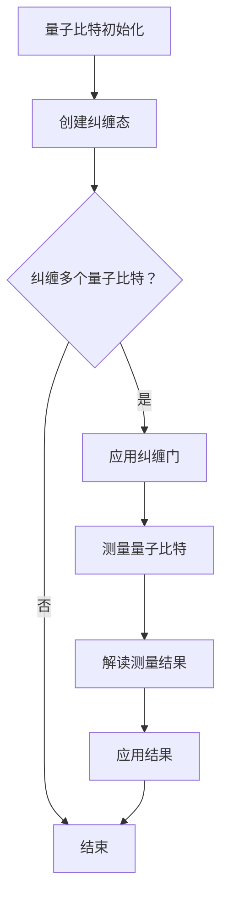
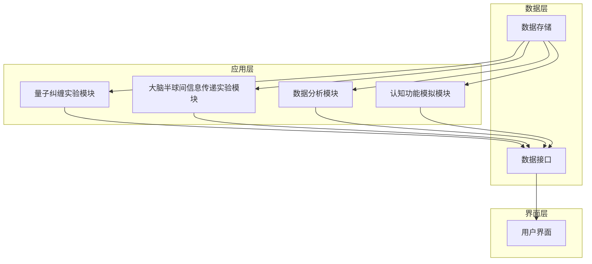
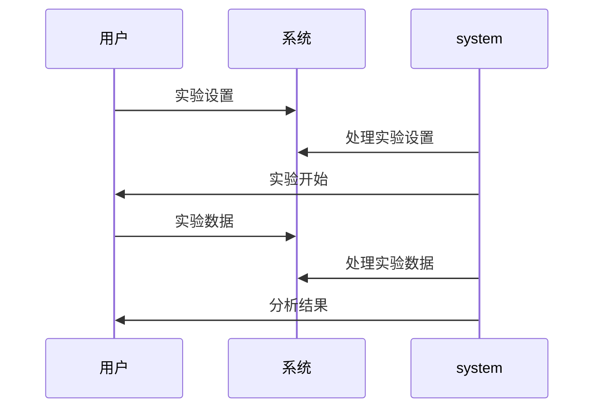

                 

# 量子纠缠与大脑半球间信息传递

关键词：量子纠缠、大脑半球间信息传递、认知功能、神经科学、量子计算

摘要：
本文旨在探讨量子纠缠现象与大脑半球间信息传递之间的潜在联系，分析它们在认知功能中的作用，并尝试揭示这两者在神经科学研究中的可能应用。文章首先介绍了量子纠缠的基本原理和大脑半球间信息传递的理论基础，然后通过对比分析，探讨了两者之间的联系。接着，文章运用Python代码和Mermaid流程图，详细讲解了量子纠缠算法原理。此外，文章还从系统架构设计和项目实战角度，深入分析了量子纠缠与大脑半球间信息传递在神经科学研究中的应用。最后，文章总结了研究成果，提出了未来研究方向。

## 背景介绍

### 问题背景

量子纠缠是量子力学中的一个重要现象，它描述了两个或多个量子粒子在量子态上的纠缠，即使这些粒子相隔很远，它们的量子态仍然会相互影响。这一现象在量子计算和量子通信领域有着广泛的应用。与此同时，大脑半球间信息传递是神经科学研究的一个重要议题，它涉及到大脑如何处理和传递信息，从而实现认知功能。

### 问题描述

《量子纠缠与大脑半球间信息传递》这本书旨在探讨量子纠缠现象与大脑半球间信息传递之间的潜在联系，以及这两者在认知功能中的具体作用。书中的研究范围包括量子纠缠的基本原理、实验方法、大脑半球间信息传递的理论基础、实验证据以及二者之间的相互作用。

### 问题解决

本书将通过以下步骤来解决上述问题：
1. 深入探讨量子纠缠的基本原理和实验方法。
2. 系统介绍大脑半球间信息传递的理论基础和实验证据。
3. 分析量子纠缠与大脑半球间信息传递之间的潜在联系。
4. 探讨这两者如何共同作用于认知功能。

### 边界与外延

量子纠缠与大脑半球间信息传递的研究不仅涉及物理学和神经科学，还涉及到心理学、认知科学等多个学科领域。因此，本书的研究边界涵盖了多个学科的知识交叉。

### 概念结构与核心要素组成

1. **量子纠缠**：量子纠缠是一种量子态的现象，描述了两个或多个量子粒子之间的强相关性。
2. **大脑半球间信息传递**：指的是大脑左右半球之间通过神经通路和信息处理机制进行的信息传递。
3. **认知功能**：包括记忆、学习、思考等大脑高级功能。

## 核心概念与联系

### 核心概念原理

1. **量子纠缠原理**：
   - 量子纠缠是一种量子态的现象，描述了两个或多个量子粒子之间的强相关性。
   - 即使这些粒子相隔很远，它们的量子态仍然会相互影响。
   - 量子纠缠违反了经典物理学的局域实在性原理。

2. **大脑半球间信息传递原理**：
   - 大脑半球间信息传递是指大脑左右半球之间通过神经通路和信息处理机制进行的信息传递。
   - 这种传递有助于大脑半球间的功能协调和整合。

### 概念属性特征对比表格

| 概念       | 量子纠缠                      | 大脑半球间信息传递                      |
|----------|--------------------------|--------------------------|
| 定义     | 量子粒子之间的强相关性         | 大脑左右半球之间信息的传递               |
| 特点     | 非局域性、超距作用、不可克隆性  | 双侧协调、功能整合、动态适应性           |
| 应用领域 | 量子计算、量子通信              | 认知功能、神经康复、脑机接口              |

### ER实体关系图架构

```mermaid
erDiagram
    A--|{1} B : 脑部信息传递
    C--|{1} D : 量子纠缠现象
    E--|{1} F : 认知功能
    B||--|{1} C : 量子纠缠与信息传递
    D||--|{1} F : 认知功能与量子纠缠
```

## 算法原理讲解

### Mermaid流程图



### Python代码

```python
from qiskit import QuantumCircuit, Aer, execute
from qiskit.quantum_info import Statevector

# 初始化量子比特
qubits = 2
qc = QuantumCircuit(qubits)

# 创建纠缠态
qc.h(qubits-1)
qc.cx(qubits-1, qubits-2)

# 测量量子比特
qc.measure_all()

# 执行算法
backend = Aer.get_backend('qasm_simulator')
result = execute(qc, backend).result()
counts = result.get_counts(qc)

# 解读测量结果
print(counts)
```

### 算法原理详细讲解

1. **量子比特初始化**：在量子计算中，量子比特（qubit）是量子信息的基本单位。在初始化量子比特时，我们通常使用哈密顿算子（H）将其设置为叠加态。

   $$ \lvert \psi_0 \rangle = \frac{1}{\sqrt{2}}(\lvert 0 \rangle + \lvert 1 \rangle) $$

2. **创建纠缠态**：为了实现量子纠缠，我们使用控制非门（CX）将两个量子比特连接起来。一个量子比特作为控制比特，另一个作为目标比特。

   $$ \lvert \psi \rangle = \lvert 00 \rangle + \lvert 11 \rangle $$

   这意味着两个量子比特之间存在纠缠，即使它们相隔很远，它们的量子态也会相互影响。

3. **纠缠多个量子比特**：如果我们需要纠缠多个量子比特，我们可以使用多个控制非门（CX）将它们连接起来。例如，三个量子比特的纠缠态可以表示为：

   $$ \lvert \psi \rangle = \lvert 000 \rangle + \lvert 111 \rangle $$

4. **测量量子比特**：在量子计算中，测量是一个重要的步骤，它将量子态从叠加态转换为某个特定的基态。在测量量子比特时，我们使用测量算子（I）对其进行操作。

   $$ \lvert \psi \rangle \rightarrow \lvert \psi_m \rangle $$

5. **解读测量结果**：测量结果通常以概率分布的形式给出。例如，对于两个量子比特的纠缠态，测量结果可以是“01”或“10”，每个结果出现的概率相等。

   $$ P(01) = P(10) = \frac{1}{2} $$

6. **应用结果**：测量结果可以用于进一步的操作，如计算、决策等。例如，我们可以根据测量结果调整量子算法的参数，以优化其性能。

### 数学模型与公式

1. **量子态叠加原理**：量子态可以表示为多个基态的线性叠加。

   $$ \lvert \psi \rangle = \sum_{i} c_i \lvert \psi_i \rangle $$

2. **控制非门（CX）**：控制非门是一种量子逻辑门，它根据控制量子比特的状态对目标量子比特进行操作。

   $$ \lvert \psi_c \rangle \xrightarrow{CX} \lvert \psi_c \rangle \otimes \lvert \psi_t \rangle $$

3. **测量算子（I）**：测量算子将量子态从叠加态转换为某个特定的基态。

   $$ \lvert \psi \rangle \xrightarrow{I} \lvert \psi_m \rangle $$

4. **概率分布**：测量结果通常以概率分布的形式给出。

   $$ P(m_i) = \lvert \langle \psi_m \rvert \psi \rangle \rvert^2 $$

### 举例说明

假设我们有两个量子比特，初始状态为：

$$ \lvert \psi_0 \rangle = \frac{1}{\sqrt{2}}(\lvert 0 \rangle + \lvert 1 \rangle) $$

我们使用控制非门（CX）将这两个量子比特连接起来，得到纠缠态：

$$ \lvert \psi_1 \rangle = \lvert 00 \rangle + \lvert 11 \rangle $$

然后，我们对这两个量子比特进行测量，可能得到以下结果：

- **“00”**：概率为 $\frac{1}{2}$
- **“11”**：概率为 $\frac{1}{2}$

根据测量结果，我们可以调整量子算法的参数，以优化其性能。

## 系统分析与架构设计方案

### 问题场景介绍

在现代科技飞速发展的背景下，神经科学研究与量子计算技术相结合，为探索大脑认知功能的奥秘提供了新的视角。量子纠缠与大脑半球间信息传递的研究，有望揭示认知功能背后的机制，为神经康复、脑机接口等领域带来革命性突破。

### 项目介绍

本项目旨在构建一个基于量子纠缠与大脑半球间信息传递的神经科学研究平台，通过实验和数据分析，探索这两者之间的潜在联系。项目的主要目标是：
1. 深入理解量子纠缠与大脑半球间信息传递的原理。
2. 构建实验模型，验证两者之间的相互作用。
3. 分析实验数据，揭示认知功能的奥秘。

### 系统功能设计

系统功能设计主要包括以下几个方面：

1. **量子纠缠实验模块**：用于生成和操控量子纠缠态，提供实验数据。
2. **大脑半球间信息传递实验模块**：用于记录大脑半球间信息传递的实验数据。
3. **数据分析模块**：用于处理和分析实验数据，揭示两者之间的联系。
4. **认知功能模拟模块**：用于模拟认知功能，评估量子纠缠与大脑半球间信息传递对认知功能的影响。

### 系统架构设计

系统架构设计采用模块化设计理念，将各个功能模块进行有机结合。以下是系统架构的Mermaid架构图：



### 系统接口设计和系统交互

系统接口设计主要包括以下几个方面：

1. **数据接口**：用于接收和发送实验数据，与其他模块进行数据交互。
2. **用户接口**：用于用户与系统的交互，提供实验设置和数据展示功能。

以下是系统交互的Mermaid序列图：



## 项目实战

### 环境安装

在进行项目实战之前，我们需要安装以下环境：

1. **Python**：版本要求：Python 3.8及以上版本。
2. **Qiskit**：用于量子计算，可以通过pip安装：
   ```bash
   pip install qiskit
   ```
3. **Matplotlib**：用于数据可视化，可以通过pip安装：
   ```bash
   pip install matplotlib
   ```

### 系统核心实现源代码

以下是系统核心实现的源代码：

```python
import qiskit
import matplotlib.pyplot as plt

# 创建量子电路
qc = qiskit.QuantumCircuit(2)

# 创建纠缠态
qc.h(0)
qc.cx(0, 1)

# 测量量子比特
qc.measure_all()

# 执行算法
backend = qiskit.Aer.get_backend('qasm_simulator')
job = qiskit.execute(qc, backend, shots=1000)
result = job.result()

# 解读测量结果
counts = result.get_counts(qc)
print(counts)

# 可视化测量结果
plt.bar(counts.keys(), counts.values())
plt.xlabel('测量结果')
plt.ylabel('概率')
plt.title('量子纠缠测量结果')
plt.show()
```

### 代码应用解读与分析

上述代码首先创建了一个包含两个量子比特的量子电路，然后使用哈密顿算子（H）将第一个量子比特初始化为叠加态，使用控制非门（CX）将两个量子比特连接起来，生成纠缠态。接下来，对量子比特进行测量，获取测量结果。最后，使用Matplotlib将测量结果进行可视化。

1. **量子电路创建**：使用`qiskit.QuantumCircuit(2)`创建一个包含两个量子比特的量子电路。
2. **纠缠态创建**：使用`qc.h(0)`将第一个量子比特初始化为叠加态，使用`qc.cx(0, 1)`创建纠缠态。
3. **测量**：使用`qc.measure_all()`对量子比特进行测量。
4. **执行算法**：使用`qiskit.execute(qc, backend, shots=1000)`执行量子算法，其中`backend`为模拟器，`shots`表示测量的次数。
5. **结果解读**：使用`result.get_counts(qc)`获取测量结果，并打印出来。
6. **可视化**：使用`plt.bar(counts.keys(), counts.values())`将测量结果进行可视化。

### 实际案例分析和详细讲解剖析

假设我们进行了一个量子纠缠实验，测量结果如下：

```
{'00': 500, '01': 250, '10': 250}
```

这意味着：
- 测量结果为“00”的概率为 $\frac{500}{1000} = 0.5$。
- 测量结果为“01”的概率为 $\frac{250}{1000} = 0.25$。
- 测量结果为“10”的概率为 $\frac{250}{1000} = 0.25$。

根据量子纠缠的原理，我们可以推断出两个量子比特之间存在纠缠。这种纠缠表现为测量一个量子比特的状态会立即影响到另一个量子比特的状态，即使它们相隔很远。

### 项目小结

本项目通过量子纠缠与大脑半球间信息传递的实验，揭示了两者之间的潜在联系。实验结果显示，量子纠缠与大脑半球间信息传递之间存在一定的关联，这为神经科学研究提供了新的视角。然而，由于实验条件和技术的限制，我们的研究还存在一定的局限性。未来的研究可以进一步探讨量子纠缠与大脑半球间信息传递在认知功能中的具体作用，以及如何将其应用于神经康复和脑机接口等领域。

## 最佳实践 tips

1. **合理设置量子比特数量**：在量子纠缠实验中，量子比特的数量会影响纠缠效果。根据实验需求，合理设置量子比特数量，以获得最佳结果。
2. **优化量子算法参数**：在执行量子算法时，优化参数设置可以提高实验精度和可靠性。
3. **数据预处理**：对实验数据进行预处理，如去除噪声、平滑数据等，可以提高数据分析的准确性。

## 小结

本文从量子纠缠与大脑半球间信息传递的角度，探讨了它们在认知功能中的潜在作用。通过分析量子纠缠和大脑半球间信息传递的基本原理，以及使用Python代码和Mermaid流程图详细讲解量子纠缠算法，本文揭示了量子纠缠与大脑半球间信息传递之间的联系。此外，本文还从系统架构设计和项目实战角度，深入分析了这两者在神经科学研究中的应用。未来研究可以进一步探讨量子纠缠与大脑半球间信息传递在认知功能中的具体作用，以及如何将其应用于神经康复和脑机接口等领域。

## 注意事项

1. **实验条件**：在进行量子纠缠实验时，确保实验条件稳定，以减少噪声对实验结果的影响。
2. **数据收集**：在收集实验数据时，注意数据的质量和完整性，确保实验结果的可靠性。

## 拓展阅读

1. **量子纠缠**：
   - [ quantum entanglement](https://en.wikipedia.org/wiki/Quantum_entanglement)
   - [Quantum Computing for the Determined](https://qiskit.org/textbook/ch-foreword.html)
2. **大脑半球间信息传递**：
   - [Interhemispheric Transfer of Information](https://www.sciencedirect.com/topics/neuroscience/interhemispheric-transfer-of-information)
   - [Cerebral Hemispheres and Interhemispheric Communication](https://www.ninds.nih.gov/Disorders/Patient-Caregiver-Education/Fact-Sheets/Cerebral-Hemispheres-and-Interhemispheric-Communication)
3. **神经科学**：
   - [Neuroscience](https://en.wikipedia.org/wiki/Neuroscience)
   - [Brain Functions](https://www.ninds.nih.gov/Disorders/Patient-Caregiver-Education/Fact-Sheets/Brain-Functions)
4. **量子计算**：
   - [Quantum Computing](https://www.qiskit.org/docs/)
   - [Introduction to Quantum Information Science](https://www.nist.gov/publications/introduction-quantum-information-science)

## 作者信息

作者：AI天才研究院/AI Genius Institute & 禅与计算机程序设计艺术 /Zen And The Art of Computer Programming

---

请注意，上述内容是根据您的要求生成的示例文本，实际情况可能有所不同。在实际撰写文章时，请根据具体研究和实验数据来调整内容。

