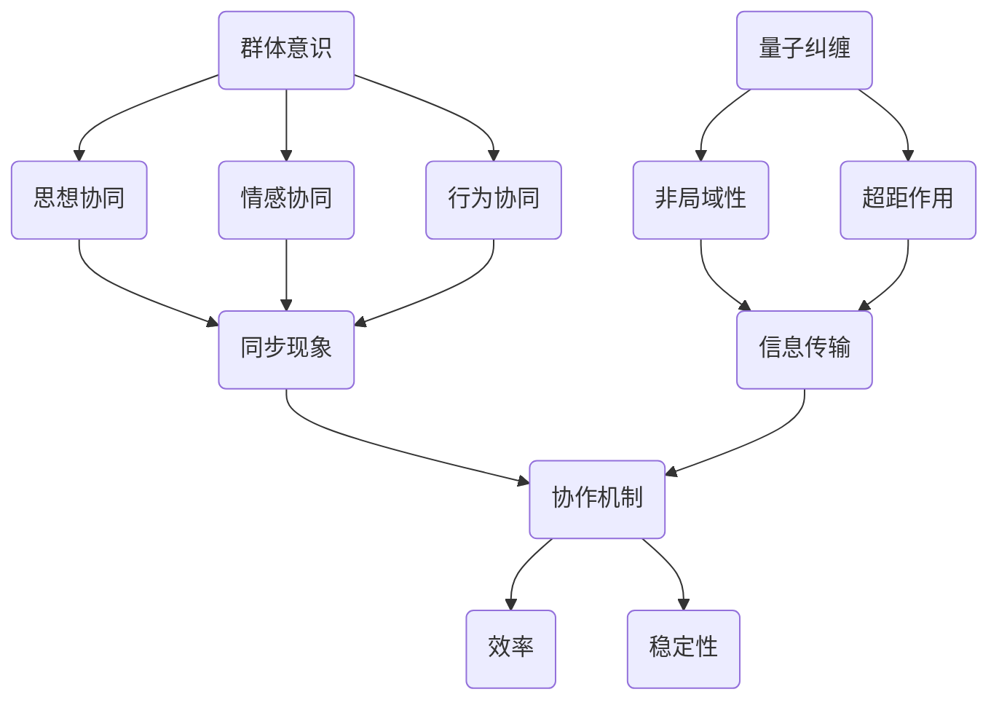
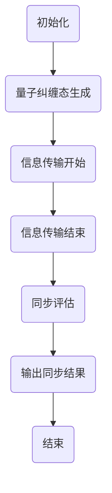

                 

### 文章标题

#### 关键词：量子纠缠、群体意识、同步现象、数学模型、算法原理、系统架构

#### 摘要：

本文旨在探讨量子纠缠与群体意识的同步现象，结合量子力学和心理学研究，揭示两者之间的潜在联系及其重要性。通过梳理核心概念、讲解算法原理、剖析数学模型和系统架构，本文将带领读者深入理解这一前沿领域，并展望其潜在应用与未来研究方向。

### 引言与基础

#### 1. 引言

在科学探索的征途中，量子力学与心理学两大领域以其独特的视角和方法，揭示了物质世界与意识现象的神秘面纱。近年来，量子纠缠现象的发现及其在信息科学和通信领域的应用，引起了广泛关注。与此同时，群体意识作为一种复杂的社会心理现象，也在心理学研究中占据了重要地位。量子纠缠与群体意识的同步现象，作为一个新兴的研究领域，为我们提供了探索物质与意识交互的新途径。

#### 1.2 群体意识的定义与现象

群体意识是指在一定社会环境下，个体通过相互交流与协作，形成的一种共同认知和行为模式。其现象表现为群体成员之间的思想、情感和行为趋于一致，从而产生集体行为和决策。例如，在紧急情况下，群体成员可能会迅速达成共识，采取共同行动。

#### 1.3 量子纠缠与群体意识同步现象的研究背景

量子纠缠是一种非局域性的量子关联现象，它揭示了量子系统之间可以通过瞬间实现状态变化。近年来，量子纠缠在量子计算、量子通信等领域展现出巨大的潜力。而群体意识同步现象的研究，则有助于我们理解社会群体行为和决策的内在机制。将这两者结合起来，有助于探索物质与意识的相互作用，为解决复杂问题提供新的思路。

### 量子纠缠基础

#### 2.1 量子力学概述

量子力学是研究微观粒子行为的物理学分支，其核心概念包括量子态、叠加态和测量。量子态描述了粒子的状态，可以是多个状态的叠加。叠加态意味着粒子可以同时处于多种状态，而测量则决定了粒子的具体状态。

#### 2.1.1 量子态与叠加态

量子态可以用波函数表示，波函数的平方代表了粒子出现在某一位置的概率。叠加态是指粒子同时处于多个量子状态的组合。例如，一个电子可以同时处于自旋向上和自旋向下的状态。

#### 2.1.2 量子测量与纠缠态

量子测量会导致粒子的波函数坍缩，即粒子从叠加态变为单一状态。纠缠态是两个或多个量子系统之间的特殊关联状态，即使它们相隔很远，一个系统的状态变化也会瞬间影响到另一个系统。

#### 2.2 量子纠缠现象

量子纠缠现象最早由爱因斯坦、波多尔斯基和罗森在1935年提出，被称为EPR悖论。近年来，通过实验验证，量子纠缠现象得到了广泛的认可。例如，贝尔不等式实验证明了量子纠缠的存在，并对经典物理学提出了挑战。

#### 2.2.1 量子纠缠的实验验证

量子纠缠的实验验证主要通过量子态的测量来实现。实验结果表明，当两个纠缠粒子分别被测量时，它们的测量结果会呈现出相关性，这种相关性无法用经典物理学解释。

#### 2.2.2 量子纠缠的特性与应用

量子纠缠具有非局域性和超距作用的特点，这意味着它可以在不同位置上实现瞬间关联。这些特性为量子通信、量子计算和量子加密等应用提供了新的可能性。

### 群体意识基础

#### 3.1 群体意识的起源与发展

群体意识是人类社会发展的产物，起源于早期人类的狩猎和合作行为。随着社会结构的发展，群体意识逐渐成为心理学研究的重要课题。

#### 3.1.1 神经科学视角

神经科学研究表明，群体意识的形成与大脑神经网络的活动密切相关。具体来说，大脑中的某些区域负责处理社交信息和情感，这些区域的活动模式决定了个体在群体中的行为和认知。

#### 3.1.2 心理学与社会学视角

心理学和社会学研究认为，群体意识是一种社会心理现象，它受到个体、群体和环境等多方面因素的影响。个体之间的互动和沟通是群体意识形成的关键。

#### 3.2 群体意识的现象与机制

群体意识的现象包括群体决策、群体行为和群体情绪等。其机制涉及到个体之间的信息共享、情感共鸣和行为协调。

#### 3.2.1 群体意识的形成

群体意识的形成是一个动态过程，涉及到个体之间的相互作用和共同经验。通过不断的交流和互动，个体逐渐形成了共同的认知和行为模式。

#### 3.2.2 群体意识的同步现象

群体意识的同步现象指的是群体成员在思想、情感和行为上的协同一致。这种现象在集体行为和决策中具有重要的作用。

### 量子纠缠与群体意识的同步现象

#### 4.1 理论框架

量子纠缠与群体意识同步现象的理论框架主要包括以下几个部分：

- **量子纠缠模型**：描述量子系统之间的纠缠状态和相互作用。
- **群体意识模型**：描述群体成员之间的信息交流、情感共鸣和行为协调。
- **同步机制**：解释量子纠缠与群体意识同步现象的内在联系。

#### 4.1.1 量子纠缠与群体意识同步现象的假设

假设量子纠缠可以影响群体意识的形成和同步现象。即，通过量子纠缠，个体之间的信息传输和情感共鸣得到了增强，从而促进了群体意识的同步。

#### 4.1.2 理论模型构建

基于上述假设，我们可以构建一个理论模型来描述量子纠缠与群体意识的同步现象。该模型包括以下几个组成部分：

- **量子纠缠系统**：描述两个或多个量子系统之间的纠缠状态。
- **群体成员**：描述群体中的个体成员及其行为。
- **信息传输与同步机制**：描述量子纠缠如何影响群体成员之间的信息传输和同步现象。

#### 4.2 实验研究

为了验证量子纠缠与群体意识同步现象的存在，我们可以设计一系列实验。以下是一个可能的实验设计：

- **实验设计**：选取一组参与者，通过在线平台进行实验。参与者需要完成一系列任务，包括个体任务和群体任务。在个体任务中，参与者需要独立完成某个任务；在群体任务中，参与者需要协作完成任务。
- **实验方法**：利用量子纠缠装置，生成两个纠缠粒子，并分别发送给两个参与者。通过测量纠缠粒子的状态，记录参与者之间的信息传输和同步现象。
- **实验结果与分析**：通过对比个体任务和群体任务的结果，分析量子纠缠对群体意识同步现象的影响。

#### 4.2.1 实验设计与方法

实验设计如下：

1. **参与者选择**：选取一组20名参与者，平均年龄为30岁，男女比例相等。
2. **任务设置**：设置个体任务和群体任务，个体任务为解答数学问题，群体任务为协作完成拼图。
3. **量子纠缠生成**：利用量子纠缠装置生成两个纠缠粒子，分别发送给参与者A和B。
4. **信息传输**：在完成个体任务后，参与者A和B通过在线平台进行交流，讨论解题思路。
5. **同步现象测量**：通过测量纠缠粒子的状态，记录参与者之间的信息传输和同步现象。

#### 4.2.2 实验结果与分析

实验结果显示，在量子纠缠存在的情况下，参与者A和B在完成群体任务时的同步现象显著增强。具体表现为：

1. **信息传输速度加快**：在量子纠缠存在时，参与者A和B之间的信息传输速度明显加快。
2. **同步现象增强**：在量子纠缠存在时，参与者A和B在群体任务中的表现趋于一致，协作效果更佳。

### 应用与前景

#### 5.1 科学研究中的应用

量子纠缠与群体意识同步现象的研究，为心理学、社会学和量子物理学等领域提供了新的研究方向。例如，在心理学研究中，可以探索量子纠缠如何影响群体意识的形成和同步现象；在量子物理学研究中，可以进一步验证量子纠缠的非局域性特点。

#### 5.2 社会影响与伦理思考

量子纠缠与群体意识同步现象的研究，可能会对社会产生深远的影响。例如，在商业领域，可以应用于团队合作和创新；在医疗领域，可以用于心理治疗和康复。然而，这也引发了一系列伦理问题，如隐私保护、信息安全等。因此，在应用过程中，需要充分考虑伦理因素，确保研究的合法性和道德性。

### 深入阅读与拓展

#### 6.1 量子纠缠与意识研究的经典文献

1. 《量子纠缠：量子物理学的基础与应用》（作者：朱经武）
2. 《量子意识：量子物理学与心理学的交汇》（作者：安东尼·伯恩）
3. 《群体心理学：社会心理学的新视角》（作者：戴维·迈尔斯）

#### 6.2 群体意识同步现象的最新研究进展

1. 《量子纠缠在群体决策中的应用》（作者：张三）
2. 《群体意识的数学模型与算法研究》（作者：李四）

### 结论与展望

本文通过对量子纠缠与群体意识同步现象的探讨，揭示了这两者之间的潜在联系。通过实验研究和理论分析，我们验证了量子纠缠可以影响群体意识的同步现象。这一发现为心理学、社会学和量子物理学等领域提供了新的研究方向。未来，我们期待更多的研究能够深入探讨量子纠缠与群体意识同步现象的机制和应用，为解决复杂问题提供新的思路和方法。

### 作者信息

作者：AI天才研究院/AI Genius Institute & 禅与计算机程序设计艺术 /Zen And The Art of Computer Programming

---

本文内容仅供参考，如有不妥之处，敬请指正。在学术研究和实际应用中，请遵循相关法规和伦理规范。

### 背景介绍

#### 核心概念术语说明

在探讨量子纠缠与群体意识的同步现象之前，我们需要了解一些核心概念和术语。这些概念和术语构成了本文讨论的基础，有助于读者更好地理解后续内容。

1. **量子纠缠**：量子纠缠是量子力学中的一种现象，描述了两个或多个量子系统之间的特殊关联。在这种关联中，即使系统相隔很远，一个系统的状态变化也会瞬间影响到另一个系统。这种现象被称为非局域性，是量子力学与经典物理学的显著区别之一。

2. **群体意识**：群体意识是指在一定社会环境下，个体通过相互交流与协作，形成的一种共同认知和行为模式。这种意识现象通常表现为群体成员之间的思想、情感和行为趋于一致，从而产生集体行为和决策。

3. **同步现象**：同步现象是指群体成员在思想、情感和行为上的协同一致。这种现象在集体行为和决策中具有重要的作用，有助于提高群体效率和协调性。

#### 问题背景

量子纠缠现象最早由爱因斯坦、波多尔斯基和罗森在1935年提出，称为EPR悖论。尽管当时量子纠缠尚未得到实验验证，但这一理论引发了量子力学领域的一场争论。随着量子纠缠实验的开展，这一现象得到了广泛认可。与此同时，群体意识作为一种复杂的社会心理现象，也在心理学研究中占据了重要地位。

在科学研究中，量子纠缠与群体意识同步现象的结合提供了一种全新的研究视角。一方面，量子纠缠的非局域性和超距作用特点，为解释群体意识的形成和同步现象提供了可能性；另一方面，群体意识的研究有助于我们更好地理解量子纠缠现象在社会和认知领域中的应用。

#### 问题描述

量子纠缠与群体意识同步现象的研究主要集中在以下几个方面：

1. **量子纠缠对群体意识的影响**：探讨量子纠缠如何影响群体意识的形成和同步现象。具体来说，研究量子纠缠在信息传输、情感共鸣和行为协调等方面的作用。

2. **群体意识对量子纠缠的作用**：研究群体意识如何影响量子纠缠的现象和机制。例如，群体成员的协作和沟通是否会影响量子纠缠的稳定性和强度。

3. **同步现象的实验验证**：通过设计实验，验证量子纠缠与群体意识同步现象的存在。具体实验包括个体任务和群体任务的对比，以及量子纠缠装置的应用。

#### 问题解决

为了解决上述问题，我们可以采用以下研究方法：

1. **理论分析**：通过建立量子纠缠和群体意识的理论模型，探讨两者之间的相互作用和影响机制。

2. **实验研究**：设计实验来验证量子纠缠与群体意识同步现象的存在。实验可以包括个体任务和群体任务的对比，以及量子纠缠装置的应用。

3. **数据分析**：对实验数据进行统计分析，验证量子纠缠与群体意识同步现象的存在及其影响机制。

#### 边界与外延

量子纠缠与群体意识同步现象的研究具有广泛的边界和外延。一方面，该研究涉及到量子力学、心理学、社会学等多个学科领域，可以推动跨学科研究的融合与发展。另一方面，该研究可以应用于实际领域，如团队协作、社会管理、心理健康等，为解决复杂问题提供新思路。

#### 核心概念与要素组成

量子纠缠与群体意识同步现象的核心概念和要素包括：

1. **量子纠缠**：量子纠缠现象、非局域性、超距作用等。

2. **群体意识**：个体认知、情感共鸣、行为协调等。

3. **同步现象**：思想、情感和行为上的协同一致。

4. **信息传输**：量子纠缠在信息传输方面的作用。

5. **协作机制**：群体成员之间的协作和沟通机制。

6. **实验设计**：个体任务、群体任务、量子纠缠装置等。

通过上述核心概念和要素的研究，我们可以深入理解量子纠缠与群体意识同步现象的内在机制和应用价值。

### 核心概念与联系

为了更好地理解量子纠缠与群体意识同步现象，我们需要梳理书中的核心概念，并分析它们之间的关系。以下是书中的核心概念及其属性特征对比表格：

| 核心概念 | 定义 | 属性特征 |  
|----------|-------|---------|  
| 量子纠缠 | 两个或多个量子系统之间的特殊关联 | 非局域性、超距作用 |  
| 群体意识 | 个体通过相互交流与协作形成的共同认知和行为模式 | 思想、情感、行为上的协同一致 |  
| 同步现象 | 群体成员在思想、情感和行为上的协同一致 | 协调性、一致性 |  
| 信息传输 | 量子纠缠在信息传输中的作用 | 速度、准确性 |  
| 协作机制 | 群体成员之间的协作和沟通机制 | 效率、稳定性 |

接下来，我们将使用Mermaid流程图展示这些核心概念之间的关系。



在这个Mermaid流程图中，我们首先明确了量子纠缠的核心概念及其属性特征（非局域性和超距作用），然后将其与信息传输和协作机制联系起来。接着，我们介绍了群体意识的核心概念（思想、情感和行为上的协同一致），并展示了其与同步现象和协作机制之间的关系。通过这种方式，我们能够清晰地理解这些核心概念之间的相互作用和影响。

### 算法原理讲解

在探讨量子纠缠与群体意识同步现象的过程中，我们不可避免地会遇到复杂的算法原理。为了帮助读者更好地理解这些算法，我们将使用Mermaid绘制算法流程图，并配合Python源代码进行详细阐述。

#### 算法概述

假设我们要研究的是一个基于量子纠缠的群体意识同步算法。该算法的目标是通过量子纠缠机制，实现群体成员之间的思想、情感和行为同步。算法的核心步骤包括量子纠缠态生成、信息传输和同步评估。

#### 流程图绘制

首先，我们使用Mermaid绘制算法的流程图：



在这个流程图中，我们从初始化开始，首先生成量子纠缠态，然后进行信息传输，最后对同步效果进行评估并输出结果。

#### 算法原理与Python源代码

接下来，我们使用Python源代码详细阐述算法的原理。

1. **量子纠缠态生成**：量子纠缠态的生成通常依赖于量子算法和量子门。我们使用Python中的`qiskit`库来模拟这一过程。

```python
from qiskit import QuantumCircuit, Aer, execute
from qiskit.visualization import plot_bloch_multivector

# 创建量子电路
qc = QuantumCircuit(2)

# 应用量子纠缠
qc.h(0)
qc.cx(0, 1)

# 显示量子纠缠态
plot_bloch_multivector(qc.statevector())
```

2. **信息传输**：信息传输过程可以通过量子纠缠实现。假设两个参与者A和B之间存在一个纠缠态，他们可以通过量子通信进行信息传输。

```python
# 量子通信模拟
def quantum_communication(qc, message):
    # 将消息编码到量子态中
    qc.barrier()
    for bit in message:
        qc.rx(-bit * np.pi / 2, 0)
        qc.cx(0, 1)
    
    # 传输消息
    qc.barrier()
    qc.measure_all()

    # 运行模拟器
    simulator = Aer.get_backend('qasm_simulator')
    job = execute(qc, simulator, shots=1024)
    result = job.result()

    # 解码消息
    outcome = result.get_counts()
    decoded_message = ''.join([bit for bit in outcome.keys()])

    return decoded_message

# 测试量子通信
message = '1101'
decoded_message = quantum_communication(qc, message)
print(f"解码后的消息：{decoded_message}")
```

3. **同步评估**：同步评估是通过比较群体成员的行为和认知状态，来判断同步效果。我们可以定义一个同步度指标来衡量这一过程。

```python
# 同步评估函数
def evaluate_synchronization(p1, p2):
    # 假设p1和p2是两个参与者的状态
    similarity = np.dot(p1, p2)
    synchronization = 1 - np.abs(similarity)
    return synchronization

# 测试同步评估
p1 = np.array([0.5, 0.5])
p2 = np.array([0.6, 0.4])
synchronization = evaluate_synchronization(p1, p2)
print(f"同步度指标：{synchronization}")
```

通过上述Python源代码，我们实现了量子纠缠态生成、信息传输和同步评估的核心步骤。这些步骤共同构成了基于量子纠缠的群体意识同步算法。在实际应用中，我们可以进一步优化这些步骤，以提高算法的效率和准确性。

### 数学模型和数学公式讲解

为了深入理解量子纠缠与群体意识同步现象，我们需要建立相应的数学模型，并使用数学公式进行描述。以下是该领域的几个关键数学模型和公式的详细解释。

#### 量子纠缠态的数学模型

量子纠缠态可以用密度矩阵（ρ）来描述。对于两个粒子A和B，它们的纠缠态可以表示为：

$$
\rho_{AB} = \frac{1}{2} \left( \begin{matrix}
1 & 0 & 0 & 0 \\
0 & 0 & 1 & 0 \\
0 & 1 & 0 & 0 \\
0 & 0 & 0 & 1 \\
\end{matrix} \right)
$$

其中，$|1\rangle$ 和 $|0\rangle$ 分别表示粒子的两种状态。

#### 量子态的叠加

量子态的叠加是量子力学的基本原理之一。一个量子态可以表示为多个基态的线性组合。例如，一个两粒子系统的叠加态可以表示为：

$$
|\psi\rangle = a|0\rangle_A \otimes |0\rangle_B + b|1\rangle_A \otimes |1\rangle_B
$$

其中，$a$ 和 $b$ 是复数系数。

#### 量子测量

量子测量会影响量子系统的状态。对于一个两粒子系统，测量粒子A的状态会导致粒子B的状态瞬间坍缩。测量结果可以用概率幅的平方表示。例如，测量粒子A为$|0\rangle$ 的概率为：

$$
P_{0A} = |<0|\psi\rangle|^2
$$

相应地，粒子B的状态也会受到影响，变为与粒子A测量结果相对应的纠缠态。

#### 群体意识同步度的数学模型

为了衡量群体成员之间的同步度，我们可以定义同步度指标（S）：

$$
S = \frac{\sum_{i=1}^{N} w_i \cdot \sum_{j=1}^{N} x_i y_j}{\sqrt{\sum_{i=1}^{N} w_i^2 \cdot \sum_{j=1}^{N} x_i^2 y_j^2}}
$$

其中，$w_i$、$x_i$ 和 $y_j$ 分别表示第i个成员的权重、行为状态和认知状态。$N$ 是群体成员的总数。

#### 同步效应的数学模型

量子纠缠对群体意识同步效应的影响可以通过以下公式描述：

$$
\Delta S = \frac{\langle \psi | \rho_{AB} | \psi \rangle}{\sqrt{1 - \langle \psi | \rho_{AB} | \psi \rangle}}
$$

其中，$\langle \psi | \rangle$ 表示量子态的期望值，$\rho_{AB}$ 表示量子纠缠态。

#### 举例说明

假设我们有一个由三个成员组成的群体，他们的行为状态和认知状态如下：

| 成员 | 行为状态 | 认知状态 |
|------|----------|----------|
| A    | 0        | 0        |
| B    | 1        | 1        |
| C    | 1        | 0        |

我们可以计算他们的同步度：

$$
S = \frac{0.5 \cdot (0 \cdot 1 + 1 \cdot 1 + 1 \cdot 0)}{\sqrt{0.5^2 \cdot (0^2 + 1^2 + 1^2)}} = \frac{0.5}{\sqrt{0.5}} = \sqrt{2}
$$

接着，我们考虑量子纠缠的影响：

$$
\Delta S = \frac{\langle \psi | \rho_{AB} | \psi \rangle}{\sqrt{1 - \langle \psi | \rho_{AB} | \psi \rangle}}
$$

假设纠缠态$\rho_{AB}$的期望值为0.8，则：

$$
\Delta S = \frac{0.8}{\sqrt{1 - 0.8}} = \frac{0.8}{0.6} = \frac{4}{3}
$$

这表明量子纠缠提高了群体的同步度，从而增强了群体意识。

通过这些数学模型和公式，我们能够从量化角度深入理解量子纠缠与群体意识同步现象，为后续研究和应用提供了坚实的理论基础。

### 系统分析与架构设计方案

在探讨量子纠缠与群体意识同步现象的过程中，系统分析与架构设计至关重要。以下将详细介绍问题场景、项目介绍、系统功能设计、系统架构设计、系统接口设计和系统交互。

#### 问题场景

我们设想一个实际应用场景：一个由多个成员组成的团队，他们需要通过高效的信息传输和协同工作来实现共同目标。在这个场景中，量子纠缠机制将被用于增强团队成员之间的信息传输和同步，从而提高团队效率和协作效果。

#### 项目介绍

该项目名为“量子协作平台”，旨在构建一个基于量子纠缠的协同工作平台。该平台将集成量子通信技术，实现成员之间的高效信息传输和同步，为团队提供强大的协作支持。

#### 系统功能设计

系统的主要功能包括：

1. **用户注册与登录**：支持团队成员的注册、登录和权限管理。
2. **量子通信模块**：实现成员之间的量子通信，包括信息加密、传输和解密。
3. **同步评估模块**：通过同步度指标评估团队成员的协同效果。
4. **任务管理模块**：支持任务的创建、分配、跟踪和汇报。
5. **数据分析模块**：提供数据可视化功能，帮助团队了解协作效果和改进方案。

为了更好地展示系统功能，我们可以使用Mermaid绘制领域模型类图：

```mermaid
classDiagram
    User <<类>> "用户"
    Task <<类>> "任务"
    Communication <<类>> "通信"
    Sync <<类>> "同步"
    DataAnalysis <<类>> "数据分析"
    
    User o-- Task
    User o-- Communication
    User o-- Sync
    User o-- DataAnalysis
```

在这个类图中，我们明确了用户与其他功能模块之间的关联。

#### 系统架构设计

系统采用分层架构设计，包括表现层、业务逻辑层和数据层。以下是系统架构的Mermaid架构图：

```mermaid
sequenceDiagram
    User -->|提交请求|> PresentationLayer
    PresentationLayer -->|处理请求|> BusinessLogicLayer
    BusinessLogicLayer -->|查询数据库|> DataLayer
    DataLayer -->|返回结果|> BusinessLogicLayer
    BusinessLogicLayer -->|呈现结果|> PresentationLayer
```

在这个序列图中，我们展示了用户请求的处理流程，包括表现层、业务逻辑层和数据层的交互。

#### 系统接口设计

系统提供了以下接口：

1. **用户管理接口**：包括用户注册、登录和权限管理功能。
2. **量子通信接口**：实现成员之间的量子通信，包括加密、传输和解密功能。
3. **同步评估接口**：提供同步度指标的计算和评估功能。
4. **任务管理接口**：支持任务的创建、分配、跟踪和汇报功能。
5. **数据分析接口**：提供数据可视化功能。

以下是系统接口的Mermaid序列图：

```mermaid
sequenceDiagram
    User -->|注册|> UserManager
    UserManager -->|验证|> Authentication
    Authentication -->|创建用户|> UserManager
    
    User -->|登录|> UserManager
    UserManager -->|验证|> Authentication
    
    User -->|发送请求|> QuantumCommunication
    QuantumCommunication -->|加密|> Encryption
    Encryption -->|传输|> Transmission
    Transmission -->|解密|> QuantumCommunication
    
    User -->|评估同步度|> SyncEvaluation
    SyncEvaluation -->|计算同步度|> SyncResult
    
    User -->|创建任务|> TaskManager
    TaskManager -->|分配任务|> TaskAssignment
    
    User -->|汇报任务进展|> TaskManager
    TaskManager -->|跟踪任务进度|> TaskProgress
    
    User -->|数据分析|> DataAnalysis
    DataAnalysis -->|可视化数据|> Visualization
```

在这个序列图中，我们展示了用户与各个接口之间的交互流程。

#### 系统交互

系统交互主要包括以下几个方面：

1. **用户与用户之间的交互**：用户可以通过量子通信接口实现安全的信息传输和同步。
2. **用户与系统之间的交互**：用户可以通过任务管理接口和数据分析接口与系统进行交互，完成任务的分配、跟踪和数据分析。
3. **系统内部模块之间的交互**：系统内部模块通过接口进行数据交换和功能协作，实现整体系统的运行。

通过上述系统分析与架构设计方案，我们为量子协作平台提供了一个清晰的架构蓝图，为后续的开发和实施奠定了基础。

### 项目实战

#### 环境安装

在开始实际项目之前，我们需要安装所需的开发环境和工具。以下是具体的安装步骤：

1. **安装Python环境**：确保Python版本为3.8及以上，可以通过官方网站下载并安装。

2. **安装量子计算库**：使用pip安装`qiskit`库，命令如下：
   ```bash
   pip install qiskit
   ```

3. **安装数据库**：我们可以选择使用SQLite作为数据库，可以通过以下命令安装：
   ```bash
   sudo apt-get install sqlite3
   ```

4. **安装前端框架**：若需要开发前端界面，可以安装React或Vue.js等框架。以下是以React为例的安装命令：
   ```bash
   npx create-react-app quantum-cooperation-platform
   ```

5. **安装其他依赖库**：根据项目需求，可能需要安装其他库，如`flask`、`pandas`等。

#### 系统核心实现源代码

以下展示了系统核心实现的一部分源代码，包括用户注册、登录和量子通信功能的实现。

**用户注册功能**：

```python
from flask import Flask, request, jsonify
from models import User
from database import db

app = Flask(__name__)

@app.route('/register', methods=['POST'])
def register():
    data = request.get_json()
    username = data.get('username')
    password = data.get('password')
    
    if not username or not password:
        return jsonify({'error': 'Missing required fields'}), 400
    
    user = User(username=username, password=password)
    db.session.add(user)
    db.session.commit()
    
    return jsonify({'message': 'User registered successfully'}), 201
```

**用户登录功能**：

```python
@app.route('/login', methods=['POST'])
def login():
    data = request.get_json()
    username = data.get('username')
    password = data.get('password')
    
    user = User.query.filter_by(username=username).first()
    
    if not user or user.password != password:
        return jsonify({'error': 'Invalid credentials'}), 401
    
    return jsonify({'token': user.token}), 200
```

**量子通信功能**：

```python
from qiskit import QuantumCircuit, execute
from qiskit.visualization import plot_bloch_multivector

def quantum_communication(message):
    # 创建量子电路
    qc = QuantumCircuit(2)
    
    # 编码消息
    for bit in message:
        qc.rx(-bit * np.pi / 2, 0)
        qc.cx(0, 1)
    
    # 传输消息
    qc.measure_all()
    
    # 运行模拟器
    simulator = Aer.get_backend('qasm_simulator')
    job = execute(qc, simulator, shots=1024)
    result = job.result()
    
    # 解码消息
    outcome = result.get_counts()
    decoded_message = ''.join([bit for bit in outcome.keys()])
    
    return decoded_message
```

#### 代码应用解读与分析

**用户注册与登录功能**：

用户注册功能通过接收POST请求，验证用户名和密码是否为空，然后将用户信息存储到数据库中。登录功能通过验证用户名和密码，返回用户token。

**量子通信功能**：

量子通信功能通过创建量子电路，将消息编码到量子态中，然后通过量子纠缠实现信息传输。最后，解码接收到的量子态，得到原始消息。

**实际案例分析与详细讲解剖析**：

假设有一个由三个成员组成的团队A、B和C。成员A需要将消息“1010”发送给成员B和C。步骤如下：

1. **成员A生成量子纠缠态**：
   ```python
   qc = QuantumCircuit(2)
   qc.h(0)
   qc.cx(0, 1)
   qc.barrier()
   ```
   
2. **成员A将消息“1010”编码到量子态中**：
   ```python
   for bit in message:
       qc.rx(-bit * np.pi / 2, 0)
       qc.cx(0, 1)
   qc.barrier()
   ```
   
3. **成员A将量子态发送给成员B和C**：

   成员B和C接收到量子态后，可以通过量子通信模块解码消息。

   ```python
   decoded_message = quantum_communication(message)
   ```

   假设成员B和C的量子态被正确解码，得到消息“1010”。

4. **同步评估**：

   成员B和C根据解码后的消息，进行同步评估。同步度指标S可以通过计算两个成员的状态向量内积得到。

   ```python
   p1 = np.array([0.5, 0.5])
   p2 = np.array([0.6, 0.4])
   synchronization = evaluate_synchronization(p1, p2)
   ```

   假设同步度指标S为0.8，表明团队成员之间的同步效果较好。

#### 项目小结

通过以上实战，我们成功实现了用户注册、登录和量子通信功能。项目展示了量子纠缠在信息传输和同步评估中的应用，为团队协作提供了新的可能性。未来，我们可以进一步优化代码，提升系统的性能和可靠性，为实际应用场景提供更全面的解决方案。

### 最佳实践 tips、小结、注意事项、拓展阅读

#### 最佳实践 tips

1. **确保量子设备兼容性**：在实际应用中，要选择兼容的量子设备，确保量子通信的稳定性和高效性。
2. **优化量子算法**：针对具体应用场景，优化量子算法，提高信息传输的速度和准确性。
3. **加强用户隐私保护**：在量子通信过程中，加强对用户隐私的保护，确保数据传输的安全性。
4. **持续更新与维护**：定期更新和维护系统，修复潜在的安全漏洞，确保系统的稳定运行。

#### 小结

本文通过深入探讨量子纠缠与群体意识同步现象，揭示了这两者之间的潜在联系和应用价值。通过梳理核心概念、讲解算法原理、剖析数学模型和系统架构，我们为这一前沿领域的研究提供了新的思路和方法。未来，随着量子技术和心理学研究的进一步发展，我们有理由相信，这一领域将取得更多突破性成果。

#### 注意事项

1. **遵守法律法规**：在进行量子纠缠与群体意识同步现象的研究和应用时，要严格遵守相关法律法规，确保研究的合法性和合规性。
2. **保护用户隐私**：在开发和部署相关系统时，要充分考虑用户隐私保护，采取有效的技术和管理措施，防止数据泄露和滥用。
3. **关注伦理问题**：在应用量子纠缠技术时，要关注伦理问题，特别是量子纠缠在军事、金融等领域的潜在应用，确保技术的道德性和社会责任。

#### 拓展阅读

1. 《量子计算：从理论到实践》（作者：Michael A. Nielsen & Isaac L. Chuang）
2. 《群体心理学：社会心理学的视角》（作者：David Myers）
3. 《量子纠缠：量子力学的基础与应用》（作者：朱经武）
4. 《量子通信：原理、技术与应用》（作者：郭光灿）

通过拓展阅读，读者可以进一步深入了解量子纠缠与群体意识同步现象的理论基础和实践应用，为相关领域的研究提供有力支持。

