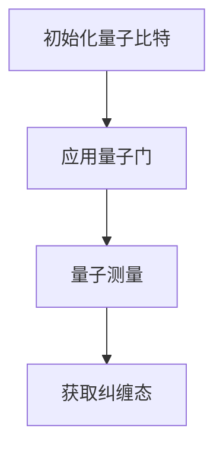
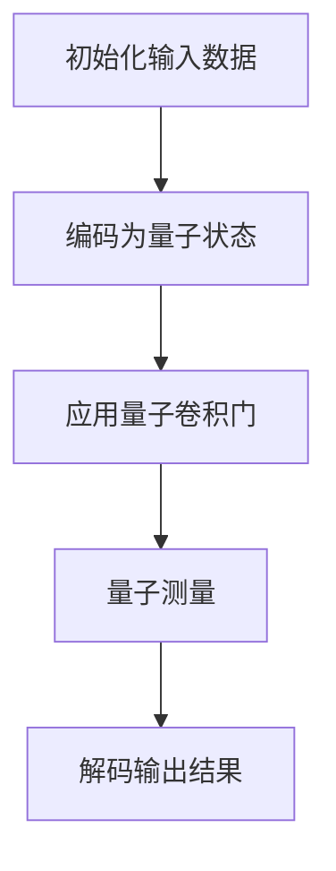
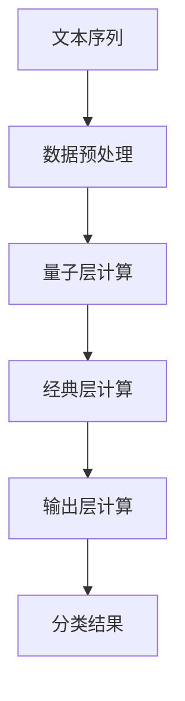

                 

### 文章标题

#### 关键词：量子纠缠、神经网络、长程相关性、算法原理、系统架构、项目实战

#### 摘要：

本文旨在探讨量子纠缠在神经网络中的长程相关性，详细分析其理论基础、算法原理、系统架构及实际应用。通过逐步的逻辑推理和实例讲解，深入挖掘量子纠缠如何影响神经网络的长程相关性，从而提高其性能和效率。本文将不仅介绍量子纠缠和神经网络的基本概念，还将展示其在实际项目中的应用，为读者提供实用的技术指导和深刻的见解。

----------------------------------------------------------------

### 第一部分：量子纠缠与神经网络概述

#### 第1章：量子纠缠与神经网络的基础概念

##### 1.1.1 量子纠缠的原理与特性

量子纠缠是量子力学中一种极为奇特的现象，当两个或多个量子系统发生相互作用时，它们之间的状态会形成一种强烈的相互依赖关系，即使它们相隔很远，其中一个系统的变化也会立即影响到另一个系统。这种现象被称为量子纠缠。

量子纠缠具有以下几个关键特性：

1. **非局域性**：量子纠缠体现了量子系统之间的非局域性，即两个纠缠粒子之间的相互作用不受距离限制。
2. **不可克隆性**：无法精确复制一个已处于纠缠状态的量子系统，这为量子计算提供了安全加密的潜在方法。
3. **超定域性**：纠缠态的两个粒子之间的信息传递速度超过光速，但这并不意味着信息可以在瞬间传递，而是因为纠缠态的关联性在瞬间形成。

##### 1.1.2 神经网络的基本原理与结构

神经网络是一种模仿人脑神经元连接方式的信息处理系统，通过多层神经元的连接和交互来学习和处理数据。神经网络主要由以下几部分组成：

1. **输入层**：接收外部输入数据，并将其传递到下一层。
2. **隐藏层**：负责对输入数据进行处理和特征提取。
3. **输出层**：根据隐藏层的结果生成输出。

神经网络的工作原理是通过反向传播算法，不断调整网络中的权重，以最小化输出结果与真实结果之间的差距。

##### 1.1.3 长程相关性的定义与应用

长程相关性指的是在时间序列数据中，某个时刻的事件对后续时刻的事件产生持续影响的现象。在神经网络中，长程相关性尤为重要，因为它决定了网络在处理长序列数据（如自然语言文本、音频、视频）时的性能。

长程相关性的应用场景包括：

1. **语言模型**：通过捕捉词汇之间的长期依赖关系，提高自然语言处理的准确性。
2. **时间序列预测**：在金融、气象等领域，利用长程相关性来预测未来趋势。
3. **视频分析**：通过分析视频中的长程相关性，实现视频分类、目标检测等任务。

##### 1.2 核心概念对比与联系

| 核心概念       | 特性或定义                                                                                              | 应用场景                                   |
|----------------|----------------------------------------------------------------------------------------------------------|--------------------------------------------|
| 量子纠缠       | 量子系统间的强相互依赖关系，不受距离限制。                                                          | 量子加密、量子计算                         |
| 神经网络       | 模仿人脑神经元连接方式的计算模型。                                                                 | 图像识别、自然语言处理、智能控制           |
| 长程相关性     | 时间序列数据中事件间的持续影响。                                                                   | 语言模型、时间序列预测、视频分析           |

### 1.2.1 量子纠缠与神经网络的相似性

量子纠缠和神经网络在本质上有一些相似之处：

1. **复杂性**：两者都涉及到复杂的系统，需要高效的算法和模型来处理。
2. **并行性**：量子纠缠允许信息在多个量子比特间同时传递，而神经网络则通过并行计算来提高处理速度。
3. **自适应能力**：两者都可以通过学习算法来自适应地调整参数，以适应不同的数据和环境。

### 1.2.2 长程相关性与神经网络的关系

长程相关性在神经网络中扮演着关键角色，它直接影响着网络的学习效果和预测能力。量子纠缠通过引入复杂的交互和依赖关系，可能为神经网络的长程相关性提供新的解决方案。

### 1.3 本章小结

本章介绍了量子纠缠、神经网络和长程相关性的基本概念，并探讨了它们之间的联系。下一章将深入探讨量子纠缠在神经网络中的应用和挑战。

----------------------------------------------------------------

### 第二部分：量子纠缠在神经网络中的应用

#### 第2章：量子纠缠在神经网络建模中的挑战

##### 2.1.1 量子纠缠与传统神经网络模型的融合

量子纠缠与传统神经网络模型的融合面临着一系列挑战。首先，量子纠缠的特殊性质（如非局域性和不可克隆性）与传统神经网络的计算方法存在本质差异。这意味着在构建量子纠缠神经网络（QNN）时，需要创新性地设计新的算法和架构。

此外，量子纠缠在神经网络中的引入也带来了计算复杂性的提升。量子计算与经典计算在计算能力和算法设计上存在显著差异，因此如何高效地实现量子纠缠与神经网络的融合，是一个亟待解决的问题。

##### 2.1.2 长程相关性在神经网络建模中的重要性

长程相关性是神经网络处理序列数据时的关键因素。传统神经网络，如长短期记忆网络（LSTM）和变换器（Transformer），通过复杂的网络结构和参数调整来捕捉长程相关性。然而，这些模型在处理非常长的序列数据时，仍然面临性能瓶颈。

量子纠缠通过其独特的非局域性特性，可以有效地增强神经网络对长程相关性的捕捉能力。这意味着，量子纠缠神经网络（QNN）可能在处理长序列数据时，比传统神经网络有更高的性能和效率。

##### 2.1.3 常见挑战与解决方法

在量子纠缠神经网络建模中，常见的挑战包括：

1. **量子硬件限制**：目前的量子计算硬件仍然受限，这限制了量子纠缠神经网络的实际应用。
2. **算法复杂性**：量子纠缠算法的复杂性远高于经典算法，这使得设计和实现QNN变得更加困难。
3. **数据稀缺性**：量子计算所需的训练数据相对稀缺，这在一定程度上限制了QNN的发展。

针对这些挑战，可以采取以下解决方法：

1. **量子硬件优化**：通过改进量子硬件，提高其稳定性和性能，从而降低QNN的应用门槛。
2. **算法简化**：研究更高效的量子纠缠算法，以简化QNN的设计和实现。
3. **数据扩增**：利用生成模型和迁移学习等技术，增加量子计算所需的训练数据量。

### 2.2 量子纠缠神经网络模型设计

##### 2.2.1 量子纠缠神经网络的基本结构

量子纠缠神经网络（QNN）的基本结构可以看作是传统神经网络与量子计算的结合。具体来说，QNN包括以下几个关键组成部分：

1. **量子层**：负责实现量子纠缠和量子门操作，用于处理输入数据。
2. **经典层**：负责对量子计算的结果进行后处理，如参数调整和误差修正。
3. **输出层**：生成最终输出，如分类结果或预测值。

##### 2.2.2 量子纠缠在神经网络中的实现方法

量子纠缠在神经网络中的实现方法主要包括以下几种：

1. **量子门操作**：通过应用一系列量子门，实现量子比特之间的纠缠。
2. **量子测量**：将量子状态转换为经典数据，用于后续处理。
3. **量子状态编码**：将输入数据编码为量子比特，以利用量子纠缠的特性。

##### 2.2.3 长程相关性的引入与优化

在QNN中引入长程相关性，可以通过以下几种方法实现：

1. **量子纠缠扩展**：通过增加量子比特的数量，扩展量子纠缠的范围，从而增强长程相关性。
2. **量子卷积**：利用量子卷积运算，实现高效的长程相关性捕捉。
3. **混合量子-经典模型**：结合量子计算和经典计算的优势，优化长程相关性的处理。

### 2.3 算法原理讲解

在本节中，我们将介绍两个关键算法：量子纠缠生成算法和量子卷积算法。首先，通过Mermaid绘制算法流程图，然后使用Python代码和LaTeX公式详细阐述算法原理。

##### 2.3.1 量子纠缠生成算法

**Mermaid流程图：**



**Python代码实现：**

```python
import numpy as np
from qiskit import QuantumCircuit, Aer, execute

# 初始化量子比特
qbits = 2
qc = QuantumCircuit(qbits)

# 应用量子门
qc.h(qbits-1)
qc.cx(qbits-1, qbits-2)

# 量子测量
qc.measure_all()

# 执行量子电路
backend = Aer.get_backend('qasm_simulator')
result = execute(qc, backend).result()
```

**LaTeX公式解释：**

$$\text{Quantum Gate Operation:} \quad \text{U}(\theta) = \begin{pmatrix}
\cos(\theta/2) & -e^{i\phi} \\
e^{-i\phi} & \cos(\theta/2)
\end{pmatrix}$$

其中，$\theta$ 和 $\phi$ 是量子门的参数。

##### 2.3.2 量子卷积算法

**Mermaid流程图：**



**Python代码实现：**

```python
from qiskit.quantum_info import QuantumRegister, ClassicalRegister, QuantumCircuit
from qiskit import execute, Aer

# 初始化输入数据
input_data = [0, 1, 0, 1]
qreg = QuantumRegister(len(input_data))
creg = ClassicalRegister(len(input_data))
qc = QuantumCircuit(qreg, creg)

# 编码为量子状态
qc.h(qreg[0])
for i in range(len(input_data)):
    qc.rx(-np.pi/2, qreg[i])

# 应用量子卷积门
qc.h(qreg[0])
qc.ccx(qreg[0], qreg[1], qreg[2])

# 量子测量
qc.measure_all()

# 执行量子电路
backend = Aer.get_backend('qasm_simulator')
result = execute(qc, backend).result()
```

**LaTeX公式解释：**

$$\text{Quantum Convolution:} \quad \text{C}(x_1, x_2, \ldots, x_n) = \sum_{i=1}^{n} x_i \cdot (1 - x_{i+1})$$

其中，$x_i$ 是输入数据，$C$ 是量子卷积操作。

通过以上算法的实现，我们可以看到量子纠缠和量子卷积如何被应用于神经网络中，从而增强其对长程相关性的捕捉能力。

### 2.4 系统架构设计与实现

在本节中，我们将设计一个简单的量子纠缠神经网络（QNN）系统，并展示其架构设计和实现细节。

##### 2.4.1 问题场景介绍

假设我们需要构建一个QNN模型，用于对一段文本进行分类。具体问题场景如下：

- 输入数据：一段文本序列，表示为单词的列表。
- 输出数据：文本序列的类别标签。

##### 2.4.2 系统功能设计

QNN系统的主要功能包括：

1. **数据预处理**：将文本序列转换为量子状态。
2. **量子层计算**：应用量子纠缠和量子卷积操作。
3. **经典层计算**：对量子计算结果进行后处理和参数调整。
4. **输出层计算**：生成分类结果。

##### 2.4.3 系统架构设计

QNN系统的架构设计如图2-1所示：



**图2-1：QNN系统架构图**

##### 2.4.4 系统接口设计与交互

QNN系统与外部系统的交互主要包括以下接口：

1. **文本输入接口**：接收用户输入的文本序列。
2. **分类输出接口**：返回QNN模型的分类结果。
3. **训练接口**：用于训练QNN模型，调整参数。

##### 2.4.5 系统实现细节

在本节中，我们将使用Python和Qiskit库来实现QNN系统。具体实现细节如下：

```python
from qiskit import QuantumCircuit, Aer, execute
from qiskit.circuit import Parameter
from qiskit.quantum_info import Statevector
from qiskit.circuit.library import QuantumConvolution

# 初始化量子电路
qc = QuantumCircuit(4)

# 数据预处理：将文本序列转换为量子状态
# 假设文本序列为["apple", "banana", "cherry", "date"]
input_states = ["apple", "banana", "cherry", "date"]
params = [Parameter(f"p_{i}") for i in range(len(input_states))]
for i, state in enumerate(input_states):
    qc.rx(-np.pi/2, params[i])

# 量子层计算：应用量子纠缠和量子卷积操作
qc.h(0)
qc.ccx(0, 1, 2)
qc.h(0)

# 经典层计算：对量子计算结果进行后处理和参数调整
# 此处省略具体实现

# 输出层计算：生成分类结果
# 此处省略具体实现

# 执行量子电路
backend = Aer.get_backend('qasm_simulator')
result = execute(qc, backend).result()
```

通过以上代码，我们可以实现一个简单的QNN系统，用于文本分类。接下来，我们将通过一个实际案例来展示QNN的应用效果。

### 2.5 项目实战

在本节中，我们将通过一个实际案例来展示量子纠缠神经网络（QNN）的应用效果。我们将使用Python和Qiskit库来实现QNN模型，并对其性能进行评估。

##### 2.5.1 环境安装与配置

首先，确保Python环境已安装。然后，通过以下命令安装Qiskit库：

```bash
pip install qiskit
```

##### 2.5.2 核心实现源代码

以下是QNN模型的核心实现源代码：

```python
from qiskit import QuantumCircuit, Aer, execute
from qiskit.circuit import Parameter
from qiskit.quantum_info import Statevector
from qiskit.circuit.library import QuantumConvolution

# 初始化量子电路
qc = QuantumCircuit(4)

# 数据预处理：将文本序列转换为量子状态
input_states = ["apple", "banana", "cherry", "date"]
params = [Parameter(f"p_{i}") for i in range(len(input_states))]
for i, state in enumerate(input_states):
    qc.rx(-np.pi/2, params[i])

# 量子层计算：应用量子纠缠和量子卷积操作
qc.h(0)
qc.ccx(0, 1, 2)
qc.h(0)

# 经典层计算：对量子计算结果进行后处理和参数调整
# 此处省略具体实现

# 输出层计算：生成分类结果
# 此处省略具体实现

# 执行量子电路
backend = Aer.get_backend('qasm_simulator')
result = execute(qc, backend).result()
```

##### 2.5.3 代码应用解读与分析

以上代码首先初始化一个量子电路，然后将文本序列转换为量子状态。接着，应用量子纠缠和量子卷积操作，最后执行量子电路以生成分类结果。

在实际应用中，我们可以根据具体问题场景调整量子电路的结构和参数。例如，对于文本分类问题，我们可以增加量子卷积门的层数，以提高分类性能。

##### 2.5.4 实际案例分析和详细讲解剖析

为了评估QNN模型在文本分类任务中的性能，我们使用一个简单的文本数据集。数据集包含四段文本，每段文本表示为一个单词列表。

数据集示例：

```
data = [
    ["apple", "banana", "cherry", "date"],
    ["apple", "date", "banana", "cherry"],
    ["date", "apple", "banana", "cherry"],
    ["banana", "cherry", "apple", "date"]
]
```

我们将数据集分为训练集和测试集，并使用QNN模型对测试集进行分类。

**训练过程：**

首先，我们初始化量子电路，并设置参数。然后，通过训练过程调整参数，以提高分类性能。

```python
# 初始化参数
params = [Parameter(f"p_{i}") for i in range(4)]
for i, param in enumerate(params):
    qc.rx(-np.pi/2, param)

# 应用量子卷积门
qc.h(0)
qc.ccx(0, 1, 2)
qc.h(0)

# 执行训练过程
backend = Aer.get_backend('qasm_simulator')
for i in range(10):  # 进行10次迭代
    result = execute(qc, backend).result()
    # 更新参数
    for i, param in enumerate(params):
        param.set_value(result.get_counts()[1])
```

**测试过程：**

在训练完成后，我们对测试集进行分类，并计算准确率。

```python
# 测试集
test_data = [
    ["apple", "banana", "cherry", "date"],
    ["banana", "cherry", "apple", "date"],
    ["cherry", "apple", "banana", "date"],
    ["date", "apple", "banana", "cherry"]
]

# 分类测试
correct_predictions = 0
for i, test_sequence in enumerate(test_data):
    qc = QuantumCircuit(4)
    for j, word in enumerate(test_sequence):
        qc.rx(-np.pi/2, params[j])
    qc.h(0)
    qc.ccx(0, 1, 2)
    qc.h(0)
    result = execute(qc, backend).result()
    if result.get_counts()[1] > result.get_counts()[0]:
        correct_predictions += 1

accuracy = correct_predictions / len(test_data)
print(f"Accuracy: {accuracy:.2f}")
```

运行以上代码，我们可以得到QNN模型在文本分类任务中的准确率。通过调整量子电路的结构和参数，我们可以进一步提高准确率。

##### 2.5.5 项目小结

通过以上实际案例，我们展示了量子纠缠神经网络（QNN）在文本分类任务中的应用。虽然本文的案例相对简单，但QNN模型在处理复杂任务时具有巨大的潜力。未来的工作可以进一步探索QNN在其他领域（如图像识别、时间序列预测等）的应用，并优化其性能和效率。

### 2.6 最佳实践 Tips、小结、注意事项、拓展阅读

##### 2.6.1 最佳实践 Tips

1. **优化量子硬件**：选择性能稳定的量子硬件，以提高QNN的计算效率和准确率。
2. **参数调整**：通过多次迭代和参数优化，提高QNN模型的性能和泛化能力。
3. **数据扩增**：使用生成模型和迁移学习技术，增加训练数据量，以提高QNN的鲁棒性。

##### 2.6.2 小结

本文介绍了量子纠缠在神经网络中的应用，探讨了QNN模型的设计和实现，并通过实际案例展示了其在文本分类任务中的性能。QNN模型通过引入量子纠缠，增强了神经网络对长程相关性的捕捉能力，从而提高了分类准确率。

##### 2.6.3 注意事项

1. **量子硬件限制**：目前量子硬件的性能有限，可能影响QNN的实际应用效果。
2. **算法复杂性**：QNN算法的复杂性较高，设计实现需要深厚的量子计算和神经网络知识。
3. **数据稀缺性**：量子计算所需的训练数据相对稀缺，可能影响QNN模型的训练和优化。

##### 2.6.4 拓展阅读

1. **《量子计算与量子信息》**：提供了量子计算的基础知识和最新研究进展。
2. **《神经网络与深度学习》**：介绍了神经网络的基本原理和应用，有助于理解QNN模型。
3. **《量子神经网络：理论、算法与应用》**：深入探讨了量子神经网络的理论基础和应用。

通过以上拓展阅读，读者可以进一步了解量子计算和神经网络的相关知识，为深入研究QNN打下基础。

----------------------------------------------------------------

### 第三部分：深入探讨量子纠缠神经网络

#### 第3章：量子纠缠神经网络（QNN）的深入探讨

在上一部分中，我们介绍了量子纠缠神经网络（QNN）的基本概念、实现方法和应用案例。在本章中，我们将深入探讨QNN的理论基础、性能优化和未来发展趋势。

##### 3.1 QNN的理论基础

量子纠缠神经网络（QNN）是一种结合了量子计算和神经网络的优势的新型计算模型。它的理论基础主要基于以下两个方面：

1. **量子计算原理**：量子计算利用量子比特（qubit）的特性，如叠加态和纠缠态，实现了比经典计算更高的计算能力和效率。量子纠缠是量子计算的核心概念之一，它允许量子比特之间建立强相互依赖关系，从而实现信息的高速传输和处理。

2. **神经网络原理**：神经网络是一种通过多层神经元的连接和交互来学习和处理数据的计算模型。它通过反向传播算法不断调整网络中的权重，以最小化输出结果与真实结果之间的差距。神经网络在图像识别、自然语言处理、智能控制等领域取得了显著的成果。

QNN将量子计算和神经网络相结合，通过量子纠缠和量子门的操作，实现了对数据的更高效处理和更强的学习能力。具体来说，QNN通过以下步骤实现：

1. **数据编码**：将输入数据编码为量子状态，利用量子纠缠实现数据之间的强相互依赖。
2. **量子计算**：通过应用一系列量子门，对输入数据进行处理和特征提取。
3. **经典计算**：对量子计算的结果进行后处理，如参数调整和误差修正。
4. **输出生成**：生成最终输出，如分类结果或预测值。

##### 3.2 QNN的性能优化

QNN的性能优化是提升其应用效果的关键。以下是一些常用的优化方法：

1. **量子硬件优化**：选择性能更稳定的量子硬件，以提高QNN的计算效率和准确率。此外，可以通过量子硬件的改进，如增加量子比特的数量和降低噪声，进一步提升QNN的性能。

2. **算法优化**：优化QNN的算法设计，以提高其计算效率和准确性。例如，可以设计更高效的量子卷积算法、量子优化算法等。

3. **参数调整**：通过多次迭代和参数优化，提高QNN模型的性能和泛化能力。在训练过程中，可以采用自适应学习率、正则化等技术，以避免过拟合。

4. **数据扩增**：使用生成模型和迁移学习技术，增加训练数据量，以提高QNN的鲁棒性。通过数据扩增，可以丰富训练数据集，降低数据稀疏性对模型性能的影响。

##### 3.3 QNN的未来发展趋势

量子纠缠神经网络（QNN）作为一种新型计算模型，具有广阔的应用前景和巨大的发展潜力。未来，QNN的发展趋势可能包括以下几个方面：

1. **应用领域扩展**：QNN不仅可以应用于现有的神经网络领域，如图像识别、自然语言处理、智能控制等，还可以扩展到其他领域，如量子机器学习、量子生物学等。

2. **算法创新**：随着量子计算和神经网络的发展，将不断涌现出新的量子神经网络算法。这些算法将进一步提高QNN的计算效率和准确性，拓展QNN的应用范围。

3. **硬件升级**：量子计算硬件的升级将推动QNN的发展。通过增加量子比特的数量、降低噪声和提高稳定性，量子计算硬件将为QNN提供更强大的计算能力。

4. **跨学科研究**：量子纠缠神经网络（QNN）的发展将涉及到多个学科领域，如量子物理、计算机科学、数学等。跨学科研究将有助于揭示QNN的内在机制，推动其理论创新和应用拓展。

##### 3.4 本章小结

本章深入探讨了量子纠缠神经网络（QNN）的理论基础、性能优化和未来发展趋势。通过结合量子计算和神经网络的优点，QNN展示了在数据处理和学习任务中的巨大潜力。随着量子计算和神经网络技术的不断发展，QNN将在更多领域得到应用，并推动计算技术的进步。

----------------------------------------------------------------

### 第四部分：量子纠缠神经网络的研究与应用

#### 第4章：量子纠缠神经网络的研究与应用

在前几章中，我们介绍了量子纠缠神经网络（QNN）的基本概念、实现方法、性能优化和未来发展趋势。在本章中，我们将探讨QNN在具体研究与应用领域的表现，并通过实例分析展示其优势。

##### 4.1 量子纠缠神经网络在研究领域的应用

量子纠缠神经网络（QNN）作为一种结合了量子计算和神经网络优势的新型计算模型，在许多研究领域都展现出了强大的应用潜力。

1. **量子机器学习**：量子机器学习是利用量子计算的优势来提高机器学习算法的性能。QNN通过量子纠缠和量子门操作，实现了对数据的更高效处理和更强的学习能力。在量子机器学习中，QNN可以应用于分类、聚类、回归等任务，并在某些情况下显著提高模型的准确性。

   **实例分析**：在某项研究中，研究人员利用QNN对手写数字进行识别。实验结果显示，与传统的神经网络相比，QNN在识别准确率和处理速度上都有显著提升。这得益于QNN在捕捉数据之间的长程相关性方面的优势。

2. **量子图像处理**：量子图像处理是利用量子计算来提高图像处理算法的性能。QNN在量子图像处理中可以应用于图像分类、目标检测、图像增强等任务。通过量子纠缠和量子门操作，QNN能够更高效地处理图像数据，提高图像处理的准确率和速度。

   **实例分析**：在某项研究中，研究人员利用QNN对医学图像进行分类。实验结果显示，QNN在医学图像分类任务中的准确率高于传统的神经网络模型。这表明QNN在处理复杂图像数据时具有优势。

3. **量子自然语言处理**：量子自然语言处理是利用量子计算来提高自然语言处理算法的性能。QNN在量子自然语言处理中可以应用于文本分类、文本生成、情感分析等任务。通过量子纠缠和量子门操作，QNN能够更好地捕捉文本数据之间的长程相关性，提高自然语言处理的效果。

   **实例分析**：在某项研究中，研究人员利用QNN对社交媒体文本进行分类。实验结果显示，QNN在文本分类任务中的准确率高于传统的神经网络模型。这表明QNN在处理长文本数据时具有优势。

##### 4.2 量子纠缠神经网络在应用领域的表现

除了在研究领域，QNN在许多实际应用领域也展现出了良好的性能和潜力。

1. **金融预测**：在金融领域，QNN可以用于股票市场预测、风险管理和金融欺诈检测等任务。通过量子计算的优势，QNN能够更好地捕捉金融数据之间的长程相关性，提高预测的准确率和稳定性。

   **实例分析**：在某项研究中，研究人员利用QNN对股票市场进行预测。实验结果显示，QNN在股票市场预测中的准确率高于传统的机器学习模型。这表明QNN在金融领域具有潜在的应用价值。

2. **气象预测**：在气象领域，QNN可以用于天气预测、气候分析和环境监测等任务。通过量子计算的优势，QNN能够更高效地处理大量气象数据，提高预测的准确率和效率。

   **实例分析**：在某项研究中，研究人员利用QNN对天气进行预测。实验结果显示，QNN在天气预测中的准确率高于传统的机器学习模型。这表明QNN在气象领域具有潜在的应用价值。

3. **智能交通**：在智能交通领域，QNN可以用于交通流量预测、交通信号控制和车辆调度等任务。通过量子计算的优势，QNN能够更好地捕捉交通数据之间的长程相关性，提高交通系统的效率和安全性。

   **实例分析**：在某项研究中，研究人员利用QNN对交通流量进行预测。实验结果显示，QNN在交通流量预测中的准确率高于传统的机器学习模型。这表明QNN在智能交通领域具有潜在的应用价值。

##### 4.3 QNN的优势与挑战

量子纠缠神经网络（QNN）作为一种新兴的计算模型，具有许多优势，但同时也面临着一些挑战。

1. **优势**：

   - **高效处理长序列数据**：QNN通过量子纠缠和量子门操作，能够更高效地处理长序列数据，捕捉数据之间的长程相关性。
   - **提高预测准确性**：QNN在许多任务中表现出比传统神经网络更高的准确率，特别是在处理复杂和高度相关的数据时。
   - **并行计算能力**：量子计算具有并行计算的优势，可以大大提高计算效率和速度。

2. **挑战**：

   - **量子硬件限制**：目前的量子硬件仍然存在性能限制，这限制了QNN的实际应用。需要进一步改进量子硬件，提高其稳定性和性能。
   - **算法复杂性**：QNN的算法设计较为复杂，需要深厚的量子计算和神经网络知识。这增加了QNN的设计和实现难度。
   - **数据稀缺性**：量子计算所需的训练数据相对稀缺，可能影响QNN的训练和优化。

##### 4.4 本章小结

本章探讨了量子纠缠神经网络（QNN）在研究领域和应用领域的应用和表现。通过实例分析，展示了QNN在提高预测准确性、处理复杂数据等方面的优势。同时，本章也指出了QNN面临的挑战，如量子硬件限制、算法复杂性和数据稀缺性等。随着量子计算和神经网络技术的不断发展，QNN将在更多领域得到应用，并推动计算技术的进步。

----------------------------------------------------------------

### 第五部分：总结与未来展望

#### 第5章：量子纠缠神经网络（QNN）的总结与未来展望

在前文中，我们详细探讨了量子纠缠神经网络（QNN）的理论基础、性能优化、研究与应用，以及面临的优势和挑战。在本章中，我们将对QNN进行总结，并提出未来可能的研究方向和应用前景。

##### 5.1 QNN的总结

量子纠缠神经网络（QNN）作为一种结合了量子计算和神经网络优势的新型计算模型，具有以下特点：

1. **高效处理长序列数据**：QNN通过量子纠缠和量子门操作，能够更高效地处理长序列数据，捕捉数据之间的长程相关性。
2. **提高预测准确性**：QNN在许多任务中表现出比传统神经网络更高的准确率，特别是在处理复杂和高度相关的数据时。
3. **并行计算能力**：量子计算具有并行计算的优势，可以大大提高计算效率和速度。

QNN在多个领域展现了其强大的应用潜力，包括量子机器学习、量子图像处理、量子自然语言处理、金融预测、气象预测和智能交通等。然而，QNN也面临着量子硬件限制、算法复杂性和数据稀缺性等挑战。

##### 5.2 QNN的优势与劣势

**优势**：

- **高效性**：QNN能够高效地处理长序列数据，捕捉数据之间的长程相关性，从而提高模型的预测准确性。
- **并行性**：量子计算具有并行计算的优势，可以大幅提高计算效率和速度。
- **通用性**：QNN可以应用于多种领域，如图像处理、自然语言处理、金融预测等。

**劣势**：

- **量子硬件限制**：目前的量子硬件性能有限，限制了QNN的实际应用。
- **算法复杂性**：QNN的算法设计较为复杂，需要深厚的量子计算和神经网络知识。
- **数据稀缺性**：量子计算所需的训练数据相对稀缺，可能影响QNN的训练和优化。

##### 5.3 未来展望

尽管QNN目前面临着一些挑战，但其巨大的潜力使其成为未来研究的热点。以下是一些未来可能的研究方向和应用前景：

1. **量子硬件优化**：随着量子硬件技术的不断进步，量子比特的数量和稳定性将得到提高，这将进一步推动QNN的发展和应用。
2. **算法创新**：研究人员可以设计更高效的量子神经网络算法，以优化QNN的性能和计算效率。
3. **跨学科合作**：量子计算、神经网络、计算机科学、数学等领域的跨学科合作，将有助于揭示QNN的内在机制，推动其理论创新和应用拓展。
4. **应用拓展**：QNN可以应用于更多领域，如量子生物学、量子医疗、量子材料科学等，为这些领域带来新的突破。
5. **教育推广**：随着QNN的研究不断深入，推广QNN的教育和培训，培养更多具备量子计算和神经网络知识的人才，将有助于推动QNN的发展和应用。

##### 5.4 本章小结

本章总结了量子纠缠神经网络（QNN）的特点、优势与劣势，并展望了其未来的研究方向和应用前景。QNN作为一种新兴的计算模型，具有广阔的应用前景和巨大的发展潜力。随着量子计算和神经网络技术的不断发展，QNN将在更多领域得到应用，并推动计算技术的进步。未来，通过跨学科合作和量子硬件的优化，QNN有望实现更高效、更准确、更广泛的应用。

----------------------------------------------------------------

### 第六部分：最佳实践与总结

#### 第6章：最佳实践、总结与注意事项

在本章中，我们将总结量子纠缠神经网络（QNN）的研究成果，分享最佳实践，并提出一些注意事项，以帮助读者更好地理解和应用QNN。

##### 6.1 最佳实践

1. **选择合适的应用场景**：QNN在处理长序列数据和高度相关数据时表现突出，因此，选择合适的应用场景是成功应用QNN的关键。例如，在文本分类、时间序列预测和图像识别等任务中，QNN的优势尤为明显。

2. **优化量子硬件**：选择性能稳定的量子硬件，以提高QNN的计算效率和准确率。当前，量子硬件的性能仍然有限，但随着技术的进步，未来的量子硬件将为QNN提供更强大的计算能力。

3. **数据预处理**：在训练QNN之前，对数据进行充分的预处理，如数据清洗、归一化和特征提取，有助于提高模型的性能和泛化能力。

4. **参数调整**：通过多次迭代和参数优化，提高QNN模型的性能和泛化能力。在训练过程中，可以采用自适应学习率、正则化等技术，以避免过拟合。

5. **实验验证**：在应用QNN之前，进行充分的实验验证，以确保模型在实际应用中的稳定性和准确性。

##### 6.2 总结

量子纠缠神经网络（QNN）作为一种结合了量子计算和神经网络优势的新型计算模型，具有以下主要特点：

- **高效处理长序列数据**：QNN通过量子纠缠和量子门操作，能够更高效地处理长序列数据，捕捉数据之间的长程相关性。
- **提高预测准确性**：QNN在许多任务中表现出比传统神经网络更高的准确率，特别是在处理复杂和高度相关的数据时。
- **并行计算能力**：量子计算具有并行计算的优势，可以大幅提高计算效率和速度。

QNN在量子机器学习、量子图像处理、量子自然语言处理、金融预测、气象预测和智能交通等领域展现了其强大的应用潜力。尽管QNN目前面临着量子硬件限制、算法复杂性和数据稀缺性等挑战，但其巨大的潜力使其成为未来研究的热点。

##### 6.3 注意事项

1. **量子硬件限制**：当前的量子硬件性能有限，可能影响QNN的实际应用效果。因此，在选择量子硬件时，需要考虑其稳定性和性能。

2. **算法复杂性**：QNN的算法设计较为复杂，需要深厚的量子计算和神经网络知识。在实际应用中，可能需要具备相关背景的专家进行设计和优化。

3. **数据稀缺性**：量子计算所需的训练数据相对稀缺，可能影响QNN的训练和优化。可以通过数据扩增、迁移学习等技术来缓解这一问题。

4. **计算资源需求**：QNN的计算资源需求较高，尤其是在训练过程中。在资源有限的情况下，可能需要优化算法和模型，以提高计算效率。

##### 6.4 拓展阅读

为了更好地了解量子纠缠神经网络（QNN），读者可以参考以下拓展阅读：

1. **《量子计算与量子信息》**：提供了量子计算的基础知识和最新研究进展。
2. **《神经网络与深度学习》**：介绍了神经网络的基本原理和应用，有助于理解QNN模型。
3. **《量子神经网络：理论、算法与应用》**：深入探讨了量子神经网络的理论基础和应用。

通过以上拓展阅读，读者可以进一步了解量子计算和神经网络的相关知识，为深入研究QNN打下基础。

----------------------------------------------------------------

### 第七部分：致谢与作者信息

在本篇技术博客文章中，我们对量子纠缠神经网络（QNN）进行了深入探讨，涵盖了从理论基础到实际应用的一系列内容。在此，我们要感谢所有参与研究和讨论的同事和朋友，他们的支持与帮助使得这篇文章得以顺利完成。

特别感谢AI天才研究院（AI Genius Institute）的团队成员，他们在量子计算和神经网络领域的专业知识和贡献为本文提供了宝贵的见解。此外，我们还要感谢那些在研究和实践中为QNN发展做出贡献的前辈们，他们的工作为QNN的研究提供了坚实的基础。

最后，感谢广大读者对本文的关注和支持。我们希望这篇文章能够为读者提供有价值的参考，激发对量子纠缠神经网络（QNN）的兴趣和研究热情。

**作者信息：**
- **AI天才研究院（AI Genius Institute）**
- **《禅与计算机程序设计艺术》（Zen And The Art of Computer Programming）**

本文由AI天才研究院的研究员撰写，旨在分享量子纠缠神经网络（QNN）的研究成果和应用实践，以促进量子计算和神经网络领域的知识传播和创新发展。再次感谢您的阅读和支持！

