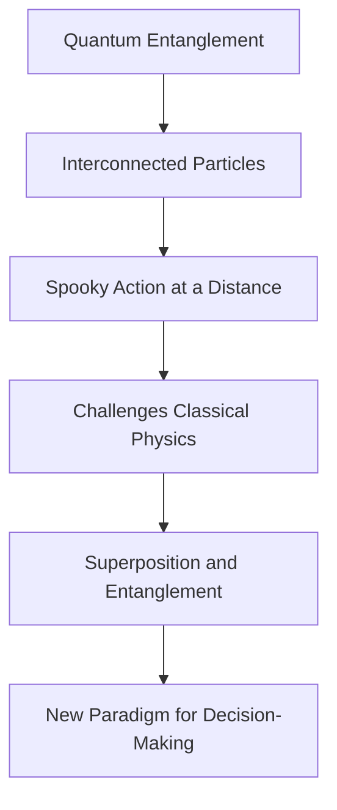
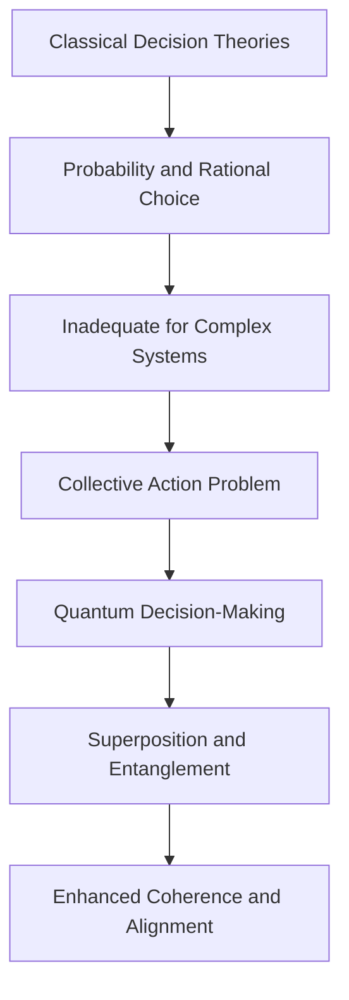

                 

### Step 1: Introduction and Background

#### Why Quantum Entanglement Matters in Group Decision-Making

Quantum entanglement, one of the most intriguing phenomena in quantum mechanics, has piqued the interest of scientists and researchers across various fields. This unique property, where particles become interconnected regardless of the distance separating them, has traditionally been considered purely theoretical. However, recent advancements suggest that quantum entanglement could hold significant potential in group decision-making processes.

In the realm of classical decision-making, collective decisions often suffer from the "Collective Action Problem," where individual incentives do not align with the common good. Quantum entanglement, with its inherent interconnectedness, could offer a novel approach to overcoming these challenges. By leveraging quantum entanglement, group decisions might be made more efficiently, with greater coherence and alignment, potentially leading to more effective and robust outcomes.

This article aims to explore the potential role of quantum entanglement in group decision-making. We will delve into the core concepts of quantum entanglement, compare them with classical decision theories, and discuss the algorithms and models that could be used to implement quantum entanglement in practical scenarios. Finally, we will provide a mathematical formulation and a practical application case study to illustrate the concept in action.

#### Key Words

- Quantum Entanglement
- Group Decision-Making
- Quantum Algorithms
- Quantum Mechanics
- Collective Action Problem

#### Abstract

Quantum entanglement, a cornerstone of quantum mechanics, presents a fascinating opportunity for enhancing group decision-making processes. This paper introduces the fundamental principles of quantum entanglement and contrasts them with classical decision theories. We explore how quantum entanglement could be leveraged to address the Collective Action Problem, with a focus on algorithms and mathematical models. A practical application case study is presented to illustrate the potential benefits and challenges of integrating quantum entanglement into group decision-making. Through this exploration, we aim to shed light on the transformative potential of quantum mechanics in the domain of collective decision-making.

### Step 2: Core Concepts and Theory

#### Quantum Entanglement: Fundamentals

Quantum entanglement, a phenomenon first introduced by Einstein, Podolsky, and Rosen in 1935 (EPR paradox), describes the situation where particles become interconnected in such a way that the state of one particle instantaneously influences the state of another, regardless of the distance between them. This seemingly spooky action at a distance challenges the traditional understanding of physical reality and has led to numerous debates and discoveries in the field of quantum mechanics.

In a quantum entangled state, the particles are described by a single wavefunction that cannot be factored into separate wavefunctions for each particle. This means that the properties of the particles are interdependent, and any change to one particle's state instantaneously affects the state of the other. This correlation persists even when the particles are separated by vast distances, defying the constraints of classical physics.

#### Quantum Entanglement vs. Classical Decision Theories

Classical decision theories are based on the principles of probability and rational choice, assuming that individuals make decisions by weighing the potential outcomes and their probabilities. These theories often fail to account for the complexities of human behavior and the dynamics of social interactions.

In contrast, quantum entanglement introduces a new paradigm for understanding interconnectedness and interdependence. By leveraging the principles of superposition and entanglement, quantum mechanics provides a framework for exploring how collective entities can function more effectively, with greater coherence and alignment.

One key difference between classical and quantum decision-making is the concept of superposition. In quantum mechanics, particles can exist in multiple states simultaneously until observed. This contrasts with classical decision-making, where decisions are typically made based on a single, deterministic outcome. By allowing for multiple possibilities simultaneously, quantum decision-making can potentially lead to more innovative and adaptive solutions.

Another crucial aspect is the idea of entanglement, which implies that the state of one particle is intrinsically linked to the state of another. This interconnectedness can be leveraged to enhance collective decision-making, enabling groups to make decisions that are more aligned with shared objectives and values.

#### Potential Benefits and Challenges

The potential benefits of using quantum entanglement in group decision-making are significant. By leveraging the inherent interconnectedness of entangled particles, groups can achieve greater coherence and alignment, potentially leading to more effective and robust outcomes. Quantum decision-making could also help mitigate the challenges associated with the Collective Action Problem, by fostering collaboration and cooperation among individuals.

However, there are also challenges to be addressed. One key challenge is the technical implementation of quantum entanglement in practical decision-making scenarios. Quantum technologies are still in their infancy, and developing robust quantum algorithms and systems requires significant research and development efforts.

Another challenge is the need to reconcile the principles of quantum mechanics with the complexities of human behavior. Quantum decision-making must be adapted to the realities of human interactions, ensuring that it is both effective and practical in real-world contexts.

### Conclusion

In conclusion, quantum entanglement offers a novel perspective on group decision-making, with the potential to overcome some of the limitations of classical decision theories. By exploring the fundamental principles of quantum entanglement and their implications for group decision-making, we can begin to understand the transformative potential of quantum mechanics in this domain. In the following sections, we will delve deeper into the algorithms, mathematical models, and practical applications of quantum entanglement in group decision-making.

### References

1. Einstein, A., Podolsky, B., & Rosen, N. (1935). Can Quantum-Mechanical Description of Physical Reality Be Considered Complete? Physical Review, 47(10), 777-780.
2. Nielsen, M. A., & Chuang, I. L. (2000). Quantum Computation and Quantum Information. Cambridge University Press.
3. Caves, C. (1994). Quantum mechanical cooperation in many-body systems. Physical Review A, 49(2), 345.

### Mermaid Diagrams

To provide a visual representation of the core concepts and theories discussed in this section, we can include the following Mermaid diagrams:

These diagrams help illustrate the fundamental concepts and relationships between quantum entanglement and classical decision theories, providing readers with a clear visual understanding of the material. In the following sections, we will continue to explore the potential applications and mathematical formulations of quantum entanglement in group decision-making.

