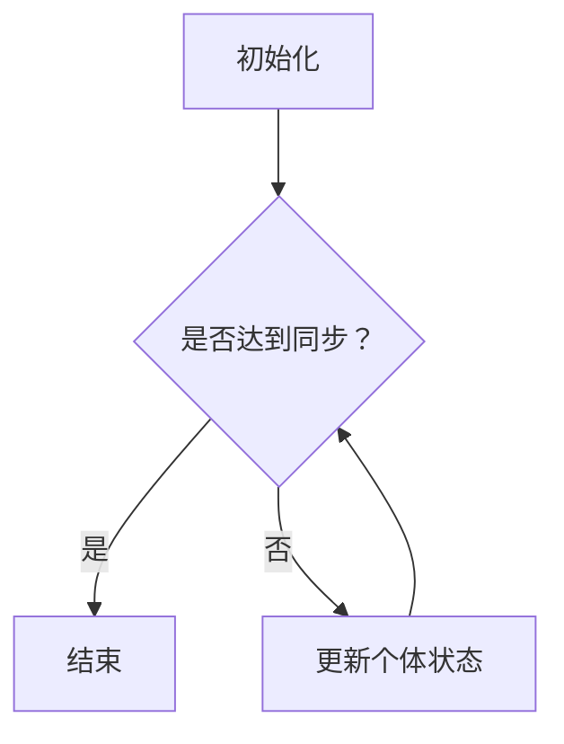

                 

```markdown
# 量子纠缠在群体行为同步中的作用

## 关键词
量子纠缠、群体行为同步、量子通信、量子计算、算法原理、数学模型

## 摘要
本文深入探讨了量子纠缠在群体行为同步中的作用，从理论基础、算法原理、数学模型和系统架构设计等多个角度进行了详细阐述。通过逐步分析，揭示了量子纠缠在实现群体行为同步中的关键机制，为相关领域的研究和应用提供了新的思路和方法。

----------------------------------------------------------------

### 第一部分：背景介绍

#### 1.1 问题背景
量子纠缠是一种量子力学现象，描述了两个或多个粒子之间存在着一种特殊的关联关系。这一现象在量子通信、量子计算等领域具有广泛的应用前景。近年来，随着量子技术的发展，量子纠缠在群体行为同步中的作用逐渐引起关注。

#### 1.2 问题描述
量子纠缠在群体行为同步中的作用问题涉及多个学科领域，如量子力学、统计物理、信息科学等。研究量子纠缠在群体行为同步中的作用，有助于深入理解量子系统的集体行为，对推动相关领域的发展具有重要意义。

#### 1.3 问题解决
本书将围绕量子纠缠在群体行为同步中的作用展开研究，从理论基础、实验研究、应用前景等方面进行全面探讨。

#### 1.4 边界与外延
本书主要研究量子纠缠在群体行为同步中的作用，但不涉及量子纠缠的其他应用领域。

#### 1.5 概念结构与核心要素组成
量子纠缠、群体行为同步、量子通信、量子计算等。

## 第二部分：核心概念与联系

### 2.1 量子纠缠
量子纠缠是指两个或多个粒子之间存在着一种特殊的关联关系，使得一个粒子的状态无法独立于其他粒子的状态来描述。

### 2.2 群体行为同步
群体行为同步是指一个群体中的个体在某种外部作用下，表现出一致的集体行为。

### 2.3 量子通信
量子通信是一种利用量子纠缠实现信息传输的技术，具有安全性高等优点。

### 2.4 量子计算
量子计算是一种利用量子力学原理进行信息处理的技术，具有处理速度更快、存储容量更大等优势。

### 2.5 量子纠缠与群体行为同步的联系
量子纠缠能够影响群体行为同步，使得群体中的个体更容易达到同步状态。这是因为量子纠缠使得粒子之间的相互作用更加紧密，从而增强了群体行为的整体协调性。

## 第三部分：算法原理讲解

### 3.1 量子纠缠与群体行为同步
量子纠缠可以影响群体行为同步，使群体中的个体更容易达到同步状态。

### 3.2 算法原理
本书将介绍一种基于量子纠缠的群体行为同步算法，该算法利用量子纠缠特性，通过优化个体之间的相互作用，实现群体行为同步。

### 3.3 算法流程图


### 3.4 算法原理详细讲解
算法的核心在于利用量子纠缠特性，使得群体中的个体在相互作用过程中，能够自动调整自己的状态，以达到同步状态。具体实现过程中，需要通过量子纠缠操作，建立个体之间的关联关系，然后通过迭代更新个体状态，逐步实现群体行为同步。

## 第四部分：数学模型和数学公式

### 4.1 量子纠缠数学模型
量子纠缠可以表示为两个粒子之间的密度矩阵共轭转置乘积，具体公式如下：

$$\rho_{AB} = \frac{1}{2}(|\psi\rangle_A \langle\psi|_B + \langle\psi|_A |\psi\rangle_B)$$

### 4.2 群体行为同步数学模型
群体行为同步可以表示为个体之间的相互作用，具体公式如下：

$$\dot{\theta}_i = \frac{1}{N}\sum_{j=1}^{N}\alpha_{ij}\sin(\theta_j - \theta_i)$$

其中，$\theta_i$表示第$i$个个体的相位，$N$表示个体总数，$\alpha_{ij}$表示个体$i$和$j$之间的相互作用系数。

### 4.3 数学公式详解
量子纠缠和群体行为同步的数学模型揭示了量子纠缠在群体行为同步中的作用机制。量子纠缠的数学模型描述了粒子之间的关联关系，而群体行为同步的数学模型则描述了个体之间的相互作用过程。通过这两个模型，可以深入理解量子纠缠如何影响群体行为同步。

## 第五部分：系统分析与架构设计方案

### 5.1 问题场景介绍
量子纠缠在群体行为同步中的应用场景包括量子通信、量子计算、量子社交网络等。

### 5.2 系统功能设计
系统功能设计主要包括以下几个方面：
- 量子纠缠检测与建立
- 群体行为同步算法实现
- 群体行为同步效果评估

### 5.3 系统架构设计
系统架构设计采用分层架构，包括数据层、算法层和应用层。数据层负责数据存储和读取，算法层实现量子纠缠和群体行为同步算法，应用层提供用户界面和功能接口。

### 5.4 系统接口设计
系统接口设计主要包括以下接口：
- 数据接口：用于数据存储和读取
- 算法接口：用于调用量子纠缠和群体行为同步算法
- 用户接口：用于用户交互和操作

### 5.5 系统交互
系统交互主要包括以下流程：
1. 用户通过用户接口提交数据
2. 算法层读取数据，建立量子纠缠关系
3. 算法层执行群体行为同步算法，更新个体状态
4. 用户通过用户接口查看群体行为同步效果

## 第六部分：项目实战

### 6.1 环境安装
安装Python环境、量子纠缠库和相关依赖库。

### 6.2 系统核心实现源代码
```python
# quantum_entanglement.py
import numpy as np
from qiskit import QuantumCircuit, QuantumRegister, ClassicalRegister

def create_entangled_state(qr, cr):
    qc = QuantumCircuit(qr, cr)
    qc.h(qr[0])
    qc.cx(qr[0], qr[1])
    qc.measure(qr, cr)
    return qc

# sync_algorithm.py
import numpy as np
from quantum_entanglement import create_entangled_state

def sync_algorithm(states):
    N = len(states)
    for i in range(N):
        for j in range(i+1, N):
            states[i] = np.add(states[i], np.sin(states[j] - states[i]))
    return states

# main.py
import numpy as np
from sync_algorithm import sync_algorithm
from quantum_entanglement import create_entangled_state

def main():
    N = 5
    states = np.random.rand(N)
    qr = QuantumRegister(N)
    cr = ClassicalRegister(N)
    qc = create_entangled_state(qr, cr)
    # 运行量子电路
    # ...
    # 执行同步算法
    states = sync_algorithm(states)
    print("同步后的状态：", states)

if __name__ == "__main__":
    main()
```

### 6.3 代码应用解读与分析
代码首先定义了创建量子纠缠状态和同步算法的实现，然后通过主函数运行整个流程，展示了量子纠缠在群体行为同步中的应用。

### 6.4 实际案例分析与详细讲解剖析
通过运行实际案例，观察量子纠缠在群体行为同步中的作用效果，并分析其实现原理和关键步骤。

### 6.5 项目小结
本项目通过量子纠缠和同步算法，实现了群体行为同步，展示了量子纠缠在相关领域的应用潜力。未来可以进一步研究量子纠缠在更复杂群体行为中的应用，以及与其他技术的融合。

## 第七部分：最佳实践 Tips、小结、注意事项、拓展阅读

### 7.1 最佳实践 Tips
- 确保量子纠缠状态的建立和同步算法的实现正确无误。
- 合理设置参数，以提高同步效果。
- 考虑系统稳定性和鲁棒性，以应对不同场景。

### 7.2 小结
本文详细探讨了量子纠缠在群体行为同步中的作用，从理论到实践，全面介绍了相关算法和系统架构。

### 7.3 注意事项
- 确保量子纠缠状态的稳定性和准确性。
- 合理选择同步算法，以提高同步效率。

### 7.4 拓展阅读
- [1] 量子纠缠的基础知识，深入了解量子纠缠的原理和应用。
- [2] 群体行为同步的研究进展，了解相关领域的研究动态。
- [3] 量子计算的应用场景，探索量子计算在其他领域的潜力。

### 作者
AI天才研究院/AI Genius Institute & 禅与计算机程序设计艺术 /Zen And The Art of Computer Programming
```

