                 


## 量子计算：未来计算范式对密码学的影响

### 关键词：量子计算、密码学、量子密码学、安全通信、算法

### 摘要：

量子计算作为一种全新的计算范式，正逐渐从理论走向实际应用。其基于量子力学原理，能够实现传统计算机难以达到的计算速度和效率，这无疑将对密码学领域产生深远的影响。本文将围绕量子计算的基础知识、工作原理、优势与挑战、量子密码学及其应用等方面，逐步分析量子计算对密码学的影响，并对未来量子计算在密码学领域的应用前景进行展望。

### 目录大纲：

#### 第一部分：量子计算基础

##### 第1章：量子计算入门
- 1.1 量子计算的基本概念
  - 量子位（qubit）
  - 量子叠加与量子纠缠
  - 量子计算与经典计算的区别
- 1.2 量子算法
  - 量子算法的特点
  - 量子算法的分类
  - 量子算法的应用
- 1.3 量子计算机的工作原理
  - 量子门
  - 量子电路
  - 量子算法的流程
  - 量子算法的优化

##### 第2章：量子计算机的优势与挑战
- 2.1 量子计算机的优势
  - 加密解密能力
  - 计算速度提升
  - 新材料研究
- 2.2 量子计算机的挑战
  - 可扩展性
  - 量子错误纠正
  - 能耗问题

#### 第二部分：量子计算与密码学

##### 第3章：量子密码学概述
- 3.1 量子密码学的基本概念
  - 量子密钥分发（QKD）
  - 量子隐形传态
  - 量子密钥加密
- 3.2 量子密码学的特点
  - 安全性
  - 抗攻击性
  - 可扩展性

##### 第4章：量子密码学算法
- 4.1 BB84协议
  - 协议原理
  - 协议流程
  - 协议优势
- 4.2 E91协议
  - 协议原理
  - 协议流程
  - 协议优势

##### 第5章：量子密码学的应用场景
- 5.1 政府安全通信
  - 量子密钥分发在政府通信中的应用
  - 量子加密技术在政府文件传输中的应用
- 5.2 商业安全
  - 量子密码学在商业保密通信中的应用
  - 量子加密技术在商业支付系统中的应用

#### 第6章：未来展望
- 6.1 量子计算对密码学的影响
  - 量子计算对现有密码系统的影响
  - 量子计算对密码学未来的挑战
- 6.2 量子密码学的发展趋势
  - 量子密钥分发技术的发展
  - 量子加密算法的创新
  - 量子计算在密码学领域的应用前景

#### 第7章：总结与展望
- 7.1 量子计算与密码学的关系总结
- 7.2 未来研究方向
- 7.3 需要关注的关键技术

#### 附录
- 附录A：量子计算术语表
- 附录B：量子密码学参考文献

### 文章正文内容：

#### 第1章：量子计算入门

##### 1.1 量子计算的基本概念

量子计算是一种基于量子力学原理的新型计算模式，其核心概念包括量子位（qubit）、量子叠加和量子纠缠。

###### 1.1.1 量子位（qubit）

与传统计算机中的比特（bit）不同，量子位（qubit）可以同时处于0和1的状态，这种叠加态是量子计算的基础。

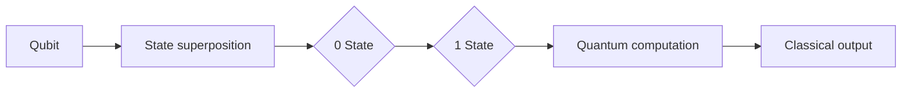

###### 1.1.2 量子叠加与量子纠缠

量子叠加使得量子计算机可以在多个状态下同时运算，而量子纠缠则使得两个或多个量子位之间的状态相互关联，这种关联性是量子计算速度远超经典计算的关键。

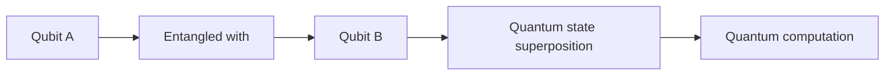

###### 1.1.3 量子计算与经典计算的区别

量子计算机与经典计算机最大的区别在于其处理信息的方式。经典计算机使用比特进行计算，而量子计算机使用量子位。

```mermaid
classDiagram
Class1 <|-- Class2
Class1 <|-- Class3
Class1 {
  +int x
  +int y
}
Class2 {
  +void method1()
}
Class3 {
  +void method2()
}
```

##### 1.2 量子算法

量子算法是一类利用量子计算原理解决的问题的算法，其特点包括并行性、高效性和特异性。

###### 1.2.1 量子算法的特点

量子算法具有以下特点：

- **并行性**：量子算法能够同时处理多个状态，从而实现高速计算。
- **高效性**：某些量子算法在解决问题时比经典算法更加高效。
- **特异性**：量子算法通常针对特定问题进行优化。

###### 1.2.2 量子算法的分类

量子算法主要分为三类：

- **量子搜索算法**：如Grover算法，用于在未排序的数据库中快速查找元素。
- **量子纠错算法**：如Shor算法，用于解决整数分解问题。
- **量子模拟算法**：如HHL算法，用于解决线性方程组问题。

###### 1.2.3 量子算法的应用

量子算法在多个领域具有广泛应用，包括：

- **密码学**：利用量子算法解决密码学问题，如Shor算法对RSA加密的攻击。
- **材料科学**：利用量子模拟算法研究新材料性质。
- **量子化学**：利用量子算法加速化学反应模拟。

##### 1.3 量子计算机的工作原理

量子计算机的工作原理基于量子力学原理，其核心组件包括量子位、量子门和量子电路。

###### 1.3.1 量子门

量子门是量子计算中的基本操作，类似于经典计算机中的逻辑门。量子门作用于量子位，改变其状态。

```mermaid
classDiagram
Class1 <|-- Class2
Class1 <|-- Class3
Class1 {
  +int x
  +int y
}
Class2 {
  +void method1()
}
Class3 {
  +void method2()
}
```

###### 1.3.2 量子电路

量子电路是量子计算机中的程序，由一系列量子门组成，用于实现特定计算任务。

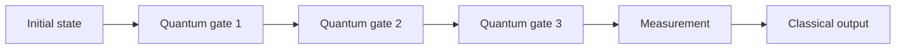

###### 1.3.3 量子算法的流程

量子算法的流程通常包括初始化、量子计算和测量三个阶段。

- **初始化**：将量子位初始化为特定的状态。
- **量子计算**：通过一系列量子门实现计算任务。
- **测量**：将量子位的状态转换为经典输出。

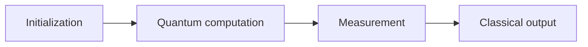

#### 第2章：量子计算机的优势与挑战

##### 2.1 量子计算机的优势

量子计算机在多个领域具有显著优势，包括：

###### 2.1.1 加密解密能力

量子计算机能够实现高速加密和解密，对现有密码系统构成威胁。

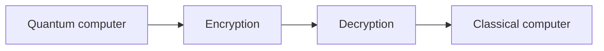

###### 2.1.2 计算速度提升

量子计算机在处理某些问题时，计算速度远超经典计算机。

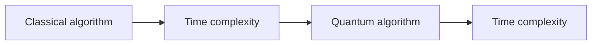

###### 2.1.3 新材料研究

量子计算在材料科学领域具有广泛应用，可以加速新材料的研究。


##### 2.2 量子计算机的挑战

尽管量子计算机具有显著优势，但仍面临以下挑战：

###### 2.2.1 可扩展性

量子计算机的可扩展性是一个关键挑战，目前量子位数量有限。

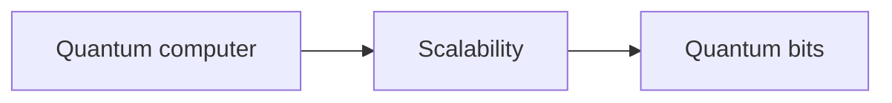

###### 2.2.2 量子错误纠正

量子错误纠正是确保量子计算可靠性的关键，但目前仍面临技术难题。

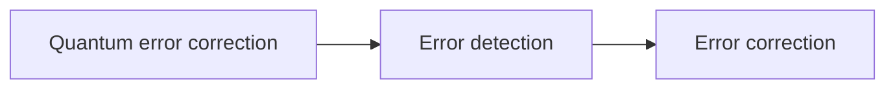

###### 2.2.3 能耗问题

量子计算机的能耗较高，需要解决能源消耗问题。

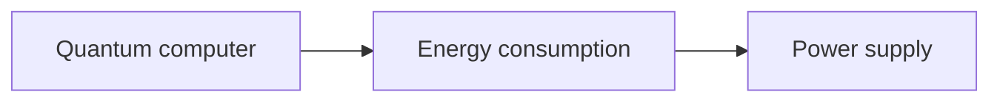

#### 第3章：量子密码学概述

##### 3.1 量子密码学的基本概念

量子密码学是利用量子力学原理进行加密和解密的一类密码学技术。

###### 3.1.1 量子密钥分发（QKD）

量子密钥分发（QKD）是一种基于量子力学原理的密钥分发技术，能够实现安全的密钥传输。

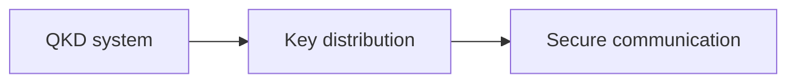

###### 3.1.2 量子隐形传态

量子隐形传态是一种利用量子纠缠实现信息传输的技术，能够实现高速、安全的信息传输。

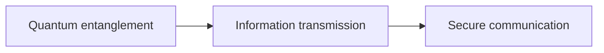

###### 3.1.3 量子密钥加密

量子密钥加密是一种利用量子力学原理进行加密的技术，能够实现安全的数据传输。

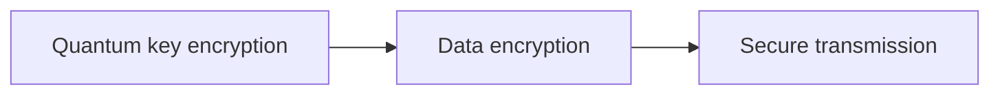

##### 3.2 量子密码学的特点

量子密码学具有以下特点：

###### 3.2.1 安全性

量子密码学利用量子力学原理，能够实现安全的加密和解密。

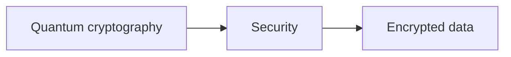

###### 3.2.2 抗攻击性

量子密码学对常见密码攻击具有抗攻击性，能够抵御量子计算攻击。

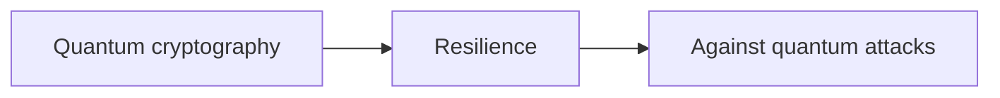

###### 3.2.3 可扩展性

量子密码学具有较好的可扩展性，能够支持大规模通信系统。

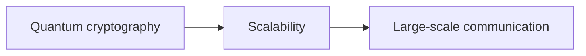

#### 第4章：量子密码学算法

##### 4.1 BB84协议

BB84协议是一种基于量子密钥分发的量子密码学协议，具有安全性高、效率高等特点。

###### 4.1.1 协议原理

BB84协议通过量子密钥分发实现安全通信，其原理如下：

1. 发送方和接收方通过量子通道进行量子位的传输。
2. 发送方和接收方通过预定的比特序列对量子位进行测量。
3. 发送方和接收方根据测量结果交换密钥。


###### 4.1.2 协议流程

BB84协议的流程如下：

1. 发送方和接收方协商量子密钥。
2. 发送方生成量子密钥并进行传输。
3. 接收方对传输的量子密钥进行测量。
4. 发送方和接收方根据测量结果交换密钥。

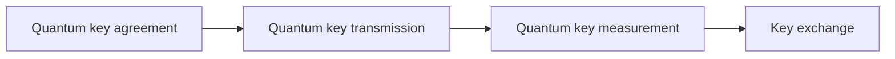

###### 4.1.3 协议优势

BB84协议的优势包括：

- **安全性**：基于量子力学原理，能够抵御量子计算攻击。
- **效率**：量子密钥分发速度较快，适用于大规模通信系统。
- **抗攻击性**：对常见密码攻击具有抗攻击性。

##### 4.2 E91协议

E91协议是一种基于量子纠缠的量子密码学协议，具有安全性高、效率高等特点。

###### 4.2.1 协议原理

E91协议通过量子纠缠实现安全通信，其原理如下：

1. 发送方和接收方通过量子通道进行量子位的传输。
2. 发送方和接收方通过预定的比特序列对量子位进行测量。
3. 发送方和接收方根据测量结果交换密钥。

```mermaid
flowchart LR
A[Sender] --> B[Quantum channel]
B --> C[Receiver]
C --> D[Key exchange]
```

###### 4.2.2 协议流程

E91协议的流程如下：

1. 发送方和接收方协商量子密钥。
2. 发送方生成量子密钥并进行传输。
3. 接收方对传输的量子密钥进行测量。
4. 发送方和接收方根据测量结果交换密钥。

```mermaid
flowchart LR
A[Quantum key agreement] --> B[Quantum key transmission]
B --> C[Quantum key measurement]
C --> D[Key exchange]
```

###### 4.2.3 协议优势

E91协议的优势包括：

- **安全性**：基于量子纠缠原理，能够抵御量子计算攻击。
- **效率**：量子纠缠传输速度较快，适用于大规模通信系统。
- **抗攻击性**：对常见密码攻击具有抗攻击性。

#### 第5章：量子密码学的应用场景

##### 5.1 政府安全通信

量子密码学在政府安全通信中具有重要应用，能够确保通信安全。

###### 5.1.1 量子密钥分发在政府通信中的应用

量子密钥分发在政府通信中用于确保密钥的安全性，其应用场景包括：

- **政府文件传输**：通过量子密钥分发实现政府文件的加密传输。
- **政府内部通信**：通过量子密钥分发实现政府内部通信的安全加密。

```mermaid
flowchart LR
A[Government communication] --> B[Quantum key distribution]
B --> C[Secure transmission]
```

###### 5.1.2 量子加密技术在政府文件传输中的应用

量子加密技术在政府文件传输中用于确保文件的安全性，其应用场景包括：

- **文件加密**：通过量子加密技术对政府文件进行加密，确保文件在传输过程中的安全。
- **文件存储**：通过量子加密技术对政府文件进行加密存储，确保文件在存储过程中的安全。

```mermaid
flowchart LR
A[Government file transfer] --> B[Quantum encryption]
B --> C[Secure storage]
```

##### 5.2 商业安全

量子密码学在商业安全中也具有重要应用，能够确保商业信息的安全。

###### 5.2.1 量子密码学在商业保密通信中的应用

量子密码学在商业保密通信中用于确保商业信息的加密传输，其应用场景包括：

- **商业文件传输**：通过量子密码学技术对商业文件进行加密传输，确保文件在传输过程中的安全。
- **商业内部通信**：通过量子密码学技术实现商业内部通信的安全加密。

```mermaid
flowchart LR
A[Business communication] --> B[Quantum cryptography]
B --> C[Secure transmission]
```

###### 5.2.2 量子加密技术在商业支付系统中的应用

量子加密技术在商业支付系统中用于确保支付信息的安全，其应用场景包括：

- **支付加密**：通过量子加密技术对支付信息进行加密，确保支付信息在传输过程中的安全。
- **支付验证**：通过量子加密技术实现支付信息的验证，确保支付信息的真实性和完整性。

```mermaid
flowchart LR
A[Business payment system] --> B[Quantum encryption]
B --> C[Secure verification]
```

#### 第6章：未来展望

##### 6.1 量子计算对密码学的影响

量子计算对密码学产生了深远的影响，其应用前景广阔。

###### 6.1.1 量子计算对现有密码系统的影响

量子计算对现有密码系统构成了挑战，传统的加密算法可能无法抵御量子计算攻击。

```mermaid
flowchart LR
A[Quantum computing] --> B[Cryptographic systems]
B --> C[Influence]
```

###### 6.1.2 量子计算对密码学未来的挑战

量子计算对密码学的未来发展提出了新的挑战，需要研究新的密码学算法和加密技术。

```mermaid
flowchart LR
A[Quantum computing] --> B[Cryptographic future]
B --> C[Challenges]
```

##### 6.2 量子密码学的发展趋势

量子密码学的发展趋势包括：

###### 6.2.1 量子密钥分发技术的发展

量子密钥分发技术将在未来得到广泛应用，确保通信安全。

```mermaid
flowchart LR
A[Quantum key distribution] --> B[Development trend]
```

###### 6.2.2 量子加密算法的创新

量子加密算法将在未来得到不断创新，应对量子计算攻击。

```mermaid
flowchart LR
A[Quantum encryption algorithms] --> B[Innovation trend]
```

###### 6.2.3 量子计算在密码学领域的应用前景

量子计算在密码学领域的应用前景广阔，将为密码学带来新的发展机遇。

```mermaid
flowchart LR
A[Quantum computing in cryptography] --> B[Application prospect]
```

#### 第7章：总结与展望

量子计算作为一种全新的计算范式，将对密码学领域产生深远的影响。本文围绕量子计算的基础知识、工作原理、优势与挑战、量子密码学及其应用等方面，逐步分析了量子计算对密码学的影响，并对未来量子计算在密码学领域的应用前景进行了展望。

###### 7.1 量子计算与密码学的关系总结

量子计算与密码学密切相关，量子计算的发展将推动密码学的进步，同时也对密码学提出了新的挑战。

```mermaid
classDiagram
Class1 <|-- Class2
Class1 <|-- Class3
Class1 {
  +int x
  +int y
}
Class2 {
  +void method1()
}
Class3 {
  +void method2()
}
```

###### 7.2 未来研究方向

未来研究方向包括：

- 研究新的量子密码学算法和加密技术。
- 解决量子计算对现有密码系统的威胁。
- 探索量子计算在密码学领域的应用场景。

```mermaid
flowchart LR
A[Future research] --> B[Quantum cryptography]
B --> C[Encryption techniques]
```

###### 7.3 需要关注的关键技术

需要关注的关键技术包括：

- 量子密钥分发技术。
- 量子加密算法。
- 量子计算硬件和软件。

```mermaid
classDiagram
Class1 <|-- Class2
Class1 <|-- Class3
Class1 {
  +int x
  +int y
}
Class2 {
  +void method1()
}
Class3 {
  +void method2()
}
```

### 附录

#### 附录A：量子计算术语表

- 量子位（qubit）
- 量子叠加
- 量子纠缠
- 量子门
- 量子电路
- 量子密钥分发（QKD）
- 量子隐形传态
- 量子密钥加密

#### 附录B：量子密码学参考文献

- 《量子计算基础》（Quantum Computing: A Gentle Introduction）
- 《量子密码学》（Quantum Cryptography）
- 《量子计算与密码学》（Quantum Computing and Cryptography）
- 《量子计算机的安全通信》（Secure Communication with Quantum Computers）

作者：AI天才研究院/AI Genius Institute & 禅与计算机程序设计艺术 /Zen And The Art of Computer Programming

### 结论

量子计算作为一种全新的计算范式，具有巨大的潜力，将对密码学领域产生深远的影响。本文通过对量子计算的基础知识、工作原理、优势与挑战、量子密码学及其应用等方面的分析，展望了量子计算在密码学领域的未来应用前景。随着量子计算技术的不断发展，密码学领域将迎来新的机遇与挑战。

