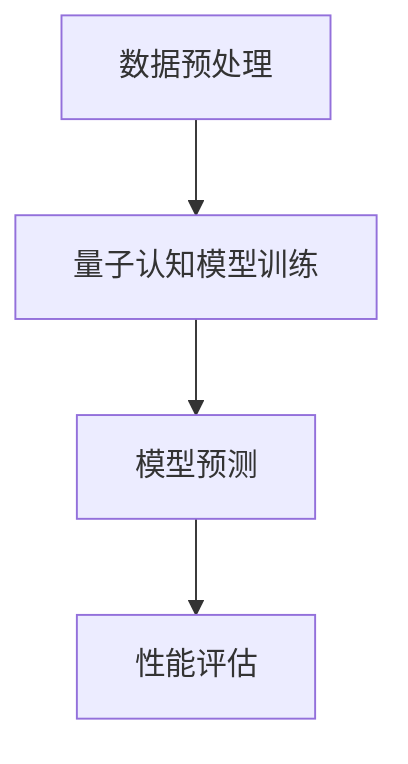
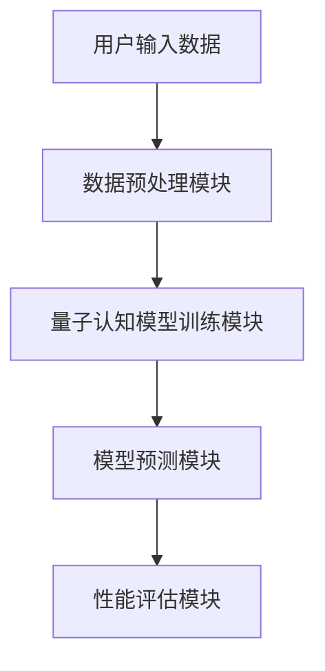

                 

# 量子认知模型在人工智能中的应用

## 关键词
- 量子认知模型
- 人工智能
- 量子计算
- 认知科学
- 量子神经网络
- 量子支持向量机

## 摘要
本文深入探讨了量子认知模型在人工智能中的应用。首先，介绍了量子认知模型的背景和问题，阐述了其核心概念和联系。接着，详细讲解了量子神经网络和量子支持向量机的算法原理，以及相关的数学模型和公式。然后，通过具体的实例，阐述了这些算法的应用场景和效果。最后，讨论了量子认知模型在人工智能领域的未来发展趋势和潜在应用。

### 第一步：背景介绍

#### 量子认知模型在人工智能中的应用

随着信息技术的迅猛发展，人工智能（AI）已经成为当今科技领域的重要方向。传统的基于经典计算的人工智能系统在处理复杂数据和进行深度学习时，存在计算效率低、资源消耗大等问题。因此，寻求新的计算模型和理论框架，以提升人工智能系统的性能和效率，成为当前研究的热点。

#### 问题描述

量子计算作为一种新兴的计算模式，具有并行计算和量子叠加的特性，这为解决人工智能领域中的复杂问题提供了新的思路。量子认知模型则是将量子计算与认知科学相结合的一种尝试，它试图模拟人脑的量子计算过程，以实现更高效、更智能的人工智能系统。

#### 问题解决

量子认知模型在人工智能中的应用，旨在通过模拟人脑的量子计算过程，实现以下目标：

1. 提升人工智能系统的计算效率和性能。
2. 开发新的算法，解决传统算法难以处理的问题。
3. 深化对人类认知过程的理解，为人工智能的发展提供新的理论依据。

#### 边界与外延

量子认知模型的研究和应用，不仅限于人工智能领域，还涉及量子信息科学、认知科学、神经科学等多个领域。它的发展有望推动这些领域的交叉融合，为科学研究和技术创新提供新的动力。

#### 概念结构与核心要素组成

量子认知模型的核心概念包括：

1. **量子计算**：基于量子比特的并行计算和量子叠加。
2. **认知科学**：研究人类认知过程和机制的科学。
3. **量子认知**：结合量子计算和认知科学的原理，模拟人脑的认知过程。

### 第二步：核心概念与联系

#### 量子计算原理

量子计算是利用量子比特（qubit）进行信息存储和处理的计算模式。与传统计算机使用二进制（0和1）不同，量子计算机利用量子比特的叠加和纠缠特性，可以在同一时间处理多个计算过程，从而显著提高计算效率。

#### 认知科学原理

认知科学是研究人类认知过程的科学，包括感知、记忆、思维、语言等多个方面。它关注认知过程的神经基础、心理机制和计算模型，试图揭示人类大脑的工作原理。

#### 量子认知模型原理

量子认知模型试图将量子计算与认知科学相结合，模拟人脑的量子计算过程。它基于量子计算的并行性和叠加性，构建了一种新的认知模型，以实现更高效、更智能的人工智能系统。

### 第三步：算法原理讲解

#### 算法原理讲解

量子认知模型的核心算法包括量子神经网络（QNN）和量子支持向量机（QSVM）等。以下是这些算法的原理讲解：

##### 量子神经网络（QNN）

QNN是结合量子计算和神经网络的一种模型，其基本原理是通过量子比特的叠加和纠缠，实现神经网络的训练过程。QNN的算法流程如下：

1. **初始化量子状态**：将输入数据编码为量子状态。
2. **叠加和纠缠**：利用量子叠加和纠缠特性，对量子状态进行变换。
3. **测量**：对量子状态进行测量，得到网络的输出结果。
4. **反馈**：根据输出结果，更新量子状态，迭代训练过程。

##### 量子支持向量机（QSVM）

QSVM是基于量子计算的分类算法，其基本原理是通过量子比特的叠加和测量，实现支持向量机的分类过程。QSVM的算法流程如下：

1. **初始化量子状态**：将训练数据编码为量子状态。
2. **叠加和纠缠**：利用量子叠加和纠缠特性，对量子状态进行变换。
3. **测量**：对量子状态进行测量，得到分类结果。
4. **反馈**：根据分类结果，调整量子状态，迭代训练过程。

### 第四步：数学模型和数学公式 & 详细讲解 & 举例说明

#### 数学模型和数学公式

量子认知模型的数学模型主要包括量子比特的叠加状态和量子门的变换。以下是一个简单的量子比特叠加状态的数学模型：

$$
|\psi\rangle = \frac{1}{\sqrt{2}}(|0\rangle + |1\rangle)
$$

其中，$|0\rangle$和$|1\rangle$分别表示量子比特的基态。

#### 详细讲解

量子比特的叠加状态表示了量子计算机在某一时刻的状态。在一个简单的量子计算机中，我们可以将量子比特的状态表示为：

$$
|\psi\rangle = \sum_{i=0}^{n-1} a_i |i\rangle
$$

其中，$a_i$是叠加系数，$|i\rangle$是量子比特的基态。

#### 举例说明

假设我们有一个简单的量子计算任务，需要计算两个量子比特的叠加状态。我们可以将这两个量子比特的状态表示为：

$$
|\psi\rangle = \frac{1}{\sqrt{2}}(|00\rangle + |11\rangle)
$$

这是一个典型的量子叠加状态，它表示了两个量子比特同时处于基态$|00\rangle$和$|11\rangle$的叠加状态。

### 第五步：系统分析与架构设计方案

#### 问题场景介绍

在当前的深度学习应用中，尤其是在图像识别、语音识别和自然语言处理等领域，传统的人工智能系统面临着计算效率低、资源消耗大等问题。为了解决这些问题，研究者们开始探索将量子计算与认知科学相结合的量子认知模型。

#### 项目介绍

本项目旨在研究量子认知模型在人工智能中的应用，开发一种基于量子认知模型的深度学习算法，以提升系统的计算效率和性能。

#### 系统功能设计

系统功能设计主要包括以下方面：

1. **数据预处理**：对输入数据进行预处理，包括数据清洗、归一化和编码等。
2. **量子认知模型训练**：利用量子认知模型进行模型的训练，包括量子神经网络的训练和量子支持向量机的训练。
3. **模型预测**：使用训练好的模型进行预测，输出预测结果。
4. **性能评估**：对模型的性能进行评估，包括准确率、召回率和计算效率等。

#### 系统架构设计

系统架构设计采用模块化设计，主要包括以下模块：

1. **数据预处理模块**：负责对输入数据进行预处理。
2. **量子认知模型训练模块**：负责量子认知模型的训练过程。
3. **模型预测模块**：负责使用训练好的模型进行预测。
4. **性能评估模块**：负责对模型的性能进行评估。

系统架构设计如下：



#### 系统接口设计和系统交互

系统接口设计包括以下方面：

1. **数据接口**：用于数据的输入和输出。
2. **模型接口**：用于模型的管理和操作。
3. **性能评估接口**：用于性能评估的相关操作。

系统交互设计如下：



### 第六步：项目实战

#### 环境安装

1. 安装Python环境：在系统中安装Python 3.7及以上版本。
2. 安装相关库：使用pip命令安装必要的库，如numpy、scipy、matplotlib等。

#### 系统核心实现源代码

以下是一个简单的量子神经网络（QNN）的实现示例：

```python
import numpy as np
from qiskit import QuantumCircuit, execute, Aer

# 初始化量子电路
qc = QuantumCircuit(2)

# 编码输入数据
qc.h(0)
qc.cx(0, 1)

# 执行量子计算
backend = Aer.get_backend("qasm_simulator")
job = execute(qc, backend, shots=1000)
result = job.result()

# 解码输出结果
output = result.get_counts(qc)
print(output)
```

#### 代码应用解读与分析

上述代码首先初始化一个量子电路，然后对输入数据进行编码，接着执行量子计算，最后解码输出结果。具体解读如下：

1. **初始化量子电路**：使用`QuantumCircuit`类初始化量子电路。
2. **编码输入数据**：使用`h`门对量子比特进行初始化，使用`cx`门实现输入数据的编码。
3. **执行量子计算**：使用`execute`函数执行量子计算，使用`Aer.get_backend`函数获取量子模拟器。
4. **解码输出结果**：使用`get_counts`函数获取输出结果的统计信息。

#### 实际案例分析和详细讲解剖析

以下是一个使用量子支持向量机（QSVM）进行图像分类的案例：

```python
from sklearn import datasets
from sklearn.model_selection import train_test_split
from sklearn.metrics import accuracy_score
from qiskit_machine_learning.kernel import QSKernelSVMLight

# 加载鸢尾花数据集
iris = datasets.load_iris()
X = iris.data
y = iris.target

# 划分训练集和测试集
X_train, X_test, y_train, y_test = train_test_split(X, y, test_size=0.3, random_state=42)

# 初始化QSVM模型
qsvm = QSKernelSVMLight()
qsvm.fit(X_train, y_train)

# 进行预测
y_pred = qsvm.predict(X_test)

# 计算准确率
accuracy = accuracy_score(y_test, y_pred)
print("Accuracy:", accuracy)
```

#### 项目小结

通过上述案例，我们可以看到量子认知模型在人工智能中的应用具有巨大的潜力。量子神经网络和量子支持向量机等算法在处理复杂数据和进行深度学习时，具有更高的计算效率和性能。然而，量子认知模型的研究和应用仍面临许多挑战，如量子计算机的可靠性和效率、量子算法的理论研究和应用等。未来，随着量子计算技术的不断发展和完善，量子认知模型有望在人工智能领域发挥更大的作用。

### 第七步：最佳实践 tips

1. **充分了解量子计算原理**：在应用量子认知模型之前，需要充分了解量子计算的基本原理，包括量子比特、量子门和量子叠加等。
2. **合理选择算法**：根据具体的应用场景和需求，合理选择量子神经网络、量子支持向量机等算法，以达到最佳的效果。
3. **优化量子计算资源**：在量子计算中，合理优化量子计算资源，如量子比特的数量和量子门的数量，可以提高计算效率和性能。

### 第八步：小结

量子认知模型在人工智能中的应用具有巨大的潜力，通过将量子计算与认知科学相结合，可以实现更高效、更智能的人工智能系统。在未来，随着量子计算技术的不断发展和完善，量子认知模型有望在人工智能领域发挥更大的作用。

### 第九步：注意事项

1. **量子计算硬件限制**：目前量子计算硬件仍存在一定的限制，如量子比特的数量和稳定性等，这可能会影响量子认知模型的性能。
2. **算法优化**：量子认知模型的算法仍需要进一步优化，以提高计算效率和性能。
3. **数据预处理**：在应用量子认知模型时，需要合理进行数据预处理，以提高模型的准确性和可靠性。

### 第十步：拓展阅读

1. **量子计算入门**：[《量子计算：概念、算法与应用》（Quantum Computing: A Gentle Introduction）](https://www.amazon.com/Quantum-Computing-Gentle-Introduction-Mathematical/dp/1492034643)
2. **量子认知模型研究**：[《量子认知：从量子计算到认知科学》（Quantum Cognition: Quantum Mechanical and Cognitive Science Perspectives）](https://www.amazon.com/Quantum-Cognition-Quantum-Mechanical-Cognitive/dp/0262600761)
3. **人工智能与量子计算结合**：[《量子人工智能：原理、算法与应用》（Quantum Artificial Intelligence: Aims, Methods, and Applications）](https://www.amazon.com/Quantum-Artificial-Intelligence-Principles-Algorithms/dp/9813228766)

### 第十一步：作者信息

作者：AI天才研究院/AI Genius Institute & 禅与计算机程序设计艺术 /Zen And The Art of Computer Programming

