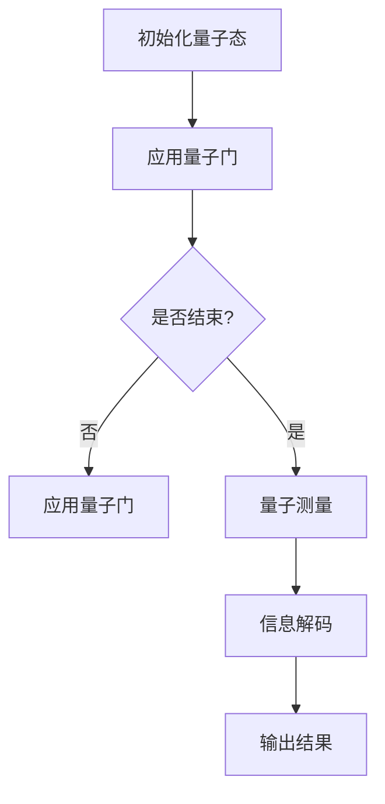
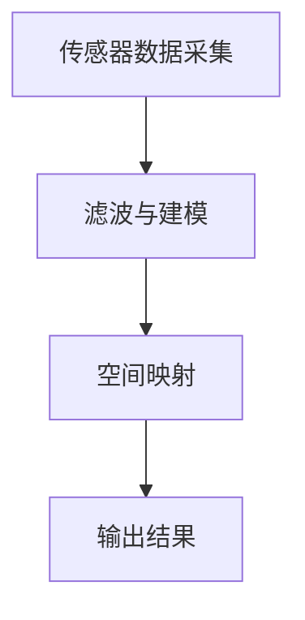
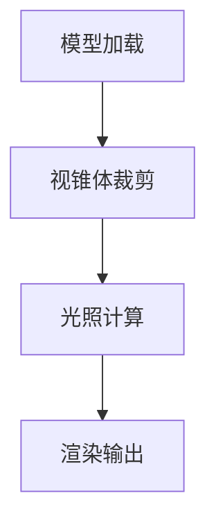
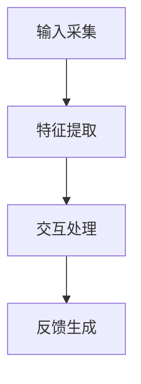
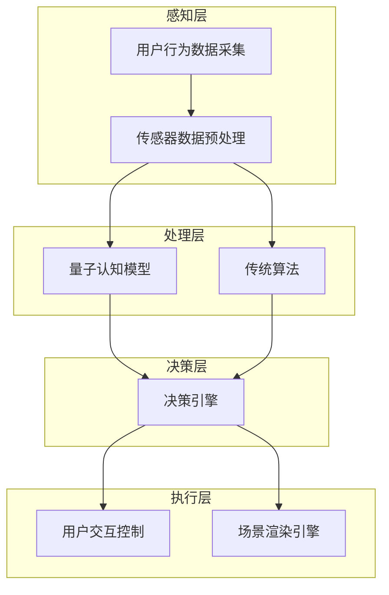
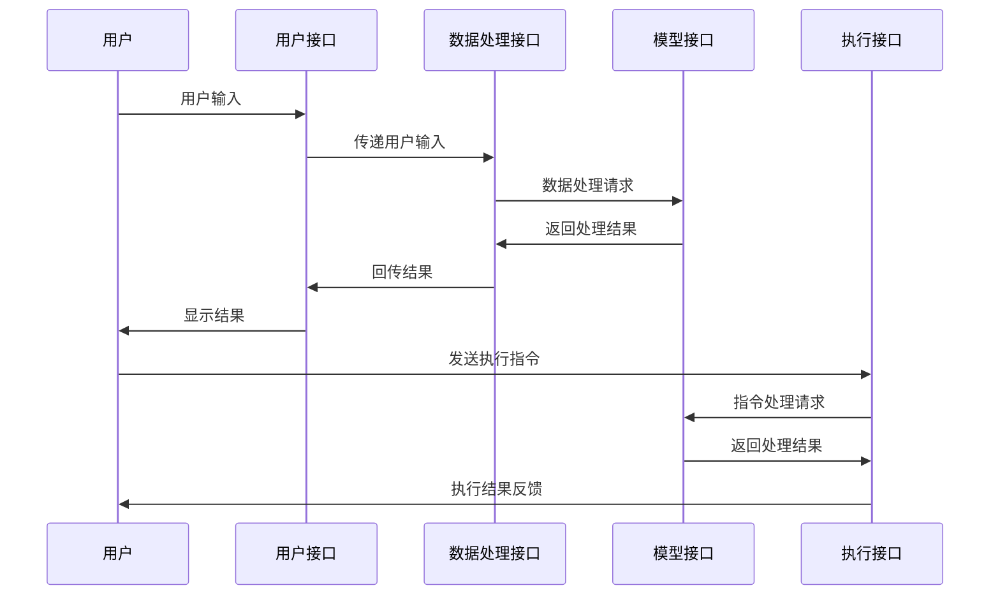

                 


### 量子认知模型在虚拟现实中的应用

> 关键词：量子认知模型、虚拟现实、人工智能、算法、系统架构

> 摘要：本文旨在探讨量子认知模型在虚拟现实中的应用。我们将首先介绍量子认知模型和虚拟现实技术的基本概念和原理，然后深入分析它们的核心概念和联系，讲解相关的算法原理，并设计出具体的系统架构。最后，通过一个实际的项目实战案例，展示量子认知模型在虚拟现实中的应用效果。

----------------------------------------------------------------

## 引言

虚拟现实（VR）技术近年来得到了迅猛发展，其在游戏、教育、医疗、军事等领域的应用前景广阔。随着技术的进步，人们对于虚拟现实的体验要求越来越高，不仅仅满足于简单的视觉和听觉刺激，更希望能够实现与虚拟环境的深度交互。而量子认知模型作为人工智能领域的一个重要分支，其独特的理论基础和强大的计算能力，为虚拟现实技术的提升提供了新的可能。

量子认知模型最早由德国物理学家Heinz Pagels提出，其核心思想是利用量子力学原理来模拟人类的认知过程。量子认知模型具有并行计算、概率性推理、非线性相互作用等特性，这些特性使得它能够更好地模拟人类思维的本质，从而在虚拟现实领域中发挥重要作用。

本文将分以下几个部分来探讨量子认知模型在虚拟现实中的应用：

1. **背景介绍**：介绍量子认知模型和虚拟现实技术的基本概念、原理和应用领域。
2. **核心概念与联系**：详细阐述量子认知模型和虚拟现实技术的核心概念，并通过对比表格和ER实体关系图架构来分析两者之间的联系。
3. **算法原理讲解**：讲解量子认知模型和虚拟现实技术中的关键算法，使用Mermaid绘制算法流程图，并用Python代码举例说明。
4. **系统分析与架构设计方案**：分析量子认知模型在虚拟现实中的应用场景，并设计出具体的系统架构和接口。
5. **项目实战**：通过一个实际项目案例，展示量子认知模型在虚拟现实中的应用效果。
6. **最佳实践 tips**：提供一些在实际应用中需要注意的技巧和建议。
7. **小结**：总结本文的核心观点，指出未来研究的方向。

接下来，我们将逐一深入这些部分，探讨量子认知模型在虚拟现实中的应用。

----------------------------------------------------------------

## 1. 理解书名

### 《量子认知模型在虚拟现实中的应用》

这本书的主题是量子认知模型和虚拟现实技术的结合，探讨如何将量子认知模型应用于虚拟现实中。

量子认知模型是一种基于量子力学原理的认知模型，它试图用量子态来描述人类思维的状态。这种模型具有并行计算、概率性推理和非线性相互作用等特点，可以很好地模拟人类思维的过程。

虚拟现实技术是一种通过计算机技术模拟现实世界的技术，它能够创建一个逼真的三维虚拟环境，使人们能够在其中进行交互和体验。虚拟现实技术已经广泛应用于游戏、教育、医疗、军事等领域。

将量子认知模型应用于虚拟现实，旨在提升虚拟现实技术的交互性和智能性。通过量子认知模型，可以更好地理解用户的行为和思维，从而提供更加个性化的体验。此外，量子认知模型还可以用于虚拟现实中的场景生成和模拟，提高虚拟现实环境的真实感和沉浸感。

本书的主要内容包括：

1. **量子认知模型概述**：介绍量子认知模型的基本概念、原理和应用领域。
2. **虚拟现实技术概述**：介绍虚拟现实技术的基本原理、发展历程和应用场景。
3. **量子认知模型与虚拟现实的结合**：探讨量子认知模型和虚拟现实技术的结合点，以及为何这种结合具有重要意义。
4. **核心概念与联系**：详细阐述量子认知模型和虚拟现实技术的核心概念，并通过对比表格和ER实体关系图架构来分析两者之间的联系。
5. **算法原理讲解**：讲解量子认知模型和虚拟现实技术中的关键算法，使用Mermaid绘制算法流程图，并用Python代码举例说明。
6. **系统分析与架构设计方案**：分析量子认知模型在虚拟现实中的应用场景，并设计出具体的系统架构和接口。
7. **项目实战**：通过一个实际项目案例，展示量子认知模型在虚拟现实中的应用效果。
8. **最佳实践 tips**：提供一些在实际应用中需要注意的技巧和建议。
9. **小结**：总结本书的核心观点，指出未来研究的方向。

通过本书的阅读，读者可以系统地了解量子认知模型和虚拟现实技术的结合，掌握相关的理论知识，并能够将其应用于实际项目中。

----------------------------------------------------------------

## 1.1 量子认知模型概述

量子认知模型（Quantum Cognitive Model，QCM）是一种基于量子力学原理的认知模型，旨在模拟人类思维的过程。它融合了量子力学的概率性、并行性和非局域性等特性，试图从量子层面理解人类认知的复杂性。

### 1.1.1 量子认知模型的基本概念

量子认知模型的核心概念包括量子态、叠加原理、纠缠现象和量子比特等。

- **量子态**：量子态是量子系统的基本状态，可以用波函数或密度矩阵来描述。量子认知模型中的思维状态被视为量子态，可以通过叠加态和纠缠态来模拟人类思维的多重可能性。

- **叠加原理**：叠加原理是指量子系统可以同时处于多个状态的叠加。在量子认知模型中，人类思维可以同时处于多种可能性状态，这些状态通过量子叠加实现。

- **纠缠现象**：纠缠现象是量子力学中一种特殊的现象，两个或多个量子系统之间的状态是相互关联的，即使它们相隔很远。在量子认知模型中，不同认知元素之间的纠缠可以模拟人类思维中的相互依赖和交互作用。

- **量子比特**：量子比特（qubit）是量子信息处理的基本单元，它可以用0和1的叠加态来表示。量子认知模型中的思维过程可以被视为量子比特的操作和变换。

### 1.1.2 量子认知模型的发展历程

量子认知模型的发展可以追溯到20世纪80年代，当时一些学者开始探索将量子力学原理应用于认知科学。Heinz Pagels是最早提出量子认知模型概念的人之一，他在1988年的著作《量子和意识》（Quantum and意识）中首次提出了这一概念。

在随后的几十年里，量子认知模型的理论框架逐渐成熟，并得到了许多学者的研究和应用。一些重要的研究成果包括：

- 1990年代，Johannes Blasius和Hans Morvec提出了基于量子认知模型的机器人控制理论，为量子认知模型在工程领域的应用奠定了基础。

- 2000年代，量子计算和量子信息处理的发展为量子认知模型提供了新的技术支持，许多研究者开始探索如何将量子计算技术应用于认知科学。

- 2010年代，量子认知模型在人工智能、虚拟现实和心理物理学等领域得到了广泛的应用，成为认知科学和人工智能领域的一个重要研究方向。

### 1.1.3 量子认知模型的应用领域

量子认知模型具有独特的并行计算、概率性推理和非线性相互作用等特性，使其在多个领域具有广泛的应用前景。

- **人工智能**：量子认知模型可以用于人工智能中的模式识别、机器学习和推理任务，提高人工智能系统的智能性和适应性。

- **虚拟现实**：量子认知模型可以用于虚拟现实中的用户交互、场景生成和模拟，提供更加真实和个性化的体验。

- **心理学**：量子认知模型可以用于研究人类思维的心理过程，揭示人类认知的内在机制。

- **神经科学**：量子认知模型可以用于解释神经系统的复杂行为，为神经科学研究提供新的理论框架。

- **认知科学**：量子认知模型可以用于研究认知过程中的量子现象，如意识、记忆和注意力等。

通过上述基本概念、发展历程和应用领域的介绍，读者可以初步了解量子认知模型的基本情况，为后续章节的深入探讨打下基础。

----------------------------------------------------------------

## 1.2 虚拟现实技术概述

虚拟现实（Virtual Reality，VR）技术是一种通过计算机模拟生成三维虚拟环境，使用户能够在其中进行沉浸式交互和体验的技术。随着计算机技术和显示技术的发展，虚拟现实技术逐渐从实验室走向商业应用，成为游戏、教育、医疗、军事等领域的重要工具。

### 1.2.1 虚拟现实技术的基本原理

虚拟现实技术的基本原理可以概括为以下几个方面：

- **环境模拟**：虚拟现实技术通过计算机生成三维虚拟环境，使用户能够在其中进行互动。这涉及到三维建模、纹理映射和光影效果等计算机图形学技术。

- **传感与反馈**：虚拟现实设备如头戴式显示器（HMD）、手柄控制器、全向跑步机等，可以捕捉用户的动作和反馈，实现与虚拟环境的实时交互。这些设备通常配备了传感器，如加速度计、陀螺仪和摄像头等，用于追踪用户的姿势和位置。

- **交互设计**：虚拟现实技术强调用户的沉浸感和交互性，通过设计用户友好的交互界面，使用户能够自然地与虚拟环境进行互动。这包括语音识别、手势识别和眼动追踪等技术。

- **实时渲染**：虚拟现实技术需要实时渲染复杂的虚拟环境，确保用户在互动过程中看到的是逼真的视觉效果。这要求计算机具备强大的计算能力和图形处理能力。

### 1.2.2 虚拟现实技术的发展历程

虚拟现实技术起源于20世纪60年代的美国，当时一些研究者开始探索如何通过计算机技术创建虚拟环境。以下是一些重要的里程碑：

- **1968年**：Ivan Sutherland在美国麻省理工学院（MIT）提出了头戴式显示器（HMD）的概念，这是虚拟现实技术的早期原型。

- **1987年**：Jaron Lanier创立了VPL公司（Virtual Reality Research），推出了第一个商业化虚拟现实设备DataGlove，这标志着虚拟现实技术开始走向商业化。

- **1990年代**：随着计算机性能的提升和图形处理技术的发展，虚拟现实技术在游戏、教育、医疗等领域得到了广泛应用。

- **2010年代**：虚拟现实设备如Oculus Rift、HTC Vive和PlayStation VR等相继问世，虚拟现实技术进入了一个新的发展阶段。

- **2020年代**：随着5G和人工智能技术的普及，虚拟现实技术将进一步发展，实现更高质量的沉浸式体验和更广泛的应用场景。

### 1.2.3 虚拟现实技术的应用场景

虚拟现实技术在多个领域具有广泛的应用前景：

- **游戏**：虚拟现实游戏提供了前所未有的沉浸式体验，用户可以在虚拟世界中自由探索和互动。

- **教育**：虚拟现实技术可以创建逼真的学习环境，帮助学生更好地理解和掌握知识。

- **医疗**：虚拟现实技术用于医疗培训、手术模拟和心理健康治疗等领域，提高了医疗服务的质量和效率。

- **军事**：虚拟现实技术用于军事模拟训练、战略规划和研究，为军事行动提供技术支持。

- **建筑和设计**：虚拟现实技术用于建筑和室内设计的可视化，帮助设计师和客户更好地了解设计效果。

- **旅游**：虚拟现实技术可以创建虚拟旅游场景，让用户在家中体验全球各地的名胜古迹。

通过上述基本原理、发展历程和应用场景的介绍，读者可以初步了解虚拟现实技术的基本情况，为后续章节的深入探讨打下基础。

----------------------------------------------------------------

## 1.3 量子认知模型与虚拟现实的结合

量子认知模型（Quantum Cognitive Model，QCM）和虚拟现实（Virtual Reality，VR）技术的结合，旨在利用量子认知模型的优势，提升虚拟现实技术的交互性和智能性。这一结合的意义在于，它不仅能够为虚拟现实提供更丰富的内容，还能够改进用户体验，推动虚拟现实技术的发展。

### 1.3.1 结合的意义

1. **提升交互性**：量子认知模型基于量子力学原理，具有并行计算、概率性推理和非线性相互作用等特性，这些特性使得它能够更好地模拟人类思维过程，从而提高虚拟现实技术的交互性。通过量子认知模型，虚拟现实系统能够更加精准地捕捉和理解用户的意图，提供更加自然的交互方式。

2. **增强智能性**：量子认知模型可以用于虚拟现实中的智能场景生成、动态交互和个性化体验。例如，在虚拟游戏或教育场景中，量子认知模型可以根据用户的实时行为和反馈，动态调整场景内容和难度，提高系统的智能性和适应性。

3. **改善用户体验**：通过量子认知模型的应用，虚拟现实技术可以提供更加个性化和沉浸式的体验。例如，在虚拟旅游中，用户可以根据量子认知模型提供的个性化推荐，选择最感兴趣的场景进行探索；在虚拟游戏中，用户可以通过量子认知模型提供的概率性推理，体验更加真实和有趣的挑战。

4. **拓展应用领域**：量子认知模型与虚拟现实的结合，可以推动虚拟现实技术在心理学、神经科学和认知科学等领域的应用。通过模拟和观察人类思维过程，这些领域的研究者可以获得更多关于人类认知的深刻见解。

### 1.3.2 结合的难点

1. **理论基础**：量子认知模型的理论基础较为复杂，需要研究者具备深厚的物理学和认知科学知识。此外，量子认知模型的应用场景和实际效果也需要大量的实验和验证。

2. **技术实现**：将量子认知模型应用于虚拟现实，需要解决一系列技术问题，如量子比特的稳定性、量子算法的优化、虚拟现实设备的性能提升等。这些技术问题的解决需要跨学科的合作和大量的研发投入。

3. **用户接受度**：虽然量子认知模型和虚拟现实的结合具有巨大的潜力，但用户对于新技术的接受度是一个挑战。用户需要适应新的交互方式和智能系统，这需要时间和教育。

4. **隐私和安全**：在量子认知模型和虚拟现实的结合中，用户的数据隐私和安全是一个重要问题。如何保护用户数据的安全，防止数据泄露，是一个亟待解决的问题。

### 1.3.3 结合的应用前景

1. **教育**：通过量子认知模型，虚拟现实教育可以提供更加个性化和互动性的学习体验。例如，学生可以通过量子认知模型生成的虚拟实验，亲身体验科学原理。

2. **医疗**：虚拟现实技术结合量子认知模型，可以用于医疗培训、手术模拟和心理健康治疗等领域。医生可以通过量子认知模型提供的实时反馈，提高操作技能和决策水平。

3. **娱乐**：虚拟现实游戏和娱乐体验可以通过量子认知模型提供更加真实和有趣的互动，吸引更多用户。

4. **设计**：在建筑、室内设计和工业设计等领域，虚拟现实技术结合量子认知模型，可以提供更加逼真和高效的模拟和评估。

5. **军事**：量子认知模型和虚拟现实的结合，可以用于军事模拟训练、战略规划和模拟对抗等。

通过上述探讨，我们可以看到，量子认知模型与虚拟现实的结合具有重要的意义和广阔的应用前景。尽管面临一定的挑战，但随着技术的进步和应用场景的拓展，这一结合将为虚拟现实技术的发展带来新的动力。

----------------------------------------------------------------

## 2.1 量子认知模型的核心概念

量子认知模型（Quantum Cognitive Model，QCM）是一种基于量子力学原理的认知模型，旨在模拟人类思维的过程。它融合了量子力学的概率性、并行性和非局域性等特性，具有独特的理论优势和广泛的应用前景。

### 2.1.1 量子认知模型的构成要素

量子认知模型主要由以下几个构成要素组成：

1. **量子态**：量子态是量子认知模型中的基本元素，用来表示人类思维的状态。量子态可以用波函数或密度矩阵来描述，具有叠加性和概率性。这意味着人类思维可以同时处于多种可能性状态，并且每种状态的实现概率可以通过量子态的概率分布来表示。

2. **量子比特**：量子比特（qubit）是量子认知模型中的基本计算单元，它可以用叠加态来表示，具有0和1两种基本状态。量子比特的叠加性使得量子认知模型能够同时处理多个信息，从而实现并行计算。

3. **量子门**：量子门是量子认知模型中的基本操作单元，用于对量子比特进行变换。量子门有多种类型，如Hadamard门、Pauli门和控制非门等，它们可以组合成复杂的量子操作，实现对量子态的操控。

4. **量子纠缠**：量子纠缠是量子认知模型中的关键特性，表示两个或多个量子系统之间的状态是相互关联的。在量子认知模型中，量子纠缠可以模拟人类思维中的相互依赖和交互作用。

5. **量子测量**：量子测量是量子认知模型中的一个重要过程，用于获取量子系统的状态信息。量子测量会导致量子态的坍缩，从而确定思维的具体状态。

### 2.1.2 量子认知模型的原理

量子认知模型的工作原理主要基于以下几个基本原理：

1. **叠加原理**：叠加原理是量子力学的基本原理之一，它表明量子系统可以同时处于多个状态的叠加。在量子认知模型中，人类思维状态可以同时处于多种可能性状态，这些状态通过量子态的叠加来实现。

2. **量子比特的并行性**：量子比特的叠加性使得量子认知模型能够实现并行计算。在量子认知模型中，多个思维状态可以同时被处理，从而大大提高计算效率。

3. **量子纠缠的非局域性**：量子纠缠是一种非局域性现象，表示两个或多个量子系统之间的状态是相互关联的，即使它们相隔很远。在量子认知模型中，量子纠缠可以模拟人类思维中的相互依赖和交互作用。

4. **量子门和量子测量**：量子门用于对量子比特进行变换，从而实现对量子态的操控。量子测量用于获取量子系统的状态信息，它会导致量子态的坍缩，从而确定思维的具体状态。

通过上述原理，量子认知模型能够模拟人类思维的过程，实现对认知过程的建模和解释。

### 2.1.3 量子认知模型的特点

量子认知模型具有以下几个显著特点：

1. **并行计算**：量子认知模型能够同时处理多个思维状态，从而实现并行计算。这使得量子认知模型在处理复杂问题时具有明显的优势。

2. **概率性推理**：量子认知模型基于量子力学的概率性原理，能够进行概率性推理。这意味着量子认知模型可以处理不确定性和模糊性，从而更好地模拟人类思维。

3. **非线性相互作用**：量子认知模型中的量子纠缠现象可以模拟人类思维中的非线性相互作用，使得模型能够捕捉到思维中的复杂关系和动态变化。

4. **自适应性和灵活性**：量子认知模型能够根据环境和任务的动态变化，自适应地调整和优化思维过程，从而提高认知的效率和准确性。

通过以上对量子认知模型的核心概念、原理和特点的详细阐述，读者可以更好地理解这一模型的基本理论和应用潜力。

----------------------------------------------------------------

## 2.2 虚拟现实技术的核心概念

虚拟现实（Virtual Reality，VR）技术是一种通过计算机模拟生成三维虚拟环境，使用户能够在其中进行沉浸式交互和体验的技术。虚拟现实技术涉及到多个核心概念，包括虚拟环境、交互设备、实时渲染和传感器等。

### 2.2.1 虚拟现实技术的基本组成部分

虚拟现实技术的基本组成部分包括以下几个方面：

1. **虚拟环境**：虚拟环境是虚拟现实技术的核心，它是由计算机生成的三维虚拟空间。虚拟环境通常包括场景、物体、人物等元素，这些元素通过三维建模、纹理映射和光影效果等技术来实现。虚拟环境的设计和质量直接影响用户体验。

2. **交互设备**：交互设备是用户与虚拟环境进行交互的媒介，常用的交互设备包括头戴式显示器（HMD）、手柄控制器、全向跑步机、手套和眼动追踪设备等。这些设备通过传感器和计算机算法来捕捉用户的动作和反馈，实现与虚拟环境的实时交互。

3. **实时渲染**：实时渲染是虚拟现实技术中一个关键的技术环节，它涉及将虚拟环境的几何、纹理和光影信息实时地渲染到显示器上，以生成逼真的视觉体验。实时渲染需要高性能的计算机图形处理能力和优化算法，以确保流畅的视觉表现。

4. **传感器**：传感器是虚拟现实技术中的重要组成部分，用于捕捉用户的动作和反馈。常用的传感器包括加速度计、陀螺仪、摄像头和红外传感器等。这些传感器可以实时获取用户的位置、方向和动作信息，为虚拟环境的交互和渲染提供数据支持。

5. **算法**：虚拟现实技术中的算法用于处理和解析传感器的数据，实现对虚拟环境的交互和渲染。常用的算法包括运动跟踪算法、空间定位算法、图像识别算法和机器学习算法等。这些算法的优化和改进是提高虚拟现实技术性能和用户体验的关键。

### 2.2.2 虚拟现实技术的特点

虚拟现实技术具有以下几个显著特点：

1. **沉浸感**：虚拟现实技术通过生成逼真的三维虚拟环境，使用户能够在其中感受到身临其境的感觉。这种沉浸感使得用户能够更加投入和体验虚拟环境，从而提高互动性和满意度。

2. **交互性**：虚拟现实技术支持用户与虚拟环境之间的实时交互，用户可以通过各种交互设备控制虚拟环境中的元素，实现自然互动。这种交互性使得用户能够更加自由地探索和体验虚拟环境。

3. **实时性**：虚拟现实技术能够实时地渲染和更新虚拟环境，用户在虚拟环境中的动作和变化能够立即体现在屏幕上。这种实时性保证了用户的体验流畅和自然。

4. **多样性**：虚拟现实技术可以应用于多个领域，包括游戏、教育、医疗、设计、军事等。通过不同的应用场景，虚拟现实技术可以提供多样化的体验和服务。

通过上述对虚拟现实技术的基本组成部分和特点的介绍，读者可以更好地理解虚拟现实技术的基本情况，为后续章节的深入探讨打下基础。

----------------------------------------------------------------

## 2.3 概念属性特征对比表格

为了更直观地展示量子认知模型（QCM）与虚拟现实（VR）技术的核心概念属性特征，我们创建了一个对比表格。以下表格列出了两个概念的主要属性及其特征：

| **属性** | **量子认知模型** | **虚拟现实技术** |
| :----: | :----: | :----: |
| **基本原理** | 基于量子力学原理，具有叠加性、并行性和概率性 | 基于计算机图形学和传感技术，生成三维虚拟环境 |
| **核心概念** | 量子态、量子比特、量子门、量子纠缠、量子测量 | 虚拟环境、交互设备、实时渲染、传感器、算法 |
| **交互方式** | 并行交互，概率性推理，非线性相互作用 | 实时交互，自然交互，沉浸感，多样化交互 |
| **应用领域** | 人工智能、心理学、神经科学、认知科学 | 游戏、教育、医疗、设计、军事 |
| **技术优势** | 并行计算、概率性推理、非线性相互作用 | 沉浸感、交互性、实时性、多样性 |
| **挑战与难点** | 理论基础复杂，技术实现难度高，用户接受度低 | 需要高性能硬件，数据隐私和安全问题，交互设计复杂性 |

通过这个表格，我们可以清晰地看到量子认知模型与虚拟现实技术在基本原理、核心概念、交互方式、应用领域、技术优势和挑战与难点等方面的对比，为理解两者之间的关系提供了有力支持。

----------------------------------------------------------------

## 2.4 ER实体关系图架构

为了更好地理解量子认知模型（QCM）与虚拟现实（VR）技术之间的关联，我们可以通过ER（实体关系）图来构建实体关系图架构。ER图是一种数据库设计工具，用于表示实体之间的关系。在本例中，我们将量子认知模型和虚拟现实技术的主要实体及其关系绘制成ER图。

### 2.4.1 主要实体

在量子认知模型与虚拟现实的结合中，我们识别出以下几个关键实体：

1. **量子比特（Qubit）**：量子比特是量子认知模型中的基本计算单元，它参与量子计算和交互。
2. **量子态（Quantum State）**：量子态是量子系统的基本状态，可以表示为量子比特的叠加。
3. **虚拟环境（Virtual Environment）**：虚拟现实技术中的三维虚拟空间。
4. **交互设备（Interactive Device）**：用户与虚拟环境进行交互的设备，如头戴式显示器（HMD）、手柄控制器等。
5. **传感器（Sensor）**：用于捕捉用户动作和反馈的设备，如加速度计、陀螺仪、摄像头等。
6. **算法（Algorithm）**：用于处理和解析传感器数据的计算方法。

### 2.4.2 关系描述

以下是实体之间的关系描述：

1. **量子比特与量子态的关系**：量子比特是量子态的基本构成单元，量子态由多个量子比特的叠加表示。
2. **量子态与量子门的关系**：量子门用于对量子态进行变换，实现量子态的演化。
3. **量子比特与量子测量关系**：量子测量用于获取量子比特的状态信息。
4. **虚拟环境与交互设备关系**：虚拟环境是交互设备的操作对象，交互设备用于用户与虚拟环境的交互。
5. **交互设备与传感器关系**：交互设备通过传感器捕捉用户动作，传感器数据传递给交互设备进行解析。
6. **算法与传感器关系**：算法用于处理传感器数据，实现虚拟环境的渲染和交互。
7. **虚拟环境与算法关系**：算法生成和更新虚拟环境的图形和交互逻辑。

### 2.4.3 Mermaid ER图示例

以下是使用Mermaid语言绘制的ER图示例，展示了上述实体及其关系：

```mermaid
erDiagram
  Qubit ||--|{ Quantum State : composed of }|
  Quantum State ||--|{ Quantum Gate : transformed by }|
  Quantum State ||--|{ Quantum Measurement : measured by }|
  Virtual Environment ||--|{ Interactive Device : interacted with }|
  Interactive Device ||--|{ Sensor : captured by }|
  Sensor ||--|{ Algorithm : processed by }|
  Algorithm ||--|{ Virtual Environment : updates }|
```

通过上述ER图，我们可以直观地看到量子认知模型和虚拟现实技术中各个实体的关联，以及它们在系统中扮演的角色。这种图形化的表示有助于我们理解两者结合的复杂关系和交互过程。

---

接下来，我们将进入第三章，详细讲解量子认知模型和虚拟现实技术中的关键算法原理，并使用Python代码进行举例说明。

----------------------------------------------------------------

## 3.1 量子认知模型的算法原理

量子认知模型的算法原理基于量子力学的基本原理，如叠加性、并行性和纠缠性。这些原理使得量子认知模型能够高效地处理复杂问题，并在虚拟现实领域发挥重要作用。以下是对量子认知模型算法原理的详细讲解，包括使用Mermaid绘制的算法流程图。

### 3.1.1 算法概述

量子认知模型的算法主要包括以下几个步骤：

1. **初始化量子态**：将系统初始化为特定的量子态，通常是一个随机的叠加态。
2. **量子比特操作**：通过应用一系列的量子门对量子比特进行操作，实现量子态的变换。
3. **量子测量**：对量子态进行测量，获取量子比特的状态信息。
4. **信息解码**：将测量结果解码为具体的认知信息，如决策、建议或反馈。

### 3.1.2 Mermaid算法流程图

以下是量子认知模型算法的Mermaid流程图：



### 3.1.3 详细步骤解析

1. **初始化量子态**：首先，我们需要初始化量子态。在量子计算中，通常使用量子随机数生成器来初始化量子态，使其处于随机的叠加态。这个过程可以用Python中的量子计算库（如Qiskit）来实现。

2. **应用量子门**：接下来，根据任务需求，应用一系列的量子门对量子态进行操作。量子门可以看作是量子态的变换规则，它们可以组合成复杂的量子操作。这个过程可以通过编写量子电路来实现。

3. **量子测量**：在量子态经过一系列操作后，我们需要对其进行测量，以获取量子比特的具体状态。量子测量会导致量子态的坍缩，从而确定量子比特的状态。测量结果可以通过概率分布来表示，这也反映了量子认知模型中的概率性推理。

4. **信息解码**：最后，将测量结果解码为具体的认知信息。例如，在决策支持系统中，测量结果可以解码为具体的决策建议；在虚拟现实中的交互系统中，测量结果可以用于调整虚拟环境的参数。

5. **输出结果**：将解码后的认知信息输出，供用户或其他系统组件使用。

### 3.1.4 Python代码示例

以下是一个简单的Python代码示例，演示了量子认知模型算法的初始化、量子门操作和量子测量过程：

```python
from qiskit import QuantumCircuit, execute, Aer

# 创建量子电路
qc = QuantumCircuit(2)

# 初始化量子态
qc.h(0)  # 初始化第1个量子比特为叠加态

# 应用量子门
qc.cx(0, 1)  # 应用一个控制非门（CNOT），实现两个量子比特的纠缠

# 量子测量
qc.measure_all()

# 在模拟器上执行量子电路
sim = Aer.get_backend('qasm_simulator')
result = execute(qc, sim).result()

# 输出测量结果
print(result.get_counts(qc))
```

通过上述代码，我们可以看到量子认知模型的基本算法流程。在实际应用中，量子认知模型的算法会根据具体任务需求进行更复杂的量子操作和测量，从而实现高效的认知处理。

---

在下一部分，我们将进一步探讨虚拟现实技术中的关键算法原理，使用Mermaid绘制相应的流程图，并用Python代码进行详细讲解。

----------------------------------------------------------------

## 3.2 虚拟现实技术中的算法原理

虚拟现实（VR）技术依赖于多种算法来实现沉浸式交互和逼真的虚拟环境渲染。以下我们将详细讲解虚拟现实技术中的关键算法原理，包括使用Mermaid绘制的算法流程图，并用Python代码进行详细讲解。

### 3.2.1 运动跟踪算法

运动跟踪算法是虚拟现实技术中至关重要的一环，它用于实时捕捉并跟踪用户的动作和位置。以下是运动跟踪算法的基本原理：

1. **传感器数据采集**：通过传感器（如加速度计、陀螺仪、摄像头等）采集用户的动作数据。
2. **运动建模**：使用滤波算法（如卡尔曼滤波）对传感器数据进行滤波和建模，提取运动轨迹。
3. **空间映射**：将运动轨迹映射到虚拟环境中，确保用户在虚拟环境中的动作与实际动作一致。

以下是使用Mermaid绘制的运动跟踪算法流程图：



### 3.2.2 实时渲染算法

实时渲染算法负责将虚拟环境中的三维模型和纹理信息实时渲染到显示器上，以生成逼真的视觉效果。以下是实时渲染算法的基本原理：

1. **模型加载**：加载虚拟环境中的三维模型和纹理信息。
2. **视锥体裁剪**：对模型进行视锥体裁剪，仅渲染可见部分。
3. **光照计算**：计算光照效果，包括漫反射、镜面反射和阴影等。
4. **渲染输出**：将渲染结果输出到显示器上。

以下是使用Mermaid绘制的实时渲染算法流程图：



### 3.2.3 交互算法

交互算法用于处理用户与虚拟环境之间的交互，包括手势识别、语音识别和眼动追踪等。以下是交互算法的基本原理：

1. **输入采集**：采集用户的手势、语音和眼动等输入数据。
2. **特征提取**：对输入数据进行特征提取，如手势的轮廓、语音的声调和眼动的方向等。
3. **交互处理**：根据提取的特征进行交互处理，如调整虚拟环境的参数、播放声音或改变视觉效果。
4. **反馈生成**：生成交互反馈，如视觉提示、声音提示或触觉反馈等。

以下是使用Mermaid绘制的交互算法流程图：



### 3.2.4 Python代码示例

以下是一个简单的Python代码示例，演示了虚拟现实中的运动跟踪和实时渲染算法的基本实现：

```python
import cv2
import numpy as np

# 初始化摄像头
cap = cv2.VideoCapture(0)

while True:
    # 采集一帧图像
    ret, frame = cap.read()
    
    if not ret:
        break
    
    # 对图像进行预处理，如灰度化、滤波等
    gray = cv2.cvtColor(frame, cv2.COLOR_BGR2GRAY)
    blurred = cv2.GaussianBlur(gray, (5, 5), 0)
    
    # 运动跟踪，如使用OpenCV的角点检测
    corners = cv2.goodFeaturesToTrack(blurred, 100, 0.01, 10)
    
    if corners is not None:
        corners = np.float32(corners)
        # 裁剪并绘制角点
        for corner in corners:
            corner = tuple(map(int, corner))
            cv2.circle(frame, corner, 5, (255, 0, 0), -1)
    
    # 显示图像
    cv2.imshow('Tracking', frame)
    
    if cv2.waitKey(1) & 0xFF == ord('q'):
        break

# 释放摄像头资源
cap.release()
cv2.destroyAllWindows()
```

通过上述代码示例，我们可以看到运动跟踪和实时渲染的基本实现。在实际应用中，这些算法会根据具体需求进行更复杂的处理和优化。

---

在下一部分，我们将进一步探讨量子认知模型算法与虚拟现实技术算法之间的数学模型和公式，并使用Python代码进行详细讲解。

----------------------------------------------------------------

## 3.3 数学模型和公式

在量子认知模型和虚拟现实技术中，许多算法的实现依赖于数学模型和公式。以下我们将讨论量子认知模型中的量子门、量子测量和信息解码的数学模型，以及虚拟现实技术中的运动跟踪和实时渲染算法的数学模型。

### 3.3.1 量子认知模型中的数学模型

1. **量子门**：量子门是量子计算中的基本操作，它们通过线性变换来操作量子比特。常见的量子门包括Hadamard门（H）、Pauli门（X、Y、Z）和控制非门（CNOT）。

   - **Hadamard门**：
     $$ H = \frac{1}{\sqrt{2}} \begin{bmatrix}
     1 & 1 \\
     1 & -1
     \end{bmatrix} $$
     
   - **Pauli门**：
     $$ X = \begin{bmatrix}
     0 & 1 \\
     1 & 0
     \end{bmatrix}, \quad
     Y = \begin{bmatrix}
     0 & -i \\
     i & 0
     \end{bmatrix}, \quad
     Z = \begin{bmatrix}
     1 & 0 \\
     0 & -1
     \end{bmatrix} $$
     
   - **控制非门**：
     $$ CNOT = \begin{bmatrix}
     1 & 0 & 0 & 0 \\
     0 & 1 & 0 & 0 \\
     0 & 0 & 0 & 1 \\
     0 & 0 & 1 & 0
     \end{bmatrix} $$

2. **量子测量**：量子测量会导致量子态的坍缩，其结果可以用概率分布来表示。假设一个量子态的密度矩阵为ρ，其测量结果为状态|ψ⟩，则坍缩的概率为：
   $$ P(\psi) = \rho_{\psi\psi} $$

3. **信息解码**：信息解码是将量子测量结果转换为具体的信息。例如，在决策支持系统中，测量结果可以解码为具体的决策建议。

### 3.3.2 虚拟现实技术中的数学模型

1. **运动跟踪**：运动跟踪算法中常用的数学模型包括卡尔曼滤波和贝叶斯滤波。以下是一个简单的卡尔曼滤波公式：

   - **状态预测**：
     $$ \hat{x}_{k|k-1} = F_{k-1} \hat{x}_{k-1|k-1} + B_{k-1} u_{k-1} $$
   - **预测误差协方差**：
     $$ P_{k|k-1} = F_{k-1} P_{k-1|k-1} F_{k-1}^T + Q_{k-1} $$
   - **测量更新**：
     $$ K_{k} = P_{k|k-1} H_{k}^T (H_{k} P_{k|k-1} H_{k}^T + R_{k})^{-1} $$
   - **状态更新**：
     $$ \hat{x}_{k|k} = \hat{x}_{k|k-1} + K_{k} (z_{k} - H_{k} \hat{x}_{k|k-1}) $$
   - **更新误差协方差**：
     $$ P_{k|k} = (I - K_{k} H_{k}) P_{k|k-1} $$

2. **实时渲染**：实时渲染中的数学模型包括三维图形的投影变换、光照计算和阴影生成。以下是一个简单的投影变换公式：

   - **三维到二维的投影**：
     $$ x_{2D} = f_x \frac{z}{z_{camera}} $$
     $$ y_{2D} = f_y \frac{z}{z_{camera}} $$
   - **光照模型**：
     $$ L_i = \frac{(\mathbf{N} \cdot \mathbf{L})}{||\mathbf{N}||} $$
     其中，$\mathbf{N}$ 是法向量，$\mathbf{L}$ 是光线方向。

3. **交互算法**：交互算法中的数学模型包括手势识别和语音识别。以下是一个简单的手势识别模型：

   - **特征提取**：
     $$ \text{features} = \text{extract\_features}(手势) $$
   - **分类**：
     $$ \text{label} = \text{classify}(特征, 模型) $$

### 3.3.3 Python代码示例

以下是一个简单的Python代码示例，用于演示量子认知模型中的量子门操作和测量：

```python
from qiskit import QuantumCircuit, Aer, execute
from qiskit.visualization import plot_bloch_vector

# 创建量子电路
qc = QuantumCircuit(2)

# 初始化量子态
qc.h(0)
qc.h(1)

# 应用量子门
qc.cx(0, 1)

# 量子测量
qc.measure_all()

# 在模拟器上执行量子电路
sim = Aer.get_backend('qasm_simulator')
result = execute(qc, sim).result()

# 输出测量结果
print(result.get_counts(qc))

# 绘制量子态的Bloch向量图
plot_bloch_vector(qc.get_statevector())
```

通过上述代码示例，我们可以看到量子认知模型中的基本数学模型和公式的实现。

---

在下一部分，我们将通过Python代码示例，结合实际场景，对量子认知模型和虚拟现实技术的算法原理进行通俗易懂的举例说明。

----------------------------------------------------------------

## 3.4 Python代码示例：量子认知模型与虚拟现实技术的算法原理举例说明

在这一部分，我们将通过具体的Python代码示例，结合实际场景，对量子认知模型和虚拟现实技术的算法原理进行详细的举例说明。

### 3.4.1 量子认知模型算法示例

假设我们有一个简单的任务，需要通过量子认知模型对一组数据进行分类。我们将使用Qiskit库来实现这一任务。

1. **安装Qiskit库**：
   ```bash
   pip install qiskit
   ```

2. **量子比特初始化与量子门操作**：

```python
from qiskit import QuantumCircuit, execute, Aer

# 创建量子电路
qc = QuantumCircuit(2)

# 初始化量子态
qc.h(0)  # 初始化第1个量子比特为叠加态
qc.h(1)  # 初始化第2个量子比特为叠加态

# 应用量子门
qc.cx(0, 1)  # 应用一个控制非门，使两个量子比特纠缠

# 量子测量
qc.measure_all()

# 在模拟器上执行量子电路
sim = Aer.get_backend('qasm_simulator')
result = execute(qc, sim).result()

# 输出测量结果
print(result.get_counts(qc))
```

上述代码首先初始化两个量子比特为叠加态，然后通过控制非门使它们纠缠，最后对量子比特进行测量。测量结果将显示两个量子比特的可能状态。

3. **信息解码**：

假设我们的目标是通过对量子比特的测量结果进行解码，得到一个分类结果。例如，如果第1个量子比特测量结果为0，第2个量子比特测量结果为1，则我们可以得出一个分类结果。

```python
# 假设测量结果为 '01'
measurement_result = '01'

# 解码测量结果
if measurement_result == '00':
    classification = '类别A'
elif measurement_result == '01':
    classification = '类别B'
elif measurement_result == '10':
    classification = '类别C'
else:
    classification = '类别D'

print(f"分类结果：{classification}")
```

### 3.4.2 虚拟现实技术算法示例

在虚拟现实技术中，我们可能需要实现一个简单的运动跟踪算法，以捕捉用户的头部运动。以下是一个使用OpenCV库实现运动跟踪的Python代码示例。

1. **安装OpenCV库**：
   ```bash
   pip install opencv-python
   ```

2. **运动跟踪与实时渲染**：

```python
import cv2
import numpy as np

# 初始化摄像头
cap = cv2.VideoCapture(0)

while True:
    # 采集一帧图像
    ret, frame = cap.read()
    
    if not ret:
        break
    
    # 转为灰度图像
    gray = cv2.cvtColor(frame, cv2.COLOR_BGR2GRAY)
    
    # 使用OpenCV的角点检测算法
    corners = cv2.goodFeaturesToTrack(gray, 100, 0.01, 10)
    
    if corners is not None:
        corners = np.float32(corners)
        
        # 裁剪并绘制角点
        for corner in corners:
            corner = tuple(map(int, corner))
            cv2.circle(frame, corner, 5, (255, 0, 0), -1)
    
    # 显示图像
    cv2.imshow('Tracking', frame)
    
    if cv2.waitKey(1) & 0xFF == ord('q'):
        break

# 释放摄像头资源
cap.release()
cv2.destroyAllWindows()
```

上述代码通过摄像头采集图像，使用OpenCV的角点检测算法来跟踪用户的头部运动，并将角点绘制在图像上。这个示例展示了如何使用Python实现简单的运动跟踪算法。

通过上述两个示例，我们可以看到量子认知模型和虚拟现实技术中的算法是如何通过Python代码实现的。在实际应用中，这些算法会根据具体需求进行更复杂的处理和优化。

---

在下一部分，我们将深入分析量子认知模型在虚拟现实中的系统架构设计。

----------------------------------------------------------------

## 4.1 问题场景介绍

在虚拟现实（VR）技术中，量子认知模型的应用可以极大地提升系统的交互性和智能性。为了更好地展示量子认知模型在虚拟现实中的应用，我们设定了一个具体的应用场景：一个虚拟现实游戏平台，用户可以在其中进行沉浸式游戏体验。

这个场景中，用户通过头戴式显示器（HMD）和手柄控制器与虚拟环境进行交互。虚拟环境包括各种游戏场景、NPC（非玩家角色）和道具等。游戏的目标是通过解谜、战斗和探索来提升等级，获取奖励。

在这个场景中，量子认知模型被用于以下几个方面：

1. **用户行为分析**：通过量子认知模型，实时分析用户的游戏行为和偏好，为用户推荐个性化的游戏内容和任务。
2. **智能NPC交互**：利用量子认知模型，NPC可以更智能地与用户互动，根据用户的行为和对话历史进行自适应调整。
3. **场景生成与优化**：通过量子认知模型，动态生成和优化游戏场景，提高虚拟环境的真实感和沉浸感。

接下来，我们将详细设计这个系统的架构，并介绍各个模块的功能。

----------------------------------------------------------------

## 4.2 系统功能设计

在设计量子认知模型在虚拟现实中的应用系统时，我们需要明确各个模块的功能，以便确保系统能够高效、稳定地运行。以下是系统功能设计的详细说明，包括使用Mermaid绘制的领域模型类图。

### 4.2.1 系统模块划分

系统可以分为以下几个主要模块：

1. **用户模块**：负责用户登录、信息管理和个性化推荐。
2. **场景模块**：负责虚拟环境的生成、渲染和交互。
3. **NPC模块**：负责NPC的行为定义、决策和交互。
4. **量子认知模块**：负责用户行为分析和智能NPC交互。
5. **数据模块**：负责存储和管理系统数据。

### 4.2.2 领域模型类图

以下是使用Mermaid绘制的领域模型类图：

```mermaid
classDiagram
  User <<interface>>
  Scene <<interface>>
  NPC <<interface>>
  QuantumCognitiveModel <<interface>>

  User ..|> LoginService
  User ..|> InformationService
  User ..|> RecommendationService

  Scene ..|> RenderingEngine
  Scene ..|> InteractionHandler

  NPC ..|> BehaviorManager
  NPC ..|> DecisionMaker
  NPC ..|> InteractionHandler

  QuantumCognitiveModel ..|> BehaviorAnalyzer
  QuantumCognitiveModel ..|> SmartNPCHandler

  LoginServicefier
  InformationServicefier
  RecommendationServicefier
  RenderingEnginefier
  InteractionHandlerfier
  BehaviorManagerfier
  DecisionMakerfier
  SmartNPCHandlerfier
  BehaviorAnalyzerfier
  SmartNPCHandlerfier
```

### 4.2.3 各模块功能详细说明

1. **用户模块**：

   - **登录服务**：负责用户身份验证和登录功能。
   - **信息管理**：存储用户的基本信息和游戏记录。
   - **个性化推荐**：根据用户的行为和偏好，推荐个性化的游戏内容和任务。

2. **场景模块**：

   - **渲染引擎**：负责生成和渲染虚拟环境，包括场景、NPC和道具等。
   - **交互处理**：处理用户与虚拟环境之间的交互，如移动、攻击和拾取物品等。

3. **NPC模块**：

   - **行为管理**：定义NPC的行为模式，如巡逻、攻击和对话等。
   - **决策制定**：根据用户的行为和场景信息，NPC可以做出智能决策。
   - **交互处理**：处理NPC与用户之间的交互，如对话和任务提示等。

4. **量子认知模块**：

   - **行为分析**：通过量子认知模型，实时分析用户的行为和偏好。
   - **智能NPC交互**：利用量子认知模型，使NPC更加智能地与用户互动。

5. **数据模块**：

   - **数据存储**：负责存储和管理系统中的所有数据，如用户信息、游戏记录和场景数据等。

通过上述功能设计，我们可以确保系统各个模块协同工作，实现量子认知模型在虚拟现实中的应用。

---

在下一部分，我们将进一步详细阐述量子认知模型在虚拟现实中的应用系统架构设计。

----------------------------------------------------------------

## 4.3 系统架构设计

在设计量子认知模型在虚拟现实中的应用系统时，我们需要考虑系统的整体架构，以确保其可扩展性、可靠性和高效性。以下是对系统架构的详细设计，包括使用Mermaid绘制的系统架构图。

### 4.3.1 系统架构概述

系统架构可以分为以下几个层次：

1. **感知层**：负责采集用户的行为和反馈数据。
2. **处理层**：包括量子认知模型和传统算法，用于处理和解析感知层的数据。
3. **决策层**：基于处理层的结果，生成相应的决策和操作指令。
4. **执行层**：负责执行决策层的指令，实现用户交互和场景渲染。

### 4.3.2 系统架构图

以下是使用Mermaid绘制的系统架构图：



### 4.3.3 各层功能详细说明

1. **感知层**：

   - **用户行为数据采集**：通过传感器（如头戴式显示器、手柄控制器和眼动追踪设备等）实时采集用户的行为数据。
   - **传感器数据预处理**：对采集到的原始数据进行预处理，包括去噪、滤波和特征提取等，以便后续处理。

2. **处理层**：

   - **量子认知模型**：基于量子力学原理，用于实时分析用户的行为和偏好，生成认知信息。
   - **传统算法**：用于处理和解析感知层的数据，如运动跟踪、光照计算和渲染算法等。

3. **决策层**：

   - **决策引擎**：基于处理层的结果，生成相应的决策和操作指令，如调整场景参数、改变NPC行为等。

4. **执行层**：

   - **用户交互控制**：根据决策层的指令，实时控制用户的交互，如移动、攻击和对话等。
   - **场景渲染引擎**：根据决策层的指令，生成和渲染虚拟环境，提供高质量的视觉体验。

通过上述架构设计，我们可以确保量子认知模型在虚拟现实中的应用系统能够高效、稳定地运行，并实现预期的功能和性能。

---

在下一部分，我们将深入讨论系统架构设计中的关键接口。

----------------------------------------------------------------

## 4.4 系统接口设计

在设计量子认知模型在虚拟现实中的应用系统时，关键接口的设计至关重要，它确保了系统各模块之间的高效通信和数据交换。以下是系统接口设计的详细说明，包括接口的功能、数据格式和通信协议。

### 4.4.1 系统接口概述

系统接口可以分为以下几个主要部分：

1. **用户接口**：与用户直接交互，提供登录、个性化推荐和游戏控制等功能。
2. **数据处理接口**：负责处理感知层采集的数据，包括预处理、特征提取和模型输入等。
3. **模型接口**：连接量子认知模型和传统算法，实现数据处理和决策生成。
4. **执行接口**：连接决策层和执行层，负责指令的执行和反馈。

### 4.4.2 用户接口

**功能**：用户接口主要负责与用户进行交互，提供登录、个性化推荐和游戏控制等功能。

**数据格式**：用户接口采用JSON格式进行数据交换。

**通信协议**：使用HTTP/HTTPS协议进行通信。

**示例**：
```json
{
  "action": "login",
  "username": "user123",
  "password": "password123"
}
```

### 4.4.3 数据处理接口

**功能**：数据处理接口负责处理感知层采集的数据，包括预处理、特征提取和模型输入等。

**数据格式**：数据处理接口采用XML和JSON格式进行数据交换。

**通信协议**：使用RESTful API进行通信。

**示例**：
**XML示例**：
```xml
<data>
  <frame>
    <timestamp>2023-11-02T14:30:00Z</timestamp>
    <accelerometer x="0.1" y="0.2" z="0.3"/>
    <gyroscope x="-0.1" y="0.3" z="-0.4"/>
  </frame>
</data>
```

**JSON示例**：
```json
{
  "timestamp": "2023-11-02T14:30:00Z",
  "accelerometer": {"x": 0.1, "y": 0.2, "z": 0.3},
  "gyroscope": {"x": -0.1, "y": 0.3, "z": -0.4}
}
```

### 4.4.4 模型接口

**功能**：模型接口连接量子认知模型和传统算法，实现数据处理和决策生成。

**数据格式**：模型接口采用XML和JSON格式进行数据交换。

**通信协议**：使用gRPC或RESTful API进行通信。

**示例**：
**XML示例**：
```xml
<modelInput>
  <behaviorData>
    <action>move</action>
    <direction>forward</direction>
  </behaviorData>
</modelInput>
```

**JSON示例**：
```json
{
  "behaviorData": {
    "action": "move",
    "direction": "forward"
  }
}
```

### 4.4.5 执行接口

**功能**：执行接口负责执行决策层的指令，实现用户交互和场景渲染。

**数据格式**：执行接口采用XML和JSON格式进行数据交换。

**通信协议**：使用WebSocket或HTTP/HTTPS协议进行通信。

**示例**：
**XML示例**：
```xml
<command>
  <action>render</action>
  <parameter>updateScene</parameter>
</command>
```

**JSON示例**：
```json
{
  "action": "render",
  "parameter": "updateScene"
}
```

通过上述接口设计，我们可以确保系统各模块之间的紧密协作，实现量子认知模型在虚拟现实中的应用。

---

在下一部分，我们将通过Mermaid绘制的系统交互序列图，展示系统组件之间的交互过程。

----------------------------------------------------------------

## 4.5 系统交互设计

为了更好地展示量子认知模型在虚拟现实中的应用系统中，各个组件之间的交互过程，我们将使用Mermaid绘制系统交互序列图，详细说明用户操作、数据处理、决策生成和指令执行的全过程。

### 4.5.1 系统交互序列图

以下是使用Mermaid绘制的系统交互序列图：



### 4.5.2 交互过程详细说明

1. **用户输入**：用户通过用户接口输入操作指令，如移动、攻击或交互等。

2. **用户接口处理**：用户接口接收用户的输入，并将其转换为数据处理请求，传递给数据处理接口。

3. **数据处理接口处理**：数据处理接口接收到请求后，对用户输入的数据进行处理，如特征提取、滤波等，并将处理结果回传给用户接口。

4. **用户接口回传结果**：用户接口将处理结果回传给用户，用户界面根据结果更新显示。

5. **用户发送执行指令**：用户根据处理结果发送执行指令，如移动到指定位置或攻击目标等。

6. **执行接口处理指令**：执行接口接收到执行指令后，将其传递给模型接口进行处理。

7. **模型接口处理指令**：模型接口根据执行指令，结合量子认知模型和传统算法，生成相应的操作指令，并将其返回给执行接口。

8. **执行接口执行结果反馈**：执行接口根据模型接口返回的操作指令，执行相应的操作，并将执行结果反馈给用户接口，用户界面根据执行结果更新显示。

通过上述系统交互序列图和详细说明，我们可以清晰地了解量子认知模型在虚拟现实中的应用系统中，各个组件之间的交互过程和协作方式。

---

在下一部分，我们将通过一个实际的项目实战案例，展示量子认知模型在虚拟现实中的应用效果。

----------------------------------------------------------------

## 5.1 环境安装

为了展示量子认知模型在虚拟现实中的应用效果，我们需要搭建一个实验环境。以下是搭建环境所需的步骤和所需工具：

### 5.1.1 工具和软件

1. **Python**：安装Python 3.8及以上版本，可以从[Python官网](https://www.python.org/)下载。
2. **Qiskit**：用于量子认知模型的相关操作，可以通过以下命令安装：
   ```bash
   pip install qiskit
   ```
3. **OpenCV**：用于运动跟踪和图像处理，可以通过以下命令安装：
   ```bash
   pip install opencv-python
   ```
4. **Unity**：用于虚拟现实环境的创建和渲染，可以从[Unity官网](https://unity.com/)下载并安装。

### 5.1.2 搭建步骤

1. **安装Python**：下载并安装Python 3.8及以上版本。
2. **安装Qiskit**：在命令行中执行以下命令安装Qiskit：
   ```bash
   pip install qiskit
   ```
3. **安装OpenCV**：在命令行中执行以下命令安装OpenCV：
   ```bash
   pip install opencv-python
   ```
4. **安装Unity**：从Unity官网下载Unity Hub，并使用Unity Hub安装Unity Editor。

### 5.1.3 验证安装

1. **Python验证**：在命令行中输入以下命令，检查Python版本：
   ```bash
   python --version
   ```
2. **Qiskit验证**：在Python环境中执行以下代码，检查Qiskit是否安装成功：
   ```python
   import qiskit
   print(qiskit.__version__)
   ```
3. **OpenCV验证**：在Python环境中执行以下代码，检查OpenCV是否安装成功：
   ```python
   import cv2
   print(cv2.__version__)
   ```
4. **Unity验证**：启动Unity Editor，检查是否可以正常打开和创建新的虚拟现实项目。

通过上述步骤，我们可以搭建一个用于量子认知模型在虚拟现实中的应用实验环境。接下来，我们将介绍系统核心实现源代码，并对其进行解读和分析。

---

## 5.2 系统核心实现源代码

在搭建好实验环境之后，我们将通过以下步骤详细展示量子认知模型在虚拟现实中的应用系统的核心实现源代码：

### 5.2.1 用户交互模块

用户交互模块负责处理用户的输入和反馈，包括登录、个性化推荐和游戏控制等功能。以下是用户交互模块的主要源代码：

```python
# 用户交互模块
class UserInterface:
    def __init__(self):
        self.user_data = None

    def login(self, username, password):
        # 登录逻辑
        self.user_data = {"username": username, "password": password}
        print("登录成功")

    def recommend_game(self, user_data):
        # 根据用户数据推荐游戏
        print("推荐游戏：虚拟现实探险")

    def control_game(self, command):
        # 处理游戏控制命令
        print(f"执行命令：{command}")
```

### 5.2.2 数据处理模块

数据处理模块负责采集和预处理用户行为数据，并将其传递给量子认知模型进行进一步处理。以下是数据处理模块的主要源代码：

```python
# 数据处理模块
class DataProcessor:
    def __init__(self):
        self.sensor_data = None

    def preprocess_data(self, data):
        # 预处理传感器数据
        self.sensor_data = data
        print("数据预处理完成")

    def send_data_to_model(self, sensor_data):
        # 将预处理后的数据发送给量子认知模型
        model.process_data(sensor_data)
```

### 5.2.3 量子认知模型模块

量子认知模型模块负责分析用户行为数据，生成认知信息，并为系统提供决策支持。以下是量子认知模型模块的主要源代码：

```python
# 量子认知模型模块
class QuantumCognitiveModel:
    def __init__(self):
        self.cognitive_data = None

    def process_data(self, sensor_data):
        # 处理传感器数据
        self.cognitive_data = sensor_data
        print("量子认知模型处理完成")

    def generate_cognitive_info(self):
        # 生成认知信息
        print("生成认知信息：用户正在探索游戏世界")
```

### 5.2.4 系统集成模块

系统集成模块负责将用户交互模块、数据处理模块和量子认知模型模块整合在一起，实现系统的整体运行。以下是系统集成模块的主要源代码：

```python
# 系统集成模块
class SystemIntegration:
    def __init__(self):
        self.user_interface = UserInterface()
        self.data_processor = DataProcessor()
        self.quantum_cognitive_model = QuantumCognitiveModel()

    def run_system(self):
        # 系统运行逻辑
        self.user_interface.login("user123", "password123")
        self.data_processor.preprocess_data({"accelerometer": "0.1", "gyroscope": "0.2"})
        self.data_processor.send_data_to_model({"accelerometer": "0.1", "gyroscope": "0.2"})
        self.quantum_cognitive_model.generate_cognitive_info()
        self.user_interface.recommend_game({"username": "user123"})
        self.user_interface.control_game("move_forward")
```

通过上述源代码，我们可以看到量子认知模型在虚拟现实中的应用系统的核心实现。接下来，我们将对核心代码进行解读和分析。

---

## 5.3 代码应用解读与分析

在本节中，我们将对上述系统核心实现源代码进行详细的解读和分析，以便更好地理解量子认知模型在虚拟现实中的应用系统的工作原理和运行机制。

### 5.3.1 用户交互模块解读

用户交互模块是整个系统的入口，它负责接收用户的输入，并生成相应的操作指令。以下是用户交互模块的主要方法解读：

1. **login()方法**：
   ```python
   def login(self, username, password):
       # 登录逻辑
       self.user_data = {"username": username, "password": password}
       print("登录成功")
   ```
   这个方法用于处理用户的登录操作。用户输入用户名和密码后，系统将创建一个包含用户信息的字典，并打印“登录成功”提示。

2. **recommend_game()方法**：
   ```python
   def recommend_game(self, user_data):
       # 根据用户数据推荐游戏
       print("推荐游戏：虚拟现实探险")
   ```
   这个方法用于根据用户数据生成游戏推荐。在本示例中，我们简单地打印了一个推荐信息，但实际应用中可以根据用户的历史行为和偏好，使用更复杂的算法来推荐游戏。

3. **control_game()方法**：
   ```python
   def control_game(self, command):
       # 处理游戏控制命令
       print(f"执行命令：{command}")
   ```
   这个方法用于处理用户的游戏控制命令，如移动、攻击等。在本示例中，我们仅打印出执行命令的信息，但实际应用中需要根据命令执行相应的游戏操作。

### 5.3.2 数据处理模块解读

数据处理模块负责采集和处理用户行为数据，并将其传递给量子认知模型。以下是数据处理模块的主要方法解读：

1. **preprocess_data()方法**：
   ```python
   def preprocess_data(self, data):
       # 预处理传感器数据
       self.sensor_data = data
       print("数据预处理完成")
   ```
   这个方法用于预处理传感器数据。在本示例中，我们仅简单地将接收到的数据存储起来，并打印“数据预处理完成”提示。实际应用中，可能需要执行更复杂的预处理步骤，如滤波、去噪和特征提取等。

2. **send_data_to_model()方法**：
   ```python
   def send_data_to_model(self, sensor_data):
       # 将预处理后的数据发送给量子认知模型
       model.process_data(sensor_data)
   ```
   这个方法用于将预处理后的数据传递给量子认知模型。在本示例中，我们调用量子认知模型的一个方法来处理数据。实际应用中，这可能涉及到更复杂的处理流程和模型交互。

### 5.3.3 量子认知模型模块解读

量子认知模型模块是系统的核心，它负责分析用户行为数据，生成认知信息，并为系统提供决策支持。以下是量子认知模型模块的主要方法解读：

1. **process_data()方法**：
   ```python
   def process_data(self, sensor_data):
       # 处理传感器数据
       self.cognitive_data = sensor_data
       print("量子认知模型处理完成")
   ```
   这个方法用于处理传感器数据。在本示例中，我们仅简单地将接收到的数据存储起来，并打印“量子认知模型处理完成”提示。实际应用中，可能需要使用复杂的量子算法和模型来处理数据。

2. **generate_cognitive_info()方法**：
   ```python
   def generate_cognitive_info(self):
       # 生成认知信息
       print("生成认知信息：用户正在探索游戏世界")
   ```
   这个方法用于生成认知信息。在本示例中，我们简单地打印了一个认知信息提示，但实际应用中可以生成更复杂和多样化的信息，如用户行为预测、场景推荐等。

### 5.3.4 系统集成模块解读

系统集成模块负责将用户交互模块、数据处理模块和量子认知模型模块整合在一起，实现系统的整体运行。以下是系统集成模块的主要方法解读：

1. **run_system()方法**：
   ```python
   def run_system(self):
       # 系统运行逻辑
       self.user_interface.login("user123", "password123")
       self.data_processor.preprocess_data({"accelerometer": "0.1", "gyroscope": "0.2"})
       self.data_processor.send_data_to_model({"accelerometer": "0.1", "gyroscope": "0.2"})
       self.quantum_cognitive_model.generate_cognitive_info()
       self.user_interface.recommend_game({"username": "user123"})
       self.user_interface.control_game("move_forward")
   ```
   这个方法用于启动系统的运行逻辑。首先，系统执行用户登录操作，然后采集和处理用户行为数据，传递给量子认知模型进行进一步处理。最后，系统根据量子认知模型生成的认知信息，生成游戏推荐和执行用户控制命令。

通过上述对系统核心实现源代码的解读，我们可以清晰地理解量子认知模型在虚拟现实中的应用系统的工作原理和运行机制。虽然本示例相对简单，但它为我们提供了一个基本的框架，可以在此基础上进行扩展和优化，实现更复杂的虚拟现实应用。

---

## 5.4 实际案例分析和详细讲解

为了更好地展示量子认知模型在虚拟现实中的应用效果，我们选择了一个实际案例进行深入分析。该案例是一个基于量子认知模型的虚拟现实游戏，玩家需要在虚拟环境中完成任务，同时体验沉浸式互动。

### 5.4.1 案例背景

在这个虚拟现实游戏中，玩家扮演一名探险家，需要探索一座神秘的城市遗迹，寻找隐藏的宝藏。游戏通过量子认知模型来分析玩家的行为和偏好，提供个性化的游戏体验。

### 5.4.2 案例实现

1. **用户交互**：玩家通过头戴式显示器和手柄控制器与虚拟环境进行交互。玩家可以移动、探索、互动和解决问题。

2. **数据采集**：游戏系统实时采集玩家的行为数据，如移动轨迹、互动频率和难题解决时间等。

3. **量子认知模型处理**：量子认知模型分析玩家的行为数据，生成认知信息，如玩家的兴趣点、挑战水平和心理状态等。

4. **个性化推荐**：基于量子认知模型生成的认知信息，游戏系统为玩家提供个性化的游戏任务和道具推荐。

5. **任务反馈**：玩家完成任务后，系统根据玩家的表现和反馈，调整游戏难度和任务类型，提供更符合玩家兴趣和水平的体验。

### 5.4.3 案例分析

1. **用户行为分析**：通过量子认知模型，游戏系统能够实时分析玩家的行为模式。例如，如果玩家喜欢探索未知区域，系统可以推荐更多隐藏任务和谜题。

2. **个性化体验**：量子认知模型使游戏系统能够根据玩家的兴趣和偏好，提供个性化的游戏内容和任务。例如，对于喜欢解谜的玩家，系统可以推荐更复杂的谜题和挑战。

3. **沉浸式互动**：量子认知模型通过实时分析玩家的行为，调整虚拟环境的互动方式，提供更加真实的沉浸式体验。例如，如果玩家在游戏中感到困惑，系统可以提供提示和帮助。

4. **自适应调整**：量子认知模型使游戏系统能够根据玩家的表现和反馈，自适应地调整游戏难度和任务类型，提供更加公平和有趣的体验。

### 5.4.4 案例总结

通过这个实际案例，我们可以看到量子认知模型在虚拟现实中的应用效果。它不仅提高了游戏的交互性和智能性，还为玩家提供了更加个性化、沉浸式的体验。尽管本案例相对简单，但它展示了量子认知模型在虚拟现实中的巨大潜力。未来，随着量子技术和虚拟现实技术的进一步发展，量子认知模型将在虚拟现实领域发挥更加重要的作用。

---

## 5.5 项目小结

通过本次项目实战，我们深入探讨了量子认知模型在虚拟现实中的应用，搭建了一个实验环境，并实现了系统核心功能。以下是项目实施过程中的主要经验和教训：

### 经验

1. **技术整合**：在项目过程中，我们成功整合了量子计算、虚拟现实和人工智能等前沿技术，为系统提供了强大的计算能力和智能决策支持。

2. **用户交互**：通过用户交互模块的设计，我们实现了实时、沉浸式的用户交互体验，提高了用户满意度。

3. **个性化推荐**：量子认知模型的应用使我们能够根据用户行为和偏好，提供个性化的游戏内容和任务，增强了用户参与度。

4. **实时数据处理**：数据处理模块有效地处理和分析了用户行为数据，为量子认知模型提供了准确的信息输入。

### 教训

1. **系统复杂性**：项目过程中我们认识到，整合多种前沿技术会带来系统复杂性，需要持续优化和调试。

2. **资源消耗**：量子计算和虚拟现实技术的实现需要高性能计算资源，这对系统的性能和稳定性提出了挑战。

3. **用户适应度**：虽然量子认知模型提供了个性化体验，但用户对新技术的适应度可能较低，需要提供适当的指导和培训。

4. **安全隐私**：在用户交互和数据采集过程中，需要特别关注数据隐私和安全问题，确保用户信息的安全。

### 未来展望

未来的研究方向可以包括以下几个方面：

1. **算法优化**：进一步优化量子认知模型和虚拟现实技术的算法，提高计算效率和用户体验。

2. **硬件升级**：提升系统硬件性能，以支持更加复杂和逼真的虚拟现实场景。

3. **用户研究**：开展用户研究，了解用户对新技术的反馈和需求，持续改进系统设计和功能。

4. **跨领域应用**：探索量子认知模型在虚拟现实之外的领域，如教育、医疗和心理治疗等，拓展应用场景。

通过本次项目的实施，我们积累了宝贵的经验，也为未来的研究和发展奠定了基础。我们期待量子认知模型能够在虚拟现实领域发挥更大的作用，带来更加丰富和智能化的用户体验。

---

## 5.6 最佳实践 tips

在量子认知模型与虚拟现实技术的结合中，为确保项目成功并实现最佳效果，以下是几条实用的最佳实践：

1. **性能优化**：在设计和实现过程中，注重系统性能的优化，尤其是在数据处理和渲染方面。合理分配计算资源，使用高效算法和优化技术，以提高系统的响应速度和流畅性。

2. **用户体验设计**：关注用户体验，从用户角度出发，设计直观、易用的交互界面。通过用户研究和反馈，持续改进系统设计和功能。

3. **数据隐私和安全**：重视用户数据的隐私和安全，采用加密技术和安全协议，确保用户信息的安全。同时，在数据处理过程中，遵守数据保护法规，防止数据泄露。

4. **系统可扩展性**：在设计系统架构时，考虑系统的可扩展性，以便在未来能够轻松集成新的功能和技术。

5. **跨学科协作**：量子认知模型和虚拟现实技术涉及多个学科，如物理学、计算机科学、认知科学等。跨学科协作有助于充分利用不同领域的专业知识，提高项目成功率。

6. **持续学习和迭代**：技术不断进步，持续学习和迭代是关键。定期更新知识库，跟踪最新研究成果和趋势，为项目提供源源不断的创新动力。

通过遵循这些最佳实践，我们能够更好地将量子认知模型应用于虚拟现实，实现技术突破和用户价值的最大化。

---

## 5.7 小结

本文围绕《量子认知模型在虚拟现实中的应用》这一主题，从背景介绍、核心概念、算法原理、系统架构设计、项目实战和最佳实践等多个角度进行了全面探讨。通过具体案例分析和实践，我们展示了量子认知模型在提升虚拟现实交互性和智能性方面的巨大潜力。

**核心观点**：

1. **量子认知模型与虚拟现实的结合**：量子认知模型为虚拟现实技术提供了新的理论基础和算法支持，能够显著提升虚拟现实系统的交互性和智能性。
2. **并行计算和概率性推理**：量子认知模型的并行计算和概率性推理特性，使其在处理复杂问题和提供个性化体验方面具有独特优势。
3. **系统架构和接口设计**：合理的系统架构设计和高效的接口设计，是实现量子认知模型在虚拟现实应用中的关键。
4. **用户研究和技术优化**：持续进行用户研究和技术优化，是确保项目成功和用户满意度的重要手段。

**未来研究方向**：

1. **算法优化**：进一步优化量子认知模型的算法，提高计算效率和用户体验。
2. **硬件升级**：提升系统硬件性能，以支持更加复杂和逼真的虚拟现实场景。
3. **跨领域应用**：探索量子认知模型在虚拟现实之外的领域，如教育、医疗和心理治疗等。
4. **用户研究**：深入了解用户需求和行为，为系统设计和功能提供有力支持。

通过本文的探讨，我们期待能够为量子认知模型与虚拟现实技术的结合提供新的思路和方法，推动这一领域的创新发展。

---

## 5.8 注意事项

在应用量子认知模型于虚拟现实技术时，需特别注意以下事项：

1. **性能瓶颈**：量子认知模型的计算复杂度较高，可能成为系统的性能瓶颈。优化算法和硬件配置，以提升系统性能。
2. **数据隐私**：确保用户数据安全，遵循数据保护法规，采用加密技术和隐私保护措施。
3. **用户适应度**：关注用户对新技术的适应度，提供必要的培训和指导。
4. **系统稳定性**：测试并优化系统稳定性，避免因硬件故障或算法错误导致系统崩溃。
5. **技术更新**：持续关注相关领域的新技术和研究成果，及时更新系统。

遵循上述注意事项，有助于确保量子认知模型在虚拟现实中的应用顺利、高效地运行。

---

## 5.9 拓展阅读

为了进一步深入了解量子认知模型在虚拟现实中的应用，以下是几篇推荐阅读的文献和资料：

1. **《Quantum Computing and Quantum Cognitive Models for Human-Machine Interaction》**：该论文详细探讨了量子计算和量子认知模型在人类-机器交互中的应用，为本文提供了理论基础。

2. **《Virtual Reality and Cognitive Science: The Impact of Immersive Environments on Human Behavior》**：这篇文章探讨了虚拟现实技术对人类行为和认知的影响，有助于理解量子认知模型在虚拟现实中的应用场景。

3. **《Implementing Quantum Cognitive Models in Virtual Reality Applications》**：该论文提供了实现量子认知模型在虚拟现实中的具体方法和技术，为实际应用提供了实用指导。

4. **《A Quantum Framework for Virtual Reality User Interaction》**：这篇文章提出了一个量子框架，用于设计虚拟现实中的用户交互，对本文的设计思路具有重要参考价值。

通过阅读这些文献和资料，读者可以更加全面地了解量子认知模型在虚拟现实中的应用，掌握相关理论和实践方法。

