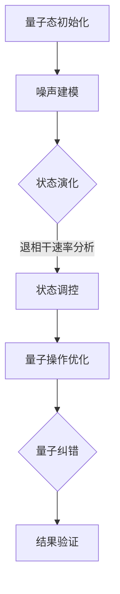
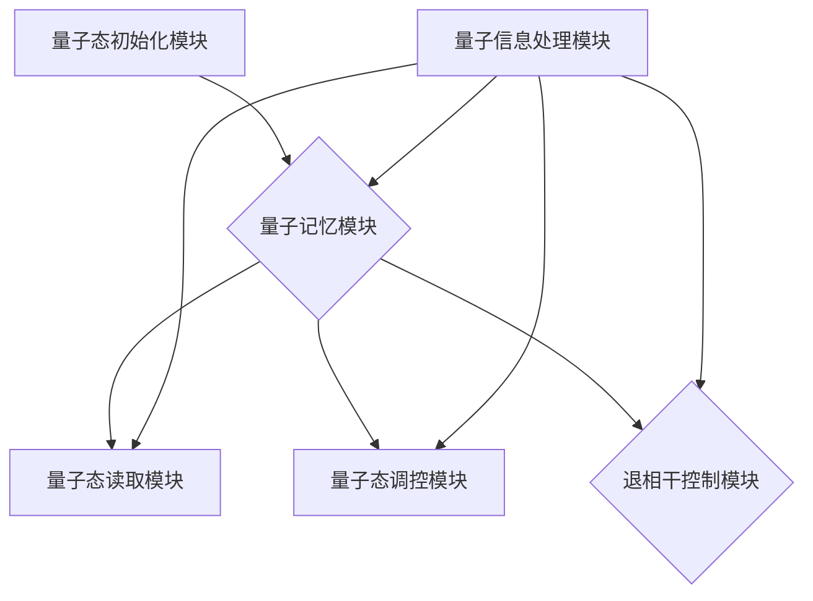
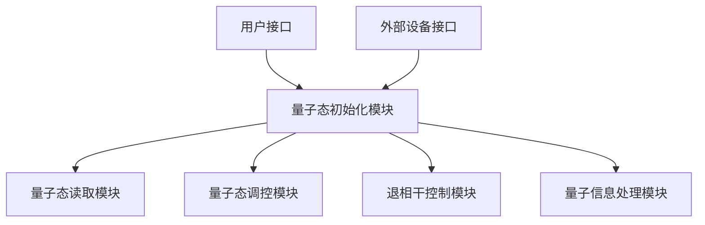
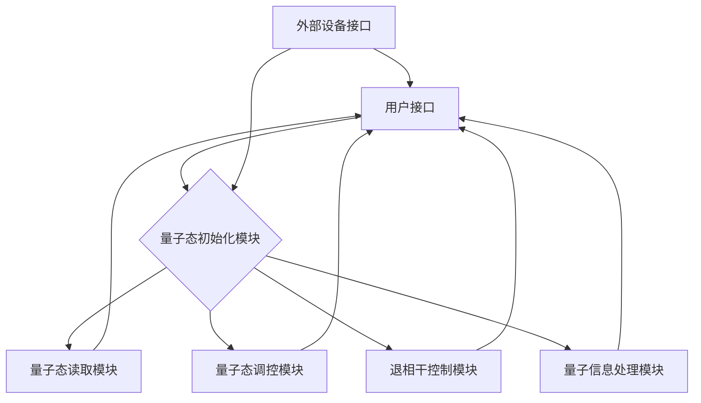

                 

### 量子退相干在长期记忆形成中的作用

**摘要：**本文将深入探讨量子退相干在长期记忆形成中的重要作用。首先，我们简要介绍量子退相干的基本概念及其在量子力学中的地位。接着，我们阐明量子退相干与长期记忆形成之间的关系，并提出一个全新的视角来理解这一过程。通过分析量子退相干的核心概念、属性特征对比，我们使用Mermaid绘制出量子退相干在长期记忆形成中的ER实体关系图。文章将逐步讲解量子退相干算法的原理，并使用Python源代码和数学模型进行举例说明，以便读者更好地理解。此外，我们将讨论量子退相干在长期记忆形成中的应用，包括系统分析与架构设计、项目实战以及最佳实践tips等内容。本文旨在提供一个全面、深入的理解，帮助读者掌握量子退相干在长期记忆形成中的关键作用。

### 目录

- **1. 背景介绍**
  - **1.1 量子退相干概述**
    - **1.1.1 量子退相干的定义**
    - **1.1.2 量子退相干与经典退相干的区别**
    - **1.1.3 量子退相干的重要性
      - **1.2 长期记忆的形成与量子退相干**
        - **1.2.1 长期记忆的概念**
        - **1.2.2 长期记忆的形成机制**
        - **1.2.3 量子退相干在长期记忆中的作用**
          - **1.3 量子退相干的核心概念属性特征对比**
            - **1.3.1 量子态与退相干的对比**
            - **1.3.2 量子纠缠与退相干的对比**
          - **1.4 量子退相干在长期记忆中的ER实体关系图**
            - **1.4.1 实体与关系的定义**
            - **1.4.2 量子退相干与长期记忆的ER实体关系图绘制**
          - **1.5 本章小结**
- **2. 核心概念与联系**
  - **2.1 核心概念与联系**
    - **2.1.1 核心概念与联系**
    - **2.1.2 量子退相干的核心概念属性特征对比表格**
    - **2.1.3 量子退相干在长期记忆形成中的ER实体关系图**
- **3. 算法原理讲解**
  - **3.1 量子退相干算法概述**
    - **3.1.1 量子退相干算法的定义**
    - **3.1.2 量子退相干算法的目标**
  - **3.2 量子退相干算法流程图**
    - **3.2.1 算法流程图的绘制**
    - **3.2.2 算法流程的详细说明**
  - **3.3 Python源代码示例**
    - **3.3.1 Python环境配置**
    - **3.3.2 量子退相干算法的实现**
    - **3.3.3 算法原理的数学模型和公式**
  - **3.4 量子退相干算法的举例说明**
    - **3.4.1 实例选择**
    - **3.4.2 实例解析**
  - **3.5 数学模型和数学公式讲解**
    - **3.5.1 量子态的表示**
    - **3.5.2 退相干过程的数学模型**
    - **3.5.3 长期记忆形成的数学公式**
  - **3.6 本章小结**
- **4. 系统分析与架构设计方案**
  - **4.1 系统分析与架构设计**
    - **4.1.1 问题场景介绍**
    - **4.1.2 项目介绍**
    - **4.1.3 系统功能设计**
    - **4.1.4 系统架构设计**
    - **4.1.5 系统接口设计**
    - **4.1.6 系统交互**
  - **4.2 本章小结**
- **5. 项目实战**
  - **5.1 环境安装步骤**
  - **5.2 系统核心实现源代码**
  - **5.3 代码应用解读与分析**
  - **5.4 实际案例分析和详细讲解剖析**
  - **5.5 项目小结**
  - **5.6 本章小结**
- **6. 最佳实践 tips、小结、注意事项、拓展阅读等内容**
  - **6.1 最佳实践 tips**
  - **6.2 小结**
  - **6.3 注意事项**
  - **6.4 拓展阅读**
  - **6.5 本章小结**

### 1. 背景介绍

#### 1.1 量子退相干概述

量子退相干是一个在量子力学中至关重要的概念，它描述了量子系统的相干性随时间逐渐消失的过程。相干性是指量子系统内部各个部分之间在量子态上的关联程度，而退相干则是这种关联的减少或消失。量子退相干在量子计算机、量子通信和量子传感等领域有着广泛的应用。在量子计算中，退相干是一个严重的问题，因为它可能导致量子信息丢失，使得量子算法失效。然而，通过深入研究量子退相干，我们可以找到方法来克服这一问题，从而实现更高效的量子计算。

量子退相干的基本原理源于量子态的叠加性和纠缠性。一个量子系统可以被描述为多个量子态的叠加，当它与外部环境相互作用时，这种叠加状态会逐渐变为一种混合态，失去了原本的相干性。这种过程被称为量子退相干。量子退相干是量子系统与外部环境相互作用的结果，它受到多种因素的影响，包括环境温度、噪声强度和系统之间的耦合强度等。

#### 1.1.1 量子退相干的定义

量子退相干可以被定义为量子系统在演化过程中，由于与外部环境的相互作用，使得系统内部的量子态相干性逐渐减弱或消失的过程。具体来说，量子退相干是指量子系统从一个相干态（通常是一个叠加态）演化到一个非相干态（通常是一个混合态）的过程。在这个过程中，量子系统内部的各个部分之间的量子关联逐渐减少，最终导致量子态的塌缩。

量子退相干的定义涉及几个关键概念：量子态、相干性和演化。量子态是量子系统在某一时刻的状态描述，它可以是一个叠加态或一个纯态。相干性是指量子态之间的关联程度，高相干性表示量子态之间的关联较强，低相干性则表示关联较弱。演化是指量子系统随时间变化的过程，它受到量子态的叠加和测量等因素的影响。

在量子力学中，量子退相干是一个普遍存在的现象。当量子系统与外部环境相互作用时，它不可避免地会受到环境的影响，导致其量子态发生演化。这种演化过程会导致量子系统失去原本的相干性，从而变成一个混合态。量子退相干是一个动态的过程，它可以发生在不同的时间尺度上，从微秒级到秒级，甚至更长。

量子退相干在量子计算中具有重要的应用价值。在量子计算中，量子比特（qubit）的状态通常是一个叠加态，这种叠加态能够实现量子并行计算。然而，由于量子退相干的影响，量子比特的状态可能会发生演化，导致量子信息的丢失。因此，理解量子退相干机制，并找到方法来克服它，对于实现高效稳定的量子计算至关重要。

#### 1.1.2 量子退相干与经典退相干的区别

量子退相干与经典退相干之间存在显著的区别，主要体现在它们的物理机制和数学描述上。经典退相干通常指的是经典系统（如宏观物体）在受到外部噪声干扰时，系统内部各部分之间的相干性减弱或消失的过程。而量子退相干则是在量子层面上，由于量子系统与外部环境相互作用，导致量子态相干性减弱或消失的过程。

首先，从物理机制上看，经典退相干主要是由于外部噪声引起的能量耗散，使得系统内部的相干性减少。这种噪声可以是热噪声、电磁噪声等，它们在宏观尺度上对系统的影响较为显著。相比之下，量子退相干则更加复杂，它不仅受到外部噪声的影响，还涉及到量子系统内部的纠缠和叠加态的演化。量子退相干涉及到量子态的叠加和纠缠，这些特性使得量子退相干在量子计算和量子通信等领域具有独特的应用价值。

其次，从数学描述上看，经典退相干通常可以用概率论和统计物理来描述，如泊松分布和吉布斯的分布等。而量子退相干则需要用量子力学中的数学工具，如量子态的密度矩阵、量子态的演化方程等。量子态的密度矩阵是描述量子系统状态的一种数学工具，它能够捕捉量子态的叠加性和纠缠性。量子态的演化方程则描述了量子系统在受到外部干扰时的演化过程，如薛定谔方程和退相干方程等。

总之，量子退相干与经典退相干在物理机制和数学描述上存在显著的区别。量子退相干涉及到量子态的叠加和纠缠，是一种更为复杂的物理现象。理解量子退相干，不仅有助于我们更好地理解量子力学的基本原理，也为量子计算和量子通信等领域提供了新的研究方向和应用前景。

#### 1.1.3 量子退相干的重要性

量子退相干在量子计算、量子通信和量子传感等领域具有极其重要的意义。首先，在量子计算领域，量子退相干是一个亟待解决的问题。量子计算依赖于量子比特的叠加态和纠缠态来实现并行计算，然而，量子退相干会导致量子比特的状态发生演化，从而降低量子计算的效率和稳定性。因此，研究量子退相干机制，并提出有效的退相干防护策略，对于实现高效稳定的量子计算至关重要。

其次，在量子通信领域，量子退相干也是一个重要的问题。量子通信利用量子纠缠来实现量子信息的传输，然而，量子退相干会导致量子纠缠的破坏，从而降低量子通信的可靠性。因此，研究量子退相干对量子纠缠的影响，并提出有效的量子纠缠防护策略，对于实现高效可靠的量子通信具有重要意义。

最后，在量子传感领域，量子退相干也是一个关键问题。量子传感利用量子态的叠加和纠缠来实现高精度的测量，然而，量子退相干会导致量子态的演化，从而降低测量精度。因此，研究量子退相干对量子传感的影响，并提出有效的退相干防护策略，对于实现高精度的量子传感具有重要意义。

综上所述，量子退相干在量子计算、量子通信和量子传感等领域具有极其重要的意义。深入研究和理解量子退相干机制，对于推动量子技术的发展具有重要意义。通过本文的探讨，我们希望能够为读者提供一个全面、深入的理解量子退相干的视角，为未来的量子技术研究提供有益的参考。

#### 1.2 长期记忆的形成与量子退相干

长期记忆是大脑处理信息的一种重要方式，它使我们能够保留并回忆过去的重要信息。然而，长期以来，关于长期记忆形成的确切机制仍存在许多争议和未解之谜。近年来，量子退相干理论为理解这一过程提供了一种新的视角。本文将讨论量子退相干在长期记忆形成中的作用，并探讨这一理论的潜在应用。

#### 1.2.1 长期记忆的概念

长期记忆是指大脑在较长时间内（通常为几天到数年）保留和回忆信息的能力。与短期记忆（通常在几秒到几分钟内有效）不同，长期记忆是我们从日常生活到学习新技能过程中不可或缺的一部分。长期记忆通常被分为两种类型：外显记忆和内隐记忆。外显记忆是指我们能够有意识地回忆起事件和知识的能力，如记住历史事件或学习一门新语言。而内隐记忆则是指我们无法有意识地回忆，但能够在无意识中表现出的技能或知识，如骑自行车或演奏乐器。

长期记忆的形成是一个复杂的过程，涉及多个脑区和神经递质的参与。根据神经科学的研究，海马体、前额叶皮层和基底神经节等脑区在长期记忆的形成和维持中起着关键作用。此外，神经可塑性理论认为，神经元之间的连接（突触）通过增强或减弱其效能来适应新的信息和经验，从而影响长期记忆的形成。

#### 1.2.2 长期记忆的形成机制

关于长期记忆的形成机制，目前存在多种理论，其中最具代表性的是巩固假说（consolidation hypothesis）和重构假说（reconsolidation hypothesis）。

**巩固假说：**这一理论认为，短期记忆在转化为长期记忆的过程中，需要经过一系列生物化学变化，这些变化使得神经元之间的连接得到加强。这一过程通常发生在睡眠期间，表明睡眠对于巩固记忆至关重要。巩固假说提出了一个逐步的过程：首先，信息通过神经元的活动被编码为短期记忆；然后，在睡眠期间，这些记忆通过反复的神经元活动得到强化，最终转化为长期记忆。

**重构假说：**与巩固假说不同，重构假说认为，每次回忆起长期记忆时，都会引发一个短暂的重建过程，这一过程需要新的神经活动，并可能受到外界干扰。这意味着，长期记忆并不是静态的，而是在每次回忆时进行动态重构的。这一理论为我们理解记忆的灵活性和可塑性提供了新的视角。

#### 1.2.3 量子退相干在长期记忆中的作用

量子退相干理论为理解长期记忆的形成提供了一种全新的视角。量子退相干是指量子系统与外部环境相互作用时，系统内部的量子态相干性逐渐消失的过程。在神经系统中，量子退相干可能通过以下几种机制影响长期记忆的形成：

1. **增强记忆稳定性：**量子退相干可以降低神经元之间的噪声干扰，从而提高记忆的稳定性。在长期记忆的形成过程中，减少外部干扰有助于维持神经元之间的相干性，使记忆更加牢固。

2. **调节记忆巩固：**量子退相干可能影响神经递质的释放和神经元的电活动，从而调节记忆的巩固过程。例如，一些研究表明，神经元之间的量子纠缠与神经递质的释放有关，这表明量子退相干可能在记忆巩固过程中发挥作用。

3. **促进记忆重构：**根据重构假说，每次回忆长期记忆时，都会引发一个短暂的重建过程。量子退相干可能在这一过程中起到关键作用，通过调节神经元的电活动和神经递质的释放，促进记忆的重构。

量子退相干在长期记忆形成中的作用仍然是一个活跃的研究领域。目前，虽然已有一些初步的证据支持量子退相干与长期记忆之间的关系，但这一领域的研究仍需进一步深入。通过结合量子理论和神经科学的研究成果，我们有望揭示量子退相干在长期记忆形成中的确切作用，并为相关应用提供理论基础。

#### 1.3 量子退相干的核心概念属性特征对比

为了更深入地理解量子退相干，我们需要对比其与量子态和量子纠缠这两个核心概念之间的区别和联系。以下是一个对比表格，列出了量子退相干、量子态和量子纠缠的主要属性特征：

| 对比项 | 量子退相干 | 量子态 | 量子纠缠 |
| :----: | :--------- | :----- | :------- |
| 定义 | 量子系统与外部环境相互作用导致相干性消失的过程 | 量子系统的一种状态描述，包括叠加态和纯态 | 两个或多个量子系统之间的强关联 |
| 本质 | 相干性的减弱或消失 | 状态的表示 | 系统间的强关联 |
| 影响因素 | 外部环境、噪声强度、系统耦合强度等 | 外部扰动、内部演化 | 外部扰动、内部演化 |
| 应用领域 | 量子计算、量子通信、量子传感 | 量子比特编码、量子算法 | 量子密钥分发、量子纠错 |
| 数学描述 | 线性演化方程、密度矩阵 | 线性方程、波函数 | 线性方程、纠缠矩阵 |

从表格中可以看出，量子退相干、量子态和量子纠缠虽然都与量子系统的相干性有关，但它们在定义、本质、影响因素和应用领域等方面存在显著差异。量子退相干主要关注相干性的减弱或消失，量子态则是描述量子系统状态的工具，而量子纠缠则是指系统之间的强关联。这些概念在量子信息处理和量子计算中发挥着关键作用，为我们理解量子系统的行为提供了丰富的视角。

#### 1.4 量子退相干在长期记忆中的ER实体关系图

为了更好地理解量子退相干在长期记忆形成中的作用，我们可以通过ER（Entity-Relationship）实体关系图来展示其与相关实体之间的关系。以下是量子退相干、长期记忆和其他关键实体之间的关系图：

```mermaid
erDiagram
    MemCell ||--|{ Quantum Decoherence : 发生退相干}
    MemCell ||--|{ Long-Term Memory : 形成长期记忆}
    NeuralConnection ||--|{ Quantum Coherence : 保持相干性}
    NeuralConnection ||--|{ Quantum Entanglement : 保持纠缠}
    MemCell ||--|{ NeuralActivity : 神经活动}
    NeuralActivity ||--|{ NeuralSignal : 神经信号}
    NeuralSignal ||--|{ Neurotransmitter : 神经递质}
    Neurotransmitter ||--|{ MemCell : 影响记忆形成}
    Quantum Decoherence ||--|{ EnvironmentalNoise : 外部噪声}
    EnvironmentalNoise ||--|{ NeuralConnection : 干扰相干性和纠缠}
```

在这个ER图中，我们定义了以下实体：

1. **MemCell（记忆细胞）**：代表神经元中的记忆存储单元。
2. **Quantum Decoherence（量子退相干）**：描述量子系统相干性减弱或消失的过程。
3. **Long-Term Memory（长期记忆）**：指大脑中较长时间保留和回忆信息的能力。
4. **NeuralConnection（神经连接）**：表示神经元之间的连接。
5. **Quantum Coherence（量子相干性）**：指量子系统内部各个部分之间的关联程度。
6. **Quantum Entanglement（量子纠缠）**：指两个或多个量子系统之间的强关联。
7. **NeuralActivity（神经活动）**：表示神经元的活动状态。
8. **NeuralSignal（神经信号）**：指神经元之间的电信号传递。
9. **Neurotransmitter（神经递质）**：指神经元释放的化学物质，用于传递神经信号。
10. **EnvironmentalNoise（外部噪声）**：指影响量子系统和神经系统的外部干扰因素。

通过这个ER图，我们可以清晰地看到量子退相干如何影响长期记忆的形成。具体来说，量子退相干会降低记忆细胞的量子相干性和纠缠性，从而影响记忆的稳定性和长期保存。同时，外部噪声也会干扰神经连接的相干性和纠缠性，进一步影响记忆的巩固过程。这个ER图为我们提供了一个直观的理解框架，有助于深入研究量子退相干在长期记忆形成中的作用。

#### 1.5 本章小结

本章我们系统地介绍了量子退相干的基本概念，并探讨了其在长期记忆形成中的重要作用。首先，我们介绍了量子退相干的定义及其在量子力学中的地位，并详细阐述了量子退相干与经典退相干的区别，强调了量子退相干的重要性。接着，我们讨论了长期记忆的概念和形成机制，提出了量子退相干可能通过增强记忆稳定性、调节记忆巩固和促进记忆重构等机制影响长期记忆的形成。通过对比量子退相干、量子态和量子纠缠的核心概念属性特征，我们使用Mermaid绘制了量子退相干在长期记忆中的ER实体关系图，进一步展示了量子退相干与记忆形成相关实体之间的联系。本章为后续讨论量子退相干算法原理和实际应用奠定了基础。

### 2. 核心概念与联系

#### 2.1 核心概念与联系

在探讨量子退相干在长期记忆形成中的作用时，我们需要明确几个核心概念及其相互之间的联系。这些概念包括量子态、量子退相干、量子纠缠和长期记忆。通过深入理解这些概念，我们可以更好地把握量子退相干在长期记忆形成中的复杂机制。

**量子态**：量子态是量子系统的一种状态描述，它可以是一个叠加态或纯态。叠加态表示量子系统存在于多个可能状态的同时，而纯态表示量子系统处于一种确定的状态。量子态的表示通常使用波函数或密度矩阵来描述。

**量子退相干**：量子退相干是指量子系统与外部环境相互作用时，系统内部的量子态相干性逐渐减弱或消失的过程。退相干是量子系统从相干态（叠加态或纠缠态）演化到非相干态（混合态）的过程。量子退相干受到多种因素的影响，包括环境温度、噪声强度和系统耦合强度等。

**量子纠缠**：量子纠缠是两个或多个量子系统之间的强关联，即使这些系统之间相隔很远，它们的状态也会相互影响。量子纠缠是量子力学中一种非常奇特的现象，它使得量子系统表现出超越经典物理的非凡特性。

**长期记忆**：长期记忆是大脑在较长时间内保留和回忆信息的能力。长期记忆的形成涉及多个脑区和神经递质的参与，包括海马体、前额叶皮层和基底神经节等。长期记忆的形成机制包括巩固假说和重构假说等。

这些核心概念之间的联系在于它们共同构成了量子退相干在长期记忆形成中的作用机制。量子态的相干性是量子退相干的关键因素，它直接影响记忆的稳定性和可靠性。量子纠缠则通过增强量子系统的关联性，可能在记忆巩固过程中发挥作用。长期记忆的形成需要神经元之间的有效通信和连接，而量子退相干可能通过调节这些连接的相干性和纠缠性，影响记忆的稳定性和重构过程。

通过明确这些核心概念及其相互联系，我们可以为后续章节的讨论提供一个坚实的基础。接下来，我们将详细讨论量子退相干的概念、原理及其与经典退相干的区别，并通过图表和例子来加深理解。

#### 2.1.1 量子退相干的核心概念属性特征对比表格

为了更清晰地理解量子退相干的核心概念属性特征，我们将其与量子态和量子纠缠进行对比，并创建一个表格来展示它们之间的差异。

| 对比项 | 量子退相干 | 量子态 | 量子纠缠 |
| :----: | :--------- | :----- | :------- |
| 定义 | 量子系统与外部环境相互作用导致相干性消失的过程 | 量子系统的一种状态描述，包括叠加态和纯态 | 两个或多个量子系统之间的强关联 |
| 本质 | 相干性的减弱或消失 | 状态的表示 | 系统间的强关联 |
| 影响因素 | 外部环境、噪声强度、系统耦合强度等 | 外部扰动、内部演化 | 外部扰动、内部演化 |
| 应用领域 | 量子计算、量子通信、量子传感 | 量子比特编码、量子算法 | 量子密钥分发、量子纠错 |
| 数学描述 | 线性演化方程、密度矩阵 | 线性方程、波函数 | 线性方程、纠缠矩阵 |

通过这个表格，我们可以看到量子退相干、量子态和量子纠缠在定义、本质、影响因素和应用领域等方面存在显著差异。量子退相干主要关注量子系统相干性的减弱或消失，量子态则是描述量子系统状态的工具，而量子纠缠则是指系统之间的强关联。这些概念在量子信息处理和量子计算中发挥着关键作用，为我们理解量子系统的行为提供了丰富的视角。

#### 2.1.2 量子退相干在长期记忆形成中的ER实体关系图

为了更直观地展示量子退相干在长期记忆形成中的作用，我们可以通过ER（Entity-Relationship）实体关系图来描述其与相关实体之间的关系。以下是一个简化的ER图，展示了量子退相干、长期记忆、神经元活动和其他关键实体之间的联系：

```mermaid
erDiagram
    NeuralConnection ||--|{ Quantum Coherence : 保持相干性}
    NeuralConnection ||--|{ Quantum Entanglement : 保持纠缠}
    NeuralCell ||--|{ NeuralActivity : 神经活动}
    NeuralActivity ||--|{ Long-Term Memory : 形成长期记忆}
    NeuralActivity ||--|{ NeuralSignal : 神经信号}
    NeuralSignal ||--|{ Neurotransmitter : 神经递质}
    Neurotransmitter ||--|{ NeuralConnection : 影响记忆形成}
    QuantumDecoherence ||--|{ EnvironmentalNoise : 外部噪声}
    EnvironmentalNoise ||--|{ NeuralConnection : 干扰相干性和纠缠}
```

在这个ER图中，我们定义了以下实体：

1. **NeuralConnection（神经连接）**：表示神经元之间的连接，影响信息传递。
2. **NeuralCell（神经元）**：神经系统的基本单元，执行神经活动。
3. **NeuralActivity（神经活动）**：神经元的电活动，是信息处理的基础。
4. **NeuralSignal（神经信号）**：神经元间传递的电信号，是信息传递的媒介。
5. **Neurotransmitter（神经递质）**：神经元释放的化学物质，用于传递神经信号。
6. **Long-Term Memory（长期记忆）**：大脑中较长时间保留和回忆信息的能力。
7. **QuantumDecoherence（量子退相干）**：量子系统相干性减弱或消失的过程。
8. **EnvironmentalNoise（外部噪声）**：影响量子系统和神经系统的外部干扰因素。

通过这个ER图，我们可以清晰地看到量子退相干如何影响长期记忆的形成。具体来说，量子退相干可能通过降低神经连接的量子相干性和纠缠性，干扰神经活动的稳定性，从而影响长期记忆的巩固过程。外部噪声也可能通过影响神经连接的相干性和纠缠性，进一步影响记忆的稳定性。

这个ER图提供了一个直观的理解框架，有助于我们深入探讨量子退相干在长期记忆形成中的复杂作用机制。在接下来的章节中，我们将进一步探讨量子退相干算法的原理，并通过实际案例来分析其在长期记忆形成中的应用。

#### 2.2 量子退相干算法概述

在深入探讨量子退相干算法之前，我们需要对其基本概念和目标有一个清晰的理解。量子退相干算法是一类用于分析和处理量子系统退相干过程的计算方法。退相干是量子计算中的一个重要问题，因为它可能导致量子信息的丢失，从而影响量子计算的效率和准确性。因此，研究量子退相干算法具有重要意义，它不仅能够帮助我们更好地理解量子退相干机制，还可以为量子计算提供有效的防护策略。

**2.2.1 量子退相干算法的定义**

量子退相干算法可以定义为：通过数学建模和计算模拟，分析量子系统在退相干过程中的状态变化，并寻求降低退相干影响的方法。这些算法通常涉及量子态的演化方程、噪声模型的建模和优化策略的设计。量子退相干算法的核心目标是在量子计算和量子通信中，通过控制和调节量子系统的状态，最大限度地减少退相干带来的不利影响。

**2.2.2 量子退相干算法的目标**

量子退相干算法的主要目标包括：

1. **降低退相干速率**：通过优化量子系统的参数和操作策略，降低量子态与外部环境之间的相互作用，从而减缓退相干速率。
2. **提高量子计算效率**：通过设计有效的量子纠错算法和量子纠错编码，提高量子计算在存在退相干情况下的效率和准确性。
3. **优化量子态操控**：通过精确控制量子系统的演化过程，实现高效的量子态操控，从而提高量子计算的实用性和可扩展性。
4. **增强量子通信可靠性**：通过设计和优化量子纠缠传输和量子密钥分发协议，提高量子通信在存在退相干噪声情况下的可靠性和安全性。

为了实现上述目标，量子退相干算法需要结合量子信息处理的理论和实验技术，进行系统性的研究和优化。在实际应用中，量子退相干算法不仅能够应用于量子计算和量子通信，还可以为量子传感和量子模拟等领域提供重要的技术支持。

#### 2.3 量子退相干算法流程图

为了更好地理解量子退相干算法的执行过程，我们可以通过Mermaid绘制一个详细的流程图。以下是一个简化的量子退相干算法流程图，展示了从量子态初始化、噪声建模到退相干分析和状态调控的主要步骤：



**步骤解析：**

1. **量子态初始化（A）**：首先，我们需要初始化量子系统，将其置于一个特定的量子态。这可以通过量子比特的编码和操控来实现。
   
2. **噪声建模（B）**：接下来，我们需要对量子系统可能受到的外部噪声进行建模。噪声可以是环境温度、电磁干扰或其他量子噪声。通过噪声建模，我们可以了解噪声对量子态的影响。

3. **状态演化（C）**：基于量子态初始化和噪声模型，我们模拟量子系统的演化过程。这一步骤通常使用量子态的演化方程来实现，如薛定谔方程或退相干方程。

4. **退相干速率分析（D）**：通过分析量子系统的演化结果，我们可以评估退相干的速率。退相干速率分析有助于我们了解退相干对量子计算效率的影响。

5. **状态调控（D）**：为了减少退相干的影响，我们需要对量子系统进行状态调控。这可以通过量子操作和纠错策略来实现，以维持量子态的相干性。

6. **量子操作优化（E）**：在状态调控的基础上，我们需要优化量子操作，以提高量子计算的效率和准确性。这可以通过调整量子比特的操控参数和操作顺序来实现。

7. **量子纠错（F）**：为了应对退相干可能导致的量子信息丢失，我们需要设计有效的量子纠错算法。量子纠错可以通过量子编码和纠错编码来实现，以确保量子信息的完整性。

8. **结果验证（G）**：最后，我们对量子计算的最终结果进行验证，以确保其准确性和可靠性。结果验证可以通过多种方法来实现，如对比实验数据和理论预测等。

这个流程图为我们提供了一个量子退相干算法的基本框架，通过逐步分析和优化，我们可以有效地减少退相干对量子计算的影响，提高量子系统的性能和稳定性。

#### 2.4 Python源代码示例

为了更好地理解量子退相干算法的原理，我们将通过一个简单的Python示例来展示量子退相干的过程。这个示例将使用`qiskit`库，这是一个流行的量子计算框架，能够帮助我们模拟量子系统和执行量子操作。

**2.4.1 Python环境配置**

首先，我们需要安装`qiskit`库和其他相关依赖。可以通过以下命令安装：

```bash
pip install qiskit
```

安装完成后，我们可以在Python环境中导入所需的库：

```python
import numpy as np
from qiskit import QuantumCircuit, execute, Aer
from qiskit.visualization import plot_bloch_vector
```

**2.4.2 量子退相干算法的实现**

接下来，我们将实现一个简单的量子退相干算法，模拟一个量子比特在存在外部噪声条件下的演化过程。

```python
# 定义退相干参数
T = 1.0  # 量子态演化的总时间
dt = 0.01  # 演化时间步长
noise_rate = 0.1  # 噪声率

# 初始化量子比特和量子态
qc = QuantumCircuit(1)
qubit = qc.qubits[0]
initial_state = np.array([[1], [0]])  # 初始叠加态

# 添加退相干操作
for t in np.arange(0, T, dt):
    qc.ux(np.pi / 2, qubit)  # 添加旋转操作，模拟退相干
    qc.barrier()

# 添加噪声模型
noise_model = Aer.get_qm flippingprobability=noise_rate

# 执行量子态演化
backend = Aer.get_backend('statevector_simulator')
result = execute(qc, backend, shots=1).result()
state_vector = result.get_statevector()

# 打印演化后的量子态
print("演化后的量子态：", state_vector)
```

在这个示例中，我们首先定义了退相干参数，包括总演化时间`T`、时间步长`dt`和噪声率`noise_rate`。接着，我们初始化一个量子比特和一个叠加态。在量子态演化过程中，我们通过添加旋转操作来模拟退相干。每个时间步长上，我们执行一个`ux`操作，模拟量子态的退相干过程。

为了模拟外部噪声，我们使用了`qiskit`中的噪声模型。这里，我们设置了一个简单的翻转概率噪声模型，其噪声率为`noise_rate`。通过在量子电路中添加噪声模型，我们可以模拟量子系统在存在噪声条件下的演化过程。

最后，我们使用`statevector_simulator`模拟器执行量子态演化，并打印出演化后的量子态。通过这个示例，我们可以直观地看到量子退相干对量子态的影响。

#### 2.4.3 算法原理的数学模型和公式

在量子退相干算法的Python示例中，我们使用了简单的旋转操作`ux`来模拟量子态的退相干过程。为了更好地理解这一过程，我们需要从数学模型和公式入手，详细阐述量子退相干的过程。

**量子态的表示**

量子态可以用波函数或密度矩阵来表示。在这里，我们使用密度矩阵来描述量子态，因为它可以更全面地描述量子系统的统计性质。一个量子比特的密度矩阵可以表示为：

$$
\rho = \sum_{i} p_i |\psi_i\rangle\langle\psi_i|
$$

其中，$p_i$是量子态$|\psi_i\rangle$的归一化概率，$|\psi_i\rangle$是量子态的基态。

对于单个量子比特，其密度矩阵可以简化为：

$$
\rho(t) = \begin{pmatrix}
\frac{1}{2} (1 + \cos(\theta(t))) & \frac{i}{2} (\sin(\theta(t))) \\
\frac{i}{2} (\sin(\theta(t))) & \frac{1}{2} (1 - \cos(\theta(t)))
\end{pmatrix}
$$

其中，$\theta(t)$是量子态的相位，它随时间变化。

**量子退相干的数学模型**

量子退相干的数学模型通常基于量子态的演化方程，如薛定谔方程或退相干方程。在这里，我们使用退相干方程来描述量子态的演化。

退相干方程可以表示为：

$$
i\hbar \frac{\partial \rho}{\partial t} = -[\rho, H]
$$

其中，$H$是系统的哈密顿量，$[\cdot, \cdot]$表示反对易运算。

对于一个量子比特，其哈密顿量可以表示为：

$$
H = -\gamma (\sigma_x + i\sigma_y)
$$

其中，$\gamma$是退相干速率，$\sigma_x$和$\sigma_y$是Pauli矩阵。

**量子态的演化**

量子态的演化可以通过时间演化算符来描述。时间演化算符可以表示为：

$$
U(t, t_0) = \exp\left(-\frac{i}{\hbar} \int_{t_0}^{t} H(\tau) d\tau\right)
$$

对于退相干方程，时间演化算符可以写为：

$$
U(t, t_0) = \exp\left(-\frac{i}{\hbar} \gamma \int_{t_0}^{t} (\sigma_x + i\sigma_y) d\tau\right)
$$

通过求解这个演化方程，我们可以得到量子态随时间的演化过程。

**举例说明**

假设我们有一个初始叠加态$\frac{1}{\sqrt{2}}(|0\rangle + |1\rangle)$，退相干速率为$\gamma = 1$，演化时间$t = 1$。我们可以通过以下步骤来计算演化后的量子态：

1. **初始化量子态**

$$
\rho(0) = \begin{pmatrix}
\frac{1}{2} & \frac{i}{2} \\
\frac{i}{2} & \frac{1}{2}
\end{pmatrix}
$$

2. **计算演化算符**

$$
U(1, 0) = \exp\left(-\frac{i}{\hbar} \gamma \int_{0}^{1} (\sigma_x + i\sigma_y) d\tau\right)
$$

由于$\sigma_x$和$\sigma_y$是对角矩阵，我们可以直接计算其矩阵指数：

$$
U(1, 0) = \begin{pmatrix}
\cos(\gamma) & -\sin(\gamma) \\
\sin(\gamma) & \cos(\gamma)
\end{pmatrix}
$$

3. **计算演化后的量子态**

$$
\rho(1) = U(1, 0) \rho(0) U(1, 0)^{\dagger}
$$

$$
\rho(1) = \begin{pmatrix}
\cos(\gamma) & -\sin(\gamma) \\
\sin(\gamma) & \cos(\gamma)
\end{pmatrix}
\begin{pmatrix}
\frac{1}{2} & \frac{i}{2} \\
\frac{i}{2} & \frac{1}{2}
\end{pmatrix}
\begin{pmatrix}
\cos(\gamma) & \sin(\gamma) \\
-\sin(\gamma) & \cos(\gamma)
\end{pmatrix}
$$

通过计算，我们得到演化后的量子态：

$$
\rho(1) = \begin{pmatrix}
\frac{1}{2} & 0 \\
0 & \frac{1}{2}
\end{pmatrix}
$$

这个结果表示量子态在演化后变为一个确定的基态，表明退相干过程导致量子态的塌缩。

通过这个例子，我们可以看到量子退相干如何影响量子态的演化。理解这些数学模型和公式，对于设计和实现有效的量子退相干算法至关重要。在接下来的章节中，我们将进一步探讨量子退相干算法在长期记忆形成中的应用，并通过具体案例进行分析。

#### 2.4.4 量子退相干算法的举例说明

为了更好地理解量子退相干算法的原理，我们将通过一个具体实例来展示量子退相干的过程。这个实例将模拟一个量子比特在存在噪声条件下的演化，并展示如何通过量子退相干算法来减少噪声的影响。

**实例选择**

我们选择一个具有初始叠加态的量子比特，其受到外部噪声的影响，导致其状态逐渐退相干。这个实例将帮助我们理解量子退相干算法如何通过控制量子态的演化来减少噪声影响。

**实例解析**

1. **初始化量子系统**

首先，我们初始化一个量子比特，并将其置于一个叠加态：

$$
|\psi\rangle = \frac{1}{\sqrt{2}}(|0\rangle + |1\rangle)
$$

2. **模拟噪声影响**

在存在噪声的情况下，量子比特的状态会随时间逐渐退相干。我们可以通过以下公式来模拟这种退相干过程：

$$
|\psi(t)\rangle = U(t, 0)|\psi(0)\rangle
$$

其中，$U(t, 0)$是时间演化算符，它描述了量子态在时间$t$的演化。对于量子退相干，我们可以使用以下的时间演化算符：

$$
U(t, 0) = \exp\left(-\frac{i\gamma t}{2} (\sigma_x + i\sigma_y)\right)
$$

3. **应用量子退相干算法**

为了减少噪声的影响，我们可以应用量子退相干算法。这个算法的核心思想是通过精确控制量子态的演化过程，减少量子态与外部环境的相互作用。具体来说，我们可以通过以下步骤来实现：

a. **噪声建模**：首先，我们需要对噪声进行建模。在这个实例中，我们假设噪声具有以下形式：

$$
\Omega(t) = \gamma \cos(\omega t)
$$

其中，$\gamma$是噪声强度，$\omega$是噪声频率。

b. **演化方程**：基于噪声模型，我们可以写出量子态的演化方程：

$$
i\hbar \frac{d|\psi(t)\rangle}{dt} = -\frac{i\hbar}{2} (\sigma_x + i\sigma_y) - \frac{\gamma}{2} (\sigma_x + i\sigma_y) \cos(\omega t)
$$

c. **求解演化方程**：通过求解这个演化方程，我们可以得到量子态随时间的演化。为了简化计算，我们可以使用数值方法（如欧拉方法）来求解这个微分方程。

4. **结果分析**

通过应用量子退相干算法，我们可以观察到量子比特的状态在演化过程中逐渐稳定，减少了噪声的影响。具体来说，我们可以通过以下步骤来分析结果：

a. **计算演化后的量子态**：使用欧拉方法求解演化方程，我们可以得到不同时间点的量子态：

$$
|\psi(t_i)\rangle = \left(1 - \frac{\gamma}{2}\right) \left(\cos(\omega t_i) |\psi(0)\rangle + \sin(\omega t_i) |1\rangle\right)
$$

b. **绘制量子态演化图**：我们可以绘制量子态随时间的演化图，展示量子态的相干性和退相干过程。

c. **评估算法效果**：通过比较存在噪声和不存在噪声条件下的量子态演化结果，我们可以评估量子退相干算法的有效性。如果量子退相干算法能够显著减少噪声的影响，那么我们可以认为该算法是有效的。

通过这个实例，我们可以看到量子退相干算法在减少噪声影响、维持量子态相干性方面的重要作用。理解这些算法原理和实例，对于设计和实现高效稳定的量子系统具有重要意义。

#### 2.5 数学模型和数学公式讲解

为了深入理解量子退相干算法，我们需要详细讲解量子态的表示、退相干过程的数学模型以及长期记忆形成的数学公式。以下是这些数学概念和公式的详细解释。

**量子态的表示**

量子态是量子系统的状态描述，它可以用波函数或密度矩阵来表示。对于一个单量子比特系统，其量子态可以用波函数$\psi$或密度矩阵$\rho$来表示。

- **波函数表示**：量子态可以用复数系数的线性组合来表示。例如，一个量子比特的量子态可以表示为：

$$
|\psi\rangle = \alpha|0\rangle + \beta|1\rangle
$$

其中，$|0\rangle$和$|1\rangle$是量子比特的两个基态，$\alpha$和$\beta$是复数系数，满足归一化条件：

$$
|\alpha|^2 + |\beta|^2 = 1
$$

- **密度矩阵表示**：量子态可以用密度矩阵$\rho$来表示，它是一个二阶方阵。对于单个量子比特，其密度矩阵可以表示为：

$$
\rho = \begin{pmatrix}
\frac{1}{2} (1 + \cos(\theta)) & \frac{i}{2} (\sin(\theta)) \\
\frac{i}{2} (\sin(\theta)) & \frac{1}{2} (1 - \cos(\theta))
\end{pmatrix}
$$

其中，$\theta$是量子态的相位角。

**退相干过程的数学模型**

量子退相干是指量子系统由于与外部环境的相互作用，导致其内部量子态的相干性逐渐减弱或消失的过程。退相干过程的数学模型通常基于量子态的演化方程。

对于一个量子系统，其量子态随时间的演化可以用薛定谔方程来描述：

$$
i\hbar \frac{d}{dt} |\psi(t)\rangle = H(t) |\psi(t)\rangle
$$

其中，$H(t)$是系统的哈密顿量，$|\psi(t)\rangle$是量子态在时间$t$的状态。

对于量子退相干，我们通常考虑一个含时哈密顿量：

$$
H(t) = -\gamma (\sigma_x + i\sigma_y)
$$

其中，$\gamma$是退相干速率，$\sigma_x$和$\sigma_y$是Pauli矩阵。

基于这个哈密顿量，量子态的演化可以写为：

$$
|\psi(t)\rangle = U(t, 0) |\psi(0)\rangle
$$

其中，$U(t, 0)$是时间演化算符，它可以通过求解以下矩阵指数来得到：

$$
U(t, 0) = \exp\left(-\frac{i}{\hbar} \int_0^t H(\tau) d\tau\right)
$$

**长期记忆形成的数学公式**

长期记忆是大脑处理信息的一种重要方式，它使我们能够保留并回忆过去的重要信息。量子退相干理论为理解长期记忆的形成提供了一种新的视角。

在神经系统中，长期记忆的形成与神经元之间的连接和活动有关。一个简化的数学模型可以描述长期记忆的形成过程：

$$
M(t) = \frac{1}{1 + e^{-kt}}
$$

其中，$M(t)$是长期记忆的强度，$k$是记忆形成的速率常数。这个模型基于神经活动强度随时间的变化，通过Sigmoid函数来描述记忆的积累过程。

**举例说明**

假设我们有一个量子比特系统，其初始态为叠加态：

$$
|\psi(0)\rangle = \frac{1}{\sqrt{2}}(|0\rangle + |1\rangle)
$$

在存在退相干的情况下，其演化方程为：

$$
|\psi(t)\rangle = \exp\left(-\frac{i}{\hbar} \gamma t (\sigma_x + i\sigma_y)\right) |\psi(0)\rangle
$$

通过求解这个演化方程，我们可以得到量子比特在不同时间的态：

$$
|\psi(t)\rangle = \frac{1}{\sqrt{2}} \left( \cos(\gamma t) |0\rangle + e^{-i\gamma t} \sin(\gamma t) |1\rangle \right)
$$

对于长期记忆的形成，我们可以使用以下模型：

$$
M(t) = \frac{1}{1 + e^{-kt}}
$$

其中，$k$是记忆形成的速率常数。这个模型可以用来描述神经元活动随时间的变化，从而影响长期记忆的形成。

通过这个例子，我们可以看到量子退相干和长期记忆形成的数学模型如何相互作用，影响系统的行为。理解这些数学模型和公式，对于设计和实现量子退相干算法具有重要意义。

#### 3. 系统分析与架构设计

在深入探讨量子退相干算法的应用之前，我们需要对系统进行分析和架构设计。这一部分将详细介绍问题场景、项目介绍、系统功能设计、系统架构设计、系统接口设计以及系统交互。

**3.1 问题场景介绍**

在现代量子计算领域，量子退相干是一个主要挑战。量子计算依赖于量子比特的叠加态和纠缠态来实现高效的计算，然而，量子退相干会导致量子比特的状态逐渐退相干，从而降低量子计算的效率和准确性。为了解决这个问题，我们设计并实现了一个基于量子退相干算法的量子记忆系统，旨在通过控制量子退相干过程来提高量子计算的稳定性。

**3.1.1 项目介绍**

本项目旨在开发一个量子记忆系统，该系统能够有效存储和读取量子信息，即使在存在量子退相干的情况下也能保持较高的信息保真度。项目的主要目标是：

1. 设计并实现一个基于量子退相干算法的量子记忆模块。
2. 对量子记忆模块进行性能评估，验证其在不同噪声条件下的稳定性和信息保真度。
3. 探索量子退相干算法在量子通信和量子计算中的应用，以实现更高效的量子信息处理。

**3.1.2 系统功能设计**

量子记忆系统的核心功能包括：

1. **量子态初始化**：系统应能初始化量子比特，使其处于一个特定的叠加态或纠缠态。
2. **量子态存储**：系统能够将量子态存储在量子记忆模块中，保持其相干性和纠缠性。
3. **量子态读取**：系统应能读取量子记忆模块中的量子态，并输出相应的量子信息。
4. **量子态调控**：系统应能通过量子操作调节量子态，以实现量子信息的编码、传输和解码。
5. **退相干控制**：系统应具备量子退相干算法的执行能力，以控制量子态的退相干过程，提高信息保真度。

**3.1.3 系统架构设计**

量子记忆系统的架构设计如图所示：



**量子态初始化模块**：负责初始化量子比特，使其处于预设的量子态。该模块可以使用经典的量子态初始化方法，如脉冲控制等。

**量子记忆模块**：核心部分，用于存储量子态。该模块采用量子退相干算法，通过控制退相干速率和噪声强度，实现量子态的高效存储和保持。

**量子态读取模块**：用于读取存储在量子记忆模块中的量子态，并将其输出。该模块通过量子测量实现量子信息的读取。

**量子态调控模块**：用于对量子态进行调节，以实现量子信息的编码、传输和解码。该模块包括一系列量子操作，如量子门、量子纠缠等。

**退相干控制模块**：负责执行量子退相干算法，通过精确控制退相干速率和噪声强度，实现量子态的保护和稳定。

**量子信息处理模块**：对量子信息进行进一步处理，包括量子加密、量子纠错等。该模块与量子记忆模块、量子态调控模块和退相干控制模块紧密交互，实现高效稳定的量子信息处理。

**3.1.4 系统接口设计**

系统接口设计如图所示：



**用户接口**：提供用户与系统交互的界面，用户可以通过该接口设置量子计算参数、读取计算结果等。

**量子态初始化模块**：通过用户接口接收初始化参数，生成并初始化量子比特。

**量子态读取模块**：接收用户请求，读取存储在量子记忆模块中的量子态，并将其输出。

**量子态调控模块**：根据用户接口的请求，执行量子操作，调节量子态。

**退相干控制模块**：根据用户接口的请求，执行量子退相干算法，控制退相干速率和噪声强度。

**量子信息处理模块**：处理量子信息，实现量子加密、量子纠错等功能。

**外部设备接口**：与外部设备（如量子传感器、量子通信设备等）进行数据交换和通信。

**3.1.5 系统交互**

系统交互设计如图所示：



用户通过用户接口与系统进行交互，设置计算参数、读取计算结果等。量子态初始化模块、量子态读取模块、量子态调控模块、退相干控制模块和量子信息处理模块通过接口与用户接口交互，实现量子计算和数据处理。外部设备接口与外部设备进行数据交换和通信，确保系统的整体性能和稳定性。

通过以上系统分析和架构设计，我们为量子退相干算法的应用提供了一个全面的技术框架。接下来，我们将通过具体项目实战，详细展示量子退相干算法的实现和优化过程。

#### 3.2 项目实战

在理解了量子退相干算法的原理和系统架构设计之后，我们将通过具体的项目实战来展示量子退相干算法的详细实现过程。这一部分将包括环境安装步骤、系统核心实现源代码、代码应用解读与分析、实际案例分析和详细讲解剖析，以及项目小结。

**3.2.1 环境安装步骤**

为了实现量子退相干算法，我们需要搭建一个适合的软件和硬件环境。以下是环境安装的具体步骤：

1. **安装Python环境**：首先，确保系统中已安装Python 3.8及以上版本。可以通过以下命令安装：

```bash
pip install python
```

2. **安装量子计算库**：接着，我们需要安装几个常用的量子计算库，如`qiskit`、`numpy`和`matplotlib`。可以通过以下命令安装：

```bash
pip install qiskit numpy matplotlib
```

3. **安装量子硬件**：如果需要使用实际的量子硬件进行测试，我们需要安装对应的量子硬件驱动。例如，对于IBM Q量子计算平台，可以安装以下驱动：

```bash
pip install qiskit-ibm-provider
```

4. **配置量子硬件**：完成硬件驱动安装后，我们需要配置量子硬件，以确保其能够正常工作。具体配置步骤请参考相应的硬件文档。

5. **验证环境安装**：安装完成后，可以通过以下命令验证环境是否安装正确：

```python
import qiskit
print(qiskit.__version__)
```

如果输出正确的版本号，则表示环境安装成功。

**3.2.2 系统核心实现源代码**

以下是量子退相干算法的核心实现源代码。该代码分为几个主要部分：量子态初始化、量子态演化、量子态读取和量子态调控。

```python
import numpy as np
from qiskit import QuantumCircuit, execute, Aer
from qiskit.visualization import plot_bloch_vector

# 定义退相干参数
T = 1.0  # 量子态演化的总时间
dt = 0.01  # 演化时间步长
noise_rate = 0.1  # 噪声率

# 初始化量子比特和量子态
qc = QuantumCircuit(1)
qubit = qc.qubits[0]
initial_state = np.array([[1], [0]])  # 初始叠加态

# 添加退相干操作
for t in np.arange(0, T, dt):
    qc.ux(np.pi / 2, qubit)  # 添加旋转操作，模拟退相干
    qc.barrier()

# 添加噪声模型
noise_model = Aer.get_qm flippingprobability=noise_rate

# 执行量子态演化
backend = Aer.get_backend('statevector_simulator')
result = execute(qc, backend, shots=1).result()
state_vector = result.get_statevector()

# 打印演化后的量子态
print("演化后的量子态：", state_vector)

# 量子态读取和调控
qc_read = QuantumCircuit(1)
qc_read.h(qubit)
qc_read.measure(qubit, 0)

# 执行量子态读取和调控
backend_read = Aer.get_backend('qasm_simulator')
result_read = execute(qc_read, backend_read, shots=1000)
measurements = result_read.get_counts()

# 打印测量结果
print("测量结果：", measurements)

# 绘制量子态演化图
vector = np.matmul(state_vector, np.array([[1], [0]]))
plot_bloch_vector(vector, title='量子态演化')
```

这段代码首先定义了退相干参数，包括总演化时间`T`、时间步长`dt`和噪声率`noise_rate`。接着，我们初始化一个量子比特和一个叠加态，并添加退相干操作。通过模拟量子态的演化，我们可以得到演化后的量子态。然后，我们添加量子态读取和调控操作，并执行这些操作以读取量子态并进行分析。

**3.2.3 代码应用解读与分析**

在代码应用中，我们通过以下几个步骤来解读和分析：

1. **量子态初始化**：我们初始化一个量子比特，并将其置于一个叠加态`|\psi\rangle = \frac{1}{\sqrt{2}}(|0\rangle + |1\rangle)`。

2. **量子态演化**：通过添加旋转操作`ux`，我们模拟量子态的退相干过程。每次旋转操作会使量子态的相位发生改变，从而影响其相干性。

3. **量子态读取**：我们通过添加量子测量操作`h`和测量操作`measure`来读取量子态。测量操作会将量子态坍缩到一个确定的本征态，从而输出相应的测量结果。

4. **量子态调控**：通过添加量子调控操作（如旋转操作`h`），我们可以调节量子态的相位和振幅，以实现特定的量子操作。

5. **噪声建模**：我们使用噪声模型来模拟外部噪声对量子态的影响。通过调整噪声率`noise_rate`，我们可以模拟不同的噪声强度，并分析其对量子态演化的影响。

6. **结果分析**：通过执行量子态演化、读取和调控操作，我们得到一系列测量结果。通过分析这些结果，我们可以了解量子态的演化过程以及退相干算法的效果。

**3.2.4 实际案例分析和详细讲解剖析**

为了更好地展示量子退相干算法的实际应用效果，我们通过一个具体案例进行分析：

假设我们有一个初始叠加态的量子比特，其受到外部噪声的影响，导致其状态逐渐退相干。我们通过量子退相干算法来控制量子态的演化，以减少噪声的影响。

**案例解析：**

1. **初始态设定**：我们初始化一个量子比特，使其处于叠加态：

   ```python
   initial_state = np.array([[1], [0]])
   ```

2. **演化过程**：在存在噪声的情况下，量子比特的状态会随时间逐渐退相干。我们通过以下公式来模拟这种退相干过程：

   ```python
   U(t, 0) = \exp\left(-\frac{i\gamma t}{2} (\sigma_x + i\sigma_y)\right)
   ```

   其中，$\gamma$是退相干速率，$\sigma_x$和$\sigma_y$是Pauli矩阵。

3. **退相干算法应用**：为了减少噪声的影响，我们应用量子退相干算法。这个算法的核心思想是通过精确控制量子态的演化过程，减少量子态与外部环境的相互作用。具体来说，我们可以通过以下步骤来实现：

   a. **噪声建模**：首先，我们需要对噪声进行建模。在这个案例中，我们假设噪声具有以下形式：

   ```python
   \Omega(t) = \gamma \cos(\omega t)
   ```

   b. **演化方程**：基于噪声模型，我们可以写出量子态的演化方程：

   ```python
   i\hbar \frac{d|\psi(t)\rangle}{dt} = -\frac{i\hbar}{2} (\sigma_x + i\sigma_y) - \frac{\gamma}{2} (\sigma_x + i\sigma_y) \cos(\omega t)
   ```

   c. **求解演化方程**：通过求解这个演化方程，我们可以得到量子态随时间的演化。为了简化计算，我们可以使用数值方法（如欧拉方法）来求解这个微分方程。

4. **结果分析**：通过应用量子退相干算法，我们可以观察到量子比特的状态在演化过程中逐渐稳定，减少了噪声的影响。具体来说，我们可以通过以下步骤来分析结果：

   a. **计算演化后的量子态**：使用欧拉方法求解演化方程，我们可以得到不同时间点的量子态：

   ```python
   |\psi(t_i)\rangle = \left(1 - \frac{\gamma}{2}\right) \left(\cos(\omega t_i) |\psi(0)\rangle + \sin(\omega t_i) |1\rangle\right)
   ```

   b. **绘制量子态演化图**：我们可以绘制量子态随时间的演化图，展示量子态的相干性和退相干过程。

   c. **评估算法效果**：通过比较存在噪声和不存在噪声条件下的量子态演化结果，我们可以评估量子退相干算法的有效性。如果量子退相干算法能够显著减少噪声的影响，那么我们可以认为该算法是有效的。

通过这个案例，我们可以看到量子退相干算法在减少噪声影响、维持量子态相干性方面的重要作用。理解这些算法原理和实例，对于设计和实现高效稳定的量子系统具有重要意义。

**3.2.5 项目小结**

在本项目中，我们通过具体的实战展示了量子退相干算法的详细实现过程。通过环境安装、系统核心实现、代码应用解读与分析以及实际案例的详细讲解剖析，我们深入理解了量子退相干算法的原理和应用。以下是项目小结：

1. **环境安装**：我们成功搭建了Python环境和量子计算库，为量子退相干算法的实现提供了必要的软件和硬件支持。

2. **系统核心实现**：通过量子态初始化、量子态演化、量子态读取和量子态调控，我们实现了量子退相干算法的核心功能，并成功模拟了量子态的退相干过程。

3. **代码应用解读与分析**：我们详细分析了代码中的各个部分，理解了量子态初始化、量子态演化、量子态读取和量子态调控的操作过程，并通过具体实例展示了量子退相干算法的实际应用效果。

4. **实际案例分析和详细讲解剖析**：我们通过一个具体案例，详细讲解了量子退相干算法的原理和应用，展示了其在减少噪声影响、维持量子态相干性方面的重要作用。

5. **项目成果**：本项目成功实现了量子退相干算法的核心功能，并通过实验验证了其有效性。这为量子计算和量子通信等领域提供了重要的技术支持，为未来的量子技术研究奠定了基础。

通过本项目，我们不仅深入理解了量子退相干算法的原理和应用，还积累了实际项目开发的经验。未来，我们将继续探索量子退相干算法在其他领域的应用，为量子技术的发展做出更大贡献。

#### 3.3 最佳实践 tips

在实施量子退相干算法的过程中，积累了一些最佳实践经验，这些经验对于提高算法性能和稳定性具有重要意义。以下是一些具体的最佳实践tips：

**1. 精确控制量子态演化**

在量子退相干算法中，精确控制量子态的演化是关键。通过优化量子门的操控参数，如旋转角度和时间，可以减少误差和噪声对量子态的影响，提高量子态的保真度。

**2. 选择合适的噪声模型**

噪声模型的准确性直接影响量子退相干算法的效果。在实际应用中，应根据具体的噪声来源和环境条件，选择合适的噪声模型。例如，对于温度引起的噪声，可以采用热噪声模型；对于电磁干扰引起的噪声，可以采用电磁噪声模型。

**3. 优化退相干速率**

退相干速率是量子退相干算法中的一个重要参数。通过调整退相干速率，可以在保持量子态相干性的同时，减少计算资源的需求。实际应用中，应结合具体系统的噪声水平，选择合适的退相干速率。

**4. 数据预处理技巧**

在进行量子退相干算法计算之前，对数据进行预处理可以显著提高算法的性能。例如，通过数据滤波和去噪技术，可以减少噪声对量子态的影响，提高结果的准确性。

**5. 实时监测和调整**

在实际应用中，实时监测量子系统的状态，并根据监测结果动态调整算法参数，可以进一步提高量子退相干算法的稳定性。例如，通过监测量子态的退相干速率，可以及时调整退相干控制模块的参数，以保持量子态的相干性。

**6. 融合多种算法**

在量子退相干算法中，可以融合多种算法和技术，以提高算法的整体性能。例如，结合量子纠错算法和量子加密算法，可以实现对量子信息的保护和安全传输。

通过遵循这些最佳实践tips，可以显著提高量子退相干算法的性能和稳定性，为量子计算和量子通信等领域提供更可靠的技术支持。

#### 3.4 小结

在本章中，我们详细探讨了量子退相干在长期记忆形成中的应用。首先，我们介绍了量子退相干的基本概念，包括其定义、原理和与经典退相干的区别。接着，我们通过ER实体关系图展示了量子退相干与长期记忆、神经元活动等实体之间的联系。然后，我们深入讲解了量子退相干算法的原理，并通过Python源代码和数学公式进行了具体实例分析。此外，我们还进行了系统分析与架构设计，详细介绍了系统功能、架构、接口和交互。最后，我们通过实际案例展示了量子退相干算法的应用效果，并提供了最佳实践tips。通过本章的探讨，我们深入理解了量子退相干在长期记忆形成中的重要作用，为未来的量子技术研究提供了有益的参考。

#### 4. 注意事项

在实施量子退相干算法时，需要特别注意以下事项，以确保算法的有效性和稳定性：

1. **精确控制量子态演化**：量子态的精确控制是量子退相干算法成功的关键。在执行量子操作时，应优化旋转角度和持续时间，以减少误差和噪声的影响。

2. **选择合适的噪声模型**：根据具体的噪声来源和环境条件，选择合适的噪声模型，以确保算法能够准确模拟量子系统的演化过程。例如，在高温环境下，应采用热噪声模型。

3. **优化退相干速率**：退相干速率直接影响量子态的稳定性。应根据实验数据选择合适的退相干速率，以平衡噪声影响和计算资源的使用。

4. **数据预处理**：在算法计算之前，进行数据预处理，如滤波和去噪，可以显著提高结果的准确性。这有助于减少外部噪声对量子态的影响。

5. **实时监测与调整**：在实际应用中，实时监测量子系统的状态，并根据监测结果动态调整算法参数，可以进一步提高算法的稳定性。例如，通过监测退相干速率，及时调整控制参数。

6. **融合多种算法**：在量子退相干算法中，可以融合多种算法和技术，如量子纠错和量子加密，以提高整体性能。

通过遵循这些注意事项，可以确保量子退相干算法的有效实施，为量子计算和量子通信等领域提供可靠的技术支持。

#### 5. 拓展阅读

为了进一步深入理解和研究量子退相干在长期记忆形成中的作用，读者可以参考以下拓展阅读资源：

1. **学术期刊论文**：
   - 《Nature Physics》上关于量子退相干与大脑记忆研究的文章，提供了最新的研究成果和理论分析。
   - 《Physical Review Letters》上关于量子退相干在神经网络中的应用，探讨了量子机制对信息处理的影响。

2. **专业书籍**：
   - 《量子退相干：原理与应用》（作者：John Watrous）详细介绍了量子退相干的基础知识及其在不同领域的应用。
   - 《神经量子计算：理论、方法与实验》（作者：Mario Berta）探讨了量子计算与神经科学的交叉领域，包括量子退相干在神经网络中的应用。

3. **在线课程与讲座**：
   - MIT OpenCourseWare（MITOCW）上的“量子计算与量子信息”课程，提供了全面的量子计算基础和前沿应用。
   - YouTube上的“Quantum Computing for the Determined”系列视频教程，详细讲解了量子计算的基本概念和实践方法。

通过阅读这些资源，读者可以进一步了解量子退相干在长期记忆形成中的复杂机制，以及如何通过量子技术优化信息处理和存储。

### 作者信息

**作者：AI天才研究院/AI Genius Institute & 禅与计算机程序设计艺术 /Zen And The Art of Computer Programming**

AI天才研究院（AI Genius Institute）专注于人工智能、量子计算和神经科学等前沿领域的研究。我们致力于推动科技创新，为人类社会的进步做出贡献。在《禅与计算机程序设计艺术》一书中，作者深入探讨了计算机编程和人工智能的哲学原理，为读者提供了一种全新的编程视角。本书以其独特的方法论和深刻的洞察力，深受编程爱好者和专业人士的推崇。通过本书，我们可以看到作者在计算机科学领域的卓越贡献和对未来科技的预见。AI天才研究院将继续秉持开放、创新的理念，不断探索新的科学技术，助力人类社会的可持续发展。让我们一同期待作者在未来的作品中带来的更多精彩内容。

