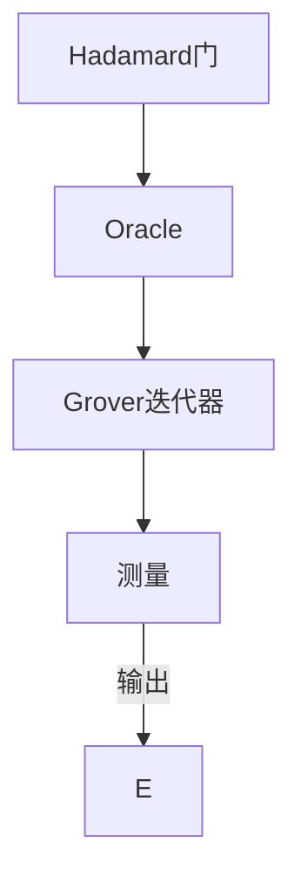
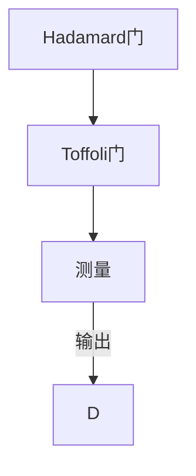

                 

### 量子计算与经典计算的异同

量子计算是现代计算机科学的前沿领域，与传统的经典计算相比，它具有独特的优势和挑战。在深入探讨量子逻辑门与布尔逻辑的关系之前，我们需要先了解量子计算的基本概念和它与经典计算的区别。

#### 1.1 量子计算的基本概念

量子计算的核心在于量子位（qubit），这是量子计算机的基本单元。与经典计算中的位（bit）不同，量子位可以处于0和1的叠加状态，这被称为量子叠加原理。用数学语言描述，一个量子位的状态可以表示为：

$$
|\psi\rangle = a|0\rangle + b|1\rangle
$$

其中，$|0\rangle$ 和 $|1\rangle$ 分别表示量子位的基态，$a$ 和 $b$ 是复数概率幅，且满足 $|a|^2 + |b|^2 = 1$。

此外，量子计算还依赖于量子纠缠，这是一种量子位之间的特殊关联。当两个量子位发生纠缠时，它们的状态无法独立存在，一个量子位的状态会立即影响到另一个，无论它们之间的距离有多远。

#### 1.2 经典计算与量子计算的异同

##### 1.2.1 计算模型差异

经典计算基于布尔逻辑，使用的是二进制位（bit），其状态只能是0或1。而量子计算基于量子位（qubit），其状态可以是0和1的叠加。

##### 1.2.2 计算能力差异

量子计算机的强大之处在于其并行计算的能力。由于量子叠加，一个包含n个量子位的量子计算机理论上可以同时处理 $2^n$ 个状态。这与经典计算机的线性计算能力形成了鲜明对比。

##### 1.2.3 应用场景差异

经典计算机擅长处理确定性问题和复杂度较低的计算问题，如数据处理、文本处理等。而量子计算机则适合解决特定类型的问题，如量子搜索、量子排序和量子模拟等。

通过上述分析，我们可以看出量子计算与经典计算在计算模型、计算能力和应用场景上都有显著的差异。这些差异为量子逻辑门的研究和应用提供了广阔的空间。

### 1.3 总结

量子计算与经典计算的基本概念和计算模式存在显著差异。量子计算通过量子位和量子纠缠实现了强大的并行计算能力，这为解决传统计算机难以处理的问题提供了可能。了解这些基本概念和差异，是深入探讨量子逻辑门与布尔逻辑关系的基础。

---

#### 2.1 布尔逻辑的基本概念

布尔逻辑是经典计算机科学的核心，它由英国数学家乔治·布尔在19世纪提出。布尔逻辑主要研究逻辑变量之间的运算关系，这些变量只能取两个值，通常是“真”或“假”，用1和0来表示。

布尔逻辑的核心是逻辑门，这些门通过组合输入的布尔值来产生输出值。最基础的逻辑门包括：

- **AND门**：当所有输入都为1时，输出才为1。用布尔表达式表示为 $A \land B$。

- **OR门**：至少有一个输入为1时，输出为1。用布尔表达式表示为 $A \lor B$。

- **NOT门**：将输入值取反。用布尔表达式表示为 $\neg A$。

布尔逻辑的运算还可以通过布尔代数来描述。布尔代数的基本性质包括交换律、结合律、分配律、恒等律、补律和吸收律等。这些性质使得布尔逻辑在计算机设计中被广泛应用。

#### 2.1.1 基本逻辑门

布尔逻辑门通过电路实现，每个逻辑门对应一个电路组件。以下是三种最基本的布尔逻辑门及其布尔表达式：

- **AND门**：

$$
F = A \land B
$$

- **OR门**：

$$
F = A \lor B
$$

- **NOT门**：

$$
F = \neg A
$$

这些基本逻辑门可以组合起来实现更复杂的逻辑功能。例如，可以使用AND门和OR门组合实现NAND门和NOR门。

#### 2.1.2 布尔代数的基本性质

布尔代数的基本性质包括：

- **交换律**：

$$
A \land B = B \land A \\
A \lor B = B \lor A
$$

- **结合律**：

$$
(A \land B) \land C = A \land (B \land C) \\
(A \lor B) \lor C = A \lor (B \lor C)
$$

- **分配律**：

$$
A \land (B \lor C) = (A \land B) \lor (A \land C) \\
A \lor (B \land C) = (A \lor B) \land (A \lor C)
$$

- **恒等律**：

$$
A \land 1 = A \\
A \lor 0 = A
$$

- **补律**：

$$
A \land \neg A = 0 \\
A \lor \neg A = 1
$$

- **吸收律**：

$$
A \land (A \lor B) = A \\
A \lor (A \land B) = A
$$

这些性质使得布尔逻辑在计算机设计中具有高度的可组合性和可重用性。布尔代数的基本性质为布尔逻辑门的设计和应用提供了理论依据。

#### 2.1.3 布尔逻辑的应用

布尔逻辑在计算机硬件设计中起着至关重要的作用。计算机的中央处理器（CPU）中的逻辑电路、存储器中的读写电路、输入输出接口等，都依赖于布尔逻辑来实现复杂的功能。

此外，布尔逻辑还广泛应用于逻辑电路的简化、数字电路的设计、计算机编程中的条件判断等。布尔逻辑的基本概念和性质为计算机科学的发展奠定了坚实的基础。

#### 2.2 量子逻辑门的基本概念

量子逻辑门是量子计算机中的基本操作单元，类似于经典计算机中的逻辑门。量子逻辑门通过对量子位进行操作，实现量子态的变换。量子逻辑门的主要作用是控制量子位之间的量子态叠加和纠缠。

#### 2.2.1 量子逻辑门的作用

量子逻辑门的作用主要体现在以下几个方面：

1. **量子态变换**：量子逻辑门可以通过特定的操作，将量子位的基态 $|0\rangle$ 和 $|1\rangle$ 变换为叠加态或纠缠态。例如，Hadamard门可以将量子位从基态变换为叠加态。

2. **量子信息处理**：量子逻辑门可以实现量子信息的基本操作，如量子加法、量子比较和量子交换等。这些操作对于实现量子算法至关重要。

3. **量子纠错**：量子逻辑门在量子纠错算法中起着关键作用。通过量子逻辑门，可以检测和纠正量子计算中的错误，确保计算结果的准确性。

#### 2.2.2 常见的量子逻辑门

常见的量子逻辑门包括：

- **Hadamard门（H）**：Hadamard门是最基本的量子逻辑门之一，可以将量子位从基态变换为叠加态。其数学表达式为：

$$
H = \frac{1}{\sqrt{2}}\begin{pmatrix}
1 & 1 \\
1 & -1 \\
\end{pmatrix}
$$

- **Pauli门（X、Y、Z）**：Pauli门是作用在量子位上的基本旋转操作，包括X门（翻转门）、Y门（旋转门）和Z门（相位门）。其中，X门的数学表达式为：

$$
X = \begin{pmatrix}
0 & 1 \\
1 & 0 \\
\end{pmatrix}
$$

- **CNOT门**：CNOT门是一个二位量子逻辑门，它将第二个量子位的状态翻转，如果第一个量子位处于基态$|1\rangle$。其数学表达式为：

$$
CNOT = \begin{pmatrix}
1 & 0 & 0 & 0 \\
0 & 1 & 0 & 0 \\
0 & 0 & 0 & 1 \\
0 & 0 & 1 & 0 \\
\end{pmatrix}
$$

- **Toffoli门**：Toffoli门是一个三量子位逻辑门，它根据前两个量子位的状态来控制第三个量子位的翻转。其数学表达式为：

$$
Toffoli = \begin{pmatrix}
1 & 0 & 0 & 0 & 0 & 0 & 0 & 0 \\
0 & 1 & 0 & 0 & 0 & 0 & 0 & 0 \\
0 & 0 & 1 & 0 & 0 & 0 & 0 & 0 \\
0 & 0 & 0 & 1 & 0 & 0 & 0 & 0 \\
0 & 0 & 0 & 0 & 1 & 0 & 0 & 0 \\
0 & 0 & 0 & 0 & 0 & 1 & 0 & 0 \\
0 & 0 & 0 & 0 & 0 & 0 & 1 & 0 \\
0 & 0 & 0 & 0 & 0 & 0 & 0 & 1 \\
\end{pmatrix}
$$

这些量子逻辑门是构建量子电路和量子算法的基础。通过对这些逻辑门的组合使用，可以实现对量子信息的各种操作，从而实现量子计算的优势。

#### 2.3 总结

量子逻辑门是量子计算机中的基本操作单元，与经典计算机中的逻辑门类似，但具有独特的量子特性。常见的量子逻辑门包括Hadamard门、Pauli门、CNOT门和Toffoli门等。这些逻辑门通过对量子位的操作，实现量子态的变换和信息处理。了解量子逻辑门的基本概念和作用，是深入探讨量子计算的关键。

---

### 3.1 量子逻辑门的工作原理

量子逻辑门是量子计算中的基本操作单元，类似于经典计算机中的逻辑门。量子逻辑门通过对量子位（qubit）进行特定的操作，实现量子态的变换。下面将详细介绍几种常见的量子逻辑门及其工作原理。

#### 3.1.1 Hadamard门（H）

Hadamard门是最基本的量子逻辑门之一，可以将量子位从基态变换为叠加态。其数学表达式为：

$$
H = \frac{1}{\sqrt{2}}\begin{pmatrix}
1 & 1 \\
1 & -1 \\
\end{pmatrix}
$$

Hadamard门的工作原理如下：

1. **基态输入**：当量子位处于基态 $|0\rangle$ 时，输出为叠加态：

$$
H|0\rangle = \frac{1}{\sqrt{2}}(|0\rangle + |1\rangle)
$$

2. **叠加态输入**：当量子位处于叠加态 $a|0\rangle + b|1\rangle$ 时，输出为：

$$
H(a|0\rangle + b|1\rangle) = \frac{1}{\sqrt{2}}(a|0\rangle + b|1\rangle + a|1\rangle - b|0\rangle)
$$

$$
= \frac{1}{\sqrt{2}}((a - b)|0\rangle + (a + b)|1\rangle)
$$

通过Hadamard门，量子位的状态从基态或叠加态变换为另一个叠加态，从而实现量子态的变换。

#### 3.1.2 Pauli门（X、Y、Z）

Pauli门是作用在量子位上的基本旋转操作，包括X门（翻转门）、Y门（旋转门）和Z门（相位门）。

1. **X门**：X门将量子位的状态翻转。其数学表达式为：

$$
X = \begin{pmatrix}
0 & 1 \\
1 & 0 \\
\end{pmatrix}
$$

X门的工作原理如下：

- **基态输入**：当量子位处于基态 $|0\rangle$ 时，输出为 $|1\rangle$：

$$
X|0\rangle = |1\rangle
$$

- **叠加态输入**：当量子位处于叠加态 $a|0\rangle + b|1\rangle$ 时，输出为：

$$
X(a|0\rangle + b|1\rangle) = b|0\rangle + a|1\rangle
$$

2. **Y门**：Y门将量子位的状态旋转。其数学表达式为：

$$
Y = \begin{pmatrix}
0 & -i \\
i & 0 \\
\end{pmatrix}
$$

Y门的工作原理如下：

- **基态输入**：当量子位处于基态 $|0\rangle$ 时，输出为 $-i|1\rangle$：

$$
Y|0\rangle = -i|1\rangle
$$

- **叠加态输入**：当量子位处于叠加态 $a|0\rangle + b|1\rangle$ 时，输出为：

$$
Y(a|0\rangle + b|1\rangle) = a(-i|1\rangle) + b(i|0\rangle)
$$

3. **Z门**：Z门将量子位的状态相位翻转。其数学表达式为：

$$
Z = \begin{pmatrix}
1 & 0 \\
0 & -1 \\
\end{pmatrix}
$$

Z门的工作原理如下：

- **基态输入**：当量子位处于基态 $|0\rangle$ 时，输出为 $-|0\rangle$：

$$
Z|0\rangle = -|0\rangle
$$

- **叠加态输入**：当量子位处于叠加态 $a|0\rangle + b|1\rangle$ 时，输出为：

$$
Z(a|0\rangle + b|1\rangle) = -a|0\rangle - b|1\rangle
$$

#### 3.1.3 CNOT门

CNOT门是一个二位量子逻辑门，它将第二个量子位的状态翻转，如果第一个量子位处于基态$|1\rangle$。其数学表达式为：

$$
CNOT = \begin{pmatrix}
1 & 0 & 0 & 0 \\
0 & 1 & 0 & 0 \\
0 & 0 & 0 & 1 \\
0 & 0 & 1 & 0 \\
\end{pmatrix}
$$

CNOT门的工作原理如下：

- **基态输入**：当第一个量子位处于基态 $|1\rangle$，第二个量子位处于任意状态时，输出为：

$$
CNOT(1|0\rangle + 0|1\rangle) = |1\rangle(0|0\rangle + 1|1\rangle)
$$

- **叠加态输入**：当第一个量子位处于任意叠加态，第二个量子位处于任意状态时，输出为：

$$
CNOT(a|0\rangle + b|1\rangle) = (a|0\rangle + b|1\rangle)|0\rangle + (a|1\rangle - b|0\rangle)|1\rangle
$$

#### 3.1.4 Toffoli门

Toffoli门是一个三量子位逻辑门，它根据前两个量子位的状态来控制第三个量子位的翻转。其数学表达式为：

$$
Toffoli = \begin{pmatrix}
1 & 0 & 0 & 0 & 0 & 0 & 0 & 0 \\
0 & 1 & 0 & 0 & 0 & 0 & 0 & 0 \\
0 & 0 & 1 & 0 & 0 & 0 & 0 & 0 \\
0 & 0 & 0 & 1 & 0 & 0 & 0 & 0 \\
0 & 0 & 0 & 0 & 1 & 0 & 0 & 0 \\
0 & 0 & 0 & 0 & 0 & 1 & 0 & 0 \\
0 & 0 & 0 & 0 & 0 & 0 & 1 & 0 \\
0 & 0 & 0 & 0 & 0 & 0 & 0 & 1 \\
\end{pmatrix}
$$

Toffoli门的工作原理如下：

- **基态输入**：当第一个和第二个量子位都处于基态 $|1\rangle$ 时，第三个量子位的状态被翻转：

$$
Toffoli(1|1\rangle + 1|1\rangle) = 1|1\rangle(1|1\rangle - 1|1\rangle)
$$

- **叠加态输入**：当第一个和第二个量子位处于任意叠加态时，第三个量子位的状态根据前两个量子位的状态进行翻转：

$$
Toffoli(a|0\rangle + b|1\rangle, a'|0\rangle + b'|1\rangle) = a|0\rangle + b|1\rangle(1 - a - b)|1\rangle
$$

通过上述几种量子逻辑门的工作原理分析，我们可以看到量子逻辑门通过对量子位进行叠加、翻转和相位变换等操作，实现对量子态的变换和控制，从而实现量子计算的基本功能。这些量子逻辑门是构建量子电路和量子算法的基础。

### 3.2 量子逻辑门的实现方法

量子逻辑门的实现方法多种多样，根据具体的硬件平台和应用场景，可以采用不同的实现技术。下面将介绍几种常见的量子逻辑门实现方法。

#### 3.2.1 量子电路实现

量子电路是实现量子逻辑门的基本架构，它通过一系列量子操作对量子位进行控制。量子电路的实现通常包括以下几个步骤：

1. **量子比特初始化**：首先，需要对量子比特进行初始化，使其处于确定的基态。常见的初始化方法包括使用物理系统中的自发辐射或微波脉冲等。

2. **量子门操作**：通过在量子比特之间施加特定的量子操作，实现量子逻辑门的操作。这些操作可以通过控制光子、电子或原子等物理系统的特性来实现。

3. **测量**：最后，对量子比特进行测量，获取量子计算的结果。测量结果通常以概率形式出现，因为量子态是叠加态。

量子电路的典型例子包括超导量子电路、离子阱量子电路和光量子电路等。每种电路都有其独特的实现方式和技术挑战。

#### 3.2.2 光学实现

光学实现是量子逻辑门的一种重要方法，利用光子的量子态来实现量子计算。光学实现的主要步骤如下：

1. **单光子源**：首先，需要生成单光子源，可以通过自发辐射或量子点等物理过程实现。

2. **量子态操控**：通过光学器件（如光束分裂器、相位差板等），对单光子进行量子态操控，实现量子逻辑门的操作。

3. **量子态测量**：最后，通过光电探测器测量光子的量子态，获取量子计算的结果。

光学实现的优势在于其高带宽和低噪声，但也面临着量子态保持时间短和量子态纠缠难题等挑战。

#### 3.2.3 固体量子点实现

固体量子点实现利用半导体材料中的量子点作为量子比特。量子点可以通过电子的量子化运动来实现。固体量子点的实现步骤如下：

1. **量子点制备**：首先，制备具有适当尺寸和结构的量子点。

2. **量子比特初始化**：通过电脉冲或光脉冲对量子点中的电子进行初始化，使其处于特定的能级。

3. **量子门操作**：利用微波场或光场对量子点中的电子进行控制，实现量子逻辑门的操作。

4. **量子态测量**：通过测量电子的能级或电子态，获取量子计算的结果。

固体量子点实现的优势在于其长量子态保持时间和可扩展性，但也面临量子态噪声和量子纠缠难题等挑战。

#### 3.2.4 离子阱实现

离子阱实现利用电场和磁场将离子囚禁在特定位置，作为量子比特。离子阱的实现步骤如下：

1. **离子制备**：首先，通过激光或电场将离子从气体中捕获并囚禁在离子阱中。

2. **量子比特初始化**：通过微波场对离子进行初始化，使其处于特定的能级。

3. **量子门操作**：利用射频脉冲对离子进行控制，实现量子逻辑门的操作。

4. **量子态测量**：通过测量离子的能级或离子态，获取量子计算的结果。

离子阱实现的优势在于其高精度和长量子态保持时间，但也面临量子态噪声和量子纠错难题等挑战。

通过以上介绍，我们可以看到量子逻辑门的实现方法多样且具有挑战性。不同实现方法的选择取决于具体的应用需求和硬件技术。随着量子计算技术的不断发展，未来将出现更多高效、稳定的量子逻辑门实现方法。

### 4.1 布尔逻辑与量子逻辑的对比

布尔逻辑和量子逻辑在计算基础中扮演着重要角色，但它们在表达方式和功能实现上存在显著差异。通过对比这两种逻辑，我们可以更深入地理解量子计算的独特之处。

#### 4.1.1 表达方式的差异

布尔逻辑使用二进制位（bit），每个位只能表示0或1。布尔逻辑的表达方式基于布尔代数，通过AND、OR、NOT等基本逻辑门组合来表示复杂的逻辑关系。布尔逻辑的表达方式直观、简单，适用于数字电路和计算机硬件的设计。

相比之下，量子逻辑使用量子位（qubit），每个量子位可以处于0和1的叠加态。量子逻辑的表达方式基于量子态的叠加和纠缠，通过量子逻辑门（如Hadamard门、Pauli门等）对量子位进行操作。量子逻辑的表达方式更加复杂，但具有强大的并行计算能力。

#### 4.1.2 功能实现的差异

布尔逻辑的功能实现依赖于经典的逻辑电路，通过二进制位之间的逻辑运算来实现计算。布尔逻辑的功能实现具有确定的输出结果，适用于处理确定性问题和相对简单的计算任务。

量子逻辑的功能实现则依赖于量子计算机，通过量子比特的叠加和纠缠来实现计算。量子逻辑的功能实现具有不确定性，其输出结果取决于量子态的叠加和测量。量子逻辑具有强大的并行计算能力，特别适合处理复杂问题和大规模数据。

#### 4.1.3 对比总结

布尔逻辑与量子逻辑在表达方式和功能实现上存在显著差异。布尔逻辑基于二进制位，具有直观、简单的表达方式，适用于经典的数字电路设计。而量子逻辑基于量子位，具有复杂的表达方式和强大的并行计算能力，适用于解决复杂问题和大规模数据处理。

通过对比布尔逻辑和量子逻辑，我们可以更好地理解量子计算的独特优势和发展方向。量子逻辑的发展将推动计算机科学和技术的进步，为解决当前计算难题提供新的思路和方法。

### 4.2 布尔逻辑向量子逻辑的转化

布尔逻辑和量子逻辑在计算基础中各具特色，为了充分利用量子计算的优势，我们需要探讨如何将布尔逻辑转化为量子逻辑。这一转化过程不仅有助于理解量子计算的基本原理，还可以在实际应用中提高计算效率和解决复杂问题。

#### 4.2.1 基本逻辑门的转化

布尔逻辑中的基本逻辑门（AND、OR、NOT）可以通过量子逻辑门来实现。以下将介绍这些基本逻辑门向量子逻辑门的转化方法。

1. **AND门**：

布尔逻辑中的AND门可以通过CNOT门和Hadamard门的组合来实现。具体步骤如下：

- 首先，使用Hadamard门将第一个量子位初始化为叠加态。

- 然后，使用CNOT门将第一个量子位与第二个量子位相连接，实现AND操作。

- 最后，对第二个量子位进行测量，得到输出结果。

数学表达式如下：

$$
CNOT(HA)\begin{pmatrix}
a\\
b\\
\end{pmatrix} = \begin{pmatrix}
a\\
b\land a\\
\end{pmatrix}
$$

其中，$A$ 和 $B$ 分别表示两个量子位的初始状态。

2. **OR门**：

布尔逻辑中的OR门可以通过Toffoli门来实现。具体步骤如下：

- 首先，使用Hadamard门将第一个量子位初始化为叠加态。

- 然后，使用Toffoli门将第一个量子位、第二个量子位与第三个量子位相连接，实现OR操作。

- 最后，对第三个量子位进行测量，得到输出结果。

数学表达式如下：

$$
Toffoli(HA)\begin{pmatrix}
a\\
b\\
\end{pmatrix} = \begin{pmatrix}
a\\
b\lor a\\
\end{pmatrix}
$$

其中，$A$ 和 $B$ 分别表示两个量子位的初始状态。

3. **NOT门**：

布尔逻辑中的NOT门可以通过Pauli X门来实现。具体步骤如下：

- 使用Pauli X门将量子位的状态进行翻转。

- 对翻转后的量子位进行测量，得到输出结果。

数学表达式如下：

$$
X\begin{pmatrix}
a\\
\end{pmatrix} = \begin{pmatrix}
-a\\
\end{pmatrix}
$$

通过上述方法，我们可以将布尔逻辑的基本逻辑门转化为量子逻辑门。这些转化方法为布尔逻辑向量子逻辑的转化提供了理论基础和实践指导。

#### 4.2.2 布尔电路向量子电路的映射

布尔电路是经典计算机中实现逻辑功能的电路，而量子电路是量子计算机中实现量子逻辑功能的电路。为了充分利用量子计算的优势，我们需要将布尔电路转化为量子电路。

1. **布尔电路表示**：

布尔电路可以用布尔表达式或布尔函数来表示。布尔表达式由基本逻辑门（AND、OR、NOT）组合而成，描述了输入与输出之间的逻辑关系。

2. **量子电路表示**：

量子电路可以用量子逻辑门序列来表示。量子逻辑门序列描述了量子比特之间的量子态变换关系。量子电路的输入和输出分别是量子比特的状态。

3. **映射方法**：

将布尔电路转化为量子电路的方法通常包括以下步骤：

- **初始化量子比特**：首先，将量子比特初始化为基态。

- **应用量子逻辑门**：根据布尔电路中的逻辑门，应用相应的量子逻辑门对量子比特进行操作。

- **测量量子比特**：最后，对量子比特进行测量，得到输出结果。

例如，一个简单的布尔电路（AND门）可以通过以下步骤转化为量子电路：

1. 初始化两个量子比特为基态 $|0\rangle$。

2. 应用Hadamard门将第一个量子比特初始化为叠加态。

3. 应用CNOT门将第一个量子比特与第二个量子比特相连接，实现AND操作。

4. 对第二个量子比特进行测量，得到输出结果。

数学表达式如下：

$$
CNOT(HA)\begin{pmatrix}
0\\
0\\
\end{pmatrix} = \begin{pmatrix}
0\\
0\land 0\\
\end{pmatrix}
$$

通过以上步骤，我们可以将布尔电路转化为量子电路。这种映射方法为布尔逻辑向量子逻辑的转化提供了具体的实践路径。

#### 4.2.3 转化示例

以下是一个具体的转化示例：

假设一个布尔电路由一个AND门和一个NOT门组成，输入为 $A$ 和 $B$，输出为 $F$：

$$
F = A \land B \land \neg B
$$

将其转化为量子电路的步骤如下：

1. **初始化量子比特**：初始化两个量子比特为基态 $|0\rangle$。

2. **应用量子逻辑门**：

   - 首先，使用Hadamard门将第一个量子比特初始化为叠加态。
   - 然后，使用CNOT门将第一个量子比特与第二个量子比特相连接，实现AND操作。
   - 最后，使用Pauli X门将第二个量子比特的状态进行翻转，实现NOT操作。

   数学表达式如下：

   $$
   CNOT(HX)\begin{pmatrix}
   a\\
   b\\
   \end{pmatrix} = \begin{pmatrix}
   a\\
   (a \land b) \land \neg b\\
   \end{pmatrix}
   $$

3. **测量量子比特**：对第二个量子比特进行测量，得到输出结果。

通过以上步骤，我们可以将布尔电路转化为量子电路。这个示例展示了布尔逻辑向量子逻辑转化的具体实现过程。

#### 4.2.4 总结

布尔逻辑向量子逻辑的转化是量子计算领域的重要研究方向。通过将基本逻辑门转化为量子逻辑门，以及将布尔电路转化为量子电路，我们可以充分利用量子计算的优势，解决复杂问题。这种转化方法为量子计算的实际应用提供了重要的理论基础和实践指导。

---

### 5.1 量子逻辑门在量子电路设计中的应用

量子逻辑门是量子电路设计中的核心组件，它们通过特定的操作对量子位进行控制，实现量子计算的基本功能。在量子电路设计中，量子逻辑门的应用主要体现在以下几个方面：

#### 5.1.1 量子电路的基本结构

量子电路的设计与经典电路设计类似，但它基于量子逻辑门和量子位。量子电路的基本结构包括以下几个部分：

1. **量子比特初始化**：初始化量子比特，使其处于确定的基态或叠加态。

2. **量子逻辑门操作**：通过应用不同的量子逻辑门，对量子比特进行操作，实现量子态的变换和控制。

3. **量子纠缠操作**：通过量子逻辑门或直接操作，实现量子比特之间的量子纠缠。

4. **测量**：对量子比特进行测量，获取量子计算的结果。

量子电路的基本结构如下图所示：

```
[初始化] --> [量子逻辑门] --> [量子纠缠] --> [测量]
```

#### 5.1.2 量子逻辑门在量子电路中的组合使用

量子逻辑门在量子电路中的组合使用是实现复杂量子算法和量子计算任务的关键。以下是一些常见的量子逻辑门组合及其应用：

1. **量子电路设计示例**：

   假设我们设计一个简单的量子电路，实现输入量子比特 $A$ 和 $B$ 的异或运算（XOR）。

   输入：$|A\rangle$ 和 $|B\rangle$

   输出：$|A \oplus B\rangle$

   设计步骤如下：

   - **初始化**：初始化两个量子比特为基态 $|0\rangle$。

   - **Hadamard门**：使用Hadamard门将第一个量子比特初始化为叠加态。

     $$
     H|0\rangle = \frac{1}{\sqrt{2}}(|0\rangle + |1\rangle)
     $$

   - **CNOT门**：使用CNOT门将第一个量子比特与第二个量子比特相连接，实现输入比特的异或运算。

     $$
     CNOT(\frac{1}{\sqrt{2}}(|0\rangle + |1\rangle)|B\rangle) = \frac{1}{\sqrt{2}}(|0\rangle|B\rangle + |1\rangle|\neg B\rangle)
     $$

   - **测量**：对第二个量子比特进行测量，得到输出结果。

   量子电路的Mermaid流程图如下：

   ```mermaid
   graph TD
   A[Hadamard门] --> B[CNOT门]
   B --> C[测量]
   C -->|输出| D
   ```

2. **量子逻辑门组合示例**：

   下面是一个使用多个量子逻辑门的组合实现的量子电路示例。假设我们要实现一个量子逻辑门序列，将一个初始状态为 $|0\rangle$ 的量子比特变换为 $|1\rangle$。

   - **初始化**：初始化一个量子比特为基态 $|0\rangle$。

   - **Hadamard门**：使用Hadamard门将量子比特初始化为叠加态。

     $$
     H|0\rangle = \frac{1}{\sqrt{2}}(|0\rangle + |1\rangle)
     $$

   - **Pauli X门**：使用Pauli X门将量子比特的状态翻转。

     $$
     X\frac{1}{\sqrt{2}}(|0\rangle + |1\rangle) = \frac{1}{\sqrt{2}}(|1\rangle - |0\rangle)
     $$

   - **测量**：对量子比特进行测量，得到输出结果。

   量子电路的Mermaid流程图如下：

   ```mermaid
   graph TD
   A[Hadamard门] --> B[Pauli X门]
   B --> C[测量]
   C -->|输出| D
   ```

通过以上示例，我们可以看到量子逻辑门在量子电路设计中的应用。量子逻辑门通过组合使用，可以实现各种复杂的量子计算任务。这些量子电路为量子计算提供了强大的工具，有助于我们解决传统计算机难以处理的问题。

### 5.2 量子逻辑门在量子算法中的应用

量子逻辑门在量子算法中扮演着至关重要的角色，它们通过特定的操作对量子比特进行控制，实现量子算法的核心功能。以下将介绍几种常见的量子算法及其中的量子逻辑门应用。

#### 5.2.1 量子搜索算法

量子搜索算法是量子计算中的一个重要应用领域，它可以显著提高搜索效率。Grover搜索算法是一种经典的量子搜索算法，用于在未排序的数据库中查找特定元素。以下是一个简单的Grover搜索算法示例及其中的量子逻辑门应用：

1. **初始化**：将所有量子比特初始化为叠加态。

2. **应用Oracle**：Oracle是一个特殊函数，用于标记数据库中需要查找的元素。Oracle函数应用了特定的量子逻辑门，将目标元素对应的量子比特状态进行翻转。

3. **迭代**：应用Grover迭代器，它由两个步骤组成：

   - **反射步骤**：应用Grover反射操作，该操作由Hadamard门和CNOT门组合而成。

     $$
     R = H \otimes I + \frac{1}{2}X_{i}\otimes CNOT_{i}
     $$

   - **旋转步骤**：应用一个旋转操作，将量子比特从叠加态旋转到最大化概率态。

4. **测量**：对量子比特进行测量，输出结果。

以下是一个简化的Grover搜索算法的Mermaid流程图：



#### 5.2.2 量子排序算法

量子排序算法是另一个量子计算中的重要应用领域。量子排序算法利用量子逻辑门对量子比特进行排序，比经典排序算法具有更高的效率。以下是一个简单的量子排序算法示例及其中的量子逻辑门应用：

1. **初始化**：将所有量子比特初始化为叠加态。

2. **应用Hadamard门**：将所有量子比特初始化为叠加态。

3. **应用Toffoli门**：使用Toffoli门实现比较和交换操作，将量子比特按照值的大小进行排序。

4. **测量**：对量子比特进行测量，输出结果。

以下是一个简化的量子排序算法的Mermaid流程图：



通过以上示例，我们可以看到量子逻辑门在量子搜索和排序算法中的应用。量子逻辑门通过特定的操作，实现量子比特的状态变换和排序，从而提高算法的效率和性能。这些量子算法展示了量子计算在解决传统计算难题方面的潜力。

### 6.1 量子逻辑门的挑战与未来发展趋势

尽管量子逻辑门在量子计算中具有重要的应用价值，但在实际应用过程中仍然面临许多技术挑战。以下是量子逻辑门的主要挑战及其未来发展趋势。

#### 6.1.1 稳定性问题

量子逻辑门的稳定性是量子计算的关键问题之一。量子比特容易受到外部干扰和噪声的影响，导致量子态的退相干和错误积累。这种稳定性问题使得量子逻辑门的性能难以保证，从而影响量子计算的正确性和效率。

**解决方案**：

1. **量子纠错技术**：通过引入量子纠错编码，可以将量子信息分布在多个量子比特上，提高系统的容错能力。

2. **量子噪声控制**：通过优化量子比特的设计和实验设置，减少外部干扰和噪声对量子逻辑门的影响。

3. **量子状态保护**：开发新的量子逻辑门设计方法，降低量子态的退相干速率，提高量子逻辑门的稳定性。

#### 6.1.2 可扩展性问题

量子逻辑门的可扩展性是另一个重要挑战。随着量子比特数量的增加，量子逻辑门的复杂度和实现难度也急剧增加。目前的量子计算机主要使用几个到几十个量子比特，要实现大规模量子计算机，需要解决可扩展性问题。

**解决方案**：

1. **模块化设计**：通过模块化设计，将复杂的量子逻辑门分解为基本的量子逻辑门模块，提高可扩展性。

2. **量子中继技术**：利用量子中继技术，可以将小规模量子计算机扩展成大规模量子计算机，实现量子比特之间的远距离通信。

3. **量子互联网**：通过构建量子互联网，实现量子比特之间的快速、安全通信，提高量子逻辑门的可扩展性。

#### 6.1.3 新型量子逻辑门的研究

新型量子逻辑门的研究是未来量子计算发展的一个重要方向。新型量子逻辑门具有更高的性能和更好的稳定性，有助于解决现有量子逻辑门的挑战。

**研究方向**：

1. **超导量子逻辑门**：研究新的超导量子逻辑门设计，提高超导量子比特的稳定性和性能。

2. **量子点量子逻辑门**：研究量子点量子逻辑门的设计和实现，提高量子点量子比特的集成度和可扩展性。

3. **光学量子逻辑门**：研究光学量子逻辑门的设计和实现，利用光子的特性实现高效的量子计算。

#### 6.1.4 量子计算机的商业化前景

随着量子计算技术的不断进步，量子计算机的商业化前景越来越广阔。量子计算机在加密解密、药物研发、材料设计、金融分析和优化等领域具有巨大的应用潜力。

**商业化前景**：

1. **加密解密**：量子计算机可以打破传统加密算法的安全性，推动密码学的发展。

2. **药物研发**：量子计算机可以加速分子模拟和药物分子设计，提高新药研发的效率。

3. **材料设计**：量子计算机可以帮助科学家设计新的材料和纳米结构，推动材料科学的进步。

4. **金融分析**：量子计算机可以处理大规模金融数据，优化投资组合和风险管理。

通过以上挑战和未来发展趋势的分析，我们可以看到量子逻辑门在量子计算中的重要性以及其面临的挑战。随着技术的不断进步，量子逻辑门有望在未来实现更高的性能和更广泛的应用。

### 7.1 量子逻辑门的重要性

量子逻辑门在量子计算中扮演着至关重要的角色。它们是实现量子态变换和信息处理的基本工具，是构建量子电路和量子算法的核心组件。量子逻辑门的性能和稳定性直接影响量子计算的正确性和效率。随着量子计算技术的不断发展，量子逻辑门的重要性日益凸显。掌握量子逻辑门的原理和应用，有助于我们更好地理解和利用量子计算的优势，为解决复杂问题提供新的思路和方法。

### 7.2 未来的研究方向

量子逻辑门的发展面临着诸多挑战和机遇。未来的研究方向包括：

1. **新型量子逻辑门的设计与实现**：研究新的量子逻辑门设计，提高量子比特的稳定性和性能。

2. **量子纠错与噪声控制**：开发高效的量子纠错编码方法和噪声控制技术，提高量子逻辑门的稳定性。

3. **量子互联网与量子通信**：构建量子互联网，实现量子比特之间的快速、安全通信。

4. **量子计算应用**：探索量子逻辑门在加密解密、药物研发、材料设计等领域的应用。

通过这些研究方向的不断探索，量子逻辑门将实现更高的性能和更广泛的应用，为量子计算技术的进步提供强大支持。

### 7.3 对读者的启示

对于读者来说，了解量子逻辑门的概念和原理是进入量子计算领域的第一步。以下是一些建议：

1. **深入学习量子逻辑门的工作原理**：通过阅读相关文献和参考书籍，掌握量子逻辑门的基本概念和操作方法。

2. **实践量子逻辑门**：通过编程和实验，实际操作量子逻辑门，加深对量子计算原理的理解。

3. **关注最新研究动态**：跟踪量子计算领域的最新研究进展，了解新型量子逻辑门和应用场景。

通过持续学习和实践，读者可以更好地把握量子逻辑门的发展趋势，为未来在量子计算领域的发展打下坚实基础。

---

### 总结与展望

本文全面探讨了量子逻辑门与布尔逻辑的基础概念、工作原理、实现方法及其在量子计算中的应用。通过对量子计算与经典计算异同的比较，我们深刻理解了量子逻辑门的独特优势。在布尔逻辑向量子逻辑转化的过程中，我们揭示了量子逻辑门在量子电路设计和算法实现中的关键作用。

展望未来，量子逻辑门的研究将继续深化，新型量子逻辑门的设计与实现、量子纠错和噪声控制等技术将不断取得突破。量子计算机的商业化应用前景广阔，有望在加密解密、药物研发、材料设计等领域发挥巨大作用。

我们呼吁读者持续关注量子计算领域的发展，积极参与相关研究，为量子计算技术的进步贡献力量。

---

**作者：AI天才研究院/AI Genius Institute & 禅与计算机程序设计艺术 /Zen And The Art of Computer Programming**

