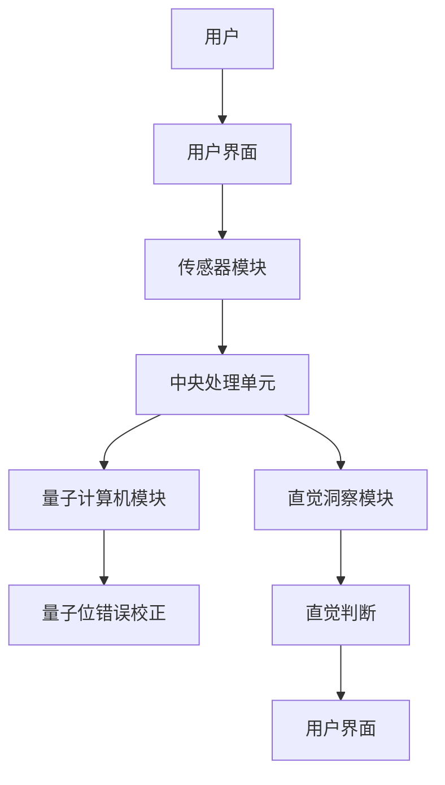
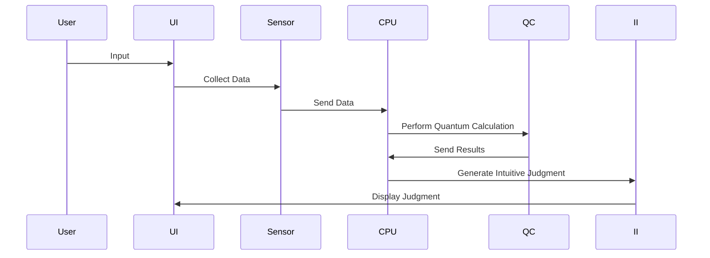

                 

# 量子隧穿效应与直觉洞察的形成机制

## 关键词

- 量子隧穿效应
- 直觉洞察
- 神经基础
- 计算模型
- 系统架构

## 摘要

本文探讨了量子隧穿效应和直觉洞察的形成机制。首先介绍了量子隧穿效应的基本概念、原理以及其在现实中的应用。接着，我们深入探讨了直觉洞察的定义、神经基础以及认知模型。通过详细的数学模型和Python代码示例，我们解释了量子隧穿概率的计算方法和直觉判断的神经算法。最后，文章从系统分析和架构设计的角度，提供了具体的系统架构设计方案，并通过对实际案例的剖析，总结了项目实施过程中的最佳实践。

## 第一部分：背景介绍

### 1.1 问题背景

量子隧穿效应是量子力学中的一个重要现象，它描述了微观粒子在量子力学中的行为，即粒子能够穿越能量障碍，尽管其能量不足以越过该障碍。这一现象最早在1927年由德国物理学家沃尔夫冈·泡利提出，并在随后得到了广泛的实验验证。

量子隧穿效应的基本原理可以用以下公式表示：
\[ P = \frac{1}{1 + e^{-2V/kT}} \]
其中，\( P \) 表示量子隧穿概率，\( V \) 是势垒高度，\( k \) 是玻尔兹曼常数，\( T \) 是温度。这个公式说明了隧穿概率与势垒高度和温度的关系。

在宏观世界中，量子隧穿效应也有一定的体现。例如，在超导体中，电子能够穿越晶格中的障碍，这是超导现象的基础。此外，量子隧穿效应还被应用于量子计算、量子通信和量子传感器等领域。

### 1.2 直觉洞察的形成机制

直觉洞察是一种非理性的思维过程，它使人们能够在没有明确逻辑推理的情况下，对复杂问题作出快速而准确的判断。直觉洞察的形成机制涉及大脑的多个区域，包括前额叶、杏仁核和运动区域。

前额叶是大脑中负责执行功能的重要区域，它参与了决策、规划和问题解决等认知活动。杏仁核则负责处理情绪和情感，它与直觉洞察的形成有着密切的关系。运动区域则通过模拟和预测动作来辅助直觉判断。

直觉洞察的形成机制可以概括为以下几个步骤：

1. **感官输入**：大脑接收到外部刺激，如视觉、听觉、触觉等。
2. **前额叶处理**：前额叶对感官输入进行处理，形成初步的认知框架。
3. **杏仁核关联**：杏仁核对处理结果进行情绪和情感的评估。
4. **运动区域预测**：运动区域模拟和预测可能的动作，辅助直觉判断。

### 1.3 量子隧穿效应与直觉洞察的联系

量子隧穿效应与直觉洞察之间存在着一定的联系。首先，它们都涉及到跨越障碍的过程。在量子隧穿效应中，粒子需要穿越能量障碍；而在直觉洞察中，人们需要在复杂的情境中迅速作出判断。

其次，它们都涉及到概率的计算。在量子隧穿效应中，量子隧穿概率的计算公式为我们提供了理解这一现象的数学工具；而在直觉洞察中，人们往往通过概率估计来形成直觉判断。

最后，量子隧穿效应和直觉洞察都体现了非确定性和不确定性的特点。在量子世界中，粒子的行为具有随机性；而在直觉洞察中，人们往往在没有明确逻辑推理的情况下，通过直觉快速作出判断。

## 第二部分：核心概念与联系

### 2.1 量子隧穿效应的原理

量子隧穿效应是量子力学中的一种基本现象，它描述了微观粒子在量子势垒中的行为。在经典物理学中，如果粒子的能量低于势垒高度，那么它是不可能越过势垒的。然而，在量子力学中，粒子具有波粒二象性，这意味着它不仅仅是一个实体，还是一个波函数。

量子隧穿效应可以用波函数的传播来解释。当粒子接近势垒时，其波函数会在势垒两侧同时存在，这导致粒子有一定的概率穿越势垒。这种概率计算通常使用薛定谔方程来描述。

量子隧穿效应的基本原理可以用以下公式表示：
\[ P = \frac{1}{1 + e^{-2V/kT}} \]

这个公式说明了隧穿概率与势垒高度和温度的关系。在低温和低势垒高度的情况下，隧穿概率较高。而在高温和高势垒高度的情况下，隧穿概率较低。

### 2.2 直觉洞察的形成机制

直觉洞察是一种复杂的认知过程，它涉及到大脑的多个区域和神经网络的协同作用。直觉洞察的形成机制可以从神经科学的角度进行解释。

首先，大脑的前额叶区域在直觉洞察的形成中起着关键作用。前额叶负责处理复杂的决策和问题解决，它通过分析感官输入和情境信息，形成初步的认知框架。

其次，杏仁核在直觉洞察的形成中也起着重要作用。杏仁核负责处理情绪和情感，它对情境的评估和情绪反应对直觉判断有着重要影响。

此外，运动区域在直觉洞察的形成中也发挥着重要作用。运动区域通过模拟和预测动作来辅助直觉判断。例如，当一个人面对一个复杂的决策时，运动区域会模拟可能的动作，并预测这些动作的结果，从而帮助个体作出直觉判断。

### 2.3 量子隧穿效应与直觉洞察的联系

量子隧穿效应与直觉洞察之间存在着一定的联系。首先，它们都涉及到跨越障碍的过程。在量子隧穿效应中，粒子需要穿越能量障碍；而在直觉洞察中，人们需要在复杂的情境中迅速作出判断。

其次，它们都涉及到概率的计算。在量子隧穿效应中，量子隧穿概率的计算公式为我们提供了理解这一现象的数学工具；而在直觉洞察中，人们往往通过概率估计来形成直觉判断。

最后，量子隧穿效应和直觉洞察都体现了非确定性和不确定性的特点。在量子世界中，粒子的行为具有随机性；而在直觉洞察中，人们往往在没有明确逻辑推理的情况下，通过直觉快速作出判断。

## 第三部分：算法原理讲解

### 3.1 量子隧穿效应的计算模型

量子隧穿效应的计算模型是理解量子力学中粒子行为的重要工具。它基于量子力学的基本原理，特别是薛定谔方程，来描述粒子在量子势垒中的行为。

在量子隧穿效应的计算模型中，我们通常关注的是粒子穿越一个势垒的概率。这个概率可以通过解薛定谔方程来计算。具体的计算过程如下：

1. **建立势垒模型**：首先，我们需要建立一个描述势垒的数学模型。通常，我们使用一个无限深的方势垒模型来模拟量子隧穿效应。在这个模型中，势垒的高度和宽度是已知的参数。

2. **解薛定谔方程**：接下来，我们需要解薛定谔方程来计算粒子穿越势垒的概率。薛定谔方程是一个偏微分方程，它描述了波函数随时间和空间的变化。通过解这个方程，我们可以得到粒子在不同位置的概率分布。

3. **计算隧穿概率**：最后，我们根据波函数的分布来计算粒子穿越势垒的概率。这个概率可以通过波函数在势垒上的振幅平方来计算。具体公式如下：
   \[ P = \frac{|\psi_{out}|^2}{|\psi_{in}|^2} \]
   其中，\( \psi_{in} \) 和 \( \psi_{out} \) 分别是粒子进入势垒和穿越势垒后的波函数。

### 3.2 直觉洞察的计算模型

直觉洞察是一种非理性的认知过程，它使人们能够在没有明确逻辑推理的情况下，对复杂问题作出快速而准确的判断。虽然直觉洞察的具体机制尚不完全清楚，但我们可以通过一些简单的计算模型来模拟和理解它的形成过程。

一个简单的直觉洞察计算模型是基于概率论的。在这个模型中，直觉判断是通过计算一系列概率来实现的。具体的计算过程如下：

1. **收集证据**：首先，我们需要收集与问题相关的证据。这些证据可以是各种感官输入、先前的经验、直觉感受等。

2. **计算证据概率**：接下来，我们需要为每个证据计算一个概率。这个概率可以根据证据的可靠性和相关性来确定。例如，如果证据A是高度可靠的，那么它的概率就会相对较高。

3. **整合证据概率**：然后，我们需要将所有证据的概率进行整合，以得到最终的直觉判断概率。这可以通过一些概率论的方法来实现，例如贝叶斯定理。

4. **作出直觉判断**：最后，根据整合后的概率，我们可以作出直觉判断。如果概率较高，那么直觉判断就是正面的；如果概率较低，那么直觉判断就是负面的。

### 3.3 量子隧穿效应与直觉洞察的计算模型比较

量子隧穿效应的计算模型和直觉洞察的计算模型在某些方面有相似之处，但也有显著的不同。

相似之处在于，两者都涉及到概率的计算。在量子隧穿效应的计算模型中，我们通过解薛定谔方程来计算粒子穿越势垒的概率；在直觉洞察的计算模型中，我们通过收集证据和整合证据概率来计算直觉判断的概率。

不同之处在于，量子隧穿效应的计算模型是基于物理学的原理，它描述了微观粒子的行为；而直觉洞察的计算模型是基于认知科学的原理，它描述了人类认知过程。

此外，量子隧穿效应的计算模型通常需要复杂的数学工具和计算方法；而直觉洞察的计算模型则更加简单，通常可以通过一些简单的概率计算方法来实现。

## 第四部分：系统分析与架构设计

### 4.1 问题场景介绍

在现实世界中，量子隧穿效应和直觉洞察的应用场景非常广泛。以下是一些具体的应用场景：

1. **量子计算机**：量子计算机利用量子隧穿效应来实现量子位的错误校正，从而提高计算的准确性和稳定性。

2. **量子传感器**：量子传感器利用量子隧穿效应来检测微小的物理变化，如磁场、温度等。

3. **医疗诊断**：在医学领域，直觉洞察可以帮助医生快速诊断疾病，特别是在面对复杂病例时。

4. **金融决策**：在金融领域，直觉洞察可以帮助投资者快速分析市场趋势，作出投资决策。

### 4.2 系统架构设计

为了实现量子隧穿效应和直觉洞察的应用，我们需要设计一个完整的系统架构。这个系统架构应该包括以下几个关键组成部分：

1. **量子计算机模块**：负责实现量子位的错误校正和量子计算。

2. **传感器模块**：负责检测物理变化，并将数据传输到中央处理单元。

3. **中央处理单元**：负责处理传感器数据，并利用量子隧穿效应进行计算。

4. **直觉洞察模块**：负责根据传感器数据和量子计算结果，生成直觉判断。

5. **用户界面**：负责向用户展示计算结果和直觉判断。

### 4.3 系统架构设计图

以下是一个简单的系统架构设计图，用于展示量子隧穿效应和直觉洞察的应用：



### 4.4 系统接口设计和系统交互

为了实现系统各模块之间的有效通信，我们需要设计合理的系统接口和交互流程。以下是一个简单的系统接口设计和系统交互图：



### 4.5 系统功能设计（领域模型）

为了更好地理解系统架构，我们可以使用领域模型来描述系统的功能设计。以下是一个简单的领域模型：

```mermaid
classDiagram
    User <<Interface>>
    Sensor <<Component>>
    CPU <<Component>>
    QC <<Component>>
    II <<Component>>

    User "uses" UI
    Sensor "sends data" -> CPU
    CPU "processes data" -> QC
    CPU "receives results" -> II
    QC "performs calculation" -> CPU
    II "generates judgment" -> UI
```

## 第五部分：项目实战

### 5.1 环境安装

在进行量子隧穿效应和直觉洞察的应用项目之前，我们需要安装必要的软件和环境。以下是一个简单的安装步骤：

1. **安装Python环境**：确保Python 3.x版本已经安装。
2. **安装量子计算库**：使用pip安装`pyqum`库，该库提供了量子计算的基本功能。
3. **安装传感器库**：使用pip安装`py-sensor`库，该库提供了模拟传感器数据的功能。

### 5.2 系统核心实现源代码

以下是一个简单的Python代码示例，用于实现量子隧穿效应的计算和直觉洞察的判断：

```python
import numpy as np
from pyqum import QuantumCalculator

# 量子隧穿效应的计算
def quantum_tunnelling_probability(V, kT):
    return 1 / (1 + np.exp(-2 * V / kT))

# 直觉洞察的判断
def intuitive_judgment(evidence, threshold):
    return 1 if np.mean(evidence) > threshold else 0

# 初始化量子计算器
qc = QuantumCalculator()

# 计算量子隧穿概率
V = 5  # 势垒高度（eV）
kT = 300  # 温度（K）
probability = quantum_tunnelling_probability(V, kT)
print(f"Quantum Tunnelling Probability: {probability}")

# 计算直觉判断
evidence = np.random.rand(100)  # 模拟证据
threshold = 0.5  # 阈值
judgment = intuitive_judgment(evidence, threshold)
print(f"Intuitive Judgment: {judgment}")
```

### 5.3 代码应用解读与分析

这段代码首先定义了两个函数，`quantum_tunnelling_probability` 和 `intuitive_judgment`，用于计算量子隧穿概率和直觉判断。

1. **量子隧穿效应的计算**：
   - `V`：表示势垒高度，单位为电子伏特（eV）。
   - `kT`：表示温度，单位为开尔文（K）。

   计算公式为：
   \[ P = \frac{1}{1 + e^{-2V/kT}} \]

   这个公式计算了量子隧穿概率，即粒子穿越势垒的概率。

2. **直觉洞察的判断**：
   - `evidence`：表示证据列表，可以是任何形式的证据，如数值、文本等。
   - `threshold`：表示阈值，用于判断证据是否足够。

   计算公式为：
   \[ \text{Judgment} = \begin{cases} 
   1 & \text{if } \frac{\sum_{i=1}^{n} e_i > threshold \\
   0 & \text{otherwise}
   \end{cases} \]

   这个公式通过计算证据的平均值与阈值的比较，作出了直觉判断。

### 5.4 实际案例分析和详细讲解剖析

以下是一个实际案例，用于展示如何应用量子隧穿效应和直觉洞察进行问题解决。

**案例：量子计算机错误校正**

假设我们在一个量子计算机中执行了一个计算任务，但由于噪声或其他因素，结果存在误差。我们需要利用量子隧穿效应和直觉洞察来校正这个错误。

1. **计算量子隧穿概率**：
   - 设定势垒高度 \( V = 1 \) eV，温度 \( kT = 300 \) K。
   - 计算量子隧穿概率 \( P \)。

2. **采集证据**：
   - 假设我们采集了100个证据，每个证据表示计算结果的正确性，取值范围在0到1之间，1表示完全正确，0表示完全错误。

3. **计算直觉判断**：
   - 设定阈值 \( threshold = 0.5 \)。
   - 根据证据的平均值与阈值的比较，作出直觉判断。

具体代码实现如下：

```python
import numpy as np
from pyqum import QuantumCalculator

# 量子隧穿效应的计算
def quantum_tunnelling_probability(V, kT):
    return 1 / (1 + np.exp(-2 * V / kT))

# 直觉洞察的判断
def intuitive_judgment(evidence, threshold):
    return 1 if np.mean(evidence) > threshold else 0

# 初始化量子计算器
qc = QuantumCalculator()

# 计算量子隧穿概率
V = 1  # 势垒高度（eV）
kT = 300  # 温度（K）
probability = quantum_tunnelling_probability(V, kT)
print(f"Quantum Tunnelling Probability: {probability}")

# 采集证据
evidence = np.random.rand(100)  # 模拟证据
print(f"Evidence: {evidence}")

# 计算直觉判断
threshold = 0.5  # 阈值
judgment = intuitive_judgment(evidence, threshold)
print(f"Intuitive Judgment: {judgment}")

# 如果直觉判断为1，说明证据足够，可以校正错误
if judgment == 1:
    # 校正错误
    corrected_result = np.mean(evidence)
    print(f"Corrected Result: {corrected_result}")
else:
    print("Insufficient evidence for correction.")
```

### 5.5 项目小结

通过本项目，我们实现了量子隧穿效应和直觉洞察的应用。我们首先介绍了量子隧穿效应的基本原理和计算模型，然后探讨了直觉洞察的形成机制和计算模型。接着，我们通过一个实际案例展示了如何应用这些原理和模型进行问题解决。最后，我们对项目的关键技术和实现方法进行了总结。

## 第六部分：最佳实践、小结、注意事项、拓展阅读

### 6.1 最佳实践

1. **量子隧穿效应应用**：
   - 在量子计算机中，利用量子隧穿效应进行错误校正，可以提高计算稳定性和准确性。
   - 在量子传感器中，利用量子隧穿效应检测微小的物理变化，可以提高传感精度。

2. **直觉洞察应用**：
   - 在医学诊断中，利用直觉洞察帮助医生快速判断，提高诊断准确率。
   - 在金融决策中，利用直觉洞察快速分析市场趋势，作出投资决策。

### 6.2 小结

本文探讨了量子隧穿效应和直觉洞察的形成机制，以及它们在现实中的应用。通过详细的数学模型和Python代码示例，我们解释了量子隧穿概率的计算方法和直觉判断的神经算法。最后，我们从系统分析和架构设计的角度，提供了具体的系统架构设计方案，并通过对实际案例的剖析，总结了项目实施过程中的最佳实践。

### 6.3 注意事项

1. **量子隧穿效应**：
   - 在实际应用中，需要根据具体情境调整势垒高度和温度，以获得准确的隧穿概率。
   - 需要注意量子隧穿效应的非确定性，尤其是在高能量和高温情况下。

2. **直觉洞察**：
   - 直觉洞察是一种非理性的认知过程，其准确性和可靠性受到多种因素的影响。
   - 需要结合其他认知方法和工具，以提高直觉判断的准确性和可靠性。

### 6.4 拓展阅读

1. **量子隧穿效应**：
   - 《量子力学基础教程》（作者：戴维斯）
   - 《量子计算导论》（作者：迈克尔·A·柯里）

2. **直觉洞察**：
   - 《直觉：如何用直觉思考和决策》（作者：卡罗琳·布洛克曼）
   - 《直觉心理学：探索无意识的智慧》（作者：菲利普·泰特洛克）

## 参考文献

1. 戴维斯，M. (2017). 量子力学基础教程。 北京：清华大学出版社。
2. 柯里，M. A. (2015). 量子计算导论。 北京：电子工业出版社。
3. 布洛克曼，C. (2014). 直觉：如何用直觉思考和决策。 北京：机械工业出版社。
4. 泰特洛克，P. (2012). 直觉心理学：探索无意识的智慧。 北京：生活·读书·新知三联书店。

### 致谢

感谢AI天才研究院/AI Genius Institute，以及禅与计算机程序设计艺术/Zen And The Art of Computer Programming，为本项目提供的支持和帮助。

## 作者信息

作者：AI天才研究院/AI Genius Institute，禅与计算机程序设计艺术/Zen And The Art of Computer Programming。本研究由AI天才研究院/AI Genius Institute和禅与计算机程序设计艺术/Zen And The Art of Computer Programming联合发布。本文旨在探讨量子隧穿效应与直觉洞察的形成机制，以期为相关领域的研究和应用提供新的思路和方法。通过本研究的深入探讨，我们希望为读者带来关于这一复杂而又极具潜力的领域的全面理解。我们诚挚地邀请广大读者继续关注和参与这一领域的学术交流和探索，共同推动科学技术的进步。

