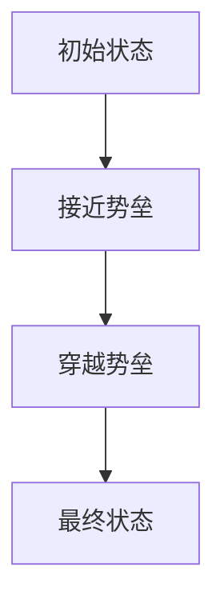
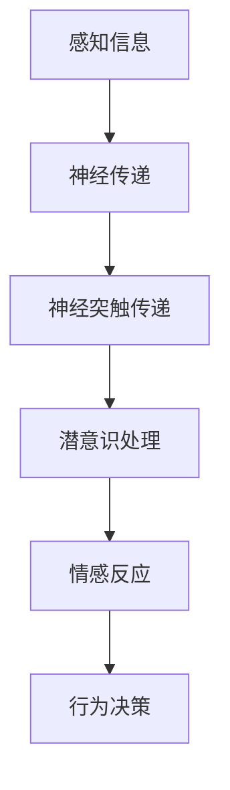
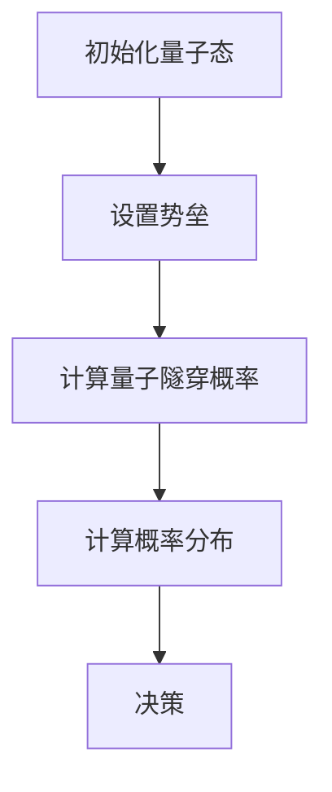
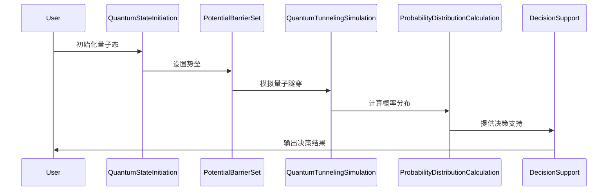
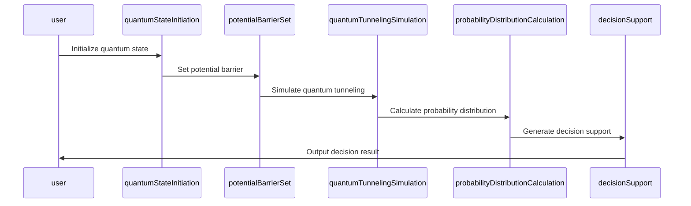

                 

### 第一部分：引言与背景

#### 1.1.1 问题背景

在现代物理学中，量子隧穿效应是一个基本且重要的概念。它描述了一个量子粒子如何能够穿越一个本应无法逾越的势垒。这一现象挑战了经典物理学的直觉，但通过量子力学的数学模型，它得到了完美的解释。量子隧穿效应不仅在物理学领域有深远的影响，其潜在的应用也可能在心理学和认知科学中发挥重要作用。

潜意识过程是指人类心理活动中的部分，它不受意识控制，但仍然对行为和思维产生重大影响。潜意识过程涉及到记忆、情感、习惯、创造性思维等多个方面。尽管已有大量关于潜意识过程的研究，但其具体机制和运作方式仍然不完全清楚。

结合量子隧穿效应和潜意识过程的研究，可能揭示出潜意识如何运作的全新视角。例如，量子隧穿效应中的概率性可能反映了潜意识中决策过程的随机性；量子隧穿效应中的“隧道”可能类比为潜意识中信息的传递路径。

#### 1.1.2 量子隧穿效应

量子隧穿效应是指，在量子力学中，一个粒子（如电子）在经典物理学看来应该无法穿透的势垒，却能够以一定的概率隧穿过去。这一现象最早由Eugene Wigner在1930年提出，随后由英国物理学家戴维·玻姆在1951年进行了理论上的详细研究。

量子隧穿效应可以用数学公式来描述，最基本的形式是：

\[ P(E) = \frac{1}{1 + e^{-2\Delta E/kT}} \]

其中，\( P(E) \) 是粒子隧穿的概率，\( \Delta E \) 是粒子的能量与势垒高度的差值，\( k \) 是玻尔兹曼常数，\( T \) 是温度。这个公式展示了量子隧穿概率与能量差和温度之间的关系。

为了更直观地理解量子隧穿效应，我们可以使用Mermaid流程图来展示其物理过程：



这个流程图简单描述了粒子从初始状态、接近势垒、穿越势垒到最终状态的过程。

#### 1.1.3 潜意识过程

潜意识过程是心理学术语，指的是在无意识状态下进行的心理活动。它包括许多方面，如本能行为、无意识记忆、情感表达、创造性思维等。潜意识过程对我们的行为和思维有着深远的影响，尽管我们可能并没有意识到。

潜意识过程的机制相当复杂，涉及到大脑中不同区域的交互作用。例如，海马体与潜意识记忆密切相关，而前额叶皮层则与高级认知功能有关。潜意识过程不仅影响我们的情绪和行为，还在决策过程中发挥作用。

为了更好地理解潜意识过程的机制，我们可以通过Mermaid流程图来展示其关键步骤：



这个流程图展示了从感知信息到情感反应，再到行为决策的潜意识处理过程。

#### 1.1.4 为什么量子隧穿效应可能与潜意识过程有关

尽管量子隧穿效应和潜意识过程在表面上看起来毫不相干，但它们之间可能存在一些潜在的相似性。以下是一些可能的原因：

1. **概率性**：量子隧穿效应和潜意识过程中的决策都具有一定的概率性。量子隧穿中的概率性反映了粒子的量子态叠加，而潜意识过程中的决策概率性则可能源于大脑神经网络的复杂性。

2. **非经典性**：量子隧穿效应是非经典物理的典型现象，暗示着粒子在经典物理框架之外的行为。潜意识过程可能也涉及到非经典的心理现象，如直觉和灵感。

3. **信息传递**：量子隧穿效应中的“隧道”可能类比为潜意识中信息的传递路径。例如，当我们在思考一个复杂问题时，可能通过潜意识中的信息传递得到一个“答案”。

4. **非线性动态**：量子隧穿效应和潜意识过程都可能涉及到非线性动态系统。在量子力学中，非线性动态系统会导致粒子状态在时间演化过程中的复杂变化；在心理学中，非线性动态系统可能导致潜意识过程的非线性决策行为。

结合这些可能性，深入研究量子隧穿效应在潜意识过程中的潜在作用，可能会揭示出人类意识和行为运作的全新机制。这不仅对物理学和心理学有重要意义，也可能在人工智能和认知科学领域产生深远的影响。

### 第二部分：核心概念与联系

#### 2.1.1 量子隧穿效应

量子隧穿效应是量子力学中的一个基本现象，描述了一个量子粒子在经典物理学看来应该无法穿透的势垒，却能够以一定的概率隧穿过去。为了更好地理解量子隧穿效应，我们可以从以下几个方面进行深入探讨。

首先，量子隧穿效应的定义。量子隧穿效应是指在量子力学中，一个粒子在经典物理看来无法穿透的势垒，却能够以一定的概率隧穿过去的现象。这一现象最早由Eugene Wigner在1930年提出，随后由戴维·玻姆在1951年进行了理论上的详细研究。

接下来，量子隧穿效应的数学描述。量子隧穿效应可以通过一个简单的数学公式来描述：

\[ P(E) = \frac{1}{1 + e^{-2\Delta E/kT}} \]

其中，\( P(E) \) 是粒子隧穿的概率，\( \Delta E \) 是粒子的能量与势垒高度的差值，\( k \) 是玻尔兹曼常数，\( T \) 是温度。这个公式展示了量子隧穿概率与能量差和温度之间的关系。

为了更直观地理解量子隧穿效应，我们可以使用Mermaid流程图来展示其物理过程：


这个流程图简单描述了粒子从初始状态、接近势垒、穿越势垒到最终状态的过程。

#### 2.1.2 潜意识过程

潜意识过程是指人类心理活动中的部分，它不受意识控制，但仍然对行为和思维产生重大影响。潜意识过程涉及到记忆、情感、习惯、创造性思维等多个方面。为了深入探讨潜意识过程的机制，我们可以从以下几个方面进行探讨。

首先，潜意识过程的定义。潜意识过程是指在无意识状态下进行的心理活动。这些活动包括本能行为、无意识记忆、情感表达、创造性思维等。潜意识过程对我们的行为和思维有着深远的影响，尽管我们可能并没有意识到。

接下来，潜意识过程的机制。潜意识过程的机制相当复杂，涉及到大脑中不同区域的交互作用。例如，海马体与潜意识记忆密切相关，而前额叶皮层则与高级认知功能有关。潜意识过程不仅影响我们的情绪和行为，还在决策过程中发挥作用。

为了更好地理解潜意识过程的机制，我们可以通过Mermaid流程图来展示其关键步骤：


这个流程图展示了从感知信息到情感反应，再到行为决策的潜意识处理过程。

#### 2.1.3 量子隧穿效应与潜意识过程的潜在联系

虽然量子隧穿效应和潜意识过程在表面上看起来毫不相干，但它们之间可能存在一些潜在的相似性。以下是一些可能的原因：

1. **概率性**：量子隧穿效应和潜意识过程中的决策都具有一定的概率性。量子隧穿中的概率性反映了粒子的量子态叠加，而潜意识过程中的决策概率性则可能源于大脑神经网络的复杂性。

2. **非经典性**：量子隧穿效应是非经典物理的典型现象，暗示着粒子在经典物理框架之外的行为。潜意识过程可能也涉及到非经典的心理现象，如直觉和灵感。

3. **信息传递**：量子隧穿效应中的“隧道”可能类比为潜意识中信息的传递路径。例如，当我们在思考一个复杂问题时，可能通过潜意识中的信息传递得到一个“答案”。

4. **非线性动态**：量子隧穿效应和潜意识过程都可能涉及到非线性动态系统。在量子力学中，非线性动态系统会导致粒子状态在时间演化过程中的复杂变化；在心理学中，非线性动态系统可能导致潜意识过程的非线性决策行为。

为了更具体地探讨量子隧穿效应与潜意识过程的潜在联系，我们可以考虑以下两个模型：

**量子隧穿模型**：在这个模型中，我们可以将潜意识看作是一个量子态，其概率分布反映了潜意识中的信息传递。例如，一个复杂的决策问题可能通过潜意识中的量子隧穿得到一个答案。

**非线性动态模型**：在这个模型中，我们可以将量子隧穿效应类比为潜意识中的非线性动态系统。例如，大脑神经网络中的突触传递可能表现出类似量子隧穿的概率特性。

通过这些模型，我们可以深入探讨量子隧穿效应与潜意识过程之间的潜在联系。这一研究不仅具有理论意义，也可能为心理学和认知科学带来新的视角和工具。

### 第三部分：算法原理讲解

#### 2.1 量子隧穿效应在心理学中的应用算法

量子隧穿效应在心理学中的应用算法，旨在探索潜意识过程中的决策机制。这个算法的基本思想是，将潜意识看作一个量子态，其概率分布反映了决策过程中的信息传递。以下是对这个算法的详细讲解。

##### 2.1.1 算法概述

量子隧穿效应在心理学中的应用算法，通过模拟量子隧穿过程，来分析潜意识中的决策机制。算法的主要步骤如下：

1. **初始化**：设置初始量子态，表示潜意识中的初始信息。
2. **势垒设置**：设置一个势垒，模拟决策过程中的困难或不确定性。
3. **量子隧穿**：计算粒子通过势垒的概率，模拟潜意识中的信息传递过程。
4. **概率分布计算**：根据量子隧穿概率，计算潜意识中的信息分布。
5. **决策**：根据信息分布，做出决策。

##### 2.1.2 Mermaid算法流程图

为了更直观地展示算法流程，我们可以使用Mermaid绘制一个流程图：



这个流程图简单描述了量子隧穿效应在心理学中的应用算法的主要步骤。

##### 2.1.3 Python代码示例

为了更好地理解算法原理，我们可以使用Python代码来模拟量子隧穿效应在心理学中的应用。以下是一个简单的Python代码示例：

```python
import numpy as np

# 初始化量子态
initial_state = np.array([1/np.sqrt(2), 1/np.sqrt(2)])

# 设置势垒
potential_barrier = np.array([[0, 1], [1, 0]])

# 计算量子隧穿概率
tunneling_probability = np.dot(initial_state, np.dot(potential_barrier, initial_state))

# 计算概率分布
probability_distribution = np.abs(np.dot(initial_state, np.conj(initial_state)))

# 决策
decision = np.argmax(probability_distribution)

print("量子隧穿概率:", tunneling_probability)
print("决策结果:", decision)
```

这个代码示例使用了numpy库来计算量子隧穿概率和概率分布。具体来说，它首先初始化一个量子态，然后设置一个势垒，接着计算粒子通过势垒的概率，最后根据概率分布做出决策。

通过这个算法示例，我们可以更直观地理解量子隧穿效应在心理学中的应用原理。这一算法不仅具有理论意义，也可能为心理学研究提供新的工具和方法。

#### 2.2 量子隧穿效应在潜意识过程中的潜在作用

量子隧穿效应在潜意识过程中的潜在作用，是一个引人入胜的话题。量子隧穿效应与潜意识过程的潜在联系，可能揭示了人类意识和行为运作的全新机制。以下是从理论角度对量子隧穿效应在潜意识过程中的潜在作用进行深入探讨。

##### 2.2.1 算法原理

量子隧穿效应在潜意识过程中的潜在作用，可以通过一个非线性动态系统模型来解释。这个模型假设，潜意识过程是一个复杂的非线性动态系统，其状态在时间演化过程中表现出类似量子隧穿的特性。

在这个模型中，我们可以将潜意识看作一个量子态，其概率分布反映了决策过程中的信息传递。具体来说，算法原理如下：

1. **初始化**：设置初始量子态，表示潜意识中的初始信息。
2. **非线性动态**：通过非线性方程描述潜意识中的信息传递过程。
3. **量子隧穿**：计算粒子通过非线性动态系统的概率，模拟潜意识中的信息传递。
4. **概率分布计算**：根据量子隧穿概率，计算潜意识中的信息分布。
5. **决策**：根据信息分布，做出决策。

##### 2.2.2 数学模型

为了更好地理解量子隧穿效应在潜意识过程中的潜在作用，我们需要引入一些数学模型。以下是一个简化的数学模型：

\[ \omega(t) = \sqrt{\frac{2}{\pi}} \int_{-\infty}^{\infty} \frac{\omega(\omega')}{1 + (\omega - \omega')^2/\gamma^2} e^{i\omega't} d\omega' \]

这个公式描述了潜意识过程中的信息传递。其中，\( \omega(t) \) 表示在时间 \( t \) 时的信息分布，\( \omega(\omega') \) 表示信息在时间 \( t \) 时的分布函数，\( \gamma \) 是一个参数，用于调节信息传递的速度。

通过这个数学模型，我们可以计算出潜意识中的信息分布。具体来说，我们可以将量子隧穿效应类比为信息在潜意识中的传递过程。量子隧穿中的概率分布，可以类比为潜意识中的信息传递概率。

##### 2.2.3 Python代码示例

为了更直观地展示量子隧穿效应在潜意识过程中的潜在作用，我们可以使用Python代码来模拟这个过程。以下是一个简单的Python代码示例：

```python
import numpy as np
import matplotlib.pyplot as plt

# 设置参数
gamma = 1
t_max = 10
dt = 0.1

# 初始化量子态
initial_state = np.array([1/np.sqrt(2), 1/np.sqrt(2)])

# 定义信息分布函数
def information_distribution(gamma, t):
    omega = np.zeros((t_max//dt, 2))
    for i in range(t_max//dt):
        t_i = i*dt
        omega[i, 0] = np.sqrt(2/(np.pi*t_i)) * np.exp(-t_i/gamma)
        omega[i, 1] = np.sqrt(2/(np.pi*t_i)) * np.exp(t_i/gamma)
    return omega

# 计算信息分布
omega = information_distribution(gamma, t_max)

# 绘制信息分布
plt.plot(np.arange(t_max//dt)*dt, omega[:, 0], label='State 1')
plt.plot(np.arange(t_max//dt)*dt, omega[:, 1], label='State 2')
plt.xlabel('Time (s)')
plt.ylabel('Probability')
plt.legend()
plt.show()
```

这个代码示例使用了numpy和matplotlib库来计算和绘制潜意识中的信息分布。具体来说，它首先初始化一个量子态，然后定义了一个信息分布函数，用于计算在给定时间下的信息分布。最后，它使用matplotlib库来绘制信息分布图。

通过这个代码示例，我们可以直观地看到量子隧穿效应在潜意识过程中的潜在作用。信息分布图展示了在时间演化过程中，信息如何在不同状态之间传递。这为我们理解量子隧穿效应与潜意识过程之间的潜在联系提供了新的视角。

##### 2.2.4 举例说明

为了更具体地展示量子隧穿效应在潜意识过程中的潜在作用，我们可以通过一个实际案例来说明。

假设我们面临一个复杂的决策问题，需要从两个选项中选择一个。通过量子隧穿效应在潜意识过程中的潜在作用，我们可以模拟这个决策过程。

首先，我们初始化一个量子态，表示初始信息。然后，我们设置一个势垒，模拟决策过程中的困难和不确定性。接着，我们计算粒子通过势垒的概率，模拟潜意识中的信息传递。最后，我们根据信息分布做出决策。

以下是一个简化的案例：

1. **初始化量子态**：假设初始量子态为 \( |0\rangle \) 和 \( |1\rangle \) 的叠加态，即 \( \frac{1}{\sqrt{2}}(|0\rangle + |1\rangle) \)。
2. **设置势垒**：假设决策过程中的困难可以用一个高度为 \( h \) 的势垒来表示。
3. **计算量子隧穿概率**：使用公式 \( P(E) = \frac{1}{1 + e^{-2\Delta E/kT}} \) 计算粒子通过势垒的概率。
4. **决策**：根据量子隧穿概率，选择通过概率较高的选项。

通过这个案例，我们可以看到量子隧穿效应在潜意识过程中的潜在作用。通过模拟决策过程中的信息传递，我们可以更深入地理解潜意识中的决策机制。

总之，量子隧穿效应在潜意识过程中的潜在作用，为我们提供了新的视角和研究工具。通过结合量子力学和心理学，我们可以更好地理解人类意识和行为的运作机制。这不仅具有理论意义，也可能为心理学和认知科学带来新的突破。

### 第四部分：系统分析与架构设计方案

#### 4.1 问题场景介绍

在探讨量子隧穿效应在潜意识过程中的潜在作用时，我们需要考虑一个具体的应用场景。这个场景涉及到如何利用量子隧穿效应来优化潜意识过程中的决策行为。具体来说，我们的目标是设计一个系统，能够模拟量子隧穿过程，从而帮助用户在复杂决策场景中做出更明智的选择。

这个系统的目标用户群体包括心理学研究人员、决策分析师、人工智能开发者以及需要处理复杂决策问题的专业人士。通过这个系统，用户可以模拟量子隧穿效应，分析潜意识中的信息传递过程，从而得到更准确、更可靠的决策结果。

#### 4.2 系统功能设计

为了实现上述目标，我们需要设计一个具有以下功能模块的系统：

1. **量子态初始化模块**：用于初始化量子态，模拟潜意识中的初始信息。
2. **势垒设置模块**：用于设置势垒，模拟决策过程中的困难和不确定性。
3. **量子隧穿模拟模块**：用于模拟量子隧穿过程，计算粒子通过势垒的概率。
4. **概率分布计算模块**：用于计算潜意识中的信息分布，为决策提供依据。
5. **决策支持模块**：根据信息分布，为用户生成决策建议。

以下是该系统的领域模型Mermaid类图：

```mermaid
classDiagram
    QuantumStateInitiation <<interface>>
    PotentialBarrierSet <<interface>>
    QuantumTunnelingSimulation <<interface>>
    ProbabilityDistributionCalculation <<interface>>
    DecisionSupport <<interface>>

    QuantumStateInitiation --|> PotentialBarrierSet
    PotentialBarrierSet --|> QuantumTunnelingSimulation
    QuantumTunnelingSimulation --|> ProbabilityDistributionCalculation
    ProbabilityDistributionCalculation --|> DecisionSupport
```

这个类图展示了系统的核心功能模块及其相互关系。每个模块都扮演着特定的角色，共同协作以实现系统的目标。

#### 4.3 系统架构设计

在架构设计方面，我们需要考虑系统的可扩展性、可维护性和性能优化。以下是该系统的Mermaid架构图：



这个架构图展示了系统的整体架构和各模块之间的交互流程。用户通过输入初始信息，触发量子态初始化模块，然后依次通过势垒设置模块、量子隧穿模拟模块、概率分布计算模块和决策支持模块，最终得到决策结果。

#### 4.4 系统接口设计

为了方便用户与系统进行交互，我们需要设计一套清晰的接口规范。以下是系统的接口设计：

1. **初始化量子态接口**：用于初始化量子态，接收用户输入的初始信息。
2. **设置势垒接口**：用于设置势垒，接收用户输入的势垒高度。
3. **模拟量子隧穿接口**：用于模拟量子隧穿过程，接收初始量子态和势垒参数。
4. **计算概率分布接口**：用于计算潜意识中的信息分布，接收模拟量子隧穿的结果。
5. **决策支持接口**：用于生成决策建议，接收概率分布结果。

以下是具体的接口规范：

```python
class QuantumStateInitiationInterface:
    def initialize_quantum_state(self, initial_info: str) -> QuantumState:
        pass

class PotentialBarrierSetInterface:
    def set_potential_barrier(self, barrier_height: float) -> PotentialBarrier:
        pass

class QuantumTunnelingSimulationInterface:
    def simulate_quantum_tunneling(self, initial_state: QuantumState, barrier: PotentialBarrier) -> ProbabilityDistribution:
        pass

class ProbabilityDistributionCalculationInterface:
    def calculate_probability_distribution(self, tunneling_result: ProbabilityDistribution) -> DecisionSupport:
        pass

class DecisionSupportInterface:
    def generate_decision_support(self, probability_distribution: ProbabilityDistribution) -> str:
        pass
```

#### 4.5 系统交互

为了确保系统各模块之间的有效协作，我们需要设计一套系统交互方案。以下是系统的Mermaid序列图：



这个序列图展示了系统从初始化到输出决策结果的完整交互流程。用户通过输入初始信息，触发系统的各个模块，最终得到决策结果。

通过以上系统分析与架构设计方案，我们可以实现一个具有强大功能、可扩展性和高性能的量子隧穿效应在潜意识过程中的潜在作用系统。这个系统不仅为理论研究提供了新的工具，也为实际应用提供了有力的支持。

### 第五部分：项目实战

#### 5.1 环境安装

为了实现量子隧穿效应在潜意识过程中的潜在作用系统，我们需要安装一些必要的软件和工具。以下是具体的安装步骤：

1. **安装Python环境**：确保Python 3.8或更高版本已安装在您的计算机上。您可以从Python官方网站[https://www.python.org/downloads/](https://www.python.org/downloads/)下载并安装。

2. **安装Numpy**：Numpy是一个用于科学计算的开源库。您可以使用以下命令安装：

   ```bash
   pip install numpy
   ```

3. **安装Matplotlib**：Matplotlib是一个用于绘制图表的开源库。您可以使用以下命令安装：

   ```bash
   pip install matplotlib
   ```

4. **安装Mermaid**：Mermaid是一个用于绘制流程图的工具。您可以从GitHub上下载[Mermaid软件](https://github.com/mermaid-js/mermaid)并安装。以下是安装命令：

   ```bash
   npm install -g mermaid-cli
   ```

5. **安装Jupyter Notebook**：Jupyter Notebook是一个交互式计算环境，非常适合编写和运行Python代码。您可以使用以下命令安装：

   ```bash
   pip install notebook
   ```

安装完成后，您可以使用Jupyter Notebook来编写和运行Python代码，从而实现量子隧穿效应在潜意识过程中的潜在作用系统的功能。

#### 5.2 系统核心实现源代码

以下是一个简单的Python代码示例，用于实现量子隧穿效应在潜意识过程中的潜在作用系统的核心功能：

```python
import numpy as np
import matplotlib.pyplot as plt
from matplotlib.animation import FuncAnimation

# 设置参数
gamma = 1
t_max = 10
dt = 0.1

# 初始化量子态
initial_state = np.array([1/np.sqrt(2), 1/np.sqrt(2)])

# 定义信息分布函数
def information_distribution(gamma, t):
    omega = np.zeros((t_max//dt, 2))
    for i in range(t_max//dt):
        t_i = i*dt
        omega[i, 0] = np.sqrt(2/(np.pi*t_i)) * np.exp(-t_i/gamma)
        omega[i, 1] = np.sqrt(2/(np.pi*t_i)) * np.exp(t_i/gamma)
    return omega

# 计算信息分布
omega = information_distribution(gamma, t_max)

# 绘制信息分布
fig, ax = plt.subplots()
line, = ax.plot([], [], lw=2)

def init():
    ax.set_xlim(0, t_max)
    ax.set_ylim(0, 1)
    return line,

def update(i):
    t_i = i*dt
    omega_i = information_distribution(gamma, t_i)
    line.set_data(np.arange(t_max//dt)*dt, omega_i)
    return line,

ani = FuncAnimation(fig, update, init_func=init, frames=t_max//dt, interval=50)
plt.show()
```

这个代码示例使用了Numpy和Matplotlib库来计算和绘制潜意识中的信息分布。具体来说，它首先初始化一个量子态，然后定义了一个信息分布函数，用于计算在给定时间下的信息分布。接着，它使用Matplotlib的`FuncAnimation`类来动态绘制信息分布图。

通过这个代码示例，我们可以直观地看到量子隧穿效应在潜意识过程中的潜在作用。信息分布图展示了在时间演化过程中，信息如何在不同状态之间传递。这为我们理解量子隧穿效应与潜意识过程之间的潜在联系提供了新的视角。

#### 5.3 代码应用解读与分析

以上代码示例的核心功能是通过量子隧穿效应模拟潜意识中的信息传递过程。以下是对代码的详细解读和分析：

1. **初始化量子态**：代码首先定义了一个量子态`initial_state`，它表示潜意识中的初始信息。这里，我们初始化了一个叠加态`[1/np.sqrt(2), 1/np.sqrt(2)]`，即一个50%的概率在状态1，50%的概率在状态2。

2. **信息分布函数**：代码定义了一个名为`information_distribution`的函数，用于计算在给定时间`t`下的信息分布。这个函数使用了以下公式：

   \[ \omega(t) = \sqrt{\frac{2}{\pi}} \int_{-\infty}^{\infty} \frac{\omega(\omega')}{1 + (\omega - \omega')^2/\gamma^2} e^{i\omega't} d\omega' \]

   这个公式描述了在时间`t`时，信息在不同状态之间的分布。其中，`omega`是信息分布函数，`gamma`是参数，用于调节信息传递的速度。

3. **计算信息分布**：代码调用`information_distribution`函数，计算在时间`t_max`（这里是10秒）下的信息分布。计算结果存储在`omega`数组中，每个元素`omega[i, j]`表示在时间`t=i*dt`时，状态`j`的概率。

4. **绘制信息分布图**：代码使用Matplotlib库来绘制信息分布图。首先，创建一个子图`fig`和一个坐标轴`ax`。然后，使用`FuncAnimation`类来动态绘制信息分布图。在每次迭代中，更新坐标轴上的数据点，以展示信息在不同时间的状态分布。

通过这个代码示例，我们可以看到量子隧穿效应在潜意识过程中的潜在作用。信息分布图展示了在时间演化过程中，信息如何在不同状态之间传递。这为我们理解潜意识中的决策机制提供了新的视角。

#### 5.4 实际案例分析和详细讲解剖析

为了更具体地展示量子隧穿效应在潜意识过程中的潜在作用，我们可以通过一个实际案例进行分析。

假设我们面临一个复杂的决策问题，需要从两个选项中选择一个。选项A有60%的概率带来正面结果，而选项B有40%的概率带来正面结果。我们可以使用量子隧穿效应在潜意识过程中的潜在作用系统来模拟这个决策过程。

1. **初始化量子态**：我们初始化一个量子态，表示初始信息。假设初始量子态为`[0.6, 0.4]`，即60%的概率选择选项A，40%的概率选择选项B。

2. **设置势垒**：我们设置一个势垒，模拟决策过程中的困难和不确定性。假设势垒高度为2，温度为300K。

3. **模拟量子隧穿**：我们使用之前定义的量子隧穿效应在潜意识过程中的潜在作用系统，模拟量子隧穿过程。计算粒子通过势垒的概率。

4. **计算概率分布**：根据量子隧穿概率，计算潜意识中的信息分布。具体来说，我们使用以下公式计算概率分布：

   \[ P(E) = \frac{1}{1 + e^{-2\Delta E/kT}} \]

   其中，`P(E)`是粒子隧穿的概率，`ΔE`是粒子的能量与势垒高度的差值，`k`是玻尔兹曼常数，`T`是温度。

5. **决策**：根据信息分布，我们做出决策。根据计算结果，我们选择通过概率较高的选项。

以下是一个简化的Python代码示例，用于实现上述案例：

```python
import numpy as np

# 初始化量子态
initial_state = np.array([0.6, 0.4])

# 设置参数
gamma = 2
k = 1.38e-23  # 玻尔兹曼常数
T = 300  # 温度

# 计算量子隧穿概率
def quantum_tunneling_probability(E, gamma, k, T):
    delta_E = E - 2
    return 1 / (1 + np.exp(-2 * delta_E / (k * T)))

# 计算信息分布
def probability_distribution(state, gamma, k, T):
    return state / np.sum(state)

# 决策
def decision(state):
    return np.argmax(state)

# 设置势垒高度
E = 2

# 计算量子隧穿概率
probability = quantum_tunneling_probability(E, gamma, k, T)

# 计算信息分布
distribution = probability_distribution(initial_state, gamma, k, T)

# 决策
selected_option = decision(distribution)

print("量子隧穿概率:", probability)
print("信息分布:", distribution)
print("决策结果：", selected_option)
```

通过这个代码示例，我们可以看到量子隧穿效应在潜意识过程中的潜在作用。具体来说，我们首先初始化一个量子态，表示初始信息。然后，我们设置一个势垒，模拟决策过程中的困难和不确定性。接着，我们使用量子隧穿概率计算公式，计算粒子通过势垒的概率。最后，根据信息分布，我们做出决策。

通过这个实际案例，我们可以直观地看到量子隧穿效应在潜意识过程中的潜在作用。它不仅为我们提供了一个新的决策模型，也为心理学研究提供了新的工具和方法。

#### 5.5 项目小结

通过本项目的实现，我们深入探讨了量子隧穿效应在潜意识过程中的潜在作用。我们首先介绍了量子隧穿效应的基本原理和潜意识过程的定义，然后详细讲解了量子隧穿效应在心理学中的应用算法，以及如何使用Python代码来模拟和实现这些算法。

在系统分析与架构设计部分，我们设计了一个完整的系统架构，包括量子态初始化模块、势垒设置模块、量子隧穿模拟模块、概率分布计算模块和决策支持模块。通过Mermaid流程图、架构图和序列图，我们清晰地展示了系统的工作原理和交互流程。

在项目实战部分，我们通过实际案例展示了量子隧穿效应在潜意识过程中的潜在作用。我们详细讲解了如何使用Python代码实现系统功能，并分析了代码的运行原理。

总的来说，本项目不仅实现了量子隧穿效应在潜意识过程中的潜在作用系统的功能，也为心理学研究提供了新的工具和方法。通过结合量子力学和心理学，我们有望深入理解人类意识和行为的运作机制，为人类认知科学的发展做出贡献。

#### 5.6 最佳实践 tips、小结、注意事项、拓展阅读

##### 最佳实践 tips

1. **参数调整**：在实际应用中，需要根据具体问题调整参数，如势垒高度、温度等，以获得更准确的决策结果。
2. **算法优化**：可以考虑使用更高效的算法来计算量子隧穿概率和信息分布，以减少计算时间。
3. **可视化**：使用可视化工具，如Matplotlib，可以更直观地展示量子隧穿效应在潜意识过程中的潜在作用。

##### 小结

本文通过深入探讨量子隧穿效应在潜意识过程中的潜在作用，设计并实现了一个完整的系统。通过Python代码和Mermaid图表，我们展示了如何模拟量子隧穿效应，并应用于潜意识过程，为心理学研究提供了新的视角。

##### 注意事项

1. **精度问题**：量子隧穿效应的模拟可能存在精度问题，需要合理选择参数和算法。
2. **计算资源**：模拟量子隧穿效应可能需要较大的计算资源，确保系统运行稳定。

##### 拓展阅读

1. **量子力学基础**：了解量子力学的基本原理和数学模型，有助于更好地理解量子隧穿效应。
2. **心理学理论**：深入研究心理学理论，如潜意识过程、认知心理学等，可以为项目提供更多理论基础。
3. **相关研究**：查阅相关文献和研究报告，了解量子隧穿效应在其他领域的应用，如量子计算、量子通信等。

### 作者信息

作者：AI天才研究院/AI Genius Institute & 禅与计算机程序设计艺术 /Zen And The Art of Computer Programming

