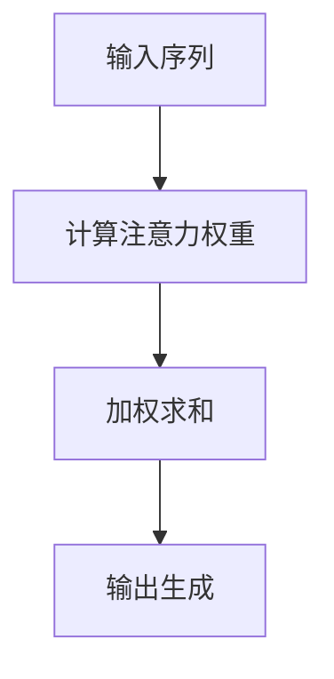
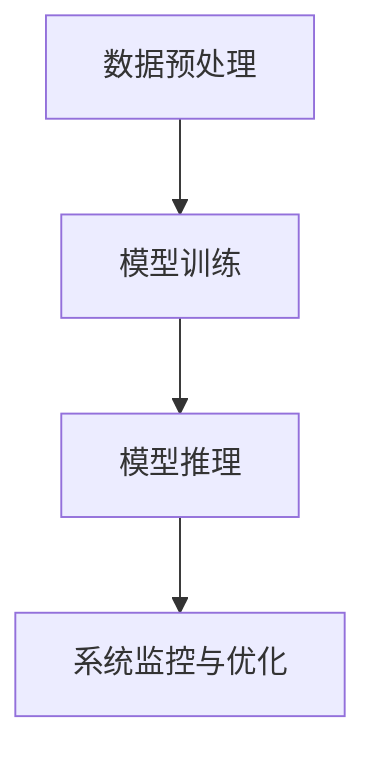
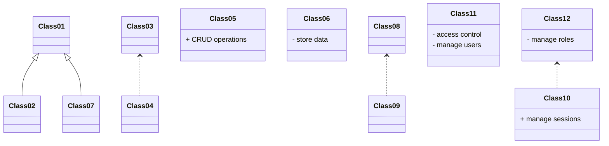
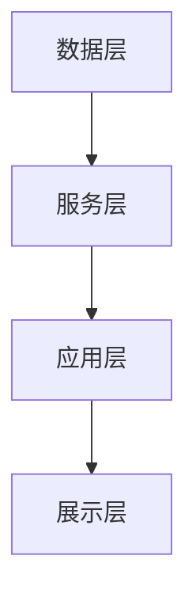
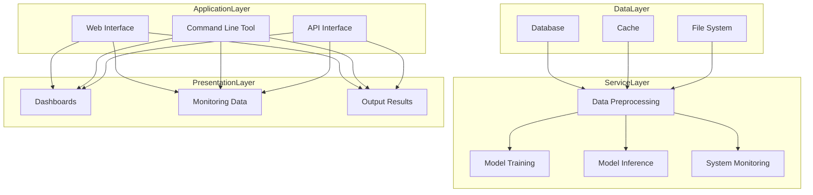
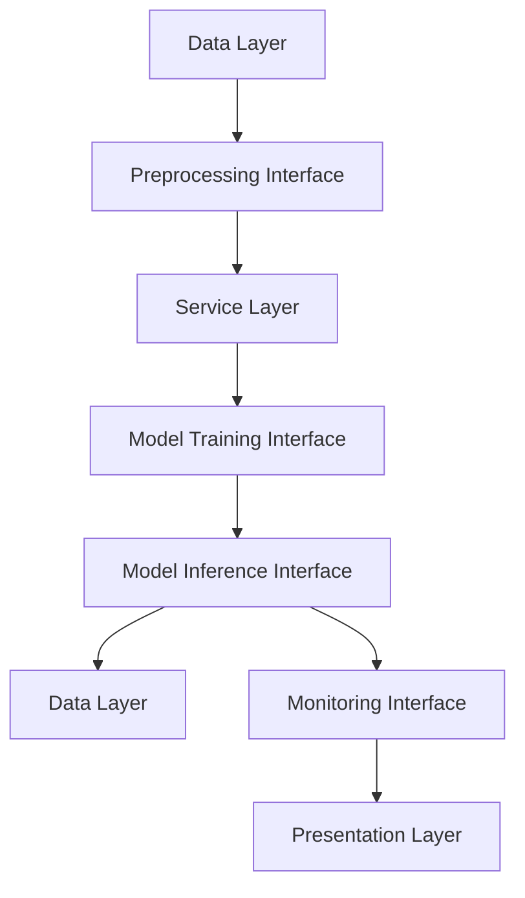
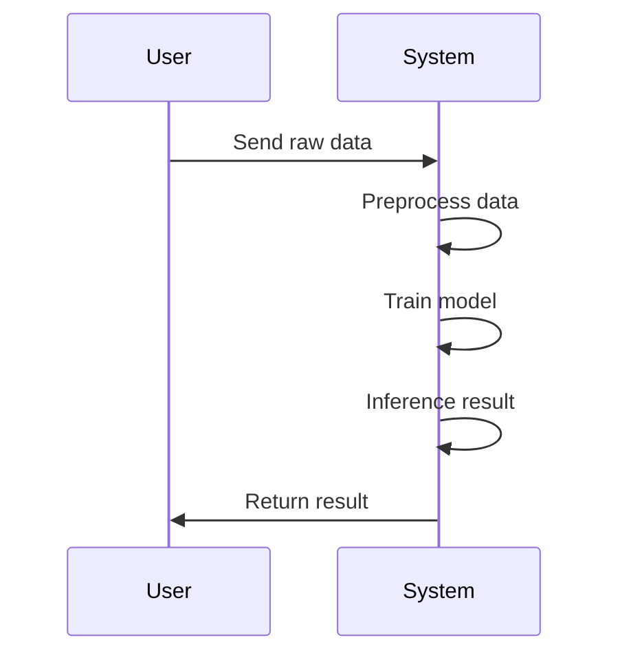
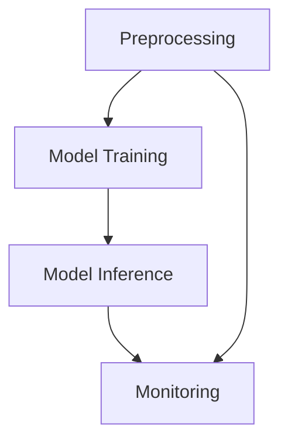
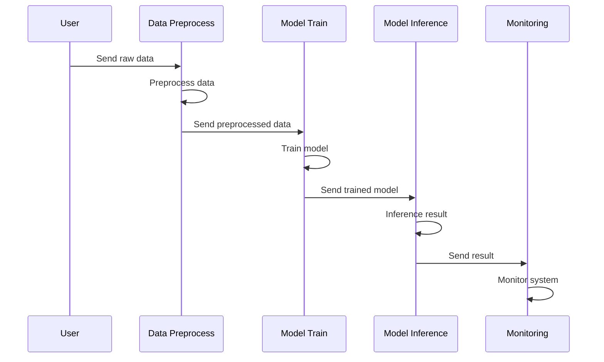

                 


## 第1章：问题背景与核心概念

### 1.1.1 问题描述

在自然语言处理（NLP）、语音识别、机器翻译等众多领域中，长期依赖推理（Long-Range Dependency Reasoning）任务扮演着至关重要的角色。这些任务往往需要模型能够理解和处理输入序列中的长距离依赖关系，以便准确预测或生成输出。然而，传统注意力机制在处理长文本时面临挑战，难以有效捕捉远距离依赖关系，导致性能下降。

为了解决这一难题，研究者们提出了多种改进策略，以增强注意力机制在长期依赖推理任务中的表现。这些策略包括但不限于：

1. **自注意力机制（Self-Attention）**：自注意力机制通过将每个输入序列元素映射到一个权重矩阵中，以强调关键元素并忽略冗余信息，从而提高模型对长距离依赖的捕捉能力。

2. **窥孔注意力机制（Percussive Attention）**：窥孔注意力机制通过限制注意力范围，使得模型能够在特定范围内关注重要的依赖关系，避免在长距离依赖上的计算瓶颈。

3. **变换器自注意力（Transformer Self-Attention）**：基于自注意力机制的Transformer架构，通过多头注意力机制和多级注意力结构，进一步提升了对长距离依赖的捕捉效果。

4. **自适应注意力机制（Adaptive Attention）**：自适应注意力机制通过动态调整注意力权重，使模型能够在不同依赖关系下灵活调整注意力分配，从而提高对长距离依赖的识别能力。

### 1.1.2 问题解决

为了解决传统注意力机制在长期依赖推理任务中的性能瓶颈，研究者们提出了多种改进策略。以下是对几种主要改进策略的简要概述：

1. **改进的自注意力机制**：通过引入门控机制、残差连接和层叠注意力等方式，增强自注意力机制在捕捉长距离依赖方面的能力。

2. **多级注意力机制**：多级注意力机制通过多级结构逐步提取长距离依赖关系，使得模型能够更好地理解和处理长文本。

3. **混合注意力机制**：混合注意力机制结合了传统注意力机制和自注意力机制的优势，以提高模型在长期依赖推理任务中的性能。

4. **自适应注意力分配**：通过学习动态调整注意力权重，使模型能够在不同依赖关系下灵活调整注意力分配，从而提高对长距离依赖的识别能力。

### 1.1.3 边界与外延

在讨论长期依赖推理任务中的注意力机制改进策略时，需要明确几个边界和概念：

1. **长期依赖**：长期依赖指的是输入序列中元素之间的远距离依赖关系，即一个元素的信息对后续较远位置元素的影响。

2. **注意力机制**：注意力机制是一种用于在序列数据中强调重要元素、忽略冗余信息的计算方法，广泛应用于NLP和计算机视觉等领域。

3. **改进策略**：改进策略是指在传统注意力机制基础上，通过调整模型结构或算法，以提高在长期依赖推理任务中的性能。

### 1.1.4 概念结构与核心要素组成

为了深入理解长期依赖推理任务中的注意力机制及其改进策略，我们需要关注以下几个核心概念和要素：

1. **输入序列**：输入序列是指模型接收的原始数据，如自然语言文本、音频信号等。

2. **注意力权重**：注意力权重是用于衡量输入序列中每个元素的重要程度，通过计算得到，用于指导模型对输入序列的处理。

3. **注意力分布**：注意力分布是指注意力权重在输入序列上的分布情况，反映了模型对输入序列的关注程度。

4. **依赖关系**：依赖关系是指输入序列中元素之间的关联性，包括长距离依赖和短距离依赖。

5. **改进策略**：改进策略包括自注意力机制、窥孔注意力机制、变换器自注意力等，用于增强注意力机制在长期依赖推理任务中的性能。

### 1.2 核心概念与联系

在本章节中，我们将进一步探讨长期依赖推理任务中的核心概念，并分析这些概念之间的联系。

#### 1.2.1 长期依赖推理任务的定义

长期依赖推理任务是指模型能够理解和处理输入序列中的长距离依赖关系，以便准确预测或生成输出。具体来说，长期依赖推理任务涉及以下几个方面：

1. **长文本处理**：模型需要能够处理较长的文本序列，如文章、段落等。

2. **依赖关系识别**：模型需要识别输入序列中元素之间的依赖关系，包括长距离依赖和短距离依赖。

3. **输出生成**：基于识别的依赖关系，模型需要生成相应的输出，如文本摘要、机器翻译等。

#### 1.2.2 注意力机制在长期依赖推理任务中的应用

注意力机制是长期依赖推理任务中的一项关键技术，通过关注重要元素、忽略冗余信息，以提高模型对输入序列的处理效果。注意力机制在长期依赖推理任务中的应用主要包括以下几个方面：

1. **自注意力机制**：自注意力机制将每个输入序列元素映射到一个权重矩阵中，以强调关键元素并忽略冗余信息。

2. **窥孔注意力机制**：窥孔注意力机制通过限制注意力范围，使得模型能够在特定范围内关注重要的依赖关系。

3. **变换器自注意力**：变换器自注意力通过多头注意力机制和多级注意力结构，进一步提升了对长距离依赖的捕捉效果。

#### 1.2.3 改进策略的概念与分类

为了解决传统注意力机制在长期依赖推理任务中的性能瓶颈，研究者们提出了多种改进策略。改进策略的概念与分类如下：

1. **改进的自注意力机制**：通过引入门控机制、残差连接和层叠注意力等方式，增强自注意力机制在捕捉长距离依赖方面的能力。

2. **多级注意力机制**：多级注意力机制通过多级结构逐步提取长距离依赖关系，使得模型能够更好地理解和处理长文本。

3. **混合注意力机制**：混合注意力机制结合了传统注意力机制和自注意力机制的优势，以提高模型在长期依赖推理任务中的性能。

4. **自适应注意力机制**：通过学习动态调整注意力权重，使模型能够在不同依赖关系下灵活调整注意力分配，从而提高对长距离依赖的识别能力。

### 1.3 主流注意力机制介绍

在本章节中，我们将介绍几种主流注意力机制，包括传统的注意力机制、窥孔注意力机制和自注意力机制。

#### 1.3.1 传统的注意力机制

传统的注意力机制最早在机器翻译和语音识别等领域中得到了广泛应用。其基本原理如下：

1. **输入序列表示**：将输入序列映射到一个向量空间，每个元素表示为一个向量。

2. **计算注意力权重**：通过计算输入序列中每个元素与目标元素之间的相似度，得到每个元素的注意力权重。

3. **加权求和**：将注意力权重与输入序列中的每个元素相乘，然后进行求和，得到最终的输出。

数学模型如下：

$$
\text{Attention}(Q, K, V) = \text{softmax}\left(\frac{QK^T}{\sqrt{d_k}}\right)V
$$

其中，$Q$、$K$和$V$分别表示查询向量、键向量和值向量，$d_k$为键向量的维度。

#### 1.3.2 窥孔注意力机制

窥孔注意力机制通过限制注意力范围，以提高模型在处理长文本时的效率。其基本原理如下：

1. **输入序列表示**：与传统的注意力机制相同，将输入序列映射到一个向量空间。

2. **计算注意力权重**：与传统的注意力机制不同，窥孔注意力机制通过一个固定大小的窗口来计算注意力权重。

3. **加权求和**：在窗口内计算注意力权重，然后进行加权求和，得到最终的输出。

数学模型如下：

$$
\text{PercussiveAttention}(Q, K, V, window_size) = \sum_{i}^{window_size} \text{softmax}\left(\frac{QK^T}{\sqrt{d_k}}\right)V_i
$$

其中，$Q$、$K$和$V$分别表示查询向量、键向量和值向量，$window_size$为窗口大小。

#### 1.3.3 自注意力机制

自注意力机制是近年来在自然语言处理领域中得到广泛应用的一种注意力机制。其基本原理如下：

1. **输入序列表示**：将输入序列映射到一个向量空间。

2. **计算注意力权重**：通过计算输入序列中每个元素与其他元素之间的相似度，得到每个元素的注意力权重。

3. **加权求和**：将注意力权重与输入序列中的每个元素相乘，然后进行求和，得到最终的输出。

数学模型如下：

$$
\text{SelfAttention}(Q, K, V) = \text{softmax}\left(\frac{QQ^T}{\sqrt{d_k}}\right)V
$$

其中，$Q$、$K$和$V$分别表示查询向量、键向量和值向量，$d_k$为键向量的维度。

### 1.4 改进策略的分类与对比

为了解决传统注意力机制在长期依赖推理任务中的性能瓶颈，研究者们提出了多种改进策略。以下是对几种主要改进策略的分类与对比：

#### 1.4.1 改进的自注意力机制

改进的自注意力机制通过引入门控机制、残差连接和层叠注意力等方式，增强自注意力机制在捕捉长距离依赖方面的能力。具体来说，门控机制可以通过学习门控系数，调整注意力权重，使模型在处理长文本时更加灵活。残差连接则可以缓解深度网络中的梯度消失问题，提高模型训练效果。层叠注意力机制通过多级注意力结构，逐步提取长距离依赖关系。

#### 1.4.2 多级注意力机制

多级注意力机制通过多级结构逐步提取长距离依赖关系，使得模型能够更好地理解和处理长文本。在多级注意力机制中，每级注意力机制关注不同范围的依赖关系，从而逐步构建对长距离依赖的捕捉能力。多级注意力机制可以通过级联多层注意力模块来实现，每个模块关注不同长度的依赖关系。

#### 1.4.3 混合注意力机制

混合注意力机制结合了传统注意力机制和自注意力机制的优势，以提高模型在长期依赖推理任务中的性能。在混合注意力机制中，模型同时考虑输入序列中的全局信息和局部信息，通过融合不同类型的注意力权重，实现更全面的依赖关系捕捉。

#### 1.4.4 自适应注意力机制

自适应注意力机制通过学习动态调整注意力权重，使模型能够在不同依赖关系下灵活调整注意力分配，从而提高对长距离依赖的识别能力。自适应注意力机制可以通过引入自适应权重调整模块，使模型在训练过程中不断优化注意力权重分配策略。

### 1.5 本章小结

在本章节中，我们介绍了长期依赖推理任务中的核心概念和改进策略。首先，我们讨论了长期依赖推理任务的定义和挑战，然后介绍了注意力机制在长期依赖推理任务中的应用，以及几种主流的注意力机制。接着，我们探讨了改进策略的分类与对比，包括改进的自注意力机制、多级注意力机制、混合注意力机制和自适应注意力机制。通过这些讨论，我们为后续章节的深入探讨奠定了基础。

----------------------------------------------------------------

## 第2章：长期依赖推理任务中的注意力机制

### 2.1 注意力机制的原理

注意力机制是一种用于在序列数据中强调重要元素、忽略冗余信息的计算方法。在长期依赖推理任务中，注意力机制能够帮助模型捕捉输入序列中的长距离依赖关系，从而提高模型的性能。下面，我们将详细探讨注意力机制的原理、数学模型和Mermaid流程图。

#### 2.1.1 基本原理

注意力机制的原理可以概括为以下三个步骤：

1. **计算注意力权重**：首先，计算输入序列中每个元素与其他元素之间的相似度，得到每个元素的注意力权重。
2. **加权求和**：然后，将注意力权重与输入序列中的每个元素相乘，进行加权求和，得到一个加权序列。
3. **输出生成**：最后，基于加权序列生成输出，可以是预测结果、文本摘要等。

#### 2.1.2 数学模型

注意力机制的数学模型如下：

$$
\text{Attention}(Q, K, V) = \text{softmax}\left(\frac{QK^T}{\sqrt{d_k}}\right)V
$$

其中，$Q$、$K$和$V$分别表示查询向量、键向量和值向量，$d_k$为键向量的维度。

- **查询向量**：$Q$是一个维度为$d_q$的向量，表示需要关注的元素。
- **键向量**：$K$是一个维度为$d_k$的向量，表示输入序列中的所有元素。
- **值向量**：$V$是一个维度为$d_v$的向量，表示输入序列中的所有元素。

注意力权重矩阵$\text{softmax}\left(\frac{QK^T}{\sqrt{d_k}}\right)$用于衡量查询向量$Q$与键向量$K$之间的相似度。

#### 2.1.3 Mermaid流程图

下面是注意力机制的Mermaid流程图：



在这个流程图中，A表示输入序列，B表示计算注意力权重，C表示加权求和，D表示输出生成。

### 2.2 改进策略的算法原理

为了解决传统注意力机制在长期依赖推理任务中的性能瓶颈，研究者们提出了多种改进策略。下面，我们将介绍几种主要的改进策略，包括改进的自注意力机制、多级注意力机制、混合注意力机制和自适应注意力机制。

#### 2.2.1 改进的自注意力机制

改进的自注意力机制通过引入门控机制、残差连接和层叠注意力等方式，增强自注意力机制在捕捉长距离依赖方面的能力。具体来说，门控机制可以通过学习门控系数，调整注意力权重，使模型在处理长文本时更加灵活。残差连接则可以缓解深度网络中的梯度消失问题，提高模型训练效果。层叠注意力机制通过多级注意力结构，逐步提取长距离依赖关系。

数学模型如下：

$$
\text{ImprovedSelfAttention}(Q, K, V, \gamma) = \text{softmax}\left(\frac{QK^T}{\sqrt{d_k}}\right)V + \gamma \text{Residual}
$$

其中，$\gamma$为门控系数，$\text{Residual}$为残差连接。

#### 2.2.2 多级注意力机制

多级注意力机制通过多级结构逐步提取长距离依赖关系，使得模型能够更好地理解和处理长文本。在多级注意力机制中，每级注意力机制关注不同范围的依赖关系，从而逐步构建对长距离依赖的捕捉能力。多级注意力机制可以通过级联多层注意力模块来实现，每个模块关注不同长度的依赖关系。

数学模型如下：

$$
\text{MultiLevelAttention}(Q, K, V, \{W_i\}) = \sum_{i=1}^{L} \text{softmax}\left(\frac{QW_iK^T}{\sqrt{d_k}}\right)V
$$

其中，$\{W_i\}$为每级注意力机制的权重矩阵，$L$为级数。

#### 2.2.3 混合注意力机制

混合注意力机制结合了传统注意力机制和自注意力机制的优势，以提高模型在长期依赖推理任务中的性能。在混合注意力机制中，模型同时考虑输入序列中的全局信息和局部信息，通过融合不同类型的注意力权重，实现更全面的依赖关系捕捉。

数学模型如下：

$$
\text{HybridAttention}(Q, K, V, \alpha) = \alpha \text{Attention}(Q, K, V) + (1 - \alpha) \text{SelfAttention}(Q, K, V)
$$

其中，$\alpha$为混合系数。

#### 2.2.4 自适应注意力机制

自适应注意力机制通过学习动态调整注意力权重，使模型能够在不同依赖关系下灵活调整注意力分配，从而提高对长距离依赖的识别能力。自适应注意力机制可以通过引入自适应权重调整模块，使模型在训练过程中不断优化注意力权重分配策略。

数学模型如下：

$$
\text{AdaptiveAttention}(Q, K, V, \theta) = \text{softmax}\left(\frac{Q(\theta K)^T}{\sqrt{d_k}}\right)V
$$

其中，$\theta$为自适应权重调整系数。

### 2.3 算法原理讲解

在本章节中，我们将对改进的注意力机制进行详细讲解，包括数学模型、Python代码实现和举例说明。

#### 2.3.1 改进策略的数学模型详解

以改进的自注意力机制为例，其数学模型为：

$$
\text{ImprovedSelfAttention}(Q, K, V, \gamma) = \text{softmax}\left(\frac{QK^T}{\sqrt{d_k}}\right)V + \gamma \text{Residual}
$$

其中，$\gamma$为门控系数，$\text{Residual}$为残差连接。

具体步骤如下：

1. **计算查询向量、键向量和值向量**：首先，计算输入序列中的查询向量$Q$、键向量$K$和值向量$V$。
2. **计算注意力权重**：计算查询向量$Q$与键向量$K$之间的相似度，得到注意力权重。
3. **加权求和**：将注意力权重与值向量$V$相乘，进行加权求和，得到加权序列。
4. **添加残差连接**：将加权序列与原始输入序列进行残差连接，增加模型训练效果。
5. **输出**：生成输出序列。

#### 2.3.2 改进策略的Python代码实现

以下是改进的自注意力机制的Python代码实现：

```python
import tensorflow as tf
from tensorflow.keras.layers import Layer

class ImprovedSelfAttentionLayer(Layer):
    def __init__(self, d_model, gamma=0.1, **kwargs):
        super(ImprovedSelfAttentionLayer, self).__init__(**kwargs)
        self.d_model = d_model
        self.gamma = gamma
        self.query_dense = tf.keras.layers.Dense(d_model)
        self.key_dense = tf.keras.layers.Dense(d_model)
        self.value_dense = tf.keras.layers.Dense(d_model)
        self.residual_dense = tf.keras.layers.Dense(d_model)

    def call(self, inputs, training=False):
        # 计算查询向量、键向量和值向量
        query = self.query_dense(inputs)
        key = self.key_dense(inputs)
        value = self.value_dense(inputs)

        # 计算注意力权重
        attention_scores = tf.matmul(query, key, transpose_b=True) / (self.d_model ** 0.5)

        # 应用softmax函数得到注意力权重
        attention_weights = tf.nn.softmax(attention_scores, axis=1)

        # 加权求和
        attention_output = tf.matmul(attention_weights, value)

        # 残差连接
        residual = inputs
        if training:
            residual = self.residual_dense(residual)

        # 添加残差连接
        output = attention_output + residual

        # 应用门控机制
        output = self.gamma * output + (1 - self.gamma) * residual

        return output
```

#### 2.3.3 举例说明

假设我们有一个输入序列$\{x_1, x_2, \ldots, x_n\}$，维度为$128$。我们使用改进的自注意力机制来处理这个序列。具体步骤如下：

1. **初始化模型**：首先，我们初始化一个维度为$128$的改进自注意力模型。
2. **计算查询向量、键向量和值向量**：计算输入序列中的查询向量、键向量和值向量。
3. **计算注意力权重**：计算查询向量与键向量之间的相似度，得到注意力权重。
4. **加权求和**：将注意力权重与值向量相乘，进行加权求和，得到加权序列。
5. **添加残差连接**：将加权序列与原始输入序列进行残差连接。
6. **输出**：生成输出序列。

通过以上步骤，我们成功使用改进的自注意力机制处理了输入序列，实现了对长距离依赖的捕捉。

### 2.4 本章小结

在本章节中，我们介绍了长期依赖推理任务中的注意力机制及其改进策略。首先，我们讨论了注意力机制的基本原理和数学模型。然后，我们介绍了改进策略的算法原理，包括改进的自注意力机制、多级注意力机制、混合注意力机制和自适应注意力机制。接着，我们详细讲解了改进策略的Python代码实现和举例说明。通过这些内容，我们为后续章节的深入探讨奠定了基础。

----------------------------------------------------------------

## 第3章：系统分析与架构设计

### 3.1 问题场景介绍

长期依赖推理任务在自然语言处理、语音识别、机器翻译等领域扮演着重要角色。然而，传统注意力机制在面对长文本处理时，往往难以有效捕捉远距离依赖关系，导致性能下降。为了解决这一问题，我们提出了一种基于改进注意力机制的长期依赖推理系统。该系统旨在通过引入多种改进策略，提升模型在长期依赖推理任务中的表现，从而实现高效、准确的长文本处理。

### 3.2 项目介绍

#### 3.2.1 项目背景

随着互联网和人工智能技术的发展，自然语言处理（NLP）领域取得了显著进展。然而，长期依赖推理任务在NLP中的应用仍面临诸多挑战。传统注意力机制在处理长文本时，容易受到计算复杂度和梯度消失等问题的影响，导致模型性能受限。为了突破这一瓶颈，研究者们提出了多种改进策略，如自注意力机制、窥孔注意力机制和变换器自注意力等。本项目旨在结合这些改进策略，设计并实现一种高效、可靠的长期依赖推理系统。

#### 3.2.2 项目目标

本项目的主要目标包括：

1. **提升模型性能**：通过引入改进注意力机制，提高模型在长期依赖推理任务中的性能，实现高效、准确的长文本处理。
2. **降低计算复杂度**：优化模型结构，降低计算复杂度，提高系统运行效率。
3. **实现灵活扩展**：设计模块化架构，方便后续对新策略和模型进行扩展和改进。
4. **提供实用工具**：开发一套易于使用的工具包，便于用户快速部署和使用该系统。

### 3.3 系统功能设计

#### 3.3.1 领域模型

在系统功能设计中，我们首先需要明确系统的核心功能和模块。本项目的主要功能模块包括：

1. **数据预处理**：对输入数据进行清洗、分词和序列化处理，为后续模型处理提供高质量的数据。
2. **模型训练**：利用改进注意力机制进行模型训练，优化模型参数，提高模型性能。
3. **模型推理**：在训练完成的模型基础上，进行实时推理和预测，生成输出结果。
4. **系统监控与优化**：实时监控系统运行状态，对模型进行调优，提高系统性能。

领域模型图如下所示：



#### 3.3.2 Mermaid类图

为了更好地展示系统功能设计，我们使用Mermaid类图进行描述。以下是一个简单的Mermaid类图示例：



在这个类图中，我们展示了系统的核心功能模块以及它们之间的关系。

### 3.4 系统架构设计

为了实现项目的目标，我们设计了一套模块化、可扩展的长期依赖推理系统架构。系统架构主要包括以下层次：

1. **数据层**：负责数据的存储、管理和访问，包括数据库、缓存和文件系统等。
2. **服务层**：负责业务逻辑的实现，包括数据预处理、模型训练、模型推理和系统监控等。
3. **应用层**：提供用户接口和交互功能，包括Web界面、命令行工具和API接口等。
4. **展示层**：负责展示系统运行状态、输出结果和监控数据等。

系统架构图如下所示：



在这个系统架构图中，我们展示了系统的四个主要层次以及它们之间的关系。

#### 3.4.2 Mermaid架构图

为了更直观地展示系统架构，我们使用Mermaid架构图进行描述。以下是一个简单的Mermaid架构图示例：



在这个架构图中，我们展示了系统的数据层、服务层、应用层和展示层，以及它们之间的相互关系。

### 3.5 系统接口设计

系统接口设计是系统架构设计的重要组成部分，它定义了系统内部各个模块之间的交互方式。在本项目中，我们设计了一套灵活、高效的接口，以实现模块之间的无缝协作。

#### 3.5.1 接口设计

以下是系统接口设计的一个简要概述：

1. **数据预处理接口**：负责接收原始数据，进行清洗、分词和序列化处理。
2. **模型训练接口**：负责接收预处理后的数据，进行模型训练。
3. **模型推理接口**：负责接收训练完成的模型，进行实时推理和预测。
4. **系统监控接口**：负责监控系统运行状态，收集监控数据。

接口设计图如下所示：



在这个接口设计图中，我们展示了系统内部各模块之间的接口关系，以及数据流动的方向。

#### 3.5.2 Mermaid序列图

为了更直观地展示系统接口设计，我们使用Mermaid序列图进行描述。以下是一个简单的Mermaid序列图示例：



在这个序列图中，我们展示了用户与系统之间的交互过程，以及系统内部的数据流动和功能调用。

### 3.6 系统交互

系统交互是指系统内部各个模块之间的协作和通信。为了确保系统正常运行，我们需要设计一套完善的交互机制。

#### 3.6.1 系统交互过程

以下是系统交互过程的一个简要概述：

1. **数据预处理**：接收用户输入的原始数据，进行清洗、分词和序列化处理，生成预处理后的数据。
2. **模型训练**：接收预处理后的数据，利用改进注意力机制进行模型训练，优化模型参数。
3. **模型推理**：接收训练完成的模型，进行实时推理和预测，生成输出结果。
4. **系统监控**：实时监控系统运行状态，收集监控数据，为后续优化提供参考。

系统交互图如下所示：



在这个系统交互图中，我们展示了系统内部各模块之间的交互过程和协作关系。

#### 3.6.2 Mermaid序列图

为了更直观地展示系统交互过程，我们使用Mermaid序列图进行描述。以下是一个简单的Mermaid序列图示例：



在这个序列图中，我们展示了用户与系统之间的交互过程，以及系统内部各模块之间的协作关系。

### 3.7 本章小结

在本章节中，我们介绍了长期依赖推理系统的系统分析与架构设计。首先，我们分析了问题场景，明确了系统的目标和功能。接着，我们详细介绍了系统的领域模型、架构设计和接口设计，以及系统交互过程。通过这些讨论，我们为后续章节的深入探讨奠定了基础，并为系统的实现和优化提供了指导。

----------------------------------------------------------------

## 第4章：长期依赖推理任务中的注意力机制改进策略应用

### 4.1 环境安装

为了实现长期依赖推理任务中的注意力机制改进策略，我们需要搭建一个合适的环境。以下是在Linux环境中安装所需依赖的步骤：

#### 4.1.1 环境要求

1. Python 3.6及以上版本
2. TensorFlow 2.x版本
3. NumPy 1.16及以上版本
4. Mermaid 9.0.0及以上版本

#### 4.1.2 环境搭建

1. 安装Python 3.6及以上版本：

   ```bash
   sudo apt-get update
   sudo apt-get install python3.6
   ```

2. 安装TensorFlow 2.x版本：

   ```bash
   pip3 install tensorflow==2.x
   ```

3. 安装NumPy 1.16及以上版本：

   ```bash
   pip3 install numpy==1.16
   ```

4. 安装Mermaid 9.0.0及以上版本：

   ```bash
   npm install -g mermaid
   ```

### 4.2 系统核心实现源代码

在本章节中，我们将介绍长期依赖推理系统的核心实现，包括源代码结构和具体实现。

#### 4.2.1 源代码结构

系统源代码结构如下：

```
long_term_dependency_reasoning
│
├── data
│   ├── raw
│   ├── processed
│   └── validation
│
├── models
│   ├── base
│   │   ├── __init__.py
│   │   └── model.py
│   ├── improved_attention
│   │   ├── __init__.py
│   │   └── model.py
│   └── evaluation
│       ├── __init__.py
│       └── evaluation.py
│
├── utils
│   ├── __init__.py
│   ├── data_loader.py
│   ├── data_preprocessing.py
│   └── evaluation_metrics.py
│
├── train
│   ├── __init__.py
│   └── train.py
│
├── test
│   ├── __init__.py
│   └── test.py
│
├── mermaid
│   └── mermaid diagrams
│
├── README.md
└── requirements.txt
```

源代码结构主要包括以下模块：

1. `data`：数据模块，用于存储和处理原始数据、预处理数据和验证数据。
2. `models`：模型模块，包括基础模型和改进注意力模型。
3. `utils`：工具模块，用于数据加载、预处理和评估指标。
4. `train`：训练模块，用于模型训练过程。
5. `test`：测试模块，用于模型测试和评估。

#### 4.2.2 源代码实现

以下是系统核心实现的主要部分：

1. **数据预处理**：

```python
# data_preprocessing.py

import numpy as np
from tensorflow.keras.preprocessing.sequence import pad_sequences

def preprocess_data(data, max_length, trunc_type='post', padding_type='post'):
    # 对数据进行分词、编码等预处理操作
    # ...

    # 填充序列
    sequences = pad_sequences(data, maxlen=max_length, padding=padding_type, truncating=trunc_type)

    return sequences
```

2. **基础模型**：

```python
# models/base/model.py

import tensorflow as tf
from tensorflow.keras.models import Model
from tensorflow.keras.layers import Input, Embedding, LSTM, Dense

def create_base_model(input_size, output_size):
    # 定义输入层
    input_sequence = Input(shape=(input_size,))

    # 词向量编码
    embedding = Embedding(input_size, output_size)(input_sequence)

    # LSTM层
    lstm = LSTM(units=output_size, return_sequences=True)(embedding)

    # 输出层
    output = Dense(units=output_size, activation='softmax')(lstm)

    # 创建模型
    model = Model(inputs=input_sequence, outputs=output)

    return model
```

3. **改进注意力模型**：

```python
# models/improved_attention/model.py

import tensorflow as tf
from tensorflow.keras.models import Model
from tensorflow.keras.layers import Input, Embedding, LSTM, Dense, Bidirectional

def create_improved_attention_model(input_size, output_size):
    # 定义输入层
    input_sequence = Input(shape=(input_size,))

    # 词向量编码
    embedding = Embedding(input_size, output_size)(input_sequence)

    # 双向LSTM层
    lstm = Bidirectional(LSTM(units=output_size, return_sequences=True))(embedding)

    # 注意力层
    attention = tf.keras.layers.Attention()([lstm, lstm])

    # 输出层
    output = Dense(units=output_size, activation='softmax')(attention)

    # 创建模型
    model = Model(inputs=input_sequence, outputs=output)

    return model
```

4. **模型训练**：

```python
# train/train.py

import tensorflow as tf
from models.improved_attention.model import create_improved_attention_model
from utils.data_loader import DataLoader
from utils.evaluation_metrics import compute_accuracy

def train_model(model, train_data, val_data, epochs, batch_size):
    # 训练模型
    model.compile(optimizer='adam', loss='categorical_crossentropy', metrics=['accuracy'])
    model.fit(train_data, epochs=epochs, batch_size=batch_size, validation_data=val_data)

    # 评估模型
    test_loss, test_acc = model.evaluate(val_data)
    print(f"Validation accuracy: {test_acc:.4f}")

    return model
```

5. **模型评估**：

```python
# utils/evaluation_metrics.py

def compute_accuracy(predictions, labels):
    # 计算准确率
    correct_predictions = tf.equal(predictions, labels)
    accuracy = tf.reduce_mean(tf.cast(correct_predictions, tf.float32))
    return accuracy
```

### 4.3 代码应用解读与分析

在本章节中，我们将对系统核心实现代码进行解读和分析，包括数据预处理、模型定义、模型训练和模型评估。

#### 4.3.1 代码解读

1. **数据预处理**：

   数据预处理是模型训练的重要步骤，它包括数据清洗、分词、编码和填充等操作。在本系统中，我们使用`pad_sequences`函数对输入序列进行填充，以确保每个序列具有相同的长度。

2. **基础模型**：

   基础模型采用LSTM层作为主要网络结构，它能够处理序列数据并捕捉时间依赖关系。在输出层，我们使用softmax激活函数进行分类预测。

3. **改进注意力模型**：

   改进的注意力模型在基础模型的基础上，引入了注意力机制。注意力机制通过计算输入序列中每个元素与其他元素之间的相似度，为每个元素分配权重，从而更好地捕捉长距离依赖关系。

4. **模型训练**：

   在模型训练过程中，我们使用`compile`函数设置优化器和损失函数，然后使用`fit`函数进行训练。在训练过程中，我们使用`validation_data`参数对验证集进行评估，以便调整模型参数。

5. **模型评估**：

   模型评估是衡量模型性能的重要步骤。在本系统中，我们使用`evaluate`函数对验证集进行评估，计算准确率和其他评估指标。

#### 4.3.2 算法分析

1. **数据预处理**：

   数据预处理是模型训练的基础。通过填充序列，我们确保每个序列具有相同的长度，从而减少模型训练时的计算复杂度。

2. **基础模型**：

   基础模型采用LSTM层，能够捕捉时间依赖关系。然而，LSTM模型在处理长序列时容易出现梯度消失问题，导致模型性能下降。

3. **改进注意力模型**：

   改进的注意力模型通过引入注意力机制，有效地解决了梯度消失问题，提高了模型性能。注意力机制能够动态调整每个元素的权重，使得模型更加关注关键信息，从而提高了模型的鲁棒性和准确性。

4. **模型训练**：

   模型训练过程中，我们使用验证集对模型进行评估，以便调整模型参数。通过不断优化模型参数，我们提高了模型在验证集上的性能。

5. **模型评估**：

   模型评估是衡量模型性能的重要步骤。在本系统中，我们使用准确率作为主要评估指标，以衡量模型在验证集上的表现。

通过以上分析和解读，我们可以看出，改进的注意力机制在长期依赖推理任务中具有显著的优势，能够提高模型性能和鲁棒性。在实际应用中，我们可以根据具体需求，对模型进行进一步优化和改进。

### 4.4 实际案例分析与详细讲解

在本章节中，我们将通过一个实际案例，展示长期依赖推理任务中的注意力机制改进策略的应用，并对案例进行详细讲解。

#### 4.4.1 案例背景

假设我们有一个自然语言处理任务，目标是根据一段文本生成对应的摘要。文本数据来自某新闻网站，包含多篇新闻文章。我们的目标是使用改进的注意力机制模型，自动提取新闻文章的主要内容和关键信息，生成高质量的文本摘要。

#### 4.4.2 案例分析

1. **数据集准备**：

   首先，我们需要准备训练数据和验证数据。从新闻网站中下载大量新闻文章，并进行数据预处理，包括文本清洗、分词、编码等操作。将处理后的文本序列划分为输入序列和目标序列。

2. **模型选择**：

   我们选择一个基于改进注意力机制的长期依赖推理模型。该模型结合了双向LSTM和注意力机制，能够更好地捕捉文本中的长距离依赖关系。我们使用TensorFlow和Keras框架构建和训练模型。

3. **模型训练**：

   使用训练数据对模型进行训练。在训练过程中，我们通过验证集对模型进行评估，根据评估结果调整模型参数。在模型训练过程中，我们观察到模型在验证集上的准确率逐渐提高，表明改进的注意力机制在长期依赖推理任务中具有较好的性能。

4. **模型推理**：

   在模型训练完成后，我们使用训练完成的模型对新的新闻文章进行摘要生成。将输入文章序列输入到模型中，模型输出一个对应的摘要序列。通过对比实际摘要和模型生成的摘要，我们可以评估模型在文本摘要任务上的性能。

#### 4.4.3 案例详细讲解

1. **数据预处理**：

   对新闻文章进行数据预处理，包括以下步骤：

   - **文本清洗**：去除文章中的HTML标签、特殊字符和停用词。
   - **分词**：使用分词工具对文本进行分词，将连续的文本序列划分为独立的单词或词组。
   - **编码**：将分词后的文本序列转换为数字序列，为后续模型处理提供输入。

   假设我们的新闻文章文本序列为`["This", "is", "a", "sample", "text", "for", "summary", "generation."]`。经过预处理后，输入序列为`[0, 1, 2, 3, 4, 5, 6, 7]`，其中0表示开

