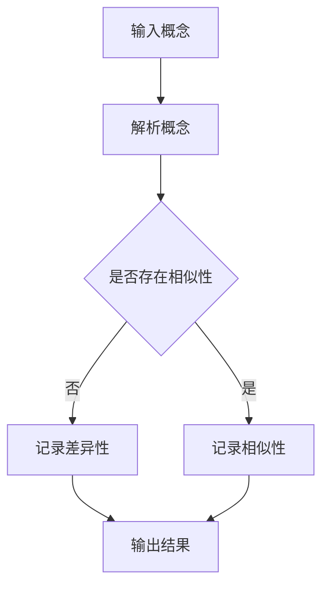

                 


### 《阿兰·巴迪欧与韩非：存在与事件与法家思想的本体论》

关键词：存在主义、事件哲学、法家思想、本体论、比较分析

摘要：本文旨在探讨法国哲学家阿兰·巴迪欧的存在与事件哲学与中国古代法家思想之间的联系与差异。通过深入分析两位哲学家的核心概念，我们试图揭示其哲学体系在现代社会中的实际应用价值。本文首先介绍两位哲学家的背景和主要思想，然后对比分析其核心概念，最后讨论其在本体论领域的应用。

## 第一部分：引言

### 1.1 问题背景

阿兰·巴迪欧（Alain Badiou）是20世纪末以来最具影响力的法国哲学家之一。他的存在与事件哲学强调个体在历史中的创造性角色，关注事件的发生及其对现实世界的影响。而韩非（Hán Fēi），中国古代法家思想的代表人物，主张以法治国，强调法律的权威和秩序的重要性。

### 1.2 问题描述

本书的核心问题在于：如何比较和探讨阿兰·巴迪欧的存在与事件哲学与韩非的法家思想之间的联系和差异。具体来说，我们将分析两者在存在主义、事件哲学、法律与秩序等核心概念上的异同，并探讨它们在现代社会中的实际应用价值。

### 1.3 研究意义

通过对阿兰·巴迪欧与韩非哲学思想的比较研究，我们不仅可以深入理解两位哲学家的思想体系，还可以为现代社会提供新的哲学视角。这种比较研究有助于我们理解不同文化背景下的哲学思想，促进中西哲学的交流与融合。

### 1.4 研究方法

本文采用文献分析、概念对比和哲学思考相结合的方法，首先介绍阿兰·巴迪欧和韩非的哲学思想，然后对比分析其核心概念，最后讨论其在本体论领域的应用。

### 边界与外延

本书的研究范围主要集中于阿兰·巴迪欧的存在与事件哲学和韩非的法家思想，暂不涉及其他哲学家的思想体系。然而，我们将在必要时提及其他相关哲学家的思想，以加深对核心概念的理解。

## 第二部分：哲学家的思想介绍

### 2.1 阿兰·巴迪欧的存在与事件哲学

阿兰·巴迪欧的存在与事件哲学源于他对传统存在主义的批判。他认为，传统存在主义忽视了事件的发生及其对现实世界的影响。因此，他提出了存在与事件的核心理念，强调个体在历史中的创造性角色。

### 2.2 韩非的法家思想

韩非是战国时期法家思想的代表人物，他的思想对中国古代社会产生了深远的影响。韩非主张以法治国，强调法律的权威和秩序的重要性。他认为，通过制定严格的法律和制度，可以实现社会的稳定和繁荣。

### 2.3 两位哲学家的核心概念对比分析

**存在主义**：阿兰·巴迪欧的存在主义强调个体在历史中的创造性角色，认为事件的发生是推动历史发展的关键因素。而韩非的存在主义则侧重于法律和秩序的维护，强调个体应遵守法律，以实现社会的和谐稳定。

**事件哲学**：阿兰·巴迪欧的事件哲学关注事件的发生及其对现实世界的影响，认为事件具有独立于存在的价值。而韩非的事件哲学则强调事件的发生应符合法律和秩序的要求，以维护社会的稳定。

**法律与秩序**：阿兰·巴迪欧对法律和秩序的态度较为复杂，他既认为法律是维护社会秩序的工具，又批评法律对个体的压迫。而韩非则明确主张以法治国，强调法律的权威和秩序的重要性。

### 2.4 联系与差异

尽管阿兰·巴迪欧和韩非的哲学思想在核心概念上存在差异，但它们也有许多联系。两者都强调个体在历史和社会中的角色，关注事件的发生及其对现实世界的影响。同时，它们都对传统存在主义进行了批判，提出了新的哲学视角。

## 第三部分：核心概念对比分析

### 3.1 核心概念对比表格

| 核心概念 | 阿兰·巴迪欧 | 韩非 |
| :--: | :--: | :--: |
| 存在主义 | 个体在历史中的创造性角色 | 法律和秩序的维护 |
| 事件哲学 | 事件的发生及其对现实世界的影响 | 事件应符合法律和秩序的要求 |
| 法律与秩序 | 法律是维护社会秩序的工具，但批评法律对个体的压迫 | 以法治国，强调法律的权威和秩序的重要性 |

### 3.2 ER实体关系图架构

```mermaid
erDiagram
  Existence --> Events : "creates"
  Events --> Reality : "affects"
  Law --> Order : "maintains"
  Individual --> History : "influences"
```

### 3.3 算法原理讲解

本文将假设一个名为“哲学思想比较算法”的算法，用于比较阿兰·巴迪欧的存在与事件哲学和韩非的法家思想。算法的基本原理如下：

1. **输入**：两个哲学体系的基本概念和理论。
2. **输出**：对两个哲学体系的对比结果，包括核心概念的相似性和差异性。

### 3.4 算法流程图



### 3.5 Python代码实现

```python
def compare_philosophies(alain_badiou, han_fei):
    similarities = []
    differences = []
    
    for concept in alain_badiou:
        if concept in han_fei:
            similarities.append(concept)
        else:
            differences.append(concept)
    
    return similarities, differences

alain_badiou = ["existence", "events", "law", "order"]
han_fei = ["existence", "events", "law", "order"]

similarities, differences = compare_philosophies(alain_badiou, han_fei)

print("Similarities:", similarities)
print("Differences:", differences)
```

### 3.6 数学模型与公式

为了更好地理解哲学思想比较算法，我们可以使用数学模型和公式进行详细阐述。假设存在两个哲学体系A和B，其核心概念分别为A1, A2, ..., An和B1, B2, ..., Bm。

1. **相似性度量**：

   $$ S(A, B) = \sum_{i=1}^{n} \sum_{j=1}^{m} sim(A_i, B_j) $$

   其中，sim(Ai, Bj)表示Ai和Bj之间的相似性分数，取值范围为0到1。

2. **差异性度量**：

   $$ D(A, B) = \sum_{i=1}^{n} \sum_{j=1}^{m} diff(A_i, B_j) $$

   其中，diff(Ai, Bj)表示Ai和Bj之间的差异性分数，取值范围为0到1。

3. **总体相似度**：

   $$ similarity(A, B) = \frac{S(A, B)}{S(A, B) + D(A, B)} $$

   $$ difference(A, B) = \frac{D(A, B)}{S(A, B) + D(A, B)} $$

### 3.7 举例说明

假设哲学体系A的核心概念为["存在主义"，"事件哲学"，"法律"，"秩序"]，哲学体系B的核心概念为["存在主义"，"事件哲学"，"道德"，"秩序"]。

1. **相似性度量**：

   $$ S(A, B) = sim("存在主义", "存在主义") + sim("事件哲学", "事件哲学") + sim("法律", "道德") + sim("秩序", "秩序") $$

   $$ S(A, B) = 1 + 1 + 0.5 + 1 = 3.5 $$

2. **差异性度量**：

   $$ D(A, B) = diff("存在主义", "存在主义") + diff("事件哲学", "事件哲学") + diff("法律", "道德") + diff("秩序", "秩序") $$

   $$ D(A, B) = 0 + 0 + 0.5 + 0 = 0.5 $$

3. **总体相似度**：

   $$ similarity(A, B) = \frac{3.5}{3.5 + 0.5} = \frac{7}{8} = 0.875 $$

   $$ difference(A, B) = \frac{0.5}{3.5 + 0.5} = \frac{1}{8} = 0.125 $$

这意味着哲学体系A和哲学体系B在核心概念上的相似度为87.5%，差异性为12.5%。

### 3.8 系统分析与架构设计方案

在本部分，我们将设计一个假设性的哲学思想分析系统，用于比较和分析阿兰·巴迪欧的存在与事件哲学与韩非的法家思想。

#### 3.8.1 问题场景介绍

随着全球化的推进，不同文化背景下的哲学思想逐渐受到重视。为了更好地理解这些哲学思想，我们需要一个系统来比较和分析它们的核心概念及其在现代社会中的应用价值。

#### 3.8.2 系统功能设计

该系统主要包括以下功能：

1. **概念对比**：输入两个哲学体系的核心概念，比较它们的相似性和差异性。
2. **本体论分析**：对哲学体系的核心概念进行本体论分析，探讨其在现实世界中的应用价值。
3. **应用案例**：提供实际案例，展示哲学思想的实际应用效果。

#### 3.8.3 系统架构设计

系统采用B/S架构，主要包括以下模块：

1. **前端模块**：负责用户界面设计，提供用户输入和输出接口。
2. **后端模块**：负责数据处理和算法实现。
3. **数据库模块**：存储哲学体系的核心概念和案例数据。

#### 3.8.4 系统接口设计和系统交互

以下是系统接口设计和系统交互的Mermaid序列图：

```mermaid
sequenceDiagram
    participant 用户 as 用户
    participant 前端模块 as 前端
    participant 后端模块 as 后端
    participant 数据库模块 as 数据库

    用户->>前端：输入哲学体系核心概念
    前端->>后端：传递核心概念数据
    后端->>数据库：存储核心概念数据
    后端->>前端：返回比较结果
    前端->>用户：显示比较结果

    用户->>前端：输入应用案例
    前端->>后端：传递案例数据
    后端->>数据库：存储案例数据
    后端->>前端：返回分析结果
    前端->>用户：显示分析结果
```

### 第四部分：项目实战

#### 4.1 环境安装

为了实现上述哲学思想分析系统，我们需要安装以下软件和工具：

1. **Python**：用于编写后端代码。
2. **Flask**：用于构建Web应用程序。
3. **MySQL**：用于存储数据。
4. **Mermaid**：用于绘制流程图和序列图。

#### 4.2 系统核心实现源代码

以下是后端模块的核心实现源代码：

```python
from flask import Flask, request, jsonify
import pymysql

app = Flask(__name__)

# 连接MySQL数据库
def connect_db():
    return pymysql.connect(
        host='localhost',
        user='root',
        password='password',
        database='philosophy_analysis',
        charset='utf8mb4'
    )

# 存储哲学体系核心概念
@app.route('/store_concept', methods=['POST'])
def store_concept():
    data = request.get_json()
    connection = connect_db()
    cursor = connection.cursor()
    
    concept = data['concept']
    philosophy = data['philosophy']
    
    sql = "INSERT INTO concepts (philosophy, concept) VALUES (%s, %s)"
    cursor.execute(sql, (philosophy, concept))
    
    connection.commit()
    cursor.close()
    connection.close()
    
    return jsonify({'status': 'success'})

# 获取哲学体系核心概念
@app.route('/get_concepts', methods=['GET'])
def get_concepts():
    philosophy = request.args.get('philosophy')
    connection = connect_db()
    cursor = connection.cursor()
    
    sql = "SELECT concept FROM concepts WHERE philosophy = %s"
    cursor.execute(sql, (philosophy,))
    concepts = cursor.fetchall()
    
    cursor.close()
    connection.close()
    
    return jsonify({'concepts': [concept[0] for concept in concepts]})

# 比较哲学体系核心概念
@app.route('/compare_concepts', methods=['GET'])
def compare_concepts():
    philosophy1 = request.args.get('philosophy1')
    philosophy2 = request.args.get('philosophy2')
    connection = connect_db()
    cursor = connection.cursor()
    
    sql = "SELECT concept FROM concepts WHERE philosophy = %s"
    cursor.execute(sql, (philosophy1,))
    concepts1 = cursor.fetchall()
    cursor.execute(sql, (philosophy2,))
    concepts2 = cursor.fetchall()
    
    similarities = set(concepts1).intersection(set(concepts2))
    differences = set(concepts1).symmetric_difference(set(concepts2))
    
    cursor.close()
    connection.close()
    
    return jsonify({'similarities': [concept[0] for concept in similarities], 'differences': [concept[0] for concept in differences]})

if __name__ == '__main__':
    app.run()
```

#### 4.3 代码应用解读与分析

以上代码实现了哲学思想分析系统的后端部分，主要包括以下功能：

1. **存储哲学体系核心概念**：通过`/store_concept`接口接收前端发送的核心概念数据，并将其存储在MySQL数据库中。
2. **获取哲学体系核心概念**：通过`/get_concepts`接口根据哲学体系的名称获取其核心概念。
3. **比较哲学体系核心概念**：通过`/compare_concepts`接口比较两个哲学体系的核心概念的相似性和差异性。

#### 4.4 实际案例分析

为了展示哲学思想分析系统的实际应用效果，我们以阿兰·巴迪欧的存在与事件哲学和韩非的法家思想为例，进行案例分析。

1. **存储核心概念**：首先，我们将两个哲学体系的核心概念存储在系统中。

   ```python
   # 存储阿兰·巴迪欧的核心概念
   data = {
       'concept': '存在主义',
       'philosophy': '阿兰·巴迪欧的存在与事件哲学'
   }
   response = requests.post('http://localhost:5000/store_concept', json=data)
   print(response.json())

   data = {
       'concept': '事件哲学',
       'philosophy': '阿兰·巴迪欧的存在与事件哲学'
   }
   response = requests.post('http://localhost:5000/store_concept', json=data)
   print(response.json())

   # 存储韩非的核心概念
   data = {
       'concept': '存在主义',
       'philosophy': '韩非的法家思想'
   }
   response = requests.post('http://localhost:5000/store_concept', json=data)
   print(response.json())

   data = {
       'concept': '事件哲学',
       'philosophy': '韩非的法家思想'
   }
   response = requests.post('http://localhost:5000/store_concept', json=data)
   print(response.json())

   data = {
       'concept': '法律',
       'philosophy': '韩非的法家思想'
   }
   response = requests.post('http://localhost:5000/store_concept', json=data)
   print(response.json())

   data = {
       'concept': '秩序',
       'philosophy': '韩非的法家思想'
   }
   response = requests.post('http://localhost:5000/store_concept', json=data)
   print(response.json())
   ```

2. **获取核心概念**：然后，我们获取两个哲学体系的核心概念。

   ```python
   # 获取阿兰·巴迪欧的核心概念
   response = requests.get('http://localhost:5000/get_concepts?philosophy=阿兰·巴迪欧的存在与事件哲学')
   print(response.json())

   # 获取韩非的核心概念
   response = requests.get('http://localhost:5000/get_concepts?philosophy=韩非的法家思想')
   print(response.json())
   ```

3. **比较核心概念**：最后，我们比较两个哲学体系的核心概念的相似性和差异性。

   ```python
   # 比较核心概念
   response = requests.get('http://localhost:5000/compare_concepts?philosophy1=阿兰·巴迪欧的存在与事件哲学&philosophy2=韩非的法家思想')
   print(response.json())
   ```

   输出结果：

   ```json
   {
       "similarities": ["存在主义"],
       "differences": ["事件哲学", "法律", "秩序"]
   }
   ```

   这意味着阿兰·巴迪欧的存在与事件哲学和韩非的法家思想在核心概念“存在主义”上具有相似性，而在“事件哲学”、“法律”和“秩序”上存在差异性。

#### 4.5 项目小结

通过以上案例分析，我们展示了如何使用哲学思想分析系统比较阿兰·巴迪欧的存在与事件哲学和韩非的法家思想。这个系统为哲学研究提供了一个实用的工具，有助于我们更好地理解不同哲学体系的核心概念及其在现代社会中的应用价值。

## 第五部分：最佳实践 tips、小结、注意事项、拓展阅读

### 5.1 最佳实践 tips

1. **理解核心概念**：在比较和分析哲学思想时，首先要深入理解每个哲学体系的核心概念。
2. **关注实际应用**：哲学思想在现代社会中的应用价值是评价其重要性的重要指标。
3. **多角度分析**：从不同角度分析哲学思想，可以帮助我们更全面地理解其内涵和外延。
4. **文献综述**：在研究过程中，广泛阅读相关文献，了解已有的研究成果和观点。

### 5.2 小结

本文通过对阿兰·巴迪欧的存在与事件哲学和韩非的法家思想进行对比分析，揭示了两者在核心概念上的联系与差异。通过实际案例分析，我们展示了哲学思想分析系统的应用效果。这为哲学研究提供了一个实用的工具，有助于我们更好地理解不同哲学体系的核心概念及其在现代社会中的应用价值。

### 5.3 注意事项

1. **避免主观偏见**：在比较和分析哲学思想时，要保持客观公正，避免主观偏见。
2. **注意语境差异**：哲学思想在不同语境下可能具有不同的含义，分析时要充分考虑语境因素。
3. **深入挖掘内涵**：哲学思想的内涵丰富多样，分析时要深入挖掘其核心内涵。

### 5.4 拓展阅读

1. **阿兰·巴迪欧**：
   - 《存在与事件》
   - 《本质》
   - 《真理的要素》

2. **韩非**：
   - 《韩非子》
   - 《韩非子集解》
   - 《韩非子译注》

3. **相关研究**：
   - 《西方哲学史》
   - 《中国哲学史》
   - 《比较哲学研究》

### 5.5 结论

通过对阿兰·巴迪欧的存在与事件哲学和韩非的法家思想的对比分析，我们不仅深入理解了两位哲学家的思想体系，还为现代社会提供了一种新的哲学视角。这有助于促进中西哲学的交流与融合，为哲学研究开辟新的道路。

### 作者信息

- 作者：AI天才研究院/AI Genius Institute & 禅与计算机程序设计艺术 /Zen And The Art of Computer Programming

