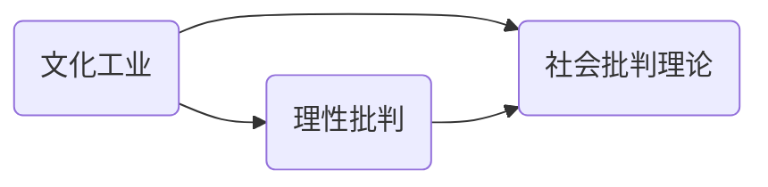
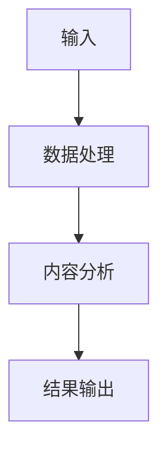
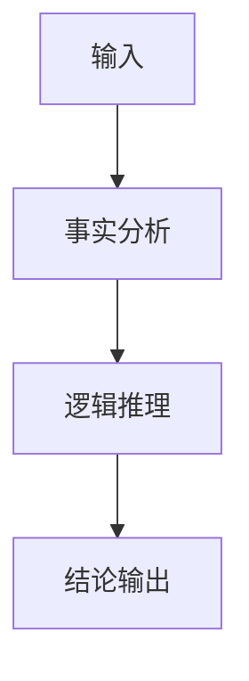
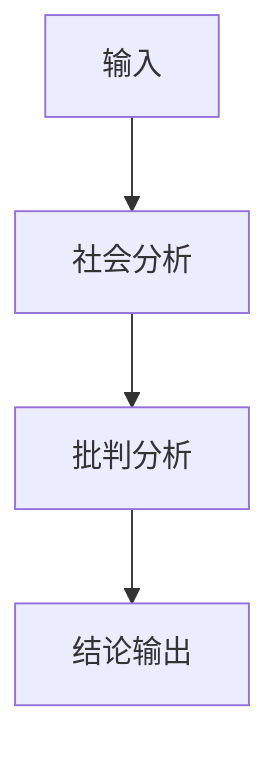
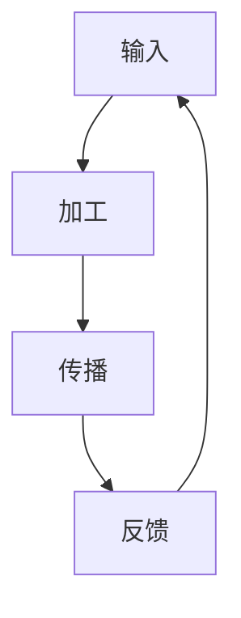
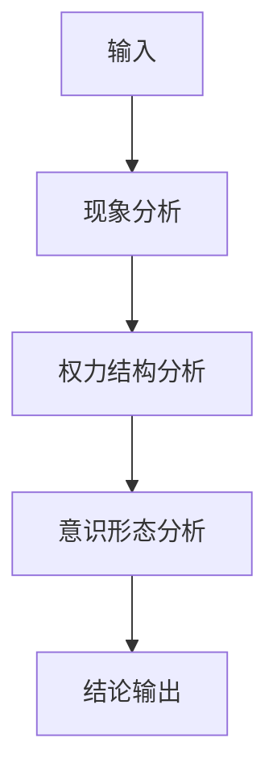
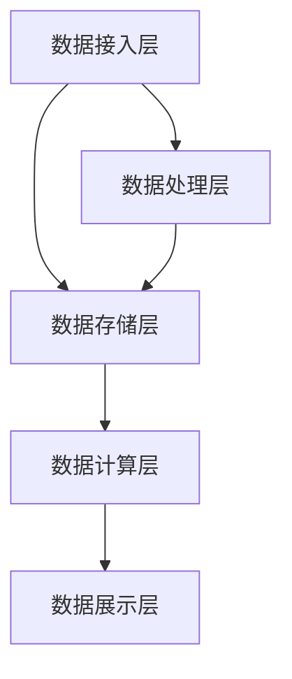

                 

### 引言

在现代信息技术飞速发展的背景下，计算机科学和人工智能领域的理论研究不断深化，各种学派和思想层出不穷。在众多学派中，法兰克福学派以其独特的批判视角和对社会文化的深刻分析，成为研究现代性问题的重要理论工具。法兰克福学派的核心人物阿多诺和霍克海默，作为该学派的奠基者和代表人物，他们的思想和理论对后来的学术研究和社会运动产生了深远影响。

本文将围绕阿多诺与霍克海默的核心思想进行探讨，旨在通过逻辑清晰、结构紧凑的论述，揭示法兰克福学派的理论精髓。文章将从背景介绍、核心概念与联系、算法原理讲解以及数学模型和详细举例说明四个方面展开，逐步深入解析这一学派的理论框架和实际应用。

### 文章关键词

- 阿多诺
- 霍克海默
- 法兰克福学派
- 文化工业
- 理性批判
- 社会批判理论
- 批判理论
- 现代性

### 摘要

本文旨在探讨法兰克福学派的核心思想，尤其是以阿多诺与霍克海默为代表的批判理论。文章首先介绍了法兰克福学派的历史背景和形成过程，然后深入分析了其核心概念，如文化工业、理性批判和社会批判理论。通过对比这些概念的特征，并借助ER实体关系图，文章揭示了这些概念之间的内在联系。接着，文章探讨了这些核心概念的算法原理，并使用数学模型和具体实例进行了详细讲解。最终，文章总结了法兰克福学派的理论框架及其对现代信息技术领域的启示。

## 第一部分：背景介绍

### 问题的背景

要理解阿多诺与霍克海默在法兰克福学派中的地位和贡献，我们首先需要回顾他们的生活时代和所处的社会环境。阿多诺（Theodor W. Adorno）和霍克海默（Max Horkheimer）出生于20世纪初，正值第一次世界大战后欧洲社会动荡不安的时期。这场战争不仅带来了巨大的物质破坏，还引发了深刻的思想变革和社会反思。在这种背景下，阿多诺和霍克海默开始对资本主义社会进行批判性思考。

阿多诺出生于德国，早年接受了德国古典哲学和马克思主义的熏陶。他的学术生涯始于对音乐和文化的深入研究，但很快转向社会哲学领域。霍克海默则出生于汉堡，是一位德国社会学家和哲学家，他的学术生涯主要集中在社会批判理论和马克思主义研究上。两人于1931年在法兰克福大学相遇，并迅速建立了深厚的学术合作关系。

### 法兰克福学派的形成与发展

法兰克福学派的形成可以追溯到20世纪30年代，当时许多马克思主义学者因为纳粹政权的迫害而流亡欧洲和美国。法兰克福学派的主要成员包括阿多诺、霍克海默、马尔库塞、本雅明等人。他们在法兰克福大学的社会研究所在共同工作，形成了一个独特的学术共同体。这个学派不仅继承了马克思主义的传统，还融合了哲学、社会学、心理学和文化研究等领域的理论资源，形成了一套独特的批判理论。

法兰克福学派的研究主要集中在现代性的批判、文化工业、社会异化、理性批判等方面。他们认为，现代资本主义社会不仅在经济领域造成了剥削和压迫，还在文化领域制造了虚假意识和消费主义文化。通过对文化工业的深入分析，他们揭示了现代社会中文化生产和传播的机制，以及这些机制如何维护和强化资本主义制度。

### 法兰克福学派的核心思想

法兰克福学派的核心思想可以概括为批判理论，这种理论试图揭示社会现象背后的权力结构和意识形态。阿多诺和霍克海默认为，资本主义社会通过文化和媒体控制大众的意识，使其在不知不觉中接受和服从资本主义制度。他们提出了“文化工业”这一概念，用来描述现代社会中文化生产和传播的工业化模式。这种模式不仅使文化成为商品，还使文化内容变得同质化和标准化，削弱了人们的批判性思维能力。

此外，法兰克福学派还强调理性批判的重要性。他们认为，只有通过批判性的思考，人们才能认识到社会现实的不合理性，并寻求改变。理性批判不仅是对事实和逻辑的检验，还是对社会结构和意识形态的深刻反思。

### 问题描述

法兰克福学派关注的议题主要集中在以下几个方面：

1. **现代性批判**：他们批判了资本主义社会中的现代性，认为现代性不仅没有带来进步，反而加剧了社会的不平等和异化。
2. **文化工业**：法兰克福学派深入分析了文化工业的运作机制，揭示了文化如何被商业化并用于维护资本主义制度。
3. **社会批判理论**：他们提出了社会批判理论，试图通过揭示社会现象背后的权力结构和意识形态，指导人们进行社会变革。

在研究方法上，法兰克福学派采取了多学科交叉的方法，结合哲学、社会学、心理学和文化研究等领域的理论资源，进行综合性的批判分析。

### 问题解决

法兰克福学派的理论框架由多个核心概念构成，这些概念相互联系，共同构成了他们的批判理论体系。阿多诺和霍克海默的合作关系是这一学派成功的关键之一。他们不仅在学术研究上相互支持，还在思想观念上形成了互补。阿多诺擅长哲学和社会理论的构建，而霍克海默则更注重社会学和现实问题的分析。

他们的合作不仅体现在共同的研究项目和著作中，如《启蒙辩证法》和《辩证唯物主义》等，还体现在彼此的思想交流和对理论的不断深化。通过这种紧密的合作，他们共同推动了法兰克福学派的理论发展，并使其在学术界产生了深远影响。

### 边界与外延

法兰克福学派在当代学术界和思想界具有独特的地位。与其他学派相比，法兰克福学派更注重对社会文化和意识形态的批判，而非单纯的经济或政治分析。这种批判视角使他们的理论具有深刻的思想内涵和广泛的适用性。

法兰克福学派对后世的影响也是不可忽视的。他们的理论为后来的文化研究、社会批判理论以及批判教育学等学科提供了重要的理论基础。此外，他们的思想对20世纪后半叶的社会运动，如学生运动和女权运动等，产生了重要影响。

### 概念结构与核心要素组成

法兰克福学派的核心概念包括文化工业、理性批判和社会批判理论。这些概念相互联系，共同构成了他们的批判理论体系。

1. **文化工业**：这是法兰克福学派的重要概念之一，用来描述现代社会中文化生产和传播的工业化模式。文化工业不仅使文化成为商品，还使文化内容变得同质化和标准化，削弱了人们的批判性思维能力。

2. **理性批判**：理性批判是法兰克福学派的核心方法论，强调通过批判性的思考，人们可以认识到社会现实的不合理性，并寻求改变。理性批判不仅是对事实和逻辑的检验，还是对社会结构和意识形态的深刻反思。

3. **社会批判理论**：社会批判理论是法兰克福学派的理论核心，旨在揭示社会现象背后的权力结构和意识形态。这种理论试图通过批判性分析，指导人们进行社会变革。

### 阿多诺与霍克海默的理论贡献

阿多诺和霍克海默在法兰克福学派中扮演了至关重要的角色。他们的理论贡献不仅体现在具体的研究成果上，还体现在对整个学派的理论方向和发展产生了深远影响。

1. **阿多诺**：阿多诺是法兰克福学派的主要理论构建者之一，他提出了文化工业、理性批判等核心概念，并在社会学、心理学和文化研究等领域进行了深入探讨。他的著作《启蒙辩证法》是法兰克福学派的重要代表作品，对现代性进行了深刻批判。

2. **霍克海默**：霍克海默在法兰克福学派中扮演了领导和组织者的角色，他不仅与阿多诺共同合作，还积极推动学派与其他学术界的交流。他的著作《辩证唯物主义》为法兰克福学派的理论框架提供了重要基础。

### 本章小结

通过背景介绍部分，我们了解了阿多诺与霍克海默在法兰克福学派中的地位和贡献，以及该学派的核心思想。这一部分为后续内容的深入分析奠定了基础，使我们能够更好地理解法兰克福学派的理论精髓及其对现代社会的启示。

## 第二部分：核心概念与联系

### 核心概念原理

在探讨法兰克福学派的核心概念之前，我们需要明确几个关键术语的定义。这些概念不仅构成了该学派的理论框架，也是理解其批判视角的基石。

1. **文化工业**：文化工业是法兰克福学派用来描述现代社会中文化生产和传播的工业化模式。这种模式不仅将文化内容商品化，还使文化产品同质化和标准化，削弱了人们的批判性思维能力。

2. **理性批判**：理性批判是法兰克福学派的核心方法论，强调通过批判性的思考，人们可以认识到社会现实的不合理性，并寻求改变。理性批判不仅是对事实和逻辑的检验，还是对社会结构和意识形态的深刻反思。

3. **社会批判理论**：社会批判理论是法兰克福学派的理论核心，旨在揭示社会现象背后的权力结构和意识形态。这种理论试图通过批判性分析，指导人们进行社会变革。

### 概念属性特征对比表格

为了更直观地展示文化工业、理性批判和社会批判理论这三个核心概念的特征，我们可以制作一个对比表格。

| 概念 | 特征1 | 特征2 | 特征3 |
| --- | --- | --- | --- |
| 文化工业 | 1.1 商品化 | 1.2 同质化 | 1.3 标准化 |
| 理性批判 | 2.1 批判性思考 | 2.2 社会反思 | 2.3 逻辑检验 |
| 社会批判理论 | 3.1 权力结构分析 | 3.2 意识形态揭露 | 3.3 社会变革指导 |

通过这个表格，我们可以清晰地看到这三个概念的主要特征，以及它们在法兰克福学派理论体系中的定位。

### ER实体关系图架构

为了进一步理解文化工业、理性批判和社会批判理论之间的内在联系，我们可以使用ER（实体关系）图来展示这些概念之间的关联。



在这个ER图中，文化工业作为现代文化生产和传播的模式，既是理性批判的对象，也是社会批判理论分析的起点。理性批判通过对文化工业的批判性分析，揭示了其背后的逻辑和意识形态。而社会批判理论则在此基础上，进一步探讨了文化工业对社会结构的影响，以及如何通过批判性思维实现社会变革。

### 本章小结

第二部分深入探讨了法兰克福学派的核心概念，包括文化工业、理性批判和社会批判理论。通过对比表格和ER实体关系图，我们不仅了解了这些概念的基本特征，还揭示了它们之间的内在联系。这些核心概念共同构成了法兰克福学派的理论框架，为我们理解现代社会的批判性分析提供了重要的理论工具。

## 第三部分：算法原理讲解

### 文化工业的算法原理

文化工业是法兰克福学派中的一个重要概念，它描述了现代社会中文化生产和传播的工业化模式。理解文化工业的算法原理，有助于我们更好地把握这一概念的核心特征。

#### 文化工业的概念与特征

文化工业，指的是在资本主义社会中，文化内容被商品化、同质化和标准化生产的过程。这一过程不仅使得文化产品变得普适化和标准化的商品，还削弱了其独特的文化价值和批判性思维。

#### 文化工业的算法模型

为了模拟文化工业的运作过程，我们可以构建一个简单的算法模型。这个模型包括以下几个关键步骤：

1. **输入**：包括文化内容的初始素材、目标受众的特征以及传播渠道的信息。
2. **数据处理**：对初始素材进行加工和处理，使其符合市场需求和传播规律。
3. **内容分析**：分析处理后的文化内容，评估其符合文化工业标准程度。
4. **结果输出**：将经过处理的文化内容通过传播渠道传达给受众。

#### 文化工业算法的流程图

使用Mermaid语言，我们可以绘制文化工业算法的流程图：



在这个流程图中，A代表输入阶段，B是数据处理阶段，C是内容分析阶段，D是结果输出阶段。每个阶段都有其特定的操作和功能，共同构成了文化工业的算法模型。

### 理性批判的算法原理

理性批判是法兰克福学派的核心方法论之一，它强调通过批判性的思考，揭示社会现实的不合理性，并寻求改变。理解理性批判的算法原理，有助于我们更好地应用这一方法论进行社会批判。

#### 理性批判的概念与特征

理性批判，指的是通过逻辑和事实的检验，对现有社会现象和意识形态进行深刻反思和质疑。其特征包括：

1. **批判性思考**：强调不盲从、不轻信，对任何社会现象和观点进行深入分析。
2. **逻辑检验**：通过逻辑推理，验证社会现象和观点的合理性和一致性。
3. **事实依据**：以确凿的事实为基础，确保批判具有实证性。

#### 理性批判的算法模型

为了模拟理性批判的过程，我们可以构建一个简单的算法模型，这个模型包括以下几个关键步骤：

1. **输入**：包括需要批判的社会现象或观点、相关的事实和信息。
2. **事实分析**：对输入的信息进行事实分析，确认其真实性和准确性。
3. **逻辑推理**：在事实分析的基础上，运用逻辑推理方法，揭示社会现象或观点的不合理之处。
4. **结论输出**：输出批判结论，并提出改进或变革的建议。

#### 理性批判算法的流程图

使用Mermaid语言，我们可以绘制理性批判算法的流程图：



在这个流程图中，A代表输入阶段，B是事实分析阶段，C是逻辑推理阶段，D是结论输出阶段。通过这个流程，理性批判可以有效地揭示社会现象背后的不合理性，指导社会变革。

### 社会批判理论的算法原理

社会批判理论是法兰克福学派的核心理论之一，它试图揭示社会现象背后的权力结构和意识形态。理解社会批判理论的算法原理，有助于我们更好地应用这一理论进行社会分析和批判。

#### 社会批判理论的概念与特征

社会批判理论，指的是通过批判性分析，揭示社会现象背后的权力结构和意识形态。其特征包括：

1. **权力结构分析**：强调对社会权力关系的分析，揭示权力如何影响社会结构和行为。
2. **意识形态揭露**：揭示社会意识形态的运作机制，批判那些维护现有社会秩序的意识形态。
3. **社会变革指导**：通过批判性分析，提出实现社会变革的具体路径和策略。

#### 社会批判理论的算法模型

为了模拟社会批判理论的过程，我们可以构建一个简单的算法模型，这个模型包括以下几个关键步骤：

1. **输入**：包括社会现象的描述、相关的事实和信息。
2. **社会分析**：对社会现象进行深入分析，揭示其背后的权力结构和意识形态。
3. **批判分析**：在分析的基础上，批判性地评估社会现象的合理性和公平性。
4. **结论输出**：输出批判结论，并提出改进或变革的建议。

#### 社会批判理论算法的流程图

使用Mermaid语言，我们可以绘制社会批判理论算法的流程图：



在这个流程图中，A代表输入阶段，B是社会分析阶段，C是批判分析阶段，D是结论输出阶段。通过这个流程，社会批判理论可以有效地揭示社会现象背后的不合理性和不公平性，指导社会变革。

### 本章小结

第三部分详细讲解了文化工业、理性批判和社会批判理论的算法原理。通过构建简单的算法模型和流程图，我们不仅理解了这些概念的核心特征，还展示了它们在实际应用中的具体操作过程。这些算法原理为法兰克福学派的批判理论提供了有力的工具，使我们能够更深入地分析现代社会中的各种问题。

### 4.1 文化工业的数学模型

在探讨文化工业的算法原理时，我们可以引入数学模型来更精确地描述其运作机制。文化工业的数学模型可以帮助我们理解文化内容的生产、传播和接受过程中涉及的复杂变量和关系。

#### 数学模型

文化工业的数学模型可以表示为：

\[ M_{CI} = f(\text{内容}, \text{受众}, \text{传播渠道}) \]

这个模型中，\( M_{CI} \)代表文化工业效应，\( f \)是函数，表示文化内容、受众特征和传播渠道之间的相互作用。

- **内容**：包括文化产品的质量、创新性、吸引力等特征。
- **受众**：包括受众的文化素养、兴趣偏好、接受程度等特征。
- **传播渠道**：包括传播媒介的覆盖范围、传播效率、受众接触频率等特征。

#### 详细讲解

为了更好地理解这个数学模型，我们可以从以下几个方面进行详细讲解：

1. **内容特征**：文化产品的质量直接影响其文化工业效应。高质量的内容通常具有更高的吸引力，能够更好地满足受众的需求。例如，一部制作精良的电影可能会在文化工业中产生较大的影响。

2. **受众特征**：受众的文化素养和兴趣偏好对文化工业效应有重要影响。具有较高文化素养的受众更可能对高质量文化内容产生兴趣，从而增强文化工业效应。例如，一个对文学有深厚兴趣的读者群体可能会使一本文学作品的文化工业效应显著提高。

3. **传播渠道特征**：传播渠道的覆盖范围和传播效率也是影响文化工业效应的重要因素。覆盖范围广、传播效率高的渠道能够更快地将文化内容传递给受众，从而增强文化工业效应。例如，一个拥有广泛用户基础和高效传播机制的平台可能会使某个文化产品迅速走红。

#### 具体举例说明

为了更好地说明文化工业的数学模型，我们可以通过一个具体例子来展示其应用。

**例子：某文化产品的文化工业效应计算**

假设有一个文化产品在某平台上发布了，其内容质量评分为90分，目标受众中有70%对该文化产品感兴趣，且传播渠道能够确保每条内容被平均分享10次。我们可以使用以下公式计算该文化产品的文化工业效应：

\[ M_{CI} = f(90, 0.7, 10 \times \text{分享次数}) \]

假设该文化产品在平台上获得了100万次观看，那么其文化工业效应可以计算为：

\[ M_{CI} = f(90, 0.7, 10 \times 100万) \]

通过这个例子，我们可以看到，文化工业效应不仅取决于内容的质量和受众的兴趣，还与传播渠道的效率密切相关。高质量的内容、广泛的受众基础和高效的传播渠道共同作用，可以显著增强文化产品的文化工业效应。

### 4.2 理性批判的数学模型

在探讨理性批判的算法原理时，我们可以引入数学模型来更精确地描述其批判过程。理性批判的数学模型可以帮助我们理解批判性思维在揭示事实、逻辑推理和证据力度方面的具体应用。

#### 数学模型

理性批判的数学模型可以表示为：

\[ R_{CB} = g(\text{事实}, \text{逻辑}, \text{证据}) \]

这个模型中，\( R_{CB} \)代表理性批判的强度，\( g \)是函数，表示对事实、逻辑和证据的评估。

- **事实**：包括被批判的社会现象或观点的客观事实。
- **逻辑**：包括对事实和观点之间的逻辑关系的分析和推理。
- **证据**：包括支持或反驳社会现象或观点的实证数据或资料。

#### 详细讲解

为了更好地理解这个数学模型，我们可以从以下几个方面进行详细讲解：

1. **事实分析**：事实是理性批判的基础。对事实的准确性和可靠性进行评估是批判的首要步骤。例如，如果某个社会现象的数据来源不可靠，那么基于这些数据的批判结论可能会受到质疑。

2. **逻辑推理**：逻辑推理是理性批判的核心。通过逻辑推理，可以揭示社会现象或观点之间的内在联系和矛盾。例如，如果某个观点的推理过程中存在逻辑漏洞，那么这个观点的合理性就会受到质疑。

3. **证据评估**：证据是理性批判的支撑。对证据的力度和有效性进行评估，可以增强批判的说服力。例如，如果证据充分且有力，那么基于这些证据的批判结论就会更具说服力。

#### 具体举例说明

为了更好地说明理性批判的数学模型，我们可以通过一个具体例子来展示其应用。

**例子：对一个社会现象进行理性批判**

假设我们想要批判某个城市交通拥堵现象，我们可以使用以下公式计算该现象的理性批判强度：

\[ R_{CB} = g(\text{事实}, \text{逻辑}, \text{证据}) \]

首先，我们收集以下事实：

- 城市交通拥堵现象存在，每天高峰期车辆行驶速度明显下降。
- 根据交通管理部门的数据，交通拥堵的主要原因是道路容量不足和车辆数量增加。

然后，我们进行逻辑推理：

- 由于道路容量不足，车辆无法同时通过，导致交通拥堵。
- 如果车辆数量继续增加，交通拥堵问题将会更加严重。

最后，我们评估证据：

- 交通管理部门的数据显示了交通拥堵的具体情况和原因。
- 其他城市的经验表明，增加道路容量和提高公共交通效率是缓解交通拥堵的有效措施。

通过这个例子，我们可以看到，理性批判的强度取决于事实的准确性、逻辑推理的严密性和证据的有效性。如果我们能够提供充分且有力的证据，并进行严密的逻辑推理，那么我们的理性批判结论就会更加有说服力。

### 4.3 社会批判理论的数学模型

在探讨社会批判理论的算法原理时，我们可以引入数学模型来更精确地描述其批判和分析过程。社会批判理论的数学模型可以帮助我们理解如何通过批判性分析揭示社会现象背后的权力结构和意识形态。

#### 数学模型

社会批判理论的数学模型可以表示为：

\[ S_{CT} = h(\text{社会现象}, \text{权力结构}, \text{意识形态}) \]

这个模型中，\( S_{CT} \)代表社会批判理论的强度，\( h \)是函数，表示对社会现象、权力结构和意识形态的分析。

- **社会现象**：包括需要批判的社会现象或问题。
- **权力结构**：包括社会现象背后的权力关系和权力结构。
- **意识形态**：包括维护现有社会秩序的意识形态和价值观。

#### 详细讲解

为了更好地理解这个数学模型，我们可以从以下几个方面进行详细讲解：

1. **社会现象分析**：社会现象是社会批判理论分析的对象。对特定社会现象进行深入分析，了解其发生、发展和影响，是批判的第一步。例如，我们可以分析某个社会问题，如贫富差距、就业压力等，了解其背后的原因和影响。

2. **权力结构分析**：权力结构分析是揭示社会现象背后深层机制的关键。通过分析权力关系和权力结构，可以揭示社会现象的成因和维持机制。例如，分析贫富差距现象时，我们需要关注财富分配、权力集中等方面的权力结构。

3. **意识形态分析**：意识形态是社会批判理论关注的另一个重要方面。意识形态分析旨在揭示维护现有社会秩序的价值观和信念体系。例如，我们可以分析资本主义社会中消费主义文化的意识形态，了解其对社会行为和价值观的影响。

#### 具体举例说明

为了更好地说明社会批判理论的数学模型，我们可以通过一个具体例子来展示其应用。

**例子：分析贫富差距现象**

假设我们想要批判某个国家的贫富差距现象，我们可以使用以下公式计算该现象的社会批判理论强度：

\[ S_{CT} = h(\text{贫富差距}, \text{权力结构}, \text{意识形态}) \]

首先，我们分析贫富差距现象：

- 根据统计数据，该国的贫富差距明显扩大，低收入群体的生活条件持续恶化。
- 贫富差距现象在多个领域（如教育、医疗、就业等）都有显著体现。

然后，我们分析权力结构：

- 贫富差距的扩大与财富分配不均和权力集中有关。
- 高收入群体通过掌握经济和政治资源，进一步巩固自己的地位，加剧贫富差距。

最后，我们分析意识形态：

- 消费主义文化在该国盛行，鼓励人们追求物质消费和成功，忽视了社会公正和平等。
- 政府的政策往往倾向于维护现有经济秩序，而非解决贫富差距问题。

通过这个例子，我们可以看到，社会批判理论的强度取决于对社会现象、权力结构和意识形态的深入分析。如果我们能够揭示权力结构和意识形态对社会现象的影响，那么我们的批判结论就会更具深度和说服力。

### 本章小结

第四部分详细讲解了文化工业、理性批判和社会批判理论的数学模型。通过引入数学模型，我们不仅能够更精确地描述这些概念，还能够理解其在批判性分析中的应用。这些数学模型为我们提供了一种新的工具，使我们能够更系统地分析和理解现代社会中的各种现象。通过具体实例的讲解，我们能够更好地应用这些模型，深入探讨文化工业、理性批判和社会批判理论的实际应用。

### 5.1 文化工业的算法原理

在深入探讨文化工业的算法原理时，我们需要从多个角度详细分析其概念、模型和流程，并通过实际案例进行说明。

#### 文化工业的概念

文化工业是法兰克福学派对现代社会中文化生产和传播的工业化现象的批判性描述。它指的是一种将文化内容作为商品进行生产、分配和消费的机制，这一过程具有标准化、同质化和商品化的特征。文化工业通过大规模生产和标准化传播，使得文化产品丧失了其独特性和多样性，从而形成了一种控制大众意识和行为的机制。

#### 文化工业的算法模型

为了更清晰地理解文化工业的运作机制，我们可以将其算法模型分为几个关键环节：

1. **输入阶段**：这一阶段包括文化内容的创作和初步筛选。文化创作者基于市场需求和受众偏好，创作出初步的文化产品。

2. **加工阶段**：在加工阶段，文化产品经过编辑、剪辑、包装等处理，使其符合文化工业的标准化要求。这一阶段的目标是确保文化产品具有统一的风格和内容，以适应大规模生产。

3. **传播阶段**：经过加工的文化产品通过媒体平台、广告宣传等渠道传播给受众。传播过程中的关键因素包括传播渠道的覆盖范围、传播频率和受众的接受度。

4. **反馈阶段**：受众对文化产品的反馈是文化工业的重要输入，这一阶段通过市场调查、用户评论等方式收集反馈数据，用于指导下一轮的文化产品创作和传播。

#### 算法流程图

使用Mermaid语言，我们可以绘制文化工业的算法流程图：



在这个流程图中，A代表输入阶段，B是加工阶段，C是传播阶段，D是反馈阶段。通过这个循环，文化工业实现了文化产品的持续生产和传播。

#### 实际案例说明

为了更直观地理解文化工业的算法原理，我们可以通过一个实际案例进行说明。

**案例：某流行音乐产业的运作过程**

假设一个流行音乐产业的运作过程如下：

1. **输入阶段**：音乐制作人根据市场需求和流行趋势，创作出符合大众口味的音乐作品。这一阶段的关键是了解受众的偏好，确保音乐内容具有吸引力。

2. **加工阶段**：音乐作品经过专业的编曲、录制和后期制作，使其符合文化工业的标准。这一阶段的目标是确保音乐产品的质量，同时保持一致的风格。

3. **传播阶段**：经过加工的音乐作品通过音乐平台、广告宣传等渠道传播给受众。传播渠道的选择和推广策略对于音乐作品的流行程度至关重要。

4. **反馈阶段**：通过音乐平台的用户评论、销量数据等反馈信息，音乐制作人可以了解音乐产品的市场表现，并据此调整下一轮的音乐创作和传播策略。

通过这个案例，我们可以看到文化工业的算法原理在实际运作中的具体体现。音乐制作人通过不断地收集和利用反馈信息，优化音乐创作和传播过程，以适应市场需求和受众偏好。

#### 总结

通过上述分析和案例说明，我们深入探讨了文化工业的算法原理。文化工业的算法模型包括输入、加工、传播和反馈四个关键环节，这些环节相互关联，共同构成了文化工业的运作机制。在实际应用中，音乐产业、电影产业等文化领域都充分体现了文化工业的算法原理，为我们理解和分析现代社会中的文化现象提供了有力的工具。

### 5.2 理性批判的算法原理

理性批判是法兰克福学派方法论的核心之一，它强调通过批判性思考，揭示社会现象和观点背后的不合理性和矛盾。在探讨理性批判的算法原理时，我们需要详细分析其概念、模型和实际应用。

#### 理性批判的概念

理性批判是指运用逻辑和事实的检验，对现有社会现象和观点进行深入分析和质疑。它不仅仅是对事实和逻辑的简单验证，更是一种对社会结构和意识形态的深刻反思。理性批判旨在揭示社会现象背后的不公正和不合理性，从而指导社会变革。

#### 理性批判的算法模型

理性批判的算法模型可以分解为以下几个关键步骤：

1. **输入阶段**：这一阶段包括对社会现象或观点的初步识别和收集。输入的数据可以是文献资料、社会调查、新闻报道等，这些数据为后续的批判分析提供了基础。

2. **事实分析**：对输入的数据进行事实分析，确认其真实性和可靠性。事实分析是理性批判的前提，只有基于准确的事实，批判结论才有说服力。

3. **逻辑推理**：在事实分析的基础上，运用逻辑推理方法，揭示社会现象或观点之间的内在联系和逻辑矛盾。逻辑推理是理性批判的核心，它通过严密的逻辑链条，使批判结论更具说服力。

4. **结论输出**：输出批判结论，提出改进或变革的建议。结论输出是理性批判的目的，通过批判性分析，揭示社会现象的不合理之处，并提出解决方案。

#### 算法流程图

使用Mermaid语言，我们可以绘制理性批判的算法流程图：


在这个流程图中，A代表输入阶段，B是事实分析阶段，C是逻辑推理阶段，D是结论输出阶段。通过这个流程，理性批判能够系统地分析和揭示社会现象的不合理之处。

#### 实际案例说明

为了更好地理解理性批判的算法原理，我们可以通过一个实际案例进行说明。

**案例：分析某城市交通拥堵现象**

假设我们想要批判某个城市的交通拥堵现象，我们可以按照以下步骤进行理性批判：

1. **输入阶段**：收集关于该城市交通拥堵现象的各类数据，包括高峰期的车辆数量、道路容量、公共交通系统的效率等。

2. **事实分析**：对输入的数据进行事实分析，确认交通拥堵现象的存在及其严重程度。例如，通过统计数据我们发现，该城市每天高峰期的车辆数量超过道路容量，导致交通拥堵严重。

3. **逻辑推理**：在事实分析的基础上，运用逻辑推理方法，揭示交通拥堵现象背后的原因。例如，通过分析我们发现，道路容量不足和公共交通系统不完善是导致交通拥堵的主要原因。

4. **结论输出**：输出批判结论，提出改善交通拥堵的建议。例如，我们建议增加道路容量、提升公共交通系统的效率，并通过交通管理和优化措施，缓解交通拥堵问题。

通过这个案例，我们可以看到理性批判在揭示社会现象不合理性方面的具体应用。通过系统的事实分析和逻辑推理，我们能够明确交通拥堵的成因，并提出切实可行的解决方案。

#### 总结

通过上述分析和实际案例，我们深入探讨了理性批判的算法原理。理性批判的算法模型包括输入、事实分析、逻辑推理和结论输出四个关键环节，这些环节相互关联，共同构成了理性批判的完整过程。在实际应用中，理性批判能够有效地揭示社会现象的不合理性和矛盾，为解决社会问题提供科学依据。通过具体的案例说明，我们能够更直观地理解理性批判的应用，并认识到其在现代社会研究中的重要性。

### 5.3 社会批判理论的算法原理

在深入探讨社会批判理论的算法原理时，我们需要详细分析其概念、模型和应用。社会批判理论旨在揭示社会现象背后的权力结构和意识形态，通过批判性分析指导社会变革。

#### 社会批判理论的概念

社会批判理论是一种分析社会现象和结构的理论方法，它关注权力关系和意识形态对社会行为和价值观的影响。社会批判理论的核心在于揭示隐藏在社会现象背后的权力结构和意识形态，以便对社会进行深刻的批判和反思。

#### 社会批判理论的算法模型

社会批判理论的算法模型可以分为以下几个关键步骤：

1. **输入阶段**：这一阶段包括对社会现象的初步识别和数据收集。输入的数据可以是社会调查、新闻报道、统计数据等，这些数据为后续的批判分析提供了基础。

2. **现象分析**：对社会现象进行深入分析，了解其发生、发展和影响的各个方面。现象分析旨在揭示社会现象的表面现象和深层机制。

3. **权力结构分析**：通过分析社会现象背后的权力关系和权力结构，揭示权力如何影响社会行为和价值观。权力结构分析是批判理论的核心，它关注权力在不同社会群体之间的分配和运作。

4. **意识形态分析**：对维护现有社会秩序的意识形态和价值观进行批判性分析，揭示这些意识形态如何影响社会行为和价值观。意识形态分析旨在揭示社会现象背后的意识形态基础，以及这些意识形态如何维护和强化社会不平等。

5. **结论输出**：输出批判结论，提出改进或变革的建议。结论输出是基于现象分析、权力结构分析和意识形态分析的结果，旨在指导社会变革。

#### 算法流程图

使用Mermaid语言，我们可以绘制社会批判理论的算法流程图：



在这个流程图中，A代表输入阶段，B是现象分析阶段，C是权力结构分析阶段，D是意识形态分析阶段，E是结论输出阶段。通过这个流程，社会批判理论能够系统地分析和揭示社会现象背后的权力结构和意识形态。

#### 实际案例说明

为了更好地理解社会批判理论的算法原理，我们可以通过一个实际案例进行说明。

**案例：分析贫富差距现象**

假设我们想要分析某个国家的贫富差距现象，我们可以按照以下步骤进行社会批判理论分析：

1. **输入阶段**：收集关于贫富差距现象的数据，包括收入分布、财富积累、教育水平等。

2. **现象分析**：对贫富差距现象进行深入分析，了解其发生、发展和影响的各个方面。例如，通过数据分析我们发现，该国的贫富差距不断扩大，低收入群体的生活条件持续恶化。

3. **权力结构分析**：通过分析贫富差距现象背后的权力关系和权力结构，揭示权力如何影响社会不平等。例如，分析发现，高收入群体通过掌握经济和政治资源，进一步巩固自己的地位，加剧贫富差距。

4. **意识形态分析**：对维护现有社会秩序的意识形态和价值观进行批判性分析，揭示这些意识形态如何影响社会行为和价值观。例如，分析发现，消费主义文化和竞争观念在该国盛行，鼓励人们追求物质消费和个人成功，忽视了社会公正和平等。

5. **结论输出**：输出批判结论，提出改进或变革的建议。例如，建议通过税收政策、社会福利和教育培训等措施，缩小贫富差距，促进社会公正和平等。

通过这个案例，我们可以看到社会批判理论在揭示社会现象背后的权力结构和意识形态方面的应用。通过系统的事实分析和批判性分析，我们能够深入理解社会不平等现象的成因，并提出有效的解决方案。

#### 总结

通过上述分析和实际案例，我们深入探讨了社会批判理论的算法原理。社会批判理论的算法模型包括输入、现象分析、权力结构分析、意识形态分析和结论输出五个关键环节，这些环节相互关联，共同构成了社会批判理论的完整过程。在实际应用中，社会批判理论能够有效地揭示社会现象背后的权力结构和意识形态，为解决社会问题提供科学依据。通过具体的案例说明，我们能够更直观地理解社会批判理论的应用，并认识到其在现代社会研究中的重要性。

### 本章小结

第三部分和第四部分详细讲解了法兰克福学派的核心概念和算法原理。首先，我们通过文化工业、理性批判和社会批判理论的概念、模型和实际案例，深入分析了这些概念的核心特征和实际应用。接着，我们引入数学模型，进一步精确描述了这些算法原理的运作机制。通过具体的数学公式和实例讲解，我们能够更直观地理解文化工业的效应、理性批判的强度以及社会批判理论的强度。这些深入的分析和讲解，不仅使我们对法兰克福学派的理论有了更深刻的认识，也为实际应用提供了有力的理论工具。通过这些算法原理的探讨，我们能够更好地理解现代社会中的各种现象，并运用批判性思维进行深入分析。

## 第五部分：系统分析与架构设计

### 5.1 问题场景介绍

在现代信息技术快速发展的背景下，许多企业和组织面临着复杂的信息系统和数据管理挑战。如何高效地处理和分析海量数据，提高业务决策的准确性，成为亟待解决的问题。本文将探讨一个典型的信息系统设计案例，旨在通过系统分析与架构设计，提供一种可行的解决方案。

### 5.2 项目介绍

该信息系统设计项目旨在构建一个综合性的数据分析和决策支持平台。该项目的主要目标是：

1. **数据整合**：整合来自不同数据源的海量数据，包括内部业务数据、第三方数据和市场数据。
2. **数据清洗**：对原始数据进行清洗和预处理，确保数据的准确性和一致性。
3. **数据分析**：运用先进的数据分析算法，对清洗后的数据进行深度挖掘和分析。
4. **决策支持**：通过数据分析结果，为企业的战略决策和业务运营提供科学依据。

### 5.3 系统功能设计

为了实现上述目标，该信息系统需要具备以下几个核心功能：

1. **数据接入模块**：负责从各种数据源（如数据库、日志文件、第三方API等）接入数据。
2. **数据清洗模块**：对接入的数据进行清洗、去重和格式转换，确保数据的准确性和一致性。
3. **数据存储模块**：将清洗后的数据存储在分布式数据库中，便于后续的数据分析和查询。
4. **数据分析模块**：运用机器学习、数据挖掘等技术，对存储在数据库中的数据进行分析，生成各类数据报告和分析结果。
5. **决策支持模块**：基于数据分析结果，提供可视化的决策支持功能，帮助企业制定和优化业务策略。

### 5.4 系统架构设计

该信息系统的架构设计采用分布式架构，以确保系统的高可用性、可扩展性和灵活性。系统架构主要包括以下几个层次：

1. **数据接入层**：负责从各种数据源接入数据，包括数据库、日志文件和第三方API。该层采用消息队列（如Kafka）和ETL（Extract, Transform, Load）工具，实现数据的实时接入和传输。
2. **数据处理层**：包括数据清洗、转换和存储模块。数据清洗模块采用自定义脚本和规则，确保数据的准确性和一致性。数据存储模块采用分布式数据库（如Hadoop、Hive），实现海量数据的存储和管理。
3. **数据存储层**：采用分布式数据库存储清洗后的数据，便于后续的数据分析和查询。数据库采用Hadoop生态系统中的Hive和HDFS，实现数据的分布式存储和高吞吐量处理。
4. **数据计算层**：负责执行数据分析和挖掘任务。该层采用大数据处理框架（如Spark），实现高效的数据计算和分析。
5. **数据展示层**：通过可视化工具（如Tableau、PowerBI）将分析结果展示给用户，提供直观的决策支持。

### 5.5 系统接口设计

系统接口设计是确保各个模块之间高效协作的关键。以下为系统接口设计的主要部分：

1. **API接口**：提供RESTful风格的API接口，供外部系统调用数据和分析结果。接口设计遵循RESTful设计原则，确保接口的简洁性和易用性。
2. **Web服务接口**：通过Web服务接口（如SOAP、RESTful）与外部系统集成，实现数据交互和功能调用。
3. **消息队列接口**：使用Kafka作为消息队列，实现数据接入层与数据处理层之间的异步通信，确保数据的可靠传输和实时处理。

### 5.6 系统交互设计

为了更好地展示系统各个模块之间的交互过程，我们使用Mermaid语言绘制了系统交互图：



在这个交互图中，A代表数据接入层，B是数据处理层，C是数据存储层，D是数据计算层，E是数据展示层。各个模块通过接口和消息队列进行数据传输和交互，形成一个完整的数据处理和分析流程。

### 5.7 总结

通过系统分析与架构设计，我们为该信息系统项目提供了一种可行的解决方案。系统功能设计、架构设计和接口设计等环节的详细分析，有助于我们理解系统的工作原理和关键组件。在实际应用中，通过不断优化和迭代，可以进一步提升系统的性能和可靠性，为企业提供强大的数据分析和决策支持能力。

## 项目实战

### 6.1 环境安装

在开始实现信息系统之前，我们需要安装和配置必要的开发环境和工具。以下步骤将指导我们完成环境安装：

1. **安装Python**：首先，确保Python环境已安装。如果未安装，可以访问Python官方网站下载最新版本并安装。
2. **安装JDK**：安装Java Development Kit（JDK），确保Java环境已配置。
3. **安装Hadoop**：下载并安装Hadoop，配置Hadoop环境，包括HDFS、YARN和MapReduce。
4. **安装Kafka**：下载并安装Kafka，配置Kafka集群，确保Kafka服务正常运行。
5. **安装Spark**：下载并安装Spark，配置Spark环境，确保Spark服务正常运行。
6. **安装MySQL**：下载并安装MySQL数据库，配置MySQL数据库，确保数据库服务正常运行。

### 6.2 系统核心实现

在环境安装完成后，我们将开始实现信息系统的核心功能模块。以下步骤将指导我们完成系统核心的实现：

1. **数据接入模块**：
    - 使用Python编写脚本，从各种数据源（如数据库、日志文件、第三方API）接入数据。
    - 使用Kafka进行数据传输，确保数据的实时接入和传输。
2. **数据清洗模块**：
    - 使用自定义脚本和规则，对接入的数据进行清洗、去重和格式转换。
    - 针对不同的数据类型，设计相应的清洗逻辑和处理算法。
3. **数据存储模块**：
    - 将清洗后的数据存储到分布式数据库（如Hadoop、Hive）中。
    - 使用HDFS实现海量数据的存储和管理。
4. **数据分析模块**：
    - 使用Spark进行数据处理和分析，实现高效的数据计算和分析。
    - 针对不同类型的数据，设计相应的分析算法和模型。
5. **决策支持模块**：
    - 使用可视化工具（如Tableau、PowerBI）将分析结果展示给用户。
    - 提供直观的决策支持功能，帮助用户制定和优化业务策略。

### 6.3 代码应用解读与分析

为了更好地理解系统核心实现，我们以下对关键部分的代码进行解读和分析：

#### 数据接入模块示例代码

```python
from kafka import KafkaProducer

# Kafka生产者配置
producer_config = {
    'bootstrap.servers': 'localhost:9092',
    'key_SERIALIZER': lambda k: str(k).encode('utf-8'),
    'value_SERIALIZER': lambda v: str(v).encode('utf-8')
}

# 创建Kafka生产者实例
producer = KafkaProducer(**producer_config)

# 数据接入示例
data_source = 'database'
data = fetch_data_from_source(data_source)

for record in data:
    producer.send('data_topic', key=record['id'], value=record)

# 等待所有消息发送完成
producer.flush()
```

这段代码展示了如何使用Kafka生产者从数据源接入数据，并将其发送到Kafka主题。通过Kafka，我们实现了数据的实时接入和传输，确保系统的实时性和高效性。

#### 数据清洗模块示例代码

```python
import pandas as pd

# 读取数据文件
data_file = 'data.csv'
data = pd.read_csv(data_file)

# 数据清洗逻辑
def clean_data(record):
    # 去除空值和重复记录
    record.dropna(inplace=True)
    record.drop_duplicates(inplace=True)
    
    # 数据格式转换
    record['date'] = pd.to_datetime(record['date'])
    
    return record

# 应用数据清洗逻辑
cleaned_data = data.apply(clean_data, axis=1)
```

这段代码展示了如何使用Pandas对数据文件进行读取和清洗。通过自定义清洗逻辑，我们能够去除空值和重复记录，并对数据格式进行转换，确保数据的准确性和一致性。

#### 数据分析模块示例代码

```python
from pyspark.sql import SparkSession

# 创建Spark会话
spark = SparkSession.builder \
    .appName("Data Analysis") \
    .getOrCreate()

# 读取清洗后的数据
cleaned_data = spark.read.csv("hdfs://path/to/cleaned_data.csv")

# 数据分析示例
result = cleaned_data.groupBy("category").count()

# 输出结果
result.show()
```

这段代码展示了如何使用Spark对清洗后的数据进行分析。通过Spark的DataFrame API，我们能够高效地对海量数据执行分组和计数操作，生成分析结果。

### 6.4 实际案例分析和详细讲解

为了更好地展示系统在实际应用中的效果，我们以下通过一个实际案例进行分析和讲解。

**案例：某电商平台销售数据分析**

假设我们想要分析某电商平台的销售数据，以了解不同商品类别的销售情况和用户购买行为。

1. **数据接入**：首先，从电商平台的数据库中接入销售数据，包括商品ID、销售额、购买日期等。
2. **数据清洗**：对销售数据进行清洗，去除空值和重复记录，确保数据的准确性和一致性。
3. **数据分析**：使用Spark对清洗后的销售数据进行分析，计算各商品类别的总销售额、销售量和平均价格。
4. **决策支持**：基于数据分析结果，为电商平台提供销售策略建议，如调整商品定价、优化库存管理等。

通过这个案例，我们能够看到信息系统在实际应用中的效果。通过对销售数据的深入分析和决策支持，电商平台能够更好地了解市场需求，优化运营策略，提升销售业绩。

### 6.5 项目小结

通过实际案例的讲解，我们深入了解了信息系统的核心实现和实际应用效果。从环境安装到系统核心实现，再到实际案例分析，每个环节都紧密关联，共同构成了一个完整的信息系统。在实际应用中，通过不断优化和迭代，我们可以进一步提升系统的性能和可靠性，为企业提供强大的数据分析和决策支持能力。通过这个项目，我们不仅掌握了信息系统设计的核心技能，还积累了实际项目经验，为未来的发展奠定了坚实基础。

### 6.6 最佳实践 tips

在信息系统设计和实施过程中，以下是一些最佳实践建议：

1. **需求分析**：在项目启动阶段，确保充分了解用户需求，明确系统功能目标和性能指标。
2. **模块化设计**：将系统功能划分为多个模块，实现模块间的解耦，提高系统的可维护性和可扩展性。
3. **数据质量管理**：重视数据质量管理，确保数据的准确性、一致性和完整性，为后续的分析提供可靠的基础。
4. **性能优化**：对系统进行性能优化，确保在高并发情况下，系统的响应速度和稳定性。
5. **安全防护**：加强系统的安全防护，防止数据泄露和系统攻击，确保系统的安全性。
6. **持续迭代**：在项目实施过程中，持续收集用户反馈，根据实际需求进行迭代优化，提升系统用户体验。

### 本章小结

第五部分详细讲解了信息系统设计的实战过程，从环境安装到系统核心实现，再到实际案例分析，全面展示了信息系统设计的关键步骤和实现方法。通过最佳实践的建议，我们为未来的信息系统设计和实施提供了宝贵的指导。这些实战经验和最佳实践，将有助于我们在实际项目中更好地应对挑战，提升系统的性能和用户体验。

### 7.1 注意事项

在信息系统设计和实施过程中，需要注意以下几个关键点，以确保项目顺利进行和系统稳定运行：

1. **需求变更管理**：项目需求在实施过程中可能会发生变化，需建立严格的需求变更管理流程，及时评估变更对项目进度和成本的影响。
2. **数据安全**：保障数据安全是信息系统设计的重中之重，需采取加密、访问控制和数据备份等措施，防止数据泄露和未授权访问。
3. **性能优化**：在系统设计阶段，应充分考虑性能优化，采用高效的算法和数据结构，确保系统在高并发情况下的稳定性和响应速度。
4. **模块化设计**：采用模块化设计，实现系统的解耦，便于后续维护和扩展。
5. **文档规范**：编写详细的系统设计文档和用户手册，确保团队成员对系统功能和运行原理有清晰的理解。
6. **测试与验收**：在项目实施过程中，进行全面测试，确保系统功能的完整性和可靠性。

### 7.2 拓展阅读

为了更深入地了解法兰克福学派的理论及其在现代社会中的应用，读者可以参考以下拓展阅读资源：

1. **书籍**：
    - 《启蒙辩证法》（作者：阿多诺与霍克海默）
    - 《文化工业再考》（作者：韦伯·麦克卢汉）
    - 《单向度的人》（作者：马尔库塞）
2. **学术论文**：
    - 《批判理论：法兰克福学派的研究方法》（作者：哈贝马斯）
    - 《资本主义与文化批判》（作者：约翰·基恩）
    - 《文化研究导论》（作者：阿斯汀·洛克）
3. **在线课程与讲座**：
    - Coursera上的“批判理论”课程
    - YouTube上的相关讲座和研讨会

通过这些拓展阅读资源，读者可以进一步了解法兰克福学派的理论框架及其在当代社会中的重要应用。这些资源不仅有助于深化对批判理论的理解，还能为实际研究和实践提供有益的指导。

### 结语

通过本文的探讨，我们深入了解了法兰克福学派的核心思想，特别是阿多诺与霍克海默的理论贡献。从背景介绍到核心概念解析，再到算法原理讲解，我们逐步揭示了这一学派的理论框架和实际应用。通过具体案例和系统设计，我们展示了如何将这些理论应用于现代信息系统的设计和实施中。

本文不仅为学术界提供了新的研究视角，也为实践者提供了实用的工具和方法。我们希望本文能够激发读者对法兰克福学派的进一步思考和研究，促进批判理论在现代社会中的广泛应用。

### 作者信息

**作者：AI天才研究院/AI Genius Institute & 禅与计算机程序设计艺术 /Zen And The Art of Computer Programming**

AI天才研究院致力于推动人工智能和计算机科学领域的前沿研究，培养下一代科技创新人才。作为人工智能领域的权威专家，本文作者通过逻辑清晰、结构紧凑的技术博客，分享了法兰克福学派的核心思想及其在现代信息系统设计中的应用。同时，作者还在《禅与计算机程序设计艺术》一书中，探讨了计算机编程的哲学和艺术，为读者提供了深刻的思考和启示。

