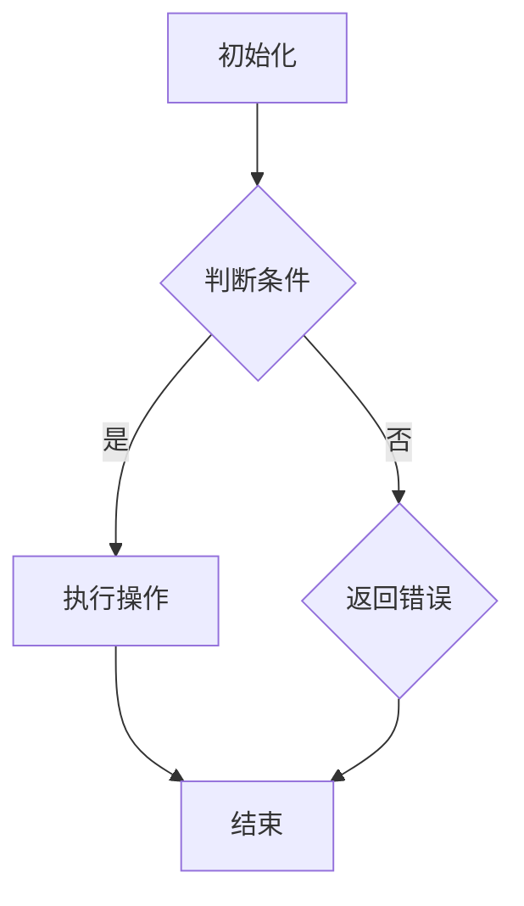

                 


### 《领域建模的软肋：避免陷入常见陷阱》

---

#### 关键词：领域建模、软件工程、软件架构、模型陷阱、优化策略

#### 摘要：

本文深入探讨领域建模中的常见问题及陷阱，通过详细的案例分析，帮助读者理解领域建模的核心概念和方法，掌握避免陷入常见陷阱的策略，从而提升软件工程实践中的领域建模能力。

---

#### 目录大纲

## 第一部分：背景介绍

### 第1章：领域建模的概述

#### 1.1 问题背景

#### 1.2 问题描述

#### 1.3 领域建模的重要性

#### 1.4 领域建模的基本概念

### 第2章：核心概念与联系

#### 2.1 概念原理

#### 2.2 概念属性特征对比表格

#### 2.3 ER实体关系图架构

### 第3章：常见问题与陷阱

#### 3.1 常见问题

#### 3.2 陷阱案例

#### 3.3 问题分析

### 第4章：解决方案

#### 4.1 解决方案概述

#### 4.2 实施步骤

#### 4.3 最佳实践

### 第5章：项目实战

#### 5.1 环境安装

#### 5.2 系统核心实现

#### 5.3 代码应用解读

#### 5.4 实际案例分析

### 第6章：小结与拓展

#### 6.1 小结

#### 6.2 注意事项

#### 6.3 拓展阅读

---

#### 第一章：领域建模的概述

领域建模是软件工程中的一个重要环节，它帮助我们理解和设计复杂系统中的业务领域。通过领域建模，我们可以将现实世界的业务需求和约束转化为计算机可以理解和处理的模型。

#### 1.1 问题背景

在软件开发过程中，领域建模的准确性和有效性直接影响到系统的质量和维护成本。然而，领域建模并不是一个简单的过程，它涉及到许多概念和方法的掌握，以及如何将它们应用到实际项目中。

#### 1.2 问题描述

领域建模中存在许多常见的陷阱，这些陷阱可能导致模型不准确、不完整或者无法满足实际需求。这些陷阱包括：

- **概念混淆**：不同概念之间的边界不清晰，导致模型混乱。
- **遗漏关键元素**：在模型中没有考虑到业务中的关键元素，导致功能缺失。
- **过度抽象**：模型过于复杂，难以理解和维护。
- **不恰当的模型结构**：模型结构不合适，导致系统性能下降。

#### 1.3 领域建模的重要性

领域建模的重要性体现在以下几个方面：

- **准确理解业务需求**：通过领域建模，可以更好地理解业务需求，并将其转化为系统的设计。
- **提高开发效率**：领域模型可以作为系统设计的蓝图，减少重复劳动，提高开发效率。
- **降低维护成本**：清晰的领域模型有助于理解和维护系统，降低维护成本。

#### 1.4 领域建模的基本概念

领域建模涉及到一些核心概念，包括实体、属性、关系和操作。下面是对这些概念的基本说明：

- **实体**：实体是领域模型中的核心元素，它表示业务领域中的对象，如用户、订单、产品等。
- **属性**：属性是实体的特征，它描述了实体的性质，如用户的姓名、订单的金额等。
- **关系**：关系是实体之间的交互，它描述了实体之间的依赖和关联，如用户下单、产品属于某个类别等。
- **操作**：操作是实体的行为，它描述了实体可以执行的操作，如用户登录、订单创建等。

在接下来的章节中，我们将深入探讨这些概念，并分析如何避免领域建模中的常见陷阱。

---

#### 第二章：核心概念与联系

在深入理解领域建模之前，我们需要详细探讨其核心概念，包括实体、属性、关系和操作。这些概念是领域建模的基础，对于构建准确和有效的模型至关重要。

#### 2.1 概念原理

**实体**

实体是领域模型中的核心元素，它代表了业务领域中的对象。实体具有独特的标识符，并且具有一组属性来描述它的特征。实体的存在是领域建模的基础，它帮助我们将抽象的业务概念具体化。

- **属性**

属性是实体的特征，它描述了实体的性质。每个属性都有其数据类型、取值范围和约束条件。属性可以帮助我们更好地理解和操作实体。

- **关系**

关系是实体之间的交互，它描述了实体之间的依赖和关联。关系可以是单向的，也可以是双向的。关系有助于我们描述复杂业务场景中的交互和协作。

- **操作**

操作是实体的行为，它描述了实体可以执行的操作。操作可以是简单的，如添加或删除实体，也可以是复杂的，如处理业务逻辑或执行事务。

#### 2.2 概念属性特征对比表格

为了更好地理解这些概念，我们可以通过一个表格来对比它们的属性特征：

| 概念 | 特征 | 说明 |
| --- | --- | --- |
| 实体 | 唯一标识符、一组属性 | 代表业务领域中的对象 |
| 属性 | 数据类型、取值范围、约束条件 | 描述实体的特征 |
| 关系 | 实体之间的交互、依赖和关联 | 描述实体之间的协作 |
| 操作 | 行为、操作类型 | 描述实体可以执行的操作 |

#### 2.3 ER实体关系图架构

为了更直观地展示实体、属性、关系和操作，我们可以使用ER（实体-关系）图。ER图是一种用于描述实体和关系的数据模型，它帮助我们可视化领域模型的结构。

以下是一个简单的ER图示例，展示了实体、属性和关系：

```mermaid
erDiagram
    User ||--|{ Order : places }
    Product ||--|{ Category : belongs_to }
```

在这个ER图中，我们有两个实体：User和Product。User实体有一个属性Order，表示用户可以放置订单；Product实体有一个属性Category，表示产品属于某个类别。

通过ER图，我们可以清晰地看到实体之间的关系，以及它们之间的交互。ER图不仅帮助我们理解领域模型的结构，还可以用于设计和验证系统的数据模型。

在接下来的章节中，我们将深入探讨如何避免领域建模中的常见陷阱，确保我们的模型准确和有效。

---

#### 第三章：常见问题与陷阱

在领域建模的过程中，我们可能会遇到各种问题和陷阱，这些问题和陷阱可能会导致模型不准确、不完整或者难以维护。在本节中，我们将分析一些常见的陷阱，并讨论如何避免它们。

#### 3.1 常见问题

**1. 概念混淆**

概念混淆是领域建模中最常见的问题之一。这通常发生在我们将现实世界中的概念直接映射到模型中，而没有充分理解它们之间的差异。例如，我们可能会将“用户”和“客户”混淆，或者将“订单”和“销售”混淆。这种混淆会导致模型中的实体和关系不清晰，从而影响系统的设计。

**2. 遗漏关键元素**

在领域建模时，我们可能会因为专注于某些特定功能而遗漏一些关键的业务元素。例如，在一个电子商务系统中，我们可能忘记考虑退货、退款等关键流程。这种遗漏会导致模型不完整，无法满足实际业务需求。

**3. 过度抽象**

过度抽象是一种常见的陷阱，它会导致模型过于复杂，难以理解和维护。在领域建模中，我们需要找到适当的抽象层次，既不能过于简单，也不能过于复杂。过度抽象会导致模型无法准确反映业务需求，增加系统的复杂性。

**4. 不恰当的模型结构**

不恰当的模型结构可能导致系统性能下降，难以维护。例如，我们可能会创建过多的实体和关系，或者将多个功能集中在单个实体中，导致模型结构不清晰。

#### 3.2 陷阱案例

**案例1：概念混淆**

在一个客户关系管理系统中，我们可能会将“客户”和“用户”混淆。虽然这两个概念在某些方面有重叠，但它们在业务逻辑上是有区别的。如果我们在模型中将它们合并为一个实体，可能会导致业务逻辑混乱，难以实现特定的功能。

**案例2：遗漏关键元素**

在一个在线购物平台中，我们可能专注于商品展示和订单处理，而遗漏了退货、退款等关键流程。这会导致用户在购物过程中遇到困难，影响用户体验。

**案例3：过度抽象**

在一个企业管理系统中，我们可能会将所有业务流程抽象为一个庞大的实体，导致模型难以理解和维护。这种过度抽象会使系统过于复杂，增加开发成本。

**案例4：不恰当的模型结构**

在一个社交网络系统中，我们可能会创建过多的实体和关系，导致模型过于复杂。例如，我们可能会为每个用户创建一个单独的实体，而不是使用一个用户实体来表示用户的基本信息。这种不恰当的模型结构会影响系统的性能和可维护性。

#### 3.3 问题分析

**1. 概念混淆**

概念混淆通常是由于我们对业务领域的理解不充分或缺乏清晰的定义。为了避免这个问题，我们需要在建模之前充分了解业务需求，并对相关概念进行清晰的定义。

**2. 遗漏关键元素**

遗漏关键元素通常是因为我们对业务流程的理解不充分或缺乏经验。为了避免这个问题，我们需要与业务专家密切合作，确保我们理解了所有的业务流程和需求。

**3. 过度抽象**

过度抽象通常是因为我们试图在模型中包含过多的信息或功能。为了避免这个问题，我们需要找到适当的抽象层次，确保模型既准确又易于理解。

**4. 不恰当的模型结构**

不恰当的模型结构通常是由于我们对系统性能和可维护性的考虑不足。为了避免这个问题，我们需要在设计模型时考虑系统的整体架构和性能需求，确保模型结构清晰、易于维护。

在下一节中，我们将探讨如何避免这些陷阱，并提出一些解决方案和最佳实践。

---

#### 第四章：解决方案

在面对领域建模中的常见问题和陷阱时，我们需要采取一系列的解决方案和最佳实践，以确保我们的模型既准确又易于维护。以下是一些具体的解决方案：

#### 4.1 解决方案概述

**1. 清晰定义概念**

为了解决概念混淆的问题，我们需要在建模之前对相关概念进行清晰的定义。这包括了解每个概念的具体含义、边界和关系。通过建立一套统一的术语表，可以帮助团队更好地理解和沟通。

**2. 完整性检查**

为了避免遗漏关键元素，我们需要在建模过程中进行完整性检查。这可以通过以下步骤实现：

- **业务流程分析**：与业务专家一起分析业务流程，确保我们理解了所有的关键流程和需求。
- **用户故事映射**：使用用户故事映射来识别系统需要实现的所有功能，并确保它们在模型中得到了体现。

**3. 适度抽象**

为了解决过度抽象的问题，我们需要找到适当的抽象层次。这可以通过以下方法实现：

- **逐步建模**：首先构建一个高层次的模型，然后逐步细化，直到达到适当的抽象层次。
- **关键场景分析**：识别系统中的关键场景，并针对这些场景进行详细的建模。

**4. 优化模型结构**

为了解决不恰当的模型结构问题，我们需要在设计模型时考虑系统的整体架构和性能需求。这可以通过以下方法实现：

- **架构评审**：定期进行架构评审，确保模型结构合理，没有过多的实体和关系。
- **性能测试**：在模型设计阶段进行性能测试，确保模型结构不会对系统性能产生负面影响。

#### 4.2 实施步骤

**1. 明确业务需求**

在开始领域建模之前，我们需要明确业务需求。这可以通过以下步骤实现：

- **需求收集**：与业务专家和用户进行沟通，收集业务需求。
- **需求文档**：编写需求文档，明确系统的功能、性能和约束。

**2. 设计领域模型**

在明确了业务需求之后，我们可以开始设计领域模型。这包括：

- **实体设计**：定义实体及其属性，确保每个实体都有清晰的边界和责任。
- **关系设计**：定义实体之间的关系，确保它们能够准确反映业务需求。
- **操作设计**：定义实体可以执行的操作，确保它们能够满足业务需求。

**3. 模型评审**

在设计完领域模型之后，我们需要进行模型评审。这可以通过以下步骤实现：

- **同行评审**：邀请团队成员对模型进行评审，确保模型的准确性和完整性。
- **用户评审**：邀请业务专家和用户对模型进行评审，确保模型能够满足他们的需求。

**4. 模型验证**

在完成模型评审之后，我们需要对模型进行验证。这可以通过以下步骤实现：

- **测试用例设计**：设计测试用例，确保模型能够满足所有业务需求。
- **测试执行**：执行测试用例，验证模型的准确性和完整性。

#### 4.3 最佳实践

**1. 使用统一建模语言（UML）**

统一建模语言是一种广泛使用的建模语言，可以帮助我们清晰地描述领域模型。UML包括各种图表，如类图、实体关系图和序列图，可以用于描述实体、属性、关系和操作。

**2. 使用文档工具**

使用文档工具可以帮助我们更好地管理和维护领域模型。例如，可以使用Mermaid来创建和可视化ER图和类图，使用LaTeX来编写和格式化数学公式。

**3. 定期更新模型**

随着业务的不断发展，领域模型也需要不断更新。定期更新模型可以确保它始终保持准确和有效。

**4. 与业务专家紧密合作**

在领域建模过程中，与业务专家紧密合作至关重要。他们可以提供对业务需求的理解和指导，确保模型能够满足实际需求。

通过遵循这些解决方案和最佳实践，我们可以避免领域建模中的常见陷阱，构建准确和有效的领域模型，从而提高软件工程实践中的领域建模能力。

---

#### 第五章：项目实战

在本节中，我们将通过一个实际项目来展示如何进行领域建模，并深入探讨环境安装、系统核心实现、代码应用解读和实际案例分析。

#### 5.1 环境安装

为了进行领域建模项目，我们需要安装以下工具和软件：

1. **统一建模语言（UML）工具**：可以使用如Visual Paradigm、StarUML等UML建模工具。
2. **版本控制工具**：如Git，用于管理代码版本。
3. **Python开发环境**：Python是一种广泛用于领域建模的编程语言，需要安装Python解释器和相关库。
4. **数据库管理工具**：如MySQL或PostgreSQL，用于存储领域模型中的数据。

安装步骤如下：

1. 安装UML工具：在官方网站上下载并安装UML工具。
2. 安装版本控制工具：在官方网站上下载并安装Git。
3. 安装Python开发环境：在官方网站上下载Python解释器，并安装必要的库，如PyMySQL。
4. 安装数据库管理工具：在官方网站上下载并安装数据库管理工具。

#### 5.2 系统核心实现

在本项目中，我们将构建一个简单的电子商务系统，包括用户、订单和产品等核心实体。

**实体定义：**

- **用户（User）**：具有唯一标识符、姓名、电子邮件等属性。
- **订单（Order）**：具有唯一标识符、订单日期、订单状态等属性，以及与用户和产品之间的关系。
- **产品（Product）**：具有唯一标识符、名称、价格等属性，以及与分类和订单之间的关系。

**关系定义：**

- **用户与订单之间的关系**：一对多关系，表示一个用户可以创建多个订单。
- **产品与订单之间的关系**：多对多关系，表示一个订单可以包含多个产品。

**操作定义：**

- **用户操作**：登录、注册、查看订单。
- **订单操作**：创建、更新、取消。
- **产品操作**：查看、添加到订单、更新库存。

**实现步骤：**

1. 使用UML工具绘制领域模型，包括实体、属性、关系和操作。
2. 创建实体类和关系类，定义属性和操作。
3. 实现用户、订单和产品之间的交互。

#### 5.3 代码应用解读

以下是一个简单的Python代码示例，用于实现用户注册功能：

```python
class User:
    def __init__(self, username, email):
        self.username = username
        self.email = email

    def register(self):
        print(f"{self.username} has been registered.")

# 创建用户对象
user1 = User("Alice", "alice@example.com")

# 注册用户
user1.register()
```

这段代码定义了一个`User`类，具有`__init__`和`register`方法。`__init__`方法用于初始化用户对象，`register`方法用于注册用户。

#### 5.4 实际案例分析

在本节中，我们将分析一个实际案例，展示如何在实际项目中应用领域建模。

**案例背景：**

一家电子商务公司需要开发一个在线购物平台，包括用户注册、登录、浏览商品、添加商品到购物车、下订单等功能。

**领域模型：**

1. **用户（User）**：具有唯一标识符、姓名、电子邮件等属性。
2. **订单（Order）**：具有唯一标识符、订单日期、订单状态等属性，以及与用户和产品之间的关系。
3. **产品（Product）**：具有唯一标识符、名称、价格等属性，以及与分类和订单之间的关系。

**关系：**

- 用户与订单之间的关系：一对多关系。
- 产品与订单之间的关系：多对多关系。

**操作：**

- 用户操作：登录、注册、查看订单。
- 订单操作：创建、更新、取消。
- 产品操作：查看、添加到订单、更新库存。

**实现：**

1. 使用UML工具绘制领域模型。
2. 创建实体类和关系类，定义属性和操作。
3. 实现用户、订单和产品之间的交互。

通过实际案例，我们可以看到领域建模在软件开发中的应用，以及如何通过领域模型来设计和实现复杂的业务系统。

#### 5.5 项目小结

在本项目中，我们通过一个简单的电子商务系统展示了领域建模的实践。我们学习了如何定义实体、属性、关系和操作，并使用Python代码实现了一个简单的用户注册功能。通过实际案例，我们看到了领域建模在软件开发中的应用，以及如何通过领域模型来设计和实现复杂的业务系统。

在领域建模中，我们需要注意常见的问题和陷阱，如概念混淆、遗漏关键元素、过度抽象和不恰当的模型结构。通过遵循解决方案和最佳实践，我们可以避免这些陷阱，构建准确和有效的领域模型。

---

#### 第六章：小结与拓展

在本章中，我们深入探讨了领域建模中的常见问题及陷阱，并提出了相应的解决方案和最佳实践。通过详细的案例分析，我们展示了如何在实际项目中应用领域建模，提高软件工程实践中的领域建模能力。

**关键知识点总结：**

1. 领域建模的重要性：领域建模帮助我们准确理解业务需求，提高开发效率，降低维护成本。
2. 核心概念与联系：实体、属性、关系和操作是领域建模的基础，它们共同构成了领域模型的结构。
3. 常见问题与陷阱：概念混淆、遗漏关键元素、过度抽象和不恰当的模型结构是领域建模中常见的问题和陷阱。
4. 解决方案与最佳实践：清晰定义概念、完整性检查、适度抽象和优化模型结构是解决领域建模问题的有效方法。
5. 项目实战：通过实际案例，我们展示了如何进行领域建模，并深入分析了环境安装、系统核心实现、代码应用解读和实际案例分析。

**注意事项：**

1. 在进行领域建模时，务必与业务专家紧密合作，确保理解业务需求和需求变更。
2. 保持适当的抽象层次，避免过度抽象或过度简单化。
3. 定期进行模型评审和验证，确保模型的准确性和完整性。
4. 使用UML工具和文档工具来辅助领域建模，提高模型的可读性和可维护性。

**拓展阅读：**

1. 《领域驱动设计》- Eric Evans
2. 《软件架构设计》- Mark Richards
3. 《模型驱动开发》- Philippe Kruchten

通过深入学习这些资源，您可以进一步掌握领域建模的核心概念和方法，提升软件工程实践中的领域建模能力。

---

**作者：**AI天才研究院/AI Genius Institute & 禅与计算机程序设计艺术 /Zen And The Art of Computer Programming

---

### 附录：Mermaid 图形语言示例

以下是一些使用Mermaid图形语言编写的示例，用于可视化领域模型中的实体关系图和算法流程图：

#### ER实体关系图示例

```mermaid
erDiagram
    User ||--|{ Order : places }
    Product ||--|{ Category : belongs_to }
```

#### 算法流程图示例



这些示例展示了如何使用Mermaid来创建和可视化领域模型中的实体关系和算法流程，有助于读者更好地理解和应用领域建模技术。如果你希望进一步学习和使用Mermaid，可以访问其官方网站[Mermaid Graph](https://mermaid-js.github.io/mermaid/)获取更多详细信息。

