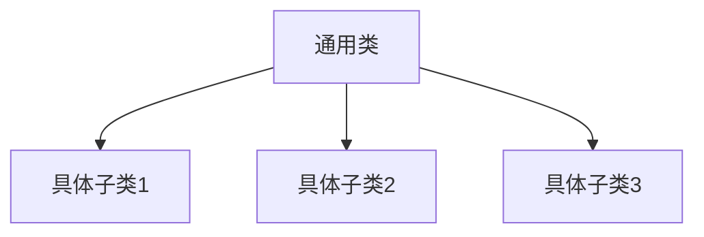

                 


### 领域建模：每个技术人都应该掌握的设计技能

#### 关键词：领域建模、设计技能、UML类图、实体关系图、算法原理

> 摘要：本文将深入探讨领域建模这一关键的设计技能，详细阐述其背景、重要性、核心概念、构建方法以及应用领域。通过实例解析和算法原理讲解，帮助读者全面理解领域建模的实际应用和价值，提升设计能力和技术水平。

----------------------------------------------------------------

## 目录大纲

## 第1章 领域建模基础

1.1 领域建模的背景和重要性...8

1.1.1 什么是领域建模...9

1.1.2 领域建模的关键术语...10

1.1.3 领域建模在现代软件开发中的角色...11

1.2 领域模型的构建方法...12

1.2.1 UML类图在领域建模中的应用...13

1.2.2 领域模型的基本要素...14

1.2.3 领域模型构建的步骤...15

1.3 实例解析：一个简单的领域模型构建...16

1.3.1 案例背景...17

1.3.2 领域模型的设计...18

1.3.3 模型验证与改进...19

1.4 领域模型的应用领域...20

1.4.1 软件工程中的领域建模...21

1.4.2 数据库设计中的领域建模...22

1.4.3 领域特定语言（DSL）的设计...23

1.5 本章小结...24

## 第2章 领域模型核心概念与联系

2.1 核心概念与联系概述...25

2.1.1 实体与关系的识别...26

2.1.2 特性与方法的定义...27

2.2 类与对象的区别...28

2.2.1 类的定义与属性...29

2.2.2 对象的创建与行为...30

2.3 领域模型ER图...31

2.3.1 ER图的表示方法...32

2.3.2 实体关系的分析...33

2.4 概念属性特征对比表格...34

2.4.1 属性特征对比表格的制作...35

2.4.2 特征对比分析...36

2.5 例子：构建一个购物系统的领域模型...37

2.5.1 需求分析...38

2.5.2 模型设计...39

2.5.3 模型验证...40

2.6 本章小结...41

## 第3章 算法原理讲解

3.1 领域建模中的常见算法...42

3.1.1 泛化与特化...43

3.1.2 聚合与组合...44

3.2 算法原理与流程图...45

3.2.1 泛化与特化的Mermaid流程图...46

3.2.2 聚合与组合的Mermaid流程图...47

3.3 Python源代码实例...48

3.4 算法原理的数学模型与公式...49

3.4.1 泛化与特化的数学模型...50

3.4.2 聚合与组合的数学模型...51

## 参考文献...52

----------------------------------------------------------------

# 第1章 领域建模基础

## 1.1 领域建模的背景和重要性

### 1.1.1 什么是领域建模

领域建模（Domain Modeling）是一种用于理解和表示特定领域（Domain）中的概念、对象、关系和行为的建模方法。领域可以是一个行业、一个组织、一个系统，甚至是更广泛的概念，如互联网、金融、电子商务等。领域建模的主要目标是创建一个清晰、易于理解和维护的模型，以支持领域内的业务过程、决策和设计。

领域建模最初源于软件开发领域，但随着时间的发展，它的应用范围已经远远超出了软件开发。它已经成为软件工程、系统分析、数据库设计、业务建模等领域的重要工具。

### 1.1.2 领域建模的关键术语

在领域建模中，有一些关键术语需要了解：

- **领域（Domain）**：指代一个特定的业务领域或知识领域。
- **实体（Entity）**：领域中的具体对象，如客户、订单、产品等。
- **属性（Attribute）**：实体的特征，如客户的名字、订单的总额等。
- **关系（Relationship）**：实体之间的关联，如客户可以下单、订单包含产品等。
- **方法（Method）**：实体可以执行的操作，如客户可以创建订单、订单可以计算总额等。
- **模型（Model）**：对领域中的实体、关系、属性和方法的抽象表示。

### 1.1.3 领域建模在现代软件开发中的角色

在现代软件开发中，领域建模扮演着至关重要的角色：

1. **需求分析**：通过领域建模，可以清晰地理解业务需求，并将其转化为具体的模型，帮助开发人员更好地理解业务逻辑和用户需求。

2. **系统设计**：领域模型为系统设计提供了坚实的基础，可以帮助开发人员设计出更清晰、更高效的系统架构。

3. **代码生成**：一些领域建模工具可以直接生成代码，提高开发效率。

4. **文档生成**：领域模型可以作为系统的文档，帮助开发人员、业务人员和技术支持人员更好地理解系统。

5. **测试**：通过领域模型，可以更准确地设计测试用例，提高测试的覆盖率和有效性。

6. **维护**：领域模型可以帮助开发人员更好地理解系统的结构和功能，降低维护成本。

## 1.2 领域模型的构建方法

领域模型的构建是一个系统性的过程，涉及多个步骤和技巧。以下是一些常见的构建方法：

### 1.2.1 UML类图在领域建模中的应用

统一建模语言（UML）是一种广泛使用的建模语言，它提供了多种图形化工具来表示领域模型。其中，UML类图是领域建模中最常用的工具之一。

类图用来表示领域中的实体、关系、属性和方法。它由三个主要部分组成：类、属性和方法。

- **类**：类的名称通常用大写字母开头，如“Customer”、“Order”等。
- **属性**：属性用来描述类的特征，如“name”、“email”等。
- **方法**：方法用来描述类的操作，如“createOrder”、“calculateTotal”等。

### 1.2.2 领域模型的基本要素

领域模型的基本要素包括实体、关系、属性和方法。这些要素共同构成了领域模型的骨架，帮助开发者更好地理解业务逻辑和系统需求。

- **实体**：实体是领域中的具体对象，如客户、订单、产品等。
- **关系**：关系是实体之间的关联，如客户可以下单、订单包含产品等。
- **属性**：属性是实体的特征，如客户的名字、订单的总额等。
- **方法**：方法是实体可以执行的操作，如客户可以创建订单、订单可以计算总额等。

### 1.2.3 领域模型构建的步骤

构建领域模型通常包括以下步骤：

1. **需求分析**：理解业务需求，明确领域中的实体、关系、属性和方法。

2. **初步建模**：根据需求分析结果，创建初步的领域模型，包括实体、关系、属性和方法。

3. **模型验证**：验证领域模型的准确性、完整性和一致性，确保模型能够满足业务需求。

4. **模型优化**：根据验证结果，对领域模型进行优化，提高模型的清晰度和可维护性。

5. **文档生成**：将领域模型转化为文档，为开发人员、业务人员和技术支持人员提供参考。

## 1.3 实例解析：一个简单的领域模型构建

### 1.3.1 案例背景

假设我们正在开发一个电子商务系统，该系统需要管理客户、订单和产品。我们需要为这个系统构建一个领域模型，以便更好地理解业务逻辑和系统需求。

### 1.3.2 领域模型的设计

根据需求分析，我们可以为这个系统设计以下领域模型：

- **实体**：客户（Customer）、订单（Order）和产品（Product）。
- **关系**：客户可以下单，订单包含产品。
- **属性**：客户有名字和电子邮件，订单有订单号、订单日期和总额，产品有名称和价格。
- **方法**：客户可以创建订单，订单可以计算总额。

### 1.3.3 模型验证与改进

在构建完领域模型后，我们需要对其进行验证，确保模型能够满足业务需求。以下是可能的验证步骤：

1. **逻辑验证**：检查模型中是否存在逻辑错误，如关系不正确、属性缺失等。
2. **一致性验证**：确保模型中各部分的一致性，如实体、关系、属性和方法。
3. **完整性验证**：确保模型中包含了所有必要的实体、关系、属性和方法。
4. **可维护性验证**：检查模型的可维护性，如是否容易修改、扩展和维护。

根据验证结果，我们可能需要对领域模型进行改进，以提高其准确性和可维护性。

## 1.4 领域模型的应用领域

领域建模在多个领域都有广泛的应用，以下是一些常见的应用领域：

### 1.4.1 软件工程中的领域建模

在软件工程中，领域建模被广泛用于需求分析、系统设计、测试和维护。通过领域建模，可以更清晰地理解业务需求，设计出更合理的系统架构，提高软件的可维护性和可扩展性。

### 1.4.2 数据库设计中的领域建模

在数据库设计中，领域建模可以帮助设计者更好地理解业务逻辑和数据需求，设计出更合理、更高效的数据库结构。

### 1.4.3 领域特定语言（DSL）的设计

领域特定语言（DSL）是一种为特定领域定制的编程语言，它可以帮助开发人员更高效地开发特定领域的应用。领域建模是设计DSL的关键步骤，通过领域建模，可以明确DSL的核心概念和操作。

## 1.5 本章小结

本章介绍了领域建模的基础知识，包括背景、重要性、关键术语、构建方法和应用领域。通过实例解析，我们展示了如何构建一个简单的领域模型，并介绍了模型验证与改进的方法。领域建模是一项关键的设计技能，对于提升软件开发质量和效率具有重要意义。

----------------------------------------------------------------

# 第2章 领域模型核心概念与联系

领域建模的核心在于准确地识别和表示业务领域的实体、关系、属性和方法。本章将深入探讨领域模型中的核心概念与联系，通过详细的对比分析和实际案例，帮助读者更好地理解和应用领域建模。

## 2.1 核心概念与联系概述

领域建模的核心概念包括实体、关系、属性和方法。这些概念不仅定义了领域模型的基本结构，而且它们之间的联系和相互关系也是模型准确性和有效性的关键。

### 2.1.1 实体与关系的识别

实体是领域建模中的基础概念，它代表了领域中的具体对象。例如，在电子商务系统中，客户、订单和产品都是实体。识别实体是领域建模的第一步，它有助于我们理解业务领域的本质。

关系则描述了实体之间的相互作用和依赖。例如，在电子商务系统中，客户和订单之间的关系是“客户可以创建订单”，订单和产品之间的关系是“订单包含产品”。正确识别实体和关系是构建有效领域模型的前提。

### 2.1.2 特性与方法的定义

属性是实体的特征，用于描述实体的状态。例如，客户的属性可能包括姓名、电子邮件地址和地址。属性的定义有助于我们明确实体的数据需求和行为。

方法则是实体可以执行的操作，用于描述实体的行为。例如，客户可以创建订单、修改个人信息等。方法的定义有助于我们理解实体的功能和行为。

## 2.2 类与对象的区别

在领域建模中，类与对象是两个核心概念，但它们之间存在显著的差异。

### 2.2.1 类的定义与属性

类是对一组具有相同属性和行为的实体的抽象表示。类定义了实体的基本结构和行为，但它本身并不是具体的实例。例如，在电子商务系统中，我们可以定义一个“Customer”类，它包含客户的属性和行为，但并不代表具体的客户。

类的属性是类的特征，用于描述类的状态。例如，Customer类的属性可能包括“name”、“email”和“address”。

### 2.2.2 对象的创建与行为

对象是类的实例，是具体的实体。通过创建对象，我们可以使用类的属性和方法。例如，当我们创建一个“Customer”对象时，我们可以使用该对象的属性（如"name"）和方法（如"createOrder”）。

对象的行为是通过调用类的方法来实现的。例如，当我们调用“Customer”对象的“createOrder”方法时，该对象将执行创建订单的相关操作。

### 2.2.3 类与对象的关联

类与对象之间是一对多的关系。一个类可以创建多个对象，但每个对象只能属于一个类。这种关系有助于我们理解和组织领域中的实体和行为。

## 2.3 领域模型ER图

实体-关系（ER）图是领域建模中常用的工具，用于表示实体、属性和它们之间的关系。ER图通过直观的图形化方式，帮助我们理解和分析领域模型。

### 2.3.1 ER图的表示方法

ER图由三个主要部分组成：实体、属性和关系。实体用矩形表示，属性用椭圆表示，关系用菱形表示。

- **实体**：实体的名称通常用大写字母表示，并在下方列出其属性。例如，“Customer”实体可能包含属性“Name”、“Email”和“Address”。
- **属性**：属性的名称通常用小写字母表示，并与其所属实体相关联。例如，“Name”属性与“Customer”实体相关联。
- **关系**：关系用菱形表示，并连接相关的实体。关系的名称通常用动词表示，例如“Order”实体与“Customer”实体之间的关系可以表示为“Places”。

### 2.3.2 实体关系的分析

在ER图中，实体关系可以通过以下几种方式表示：

- **一对一关系**：一个实体只能与另一个实体关联一次。例如，“订单”与“客户”之间可能存在一对一的关系，即每个订单只能属于一个客户。
- **一对多关系**：一个实体可以与多个另一个实体关联。例如，“订单”与“产品”之间可能存在一对多的关系，即一个订单可以包含多个产品。
- **多对多关系**：多个实体可以相互关联。例如，“客户”与“产品”之间可能存在多对多的关系，即一个客户可以购买多个产品，一个产品也可以被多个客户购买。

通过ER图，我们可以更清晰地理解和分析领域模型中的实体关系，从而设计出更合理的系统架构。

## 2.4 概念属性特征对比表格

在领域建模中，概念属性特征对比表格是一种有用的工具，用于比较和分析实体属性的特征。这种表格可以帮助我们确保模型的一致性和准确性。

### 2.4.1 属性特征对比表格的制作

属性特征对比表格通常包含以下列：

- **属性名称**：列出所有属性的名称。
- **属性类型**：列出每个属性的数据类型，如字符串、整数、日期等。
- **属性长度**：列出字符串类型的属性长度限制。
- **是否必填**：指出每个属性是否必须提供值。
- **默认值**：列出属性的默认值，如果适用。

以下是一个简单的属性特征对比表格示例：

| 属性名称 | 属性类型 | 属性长度 | 是否必填 | 默认值 |
|----------|----------|----------|----------|--------|
| Name     | String   | 50       | 是       | 无     |
| Email    | String   | 100      | 是       | 无     |
| Address  | String   | 200      | 是       | 无     |

### 2.4.2 特征对比分析

通过属性特征对比表格，我们可以进行以下分析：

- **一致性分析**：确保所有属性的定义是一致的，没有重复或冲突。
- **完整性分析**：确保所有必要的属性都被列出，没有遗漏。
- **合理性分析**：确保属性的长度和类型设置合理，符合业务需求。

这种对比分析有助于我们优化领域模型，提高其准确性和可维护性。

## 2.5 例子：构建一个购物系统的领域模型

### 2.5.1 需求分析

假设我们正在开发一个在线购物系统，该系统需要管理用户、订单和商品。我们的目标是设计一个准确的领域模型，以支持系统的业务逻辑和功能需求。

### 2.5.2 模型设计

根据需求分析，我们可以设计以下领域模型：

- **实体**：用户（User）、订单（Order）和商品（Product）。
- **关系**：用户可以创建订单，订单包含商品。
- **属性**：用户的属性包括用户名、电子邮件和地址；订单的属性包括订单号、订单日期和总额；商品的属性包括商品名称、价格和库存数量。
- **方法**：用户可以创建订单，订单可以计算总额。

### 2.5.3 模型验证

在构建完领域模型后，我们需要对其进行验证，以确保模型满足业务需求。以下是可能的验证步骤：

1. **逻辑验证**：检查模型中是否存在逻辑错误，如关系不正确、属性缺失等。
2. **一致性验证**：确保模型中各部分的一致性，如实体、关系、属性和方法。
3. **完整性验证**：确保模型中包含了所有必要的实体、关系、属性和方法。
4. **可维护性验证**：检查模型的可维护性，如是否容易修改、扩展和维护。

根据验证结果，我们可能需要对领域模型进行优化，以提高其准确性和可维护性。

## 2.6 本章小结

本章介绍了领域模型的核心概念与联系，包括实体、关系、属性和方法。通过类与对象的区别分析、ER图的表示方法、属性特征对比表格的制作以及实际案例的解析，我们深入了解了领域建模的实际应用。领域建模是一项关键的设计技能，对于准确理解和表示业务领域至关重要。

----------------------------------------------------------------

# 第3章 算法原理讲解

领域建模不仅仅是图形化和结构化的表示，它还涉及到一系列算法和原则，这些算法帮助我们更有效地理解和实现领域模型。本章将深入探讨领域建模中的常见算法原理，并通过流程图和Python代码实例进行详细讲解。

## 3.1 领域建模中的常见算法

在领域建模中，以下两种算法是尤为重要的：

### 3.1.1 泛化与特化

泛化（Generalization）和特化（Specialization）是领域建模中用于表示类之间层次关系的重要概念。

- **泛化**：泛化是将一组类的共同属性和行为抽象出来，形成一个新的、更抽象的类。例如，将“动物”、“植物”和“矿物”泛化为“物质”。
- **特化**：特化则是从泛化类中派生出具体的子类，这些子类继承了泛化类的属性和行为，并可能添加新的属性和行为。例如，从“物质”类中特化为“动物”、“植物”和“矿物”。

### 3.1.2 聚合与组合

聚合（Aggregation）和组合（Composition）是描述类之间依赖关系的重要概念。

- **聚合**：聚合是一种弱的“拥有”关系，表示一个类可以包含另一个类，但它们的生命周期是独立的。例如，一个班级可以包含多个学生，但学生的生命周期不受班级的影响。
- **组合**：组合是一种强的“拥有”关系，表示一个类完全包含另一个类，且它们的生命周期是绑定的。例如，一个公司可以完全包含多个部门，部门的生命周期与公司绑定。

## 3.2 算法原理与流程图

为了更好地理解泛化与特化、聚合与组合的算法原理，我们可以使用Mermaid流程图来展示这些概念的应用。

### 3.2.1 泛化与特化的Mermaid流程图

泛化与特化的Mermaid流程图如下：



在这个流程图中，`A` 表示通用类，`B1`、`B2` 和 `B3` 表示具体的子类。这些子类继承了通用类的属性和行为，并可能添加新的属性和行为。

### 3.2.2 聚合与组合的Mermaid流程图

聚合与组合的Mermaid流程图如下：

```mermaid
graph TB
A[整体类] --> B1[部分类1]
A --> B2[部分类2]
A --> B3[部分类3]

graph TD
C[组合整体类] -->|组合| D[部分类1]
C -->|组合| E[部分类2]
C -->|组合| F[部分类3]
```

在这个流程图中，`A` 表示一个整体类，它可以聚合多个部分类（`B1`、`B2` 和 `B3`）。而在组合关系中，`C` 表示一个组合整体类，它完全包含了部分类（`D`、`E` 和 `F`），且它们的生命周期是绑定的。

## 3.3 Python源代码实例

为了更好地理解这些算法原理，我们可以通过Python代码实例来演示。

### 3.3.1 泛化与特化的Python代码实例

```python
class Animal:
    def __init__(self, name):
        self.name = name

class Dog(Animal):
    def __init__(self, name, breed):
        super().__init__(name)
        self.breed = breed

class Cat(Animal):
    def __init__(self, name, color):
        super().__init__(name)
        self.color = color
```

在这个实例中，`Animal` 类是通用类，而 `Dog` 和 `Cat` 类是具体的子类。它们继承了 `Animal` 类的属性和方法，并添加了各自的属性。

### 3.3.2 聚合与组合的Python代码实例

```python
class Store:
    def __init__(self, name):
        self.name = name
        self.products = []

    def add_product(self, product):
        self.products.append(product)

class Product:
    def __init__(self, name, price):
        self.name = name
        self.price = price

class Warehouse:
    def __init__(self, name):
        self.name = name
        self.products = []

    def add_product(self, product):
        self.products.append(product)
```

在这个实例中，`Store` 类和 `Warehouse` 类都聚合了 `Product` 类，表示它们可以包含多个产品。而 `C` 类（假设名为 `Company`）是一个组合整体类，它完全包含了 `Store` 和 `Warehouse` 类。

## 3.4 算法原理的数学模型与公式

为了更精确地描述泛化与特化、聚合与组合的算法原理，我们可以使用数学模型和公式。

### 3.4.1 泛化与特化的数学模型

泛化与特化的数学模型可以表示为：

$$
\text{泛化}: A \rightarrow B1, B2, B3 \\
\text{特化}: B1 \rightarrow C1, C2, C3
$$

其中，`A` 是通用类，`B1`、`B2` 和 `B3` 是具体子类，`C1`、`C2` 和 `C3` 是更具体的子类。

### 3.4.2 聚合与组合的数学模型

聚合与组合的数学模型可以表示为：

$$
\text{聚合}: A \rightarrow B1, B2, B3 \\
\text{组合}: C \rightarrow D1, D2, D3
$$

其中，`A` 是整体类，`B1`、`B2` 和 `B3` 是部分类，`C` 是组合整体类，`D1`、`D2` 和 `D3` 是完全包含在 `C` 中的部分类。

通过数学模型和公式，我们可以更准确地理解和描述领域建模中的算法原理，从而更有效地实现和应用这些算法。

## 3.5 本章小结

本章详细介绍了领域建模中的常见算法原理，包括泛化与特化、聚合与组合。通过Mermaid流程图、Python代码实例和数学模型，我们深入理解了这些算法的应用和实现。掌握这些算法原理对于提高领域建模的效率和准确性具有重要意义。

