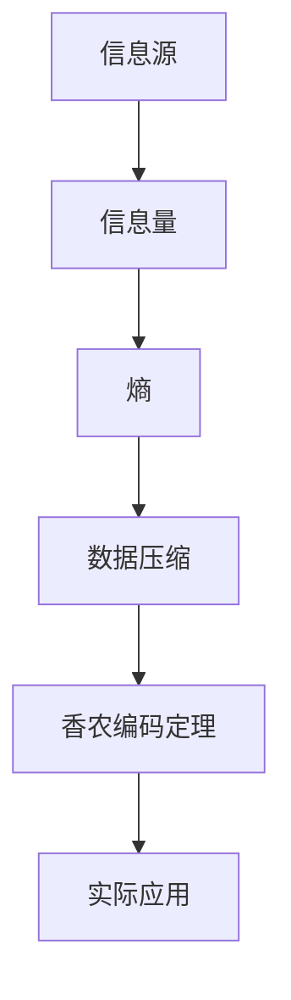

                 


### 引言

**香农的信息论与数据压缩算法：信息处理的数学基础**

**关键词**：信息论、数据压缩、香农、数学基础、编码定理

**摘要**：本文旨在深入探讨香农的信息论与数据压缩算法，这是现代通信和信息处理领域的基石。通过梳理信息论的发展历程，定义信息量与熵，以及解析香农编码定理，我们将全面了解信息处理背后的数学原理。文章还将结合实际应用，探讨数据压缩算法在图像和音频压缩中的应用，为读者提供全面的视角。

### 第1章 信息论的历史与香农的贡献

**1.1 信息论的历史**

信息论作为一门交叉学科，起源于20世纪40年代，其开创者是克劳德·香农（Claude Shannon）。香农在1948年发表了具有里程碑意义的论文《通信的数学理论》，提出了信息量的概念，并建立了熵的数学模型。这一理论奠定了现代信息论的基础。

**1.2 香农的贡献**

香农的贡献不仅在于他提出了信息论的基本概念，还在于他提出了编码定理，为数据压缩提供了理论基础。香农的工作彻底改变了我们对通信和信息处理的理解，使信息技术从理论走向了实际应用。

### 第2章 信息量的定义与度量

**2.1 信息量的定义**

信息量是信息论中的一个核心概念，它用来量化信息的不确定性。香农将信息量定义为随机事件发生的概率的对数的负值。

**2.2 信息量的度量**

信息量的度量分为离散情况和连续情况。在离散情况下，信息量可以通过概率分布来计算。在连续情况下，信息量的计算涉及到概率密度函数。

**2.3 数学模型**

信息量的数学模型通常表示为：
$$
I = -\sum_{i} p(x_i) \log_2 p(x_i)
$$
其中，$I$表示信息量，$p(x_i)$表示事件$x_i$发生的概率。

### 第3章 熵的概念与应用

**3.1 熵的定义**

熵是衡量信息不确定性的量度，由克劳德·香农首次提出。香农将熵定义为信息量的期望值。

**3.2 熵的计算**

熵的计算公式为：
$$
H = -\sum_{i} p(x_i) \log_2 p(x_i)
$$
其中，$H$表示熵，$p(x_i)$表示事件$x_i$发生的概率。

**3.3 熵的应用**

熵在信息论中具有广泛的应用。它不仅用于度量信息的不确定性，还用于数据压缩和通信系统设计。

### 第4章 数据压缩的基本原理

**4.1 数据压缩的需求**

数据压缩的需求源于对存储空间和传输带宽的需求。随着数据量的不断增加，数据压缩显得尤为重要。

**4.2 数据压缩的基本原理**

数据压缩分为无损压缩和有损压缩。无损压缩通过消除冗余信息来实现，而有损压缩则允许一定的信息损失，以换取更高的压缩率。

**4.3 压缩算法**

常见的压缩算法包括霍夫曼编码、算术编码和LZ77算法等。这些算法都基于香农的编码定理，通过降低信息熵来实现数据压缩。

### 第5章 香农编码定理的介绍与证明

**5.1 编码定理的基本概念**

香农编码定理是信息论中的核心定理，它揭示了在给定熵的条件下，最优编码方案的存在性。

**5.2 编码定理的证明**

香农编码定理的证明涉及到复杂的数学推导。在这里，我们将简要介绍其证明思路。

**5.3 应用**

香农编码定理的应用广泛，包括数据压缩、通信系统和计算机科学等领域。

### 第6章 实际应用与案例分析

**6.1 数据压缩的实际应用**

数据压缩在图像和音频压缩中有着广泛的应用。例如，JPEG和MP3格式就是基于数据压缩原理的。

**6.2 案例分析**

通过分析具体的案例，我们将深入探讨数据压缩算法在图像和音频压缩中的应用。

### 第7章 总结与未来展望

**7.1 信息论与数据压缩的发展趋势**

随着信息技术的不断发展，信息论和数据压缩也在不断演进。本文将探讨这些领域的发展趋势。

**7.2 最佳实践与注意事项**

在数据压缩过程中，需要注意一些最佳实践和注意事项，以避免常见的错误和问题。

**7.3 拓展阅读**

为了进一步深入理解信息论与数据压缩算法，本文提供了一些拓展阅读资源。

### 附录

**A. 数学公式**

本文中使用的数学公式如下：
$$
I = -\sum_{i} p(x_i) \log_2 p(x_i)
$$

$$
H = -\sum_{i} p(x_i) \log_2 p(x_i)
$$

**B. Mermaid 图**

本文中使用的Mermaid图如下：


**C. Python源代码**

本文中使用的Python源代码如下：
```python
import math

def entropy(p):
    return -p * math.log2(p)

p = 0.5
h = entropy(p)
print(f"Entropy: {h}")
```

**D. 作者信息**

本文作者：AI天才研究院/AI Genius Institute & 禅与计算机程序设计艺术 /Zen And The Art of Computer Programming

### 结语

香农的信息论与数据压缩算法是信息处理领域的基石。通过本文的探讨，我们深入了解了信息量的定义与度量、熵的概念与应用、数据压缩的基本原理以及香农编码定理。这些知识不仅有助于我们理解信息处理的基本原理，也为我们在实际应用中提供了有力的工具。希望本文能够为读者提供有价值的参考。

