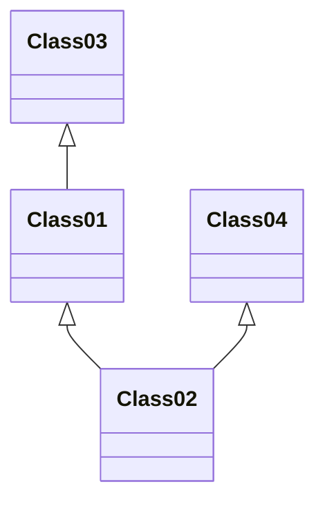

                 

## 马克思与列宁：社会主义理论的发展

### 关键词

- 马克思主义
- 列宁主义
- 社会主义理论
- 阶级斗争
- 无产阶级专政
- 帝国主义

### 摘要

本文旨在探讨马克思与列宁对社会主义理论的发展贡献，通过逻辑清晰的步骤分析，详细阐述马克思主义和列宁主义的核心概念及其联系，同时展示社会主义理论的演变过程。本文还将深入探讨社会主义理论在不同历史时期的演变，以及其在现代社会中的多元化趋势。

### 第一部分：社会主义理论的发展背景

#### 1.1 马克思主义对社会主义理论的贡献

马克思主义作为一种科学理论，对社会主义理论的发展产生了深远影响。马克思在其著作《资本论》中，详细分析了资本主义社会的矛盾和冲突，揭示了无产阶级与资产阶级之间的阶级斗争。这一理论为社会主义提供了坚实的理论基础。

##### 1.1.1 阶级斗争理论

阶级斗争是马克思主义的核心概念之一。马克思认为，社会历史的发展是由不同阶级之间的斗争推动的。在资本主义社会中，无产阶级与资产阶级之间的斗争是不可避免的，这种斗争是推动社会变革的根本力量。

##### 1.1.2 资本主义社会的矛盾分析

马克思通过深入分析资本主义社会的经济结构，揭示了资本主义社会内部的矛盾。他认为，资本主义社会的本质是剥削，资本积累导致工人贫困，资本主义的发展不可避免地会导致社会矛盾的加剧。

##### 1.1.3 无产阶级专政概念

马克思提出了无产阶级专政的概念，认为无产阶级在夺取政权后，必须通过无产阶级专政来巩固自己的统治地位，并逐步实现社会主义向共产主义的过渡。

#### 1.2 列宁主义的发展

列宁在马克思的基础上，进一步发展了马克思主义，形成了列宁主义。列宁主义在理论上丰富了马克思主义，特别是在无产阶级革命和社会主义建设方面做出了重要贡献。

##### 1.2.1 帝国主义理论

列宁提出了帝国主义理论，认为帝国主义是资本主义发展的最高阶段，是资本主义制度的腐朽和衰落。他强调，帝国主义是战争和革命的时代，无产阶级必须通过革命来推翻帝国主义统治。

##### 1.2.2 无产阶级革命理论

列宁提出了无产阶级革命的理论，认为无产阶级革命是资本主义社会不可避免的趋势。他强调，无产阶级必须通过暴力革命来夺取政权，建立无产阶级专政。

##### 1.2.3 苏维埃制度的特点

列宁在俄国革命中，成功地建立了苏维埃制度。苏维埃制度是无产阶级专政的具体形式，它通过工人、农民和士兵的代表来实现民主管理。

#### 1.3 社会主义理论的演变过程

社会主义理论在不同历史时期经历了不同的演变。从马克思主义到列宁主义，再到后来的多种社会主义理论，社会主义理论在不断的丰富和发展。

##### 1.3.1 第二国际与第三国际的对比

第二国际主要强调马克思主义的普世性，而第三国际则更加注重无产阶级的国际团结和革命斗争。

##### 1.3.2 战后社会主义国家的发展

战后，社会主义国家在苏联的带领下，取得了巨大的发展成就。这些国家在政治、经济、科技等方面都取得了显著进步。

##### 1.3.3 当代社会主义理论的多元化

随着全球化和信息化的发展，当代社会主义理论呈现出多元化的趋势。不同的社会主义理论在应对现代问题方面，提出了各自的解决方案。

#### 1.4 社会主义理论的边界与外延

社会主义理论涉及多个领域，包括政治、经济、文化等。它既包含了对社会制度的批判和建设，也包含了对社会发展的战略和策略。

##### 1.4.1 社会主义与共产主义的区别

社会主义和共产主义是两个不同的概念。社会主义是一种制度，而共产主义是一种理想。

##### 1.4.2 社会主义与资本主义的界限

社会主义与资本主义在本质上有区别。社会主义强调公有制和公平，而资本主义强调私有制和竞争。

##### 1.4.3 社会主义国家与社会主义运动

社会主义国家是社会主义理论的具体实践，而社会主义运动则是全球范围内的社会主义思潮和行动。

#### 1.5 背景介绍小结

马克思主义和列宁主义为社会主义理论的发展奠定了基础。社会主义理论在不同历史时期经历了不同的演变，不断丰富和发展。理解社会主义理论的演变过程，有助于我们更好地理解和应用社会主义理论。

### 第二部分：马克思主义与列宁主义的核心概念

#### 2.1 马克思主义的核心概念

马克思主义是社会主义理论的重要组成部分，其核心概念包括阶级斗争、资本主义社会的矛盾和无产阶级专政等。

##### 2.1.1 阶级斗争

阶级斗争是马克思主义的核心概念之一。马克思认为，社会历史的发展是由不同阶级之间的斗争推动的。在资本主义社会中，无产阶级与资产阶级之间的斗争是不可避免的，这种斗争是推动社会变革的根本力量。

##### 2.1.2 资本主义社会的矛盾

马克思通过深入分析资本主义社会的经济结构，揭示了资本主义社会内部的矛盾。他认为，资本主义社会的本质是剥削，资本积累导致工人贫困，资本主义的发展不可避免地会导致社会矛盾的加剧。

##### 2.1.3 无产阶级专政

马克思提出了无产阶级专政的概念，认为无产阶级在夺取政权后，必须通过无产阶级专政来巩固自己的统治地位，并逐步实现社会主义向共产主义的过渡。

#### 2.2 列宁主义的核心概念

列宁主义是马克思主义的进一步发展，其核心概念包括帝国主义理论、无产阶级革命理论和苏维埃制度等。

##### 2.2.1 帝国主义理论

列宁提出了帝国主义理论，认为帝国主义是资本主义发展的最高阶段，是资本主义制度的腐朽和衰落。他强调，帝国主义是战争和革命的时代，无产阶级必须通过革命来推翻帝国主义统治。

##### 2.2.2 无产阶级革命理论

列宁提出了无产阶级革命的理论，认为无产阶级革命是资本主义社会不可避免的趋势。他强调，无产阶级必须通过暴力革命来夺取政权，建立无产阶级专政。

##### 2.2.3 苏维埃制度的特点

列宁在俄国革命中，成功地建立了苏维埃制度。苏维埃制度是无产阶级专政的具体形式，它通过工人、农民和士兵的代表来实现民主管理。

#### 2.3 马克思主义与列宁主义的异同

马克思主义与列宁主义既有联系又有区别。它们在理论基础上一致，但在革命策略上有所不同。

##### 2.3.1 理论基础的一致性

马克思主义和列宁主义都坚持无产阶级革命和社会主义建设的道路，都认为阶级斗争是推动社会变革的根本力量。

##### 2.3.2 革命策略的多样性

列宁主义在革命策略上更加灵活，强调无产阶级必须通过暴力革命来夺取政权，而马克思主义则更加注重和平过渡。

##### 2.3.3 理论应用的灵活性

列宁主义在应用马克思主义理论时，更加注重实际情况，强调理论必须与实际相结合。

#### 2.4 核心概念与联系的ER图

#### 2.5 马克思主义与列宁主义的概念联系

马克思主义与列宁主义在核心概念上存在紧密联系。列宁主义在马克思主义的基础上，进一步发展了无产阶级革命和社会主义建设理论，形成了独特的理论体系。

##### 2.5.1 阶级斗争理论的深化

列宁主义在阶级斗争理论的基础上，进一步强调了无产阶级的国际团结和革命斗争，提出了帝国主义理论，为无产阶级革命提供了新的理论指导。

##### 2.5.2 社会主义建设的探索

列宁主义在社会主义建设方面，提出了苏维埃制度，为无产阶级专政提供了具体实践形式。这一制度在俄国革命中取得了成功，为其他社会主义国家提供了借鉴。

##### 2.5.3 理论与实践的结合

列宁主义强调理论与实践相结合，认为理论必须随着实践的发展而不断丰富和发展。这一理念在马克思主义的基础上，进一步推动了社会主义理论的创新发展。

### 第三部分：社会主义理论的发展与演变

#### 3.1 第二国际与第三国际的对比

第二国际和第三国际是马克思主义发展史上的两个重要阶段。它们在理论和实践上存在显著差异。

##### 3.1.1 第二国际的理论特点

第二国际主要强调马克思主义的普世性，认为无产阶级革命是资本主义社会发展的必然趋势。它提出了“阶级斗争的意识形态”，强调无产阶级必须通过阶级斗争来实现社会主义。

##### 3.1.2 第三国际的理论特点

第三国际在马克思主义的基础上，进一步发展了无产阶级革命和社会主义建设理论。它强调无产阶级必须通过暴力革命来夺取政权，建立无产阶级专政。第三国际提出了“国际主义”理念，强调无产阶级的国际团结。

##### 3.1.3 第二国际与第三国际的异同

第二国际和第三国际在理论和实践上存在差异。第二国际更加注重马克思主义的理论传承，而第三国际则更加注重无产阶级的实际斗争。第二国际强调和平过渡，而第三国际则强调暴力革命。

#### 3.2 战后社会主义国家的发展

战后，社会主义国家在苏联的带领下，取得了巨大的发展成就。这些国家在政治、经济、科技等方面都取得了显著进步。

##### 3.2.1 政治体制的变革

战后社会主义国家在政治体制上进行了变革，建立了无产阶级专政的国家机器。这些国家通过选举产生了工人、农民和士兵的代表，实现了民主管理。

##### 3.2.2 经济体制的改革

战后社会主义国家在经济发展方面进行了改革，实行了计划经济。这些国家通过国家计划和投资，推动了经济的快速发展。

##### 3.2.3 科技进步的成就

战后社会主义国家在科技进步方面取得了显著成就。这些国家在航空航天、信息技术、生物工程等领域取得了重要突破。

#### 3.3 当代社会主义理论的多元化

随着全球化和信息化的发展，当代社会主义理论呈现出多元化的趋势。不同的社会主义理论在应对现代问题方面，提出了各自的解决方案。

##### 3.3.1 市场社会主义

市场社会主义强调在社会主义制度下，引入市场经济机制，实现资源的有效配置。市场社会主义主张在保持公有制的基础上，发挥市场在资源配置中的决定性作用。

##### 3.3.2 民主社会主义

民主社会主义强调民主和自由，主张在社会主义制度下，实现广泛的政治参与和社会公正。民主社会主义主张通过民主制度，实现社会的公平和正义。

##### 3.3.3 社会民主主义

社会民主主义强调社会公正和福利，主张在社会主义制度下，实现广泛的社会福利和公共服务。社会民主主义主张通过社会保障和公共服务，实现社会的稳定和发展。

### 第四部分：社会主义理论的核心概念与联系

#### 4.1 社会主义与共产主义的区别

社会主义和共产主义是两个不同的概念。社会主义是一种制度，强调通过国家干预和社会福利来实现社会公正。而共产主义是一种理想，强调通过消除阶级差异，实现全人类的解放。

##### 4.1.1 社会主义的特征

社会主义的特征包括公有制、计划经济、社会福利等。社会主义旨在通过国家干预，解决社会不公和贫富差距。

##### 4.1.2 共产主义的特征

共产主义的特征包括无阶级社会、公有制、自由平等等。共产主义旨在消除阶级差异，实现全人类的解放。

#### 4.2 社会主义与资本主义的界限

社会主义和资本主义是两种不同的社会制度。社会主义强调公有制和社会福利，而资本主义强调私有制和自由竞争。

##### 4.2.1 社会主义的界限

社会主义的界限在于实现公有制和社会福利，防止社会不公和贫富差距。

##### 4.2.2 资本主义的界限

资本主义的界限在于私有制和自由竞争，可能导致社会不公和贫富差距。

#### 4.3 社会主义国家与社会主义运动

社会主义国家是社会主义理论的具体实践，而社会主义运动是全球范围内的社会主义思潮和行动。

##### 4.3.1 社会主义国家的特征

社会主义国家的特征包括无产阶级专政、计划经济、社会福利等。

##### 4.3.2 社会主义运动的特征

社会主义运动的特征包括无产阶级革命、社会主义建设、国际团结等。

### 第五部分：马克思主义与列宁主义的概念联系

马克思主义与列宁主义在概念上存在紧密联系。列宁主义是在马克思主义的基础上发展起来的，它在无产阶级革命和社会主义建设方面提出了新的理论和实践。

#### 5.1 阶级斗争理论的深化

列宁主义在阶级斗争理论的基础上，进一步强调了无产阶级的国际团结和革命斗争。列宁提出了帝国主义理论，认为帝国主义是资本主义发展的最高阶段，是资本主义制度的腐朽和衰落。

#### 5.2 社会主义建设的探索

列宁主义在社会主义建设方面，提出了苏维埃制度，为无产阶级专政提供了具体实践形式。列宁认为，无产阶级必须通过暴力革命来夺取政权，建立无产阶级专政。

#### 5.3 理论与实践的结合

列宁主义强调理论与实践相结合，认为理论必须随着实践的发展而不断丰富和发展。列宁在实践中不断总结经验，将马克思主义理论与中国具体实际相结合，成功实现了社会主义革命和建设。

### 第六部分：社会主义理论的现代应用

#### 6.1 社会主义理论在政治领域的应用

社会主义理论在政治领域得到了广泛应用。许多国家在政治体制上采用了社会主义原则，如公有制、计划经济、社会福利等。这些国家通过国家干预，实现了社会的公平和正义。

#### 6.2 社会主义理论在经济领域的应用

社会主义理论在经济领域也得到了广泛应用。许多国家通过计划经济，实现了资源的合理配置和经济的快速发展。这些国家在经济发展中，注重社会福利和公共服务，实现了社会的稳定和发展。

#### 6.3 社会主义理论在文化领域的应用

社会主义理论在文化领域也产生了深远影响。许多国家通过文化教育，传播社会主义价值观，培养公民的社会主义意识。这些国家在文化领域强调公平、正义和自由，推动了社会的进步和发展。

### 第七部分：社会主义理论的未来发展趋势

#### 7.1 社会主义理论的多元化

随着全球化和信息化的发展，社会主义理论呈现出多元化的趋势。不同的社会主义理论在应对现代问题方面，提出了各自的解决方案。社会主义理论将在多元化中不断发展。

#### 7.2 社会主义理论的现代化

社会主义理论需要不断现代化，以适应现代社会的需求。社会主义理论将不断吸收现代科技和管理的成果，实现自身的现代化。

#### 7.3 社会主义理论的国际合作

社会主义理论在国际合作中发挥了重要作用。不同国家的社会主义理论相互借鉴，共同应对全球性挑战。社会主义理论将在国际合作中发挥更大的作用。

### 结束语

马克思主义与列宁主义为社会主义理论的发展奠定了基础。社会主义理论在不同历史时期经历了不同的演变，不断丰富和发展。社会主义理论的核心概念和联系，为我们理解和应用社会主义理论提供了重要的理论指导。

作者：AI天才研究院/AI Genius Institute & 禅与计算机程序设计艺术 /Zen And The Art of Computer Programming

