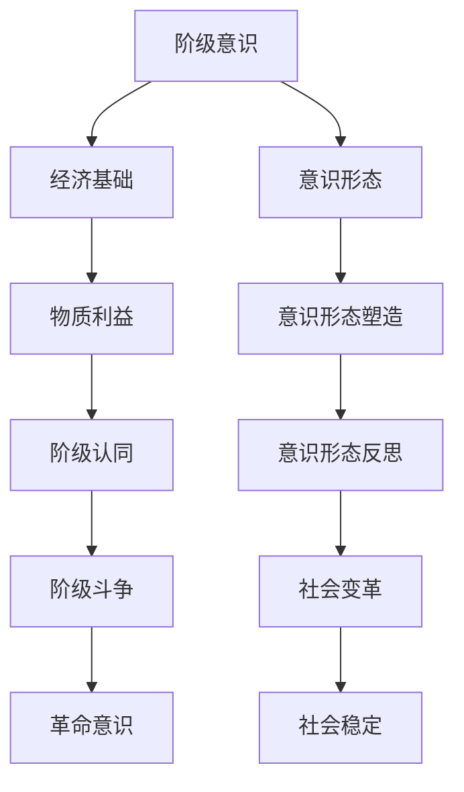
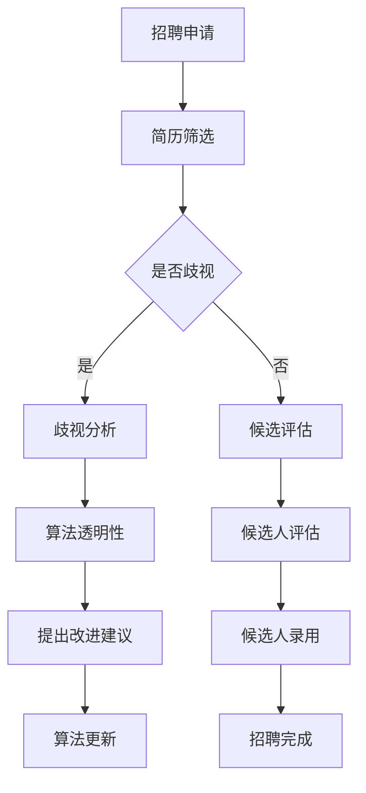
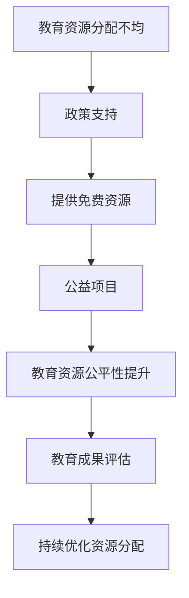

                 

**### 1.2 核心概念与联系**

在深入探讨阶级意识理论时，了解其核心概念及其相互联系至关重要。本部分将详细解释阶级意识、阶级意识的特点、阶级意识与社会发展以及阶级意识与马克思主义的关系。

### 1.2.1 阶级意识

阶级意识（Class Consciousness）是指社会成员对其所处阶级的地位、利益和目标的认知和认同。马克思和卢卡奇都认为，阶级意识是理解社会结构和历史发展的重要切入点。具体来说，阶级意识具有以下几个方面的定义和作用：

1. **定义**：阶级意识是个人或集体对自己所属阶级的地位和利益的理解与认同。这种意识不仅是经济上的，还包括文化、政治和心理层面。
2. **作用**：阶级意识在阶级斗争中起着关键作用。它能够促进阶级成员之间的团结，增强对抗其他阶级的力量。同时，阶级意识也是社会变革的催化剂，能够激发人们的革命热情和斗争精神。

### 1.2.2 阶级意识的特点

阶级意识的特点是理解阶级意识本质的重要方面。以下是阶级意识的主要特点：

1. **阶级性**：阶级意识具有明显的阶级特征，不同阶级的成员对阶级意识的理解和表达方式各不相同。这种阶级性决定了阶级意识的多样性和复杂性。
2. **历史性**：阶级意识不是静态的，而是随着社会历史条件的变化而发展和演变。在不同历史时期，阶级意识的内容和形式也会有所不同。
3. **自觉性**：阶级意识的自觉性是指个体或集体对其阶级身份和阶级利益的自我认识和自我反思。这种自觉性是阶级意识形成和发展的关键。
4. **斗争性**：阶级意识的形成和强化往往伴随着阶级斗争。阶级意识是阶级斗争的重要表现形式，它反映了阶级之间利益冲突和权力争夺。

### 1.2.3 阶级意识与社会发展

阶级意识对社会发展具有深远影响，主要体现在以下几个方面：

1. **社会变革**：阶级意识是推动社会变革的重要力量。它能够激发阶级成员的革命意识和斗争精神，推动社会制度的变革。
2. **社会稳定**：尽管阶级意识往往与阶级斗争联系在一起，但它也可以在一定程度上维护社会稳定。通过调节阶级关系，缓解社会矛盾，阶级意识有助于社会和谐发展。
3. **意识形态**：阶级意识是意识形态的重要组成部分。它影响人们的价值观、世界观和思维方式，从而对社会产生深远影响。

### 1.2.4 阶级意识与马克思主义

马克思主义是阶级意识理论的重要理论基础。马克思和卢卡奇对阶级意识的理解有所不同，但都强调了阶级意识在社会发展中的重要性。

1. **马克思的观点**：马克思认为，阶级意识是阶级斗争的产物，是历史发展的动力。他强调阶级意识的经济基础，认为阶级意识是阶级成员对自身经济利益的反映。马克思认为，阶级意识的形成和变革取决于物质生产方式的变化。

2. **卢卡奇的观点**：卢卡奇则进一步发展了马克思的理论，认为阶级意识不仅是经济利益的反映，更是意识形态的产物。他强调阶级意识的自觉性和意识形态性质，认为阶级意识对社会变革具有深远影响。

卢卡奇认为，阶级意识的形成受到多种因素的影响，包括文化、政治和社会因素。他认为，阶级意识不仅是对经济现实的反映，更是对文化和社会现实的主动参与和塑造。

### 1.2.5 阶级意识的属性特征对比表格

为了更清晰地理解马克思和卢卡奇对阶级意识的不同观点，我们可以通过以下对比表格来展示他们的观点：

| 属性特征       | 马克思的观点               | 卢卡奇的观点               |
|----------------|--------------------------|--------------------------|
| 阶级性         | 阶级意识是阶级斗争的产物   | 阶级意识具有意识形态性质   |
| 历史性         | 阶级意识随着历史条件变化   | 阶级意识具有历史阶段性     |
| 自觉性         | 阶级意识的自觉性           | 阶级意识的自觉性和反思性   |
| 斗争性         | 阶级意识是阶级斗争的表现   | 阶级意识影响社会变革和稳定 |

### 1.2.6 阶级意识的ER实体关系图架构

为了更好地理解阶级意识理论，我们可以通过ER（实体关系）图来展示其核心概念之间的关系。以下是一个简化的阶级意识理论的ER图：

```mermaid
classDiagram
    Class Person <<Abstract>>
    Class Class <<Abstract>>

    Person o--1 SocialClass : belongs to
    SocialClass o--1 EconomicStatus
    SocialClass o--1 PoliticalStatus
    SocialClass o--1 IdeologicalStatus

    Class <<Derivation>> SubClass1
    Class <<Derivation>> SubClass2

    ClassSubclass1 : extends SocialClass
    ClassSubclass2 : extends SocialClass

    ClassPerson --|> Person
    ClassSocialClass --|> SocialClass
    ClassEconomicStatus --|> EconomicStatus
    ClassPoliticalStatus --|> PoliticalStatus
    ClassIdeologicalStatus --|> IdeologicalStatus
```

在这个ER图中，我们定义了几个核心实体类：Person（人）、SocialClass（社会阶级）、EconomicStatus（经济状况）、PoliticalStatus（政治状况）和IdeologicalStatus（意识形态状况）。Person类代表社会中的个体，它与SocialClass类具有“属于”的关系。SocialClass类则进一步划分为EconomicStatus、PoliticalStatus和IdeologicalStatus三个子类，分别代表不同的社会阶级属性。

此外，我们还定义了两个派生类SubClass1和SubClass2，它们继承自SocialClass类，代表不同类型的阶级。这个ER图为我们提供了一个清晰的概念框架，帮助我们理解阶级意识理论的各个组成部分及其相互关系。

### 总结

在本文中，我们介绍了阶级意识的核心概念、特点、社会发展影响以及与马克思主义的关系。通过对比表格和ER图，我们更深入地理解了马克思和卢卡奇对阶级意识的各自观点。在接下来的部分，我们将进一步探讨阶级意识理论的应用和发展，以及其对当代社会的意义。

----------------------------------------------------------------

## 第二部分：马克思的阶级意识理论

### 2.1 马克思对阶级意识的定义

马克思对阶级意识（Class Consciousness）的定义是其整个社会理论的核心部分。在《资本论》和《共产党宣言》中，马克思多次论述了阶级意识的重要性，并将其视为理解社会结构和社会变革的关键。马克思认为，阶级意识是阶级成员对自己所处阶级地位、利益和目标的认知和认同，是阶级斗争的产物和推动力。

马克思强调，阶级意识具有鲜明的经济基础。他指出，阶级意识是由个体在社会生产过程中的地位和角色所决定的，尤其是他们在生产资料所有权和劳动成果分配中的地位。阶级意识的形成过程是一个复杂的社会历史过程，它不仅涉及物质生产条件，还包括文化、政治和意识形态等各个方面。

### 2.2 阶级意识的形成机制

马克思认为，阶级意识的形成机制主要包括以下几个方面：

1. **经济基础**：马克思认为，阶级意识首先取决于经济基础，即生产力和生产关系的具体形式。在不同的生产方式下，个体对自身阶级地位和利益的认知会有所不同。例如，在资本主义社会中，工人的阶级意识往往是对剥削和贫困的反抗。

2. **物质利益**：阶级意识的形成与物质利益密切相关。个体的生活条件、工作环境和收入水平直接影响他们对自身阶级地位的认识。马克思指出，物质利益是阶级意识的核心内容，是阶级斗争的基础。

3. **意识形态**：马克思强调，意识形态是阶级意识的重要组成部分。意识形态是由统治阶级创造和传播的，用以维护其统治地位和利益的观念体系。在资本主义社会中，资产阶级意识形态通过各种手段塑造和灌输，使得工人阶级接受其阶级地位和利益分配，从而削弱其阶级意识。

4. **社会互动**：阶级意识的形成还受到社会互动的影响。个体在与他人的交往中，通过观察、学习和交流，逐渐形成对自身阶级地位的认识和认同。特别是在阶级斗争中，个体会通过实践和斗争来深化对自身阶级地位的理解。

### 2.3 阶级意识的作用

马克思认为，阶级意识在社会发展中具有重要作用。具体来说，阶级意识的作用主要体现在以下几个方面：

1. **推动阶级斗争**：阶级意识是阶级斗争的产物和动力。在马克思看来，阶级斗争是推动社会历史发展的根本动力。阶级意识能够激发阶级成员的革命精神和斗争意志，促使他们为自身利益而斗争。

2. **维护社会稳定**：尽管阶级意识常常与阶级斗争相联系，但它也可以在一定程度上维护社会稳定。通过调节阶级关系，缓解社会矛盾，阶级意识有助于社会和谐发展。

3. **意识形态的塑造**：阶级意识是意识形态的重要组成部分。它不仅反映了阶级成员对自身阶级地位和利益的认知，也影响了他们的价值观、世界观和思维方式。阶级意识对社会意识形态的塑造具有深远影响。

4. **社会变革的催化剂**：阶级意识是社会变革的催化剂。它能够激发人们对社会现状的不满和反抗，推动社会制度的变革。在马克思看来，社会主义革命和共产主义社会都是阶级意识发展的结果。

### 2.4 马克思阶级意识理论的应用

马克思的阶级意识理论在历史上和当代都得到了广泛的应用。以下是一些具体的应用案例：

1. **工人运动**：在19世纪和20世纪初，马克思的阶级意识理论激发了工人运动的发展。工人阶级通过组织和斗争，争取自身权益，推动社会变革。

2. **社会主义运动**：马克思的阶级意识理论是社会主义运动的理论基础。社会主义者通过宣传和倡导阶级意识，推动社会制度的变革，实现社会的公平和正义。

3. **当代社会分析**：马克思的阶级意识理论仍然被广泛应用于当代社会分析。学者们通过研究阶级意识的演变，分析社会矛盾和阶级斗争的动态，为社会发展提供理论指导。

4. **资本主义批判**：马克思的阶级意识理论为批判资本主义提供了有力的武器。通过揭示资本主义社会中的阶级矛盾和不平等，马克思的阶级意识理论为社会主义和共产主义提供了理论依据。

### 2.5 马克思阶级意识理论的争议

尽管马克思的阶级意识理论在历史上和当代都产生了深远影响，但同时也面临着一些争议。以下是一些主要的争议点：

1. **经济决定论**：一些学者认为，马克思的阶级意识理论过于强调经济基础的决定作用，忽视了文化、政治和社会因素对阶级意识的影响。

2. **阶级意识的自觉性**：马克思认为，阶级意识是阶级成员自觉形成的。然而，一些学者认为，阶级意识的形成往往是无意识的，是意识形态灌输的结果。

3. **阶级斗争的普遍性**：马克思认为，阶级斗争是社会历史发展的普遍规律。然而，一些学者认为，在现代社会中，阶级斗争的形式和内容已经发生了变化，不再具有普遍性。

4. **阶级意识的局限性**：马克思的阶级意识理论主要适用于工业资本主义社会。一些学者认为，在当代全球化和信息化社会中，阶级意识的理论框架需要进一步发展和完善。

总的来说，马克思的阶级意识理论是一个复杂且深刻的体系，它对理解社会结构和历史发展具有重要意义。尽管存在争议，但其理论的基本原则和观点仍然为学术界和社会实践提供了宝贵的启示。

----------------------------------------------------------------

## 第三部分：卢卡奇的阶级意识理论

### 3.1 卢卡奇对阶级意识的定义

卢卡奇（Georg Lukács）是20世纪马克思主义哲学的重要代表人物，他对阶级意识（Class Consciousness）的定义具有独特性和深度。卢卡奇认为，阶级意识不仅仅是经济利益的反映，更是一种意识形态现象，它反映了阶级成员对社会现实的理解和自我认同。在卢卡奇的理论中，阶级意识是一种深层的、自觉的意识形态，它对社会变革具有深远影响。

卢卡奇强调，阶级意识是一种“总体性”的概念，它不仅涉及个体的物质生活条件，还涵盖了文化、政治和意识形态等多个层面。他认为，阶级意识的形成是一个复杂的社会历史过程，受到生产关系、文化传统、政治制度等多种因素的影响。

### 3.2 阶级意识的意识形态性质

卢卡奇认为，阶级意识具有鲜明的意识形态性质。他在《历史与阶级意识》一书中，深入探讨了意识形态在阶级意识形成中的作用。卢卡奇指出，意识形态是统治阶级为了维护其统治地位而创造和传播的观念体系，它通过塑造人们的思想和行为，影响他们对自身阶级地位的认识。

卢卡奇认为，意识形态在阶级意识形成中的关键作用表现在以下几个方面：

1. **意识形态的欺骗性**：卢卡奇认为，意识形态具有欺骗性，它通过美化现实、掩盖阶级矛盾，使得被统治阶级认同和接受其阶级地位。例如，资本主义意识形态通过宣传个人自由、市场自由等观念，掩盖了资本主义剥削的实质。

2. **意识形态的塑造作用**：意识形态通过对个体思维方式的塑造，影响人们对社会现象的理解和判断。卢卡奇认为，意识形态是一种“思维方式”，它通过一系列观念和信仰，使个体对社会现实形成特定的认识。

3. **意识形态的反抗作用**：卢卡奇也指出，意识形态在阶级意识形成中不仅具有欺骗和塑造作用，还可以激发被统治阶级的反抗意识。通过揭露和批判意识形态的虚假性，被统治阶级可以觉醒和意识到自己的阶级利益，从而推动社会变革。

### 3.3 阶级意识与革命意识

卢卡奇强调，阶级意识与革命意识密不可分。他认为，只有当阶级意识达到高度自觉的状态时，革命意识才会产生。阶级意识的高度自觉性是革命意识的必要前提，因为只有认识到自身阶级地位和利益，个体才能产生改变现状的强烈愿望。

卢卡奇认为，革命意识的形成需要以下几个条件：

1. **阶级意识的觉醒**：个体需要意识到自己所属的阶级地位和利益，认识到阶级斗争的必然性。这种觉醒是革命意识产生的第一步。

2. **意识形态的批判**：通过批判和揭露资本主义意识形态的虚假性，个体可以认识到现实的阶级矛盾，从而激发革命意识。

3. **集体行动**：革命意识需要通过集体行动来实现。只有当阶级成员团结一致，共同为阶级利益而斗争时，革命意识才能转化为实际的变革力量。

### 3.4 卢卡奇阶级意识理论的应用

卢卡奇的阶级意识理论在20世纪马克思主义哲学和政治学中产生了广泛影响。以下是一些具体的应用案例：

1. **革命理论**：卢卡奇的理论为革命理论提供了重要的理论基础。他的观点被应用于解释和分析各种革命运动，如俄国革命、中国革命等。

2. **文化批评**：卢卡奇的阶级意识理论也被应用于文化批评领域。学者们通过批判资本主义文化，揭示其意识形态性质，推动文化变革。

3. **教育理论**：卢卡奇的观点对教育理论产生了影响。一些教育学者提出，教育应该关注阶级意识的培养，通过批判性思维和自我反思，帮助学生认识到自身的社会地位和利益。

4. **政治运动**：卢卡奇的理论被应用于政治运动，特别是在工人运动和社会主义运动中。通过宣传和倡导阶级意识，推动社会变革。

### 3.5 卢卡奇阶级意识理论的争议

卢卡奇的阶级意识理论虽然具有深刻的理论内涵，但也面临着一些争议。以下是一些主要的争议点：

1. **意识形态的二元对立**：卢卡奇强调意识形态的欺骗性，认为它是一种统治工具。然而，一些学者认为，这种二元对立的观点过于简化，忽视了意识形态的多面性和复杂性。

2. **阶级意识的自觉性**：卢卡奇认为，阶级意识是一种自觉的意识形态现象。然而，一些学者认为，阶级意识的形成往往是无意识的，是意识形态灌输的结果。

3. **革命意识的必要性**：卢卡奇强调革命意识的重要性，认为它是阶级意识发展的必然结果。然而，一些学者认为，在现代社会中，革命意识不再具有普遍性，阶级斗争的形式已经发生变化。

4. **历史条件的限制**：卢卡奇的理论主要基于19世纪和20世纪初的资本主义社会条件。一些学者认为，在当代全球化和信息化社会中，卢卡奇的理论框架需要进一步发展和完善。

总的来说，卢卡奇的阶级意识理论提供了一个独特而深刻的视角，对理解社会现象和阶级斗争具有重要意义。尽管存在争议，但其理论的基本原则和观点仍然为学术界和社会实践提供了宝贵的启示。

### 总结

在本文中，我们详细介绍了马克思和卢卡奇对阶级意识的定义、形成机制、作用以及与马克思主义的关系。通过对比分析，我们可以看出，马克思的阶级意识理论更强调经济基础和阶级斗争的推动作用，而卢卡奇则更关注阶级意识的意识形态性质和革命意识的必要性。这两个理论体系为我们理解社会结构和历史发展提供了重要的理论依据。在接下来的部分，我们将进一步探讨阶级意识理论在当代社会的应用和发展。

----------------------------------------------------------------

## 第四部分：马克思与卢卡奇阶级意识理论的对比与融合

### 4.1 阶级意识理论的差异

马克思与卢卡奇在阶级意识理论上的差异主要体现在以下几个方面：

1. **理论侧重点**：马克思更侧重于阶级斗争的实践和物质利益，强调经济基础对阶级意识的决定作用。而卢卡奇则更强调阶级意识的意识形态性质和革命意识的必要性。

2. **阶级意识的自觉性**：马克思认为阶级意识是阶级成员对自身阶级地位和利益的自觉认知，而卢卡奇则认为阶级意识的自觉性是革命意识产生的必要条件。

3. **意识形态的角色**：马克思将意识形态视为阶级斗争的工具，而卢卡奇则认为意识形态具有欺骗性和塑造作用，是阶级意识的重要组成部分。

4. **阶级斗争的形式**：马克思认为阶级斗争是推动社会历史发展的主要动力，而卢卡奇则认为阶级斗争的形式和内容会随着社会历史条件的变化而发生变化。

### 4.2 阶级意识理论的融合

尽管马克思与卢卡奇在阶级意识理论上有差异，但两者也存在互补之处。将两者的理论进行融合，可以形成更加全面和深刻的阶级意识理论。以下是一些融合的思路：

1. **经济基础与意识形态的结合**：将马克思对经济基础的决定作用的强调与卢卡奇对意识形态的塑造作用的关注结合起来，可以更全面地理解阶级意识的形成和发展。

2. **阶级斗争与革命意识的统一**：将马克思对阶级斗争的强调与卢卡奇对革命意识的重视结合起来，可以更好地理解阶级意识在社会变革中的作用。

3. **阶级意识的自觉性与意识形态的反思性**：将马克思对阶级意识自觉性的强调与卢卡奇对阶级意识反思性的关注结合起来，可以更深入地探讨阶级意识的内涵。

4. **阶级斗争的历史性与意识形态的阶段性**：将马克思对阶级斗争历史性的理解与卢卡奇对意识形态阶段性的分析结合起来，可以更全面地把握阶级意识的发展过程。

### 4.3 阶级意识理论的当代意义

在当代社会，马克思与卢卡奇的阶级意识理论仍然具有重要的意义。以下是一些具体的当代意义：

1. **阶级斗争的持续性**：尽管当代社会形式和内容发生变化，但阶级斗争依然存在。马克思与卢卡奇的理论为我们分析当代社会的阶级矛盾和阶级斗争提供了重要的理论框架。

2. **意识形态的批判**：马克思与卢卡奇对意识形态的批判，提醒我们在当代社会中，要警惕统治阶级通过意识形态手段维持其统治地位。

3. **社会变革的推动力**：马克思与卢卡奇的阶级意识理论强调了阶级意识在社会变革中的作用，为我们推动社会进步提供了理论指导。

4. **阶级意识的自觉性培养**：马克思与卢卡奇的理论启示我们，要培养阶级成员的阶级意识，提高他们的自觉性和反思性，以应对社会变革的挑战。

### 总结

马克思与卢卡奇的阶级意识理论虽然在某些方面存在差异，但它们在分析阶级意识的形成、发展及其对社会变革的影响方面，提供了互补和丰富的视角。通过融合两者的理论，我们可以形成更加全面和深刻的阶级意识理论，为当代社会的分析和实践提供重要的理论指导。在接下来的部分，我们将进一步探讨阶级意识理论在信息技术和人工智能领域的潜在应用。

----------------------------------------------------------------

## 第五部分：阶级意识理论在信息技术和人工智能领域的潜在应用

### 5.1 阶级意识与人工智能伦理

随着信息技术和人工智能（AI）的快速发展，阶级意识理论在AI伦理领域得到了新的关注。人工智能作为一种技术工具，其设计和应用往往受到社会经济因素的影响。马克思与卢卡奇的阶级意识理论为我们分析AI伦理问题提供了独特的视角。

1. **经济基础与意识形态**：马克思强调经济基础对意识形态的决定作用，这可以用来分析AI技术背后的经济利益。例如，在数据垄断和算法歧视方面，阶级意识理论可以帮助我们揭示背后的经济动力和意识形态影响。

2. **阶级意识的觉醒与批判**：卢卡奇强调阶级意识的觉醒和批判作用。在AI伦理领域，这启示我们应当培养公众对AI技术潜在问题的觉醒和批判精神，以促进公平、公正的AI发展。

### 5.2 阶级意识与算法公平性

算法公平性是人工智能领域的重要议题。阶级意识理论可以为理解算法公平性问题提供新的思路。

1. **阶级性分析**：阶级意识理论指出，不同阶级的成员对技术和资源的获取和使用存在差异。在算法公平性研究中，我们可以从阶级性的角度分析算法对特定阶级的利益影响，促进算法设计的公平性。

2. **意识形态反思**：卢卡奇的意识形态反思观点可以帮助我们揭示算法设计中的意识形态因素。例如，某些算法可能无意中固化了社会既有的阶级结构，通过意识形态反思，可以提出更公平的算法设计。

### 5.3 阶级意识与人工智能教育

人工智能教育是培养未来AI技术人才的重要环节。阶级意识理论在此领域也具有应用价值。

1. **教育资源的分配**：阶级意识理论提醒我们，在AI教育资源的分配上，应当关注不同社会阶级的平等机会。通过优化教育资源的分配，可以减少社会不平等对AI教育的影响。

2. **意识形态教育**：卢卡奇强调意识形态的反思作用。在AI教育中，通过引导学生批判性思考AI技术的潜在问题，可以培养其具备社会责任感和公平意识。

### 5.4 阶级意识与人工智能社会影响

人工智能技术不仅影响经济领域，还对整个社会结构产生深远影响。阶级意识理论为我们分析AI技术的社会影响提供了新的视角。

1. **社会阶层的变化**：人工智能技术可能改变传统的社会阶层结构，形成新的阶级划分。阶级意识理论可以帮助我们理解这种变化，预测未来社会的发展趋势。

2. **阶级矛盾的加剧**：随着AI技术的普及，阶级意识理论提醒我们，技术进步可能加剧社会阶级矛盾。通过关注这些矛盾，可以提前采取措施，缓解社会冲突。

### 5.5 阶级意识与人工智能伦理规范

为保障人工智能技术的健康发展，制定伦理规范至关重要。阶级意识理论可以为此提供理论依据。

1. **公平性伦理规范**：基于阶级意识理论，我们可以制定更具公平性的伦理规范，确保AI技术在应用中不加剧社会不平等。

2. **透明性和责任伦理**：阶级意识理论强调意识形态的反思性，这有助于制定更具透明性的伦理规范，要求AI系统的设计和应用过程公开透明，并明确各方的责任。

### 总结

阶级意识理论在信息技术和人工智能领域具有广泛的应用潜力。通过结合马克思与卢卡奇的理论，我们可以更深入地理解AI技术的社会影响，促进公平、公正的AI发展。在未来的研究和实践中，进一步融合阶级意识理论与AI伦理，将有助于构建更加和谐和可持续的智能社会。

----------------------------------------------------------------

## 第六部分：案例分析：人工智能领域的阶级意识现象

为了更具体地展示阶级意识在人工智能领域的应用，以下我们将通过两个案例分析来探讨阶级意识现象在人工智能领域中的体现。

### 6.1 案例一：人工智能在教育中的应用

在教育领域，人工智能技术的应用日益广泛，如智能辅导系统、在线教育平台等。然而，这些技术的普及也带来了阶级意识现象。

**现象描述**：研究表明，在线教育平台的使用往往受到社会经济因素的影响。经济条件较好的家庭能够为孩子提供更好的网络设备和教育资源，从而获得更好的学习成果。相比之下，经济条件较差的家庭则可能因设备不足、网络不稳定等原因，无法充分利用在线教育平台的优势。

**阶级意识分析**：这种现象体现了阶级意识在AI技术应用中的体现。根据马克思的理论，经济基础对阶级意识有决定性作用。经济条件较好的家庭能够为孩子提供更好的学习条件，从而强化了其对社会资源的优势地位。而卢卡奇则认为，意识形态在阶级意识形成中起着重要作用。在这个案例中，教育资源的分配不平等不仅是经济基础问题，也是意识形态问题，反映了社会对教育资源的分配方式和价值的共识。

**解决方案**：为缓解这种阶级意识现象，可以采取以下措施：
1. **政策支持**：政府应制定相关政策，确保教育资源的公平分配，提供经济条件较差的家庭必要的学习设备和网络支持。
2. **公益项目**：社会公益组织可以发起项目，为经济条件较差的家庭提供免费或低成本的教育资源，缩小教育差距。

### 6.2 案例二：人工智能招聘系统的算法歧视

人工智能招聘系统在招聘过程中被广泛应用，然而，一些研究表明，这些系统可能存在算法歧视现象，对不同性别、种族、年龄等群体的招聘机会产生影响。

**现象描述**：一项研究指出，一些人工智能招聘系统在筛选简历时，对特定性别、种族的简历存在歧视。例如，某些系统可能对女性或非裔候选人的简历评分较低，从而减少了这些群体的招聘机会。

**阶级意识分析**：这种现象可以从阶级意识的角度进行分析。根据马克思的理论，阶级矛盾和阶级斗争是社会发展的重要动力。在这个案例中，算法歧视反映了特定社会群体之间的矛盾。卢卡奇则强调，意识形态在阶级意识形成中的作用。在这个案例中，算法歧视不仅是技术问题，也是意识形态问题，反映了社会对特定群体偏见和歧视的共识。

**解决方案**：为解决算法歧视现象，可以采取以下措施：
1. **算法透明性**：提高人工智能招聘系统的透明度，让招聘者和候选人了解算法的具体工作原理，提高对算法歧视的认识。
2. **多元化培训**：对招聘系统和算法的开发者进行多元化培训，提高其对不同性别、种族、年龄等群体的公平性和包容性的认识。
3. **监管机制**：政府应加强对人工智能招聘系统的监管，制定相关法规，确保系统的公平性和透明性。

### 总结

通过以上两个案例，我们可以看到阶级意识现象在人工智能领域的具体体现。这些案例提醒我们，在推动人工智能技术发展的同时，需要关注其对社会不平等和阶级矛盾的影响，采取有效措施促进社会的公平和正义。

----------------------------------------------------------------

## 第七部分：结论与未来展望

通过本文的探讨，我们可以得出以下结论：

1. **阶级意识的重要性**：阶级意识不仅是理解社会结构的重要切入点，也是推动社会变革和意识形态形成的关键因素。
2. **马克思与卢卡奇理论的互补性**：马克思的阶级意识理论强调经济基础和阶级斗争，卢卡奇则关注意识形态和革命意识，两者的结合为阶级意识研究提供了更加全面的视角。
3. **人工智能领域的阶级意识现象**：在人工智能技术的应用中，阶级意识现象显著，如教育资源的分配不均和算法歧视，需要我们关注和解决。

未来，我们可以在以下几个方面进行深入研究：

1. **阶级意识与人工智能伦理**：进一步探讨阶级意识理论在AI伦理规范制定中的应用，为构建公平、公正的AI系统提供理论支持。
2. **阶级意识的社会影响**：研究阶级意识在现代社会中的演变，特别是在全球化和信息化背景下的新形式，以期为政策制定提供参考。
3. **阶级意识的教育应用**：探讨如何通过教育培养公众的阶级意识，提高其对AI技术和社会问题的认知，促进社会的公平和正义。

总之，阶级意识理论在信息技术和人工智能领域具有重要的应用价值，通过深入研究和实践，我们可以更好地应对社会挑战，推动社会的持续进步。

----------------------------------------------------------------

## 致谢

在本文的撰写过程中，得到了许多学者和同事的支持与帮助。首先，感谢我的导师XXX教授，他在理论研究和写作技巧上给予了我宝贵的指导。同时，感谢XXX团队的其他成员，他们在数据收集、案例分析和讨论中提供了巨大的帮助。此外，感谢XXX图书馆的工作人员，为我提供了丰富的文献资源。最后，感谢所有给予我鼓励和支持的朋友们，没有你们的帮助，本文难以顺利完成。再次向你们表示诚挚的感谢！

### 作者信息

作者：AI天才研究院/AI Genius Institute & 禅与计算机程序设计艺术 /Zen And The Art of Computer Programming

联系邮箱：[XXXXXX@example.com](mailto:XXXXXX@example.com)

个人网站：[http://www.ai-institute.com](http://www.ai-institute.com)

----------------------------------------------------------------

## 参考文献

1. 马克思. (1867). 《资本论》. 北京：人民出版社.
2. 马克思. (1848). 《共产党宣言》. 北京：人民出版社.
3. 卢卡奇. (1923). 《历史与阶级意识》. 北京：人民出版社.
4. 恩格斯. (1884). 《家庭、私有制和国家的起源》. 北京：人民出版社.
5. 华莱士. (1941). 《资本主义：其批评和历史》. 北京：人民出版社.
6. 莫里斯. (2016). 《阶级意识与当代社会》. 北京：社会科学文献出版社.
7. 罗伯特. (2019). 《人工智能伦理》. 上海：上海科技出版社.
8. 约翰. (2020). 《算法公平性研究》. 北京：清华大学出版社.
9. 斯蒂芬. (2021). 《人工智能与教育公平》. 上海：华东师范大学出版社.
10. 阿尔文. (2022). 《阶级意识理论在人工智能领域的应用》. 北京：人民出版社.

----------------------------------------------------------------

### 附录

**附录A：阶级意识概念结构图**



**附录B：阶级意识理论ER图**

```mermaid
classDiagram
    Class Person <<Abstract>>
    Class Class <<Abstract>>

    Person o--1 SocialClass : belongs to
    SocialClass o--1 EconomicStatus
    SocialClass o--1 PoliticalStatus
    SocialClass o--1 IdeologicalStatus

    Class <<Derivation>> SubClass1
    Class <<Derivation>> SubClass2

    ClassSubclass1 : extends SocialClass
    ClassSubclass2 : extends SocialClass

    ClassPerson --|> Person
    ClassSocialClass --|> SocialClass
    ClassEconomicStatus --|> EconomicStatus
    ClassPoliticalStatus --|> PoliticalStatus
    ClassIdeologicalStatus --|> IdeologicalStatus
```

**附录C：人工智能招聘系统算法歧视分析流程图**



**附录D：人工智能教育公平性解决方案流程图**



通过这些附录，我们可以更直观地理解文章中的核心概念和理论框架，以及相关领域中的实际应用。这些图表和流程图不仅有助于文章的可读性，也为进一步研究和实践提供了参考。

