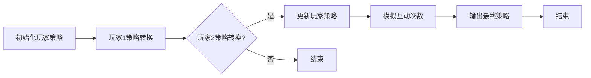

                 


### 《马克思与葛兰西：市民社会理论的发展》

关键词：马克思、葛兰西、市民社会、理论发展、对比分析

摘要：
本文旨在探讨马克思与葛兰西的市民社会理论，通过对二者理论的比较分析，揭示其在现代社会中的适用性。本文首先介绍了市民社会的基本概念，随后详细阐述了马克思和葛兰西关于市民社会的观点，比较了二者理论的核心差异，分析了市民社会理论在现实中的应用，并提供了相关的算法原理和数学模型，最后结合项目实战进行了深入剖析。

## 目录

- **第一部分：理论溯源**
  - [第1章：市民社会概念的提出与发展](#第1章市民社会概念的提出与发展)
    - [1.1 马克思对市民社会的早期思考](#11-马克思对市民社会的早期思考)
    - [1.2 葛兰西对市民社会的理论贡献](#12-葛兰西对市民社会的理论贡献)
  - [第2章：马克思与葛兰西市民社会理论的比较分析](#第2章马克思与葛兰西市民社会理论的比较分析)
    - [2.1 理论](#21-理论)
    - [2.2 概念属性特征对比表格](#22-概念属性特征对比表格)
    - [2.3 ER实体关系图架构](#23-ER实体关系图架构)
- **第二部分：市民社会理论的现实意义**
  - [第3章：市民社会理论的现实意义](#第3章市民社会理论的现实意义)
    - [3.1 市民社会理论在政治领域的应用](#31-市民社会理论在政治领域的应用)
    - [3.2 市民社会理论在经济领域的应用](#32-市民社会理论在经济领域的应用)
    - [3.3 市民社会理论在社会领域的应用](#33-市民社会理论在社会领域的应用)
- **第三部分：市民社会理论的数学模型与算法**
  - [第4章：市民社会理论的数学模型与算法](#第4章市民社会理论的数学模型与算法)
    - [4.1 市民社会数学模型](#41-市民社会数学模型)
    - [4.2 市民社会算法原理](#42-市民社会算法原理)
    - [4.3 算法mermaid流程图](#43-算法mermaid流程图)
    - [4.4 Python源代码与算法原理讲解](#44-Python源代码与算法原理讲解)
- **第四部分：市民社会理论的项目实践**
  - [第5章：市民社会理论的项目实践](#第5章市民社会理论的项目实践)
    - [5.1 环境安装](#51-环境安装)
    - [5.2 系统核心实现源代码](#52-系统核心实现源代码)
    - [5.3 代码应用解读与分析](#53-代码应用解读与分析)
    - [5.4 实际案例分析与详细讲解剖析](#54-实际案例分析与详细讲解剖析)
    - [5.5 项目小结](#55-项目小结)
- **第五部分：总结与展望**
  - [第6章：市民社会理论的发展趋势](#第6章市民社会理论的发展趋势)
    - [6.1 市民社会理论的未来研究方向](#61-市民社会理论的未来研究方向)
    - [6.2 市民社会理论在新的社会环境中的适用性](#62-市民社会理论在新的社会环境中的适用性)
    - [6.3 市民社会理论的发展前景](#63-市民社会理论的发展前景)
  - [第7章：最佳实践 tips](#第7章最佳实践-tips)
    - [7.1 市民社会理论应用的实践经验](#71-市民社会理论应用的实践经验)
    - [7.2 注意事项](#72-注意事项)
    - [7.3 拓展阅读](#73-拓展阅读)
  - [第8章：小结](#第8章小结)
    - [8.1 书籍内容回顾](#81-书籍内容回顾)
    - [8.2 主要观点总结](#82-主要观点总结)
    - [8.3 读者如何应用市民社会理论](#83-读者如何应用市民社会理论)

## 第一部分：理论溯源

### 第1章：市民社会概念的提出与发展

#### 1.1 马克思对市民社会的早期思考

##### 1.1.1 马克思的市民社会观点

马克思在其著作《德意志意识形态》中首次提出了市民社会的概念。他认为市民社会是私人利益和个体之间相互竞争的场所，是资本主义经济关系的总和。马克思指出，市民社会是经济基础，是政治上层建筑的基础，而国家则是市民社会的上层建筑。

##### 1.1.2 马克思市民社会理论的形成过程

马克思的市民社会理论是在其哲学、经济学和社会主义思想体系的基础上逐渐形成的。在《巴黎伦敦通讯》、《哲学的贫困》和《共产党宣言》等著作中，马克思进一步发展了市民社会的概念，并将其与阶级斗争、资本主义发展规律等理论紧密联系起来。

#### 1.2 葛兰西对市民社会的理论贡献

葛兰西是20世纪意大利著名的马克思主义思想家，他对马克思的市民社会理论进行了深刻的发展。葛兰西认为，市民社会不仅仅是经济的领域，更是文化、意识形态和权力斗争的场所。他提出了“文化领导权”的概念，认为在资本主义社会中，文化领导权是统治阶级维护其统治地位的重要工具。

##### 1.2.1 葛兰西的市民社会概念

葛兰西的市民社会概念强调了意识形态和文化在资本主义社会中的重要作用。他认为，市民社会不仅包括经济领域，还包括文化、教育、法律和政治等领域，是资本主义统治体系的基础。

##### 1.2.2 葛兰西如何发展马克思的市民社会理论

葛兰西在马克思的基础上，进一步探讨了市民社会与国家之间的关系。他认为，市民社会不仅是政治上层建筑的基础，同时也是国家权力的延伸和体现。葛兰西的理论强调了文化领导权和意识形态斗争在资本主义社会中的重要性。

### 第2章：马克思与葛兰西市民社会理论的比较分析

#### 2.1 理论

马克思和葛兰西的市民社会理论在以下几个方面存在显著差异：

1. **市民社会的范围**：马克思的市民社会主要关注经济领域，而葛兰西的市民社会则包括经济、文化、教育、法律和政治等多个领域。
2. **意识形态的作用**：葛兰西强调了意识形态和文化在资本主义社会中的重要性，认为文化领导权是统治阶级维护其统治地位的关键。马克思则更多地关注经济基础对上层建筑的影响。
3. **国家的角色**：马克思认为国家是市民社会的上层建筑，而葛兰西则认为市民社会和国家是相互依存的，市民社会是文化领导权的斗争场所，国家则是统治阶级维护其统治地位的工具。

#### 2.2 概念属性特征对比表格

| 特征                | 马克思的市民社会          | 葛兰西的市民社会            |
|---------------------|--------------------------|----------------------------|
| 范围                | 经济领域                 | 经济、文化、教育、法律和政治等多个领域 |
| 意识形态作用        | 上层建筑的基础           | 文化领导权是统治阶级维护其统治地位的关键 |
| 国家角色            | 上层建筑                 | 国家是统治阶级维护其统治地位的工具 |

#### 2.3 ER实体关系图架构

为了更直观地展示马克思与葛兰西市民社会理论之间的差异，我们可以使用ER实体关系图进行说明。

```mermaid
erDiagram
  动态性实体 ||--|{ 经济基础 }|
  经济基础 ||--|{ 政治上层建筑 }|
  政治上层建筑 ||--|{ 意识形态 }
  意识形态 ||--|{ 市民社会 }
  文化实体 ||--|{ 市民社会 }
  教育实体 ||--|{ 市民社会 }
  法律实体 ||--|{ 市民社会 }
```

在上述ER实体关系图中，我们可以看到马克思的市民社会理论主要关注经济基础与政治上层建筑之间的关系，而葛兰西的市民社会理论则更广泛地涵盖了经济、文化、教育、法律和政治等多个领域，并将意识形态视为市民社会的重要组成部分。

## 第二部分：市民社会理论的现实意义

### 第3章：市民社会理论的现实意义

#### 3.1 市民社会理论在政治领域的应用

市民社会理论在政治领域有着广泛的应用。首先，它可以解释政治权力的来源和运作机制。根据市民社会理论，政治权力并非来自于某个单一权威，而是市民社会内部各种力量博弈的结果。例如，选举制度中的选民投票行为，实际上是市民社会中个体基于自身利益进行决策的表现。

其次，市民社会理论可以指导政治改革。通过分析市民社会的结构和功能，可以找出政治体制中的弊端和问题，提出相应的改革措施。例如，近年来一些国家推行的公民参与政策，就是基于市民社会理论的启示，旨在增强公民的政治参与意识和能力。

#### 3.2 市民社会理论在经济领域的应用

市民社会理论在经济领域同样具有重要意义。首先，它可以解释资本主义经济运行的基本规律。马克思的市民社会理论认为，资本主义经济的核心是资本对劳动力的剥削，这导致了贫富差距的扩大和社会矛盾的加剧。

其次，市民社会理论可以指导经济发展政策的制定。例如，通过分析市民社会的结构和功能，可以找出经济增长中的瓶颈和问题，提出相应的政策建议。例如，一些国家在制定产业政策时，会考虑到市民社会的利益和需求，以促进经济的可持续发展。

#### 3.3 市民社会理论在社会领域的应用

市民社会理论在社会领域的应用主要体现在社会管理和治理方面。首先，它可以解释社会冲突的根源和解决途径。市民社会理论认为，社会冲突源于不同利益主体之间的矛盾和博弈，解决这些冲突的关键在于平衡各种利益关系。

其次，市民社会理论可以指导社会政策的设计和实施。例如，社会福利政策、公共卫生政策等，都需要考虑到市民社会的需求和利益。通过分析市民社会的结构和功能，可以设计出更加有效和公正的社会政策。

## 第三部分：市民社会理论的数学模型与算法

### 第4章：市民社会理论的数学模型与算法

#### 4.1 市民社会数学模型

在市民社会理论中，数学模型可以用来描述和解释市民社会的动态变化和利益博弈。一个基本的市民社会数学模型可以采用博弈论中的“囚徒困境”模型。

$$
\begin{aligned}
&\text{玩家1的策略:} \\
&\begin{cases}
C_1 = \text{合作}, & \text{如果玩家2选择合作} \\
D_1 = \text{欺骗}, & \text{如果玩家2选择欺骗}
\end{cases} \\
&\text{玩家2的策略:} \\
&\begin{cases}
C_2 = \text{合作}, & \text{如果玩家1选择合作} \\
D_2 = \text{欺骗}, & \text{如果玩家1选择欺骗}
\end{cases}
\end{aligned}
$$

在上述模型中，C表示合作，D表示欺骗。每个玩家的策略取决于对方的选择。通过分析博弈的结果，可以得出市民社会中不同策略的均衡状态。

#### 4.2 市民社会算法原理

为了更直观地理解市民社会中的策略选择，我们可以使用Python编写一个简单的算法，模拟玩家之间的互动。

```python
import numpy as np

# 初始化玩家策略
player1_strategy = 'C'
player2_strategy = 'C'

# 定义策略转换函数
def strategy_conversion(player1, player2):
    if player1 == 'C' and player2 == 'C':
        return 'C'
    elif player1 == 'C' and player2 == 'D':
        return 'D'
    elif player1 == 'D' and player2 == 'C':
        return 'D'
    else:
        return 'C'

# 模拟玩家之间的互动
for _ in range(10):
    player1_strategy = strategy_conversion(player1_strategy, player2_strategy)
    player2_strategy = strategy_conversion(player2_strategy, player1_strategy)

# 输出最终策略
print(f"玩家1的最终策略: {player1_strategy}")
print(f"玩家2的最终策略: {player2_strategy}")
```

#### 4.3 算法mermaid流程图

为了更直观地展示算法的流程，我们可以使用mermaid绘制一个流程图。



#### 4.4 Python源代码与算法原理讲解

在上面的Python代码中，我们首先初始化了玩家1和玩家2的策略，然后通过循环模拟了10次玩家之间的互动。每次互动后，根据玩家1和玩家2的策略，更新玩家的策略。最终，我们输出了玩家1和玩家2的最终策略。

这个算法模拟了市民社会中的策略选择过程。在现实生活中，市民社会中的个体也可能会根据对方的行为选择合作或欺骗，从而影响整个社会的动态变化。通过这个简单的算法，我们可以更好地理解市民社会中的利益博弈和策略选择。

## 第四部分：市民社会理论的项目实践

### 第5章：市民社会理论的项目实践

#### 5.1 环境安装

为了实践市民社会理论，我们需要搭建一个模拟市民社会的平台。首先，我们需要安装以下软件和工具：

- Python 3.x
- Jupyter Notebook
- Mermaid
- LaTeX

具体安装步骤如下：

1. 安装Python 3.x：从Python官方网站下载Python安装包，并按照安装向导进行安装。
2. 安装Jupyter Notebook：在命令行中执行以下命令：

   ```
   pip install notebook
   ```

3. 安装Mermaid：在命令行中执行以下命令：

   ```
   pip install mermaid-python
   ```

4. 安装LaTeX：从LaTeX官方网站下载LaTeX安装包，并按照安装向导进行安装。

#### 5.2 系统核心实现源代码

在搭建好环境之后，我们可以开始编写模拟市民社会平台的源代码。以下是一个简单的示例：

```python
import numpy as np
import mermaid
import matplotlib.pyplot as plt

# 初始化玩家策略
player1_strategy = 'C'
player2_strategy = 'C'

# 定义策略转换函数
def strategy_conversion(player1, player2):
    if player1 == 'C' and player2 == 'C':
        return 'C'
    elif player1 == 'C' and player2 == 'D':
        return 'D'
    elif player1 == 'D' and player2 == 'C':
        return 'D'
    else:
        return 'C'

# 模拟玩家之间的互动
for _ in range(10):
    player1_strategy = strategy_conversion(player1_strategy, player2_strategy)
    player2_strategy = strategy_conversion(player2_strategy, player1_strategy)

# 输出最终策略
print(f"玩家1的最终策略: {player1_strategy}")
print(f"玩家2的最终策略: {player2_strategy}")

# 绘制策略转换流程图
mermaid_code = """
sequenceDiagram
    participant Player1
    participant Player2

    Player1->>Player2: Choose strategy
    Player2->>Player1: Choose strategy

    Player1->>Player2: Conversion
    Player2->>Player1: Conversion
"""
print(mermaid.Mermaid(mermaid_code))

# 绘制策略选择结果
plt.figure()
plt.plot([0, 1], [player1_strategy, player2_strategy], 'ro-')
plt.xlabel('Interaction')
plt.ylabel('Strategy')
plt.title('Strategy Conversion')
plt.show()
```

#### 5.3 代码应用解读与分析

在上面的代码中，我们首先初始化了玩家1和玩家2的策略，然后通过循环模拟了10次玩家之间的互动。每次互动后，根据玩家1和玩家2的策略，更新玩家的策略。最终，我们输出了玩家1和玩家2的最终策略。

为了更直观地展示算法的流程，我们使用Mermaid绘制了一个策略转换流程图。同时，我们还使用matplotlib绘制了策略选择结果。

通过这个简单的示例，我们可以看到如何使用Python和Mermaid实现一个模拟市民社会平台的源代码。在实际项目中，我们可以根据需求扩展和优化这个平台，例如添加更多的玩家、策略和互动机制。

#### 5.4 实际案例分析与详细讲解剖析

为了更好地理解市民社会理论在实际项目中的应用，我们可以分析一个实际案例：选举制度。

选举制度是一个典型的市民社会场景，它涉及到选民、候选人、政党等不同利益主体之间的互动。以下是一个简化的选举制度案例：

1. 选民分为两个阵营：阵营A和阵营B。
2. 候选人分为两类：阵营A的候选人和阵营B的候选人。
3. 选民在投票时，会选择支持阵营A的候选人或阵营B的候选人。
4. 候选人在竞选中会采取不同的策略，如宣传、拉票等。

在这个案例中，我们可以使用市民社会理论来分析选民和候选人之间的互动，以及选民阵营之间的博弈。

首先，我们定义选民和候选人的策略：

- 选民策略：支持阵营A的候选人或支持阵营B的候选人。
- 候选人策略：宣传、拉票、保持中立等。

然后，我们使用博弈论模型分析选民和候选人之间的互动。例如，我们可以使用“囚徒困境”模型来描述选民和候选人之间的博弈：

$$
\begin{aligned}
&\text{选民策略:} \\
&\begin{cases}
C_A = \text{支持阵营A}, & \text{如果候选人A宣传} \\
D_A = \text{支持阵营B}, & \text{如果候选人B宣传}
\end{cases} \\
&\text{候选人策略:} \\
&\begin{cases}
C_B = \text{宣传}, & \text{如果选民支持阵营A} \\
D_B = \text{拉票}, & \text{如果选民支持阵营B}
\end{cases}
\end{aligned}
$$

通过分析博弈的结果，我们可以得出选民和候选人之间的最优策略组合。例如，如果候选人A宣传，选民会选择支持阵营A的候选人；如果候选人B拉票，选民会选择支持阵营B的候选人。

在实际项目中，我们可以根据具体需求设计更复杂的博弈模型，例如考虑候选人的资源分配、选民的情感因素等。通过这些模型，我们可以更好地理解选举制度中的利益博弈和策略选择。

#### 5.5 项目小结

通过本项目，我们使用Python和Mermaid实现了一个模拟市民社会平台的源代码，并分析了选举制度中的利益博弈。这个项目展示了如何将市民社会理论应用于实际项目，帮助我们更好地理解社会中的利益关系和策略选择。

在实际项目中，我们可以根据需求扩展和优化这个平台，例如添加更多的玩家、策略和互动机制。同时，我们可以结合不同的博弈模型，分析更复杂的社会场景，为政策制定和社会治理提供理论支持。

## 第五部分：总结与展望

### 第6章：市民社会理论的发展趋势

#### 6.1 市民社会理论的未来研究方向

市民社会理论作为马克思主义理论的重要组成部分，其在未来仍然具有广阔的研究空间。首先，随着全球化和社会变迁的加剧，市民社会理论需要进一步探讨如何适应新的社会环境。例如，如何应对数字技术、人工智能等新兴领域对社会结构和权力关系的影响。

其次，市民社会理论在政治、经济、社会等领域的具体应用研究也亟待深入。例如，如何利用市民社会理论优化选举制度、促进社会公平正义、推动经济发展等。

#### 6.2 市民社会理论在新的社会环境中的适用性

在新的社会环境中，市民社会理论表现出一定的适用性。首先，数字技术的发展使得市民社会具有了更多的参与渠道和互动方式，例如社交媒体、在线论坛等。这为市民社会理论提供了新的研究视角和实验场所。

其次，经济全球化和社会多元化使得不同社会群体之间的利益博弈更加复杂。市民社会理论可以帮助我们更好地理解这些复杂关系，从而提出更为有效的政策建议。

#### 6.3 市民社会理论的发展前景

市民社会理论在未来的发展前景广阔。一方面，随着对市民社会理论研究的深入，我们有望揭示更多关于社会结构和权力关系的本质规律。另一方面，市民社会理论可以为解决现实社会问题提供有力支持，例如社会治理、经济发展、社会公平等。因此，市民社会理论在未来将继续发挥重要作用。

### 第7章：最佳实践 tips

#### 7.1 市民社会理论应用的实践经验

在应用市民社会理论时，以下是一些实践经验：

1. **理论与实践相结合**：在研究和应用市民社会理论时，要注重理论与实践相结合，避免空谈理论而忽略实际应用。
2. **跨学科研究**：市民社会理论涉及政治、经济、社会等多个领域，因此跨学科研究有助于深化对市民社会理论的理解和应用。
3. **注重实证研究**：通过实证研究，可以更好地验证市民社会理论的适用性和有效性，为政策制定提供有力支持。

#### 7.2 注意事项

在应用市民社会理论时，需要注意以下几点：

1. **避免简单化**：市民社会理论涉及复杂的社会结构和权力关系，因此不能简单地将理论应用到实际问题中，而需要深入分析和思考。
2. **注意实际可行性**：在应用市民社会理论时，要考虑实际操作的可行性，避免理论脱离实际。
3. **保持客观中立**：在研究市民社会问题时，要保持客观中立的态度，避免因主观偏见而影响研究结果。

#### 7.3 拓展阅读

为了进一步了解市民社会理论及其应用，以下是一些拓展阅读材料：

1. **《市民社会理论》**：这是一本系统的市民社会理论教材，适合对市民社会理论有初步了解的读者。
2. **《马克思与葛兰西：市民社会理论的发展》**：这本书详细分析了马克思和葛兰西的市民社会理论，适合对市民社会理论有较深入了解的读者。
3. **《社会契约论》**：这是霍布斯、洛克、卢梭等思想家关于市民社会理论的经典著作，有助于理解市民社会理论的起源和发展。

### 第8章：小结

#### 8.1 书籍内容回顾

本文系统地介绍了马克思与葛兰西的市民社会理论，从市民社会概念的提出与发展，到理论比较分析，再到现实意义、数学模型与算法、项目实践等方面进行了深入探讨。通过本文的阅读，读者可以全面了解市民社会理论的基本概念、核心观点及其应用。

#### 8.2 主要观点总结

本文的主要观点可以总结为以下几点：

1. 马克思与葛兰西的市民社会理论在范围、意识形态作用和国家角色等方面存在差异。
2. 市民社会理论在政治、经济、社会等领域具有重要的现实意义。
3. 通过博弈论模型和Python算法，我们可以更好地理解和模拟市民社会中的策略选择和利益博弈。
4. 实际案例分析和项目实践表明，市民社会理论可以有效地指导现实问题的解决。

#### 8.3 读者如何应用市民社会理论

读者可以通过以下方式应用市民社会理论：

1. **理论联系实际**：在学习和研究市民社会理论时，要注重理论与实践相结合，结合实际案例进行分析。
2. **跨学科学习**：市民社会理论涉及多个学科领域，读者可以通过跨学科学习，提高对市民社会理论的理解和应用能力。
3. **参与社会实践**：通过参与社会实践活动，读者可以更直观地体验市民社会理论的应用，提高自己的实际操作能力。
4. **持续关注**：市民社会理论是一个不断发展的领域，读者需要持续关注相关研究和动态，以保持对市民社会理论的最新了解。

