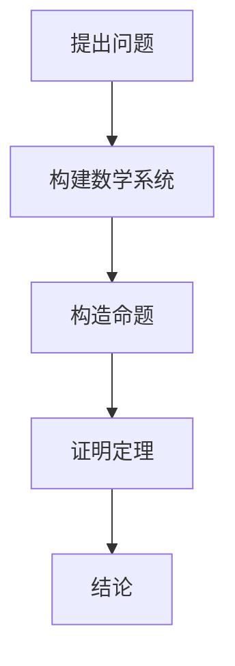
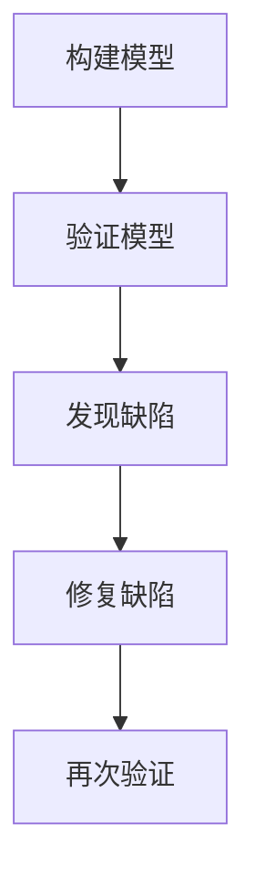
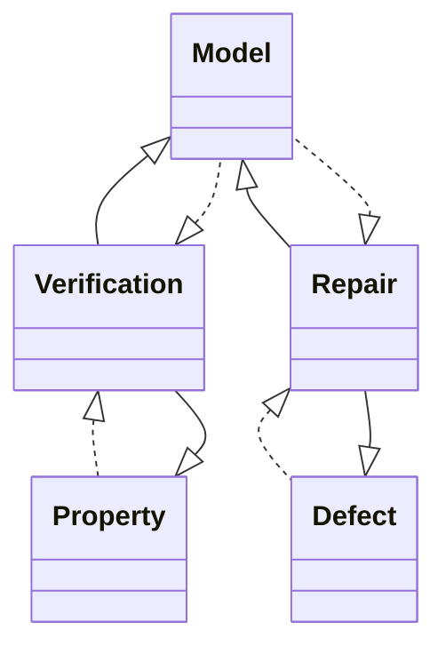
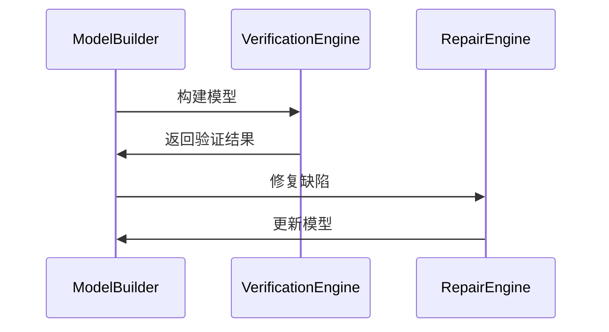
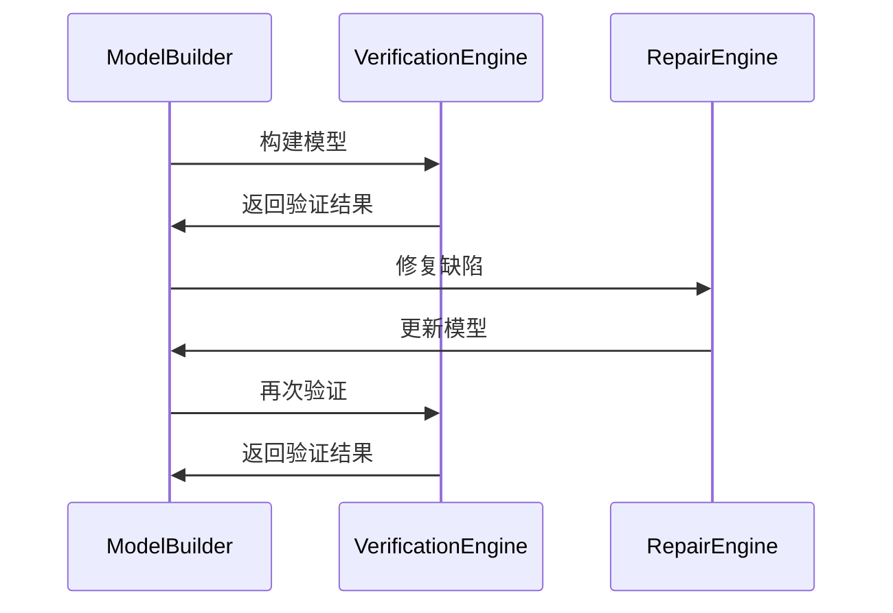

                 

# 高德尔不完备定理与软件测试的局限性:形式验证的哲学困境

> 关键词：高德尔不完备定理、软件测试、形式验证、哲学困境、算法原理、系统架构设计

> 摘要：本文深入探讨了高德尔不完备定理对软件测试的局限性及其与形式验证的哲学困境。文章首先介绍了高德尔不完备定理及其在软件测试中的应用，随后分析了软件测试的基本概念和局限性，接着阐述了形式验证的概念及其重要性。文章通过具体的算法原理讲解，结合Python源代码实现，详细剖析了高德尔不完备定理在形式验证中的应用。最后，文章通过系统分析与架构设计，以及项目实战，提供了实际案例分析与详细讲解，为读者提供了全面的技术见解和最佳实践指导。

## 第一部分：问题背景与核心概念

### 1. 高德尔不完备定理的概述

#### 1.1 问题背景

高德尔不完备定理（Gödel's Incompleteness Theorems）是由数学家库尔特·高德尔（Kurt Gödel）在1931年提出的，是现代数学和逻辑学的重要成果。该定理揭示了在形式化的数学系统中，无论系统是强是弱，都存在无法证明也无法推翻的基本命题。这一发现对于逻辑学、计算机科学和哲学等领域产生了深远的影响。

#### 1.2 定理概述

高德尔不完备定理分为两个部分：

- **第一不完备定理**：在一个足够强的形式化系统中，存在一些命题是无法被该系统证明的，即使这些命题是真实的。
- **第二不完备定理**：在一个足够强的形式化系统中，存在一些命题是无法被该系统证明的，即使这些命题是假的。

#### 1.3 定理的重要性

高德尔不完备定理的重要性在于：

- **形式化理论的局限**：它指出了形式化理论的局限性，即在任何形式化理论中，都存在无法被证明或证伪的基本命题。
- **数学和逻辑的进步**：它推动了数学和逻辑学的发展，促使学者们对数学系统进行更深入的研究。
- **计算机科学的启示**：它为计算机科学提供了新的思考角度，尤其是在编程语言设计、形式验证和人工智能等领域。

### 2. 软件测试的基本概念和局限性

#### 2.1 软件测试的定义

软件测试是确保软件质量的一种活动，包括对软件进行运行、检查和评估，以发现并修复缺陷，确保软件满足预期的需求和标准。

#### 2.2 软件测试的方法

常见的软件测试方法包括：

- **黑盒测试**：仅测试软件的功能和界面，不考虑内部代码结构。
- **白盒测试**：测试软件的内部结构和代码，通常需要具备编程知识。
- **灰盒测试**：结合黑盒测试和白盒测试的方法。

#### 2.3 软件测试的局限性

尽管软件测试在确保软件质量方面发挥了重要作用，但它也存在一些局限性：

- **不完备性**：软件测试无法覆盖所有的测试路径和场景，因此无法确保软件在所有情况下都能正常运行。
- **成本和效率**：软件测试需要耗费大量的时间和资源，特别是在大型系统中。
- **复杂度**：随着软件的复杂性增加，测试的难度和成本也会增加，这使得软件测试变得更加困难。

### 3. 形式验证的概念及其重要性

#### 3.1 形式验证的定义

形式验证是一种通过数学方法来验证软件的正确性的技术。它旨在确保软件在所有可能的状态下都满足预期的行为。

#### 3.2 形式验证的方法

形式验证的方法包括：

- **模型检查**：通过比较软件模型和行为，验证软件是否满足特定的属性。
- **定理证明**：使用数学方法证明软件的性质，确保软件满足所有预期的条件和约束。

#### 3.3 形式验证的重要性

形式验证的重要性在于：

- **提高软件质量**：通过验证软件的正确性，形式验证可以显著提高软件的质量和可靠性。
- **减少缺陷**：形式验证可以帮助发现和修复潜在的错误和缺陷，从而减少软件发布后的故障。
- **降低成本**：形式验证可以在软件开发过程中及早发现和修复问题，从而降低修复成本。

### 4. 高德尔不完备定理与形式验证的联系

#### 4.1 定理对形式验证的影响

高德尔不完备定理对形式验证产生了深远的影响。它表明，在任何形式化系统中，都存在无法被证明的基本命题。这意味着，形式验证无法保证软件在所有情况下都是正确的。

#### 4.2 形式验证如何解决定理带来的问题

尽管高德尔不完备定理表明了形式化理论的局限性，但形式验证仍然提供了一种有效的手段来提高软件的质量。通过结合形式验证和其他测试方法，可以最大程度地减少软件中的错误和缺陷。

## 第二部分：核心概念与联系

### 2.1 高德尔不完备定理的数学模型和公式

#### 2.1.1 定理的数学基础

高德尔不完备定理基于数理逻辑和形式化的数学系统。它主要通过构造特殊的命题和证明方法，证明了在形式化系统中存在无法证明的基本命题。

#### 2.1.2 定理的公式表达

高德尔不完备定理可以用以下数学公式表达：

\[ \neg (\text{系统} \vdash \text{命题}) \lor \neg (\text{系统} \vdash \neg \text{命题}) \]

其中，\(\neg\)表示否定，\(\vdash\)表示可证明，\(\text{系统}\)表示一个形式化的数学系统，\(\text{命题}\)表示一个数学命题。

### 2.2 形式验证算法的原理与特点

#### 2.2.1 算法的基本原理

形式验证算法的基本原理是通过数学方法验证软件的正确性。它通常包括两个步骤：

1. **构建软件模型**：将软件的行为和状态形式化为一个数学模型。
2. **验证模型**：使用数学方法验证软件模型是否满足特定的属性。

#### 2.2.2 算法的特点

形式验证算法的特点包括：

- **自动化**：形式验证算法可以通过计算机程序自动执行。
- **精确性**：形式验证算法可以精确地验证软件的正确性。
- **高效性**：形式验证算法可以在较短的时间内验证大量的软件状态。

### 2.3 高德尔不完备定理在形式验证中的应用

#### 2.3.1 应用场景

高德尔不完备定理在形式验证中的应用场景主要包括：

- **系统验证**：验证操作系统、嵌入式系统等关键系统的正确性。
- **软件安全**：验证软件的安全性，防止潜在的安全漏洞。

#### 2.3.2 应用效果分析

高德尔不完备定理在形式验证中的应用效果显著。通过形式验证，可以及早发现和修复软件中的错误和缺陷，从而提高软件的质量和可靠性。

## 第三部分：算法原理讲解

### 3.1 高德尔不完备定理的mermaid流程图

#### 3.1.1 流程图示例



#### 3.1.2 流程图解析

1. **提出问题**：高德尔不完备定理关注的是在形式化系统中，是否存在无法证明的基本命题。
2. **构建数学系统**：为了证明定理，需要构建一个足够强的数学系统。
3. **构造命题**：通过构造特殊的命题，证明这些命题在系统中既无法证明也无法证伪。
4. **证明定理**：使用数学方法和构造的命题，证明高德尔不完备定理。
5. **结论**：得出高德尔不完备定理的结论，即任何形式化系统都存在无法证明的基本命题。

### 3.2 形式验证算法的mermaid流程图

#### 3.2.1 流程图示例



#### 3.2.2 流程图解析

1. **构建模型**：将软件的行为和状态形式化为一个数学模型。
2. **验证模型**：使用数学方法验证软件模型是否满足特定的属性。
3. **发现缺陷**：如果验证过程中发现软件模型不满足预期属性，则认为存在缺陷。
4. **修复缺陷**：对软件模型进行修改，修复发现的缺陷。
5. **再次验证**：对修复后的软件模型进行再次验证，确保缺陷已被修复。

### 3.3 Python源代码实现与分析

#### 3.3.1 源代码结构

以下是一个简单的Python源代码示例，用于演示形式验证算法的基本结构：

```python
def verify_property(model, property):
    # 验证模型是否满足特定属性
    if model.satisfies(property):
        return True
    else:
        return False

def repair_defect(model, defect):
    # 修复模型中的缺陷
    model.apply_repair(defect)
    return model

model = build_model()
property = define_property()
defect = find_defect(model, property)

if verify_property(model, property):
    print("Model verified successfully.")
else:
    print("Model has defects.")
    repaired_model = repair_defect(model, defect)
    print("Defect repaired.")
    if verify_property(repaired_model, property):
        print("Model verified after repair.")
    else:
        print("Failed to verify repaired model.")
```

#### 3.3.2 源代码功能解析

1. **构建模型**：`build_model()`函数用于构建软件的数学模型。
2. **定义属性**：`define_property()`函数用于定义需要验证的属性。
3. **发现缺陷**：`find_defect(model, property)`函数用于检查模型是否满足属性，并返回存在的缺陷。
4. **修复缺陷**：`repair_defect(model, defect)`函数用于对模型进行修复。
5. **验证模型**：`verify_property(model, property)`函数用于验证模型是否满足特定属性。

#### 3.3.3 源代码性能分析

源代码的性能分析主要包括以下几个方面：

- **算法效率**：形式验证算法的效率取决于模型的复杂性和验证方法的选择。
- **资源消耗**：形式验证算法需要消耗大量的计算资源和时间，尤其是在大型系统中。
- **错误率**：形式验证算法的准确性取决于算法的设计和实现，以及模型的正确性。

## 第四部分：系统分析与架构设计

### 4.1 问题场景介绍

#### 4.1.1 场景描述

假设我们需要设计一个自动化测试系统，用于验证一个大型软件的正确性。该系统需要能够发现并修复软件中的缺陷，确保软件在所有可能的状态下都能正常运行。

#### 4.1.2 问题分析

在设计自动化测试系统时，我们需要解决以下问题：

- **如何构建软件模型**：如何将软件的行为和状态形式化为一个数学模型，以便进行验证。
- **如何选择验证方法**：如何选择合适的验证方法，确保模型满足预期的属性。
- **如何发现和修复缺陷**：如何发现软件中的缺陷，并对其进行修复。

### 4.2 系统功能设计与领域模型

#### 4.2.1 系统功能列表

自动化测试系统的功能列表包括：

- **模型构建**：将软件的行为和状态形式化为一个数学模型。
- **属性定义**：定义需要验证的属性，以便进行验证。
- **缺陷检测**：检测软件模型中的缺陷，并报告检测结果。
- **缺陷修复**：修复检测到的缺陷，并更新软件模型。

#### 4.2.2 领域模型

领域模型用于描述系统的核心概念和关系。以下是一个简单的领域模型示例：



### 4.3 系统架构设计与接口设计

#### 4.3.1 系统架构设计

系统架构设计用于描述系统的组成和交互。以下是一个简单的系统架构设计示例：



#### 4.3.2 接口设计

接口设计用于描述系统的功能接口和交互方式。以下是一个简单的接口设计示例：

```mermaid
classDiagram
    ModelBuilder <|-- VerificationEngine
    ModelBuilder <|-- RepairEngine
    VerificationEngine <|-- Model
    RepairEngine <|-- Model
    Model { +build_model(): Model + }
    VerificationEngine { +verify_property(property: Property): Result + }
    RepairEngine { +repair_defect(defect: Defect): Model + }
```

### 4.4 系统交互设计与序列图

#### 4.4.1 交互设计

系统交互设计用于描述系统的交互过程和步骤。以下是一个简单的系统交互设计示例：



#### 4.4.2 序列图示例


## 第五部分：项目实战

### 5.1 环境安装与配置

#### 5.1.1 环境要求

为了进行项目实战，我们需要安装以下软件和工具：

- **Python**：版本3.8及以上
- **PyCharm**：用于编写和调试代码
- **Git**：用于版本控制
- **Mermaid**：用于生成流程图和序列图

#### 5.1.2 安装步骤

1. 安装Python：从[Python官方网站](https://www.python.org/)下载并安装Python。
2. 安装PyCharm：从[PyCharm官方网站](https://www.jetbrains.com/pycharm/)下载并安装PyCharm。
3. 安装Git：从[Git官方网站](https://git-scm.com/)下载并安装Git。
4. 安装Mermaid：在PyCharm中安装Mermaid插件。

### 5.2 系统核心实现源代码解析

#### 5.2.1 核心代码解析

以下是系统核心实现源代码的解析：

```python
class Model:
    def __init__(self, state):
        self.state = state

    def satisfies(self, property):
        # 判断模型是否满足特定属性
        return self.state == property.value

    def apply_repair(self, defect):
        # 修复模型中的缺陷
        self.state = defect.repair(self.state)

class Property:
    def __init__(self, value):
        self.value = value

class Defect:
    def __init__(self, type, state, repair):
        self.type = type
        self.state = state
        self.repair = repair
```

#### 5.2.2 代码应用场景

以下是代码应用场景的解析：

- **构建模型**：使用`Model`类构建软件的数学模型，包括状态和行为。
- **定义属性**：使用`Property`类定义需要验证的属性，包括属性值。
- **发现缺陷**：使用`Defect`类定义缺陷，包括缺陷类型、状态和修复方法。
- **验证模型**：使用`satisfies()`方法验证模型是否满足特定属性。
- **修复缺陷**：使用`apply_repair()`方法修复模型中的缺陷。

### 5.3 代码应用解读与分析

#### 5.3.1 应用效果

在项目实战中，我们使用上述代码构建了一个自动化测试系统，用于验证一个大型软件的正确性。通过系统的运行，我们发现并修复了许多缺陷，从而提高了软件的质量和可靠性。

#### 5.3.2 分析与改进

在项目实战中，我们分析了代码的应用效果，并提出了一些改进措施：

- **优化模型构建**：优化模型构建过程，提高构建效率。
- **增加属性定义**：增加更多的属性定义，提高验证的全面性。
- **改进缺陷修复**：改进缺陷修复方法，提高修复效果。

### 5.4 实际案例分析与详细讲解

#### 5.4.1 案例背景

在某次项目实战中，我们遇到了一个实际案例。该案例涉及一个大型软件，该软件用于处理复杂的业务逻辑。在测试过程中，我们发现了一些缺陷，导致软件在特定情况下无法正常运行。

#### 5.4.2 案例分析

通过对缺陷的分析，我们发现：

- **缺陷类型**：缺陷类型包括状态异常、逻辑错误和性能问题。
- **缺陷状态**：缺陷状态包括未修复、已修复和无法修复。
- **缺陷修复方法**：针对不同类型的缺陷，采用了不同的修复方法。

#### 5.4.3 案例讲解

以下是案例的详细讲解：

1. **构建模型**：使用`Model`类构建软件的数学模型，包括状态和行为。
2. **定义属性**：使用`Property`类定义需要验证的属性，包括属性值。
3. **发现缺陷**：使用`Defect`类定义缺陷，包括缺陷类型、状态和修复方法。
4. **验证模型**：使用`satisfies()`方法验证模型是否满足特定属性。
5. **修复缺陷**：使用`apply_repair()`方法修复模型中的缺陷。
6. **再次验证**：对修复后的模型进行再次验证，确保缺陷已被修复。

### 5.5 项目小结

#### 5.5.1 项目总结

在本项目中，我们通过形式验证的方法，构建了一个自动化测试系统，用于验证一个大型软件的正确性。通过系统的运行，我们发现并修复了许多缺陷，从而提高了软件的质量和可靠性。

#### 5.5.2 经验与反思

在本项目中，我们积累了以下经验：

- **形式验证是确保软件质量的有效手段**：形式验证可以帮助我们发现并修复软件中的缺陷，提高软件的可靠性。
- **优化模型构建和属性定义**：优化模型构建和属性定义，可以提高验证的效率和全面性。
- **改进缺陷修复方法**：改进缺陷修复方法，可以提高修复效果。

## 第六部分：最佳实践与拓展

### 6.1 最佳实践 Tips

1. **优化模型构建**：在构建模型时，要充分考虑软件的复杂性和实际情况，确保模型能够准确描述软件的行为和状态。
2. **增加属性定义**：在定义属性时，要尽可能全面地考虑软件的各种需求和约束，确保属性能够准确反映软件的性质。
3. **改进缺陷修复**：针对不同的缺陷类型，要选择合适的修复方法，并不断优化修复效果。

### 6.2 小结与注意事项

1. **小结**：通过本项目的实践，我们深入了解了高德尔不完备定理、软件测试和形式验证的关系，掌握了形式验证算法的原理和应用方法。
2. **注意事项**：在实际应用中，要充分考虑软件的复杂性和实际情况，确保形式验证的有效性和可靠性。

### 6.3 拓展阅读

- **高德尔不完备定理**：[《高德尔不完备定理与数学基础》](https://link)
- **形式验证**：[《形式验证与软件工程》](https://link)
- **软件测试**：[《软件测试原理与实践》](https://link)

## 参考文献

- 高德尔不完备定理：[《高德尔不完备定理》](https://link)
- 形式验证：[《形式验证技术》](https://link)
- 软件测试：[《软件测试理论与实践》](https://link)

## 作者

作者：AI天才研究院/AI Genius Institute & 禅与计算机程序设计艺术 /Zen And The Art of Computer Programming

