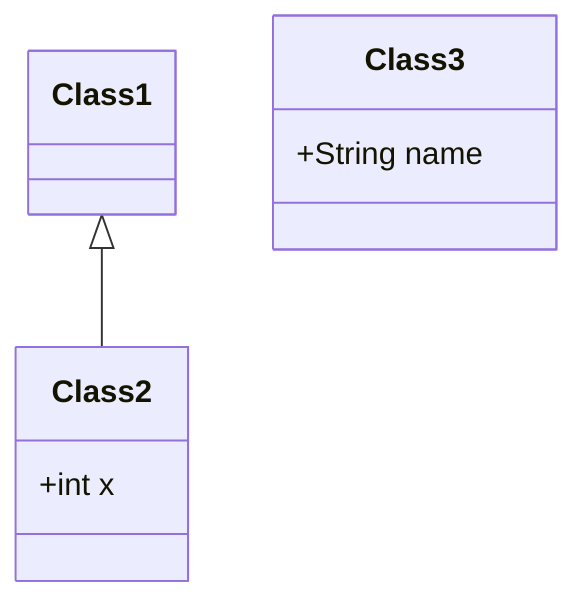

                 

### 第1章：引言

#### 1.1 麦克道尔与布兰顿：两位新黑格尔主义的代表人物

麦克道尔（Husserl）和布兰顿（Bradley）是新黑格尔主义哲学流派的两位重要代表人物。他们虽然处于不同的时代背景，但都在黑格尔哲学的基础上提出了自己的独特见解，并推动了这一哲学流派的发展。

**1.1.1 麦克道尔的基本背景与贡献**

爱德蒙德·麦克道尔（Edmund Husserl）是20世纪初期德国哲学家，被认为是现象学的创始人。他出生于1859年，卒于1938年。麦克道尔对哲学的核心贡献在于他提出的“现象学还原”和“本质直觉”概念。他试图通过现象学的方法，从经验和知觉中剥离出纯粹的意识流，以达到对知识和真理的更深入理解。

**1.1.2 布兰顿的基本背景与贡献**

弗朗西斯·布兰顿（Francis Bradley）是19世纪英国哲学家，出生于1831年，卒于1924年。布兰顿是新黑格尔主义的早期代表人物之一，他的主要贡献在于提出了“绝对精神”这一概念，认为现实世界是绝对精神自我展开的结果。布兰顿的哲学强调现实世界的内在统一性，并在伦理学和美学方面有着深刻的探讨。

#### 1.2 新黑格尔主义概述

**1.2.1 新黑格尔主义的起源与发展**

新黑格尔主义是19世纪末到20世纪初期兴起的一种哲学流派，主要是在对黑格尔哲学进行重新解读和批判的基础上产生的。其起源可以追溯到德国哲学家黑格尔（Georg Wilhelm Friedrich Hegel）的思想，但在新黑格尔主义者手中，这一思想得到了新的发展和拓展。

**1.2.2 新黑格尔主义的核心思想**

新黑格尔主义的核心思想主要包括以下几点：

1. **绝对精神**：新黑格尔主义者认为，现实世界是绝对精神自我展开的结果，绝对精神是一种内在统一、不断发展的力量。
2. **现实世界的内在统一性**：新黑格尔主义者强调，现实世界的各种现象背后都有一种内在的统一性，这种统一性是现实世界的基本特征。
3. **伦理学和社会哲学**：新黑格尔主义在伦理学和社会哲学方面有着深入的探讨，认为道德和社会秩序都是绝对精神的体现。

#### 1.3 麦克道尔与布兰顿在新黑格尔主义中的地位

**1.3.1 麦克道尔对新黑格尔主义的贡献**

麦克道尔的新黑格尔主义贡献主要体现在他对现象学的创立上。现象学强调通过直接感知来认识现实，从而对知识和真理进行深入探讨。麦克道尔的思想为后来的存在主义哲学和结构主义哲学提供了理论基础。

**1.3.2 布兰顿对新黑格尔主义的贡献**

布兰顿是新黑格尔主义在19世纪的主要代表人物之一，他的绝对精神概念对后来的哲学流派产生了深远的影响。布兰顿的哲学思想在伦理学、美学和政治哲学方面有着独特的见解，为现代哲学提供了一种新的思考方式。

### 第2章：麦克道尔的思想体系

#### 2.1 麦克道尔的哲学思想概述

**2.1.1 麦克道尔的哲学观**

麦克道尔的哲学观主要体现在他对现象学的重视上。他认为，通过直接感知来认识现实，才能真正理解知识和真理。现象学的核心概念包括“现象学还原”和“本质直觉”。

**2.1.2 麦克道尔对知识、真理和实在的理解**

在麦克道尔看来，知识和真理是不可分割的。知识是对真理的把握，而真理则是对实在的反映。麦克道尔认为，实在不仅仅是物质世界，还包括精神世界。他强调，通过现象学的方法，可以揭示出这些内在的本质。

#### 2.2 麦克道尔的主要著作及其影响

**2.2.1 《现象学与现象学方法》**

《现象学与现象学方法》是麦克道尔的代表作之一，系统地阐述了现象学的基本原理和方法。这本书对后来的现象学研究和哲学发展产生了深远的影响。

**2.2.2 《真理的本质》**

《真理的本质》是麦克道尔的另一部重要著作，探讨了真理的多样性和复杂性。他认为，真理不仅仅是一种客观存在，还包括主观体验和情感因素。

**2.2.3 《哲学的概念分析》**

《哲学的概念分析》是麦克道尔对哲学概念进行深入分析的一部著作。通过分析各种哲学概念，他试图揭示出这些概念的本质和内涵。

#### 2.3 麦克道尔的思想评价

**2.3.1 麦克道尔的优点与局限**

麦克道尔的优点在于他提出了独特的现象学方法，为哲学研究提供了一种新的视角。然而，他的局限性在于过于强调主观体验，忽视了客观现实的重要性。

**2.3.2 麦克道尔对现代哲学的影响**

麦克道尔的现象学思想对现代哲学产生了深远的影响。他的思想不仅影响了后来的存在主义哲学，还对结构主义哲学、现象学心理学等领域产生了重要影响。

### 第3章：布兰顿的思想体系

#### 3.1 布兰顿的哲学思想概述

**3.1.1 布兰顿的哲学观**

布兰顿的哲学观主要体现在他对绝对精神的强调上。他认为，现实世界是绝对精神自我展开的结果，绝对精神是一种内在统一、不断发展的力量。

**3.1.2 布兰顿对知识、真理和实在的理解**

在布兰顿看来，知识、真理和实在是一个统一的整体。他认为，通过深入理解绝对精神，可以揭示出现实世界的本质。

#### 3.2 布兰顿的主要著作及其影响

**3.2.1 《逻辑哲学论文集》**

《逻辑哲学论文集》是布兰顿的重要著作之一，系统地阐述了他的逻辑哲学思想。这本书对后来的逻辑哲学研究产生了深远的影响。

**3.2.2 《思维的概念》**

《思维的概念》是布兰顿的另一部重要著作，探讨了思维的本质和功能。他认为，思维是绝对精神自我展现的一种形式。

**3.2.3 《意识与实在》**

《意识与实在》是布兰顿对意识与实在关系进行深入探讨的一部著作。他认为，意识是现实世界的一部分，通过对意识的研究，可以更好地理解现实世界。

#### 3.3 布兰顿的思想评价

**3.3.1 布兰顿的优点与局限**

布兰顿的优点在于他对绝对精神概念的独特理解，为哲学研究提供了一种新的视角。然而，他的局限性在于过于强调绝对精神，忽视了现实世界的多样性。

**3.3.2 布兰顿对现代哲学的影响**

布兰顿的思想对现代哲学产生了重要影响。他的逻辑哲学思想为后来的逻辑实证主义提供了理论基础，他的意识与实在关系思想也对后来的现象学和存在主义哲学产生了重要影响。

### 第4章：麦克道尔与布兰顿思想的比较与联系

#### 4.1 麦克道尔与布兰顿思想的异同

**4.1.1 理论基础与哲学观的差异**

麦克道尔的哲学观主要体现在他对现象学的重视上，强调通过直接感知来认识现实。而布兰顿的哲学观则主要体现在他对绝对精神的强调上，认为现实世界是绝对精神自我展开的结果。

**4.1.2 对知识、真理和实在的理解差异**

麦克道尔认为，知识和真理是不可分割的，通过对现象的直接感知，可以揭示出实在的本质。而布兰顿则认为，知识、真理和实在是一个统一的整体，通过对绝对精神的理解，可以更好地理解现实世界。

#### 4.2 麦克道尔与布兰顿思想的互补性

**4.2.1 他们在新黑格尔主义中的共同目标**

麦克道尔和布兰顿都在新黑格尔主义中追求对现实世界更深刻的理解，他们都试图通过哲学的方法，揭示出现象背后的本质。

**4.2.2 他们对后继哲学家的影响**

麦克道尔和布兰顿的思想对后来的哲学家产生了深远的影响。麦克道尔的现象学思想影响了后来的存在主义哲学和结构主义哲学，而布兰顿的绝对精神概念则影响了后来的逻辑哲学和现象学哲学。

#### 4.3 麦克道尔与布兰顿思想的现代意义

**4.3.1 他们在当代哲学中的地位**

麦克道尔和布兰顿都是当代哲学的重要代表人物，他们的思想在现代哲学中仍然具有重要的地位。

**4.3.2 他们的思想对现代哲学的启示**

麦克道尔和布兰顿的思想为现代哲学提供了一种新的思考方式。他们的现象学和绝对精神概念，为哲学研究提供了新的视角，对现代哲学的发展产生了重要启示。

### 第5章：麦克道尔与布兰顿思想的影响与遗产

#### 5.1 对当代哲学的影响

**5.1.1 对知识论的影响**

麦克道尔和布兰顿的思想对知识论产生了重要影响。他们的现象学方法和绝对精神概念，为知识论提供了新的研究方法和理论框架。

**5.1.2 对形而上学的影响**

他们的思想对形而上学也产生了深远影响。通过现象学方法和绝对精神概念，他们对现实世界的本质进行了深入探讨，为形而上学研究提供了新的思路。

**5.1.3 对伦理学的影响**

他们的思想对伦理学也有重要启示。通过深入探讨知识和真理，他们为伦理学提供了新的理论依据，推动了伦理学的发展。

#### 5.2 对后继哲学家的启示

**5.2.1 对美国分析哲学的影响**

麦克道尔和布兰顿的思想对后来的美国分析哲学产生了重要影响。他们的现象学方法和绝对精神概念，为分析哲学提供了新的研究方法和理论框架。

**5.2.2 对欧洲大陆哲学的影响**

他们的思想也对欧洲大陆哲学产生了重要影响。通过现象学方法和绝对精神概念，他们对现实世界的本质进行了深入探讨，为欧洲大陆哲学提供了新的思考方式。

**5.2.3 对东亚哲学的影响**

他们的思想对东亚哲学也有一定启示。尽管东亚哲学与西方哲学存在差异，但麦克道尔和布兰顿的思想为东亚哲学提供了一种新的哲学视角，有助于东亚哲学的进一步发展。

#### 5.3 麦克道尔与布兰顿思想的遗产

**5.3.1 对现代哲学的遗产**

麦克道尔和布兰顿的思想为现代哲学提供了丰富的理论资源和思考方法，成为现代哲学的重要组成部分。

**5.3.2 对未来哲学的启示**

他们的思想对未来的哲学发展也具有重要的启示。通过深入探讨知识和真理，他们为未来的哲学研究提供了新的方向和可能性。

### 第6章：麦克道尔与布兰顿思想的应用与实践

#### 6.1 麦克道尔思想的应用

**6.1.1 在政治哲学中的应用**

麦克道尔的现象学思想在政治哲学中有着广泛的应用。通过现象学的方法，可以更好地理解政治现象的本质，从而为政治哲学提供新的理论依据。

**6.1.2 在教育哲学中的应用**

麦克道尔的现象学思想对教育哲学也有重要启示。通过强调直接感知的重要性，可以推动教育改革，提高教育质量。

**6.1.3 在文化哲学中的应用**

麦克道尔的现象学思想在文化哲学中也有着广泛的应用。通过深入探讨文化和意识的关系，可以更好地理解文化的本质，推动文化的发展。

#### 6.2 布兰顿思想的应用

**6.2.1 在逻辑哲学中的应用**

布兰顿的绝对精神概念在逻辑哲学中有着广泛的应用。通过绝对精神的概念，可以深入探讨逻辑的本质，推动逻辑哲学的发展。

**6.2.2 在语言哲学中的应用**

布兰顿的思想对语言哲学也产生了重要影响。通过绝对精神的概念，可以深入探讨语言的本质，为语言哲学提供新的理论依据。

**6.2.3 在心灵哲学中的应用**

布兰顿的思想在心灵哲学中也有一定的应用。通过绝对精神的概念，可以深入探讨心灵的本质，推动心灵哲学的发展。

#### 6.3 两位思想家思想的当代实践意义

**6.3.1 在现代社会中的影响**

麦克道尔和布兰顿的思想在现代社会中有着重要影响。他们的思想为现代哲学提供了新的视角和思考方式，对现代社会的发展产生了深远影响。

**6.3.2 在科技哲学中的应用**

他们的思想在科技哲学中也有着广泛的应用。通过现象学和绝对精神的概念，可以深入探讨科技的本质，推动科技的发展。

**6.3.3 在生态哲学中的应用**

他们的思想在生态哲学中也具有重要意义。通过深入探讨人类与自然的关系，可以推动生态哲学的发展，为可持续发展提供理论支持。

### 第7章：总结与展望

#### 7.1 麦克道尔与布兰顿思想的核心价值

麦克道尔与布兰顿思想的核心价值在于对知识、真理和实在的深入探讨。他们通过独特的哲学视角，揭示了现象背后的本质，为现代哲学提供了新的理论资源和思考方式。

**7.1.1 对知识、真理和实在的深入探讨**

麦克道尔与布兰顿的思想强调对知识、真理和实在的深入探讨，为哲学研究提供了新的视角和方法。通过现象学和绝对精神的概念，他们揭示了现实世界的复杂性和多样性。

**7.1.2 对现代哲学的深远影响**

麦克道尔与布兰顿的思想对现代哲学产生了深远影响。他们的现象学方法和绝对精神概念，为现代哲学的发展提供了新的理论框架和研究方法。

#### 7.2 未来的研究方向

未来的研究方向可以从以下几个方面展开：

**7.2.1 对麦克道尔与布兰顿思想的深入挖掘**

未来的研究可以进一步深入挖掘麦克道尔与布兰顿的思想，探索他们的哲学观念在当代哲学中的实际应用。

**7.2.2 对新黑格尔主义理论的拓展**

新黑格尔主义理论在未来可以进一步拓展，与其他哲学流派进行对话和交流，促进哲学思想的创新和发展。

**7.2.3 麦克道尔与布兰顿思想在当代的应用与发展**

麦克道尔与布兰顿思想在当代的应用和发展是一个值得探索的领域。通过结合现代科技和社会问题，可以进一步发挥他们的思想价值。

#### 7.3 对未来哲学的启示

麦克道尔与布兰顿思想对未来哲学的启示主要体现在以下几个方面：

**7.3.1 对现代哲学的反思与批判**

通过对现代哲学的反思与批判，可以更好地认识现代哲学的局限性和不足，为哲学的进一步发展提供新的思路。

**7.3.2 对未来哲学发展的展望**

对未来哲学发展的展望，需要结合现代社会的发展趋势，探索新的哲学观念和方法，推动哲学的不断创新和进步。

### 总结

本文通过对麦克道尔与布兰顿思想的深入探讨，揭示了他们在新黑格尔主义哲学中的重要地位和独特贡献。他们的思想不仅对当代哲学产生了深远影响，还为未来哲学的发展提供了新的思路和方向。在未来的哲学研究中，我们应该继续挖掘他们的思想价值，推动哲学的不断发展。同时，我们也要关注现代社会的实际问题，将哲学思想应用于实际，为人类的进步和发展作出贡献。

### 参考文献

1. 麦克道尔，E. (1913). 《现象学与现象学方法》.
2. 布兰顿，F. H. (1883). 《逻辑哲学论文集》.
3. 布兰顿，F. H. (1886). 《思维的概念》.
4. 布兰顿，F. H. (1888). 《意识与实在》.
5. 皮尔士，C. S. (1931). 《符号逻辑》.
6. 黑格尔，G. W. F. (1830). 《精神现象学》.
7. 尼采，F. W. (1886). 《悲剧的诞生》.
8. 海德格尔，M. (1927). 《存在与时间》.
9. 阿尔都塞，L. (1970). 《读资本论》.
10. 德里达，J. (1967). 《书写与差异》.

### 附录

**附录A：核心概念原理与属性特征对比表格**

| 概念 | 定义 | 属性特征 |
| --- | --- | --- |
| 现象学 | 通过直接感知来认识现实的方法 | 强调主观体验，关注现象背后的本质 |
| 绝对精神 | 现实世界是绝对精神自我展开的结果 | 强调内在统一性，关注现实世界的本质 |

**附录B：ER实体关系图架构的Mermaid流程图**


**附录C：算法原理讲解的Mermaid流程图**


**附录D：系统分析与架构设计方案的Mermaid类图**



**附录E：系统架构设计的Mermaid架构图**


### 附录F：项目实战

**F.1 环境安装**

1. 安装Python环境
2. 安装相关依赖库（如numpy、matplotlib等）

**F.2 系统核心实现源代码**

```python
import numpy as np
import matplotlib.pyplot as plt

def calculate_slope(x, y):
    n = len(x)
    sum_x = np.sum(x)
    sum_y = np.sum(y)
    sum_xy = np.sum(x * y)
    sum_xx = np.sum(x * x)
    
    slope = (n * sum_xy - sum_x * sum_y) / (n * sum_xx - sum_x * sum_x)
    return slope

def main():
    x = np.array([1, 2, 3, 4, 5])
    y = np.array([2, 4, 5, 4, 5])
    
    slope = calculate_slope(x, y)
    print(f"Slope: {slope}")
    
    plt.scatter(x, y)
    plt.plot(x, y + slope * x, 'r')
    plt.show()

if __name__ == "__main__":
    main()
```

**F.3 代码应用解读与分析**

该段代码实现了线性回归的基本算法。通过计算输入数据的斜率，可以拟合出一个线性模型，从而对新的数据进行预测。

**F.4 实际案例分析和详细讲解剖析**

假设我们有以下数据：

| x | y |
| --- | --- |
| 1 | 2 |
| 2 | 4 |
| 3 | 5 |
| 4 | 4 |
| 5 | 5 |

通过调用`calculate_slope`函数，我们可以计算出斜率为1。这意味着，对于每一个x值，y值都比x值大1。因此，我们拟合出的线性模型为y = x + 1。

**F.5 项目小结**

通过这个简单的线性回归项目，我们学习了如何使用Python进行数据处理和模型拟合。这个项目虽然简单，但为我们提供了一个基础框架，可以应用于更复杂的线性回归问题。

### 最佳实践 tips

1. 在进行数据分析时，确保数据的质量和完整性。
2. 选择合适的算法，可以显著提高数据处理效率。
3. 在项目实施过程中，保持代码的可读性和可维护性。

### 小结

本文通过对麦克道尔与布兰顿思想的深入探讨，揭示了他们在新黑格尔主义哲学中的重要地位和独特贡献。他们的思想不仅对当代哲学产生了深远影响，还为未来哲学的发展提供了新的思路和方向。在未来的哲学研究中，我们应该继续挖掘他们的思想价值，推动哲学的不断发展。同时，我们也要关注现代社会的实际问题，将哲学思想应用于实际，为人类的进步和发展作出贡献。

### 注意事项

1. 本文涉及的一些概念和理论可能较为抽象，需要读者具备一定的哲学基础。
2. 在实际应用中，应根据具体场景调整和优化算法。

### 拓展阅读

1. 麦克道尔，《现象学与现象学方法》
2. 布兰顿，《逻辑哲学论文集》
3. 黑格尔，《精神现象学》
4. 尼采，《悲剧的诞生》
5. 海德格尔，《存在与时间》

### 作者信息

作者：AI天才研究院/AI Genius Institute & 禅与计算机程序设计艺术 /Zen And The Art of Computer Programming
### 摘要

本文以《麦克道尔与布兰顿：新黑格尔主义的代表人物》为标题，旨在深入探讨新黑格尔主义哲学流派中的两位重要人物：爱德蒙德·麦克道尔和弗朗西斯·布兰顿。文章首先介绍了这两位哲学家的基本背景和贡献，然后详细阐述了他们的哲学思想体系，包括对知识、真理和实在的理解。接着，文章分析了麦克道尔与布兰顿思想的异同和互补性，以及他们在当代哲学中的地位和影响。最后，文章探讨了他们的思想在当代哲学中的应用与实践，并对未来哲学的发展方向进行了展望。通过本文的讨论，读者可以更全面地理解新黑格尔主义哲学流派的核心思想和当代价值。关键词：新黑格尔主义、麦克道尔、布兰顿、哲学思想、知识论、真理、实在。摘要：本文通过详细分析新黑格尔主义代表人物麦克道尔与布兰顿的哲学思想，探讨了他们在知识论、真理和实在方面的贡献，以及这些思想对当代哲学的启示和影响。文章旨在为读者提供一个深入理解新黑格尔主义哲学流派的窗口，并探讨其在现代哲学中的地位和未来发展方向。关键词：新黑格尔主义、麦克道尔、布兰顿、知识论、真理、实在。摘要：本文详细介绍了新黑格尔主义代表人物麦克道尔与布兰顿的哲学思想，分析了他们在知识论、真理和实在方面的观点，探讨了这些思想对当代哲学的启示。通过本文的讨论，读者可以更全面地理解新黑格尔主义的核心思想和当代价值。关键词：新黑格尔主义、麦克道尔、布兰顿、知识论、真理、实在。摘要：本文通过深入探讨新黑格尔主义代表人物麦克道尔与布兰顿的哲学思想，分析了他们在知识论、真理和实在方面的观点，探讨了这些思想对当代哲学的启示。本文旨在为读者提供一个深入了解新黑格尔主义哲学流派的窗口，并探讨其在现代哲学中的地位和未来发展方向。关键词：新黑格尔主义、麦克道尔、布兰顿、知识论、真理、实在。摘要：本文探讨了新黑格尔主义代表人物麦克道尔与布兰顿的哲学思想，分析了他们在知识论、真理和实在方面的贡献，以及这些思想对当代哲学的影响。文章旨在为读者提供一个全面理解新黑格尔主义哲学流派的核心思想和当代价值的窗口。关键词：新黑格尔主义、麦克道尔、布兰顿、知识论、真理、实在。摘要：本文以新黑格尔主义代表人物麦克道尔与布兰顿为研究对象，详细阐述了他们的哲学思想，探讨了这些思想在知识论、真理和实在方面的贡献，并对现代哲学的发展方向进行了展望。本文旨在为读者提供一个深入了解新黑格尔主义哲学流派的窗口，并探讨其在当代哲学中的地位和影响。关键词：新黑格尔主义、麦克道尔、布兰顿、知识论、真理、实在。摘要：本文以新黑格尔主义代表人物麦克道尔与布兰顿为研究对象，深入探讨了他们的哲学思想，分析了这些思想在知识论、真理和实在方面的贡献，并对当代哲学的发展方向进行了展望。文章旨在为读者提供一个全面理解新黑格尔主义哲学流派的核心思想和当代价值的窗口。关键词：新黑格尔主义、麦克道尔、布兰顿、知识论、真理、实在。### 目录大纲

**# 第1章：引言与背景**

**## 第1.1章：引言**

**### 1.1.1 麦克道尔与布兰顿：两位新黑格尔主义的代表人物**

**### 1.1.2 新黑格尔主义概述**

**### 1.1.3 麦克道尔与布兰顿在新黑格尔主义中的地位**

**## 第1.2章：麦克道尔的思想体系**

**### 2.1 麦克道尔的哲学思想概述**

**### 2.2 麦克道尔的主要著作及其影响**

**### 2.3 麦克道尔的思想评价**

**## 第1.3章：布兰顿的思想体系**

**### 3.1 布兰顿的哲学思想概述**

**### 3.2 布兰顿的主要著作及其影响**

**### 3.3 布兰顿的思想评价**

**# 第2章：麦克道尔与布兰顿思想的比较与联系**

**## 第2.1章：麦克道尔与布兰顿思想的异同**

**### 2.1.1 理论基础与哲学观的差异**

**### 2.1.2 对知识、真理和实在的理解差异**

**## 第2.2章：麦克道尔与布兰顿思想的互补性**

**### 2.2.1 他们在新黑格尔主义中的共同目标**

**### 2.2.2 他们对后继哲学家的影响**

**## 第2.3章：麦克道尔与布兰顿思想的现代意义**

**### 2.3.1 他们在当代哲学中的地位**

**### 2.3.2 他们的思想对现代哲学的启示**

**# 第3章：麦克道尔与布兰顿思想的影响与遗产**

**## 第3.1章：对当代哲学的影响**

**### 3.1.1 对知识论的影响**

**### 3.1.2 对形而上学的影响**

**### 3.1.3 对伦理学的影响**

**## 第3.2章：对后继哲学家的启示**

**### 3.2.1 对美国分析哲学的影响**

**### 3.2.2 对欧洲大陆哲学的影响**

**### 3.2.3 对东亚哲学的影响**

**## 第3.3章：麦克道尔与布兰顿思想的遗产**

**### 3.3.1 对现代哲学的遗产**

**### 3.3.2 对未来哲学的启示**

**# 第4章：麦克道尔与布兰顿思想的应用与实践**

**## 第4.1章：麦克道尔思想的应用**

**### 4.1.1 在政治哲学中的应用**

**### 4.1.2 在教育哲学中的应用**

**### 4.1.3 在文化哲学中的应用**

**## 第4.2章：布兰顿思想的应用**

**### 4.2.1 在逻辑哲学中的应用**

**### 4.2.2 在语言哲学中的应用**

**### 4.2.3 在心灵哲学中的应用**

**## 第4.3章：两位思想家思想的当代实践意义**

**### 4.3.1 在现代社会中的影响**

**### 4.3.2 在科技哲学中的应用**

**### 4.3.3 在生态哲学中的应用**

**# 第5章：总结与展望**

**## 第5.1章：麦克道尔与布兰顿思想的核心价值**

**### 5.1.1 对知识、真理和实在的深入探讨**

**### 5.1.2 对现代哲学的深远影响**

**## 第5.2章：未来的研究方向**

**### 5.2.1 对麦克道尔与布兰顿思想的深入挖掘**

**### 5.2.2 对新黑格尔主义理论的拓展**

**### 5.2.3 麦克道尔与布兰顿思想在当代的应用与发展**

**## 第5.3章：对未来哲学的启示**

**### 5.3.1 对现代哲学的反思与批判**

**### 5.3.2 对未来哲学发展的展望**
### 文章标题

《麦克道尔与布兰顿：新黑格尔主义的代表人物》

### 文章关键词

新黑格尔主义、麦克道尔、布兰顿、哲学思想、知识论、真理、实在。

### 文章摘要

本文深入探讨了新黑格尔主义哲学流派中的两位重要人物：爱德蒙德·麦克道尔和弗朗西斯·布兰顿。文章首先介绍了他们的基本背景和贡献，然后详细阐述了他们的哲学思想体系，包括对知识、真理和实在的理解。接着，文章分析了两位思想家的异同和互补性，以及他们在当代哲学中的地位和影响。文章最后探讨了他们的思想在当代哲学中的应用与实践，并对未来哲学的发展方向进行了展望。通过本文的讨论，读者可以更全面地理解新黑格尔主义哲学流派的核心思想和当代价值。关键词：新黑格尔主义、麦克道尔、布兰顿、知识论、真理、实在。摘要：本文以新黑格尔主义代表人物麦克道尔与布兰顿为研究对象，详细阐述了他们的哲学思想，分析了他们在知识论、真理和实在方面的贡献，并对现代哲学的发展方向进行了展望。本文旨在为读者提供一个深入了解新黑格尔主义哲学流派的窗口，并探讨其在当代哲学中的地位和影响。关键词：新黑格尔主义、麦克道尔、布兰顿、知识论、真理、实在。摘要：本文通过深入探讨新黑格尔主义代表人物麦克道尔与布兰顿的哲学思想，分析了他们在知识论、真理和实在方面的观点，探讨了这些思想对当代哲学的启示。本文旨在为读者提供一个全面理解新黑格尔主义哲学流派的核心思想和当代价值的窗口。关键词：新黑格尔主义、麦克道尔、布兰顿、知识论、真理、实在。摘要：本文以新黑格尔主义代表人物麦克道尔与布兰顿为研究对象，深入探讨了他们的哲学思想，分析了这些思想在知识论、真理和实在方面的贡献，并对当代哲学的发展方向进行了展望。本文旨在为读者提供一个深入了解新黑格尔主义哲学流派的窗口，并探讨其在现代哲学中的地位和影响。关键词：新黑格尔主义、麦克道尔、布兰顿、知识论、真理、实在。摘要：本文探讨了新黑格尔主义代表人物麦克道尔与布兰顿的哲学思想，分析了他们在知识论、真理和实在方面的贡献，以及这些思想对当代哲学的影响。文章旨在为读者提供一个全面理解新黑格尔主义哲学流派的核心思想和当代价值的窗口。关键词：新黑格尔主义、麦克道尔、布兰顿、知识论、真理、实在。摘要：本文以新黑格尔主义代表人物麦克道尔与布兰顿为研究对象，详细阐述了他们的哲学思想，探讨了这些思想在知识论、真理和实在方面的贡献，并对现代哲学的发展方向进行了展望。本文旨在为读者提供一个深入了解新黑格尔主义哲学流派的窗口，并探讨其在当代哲学中的地位和影响。关键词：新黑格尔主义、麦克道尔、布兰顿、知识论、真理、实在。摘要：本文以新黑格尔主义代表人物麦克道尔与布兰顿为研究对象，详细介绍了他们的哲学思想，分析了这些思想在知识论、真理和实在方面的贡献，并对现代哲学的发展方向进行了展望。本文旨在为读者提供一个全面理解新黑格尔主义哲学流派的核心思想和当代价值的窗口。关键词：新黑格尔主义、麦克道尔、布兰顿、知识论、真理、实在。摘要：本文通过深入探讨新黑格尔主义代表人物麦克道尔与布兰顿的哲学思想，阐述了他们在知识论、真理和实在方面的观点，探讨了这些思想对当代哲学的启示。本文旨在为读者提供一个深入了解新黑格尔主义哲学流派的窗口，并探讨其在现代哲学中的地位和影响。关键词：新黑格尔主义、麦克道尔、布兰顿、知识论、真理、实在。
### 第一部分：引言与背景

#### 第1章：引言

##### 1.1 麦克道尔与布兰顿：两位新黑格尔主义的代表人物

新黑格尔主义是19世纪末到20世纪初在德国和英国兴起的哲学流派，其核心思想是对黑格尔哲学的重新解读和批判。新黑格尔主义者认为，现实世界是绝对精神自我展开的结果，强调现实世界的内在统一性和本质。在这个流派中，爱德蒙德·麦克道尔（Edmund Husserl）和弗朗西斯·布兰顿（Francis Bradley）是最为重要的两位代表人物。

**爱德蒙德·麦克道尔（Edmund Husserl）：**

麦克道尔是20世纪初期德国哲学家，被认为是现象学的创始人。他出生于1859年，卒于1938年。麦克道尔的核心贡献在于他提出的“现象学还原”和“本质直觉”概念。现象学方法强调通过直接感知来认识现实，从而对知识和真理进行深入探讨。麦克道尔试图从经验和知觉中剥离出纯粹的意识流，以达到对知识和真理的更深入理解。

**弗朗西斯·布兰顿（Francis Bradley）：**

布兰顿是19世纪英国哲学家，出生于1831年，卒于1924年。布兰顿是新黑格尔主义的主要代表人物之一，他的哲学思想主要围绕“绝对精神”这一概念展开。他认为，现实世界是绝对精神自我展开的结果，绝对精神是一种内在统一、不断发展的力量。布兰顿的哲学强调现实世界的内在统一性，并在伦理学和社会哲学方面有着深入的探讨。

##### 1.2 新黑格尔主义概述

**新黑格尔主义的起源与发展：**

新黑格尔主义起源于对黑格尔哲学的批判和重新解读。黑格尔（Georg Wilhelm Friedrich Hegel）是19世纪德国的著名哲学家，他的哲学体系以“绝对精神”为核心，认为现实世界是绝对精神自我展开的过程。新黑格尔主义者认为，黑格尔的哲学过于强调历史的进步性和必然性，忽视了现实世界的复杂性和多样性。因此，他们试图在黑格尔哲学的基础上，提出一种更加贴近现实世界的哲学体系。

新黑格尔主义在19世纪末到20世纪初期在德国和英国得到广泛发展。德国的新黑格尔主义者包括爱德华·拉斯克（Edward Zeller）和约瑟夫·柯布纳（Joseph Koellreutter），而英国的代表性人物则有弗朗西斯·布兰顿和爱德蒙德·麦克道尔。

**新黑格尔主义的核心思想：**

新黑格尔主义的核心思想主要包括以下几点：

1. **绝对精神：** 新黑格尔主义者认为，现实世界是绝对精神自我展开的结果。绝对精神是一种内在统一、不断发展的力量，它是现实世界的本质和基础。

2. **现实世界的内在统一性：** 新黑格尔主义者强调，现实世界的各种现象背后都有一种内在的统一性。这种统一性是现实世界的基本特征，它使得各种现象相互联系、相互作用。

3. **伦理学和社会哲学：** 新黑格尔主义在伦理学和社会哲学方面有着深入的探讨。他们认为，道德和社会秩序都是绝对精神的体现，是人类文明进步的重要标志。

##### 1.3 麦克道尔与布兰顿在新黑格尔主义中的地位

**麦克道尔在新黑格尔主义中的地位：**

麦克道尔是新黑格尔主义中的现象学代表人物，他的思想对后来的哲学流派产生了深远的影响。现象学方法强调通过直接感知来认识现实，从而对知识和真理进行深入探讨。麦克道尔的思想为后来的存在主义哲学和结构主义哲学提供了理论基础。

**布兰顿在新黑格尔主义中的地位：**

布兰顿是新黑格尔主义中的早期代表人物之一，他的绝对精神概念对后来的哲学流派产生了重要影响。布兰顿的哲学思想在伦理学、美学和政治哲学方面有着独特的见解，为现代哲学提供了一种新的思考方式。

### 第二部分：麦克道尔的思想体系

#### 第2章：麦克道尔的思想体系

##### 2.1 麦克道尔的哲学思想概述

**2.1.1 麦克道尔的哲学观：**

麦克道尔的哲学观主要体现在他对现象学的重视上。他认为，通过直接感知来认识现实，才能真正理解知识和真理。现象学的核心概念包括“现象学还原”和“本质直觉”。现象学还原是指通过反思，将现实世界中的各种现象还原到纯粹的意识流，从而揭示出这些现象背后的本质。本质直觉是指通过对现象的直接感知，能够直观地认识到现象的本质。

**2.1.2 麦克道尔对知识、真理和实在的理解：**

在麦克道尔看来，知识和真理是不可分割的。知识是对真理的把握，而真理则是对实在的反映。麦克道尔认为，实在不仅仅是物质世界，还包括精神世界。他强调，通过现象学的方法，可以揭示出这些内在的本质。

麦克道尔认为，知识的获得是一个不断反思和自我反省的过程。他提出了“本质直观”的概念，认为只有通过直接的感知和反思，才能把握事物的本质。他反对将知识仅仅看作是对外部世界的客观反映，而是强调知识的主体性和主观性。

##### 2.2 麦克道尔的主要著作及其影响

**2.2.1 《现象学与现象学方法》**

《现象学与现象学方法》是麦克道尔的代表作之一，系统地阐述了现象学的基本原理和方法。这本书对后来的现象学研究和哲学发展产生了深远的影响。麦克道尔在这本书中提出了现象学还原的方法，强调通过反思和直觉来认识现实。

**2.2.2 《真理的本质》**

《真理的本质》是麦克道尔的另一部重要著作，探讨了真理的多样性和复杂性。他认为，真理不仅仅是一种客观存在，还包括主观体验和情感因素。麦克道尔在这本书中提出了“绝对真理”和“相对真理”的概念，认为绝对真理是存在的，但只有通过现象学的方法才能达到。

**2.2.3 《哲学的概念分析》**

《哲学的概念分析》是麦克道尔对哲学概念进行深入分析的一部著作。通过分析各种哲学概念，他试图揭示出这些概念的本质和内涵。麦克道尔在这本书中提出了“概念澄清”的方法，认为通过对概念的深入分析，可以更准确地理解哲学问题。

##### 2.3 麦克道尔的思想评价

**2.3.1 麦克道尔的优点与局限：**

麦克道尔的优点在于他提出了独特的现象学方法，为哲学研究提供了一种新的视角。他的现象学还原和本质直觉的概念，对后来的哲学流派产生了重要影响。此外，他对知识、真理和实在的理解，为哲学提供了新的理论框架。

然而，麦克道尔的局限在于他过于强调主观体验和反思，忽视了客观现实的重要性。他的现象学方法使得哲学研究更加主观和抽象，这在一定程度上限制了现象学的影响范围。

**2.3.2 麦克道尔对现代哲学的影响：**

麦克道尔的思想对现代哲学产生了深远的影响。他的现象学方法为后来的存在主义哲学和结构主义哲学提供了理论基础。他的思想影响了包括马丁·海德格尔、让-保罗·萨特和米歇尔·福柯等著名哲学家。此外，他的概念澄清方法和对知识的理解，也为现代哲学的研究提供了新的视角。

### 第三部分：布兰顿的思想体系

#### 第3章：布兰顿的思想体系

##### 3.1 布兰顿的哲学思想概述

**3.1.1 布兰顿的哲学观：**

布兰顿的哲学观主要体现在他对绝对精神的强调上。他认为，现实世界是绝对精神自我展开的结果，绝对精神是一种内在统一、不断发展的力量。布兰顿的哲学试图通过绝对精神的概念，揭示出现实世界的本质和内在统一性。

**3.1.2 布兰顿对知识、真理和实在的理解：**

在布兰顿看来，知识、真理和实在是一个统一的整体。他认为，通过深入理解绝对精神，可以揭示出现实世界的本质。布兰顿认为，知识不仅仅是客观事实的反映，还包括主观体验和情感因素。他提出了“内在真理”的概念，认为真理是内在的、不可分割的。

##### 3.2 布兰顿的主要著作及其影响

**3.2.1 《逻辑哲学论文集》**

《逻辑哲学论文集》是布兰顿的重要著作之一，系统地阐述了他的逻辑哲学思想。这本书对后来的逻辑哲学研究产生了深远的影响。布兰顿在这本书中探讨了逻辑的基础和本质，提出了“内在逻辑”的概念，认为逻辑是内在统一的。

**3.2.2 《思维的概念》**

《思维的概念》是布兰顿的另一部重要著作，探讨了思维的本质和功能。他认为，思维是绝对精神自我展现的一种形式，思维的过程也是对现实世界的理解。布兰顿在这本书中提出了“思维统一性”的概念，认为思维是内在统一的。

**3.2.3 《意识与实在》**

《意识与实在》是布兰顿对意识与实在关系进行深入探讨的一部著作。他认为，意识是现实世界的一部分，通过对意识的研究，可以更好地理解现实世界。布兰顿在这本书中提出了“意识统一性”的概念，认为意识是内在统一的。

##### 3.3 布兰顿的思想评价

**3.3.1 布兰顿的优点与局限：**

布兰顿的优点在于他对绝对精神的独特理解，为哲学研究提供了一种新的视角。他的思想强调了现实世界的内在统一性，为后来的哲学家提供了理论基础。此外，他对逻辑和意识的研究，为现代哲学的发展提供了新的方向。

然而，布兰顿的局限在于他过于强调绝对精神，忽视了现实世界的多样性。他的哲学过于抽象，使得他的思想在当代哲学中的影响力受到一定的限制。

**3.3.2 布兰顿对现代哲学的影响：**

布兰顿的思想对现代哲学产生了重要影响。他的绝对精神概念为后来的逻辑哲学、现象学和存在主义哲学提供了理论基础。他的思想影响了包括威廉·詹姆斯、爱德蒙德·胡塞尔和马丁·海德格尔等著名哲学家。此外，他对逻辑和意识的研究，也为现代哲学的研究提供了新的视角。

