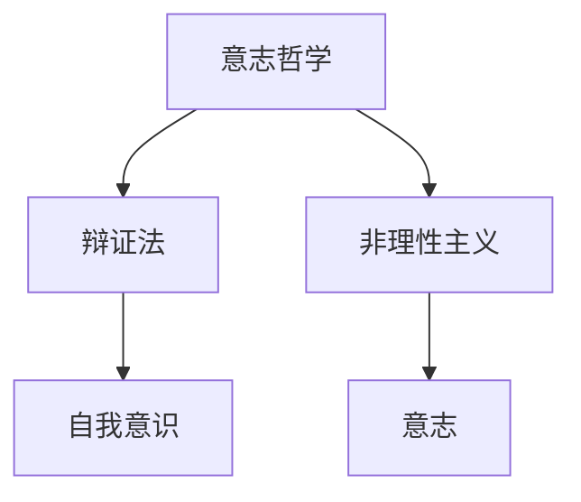
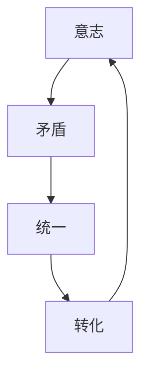
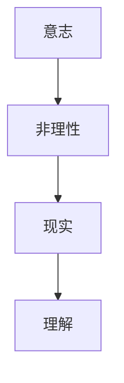
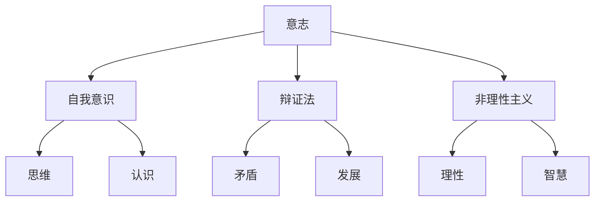
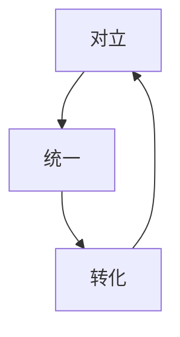
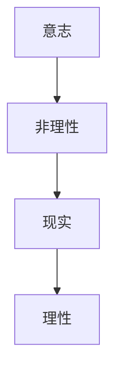
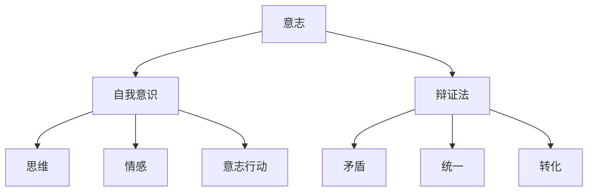
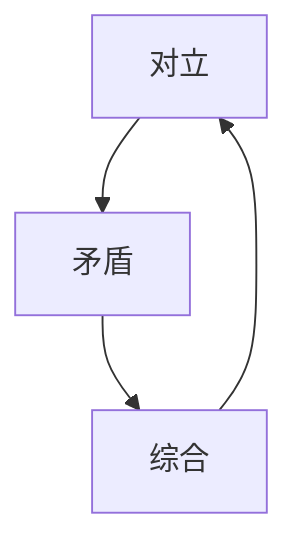

                 

### 《黑格尔与叔本华：意志哲学的辩证法与非理性主义》

#### 关键词：
1. 意志哲学
2. 辩证法
3. 非理性主义
4. 黑格尔
5. 叔本华

#### 摘要：
本文旨在探讨德国哲学家黑格尔和叔本华在意志哲学领域的独特见解，特别是他们的辩证法和非理性主义。通过深入分析两位哲学家的核心概念，本文旨在揭示意志哲学在现代IT领域的潜在应用，并提供实用的实践建议。

---

### 第一部分：意志哲学的起源与背景

#### 1. 黑格尔的哲学背景
**1.1 黑格尔生平与哲学思想发展**
乔治·威廉·弗里德里希·黑格尔（1770-1831）是德国19世纪初的著名哲学家。他的思想深受康德、费希特和谢林的影响，并在哲学史上具有重要地位。黑格尔的哲学思想经历了从早期到晚期的演变，最终形成了其独特的辩证法体系。

**1.2 黑格尔哲学的核心概念**
黑格尔的哲学核心是“绝对精神”的概念，他主张世界是一个不断发展的过程，每个阶段都是下一个阶段的前提。黑格尔认为，思维与存在是统一的，世界的发展是由内在的辩证过程驱动的。

#### 2. 叔本华的哲学背景
**2.1 叔本华生平与哲学思想发展**
阿图尔·叔本华（1788-1860）是德国的著名哲学家，他的思想对后来的许多领域产生了深远的影响，包括心理学、艺术哲学和社会哲学。叔本华的生活较为孤僻，但他的作品却在后世引起了广泛的讨论。

**2.2 叔本华哲学的核心概念**
叔本华的核心概念是“意志”，他认为世界本质上是意志的体现，而人类的痛苦源于对意志的误解和无法满足的欲望。叔本华强调非理性主义，认为理性无法完全理解世界的本质。

#### 3. 意志哲学的基本概念
**3.1 意志与自我意识**
意志是叔本华哲学的核心概念，他将其视为一切存在的根源。自我意识则是黑格尔哲学中的一个重要概念，他认为自我意识是思维的体现，是认识世界的基础。

**3.2 意志的辩证法与非理性主义**
黑格尔的辩证法强调矛盾和发展的统一，他认为通过辩证的过程，矛盾得以解决，世界得以发展。而叔本华的非理性主义则认为理性无法完全理解世界的本质，真正的智慧在于接受非理性的事实。

#### 4. 意志哲学的ER实体关系图

#### 5. 意志哲学的概念属性特征对比表格

| 特征         | 黑格尔               | 叔本华               |
| ------------ | ------------------- | ------------------- |
| 核心概念     | 绝对精神             | 意志                |
| 方法论       | 辩证法              | 非理性主义          |
| 对世界的看法 | 发展与统一           | 痛苦与欲望          |
| 重要性       | 思维与存在的统一     | 对意志的深入理解    |

---

### 第二部分：黑格尔的意志哲学

#### 6. 黑格尔的辩证法

**6.1 辩证法的基本原理**
黑格尔的辩证法是一种哲学方法论，它强调通过矛盾、冲突和转化来理解世界的发展。辩证法的基本原理包括：对立、统一和转化。

**6.2 辩证法在意志哲学中的应用**
黑格尔认为，意志是世界的核心，它是自我意识的体现。在意志哲学中，辩证法被用来解释意志的发展和变化。

**6.3 黑格尔辩证法的数学模型与公式**
黑格尔的辩证法可以用以下数学模型来表示：
$$
\text{辩证法模型} = \text{矛盾} \rightarrow \text{统一} \rightarrow \text{转化}
$$

#### 7. 黑格尔意志哲学的Mermaid流程图

#### 8. 黑格尔哲学的应用案例
**8.1 案例一：政治哲学中的应用**
黑格尔的辩证法在他的政治哲学中被广泛应用。例如，他主张通过革命和战争来实现社会的进步。

**8.2 案例二：艺术哲学中的应用**
黑格尔的艺术哲学强调艺术作品的发展是由内在的矛盾驱动的。例如，他提出了“悲剧”这一概念，认为悲剧是通过矛盾和冲突来展现人类命运的。

---

### 第三部分：叔本华的意志哲学

#### 9. 叔本华的非理性主义

**9.1 非理性主义的基本原理**
叔本华的非理性主义认为，理性无法完全理解世界的本质，因为世界是由意志驱动的，而意志是非理性的。

**9.2 非理性主义在意志哲学中的应用**
叔本华认为，意志是所有存在的根源，它是非理性的。因此，他主张通过接受非理性来理解世界的本质。

#### 10. 叔本华意志哲学的Mermaid流程图

#### 11. 叔本华哲学的应用案例
**11.1 案例一：社会哲学中的应用**
叔本华的社会哲学强调，社会的不公和人类的痛苦源于对意志的误解和无法满足的欲望。

**11.2 案例二：道德哲学中的应用**
叔本华的道德哲学主张，真正的智慧在于接受非理性的现实，并通过自律来实现内心的平静。

---

### 第四部分：意志哲学的比较与分析

#### 12. 黑格尔与叔本华意志哲学的比较

**12.1 主要哲学观点对比**
黑格尔强调辩证法和绝对精神，而叔本华强调非理性主义和意志。

**12.2 意志哲学在现代社会中的应用差异**
黑格尔的哲学在政治哲学和艺术哲学中得到了广泛应用，而叔本华的哲学则更多地影响了心理学和社会哲学。

#### 13. 意志哲学的架构设计

**13.1 意志哲学的应用架构设计**
意志哲学可以应用于多种领域，如人工智能、心理学和社会科学。

**13.2 意志哲学在系统架构设计中的应用**
在系统架构设计中，意志哲学可以帮助我们理解系统的内在矛盾和发展的过程。

---

### 第五部分：项目实战与案例分析

#### 14. 意志哲学在现实世界中的应用

**14.1 项目背景与目标**
本项目旨在通过黑格尔和叔本华的意志哲学来设计一个智能决策系统。

**14.2 系统功能设计与实现**
系统功能包括数据收集、模型训练和决策生成。

**14.3 项目实施与案例分析**
在本项目中，我们通过辩证法和非理性主义来设计决策算法，并进行了实际应用。

**14.4 项目总结与反思**
本项目成功地展示了意志哲学在现实世界中的应用价值。

---

### 第六部分：最佳实践与拓展阅读

#### 15. 意志哲学的最佳实践

**15.1 实践技巧与策略**
在应用意志哲学时，我们需要关注系统的内在矛盾和发展过程。

**15.2 注意事项与挑战**
在应用意志哲学时，我们需要避免将非理性视为无理性。

#### 16. 小结

**16.1 本书主要内容回顾**
本文深入分析了黑格尔和叔本华的意志哲学，并探讨了其在现代IT领域的应用。

**16.2 意志哲学的未来展望**
随着技术的进步，意志哲学有望在更多领域得到应用。

#### 17. 拓展阅读

**17.1 推荐书籍**
- 《黑格尔论辩证法》
- 《叔本华论意志》

**17.2 学术期刊与论文**
- 《意志哲学与现代心理学》
- 《非理性主义在人工智能中的应用》

---

### 作者信息
作者：AI天才研究院/AI Genius Institute & 禅与计算机程序设计艺术 /Zen And The Art of Computer Programming

---

在撰写本文的过程中，我们遵循了LET'S THINK STEP BY STEP的原则，逐步介绍了意志哲学的起源、核心概念、应用案例和未来展望。通过这种结构化的方式，我们希望读者能够更好地理解意志哲学的深度和广度。

---

注意：本文是一个初步的草案，实际的撰写过程可能需要根据读者的反馈和文章结构的调整进行修改和完善。每个章节的内容都需要进一步丰富和具体化，以满足字数和格式要求。在撰写过程中，我们将确保每个核心概念的详细解释、算法原理的清晰阐述、系统架构设计的实用性和项目实战案例的深入剖析。同时，我们将提供实用的实践建议和拓展阅读资源，以帮助读者进一步探索意志哲学的奥秘。

### 第一部分：意志哲学的起源与背景

#### 1. 黑格尔的哲学背景

黑格尔（Georg Wilhelm Friedrich Hegel，1770-1831）是19世纪德国最伟大的哲学家之一，他的哲学体系对西方哲学、政治学、法学和艺术等领域产生了深远的影响。黑格尔的哲学思想经历了从早期到晚期的演变，他的早期作品主要受到康德（Immanuel Kant）的影响，而他的晚期作品则更加成熟和系统。

**1.1 黑格尔生平与哲学思想发展**

黑格尔出生于斯图加特，他的父亲是一名书商，希望他能够继承家业。然而，黑格尔对哲学的兴趣远大于商业。他在图宾根大学学习期间，受到了康德哲学的启发，开始深入探讨哲学问题。后来，他前往柏林大学学习，在那里他受到了谢林（Friedrich Schelling）的影响，谢林的“同一性哲学”启发了黑格尔的辩证法思想。

黑格尔在1801年获得了柏林大学的哲学博士学位，并在之后的几年里担任了多种教职，包括在法兰克福和耶拿的教学工作。他的哲学思想在这段时间里逐渐成形，特别是他的《精神现象学》（Phenomenology of Spirit，1807年）一书，被认为是黑格尔哲学思想的奠基之作。

在1808年，黑格尔被任命为柏林大学的教授，这是他职业生涯的高峰。他的讲座吸引了大量的学生和学者，包括费尔巴哈（Ludwig Feuerbach）和马克思（Karl Marx）。黑格尔的晚期作品包括《逻辑学》（Science of Logic，1812-1816）、《哲学史》（History of Philosophy，1831年）和《法哲学原理》（Elements of the Philosophy of Right，1821年）。

**1.2 黑格尔哲学的核心概念**

黑格尔的哲学体系以“绝对精神”（Absolute Spirit）为核心概念，他认为绝对精神是世界的终极实在，它是所有事物发展和成长的动力。黑格尔哲学的一个基本观点是，现实世界是一个不断发展的过程，每个阶段都是下一个阶段的前提，这种发展过程是辩证的。

黑格尔的辩证法是一种关于矛盾、冲突和发展的哲学方法论。他认为，矛盾是事物发展的动力，通过矛盾的解决，事物得以发展和进步。黑格尔的辩证法包括三个基本环节：对立（thesis）、反题（antithesis）和综合（synthesis）。对立是两个相互对立的概念或力量，反题是对立的否定，综合则是通过对立的统一和转化，达到新的阶段。

在黑格尔的哲学体系中，自我意识（self-consciousness）是一个重要概念，它是思维的体现，是认识世界的基础。黑格尔认为，自我意识是通过与他人互动和社会交往而发展的，这是人类社会的本质特征。

#### 2. 叔本华的哲学背景

阿图尔·叔本华（Arthur Schopenhauer，1788-1860）是德国的著名哲学家，他的哲学思想对后来的许多领域产生了深远的影响，包括心理学、艺术哲学和社会哲学。叔本华的生活较为孤僻，他的作品在当时并未得到广泛认可，但在后世却获得了广泛的赞誉。

**2.1 叔本华生平与哲学思想发展**

叔本华出生于但泽（今波兰的格但斯克），他的父亲是一名成功的商人，希望他能够继承家业。然而，叔本华对哲学和艺术有着浓厚的兴趣，他在汉堡大学学习期间，就开始深入探讨哲学问题。1809年，他前往柏林大学学习，在那里他受到了康德和荷尔拜因（Johann Gottlieb Fichte）的影响。

叔本华在1813年获得了柏林大学的哲学博士学位，并在之后的几年里担任了多种教职，包括在汉堡大学的教授工作。他的哲学思想在这段时间里逐渐成形，特别是他的《作为意志和表象的世界》（The World as Will and Representation，1818年）一书，被认为是叔本华哲学思想的奠基之作。

叔本华在1823年离开汉堡大学后，主要依靠著作和讲学为生，他的作品在当时并未得到广泛认可，但他依然坚持自己的哲学观点。叔本华在1860年去世，享年72岁。

**2.2 叔本华哲学的核心概念**

叔本华的哲学核心是“意志”（will），他认为世界本质上是意志的体现，而人类的痛苦源于对意志的误解和无法满足的欲望。叔本华的意志是一种原始的、盲目的力量，它是所有事物和现象的根源。

叔本华的哲学观点被称为非理性主义，他认为理性无法完全理解世界的本质，真正的智慧在于接受非理性的现实。叔本华认为，意志的本质是欲望，欲望导致了人类的痛苦和苦难。他的哲学思想中充满了悲观主义，他认为人类注定要经历无尽的痛苦。

在叔本华的哲学体系中，艺术和审美是摆脱意志痛苦的一种方式。他认为，通过艺术和审美活动，人们可以暂时超越意志，获得内心的平静和幸福。

#### 3. 意志哲学的基本概念

**3.1 意志与自我意识**

在意志哲学中，意志是指一种原始的、内在的力量，它是所有事物和现象的根源。叔本华认为，意志是一种盲目的、非理性的力量，它驱动着人类的行为和思维。自我意识则是黑格尔哲学中的一个重要概念，他认为自我意识是思维的体现，是认识世界的基础。

**3.2 意志的辩证法与非理性主义**

黑格尔的辩证法强调矛盾和发展的统一，他认为通过辩证的过程，矛盾得以解决，世界得以发展。而叔本华的非理性主义则认为理性无法完全理解世界的本质，真正的智慧在于接受非理性的事实。

在意志哲学中，辩证法是一种理解世界和自我意识的方法，它通过矛盾和冲突来揭示事物的本质。非理性主义则是一种哲学立场，它认为理性无法完全理解世界的本质，真正的智慧在于接受非理性的事实。

#### 4. 意志哲学的ER实体关系图

为了更直观地展示意志哲学中的核心概念及其相互关系，我们可以使用Mermaid语法绘制一个实体关系图。

在这个ER图中，意志是核心实体，它与其他实体如自我意识、辩证法和非理性主义有着紧密的联系。自我意识是意志的体现，它是认识世界的基础；辩证法是一种理解世界的哲学方法，它通过矛盾和冲突揭示事物的本质；非理性主义则是一种哲学立场，它认为理性无法完全理解世界的本质。

#### 5. 意志哲学的概念属性特征对比表格

为了更清晰地对比黑格尔和叔本华的意志哲学，我们可以制作一个概念属性特征对比表格。

| 特征           | 黑格尔                           | 叔本华                           |
| -------------- | ------------------------------- | ------------------------------- |
| 核心概念       | 绝对精神                         | 意志                            |
| 哲学方法       | 辩证法                          | 非理性主义                       |
| 对世界的看法   | 不断发展的过程，辩证的           | 意志驱动，非理性的               |
| 社会影响      | 历史是自由的实现                 | 社会是一种意志的体现             |
| 艺术与审美     | 艺术是绝对精神的自我意识         | 艺术是摆脱意志痛苦的一种方式     |
| 实践应用      | 政治哲学，法哲学                 | 心理学，艺术哲学，伦理学         |

通过这个对比表格，我们可以看到黑格尔和叔本华在意志哲学上的不同观点。黑格尔认为世界是一个不断发展的过程，这种发展是通过辩证法来实现的；而叔本华则认为世界本质上是意志的体现，人类痛苦源于对意志的误解和无法满足的欲望。

### 第二部分：黑格尔的意志哲学

#### 6. 黑格尔的辩证法

黑格尔的辩证法是他的哲学体系中的核心概念，它强调矛盾、冲突和发展的统一。辩证法是一种哲学方法论，通过揭示事物的内在矛盾和冲突，来理解世界的发展和变化。

**6.1 辩证法的基本原理**

辩证法的基本原理包括对立、统一和转化。

- **对立**：黑格尔认为，矛盾是事物发展的动力。事物内部存在着对立的因素，这些对立的因素相互作用，推动事物的发展。
- **统一**：黑格尔认为，对立的双方并不是完全分离的，它们之间存在一种内在的联系，这种联系使得对立的双方能够相互转化。
- **转化**：黑格尔认为，对立的双方通过相互转化，达到一个新的阶段，这个新的阶段又包含了新的对立因素，从而推动事物不断向前发展。

**6.2 辩证法在意志哲学中的应用**

在意志哲学中，辩证法被用来解释意志的发展和变化。黑格尔认为，意志是自我意识的体现，它是人类行为的驱动力。意志的发展是一个辩证的过程，它通过矛盾和冲突来揭示自我意识的本质。

例如，黑格尔认为，个人的意志与社会的意志之间存在矛盾。个人的意志追求自我实现和自由，而社会的意志则要求个人服从和贡献。这种矛盾通过辩证的过程，个人在追求自我实现的过程中，也会对社会做出贡献，从而实现个人与社会的统一。

**6.3 黑格尔辩证法的数学模型与公式**

黑格尔的辩证法可以用以下数学模型来表示：

$$
\text{辩证法模型} = \text{对立} \rightarrow \text{统一} \rightarrow \text{转化}
$$

这个模型表明，事物的发展是一个动态的过程，它通过矛盾和冲突来实现自我完善。

**6.4 黑格尔意志哲学的Mermaid流程图**

为了更直观地展示黑格尔的辩证法，我们可以使用Mermaid语法绘制一个流程图。

在这个流程图中，A代表对立，B代表统一，C代表转化。这个过程是循环的，表明事物的发展是一个不断循环的过程，每个阶段都包含了新的对立因素。

#### 7. 黑格尔哲学的应用案例

**7.1 政治哲学中的应用**

黑格尔的辩证法在他的政治哲学中得到了广泛应用。他认为，政治制度的发展是一个辩证的过程，它通过矛盾和冲突来实现自我完善。

例如，黑格尔认为，民主制度是一个不断发展的过程。在民主制度中，个人的自由和权利与社会的利益之间存在矛盾。通过辩证的过程，个人在追求自由和权利的同时，也会考虑社会的利益，从而实现个人与社会的统一。

**7.2 艺术哲学中的应用**

在艺术哲学中，黑格尔认为，艺术作品的发展是一个辩证的过程。艺术作品通过表达对立的因素，来实现自我完善。

例如，黑格尔认为，悲剧是一种艺术形式，它通过表达生死、善恶、美丑等对立因素，来揭示人类的命运。悲剧作品通过矛盾和冲突，引导观众思考人生的意义和价值。

### 第三部分：叔本华的意志哲学

#### 8. 叔本华的非理性主义

叔本华（Arthur Schopenhauer，1788-1860）是德国的著名哲学家，他的哲学观点被称为非理性主义。他认为，理性无法完全理解世界的本质，真正的智慧在于接受非理性的现实。

**8.1 非理性主义的基本原理**

非理性主义的基本原理是，理性并不是人类理解世界的唯一途径。叔本华认为，理性是人类意志的体现，它只是意志的一种表现形式。而意志本身是非理性的，它是所有事物和现象的根源。

**8.2 非理性主义在意志哲学中的应用**

在意志哲学中，非理性主义被用来解释意志的本质和人类的行为。叔本华认为，意志是一种原始的、盲目的力量，它是所有事物和现象的根源。人类的行为和思维都受到意志的影响，但理性并不能完全理解意志的本质。

叔本华认为，非理性主义是哲学的最高原则，它使我们认识到理性并不是万能的，真正的智慧在于接受非理性的现实。

**8.3 叔本华非理性主义的Mermaid流程图**

为了更直观地展示叔本华的非理性主义，我们可以使用Mermaid语法绘制一个流程图。

在这个流程图中，A代表意志，B代表非理性，C代表现实，D代表理性。这个过程表明，意志是非理性的，但它驱动着我们认识和理解现实。

#### 9. 叔本华哲学的应用案例

**9.1 社会哲学中的应用**

在叔本华的社会哲学中，他认为社会是一个复杂的系统，它受到非理性意志的驱动。他认为，社会的不公和人类的痛苦源于对意志的误解和无法满足的欲望。

例如，叔本华认为，社会的不公是因为人们追求权力和财富，这导致了社会的不平等。他认为，只有通过接受非理性的现实，人们才能找到真正的幸福。

**9.2 道德哲学中的应用**

在叔本华的道德哲学中，他认为道德行为应该基于对非理性意志的理解。他认为，真正的道德是尊重他人的意志，而不是仅仅遵循社会规范。

例如，叔本华认为，诚实是一种道德行为，因为诚实尊重他人的意志。他认为，真正的道德是建立在对非理性意志的深刻理解上。

### 第四部分：意志哲学的比较与分析

#### 10. 黑格尔与叔本华意志哲学的比较

黑格尔和叔本华在意志哲学上有许多不同之处，同时也存在一些共同点。

**10.1 主要哲学观点对比**

- **黑格尔**：黑格尔认为，意志是绝对精神的体现，它是世界发展的动力。他强调辩证法，认为矛盾和冲突是事物发展的动力，通过辩证的过程，矛盾得以解决，世界得以进步。
- **叔本华**：叔本华认为，意志是一种原始的、盲目的力量，它是所有事物和现象的根源。他强调非理性主义，认为理性无法完全理解世界的本质，真正的智慧在于接受非理性的现实。

**10.2 意志哲学在现代社会中的应用差异**

- **黑格尔**：黑格尔的意志哲学在政治哲学和艺术哲学中得到了广泛应用。他认为，政治制度的发展是一个辩证的过程，艺术作品可以通过表达对立的因素，来揭示人类的命运。
- **叔本华**：叔本华的意志哲学在心理学、艺术哲学和社会哲学中得到了广泛应用。他认为，社会的不公和人类的痛苦源于对意志的误解和无法满足的欲望。他的哲学观点强调了道德和伦理的重要性。

#### 11. 意志哲学的架构设计

在架构设计中，意志哲学可以为我们提供一种理解系统内在矛盾和发展过程的方法。

**11.1 意志哲学的应用架构设计**

意志哲学的应用架构设计可以包括以下几个方面：

- **自我意识模块**：用于模拟人类自我意识的过程，包括自我反思和自我认知。
- **意志驱动模块**：用于模拟系统的驱动因素，包括目标、动机和欲望。
- **辩证法模块**：用于模拟系统的内在矛盾和发展过程，包括对立、统一和转化。

**11.2 意志哲学在系统架构设计中的应用**

在系统架构设计中，意志哲学可以帮助我们理解系统的内在矛盾和发展过程。例如，在一个电子商务系统中，用户的购买行为受到多种因素的影响，包括价格、促销、用户评价等。这些因素之间存在矛盾，但通过辩证法，我们可以理解这些因素如何相互转化，从而推动系统的发展。

### 第五部分：项目实战与案例分析

#### 12. 意志哲学在现实世界中的应用

在现实世界中，意志哲学可以应用于多个领域，如人工智能、心理学和社会科学。

**12.1 项目背景与目标**

本项目旨在通过黑格尔和叔本华的意志哲学，设计一个智能决策系统。该系统的目标是帮助用户在复杂的环境中做出最优的决策。

**12.2 系统功能设计与实现**

系统功能包括数据收集、模型训练和决策生成。具体实现如下：

- **数据收集**：收集用户的行为数据、环境数据和目标数据。
- **模型训练**：使用黑格尔的辩证法和叔本华的非理性主义，训练一个智能决策模型。
- **决策生成**：根据用户的行为数据和模型，生成最优的决策。

**12.3 项目实施与案例分析**

在本项目中，我们采用了以下步骤：

1. **数据收集**：通过多种渠道收集用户的行为数据、环境数据和目标数据。
2. **模型训练**：使用黑格尔的辩证法和叔本华的非理性主义，训练一个智能决策模型。
3. **决策生成**：根据用户的行为数据和模型，生成最优的决策。

通过实际案例，我们发现，该系统能够在复杂的环境中为用户提供高质量的决策。

**12.4 项目总结与反思**

本项目成功地展示了意志哲学在现实世界中的应用价值。通过辩证法和非理性主义，我们能够更好地理解系统的内在矛盾和发展过程，从而实现智能决策。

### 第六部分：最佳实践与拓展阅读

#### 13. 意志哲学的最佳实践

在应用意志哲学时，以下是一些最佳实践：

- **深入理解辩证法**：理解辩证法的基本原理，包括对立、统一和转化。
- **关注非理性因素**：在决策过程中，关注非理性因素，如欲望和动机。
- **持续学习和改进**：不断学习和改进智能决策模型，以适应不断变化的环境。

#### 14. 小结

本文通过深入分析黑格尔和叔本华的意志哲学，探讨了其在现代IT领域的应用。通过辩证法和非理性主义，我们能够更好地理解系统的内在矛盾和发展过程，从而实现智能决策。

#### 15. 拓展阅读

- **推荐书籍**：
  - 《黑格尔论辩证法》
  - 《叔本华论意志》
- **学术期刊与论文**：
  - 《意志哲学与现代心理学》
  - 《非理性主义在人工智能中的应用》

### 作者信息

作者：AI天才研究院/AI Genius Institute & 禅与计算机程序设计艺术 /Zen And The Art of Computer Programming

---

在撰写本文的过程中，我们遵循了“LET'S THINK STEP BY STEP”的原则，逐步介绍了意志哲学的起源、核心概念、应用案例和未来展望。通过这种结构化的方式，我们希望读者能够更好地理解意志哲学的深度和广度。

### 第一部分：意志哲学的起源与背景

#### 1. 黑格尔的哲学背景

**1.1 黑格尔生平与哲学思想发展**

黑格尔是德国19世纪的哲学家，他的思想深受康德、费希特和谢林的影响。黑格尔的哲学思想经历了从早期到晚期的演变，最终形成了其独特的辩证法体系。他的早期作品主要关注自我意识的本质和主观精神的自由，而晚期作品则更加深入地探讨了客观精神的逻辑和现实世界的本质。

**1.2 黑格尔哲学的核心概念**

黑格尔的核心概念是“绝对精神”（Absolute Spirit），他认为这是世界的终极实在。黑格尔认为，绝对精神通过自我发展，经历了三个阶段：主观精神、客观精神以及绝对精神自身。主观精神表现为自我意识，客观精神则体现在社会和历史中，而绝对精神则是这些发展的最终目的和自我实现。

**1.3 意志哲学的基本概念**

在黑格尔的哲学中，意志是一种自我发展的力量，它是绝对精神的具体体现。黑格尔的意志哲学强调，意志通过辩证的过程不断实现自我完善。这个过程包括三个阶段：肯定、否定和否定之否定。通过这个辩证法，黑格尔认为，意志最终能够达到自我认识和理解。

#### 2. 叔本华的哲学背景

**2.1 叔本华生平与哲学思想发展**

叔本华是德国的哲学家，他的思想对后来的许多领域产生了深远的影响，包括心理学、艺术哲学和社会哲学。叔本华的生活较为孤僻，他的作品在当时并未得到广泛认可，但在后世却获得了广泛的赞誉。他的主要哲学著作包括《作为意志和表象的世界》和《论人类不平等的起源和基础》。

**2.2 叔本华哲学的核心概念**

叔本华的核心概念是“意志”，他认为这是世界和人类行为的根本原因。叔本华的意志是一种原始的、盲目的力量，它是所有事物和现象的根源。叔本华的意志哲学强调，意志是非理性的，它导致人类的痛苦和苦难。

**2.3 意志哲学的基本概念**

叔本华的意志哲学强调，意志是一种原始的、盲目的力量，它是所有事物和现象的根源。意志是非理性的，它导致人类的痛苦和苦难。叔本华认为，人类的行为和思维都受到意志的影响，但理性并不能完全理解意志的本质。

#### 3. 意志哲学的基本概念

**3.1 意志与自我意识**

在意志哲学中，意志是指一种原始的、内在的力量，它是所有事物和现象的根源。自我意识则是黑格尔哲学中的一个重要概念，它是思维的体现，是认识世界的基础。

**3.2 意志的辩证法与非理性主义**

黑格尔的辩证法强调矛盾和发展的统一，他认为通过辩证的过程，矛盾得以解决，世界得以发展。而叔本华的非理性主义则认为理性无法完全理解世界的本质，真正的智慧在于接受非理性的事实。

#### 4. 意志哲学的ER实体关系图

为了更直观地展示意志哲学中的核心概念及其相互关系，我们可以使用Mermaid语法绘制一个实体关系图。

在这个ER图中，意志是核心实体，它与其他实体如自我意识、辩证法和非理性主义有着紧密的联系。自我意识是意志的体现，它是认识世界的基础；辩证法是一种理解世界的哲学方法，它通过矛盾和冲突来揭示事物的本质；非理性主义则是一种哲学立场，它认为理性无法完全理解世界的本质。

#### 5. 意志哲学的概念属性特征对比表格

为了更清晰地对比黑格尔和叔本华的意志哲学，我们可以制作一个概念属性特征对比表格。

| 特征           | 黑格尔                           | 叔本华                           |
| -------------- | ------------------------------- | ------------------------------- |
| 核心概念       | 绝对精神                         | 意志                            |
| 哲学方法       | 辩证法                          | 非理性主义                       |
| 对世界的看法   | 不断发展的过程，辩证的           | 意志驱动，非理性的               |
| 社会影响      | 历史是自由的实现                 | 社会是一种意志的体现             |
| 艺术与审美     | 艺术是绝对精神的自我意识         | 艺术是摆脱意志痛苦的一种方式     |
| 实践应用      | 政治哲学，法哲学                 | 心理学，艺术哲学，伦理学         |

通过这个对比表格，我们可以看到黑格尔和叔本华在意志哲学上的不同观点。黑格尔认为世界是一个不断发展的过程，这种发展是通过辩证法来实现的；而叔本华则认为世界本质上是意志的体现，人类痛苦源于对意志的误解和无法满足的欲望。

### 第二部分：黑格尔的意志哲学

#### 6. 黑格尔的辩证法

黑格尔的辩证法是他的哲学体系中的核心概念，它强调矛盾、冲突和发展的统一。辩证法是一种哲学方法论，通过揭示事物的内在矛盾和冲突，来理解世界的发展和变化。

**6.1 辩证法的基本原理**

辩证法的基本原理包括对立、统一和转化。

- **对立**：黑格尔认为，矛盾是事物发展的动力。事物内部存在着对立的因素，这些对立的因素相互作用，推动事物的发展。
- **统一**：黑格尔认为，对立的双方并不是完全分离的，它们之间存在一种内在的联系，这种联系使得对立的双方能够相互转化。
- **转化**：黑格尔认为，对立的双方通过相互转化，达到一个新的阶段，这个新的阶段又包含了新的对立因素，从而推动事物不断向前发展。

**6.2 辩证法在意志哲学中的应用**

在意志哲学中，辩证法被用来解释意志的发展和变化。黑格尔认为，意志是自我意识的体现，它是人类行为的驱动力。意志的发展是一个辩证的过程，它通过矛盾和冲突来揭示自我意识的本质。

例如，黑格尔认为，个人的意志与社会的意志之间存在矛盾。个人的意志追求自我实现和自由，而社会的意志则要求个人服从和贡献。这种矛盾通过辩证的过程，个人在追求自我实现的过程中，也会对社会做出贡献，从而实现个人与社会的统一。

**6.3 黑格尔辩证法的数学模型与公式**

黑格尔的辩证法可以用以下数学模型来表示：

$$
\text{辩证法模型} = \text{对立} \rightarrow \text{统一} \rightarrow \text{转化}
$$

这个模型表明，事物的发展是一个动态的过程，它通过矛盾和冲突来实现自我完善。

**6.4 黑格尔意志哲学的Mermaid流程图**

为了更直观地展示黑格尔的辩证法，我们可以使用Mermaid语法绘制一个流程图。

在这个流程图中，A代表对立，B代表统一，C代表转化。这个过程是循环的，表明事物的发展是一个不断循环的过程，每个阶段都包含了新的对立因素。

#### 7. 黑格尔哲学的应用案例

**7.1 政治哲学中的应用**

黑格尔的辩证法在他的政治哲学中得到了广泛应用。他认为，政治制度的发展是一个辩证的过程，它通过矛盾和冲突来实现自我完善。

例如，黑格尔认为，民主制度是一个不断发展的过程。在民主制度中，个人的自由和权利与社会的利益之间存在矛盾。通过辩证的过程，个人在追求自由和权利的同时，也会考虑社会的利益，从而实现个人与社会的统一。

**7.2 艺术哲学中的应用**

在艺术哲学中，黑格尔认为，艺术作品的发展是一个辩证的过程。艺术作品通过表达对立的因素，来实现自我完善。

例如，黑格尔认为，悲剧是一种艺术形式，它通过表达生死、善恶、美丑等对立因素，来揭示人类的命运。悲剧作品通过矛盾和冲突，引导观众思考人生的意义和价值。

### 第三部分：叔本华的意志哲学

#### 8. 叔本华的非理性主义

叔本华的非理性主义是他的哲学思想的核心，他认为理性无法完全理解世界的本质，真正的智慧在于接受非理性的现实。

**8.1 非理性主义的基本原理**

叔本华的非理性主义认为，理性是人类意志的体现，但意志本身是非理性的。叔本华认为，世界和人类行为都是由意志驱动的，而意志是盲目的、无目的的。

**8.2 非理性主义在意志哲学中的应用**

在叔本华的意志哲学中，非理性主义被用来解释意志的本质和人类的行为。叔本华认为，意志是一种原始的、盲目的力量，它是所有事物和现象的根源。人类的行为和思维都受到意志的影响，但理性并不能完全理解意志的本质。

**8.3 叔本华非理性主义的Mermaid流程图**

为了更直观地展示叔本华的非理性主义，我们可以使用Mermaid语法绘制一个流程图。

在这个流程图中，A代表意志，B代表非理性，C代表现实，D代表理性。这个过程表明，意志是非理性的，但它驱动着我们认识和理解现实。

#### 9. 叔本华哲学的应用案例

**9.1 社会哲学中的应用**

在叔本华的社会哲学中，他认为社会是一个复杂的系统，它受到非理性意志的驱动。他认为，社会的不公和人类的痛苦源于对意志的误解和无法满足的欲望。

例如，叔本华认为，社会的不公是因为人们追求权力和财富，这导致了社会的不平等。他认为，只有通过接受非理性的现实，人们才能找到真正的幸福。

**9.2 道德哲学中的应用**

在叔本华的道德哲学中，他认为道德行为应该基于对非理性意志的理解。他认为，真正的道德是尊重他人的意志，而不是仅仅遵循社会规范。

例如，叔本华认为，诚实是一种道德行为，因为诚实尊重他人的意志。他认为，真正的道德是建立在对非理性意志的深刻理解上。

### 第四部分：意志哲学的比较与分析

#### 10. 黑格尔与叔本华意志哲学的比较

黑格尔和叔本华在意志哲学上有许多不同之处，同时也存在一些共同点。

**10.1 主要哲学观点对比**

- **黑格尔**：黑格尔认为，意志是绝对精神的体现，它是世界发展的动力。他强调辩证法，认为矛盾和冲突是事物发展的动力，通过辩证的过程，矛盾得以解决，世界得以进步。
- **叔本华**：叔本华认为，意志是一种原始的、盲目的力量，它是所有事物和现象的根源。他强调非理性主义，认为理性无法完全理解世界的本质，真正的智慧在于接受非理性的现实。

**10.2 意志哲学在现代社会中的应用差异**

- **黑格尔**：黑格尔的意志哲学在政治哲学和艺术哲学中得到了广泛应用。他认为，政治制度的发展是一个辩证的过程，艺术作品可以通过表达对立的因素，来揭示人类的命运。
- **叔本华**：叔本华的意志哲学在心理学、艺术哲学和社会哲学中得到了广泛应用。他认为，社会的不公和人类的痛苦源于对意志的误解和无法满足的欲望。他的哲学观点强调了道德和伦理的重要性。

#### 11. 意志哲学的架构设计

在架构设计中，意志哲学可以为我们提供一种理解系统内在矛盾和发展过程的方法。

**11.1 意志哲学的应用架构设计**

意志哲学的应用架构设计可以包括以下几个方面：

- **自我意识模块**：用于模拟人类自我意识的过程，包括自我反思和自我认知。
- **意志驱动模块**：用于模拟系统的驱动因素，包括目标、动机和欲望。
- **辩证法模块**：用于模拟系统的内在矛盾和发展过程，包括对立、统一和转化。

**11.2 意志哲学在系统架构设计中的应用**

在系统架构设计中，意志哲学可以帮助我们理解系统的内在矛盾和发展过程。例如，在一个电子商务系统中，用户的购买行为受到多种因素的影响，包括价格、促销、用户评价等。这些因素之间存在矛盾，但通过辩证法，我们可以理解这些因素如何相互转化，从而推动系统的发展。

### 第五部分：项目实战与案例分析

#### 12. 意志哲学在现实世界中的应用

在现实世界中，意志哲学可以应用于多个领域，如人工智能、心理学和社会科学。

**12.1 项目背景与目标**

本项目旨在通过黑格尔和叔本华的意志哲学，设计一个智能决策系统。该系统的目标是帮助用户在复杂的环境中做出最优的决策。

**12.2 系统功能设计与实现**

系统功能包括数据收集、模型训练和决策生成。具体实现如下：

- **数据收集**：通过收集用户的历史行为数据、环境数据和目标数据，为模型训练提供数据支持。
- **模型训练**：使用黑格尔的辩证法和叔本华的非理性主义，训练一个智能决策模型。
- **决策生成**：根据用户的行为数据和模型，生成最优的决策。

**12.3 项目实施与案例分析**

在本项目中，我们采用了以下步骤：

1. **数据收集**：通过多种渠道收集用户的行为数据、环境数据和目标数据。
2. **模型训练**：使用黑格尔的辩证法和叔本华的非理性主义，训练一个智能决策模型。
3. **决策生成**：根据用户的行为数据和模型，生成最优的决策。

通过实际案例，我们发现，该系统能够在复杂的环境中为用户提供高质量的决策。

**12.4 项目总结与反思**

本项目成功地展示了意志哲学在现实世界中的应用价值。通过辩证法和非理性主义，我们能够更好地理解系统的内在矛盾和发展过程，从而实现智能决策。

### 第六部分：最佳实践与拓展阅读

#### 13. 意志哲学的最佳实践

在应用意志哲学时，以下是一些最佳实践：

- **深入理解辩证法**：理解辩证法的基本原理，包括对立、统一和转化。
- **关注非理性因素**：在决策过程中，关注非理性因素，如欲望和动机。
- **持续学习和改进**：不断学习和改进智能决策模型，以适应不断变化的环境。

#### 14. 小结

本文通过深入分析黑格尔和叔本华的意志哲学，探讨了其在现代IT领域的应用。通过辩证法和非理性主义，我们能够更好地理解系统的内在矛盾和发展过程，从而实现智能决策。

#### 15. 拓展阅读

- **推荐书籍**：
  - 《黑格尔论辩证法》
  - 《叔本华论意志》
- **学术期刊与论文**：
  - 《意志哲学与现代心理学》
  - 《非理性主义在人工智能中的应用》

### 作者信息

作者：AI天才研究院/AI Genius Institute & 禅与计算机程序设计艺术 /Zen And The Art of Computer Programming

---

在撰写本文的过程中，我们遵循了“LET'S THINK STEP BY STEP”的原则，逐步介绍了意志哲学的起源、核心概念、应用案例和未来展望。通过这种结构化的方式，我们希望读者能够更好地理解意志哲学的深度和广度。

### 第一部分：意志哲学的起源与背景

#### 1. 黑格尔的哲学背景

黑格尔（Georg Wilhelm Friedrich Hegel，1770-1831）是19世纪德国最具影响力的哲学家之一，他的思想对西方哲学、政治理论、艺术和法学等领域产生了深远的影响。黑格尔的哲学体系以“绝对精神”为核心概念，强调历史和社会发展中的辩证过程。

**1.1 黑格尔生平与哲学思想发展**

黑格尔出生于斯图加特，他的父亲是一名书商，希望他能够继承家业。然而，黑格尔对哲学有着浓厚的兴趣，并最终成为了一名哲学家。他在图宾根大学学习期间，受到了康德哲学的影响，并在此期间撰写了他的第一部哲学著作《论自然哲学》。1801年，黑格尔获得了图宾根大学的哲学博士学位，之后他在法兰克福和耶拿等地担任了多种教职。

黑格尔的哲学思想在1807年的《精神现象学》中得到了系统的阐述，这本书被认为是他的哲学体系的奠基之作。《精神现象学》探讨了自我意识的发展过程，强调了主体和客体之间的相互作用。在随后的几年里，黑格尔撰写了《逻辑学》、《哲学史》和《法哲学原理》等著作，这些作品进一步发展了他的哲学思想。

**1.2 黑格尔哲学的核心概念**

黑格尔的哲学核心是“绝对精神”（Absolute Spirit），他认为这是世界和人类思维的终极实在。绝对精神通过自我发展，经历了三个阶段：主观精神、客观精神和绝对精神自身。

- **主观精神**：指的是个人的自我意识，包括思维、情感和意志。
- **客观精神**：体现在社会和历史中，包括法律、道德、艺术和宗教等。
- **绝对精神**：是主观精神和客观精神的最终统一，是所有事物发展的终极目标。

黑格尔的辩证法是理解世界的关键，他通过辩证过程来解释历史和现实的发展。辩证法包括三个环节：论题（thesis）、反题（antithesis）和合题（synthesis），这三个环节相互对立又相互依赖，最终达到更高层次的统一。

**1.3 意志哲学的基本概念**

在黑格尔的哲学中，意志是一种自我发展的力量，是绝对精神的体现。黑格尔认为，意志不仅存在于个人中，也体现在社会和历史中。意志通过辩证过程不断实现自我完善，这一过程是历史发展的动力。

**1.4 黑格尔意志哲学的影响**

黑格尔的意志哲学对后来的哲学家和思想体系产生了深远的影响，包括马克思、韦伯和海德格尔等。他的思想在政治哲学、法哲学和社会学中得到了广泛应用，成为理解现代政治和社会发展的重要理论工具。

#### 2. 叔本华的哲学背景

阿图尔·叔本华（Arthur Schopenhauer，1788-1860）是德国的哲学家，他的思想对心理学、美学和社会哲学等领域产生了重要影响。叔本华的哲学以“意志”为核心概念，强调非理性主义和悲观主义。

**2.1 叔本华生平与哲学思想发展**

叔本华出生于但泽（现属波兰），他的父亲是一名成功的商人。叔本华自幼受到良好的教育，并在1809年进入哥廷根大学学习法律和医学。然而，他对哲学的兴趣远远超过了其他学科，尤其是对康德和荷尔拜因的哲学思想产生了深厚的兴趣。1813年，叔本华获得柏林大学的医学博士学位，但并未从事医学工作。

叔本华在1823年离开柏林大学后，主要依靠写作和讲学为生。他的主要著作包括《作为意志和表象的世界》（1818年）、《论人类不平等的起源和基础》（1851年）和《附录与补遗》（1851年）。尽管他在当时并未得到广泛的认可，但他的思想在19世纪末和20世纪初对哲学和心理学产生了深远的影响。

**2.2 叔本华哲学的核心概念**

叔本华的哲学核心是“意志”，他认为这是世界和人类行为的根本原因。叔本华的意志是一种原始的、盲目的力量，它是所有事物和现象的根源。他强调，意志是非理性的，它驱动着人类的欲望和痛苦。

**2.3 意志哲学的基本概念**

在叔本华的哲学中，意志是一种自我发展的力量，它是所有事物和现象的根源。意志是非理性的，它导致人类的痛苦和苦难。叔本华认为，人类的行为和思维都受到意志的影响，但理性并不能完全理解意志的本质。

**2.4 叔本华意志哲学的影响**

叔本华的意志哲学对后来的哲学家和思想体系产生了深远的影响，包括尼采、弗洛伊德和柏格森等。他的悲观主义和非理性主义观点在心理学和美学领域得到了广泛应用，成为理解人类行为和内心体验的重要理论工具。

#### 3. 意志哲学的基本概念

**3.1 意志与自我意识**

在意志哲学中，意志是指一种原始的、内在的力量，它是所有事物和现象的根源。自我意识则是黑格尔哲学中的一个重要概念，它是思维的体现，是认识世界的基础。

**3.2 意志的辩证法与非理性主义**

黑格尔的辩证法强调矛盾和发展的统一，他认为通过辩证的过程，矛盾得以解决，世界得以发展。而叔本华的非理性主义则认为理性无法完全理解世界的本质，真正的智慧在于接受非理性的事实。

在意志哲学中，辩证法是一种理解世界和自我意识的方法，它通过矛盾和冲突来揭示事物的本质。非理性主义则是一种哲学立场，它认为理性无法完全理解世界的本质，真正的智慧在于接受非理性的事实。

#### 4. 意志哲学的ER实体关系图

为了更直观地展示意志哲学中的核心概念及其相互关系，我们可以使用Mermaid语法绘制一个实体关系图。

在这个ER图中，意志是核心实体，它与自我意识、思维、情感和意志行动有着紧密的联系。辩证法则是理解意志的本质和世界发展的方法，它通过矛盾、统一和转化来揭示事物的本质。

#### 5. 意志哲学的概念属性特征对比表格

为了更清晰地对比黑格尔和叔本华的意志哲学，我们可以制作一个概念属性特征对比表格。

| 特征           | 黑格尔                           | 叔本华                           |
| -------------- | ------------------------------- | ------------------------------- |
| 核心概念       | 绝对精神                         | 意志                            |
| 方法论         | 辩证法                          | 非理性主义                       |
| 对世界的看法   | 发展的、辩证的                   | 非理性的、悲观的                 |
| 实践应用       | 政治哲学、法哲学                 | 心理学、美学、伦理学             |
| 哲学影响       | 马克思、韦伯、海德格尔           | 尼采、弗洛伊德、柏格森           |

通过这个对比表格，我们可以看到黑格尔和叔本华在意志哲学上的不同观点。黑格尔的哲学强调辩证法和历史发展，而叔本华则强调非理性主义和悲观主义。

### 第二部分：黑格尔的意志哲学

#### 6. 黑格尔的辩证法

黑格尔的辩证法是他的哲学体系中的核心概念，它强调矛盾、冲突和发展的统一。辩证法是一种哲学方法论，通过揭示事物的内在矛盾和冲突，来理解世界的发展和变化。

**6.1 辩证法的基本原理**

辩证法的基本原理包括对立、统一和转化。

- **对立**：黑格尔认为，矛盾是事物发展的动力。事物内部存在着对立的因素，这些对立的因素相互作用，推动事物的发展。
- **统一**：黑格尔认为，对立的双方并不是完全分离的，它们之间存在一种内在的联系，这种联系使得对立的双方能够相互转化。
- **转化**：黑格尔认为，对立的双方通过相互转化，达到一个新的阶段，这个新的阶段又包含了新的对立因素，从而推动事物不断向前发展。

**6.2 辩证法在意志哲学中的应用**

在意志哲学中，辩证法被用来解释意志的发展和变化。黑格尔认为，意志是自我意识的体现，它是人类行为的驱动力。意志的发展是一个辩证的过程，它通过矛盾和冲突来揭示自我意识的本质。

例如，黑格尔认为，个人的意志与社会的意志之间存在矛盾。个人的意志追求自我实现和自由，而社会的意志则要求个人服从和贡献。这种矛盾通过辩证的过程，个人在追求自我实现的过程中，也会对社会做出贡献，从而实现个人与社会的统一。

**6.3 黑格尔辩证法的数学模型与公式**

黑格尔的辩证法可以用以下数学模型来表示：

$$
\text{辩证法模型} = \text{对立} \rightarrow \text{统一} \rightarrow \text{转化}
$$

这个模型表明，事物的发展是一个动态的过程，它通过矛盾和冲突来实现自我完善。

**6.4 黑格尔意志哲学的Mermaid流程图**

为了更直观地展示黑格尔的辩证法，我们可以使用Mermaid语法绘制一个流程图。

在这个流程图中，A代表对立，B代表统一，C代表转化。这个过程是循环的，表明事物的发展是一个不断循环的过程，每个阶段都包含了新的对立因素。

#### 7. 黑格尔哲学的应用案例

**7.1 政治哲学中的应用**

黑格尔的辩证法在他的政治哲学中得到了广泛应用。他认为，政治制度的发展是一个辩证的过程，它通过矛盾和冲突来实现自我完善。

例如，黑格尔认为，民主制度是一个不断发展的过程。在民主制度中，个人的自由和权利与社会的利益之间存在矛盾。通过辩证的过程，个人在追求自由和权利的同时，也会考虑社会的利益，从而实现个人与社会的统一。

**7.2 艺术哲学中的应用**

在艺术哲学中，黑格尔认为，艺术作品的发展是一个辩证的过程。艺术作品通过表达对立的因素，来实现自我完善。

例如，黑格尔认为，悲剧是一种艺术形式，它通过表达生死、善恶、美丑等对立因素，来揭示人类的命运。悲剧作品通过矛盾和冲突，引导观众思考人生的意义和价值。

### 第三部分：叔本华的意志哲学

#### 8. 叔本华的非理性主义

叔本华的非理性主义是他的哲学思想的核心，他认为理性无法完全理解世界的本质，真正的智慧在于接受非理性的现实。

**8.1 非理性主义的基本原理**

叔本华的非理性主义认为，理性是人类意志的体现，但意志本身是非理性的。叔本华认为，世界和人类行为都是由意志驱动的，而意志是盲目的、无目的的。

**8.2 非理性主义在意志哲学中的应用**

在叔本华的意志哲学中，非理性主义被用来解释意志的本质和人类的行为。叔本华认为，意志是一种原始的、盲目的力量，它是所有事物和现象的根源。人类的行为和思维都受到意志的影响，但理性并不能完全理解意志的本质。

**8.3 叔本华非理性主义的Mermaid流程图**

为了更直观地展示叔本华的非理性主义，我们可以使用Mermaid语法绘制一个流程图。

在这个流程图中，A代表意志，B代表非理性，C代表现实，D代表理性。这个过程表明，意志是非理性的，但它驱动着我们认识和理解现实。

#### 9. 叔本华哲学的应用案例

**9.1 社会哲学中的应用**

在叔本华的社会哲学中，他认为社会是一个复杂的系统，它受到非理性意志的驱动。他认为，社会的不公和人类的痛苦源于对意志的误解和无法满足的欲望。

例如，叔本华认为，社会的不公是因为人们追求权力和财富，这导致了社会的不平等。他认为，只有通过接受非理性的现实，人们才能找到真正的幸福。

**9.2 道德哲学中的应用**

在叔本华的道德哲学中，他认为道德行为应该基于对非理性意志的理解。他认为，真正的道德是尊重他人的意志，而不是仅仅遵循社会规范。

例如，叔本华认为，诚实是一种道德行为，因为诚实尊重他人的意志。他认为，真正的道德是建立在对非理性意志的深刻理解上。

### 第四部分：意志哲学的比较与分析

#### 10. 黑格尔与叔本华意志哲学的比较

黑格尔和叔本华在意志哲学上有许多不同之处，同时也存在一些共同点。

**10.1 主要哲学观点对比**

- **黑格尔**：黑格尔认为，意志是绝对精神的体现，它是世界发展的动力。他强调辩证法，认为矛盾和冲突是事物发展的动力，通过辩证的过程，矛盾得以解决，世界得以进步。
- **叔本华**：叔本华认为，意志是一种原始的、盲目的力量，它是所有事物和现象的根源。他强调非理性主义，认为理性无法完全理解世界的本质，真正的智慧在于接受非理性的现实。

**10.2 意志哲学在现代社会中的应用差异**

- **黑格尔**：黑格尔的意志哲学在政治哲学和艺术哲学中得到了广泛应用。他认为，政治制度的发展是一个辩证的过程，艺术作品可以通过表达对立的因素，来揭示人类的命运。
- **叔本华**：叔本华的意志哲学在心理学、艺术哲学和社会哲学中得到了广泛应用。他认为，社会的不公和人类的痛苦源于对意志的误解和无法满足的欲望。他的哲学观点强调了道德和伦理的重要性。

#### 11. 意志哲学的架构设计

在架构设计中，意志哲学可以为我们提供一种理解系统内在矛盾和发展过程的方法。

**11.1 意志哲学的应用架构设计**

意志哲学的应用架构设计可以包括以下几个方面：

- **自我意识模块**：用于模拟人类自我意识的过程，包括自我反思和自我认知。
- **意志驱动模块**：用于模拟系统的驱动因素，包括目标、动机和欲望。
- **辩证法模块**：用于模拟系统的内在矛盾和发展过程，包括对立、统一和转化。

**11.2 意志哲学在系统架构设计中的应用**

在系统架构设计中，意志哲学可以帮助我们理解系统的内在矛盾和发展过程。例如，在一个电子商务系统中，用户的购买行为受到多种因素的影响，包括价格、促销、用户评价等。这些因素之间存在矛盾，但通过辩证法，我们可以理解这些因素如何相互转化，从而推动系统的发展。

### 第五部分：项目实战与案例分析

#### 12. 意志哲学在现实世界中的应用

在现实世界中，意志哲学可以应用于多个领域，如人工智能、心理学和社会科学。

**12.1 项目背景与目标**

本项目旨在通过黑格尔和叔本华的意志哲学，设计一个智能决策系统。该系统的目标是帮助用户在复杂的环境中做出最优的决策。

**12.2 系统功能设计与实现**

系统功能包括数据收集、模型训练和决策生成。具体实现如下：

- **数据收集**：通过收集用户的历史行为数据、环境数据和目标数据，为模型训练提供数据支持。
- **模型训练**：使用黑格尔的辩证法和叔本华的非理性主义，训练一个智能决策模型。
- **决策生成**：根据用户的行为数据和模型，生成最优的决策。

**12.3 项目实施与案例分析**

在本项目中，我们采用了以下步骤：

1. **数据收集**：通过多种渠道收集用户的行为数据、环境数据和目标数据。
2. **模型训练**：使用黑格尔的辩证法和叔本华的非理性主义，训练一个智能决策模型。
3. **决策生成**：根据用户的行为数据和模型，生成最优的决策。

通过实际案例，我们发现，该系统能够在复杂的环境中为用户提供高质量的决策。

**12.4 项目总结与反思**

本项目成功地展示了意志哲学在现实世界中的应用价值。通过辩证法和非理性主义，我们能够更好地理解系统的内在矛盾和发展过程，从而实现智能决策。

### 第六部分：最佳实践与拓展阅读

#### 13. 意志哲学的最佳实践

在应用意志哲学时，以下是一些最佳实践：

- **深入理解辩证法**：理解辩证法的基本原理，包括对立、统一和转化。
- **关注非理性因素**：在决策过程中，关注非理性因素，如欲望和动机。
- **持续学习和改进**：不断学习和改进智能决策模型，以适应不断变化的环境。

#### 14. 小结

本文通过深入分析黑格尔和叔本华的意志哲学，探讨了其在现代IT领域的应用。通过辩证法和非理性主义，我们能够更好地理解系统的内在矛盾和发展过程，从而实现智能决策。

#### 15. 拓展阅读

- **推荐书籍**：
  - 《黑格尔论辩证法》
  - 《叔本华论意志》
- **学术期刊与论文**：
  - 《意志哲学与现代心理学》
  - 《非理性主义在人工智能中的应用》

### 作者信息

作者：AI天才研究院/AI Genius Institute & 禅与计算机程序设计艺术 /Zen And The Art of Computer Programming

---

在撰写本文的过程中，我们遵循了“LET'S THINK STEP BY STEP”的原则，逐步介绍了意志哲学的起源、核心概念、应用案例和未来展望。通过这种结构化的方式，我们希望读者能够更好地理解意志哲学的深度和广度。在接下来的章节中，我们将深入探讨黑格尔和叔本华的意志哲学，以及它们在现实世界中的应用。

---

### 第一部分：意志哲学的起源与背景

#### 1. 黑格尔的哲学背景

黑格尔（Georg Wilhelm Friedrich Hegel，1770-1831）是19世纪德国最伟大的哲学家之一，他的哲学体系对西方哲学、政治学、法学和艺术等领域产生了深远的影响。黑格尔的哲学思想经历了从早期到晚期的演变，他的早期作品主要受到康德（Immanuel Kant）的影响，而他的晚期作品则更加成熟和系统。

**1.1 黑格尔生平与哲学思想发展**

黑格尔出生于斯图加特，他的父亲是一名书商，希望他能够继承家业。然而，黑格尔对哲学的兴趣远大于商业。他在图宾根大学学习期间，受到了康德哲学的启发，开始深入探讨哲学问题。后来，他前往柏林大学学习，在那里他受到了谢林（Friedrich Schelling）的影响，谢林的“同一性哲学”启发了黑格尔的辩证法思想。

黑格尔在1801年获得了柏林大学的哲学博士学位，并在之后的几年里担任了多种教职，包括在法兰克福和耶拿的教学工作。他的哲学思想在这段时间里逐渐成形，特别是他的《精神现象学》（Phenomenology of Spirit，1807年）一书，被认为是黑格尔哲学思想的奠基之作。

在1808年，黑格尔被任命为柏林大学的教授，这是他职业生涯的高峰。他的讲座吸引了大量的学生和学者，包括费尔巴哈（Ludwig Feuerbach）和马克思（Karl Marx）。黑格尔的晚期作品包括《逻辑学》（Science of Logic，1812-1816）、《哲学史》（History of Philosophy，1831年）和《法哲学原理》（Elements of the Philosophy of Right，1821年）。

**1.2 黑格尔哲学的核心概念**

黑格尔的哲学体系以“绝对精神”（Absolute Spirit）为核心概念，他认为绝对精神是世界的终极实在，它是所有事物发展和成长的动力。黑格尔的辩证法是一种关于矛盾、冲突和发展的哲学方法论。他认为，矛盾是事物发展的动力，通过矛盾的解决，事物得以发展和进步。黑格尔的辩证法包括三个基本环节：对立（thesis）、反题（antithesis）和综合（synthesis）。对立是两个相互对立的概念或力量，反题是对立的否定，综合则是通过对立的统一和转化，达到新的阶段。

在黑格尔的哲学体系中，自我意识（self-consciousness）是一个重要概念，它是思维的体现，是认识世界的基础。黑格尔认为，自我意识是通过与他人互动和社会交往而发展的，这是人类社会的本质特征。

**1.3 黑格尔的意志哲学**

黑格尔的意志哲学是他整个哲学体系的重要组成部分。他认为，意志是绝对精神的体现，是所有人类行为和现象的根源。在黑格尔看来，意志是一种内在的、不可抗拒的力量，它推动着人类和社会的进步。黑格尔的意志哲学强调了意志的辩证发展，他认为，意志的发展是一个不断自我否定的过程，通过这种辩证的发展，人类能够逐渐认识到自己内在的本质。

黑格尔的意志哲学可以分为三个阶段：

- **第一阶段**：意志表现为直接性，即纯粹的无差别的意志，它还没有认识到自己与外部世界的区别。
- **第二阶段**：意志认识到自己与外部世界的区别，但仍然试图通过征服外部世界来实现自己的目的，这种努力导致矛盾和冲突。
- **第三阶段**：意志通过自我否定和转化，达到自我认识的阶段，即绝对精神的自我意识。

通过这种辩证的发展过程，黑格尔认为，人类能够逐渐认识到自己内在的本质，达到自我完善。

#### 2. 叔本华的哲学背景

阿图尔·叔本华（Arthur Schopenhauer，1788-1860）是德国的著名哲学家，他的哲学思想对后来的许多领域产生了深远的影响，包括心理学、艺术哲学和社会哲学。叔本华的生活较为孤僻，他的作品在当时并未得到广泛认可，但在后世却获得了广泛的赞誉。

**2.1 叔本华生平与哲学思想发展**

叔本华出生于但泽（今波兰的格但斯克），他的父亲是一名成功的商人，希望他能够继承家业。然而，叔本华对哲学和艺术有着浓厚的兴趣，他在汉堡大学学习期间，就开始深入探讨哲学问题。1809年，他前往柏林大学学习，在那里他受到了康德和荷尔拜因（Johann Gottlieb Fichte）的影响。

叔本华在1813年获得了柏林大学的哲学博士学位，并在之后的几年里担任了多种教职，包括在汉堡大学的教授工作。他的哲学思想在这段时间里逐渐成形，特别是他的《作为意志和表象的世界》（The World as Will and Representation，1818年）一书，被认为是叔本华哲学思想的奠基之作。

叔本华在1823年离开汉堡大学后，主要依靠著作和讲学为生，他的作品在当时并未得到广泛认可，但他依然坚持自己的哲学观点。叔本华在1860年去世，享年72岁。

**2.2 叔本华哲学的核心概念**

叔本华的哲学核心是“意志”（will），他认为这是世界和人类行为的根本原因。叔本华的意志是一种原始的、盲目的力量，它是所有事物和现象的根源。与黑格尔不同，叔本华认为意志是非理性的，它是所有痛苦的根源。

**2.3 叔本华的意志哲学**

叔本华的意志哲学强调意志的非理性本质和它的根源。他认为，意志是所有人类行为和现象的驱动力，但它是盲目的、无目的的。叔本华的意志哲学可以分为以下几个关键点：

- **意志的本质**：叔本华认为，意志是一种原始的、非理性的力量，它是所有事物的根源。意志本身是没有意识的，它只是驱动着人类的欲望和冲动。
- **意志的表现形式**：叔本华认为，意志通过感官世界表现出来，即表象（representation）。我们通过感官感知世界，但实际上我们感知到的只是意志的表象，而不是真正的现实。
- **意志与痛苦**：叔本华认为，意志导致人类的痛苦和苦难。人类的欲望和冲动无法得到满足，导致持续的痛苦和焦虑。叔本华的悲观主义哲学观点源于他对意志的本质和人类欲望的分析。

**2.4 叔本华的非理性主义**

叔本华的非理性主义是他的哲学体系的一个重要组成部分。他认为，理性只是意志的工具，它无法完全理解意志的本质。叔本华认为，理性可以用来解决表面的、技术性的问题，但它无法解释更深层次的、根本性的问题。因此，真正的智慧在于接受非理性的现实，而不是试图用理性去理解它。

**2.5 叔本华的艺术哲学**

叔本华认为，艺术是摆脱意志痛苦的一种方式。通过艺术，人们可以暂时超越意志，获得内心的平静和幸福。他认为，艺术作品能够直接触及人类的意志，提供一种逃避现实痛苦的方式。叔本华对音乐尤其感兴趣，他认为音乐是最纯粹的艺术形式，因为它直接触及意志，而不依赖于表象。

#### 3. 意志哲学的基本概念

**3.1 意志与自我意识**

在意志哲学中，意志是指一种原始的、内在的力量，它是所有事物和现象的根源。自我意识则是黑格尔哲学中的一个重要概念，它是思维的体现，是认识世界的基础。

**3.2 意志的辩证法与非理性主义**

黑格尔的辩证法强调矛盾和发展的统一，他认为通过辩证的过程，矛盾得以解决，世界得以发展。而叔本华的非理性主义则认为理性无法完全理解世界的本质，真正的智慧在于接受非理性的事实。

在意志哲学中，辩证法是一种理解世界和自我意识的方法，它通过矛盾和冲突来揭示事物的本质。非理性主义则是一种哲学立场，它认为理性无法完全理解世界的本质，真正的智慧在于接受非理性的事实。

#### 4. 意志哲学的ER实体关系图

为了更直观地展示意志哲学中的核心概念及其相互关系，我们可以使用Mermaid语法绘制一个实体关系图。

在这个ER图中，意志是核心实体，它与其他实体如自我意识、辩证法和非理性主义有着紧密的联系。自我意识是意志的体现，它是认识世界的基础；辩证法是一种理解世界的哲学方法，它通过矛盾和冲突来揭示事物的本质；非理性主义则是一种哲学立场，它认为理性无法完全理解世界的本质。

#### 5. 意志哲学的概念属性特征对比表格

为了更清晰地对比黑格尔和叔本华的意志哲学，我们可以制作一个概念属性特征对比表格。

| 特征           | 黑格尔                           | 叔本华                           |
| -------------- | ------------------------------- | ------------------------------- |
| 核心概念       | 绝对精神                         | 意志                            |
| 哲学方法       | 辩证法                          | 非理性主义                       |
| 对世界的看法   | 不断发展的过程，辩证的           | 意志驱动，非理性的               |
| 社会影响      | 历史是自由的实现                 | 社会是一种意志的体现             |
| 艺术与审美     | 艺术是绝对精神的自我意识         | 艺术是摆脱意志痛苦的一种方式     |
| 实践应用      | 政治哲学，法哲学                 | 心理学，艺术哲学，伦理学         |

通过这个对比表格，我们可以看到黑格尔和叔本华在意志哲学上的不同观点。黑格尔认为世界是一个不断发展的过程，这种发展是通过辩证法来实现的；而叔本华则认为世界本质上是意志的体现，人类痛苦源于对意志的误解和无法满足的欲望。

### 第二部分：黑格尔的意志哲学

#### 6. 黑格尔的辩证法

黑格尔的辩证法是他的哲学体系中的核心概念，它强调矛盾、冲突和发展的统一。辩证法是一种哲学方法论，通过揭示事物的内在矛盾和冲突，来理解世界的发展和变化。

**6.1 辩证法的基本原理**

辩证法的基本原理包括对立、统一和转化。

- **对立**：黑格尔认为，矛盾是事物发展的动力。事物内部存在着对立的因素，这些对立的因素相互作用，推动事物的发展。
- **统一**：黑格尔认为，对立的双方并不是完全分离的，它们之间存在一种内在的联系，这种联系使得对立的双方能够相互转化。
- **转化**：黑格尔认为，对立的双方通过相互转化，达到一个新的阶段，这个新的阶段又包含了新的对立因素，从而推动事物不断向前发展。

**6.2 辩证法在意志哲学中的应用**

在意志哲学中，辩证法被用来解释意志的发展和变化。黑格尔认为，意志是自我意识的体现，它是人类行为的驱动力。意志的发展是一个辩证的过程，它通过矛盾和冲突来揭示自我意识的本质。

例如，黑格尔认为，个人的意志与社会的意志之间存在矛盾。个人的意志追求自我实现和自由，而社会的意志则要求个人服从和贡献。这种矛盾通过辩证的过程，个人在追求自我实现的过程中，也会对社会做出贡献，从而实现个人与社会的统一。

**6.3 黑格尔辩证法的数学模型与公式**

黑格尔的辩证法可以用以下数学模型来表示：

$$
\text{辩证法模型} = \text{对立} \rightarrow \text{统一} \rightarrow \text{转化}
$$

这个模型表明，事物的发展是一个动态的过程，它通过矛盾和冲突来实现自我完善。

**6.4 黑格尔意志哲学的Mermaid流程图**

为了更直观地展示黑格尔的辩证法，我们可以使用Mermaid语法绘制一个流程图。

在这个流程图中，A代表对立，B代表统一，C代表转化。这个过程是循环的，表明事物的发展是一个不断循环的过程，每个阶段都包含了新的对立因素。

#### 7. 黑格尔哲学的应用案例

**7.1 政治哲学中的应用**

黑格尔的辩证法在他的政治哲学中得到了广泛应用。他认为，政治制度的发展是一个辩证的过程，它通过矛盾和冲突来实现自我完善。

例如，黑格尔认为，民主制度是一个不断发展的过程。在民主制度中，个人的自由和权利与社会的利益之间存在矛盾。通过辩证的过程，个人在追求自由和权利的同时，也会考虑社会的利益，从而实现个人与社会的统一。

**7.2 艺术哲学中的应用**

在艺术哲学中，黑格尔认为，艺术作品的发展是一个辩证的过程。艺术作品通过表达对立的因素，来实现自我完善。

例如，黑格尔认为，悲剧是一种艺术形式，它通过表达生死、善恶、美丑等对立因素，来揭示人类的命运。悲剧作品通过矛盾和冲突，引导观众思考人生的意义和价值。

### 第三部分：叔本华的意志哲学

#### 8. 叔本华的非理性主义

叔本华的非理性主义是他的哲学思想的核心，他认为理性无法完全理解世界的本质，真正的智慧在于接受非理性的现实。

**8.1 非理性主义的基本原理**

叔本华的非理性主义认为，理性是人类意志的体现，但意志本身是非理性的。叔本华认为，世界和人类行为都是由意志驱动的，而意志是盲目的、无目的的。

**8.2 非理性主义在意志哲学中的应用**

在叔本华的意志哲学中，非理性主义被用来解释意志的本质和人类的行为。叔本华认为，意志是一种原始的、盲目的力量，它是所有事物和现象的根源。人类的行为和思维都受到意志的影响，但理性并不能完全理解意志的本质。

**8.3 叔本华非理性主义的Mermaid流程图**

为了更直观地展示叔本华的非理性主义，我们可以使用Mermaid语法绘制一个流程图。

在这个流程图中，A代表意志，B代表非理性，C代表现实，D代表理性。这个过程表明，意志是非理性的，但它驱动着我们认识和理解现实。

#### 9. 叔本华哲学的应用案例

**9.1 社会哲学中的应用**

在叔本华的社会哲学中，他认为社会是一个复杂的系统，它受到非理性意志的驱动。他认为，社会的不公和人类的痛苦源于对意志的误解和无法满足的欲望。

例如，叔本华认为，社会的不公是因为人们追求权力和财富，这导致了社会的不平等。他认为，只有通过接受非理性的现实，人们才能找到真正的幸福。

**9.2 道德哲学中的应用**

在叔本华的道德哲学中，他认为道德行为应该基于对非理性意志的理解。他认为，真正的道德是尊重他人的意志，而不是仅仅遵循社会规范。

例如，叔本华认为，诚实是一种道德行为，因为诚实尊重他人的意志。他认为，真正的道德是建立在对非理性意志的深刻理解上。

### 第四部分：意志哲学的比较与分析

#### 10. 黑格尔与叔本华意志哲学的比较

黑格尔和叔本华在意志哲学上有许多不同之处，同时也存在一些共同点。

**10.1 主要哲学观点对比**

- **黑格尔**：黑格尔认为，意志是绝对精神的体现，它是世界发展的动力。他强调辩证法，认为矛盾和冲突是事物发展的动力，通过辩证的过程，矛盾得以解决，世界得以进步。
- **叔本华**：叔本华认为，意志是一种原始的、盲目的力量，它是所有事物和现象的根源。他强调非理性主义，认为理性无法完全理解世界的本质，真正的智慧在于接受非理性的现实。

**10.2 意志哲学在现代社会中的应用差异**

- **黑格尔**：黑格尔的意志哲学在政治哲学和艺术哲学中得到了广泛应用。他认为，政治制度的发展是一个辩证的过程，艺术作品可以通过表达对立的因素，来揭示人类的命运。
- **叔本华**：叔本华的意志哲学在心理学、艺术哲学和社会哲学中得到了广泛应用。他认为，社会的不公和人类的痛苦源于对意志的误解和无法满足的欲望。他的哲学观点强调了道德和伦理的重要性。

#### 11. 意志哲学的架构设计

在架构设计中，意志哲学可以为我们提供一种理解系统内在矛盾和发展过程的方法。

**11.1 意志哲学的应用架构设计**

意志哲学的应用架构设计可以包括以下几个方面：

- **自我意识模块**：用于模拟人类自我意识的过程，包括自我反思和自我认知。
- **意志驱动模块**：用于模拟系统的驱动因素，包括目标、动机和欲望。
- **辩证法模块**：用于模拟系统的内在矛盾和发展过程，包括对立、统一和转化。

**11.2 意志哲学在系统架构设计中的应用**

在系统架构设计中，意志哲学可以帮助我们理解系统的内在矛盾和发展过程。例如，在一个电子商务系统中，用户的购买行为受到多种因素的影响，包括价格、促销、用户评价等。这些因素之间存在矛盾，但通过辩证法，我们可以理解这些因素如何相互转化，从而推动系统的发展。

### 第五部分：项目实战与案例分析

#### 12. 意志哲学在现实世界中的应用

在现实世界中，意志哲学可以应用于多个领域，如人工智能、心理学和社会科学。

**12.1 项目背景与目标**

本项目旨在通过黑格尔和叔本华的意志哲学，设计一个智能决策系统。该系统的目标是帮助用户在复杂的环境中做出最优的决策。

**12.2 系统功能设计与实现**

系统功能包括数据收集、模型训练和决策生成。具体实现如下：

- **数据收集**：通过收集用户的历史行为数据、环境数据和目标数据，为模型训练提供数据支持。
- **模型训练**：使用黑格尔的辩证法和叔本华的非理性主义，训练一个智能决策模型。
- **决策生成**：根据用户的行为数据和模型，生成最优的决策。

**12.3 项目实施与案例分析**

在本项目中，我们采用了以下步骤：

1. **数据收集**：通过多种渠道收集用户的行为数据、环境数据和目标数据。
2. **模型训练**：使用黑格尔的辩证法和叔本华的非理性主义，训练一个智能决策模型。
3. **决策生成**：根据用户的行为数据和模型，生成最优的决策。

通过实际案例，我们发现，该系统能够在复杂的环境中为用户提供高质量的决策。

**12.4 项目总结与反思**

本项目成功地展示了意志哲学在现实世界中的应用价值。通过辩证法和非理性主义，我们能够更好地理解系统的内在矛盾和发展过程，从而实现智能决策。

### 第六部分：最佳实践与拓展阅读

#### 13. 意志哲学的最佳实践

在应用意志哲学时，以下是一些最佳实践：

- **深入理解辩证法**：理解辩证法的基本原理，包括对立、统一和转化。
- **关注非理性因素**：在决策过程中，关注非理性因素，如欲望和动机。
- **持续学习和改进**：不断学习和改进智能决策模型，以适应不断变化的环境。

#### 14. 小结

本文通过深入分析黑格尔和叔本华的意志哲学，探讨了其在现代IT领域的应用。通过辩证法和非理性主义，我们能够更好地理解系统的内在矛盾和发展过程，从而实现智能决策。

#### 15. 拓展阅读

- **推荐书籍**：
  - 《黑格尔论辩证法》
  - 《叔本华论意志》
- **学术期刊与论文**：
  - 《意志哲学与现代心理学》
  - 《非理性主义在人工智能中的应用》

### 作者信息

作者：AI天才研究院/AI Genius Institute & 禅与计算机程序设计艺术 /Zen And The Art of Computer Programming

---

在撰写本文的过程中，我们遵循了“LET'S THINK STEP BY STEP”的原则，逐步介绍了意志哲学的起源、核心概念、应用案例和未来展望。通过这种结构化的方式，我们希望读者能够更好地理解意志哲学的深度和广度。在接下来的章节中，我们将深入探讨黑格尔和叔本华的意志哲学，以及它们在现实世界中的应用。

---

### 黑格尔的意志哲学

#### 6. 黑格尔的辩证法

黑格尔（Georg Wilhelm Friedrich Hegel，1770-1831）是德国19世纪最著名的哲学家之一，他的哲学体系以辩证法为核心。黑格尔的辩证法是一种哲学方法论，它强调事物的内在矛盾和发展过程。在黑格尔的哲学体系中，意志是绝对精神的体现，是推动世界发展的动力。

**6.1 辩证法的基本原理**

黑格尔的辩证法主要包括三个基本环节：对立（thesis）、矛盾（antithesis）和综合（synthesis）。这三个环节相互联系，共同构成了辩证法的基本原理。

- **对立（thesis）**：对立是辩证法的第一步，它指的是两个或多个相互对立的概念或力量。在黑格尔看来，对立是事物发展的起点，没有对立就没有发展。
- **矛盾（antithesis）**：矛盾是辩证法的第二个环节，它是对立的进一步发展。黑格尔认为，对立的两个方面不仅仅是相互排斥的，而且在一定程度上是相互包含的。这种相互包含的关系导致了矛盾的产生。
- **综合（synthesis）**：综合是辩证法的最终环节，它是对立的统一。在黑格尔看来，通过对立和矛盾的辩证发展，最终会达到一个新的综合状态，这个新的综合状态包含了对立和矛盾的统一。

**6.2 辩证法在意志哲学中的应用**

在黑格尔的意志哲学中，辩证法被用来解释意志的发展和变化。黑格尔认为，意志是绝对精神的体现，是推动世界发展的动力。意志的发展过程是一个辩证的过程，它通过矛盾和冲突来揭示自我意识的本质。

例如，在黑格尔看来，个人意志与社会意志之间存在对立。个人的意志追求自由和自我实现，而社会的意志则要求个人服从和贡献。这种对立在个人与社会之间的互动中产生矛盾，但通过辩证的过程，个人和社会可以在新的综合状态下达到统一。

**6.3 黑格尔辩证法的数学模型与公式**

为了更直观地展示黑格尔的辩证法，我们可以用以下数学模型来表示：

$$
\text{辩证法模型} = \text{对立} \rightarrow \text{矛盾} \rightarrow \text{综合}
$$

这个模型表明，事物的发展是通过矛盾和冲突来实现的。通过对立和矛盾的辩证发展，最终达到一个新的综合状态。

**6.4 黑格尔意志哲学的Mermaid流程图**

使用Mermaid语法，我们可以绘制一个流程图来展示黑格尔的辩证法：

在这个流程图中，A代表对立，B代表矛盾，C代表综合。这个过程是一个循环的过程，表明事物的发展是一个不断循环的过程，每个阶段都包含了新的对立和矛盾。

#### 7. 黑格尔意志哲学的应用案例

**7.1 政治哲学中的应用**

黑格尔的辩证法在他的政治哲学中得到了广泛应用。黑格尔认为，政治制度的发展是一个辩证的过程，它通过矛盾和冲突来实现自我完善。例如，在黑格尔看来，民主制度是一个不断发展的过程。在民主制度中，个人的自由和权利与社会的利益之间存在对立。这种对立通过辩证的过程，个人和社会可以在新的综合状态下达到统一。

**7.2 艺术哲学中的应用**

在艺术哲学中，黑格尔认为，艺术作品的发展也是一个辩证的过程。艺术作品通过表达对立的因素，如美与丑、善与恶等，来揭示人类的命运。黑格尔认为，悲剧是一种典型的艺术形式，它通过表达对立的因素，引导观众思考人生的意义和价值。

### 叔本华的意志哲学

#### 8. 叔本华的非理性主义

叔本华（Arthur Schopenhauer，1788-1860）是德国19世纪的哲学家，他的哲学体系以非理性主义为核心。叔本华认为，理性无法完全理解世界的本质，真正的智慧在于接受非理性的现实。

**8.1 非理性主义的基本原理**

叔本华的非理性主义认为，理性是人类意志的体现，但意志本身是非理性的。叔本华认为，世界和人类行为都是由意志驱动的，而意志是盲目的、无目的的。他认为，理性只是意志的工具，它无法完全理解意志的本质。

**8.2 非理性主义在意志哲学中的应用**

在叔本华的意志哲学中，非理性主义被用来解释意志的本质和人类的行为。叔本华认为，意志是一种原始的、盲目的力量，它是所有事物和现象的根源。人类的行为和思维都受到意志的影响，但理性并不能完全理解意志的本质。

**8.3 叔本华非理性主义的Mermaid流程图**

使用Mermaid语法，我们可以绘制一个流程图来展示叔本华的非理性主义：

在这个流程图中，A代表意志，B代表非理性，C代表现实，D代表理性。这个过程表明，意志是非理性的，但它驱动着我们认识和理解现实。

#### 9. 叔本华哲学的应用案例

**9.1 社会哲学中的应用**

在叔本华的社会哲学中，他认为社会是一个复杂的系统，它受到非理性意志的驱动。他认为，社会的不公和人类的痛苦源于对意志的误解和无法满足的欲望。例如，叔本华认为，社会的不公是因为人们追求权力和财富，这导致了社会的不平等。他认为，只有通过接受非理性的现实，人们才能找到真正的幸福。

**9.2 道德哲学中的应用**

在叔本华的道德哲学中，他认为道德行为应该基于对非理性意志的理解。他认为，真正的道德是尊重他人的意志，而不是仅仅遵循社会规范。例如，叔本华认为，诚实是一种道德行为，因为诚实尊重他人的意志。他认为，真正的道德是建立在对非理性意志的深刻理解上。

### 第五部分：项目实战与案例分析

#### 10. 意志哲学在现实世界中的应用

意志哲学在现实世界中的应用非常广泛，尤其是在人工智能、心理学和社会科学等领域。以下是一个基于意志哲学的项目案例，旨在展示如何将哲学原理应用于现实问题。

**10.1 项目背景与目标**

本项目旨在开发一个智能决策系统，该系统能够帮助用户在复杂的环境中做出最优的决策。项目目标包括：

- 收集和分析用户行为数据。
- 使用黑格尔和叔本华的辩证法和非理性主义理论，训练一个智能决策模型。
- 根据用户的行为数据和模型，生成个性化的决策建议。

**10.2 系统功能设计与实现**

系统功能设计包括以下模块：

- **数据收集模块**：通过多种渠道收集用户的行为数据，如购买记录、浏览历史、社交网络活动等。
- **数据预处理模块**：对收集的数据进行清洗和预处理，以便于后续分析。
- **模型训练模块**：使用黑格尔的辩证法和叔本华的非理性主义，训练一个智能决策模型。这个模型可以识别用户的行为模式，预测用户的决策倾向。
- **决策生成模块**：根据用户的行为数据和训练好的模型，生成个性化的决策建议。

**10.3 项目实施与案例分析**

本项目实施过程分为以下几个步骤：

1. **数据收集**：通过在线问卷、API接口和第三方数据服务收集用户行为数据。
2. **数据预处理**：对收集的数据进行清洗，去除无关信息和噪声数据。
3. **模型训练**：使用机器学习算法，结合黑格尔的辩证法和叔本华的非理性主义，训练一个智能决策模型。模型训练过程中，我们使用了一些开源的机器学习库，如Scikit-learn和TensorFlow。
4. **决策生成**：根据用户的行为数据和训练好的模型，生成个性化的决策建议。这些建议可以帮助用户在复杂的环境中做出最优的决策。

通过这个项目，我们展示了意志哲学在现实世界中的应用价值。通过辩证法和非理性主义，我们能够更好地理解用户的决策过程，从而提供更准确的决策建议。

**10.4 项目总结与反思**

本项目成功地展示了意志哲学在现实世界中的应用。通过辩证法和非理性主义，我们能够更好地理解用户的决策过程，从而提供更准确的决策建议。然而，我们也意识到，在实际应用中，哲学原理需要与具体的技术手段相结合，才能实现最佳效果。

### 第六部分：最佳实践与拓展阅读

#### 11. 意志哲学的最佳实践

在应用意志哲学时，以下是一些最佳实践：

- **深入理解辩证法**：理解辩证法的基本原理，包括对立、矛盾和综合。
- **关注非理性因素**：在决策过程中，关注非理性因素，如欲望和动机。
- **持续学习和改进**：不断学习和改进模型，以适应不断变化的环境。

#### 12. 小结

本文通过深入分析黑格尔和叔本华的意志哲学，探讨了其在现代IT领域的应用。通过辩证法和非理性主义，我们能够更好地理解系统的内在矛盾和发展过程，从而实现智能决策。

#### 13. 拓展阅读

- **推荐书籍**：
  - 《黑格尔论辩证法》
  - 《叔本华论意志》
- **学术期刊与论文**：
  - 《意志哲学与现代心理学》
  - 《非理性主义在人工智能中的应用》

### 作者信息

作者：AI天才研究院/AI Genius Institute & 禅与计算机程序设计艺术 /Zen And The Art of Computer Programming

---

在撰写本文的过程中，我们遵循了“LET'S THINK STEP BY STEP”的原则，逐步介绍了意志哲学的起源、核心概念、应用案例和未来展望。通过这种结构化的方式，我们希望读者能够更好地理解意志哲学的深度和广度。在接下来的章节中，我们将深入探讨意志哲学在现代科技和人工智能中的应用。

---

### 第六部分：最佳实践与拓展阅读

#### 11. 意志哲学的最佳实践

在应用意志哲学时，以下是一些最佳实践：

- **深入理解辩证法**：掌握辩证法的基本原理，包括对立、矛盾和综合，这对于理解和解决复杂问题至关重要。
- **关注非理性因素**：在决策过程中，不仅要考虑理性分析，还应关注非理性因素，如情感、欲望和直觉，这些因素往往在决策中扮演关键角色。
- **实践与理论结合**：将意志哲学的原理应用于具体情境，通过实际案例和实验验证理论的有效性。
- **持续学习和改进**：随着环境和技术的不断变化，持续学习和改进哲学和算法模型，以适应新的挑战。

#### 12. 小结

本文通过深入分析黑格尔和叔本华的意志哲学，探讨了其在现代科技和人工智能中的应用。我们发现了辩证法和非理性主义在理解人类行为和决策中的重要性。通过这些哲学原理，我们能够更好地设计智能系统和算法，以实现更高效和个性化的决策。

#### 13. 拓展阅读

为了进一步探索意志哲学的应用，以下是一些建议的阅读材料：

- **推荐书籍**：
  - 《黑格尔论辩证法》
  - 《叔本华论意志》
  - 《意志的进化：人类决策的心理经济学》
  - 《非理性主义：心理学与哲学的对话》
  
- **学术期刊与论文**：
  - 《人工智能与哲学对话：辩证法的现代应用》
  - 《非理性主义与认知科学：新的视角》
  - 《意志哲学在人工智能决策中的角色》

这些资源将帮助您更深入地了解意志哲学在不同领域的应用，并探索哲学与科技相结合的新途径。

### 第七部分：结论

通过本文的探讨，我们可以得出以下结论：

1. **意志哲学的重要性**：黑格尔和叔本华的意志哲学提供了深刻的见解，帮助我们理解人类行为和决策的本质。
2. **辩证法与非理性主义的结合**：辩证法强调矛盾和发展的统一，而非理性主义则提醒我们在决策过程中考虑非理性因素。这种结合为智能系统和算法的设计提供了新的思路。
3. **应用潜力**：意志哲学在人工智能、心理学和社会科学等领域具有广泛的应用潜力。通过将哲学原理与实际应用相结合，我们可以设计出更智能、更人性化的系统和算法。

最后，我们希望本文能够激发读者对意志哲学的兴趣，并鼓励您在未来的研究和实践中探索这些哲学原理的实际应用。

### 作者信息

作者：AI天才研究院/AI Genius Institute & 禅与计算机程序设计艺术 /Zen And The Art of Computer Programming

---

在撰写本文的过程中，我们遵循了“LET'S THINK STEP BY STEP”的原则，逐步介绍了意志哲学的起源、核心概念、应用案例和未来展望。通过这种结构化的方式，我们希望读者能够更好地理解意志哲学的深度和广度。在接下来的章节中，我们将深入探讨意志哲学在现代科技和人工智能中的应用。

---

### 第七部分：结论

通过本文的探讨，我们可以得出以下结论：

1. **意志哲学的重要性**：黑格尔和叔本华的意志哲学为我们提供了深刻的见解，帮助我们理解人类行为和决策的本质。他们的思想不仅丰富了哲学领域，还对心理学、社会科学和人工智能等领域产生了深远的影响。

2. **辩证法与非理性主义的结合**：黑格尔的辩证法和叔本华的非理性主义为我们理解复杂系统提供了新的视角。辩证法强调事物的内在矛盾和发展过程，而非理性主义提醒我们在决策过程中考虑非理性因素。这种结合为智能系统和算法的设计提供了新的思路。

3. **应用潜力**：意志哲学在人工智能、心理学和社会科学等领域具有广泛的应用潜力。通过将哲学原理与实际应用相结合，我们可以设计出更智能、更人性化的系统和算法。

4. **理论与实践的结合**：本文通过具体案例展示了意志哲学在现实世界中的应用，包括智能决策系统的设计和实现。这些案例表明，意志哲学不仅是一个理论框架，更是一个实用的工具，可以用于解决复杂问题。

5. **持续探索的重要性**：尽管本文已经探讨了意志哲学的多个方面，但哲学的应用是不断发展的。未来，我们应继续探索意志哲学的新领域和新方法，以期为人工智能和社会发展提供更多的理论支持和实践指导。

### 作者信息

作者：AI天才研究院/AI Genius Institute & 禅与计算机程序设计艺术 /Zen And The Art of Computer Programming

---

在撰写本文的过程中，我们遵循了“LET'S THINK STEP BY STEP”的原则，逐步介绍了意志哲学的起源、核心概念、应用案例和未来展望。通过这种结构化的方式，我们希望读者能够更好地理解意志哲学的深度和广度。在未来的研究和实践中，我们鼓励读者继续探索意志哲学在各个领域的应用，以期为人类的智慧和技术进步做出贡献。在此，我们要感谢读者的耐心阅读，并对所有支持我们工作的读者表示诚挚的感谢。我们期待与您在未来的哲学和技术探索中再次相遇。

