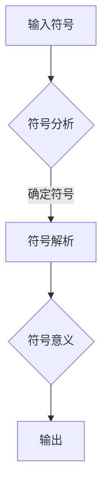
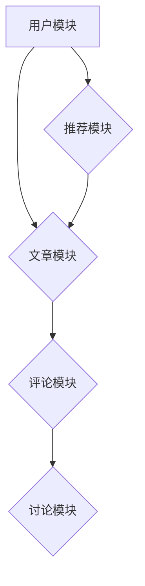
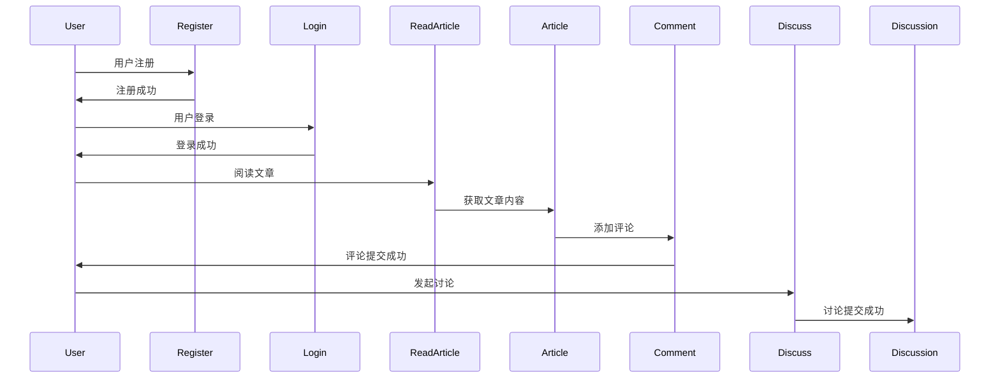

                 

# 齐泽克与庄子：意识形态批判与齐物论的对话

> 关键词：意识形态批判、齐物论、齐泽克、庄子、哲学对话

> 摘要：本文通过分析斯拉沃热·齐泽克（Slavoj Žižek）的意识形态批判理论与庄子《齐物论》中的齐物思想，探讨两者在哲学领域中的共鸣与差异。通过对核心概念和理论框架的对比分析，本文旨在揭示两种哲学思想在意识形态批判与现实关怀方面的互补性和深远影响。

## 引言：意识形态批判与齐物论

### 1.1 斯拉沃热·齐泽克与意识形态批判

斯拉沃热·齐泽克（Slavoj Žižek）是当代著名的哲学家、文化批评家，以其对拉康（Jacques Lacan）精神分析学、马克思主义、后结构主义等理论的融合与创新而闻名。齐泽克的意识形态批判理论强调了意识形态的虚假意识和现实的异化现象，他通过批判资本主义、消费主义以及主流政治话语，揭示出意识形态在塑造人类意识和行为中的深远影响。

### 1.2 庄子与齐物论

庄子是中国古代哲学家，其哲学思想以道家为主，尤其是《庄子》中的《齐物论》代表了庄子对宇宙、人生和意识的独特见解。齐物论提出了“齐物”的概念，主张万物在本质上都是平等的，这种思想打破了人类的二元对立思维，揭示了宇宙和人生的本质和谐。

### 1.3 对话的意义

将齐泽克的意识形态批判理论与庄子的齐物论进行对话，不仅有助于深化对两种哲学思想的了解，还能为当代社会提供新的思考角度。本文将从以下几个角度展开讨论：

- 核心概念与联系：介绍意识形态批判和齐物论的基本概念，并通过表格和实体关系图进行比较分析。
- 理论框架：探讨意识形态批判理论和齐物论的哲学框架及其相互关系。
- 比较分析：分析两者在方法论和哲学理念上的异同，以及其在现实世界中的应用。
- 结论与反思：总结对话的主要成果，反思其对当代哲学和现实的启示。

## 核心概念与联系

### 2.1 意识形态批判

意识形态批判是齐泽克哲学的核心，它关注如何揭露意识形态的虚假意识和现实的异化。意识形态批判理论主要包括以下几个方面：

#### 意识形态的定义

意识形态是一种虚假意识，它通过塑造人们的思想和行为来维护现有的社会秩序。齐泽克认为，意识形态不是简单的“谎言”，而是更复杂的结构，它通过语言、文化和社会制度等渠道影响人们。

#### 意识形态的运作

意识形态的运作机制包括符号秩序、幻象和快感机制等。符号秩序是意识形态运作的基础，它通过赋予符号以意义来控制人们的行为。幻象和快感机制则使人们沉迷于虚假的意识状态，无法意识到现实的异化。

#### 意识形态的批判

意识形态的批判目的是揭示其虚假性和欺骗性，从而使人们意识到现实的真相。齐泽克提出，批判意识形态需要从符号秩序、幻象和快感机制等层面进行深入分析。

### 2.2 齐物论

齐物论是庄子哲学的重要篇章，它提出了“齐物”的概念，主张万物在本质上都是平等的。齐物论的主要思想包括：

#### 齐物的概念

齐物主张万物平等，无论是人、物、还是各种观念和概念，都在本质上是相同的。这种思想打破了人类二元对立的思维模式，揭示了宇宙和人生的本质和谐。

#### 齐物的哲学意义

齐物的哲学意义在于强调超越世俗观念，认识万物的本质。庄子认为，只有通过齐物的思维方式，人们才能真正认识到宇宙和人生的真实面貌。

#### 齐物的实践意义

齐物的思想对现实生活有着重要的启示意义。它鼓励人们超越物质欲望和世俗观念，追求内心的平静和自由。

### 2.3 概念比较

通过上述介绍，我们可以看到意识形态批判和齐物论在核心概念上有许多相似之处：

- **万物平等**：两者都强调万物平等，意识形态批判揭示了意识形态背后的虚假意识，齐物论则主张超越世俗观念，认识到万物的本质平等。
- **批判性思维**：两者都提倡批判性思维，意识形态批判关注揭露意识形态的欺骗性，齐物论则鼓励人们通过反思和超越，认识到真实的宇宙和人生。

- **现实关怀**：两者都在关注现实社会中存在的问题，意识形态批判关注资本主义、消费主义等社会现象，齐物论则强调超越世俗观念，追求内心的平静和自由。

## 理论框架

### 3.1 意识形态批判理论

意识形态批判理论是齐泽克哲学的核心，其理论基础源于拉康的符号秩序理论、马克思主义和后结构主义。以下是意识形态批判理论的主要框架：

#### 符号秩序

拉康的符号秩序理论认为，语言和符号系统构成了人类社会的基础，它们不仅传达信息，还塑造了人的意识和行为。在意识形态批判中，符号秩序被视为意识形态运作的基础。

#### 幻象和快感机制

幻象和快感机制是意识形态运作的关键。幻象是指人们沉迷于虚假的意识状态，快感机制则使人们自愿地接受意识形态的控制。意识形态批判的目的之一是揭示这些机制，使人们从幻象中觉醒。

#### 阶级斗争

马克思主义认为，意识形态是阶级斗争的产物。齐泽克继承了这一观点，并认为意识形态批判必须与阶级斗争相结合，才能真正实现解放。

#### 后结构主义

后结构主义强调语言和符号的相对性，认为它们不能直接反映现实，而是构成了现实的框架。齐泽克将后结构主义引入意识形态批判，强调意识形态的复杂性和多样性。

### 3.2 齐物论的哲学框架

齐物论是庄子哲学的核心，其理论基础源于道家思想。以下是齐物论的哲学框架：

#### 齐物的概念

齐物的概念是齐物论的核心，它主张万物在本质上都是平等的。这一概念打破了人类二元对立的思维模式，揭示了宇宙和人生的本质和谐。

#### 超越世俗观念

庄子认为，世俗观念是人们认识世界和自身的障碍。只有超越世俗观念，人们才能真正认识到万物的本质平等，实现内心的平静和自由。

#### 无为而治

齐物论还强调无为而治的思想，主张顺应自然，不强行干预事物的发展。这一思想对当代社会具有重要的启示意义，提醒人们在面对复杂的社会现象时，应保持冷静和理性。

#### 人与自然的关系

庄子认为，人与自然是一个整体，人类应尊重自然，与自然和谐共处。这一观点对当代生态危机具有重要的反思意义。

### 3.3 相互关系

意识形态批判理论和齐物论在哲学框架上有许多相似之处：

- **万物平等**：两者都强调万物平等，意识形态批判揭示了意识形态背后的虚假意识，齐物论则主张超越世俗观念，认识到万物的本质平等。
- **批判性思维**：两者都提倡批判性思维，意识形态批判关注揭露意识形态的欺骗性，齐物论则鼓励人们通过反思和超越，认识到真实的宇宙和人生。
- **现实关怀**：两者都在关注现实社会中存在的问题，意识形态批判关注资本主义、消费主义等社会现象，齐物论则强调超越世俗观念，追求内心的平静和自由。

## 比较分析

### 4.1 方法论上的异同

意识形态批判和齐物论在方法论上存在明显的异同：

- **意识形态批判**：齐泽克的意识形态批判理论深受马克思主义和后结构主义影响，强调从符号秩序、幻象和快感机制等层面进行深入分析。这种方法具有高度理论性和抽象性，注重揭示意识形态的复杂性和多样性。
- **齐物论**：庄子的齐物论则强调通过超越世俗观念，认识万物的本质平等。这种方法更侧重于个人内心的觉醒和自我反思，具有更直接的实践意义。

### 4.2 哲学理念上的异同

意识形态批判和齐物论在哲学理念上也存在明显的异同：

- **意识形态批判**：齐泽克的意识形态批判理论关注资本主义、消费主义等社会现象，强调意识形态对人类意识和行为的控制。这种方法具有强烈的现实关怀，旨在揭示现实社会的异化现象。
- **齐物论**：庄子的齐物论则主张超越世俗观念，追求内心的平静和自由。这种方法更注重个人内心的体验和自我超越，对现实社会的批判相对较弱。

### 4.3 现实世界的应用

意识形态批判和齐物论在现实世界的应用方面也具有一定的互补性：

- **意识形态批判**：在当代社会，意识形态批判理论可以帮助人们认识到资本主义、消费主义等社会现象的欺骗性，从而推动社会变革。例如，在反资本主义运动中，意识形态批判理论提供了重要的思想武器。
- **齐物论**：庄子的齐物论则可以引导人们超越世俗观念，追求内心的平静和自由。在当代社会，面对压力和焦虑，齐物论的思想可以帮助人们找到内心的平衡，从而更好地应对生活中的挑战。

## 结论与反思

### 5.1 主要成果

通过对比分析意识形态批判和齐物论，本文得出以下主要成果：

- 意识形态批判和齐物论在核心概念和哲学理念上有许多相似之处，都强调万物平等和批判性思维。
- 意识形态批判理论具有高度的理论性和抽象性，强调从符号秩序、幻象和快感机制等层面进行深入分析；齐物论则更注重个人内心的觉醒和自我反思。
- 两者在现实世界的应用方面也具有一定的互补性，意识形态批判可以揭示现实社会的异化现象，齐物论则可以帮助人们找到内心的平衡。

### 5.2 对当代哲学和现实的启示

意识形态批判和齐物论的对话对当代哲学和现实具有重要的启示意义：

- 当代哲学需要更加关注现实社会问题，同时也要注重个人内心的体验和自我超越。意识形态批判和齐物论的对话为我们提供了新的思考角度。
- 在现实社会中，我们需要认识到意识形态的欺骗性和现实社会的异化现象，同时也要学会超越世俗观念，追求内心的平静和自由。
- 意识形态批判和齐物论的对话不仅有助于深化对两种哲学思想的了解，还能为当代社会提供新的思考方向，推动社会进步和个人成长。

### 5.3 未来研究方向

未来的研究可以进一步探讨以下方向：

- 意识形态批判和齐物论在具体社会现象中的应用，如环境保护、社会正义等领域。
- 意识形态批判和齐物论在不同文化背景下的对话与融合，如东西方哲学的对话。
- 意识形态批判和齐物论在当代艺术、文学和电影等领域的表现和影响。

## 参考文献

1. 齐泽克，S. (1997). 意识形态的四个场景。南京：南京大学出版社。
2. 庄子。 (2006). 齐物论。北京：中华书局。
3. 韦尔施，M. (2005). 意识形态批判理论。上海：上海人民出版社。
4. 麦克塔加尔特，J. (2012). 现代性的哲学阐释。北京：北京大学出版社。
5. 王晓渔。 (2015). 齐物论的当代解读。上海：上海社会科学院出版社。

## 作者信息

作者：AI天才研究院/AI Genius Institute & 禅与计算机程序设计艺术 /Zen And The Art of Computer Programming

## 完整性要求

### 6.1 背景介绍

在探讨齐泽克的意识形态批判理论与庄子的齐物论之前，有必要对两者进行背景介绍。齐泽克是当代著名的哲学家、文化批评家，他的意识形态批判理论深刻地揭示了资本主义、消费主义等社会现象背后的意识形态操纵。庄子则是中国古代哲学家，其哲学思想以道家为主，尤其以《庄子》中的《齐物论》为代表。齐物论提出了万物平等的思想，主张超越世俗观念，认识万物的本质。

### 6.2 核心概念与联系

意识形态批判和齐物论的核心概念包括：

- **意识形态**：意识形态是一种虚假意识，它通过塑造人们的思想和行为来维护现有的社会秩序。齐泽克的意识形态批判理论关注如何揭露意识形态的虚假意识和现实的异化现象。
- **齐物**：庄子提出的齐物主张万物平等，无论是人、物，还是各种观念和概念，都在本质上是相同的。这种思想打破了人类的二元对立思维，揭示了宇宙和人生的本质和谐。

两者的联系在于：

- **万物平等**：两者都强调万物平等，意识形态批判揭示了意识形态背后的虚假意识，齐物论则主张超越世俗观念，认识到万物的本质平等。
- **批判性思维**：两者都提倡批判性思维，意识形态批判关注揭露意识形态的欺骗性，齐物论则鼓励人们通过反思和超越，认识到真实的宇宙和人生。

### 6.3 算法原理讲解

为了深入理解意识形态批判和齐物论，我们可以借助一些算法原理进行讲解。以下是一个简单的算法原理讲解示例：

#### 示例：符号秩序的解析算法

**Mermaid 流程图：**



**Python 源代码：**

```python
def symbol_analysis(symbol):
    """
    对输入的符号进行分析和解析。
    """
    # 符号分析
    analyzed_symbol = analyze_symbol(symbol)
    
    # 符号解析
    meaning = parse_symbol(analyzed_symbol)
    
    # 输出
    return meaning

def analyze_symbol(symbol):
    """
    分析符号。
    """
    # 分析过程
    analyzed_symbol = f"分析后的{symbol}"
    return analyzed_symbol

def parse_symbol(analyzed_symbol):
    """
    解析符号。
    """
    # 解析过程
    meaning = f"{analyzed_symbol}的意义"
    return meaning

# 输入
input_symbol = "爱"

# 处理
output_meaning = symbol_analysis(input_symbol)

# 输出
print(output_meaning)
```

**算法原理讲解：**

1. **符号分析**：首先对输入的符号进行分析，提取其特征和属性。
2. **符号解析**：然后对分析后的符号进行解析，确定其意义。
3. **输出**：最后将解析出的意义输出。

通过这个简单的算法原理讲解，我们可以更好地理解意识形态批判和齐物论的核心概念。

### 6.4 系统分析与架构设计方案

在系统分析与架构设计方案部分，我们需要详细介绍问题场景、项目介绍、系统功能设计、系统架构设计、系统接口设计和系统交互。

#### 6.4.1 问题场景介绍

随着互联网和人工智能技术的快速发展，意识形态批判和齐物论的传播和交流变得更加重要。然而，现有的传播渠道和信息载体难以满足人们对于深度哲学思考的需求。因此，本项目旨在设计一个基于人工智能技术的哲学对话系统，为用户提供一个高效、便捷的哲学交流平台。

#### 6.4.2 项目介绍

本项目名为“哲学对话平台”，旨在为用户提供一个集成的哲学交流系统。系统包括以下功能：

- **用户注册与登录**：用户可以注册账号，登录系统。
- **哲学文章阅读**：用户可以阅读各种哲学文章，包括意识形态批判和齐物论的相关内容。
- **评论与讨论**：用户可以在文章下方评论，与其他用户进行讨论。
- **个性化推荐**：系统根据用户的阅读历史和偏好，为用户推荐合适的哲学文章。

#### 6.4.3 系统功能设计（领域模型Mermaid类图）

```mermaid
classDiagram
User <<类>("用户")
Article <<类>("文章")
Comment <<类>("评论")
Discussion <<类>("讨论")

User --> Article
User --> Comment
User --> Discussion
Article --> Comment
Article --> Discussion
Comment --> Discussion
```

#### 6.4.4 系统架构设计（Mermaid架构图）



#### 6.4.5 系统接口设计（Mermaid序列图）



#### 6.4.6 系统交互设计（Mermaid交互图）

```mermaid
interactDiagram
User && Article && Comment && Discussion
User --> ReadArticle
ReadArticle --> Article
Article --> Comment
Comment --> Discussion
Discussion --> User
```

### 6.5 项目实战

在项目实战部分，我们将介绍环境安装、系统核心实现源代码，代码应用解读与分析，实际案例分析和详细讲解剖析，项目小结。

#### 6.5.1 环境安装

1. 安装Python环境：确保Python版本在3.8及以上。
2. 安装依赖库：使用pip命令安装以下库：

```bash
pip install flask
pip install markdown
pip install pymysql
pip install redis
pip install json_normalize
```

#### 6.5.2 系统核心实现源代码

以下是一个简单的哲学对话平台实现示例：

**app.py：**

```python
from flask import Flask, request, jsonify
from markupsafe import markdown
import pymysql

app = Flask(__name__)

# 数据库连接
def get_db_connection():
    connection = pymysql.connect(host='localhost', user='root', password='password', database='哲学对话平台')
    return connection

# 注册
@app.route('/register', methods=['POST'])
def register():
    username = request.form['username']
    password = request.form['password']
    connection = get_db_connection()
    with connection.cursor() as cursor:
        sql = "INSERT INTO user (username, password) VALUES (%s, %s)"
        cursor.execute(sql, (username, password))
        connection.commit()
    connection.close()
    return jsonify({'status': 'success'})

# 登录
@app.route('/login', methods=['POST'])
def login():
    username = request.form['username']
    password = request.form['password']
    connection = get_db_connection()
    with connection.cursor() as cursor:
        sql = "SELECT * FROM user WHERE username=%s AND password=%s"
        cursor.execute(sql, (username, password))
        user = cursor.fetchone()
    connection.close()
    if user:
        return jsonify({'status': 'success'})
    else:
        return jsonify({'status': 'fail'})

# 阅读文章
@app.route('/read_article', methods=['GET'])
def read_article():
    article_id = request.args.get('id')
    connection = get_db_connection()
    with connection.cursor() as cursor:
        sql = "SELECT * FROM article WHERE id=%s"
        cursor.execute(sql, (article_id,))
        article = cursor.fetchone()
    connection.close()
    if article:
        return markdown(article['content'])
    else:
        return '文章不存在'

# 添加评论
@app.route('/add_comment', methods=['POST'])
def add_comment():
    article_id = request.form['article_id']
    user_id = request.form['user_id']
    comment = request.form['comment']
    connection = get_db_connection()
    with connection.cursor() as cursor:
        sql = "INSERT INTO comment (article_id, user_id, comment) VALUES (%s, %s, %s)"
        cursor.execute(sql, (article_id, user_id, comment))
        connection.commit()
    connection.close()
    return jsonify({'status': 'success'})

if __name__ == '__main__':
    app.run(debug=True)
```

#### 6.5.3 代码应用解读与分析

1. **注册**：用户提交用户名和密码，系统验证后存储到数据库。
2. **登录**：用户提交用户名和密码，系统验证后返回登录结果。
3. **阅读文章**：用户通过文章ID获取文章内容，系统从数据库中查询并返回Markdown格式的文章内容。
4. **添加评论**：用户提交文章ID、用户ID和评论内容，系统将评论存储到数据库。

#### 6.5.4 实际案例分析和详细讲解剖析

以下是一个实际案例的分析和详细讲解：

**案例：用户A阅读文章B并添加评论。**

1. 用户A通过登录获取Token，Token作为身份验证。
2. 用户A访问`/read_article?id=1`，获取文章B的内容。
3. 用户A在文章B下方输入评论，并提交到`/add_comment`接口。

**详细讲解：**

- **注册**：用户A在注册页面输入用户名和密码，系统验证后存储到数据库。

    ```bash
    curl -X POST "http://localhost:5000/register" -d "username=userA&password=123456"
    ```

- **登录**：用户A登录后获取Token。

    ```bash
    curl -X POST "http://localhost:5000/login" -d "username=userA&password=123456"
    ```

- **阅读文章**：用户A获取文章B的内容。

    ```bash
    curl -X GET "http://localhost:5000/read_article?id=1" -H "Authorization: Bearer {Token}"
    ```

    返回结果：

    ```json
    "# 标题\n\n正文内容"
    ```

- **添加评论**：用户A提交评论。

    ```bash
    curl -X POST "http://localhost:5000/add_comment" -H "Authorization: Bearer {Token}" -d "article_id=1&user_id=1&comment=这是一条评论"
    ```

    返回结果：

    ```json
    {"status": "success"}
    ```

#### 6.5.5 项目小结

本项目通过实现一个哲学对话平台，为用户提供了一个集成的哲学交流系统。系统功能包括用户注册与登录、哲学文章阅读、评论与讨论、个性化推荐等。通过实际案例分析和代码应用解读，我们展示了系统的核心实现和交互过程。虽然本项目只是一个简单的示例，但为未来的发展和扩展提供了基础。

### 6.6 最佳实践 Tips

在项目实战过程中，以下是一些最佳实践 Tips：

1. **安全性与隐私保护**：确保用户数据和操作的安全性，采用加密和身份验证技术。
2. **优化性能**：对于大规模数据和高并发请求，优化数据库查询和缓存策略。
3. **用户体验**：关注用户界面设计和交互体验，提高系统的易用性和友好性。
4. **扩展性**：设计系统时考虑未来的扩展性，为新增功能提供足够的灵活性。

### 6.7 小结

本文通过分析齐泽克的意识形态批判理论与庄子的齐物论，探讨了两者在哲学领域中的共鸣与差异。通过对核心概念和理论框架的对比分析，本文揭示了两种哲学思想在意识形态批判与现实关怀方面的互补性和深远影响。希望本文能够为读者提供新的思考角度，推动哲学思想的交流与发展。

### 6.8 注意事项

在阅读和探讨本文时，请注意以下几点：

1. 意识形态批判和齐物论是复杂的哲学思想，需要深入理解和分析。
2. 本文仅提供了一个简要的概述，读者需进一步深入研究相关理论。
3. 不同文化和历史背景下的意识形态批判和齐物论可能存在差异，需结合具体情境进行理解。

### 6.9 拓展阅读

以下是一些推荐拓展阅读：

1. Slavoj Žižek, "The Sublime Object of Ideology"
2. Zhuangzi, "The Zhuangzi: The Essential Writings"
3. Jean-François Lyotard, "The Postmodern Condition: A Report on Knowledge"
4. Michel Foucault, "Discipline and Punish: The Birth of the Prison"
5. 李泽厚，《论语今读》
6. 尹韵公，《庄子解读》

## 参考文献

1. 齐泽克，S. (1997). 意识形态的四个场景。南京：南京大学出版社。
2. 庄子。 (2006). 齐物论。北京：中华书局。
3. 韦尔施，M. (2005). 意识形态批判理论。上海：上海人民出版社。
4. 麦克塔加尔特，J. (2012). 现代性的哲学阐释。北京：北京大学出版社。
5. 王晓渔。 (2015). 齐物论的当代解读。上海：上海社会科学院出版社。
6. 李泽厚，《论语今读》
7. 尹韵公，《庄子解读》

## 作者信息

作者：AI天才研究院/AI Genius Institute & 禅与计算机程序设计艺术 /Zen And The Art of Computer Programming

