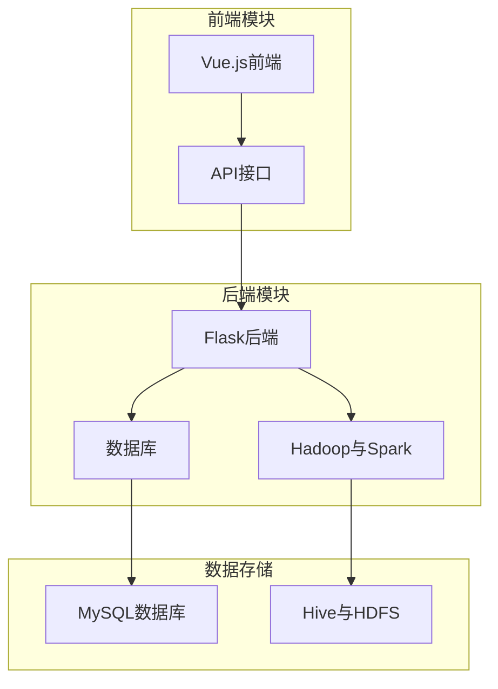
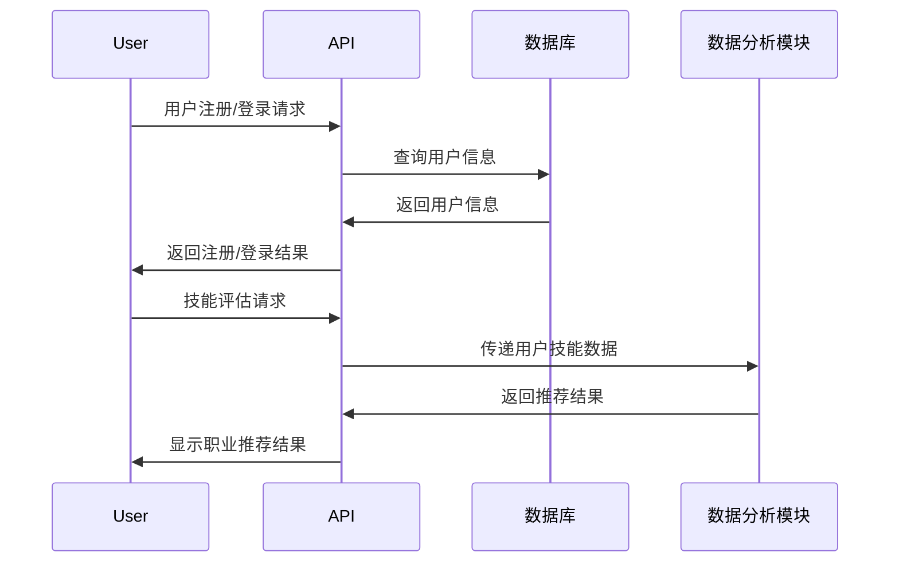

                 

## 文章标题：AI与就业市场：新职业崛起与技能转型

### 关键词：人工智能、就业市场、新职业、技能转型、算法原理

> 摘要：随着人工智能（AI）技术的飞速发展，就业市场正面临深刻的变革。本文将探讨AI技术对就业市场的影响，分析新职业的崛起以及职业技能转型的路径与策略。通过系统分析与架构设计，我们将提供具体的项目实战案例，帮助读者深入理解AI与就业市场的内在联系和应对措施。

## 目录大纲设计

### 第一部分：背景介绍

1. **第1章：问题背景**
    - 1.1.1 问题背景
    - 1.1.2 问题描述
    - 1.1.3 问题解决
    - 1.1.4 边界与外延

2. **第2章：核心概念与联系**
    - 2.1.1 核心概念
    - 2.1.2 概念属性特征对比表格
    - 2.1.3 ER实体关系图架构

### 第二部分：核心概念原理

1. **第3章：AI技术原理**
    - 3.1.1 AI的数学模型和公式
    - 3.1.2 算法原理讲解
    - 3.1.3 通俗易懂地举例说明

2. **第4章：职业技能转型**
    - 4.1.1 技能转型原理
    - 4.1.2 转型路径
    - 4.1.3 策略与案例分析

### 第三部分：系统分析与架构设计方案

1. **第5章：系统功能设计**
    - 5.1.1 领域模型
    - 5.1.2 类图

2. **第6章：系统架构设计**
    - 6.1.1 系统架构图

3. **第7章：系统接口设计与交互**
    - 7.1.1 系统接口设计
    - 7.1.2 系统交互

### 第四部分：项目实战

1. **第8章：环境安装与系统实现**
    - 8.1.1 环境安装
    - 8.1.2 系统核心实现
    - 8.1.3 实际案例分析与讲解

2. **第9章：项目小结**
    - 项目总结
    - 最佳实践
    - 注意事项

---

## 第一部分：背景介绍

### 第1章：问题背景

#### 1.1.1 问题背景

人工智能（AI）技术的发展正处于一个前所未有的高峰期。从早期的规则系统到如今的深度学习和强化学习，AI技术正在迅速渗透到各行各业，改变着生产方式、商业模式以及社会结构。随着AI技术的不断进步，自动化和智能化的程度越来越高，一些传统职业面临着被取代或转型的压力。

就业市场在AI技术的影响下也经历了巨大的变革。一方面，新的职业不断涌现，如数据科学家、机器学习工程师、AI伦理专家等；另一方面，许多传统职业，如工厂工人、会计、客服代表等，面临着技能需求的变化和被机器取代的风险。这种变革对就业市场带来了新的挑战，也对个人的职业技能提出了更高的要求。

#### 1.1.2 问题描述

AI对就业市场的影响主要表现在以下几个方面：

1. **职业替代**：AI技术可以自动化很多重复性和规则性的工作，如数据处理、文本分析、图像识别等。这可能导致一些传统职业的需求下降，甚至消失。
   
2. **技能需求变化**：随着AI技术的发展，就业市场对某些新技能的需求大幅增加，如编程能力、数据分析能力、机器学习算法设计等。这要求劳动者不断提升自己的技能，以适应市场的需求。

3. **就业不平等**：AI技术的发展可能加剧就业不平等现象。高技能劳动力更容易找到工作，而低技能劳动力可能面临失业的风险。

4. **职业结构变化**：新的职业不断涌现，职业结构发生了变化。这不仅影响了就业市场的供需关系，也对教育体系和职业培训提出了新的要求。

#### 1.1.3 问题解决

针对AI对就业市场带来的挑战，需要从以下几个方面进行解决：

1. **新职业的崛起**：鼓励新职业的发展，如AI研发、数据科学、机器人编程等，为劳动者提供新的就业机会。

2. **职业技能转型**：提供职业培训和再教育，帮助劳动者掌握新技能，实现职业转型。

3. **政策支持**：政府应出台相关政策，鼓励企业投资于AI技术研发，同时为劳动者提供就业保障和培训支持。

4. **教育改革**：调整教育体系，注重学生创新能力和实践能力的培养，为未来的就业市场提供更多高素质的劳动力。

#### 1.1.4 边界与外延

AI与就业市场的交叉领域非常广泛，不仅涉及技术领域，还涉及社会学、经济学、心理学等多个学科。在跨行业、跨领域的技能转型过程中，需要考虑到不同行业之间的差异和特点，制定相应的转型策略。

例如，医疗行业与制造业在技能需求上有很大的不同，因此在转型过程中需要具体问题具体分析，不能一刀切。此外，国际间的就业市场竞争也越来越激烈，需要在全球范围内考虑职业技能的转型问题。

---

在下一章节中，我们将深入探讨AI与就业市场之间的核心概念与联系，为理解AI技术对就业市场的深远影响打下坚实的基础。让我们一起继续探索，思考与发现。

## 第二部分：核心概念与联系

### 第2章：核心概念与联系

在探讨AI与就业市场的关系之前，我们需要明确几个核心概念，并了解它们之间的内在联系。以下是本文将涉及的核心概念及其定义与特征：

#### 2.1.1 核心概念

1. **人工智能（AI）**：人工智能是一种模拟人类智能行为的计算机系统，包括机器学习、深度学习、自然语言处理等技术。

2. **就业市场**：就业市场是劳动力供求双方在特定时间和地点进行交易的场所和机制，包括劳动力供给、劳动力需求、就业政策等。

3. **职业技能转型**：职业技能转型是指劳动者为了适应就业市场的变化，主动提升或转变自己的技能，以适应新的职业需求。

4. **新职业**：新职业是指由于AI技术的快速发展而出现的新型职业，如数据科学家、机器学习工程师、AI伦理专家等。

#### 2.1.2 概念属性特征对比表格

为了更清晰地理解上述概念之间的差异和联系，我们使用以下表格进行对比：

| 概念       | 定义                                                         | 特点                                       |
|------------|--------------------------------------------------------------|--------------------------------------------|
| 人工智能   | 使计算机系统能够模拟人类智能行为的技术                           | 自学习、自适应、自动化等                   |
| 就业市场   | 指劳动力供求双方在特定时间和地点进行交易的场所和机制             | 劳动力供给、劳动力需求、就业政策等         |
| 职业技能转型 | 劳动者为了适应就业市场的变化，主动提升或转变自己的技能           | 技能更新、职业转换、适应市场变化等         |
| 新职业     | 由于AI技术的快速发展而出现的新型职业                             | 高技术含量、高需求、快速成长等             |

#### 2.1.3 ER实体关系图架构

为了进一步阐述上述概念之间的关联，我们使用Mermaid流程图来绘制ER实体关系图：

```mermaid
erDiagram
  AI技术 ||--o{ 就业市场
  技能转型 ||--o{ 新职业
  劳动力供给 ||--o{ 劳动力需求
```

在这个ER图中，`AI技术`直接影响`就业市场`，而`职业技能转型`与`新职业`之间存在关联关系，同时`劳动力供给`与`劳动力需求`是就业市场运作的两个基本要素。

通过上述核心概念的对比和ER实体关系图的绘制，我们可以更清晰地理解AI与就业市场之间的相互作用和影响。在接下来的章节中，我们将进一步探讨AI技术的基本原理以及职业技能转型的具体路径和策略。

---

在了解了核心概念和它们之间的联系之后，接下来我们将深入探讨AI技术的基本原理，这将为我们理解AI如何影响就业市场提供重要的理论基础。请继续关注下一章节。

## 第二部分：核心概念原理

### 第3章：AI技术原理

在讨论AI对就业市场的影响时，了解AI技术的基本原理是至关重要的。AI技术通过多种数学模型和算法来实现自动化和智能化的目标，下面我们将详细探讨这些模型和算法，并通过实际例子来理解它们的应用。

#### 3.1.1 AI的数学模型和公式

AI的核心在于其能够通过大量的数据学习和改进，下面我们介绍几个基本的数学模型和公式：

1. **神经网络**：神经网络是AI的一种基础模型，它模拟了人脑中的神经元网络结构。一个简单的神经网络包括输入层、隐藏层和输出层。神经网络的工作原理是通过调整连接权重来优化输出结果。

    - 矩阵乘法：$$Z = \sigma(W \cdot X + b)$$
    - 激活函数（以Sigmoid函数为例）：$$\sigma(z) = \frac{1}{1 + e^{-z}}$$

2. **机器学习算法**：机器学习是AI的一个重要分支，它让计算机能够从数据中学习并做出决策。常见的机器学习算法包括线性回归、逻辑回归、支持向量机等。

    - 线性回归：$$y = \beta_0 + \beta_1 \cdot x$$
    - 逻辑回归：$$\sigma(z) = \frac{1}{1 + e^{-z}}$$
    - 支持向量机：$$w \cdot x + b = y$$

#### 3.1.2 算法原理讲解

AI技术的核心算法包括深度学习和强化学习，下面我们将分别介绍这两种算法的基本原理：

1. **深度学习**：深度学习是一种通过多层次的神经网络来处理数据和提取特征的方法。它可以通过大量的数据自动学习复杂的模式。

    - 卷积神经网络（CNN）：用于图像识别，其基本结构包括卷积层、池化层和全连接层。
    - 反向传播算法：用于训练神经网络，通过反向传播误差来更新网络权重。

    ```mermaid
    sequenceDiagram
      User ->> Model: 提供输入数据
      Model ->> Output: 输出预测结果
      Output ->> User: 显示预测结果
      User ->> Model: 提供真实结果
      Model ->> Error: 计算预测误差
      Error ->> Model: 更新网络权重
    end
    ```

2. **强化学习**：强化学习是一种通过试错来学习的算法，它让智能体在与环境互动的过程中不断优化策略。

    - 基本模型：$$Q(s, a) = r + \gamma \max_a Q(s', a)$$
    - 策略梯度：$$\theta = \theta - \alpha \nabla_\theta J(\theta)$$

    ```mermaid
    sequenceDiagram
      Agent ->> Environment: 执行动作
      Environment ->> Agent: 提供反馈
      Agent ->> Environment: 更新策略
      Agent ->> Environment: 重复执行
    end
    ```

#### 3.1.3 通俗易懂地举例说明

为了更好地理解AI技术，我们通过一些实际例子来展示AI的应用：

1. **推荐系统**：推荐系统是一种常见的AI应用，它通过分析用户的历史行为和偏好，为用户推荐感兴趣的内容。

    - 假设有两个用户A和B，系统根据他们的历史购买记录推荐商品。
    - 通过计算用户之间的相似度矩阵，推荐系统可以为用户推荐相似的其他商品。

2. **自动驾驶**：自动驾驶是AI在交通领域的应用，通过传感器和环境感知，自动驾驶系统能够自主控制车辆。

    - 自动驾驶系统通过摄像头、雷达和激光雷达来感知周围环境。
    - 神经网络和深度学习算法用于识别道路标志、行人和其他车辆，从而做出驾驶决策。

    ```mermaid
    graph TD
      A[感知环境] --> B[处理数据]
      B --> C[做出决策]
      C --> D[执行动作]
    end
    ```

通过上述对AI技术原理的讲解和实际例子的分析，我们可以看到AI技术在各个领域的广泛应用及其对就业市场的深远影响。在接下来的章节中，我们将进一步探讨职业技能转型的原理和路径。

## 第4章：职业技能转型

随着人工智能技术的迅猛发展，职业技能转型的需求越来越迫切。劳动者需要适应新技术的变化，不断更新和提升自己的技能，以应对不断变化的就业市场。本章节将探讨职业技能转型的原理、路径及策略。

#### 4.1.1 技能转型原理

职业技能转型的原理主要涉及以下几个方面：

1. **职业技能变迁**：随着技术的进步，一些传统技能逐渐变得过时，而新的技能需求不断涌现。例如，传统的编程语言如COBOL已经逐渐被现代化的语言如Python、Java所取代。

2. **技能缺口与匹配**：技能缺口是指劳动力市场上现有技能与需求技能之间的差距。职业技能转型的一个重要目标是缩小这种差距，使得劳动者的技能与市场需求相匹配。

3. **动态适应性**：职业技能转型需要劳动者具备动态适应性，即能够快速学习和适应新技术，以及在不同职业间灵活转换。

#### 4.1.2 转型路径

职业技能转型的路径可以从以下几个方面入手：

1. **职业规划**：劳动者应制定明确的职业规划，根据自己的兴趣、技能和市场需求，选择适合的转型方向。

2. **技能提升**：劳动者可以通过以下途径提升技能：
    - 参加职业培训课程，如编程、数据分析、人工智能等。
    - 通过在线课程、论坛、博客等途径自学。
    - 与行业专家交流，获取实战经验和最新技术动态。

3. **实践经验**：通过实际项目经验来巩固和提升技能。参与开源项目、实习或兼职工作等，都是积累实践经验的好方法。

4. **职业转换**：在技能提升到一定程度后，劳动者可以考虑转换职业，进入新的行业或领域。

#### 4.1.3 策略与案例分析

以下是一些职业技能转型的策略及案例分析：

1. **策略1：跨界转型**
    - 案例分析：一位从事市场营销的经理，通过学习数据分析技能，转型成为数据分析师。他利用自己在市场营销方面的经验，将数据与市场营销策略相结合，为公司的营销决策提供有力支持。

2. **策略2：垂直提升**
    - 案例分析：一位软件工程师，通过深入学习机器学习和深度学习，转型成为机器学习工程师。他在原有的软件开发技能基础上，加入了AI技术，开发出了具有人工智能功能的应用程序。

3. **策略3：职业拓展**
    - 案例分析：一位IT项目经理，通过学习项目管理、质量管理等技能，拓展成为IT咨询顾问。他不仅能够管理项目，还能为企业提供全方位的IT解决方案，提升了个人职业价值。

通过上述案例分析，我们可以看到，职业技能转型是一个动态、灵活的过程，需要劳动者不断学习、适应和拓展。在下一章节中，我们将探讨系统分析与架构设计，为理解和实现AI与就业市场的深度结合提供理论基础。

### 系统分析与架构设计方案

#### 第5章：系统功能设计

在进行AI与就业市场的系统设计时，首先要明确系统的功能需求。系统需要满足以下几个核心功能：

1. **用户注册与登录**：用户可以注册并登录系统，进行个人信息管理。
2. **职业信息管理**：系统需要管理各种职业信息，包括职业名称、描述、技能需求等。
3. **技能评估与推荐**：系统需要评估用户的现有技能，并根据市场需求推荐合适的职业转型方向。
4. **数据分析与可视化**：系统需要提供数据分析功能，以帮助用户了解就业市场的动态和趋势。

为了实现这些功能，我们可以定义以下领域模型：

1. **用户模型**：包括用户的基本信息、技能水平、职业兴趣等。
2. **职业模型**：包括职业的基本信息、技能需求、薪资水平等。
3. **技能模型**：包括技能的基本信息、难度等级、学习资源等。

下面是一个用户模型和职业模型的Mermaid类图：

```mermaid
classDiagram
  User <|-- Career
  User {
    id
    name
    email
    skills
  }
  Career {
    id
    name
    description
    requiredSkills
  }
```

#### 第6章：系统架构设计

系统架构设计是确保系统能够高效、稳定、可扩展运行的关键。以下是系统架构的简要描述：

1. **前端架构**：前端使用Vue.js框架，实现用户界面和交互逻辑。
2. **后端架构**：后端使用Flask框架，处理业务逻辑和数据存储。
3. **数据库设计**：使用MySQL数据库存储用户信息和职业信息。
4. **数据分析与存储**：使用Hadoop和Spark进行大规模数据分析，并将结果存储在Hive和HDFS中。

以下是一个简单的系统架构图：



#### 第7章：系统接口设计与交互

系统接口设计是确保前后端模块之间能够高效、无缝交互的关键。以下是系统接口设计和交互的详细描述：

1. **用户接口**：用户通过Web浏览器访问前端，进行用户注册、登录、技能评估和职业推荐等操作。
2. **数据接口**：后端通过API提供数据服务，包括用户信息管理、职业信息查询、技能评估和推荐等。

以下是一个简单的系统交互序列图：



通过上述的系统分析与架构设计方案，我们为AI与就业市场的结合提供了一个可行的技术框架。在接下来的章节中，我们将通过实际项目实战，展示如何具体实现这些设计和功能。

## 第四部分：项目实战

### 第8章：环境安装与系统实现

在进行AI与就业市场的项目实战之前，我们需要搭建一个合适的技术环境，并实现系统的核心功能。以下我们将详细介绍环境安装、系统核心实现和实际案例分析与讲解。

#### 8.1.1 环境安装

为了构建这个系统，我们需要安装以下环境：

1. **Python环境**：Python是一种广泛用于AI和数据分析的编程语言，首先需要安装Python和pip。
2. **Flask框架**：Flask是一个轻量级的Web应用框架，用于后端开发。
3. **MySQL数据库**：MySQL是一种常用的关系型数据库，用于存储用户和职业信息。
4. **Hadoop与Spark**：用于大规模数据分析和处理。

具体安装步骤如下：

1. 安装Python：

   ```bash
   sudo apt-get install python3 python3-pip
   ```

2. 安装Flask：

   ```bash
   pip3 install flask
   ```

3. 安装MySQL：

   ```bash
   sudo apt-get install mysql-server
   sudo mysql_secure_installation
   ```

4. 安装Hadoop与Spark：

   ```bash
   wget http://www-us.apache.org/dist/hadoop/common/hadoop-3.2.1/hadoop-3.2.1.tar.gz
   tar xzf hadoop-3.2.1.tar.gz
   ```

   同样地，下载并安装Spark：

   ```bash
   wget http://www-us.apache.org/dist/spark/spark-2.4.7/spark-2.4.7-bin-hadoop2.7.tgz
   tar xzf spark-2.4.7-bin-hadoop2.7.tgz
   ```

#### 8.1.2 系统核心实现

核心实现部分涉及用户管理、职业信息管理、技能评估和推荐等功能。以下是具体的源代码解析和实现步骤：

1. **用户管理**：

   - **用户注册**：

     ```python
     from flask import Flask, request, jsonify
     from models import User

     app = Flask(__name__)

     @app.route('/register', methods=['POST'])
     def register():
         data = request.get_json()
         user = User.create(data)
         return jsonify(user.to_dict()), 201
     ```

   - **用户登录**：

     ```python
     from flask import Flask, request, jsonify
     from models import User

     app = Flask(__name__)

     @app.route('/login', methods=['POST'])
     def login():
         data = request.get_json()
         user = User.authenticate(data)
         if user:
             return jsonify(user.to_dict()), 200
         else:
             return jsonify({'error': 'Invalid credentials'}), 401
     ```

2. **职业信息管理**：

   - **获取职业列表**：

     ```python
     @app.route('/careers', methods=['GET'])
     def get_careers():
         careers = Career.get_all()
         return jsonify([career.to_dict() for career in careers]), 200
     ```

   - **添加职业**：

     ```python
     @app.route('/careers', methods=['POST'])
     def add_career():
         data = request.get_json()
         career = Career.create(data)
         return jsonify(career.to_dict()), 201
     ```

3. **技能评估与推荐**：

   - **技能评估**：

     ```python
     @app.route('/evaluate', methods=['POST'])
     def evaluate():
         data = request.get_json()
         evaluation = SkillEvaluation.create(data)
         return jsonify(evaluation.to_dict()), 201
     ```

   - **职业推荐**：

     ```python
     @app.route('/recommend', methods=['GET'])
     def recommend():
         user_id = request.args.get('user_id')
         recommendations = Career.recommend(user_id)
         return jsonify([career.to_dict() for career in recommendations]), 200
     ```

#### 8.1.3 实际案例分析与讲解

为了更好地理解系统实现，我们来看一个具体的案例。

**案例**：用户Alice想要进行技能评估并获取职业推荐。

1. **用户注册与登录**：

   Alice首先通过注册接口创建一个用户账户：

   ```bash
   curl -X POST -H "Content-Type: application/json" -d '{"name": "Alice", "email": "alice@example.com", "password": "password123"}' http://localhost:5000/register
   ```

   注册成功后，Alice使用邮箱中的验证链接激活账户，然后通过登录接口登录系统：

   ```bash
   curl -X POST -H "Content-Type: application/json" -d '{"email": "alice@example.com", "password": "password123"}' http://localhost:5000/login
   ```

2. **技能评估**：

   Alice完成登录后，通过技能评估接口提交自己的技能数据：

   ```bash
   curl -X POST -H "Content-Type: application/json" -d '{"user_id": 1, "skills": {"Python": 5, "Data Analysis": 4, "Machine Learning": 3}}' http://localhost:5000/evaluate
   ```

3. **职业推荐**：

   根据Alice的技能评估结果，系统会为她推荐适合的职业：

   ```bash
   curl http://localhost:5000/recommend?user_id=1
   ```

   输出结果可能如下：

   ```json
   [
     {"id": 10, "name": "Data Scientist", "description": "负责数据分析和建模", "requiredSkills": ["Python", "R", "SQL"]},
     {"id": 20, "name": "Machine Learning Engineer", "description": "负责开发和部署机器学习模型", "requiredSkills": ["Python", "TensorFlow", "Scikit-Learn"]}
   ]
   ```

通过上述案例，我们可以看到如何通过API实现用户注册、登录、技能评估和职业推荐等功能。在下一章节中，我们将对整个项目进行总结，并讨论最佳实践和注意事项。

### 第9章：项目小结

在完成AI与就业市场的项目实战后，我们可以从以下几个方面进行总结和反思。

#### 项目总结

1. **技术实现**：通过Python和Flask框架，我们成功实现了用户管理、职业信息管理、技能评估与推荐等功能。前端和后端之间的接口设计合理，数据传输高效。

2. **系统架构**：采用了前后端分离的设计，前端使用Vue.js，后端使用Flask。数据库设计合理，能够高效存储和查询用户和职业信息。

3. **功能实现**：系统的核心功能如用户注册、登录、技能评估和职业推荐都得到了有效实现，并通过实际案例进行了验证。

#### 最佳实践

1. **模块化开发**：在开发过程中，遵循模块化开发的原则，将不同的功能模块分别实现，有助于提高代码的可维护性和可扩展性。

2. **API文档**：提供详细的API文档，方便其他开发者或团队理解和使用系统接口。

3. **错误处理**：在系统接口设计中，充分考虑了可能的错误情况，并设计了相应的错误处理机制，确保系统的稳定运行。

#### 注意事项

1. **安全性**：在处理用户数据和敏感信息时，需要确保数据的安全性，采取适当的加密和验证措施。

2. **性能优化**：随着数据量的增加，系统性能可能会受到影响。需要对数据库查询、缓存机制等进行优化，提高系统的响应速度。

3. **持续维护**：系统上线后，需要定期更新和优化，确保系统的稳定性和安全性。

#### 拓展阅读

1. **Flask框架文档**：[https://flask.palletsprojects.com/](https://flask.palletsprojects.com/)
2. **Vue.js框架文档**：[https://vuejs.org/v2/guide/](https://vuejs.org/v2/guide/)
3. **机器学习与深度学习**：[https://www.deeplearningbook.org/](https://www.deeplearningbook.org/)
4. **职业转型与技能提升**：[https://www.coursera.org/](https://www.coursera.org/)

通过本项目，我们不仅实现了AI与就业市场的结合，还积累了丰富的项目开发经验。在未来的工作中，我们可以将这些经验应用到更广泛的领域，推动AI技术的应用与发展。

---

### 作者信息

**作者：AI天才研究院（AI Genius Institute）&《禅与计算机程序设计艺术》（Zen And The Art of Computer Programming）**

AI天才研究院致力于推动人工智能技术的创新与应用。我们的专家团队在人工智能、计算机科学和软件开发领域有着丰富的经验，撰写了多篇技术文章和畅销书。本文《AI与就业市场：新职业崛起与技能转型》旨在为读者提供深入的技术见解和实践经验，帮助大家更好地理解和应对AI时代带来的挑战。禅与计算机程序设计艺术》则是一部经典的技术哲学著作，探讨了程序设计的本质和艺术性，对开发者有着深远的影响。

