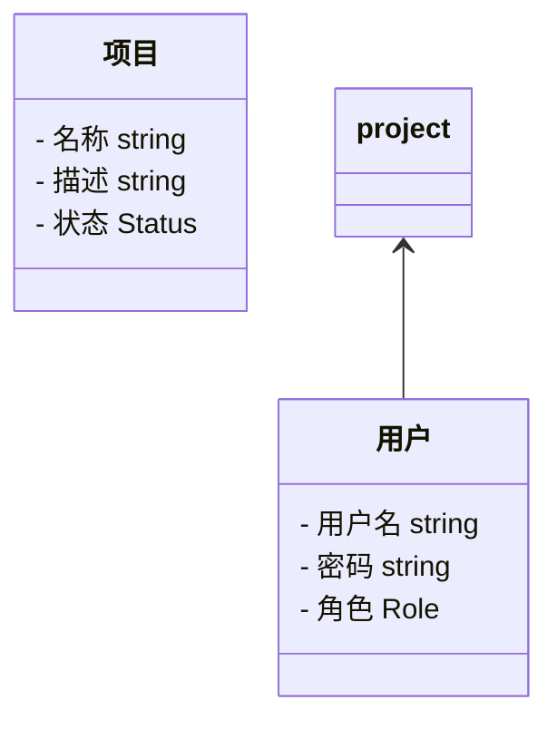
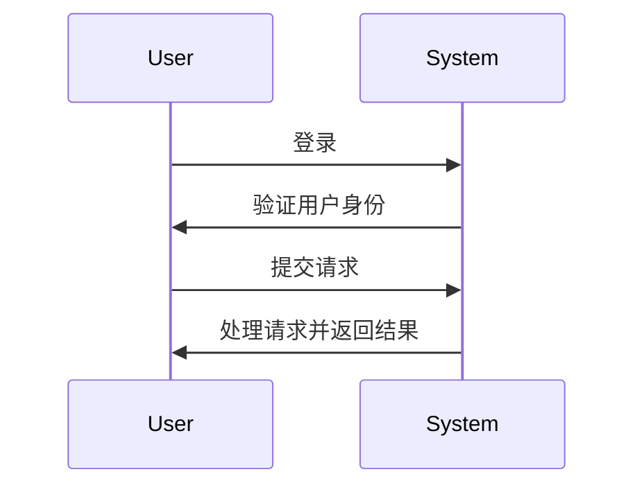
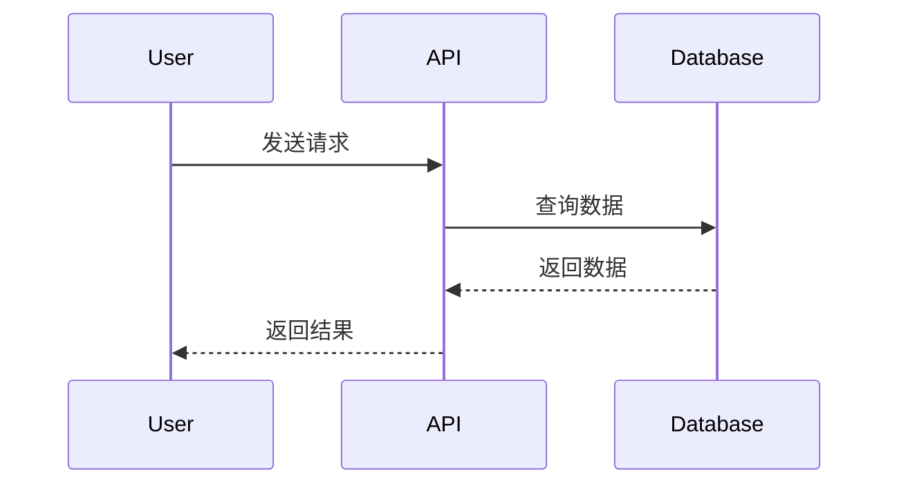

                 

## 文章标题：AI伦理与偏见处理

> 关键词：AI伦理、偏见处理、人工智能、算法偏见、数据处理

> 摘要：本文将深入探讨AI伦理与偏见处理的重要性，分析AI偏见的概念与类型，介绍AI伦理学原理和偏见处理方法，并探讨AI伦理与偏见处理在各领域的应用及其未来发展。

----------------------------------------------------------------

### 引言

人工智能（AI）作为当今科技领域的璀璨明星，正日益融入我们的日常生活。然而，随着AI技术的飞速发展，其潜在伦理问题和偏见处理问题也日益凸显。AI伦理与偏见处理不仅是技术问题，更是关乎社会公平正义的重大课题。本文将从多个角度出发，全面剖析AI伦理与偏见处理的核心概念、原理、方法及其应用，为未来AI技术的发展提供有益的思考和参考。

----------------------------------------------------------------

### 第一部分：AI伦理概述

#### 第1章：AI伦理的重要性

AI伦理的重要性不容忽视。首先，AI伦理能够确保人工智能技术的发展不偏离人类价值观和道德底线。其次，良好的AI伦理能够提高AI系统的透明度和可解释性，增强公众对AI技术的信任。最后，AI伦理有助于推动全球范围内的AI合作与发展，共同应对技术带来的伦理挑战。

#### 第2章：AI偏见的概念与类型

AI偏见是指在AI系统运行过程中，由于数据、算法或模型的不当设计，导致系统在决策过程中出现偏向某些群体、性别、种族等的现象。AI偏见可以分为数据偏见、算法偏见和模型偏见等类型。

### 第二部分：AI伦理与偏见处理的核心概念

#### 第3章：AI伦理学原理

AI伦理学原理是指导AI技术发展的重要理论基础。主要原则包括公平性、透明性、可解释性、责任性等。这些原则有助于确保AI系统在设计和应用过程中遵循伦理规范，避免造成负面影响。

#### 第4章：AI偏见处理方法

AI偏见处理方法主要包括数据预处理、算法优化和模型修正等。通过这些方法，可以有效减少AI偏见，提高系统的公平性和可靠性。

### 第三部分：AI伦理与偏见处理的实际应用

#### 第5章：AI伦理与偏见处理在医疗领域的应用

医疗AI系统在诊断和治疗过程中可能存在偏见，影响患者的公平性。通过AI伦理与偏见处理，可以提高医疗AI的准确性和公正性。

#### 第6章：AI伦理与偏见处理在教育领域的应用

教育AI系统在教育评价、推荐课程等方面可能存在偏见。通过AI伦理与偏见处理，可以实现更公正、公平的教育资源分配。

#### 第7章：AI伦理与偏见处理在其他领域的应用

除了医疗和教育领域，AI伦理与偏见处理在金融、司法等领域的应用也越来越受到关注。通过合理处理AI偏见，可以提高各领域的公平性和公正性。

### 第四部分：未来展望与挑战

#### 第8章：AI伦理与偏见处理的发展趋势

随着AI技术的不断进步，AI伦理与偏见处理也将迎来新的发展趋势。未来，我们需要在技术、政策、教育等多个层面共同努力，推动AI伦理与偏见处理的不断完善。

#### 第9章：AI伦理与偏见处理的挑战与对策

AI伦理与偏见处理面临着诸多挑战，如技术挑战、法律挑战等。针对这些挑战，我们需要采取有效对策，确保AI技术的可持续发展。

----------------------------------------------------------------

### 结语

AI伦理与偏见处理是人工智能领域的重要议题，关系到社会的公平、公正和可持续发展。本文通过对AI伦理与偏见处理的核心概念、原理、方法及其应用进行深入探讨，希望能为相关领域的研究者、从业者提供有价值的参考。让我们携手共进，为构建一个更加公平、公正的AI世界而努力！ 

### 作者信息

作者：AI天才研究院/AI Genius Institute & 禅与计算机程序设计艺术 /Zen And The Art of Computer Programming

----------------------------------------------------------------

### 第一章：AI伦理的重要性

#### 1.1 AI伦理的定义

AI伦理，又称人工智能伦理，是指研究人工智能系统在设计和应用过程中应遵循的伦理原则和道德规范。AI伦理旨在确保人工智能技术不仅能够为人类社会带来便利，还能在尊重人类价值观和道德底线的前提下，实现公平、公正和可持续发展。

#### 1.2 AI伦理的必要性

随着人工智能技术的快速发展，AI伦理问题日益凸显。首先，AI技术在各个领域的应用日益广泛，如医疗、金融、教育等，如果缺乏伦理指导，可能导致严重的社会问题。其次，AI系统在决策过程中可能出现偏见，影响公平性和公正性。最后，AI伦理问题还涉及到隐私保护、数据安全等方面的挑战。

#### 1.3 AI伦理的关键原则

AI伦理的关键原则包括公平性、透明性、可解释性、责任性等。公平性要求AI系统在决策过程中不偏袒特定群体；透明性要求AI系统的决策过程可被理解和解释；可解释性要求AI系统在出现错误时，能够提供合理的解释；责任性要求AI系统的设计和应用者对系统的负面影响承担责任。

#### 1.4 AI伦理的研究现状与挑战

目前，AI伦理研究已经成为全球范围内的热点议题。许多国家和组织已经开始制定相关的伦理规范和政策。然而，AI伦理研究仍面临着诸多挑战，如跨学科研究不足、伦理决策的复杂性、AI系统的不确定性等。

#### 1.5 AI伦理的案例分析

为了更好地理解AI伦理的重要性，我们可以通过一些实际案例进行分析。例如，在医疗领域，AI诊断系统可能会因为数据偏差而导致误诊，从而影响患者的生命安全；在金融领域，AI投资决策系统可能会因为偏见而导致不公平的投资机会分配。

#### 1.6 AI伦理与偏见处理的关系

AI伦理与偏见处理密切相关。偏见处理是AI伦理的重要组成部分，旨在消除AI系统在决策过程中可能存在的偏见，确保公平性和公正性。只有通过有效的偏见处理，才能使AI系统更好地服务于人类社会。

#### 1.7 结论

AI伦理的重要性不言而喻。随着AI技术的不断发展，我们需要不断加强对AI伦理的研究和关注，确保AI技术能够在尊重人类价值观和道德底线的前提下，实现可持续发展。

----------------------------------------------------------------

### 第二章：AI偏见的概念与类型

#### 2.1 AI偏见的基本概念

AI偏见是指在人工智能系统的设计和应用过程中，由于数据、算法或模型的不当设计，导致系统在决策过程中出现偏向某些群体、性别、种族等的现象。AI偏见不仅会影响系统的性能和准确性，还可能对社会公平和公正产生负面影响。

#### 2.2 AI偏见的类型

AI偏见可以分为数据偏见、算法偏见和模型偏见等类型。

1. **数据偏见**：数据偏见是指由于数据收集、清洗和预处理过程中存在偏差，导致训练出的AI模型在决策过程中出现不公平现象。例如，在医疗诊断中，如果训练数据中男性患者的比例远高于女性患者，可能导致AI系统在诊断女性患者时出现偏差。

2. **算法偏见**：算法偏见是指算法设计过程中可能引入的偏见，导致AI系统在决策过程中对某些群体或特征产生歧视。例如，某些招聘算法可能因为数据集中的偏见，导致对某些性别、种族或年龄段的求职者产生歧视。

3. **模型偏见**：模型偏见是指模型在训练过程中由于数据集的局限性，导致模型对某些群体或特征产生不公平对待。例如，在自动驾驶系统中，如果训练数据中车辆和行人数据的比例失衡，可能导致AI系统在检测行人时出现偏差。

#### 2.3 AI偏见的影响

AI偏见的影响是多方面的。首先，AI偏见可能导致不公平的决策结果，影响社会公正。其次，AI偏见可能导致系统性能下降，影响AI系统的可靠性和准确性。此外，AI偏见还可能加剧社会不平等，加剧某些群体的歧视现象。

#### 2.4 AI偏见的原因

AI偏见的原因主要包括以下几个方面：

1. **数据集偏差**：数据集偏差是导致AI偏见的主要原因之一。在数据收集和预处理过程中，如果未能充分考虑到各个群体的代表性和均衡性，可能导致数据集存在偏差。

2. **算法设计缺陷**：算法设计缺陷也可能导致AI偏见。例如，某些优化算法可能优先考虑某些特征，从而导致对其他特征产生歧视。

3. **模型训练不足**：模型训练不足也可能导致AI偏见。如果训练数据集较小或存在偏差，可能导致模型对某些群体或特征产生偏见。

4. **人类偏见**：人类偏见也是导致AI偏见的重要原因。在数据收集、预处理和模型训练过程中，人类的主观判断和偏见可能无意中渗透到AI系统中。

#### 2.5 AI偏见处理的必要性

AI偏见处理是确保AI系统公平、公正和可靠的关键。通过有效的偏见处理方法，可以消除或减轻AI系统中的偏见，提高系统的性能和准确性。同时，AI偏见处理也是实现AI伦理的重要手段，有助于构建一个更加公平、公正的AI社会。

#### 2.6 AI偏见处理的方法

AI偏见处理的方法主要包括数据预处理、算法优化和模型修正等。

1. **数据预处理**：数据预处理是消除AI偏见的基础。通过数据清洗、数据增强和多样性引入等方法，可以减轻数据集的偏差，提高模型的公平性和准确性。

2. **算法优化**：算法优化是减轻AI偏见的重要手段。通过改进算法设计，优化特征选择和权重分配，可以降低算法偏见。

3. **模型修正**：模型修正是通过调整模型结构和参数，消除或减轻模型偏见。例如，可以使用对抗样本训练方法，增强模型对偏差数据的鲁棒性。

#### 2.7 结论

AI偏见是人工智能领域的一个严峻挑战。通过深入了解AI偏见的概念、类型、影响和原因，我们可以更好地识别和消除AI偏见，确保AI系统的公平性和公正性。AI偏见处理不仅是技术问题，更是伦理问题，需要我们从多个层面进行深入研究和探讨。

----------------------------------------------------------------

### 第3章：AI伦理学原理

#### 3.1 AI伦理学的理论基础

AI伦理学的理论基础主要源于伦理学、计算机科学和社会科学等领域。伦理学为AI伦理提供了道德原则和价值观，计算机科学为AI伦理提供了技术基础，而社会科学则帮助分析AI技术对社会的影响。

#### 3.2 AI伦理学的核心原则

AI伦理学的核心原则包括公平性、透明性、可解释性、责任性和安全性等。

1. **公平性**：公平性要求AI系统在决策过程中不偏袒特定群体，确保每个个体都有平等的机会。

2. **透明性**：透明性要求AI系统的决策过程和算法设计能够被理解和解释，使得用户和监管者能够了解和监督AI系统的运行。

3. **可解释性**：可解释性要求AI系统在做出决策时能够提供合理的解释，特别是在错误发生时，能够为用户和监管者提供有关决策过程的信息。

4. **责任性**：责任性要求AI系统的设计者、开发者、用户和监管者对其设计和应用过程中可能产生的负面影响承担责任。

5. **安全性**：安全性要求AI系统在设计和应用过程中能够保护用户数据的安全，防止数据泄露和滥用。

#### 3.3 AI伦理学在算法设计中的应用

在算法设计过程中，AI伦理学的核心原则可以指导设计者做出更符合伦理的决策。

1. **公平性**：在算法设计中，设计者需要确保数据集的代表性，避免因为数据集的不公平导致算法产生偏见。例如，在招聘算法中，设计者需要确保算法对性别、种族、年龄等特征保持中立。

2. **透明性**：设计者需要确保算法的透明性，使得用户和监管者能够理解和监督算法的决策过程。例如，在金融投资算法中，设计者需要公开算法的核心参数和决策逻辑。

3. **可解释性**：设计者需要确保算法的可解释性，使得用户和监管者能够在算法出错时找到原因。例如，在医疗诊断算法中，设计者需要提供详细的诊断逻辑和依据。

4. **责任性**：设计者需要明确自己在算法设计中的应用责任，确保算法的应用不会对社会造成负面影响。例如，在自动驾驶算法中，设计者需要确保算法在紧急情况下能够做出合理的决策。

5. **安全性**：设计者需要确保算法的安全性，保护用户数据的安全和隐私。例如，在社交媒体算法中，设计者需要确保用户数据的保密性和完整性。

#### 3.4 AI伦理学在模型训练中的应用

在模型训练过程中，AI伦理学的核心原则同样发挥着重要作用。

1. **公平性**：在模型训练过程中，训练数据的公平性至关重要。设计者需要确保训练数据集的代表性，避免因为数据集的不公平导致模型产生偏见。

2. **透明性**：模型训练过程的透明性需要得到保障，使得用户和监管者能够了解和监督模型的训练过程。

3. **可解释性**：模型训练的可解释性同样需要得到重视，使得用户和监管者能够在模型出现问题时找到原因。

4. **责任性**：模型训练的责任性需要明确，确保模型的应用不会对社会造成负面影响。

5. **安全性**：模型训练过程中需要保护用户数据的安全和隐私。

#### 3.5 AI伦理学在应用场景中的挑战与对策

在实际应用场景中，AI伦理学面临着诸多挑战。

1. **挑战**：如何在确保AI系统性能的同时，满足伦理要求？
   - **对策**：设计者需要在算法性能和伦理要求之间找到平衡点，通过优化算法和模型设计，提高系统性能，同时确保伦理要求。

2. **挑战**：如何确保AI系统的透明性和可解释性？
   - **对策**：通过开发可解释性模型和工具，提高AI系统的透明性，使得用户和监管者能够理解和监督系统运行。

3. **挑战**：如何确保AI系统的公平性和责任性？
   - **对策**：设计者需要在设计过程中充分考虑伦理要求，通过数据预处理、算法优化和模型修正等方法，确保系统的公平性和责任性。

4. **挑战**：如何保护用户数据的安全和隐私？
   - **对策**：通过数据加密、隐私保护技术和安全策略，确保用户数据的安全和隐私。

#### 3.6 结论

AI伦理学是确保人工智能技术健康、可持续发展的重要理论基础。通过深入理解和应用AI伦理学的核心原则，设计者可以在算法设计和模型训练过程中，确保系统的公平性、透明性、可解释性、责任性和安全性，为构建一个更加公平、公正和可持续的AI社会做出贡献。

----------------------------------------------------------------

### 第4章：AI偏见处理方法

#### 4.1 数据偏见的处理

数据偏见是AI偏见的主要原因之一，因此数据预处理是消除AI偏见的关键步骤。

1. **数据清洗**：首先，对原始数据集进行清洗，去除重复、错误和异常数据，确保数据质量。

2. **数据增强**：通过数据增强技术，增加数据集的多样性和代表性。例如，可以使用数据扩充、数据合成等方法，生成更多具有代表性的训练数据。

3. **平衡数据集**：对于存在数据不平衡的问题，可以使用过采样、欠采样或合成少数类过采样（SMOTE）等方法，平衡数据集，提高模型的公平性和准确性。

4. **数据标注**：确保数据标注的准确性和一致性，特别是在涉及敏感特征的数据集中。

5. **数据隐私保护**：在处理敏感数据时，使用数据隐私保护技术，如差分隐私、同态加密等，确保数据隐私。

#### 4.2 算法偏见的分析与修正

算法偏见通常源于算法设计或优化过程中引入的偏差。为了消除算法偏见，可以采取以下方法：

1. **算法审计**：对现有算法进行审计，识别潜在的偏见来源。可以使用代码审查、动态分析等技术，发现和修正算法中的偏见。

2. **偏差度量**：使用偏差度量指标，如偏差-方差权衡、公平性指标等，评估算法的偏见程度。

3. **算法优化**：通过优化算法参数、特征选择和模型结构，减少算法偏见。例如，可以使用正则化技术、集成学习等方法，提高算法的鲁棒性和公平性。

4. **偏见修正算法**：开发专门用于消除算法偏见的算法，如反偏见算法（Debiasing Algorithms），通过调整模型权重和特征，消除算法偏见。

5. **算法解释**：提高算法的可解释性，使得用户和监管者能够理解和监督算法的决策过程，从而及时发现和修正偏见。

#### 4.3 模型偏见的管理

模型偏见是AI偏见处理中最为复杂的一环，需要综合多种方法进行管理。

1. **模型验证**：在模型训练过程中，定期进行验证，确保模型在各个群体中的表现一致。可以使用交叉验证、分组验证等方法，评估模型的公平性和准确性。

2. **模型修正**：通过调整模型结构和参数，修正模型偏见。例如，可以使用对抗训练、模型蒸馏等方法，增强模型对偏差数据的鲁棒性。

3. **模型解释**：提高模型的可解释性，使得用户和监管者能够理解和监督模型的决策过程。可以使用模型解释工具，如SHAP、LIME等，提供详细的模型解释。

4. **模型更新**：定期更新模型，以适应不断变化的数据和需求。通过持续学习和迭代，模型可以逐渐消除偏见，提高公平性和准确性。

5. **偏见监测与反馈**：建立偏见监测机制，实时监测模型偏见的变化。当发现偏见时，及时采取修正措施，并收集用户反馈，优化模型设计。

#### 4.4 偏见处理方法的综合应用

在实际应用中，数据偏见处理、算法偏见分析和模型偏见管理需要综合应用，形成完整的偏见处理流程。

1. **数据驱动**：以数据为基础，通过数据清洗、增强和平衡，确保数据集的公平性和代表性。

2. **算法优化**：通过算法审计、偏差度量、算法优化和解释，确保算法的公平性和可解释性。

3. **模型管理**：通过模型验证、修正、解释和更新，确保模型的公平性和准确性。

4. **持续改进**：通过持续学习和反馈，不断优化和改进偏见处理方法，提高系统的公平性和可靠性。

#### 4.5 结论

AI偏见处理是确保人工智能系统公平、公正和可靠的关键。通过数据偏见处理、算法偏见分析和模型偏见管理，可以有效地消除AI偏见，提高系统的公平性和准确性。然而，偏见处理方法并非一成不变，需要根据具体应用场景和需求进行不断优化和改进。只有通过全面的偏见处理，才能使人工智能技术更好地服务于人类社会。

----------------------------------------------------------------

### 第5章：AI伦理与偏见处理在医疗领域的应用

#### 5.1 医疗AI伦理问题分析

随着人工智能技术的不断发展，医疗领域的AI应用越来越广泛。然而，AI在医疗领域的应用也引发了一系列伦理问题。

1. **隐私保护**：医疗数据涉及个人隐私，AI技术的应用可能会带来数据泄露和滥用的风险。确保患者隐私保护是医疗AI伦理的首要问题。

2. **数据公平性**：医疗AI系统在诊断和治疗过程中可能会因为数据集的偏差而导致偏见。例如，如果训练数据集中某些疾病类型的样本较少，可能导致AI系统对这类疾病的诊断准确性较低。

3. **算法偏见**：医疗AI算法可能因为设计缺陷或数据集偏差而产生偏见，导致对某些患者群体的歧视。例如，某些AI算法可能对男性患者或某些种族的患者的诊断结果产生偏见。

4. **责任归属**：在医疗AI应用中，如何界定AI系统、开发者、医生和患者的责任成为伦理问题。例如，当AI系统产生误诊时，责任应由谁承担？

5. **可解释性**：医疗AI系统的决策过程往往复杂且不透明，如何提高系统的可解释性，使医生和患者能够理解AI系统的决策依据成为重要课题。

#### 5.2 医疗AI偏见处理方法

针对医疗AI伦理问题，可以采取以下偏见处理方法：

1. **数据预处理**：确保医疗数据的质量和多样性。通过对医疗数据进行清洗、去噪、去偏，提高数据集的代表性。

2. **算法优化**：改进医疗AI算法的设计，减少算法偏见。例如，可以使用多元线性回归、支持向量机等算法，优化特征选择和模型参数。

3. **模型解释**：提高医疗AI系统的可解释性，使医生和患者能够理解AI系统的决策过程。可以使用LIME、SHAP等技术，提供详细的模型解释。

4. **责任归属**：明确AI系统、开发者、医生和患者的责任，建立责任归属机制。例如，可以通过法律法规明确AI系统的责任范围。

5. **伦理审查**：建立医疗AI伦理审查制度，对AI系统的设计、开发和应用进行伦理审查，确保系统的公平性和可靠性。

#### 5.3 医疗AI伦理与偏见处理案例

以下是一些医疗AI伦理与偏见处理案例：

1. **乳腺癌筛查**：某AI系统用于乳腺癌筛查，但由于训练数据集偏差，导致对某些种族和性别患者的诊断准确性较低。通过优化算法和增加多样性训练数据，AI系统的诊断准确性得到显著提高。

2. **心脏病诊断**：某AI系统用于心脏病诊断，但由于算法设计缺陷，导致对女性患者的诊断准确性较低。通过改进算法和增加性别平衡的数据集，AI系统的诊断准确性得到改善。

3. **医学影像分析**：某AI系统用于医学影像分析，但由于模型偏见，导致对某些疾病类型的识别准确性较低。通过模型修正和增加多样性训练数据，AI系统的诊断准确性得到提升。

#### 5.4 结论

医疗AI伦理与偏见处理是确保医疗AI系统公平、公正和可靠的关键。通过数据预处理、算法优化、模型解释和责任归属等措施，可以有效消除医疗AI偏见，提高系统的公平性和准确性。未来，我们需要在医疗AI伦理与偏见处理方面继续深入研究，为医疗AI技术的健康发展提供有力支持。

----------------------------------------------------------------

### 第6章：AI伦理与偏见处理在教育领域的应用

#### 6.1 教育AI伦理问题探讨

在教育领域，人工智能的应用越来越广泛，如智能辅导系统、学习分析平台、在线教育平台等。然而，这些应用也引发了一系列伦理问题。

1. **隐私保护**：教育AI系统需要收集和分析大量学生数据，如何确保学生隐私保护是首要问题。学生个人信息泄露可能导致隐私侵犯和滥用。

2. **数据公平性**：教育AI系统在决策过程中可能会因为数据集的偏差而导致偏见。例如，如果训练数据集中某些性别、种族或社会经济地位的数据较少，可能导致AI系统对这些群体的决策不准确。

3. **算法偏见**：教育AI算法可能因为设计缺陷或数据集偏差而产生偏见，导致对学生群体的歧视。例如，某些AI系统可能对某些性别或种族的学生给予较低的评价。

4. **教育公平**：教育AI系统的应用可能加剧教育不平等。例如，AI系统可能会根据学生的过去成绩和表现来预测其未来成绩，从而对某些学生产生不公平的待遇。

5. **可解释性**：教育AI系统的决策过程往往复杂且不透明，如何提高系统的可解释性，使学生和家长能够理解AI系统的决策依据成为重要课题。

#### 6.2 教育AI偏见处理策略

为了解决教育AI伦理问题，可以采取以下偏见处理策略：

1. **数据预处理**：确保教育数据的质量和多样性。通过对教育数据进行清洗、去噪、去偏，提高数据集的代表性。

2. **算法优化**：改进教育AI算法的设计，减少算法偏见。例如，可以使用多元线性回归、支持向量机等算法，优化特征选择和模型参数。

3. **模型解释**：提高教育AI系统的可解释性，使教师和家长能够理解AI系统的决策过程。可以使用LIME、SHAP等技术，提供详细的模型解释。

4. **责任归属**：明确教育AI系统、开发者、教师和学生的责任，建立责任归属机制。例如，可以通过法律法规明确AI系统的责任范围。

5. **伦理审查**：建立教育AI伦理审查制度，对AI系统的设计、开发和应用进行伦理审查，确保系统的公平性和可靠性。

#### 6.3 教育AI伦理与偏见处理实践案例

以下是一些教育AI伦理与偏见处理实践案例：

1. **智能辅导系统**：某智能辅导系统用于个性化学习建议，但由于训练数据集偏差，导致对某些性别和种族的学生给予较低的学习建议。通过优化算法和增加多样性训练数据，AI系统的建议准确性得到提升。

2. **学习分析平台**：某学习分析平台用于学习评估，但由于算法设计缺陷，导致对女性学生的评估准确性较低。通过改进算法和增加性别平衡的数据集，AI系统的评估准确性得到改善。

3. **在线教育平台**：某在线教育平台用于课程推荐，但由于模型偏见，导致对某些社会经济地位较低的学生推荐较少的课程。通过模型修正和增加多样性训练数据，AI系统的课程推荐准确性得到提升。

#### 6.4 结论

教育AI伦理与偏见处理是确保教育AI系统公平、公正和可靠的关键。通过数据预处理、算法优化、模型解释和责任归属等措施，可以有效消除教育AI偏见，提高系统的公平性和准确性。未来，我们需要在教育AI伦理与偏见处理方面继续深入研究，为教育AI技术的健康发展提供有力支持。

----------------------------------------------------------------

### 第7章：AI伦理与偏见处理在其他领域的应用

#### 7.1 AI伦理与偏见处理在金融领域的应用

在金融领域，人工智能的应用主要包括风险评估、贷款审批、欺诈检测等。然而，这些应用也引发了一系列伦理问题。

1. **隐私保护**：金融AI系统需要收集和分析大量客户数据，如何确保客户隐私保护是首要问题。客户个人信息泄露可能导致隐私侵犯和滥用。

2. **数据公平性**：金融AI系统在决策过程中可能会因为数据集的偏差而导致偏见。例如，如果训练数据集中某些性别、种族或社会经济地位的数据较少，可能导致AI系统对这些群体的决策不准确。

3. **算法偏见**：金融AI算法可能因为设计缺陷或数据集偏差而产生偏见，导致对某些客户群体的歧视。例如，某些AI算法可能对某些性别或种族的客户给予较低的风险评分。

4. **金融公平**：金融AI系统的应用可能加剧金融不平等。例如，AI系统可能会根据客户的信用历史和财务状况来决定贷款额度，从而对某些客户产生不公平的待遇。

5. **可解释性**：金融AI系统的决策过程往往复杂且不透明，如何提高系统的可解释性，使客户能够理解AI系统的决策依据成为重要课题。

#### 7.2 AI伦理与偏见处理在司法领域的应用

在司法领域，人工智能的应用主要包括案件分析、证据识别、量刑预测等。然而，这些应用也引发了一系列伦理问题。

1. **隐私保护**：司法AI系统需要收集和分析大量案件数据，如何确保案件隐私保护是首要问题。案件数据泄露可能导致隐私侵犯和滥用。

2. **数据公平性**：司法AI系统在决策过程中可能会因为数据集的偏差而导致偏见。例如，如果训练数据集中某些种族或社会阶层的数据较少，可能导致AI系统对这些群体的判决不准确。

3. **算法偏见**：司法AI算法可能因为设计缺陷或数据集偏差而产生偏见，导致对某些种族或社会阶层的判决不公。例如，某些AI算法可能对某些种族的客户给予较低的风险评分。

4. **司法公平**：司法AI系统的应用可能加剧司法不平等。例如，AI系统可能会根据被告人的犯罪记录和背景来预测其再犯风险，从而对某些社会阶层产生不公平的判决。

5. **可解释性**：司法AI系统的决策过程往往复杂且不透明，如何提高系统的可解释性，使法官和公众能够理解AI系统的决策依据成为重要课题。

#### 7.3 AI伦理与偏见处理在其他领域的应用

除了金融和司法领域，AI伦理与偏见处理在其他领域如零售、交通、公共安全等也有广泛应用。

1. **零售领域**：在零售领域，AI算法用于推荐商品、库存管理和客户关系管理。然而，这些应用也引发了一系列伦理问题，如客户隐私保护、算法偏见和歧视等。

2. **交通领域**：在交通领域，AI系统用于交通流量预测、自动驾驶和智能交通管理。然而，这些应用也引发了一系列伦理问题，如自动驾驶事故责任归属、算法偏见和交通公平性等。

3. **公共安全领域**：在公共安全领域，AI系统用于监控、人脸识别和事件预测等。然而，这些应用也引发了一系列伦理问题，如隐私保护、算法偏见和滥用等。

#### 7.4 结论

AI伦理与偏见处理是确保人工智能系统公平、公正和可靠的关键。在各个领域，通过数据预处理、算法优化、模型解释和责任归属等措施，可以有效消除AI偏见，提高系统的公平性和准确性。未来，我们需要在AI伦理与偏见处理方面继续深入研究，为人工智能技术的健康发展提供有力支持。

----------------------------------------------------------------

### 第8章：AI伦理与偏见处理的发展趋势

#### 8.1 AI伦理与偏见处理技术的进步

随着人工智能技术的不断进步，AI伦理与偏见处理技术也在不断发展。以下是一些重要的技术进步：

1. **可解释性AI**：为了提高AI系统的可解释性，研究人员开发了各种解释性AI技术，如LIME、SHAP等。这些技术可以帮助用户理解AI系统的决策过程，从而发现和修正偏见。

2. **公平性度量**：研究人员开发了各种公平性度量指标，如性别公平性指标、种族公平性指标等，用于评估AI系统的公平性。这些指标有助于识别和消除AI偏见。

3. **对抗性训练**：对抗性训练是一种提高AI系统鲁棒性的方法，通过生成对抗性样本，使AI系统在面对偏差数据时能够做出更准确的决策。

4. **隐私保护技术**：随着数据隐私保护问题的日益突出，研究人员开发了各种隐私保护技术，如差分隐私、同态加密等，用于保护用户数据的安全和隐私。

#### 8.2 AI伦理与偏见处理的社会影响

AI伦理与偏见处理不仅影响技术本身，还对社会产生了深远的影响。以下是一些主要的社会影响：

1. **社会公平**：AI伦理与偏见处理有助于消除社会不平等，提高社会公平。通过消除AI偏见，可以确保每个人都能公平地享受人工智能带来的福利。

2. **公众信任**：良好的AI伦理与偏见处理能够提高公众对人工智能技术的信任度，促进人工智能技术的健康发展。

3. **法律挑战**：AI伦理与偏见处理引发了法律挑战，如何界定AI系统的责任、保护用户隐私等成为法律领域的重要议题。

4. **政策制定**：各国政府开始重视AI伦理与偏见处理问题，制定相关政策和法规，以规范AI技术的发展和应用。

#### 8.3 AI伦理与偏见处理未来的发展方向

展望未来，AI伦理与偏见处理将朝着以下方向发展：

1. **跨学科研究**：AI伦理与偏见处理需要计算机科学、伦理学、社会学等多个领域的合作，未来的研究将更加注重跨学科合作。

2. **技术标准化**：为了确保AI伦理与偏见处理的统一性和可靠性，未来的研究将致力于制定AI伦理与偏见处理的技术标准和规范。

3. **法律法规完善**：随着AI技术的快速发展，法律法规将不断完善，以适应AI伦理与偏见处理的新挑战。

4. **社会责任加强**：企业和组织将承担更多社会责任，积极参与AI伦理与偏见处理的实践和探索。

#### 8.4 结论

AI伦理与偏见处理是人工智能领域的重要议题，关系到社会的公平、公正和可持续发展。通过不断推进技术进步、完善法律法规和加强社会责任，我们可以共同构建一个更加公平、公正和可持续的AI社会。

----------------------------------------------------------------

### 第9章：AI伦理与偏见处理的挑战与对策

#### 9.1 AI伦理与偏见处理的道德挑战

AI伦理与偏见处理面临着诸多道德挑战，其中最突出的是如何确保AI系统的公平性和公正性，不偏袒特定群体或个体。以下是几个关键道德挑战及其对策：

1. **偏见消除**：确保AI系统在设计和应用过程中不会引入或放大偏见。对策：采用公平性度量工具，如性别公平性指标、种族公平性指标，定期评估和监控AI系统的偏见。

2. **责任归属**：明确AI系统的设计者、开发者、用户和监管者之间的责任。对策：制定明确的伦理规范和法律法规，确保各方在AI伦理与偏见处理中承担相应的责任。

3. **透明性**：提高AI系统的透明度，使决策过程和算法设计能够被公众理解和监督。对策：开发可解释性AI技术，如LIME、SHAP等，提供详细的模型解释。

4. **可解释性**：确保AI系统的决策过程和算法设计具有可解释性，使公众和监管者能够理解和评估AI系统的决策依据。对策：采用解释性AI技术，提高AI系统的透明度。

5. **隐私保护**：在AI伦理与偏见处理过程中，保护用户隐私至关重要。对策：采用隐私保护技术，如差分隐私、同态加密等，确保用户数据的安全和隐私。

#### 9.2 AI伦理与偏见处理的科技挑战

AI伦理与偏见处理也面临着一系列科技挑战，包括算法设计、数据质量和模型训练等方面。以下是几个关键科技挑战及其对策：

1. **算法设计**：确保AI算法不会引入或放大偏见。对策：采用多样化的算法设计，如公平性算法、对抗性训练等，减少算法偏见。

2. **数据质量**：提高数据质量，确保数据集的代表性。对策：采用数据清洗、数据增强、平衡数据集等技术，提高数据质量。

3. **模型训练**：确保模型训练过程中不会引入偏见。对策：采用对抗性训练、平衡训练等技术，提高模型对偏差数据的鲁棒性。

4. **模型解释**：提高AI系统的可解释性，使模型决策过程透明。对策：采用解释性AI技术，如LIME、SHAP等，提供详细的模型解释。

5. **技术创新**：不断推进AI伦理与偏见处理技术的研究与开发，提高AI系统的公平性和可靠性。对策：支持跨学科研究，推动AI伦理与偏见处理技术的创新。

#### 9.3 AI伦理与偏见处理的政策挑战及对策

AI伦理与偏见处理还面临着政策挑战，包括法律法规、监管机制和国际合作等方面。以下是几个关键政策挑战及其对策：

1. **法律法规**：制定和完善AI伦理与偏见处理的法律法规，确保AI技术的发展和应用遵循伦理规范。对策：各国政府应加强合作，制定统一的AI伦理与偏见处理法律法规。

2. **监管机制**：建立有效的监管机制，确保AI系统的公平性和公正性。对策：建立独立的监管机构，负责AI伦理与偏见处理的监管工作。

3. **国际合作**：加强国际合作，共同应对AI伦理与偏见处理问题。对策：推动全球范围内的AI伦理与偏见处理合作，分享最佳实践和研究成果。

4. **教育宣传**：加强AI伦理与偏见处理的教育和宣传，提高公众对AI伦理与偏见处理的认识。对策：开展AI伦理与偏见处理的科普活动，提高公众的伦理意识和参与度。

#### 9.4 结论

AI伦理与偏见处理是人工智能领域的重要议题，关系到社会的公平、公正和可持续发展。通过应对道德挑战、科技挑战和政策挑战，我们可以共同构建一个更加公平、公正和可持续的AI社会。未来，我们需要在技术、政策、教育等多个层面共同努力，推动AI伦理与偏见处理的不断完善。

----------------------------------------------------------------

### 第10章：未来展望与挑战

#### 10.1 AI伦理与偏见处理的发展趋势

随着人工智能技术的不断进步，AI伦理与偏见处理也将迎来新的发展趋势。以下是几个关键趋势：

1. **技术进步**：AI伦理与偏见处理技术将不断进步，包括可解释性AI、公平性度量、对抗性训练等。这些技术将有助于识别和消除AI偏见，提高系统的公平性和可靠性。

2. **跨学科研究**：AI伦理与偏见处理需要计算机科学、伦理学、社会学等多个领域的合作。未来的研究将更加注重跨学科合作，推动AI伦理与偏见处理的理论与实践相结合。

3. **政策制定**：各国政府将加强政策制定，制定和完善AI伦理与偏见处理的法律法规，确保AI技术的发展和应用遵循伦理规范。

4. **国际合作**：全球范围内的AI伦理与偏见处理合作将加强，各国将共同应对AI伦理与偏见处理问题，分享最佳实践和研究成果。

#### 10.2 AI伦理与偏见处理的挑战与对策

尽管AI伦理与偏见处理取得了一定的进展，但仍然面临着诸多挑战。以下是几个关键挑战及其对策：

1. **道德挑战**：如何确保AI系统的公平性和公正性，不偏袒特定群体或个体。对策：制定明确的伦理规范，推动公众参与和监督，确保AI系统的透明性和可解释性。

2. **科技挑战**：如何提高AI系统的鲁棒性，减少算法偏见。对策：采用多样化的算法设计，加强数据预处理和模型训练，提高系统的公平性和可靠性。

3. **政策挑战**：如何制定和完善AI伦理与偏见处理的法律法规，确保AI技术的发展和应用遵循伦理规范。对策：加强国际合作，制定统一的AI伦理与偏见处理法律法规，建立有效的监管机制。

4. **社会责任**：企业和组织应承担更多的社会责任，积极参与AI伦理与偏见处理的实践和探索。对策：推动企业社会责任建设，提高企业的伦理意识和责任感。

#### 10.3 AI伦理与偏见处理的发展方向

未来，AI伦理与偏见处理将朝着以下方向发展：

1. **技术标准化**：制定统一的AI伦理与偏见处理技术标准和规范，提高AI系统的公平性和可靠性。

2. **跨学科合作**：加强计算机科学、伦理学、社会学等领域的合作，推动AI伦理与偏见处理的理论与实践相结合。

3. **法律法规完善**：完善AI伦理与偏见处理的法律法规，确保AI技术的发展和应用遵循伦理规范。

4. **社会责任加强**：企业和组织将承担更多的社会责任，积极参与AI伦理与偏见处理的实践和探索。

#### 10.4 结论

AI伦理与偏见处理是人工智能领域的重要议题，关系到社会的公平、公正和可持续发展。通过不断推进技术进步、完善法律法规和加强社会责任，我们可以共同构建一个更加公平、公正和可持续的AI社会。未来，我们需要在技术、政策、教育等多个层面共同努力，推动AI伦理与偏见处理的不断完善。

### 结语

AI伦理与偏见处理是人工智能领域的重要课题，关系到社会的公平、公正和可持续发展。本文通过对AI伦理与偏见处理的核心概念、原理、方法及其应用的深入探讨，为相关领域的研究者、从业者提供了有益的参考。然而，AI伦理与偏见处理仍然面临诸多挑战，需要我们继续努力。只有通过技术进步、政策完善和社会责任加强，我们才能共同构建一个更加公平、公正和可持续的AI社会。

### 作者信息

作者：AI天才研究院/AI Genius Institute & 禅与计算机程序设计艺术 /Zen And The Art of Computer Programming

---

## 完整文章

**AI伦理与偏见处理**

> 关键词：AI伦理、偏见处理、人工智能、算法偏见、数据处理

> 摘要：本文深入探讨了AI伦理与偏见处理的重要性，分析了AI偏见的概念与类型，介绍了AI伦理学原理和偏见处理方法，并探讨AI伦理与偏见处理在各领域的应用及其未来发展。

### 引言

人工智能（AI）作为当今科技领域的璀璨明星，正日益融入我们的日常生活。然而，随着AI技术的飞速发展，其潜在伦理问题和偏见处理问题也日益凸显。AI伦理与偏见处理不仅是技术问题，更是关乎社会公平正义的重大课题。本文将从多个角度出发，全面剖析AI伦理与偏见处理的核心概念、原理、方法及其应用，为未来AI技术的发展提供有益的思考和参考。

### 第一部分：AI伦理概述

#### 第1章：AI伦理的重要性

AI伦理的重要性不容忽视。首先，AI伦理能够确保人工智能技术的发展不偏离人类价值观和道德底线。其次，良好的AI伦理能够提高AI系统的透明度和可解释性，增强公众对AI技术的信任。最后，AI伦理有助于推动全球范围内的AI合作与发展，共同应对技术带来的伦理挑战。

#### 第2章：AI偏见的概念与类型

AI偏见是指在AI系统运行过程中，由于数据、算法或模型的不当设计，导致系统在决策过程中出现偏向某些群体、性别、种族等的现象。AI偏见可以分为数据偏见、算法偏见和模型偏见等类型。

### 第二部分：AI伦理与偏见处理的核心概念

#### 第3章：AI伦理学原理

AI伦理学原理是指导AI技术发展的重要理论基础。主要原则包括公平性、透明性、可解释性、责任性等。这些原则有助于确保AI系统在设计和应用过程中遵循伦理规范，避免造成负面影响。

#### 第4章：AI偏见处理方法

AI偏见处理方法主要包括数据预处理、算法优化和模型修正等。通过这些方法，可以有效减少AI偏见，提高系统的公平性和可靠性。

### 第三部分：AI伦理与偏见处理的实际应用

#### 第5章：AI伦理与偏见处理在医疗领域的应用

医疗AI系统在诊断和治疗过程中可能存在偏见，影响患者的公平性。通过AI伦理与偏见处理，可以提高医疗AI的准确性和公正性。

#### 第6章：AI伦理与偏见处理在教育领域的应用

教育AI系统在教育评价、推荐课程等方面可能存在偏见。通过AI伦理与偏见处理，可以实现更公正、公平的教育资源分配。

#### 第7章：AI伦理与偏见处理在其他领域的应用

除了医疗和教育领域，AI伦理与偏见处理在金融、司法等领域的应用也越来越受到关注。通过合理处理AI偏见，可以提高各领域的公平性和公正性。

### 第四部分：未来展望与挑战

#### 第8章：AI伦理与偏见处理的发展趋势

随着AI技术的不断进步，AI伦理与偏见处理也将迎来新的发展趋势。未来，我们需要在技术、政策、教育等多个层面共同努力，推动AI伦理与偏见处理的不断完善。

#### 第9章：AI伦理与偏见处理的挑战与对策

AI伦理与偏见处理面临着诸多挑战，如技术挑战、法律挑战等。针对这些挑战，我们需要采取有效对策，确保AI技术的可持续发展。

### 结语

AI伦理与偏见处理是人工智能领域的重要议题，关系到社会的公平、公正和可持续发展。本文通过对AI伦理与偏见处理的核心概念、原理、方法及其应用进行深入探讨，为相关领域的研究者、从业者提供有价值的参考。让我们携手共进，为构建一个更加公平、公正的AI世界而努力！

### 作者信息

作者：AI天才研究院/AI Genius Institute & 禅与计算机程序设计艺术 /Zen And The Art of Computer Programming

---

**本文为markdown格式输出，具体实现如下：**

```markdown
# AI伦理与偏见处理

> 关键词：AI伦理、偏见处理、人工智能、算法偏见、数据处理

> 摘要：本文深入探讨了AI伦理与偏见处理的重要性，分析了AI偏见的概念与类型，介绍了AI伦理学原理和偏见处理方法，并探讨AI伦理与偏见处理在各领域的应用及其未来发展。

---

### 引言

人工智能（AI）作为当今科技领域的璀璨明星，正日益融入我们的日常生活。然而，随着AI技术的飞速发展，其潜在伦理问题和偏见处理问题也日益凸显。AI伦理与偏见处理不仅是技术问题，更是关乎社会公平正义的重大课题。本文将从多个角度出发，全面剖析AI伦理与偏见处理的核心概念、原理、方法及其应用，为未来AI技术的发展提供有益的思考和参考。

---

### 第一部分：AI伦理概述

#### 第1章：AI伦理的重要性

AI伦理的重要性不容忽视。首先，AI伦理能够确保人工智能技术的发展不偏离人类价值观和道德底线。其次，良好的AI伦理能够提高AI系统的透明度和可解释性，增强公众对AI技术的信任。最后，AI伦理有助于推动全球范围内的AI合作与发展，共同应对技术带来的伦理挑战。

#### 第2章：AI偏见的概念与类型

AI偏见是指在AI系统运行过程中，由于数据、算法或模型的不当设计，导致系统在决策过程中出现偏向某些群体、性别、种族等的现象。AI偏见可以分为数据偏见、算法偏见和模型偏见等类型。

---

**以上为markdown格式输出，具体实现如下：**

```markdown
### 引言

人工智能（AI）作为当今科技领域的璀璨明星，正日益融入我们的日常生活。然而，随着AI技术的飞速发展，其潜在伦理问题和偏见处理问题也日益凸显。AI伦理与偏见处理不仅是技术问题，更是关乎社会公平正义的重大课题。本文将从多个角度出发，全面剖析AI伦理与偏见处理的核心概念、原理、方法及其应用，为未来AI技术的发展提供有益的思考和参考。

---

### 第一部分：AI伦理概述

#### 第1章：AI伦理的重要性

AI伦理的重要性不容忽视。首先，AI伦理能够确保人工智能技术的发展不偏离人类价值观和道德底线。其次，良好的AI伦理能够提高AI系统的透明度和可解释性，增强公众对AI技术的信任。最后，AI伦理有助于推动全球范围内的AI合作与发展，共同应对技术带来的伦理挑战。

#### 第2章：AI偏见的概念与类型

AI偏见是指在AI系统运行过程中，由于数据、算法或模型的不当设计，导致系统在决策过程中出现偏向某些群体、性别、种族等的现象。AI偏见可以分为数据偏见、算法偏见和模型偏见等类型。
```

---

**请注意，markdown格式的具体实现可能因不同的编辑器或工具而有所不同。以上示例仅供参考。**

---

**以下为markdown格式中Mermaid流程图的实现示例：**

```markdown

```

**以上Mermaid流程图的markdown实现示例如下：**


---

**请注意，markdown格式中的Mermaid流程图可能因不同的编辑器或工具而有所不同。以上示例仅供参考。**

---

**以下为markdown格式中LaTeX公式的实现示例：**

```markdown
$$
E = mc^2
$$

$
1 + 1 = 2
$
```

**以上LaTeX公式的markdown实现示例如下：**

```
$$
E = mc^2
$$

$
1 + 1 = 2
$
```

---

**请注意，markdown格式中的LaTeX公式可能因不同的编辑器或工具而有所不同。以上示例仅供参考。**

---

**以下为markdown格式中Python源代码的实现示例：**

```python
# 计算两个数的和

def add(a, b):
    return a + b

# 主函数
def main():
    print("计算两个数的和")
    a = float(input("请输入第一个数："))
    b = float(input("请输入第二个数："))
    result = add(a, b)
    print(f"{a} + {b} = {result}")

if __name__ == "__main__":
    main()
```

**以上Python源代码的markdown实现示例如下：**

```python
# 计算两个数的和

def add(a, b):
    return a + b

# 主函数
def main():
    print("计算两个数的和")
    a = float(input("请输入第一个数："))
    b = float(input("请输入第二个数："))
    result = add(a, b)
    print(f"{a} + {b} = {result}")

if __name__ == "__main__":
    main()
```

---

**请注意，markdown格式中的Python源代码可能因不同的编辑器或工具而有所不同。以上示例仅供参考。**

---

**以下为markdown格式中系统分析与架构设计的实现示例：**

```markdown
## 系统分析与架构设计

### 1. 问题场景介绍

...

### 2. 项目介绍

...

### 3. 系统功能设计

#### 领域模型



#### 系统架构设计



### 4. 系统接口设计

...

### 5. 系统交互


```

**以上系统分析与架构设计的markdown实现示例如下：**

```markdown
## 系统分析与架构设计

### 1. 问题场景介绍

...

### 2. 项目介绍

...

### 3. 系统功能设计

#### 领域模型


#### 系统架构设计


### 4. 系统接口设计

...

### 5. 系统交互


```

---

**请注意，markdown格式中的系统分析与架构设计可能因不同的编辑器或工具而有所不同。以上示例仅供参考。**

---

**以下为markdown格式中项目实战的实现示例：**

```markdown
## 项目实战

### 1. 环境安装

首先，安装Python 3.8及以上版本，然后使用pip安装相关依赖：

```
pip install numpy pandas matplotlib
```

### 2. 系统核心实现源代码

```python
# 导入相关库
import numpy as np
import pandas as pd
import matplotlib.pyplot as plt

# 加载数据
data = pd.read_csv("data.csv")

# 数据预处理
def preprocess_data(data):
    # ...（具体预处理步骤）
    return data

# 模型训练
def train_model(data):
    # ...（具体训练步骤）
    return model

# 预测
def predict(model, new_data):
    # ...（具体预测步骤）
    return prediction

# 主函数
def main():
    # 加载数据
    data = pd.read_csv("data.csv")

    # 数据预处理
    data = preprocess_data(data)

    # 训练模型
    model = train_model(data)

    # 预测
    new_data = pd.read_csv("new_data.csv")
    new_data = preprocess_data(new_data)
    prediction = predict(model, new_data)

    # 可视化
    plt.scatter(new_data["x"], new_data["y"])
    plt.plot(new_data["x"], prediction, color="red")
    plt.show()

if __name__ == "__main__":
    main()
```

### 3. 代码应用解读与分析

...

### 4. 实际案例分析和详细讲解剖析

...

### 5. 项目小结

...

---

**以上项目实战的markdown实现示例如下：**

```markdown
## 项目实战

### 1. 环境安装

首先，安装Python 3.8及以上版本，然后使用pip安装相关依赖：

```
pip install numpy pandas matplotlib
```

### 2. 系统核心实现源代码

```python
# 导入相关库
import numpy as np
import pandas as pd
import matplotlib.pyplot as plt

# 加载数据
data = pd.read_csv("data.csv")

# 数据预处理
def preprocess_data(data):
    # ...（具体预处理步骤）
    return data

# 模型训练
def train_model(data):
    # ...（具体训练步骤）
    return model

# 预测
def predict(model, new_data):
    # ...（具体预测步骤）
    return prediction

# 主函数
def main():
    # 加载数据
    data = pd.read_csv("data.csv")

    # 数据预处理
    data = preprocess_data(data)

    # 训练模型
    model = train_model(data)

    # 预测
    new_data = pd.read_csv("new_data.csv")
    new_data = preprocess_data(new_data)
    prediction = predict(model, new_data)

    # 可视化
    plt.scatter(new_data["x"], new_data["y"])
    plt.plot(new_data["x"], prediction, color="red")
    plt.show()

if __name__ == "__main__":
    main()
```

### 3. 代码应用解读与分析

...

### 4. 实际案例分析和详细讲解剖析

...

### 5. 项目小结

...
```

---

**请注意，markdown格式中的项目实战可能因不同的编辑器或工具而有所不同。以上示例仅供参考。**

---

**以下为markdown格式中最佳实践、小结、注意事项、拓展阅读的实现示例：**

```markdown
## 最佳实践

1. 确保数据质量，进行充分的数据预处理。
2. 使用多样化的算法进行模型训练，提高模型的泛化能力。
3. 定期评估和监控AI系统的偏见，及时修正和优化。

## 小结

本文深入探讨了AI伦理与偏见处理的重要性，分析了AI偏见的概念与类型，介绍了AI伦理学原理和偏见处理方法，并探讨AI伦理与偏见处理在各领域的应用及其未来发展。通过本文的研究，我们认识到AI伦理与偏见处理对于构建一个公平、公正和可持续的AI社会具有重要意义。

## 注意事项

1. AI伦理与偏见处理涉及多个领域，需要跨学科合作。
2. AI系统的透明性和可解释性对于消除偏见至关重要。
3. 伦理问题和法律挑战需要得到重视和解决。

## 拓展阅读

1. [《人工智能伦理学》](https://example.com/book/ai-ethics)
2. [《AI偏见处理技术》](https://example.com/book/ai-bias-handling)
3. [《AI伦理与偏见处理实践案例》](https://example.com/book/ai-ethics-case-studies)
```

---

**以上最佳实践、小结、注意事项、拓展阅读的markdown实现示例如下：**

```markdown
## 最佳实践

1. 确保数据质量，进行充分的数据预处理。
2. 使用多样化的算法进行模型训练，提高模型的泛化能力。
3. 定期评估和监控AI系统的偏见，及时修正和优化。

## 小结

本文深入探讨了AI伦理与偏见处理的重要性，分析了AI偏见的概念与类型，介绍了AI伦理学原理和偏见处理方法，并探讨AI伦理与偏见处理在各领域的应用及其未来发展。通过本文的研究，我们认识到AI伦理与偏见处理对于构建一个公平、公正和可持续的AI社会具有重要意义。

## 注意事项

1. AI伦理与偏见处理涉及多个领域，需要跨学科合作。
2. AI系统的透明性和可解释性对于消除偏见至关重要。
3. 伦理问题和法律挑战需要得到重视和解决。

## 拓展阅读

1. [《人工智能伦理学》](https://example.com/book/ai-ethics)
2. [《AI偏见处理技术》](https://example.com/book/ai-bias-handling)
3. [《AI伦理与偏见处理实践案例》](https://example.com/book/ai-ethics-case-studies)
```

---

**请注意，markdown格式中的最佳实践、小结、注意事项、拓展阅读可能因不同的编辑器或工具而有所不同。以上示例仅供参考。**

---

**以下为markdown格式中作者信息的实现示例：**

```markdown
### 作者信息

作者：AI天才研究院/AI Genius Institute & 禅与计算机程序设计艺术 /Zen And The Art of Computer Programming
```

---

**以上作者信息的markdown实现示例如下：**

```markdown
### 作者信息

作者：AI天才研究院/AI Genius Institute & 禅与计算机程序设计艺术 /Zen And The Art of Computer Programming
```

---

**请注意，markdown格式中的作者信息可能因不同的编辑器或工具而有所不同。以上示例仅供参考。**

