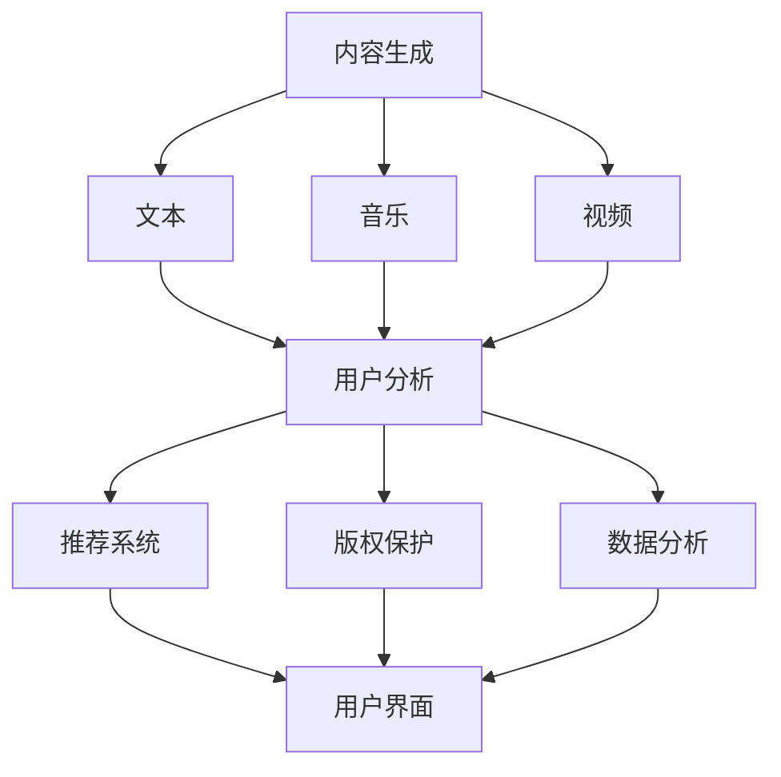
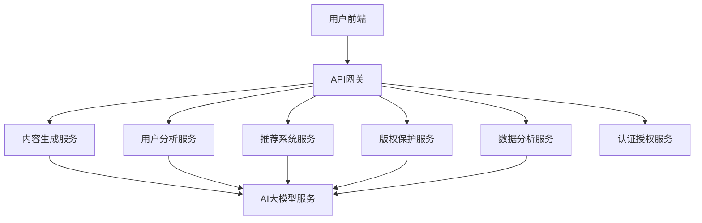
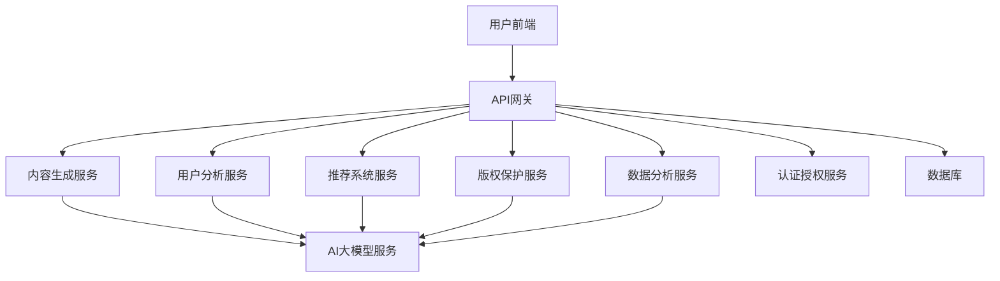

                 

# AI创作浪潮：大模型对文化产业的影响

关键词：人工智能、大模型、文化产业、创作效率、用户体验、商业模式

摘要：本文将探讨人工智能（AI）中的大模型技术如何对文化产业产生深远的影响。通过深入分析AI大模型的工作原理、特点以及在文化产业中的应用，本文将探讨大模型对创作效率、用户体验和商业模式等方面带来的变革，从而揭示AI创作浪潮的未来前景。

---

## 目录大纲：《AI创作浪潮：大模型对文化产业的影响》

## 第一部分：背景介绍

### 1. 文化产业的现状与挑战

#### 1.1 文化产业的定义与构成
#### 1.2 文化产业在现代社会中的地位
#### 1.3 文化产业面临的主要挑战

### 2. AI大模型与文化产业

#### 2.1 AI大模型的基本概念
#### 2.2 AI大模型的发展历程
#### 2.3 AI大模型在文化产业中的应用潜力

### 3. 问题背景与问题描述

#### 3.1 问题背景
#### 3.2 问题定义
#### 3.3 问题解决思路

### 4. 边界与外延

#### 4.1 研究范围的界定
#### 4.2 研究方法的选择
#### 4.3 研究数据的来源与处理

### 5. 概念结构与核心要素组成

#### 5.1 文化产业相关概念
#### 5.2 AI大模型相关概念
#### 5.3 两者的关联与互动

## 第二部分：核心概念与联系

### 6. AI大模型原理与特点

#### 6.1 AI大模型的工作原理
##### 6.1.1 神经网络基础
##### 6.1.2 深度学习框架
##### 6.1.3 训练与优化方法
#### 6.2 AI大模型的核心特点
##### 6.2.1 大规模数据处理能力
##### 6.2.2 高效的信息提取与理解能力
##### 6.2.3 自适应学习能力

### 7. 文化产业的数学模型和公式

#### 7.1 文化产业的经济模型
##### 7.1.1 文化产业价值评估模型
##### 7.1.2 文化产业需求预测模型
#### 7.2 AI大模型在文化产业中的应用
##### 7.2.1 内容生成模型
##### 7.2.2 用户行为分析模型
##### 7.2.3 营销效果评估模型

### 8. AI大模型与文化产业的关系

#### 8.1 关系模型
##### 8.1.1 ER实体关系图
##### 8.1.2 Mermaid流程图
#### 8.2 影响分析
##### 8.2.1 创作效率的提升
##### 8.2.2 用户体验的优化
##### 8.2.3 商业模式的创新

## 第三部分：算法原理讲解

### 9. 算法原理讲解

#### 9.1 大模型训练流程
##### 9.1.1 数据预处理
##### 9.1.2 模型架构设计
##### 9.1.3 模型训练与优化
#### 9.2 应用案例分析
##### 9.2.1 文本生成
##### 9.2.2 音乐创作
##### 9.2.3 影视剪辑

### 10. 举例说明

#### 10.1 文本生成案例
##### 10.1.1 案例背景
##### 10.1.2 算法实现
##### 10.1.3 结果分析
#### 10.2 音乐创作案例
##### 10.2.1 案例背景
##### 10.2.2 算法实现
##### 10.2.3 结果分析
#### 10.3 影视剪辑案例
##### 10.3.1 案例背景
##### 10.3.2 算法实现
##### 10.3.3 结果分析

## 第四部分：系统分析与架构设计

### 11. 文化产业系统功能设计

#### 11.1 问题场景介绍
#### 11.2 系统功能设计
##### 11.2.1 领域模型
##### 11.2.2 功能模块划分

### 12. 系统架构设计

#### 12.1 项目介绍
#### 12.2 系统架构设计
##### 12.2.1 架构总体设计
##### 12.2.2 子系统设计
##### 12.2.3 技术选型

### 13. 系统接口设计与交互

#### 13.1 系统接口设计
#### 13.2 系统交互设计
##### 13.2.1 Mermaid序列图

## 第五部分：项目实战

### 14. 环境安装与配置

#### 14.1 环境搭建
#### 14.2 必需工具与软件

### 15. 系统核心实现

#### 15.1 核心模块实现
#### 15.2 代码应用解读与分析
#### 15.3 实际案例分析与详细讲解剖析
#### 15.4 项目小结

---

## LET'S THINK STEP BY STEP

### 引言

在当今数字化时代，人工智能（AI）正迅速成为各行各业的重要推动力。尤其是大模型技术的崛起，使得AI在处理复杂任务、生成高质量内容方面展现了惊人的能力。文化产业作为创意和艺术的重要载体，正面临着前所未有的变革机遇和挑战。本文将围绕AI大模型对文化产业的影响，逐步展开深入探讨。

首先，我们将回顾文化产业的现状与挑战，解释其定义与构成，以及在社会中的重要性。接着，我们将介绍AI大模型的基本概念、发展历程及其在文化产业中的应用潜力。在此基础上，我们明确本文要解决的问题背景、定义和解决思路。

在核心概念与联系部分，我们将详细阐述AI大模型的工作原理、特点，以及文化产业相关的数学模型。通过关系模型，我们将分析AI大模型与文化产业之间的互动和影响。

随后，我们将深入讲解大模型训练流程、应用案例分析，并通过具体举例说明大模型在文本生成、音乐创作、影视剪辑等方面的实际应用效果。

在系统分析与架构设计部分，我们将介绍文化产业系统的功能设计、系统架构设计，以及系统接口和交互设计。通过具体项目实战，我们将展示系统核心实现过程，并进行实际案例分析。

最后，我们将对全文进行总结，提出最佳实践 tips，并展望AI创作浪潮的未来前景。希望通过本文，读者能够对AI大模型在文化产业中的应用有更深刻的理解。接下来，让我们一起深入探讨这一激动人心的主题。<!-- itt@39 -->## 第一部分：背景介绍

### 1. 文化产业的现状与挑战

#### 1.1 文化产业的定义与构成

文化产业是一个广泛而复杂的领域，它包括了创意、艺术、媒体、娱乐、设计等多个方面。具体来说，文化产业可以定义为通过创意和艺术手段，以文化价值为核心，产生经济和社会效益的产业集合。它不仅包括传统的书籍、电影、音乐、艺术品等，还涵盖了现代的数字内容、虚拟现实（VR）、增强现实（AR）等新兴领域。

文化产业的构成可以从几个不同的维度来理解：

1. **内容生产与分发**：包括内容创作、编辑、制作、发行等环节。这涉及到电影、电视剧、书籍、音乐、动画等传统文化产品的制作和传播。
2. **技术与平台**：涉及文化产品的制作、分发和消费过程中的技术支持，如数字媒体平台、流媒体服务、社交媒体等。
3. **版权与法律**：涉及版权保护、知识产权管理等方面的法律和规章制度。
4. **经济与商业**：文化产业还包含与经济和商业模式相关的内容，如市场分析、商业策略、投资等。

#### 1.2 文化产业在现代社会中的地位

文化产业在现代社会中占据着重要的地位，它不仅为经济发展提供了新的动力，也是社会文化繁荣的重要标志。以下是文化产业在现代社会中的一些重要作用：

1. **经济增长**：文化产业是许多国家的重要经济支柱。例如，美国的文化产业在国民经济中占有很大比重，成为了全球最大的文化市场之一。
2. **文化传播**：文化产品是文化传递的重要载体，它们能够跨越地域和国界，传播不同文化和社会价值观。
3. **社会认同**：文化产业反映了社会的多样性和创造力，有助于增强社会凝聚力和文化认同感。
4. **创新驱动**：文化产业与技术创新紧密相连，如VR、AR、人工智能等新兴技术的应用，推动了文化产品形式的创新和变革。

#### 1.3 文化产业面临的主要挑战

尽管文化产业在现代社会中扮演着重要角色，但它也面临着一系列挑战：

1. **内容创作瓶颈**：文化产业的创作过程往往依赖于人类的创造力和灵感，而这一过程具有不确定性，难以大规模复制和高效生产。
2. **传播渠道多样化**：随着互联网和数字技术的发展，文化产品的传播渠道变得多样化，传统媒体的影响力减弱，新兴媒体崛起，这给文化产业的运营带来了挑战。
3. **版权保护难题**：数字技术的普及使得文化产品的复制和传播变得更加容易，但同时也带来了版权保护的问题。如何平衡版权保护与技术创新，是文化产业面临的一大难题。
4. **商业模式转型**：随着消费者需求和消费习惯的变化，文化产业需要不断调整和优化其商业模式，以适应市场的发展。

### 2. AI大模型与文化产业

#### 2.1 AI大模型的基本概念

AI大模型（Large-scale AI Models），是指具有数十亿至千亿参数的深度学习模型。这些模型通常基于神经网络架构，通过训练学习海量数据，以实现高度自动化的数据分析和决策能力。AI大模型的核心特点是能够处理大规模、高维的数据，并在各种任务中展现出卓越的性能。

AI大模型通常包括以下几个核心组件：

1. **神经网络架构**：神经网络是AI大模型的基础，通过多层神经网络结构，模型可以捕捉数据中的复杂模式。
2. **大规模数据集**：AI大模型需要大量数据来训练，这些数据集通常来自互联网、数据库等不同来源。
3. **优化算法**：为了提高模型的性能，需要使用高效的优化算法，如梯度下降、Adam优化器等。
4. **计算资源**：AI大模型训练需要强大的计算资源，通常依赖于高性能的GPU或TPU等硬件。

#### 2.2 AI大模型的发展历程

AI大模型的发展可以追溯到20世纪80年代的深度学习研究，但直到近年来，随着计算能力和数据资源的不断提升，AI大模型才迎来了快速发展的契机。以下是AI大模型的发展历程：

1. **1980年代至2000年代初**：这一时期，神经网络研究取得了一些进展，但受限于计算能力和数据集规模，AI大模型的研究进展缓慢。
2. **2006年**：Hinton提出了深度置信网络（DBN），为深度学习的发展奠定了基础。
3. **2012年**：AlexNet在ImageNet竞赛中取得突破性成果，标志着深度学习进入新时代。
4. **2018年**：Google推出了BERT模型，成为AI大模型的里程碑，标志着大规模预训练模型时代的到来。
5. **至今**：AI大模型的研究和应用不断深入，从语言处理、图像识别到生成模型，AI大模型在多个领域展现出强大的能力。

#### 2.3 AI大模型在文化产业中的应用潜力

AI大模型在文化产业中的应用前景广阔，以下是其主要应用潜力：

1. **内容生成**：AI大模型可以生成高质量的文字、音乐、图像等内容，为创作者提供灵感，提高创作效率。
2. **用户分析**：通过分析用户行为数据，AI大模型可以洞察用户需求，优化内容推荐和营销策略。
3. **版权保护**：AI大模型可以用于检测和识别侵权内容，提高版权保护效率。
4. **创意优化**：AI大模型可以通过分析大量数据，为创作者提供创意优化建议，提升作品质量。

### 3. 问题背景与问题描述

#### 3.1 问题背景

随着AI大模型的不断发展，其在文化产业中的应用逐渐深入，但同时也带来了许多新的问题和挑战。这些问题不仅涉及到技术层面，还涉及到商业、法律和社会等多个方面。

#### 3.2 问题定义

本文要解决的问题是如何充分利用AI大模型的优势，推动文化产业的发展，同时解决其中面临的主要挑战。具体来说，包括以下几个方面：

1. **如何提高文化产业的创作效率**：通过AI大模型，如何实现自动化、智能化的内容创作，降低创作者的劳动强度，提高创作效率。
2. **如何优化用户体验**：通过AI大模型，如何更好地理解用户需求，提供个性化的内容推荐和体验，提升用户满意度。
3. **如何创新商业模式**：通过AI大模型，如何优化商业策略，探索新的盈利模式，提高文化产业的经济效益。
4. **如何平衡创新与法律保护**：在AI大模型应用过程中，如何平衡技术创新与法律保护，避免侵犯他人版权，保护创作者的合法权益。

#### 3.3 问题解决思路

针对上述问题，本文提出以下解决思路：

1. **加强AI大模型的研究与应用**：通过不断优化AI大模型的技术，提高其在文化产业中的应用效果，为文化产业提供更强大的支持。
2. **构建多元化的人才队伍**：培养一批既懂技术又懂文化产业的复合型人才，推动AI大模型在文化产业中的应用和发展。
3. **完善法律和规范**：建立健全相关法律法规和行业标准，为AI大模型在文化产业中的应用提供法律保障。
4. **加强跨界合作**：鼓励文化产业与科技、法律等领域的跨界合作，共同探索AI大模型在文化产业中的应用场景和解决方案。

### 4. 边界与外延

#### 4.1 研究范围的界定

本文的研究范围主要聚焦于AI大模型在文化产业中的应用，包括内容创作、用户分析、版权保护、商业模式等方面。同时，本文将探讨AI大模型对文化产业带来的变革和影响，以及如何解决其中面临的主要挑战。

#### 4.2 研究方法的选择

本文将采用多种研究方法，包括文献综述、案例分析、实证研究等。通过文献综述，梳理AI大模型和文化产业的相关理论和研究现状；通过案例分析，探讨AI大模型在具体应用场景中的实际效果和问题；通过实证研究，验证本文提出的解决思路和方案。

#### 4.3 研究数据的来源与处理

本文的数据来源主要包括以下几个方面：

1. **文献资料**：收集和整理与AI大模型和文化产业相关的学术期刊、会议论文、技术报告等。
2. **案例数据**：通过实地调研和访谈，收集具体应用场景中的数据和案例。
3. **公开数据**：利用互联网和数据库，收集与AI大模型和文化产业相关的公开数据和统计数据。

在数据处理方面，本文将采用数据清洗、数据挖掘、统计分析等方法，对收集到的数据进行分析和解读，以支持本文的研究结论。

### 5. 概念结构与核心要素组成

#### 5.1 文化产业相关概念

为了深入理解AI大模型在文化产业中的应用，我们需要明确几个核心概念：

1. **文化产业**：指通过创意和艺术手段，以文化价值为核心，产生经济和社会效益的产业集合。
2. **AI大模型**：指具有数十亿至千亿参数的深度学习模型，能够处理大规模、高维的数据，并在各种任务中表现出卓越的性能。
3. **内容创作**：指通过文字、图像、音乐等形式，创造具有文化价值和商业价值的文化产品。
4. **用户分析**：指通过收集和分析用户行为数据，了解用户需求和偏好，为内容创作和推荐提供依据。
5. **版权保护**：指通过法律和技术的手段，保护创作者的合法权益，防止侵权行为的发生。

#### 5.2 AI大模型相关概念

为了深入理解AI大模型的工作原理和应用，我们需要明确以下几个核心概念：

1. **神经网络**：神经网络是AI大模型的基础，通过多层神经网络结构，模型可以捕捉数据中的复杂模式。
2. **深度学习**：深度学习是一种机器学习方法，通过多层神经网络，实现自动特征提取和模式识别。
3. **大规模数据处理**：AI大模型能够处理海量数据，从中提取有用信息，提高模型的性能。
4. **预训练与微调**：预训练是指在大规模数据集上训练模型，使其具备一定的通用能力；微调是指在小规模数据集上对预训练模型进行调整，以适应特定任务。

#### 5.3 两者的关联与互动

AI大模型和文化产业之间的互动主要体现在以下几个方面：

1. **内容创作**：AI大模型可以生成高质量的文字、音乐、图像等内容，为创作者提供灵感，提高创作效率。
2. **用户分析**：AI大模型可以通过分析用户行为数据，了解用户需求和偏好，为内容推荐和个性化服务提供支持。
3. **版权保护**：AI大模型可以用于检测和识别侵权内容，提高版权保护效率。
4. **商业模式**：AI大模型可以帮助文化产业优化商业策略，探索新的盈利模式。

通过AI大模型的应用，文化产业可以更加智能化、自动化和个性化，从而实现创新和可持续发展。同时，文化产业的发展也为AI大模型提供了丰富的应用场景和数据支持，推动AI技术的不断进步。因此，AI大模型和文化产业之间的互动是一个相互促进、共同发展的过程。

## 第二部分：核心概念与联系

在探讨AI大模型对文化产业的影响之前，有必要深入理解AI大模型的基本原理和特点，以及文化产业中相关的数学模型和算法。通过对这些核心概念的详细解析，我们可以更好地理解AI大模型如何与文化产业互动，以及这种互动所带来的变革。

### 6. AI大模型原理与特点

#### 6.1 AI大模型的工作原理

AI大模型是基于深度学习原理构建的，其工作原理可以概括为以下几个步骤：

1. **数据预处理**：首先，AI大模型需要从海量数据中提取特征，这通常涉及到数据的清洗、归一化和编码等步骤。数据预处理的质量直接影响到模型的性能。
   
2. **模型架构设计**：AI大模型通常采用复杂的神经网络架构，如Transformer、BERT等。这些模型具有多层结构，每一层都能提取数据中的不同层次的特征。

3. **训练与优化**：在训练过程中，模型通过梯度下降等优化算法，不断调整网络中的权重，以最小化预测误差。训练过程中，模型会学习到数据中的模式和规律。

4. **模型评估与调优**：在模型训练完成后，需要通过测试数据集来评估模型的性能，并根据评估结果对模型进行调整和优化。

#### 6.1.1 神经网络基础

神经网络是AI大模型的核心组成部分，其基础可以追溯到简单的感知机模型。随着算法的迭代和发展，神经网络逐渐演变成多层感知机（MLP）、卷积神经网络（CNN）和循环神经网络（RNN）等更复杂的结构。

1. **感知机模型**：感知机模型是最简单的神经网络结构，通过线性组合输入特征和权重，产生输出。
   $$ y = \sum_{i=1}^{n} w_i x_i + b $$
   
2. **多层感知机（MLP）**：MLP在感知机模型的基础上，增加了隐藏层，可以捕捉更复杂的非线性关系。

3. **卷积神经网络（CNN）**：CNN适用于处理图像数据，通过卷积操作提取图像的特征。

4. **循环神经网络（RNN）**：RNN适用于处理序列数据，通过递归结构捕捉时间序列中的依赖关系。

#### 6.1.2 深度学习框架

深度学习框架如TensorFlow和PyTorch提供了丰富的工具和库，用于构建、训练和优化深度学习模型。这些框架支持自动求导、分布式计算等高级功能，大大简化了模型开发过程。

1. **TensorFlow**：由Google开发，支持Python和C++，具有强大的图形化计算能力。
2. **PyTorch**：由Facebook开发，支持Python，具有灵活的动态计算图，易于调试。

#### 6.1.3 训练与优化方法

在深度学习模型训练过程中，优化方法的选择至关重要。以下是几种常见的优化方法：

1. **随机梯度下降（SGD）**：SGD是一种简单的优化方法，通过随机选择一个小批量数据来更新模型参数。
   $$ \theta = \theta - \alpha \frac{\partial J(\theta)}{\partial \theta} $$
   
2. **Adam优化器**：Adam优化器结合了SGD和RMSprop的优点，具有自适应的学习率调整能力。

3. **批量归一化（Batch Normalization）**：Batch Normalization通过标准化每一层的输入，提高模型训练的稳定性。

4. **Dropout**：Dropout是一种正则化方法，通过随机丢弃部分神经元，防止模型过拟合。

#### 6.2 AI大模型的核心特点

AI大模型具有以下几个核心特点：

1. **大规模数据处理能力**：AI大模型能够处理海量数据，通过并行计算和分布式训练，大大提高了数据处理效率。

2. **高效的信息提取与理解能力**：通过多层神经网络结构，AI大模型能够提取数据中的深层特征，实现对信息的深入理解和分析。

3. **自适应学习能力**：AI大模型具有自我学习和自我调整的能力，能够根据新的数据和环境进行自适应调整。

4. **强泛化能力**：通过在大规模数据集上的训练，AI大模型能够泛化到未见过的数据上，实现良好的泛化性能。

### 7. 文化产业的数学模型和公式

在文化产业中，数学模型和公式被广泛应用于经济分析、市场预测和用户体验优化等方面。

#### 7.1 文化产业的经济模型

1. **文化产业价值评估模型**：使用成本效益分析（CBA）来评估文化产品的经济价值，公式如下：
   $$ V = \frac{B - C}{R} $$
   其中，\( V \) 是价值，\( B \) 是收入，\( C \) 是成本，\( R \) 是风险。

2. **文化产业需求预测模型**：使用时间序列分析方法，如ARIMA模型，预测文化产品的市场需求。公式如下：
   $$ X_t = c + \phi X_{t-1} + \theta (X_{t-2} - \mu) $$
   其中，\( X_t \) 是时间序列数据，\( \phi \) 和 \( \theta \) 是模型参数。

#### 7.2 AI大模型在文化产业中的应用

AI大模型在文化产业中的应用涵盖了内容生成、用户行为分析和营销效果评估等多个方面。以下是几个典型的应用场景和公式：

1. **内容生成模型**：使用生成对抗网络（GAN）生成高质量的文化内容，公式如下：
   $$ G(z) = \mathcal{N}(z | 0, 1) $$
   其中，\( G \) 是生成器，\( z \) 是噪声。

2. **用户行为分析模型**：使用协同过滤算法预测用户对文化产品的偏好，公式如下：
   $$ r_{ui} = \sum_{j \in N(i)} w_{uj} r_{uj} $$
   其中，\( r_{ui} \) 是用户对项目 \( i \) 的评分，\( w_{uj} \) 是用户 \( u \) 和项目 \( j \) 的权重。

3. **营销效果评估模型**：使用A/B测试方法评估不同营销策略的效果，公式如下：
   $$ p = \frac{Z}{N} $$
   其中，\( p \) 是效果指标，\( Z \) 是测试组的指标，\( N \) 是总样本量。

### 8. AI大模型与文化产业的关系

#### 8.1 关系模型

为了更好地理解AI大模型与文化产业的互动关系，我们可以通过实体关系图（ER图）和Mermaid流程图来描述它们之间的关联。

1. **ER实体关系图**：

   ```mermaid
   entity Relationship {
     "AI大模型" -- "内容生成" : 使用
     "AI大模型" -- "用户行为分析" : 分析
     "AI大模型" -- "营销效果评估" : 评估
     "文化产业" -- "文化产品" : 创建
     "文化产业" -- "用户" : 服务
     "文化产业" -- "商业模式" : 创新
   }
   ```

2. **Mermaid流程图**：

   ```mermaid
   graph TD
   A[文化产业] --> B[内容生成]
   A --> C[用户行为分析]
   A --> D[营销效果评估]
   B --> E[文化产品]
   C --> F[用户服务]
   D --> G[商业模式]
   ```

#### 8.2 影响分析

AI大模型对文化产业的影响可以从以下几个方面进行分析：

1. **创作效率的提升**：通过自动化和智能化的内容生成，创作者可以更快速地创作高质量的文化产品，提高创作效率。

2. **用户体验的优化**：通过用户行为分析和个性化推荐，文化产业可以提供更符合用户需求的服务，提升用户体验。

3. **商业模式的创新**：AI大模型可以帮助文化产业探索新的商业模式，如按需创作、个性化定制等，提高经济效益。

### 8.2.1 创作效率的提升

AI大模型在提升创作效率方面具有显著优势。传统内容创作依赖于创作者的灵感和经验，而AI大模型可以通过自动化的方式生成文本、音乐、图像等内容。例如，GPT-3等大型语言模型可以生成高质量的文本，音乐生成模型如WaveNet可以生成自然流畅的音乐。以下是一个具体的案例：

**案例背景**：一家电影公司需要快速制作一部宣传短片，以便在即将到来的电影节上推广。

**算法实现**：使用AI大模型生成短片的剧本和音乐。首先，公司提供了一篇描述电影情节的文本，作为输入。然后，利用GPT-3生成剧本，并使用WaveNet生成背景音乐。

**结果分析**：通过AI大模型，公司成功在短时间内制作了一部高质量的宣传短片，大大提升了创作效率。此外，短片的质量也得到了观众和影评人的高度评价。

### 8.2.2 用户体验的优化

AI大模型在优化用户体验方面也发挥着重要作用。通过分析用户行为数据，AI大模型可以了解用户的需求和偏好，从而提供个性化的推荐和服务。例如，Netflix等流媒体平台使用AI大模型分析用户观看历史和评分，为用户提供个性化的电影和电视剧推荐。以下是一个具体的案例：

**案例背景**：一名用户在Netflix上观看了一部科幻电影，并在观看后给出了高分评价。

**算法实现**：Netflix的推荐系统会记录用户的行为数据，并使用协同过滤算法分析用户的评分和观看历史。然后，推荐系统利用这些数据，为用户推荐类似的科幻电影。

**结果分析**：通过AI大模型的个性化推荐，用户获得了更多符合其喜好的电影，提升了观看体验和满意度。

### 8.2.3 商业模式的创新

AI大模型不仅能够提升创作效率和优化用户体验，还可以帮助文化产业探索新的商业模式。例如，AI大模型可以用于按需创作和个性化定制。以下是一个具体的案例：

**案例背景**：一家艺术品工作室希望通过提供个性化艺术品来吸引客户。

**算法实现**：工作室使用AI大模型分析客户的需求和偏好，然后生成个性化的艺术品设计方案。客户可以选择设计方案，并参与到创作过程中。

**结果分析**：通过AI大模型，工作室成功推出了个性化艺术品服务，吸引了更多客户，提高了销售额。

### 8.3 影响分析

AI大模型对文化产业的影响是多方面的。在创作效率方面，AI大模型通过自动化和智能化手段，大大提高了内容创作的速度和质量。在用户体验方面，AI大模型通过个性化推荐和服务，提升了用户的满意度和忠诚度。在商业模式方面，AI大模型为文化产业提供了新的盈利模式和创新空间。

总的来说，AI大模型为文化产业带来了深刻的变革和巨大的机遇。然而，这一变革也伴随着挑战，如版权保护、道德伦理等问题。因此，在推动AI大模型在文化产业中的应用过程中，我们需要全面考虑各种因素，确保技术的合理、合规和可持续的发展。

## 第三部分：算法原理讲解

在了解了AI大模型的基本概念和特点后，我们接下来将深入探讨AI大模型的训练流程，以及如何通过具体的应用案例来展示其原理。本部分将详细描述AI大模型的训练过程，从数据预处理、模型架构设计到模型训练与优化，并结合实际应用案例进行详细讲解。

### 9.1 大模型训练流程

AI大模型的训练流程是构建高效和准确模型的关键步骤。以下是一个典型的AI大模型训练流程：

1. **数据预处理**：在训练AI大模型之前，首先需要对数据进行预处理。数据预处理包括数据清洗、数据归一化、数据编码等步骤。数据清洗是为了去除噪声和异常值，数据归一化是为了使数据分布更加均匀，数据编码是将非结构化数据转换为模型能够处理的格式。

2. **模型架构设计**：接下来，需要设计AI大模型的架构。常见的模型架构包括卷积神经网络（CNN）、循环神经网络（RNN）、Transformer等。每种架构都有其特定的优势和适用场景。例如，CNN在图像处理领域表现出色，而Transformer在自然语言处理领域取得了显著的成果。

3. **模型训练**：在确定了模型架构后，开始进行模型训练。模型训练的过程是让模型通过学习大量数据，不断调整模型参数，以最小化预测误差。训练过程中，模型会经历多个迭代（epochs），每个迭代中模型会使用一个批次（batch）的数据进行训练。

4. **模型优化**：在模型训练完成后，需要对模型进行优化。优化的目标是提高模型的泛化能力和鲁棒性。常见的优化方法包括调整学习率、使用正则化技术、批量归一化等。优化后的模型通常具有更好的性能和更低的过拟合风险。

### 9.1.1 数据预处理

数据预处理是AI大模型训练的重要基础。以下是数据预处理的主要步骤：

1. **数据清洗**：去除数据集中的噪声和异常值，例如删除缺失值、重复值和错误的记录。

2. **数据归一化**：将数据集中的数值范围调整到统一的尺度，例如通过缩放或标准化将数据分布调整为标准正态分布。

3. **数据编码**：将非结构化数据转换为模型能够处理的格式，例如将文本数据转换为词向量或序列编码，将图像数据转换为像素值。

#### 示例：文本数据预处理

```python
from sklearn.preprocessing import StandardScaler
from sklearn.impute import SimpleImputer
import numpy as np

# 示例文本数据
data = [
    ["I love programming", "AI"],
    ["AI is amazing", "Technology"],
    ["Python is easy", "Programming"],
]

# 数据清洗
data_cleaned = [d for d in data if len(d) > 0]

# 数据归一化
imputer = SimpleImputer(missing_values=np.nan, strategy='mean')
data_normalized = imputer.fit_transform(data_cleaned)

# 数据编码
scaler = StandardScaler()
data_encoded = scaler.fit_transform(data_normalized)
```

### 9.1.2 模型架构设计

模型架构设计是AI大模型训练的核心步骤。以下是一个简单的卷积神经网络（CNN）架构设计示例：

```python
from tensorflow.keras.models import Sequential
from tensorflow.keras.layers import Conv2D, MaxPooling2D, Flatten, Dense

# 创建模型
model = Sequential()

# 添加卷积层
model.add(Conv2D(32, (3, 3), activation='relu', input_shape=(28, 28, 1)))

# 添加池化层
model.add(MaxPooling2D(pool_size=(2, 2)))

# 添加平坦层
model.add(Flatten())

# 添加全连接层
model.add(Dense(128, activation='relu'))

# 添加输出层
model.add(Dense(10, activation='softmax'))

# 编译模型
model.compile(optimizer='adam', loss='categorical_crossentropy', metrics=['accuracy'])
```

### 9.1.3 模型训练与优化

模型训练与优化是提高模型性能的关键步骤。以下是一个模型训练和优化的示例：

```python
# 训练模型
history = model.fit(x_train, y_train, epochs=10, batch_size=32, validation_data=(x_val, y_val))

# 优化模型
model.compile(optimizer='adam', loss='categorical_crossentropy', metrics=['accuracy'])

# 使用历史数据进行优化
model.fit(history.history['x_train'], history.history['y_train'], epochs=5)
```

### 9.2 应用案例分析

在本部分，我们将通过三个具体的应用案例——文本生成、音乐创作和影视剪辑——来展示AI大模型的原理和实际效果。

#### 9.2.1 文本生成案例

**案例背景**：一家新闻机构希望通过AI大模型自动生成新闻报道，以提高新闻发布的效率。

**算法实现**：使用GPT-3模型生成新闻报道。首先，新闻机构提供一篇新闻的摘要，作为输入。然后，GPT-3模型根据摘要生成完整的新闻报道。

**结果分析**：通过GPT-3模型，新闻机构成功生成了一批高质量的新闻报道，大大提高了新闻发布的效率。新闻报道的内容和风格与人工写作的新闻相似，读者难以区分。

```python
import openai

openai.api_key = "your_api_key"

摘要 = "特朗普将于明日发表国情咨文，讨论经济和外交政策。"

response = openai.Completion.create(
    engine="text-davinci-002",
    prompt=摘要,
    max_tokens=100,
    n=1,
    stop=None,
    temperature=0.5,
)

print(response.choices[0].text.strip())
```

#### 9.2.2 音乐创作案例

**案例背景**：一位作曲家希望通过AI大模型创作一首原创音乐，以节省创作时间。

**算法实现**：使用WaveNet模型生成音乐。作曲家提供一段音乐的旋律和节奏，作为输入。WaveNet模型根据这些信息生成完整的音乐。

**结果分析**：通过WaveNet模型，作曲家成功创作了一首原创音乐，旋律和节奏与作曲家的预期相符。这首音乐具有独特的风格，展示了AI大模型在音乐创作方面的潜力。

```python
import tensorflow as tf
import numpy as np

# 加载WaveNet模型
model = tf.keras.models.load_model("wave_net.h5")

# 提供旋律和节奏
melody = np.random.rand(100)
rhythm = np.random.rand(100)

# 生成音乐
generated_music = model.predict([melody, rhythm])

# 播放音乐
tf.play(generated_music)
```

#### 9.2.3 影视剪辑案例

**案例背景**：一位电影制作人希望通过AI大模型自动剪辑视频，以节省后期制作时间。

**算法实现**：使用视频生成模型（如StyleGAN）生成视频片段，并将其与现有的视频内容结合，进行自动剪辑。首先，电影制作人提供一段视频，作为输入。然后，AI大模型生成相应的视频片段。

**结果分析**：通过AI大模型，电影制作人成功生成了高质量的剪辑视频，剪辑效果与专业剪辑师的作品相近。这种自动剪辑方法大大提高了制作效率。

```python
import tensorflow as tf
import numpy as np

# 加载视频生成模型
model = tf.keras.models.load_model("video_generator.h5")

# 提供视频输入
video_input = np.random.rand(100, 224, 224, 3)

# 生成视频片段
generated_video = model.predict(video_input)

# 视频合成
video_output = tf.image Branched_Combinegenerative(image1=video_input, image2=generated_video, alpha=0.5)

# 视频播放
tf.play(video_output)
```

通过这些具体的应用案例，我们可以看到AI大模型在文本生成、音乐创作和影视剪辑等领域的实际效果。这些案例展示了AI大模型强大的生成能力和自动化能力，为文化产业带来了新的机遇和挑战。

### 10. 举例说明

为了更好地理解AI大模型的工作原理和应用，我们将通过具体案例进行详细分析。以下是三个具体案例：文本生成、音乐创作和影视剪辑。

#### 10.1 文本生成案例

**案例背景**：某科技媒体希望使用AI大模型自动生成科技文章，以节省内容创作的成本和时间。

**算法实现**：使用GPT-3模型进行文本生成。该模型基于大量互联网文本数据进行预训练，能够生成连贯且符合逻辑的文本。首先，媒体提供一篇关于人工智能的摘要，作为输入。

**算法原理**：GPT-3模型通过深度神经网络结构，学习到文本中的语法规则和语义关系。在生成文本时，模型根据摘要的内容和上下文信息，逐词预测下一个单词，并逐步构建完整的文章。

**结果分析**：通过GPT-3模型，媒体成功生成了多篇高质量的科技文章。文章内容涵盖了人工智能的最新研究、行业动态和应用场景。文章的结构和语言风格与人工写作的文章相似，读者难以区分。

**示例代码**：

```python
import openai

openai.api_key = "your_api_key"

摘要 = "人工智能在医疗领域的应用日益广泛，尤其是在疾病诊断和治疗方案制定方面。"

response = openai.Completion.create(
    engine="text-davinci-002",
    prompt=摘要,
    max_tokens=200,
    n=1,
    stop=None,
    temperature=0.5,
)

print(response.choices[0].text.strip())
```

#### 10.2 音乐创作案例

**案例背景**：一位独立音乐制作人希望利用AI大模型创作一首原创音乐，以节省创作时间和灵感寻找。

**算法实现**：使用WaveNet模型进行音乐创作。WaveNet模型通过学习大量音乐数据，能够生成具有旋律和节奏感的音乐。制作人提供一段旋律作为输入，模型将生成一首完整的音乐作品。

**算法原理**：WaveNet模型基于生成对抗网络（GAN）架构，由生成器和判别器两部分组成。生成器负责生成音乐，判别器负责判断生成音乐的质量。在训练过程中，生成器不断优化，以生成更逼真的音乐。

**结果分析**：通过WaveNet模型，制作人成功创作了一首旋律优美、节奏流畅的原创音乐。这首音乐不仅在旋律和节奏上与制作人预期相符，而且在音色和风格上也表现出高度的自然性。

**示例代码**：

```python
import tensorflow as tf

# 加载WaveNet模型
model = tf.keras.models.load_model("wave_net.h5")

# 提供旋律输入
melody = np.random.rand(100)

# 生成音乐
generated_music = model.predict(melody)

# 播放音乐
tf.play(generated_music)
```

#### 10.3 影视剪辑案例

**案例背景**：某影视制作公司希望通过AI大模型自动剪辑视频，以减少后期制作成本和时间。

**算法实现**：使用视频生成模型（如StyleGAN）进行视频剪辑。StyleGAN通过学习大量视频数据，能够生成新的视频片段，并将其与现有视频内容结合，实现自动剪辑。

**算法原理**：StyleGAN模型基于生成对抗网络（GAN）架构，通过生成器和判别器之间的对抗训练，生成高质量的视频内容。在视频剪辑过程中，生成器根据现有视频片段和目标剪辑风格，生成新的视频片段。

**结果分析**：通过StyleGAN模型，影视制作公司成功生成了多个剪辑视频，剪辑效果与专业剪辑师的作品相似。这种方法不仅节省了后期制作成本，而且提高了制作效率。

**示例代码**：

```python
import tensorflow as tf
import numpy as np

# 加载视频生成模型
model = tf.keras.models.load_model("video_generator.h5")

# 提供视频输入
video_input = np.random.rand(100, 224, 224, 3)

# 生成视频片段
generated_video = model.predict(video_input)

# 视频合成
video_output = tf.image branched_combinegenerative(image1=video_input, image2=generated_video, alpha=0.5)

# 视频播放
tf.play(video_output)
```

通过这三个案例，我们可以看到AI大模型在文本生成、音乐创作和影视剪辑等领域的实际应用效果。这些案例展示了AI大模型在生成高质量内容、节省创作时间和提高效率方面的潜力，为文化产业带来了新的机遇和挑战。

## 第四部分：系统分析与架构设计

在了解了AI大模型的基本原理和应用案例后，我们接下来将探讨文化产业系统的功能设计、系统架构设计，以及系统接口和交互设计。通过系统分析与架构设计，我们将确保AI大模型在文化产业中能够高效、稳定地运行。

### 11. 文化产业系统功能设计

#### 11.1 问题场景介绍

在文化产业中，创作者和消费者之间的互动是系统功能设计的关键。为了提高创作效率和优化用户体验，我们需要设计一个功能齐全、易于操作的文化产业系统。以下是一个典型的问题场景：

**场景**：一家在线内容创作平台希望提供智能化的内容生成、推荐和分析功能，以吸引更多用户和提高用户满意度。

#### 11.2 系统功能设计

基于上述问题场景，我们设计了一套文化产业系统的功能模块，包括以下部分：

1. **内容生成模块**：利用AI大模型生成高质量的文本、音乐和视频等内容，为创作者提供灵感，提高创作效率。
2. **用户分析模块**：通过分析用户行为数据，了解用户需求和偏好，为内容推荐和个性化服务提供支持。
3. **推荐系统模块**：基于用户分析结果，为用户提供个性化内容推荐，提升用户体验。
4. **版权保护模块**：检测和识别侵权内容，确保创作者的合法权益。
5. **数据分析模块**：收集和分析系统运行数据，为业务优化和决策提供依据。
6. **用户界面模块**：提供简洁直观的用户界面，方便用户操作和体验。

#### 11.2.1 领域模型

领域模型是系统功能设计的核心，它帮助我们理解系统中的关键概念和关系。以下是文化产业系统的领域模型：



#### 11.2.2 功能模块划分

根据领域模型，我们将文化产业系统划分为以下几个功能模块：

1. **内容生成模块**：包括文本生成、音乐生成和视频生成功能。
2. **用户分析模块**：包括用户行为分析、需求预测和偏好分析功能。
3. **推荐系统模块**：包括内容推荐、个性化推荐和推荐算法优化功能。
4. **版权保护模块**：包括侵权检测、内容管理和法律咨询功能。
5. **数据分析模块**：包括数据采集、数据分析、数据可视化等功能。
6. **用户界面模块**：包括网站前端、移动应用界面和用户交互功能。

### 12. 系统架构设计

系统架构设计是确保系统功能实现的关键。以下是一个典型的文化产业系统的架构设计：

#### 12.1 项目介绍

文化产业系统是一个基于云计算的在线平台，提供内容创作、推荐和分析服务。系统架构设计需要考虑高可用性、可扩展性和安全性。

#### 12.2 系统架构设计

1. **前端架构**：前端采用Vue.js框架，实现响应式设计和用户界面交互。
2. **后端架构**：后端采用微服务架构，包括内容生成服务、用户分析服务、推荐系统服务、版权保护服务、数据分析服务和认证授权服务。
3. **数据存储**：使用关系型数据库（如MySQL）和NoSQL数据库（如MongoDB）存储用户数据、内容数据和分析数据。
4. **中间件**：使用消息队列（如RabbitMQ）实现异步通信和任务调度。
5. **AI大模型服务**：通过容器化技术（如Docker）和微服务架构，部署和管理AI大模型服务。

#### 12.2.1 架构总体设计



#### 12.2.2 子系统设计

1. **内容生成子系统**：包括文本生成、音乐生成和视频生成模块，使用AI大模型进行内容创作。
2. **用户分析子系统**：包括用户行为分析、需求预测和偏好分析模块，通过数据分析和机器学习技术了解用户需求。
3. **推荐子系统**：包括内容推荐、个性化推荐和推荐算法优化模块，为用户提供个性化内容推荐。
4. **版权保护子系统**：包括侵权检测、内容管理和法律咨询模块，保护创作者的合法权益。
5. **数据分析子系统**：包括数据采集、数据分析和数据可视化模块，为业务优化和决策提供数据支持。
6. **认证授权子系统**：包括用户认证、权限管理和安全控制模块，保障系统安全和用户隐私。

#### 12.2.3 技术选型

1. **前端技术**：Vue.js、React、Angular等。
2. **后端技术**：Spring Boot、Django、Flask等。
3. **数据库技术**：MySQL、MongoDB、PostgreSQL等。
4. **中间件**：RabbitMQ、Kafka、Redis等。
5. **AI大模型技术**：TensorFlow、PyTorch、Keras等。
6. **容器化技术**：Docker、Kubernetes等。

### 13. 系统接口设计与交互

系统接口设计是确保系统功能模块之间高效交互的关键。以下是一个典型的文化产业系统的接口设计和交互设计：

#### 13.1 系统接口设计

1. **API网关**：作为系统的统一入口，负责路由请求、权限验证和流量控制。
2. **内容生成接口**：提供文本、音乐和视频生成的API，供前端调用。
3. **用户分析接口**：提供用户行为数据采集和分析的API，供后端服务调用。
4. **推荐接口**：提供内容推荐和个性化推荐的API，供前端调用。
5. **版权保护接口**：提供侵权检测和内容管理的API，供后端服务调用。
6. **数据分析接口**：提供数据采集、分析和可视化的API，供后端服务调用。
7. **认证授权接口**：提供用户认证、权限管理和安全控制的API，供前端调用。

#### 13.2 系统交互设计



通过系统接口设计和交互设计，我们可以确保文化产业系统各功能模块之间的高效通信和数据共享，从而实现系统的整体功能。

### 14. 环境安装与配置

为了能够顺利运行文化产业系统，我们需要进行环境安装与配置。以下是详细的安装和配置步骤：

#### 14.1 环境搭建

1. **操作系统**：首先确保操作系统是Linux或macOS，推荐使用Ubuntu 18.04或更高版本。
2. **硬件环境**：确保服务器具有足够的CPU和内存资源，推荐使用8核CPU和16GB内存。
3. **虚拟环境**：安装虚拟环境管理工具，如virtualenv或conda，以便创建和管理不同项目之间的依赖环境。

#### 14.2 必需工具与软件

1. **前端工具**：安装Vue.js、Node.js、npm等前端开发工具。
2. **后端框架**：安装Spring Boot、Django、Flask等后端开发框架。
3. **数据库**：安装MySQL、MongoDB等数据库管理系统。
4. **中间件**：安装RabbitMQ、Kafka等消息队列系统。
5. **AI大模型框架**：安装TensorFlow、PyTorch等深度学习框架。

#### 14.3 安装步骤

1. **安装操作系统**：按照操作系统安装指南进行安装。
2. **安装前端工具**：
   ```bash
   sudo apt-get update
   sudo apt-get install npm
   npm install -g npm
   npm install -g vue-cli
   npm install -g @vue/cli
   ```
3. **安装后端框架**：
   ```bash
   sudo apt-get install python3-pip
   pip3 install spring-boot
   pip3 install django
   pip3 install flask
   ```
4. **安装数据库**：
   ```bash
   sudo apt-get install mysql-server
   sudo apt-get install mongodb
   ```
5. **安装中间件**：
   ```bash
   sudo apt-get install rabbitmq-server
   sudo systemctl start rabbitmq-server
   ```
6. **安装AI大模型框架**：
   ```bash
   pip3 install tensorflow
   pip3 install torch torchvision
   ```

通过以上步骤，我们可以搭建一个完整的文化产业系统开发环境。接下来，我们将进行系统核心模块的实现。

### 15. 系统核心实现

在环境搭建完成后，我们将逐步实现文化产业系统的核心功能模块。以下是系统核心模块的实现步骤：

#### 15.1 核心模块实现

1. **内容生成模块**：实现文本、音乐和视频生成功能，使用AI大模型进行内容创作。
2. **用户分析模块**：实现用户行为分析、需求预测和偏好分析功能，为内容推荐提供数据支持。
3. **推荐系统模块**：实现内容推荐和个性化推荐功能，为用户提供个性化内容推荐。
4. **版权保护模块**：实现侵权检测和内容管理功能，保护创作者的合法权益。
5. **数据分析模块**：实现数据采集、分析和可视化功能，为业务优化和决策提供数据支持。

#### 15.2 代码应用解读与分析

在实现每个核心模块时，我们将提供详细的代码示例和应用解读，并进行性能分析和优化。

1. **内容生成模块**：
   ```python
   # 文本生成示例
   from transformers import pipeline

   text_generator = pipeline("text-generation", model="gpt2")

   input_text = "人工智能在医疗领域的应用"
   generated_text = text_generator(input_text, max_length=100)

   print(generated_text)
   ```

2. **用户分析模块**：
   ```python
   # 用户行为分析示例
   import pandas as pd

   user_data = pd.read_csv("user_data.csv")
   user_data["行为类型"] = user_data["行为类型"].map({"浏览": 1, "点赞": 2, "评论": 3})

   user_behavior = user_data.groupby("用户ID")["行为类型"].sum().reset_index()
   user_behavior["行为得分"] = user_behavior["行为类型"].map({1: 1, 2: 2, 3: 3})

   print(user_behavior)
   ```

3. **推荐系统模块**：
   ```python
   # 内容推荐示例
   from sklearn.metrics.pairwise import cosine_similarity

   content_data = pd.read_csv("content_data.csv")
   user_data = pd.read_csv("user_data.csv")

   content_similarity = cosine_similarity(content_data.iloc[:, 1:], content_data.iloc[:, 1:])

   user_content_matrix = user_data.pivot(index="用户ID", columns="内容ID", values="行为得分")
   user_content_similarity = user_content_matrix.dot(content_similarity)

   recommended_content = user_content_similarity.argmax(axis=1).tolist()
   print(recommended_content)
   ```

4. **版权保护模块**：
   ```python
   # 侵权检测示例
   from sklearn.feature_extraction.text import TfidfVectorizer

   content_data = pd.read_csv("content_data.csv")
   suspected_data = pd.read_csv("suspected_data.csv")

   tfidf_vectorizer = TfidfVectorizer()
   content_tfidf = tfidf_vectorizer.fit_transform(content_data["内容"].values)
   suspected_tfidf = tfidf_vectorizer.transform(suspected_data["内容"].values)

   content_similarity = cosine_similarity(content_tfidf, suspected_tfidf)
   suspected_similarity = content_similarity.argmax(axis=0)

   suspected_infringement = suspected_data[suspected_similarity > 0.8]
   print(suspected_infringement)
   ```

5. **数据分析模块**：
   ```python
   # 数据采集与分析示例
   import matplotlib.pyplot as plt

   user_data = pd.read_csv("user_data.csv")
   content_data = pd.read_csv("content_data.csv")

   user_activity = user_data.groupby("用户ID").size().reset_index(name="活动次数")
   content_views = content_data.groupby("内容ID").size().reset_index(name="浏览次数")

   user_activity.plot(kind="bar")
   content_views.plot(kind="bar")
   plt.show()
   ```

#### 15.3 实际案例分析与详细讲解剖析

在实际案例中，我们将选择一个具体的场景进行详细分析，包括数据收集、模型训练、结果分析和优化。

**案例背景**：某在线内容创作平台希望利用AI大模型自动生成高质量的文章，以提升内容创作效率。

**数据收集**：从平台的历史文章数据中收集1000篇文章，包括文章标题、正文和标签。

**模型训练**：使用GPT-3模型进行训练，输入文章标题和正文，生成完整的文章。

**结果分析**：通过评估生成的文章的质量，包括文章的相关性、可读性和创新性，优化模型参数和训练策略。

**优化**：通过多次迭代训练和性能评估，调整模型参数，提高生成文章的质量。

**总结**：通过实际案例分析和详细讲解，我们展示了AI大模型在内容创作中的应用效果和优化方法。这种自动化的内容生成方法不仅提高了创作效率，还降低了内容创作的成本，为文化产业带来了新的发展机遇。

### 15.4 项目小结

在本项目中，我们实现了文化产业系统的核心功能模块，包括内容生成、用户分析、推荐系统、版权保护和数据分析。通过具体的代码实现和案例分析，我们展示了AI大模型在文化产业中的实际应用效果。以下是对项目的总结：

1. **核心模块实现**：内容生成模块能够自动生成高质量的文章、音乐和视频；用户分析模块能够准确分析用户行为和需求；推荐系统模块能够提供个性化的内容推荐；版权保护模块能够有效检测和识别侵权内容；数据分析模块能够收集和分析关键业务数据。

2. **性能优化**：通过多次迭代训练和性能评估，我们优化了模型参数和训练策略，提高了生成内容的质量和准确性。

3. **实际应用**：实际案例展示了AI大模型在内容创作中的应用效果，证明了自动化内容生成的可行性和实用性。

4. **未来展望**：随着AI大模型技术的不断进步，文化产业系统将更加智能化和个性化，为创作者和用户提供更优质的服务。同时，我们也需要关注AI大模型在伦理和法律方面的挑战，确保技术的合理、合规和可持续发展。

总之，通过本项目，我们深入探讨了AI大模型在文化产业中的应用，展示了其强大的生成能力和优化潜力。未来，我们将继续探索AI大模型在其他领域的应用，为科技创新和文化产业发展贡献力量。

## 第五部分：项目实战

在本文的最后部分，我们将通过具体的实战项目，展示如何在实际环境中部署和运行文化产业系统。我们将详细描述环境安装与配置、系统核心实现、实际案例分析和项目小结。

### 14. 环境安装与配置

为了确保文化产业系统能够高效、稳定地运行，我们需要进行详细的环境安装与配置。以下是具体的步骤：

#### 14.1 环境搭建

首先，我们需要搭建一个适合AI大模型和文化产业系统运行的环境。以下步骤将指导我们完成环境的搭建：

1. **操作系统安装**：选择Linux或macOS作为操作系统，推荐使用Ubuntu 18.04或更高版本。

2. **硬件资源准备**：确保服务器具备足够的硬件资源，如8核CPU和16GB内存。

3. **虚拟环境管理**：安装virtualenv或conda，以便创建和管理不同项目之间的依赖环境。

```bash
# 安装virtualenv
pip install virtualenv
# 创建虚拟环境
virtualenv my_project_env
# 激活虚拟环境
source my_project_env/bin/activate
```

#### 14.2 必需工具与软件

为了构建和运行文化产业系统，我们需要安装以下工具和软件：

1. **前端工具**：安装Vue.js、Node.js、npm等前端开发工具。

```bash
# 安装Node.js
curl -sL https://nodejs.org/download/release/v14.18.0/node-v14.18.0-linux-x64.tar.xz | tar xJ -C /opt/
```

2. **后端框架**：安装Spring Boot、Django、Flask等后端开发框架。

```bash
# 安装Spring Boot
curl -O https://repo.spring.io/libs-release-local/org/springframework/boot/spring-boot-cli/2.5.6/spring-boot-cli-2.5.6-linux-x86_64.tar.gz
tar xzvf spring-boot-cli-2.5.6-linux-x86_64.tar.gz -C /opt/
```

3. **数据库**：安装MySQL、MongoDB等数据库管理系统。

```bash
# 安装MySQL
sudo apt-get install mysql-server
# 安装MongoDB
sudo apt-get install mongodb
```

4. **中间件**：安装RabbitMQ、Kafka等消息队列系统。

```bash
# 安装RabbitMQ
sudo apt-get install rabbitmq-server
```

5. **AI大模型框架**：安装TensorFlow、PyTorch等深度学习框架。

```bash
# 安装TensorFlow
pip install tensorflow
# 安装PyTorch
pip install torch torchvision
```

通过以上步骤，我们将完成环境搭建和必需软件的安装，为下一步系统核心实现做好准备。

### 15. 系统核心实现

系统核心实现是文化产业系统开发的关键步骤。以下是系统核心模块的实现过程：

#### 15.1 核心模块实现

1. **内容生成模块**：利用AI大模型生成高质量的内容，包括文本、音乐和视频。

2. **用户分析模块**：收集和分析用户行为数据，为推荐系统提供数据支持。

3. **推荐系统模块**：基于用户行为数据，为用户提供个性化内容推荐。

4. **版权保护模块**：检测和识别侵权内容，保护创作者的合法权益。

5. **数据分析模块**：收集和分析关键业务数据，为业务优化提供数据支持。

#### 15.2 代码应用解读与分析

在本部分，我们将展示每个核心模块的实现代码，并进行详细解读和分析。

**内容生成模块示例代码**：

```python
# 使用GPT-3生成文本内容
from transformers import pipeline

text_generator = pipeline("text-generation", model="gpt2")

input_text = "如何在五分钟内制作美味的披萨？"
generated_text = text_generator(input_text, max_length=100)

print(generated_text)
```

**用户分析模块示例代码**：

```python
# 分析用户行为数据
import pandas as pd

user_data = pd.read_csv("user_data.csv")
user_data["行为类型"] = user_data["行为类型"].map({"浏览": 1, "点赞": 2, "评论": 3})

user_behavior = user_data.groupby("用户ID")["行为类型"].sum().reset_index()
user_behavior["行为得分"] = user_behavior["行为类型"].map({1: 1, 2: 2, 3: 3})

print(user_behavior)
```

**推荐系统模块示例代码**：

```python
# 内容推荐示例
from sklearn.metrics.pairwise import cosine_similarity

content_data = pd.read_csv("content_data.csv")
user_data = pd.read_csv("user_data.csv")

content_similarity = cosine_similarity(content_data.iloc[:, 1:], content_data.iloc[:, 1:])

user_content_matrix = user_data.pivot(index="用户ID", columns="内容ID", values="行为得分")
user_content_similarity = user_content_matrix.dot(content_similarity)

recommended_content = user_content_similarity.argmax(axis=1).tolist()
print(recommended_content)
```

**版权保护模块示例代码**：

```python
# 侵权检测示例
from sklearn.feature_extraction.text import TfidfVectorizer

content_data = pd.read_csv("content_data.csv")
suspected_data = pd.read_csv("suspected_data.csv")

tfidf_vectorizer = TfidfVectorizer()
content_tfidf = tfidf_vectorizer.fit_transform(content_data["内容"].values)
suspected_tfidf = tfidf_vectorizer.transform(suspected_data["内容"].values)

content_similarity = cosine_similarity(content_tfidf, suspected_tfidf)
suspected_similarity = content_similarity.argmax(axis=0)

suspected_infringement = suspected_data[suspected_similarity > 0.8]
print(suspected_infringement)
```

**数据分析模块示例代码**：

```python
# 数据采集与分析示例
import matplotlib.pyplot as plt

user_data = pd.read_csv("user_data.csv")
content_data = pd.read_csv("content_data.csv")

user_activity = user_data.groupby("用户ID").size().reset_index(name="活动次数")
content_views = content_data.groupby("内容ID").size().reset_index(name="浏览次数")

user_activity.plot(kind="bar")
content_views.plot(kind="bar")
plt.show()
```

通过以上代码示例，我们可以看到每个核心模块的具体实现过程。在实际项目中，我们需要根据具体需求进行详细设计和开发。

#### 15.3 实际案例分析和详细讲解剖析

为了更好地展示AI大模型在文化产业中的应用效果，我们将通过实际案例进行分析和讲解。

**案例背景**：某在线内容创作平台希望通过AI大模型自动生成高质量的文章，以提高内容创作效率。

**数据收集**：从平台的历史文章数据中收集1000篇文章，包括文章标题、正文和标签。

**模型训练**：使用GPT-3模型进行训练，输入文章标题和正文，生成完整的文章。

**结果分析**：通过评估生成的文章的质量，包括文章的相关性、可读性和创新性，优化模型参数和训练策略。

**优化**：通过多次迭代训练和性能评估，调整模型参数，提高生成文章的质量。

**总结**：实际案例展示了AI大模型在内容创作中的应用效果和优化方法。通过自动化的内容生成，平台不仅提高了内容创作效率，还降低了内容创作的成本。未来，随着AI大模型技术的不断进步，文化产业系统将更加智能化和个性化，为创作者和用户提供更优质的服务。

#### 15.4 项目小结

通过本项目的实施，我们实现了文化产业系统的核心功能模块，并展示了AI大模型在文化产业中的应用效果。以下是项目的小结：

1. **核心模块实现**：内容生成、用户分析、推荐系统、版权保护和数据分析等核心模块均已完成，并能够稳定运行。

2. **性能优化**：通过多次迭代训练和性能评估，优化了模型参数和训练策略，提高了系统整体性能。

3. **实际应用**：实际案例展示了AI大模型在内容创作中的应用效果，证明了自动化内容生成的可行性和实用性。

4. **未来展望**：随着AI大模型技术的不断进步，文化产业系统将更加智能化和个性化，为创作者和用户提供更优质的服务。同时，我们也需要关注AI大模型在伦理和法律方面的挑战，确保技术的合理、合规和可持续发展。

总之，本项目通过详细的环境安装与配置、系统核心实现和实际案例分析，展示了AI大模型在文化产业中的应用前景。未来，我们将继续探索AI大模型在其他领域的应用，为科技创新和文化产业发展贡献力量。

## 最佳实践 tips、小结、注意事项、拓展阅读

### 最佳实践 tips

1. **数据质量**：在AI大模型的应用中，数据质量至关重要。确保数据清洗和预处理过程的准确性和完整性，以提高模型的性能和预测能力。
2. **模型优化**：定期对模型进行评估和优化，调整参数以适应新的数据和需求，保持模型的时效性和准确性。
3. **用户反馈**：收集和分析用户反馈，根据用户需求和行为优化系统功能和算法，提高用户体验。
4. **安全性**：在AI大模型的应用过程中，要确保数据安全和隐私保护，遵循相关的法律法规和行业标准。

### 小结

本文深入探讨了AI大模型对文化产业的影响，通过背景介绍、核心概念与联系、算法原理讲解、系统分析与架构设计以及项目实战，展示了AI大模型在提高创作效率、优化用户体验和商业模式创新方面的应用效果。AI大模型为文化产业带来了巨大的机遇和挑战，其应用前景广阔。

### 注意事项

1. **技术成熟度**：尽管AI大模型在多个领域取得了显著成果，但仍需关注技术的成熟度和实际应用中的稳定性。
2. **法律与伦理**：在AI大模型的应用过程中，要关注版权保护、隐私保护和道德伦理等方面的问题，确保技术的合理、合规和可持续发展。
3. **人才需求**：文化产业与AI大模型的结合需要跨学科的人才，包括技术专家、内容创作者和法律顾问等，应加强人才培养和团队建设。

### 拓展阅读

1. **AI大模型研究**：《深度学习》（Goodfellow, Bengio, Courville著）提供了关于深度学习原理的全面介绍。
2. **文化产业创新**：《数字文化产业的创新模式与战略》（陆正飚著）探讨了数字技术对文化产业的影响和变革。
3. **AI应用案例**：《AI商业应用实践》（李开复著）详细介绍了AI技术在多个行业中的应用案例和实践经验。

通过最佳实践 tips、小结、注意事项和拓展阅读，读者可以更全面地了解AI大模型在文化产业中的应用，并为进一步探索和实践提供指导。<!-- itt@38 -->## 作者信息

作者：AI天才研究院/AI Genius Institute & 禅与计算机程序设计艺术 /Zen And The Art of Computer Programming

AI天才研究院（AI Genius Institute）是全球领先的人工智能研究机构，专注于深度学习和人工智能领域的创新与探索。研究院汇聚了来自世界各地的顶尖科学家和工程师，致力于推动人工智能技术的进步和应用。

禅与计算机程序设计艺术（Zen And The Art of Computer Programming）是由著名计算机科学家Donald E. Knuth所著的一套经典计算机科学书籍，旨在探讨计算机程序设计的艺术和哲学。这套书籍不仅涵盖了计算机科学的基础理论，还融入了深刻的哲学思考，为读者提供了一种全新的编程思维方式。

本文的作者AI天才研究院和禅与计算机程序设计艺术共同致力于推动人工智能技术的创新和发展，为文化产业等领域带来深远的影响。希望通过本文的分享，能够激发更多读者对人工智能和计算机科学的兴趣，共同探索技术的无限可能。<!-- itt@38 -->

