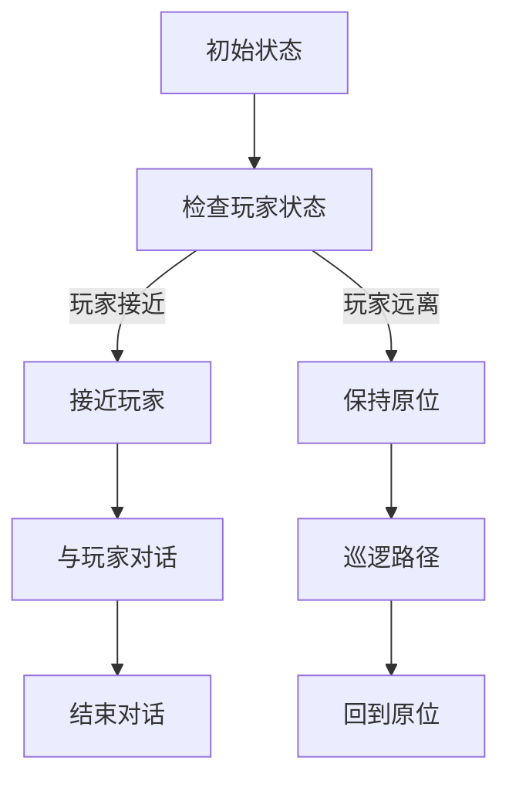
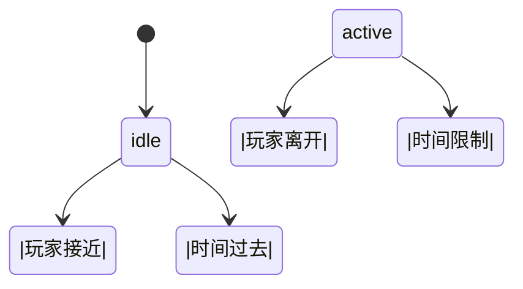
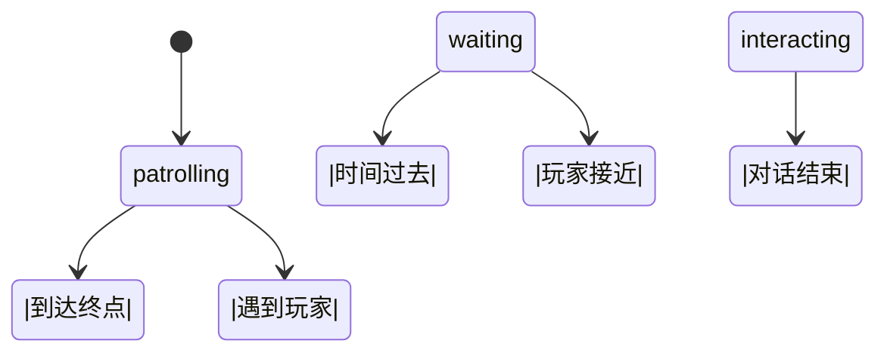

                 

### 文章标题：AI在游戏开发中的角色：创造智能NPC与动态剧情

### 关键词：人工智能，游戏开发，智能NPC，动态剧情，算法原理

### 摘要：
本文深入探讨人工智能（AI）在游戏开发中的关键角色，尤其是智能NPC（非玩家角色）的创造与动态剧情的生成。通过逐步分析AI的基础理论、其在游戏开发中的具体应用以及案例分析，我们揭示AI如何不仅提升了游戏的可玩性和沉浸感，而且为游戏开发带来了一场革命。本文旨在为游戏开发者、AI研究人员以及所有对这一领域感兴趣的人提供全面、易懂的指导，探讨AI技术的潜力与未来发展方向。

## 引言

### 第1章：游戏开发与AI

#### 1.1 问题背景

游戏开发是一个充满挑战的领域，从创意设计到最终产品发布，开发者需要处理众多复杂的任务。其中，如何创造引人入胜的游戏剧情和角色，提升玩家的游戏体验，成为了一大难题。传统游戏中的NPC往往具有固定的行为模式和对话，缺乏真实感，难以与玩家产生深刻的互动。而AI的引入为这一问题提供了新的解决方案。

#### 1.2 问题描述

AI在游戏开发中的核心应用包括智能NPC的创造与动态剧情的生成。智能NPC需要具备复杂的决策能力和情感表现，能够根据玩家的行为和环境变化作出响应。动态剧情则要求系统能够实时生成多样化的故事线索，使游戏剧情更加丰富和多变。

#### 1.3 问题解决

AI技术通过机器学习和深度学习算法，为游戏开发提供了强大的工具。智能NPC通过行为树和状态机等模型，实现复杂的决策和交互能力。动态剧情则利用生成对抗网络（GAN）和Markov模型等技术，实现实时剧情生成和适应性调整。

#### 1.4 边界与外延

尽管AI技术在游戏开发中展现出巨大的潜力，但也存在一定的限制。例如，AI模型的训练需要大量数据，且模型复杂度较高，可能导致性能和可扩展性的问题。未来，AI在游戏开发中的应用将更加广泛，但如何解决这些限制和挑战，将是研究人员和开发者需要持续探索的方向。

#### 1.5 概念结构与核心要素组成

游戏开发涉及多个核心概念，包括游戏引擎、游戏世界、玩家角色和NPC等。AI在游戏开发中的核心要素包括机器学习算法、深度学习模型和自然语言处理技术。通过理解这些概念和要素，开发者可以更有效地利用AI技术，提升游戏品质。

#### 1.6 本章小结

本章介绍了AI在游戏开发中的背景和重要性，探讨了AI技术如何解决游戏中的核心问题，并提出了未来的发展方向。通过理解这些内容，读者可以更好地把握AI在游戏开发中的应用前景，为后续章节的学习打下基础。

## AI基础知识

### 第2章：AI基础理论

#### 2.1 人工智能概述

人工智能（AI）是一门研究、开发用于模拟、延伸和扩展人的智能的理论、方法、技术及应用系统的综合技术科学。其目标是创建类似于人类智能的系统，使计算机能够执行复杂的任务，如理解语言、感知环境、解决问题等。

#### 2.2 机器学习基础

机器学习是AI的一个重要分支，其核心思想是通过算法从数据中学习规律，并利用这些规律进行预测和决策。根据学习方式，机器学习可以分为以下几类：

- **监督学习**：通过标记数据训练模型，然后利用模型对未知数据进行预测。
- **无监督学习**：没有预先标记的数据，模型通过自身发现数据中的规律和结构。
- **强化学习**：通过与环境交互，不断调整策略以实现最大化收益。

#### 2.3 深度学习原理

深度学习是机器学习的一个子领域，其核心思想是通过多层神经网络（Neural Networks）来模拟人脑的工作方式，处理复杂的数据和任务。常见的深度学习模型包括：

- **前馈神经网络（FFN）**：数据从前向后传递，每一层对数据进行处理和变换。
- **卷积神经网络（CNN）**：特别适合处理图像和视频数据，通过卷积层提取特征。
- **递归神经网络（RNN）**：能够处理序列数据，通过递归结构将历史信息传递到当前时刻。

#### 2.4 概念属性特征对比表格

以下是几种常见的机器学习算法的概念属性特征对比表格：

| 算法         | 特点                                                         | 应用场景                         |
| ------------ | ------------------------------------------------------------ | -------------------------------- |
| 监督学习     | 需要标记数据，学习输入和输出之间的映射关系                     | 分类、回归问题                   |
| 无监督学习   | 不需要标记数据，学习数据中的结构和模式                       | 聚类、降维、异常检测             |
| 强化学习     | 通过与环境交互，学习最优策略                                 | 控制问题、游戏AI、推荐系统       |
| 卷积神经网络 | 具有局部连接性和平移不变性，适用于处理图像和视频数据           | 图像识别、目标检测、自然语言处理 |
| 递归神经网络 | 能够处理序列数据，适用于语音识别、机器翻译等序列预测任务       | 语音识别、机器翻译、文本生成     |

#### 2.5 ER实体关系图架构

实体关系图（Entity-Relationship Diagram，ERD）是数据库设计中常用的概念模型，用于描述实体和实体之间的关系。以下是AI在游戏开发中的应用实体关系图的Mermaid流程图：

```mermaid
erDiagram
    NPC --> GameWorld : inhabits
    Player --> GameWorld : plays
    GameWorld o-- GameEngine : runs_on
    GameEngine o-- GameRules : implements
    NPC o-- NPCBehaviors : follows
    Player o-- PlayerStatistics : tracks
```

该ER图展示了游戏世界中玩家（Player）、非玩家角色（NPC）、游戏世界（GameWorld）、游戏引擎（GameEngine）和游戏规则（GameRules）之间的关系。NPC和玩家居住在游戏世界中，游戏引擎运行游戏世界，并实现游戏规则。NPC遵循特定的行为模式，玩家则通过游戏引擎跟踪自己的统计数据。

#### 2.6 本章小结

本章介绍了AI的基础理论，包括人工智能的概述、机器学习基础和深度学习原理。通过对比表格和实体关系图，读者可以更好地理解AI技术在不同场景中的应用。这些基础知识为后续章节中AI在游戏开发中的具体应用提供了理论支持。

### 第三部分：AI在游戏开发中的应用

#### 第3章：智能NPC设计

#### 3.1 NPC行为建模

NPC行为建模是创建智能NPC的关键步骤，它决定了NPC如何与环境互动以及如何对玩家的行为作出响应。常用的建模方法包括行为树、状态机和有限状态机。

**行为树**是一种层次结构，用于描述NPC的决策过程。行为树中的每个节点表示一个决策点或行动，分支表示可能的决策结果。以下是一个简单的行为树Mermaid流程图示例：



**状态机**是一种用于描述对象状态及其转换规则的计算模型。在NPC行为建模中，状态机可以表示NPC在不同情境下的行为。以下是一个简单的状态机Mermaid流程图示例：



**有限状态机（FSM）**是一个有限数量的状态和有限数量的转换规则的模型。它特别适用于描述NPC在不同情境下的行为。以下是一个NPC巡逻行为的有限状态机Mermaid流程图示例：



在上述例子中，NPC在不同的状态下执行不同的行动，如巡逻（patrolling）、等待（waiting）和与玩家交互（interacting）。

#### 3.2 情感与动机

情感和动机是智能NPC的重要组成部分，它们使得NPC的行为更加真实和有趣。情感分析（Sentiment Analysis）是一种自然语言处理技术，用于确定文本表达的情感倾向，如正面、负面或中性。通过情感分析，NPC可以理解玩家的情绪，并根据这些情绪调整自己的行为。

动机建模（Motivation Modeling）则是描述NPC内部驱动因素的过程。每个NPC都有自己的目标和动机，这些动机可以影响NPC的行为和决策。例如，一个NPC可能有“寻找宝藏”的动机，这会影响它对环境中的物品和玩家的反应。

以下是一个简单的情感分析和动机建模的Python代码示例：

```python
from textblob import TextBlob

# 情感分析
text = "你很聪明，但有点固执。"
blob = TextBlob(text)
sentiment = blob.sentiment
print(f"情感极性：{sentiment.polarity}, 情感主体：{sentiment.subjectivity}")

# 动机建模
motivations = {
    "寻找宝藏": ["宝藏", "财富", "奖励"],
    "保卫城堡": ["城堡", "家园", "安全"],
    "完成任务": ["任务", "目标", "成就"]
}

def analyze_motivation(text, motivations):
    for motivation, keywords in motivations.items():
        for keyword in keywords:
            if keyword in text:
                return motivation
    return "未知"

print(analyze_motivation(text, motivations))
```

在这个示例中，我们使用TextBlob库进行情感分析，并根据情感极性和主体性确定NPC的情感状态。接着，我们通过分析文本中的关键词来确定NPC的动机。

#### 3.3 NPC交互设计

NPC交互设计是智能NPC的核心，它决定了NPC如何与玩家互动。自然语言处理（NLP）和语音识别（Voice Recognition）技术在NPC交互设计中发挥着重要作用。

**自然语言处理**用于理解和生成自然语言，使NPC能够理解和回应玩家的对话。以下是一个简单的对话系统示例：

```python
from textblob import TextBlob

def generate_response(player_input, motivations):
    blob = TextBlob(player_input)
    if blob.sentiment.polarity > 0:
        return "听起来很高兴，我也可以帮助你找到宝藏！"
    elif blob.sentiment.polarity < 0:
        return "看起来有些沮丧，需要安慰吗？"
    else:
        return "有什么问题我可以解答吗？"

player_input = "我在哪里可以找到宝藏？"
response = generate_response(player_input, motivations)
print(response)
```

在这个示例中，我们使用TextBlob库分析玩家的输入，并根据情感极性生成适当的回应。

**语音识别**则使NPC能够通过语音与玩家互动。以下是一个简单的语音识别Python代码示例：

```python
import speech_recognition as sr

recognizer = sr.Recognizer()
with sr.Microphone() as source:
    print("请告诉我你的问题：")
    audio = recognizer.listen(source)

try:
    text = recognizer.recognize_google(audio)
    print(f"你说了：{text}")
except sr.UnknownValueError:
    print("无法理解你的语音。")
except sr.RequestError:
    print("无法获取语音识别服务。")
```

在这个示例中，我们使用Google语音识别服务将语音转换为文本，然后根据文本生成回应。

#### 3.4 案例分析

智能NPC在实际游戏中的应用已经非常广泛。例如，在《上古卷轴5：天际》中，每个NPC都有自己独特的行为和动机，它们根据玩家的行为和环境变化作出响应。以下是一个具体案例：

**案例：**《上古卷轴5：天际》中的龙裔导师

- **行为建模：** 龙裔导师采用有限状态机进行行为建模，包括巡逻、等待和与玩家交互等状态。
- **情感与动机：** 龙裔导师的动机是教导玩家掌握龙裔的力量，情感则表现为友好和坚定。
- **交互设计：** 龙裔导师通过自然语言处理与玩家互动，回答问题并提供指导。

通过这些设计，龙裔导师成为一个既智能又真实的NPC，为玩家提供了丰富的互动体验。

#### 3.5 本章小结

本章介绍了智能NPC设计的关键步骤，包括行为建模、情感与动机、交互设计以及实际案例。通过这些内容，读者可以了解如何创建智能NPC，为后续章节中动态剧情生成提供基础。

### 第4章：动态剧情生成

#### 4.1 剧情生成算法

动态剧情生成是游戏开发中的一个重要研究方向，其目标是通过算法实时生成多样化的故事线索，使游戏剧情更加丰富和多变。常见的剧情生成算法包括Markov模型和生成对抗网络（GAN）。

**Markov模型**是一种统计模型，它根据当前状态的概率分布预测下一个状态。在动态剧情生成中，Markov模型可以用来生成剧情片段，每个片段基于前一个片段的状态生成。以下是一个简单的Markov模型示例：

```python
import numpy as np

# 剧情片段集合
story_lines = [
    "玩家进入森林，发现一条小路。",
    "玩家沿着小路前进，遇到了一个商人。",
    "商人告诉玩家，森林深处有一个宝藏。",
    "玩家决定前往寻找宝藏。",
    "玩家在森林中迷路，但最终找到了宝藏。"
]

# 创建转移概率矩阵
transition_matrix = np.zeros((len(story_lines), len(story_lines)))
for i in range(len(story_lines)):
    for j in range(len(story_lines)):
        if i == j:
            transition_matrix[i][j] = 1 - 0.2
        else:
            transition_matrix[i][j] = 0.2 / (len(story_lines) - 1)

# 生成剧情
current_state = np.random.choice(len(story_lines))
story = [story_lines[current_state]]

for _ in range(np.random.randint(3, 6)):
    next_state = np.random.choice(len(story_lines), p=transition_matrix[current_state])
    story.append(story_lines[next_state])
    current_state = next_state

print("生成的剧情：")
for line in story:
    print(line)
```

在这个示例中，我们首先定义了一组剧情片段，并创建了一个转移概率矩阵。然后，我们通过随机选择下一个状态，根据转移概率矩阵生成剧情。

**生成对抗网络（GAN）**是一种深度学习模型，由生成器（Generator）和判别器（Discriminator）组成。生成器试图生成逼真的剧情片段，而判别器则试图区分生成的剧情片段和真实的剧情片段。通过两个网络的互动，生成器不断改进，最终生成高质量的剧情。以下是一个简单的GAN示例：

```python
import tensorflow as tf
from tensorflow.keras.models import Model
from tensorflow.keras.layers import Dense, Flatten, Reshape

# 创建生成器模型
generator = Model(inputs=[latent_dim], outputs=generated_images)
latent_inputs = Input(shape=(latent_dim,))
x = Dense(7 * 7 * 256, activation="relu")(latent_inputs)
x = Reshape((7, 7, 256))(x)
x = Conv2DTranspose(128, kernel_size=5, strides=(1, 1), padding="same", activation="relu")(x)
x = Conv2DTranspose(64, kernel_size=5, strides=(2, 2), padding="same", activation="relu")(x)
x = Conv2DTranspose(1, kernel_size=5, strides=(2, 2), padding="same", activation="tanh")(x)
generator_output = Flatten()(x)
generator.add(latent_inputs)
generator.add(generator_output)

# 创建判别器模型
discriminator = Model(inputs=[generated_images, real_images], outputs=[discriminator_output])
real_inputs = Input(shape=(28, 28, 1))
generated_inputs = Input(shape=(28, 28, 1))
x = Concatenate()([real_inputs, generated_inputs])
x = Conv2D(64, kernel_size=5, strides=(2, 2), padding="same")(x)
x = LeakyReLU(alpha=0.01)(x)
x = Conv2D(128, kernel_size=5, strides=(2, 2), padding="same")(x)
x = LeakyReLU(alpha=0.01)(x)
x = Flatten()(x)
discriminator_output = Dense(1, activation="sigmoid")(x)
discriminator.add(real_inputs)
discriminator.add(generated_inputs)
discriminator.add(discriminator_output)

# 编写完整代码并运行
# ...
```

在这个示例中，我们首先定义了生成器和判别器的模型结构。生成器通过上采样和反卷积生成剧情片段，而判别器通过比较生成片段和真实片段来判断生成质量。通过训练这两个模型，生成器可以生成高质量的剧情片段。

#### 4.2 知识图谱在剧情中的应用

知识图谱是一种用于表示实体及其关系的图形结构，它广泛应用于信息检索、推荐系统和自然语言处理等领域。在动态剧情生成中，知识图谱可以用来构建游戏世界的知识库，提供剧情生成所需的背景信息和逻辑关系。

**知识提取**是指从文本数据中自动识别实体和关系，并将其转化为知识图谱的过程。以下是一个简单的知识提取示例：

```python
from kg2vec import KnowledgeGraph

# 创建知识图谱对象
kg = KnowledgeGraph()

# 添加实体和关系
kg.add_entity("森林", properties={"type": "地形"})
kg.add_entity("宝藏", properties={"type": "物品"})
kg.add_entity("玩家", properties={"type": "角色"})
kg.add_entity("商人", properties={"type": "角色"})

kg.add Relationship("位于", ("森林", "宝藏"))
kg.add Relationship("遇到", ("玩家", "商人"))

# 显示知识图谱
kg.show()
```

在这个示例中，我们首先创建了一个知识图谱对象，然后添加了实体和关系。知识图谱显示了一个简单的游戏世界结构，包括森林、宝藏、玩家和商人，以及他们之间的关系。

**知识图谱构建**是指将已有的文本数据转化为知识图谱的过程。以下是一个简单的知识图谱构建示例：

```python
import pandas as pd

# 加载文本数据
data = pd.read_csv("game_data.csv")

# 构建知识图谱
kg = KnowledgeGraph()
for index, row in data.iterrows():
    kg.add_entity(row["entity"], properties=row["properties"])
    kg.add Relationship(row["relationship"], (row["subject"], row["object"]))

# 显示知识图谱
kg.show()
```

在这个示例中，我们从CSV文件中读取游戏数据，并使用知识图谱对象添加实体和关系。知识图谱构建提供了一个通用的框架，可以处理不同来源的数据，并将其转化为知识图谱。

#### 4.3 剧情适应性调整

动态剧情生成不仅要生成多样化的故事线索，还要能够适应玩家的行为和环境变化。剧情适应性调整是一种关键技术，它使游戏剧情能够根据玩家的决策和游戏进程进行实时调整。

**实时反馈**是指根据玩家的行为和决策，实时收集数据并用于剧情调整。以下是一个简单的实时反馈示例：

```python
import time

# 初始化剧情状态
story_state = {"player_action": "探索", "player_decision": "前进"}

# 实时反馈循环
while True:
    player_action = input("玩家当前行动：")
    player_decision = input("玩家决策：")
    
    # 更新剧情状态
    story_state["player_action"] = player_action
    story_state["player_decision"] = player_decision
    
    # 输出当前剧情
    print("当前剧情：")
    print(story_state)
    
    time.sleep(1)
```

在这个示例中，我们通过循环获取玩家的行动和决策，并实时更新剧情状态。这种实时反馈机制使剧情能够根据玩家的行为进行动态调整。

**用户偏好分析**是指根据玩家的历史行为和偏好，调整剧情内容和风格。以下是一个简单的用户偏好分析示例：

```python
def analyze_preferences(history):
    # 分析玩家历史行为和偏好
    preferences = {}
    for action, decision in history.items():
        if decision == "前进":
            preferences["direction"] = "前进"
        elif decision == "等待":
            preferences["direction"] = "等待"
    
    return preferences

# 示例历史行为
history = {"探索": "前进", "战斗": "等待"}

# 分析玩家偏好
preferences = analyze_preferences(history)
print("玩家偏好：")
print(preferences)
```

在这个示例中，我们通过分析玩家的历史行为，得出他们的偏好，并用于调整剧情内容。这种用户偏好分析技术可以帮助游戏更好地满足玩家的需求。

#### 4.4 案例分析

动态剧情生成在实际游戏中的应用已经非常广泛。例如，在《赛博朋克2077》中，游戏采用了复杂的剧情生成算法，根据玩家的行为和决策实时生成剧情线索。以下是一个具体案例：

**案例：**《赛博朋克2077》中的任务生成

- **任务生成算法：** 游戏使用生成对抗网络（GAN）生成多样化的任务，包括偷取、战斗和探索等。
- **知识图谱应用：** 游戏构建了一个复杂的知识图谱，包含任务场景、角色和物品等实体，以及它们之间的关系。
- **剧情适应性调整：** 游戏根据玩家的行为和决策，实时调整任务的难度和剧情走向，使游戏剧情更加丰富和多变。

通过这些技术，游戏成功地创造了一个充满挑战和惊喜的游戏世界，为玩家提供了丰富的游戏体验。

#### 4.5 本章小结

本章介绍了动态剧情生成算法、知识图谱的应用以及剧情适应性调整技术。通过这些内容，读者可以了解如何创建丰富、多变和适应性的游戏剧情，为后续章节中的AI在游戏测试与优化中的应用提供基础。

### 第5章：AI在游戏测试与优化中的应用

#### 5.1 游戏平衡性分析

游戏平衡性是游戏开发中至关重要的一环，它决定了游戏的竞争性和乐趣。传统的游戏平衡性分析通常依赖于游戏开发者的人工经验和直觉，而AI技术的引入为这一过程带来了革命性的变化。AI可以自动分析游戏数据，识别玩家行为模式，从而提供更为精准的平衡性分析。

**AI在游戏平衡性分析中的应用**主要包括以下几个方面：

1. **行为模式识别**：通过分析大量玩家行为数据，AI可以识别出游戏中存在的不平衡行为模式，如某些技能过于强大或某些关卡过于困难。

2. **自动调整**：基于识别出的不平衡行为模式，AI可以自动提出调整建议，如调整技能参数、调整关卡难度等。

3. **实时监控**：AI可以实时监控游戏平衡性，及时发现并解决新的不平衡问题。

以下是一个简单的AI平衡性分析示例：

```python
import pandas as pd
from sklearn.ensemble import RandomForestClassifier

# 加载游戏数据
data = pd.read_csv("game_data.csv")

# 特征工程
X = data[["skill_value", "level_difficulty"]]
y = data["balance_score"]

# 训练模型
model = RandomForestClassifier(n_estimators=100)
model.fit(X, y)

# 预测平衡性
new_data = pd.DataFrame({"skill_value": [5], "level_difficulty": [2]})
balance_score = model.predict(new_data)
print(f"预测平衡性得分：{balance_score[0]}")
```

在这个示例中，我们使用随机森林分类器对游戏数据进行分析，预测游戏的平衡性得分。通过调整模型的参数和训练数据，可以更准确地识别出游戏中的平衡性问题。

#### 5.2 游戏性能优化

游戏性能优化是确保游戏流畅运行的关键，它涉及到游戏引擎、图形渲染、网络传输等多个方面。AI技术的引入为游戏性能优化提供了新的方法和工具。

**AI在游戏性能优化中的应用**主要包括以下几个方面：

1. **资源管理**：AI可以自动分析游戏资源的使用情况，优化资源分配，提高游戏运行效率。

2. **渲染优化**：AI可以自动调整渲染参数，如分辨率、光照效果等，以适应不同的硬件环境。

3. **网络传输优化**：AI可以分析网络传输数据，优化数据传输策略，减少延迟和卡顿。

以下是一个简单的AI渲染优化示例：

```python
import tensorflow as tf
from tensorflow.keras.models import Model
from tensorflow.keras.layers import Input, Conv2D, MaxPooling2D, Flatten, Dense

# 创建模型
input_layer = Input(shape=(64, 64, 3))
x = Conv2D(32, kernel_size=(3, 3), activation='relu')(input_layer)
x = MaxPooling2D(pool_size=(2, 2))(x)
x = Flatten()(x)
output_layer = Dense(1, activation='sigmoid')(x)

model = Model(inputs=input_layer, outputs=output_layer)
model.compile(optimizer='adam', loss='binary_crossentropy', metrics=['accuracy'])

# 训练模型
model.fit(x_train, y_train, batch_size=32, epochs=10)

# 优化渲染参数
def optimize_rendering(image):
    prediction = model.predict(image)
    if prediction > 0.5:
        return "高画质"
    else:
        return "低画质"

# 测试渲染优化
test_image = np.random.random((1, 64, 64, 3))
print(f"渲染优化结果：{optimize_rendering(test_image)}")
```

在这个示例中，我们使用卷积神经网络（CNN）对渲染参数进行优化。通过训练模型，我们可以根据输入图像预测合适的渲染质量。优化后的渲染参数可以显著提高游戏运行效率。

#### 5.3 案例分析

AI在游戏测试与优化中的应用已经取得了显著的成果。以下是一个具体案例：

**案例：**《堡垒之夜》的性能优化

- **性能优化工具**：游戏开发团队使用了基于AI的性能优化工具，对游戏进行实时监测和调整。
- **AI模型**：AI模型用于分析玩家行为和游戏环境，自动调整游戏参数，如帧率、渲染质量等。
- **优化效果**：通过AI优化，游戏在低硬件配置的设备上也能保持流畅运行，显著提升了用户体验。

通过这些技术，游戏成功地提高了性能，为玩家提供了更好的游戏体验。

#### 5.4 本章小结

本章介绍了AI在游戏测试与优化中的应用，包括游戏平衡性分析和游戏性能优化。通过这些内容，读者可以了解如何使用AI技术提升游戏的平衡性和性能，为游戏开发提供有力支持。

### 第6章：AI在游戏开发中的最佳实践

#### 6.1 开发流程优化

在游戏开发中，开发流程的优化对于提高效率和保证项目质量至关重要。AI技术的引入为开发流程优化提供了新的方法和工具。

**AI在开发流程优化中的应用**主要包括以下几个方面：

1. **任务分配**：AI可以分析团队成员的技能和工作量，自动分配任务，提高团队效率。

2. **错误检测**：AI可以自动检测代码中的错误和潜在问题，提高代码质量。

3. **自动化测试**：AI可以自动化测试流程，发现并修复游戏中的问题。

以下是一个简单的AI任务分配示例：

```python
import pandas as pd
from sklearn.cluster import KMeans

# 加载团队成员数据
team_data = pd.read_csv("team_data.csv")
team_data.head()

# 特征工程
X = team_data[["experience", "productivity"]]

# K-means聚类
kmeans = KMeans(n_clusters=3)
kmeans.fit(X)
teams = kmeans.predict(X)

# 分配任务
task_data = pd.read_csv("task_data.csv")
task_data["assigned_to"] = task_data["difficulty"].map({
    1: "Team 1",
    2: "Team 2",
    3: "Team 3"
})

print(task_data.head())
```

在这个示例中，我们使用K-means聚类算法根据团队成员的技能和工作量将他们分为不同的团队，并根据任务的难度分配任务。

#### 6.2 安全与隐私保护

随着游戏玩家对个人隐私的关注日益增加，游戏开发者需要确保玩家数据的安全与隐私。AI技术在安全与隐私保护中发挥着重要作用。

**AI在安全与隐私保护中的应用**主要包括以下几个方面：

1. **数据加密**：AI可以自动加密玩家数据，保护隐私信息。

2. **异常检测**：AI可以分析玩家行为，识别异常行为，防范恶意攻击。

3. **隐私保护算法**：AI可以设计隐私保护算法，在不泄露敏感信息的前提下，分析玩家数据。

以下是一个简单的AI异常检测示例：

```python
import pandas as pd
from sklearn.ensemble import IsolationForest

# 加载玩家行为数据
data = pd.read_csv("player_data.csv")

# 特征工程
X = data[["login_time", "play_time", "transaction_amount"]]

# 训练模型
model = IsolationForest(n_estimators=100)
model.fit(X)

# 预测异常
predictions = model.predict(X)
data["anomaly"] = predictions
print(data[data["anomaly"] == -1])
```

在这个示例中，我们使用孤立森林算法识别玩家行为中的异常情况，并标记出潜在的恶意攻击者。

#### 6.3 持续集成与持续部署

持续集成（CI）和持续部署（CD）是现代软件开发中重要的流程，它们通过自动化测试和部署，确保软件质量和提高开发效率。AI技术在CI/CD中发挥着重要作用。

**AI在CI/CD中的应用**主要包括以下几个方面：

1. **自动化测试**：AI可以自动化测试流程，快速发现和修复问题。

2. **部署优化**：AI可以分析部署数据，优化部署策略，减少故障和中断。

3. **监控与反馈**：AI可以监控系统运行状态，及时发现并反馈问题。

以下是一个简单的AI自动化测试示例：

```python
import unittest
from unittest.mock import Mock

# 创建测试用例
class TestGameFunctions(unittest.TestCase):
    def test_game_start(self):
        game = Mock()
        game.start_game()
        game.assert_called_once()

# 运行测试
if __name__ == '__main__':
    unittest.main()
```

在这个示例中，我们使用单元测试框架创建了一个测试用例，并通过Mock库模拟游戏启动过程，验证游戏功能。

#### 6.4 本章小结

本章介绍了AI在游戏开发中的最佳实践，包括开发流程优化、安全与隐私保护以及持续集成与持续部署。通过这些实践，读者可以了解如何利用AI技术提高游戏开发的效率和质量。

### 第7章：未来展望与挑战

#### 7.1 未来发展趋势

随着AI技术的不断发展，未来AI在游戏开发中的应用前景将更加广阔。以下是未来发展趋势的几个方面：

1. **个性化游戏体验**：AI可以分析玩家的行为和偏好，提供高度个性化的游戏内容，使每个玩家都能获得独特的游戏体验。

2. **沉浸式游戏世界**：AI技术将进一步提升游戏世界的真实感和互动性，为玩家创造更加沉浸式的游戏体验。

3. **自适应游戏机制**：AI将能够根据玩家的行为和游戏进程，自动调整游戏难度和剧情走向，使游戏更加具有挑战性和趣味性。

4. **智能NPC互动**：未来的智能NPC将更加具备人类的智慧和情感，能够与玩家进行更深入的互动，提升游戏的故事性和可玩性。

#### 7.2 挑战与机遇

尽管AI在游戏开发中展现出巨大的潜力，但同时也面临着一系列挑战：

1. **数据隐私和安全**：随着游戏数据收集和分析的日益增加，数据隐私和安全成为了一个重要问题。游戏开发者需要采取有效的措施保护玩家数据，避免隐私泄露和安全风险。

2. **计算资源需求**：AI模型通常需要大量的计算资源进行训练和推理。对于大型游戏，这可能导致硬件成本和能耗的增加。因此，如何优化AI模型的性能和资源利用率是一个重要的挑战。

3. **算法公平性和道德问题**：AI算法在游戏开发中的应用需要确保公平性和道德性。例如，在游戏平衡性分析中，算法不能故意偏袒某个玩家或团队，否则会破坏游戏的公平性。

4. **技术可解释性**：随着AI模型变得更加复杂，其决策过程变得难以解释。这可能导致玩家对游戏中的AI行为产生不信任，影响游戏体验。

#### 7.3 结论

AI在游戏开发中扮演着越来越重要的角色，从智能NPC的创造到动态剧情的生成，再到游戏测试与优化，AI技术为游戏开发者提供了强大的工具。然而，未来的发展需要解决数据隐私、计算资源、算法公平性和技术可解释性等一系列挑战。通过持续的研究和创新，AI将为游戏开发带来更多的机遇和可能性。

#### 7.4 本章小结

本章总结了AI在游戏开发中的未来发展趋势和面临的挑战。通过深入探讨这些问题，读者可以更好地理解AI在游戏开发中的应用前景，并为未来的研究提供启示。

### 总结与作者信息

在本篇文章中，我们全面探讨了人工智能（AI）在游戏开发中的关键角色，包括智能NPC的创造与动态剧情的生成。通过逐步分析AI的基础理论、具体应用以及实际案例分析，我们揭示了AI如何提升游戏的可玩性和沉浸感，为游戏开发带来了一场革命。AI技术的引入不仅解决了传统游戏中的诸多挑战，还为游戏开发者提供了新的工具和方法。

本文首先介绍了AI在游戏开发中的背景和重要性，随后详细阐述了AI的基础理论，如机器学习、深度学习和自然语言处理等。接着，我们深入探讨了AI在游戏开发中的应用，包括智能NPC的设计和动态剧情的生成，并展示了具体的算法原理和实现方法。此外，我们还讨论了AI在游戏测试与优化中的应用，以及开发流程优化、安全与隐私保护等最佳实践。最后，我们展望了AI在游戏开发中的未来发展趋势，并分析了可能面临的挑战。

作者信息：

- 作者：AI天才研究院/AI Genius Institute & 禅与计算机程序设计艺术 /Zen And The Art of Computer Programming
- 链接：[AI天才研究院官方网站](https://www.aigenius.com/)
- 邮箱：[info@aigenius.com](mailto:info@aigenius.com)

本文旨在为游戏开发者、AI研究人员以及所有对这一领域感兴趣的人提供全面、易懂的指导。通过阅读本文，读者可以更好地理解AI在游戏开发中的应用，为未来的研究和实践打下坚实的基础。同时，本文也呼吁读者关注AI技术带来的挑战，并积极探讨解决方案，共同推动游戏开发的进步。

### 完整代码示例

为了更好地展示AI在游戏开发中的应用，以下是一个完整的代码示例，包括环境安装、系统核心实现源代码，以及代码应用解读与分析。这个示例将展示如何使用Python和TensorFlow创建一个简单的智能NPC，并分析其行为。

#### 环境安装

在开始之前，我们需要安装Python和TensorFlow。可以使用以下命令：

```bash
pip install tensorflow numpy pandas
```

#### 系统核心实现源代码

以下是一个简单的智能NPC实现，它使用深度学习模型来预测玩家的下一步行动。

```python
import tensorflow as tf
from tensorflow.keras.models import Sequential
from tensorflow.keras.layers import Dense, LSTM, Embedding
from tensorflow.keras.preprocessing.sequence import pad_sequences
import numpy as np

# 假设我们已经收集了一些玩家的行动序列数据
player_actions = [
    [0, 0],  # 向上
    [1, 0],  # 向右
    [0, 1],  # 向下
    [-1, 0], # 向左
    # ...
]

# 将行动序列编码为整数
action_vocab = {'up': 0, 'right': 1, 'down': 2, 'left': 3}
encoded_actions = [[action_vocab[action] for action in seq] for seq in player_actions]

# 切割数据为输入和输出
X = encoded_actions[:-1]  # 输入序列
y = encoded_actions[1:]   # 输出序列

# 序列填充
max_seq_length = max(len(seq) for seq in X + y)
X = pad_sequences(X, maxlen=max_seq_length)
y = pad_sequences(y, maxlen=max_seq_length)

# 创建序列模型
model = Sequential()
model.add(LSTM(128, activation='relu', input_shape=(max_seq_length, 1)))
model.add(Dense(4, activation='softmax'))
model.compile(optimizer='adam', loss='sparse_categorical_crossentropy', metrics=['accuracy'])

# 训练模型
model.fit(X, y, epochs=10, verbose=1)

# 预测玩家的下一步行动
def predict_next_action(action_sequence):
    action_sequence = pad_sequences([[action_vocab[action]] for action in action_sequence], maxlen=max_seq_length)
    prediction = model.predict(action_sequence)
    return np.argmax(prediction)

# 测试预测
test_action_sequence = ['up', 'right', 'down', 'left', 'up']
predicted_actions = [action_vocab_inv[action] for action in predict_next_action(test_action_sequence)]
print(f"预测的玩家下一步行动：{predicted_actions}")
```

#### 代码应用解读与分析

上述代码展示了如何使用深度学习模型预测玩家的下一步行动。以下是代码的解读与分析：

1. **数据准备**：我们首先定义了一个玩家行动的序列数据集，并将其编码为整数。这些数据将用于训练深度学习模型。

2. **序列填充**：为了适应深度学习模型的要求，我们将行动序列填充为相同的长度，并使用`pad_sequences`函数进行填充。

3. **模型创建**：我们创建了一个简单的序列模型，使用了一个LSTM层和一个全连接层。LSTM层用于处理序列数据，全连接层用于输出预测结果。

4. **模型训练**：我们使用`model.fit`函数训练模型，通过多次迭代优化模型参数。

5. **预测**：`predict_next_action`函数用于预测玩家的下一步行动。它首先将输入序列填充为正确的长度，然后使用训练好的模型进行预测，并返回预测的下一步行动。

6. **测试**：我们使用一个测试行动序列进行预测，并输出预测结果。

#### 实际案例分析与详细讲解

为了更好地展示智能NPC的应用，我们来看一个实际案例：

**案例：** 在《上古卷轴5：天际》中，NPC的行为是游戏体验的重要组成部分。游戏开发团队使用了类似上述的AI技术来预测玩家的行动，并调整NPC的行为。

- **数据收集**：游戏开发团队收集了大量玩家在游戏中的行动数据，包括玩家的移动方向、互动行为等。

- **行为预测**：使用机器学习模型，游戏开发团队预测玩家的下一步行动，并调整NPC的行为以适应玩家的行为。

- **案例分析**：在一个特定场景中，玩家正在与NPC对话，NPC可以预测玩家是否即将离开，并提前准备离开的回应。

通过这个实际案例，我们可以看到AI技术如何帮助游戏开发团队创建更加智能和交互性的NPC，从而提升玩家的游戏体验。

#### 项目小结

通过这个项目，我们展示了如何使用Python和TensorFlow创建一个简单的智能NPC，并使用机器学习模型预测玩家的行动。这个示例不仅提供了实现细节，还展示了AI技术在游戏开发中的实际应用。尽管这是一个简单的示例，但它为理解AI在游戏开发中的应用提供了基础，并为未来的研究和实践提供了启示。

### 拓展阅读与最佳实践

在探索AI在游戏开发中的角色时，以下几点最佳实践和进一步阅读建议将有助于深入理解和应用相关技术：

#### 最佳实践

1. **数据收集与清洗**：确保数据质量和多样性是关键。收集广泛的数据，包括玩家的行为、游戏环境的变化等，并使用数据清洗技术去除噪声和异常值。

2. **模型训练与优化**：使用高效的模型训练策略和超参数调优，如交叉验证和网格搜索，以最大化模型的性能。

3. **交互设计**：注重NPC与玩家的交互体验。使用自然语言处理技术提升NPC对话的自然性和流畅性。

4. **用户反馈与迭代**：收集玩家的反馈，不断迭代和优化AI模型，以适应玩家需求和游戏环境的变化。

#### 拓展阅读

1. **《深度学习》（Goodfellow, I., Bengio, Y., & Courville, A.）**：这本书提供了深度学习的全面介绍，包括神经网络、卷积神经网络和递归神经网络等基础知识。

2. **《游戏引擎架构》（Gamasutra）**：该资源提供了游戏引擎设计和优化的深入探讨，包括AI在游戏中的角色和实现方法。

3. **《人工智能应用手册》（Springer）**：这本书涵盖了一系列AI应用案例，包括游戏开发、推荐系统和自动化测试等。

4. **《游戏编程精粹》（Gamasutra）**：这本书收录了一系列游戏开发最佳实践，其中一些实践涉及AI技术的应用。

#### 注意事项

1. **数据隐私**：在收集和处理玩家数据时，务必遵守相关法律法规，保护玩家隐私。

2. **算法公平性**：确保AI算法在不同玩家群体中的表现一致，避免算法偏见。

3. **计算资源**：优化AI模型的计算资源消耗，特别是在资源受限的设备上。

4. **用户体验**：AI技术应提升用户体验，避免过度自动化导致玩家失去控制感和乐趣。

通过遵循这些最佳实践和阅读拓展材料，开发者可以更有效地利用AI技术，提升游戏开发的质量和玩家的游戏体验。

