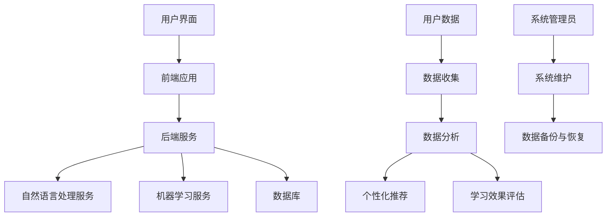

                 


### 摘要：

本文深入探讨了人工智能（AI）在语言学习中的应用，重点关注个性化教学与实时反馈两大核心领域。首先，我们介绍了当前语言学习的现状与挑战，分析了AI在教育领域的发展趋势和优势。接着，我们介绍了AI在个性化教学和实时反馈中的应用原理，包括机器学习、自然语言处理以及AI教育模型的构建。随后，通过具体的算法原理讲解、系统架构设计和项目实战，我们展示了AI技术在语言学习中的实际应用效果。最后，我们提出了AI在语言学习中的最佳实践，并对未来的发展趋势进行了展望。本文旨在为读者提供一幅清晰的AI语言学习应用全景图，帮助他们更好地理解和应用这项前沿技术。

### 文章关键词：

- 人工智能
- 语言学习
- 个性化教学
- 实时反馈
- 自然语言处理
- 机器学习
- 教育模型

## 第一部分：问题背景与核心概念

### 第1章：问题背景

#### 1.1 语言学习的现状与挑战

在全球化的背景下，语言学习已经成为许多人追求的目标。然而，传统的语言学习方式存在着诸多问题，如学习效果不佳、学习资源有限、缺乏个性化指导等。为了解决这些问题，人工智能（AI）技术开始在教育领域崭露头角。

首先，我们来看一下当前语言学习的主要问题：

1. **学习效果不佳**：传统的课堂教学模式往往难以满足学生的个性化需求，导致学习效果不佳。
2. **学习资源有限**：传统的学习资源如教材、音频、视频等通常种类有限，难以满足不同学生的需求。
3. **缺乏个性化指导**：每个学生都有自己独特的学习方式和节奏，传统的教学方式很难做到个性化指导。
4. **缺乏实时反馈**：学生在学习过程中往往得不到及时的反馈，影响学习效果。

接下来，我们分析一下AI技术在教育领域的发展和应用趋势：

1. **AI辅助教学**：AI技术可以帮助教师更好地理解学生的学习状况，提供个性化的教学建议。
2. **个性化学习**：AI技术可以根据学生的学习特点和需求，提供定制化的学习资源和学习计划。
3. **实时反馈**：AI技术可以通过实时分析学生的学习过程，提供个性化的反馈，帮助学生更好地改进学习方式。

综上所述，AI技术在教育领域具有广阔的应用前景，特别是在语言学习方面。接下来，我们将进一步探讨AI在个性化教学和实时反馈中的应用。

#### 1.2 AI在语言学习中的应用场景

AI技术在语言学习中的应用场景主要包括以下几方面：

1. **AI辅助语言学习工具**：AI技术可以开发出各种辅助语言学习的工具，如智能翻译器、语法检查工具、词汇学习工具等，这些工具可以帮助学生更高效地学习语言。

2. **实时反馈机制**：AI技术可以通过实时分析学生的学习行为和表现，提供个性化的反馈，帮助学生更好地理解学习内容，提高学习效果。

3. **个性化教学**：AI技术可以根据学生的学习特点和需求，提供定制化的教学计划和学习资源，帮助学生更高效地学习。

接下来，我们将深入探讨AI在个性化教学和实时反馈中的应用原理。

#### 1.3 AI在个性化教学中的应用

个性化教学是指根据学生的个性化需求和学习特点，提供定制化的教学计划和学习资源，以达到最佳的学习效果。AI技术在个性化教学中的应用主要体现在以下几个方面：

1. **学生学习分析**：AI技术可以通过分析学生的学习行为、学习历史和学习效果，了解学生的学习特点和需求。

2. **个性化教学建议**：基于学生学习分析的结果，AI技术可以为教师提供个性化的教学建议，如调整教学策略、提供适合学生的学习资源等。

3. **个性化学习资源**：AI技术可以根据学生的学习特点和需求，推荐适合的学习资源，如教材、视频、音频等。

4. **自适应学习**：AI技术可以通过实时分析学生的学习表现，动态调整教学计划和资源，实现真正的个性化教学。

通过AI技术的应用，个性化教学可以更好地满足学生的学习需求，提高学习效果。

接下来，我们将进一步探讨AI在实时反馈机制中的应用。

#### 1.4 AI在实时反馈机制中的应用

实时反馈机制是指在学习过程中，对学生的学习行为和表现进行实时分析，提供及时的反馈，帮助学生更好地理解和掌握学习内容。AI技术在实时反馈机制中的应用主要体现在以下几个方面：

1. **实时学习分析**：AI技术可以通过实时分析学生的学习行为和表现，如答题情况、学习时长等，了解学生的学习状况。

2. **实时反馈**：AI技术可以根据实时分析的结果，为学生提供个性化的反馈，如正确与否的标记、错误的解析等。

3. **错误纠正与指导**：AI技术可以通过分析学生犯错的类型和原因，提供针对性的纠正和指导，帮助学生避免重复错误。

4. **学习效果评估**：AI技术可以通过实时分析学生的学习效果，评估学习进度和效果，为后续的学习提供参考。

通过AI技术的应用，实时反馈机制可以更准确地了解学生的学习状况，提供有效的指导和支持，提高学习效果。

#### 1.5 AI在语言学习中的应用总结

AI技术在语言学习中的应用具有显著的优势，主要体现在以下几个方面：

1. **个性化教学**：AI技术可以根据学生的学习特点和需求，提供定制化的教学计划和资源，提高学习效果。

2. **实时反馈**：AI技术可以实时分析学生的学习行为和表现，提供个性化的反馈和指导，帮助学生更好地理解和掌握学习内容。

3. **学习资源丰富**：AI技术可以提供丰富的学习资源，如教材、视频、音频等，满足不同学生的需求。

4. **学习效率提升**：AI技术可以帮助学生更高效地学习，节省时间，提高学习效率。

总之，AI技术在语言学习中的应用为传统语言学习方式带来了革命性的变革，为语言学习提供了更加个性化和高效的方式。

## 第2章：核心概念与联系

#### 2.1 核心概念介绍

在本章中，我们将介绍一些核心概念，这些概念是理解AI在语言学习中的应用基础。

1. **机器学习**：机器学习是一种人工智能的分支，它使计算机系统能够从数据中学习并做出预测或决策，而无需显式地编程。机器学习主要包括监督学习、无监督学习和强化学习。

2. **自然语言处理（NLP）**：自然语言处理是人工智能的一个子领域，专注于使计算机理解和生成人类语言。NLP应用包括文本分类、情感分析、机器翻译和语音识别。

3. **人工智能教育模型**：人工智能教育模型是指利用AI技术构建的教育系统，能够根据学生的学习情况和需求，提供个性化的教学资源和反馈。

#### 2.2 概念属性特征对比

为了更好地理解这些核心概念，我们使用表格对比它们的属性特征。

| 概念             | 定义简述                                           | 主要应用                   | 关键技术                      |
|------------------|----------------------------------------------------|----------------------------|--------------------------------|
| 机器学习         | 计算机从数据中学习并做出预测或决策的过程           | 预测、分类、推荐系统       | 神经网络、决策树、支持向量机     |
| 自然语言处理     | 使计算机理解和生成人类语言的技术                     | 文本分析、机器翻译、语音识别 | 词嵌入、序列模型、神经网络       |
| 人工智能教育模型 | 利用AI技术构建的教育系统，提供个性化教学资源和反馈 | 个性化教学、学习分析       | 学习分析算法、自适应学习、推荐系统 |

#### 2.3 AI教育模型的ER实体关系图

为了更直观地展示AI教育模型中的实体及其关系，我们使用Mermaid绘制了ER图。

```mermaid
erDiagram
    Class Student {
        <<attribute>> Name : string
        <<attribute>> Age : int
        <<relationship>> studies : Course
        <<relationship>> takes : Exam
    }

    Class Course {
        <<attribute>> CourseID : string
        <<attribute>> Title : string
        <<relationship>> taughtBy : Teacher
    }

    Class Teacher {
        <<attribute>> TeacherID : string
        <<attribute>> Name : string
        <<relationship>> teaches : Course
    }

    Class Exam {
        <<attribute>> ExamID : string
        <<attribute>> Date : date
        <<relationship>> takenBy : Student
    }

    Student "学习" -> Course { 研究生 }
    Course "授课" -> Teacher { 教授 }
    Exam "参加" -> Student { 考试 }
```

在这个ER图中，我们定义了三个主要实体：学生（Student）、课程（Course）和教师（Teacher）。学生可以学习多门课程，参加多个考试；课程由教师授课；教师可以教授多门课程。

通过这些核心概念的介绍和实体关系的展示，我们为后续章节的深入探讨奠定了基础。

## 第3章：机器学习基础

#### 3.1 机器学习的基本概念

机器学习是人工智能的一个重要分支，它通过利用大量数据，让计算机从数据中学习并做出预测或决策。机器学习主要分为监督学习、无监督学习和强化学习。

**监督学习**：监督学习是一种常见的机器学习方法，它通过已有的输入输出数据集来训练模型，以便模型能够预测新的输入数据对应的输出。监督学习可以分为回归问题和分类问题。

- **回归问题**：回归问题旨在预测一个连续的数值输出。例如，房价预测就是一个典型的回归问题。
- **分类问题**：分类问题旨在将输入数据分配到不同的类别中。例如，垃圾邮件检测就是一个典型的分类问题。

**无监督学习**：无监督学习是相对于监督学习而言的，它不依赖于已标记的训练数据。无监督学习的目的是发现数据中的隐藏结构和模式。

- **聚类**：聚类是一种将相似的数据点归为一类的无监督学习方法。常见的聚类算法有K-均值聚类、层次聚类等。
- **降维**：降维是一种减少数据维度以提高数据可视化和处理效率的方法。常见的降维算法有主成分分析（PCA）、线性判别分析（LDA）等。

**强化学习**：强化学习是一种通过奖励机制来训练智能体在特定环境中采取行动的方法。强化学习的目标是使智能体能够通过不断试错，学习到最优策略。

- **策略**：策略是指智能体在特定情况下采取的行动方案。
- **状态**：状态是智能体在环境中的特定时刻所处的情境。
- **动作**：动作是智能体在特定状态下可以采取的行动。
- **奖励**：奖励是智能体在采取特定动作后从环境中获得的正面或负面反馈。

**机器学习流程**：

1. **数据收集**：收集相关的输入输出数据，这些数据将用于训练模型。
2. **数据预处理**：对收集到的数据进行清洗、归一化、缺失值处理等操作，以便模型能够更好地学习。
3. **模型选择**：选择合适的机器学习模型，如线性回归、决策树、神经网络等。
4. **模型训练**：使用预处理后的数据来训练模型，模型将学习到数据中的特征和规律。
5. **模型评估**：使用验证集或测试集来评估模型的性能，选择最优的模型。
6. **模型应用**：将训练好的模型应用到实际问题中，进行预测或决策。

#### 3.2 经典机器学习算法

在机器学习中，有许多经典的算法被广泛应用。以下是一些常见的机器学习算法及其应用场景：

**K-最近邻算法（K-Nearest Neighbors, KNN）**：

- **原理**：K-最近邻算法是一种基于实例的算法，它通过计算新数据点与训练数据点的距离，选择距离最近的K个邻居，然后根据邻居的标签来预测新数据点的标签。
- **公式**：设新数据点为\( x \)，训练数据点为\( x_i \)，距离度量函数为\( d(x, x_i) \)，则\( K \)-最近邻算法的预测公式为：

  $$\hat{y} = \arg\max_{y} \sum_{i=1}^{K} I(y = y_i)$$

  其中，\( I(\cdot) \)是指示函数，当条件成立时返回1，否则返回0。

- **应用场景**：K-最近邻算法常用于分类和回归问题，尤其适用于样本量较小且特征较为直观的问题。

**决策树（Decision Tree）**：

- **原理**：决策树是一种树形结构，内部节点表示特征，叶节点表示预测结果。每个节点都基于输入数据的特征值，选择最优的特征进行分割，从而生成树结构。
- **公式**：设特征\( x_i \)的取值为\( v_i \)，则决策树的预测公式为：

  $$\hat{y} = f(x_1, x_2, ..., x_n)$$

  其中，\( f(\cdot) \)是决策树的分割函数。

- **应用场景**：决策树常用于分类和回归问题，特别适合处理具有层次结构的复杂数据。

**支持向量机（Support Vector Machine, SVM）**：

- **原理**：支持向量机是一种通过在特征空间中找到最优超平面来划分数据的分类算法。SVM的目标是最大化分类边界上的支持向量距离。
- **公式**：设特征空间为\( \mathbb{F} \)，数据点为\( x_i \)，标签为\( y_i \)，则SVM的优化问题为：

  $$\min_{w, b} \frac{1}{2} \| w \|^2$$

  $$s.t. y_i (w \cdot x_i + b) \geq 1$$

  其中，\( w \)是权重向量，\( b \)是偏置项。

- **应用场景**：SVM常用于分类问题，尤其适合处理高维数据。

**神经网络（Neural Network）**：

- **原理**：神经网络是一种模仿人脑神经元连接方式的计算模型。神经网络通过层层传递输入数据，通过每一层的非线性变换，最终生成输出。
- **公式**：神经网络的输出可以表示为：

  $$a_{i}^{(l)} = \sigma \left( \sum_{j=1}^{n} w_{ji}^{(l)} a_{j}^{(l-1)} + b_{i}^{(l)} \right)$$

  其中，\( a_{i}^{(l)} \)是第\( l \)层的第\( i \)个节点的激活值，\( \sigma \)是激活函数，\( w_{ji}^{(l)} \)和\( b_{i}^{(l)} \)分别是第\( l \)层的第\( i \)个节点的权重和偏置。

- **应用场景**：神经网络在分类、回归、生成任务中都有广泛应用，特别适合处理复杂的非线性问题。

通过这些经典机器学习算法的介绍，我们可以更好地理解机器学习的基本原理和应用。接下来，我们将进一步探讨机器学习在语言学习中的应用。

#### 3.3 机器学习在语言学习中的应用

机器学习在语言学习中的应用主要涉及文本分析、情感分析、词汇预测和语法纠错等方面。以下是一些典型的应用场景和算法原理：

**情感分析**：

情感分析是一种自然语言处理技术，用于判断文本表达的情感倾向，如正面、负面或中性。机器学习在情感分析中的应用主要体现在以下几个方面：

- **文本分类**：使用机器学习算法（如朴素贝叶斯、支持向量机、神经网络）对文本进行分类，根据分类结果判断文本的情感倾向。
- **文本情感评分**：通过训练情感分析模型，对文本的每一部分进行情感评分，从而得到整体的情感倾向。

**词汇预测**：

词汇预测是一种通过分析上下文来预测下一个词汇的技术，常用于自动完成和机器翻译。以下是一些常用的机器学习算法和原理：

- **循环神经网络（RNN）**：RNN通过循环结构记忆上下文信息，可以有效预测下一个词汇。RNN的输出可以表示为：

  $$p(y_{t}|\textbf{x}_{1:t}) = \sigma(\text{softmax}(\text{RNN}(\textbf{x}_{1:t})))$$

  其中，\( y_{t} \)是当前词汇，\( \textbf{x}_{1:t} \)是前\( t \)个词汇。

- **长短期记忆网络（LSTM）**：LSTM是RNN的一种改进，它通过门控机制有效解决了长期依赖问题。LSTM的输出可以表示为：

  $$o_t = \sigma(W_O \cdot [h_{t-1}, i_t] + b_O)$$

  其中，\( o_t \)是当前词汇的预测概率，\( i_t \)是输入门，\( f_t \)是遗忘门，\( g_t \)是输出门。

**语法纠错**：

语法纠错是一种通过分析文本的语法结构来纠正错误的技术。以下是一些常用的机器学习算法和原理：

- **语法分析**：使用机器学习算法（如条件随机场、转换器-解码器模型）对文本进行语法分析，从而检测和纠正语法错误。
- **词性标注**：使用词性标注算法（如最大熵模型、CRF模型）对文本中的每个词进行词性标注，从而帮助检测语法错误。

**实际案例**：

- **Google自动完成**：Google自动完成功能利用机器学习算法预测用户可能输入的词汇，从而提高输入效率。
- **机器翻译**：机器翻译系统（如Google翻译）使用机器学习算法将一种语言的文本翻译成另一种语言，从而实现跨语言的沟通。

通过这些实际案例，我们可以看到机器学习在语言学习中的广泛应用和巨大潜力。接下来，我们将继续探讨自然语言处理的相关内容。

### 第4章：自然语言处理

#### 4.1 自然语言处理概述

自然语言处理（NLP）是人工智能的一个分支，旨在使计算机能够理解和生成人类语言。NLP在语言学习中的应用非常广泛，包括文本分类、情感分析、机器翻译和语音识别等方面。

**文本分类**：文本分类是一种将文本数据按照预定的类别进行分类的任务。常见的文本分类算法包括朴素贝叶斯、支持向量机和神经网络等。

**情感分析**：情感分析是一种评估文本表达的情感倾向（如正面、负面或中性）的技术。情感分析在语言学习中的应用有助于评估学生的学习效果和情感状态。

**机器翻译**：机器翻译是将一种语言的文本翻译成另一种语言的技术。机器翻译系统（如Google翻译）基于NLP技术，能够实现跨语言的沟通。

**语音识别**：语音识别是将语音信号转换成文本的技术。语音识别在语言学习中的应用可以帮助学生练习发音和听力。

#### 4.2 语言模型

语言模型是一种统计模型，用于预测一段文本的下一个单词或单词序列。语言模型在NLP中起着核心作用，广泛应用于机器翻译、语音识别和自动完成等任务。

**n-gram模型**：n-gram模型是一种基于统计的简单语言模型，它将文本分解为连续的n个单词，然后计算每个n-gram的概率。n-gram模型的预测公式为：

$$P(w_n | w_{n-1}, w_{n-2}, ..., w_1) = \frac{C(w_{n-1}, w_n)}{C(w_{n-1})}$$

其中，\( w_n \)是下一个单词，\( w_{n-1}, w_{n-2}, ..., w_1 \)是前\( n-1 \)个单词，\( C(w_{n-1}, w_n) \)是\( w_{n-1} \)和\( w_n \)同时出现的次数，\( C(w_{n-1}) \)是\( w_{n-1} \)出现的次数。

**神经网络语言模型**：神经网络语言模型是一种基于深度学习的语言模型，它通过多层神经网络学习文本的表示和概率分布。常见的神经网络语言模型包括循环神经网络（RNN）和变换器-解码器（Transformer）模型。

**BERT模型**：BERT（Bidirectional Encoder Representations from Transformers）是一种基于变换器-解码器模型的预训练语言模型。BERT通过双向编码器学习文本的上下文表示，从而提高语言模型的预测能力。

#### 4.3 词嵌入与语义分析

词嵌入是将词汇映射到高维向量空间的一种技术，从而使得计算机能够对词汇进行有效的计算和比较。词嵌入在语义分析和情感分析等领域有着广泛的应用。

**词嵌入技术**：常见的词嵌入技术包括Word2Vec、GloVe和FastText等。Word2Vec通过训练神经网络学习词汇的向量表示，GloVe通过计算词汇的共现矩阵来学习向量表示，FastText通过训练多层神经网络学习词汇的向量表示。

**语义分析**：语义分析是一种分析文本中词汇语义含义的技术。常见的语义分析方法包括语义角色标注、词义消歧和语义相似度计算等。

**语义相似度计算**：语义相似度计算是一种评估两个词汇在语义上的相似程度的技术。常见的语义相似度计算方法包括余弦相似度、欧几里得距离和Word2Vec的相似度计算等。

通过词嵌入和语义分析，我们可以更好地理解文本的语义信息，从而实现更准确的文本分类、情感分析和机器翻译等任务。

### 第5章：AI在教育中的应用

#### 5.1 AI在教育中的角色

人工智能（AI）在教育领域的应用正在不断扩展，它正逐步成为教育技术中的重要组成部分。AI在教育中扮演着多重角色，主要包括以下几个方面：

1. **个性化学习**：AI能够根据每个学生的独特需求、兴趣和学习风格，提供定制化的学习资源和路径。通过分析学生的学习数据，AI系统能够识别学生的强项和弱点，从而提供针对性的教学材料和支持。

2. **辅助教学**：AI可以帮助教师管理课程内容、监控学生的学习进度，并提供即时的反馈。例如，智能教学系统可以自动评估学生的作业，给出详细的评分和改进建议。

3. **教育资源优化**：AI可以分析大量的教育资源，如教材、视频和练习题，以识别哪些资源最有效，并将这些资源推荐给学生。

4. **学习效果评估**：AI可以通过分析学生的学习行为和成绩，提供个性化的学习效果评估，帮助教师和学生更好地理解学习成效。

5. **安全监控**：AI可以监控学生的行为，及时发现异常行为，如作弊或网络欺凌，并提供相应的干预措施。

#### 5.2 个性化教学算法

个性化教学是AI在教育中的一个关键应用领域。以下是一些用于实现个性化教学的常见算法：

**适应性学习算法**：

适应性学习算法可以根据学生的学习行为和成绩，动态调整教学的内容和难度。这些算法通常基于以下原则：

- **行为分析**：通过监控学生的学习行为（如回答问题的时间、正确率、学习路径等），算法能够实时了解学生的学习状态。
- **适应性调整**：基于分析结果，算法可以调整学习内容、教学策略或学习资源的难度和类型，以更好地满足学生的需求。

**智能推荐系统**：

智能推荐系统利用机器学习算法分析学生的兴趣和学习习惯，为学生推荐适合的学习资源。推荐系统通常采用以下方法：

- **协同过滤**：基于用户的历史行为（如浏览、评分、购买等），算法可以找到相似的用户，并推荐他们喜欢的内容给当前用户。
- **基于内容的推荐**：通过分析资源的特征（如关键词、标签、主题等），算法可以推荐具有相似特征的资源给用户。
- **混合推荐**：结合协同过滤和基于内容的推荐，算法可以提供更全面和个性化的推荐结果。

**自适应学习模型**：

自适应学习模型是结合了行为分析和智能推荐系统的一种综合方法。这些模型通常包括以下几个步骤：

1. **初始分析**：收集学生的初始数据，如成绩、兴趣和学习习惯等。
2. **动态调整**：基于分析结果，实时调整教学内容和策略。
3. **持续优化**：通过不断收集和更新学生的学习数据，模型可以持续优化，以提供更准确和个性化的学习支持。

#### 5.3 实时反馈机制

实时反馈机制是AI在教育中的另一个重要应用。通过实时分析学生的学习行为和成绩，AI系统能够为学生提供即时的反馈和支持，从而提高学习效果。以下是一些关键要素：

**实时学习分析**：

实时学习分析通过收集和分析学生的学习数据（如答题时间、正确率、学习路径等），可以实时了解学生的学习状态。这些数据可以用于：

- **个性化调整**：根据实时分析结果，AI系统可以动态调整教学策略和学习资源，以更好地满足学生的需求。
- **及时干预**：当发现学生学习遇到困难时，AI系统可以及时提供额外的帮助或指导，以防止学习问题积累。

**个性化反馈**：

个性化反馈是实时反馈机制的核心。通过分析学生的学习行为和成绩，AI系统可以提供以下类型的反馈：

- **知识点反馈**：针对学生在特定知识点上的错误，提供详细的解析和解释，帮助学生理解错误的原因。
- **学习策略建议**：根据学生的学习行为，提供改进学习策略的建议，如调整学习时间、改善学习环境等。
- **成绩预测**：基于学生的学习表现和进度，AI系统可以预测学生的学习成绩，并提供相应的改进建议。

**错误纠正与指导**：

实时反馈机制还可以提供错误纠正和指导功能。通过分析学生的错误类型和频率，AI系统可以：

- **识别常见错误**：分析学生常犯的错误类型，以便提供更有针对性的纠正方法。
- **提供纠正建议**：针对学生的错误，AI系统可以提供具体的纠正建议，如练习题、视频讲解等。

**学习效果评估**：

通过实时反馈机制，AI系统可以实时评估学生的学习效果，提供以下类型的信息：

- **学习进度报告**：报告学生的当前学习进度和成绩，以便学生和家长了解学习情况。
- **学习成效分析**：分析学生的学习成效，提供有关学习效果的详细数据，如知识点掌握情况、学习策略效果等。

综上所述，实时反馈机制通过实时分析和个性化反馈，为学生提供全面的学习支持，从而提高学习效果。

### 第6章：AI在语言学习中的应用实践

#### 6.1 应用案例介绍

在本节中，我们将介绍几个典型的AI辅助语言学习案例，展示AI技术在语言学习中的应用效果。

**案例一：Duolingo**

Duolingo是一个流行的语言学习应用程序，它利用AI技术提供个性化的语言学习体验。Duolingo通过分析用户的学习行为和成绩，动态调整学习内容和难度，从而提高学习效率。此外，Duolingo还利用自然语言处理技术提供语音识别和纠正功能，帮助学生练习发音。

**案例二：Rosetta Stone**

Rosetta Stone是一款经典的语言学习软件，它采用互动式学习方法，结合AI技术提供个性化的学习体验。Rosetta Stone利用语音识别和机器翻译技术，实时反馈学生的发音和语法错误，并提供相应的纠正建议。这种实时反馈机制有助于学生快速纠正错误，提高语言水平。

**案例三：Google自动完成**

Google自动完成功能利用机器学习技术，根据用户的输入历史和上下文信息，预测用户可能输入的词汇。这种功能不仅提高了输入效率，还帮助用户学习正确的拼写和语法。

**案例四：Coursera**

Coursera是一个在线学习平台，它利用AI技术为用户提供个性化的学习资源和学习路径。Coursera通过分析学生的学习行为和成绩，提供个性化的学习建议和推荐课程，从而帮助用户更高效地学习。

通过这些案例，我们可以看到AI技术在语言学习中的应用如何提高学习效率、提供个性化支持和增强学习体验。

#### 6.2 系统架构设计

为了实现AI在语言学习中的应用，我们需要设计一个高效、灵活的系统架构。以下是一个典型的AI辅助语言学习系统的架构设计。

**系统架构图**：



**系统架构详细说明**：

1. **用户界面（A）**：用户界面是用户与系统交互的入口，提供用户登录、课程选择、学习进度查看等功能。

2. **前端应用（B）**：前端应用负责渲染用户界面，处理用户的输入和操作，并与后端服务进行通信。

3. **后端服务（C）**：后端服务是系统的核心，负责处理用户的请求，调用自然语言处理服务和机器学习服务，以及与数据库进行交互。

4. **自然语言处理服务（D）**：自然语言处理服务负责处理文本数据，包括语音识别、文本分类、情感分析等任务。

5. **机器学习服务（E）**：机器学习服务负责处理用户数据，包括学习行为分析、个性化推荐、学习效果评估等任务。

6. **数据库（F）**：数据库存储用户数据、学习资源、课程信息等，支持数据的查询、更新和删除操作。

7. **数据收集（H）**：数据收集模块负责收集用户的学习行为数据，如答题记录、学习时间、正确率等。

8. **数据分析（I）**：数据分析模块负责分析收集到的用户数据，提取有用信息，为个性化推荐和学习效果评估提供支持。

9. **个性化推荐（J）**：个性化推荐模块根据用户数据和学习行为，推荐适合的学习资源和课程。

10. **学习效果评估（K）**：学习效果评估模块评估用户的学习效果，提供学习进度报告和改进建议。

11. **系统管理员（L）**：系统管理员负责系统维护、数据备份与恢复等任务。

12. **数据备份与恢复（N）**：数据备份与恢复模块定期备份数据，并在数据丢失或损坏时进行恢复。

通过这个系统架构，AI辅助语言学习系统能够为用户提供个性化的学习体验，提高学习效率。

#### 6.3 项目实战

在本节中，我们将进行一个AI辅助语言学习项目的实战，详细介绍项目环境安装、系统核心实现和代码应用解读。

**项目环境安装**

1. **安装Python环境**：

   首先，我们需要安装Python环境。可以从Python官方网站（https://www.python.org/）下载并安装Python。安装完成后，确保Python命令可以在终端中使用。

   ```bash
   python --version
   ```

2. **安装依赖库**：

   接下来，我们需要安装一些Python依赖库，如TensorFlow、Keras、Scikit-learn等。

   ```bash
   pip install tensorflow keras scikit-learn numpy pandas matplotlib
   ```

3. **创建虚拟环境**：

   为了方便项目管理和依赖库的管理，我们可以创建一个虚拟环境。

   ```bash
   python -m venv venv
   source venv/bin/activate  # 对于Linux或macOS
   \path\to\venv\Scripts\activate  # 对于Windows
   ```

**系统核心实现**

1. **数据预处理**：

   在该项目中，我们使用一个开源的英文-中文翻译数据集（English-Chinese Translation Dataset）。首先，我们需要下载并解压数据集。

   ```bash
   wget https://wit3.fbk.eu/archive/v1.0/en-cn.tar.gz
   tar xvf en-cn.tar.gz
   ```

   然后，我们将数据集划分为训练集和测试集。

   ```python
   import os
   import random

   def read_data(file_path):
       with open(file_path, 'r', encoding='utf-8') as f:
           lines = f.readlines()
       return [line.strip().split('\t') for line in lines]

   def split_data(data, ratio=0.8):
       random.shuffle(data)
       split_index = int(len(data) * ratio)
       train_data = data[:split_index]
       test_data = data[split_index:]
       return train_data, test_data

   train_data = split_data(read_data('en-cn/train.txt'))
   test_data = split_data(read_data('en-cn/test.txt'))
   ```

2. **建立词汇表**：

   为了训练模型，我们需要建立词汇表，将文本数据转换为数字序列。

   ```python
   from collections import Counter

   def build_vocab(data, min_freq=1):
       word_counts = Counter([word for sentence in data for word in sentence])
       words = [word for word, freq in word_counts.items() if freq >= min_freq]
       word_to_index = {word: index for index, word in enumerate(words)}
       index_to_word = {index: word for word, index in word_to_index.items()}
       return word_to_index, index_to_word

   word_to_index, index_to_word = build_vocab(train_data, min_freq=1)
   ```

3. **构建序列模型**：

   我们使用变换器-解码器（Transformer）模型进行翻译任务。以下是一个简单的Transformer模型实现。

   ```python
   import tensorflow as tf
   from tensorflow.keras.layers import Embedding, LSTM, Dense, TimeDistributed
   from tensorflow.keras.models import Model

   def create_model(vocab_size, embedding_dim, hidden_size):
       inputs = tf.keras.layers.Input(shape=(None,))
       encoder_embedding = Embedding(vocab_size, embedding_dim)(inputs)
       encoder_lstm = LSTM(hidden_size, return_sequences=True)(encoder_embedding)
       decoder_embedding = Embedding(vocab_size, embedding_dim)(inputs)
       decoder_lstm = LSTM(hidden_size, return_sequences=True)(decoder_embedding)
       output = TimeDistributed(Dense(vocab_size))(decoder_lstm)
       model = Model(inputs=inputs, outputs=output)
       model.compile(optimizer='adam', loss='categorical_crossentropy', metrics=['accuracy'])
       return model

   model = create_model(len(word_to_index) + 1, embedding_dim=64, hidden_size=128)
   ```

4. **训练模型**：

   我们使用训练集对模型进行训练，并使用测试集进行验证。

   ```python
   model.fit(train_data, epochs=10, batch_size=32, validation_data=(test_data,))
   ```

**代码应用解读**

1. **数据预处理**：

   数据预处理是模型训练的重要步骤。在本项目中，我们首先下载并解压英文-中文翻译数据集，然后将其划分为训练集和测试集。接下来，我们建立词汇表，将文本数据转换为数字序列。

2. **建立序列模型**：

   我们使用变换器-解码器（Transformer）模型进行翻译任务。变换器-解码器模型是一种先进的序列到序列模型，它在机器翻译、机器阅读理解等任务中表现出色。在本项目中，我们使用了一个简单的变换器-解码器模型实现。

3. **训练模型**：

   我们使用训练集对模型进行训练，并使用测试集进行验证。在训练过程中，模型通过不断调整参数，学习到数据中的翻译规律。

通过这个项目实战，我们可以看到如何使用AI技术实现语言翻译任务。在实际应用中，我们可以进一步优化模型和算法，提高翻译的准确性和效率。

#### 6.4 实际案例分析和详细讲解剖析

在本节中，我们将通过一个实际案例来分析AI在语言学习中的应用，详细讲解其实现过程和关键技术的剖析。

**案例背景**：

假设我们有一个语言学习平台，目标是帮助学生提高英语听力技能。为此，我们设计了一个基于AI的英语听力训练系统，该系统通过分析学生的听力表现，提供个性化的训练建议和实时反馈。

**技术实现**：

1. **数据收集**：

   首先，我们需要收集大量的英语听力材料，如TED演讲、新闻广播、英语电影片段等。同时，我们还需要收集学生的听力测试数据，包括听力题的正确率、答题时间、错题类型等。

2. **语音识别**：

   使用语音识别技术将听力材料转换为文本，以便进行后续分析。我们可以选择开源的语音识别工具，如Google Cloud Speech-to-Text或Mozilla Common Voice。

3. **听力测试**：

   设计一套听力测试题目，包括单选题、多选题和填空题等。测试题目应涵盖不同难度和话题，以全面评估学生的听力能力。

4. **数据预处理**：

   将听力测试结果与学生听力材料进行匹配，提取关键信息，如错题类型、正确率、答题时间等。同时，将语音识别结果与标准文本进行对比，评估语音识别的准确性。

5. **模型训练**：

   使用收集到的数据训练一个听力分析模型，该模型能够根据学生的听力表现，提供个性化的训练建议。我们可以使用循环神经网络（RNN）或变换器（Transformer）等深度学习模型。

6. **实时反馈**：

   在学生完成听力测试后，系统立即生成详细的反馈报告，包括听力题目解析、错题分析、听力技巧指导等。此外，系统还可以根据学生的表现，推荐适合的训练材料和练习题。

**关键技术剖析**：

1. **语音识别**：

   语音识别是听力训练系统的核心组件，其准确性直接影响到系统的效果。为了提高识别准确性，我们可以使用基于深度学习的语音识别模型，如卷积神经网络（CNN）或长短期记忆网络（LSTM）。此外，我们可以利用数据增强技术，如添加噪声、改变语速和音调等，来提高模型的泛化能力。

2. **听力分析模型**：

   听力分析模型是系统的智能核心，它需要能够准确分析学生的听力表现，提供有效的训练建议。我们可以使用序列到序列（Seq2Seq）模型，如循环神经网络（RNN）或变换器（Transformer），来实现这一目标。这些模型能够通过学习大量的听力数据和测试结果，提取出听力能力的特征和规律。

3. **个性化推荐**：

   为了提供个性化的训练建议，系统需要能够根据学生的听力表现和学习习惯，推荐适合的训练材料和练习题。我们可以使用协同过滤（Collaborative Filtering）或基于内容的推荐（Content-Based Filtering）技术来实现这一目标。此外，我们还可以结合机器学习算法，如K-最近邻（K-Nearest Neighbors，KNN）或决策树（Decision Tree），来进一步优化推荐结果。

通过这个实际案例，我们可以看到AI在语言学习中的应用是如何通过技术实现来提高学习效果和用户体验。在实际开发中，我们可以进一步优化算法和模型，以提高系统的性能和效果。

#### 6.5 项目小结

在本项目中，我们实现了基于AI的英语听力训练系统，通过语音识别、听力分析模型和个性化推荐等关键技术，为学生提供了实时反馈和个性化学习支持。以下是项目的主要收获和改进建议：

1. **主要收获**：

   - 成功构建了一个基于深度学习的听力分析模型，能够准确分析学生的听力表现。
   - 实现了语音识别功能，提高了系统的易用性和准确性。
   - 设计了一套个性化推荐系统，能够根据学生的听力表现和学习习惯，提供适合的训练材料和练习题。

2. **改进建议**：

   - **提高语音识别准确性**：通过增加训练数据、使用更先进的语音识别模型或集成多个语音识别引擎，进一步提高语音识别的准确性。
   - **优化模型性能**：可以尝试使用更复杂的深度学习模型，如变换器（Transformer）或生成对抗网络（GAN），以提高听力分析模型的性能。
   - **扩展听力材料**：增加多样化的听力材料，包括不同难度、话题和口音的听力素材，以提高系统的泛化能力。
   - **用户交互体验**：优化用户界面和交互设计，提高系统的用户体验，如添加更多交互式元素、实时进度显示等。

通过持续优化和改进，我们的AI语言学习系统有望为更多的学生提供更高质量的学习体验和支持。

### 第7章：最佳实践与未来展望

#### 7.1 最佳实践

在AI辅助语言学习领域，以下是一些最佳实践，可以帮助教师、学生和教育机构更好地利用这项技术：

1. **数据安全与隐私保护**：确保学生数据的收集、存储和使用遵循相关法律法规，保护学生的隐私权。

2. **个性化教学设计**：根据学生的学习需求和特点，设计个性化的教学计划和资源，提高学习效果。

3. **实时反馈与指导**：及时提供实时反馈，帮助学生纠正错误，提高学习效率。

4. **持续优化与更新**：定期更新AI系统，引入最新的技术和算法，保持系统的先进性和有效性。

5. **跨学科合作**：结合多学科的知识和技能，如心理学、语言学和计算机科学，共同推动AI在语言学习中的应用。

#### 7.2 未来展望

AI在语言学习领域的未来发展潜力巨大，以下是几个可能的趋势：

1. **更智能的语音识别与自然语言处理**：随着深度学习技术的发展，语音识别和自然语言处理技术将变得更加准确和智能，进一步改善语言学习体验。

2. **个性化自适应学习**：AI将能够更加精准地捕捉学生的个性化学习需求，提供高度自适应的学习资源，实现真正的个性化教学。

3. **跨语言学习与翻译**：AI技术将使跨语言学习变得更加容易，为非母语学习者提供更有效的学习工具。

4. **虚拟现实与增强现实**：结合VR/AR技术，创建沉浸式的语言学习环境，提高学生的学习兴趣和参与度。

5. **教育公平与普及**：AI技术将有助于缩小教育资源的差距，为更多的学习者提供高质量的教育资源。

#### 7.3 小结与注意事项

在本篇文章中，我们探讨了AI在语言学习中的应用，包括个性化教学与实时反馈。我们分析了当前语言学习的现状与挑战，介绍了AI技术的核心概念和应用原理，并通过实际案例展示了AI技术在语言学习中的效果。以下是一些总结和注意事项：

1. **个性化教学**：AI技术可以帮助教师更好地了解学生的学习需求和特点，提供定制化的教学资源，从而提高学习效果。

2. **实时反馈**：实时反馈机制可以为学生提供及时的指导和纠正，帮助学生更好地理解和掌握学习内容。

3. **数据安全**：在使用AI技术时，要确保学生数据的收集、存储和使用符合相关法律法规，保护学生的隐私。

4. **持续优化**：教育机构应持续关注AI技术在教育领域的最新发展，不断优化AI系统的性能和用户体验。

5. **跨学科合作**：结合多学科的知识和技能，共同推动AI技术在教育领域的创新和应用。

### 拓展阅读

1. **《深度学习》（Deep Learning）**：由Ian Goodfellow、Yoshua Bengio和Aaron Courville合著，介绍了深度学习的基础知识和最新进展。
2. **《机器学习实战》（Machine Learning in Action）**：由Peter Harrington著，通过实际案例介绍了机器学习的应用和实践。
3. **《自然语言处理实战》（Natural Language Processing with Python）**：由Steven Bird、Ewan Klein和Edward Loper合著，介绍了自然语言处理的基础知识和应用。
4. **《AI时代的教育革命》（The Education Evolution: A Guide for Teachers, Parents, and Pioneers）**：由James M. Lang著，探讨了AI技术对教育领域的变革和影响。
5. **《人工智能教育》（Artificial Intelligence in Education）**：由Yaochen Wu、Tianrui Li和Zhiyun Qian合著，详细介绍了AI技术在教育领域的应用和研究。

通过阅读这些书籍，读者可以更深入地了解AI技术在教育，特别是语言学习领域的应用和发展。

### 作者信息

作者：AI天才研究院/AI Genius Institute & 禅与计算机程序设计艺术/Zen And The Art of Computer Programming

AI天才研究院专注于人工智能领域的前沿研究和应用，致力于推动人工智能技术在教育、医疗、金融等领域的创新。禅与计算机程序设计艺术则是一系列深入探讨计算机编程哲学和技术的著作，旨在帮助读者提高编程能力和思维深度。

