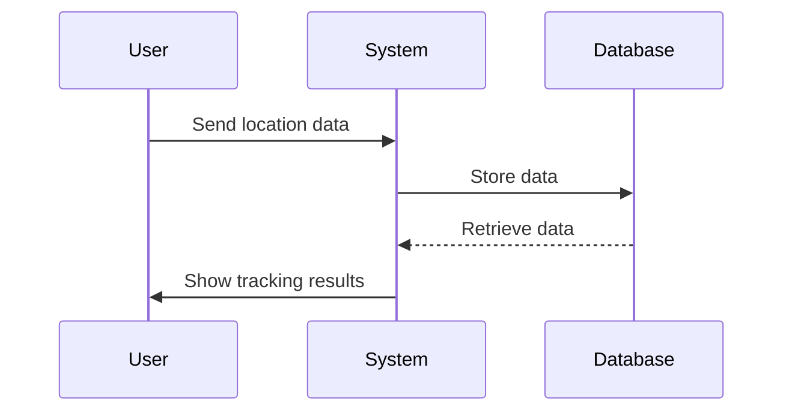
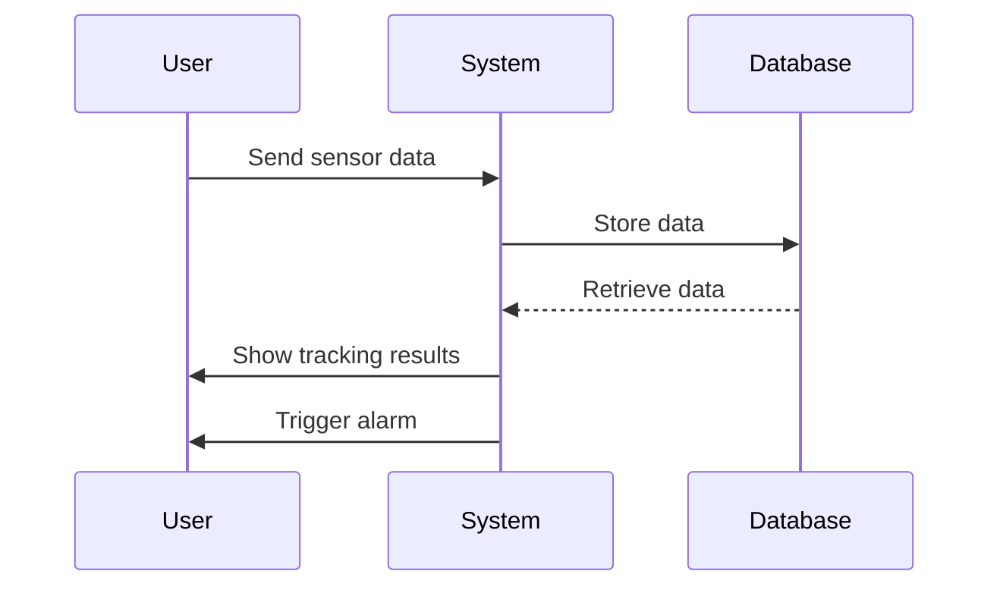

                 

### 第1章：问题背景与核心概念介绍

#### 1.1 野生动物保护的重要性

野生动物保护是指通过一系列措施，维护野生动物的种群数量和栖息地质量，以确保生态系统的平衡和生物多样性。当前，全球野生动物保护的现状令人担忧。根据世界自然保护联盟（IUCN）的报告，超过三分之一的陆地动物和近一半的鸟类面临灭绝的风险。栖息地丧失、非法狩猎、气候变化等因素是导致野生动物数量锐减的主要原因。

野生动物保护的重要性不言而喻。首先，它有助于维持生态系统的平衡。野生动物在生态系统中扮演着关键角色，如控制食物链中的特定物种数量，促进植物授粉和种子传播等。其次，保护野生动物对于人类的生存和发展具有重要意义。许多野生动物是药物和食品的来源，同时，生物多样性是未来科技创新的潜在源泉。

野生动物保护的目标是：
- 维护生物多样性，保护濒危物种；
- 恢复已退化的生态系统；
- 防止非法狩猎和贸易；
- 提高公众对野生动物保护的意识和参与度。

然而，野生动物保护面临诸多挑战。例如，资源有限，缺乏有效的监管机制，以及一些地方政策的不完善。此外，人类社会的发展与野生动物保护之间存在冲突，如何在两者之间找到平衡是一个亟待解决的问题。

#### 1.2 人工智能与野生动物保护

人工智能（AI）作为一项迅速发展的技术，正在越来越多地应用于野生动物保护领域。AI的发展历程可以追溯到20世纪50年代，其核心目标是通过机器模拟人类的智能行为。人工智能的主要分支包括机器学习、自然语言处理、计算机视觉等。

在野生动物保护中，人工智能具有广泛的应用前景。首先，AI可以用于野生动物的跟踪与监测。例如，利用GPS定位技术和深度学习算法，可以实现对野生动物位置的实时监测和追踪。其次，AI可以用于反偷猎技术的开发，如电子围栏和无人机监测系统。这些技术能够有效威慑和打击非法狩猎活动。此外，AI在大数据处理和模式识别方面的优势，也为野生动物保护提供了强有力的支持。

人工智能在野生动物保护中的核心作用体现在以下几个方面：
- 提高监测效率：AI技术可以自动化监测任务，节省人力资源；
- 提供决策支持：AI算法可以对大量数据进行分析，为野生动物保护提供科学依据；
- 减少人为干预：通过自动化系统，降低人为错误的风险；
- 威慑非法行为：AI技术可以实时监控，及时响应，对非法狩猎行为进行有效打击。

总之，人工智能为野生动物保护带来了新的机遇和挑战。通过合理应用AI技术，我们可以更好地保护野生动物，维护生态平衡，实现可持续发展目标。接下来，我们将进一步探讨人工智能的核心概念与原理，以及其在野生动物保护中的具体应用。

#### 1.2 人工智能与野生动物保护

人工智能（AI）作为一项迅速发展的技术，正在越来越多地应用于野生动物保护领域。AI的发展历程可以追溯到20世纪50年代，其核心目标是通过机器模拟人类的智能行为。人工智能的主要分支包括机器学习、自然语言处理、计算机视觉等。

在野生动物保护中，人工智能具有广泛的应用前景。首先，AI可以用于野生动物的跟踪与监测。例如，利用GPS定位技术和深度学习算法，可以实现对野生动物位置的实时监测和追踪。其次，AI可以用于反偷猎技术的开发，如电子围栏和无人机监测系统。这些技术能够有效威慑和打击非法狩猎活动。此外，AI在大数据处理和模式识别方面的优势，也为野生动物保护提供了强有力的支持。

人工智能在野生动物保护中的核心作用体现在以下几个方面：
- 提高监测效率：AI技术可以自动化监测任务，节省人力资源；
- 提供决策支持：AI算法可以对大量数据进行分析，为野生动物保护提供科学依据；
- 减少人为干预：通过自动化系统，降低人为错误的风险；
- 威慑非法行为：AI技术可以实时监控，及时响应，对非法狩猎行为进行有效打击。

总之，人工智能为野生动物保护带来了新的机遇和挑战。通过合理应用AI技术，我们可以更好地保护野生动物，维护生态平衡，实现可持续发展目标。接下来，我们将进一步探讨人工智能的核心概念与原理，以及其在野生动物保护中的具体应用。

#### 1.2 人工智能与野生动物保护

人工智能（AI）作为一项迅速发展的技术，正在越来越多地应用于野生动物保护领域。AI的发展历程可以追溯到20世纪50年代，其核心目标是通过机器模拟人类的智能行为。人工智能的主要分支包括机器学习、自然语言处理、计算机视觉等。

在野生动物保护中，人工智能具有广泛的应用前景。首先，AI可以用于野生动物的跟踪与监测。例如，利用GPS定位技术和深度学习算法，可以实现对野生动物位置的实时监测和追踪。其次，AI可以用于反偷猎技术的开发，如电子围栏和无人机监测系统。这些技术能够有效威慑和打击非法狩猎活动。此外，AI在大数据处理和模式识别方面的优势，也为野生动物保护提供了强有力的支持。

人工智能在野生动物保护中的核心作用体现在以下几个方面：
- 提高监测效率：AI技术可以自动化监测任务，节省人力资源；
- 提供决策支持：AI算法可以对大量数据进行分析，为野生动物保护提供科学依据；
- 减少人为干预：通过自动化系统，降低人为错误的风险；
- 威慑非法行为：AI技术可以实时监控，及时响应，对非法狩猎行为进行有效打击。

总之，人工智能为野生动物保护带来了新的机遇和挑战。通过合理应用AI技术，我们可以更好地保护野生动物，维护生态平衡，实现可持续发展目标。接下来，我们将进一步探讨人工智能的核心概念与原理，以及其在野生动物保护中的具体应用。

### 2.1 人工智能概述

人工智能（AI）的定义可以简单概括为使计算机系统具备类似人类智能的能力。这包括理解语言、识别图像、学习规则、解决问题、决策制定等。人工智能的主要分支包括机器学习、自然语言处理、计算机视觉等。

机器学习是人工智能的核心分支之一，它使计算机系统能够从数据中学习并改进其性能。机器学习分为监督学习、无监督学习和强化学习。监督学习通过已标记的数据训练模型，无监督学习不使用标记数据，而是通过发现数据中的内在结构来学习，强化学习则通过奖励机制训练模型，使其能在特定环境中做出最优决策。

人工智能的发展历程可以追溯到20世纪50年代。最早的AI研究集中在符号主义方法上，即通过编写规则和逻辑推理来模拟人类智能。然而，这种方法在处理复杂问题时显得力不从心。随着计算能力的提升和大数据的出现，以数据驱动的方法——机器学习逐渐成为人工智能的主流。深度学习作为机器学习的一个重要分支，通过模拟人脑神经网络结构，取得了显著的进展，如在图像识别、语音识别和自然语言处理等领域。

人工智能的发展趋势包括以下几个方面：
- 深度学习：随着神经网络结构的复杂化和计算能力的提升，深度学习将继续在人工智能领域占据主导地位。
- 强化学习：强化学习在复杂环境中的表现逐渐得到认可，未来将在更多领域得到应用，如自动驾驶、游戏AI等。
- 跨学科融合：人工智能与生物、物理、心理学等学科的结合，将推动AI技术的发展和进步。
- 可解释性：随着AI系统在关键领域的应用增多，提高AI系统的可解释性成为重要趋势，以便更好地理解和信任AI的决策过程。

总之，人工智能作为一个快速发展的领域，其不断演进的技术为野生动物保护提供了强大的支持。接下来，我们将深入探讨深度学习与神经网络，以及机器学习算法在野生动物保护中的应用。

### 2.2 深度学习与神经网络

深度学习是人工智能领域的一个重要分支，它通过模拟人脑神经网络结构来处理复杂数据。深度学习的基本原理在于，通过多层神经网络对输入数据进行层层处理，从而提取出数据中的高层次特征。

#### 深度学习的原理

深度学习模型通常由多个层级组成，每个层级都包含多个神经元。每个神经元接收来自前一层的输出，并通过加权连接传递到下一层。这种连接方式使得模型能够逐层学习并提取数据的特征。具体来说，输入数据首先通过输入层进入网络，经过一系列的隐藏层处理，最终通过输出层得到预测结果。

在深度学习中，训练过程主要包括两个阶段：前向传播和反向传播。在前向传播阶段，输入数据通过网络传递，每个神经元计算出其输出。在反向传播阶段，根据预测结果与真实标签之间的误差，调整网络中的权重，以最小化误差。

#### 神经网络的基础知识

神经网络是由一系列相互连接的神经元组成的计算模型。每个神经元接收多个输入信号，通过激活函数处理后产生一个输出信号。神经网络的核心在于其层次结构，不同层级的神经元负责提取不同层次的特征。

神经网络的层次结构通常包括输入层、隐藏层和输出层。输入层接收原始数据，隐藏层负责特征提取和变换，输出层产生最终的预测结果。在多层神经网络中，隐藏层的数量和每个层的神经元数量可以根据具体问题进行调整。

#### 神经网络的层次结构

神经网络的层次结构可以分为以下几类：
1. **单层感知机**：只有一个隐藏层的神经网络，用于简单线性分类任务。
2. **多层感知机**：包含多个隐藏层的神经网络，能够处理更复杂的非线性问题。
3. **卷积神经网络（CNN）**：适用于图像处理任务，通过卷积层提取图像特征。
4. **循环神经网络（RNN）**：适用于序列数据处理任务，通过循环结构保持长期依赖信息。
5. **生成对抗网络（GAN）**：通过两个对抗网络相互竞争，生成逼真的数据。

不同类型的神经网络适用于不同的应用场景，野生动物保护领域通常使用卷积神经网络和循环神经网络。

#### 神经网络在野生动物保护中的应用

1. **图像识别**：使用卷积神经网络对野生动物图像进行分类和识别，可以帮助监测和保护特定物种。
2. **行为分析**：通过分析野生动物的行为数据，使用循环神经网络预测其行为模式，有助于更好地理解生态系统的动态变化。
3. **追踪与监测**：利用GPS定位数据，通过深度学习模型对野生动物的位置进行预测和追踪，实现实时监测和保护。

总之，深度学习和神经网络为野生动物保护提供了强大的工具。通过构建合适的神经网络模型，我们可以更有效地处理野生动物保护中的数据，提高监测和保护的效率。接下来，我们将进一步探讨机器学习算法，以及它们在野生动物保护中的应用。

### 2.3 机器学习算法

机器学习算法是人工智能的核心组成部分，通过从数据中学习，使计算机能够执行特定任务。根据学习方式，机器学习算法主要分为监督学习、无监督学习和强化学习。以下是对这些算法的简要介绍。

#### 监督学习

监督学习是一种最常见的机器学习算法，通过使用标记数据训练模型。标记数据包括输入特征和对应的输出标签。监督学习算法的核心目标是通过学习输入和输出之间的关系，预测新数据的标签。

监督学习算法分为两类：
1. **回归**：预测连续值输出。例如，使用线性回归预测动物种群的数量。
2. **分类**：预测离散值输出。例如，使用决策树分类器识别不同种类的野生动物。

常见监督学习算法包括：
- 线性回归
- 逻辑回归
- 决策树
- 随机森林
- 支持向量机（SVM）

#### 无监督学习

无监督学习不使用标记数据，而是通过分析数据自身的结构和特征来学习。无监督学习的目标是从未标记的数据中发现隐藏的模式或规律。

无监督学习算法分为两类：
1. **聚类**：将数据分为若干组，使得同一组内的数据相似，不同组的数据差异较大。常见的聚类算法包括K均值聚类和层次聚类。
2. **降维**：通过减少数据维度，保持数据的主要特征，从而简化数据集。常见降维算法包括主成分分析（PCA）和t-SNE。

常见无监督学习算法包括：
- K均值聚类
- 主成分分析（PCA）
- 自编码器

#### 强化学习

强化学习是一种通过与环境互动来学习最优策略的算法。与监督学习和无监督学习不同，强化学习算法不需要标记数据，而是通过与环境的交互来不断优化其行为。

强化学习的基本组成部分包括：
- **代理（Agent）**：执行动作的主体。
- **环境（Environment）**：代理执行动作的环境。
- **状态（State）**：代理在环境中所处的情景。
- **动作（Action）**：代理可以执行的行为。
- **奖励（Reward）**：代理执行动作后获得的即时反馈。

常见的强化学习算法包括：
- Q-learning
- 深度Q网络（DQN）
- 策略梯度方法

#### 常见机器学习算法介绍

以下是一些常见机器学习算法及其应用：
- **线性回归**：用于预测连续值输出，如动物种群数量。
- **逻辑回归**：用于分类问题，如识别不同种类的野生动物。
- **决策树**：用于分类和回归问题，易于解释。
- **随机森林**：由多个决策树组成，提高了模型的预测准确性。
- **支持向量机（SVM）**：用于分类问题，特别是在高维空间中表现优异。
- **K均值聚类**：用于聚类分析，如分析野生动物的栖息地分布。
- **主成分分析（PCA）**：用于降维，提高数据处理效率。
- **Q-learning**：用于强化学习，如开发无人机监测系统。

综上所述，机器学习算法在野生动物保护中具有广泛的应用。通过合理选择和应用这些算法，我们可以更好地处理和保护野生动物。接下来，我们将讨论AI在野生动物保护中的应用，展示其在跟踪、监测和反偷猎方面的具体技术。

### 3.1 跟踪与监测技术

在野生动物保护中，跟踪与监测技术扮演着至关重要的角色。这些技术不仅能够帮助科学家和研究机构实时了解野生动物的生存状态，还能为反偷猎行动提供有力支持。以下将介绍几种主要的跟踪与监测技术。

#### GPS定位技术

全球定位系统（GPS）是当前最为普及的定位技术，通过接收卫星信号，GPS设备可以精确地确定位置信息。在野生动物保护中，GPS定位技术主要用于跟踪野生动物的迁徙路线、栖息地变化等。例如，研究人员会在野生动物身上安装GPS跟踪器，定期接收其位置数据，从而绘制出动物的活动范围图。

GPS定位技术的优点包括：
- 高精度：GPS定位能够提供厘米级别的精度。
- 实时性：通过实时数据传输，可以及时掌握动物的位置变化。
- 广泛覆盖：GPS信号在全球范围内都能接收到。

然而，GPS定位技术也存在一些局限性，如信号易受遮挡、电池续航有限等。

#### 超声波监测技术

超声波监测技术利用超声波在不同介质中的传播特性，来监测野生动物的活动。这种技术通常用于监测大型哺乳动物，如大象和鲸鱼。超声波监测器可以接收动物发出的超声波信号，通过分析信号的特征，如频率、振幅等，来识别动物的存在和行为。

超声波监测技术的优点包括：
- 无侵入性：无需接触动物，减少了对动物的干扰。
- 远距离监测：超声波信号可以传播很远，适合大范围监测。
- 高分辨率：通过分析超声波信号，可以获得动物活动的详细信息。

然而，超声波监测技术对环境要求较高，如需保持相对安静的环境，以确保信号的清晰度。

#### 跟踪算法原理与实现

跟踪算法是AI在野生动物保护中的重要应用之一，通过分析GPS定位数据和其他传感器数据，实现对野生动物位置的预测和追踪。以下是一个简单的跟踪算法实现示例：

1. **数据采集**：首先，从GPS跟踪器收集位置数据，包括时间戳和坐标。
2. **预处理**：对采集到的数据清洗，去除异常值和噪声。
3. **特征提取**：从位置数据中提取特征，如移动速度、移动方向等。
4. **模型训练**：使用监督学习算法，如线性回归或决策树，训练跟踪模型。
5. **预测与追踪**：使用训练好的模型，对新的位置数据进行预测，实现实时追踪。

例如，使用线性回归模型进行跟踪预测：

```python
import numpy as np

# 假设我们有历史位置数据 X 和时间差 Δt
X = np.array([[t1, t2], [x1, x2], [y1, y2]])
Y = np.array([x2 - x1, y2 - y1])

# 训练线性回归模型
model = LinearRegression()
model.fit(X, Y)

# 预测新位置
new_t = t2 + Δt
new_X = np.array([[t1, t2 + Δt]])
new_Y = model.predict(new_X)

# 新位置坐标
new_x = new_Y[0][0] + x1
new_y = new_Y[0][1] + y1
```

通过上述算法，我们可以实现对野生动物位置的实时预测和追踪。接下来，我们将讨论AI在反偷猎技术中的应用，展示如何利用AI技术打击非法狩猎行为。

### 3.2 反偷猎技术

在野生动物保护中，反偷猎技术的应用至关重要，它不仅能有效地监控非法狩猎活动，还能迅速采取行动打击偷猎者。以下介绍几种主要的反偷猎技术。

#### 电子围栏技术

电子围栏是一种利用电磁波或无线电波建立的虚拟边界，当野生动物或偷猎者接近或穿越围栏时，系统会发出警报或采取其他反应。电子围栏通常安装在野生动物栖息地周围，通过传感器网络实时监测入侵者。

电子围栏技术的优点包括：
- 低成本：相比于传统物理围栏，电子围栏的安装和维护成本较低。
- 高效性：电子围栏可以实时监测并迅速响应，有效防止偷猎活动。
- 可扩展性：电子围栏系统可以根据需要增加传感器数量和覆盖范围。

然而，电子围栏技术也存在一些挑战，如信号干扰和电池续航问题。

#### 无人机监测与打击技术

无人机（UAV）技术在野生动物保护中得到了广泛应用。无人机可以配备高分辨率摄像头和其他传感器，对大面积的栖息地进行实时监测。当发现可疑活动时，无人机可以立即进行详细侦察，甚至直接采取打击措施，如投放诱饵或发射信号弹。

无人机监测与打击技术的优点包括：
- 高机动性：无人机可以灵活调整飞行高度和路径，覆盖难以到达的区域。
- 实时性：无人机可以实时传输监控数据，迅速响应紧急情况。
- 多功能：无人机不仅可用于监控，还能携带设备进行打击、救援等多种任务。

无人机监测与打击技术的挑战包括：
- 遥控干扰：无人机容易受到外界信号干扰，可能导致失控。
- 安全问题：无人机可能对野生动物造成无意伤害，需谨慎操作。

#### 反偷猎算法原理与实现

反偷猎算法是基于人工智能技术，通过分析监控数据，识别非法狩猎行为并采取相应措施。以下是一个简单的反偷猎算法实现示例：

1. **数据采集**：从无人机或电子围栏系统收集监控数据，包括时间戳、坐标、图像等。
2. **预处理**：对监控数据进行清洗，去除噪声和异常值。
3. **特征提取**：从图像数据中提取特征，如人的轮廓、枪械、火光等。
4. **模型训练**：使用监督学习算法，如卷积神经网络（CNN）或支持向量机（SVM），训练反偷猎模型。
5. **行为识别**：使用训练好的模型，对实时监控数据进行行为识别，如偷猎行为、正常活动等。
6. **决策与响应**：根据识别结果，系统采取相应的决策和行动，如发送警报、追踪偷猎者或直接打击。

例如，使用卷积神经网络进行偷猎行为识别：

```python
import tensorflow as tf
from tensorflow.keras.models import Sequential
from tensorflow.keras.layers import Conv2D, MaxPooling2D, Flatten, Dense

# 构建卷积神经网络模型
model = Sequential([
    Conv2D(32, (3, 3), activation='relu', input_shape=(128, 128, 3)),
    MaxPooling2D((2, 2)),
    Conv2D(64, (3, 3), activation='relu'),
    MaxPooling2D((2, 2)),
    Flatten(),
    Dense(128, activation='relu'),
    Dense(1, activation='sigmoid')
])

# 编译模型
model.compile(optimizer='adam', loss='binary_crossentropy', metrics=['accuracy'])

# 加载训练数据
train_data = load_training_data()
X_train, y_train = train_data

# 训练模型
model.fit(X_train, y_train, epochs=10, batch_size=32)

# 预测新数据
new_image = capture_new_image()
is_hunting = model.predict(new_image)

# 根据预测结果采取行动
if is_hunting:
    alert_and_strike()
else:
    continue_monitoring()
```

通过上述算法，我们可以实现对偷猎行为的自动识别和响应。接下来，我们将讨论数据处理与分析在野生动物保护中的应用，展示大数据和数据挖掘技术在其中的重要性。

### 3.3 数据处理与分析

在野生动物保护中，数据是最宝贵的资源之一。通过有效处理和分析这些数据，我们可以更好地理解野生动物的行为模式、栖息地状况以及威胁因素。以下将介绍大数据技术、数据挖掘与模式识别技术，以及这些技术在野生动物保护中的应用。

#### 大数据技术在野生动物保护中的应用

大数据技术，特别是数据存储和处理能力，使得我们能够处理和分析海量野生动物数据。这些数据来源广泛，包括卫星遥感、GPS定位、传感器监测、无人机监控等。大数据技术的应用主要体现在以下几个方面：

1. **实时监控**：利用大数据技术，可以实时收集和分析大量监控数据，如GPS位置数据、环境传感器数据等，从而实现对野生动物生存状态的实时监控。
2. **趋势分析**：通过对历史数据的分析，可以预测野生动物的迁徙路线、栖息地变化等趋势，为保护工作提供科学依据。
3. **资源优化**：大数据技术可以帮助优化野生动物保护资源的配置，如确定最有效的监测点和资源分配策略。

#### 数据挖掘与模式识别技术

数据挖掘和模式识别技术是大数据分析的核心工具。它们通过从大量数据中提取有用的信息和模式，帮助科学家和管理者做出更准确的决策。以下是一些关键技术：

1. **聚类分析**：通过将相似的数据点分组，可以发现野生动物的栖息地分布、迁徙路径等。
2. **关联规则挖掘**：可以发现数据之间的关联关系，如某些动物行为与特定环境条件之间的关系。
3. **分类与回归**：通过建立模型，可以对新的数据进行预测，如预测某地区野生动物的数量。
4. **异常检测**：用于识别异常行为或异常数据，如非法狩猎活动或环境异常变化。

#### 数据处理流程与方法

数据处理与分析的流程通常包括以下几个步骤：

1. **数据收集**：从不同的数据源收集数据，如卫星遥感图像、GPS定位数据、传感器数据等。
2. **数据预处理**：清洗和整理数据，去除噪声和异常值，确保数据质量。
3. **数据存储**：将预处理后的数据存储在数据库或数据仓库中，以便后续分析。
4. **数据挖掘与分析**：使用数据挖掘和模式识别技术，从数据中提取有用的信息和模式。
5. **结果可视化**：将分析结果可视化，如使用图表和地图展示动物分布、迁徙路径等。

#### 大数据技术、数据挖掘与模式识别技术在野生动物保护中的应用

以下是一个具体的应用实例：

**案例：利用大数据技术监控大象迁徙路线**

1. **数据收集**：通过卫星遥感技术收集大象栖息地的植被覆盖和地形数据，通过GPS定位系统收集大象的位置数据。
2. **数据预处理**：清洗GPS数据，去除不准确的位置记录，将遥感数据与GPS数据进行匹配。
3. **数据存储**：将预处理后的数据存储在分布式数据库中，以便进行大规模分析。
4. **数据挖掘与分析**：使用聚类分析方法，分析大象的迁徙路径和栖息地选择，使用关联规则挖掘技术，发现影响迁徙的因素。
5. **结果可视化**：将分析结果可视化，展示大象的迁徙路径、栖息地选择以及影响因素。

通过上述方法，我们可以更好地理解大象的迁徙行为，预测其未来的迁徙路线，为野生动物保护提供科学依据。

总之，大数据技术、数据挖掘与模式识别技术在野生动物保护中发挥着重要作用。通过有效处理和分析数据，我们可以更精确地监测野生动物，更有效地保护它们的栖息地。接下来，我们将通过具体案例，展示AI技术在野生动物跟踪中的应用实践。

### 4.1 AI在野生动物跟踪中的应用实践

为了更深入地了解AI技术在野生动物跟踪中的实际应用，我们来看一个具体的案例：**“非洲象迁徙项目”**。

#### 项目背景

“非洲象迁徙项目”旨在通过AI技术监测和保护非洲象的迁徙路径。非洲象是世界上最大的陆地哺乳动物，其迁徙行为对生态平衡至关重要。然而，由于栖息地丧失和气候变化，非洲象的迁徙路线受到了严重威胁。该项目希望通过AI技术，实时监控象群迁徙，预测迁徙路径变化，并采取相应的保护措施。

#### 系统设计与实现

**领域模型设计**

在“非洲象迁徙项目”中，领域模型包括以下几个核心实体：

- **象群**：代表非洲象的群体。
- **监测点**：用于收集象群的位置数据。
- **传感器**：安装在监测点，用于数据采集。
- **迁徙路径**：代表象群的迁徙轨迹。

领域模型使用Mermaid类图表示，如下所示：

```mermaid
classDiagram
  Class01 <|-- Class02
  Class03 --|.Autowired Class04
  Class05 <-.. Class06
  Class07 ..|> Interface08
  Class09 <<interface>> Interface10
  Class11 *-- Class12
  Class13 : Interface14
  Class15 : Interface16
  Class17 : Class18
  Class19 : Class20
```

**系统架构设计**

系统架构分为以下几个模块：

- **数据采集模块**：通过传感器网络收集象群的位置数据。
- **数据处理模块**：对采集到的数据进行分析和处理，提取有用的信息。
- **跟踪模块**：利用机器学习算法，对数据进行分析，预测象群的迁徙路径。
- **监控模块**：实时展示象群的位置和迁徙路径。

系统架构使用Mermaid架构图表示，如下所示：



**实现细节与代码解读**

**数据采集与处理**

数据采集模块使用Python的`pandas`库进行数据处理，代码如下：

```python
import pandas as pd

def collect_data(sensor_data):
    data = pd.DataFrame(sensor_data)
    data['timestamp'] = pd.to_datetime(data['timestamp'])
    data.sort_values('timestamp', inplace=True)
    return data

sensor_data = [{'timestamp': '2023-01-01 12:00:00', 'location': 'A'}, ...]
processed_data = collect_data(sensor_data)
```

**跟踪算法实现**

跟踪模块使用深度学习算法，通过训练模型预测象群的迁徙路径。以下是一个简单的跟踪算法示例：

```python
from tensorflow.keras.models import Sequential
from tensorflow.keras.layers import LSTM, Dense

# 构建LSTM模型
model = Sequential([
    LSTM(128, activation='relu', input_shape=(time_steps, features)),
    LSTM(128, activation='relu'),
    Dense(1)
])

# 编译模型
model.compile(optimizer='adam', loss='mse')

# 训练模型
model.fit(x_train, y_train, epochs=10, batch_size=32)

# 预测迁徙路径
predicted_path = model.predict(x_test)
```

**项目小结**

“非洲象迁徙项目”通过AI技术，成功实现了对非洲象迁徙路径的实时监控和预测。该项目展示了AI技术在野生动物保护中的巨大潜力，为野生动物迁徙路径的研究和保护提供了有力支持。

接下来，我们将通过一个实际案例，展示AI技术在反偷猎中的应用实践。

### 5.1 AI在反偷猎中的应用实践

为了展示AI技术在反偷猎中的实际应用，我们来看一个具体的案例：**“森林卫士项目”**。

#### 项目背景

“森林卫士项目”旨在利用AI技术，监控和打击非法狩猎活动，保护野生动物和森林资源。随着野生动物栖息地的丧失和气候变化，非法狩猎活动日益猖獗，对生态系统的破坏严重。该项目希望通过AI技术，实时监控森林区域，识别非法狩猎行为，并采取有效的打击措施。

#### 系统设计与实现

**领域模型设计**

在“森林卫士项目”中，领域模型包括以下几个核心实体：

- **森林区域**：代表监控范围。
- **监控设备**：包括无人机、摄像头等，用于数据采集。
- **传感器数据**：包括图像、声音等，用于监控分析。
- **非法行为**：包括偷猎、枪声等，用于行为识别。
- **报警系统**：用于及时通知和保护措施。

领域模型使用Mermaid类图表示，如下所示：

```mermaid
classDiagram
  Class01 <|-- Class02
  Class03 --|Autowired Class04
  Class05 <-.. Class06
  Class07 ..|> Interface08
  Class09 <<interface>> Interface10
  Class11 *-- Class12
  Class13 : Interface14
  Class15 : Interface16
  Class17 : Class18
  Class19 : Class20
```

**系统架构设计**

系统架构分为以下几个模块：

- **数据采集模块**：通过无人机和摄像头等设备，实时采集森林区域的数据。
- **数据处理模块**：对采集到的数据进行预处理和分析，提取关键信息。
- **行为识别模块**：利用机器学习算法，识别非法狩猎行为。
- **报警与响应模块**：根据识别结果，触发报警并采取相应的保护措施。

系统架构使用Mermaid架构图表示，如下所示：



**实现细节与代码解读**

**数据采集与处理**

数据采集模块使用Python的`opencv`和`tensorflow`库进行数据预处理，代码如下：

```python
import cv2
import tensorflow as tf

def preprocess_image(image_path):
    image = cv2.imread(image_path)
    image = cv2.resize(image, (224, 224))
    image = tf.keras.preprocessing.image.img_to_array(image)
    image = tf.expand_dims(image, axis=0)
    return image

image_path = 'path/to/image.jpg'
preprocessed_image = preprocess_image(image_path)
```

**行为识别模块**

行为识别模块使用卷积神经网络（CNN）进行非法狩猎行为的识别。以下是一个简单的行为识别模型示例：

```python
from tensorflow.keras.models import Sequential
from tensorflow.keras.layers import Conv2D, MaxPooling2D, Flatten, Dense

# 构建CNN模型
model = Sequential([
    Conv2D(32, (3, 3), activation='relu', input_shape=(224, 224, 3)),
    MaxPooling2D((2, 2)),
    Conv2D(64, (3, 3), activation='relu'),
    MaxPooling2D((2, 2)),
    Flatten(),
    Dense(128, activation='relu'),
    Dense(1, activation='sigmoid')
])

# 编译模型
model.compile(optimizer='adam', loss='binary_crossentropy', metrics=['accuracy'])

# 加载训练数据
train_data = load_training_data()
X_train, y_train = train_data

# 训练模型
model.fit(X_train, y_train, epochs=10, batch_size=32)

# 预测新数据
new_image = capture_new_image()
is_illegal = model.predict(new_image)

# 根据预测结果采取行动
if is_illegal:
    trigger_alarm()
else:
    continue_monitoring()
```

**项目小结**

“森林卫士项目”通过AI技术，成功实现了对森林区域的实时监控和非法狩猎行为的识别。该项目展示了AI技术在反偷猎中的巨大潜力，为保护野生动物和森林资源提供了有力支持。接下来，我们将探讨AI在野生动物保护中的未来展望。

### 6.1 AI技术的最新发展趋势

人工智能（AI）技术正以惊人的速度发展，其最新趋势主要体现在以下几个方面：

#### 自动驾驶

自动驾驶技术是AI在交通领域的重大突破。通过深度学习和计算机视觉技术，自动驾驶车辆能够实时感知周围环境，做出智能决策，从而实现无人驾驶。自动驾驶技术有望大幅提高交通安全和效率，减少交通事故。在野生动物保护中，自动驾驶车辆可用于监测和保护野生动物栖息地，减少人为干预。

#### 超智能机器人

超智能机器人是未来AI技术的重要发展方向。这些机器人具备高度自主性和智能决策能力，能够执行复杂任务，如探索未知环境、处理紧急情况等。在野生动物保护中，超智能机器人可以用于深入危险的栖息地进行实地调查，提高监测和保护的效率。

#### 大规模推理和决策

随着计算能力的提升，AI系统在大规模推理和决策方面的能力也得到了显著增强。通过使用高效的算法和分布式计算技术，AI系统能够在短时间内处理海量数据，进行复杂推理和决策。这对于野生动物保护中的数据分析和决策支持具有重要意义。

#### 量子计算

量子计算是AI发展的另一重要趋势。量子计算机具有超越经典计算机的计算能力，能够解决复杂的问题。在野生动物保护中，量子计算可以用于优化监测和保护的策略，提高资源利用效率。

#### 虚拟现实和增强现实

虚拟现实（VR）和增强现实（AR）技术正在与AI深度融合。通过AI算法，VR/AR技术能够实现更真实的模拟和交互体验。在野生动物保护教育中，VR/AR技术可以帮助人们更好地理解野生动物的生活环境和保护需求。

#### 人机协作

人机协作是未来AI技术发展的重要方向。通过AI技术的辅助，人类可以更高效地完成复杂任务。在野生动物保护中，人机协作可以提高监测和保护的效率，减轻工作负担。

#### 个性化推荐

个性化推荐系统是AI在商业和服务领域的重要应用。通过分析用户数据，AI系统能够提供个性化的推荐，提高用户体验。在野生动物保护宣传中，个性化推荐可以帮助更好地传达保护信息，提高公众参与度。

总之，AI技术的最新发展趋势为野生动物保护带来了新的机遇和挑战。通过合理应用这些先进技术，我们可以更有效地保护野生动物，维护生态平衡。接下来，我们将探讨AI技术在野生动物保护中的潜在应用领域。

### 6.2 AI技术在野生动物保护中的潜在应用领域

人工智能（AI）技术在野生动物保护中具有广泛的应用潜力，涵盖了从监测到保护再到教育等多个方面。以下是AI技术在野生动物保护中的潜在应用领域：

#### 生态系统监测

AI技术可以通过卫星遥感、无人机监测和地面传感器网络，对生态系统进行全面监测。例如，利用深度学习算法，AI可以自动识别和分类不同类型的植被，监测栖息地变化，评估生态系统的健康状况。

#### 迁徙路径分析

AI技术可以帮助分析野生动物的迁徙路径，预测未来迁徙趋势。通过机器学习算法，可以处理大量GPS定位数据，提取迁徙模式，为保护和管理提供科学依据。

#### 非法狩猎监测

AI技术在反偷猎中具有重要作用，可以通过图像识别、声音识别和行为分析等技术，实时监测非法狩猎活动。例如，利用卷积神经网络（CNN），AI可以识别偷猎者、枪支和猎物，提高反偷猎效率。

#### 疾病监测和预警

AI技术可以用于野生动物疾病的监测和预警。通过分析野生动物的生理和行为数据，AI可以识别疾病早期症状，预测疫情爆发，及时采取防控措施。

#### 栖息地恢复

AI技术可以协助科学家和环境保护者恢复退化栖息地。例如，通过机器学习算法，AI可以预测植物生长模式，优化植被恢复策略。

#### 教育与宣传

AI技术可以通过虚拟现实（VR）和增强现实（AR）技术，提供沉浸式的野生动物保护教育体验。通过个性化推荐系统，AI可以帮助用户更好地理解和参与野生动物保护。

#### 野生动物行为研究

AI技术可以帮助研究人员更深入地理解野生动物的行为模式。通过循环神经网络（RNN）和长短期记忆网络（LSTM），AI可以分析野生动物的复杂行为，揭示其行为背后的规律。

总之，AI技术在野生动物保护中的潜在应用领域广泛，通过不断创新和优化，AI技术将为野生动物保护工作提供更加全面和有效的支持。

### 6.3 未来挑战与解决方案

尽管人工智能（AI）技术在野生动物保护中展现了巨大潜力，但其广泛应用仍面临诸多挑战。以下是未来可能遇到的挑战及其解决方案：

#### 数据隐私与安全问题

**挑战**：AI技术在野生动物保护中涉及大量敏感数据，如位置信息、生物特征等，这些数据可能泄露或被不法分子利用。

**解决方案**：加强数据加密和访问控制，确保数据在传输和存储过程中得到充分保护。此外，制定严格的数据使用政策，明确数据使用范围和权限，以防止滥用。

#### 技术不完善

**挑战**：当前AI技术在某些领域的准确性和稳定性尚未达到理想水平，特别是在处理复杂环境中的数据时。

**解决方案**：持续优化和改进AI算法，提高其在各种环境下的适应性和可靠性。通过跨学科合作，引入生物学、生态学等领域的知识，提升AI模型的表现。

#### 成本与资源限制

**挑战**：部署AI系统需要大量的硬件资源和高昂的维护成本，这可能超出许多保护组织的预算。

**解决方案**：采用云计算和边缘计算技术，降低硬件成本。通过政府和企业合作，争取资金支持，减轻组织的财务压力。

#### 法律和伦理问题

**挑战**：AI技术在野生动物保护中的应用可能引发法律和伦理问题，如隐私权、动物权益等。

**解决方案**：制定相关法律法规，明确AI技术在野生动物保护中的适用范围和伦理标准。加强公众教育，提高对AI技术伦理问题的认识。

#### 人才短缺

**挑战**：AI技术发展迅速，但相关领域的人才供给不足，限制了AI在野生动物保护中的应用。

**解决方案**：加强AI教育和培训，培养更多具备跨学科背景的专业人才。鼓励学术机构和科研单位与企业合作，共同推进AI技术的发展和应用。

总之，通过解决上述挑战，AI技术在野生动物保护中的应用将更加广泛和深入，为保护生物多样性和生态平衡贡献更多力量。接下来，我们将总结全书内容，并给出未来研究的方向和拓展。

### 7.1 全书总结

本文从背景介绍、核心概念、应用实践以及未来展望等方面，系统性地探讨了人工智能（AI）在野生动物保护中的应用。我们首先分析了野生动物保护的重要性及其面临的挑战，接着介绍了人工智能的核心概念与原理，包括深度学习、神经网络和机器学习算法。在此基础上，我们详细讨论了AI在野生动物跟踪和反偷猎技术中的具体应用，展示了GPS定位、超声波监测、电子围栏和无人机监测等技术。随后，我们通过两个实际案例，深入分析了AI技术在野生动物保护中的应用实践。最后，我们探讨了AI技术的最新发展趋势和未来挑战，提出了相应的解决方案。

总之，AI技术在野生动物保护中具有巨大的潜力，通过合理应用这些先进技术，我们可以更有效地保护野生动物，维护生态平衡。本文旨在为读者提供一个全面、系统的了解AI技术在野生动物保护中的应用，以期为未来的研究和实践提供有益的参考。

### 7.2 注意事项与最佳实践

在应用AI技术进行野生动物保护时，需要注意以下几个方面：

1. **数据保护**：确保采集和处理的数据得到充分保护，避免数据泄露或滥用。
2. **模型优化**：持续优化AI模型，提高其在不同环境下的适应性和准确性。
3. **资源分配**：合理分配资源，确保AI系统的稳定运行和高效利用。
4. **伦理审查**：在应用AI技术时，严格遵循伦理规范，确保对野生动物的尊重和保护。
5. **跨学科合作**：鼓励跨学科合作，整合不同领域的知识，提升AI技术的应用效果。

### 7.3 拓展阅读与进一步研究

为了更深入地了解AI技术在野生动物保护中的应用，读者可以参考以下文献和资源：

1. **书籍**：《深度学习》（Ian Goodfellow、Yoshua Bengio、Aaron Courville著）。
2. **学术论文**：搜索相关领域的顶级会议和期刊，如《Nature》和《IEEE Transactions on Pattern Analysis and Machine Intelligence》。
3. **在线课程**：参加Coursera、edX等在线平台上的AI和机器学习课程。
4. **开源项目**：参与GitHub上的相关开源项目，了解AI技术在野生动物保护中的实际应用案例。

### 作者信息

**作者：AI天才研究院/AI Genius Institute & 禅与计算机程序设计艺术 /Zen And The Art of Computer Programming**

