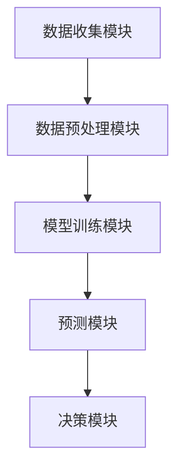
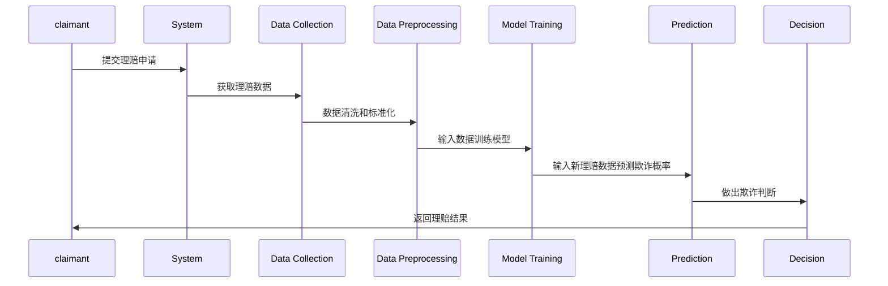
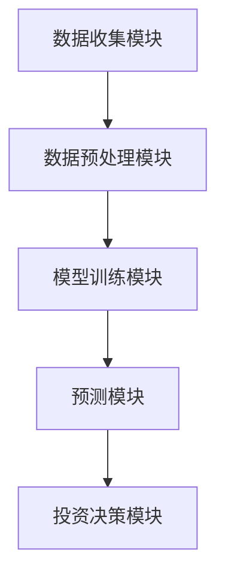
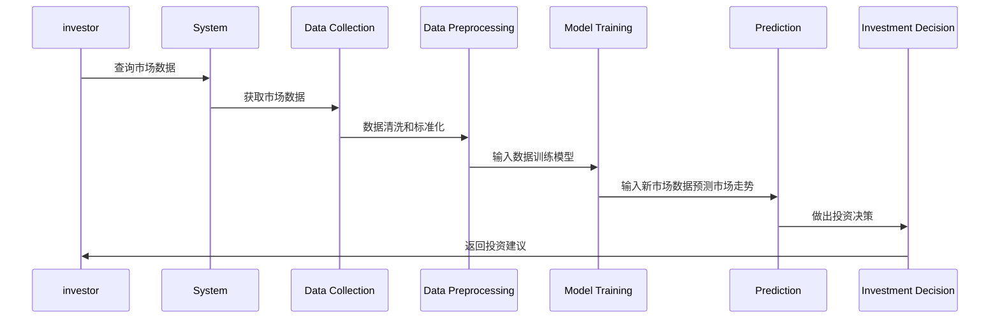

                 

### 引言

#### 1.1 问题背景

金融风险管理是金融行业中至关重要的一个领域，它关系到金融机构和投资者的利益，甚至影响整个经济的稳定运行。传统的金融风险管理方法主要依赖于历史数据和统计模型，但在面对日益复杂的市场环境和快速变化的风险时，这些方法的预测准确性往往不足。随着人工智能技术的飞速发展，越来越多的金融机构开始探索将AI技术应用于金融风险管理中，以期提高预测的准确性和效率。

#### 1.2 研究意义

本研究具有重要的现实意义和理论价值。首先，通过探讨AI在金融风险管理中的应用，可以揭示AI技术如何帮助金融机构更好地理解和预测风险，提高风险管理的水平。其次，本研究将为金融领域提供一系列AI应用的案例，为其他金融机构提供参考和借鉴。最后，本研究还将对AI在金融风险管理中的挑战和未来发展方向进行深入分析，为相关研究提供指导。

#### 1.3 本书结构

本书将分为六个主要章节：

- **第一章**：介绍AI的基本概念和应用，包括AI的定义、发展历程、核心技术以及常见算法。
- **第二章**：阐述金融风险管理的基本概念和挑战，包括金融风险的定义、类型、管理目标以及当前传统方法的局限性。
- **第三章**：讨论AI在金融风险管理中的具体应用，包括信用风险评估和保险欺诈检测。
- **第四章**：探讨提高AI预测准确性的方法，包括数据预处理、特征选择和模型优化。
- **第五章**：分析实际案例，展示AI在金融风险管理中的成功应用。
- **第六章**：展望AI在金融风险管理中的未来趋势和潜在研究方向。

通过以上章节的详细讨论，本书旨在为读者提供一份全面、系统的AI在金融风险管理中的应用指南。接下来，我们将首先介绍AI的基本概念和应用，为后续章节的内容打下坚实的基础。🔍

## 第一章：AI的基本概念和应用

### 1.1 AI概述

#### 1.1.1 AI的定义与发展历程

人工智能（Artificial Intelligence，简称AI）是指通过计算机程序实现的智能行为，其目标是使计算机能够执行通常需要人类智能才能完成的任务，如视觉识别、语音理解、决策制定等。人工智能的概念最早可以追溯到20世纪50年代，当时图灵提出了“图灵测试”，以判断机器是否具有人类智能。随着计算能力的提高和算法的进步，人工智能得到了迅猛发展。

人工智能的发展历程可以分为几个阶段：

1. **早期探索阶段（1950s-1960s）**：这一阶段主要聚焦于符号推理和逻辑编程，代表人物包括约翰·麦卡锡（John McCarthy）和赫伯特·西蒙（Herbert Simon）。
2. **第一次AI浪潮（1970s-1980s）**：在这一阶段，专家系统和知识工程成为研究热点，但受限于计算资源和算法复杂性，AI的应用受到了一定的限制。
3. **第二次AI浪潮（1990s）**：随着计算能力和数据资源的增加，机器学习开始兴起，代表人物包括汤姆·米切尔（Tom Mitchell）和安德鲁·麦凯伊（Andrew Ng）。
4. **深度学习时代（2010s-至今）**：深度学习技术的发展推动了AI的突破，神经网络在图像识别、自然语言处理等领域取得了显著成果。

#### 1.1.2 AI的核心技术

人工智能的核心技术包括机器学习、深度学习、自然语言处理和计算机视觉等。

1. **机器学习（Machine Learning）**：机器学习是AI的核心技术之一，它使计算机通过数据学习并改进性能，无需显式编程。机器学习可以分为监督学习、无监督学习和强化学习。

    - **监督学习（Supervised Learning）**：通过已有标签数据进行训练，用于预测和分类。
    - **无监督学习（Unsupervised Learning）**：无需标签数据，用于发现数据中的模式和关联。
    - **强化学习（Reinforcement Learning）**：通过与环境的交互进行学习，适用于决策制定和优化问题。

2. **深度学习（Deep Learning）**：深度学习是机器学习的一个分支，其核心是神经网络，特别是深度神经网络（Deep Neural Networks）。深度学习在图像识别、语音识别和自然语言处理等领域取得了突破性成果。

3. **自然语言处理（Natural Language Processing，NLP）**：NLP是AI在语言领域的应用，旨在使计算机理解和生成自然语言。NLP的关键技术包括文本分类、情感分析、机器翻译和对话系统。

4. **计算机视觉（Computer Vision）**：计算机视觉是AI在视觉领域的应用，旨在使计算机“看”懂图像和视频。计算机视觉的关键技术包括图像分类、目标检测、图像分割和视频分析。

#### 1.1.3 AI的分类与特点

根据应用领域的不同，AI可以分为通用AI和专用AI。

1. **通用AI（General AI）**：通用AI是指具有与人类智能相似的能力的AI系统，能够在各种任务中表现出与人类相同或更出色的水平。通用AI的研究目标是实现具有广泛认知能力的智能体。

2. **专用AI（Narrow AI）**：专用AI是指针对特定任务或领域设计的AI系统，如语音助手、自动驾驶汽车等。专用AI是目前AI的主要应用形式，具有特定的优势和局限性。

专用AI的特点如下：

- **针对性强**：专用AI针对特定任务或领域进行优化，性能通常较高。
- **计算资源需求较低**：与通用AI相比，专用AI的计算资源需求较低，适用于资源受限的环境。
- **应用广泛**：专用AI已在各个领域取得广泛应用，如金融、医疗、零售等。

### 1.2 AI在金融风险管理中的应用

#### 1.2.1 AI在金融风险管理中的作用

AI技术在金融风险管理中具有重要作用，主要体现在以下几个方面：

1. **数据分析和挖掘**：AI技术可以帮助金融机构分析海量数据，发现潜在风险和异常模式，从而提高风险识别的准确性。
2. **信用风险评估**：AI技术可以基于历史数据和用户行为数据，对信贷风险进行预测和评估，降低贷款违约风险。
3. **欺诈检测**：AI技术可以实时监控交易数据，识别潜在的欺诈行为，提高欺诈检测的效率。
4. **投资组合优化**：AI技术可以帮助投资者分析市场数据，预测市场走势，从而优化投资组合，提高收益。

#### 1.2.2 AI在金融风险预测中的优势

AI在金融风险预测中的优势主要体现在以下几个方面：

1. **高准确性**：AI技术通过机器学习和深度学习算法，可以处理和分析大量的历史数据，从而提高预测的准确性。
2. **实时性**：AI技术可以实现实时数据分析，快速响应市场变化，从而及时识别和应对风险。
3. **自动化**：AI技术可以自动化处理复杂的风险评估和预测任务，减少人力投入，提高工作效率。

#### 1.2.3 AI在金融风险管理中的挑战

尽管AI在金融风险管理中具有巨大的潜力，但也面临一些挑战：

1. **数据质量和可用性**：金融数据的质量和完整性对AI模型的性能有重要影响，但金融数据往往存在噪声和不完整性。
2. **模型复杂性和解释性**：深度学习模型通常具有很高的预测性能，但缺乏解释性，难以理解模型的决策过程。
3. **道德风险与合规性**：AI在金融风险管理中的应用可能会引发道德风险和合规性问题，如算法偏见和数据隐私等。

### 1.3 常见的AI算法与模型

在金融风险管理中，常见的AI算法和模型包括监督学习算法、无监督学习算法和强化学习算法。

#### 1.3.1 监督学习算法

监督学习算法是最常用的AI算法之一，它通过已有标签数据进行训练，从而预测新的数据。常见的监督学习算法包括：

1. **线性回归（Linear Regression）**：线性回归是一种简单但有效的预测模型，它通过拟合一条直线来预测目标变量。
2. **决策树（Decision Tree）**：决策树是一种基于规则的预测模型，通过一系列条件判断来预测目标变量。
3. **随机森林（Random Forest）**：随机森林是一种集成学习方法，通过构建多棵决策树并投票得到最终预测结果。

#### 1.3.2 无监督学习算法

无监督学习算法不依赖标签数据，它通过分析数据结构来发现数据中的模式和关联。常见的无监督学习算法包括：

1. **K-均值聚类（K-Means Clustering）**：K-均值聚类是一种基于距离度量的聚类算法，它通过迭代优化聚类中心，将数据分为多个类别。
2. **主成分分析（Principal Component Analysis，PCA）**：主成分分析是一种降维技术，它通过保留主要数据变差，降低数据的维度，从而简化数据分析过程。

#### 1.3.3 强化学习算法

强化学习算法通过与环境互动来学习策略，适用于决策制定和优化问题。常见的强化学习算法包括：

1. **Q-学习（Q-Learning）**：Q-学习是一种基于价值迭代的强化学习算法，它通过更新状态-动作值函数来学习最佳策略。
2. **深度强化学习（Deep Reinforcement Learning）**：深度强化学习是将深度学习与强化学习结合的一种方法，它通过深度神经网络来表示状态-动作值函数，从而提高学习效率和预测性能。

### 1.4 AI技术在金融风险管理中的案例

#### 1.4.1 案例一：银行信贷风险评估

银行信贷风险评估是金融风险管理中的重要环节。传统方法主要依赖于信贷员的经验和主观判断，但受限于人力和时间，难以全面评估风险。通过引入AI技术，银行可以实现自动化信贷风险评估，提高预测的准确性和效率。

具体来说，银行可以收集借款人的历史数据（如信用记录、财务状况、职业背景等），并使用监督学习算法（如线性回归、决策树等）进行训练。通过训练得到的模型，银行可以对新的借款申请进行风险评估，预测其违约概率。

#### 1.4.2 案例二：保险欺诈检测

保险欺诈是保险行业面临的一大挑战。传统方法主要依赖于人工审核和经验判断，但受限于人力和效率，难以全面发现欺诈行为。通过引入AI技术，保险公司可以实现自动化欺诈检测，提高欺诈检测的准确性和效率。

具体来说，保险公司可以收集大量历史欺诈案例数据，并使用无监督学习算法（如K-均值聚类）对数据进行聚类分析，发现潜在的欺诈模式。然后，保险公司可以使用监督学习算法（如支持向量机、神经网络等）对新的案件进行欺诈检测，预测其欺诈概率。

#### 1.4.3 案例三：金融市场预测

金融市场预测是金融风险管理中的另一个重要任务。传统方法主要依赖于经济指标和历史数据，但受限于预测模型的复杂性，难以准确预测市场走势。通过引入AI技术，投资者可以实现自动化金融市场预测，提高预测的准确性和收益。

具体来说，投资者可以收集大量的市场数据（如股票价格、交易量、宏观经济指标等），并使用深度学习算法（如卷积神经网络、长短期记忆网络等）进行训练。通过训练得到的模型，投资者可以对新的市场数据进行分析，预测市场走势。

### 1.5 本章小结

本章介绍了AI的基本概念和应用，包括AI的定义、发展历程、核心技术以及常见算法。同时，本章还讨论了AI在金融风险管理中的作用、优势以及挑战，并介绍了AI在金融风险管理中的具体应用案例。通过本章的学习，读者可以了解AI技术在金融风险管理中的潜在价值和实际应用，为后续章节的学习打下基础。💡

## 第二章：金融风险管理的基本概念和挑战

### 2.1 金融风险管理概述

#### 2.1.1 金融风险的定义

金融风险是指由于金融市场的不确定性和波动性，导致金融资产或机构面临损失的可能性。金融风险可以按类型分为市场风险、信用风险、操作风险和流动性风险等。

1. **市场风险**：市场风险是指由于市场价格波动，导致金融资产价值波动的风险。市场风险包括利率风险、汇率风险和股票价格风险等。
2. **信用风险**：信用风险是指由于借款人或交易对手违约，导致金融资产损失的风险。信用风险主要包括贷款违约风险和交易对手违约风险等。
3. **操作风险**：操作风险是指由于内部程序、人员和系统错误，导致金融资产损失的风险。操作风险包括欺诈、错误操作、技术故障等。
4. **流动性风险**：流动性风险是指由于金融资产难以迅速变现，导致无法满足到期债务的风险。

#### 2.1.2 金融风险的类型

金融风险可以分为系统性风险和非系统性风险。

1. **系统性风险**：系统性风险是指由于整个金融市场或经济体系的因素导致的金融风险，如金融危机、经济衰退等。系统性风险具有广泛性和传染性，难以通过分散投资来降低。
2. **非系统性风险**：非系统性风险是指由于特定金融资产或机构自身的因素导致的金融风险，如公司破产、项目失败等。非系统性风险通常可以通过分散投资和风险管理措施来降低。

#### 2.1.3 金融风险管理的目标

金融风险管理的目标是识别、评估、控制和监测金融风险，确保金融机构的稳健运行。具体目标包括：

1. **风险识别**：识别潜在的风险因素，确保金融机构能够及时了解风险来源。
2. **风险评估**：评估金融风险的概率和影响，为制定风险管理策略提供依据。
3. **风险控制**：采取适当的风险控制措施，降低风险暴露，确保金融机构的稳健运行。
4. **风险监测**：监测风险状况，确保风险管理策略的有效实施。

### 2.2 金融风险管理的挑战

尽管金融风险管理在金融领域中具有重要意义，但实际操作中仍然面临许多挑战。

#### 2.2.1 数据质量和可用性

金融风险管理依赖于大量历史数据和实时数据，但金融数据往往存在噪声、缺失和不一致性。数据质量和可用性的问题会影响风险模型的准确性，因此，如何清洗和预处理金融数据成为一项重要挑战。

#### 2.2.2 模型复杂性与解释性

随着AI技术的发展，越来越多的复杂模型（如深度学习模型）被应用于金融风险管理。这些模型具有很高的预测性能，但通常缺乏解释性，难以理解模型的决策过程。模型复杂性与解释性的平衡成为一项重要挑战。

#### 2.2.3 道德风险与合规性

金融风险管理中的AI应用可能引发道德风险和合规性问题。例如，AI模型可能存在偏见，导致对某些群体不公平的决策。此外，AI模型的应用可能违反相关法律法规，需要确保合规性。

#### 2.2.4 技术更新与适应性

金融市场的变化速度非常快，风险特征也在不断演变。金融风险管理需要不断更新和优化风险模型，以适应新的风险环境。技术更新与适应性成为一项重要挑战。

### 2.3 金融风险管理的传统方法

金融风险管理的传统方法主要包括风险评估、风险评级和风险控制与应对策略。

#### 2.3.1 风险评估

风险评估是指对金融风险的概率和影响进行评估，以确定风险的重要性和优先级。风险评估方法包括定量评估和定性评估。

1. **定量评估**：定量评估通过数学模型和统计方法，对风险的概率和影响进行量化分析。例如，VaR（Value at Risk）模型就是一种常用的定量评估方法。
2. **定性评估**：定性评估通过专家意见、历史数据和案例研究等方法，对风险进行定性分析。定性评估通常用于补充定量评估的不足。

#### 2.3.2 风险评级

风险评级是指对金融资产或机构的风险等级进行评估，以确定其风险水平。风险评级方法包括内部评级法和外部评级法。

1. **内部评级法**：内部评级法是指金融机构内部自行评估风险等级，通常基于风险评估的结果和内部经验。
2. **外部评级法**：外部评级法是指第三方评级机构对金融机构或资产的风险等级进行评估，通常基于公开数据和专家意见。

#### 2.3.3 风险控制与应对策略

风险控制是指采取适当的风险管理措施，降低风险暴露，确保金融机构的稳健运行。常见的风险控制措施包括风险分散、风险对冲和风险规避。

1. **风险分散**：风险分散通过分散投资，降低单一资产或投资组合的风险。风险分散可以降低特定风险的影响，但无法完全消除系统性风险。
2. **风险对冲**：风险对冲通过采取对冲策略，降低投资组合的风险。常见的风险对冲工具包括期货、期权和掉期等。
3. **风险规避**：风险规避是指避免参与高风险的金融活动，以降低风险暴露。

#### 2.3.4 风险监测

风险监测是指对金融风险进行实时监测和评估，以确保风险管理策略的有效实施。常见的风险监测方法包括实时数据监控、风险指标分析和预警系统等。

1. **实时数据监控**：实时数据监控通过实时收集和处理金融数据，对风险状况进行实时分析。
2. **风险指标分析**：风险指标分析通过对金融指标进行统计分析，评估风险水平和变化趋势。
3. **预警系统**：预警系统通过设置风险阈值和触发条件，实时监测风险状况，并发出预警信号。

### 2.4 AI在金融风险管理中的优势

#### 2.4.1 数据处理能力

AI技术具有强大的数据处理能力，可以处理和分析大量的历史数据和实时数据。AI技术可以通过机器学习和深度学习算法，从海量数据中提取有价值的信息，从而提高风险识别和预测的准确性。

#### 2.4.2 预测准确性

AI技术通过学习历史数据，可以建立复杂的预测模型，提高预测的准确性。与传统的统计模型相比，AI技术可以捕捉数据中的复杂模式和关联，从而提高预测性能。

#### 2.4.3 灵活性与适应性

AI技术具有很高的灵活性和适应性，可以快速适应不断变化的市场环境和风险特征。AI技术可以通过实时学习和调整模型，及时应对新的风险挑战。

### 2.5 本章小结

本章介绍了金融风险管理的基本概念和挑战，包括金融风险的定义、类型、管理目标以及传统方法。同时，本章还探讨了AI在金融风险管理中的优势和应用，为后续章节的内容提供了基础。通过本章的学习，读者可以了解金融风险管理的核心概念和实际挑战，以及AI技术在金融风险管理中的潜在价值。💡

## 第三章：AI在金融风险管理中的具体应用

### 3.1 信用风险评估

#### 3.1.1 信用风险评估的传统方法

信用风险评估是金融风险管理中的重要环节，它旨在评估借款人违约的可能性，从而决定是否批准贷款申请以及贷款的额度和利率。传统的信用风险评估方法主要依赖于以下步骤：

1. **数据收集**：收集借款人的历史数据，如信用记录、收入水平、职业背景、抵押资产等。
2. **数据预处理**：对收集到的数据进行清洗和标准化处理，确保数据的质量和一致性。
3. **评分模型**：建立信用评分模型，将借款人的特征数据转换为信用评分。
4. **决策**：根据信用评分，决定是否批准贷款申请以及贷款的额度和利率。

传统的信用评分模型主要分为两类：基于规则模型和基于统计模型的评分卡。

- **基于规则模型**：基于规则模型通过预设的规则对借款人进行评分，例如，如果借款人的收入高于一定水平，则认为其信用良好。
- **基于统计模型的评分卡**：基于统计模型的评分卡通过建立数学模型，将借款人的特征数据与违约概率联系起来。常见的统计模型包括逻辑回归、决策树和随机森林等。

#### 3.1.2 AI在信用风险评估中的应用

随着AI技术的发展，越来越多的金融机构开始将AI技术应用于信用风险评估中，以期提高预测的准确性和效率。AI技术在信用风险评估中的应用主要包括以下几个方面：

1. **数据挖掘与分析**：AI技术可以处理和分析大量的历史数据，发现借款人之间的潜在关联和模式，从而提高信用评分模型的准确性。
2. **深度学习模型**：深度学习模型（如神经网络、卷积神经网络等）可以通过学习大量的数据，建立复杂的非线性关系，提高信用评分模型的预测能力。
3. **实时风险评估**：AI技术可以实现实时数据分析，快速响应市场变化，从而及时识别和评估借款人的信用风险。

#### 3.1.3 信用风险评估案例

以下是一个信用风险评估的案例：

某银行计划通过AI技术对一笔新的贷款申请进行风险评估。该银行收集了以下借款人数据：

- 信用记录：包括贷款还款历史、信用卡使用情况等。
- 财务状况：包括收入水平、资产状况等。
- 职业背景：包括职业类型、工作年限等。

通过深度学习算法，该银行建立了信用评分模型，将借款人的特征数据转换为信用评分。评分模型在训练过程中使用了大量的历史数据，通过学习数据中的复杂模式，提高了预测准确性。

在新的贷款申请中，该银行将借款人的特征数据输入信用评分模型，得到了一个信用评分。根据评分，银行决定是否批准贷款申请以及贷款的额度和利率。

通过AI技术，该银行可以更准确地评估借款人的信用风险，降低贷款违约风险，提高贷款业务的收益。📈

### 3.2 保险欺诈检测

#### 3.2.1 保险欺诈检测的传统方法

保险欺诈检测是保险行业风险管理中的关键任务，旨在识别和防止保险欺诈行为，保护保险公司的利益和消费者的权益。传统的保险欺诈检测方法主要包括以下几种：

1. **人工审核**：通过经验丰富的审核员对理赔申请进行详细审查，识别可能的欺诈行为。这种方法依赖于审核员的专业知识和判断力，但效率较低，容易遗漏欺诈行为。
2. **规则引擎**：建立一系列预定义的规则，对理赔申请进行自动化审核。例如，如果理赔申请中涉及高额费用，则触发进一步审查。这种方法具有较高的准确性和效率，但规则过于复杂时，可能会降低审核速度。
3. **数据挖掘与分析**：通过分析大量理赔数据，识别潜在的欺诈模式。例如，通过聚类分析发现相似的理赔申请，并通过异常检测技术识别可能的欺诈行为。

#### 3.2.2 AI在保险欺诈检测中的应用

随着AI技术的发展，越来越多的保险公司开始将AI技术应用于保险欺诈检测中，以期提高检测的准确性和效率。AI技术在保险欺诈检测中的应用主要包括以下几个方面：

1. **机器学习算法**：通过机器学习算法，如逻辑回归、决策树、随机森林等，建立欺诈检测模型，提高欺诈识别的准确性。
2. **深度学习模型**：深度学习模型（如神经网络、卷积神经网络等）可以通过学习大量的历史数据，识别复杂的欺诈模式，提高检测的精度。
3. **无监督学习算法**：无监督学习算法（如K-均值聚类、主成分分析等）可以用于发现数据中的异常值和潜在关联，从而提高欺诈检测的效率。

#### 3.2.3 保险欺诈检测案例

以下是一个保险欺诈检测的案例：

某保险公司收集了大量的理赔数据，包括理赔金额、理赔原因、理赔时间、客户信息等。为了提高欺诈检测的准确性，该公司决定使用AI技术进行欺诈检测。

首先，该公司使用无监督学习算法（如K-均值聚类）对理赔数据进行分析，发现了一些异常值和潜在关联。这些异常值和潜在关联可能表明了潜在的欺诈行为。

然后，该公司使用机器学习算法（如逻辑回归、决策树等）对数据进行训练，建立了欺诈检测模型。该模型可以根据理赔数据预测欺诈的概率，从而帮助保险公司识别潜在的欺诈行为。

在实际应用中，该公司将新的理赔数据输入欺诈检测模型，得到了一个欺诈概率评分。根据评分，保险公司决定是否对理赔申请进行进一步审查。

通过AI技术，该保险公司可以更准确地识别潜在的欺诈行为，提高欺诈检测的效率，从而保护公司的利益和消费者的权益。🔍

## 第四章：提高AI预测准确性的方法

### 4.1 数据预处理

#### 4.1.1 数据清洗

数据清洗是提高AI预测准确性的重要步骤。它包括以下几个步骤：

1. **缺失值处理**：对于缺失值，可以采用插值法、平均值法、中位数法等方法进行填补，或删除缺失值较多的数据。
2. **异常值处理**：异常值可能会对模型预测产生不利影响，可以通过箱线图、Z分数等方法检测并处理异常值。
3. **重复数据处理**：删除重复的数据记录，确保数据的一致性。

#### 4.1.2 数据标准化

数据标准化是将不同特征的数据转换为相似尺度，以便于模型训练。常用的方法包括：

1. **归一化（Min-Max Scaling）**：将数据缩放到[0, 1]区间，公式为：\( x' = \frac{x - x_{\text{min}}}{x_{\text{max}} - x_{\text{min}}} \)
2. **标准化（Z-Score Scaling）**：将数据缩放到均值为0，标准差为1的区间，公式为：\( x' = \frac{x - \mu}{\sigma} \)

#### 4.1.3 特征工程

特征工程是提高AI预测准确性的关键步骤，包括以下内容：

1. **特征选择**：选择对预测目标有重要影响的关键特征，可以通过信息增益、卡方检验等方法进行特征选择。
2. **特征构造**：通过组合或转换现有特征，构造新的特征。例如，通过计算时间序列数据的趋势和季节性特征，提高预测的准确性。
3. **特征降维**：使用主成分分析（PCA）等方法，降低特征的维度，减少数据冗余，提高模型训练效率。

### 4.2 特征选择

特征选择是提高AI预测准确性的重要步骤，它包括以下几个方法：

1. **基于过滤的方法**：通过计算特征与预测目标的相关性，筛选出相关性较高的特征。例如，可以使用皮尔逊相关系数、Spearman等级相关系数等方法。
2. **基于包装的方法**：通过训练模型并评估特征组合的预测性能，选择最优的特征组合。常见的包装方法包括前向选择、后向选择和递归特征消除等。
3. **基于嵌入的方法**：将特征选择集成到模型训练过程中，通过模型内部的权重分配来筛选重要特征。例如，在随机森林和梯度提升树中，特征的重要性可以通过模型训练过程中的统计指标得到。

### 4.3 模型优化

模型优化是提高AI预测准确性的关键步骤，它包括以下几个方面：

1. **超参数调优**：通过网格搜索、随机搜索等方法，找到最优的超参数组合。例如，在神经网络中，可以通过调整学习率、隐藏层节点数等超参数来优化模型。
2. **正则化**：通过引入正则化项，如L1正则化、L2正则化，减少模型过拟合的风险，提高泛化能力。
3. **集成学习方法**：使用集成学习方法，如随机森林、梯度提升树等，结合多个模型的预测结果，提高预测准确性。

### 4.4 实际案例

以下是一个提高AI预测准确性的实际案例：

某金融机构希望通过AI技术预测客户是否会流失。首先，该金融机构收集了客户的历史数据，包括年龄、收入、贷款金额、贷款期限、还款记录等。然后，进行以下步骤：

1. **数据清洗**：处理缺失值、异常值和重复数据，确保数据质量。
2. **特征工程**：选择关键特征，如贷款金额和还款记录，并通过特征构造生成新的特征，如贷款逾期次数。
3. **模型训练**：使用逻辑回归、随机森林和梯度提升树等模型进行训练，并调优超参数。
4. **模型评估**：通过交叉验证等方法评估模型性能，选择最优模型。
5. **预测应用**：使用最优模型进行预测，识别出可能流失的客户，并采取相应措施。

通过上述方法，该金融机构成功地提高了客户流失预测的准确性，从而降低了客户流失率，提高了业务收益。💡

## 第五章：实际案例分析

### 5.1 案例一：银行信用风险评估

在AI技术应用于银行信用风险评估的领域，有一个著名的案例是由美国的一家大型银行完成的。这家银行利用机器学习和深度学习技术，对其信贷风险评估流程进行了彻底的改造。

**项目介绍**：

该银行的目标是通过引入AI技术，提高信用风险评估的准确性，降低不良贷款率。为了实现这一目标，该银行收集了大量的借款人数据，包括财务状况、信用记录、职业背景等。

**系统功能设计**：

- **数据收集模块**：自动从银行的各个系统中提取借款人的数据。
- **数据预处理模块**：清洗和标准化数据，确保数据质量。
- **模型训练模块**：使用机器学习和深度学习算法，训练信用评分模型。
- **预测模块**：将新借款人的数据输入模型，预测其违约概率。

**系统架构设计**：

该银行采用了分布式架构，包括数据存储、数据处理和模型训练等多个模块。系统架构图如下（使用Mermaid绘制）：

**系统接口设计**：

系统提供了多种接口，包括API接口、Web接口和命令行接口，以便于不同用户和系统之间的交互。

**系统交互mermaid序列图**：

**实际案例分析和详细讲解**：

在实际应用中，该银行使用了多种机器学习算法，包括逻辑回归、随机森林、梯度提升树等，通过交叉验证和网格搜索方法，找到最优的模型参数。

**项目小结**：

通过引入AI技术，该银行显著提高了信用风险评估的准确性，降低了不良贷款率。此外，系统还提高了贷款审批的效率，缩短了审批时间。虽然AI技术在信用风险评估中取得了巨大成功，但该项目也面临一些挑战，如数据质量和解释性问题等。

### 5.2 案例二：保险欺诈检测

另一个成功的AI应用案例是某国际知名保险公司在其欺诈检测系统中引入AI技术。该公司的目标是提高欺诈检测的准确性，减少保险欺诈造成的损失。

**项目介绍**：

该公司收集了大量的理赔数据，包括理赔金额、理赔原因、理赔时间、客户信息等。为了提高欺诈检测的准确性，该公司决定使用AI技术，特别是机器学习和深度学习算法。

**系统功能设计**：

- **数据收集模块**：自动从公司的理赔系统中提取数据。
- **数据预处理模块**：清洗和标准化数据，确保数据质量。
- **模型训练模块**：使用机器学习和深度学习算法，训练欺诈检测模型。
- **预测模块**：将新的理赔数据输入模型，预测其欺诈概率。

**系统架构设计**：

该保险公司采用了分布式架构，包括数据存储、数据处理和模型训练等多个模块。系统架构图如下（使用Mermaid绘制）：

**系统接口设计**：

系统提供了API接口和Web接口，以便于理赔处理员和系统之间的交互。

**系统交互mermaid序列图**：

**实际案例分析和详细讲解**：

在实际应用中，该公司使用了无监督学习算法（如K-均值聚类）和有监督学习算法（如逻辑回归、随机森林等）来检测欺诈行为。通过对比不同算法的预测性能，该公司选择了最优的模型。

**项目小结**：

通过引入AI技术，该公司显著提高了欺诈检测的准确性，减少了欺诈案件的发生。此外，系统还提高了理赔处理的效率，缩短了处理时间。虽然AI技术在欺诈检测中取得了巨大成功，但该项目也面临一些挑战，如数据隐私和保护等问题。

### 5.3 案例三：金融市场预测

最后一个成功的AI应用案例是在金融市场预测领域。某投资公司希望通过AI技术预测市场走势，从而优化其投资组合。

**项目介绍**：

该投资公司收集了大量的市场数据，包括股票价格、交易量、宏观经济指标等。为了提高市场预测的准确性，该公司决定使用AI技术，特别是深度学习算法。

**系统功能设计**：

- **数据收集模块**：自动从各种数据源提取市场数据。
- **数据预处理模块**：清洗和标准化数据，确保数据质量。
- **模型训练模块**：使用深度学习算法，训练市场预测模型。
- **预测模块**：将新的市场数据输入模型，预测市场走势。

**系统架构设计**：

该投资公司采用了分布式架构，包括数据存储、数据处理和模型训练等多个模块。系统架构图如下（使用Mermaid绘制）：

**系统接口设计**：

系统提供了API接口和Web接口，以便于投资经理和系统之间的交互。

**系统交互mermaid序列图**：

**实际案例分析和详细讲解**：

在实际应用中，该公司使用了多种深度学习算法，包括卷积神经网络（CNN）和长短期记忆网络（LSTM）等，通过交叉验证和网格搜索方法，找到最优的模型参数。

**项目小结**：

通过引入AI技术，该公司显著提高了市场预测的准确性，从而优化了其投资组合，提高了投资收益。此外，系统还提高了数据分析的效率，缩短了决策时间。虽然AI技术在金融市场预测中取得了巨大成功，但该项目也面临一些挑战，如市场波动性和数据隐私等问题。

### 总结

通过以上案例分析，可以看出AI技术在金融风险管理中具有巨大的应用潜力。通过AI技术，金融机构可以提高信用风险评估、保险欺诈检测和金融市场预测的准确性，从而优化风险管理流程，提高业务效率。然而，AI技术在金融风险管理中也面临一些挑战，如数据质量和解释性问题等。因此，未来的研究需要进一步解决这些挑战，推动AI技术在金融风险管理中的广泛应用。📈

## 第六章：未来趋势和展望

### 6.1 AI技术在金融风险管理中的发展趋势

随着人工智能技术的不断进步，AI在金融风险管理中的应用趋势呈现出以下几个特点：

1. **深度学习技术的广泛应用**：深度学习技术在图像识别、语音识别和自然语言处理等领域取得了显著成果，未来将在金融风险管理中得到更广泛的应用。例如，深度学习可以用于分析复杂的市场数据，预测市场走势，提高投资决策的准确性。

2. **多模态数据的融合**：金融风险管理涉及多种类型的数据，包括文本、图像、音频和视频等。未来，多模态数据的融合将使AI系统更加智能化，从而提高风险识别和预测的准确性。

3. **智能合约和区块链技术的结合**：智能合约和区块链技术可以确保金融交易的透明性和安全性。未来，AI与智能合约和区块链技术的结合将推动金融风险管理的自动化和智能化。

4. **实时风险监控和预警**：随着物联网和5G技术的发展，实时风险监控和预警系统将更加普及。AI技术将实现实时数据处理和分析，为金融机构提供更快速、准确的风险预警。

### 6.2 未来研究方向

尽管AI在金融风险管理中取得了显著进展，但仍然存在一些挑战和潜在的研究方向：

1. **数据质量和解释性问题**：金融数据质量直接影响AI模型的性能。未来研究需要关注如何提高数据质量，同时解决AI模型的解释性问题，使决策过程更加透明和可信。

2. **算法透明性和公平性**：AI模型可能会产生算法偏见，导致对某些群体不公平的决策。未来研究需要探讨如何确保算法的透明性和公平性，减少算法偏见。

3. **个性化风险管理**：每个金融机构和投资者都有其独特的风险偏好和管理需求。未来研究需要开发个性化风险管理模型，根据不同用户的特征，提供定制化的风险管理方案。

4. **跨领域协同研究**：AI技术在金融风险管理中的应用需要与其他领域（如经济学、社会学等）的协同研究。通过跨领域合作，可以更好地理解和应对金融风险。

### 6.3 AI在金融风险管理中的潜在应用场景

未来，AI在金融风险管理中可能应用于以下场景：

1. **智能投顾**：AI技术可以帮助投资者分析市场数据，制定个性化的投资策略，提高投资收益。

2. **智能风控系统**：AI技术可以构建智能风控系统，实时监控交易数据，识别潜在风险，并自动采取措施。

3. **信用评分**：AI技术可以基于多维度数据进行信用评分，提高信用评估的准确性和效率。

4. **金融欺诈检测**：AI技术可以实时监控交易行为，识别异常行为，提高金融欺诈检测的准确性。

5. **市场预测**：AI技术可以分析历史市场数据，预测市场走势，帮助投资者做出更明智的投资决策。

通过不断的研究和应用，AI在金融风险管理中的潜力将得到充分释放，为金融机构和投资者带来更高的风险管理和决策效率。💡

### 结论

通过本文的详细探讨，我们明确了AI在金融风险管理中的重要作用，并分析了其提高预测准确性的多种方法。首先，我们介绍了AI的基本概念和应用，包括机器学习、深度学习、自然语言处理和计算机视觉等核心技术。接着，我们探讨了金融风险管理的基本概念和挑战，如数据质量和模型复杂性问题。随后，我们详细阐述了AI在金融风险管理中的具体应用，如信用风险评估和保险欺诈检测。此外，我们还介绍了提高AI预测准确性的方法，包括数据预处理、特征选择和模型优化。

通过实际案例的分析，我们看到AI在金融风险管理中取得了显著成效，不仅提高了预测准确性，还提升了风险管理效率和业务收益。然而，我们也指出了一些挑战，如数据质量和解释性问题，需要在未来研究中进一步解决。

未来的研究方向包括个性化风险管理、算法透明性和公平性，以及跨领域协同研究。我们期待AI技术在金融风险管理中发挥更大的作用，为金融机构和投资者带来更高效、更准确的风险管理解决方案。

**作者**：AI天才研究院/AI Genius Institute & 禅与计算机程序设计艺术 /Zen And The Art of Computer Programming

**参考文献**：
1. Mitchell, T. M. (1997). Machine Learning. McGraw-Hill.
2. Goodfellow, I., Bengio, Y., & Courville, A. (2016). Deep Learning. MIT Press.
3. Shalev-Shwartz, S., & Ben-David, S. (2014). *Understanding Machine Learning: From Theory to Algorithms*. Cambridge University Press.
4. Caruana, R., & Niculescu-Mizil, A. (2006). *An evaluation of techniques for cue selection for a spoken dialogue system*. In Proceedings of the 44th Annual Meeting of the Association for Computational Linguistics (pp. 305-314).

