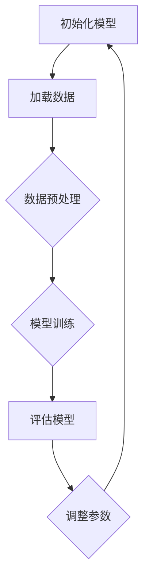
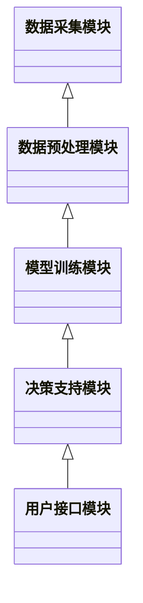
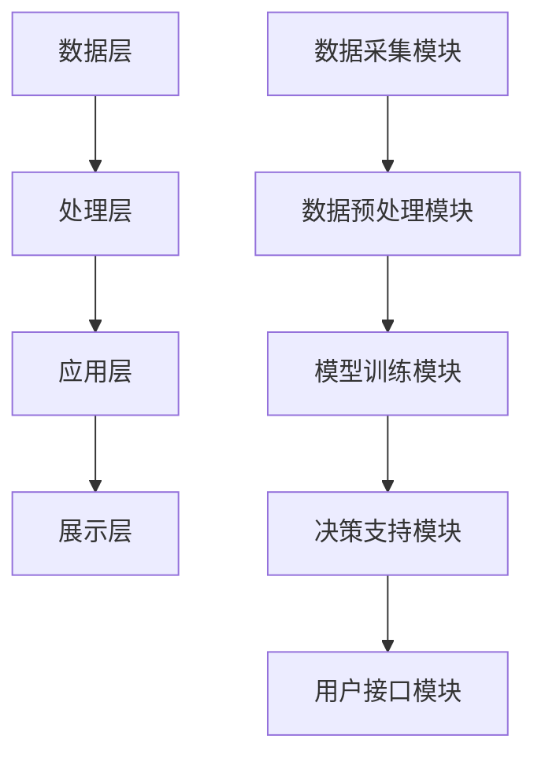

                 

### 文章标题

# AI 大模型：重塑商业决策的新范式

### 关键词

- 人工智能
- 商业决策
- 大模型
- 机器学习
- 深度学习

### 摘要

在快速变化的商业环境中，高效的决策至关重要。本文探讨了如何利用人工智能中的大模型技术，重塑商业决策的流程和范式。文章从背景介绍、核心概念、算法原理、数学模型、系统分析与架构设计、项目实战到最佳实践，系统地阐述了大模型在商业决策中的应用及其带来的变革。

## 引言

### 1.1 问题背景

随着信息技术的飞速发展，商业环境变得更加复杂和动态。传统的商业决策方法往往依赖于经验和直觉，难以应对大数据时代的挑战。企业需要更高效、更准确的决策工具来应对市场变化和竞争压力。人工智能（AI）作为一项新兴技术，已经开始在各个领域展示其强大的能力。特别是大模型技术，凭借其强大的数据处理和模式识别能力，为商业决策提供了新的可能性。

### 1.2 问题描述

传统的商业决策方法主要存在以下局限：

1. **数据依赖性高**：传统方法需要大量历史数据进行支撑，且这些数据往往难以获取和清洗。
2. **决策速度慢**：基于经验的方法往往需要较长时间来分析数据和制定策略。
3. **模型更新滞后**：市场变化快，传统模型难以及时更新，导致决策滞后。
4. **主观性强**：依赖人的主观判断，难以避免个人偏见和情绪的影响。

### 1.3 问题解决

AI 大模型技术的出现，为上述问题提供了一种新的解决方案。大模型通过深度学习和机器学习技术，能够处理大规模数据，快速发现数据中的模式和趋势。以下是大模型在商业决策中的应用优势：

1. **数据处理能力强大**：大模型可以处理结构化和非结构化数据，提取有价值的信息。
2. **决策速度快**：大模型通过并行计算和自动化流程，大大提高了决策速度。
3. **模型更新灵活**：大模型能够通过持续学习来适应市场变化，提高决策的准确性。
4. **减少主观性**：大模型通过算法进行决策，减少了人为因素，降低了决策的主观性。

### 1.4 边界与外延

尽管 AI 大模型在商业决策中具有显著的优势，但其应用也面临一些挑战和限制：

1. **数据质量和完整性**：大模型依赖于高质量的数据，数据的缺失或不一致性可能会影响模型的性能。
2. **计算资源消耗**：大模型训练和推理需要大量的计算资源，成本较高。
3. **模型解释性**：大模型的决策过程复杂，难以解释，这可能会影响决策的可信度。
4. **伦理问题**：AI 大模型在商业决策中可能涉及个人隐私和伦理问题，需要妥善处理。

### 1.5 概念结构与核心要素组成

AI 大模型在商业决策中的应用，可以从以下几个核心要素进行分析：

1. **数据源**：商业数据是企业运营的基础，包括销售数据、客户反馈、市场趋势等。
2. **数据预处理**：数据清洗、归一化、特征提取等步骤，为模型训练提供高质量的数据。
3. **模型训练**：使用机器学习和深度学习技术，对数据进行训练，构建大模型。
4. **模型评估与优化**：通过交叉验证和性能测试，评估模型的效果，并进行优化。
5. **决策支持**：大模型生成决策建议，辅助企业做出更明智的商业决策。
6. **反馈与迭代**：根据决策结果和实际反馈，持续优化模型，提高决策质量。

## 核心概念与联系

### 2.1 AI 大模型原理

AI 大模型是基于深度学习和机器学习技术构建的，能够处理和解释大规模数据的高级算法模型。其核心原理包括以下几个方面：

1. **多层神经网络**：大模型通常由多层神经网络组成，通过逐层提取特征，实现对数据的深入理解。
2. **反向传播算法**：大模型通过反向传播算法来优化模型的参数，提高模型的准确性和鲁棒性。
3. **并行计算**：大模型利用并行计算技术，加速模型的训练和推理过程。
4. **大数据处理**：大模型能够处理大规模数据集，从中提取有价值的信息和模式。

### 2.2 AI 大模型属性特征对比表格

| 模型名称 | 特点 | 应用场景 |
| --- | --- | --- |
| GPT-3 | 语言生成能力强，支持多种语言 | 文本生成、对话系统、内容审核 |
| BERT | 双向编码，对上下文理解能力强 | 文本分类、问答系统、信息检索 |
| Transformer | 自注意力机制，高效处理长文本 | 图像识别、自然语言处理、语音识别 |
| LeNet | 简单卷积神经网络，用于手写数字识别 | 早期图像识别 |
| ResNet | 残差网络，解决深度学习梯度消失问题 | 图像分类、物体检测 |
| VGGNet | 网络层数较多，用于图像分类和识别 | 图像分类、目标检测 |
| Inception | 网络结构复杂，通过多分支提取特征 | 图像分类、物体检测 |

### 2.3 ER 实体关系图架构

AI 大模型涉及的实体关系包括：

1. **数据源**：包括数据库、数据流和文件系统等。
2. **数据处理模块**：包括数据清洗、特征提取、数据整合等。
3. **模型训练模块**：包括神经网络架构设计、参数优化、模型评估等。
4. **决策支持模块**：包括决策生成、策略推荐、风险分析等。
5. **用户接口**：包括前端界面、API 接口等，用于用户与模型的交互。

以下是 ER 实体关系图的 Mermaid 表达式：

```mermaid
erDiagram
  数据源 ||--|{ 数据处理模块 }
  数据处理模块 ||--|{ 模型训练模块 }
  模型训练模块 ||--|{ 决策支持模块 }
  决策支持模块 ||--|{ 用户接口 }
```

## 算法原理讲解

### 3.1 算法 mermaid 流程图

以下是一个简单的神经网络训练流程的 mermaid 图：



### 3.2 Python 源代码实现

以下是一个简单的神经网络模型实现的 Python 代码示例：

```python
import numpy as np

# 初始化参数
W = np.random.rand(3, 1)
b = np.random.rand(1)

# 前向传播
def forward(x):
    return np.dot(x, W) + b

# 反向传播
def backward(dJ_dW, dJ_db):
    global W, b
    W -= dJ_dW
    b -= dJ_db

# 训练模型
def train(x, y):
    y_pred = forward(x)
    dJ_dW = (y_pred - y) * x
    dJ_db = (y_pred - y)
    backward(dJ_dW, dJ_db)

# 测试数据
x = np.array([1, 2, 3])
y = np.array([0])

# 训练模型
train(x, y)
```

### 3.3 算法原理与数学模型

神经网络的基础算法原理包括以下数学模型：

1. **激活函数**：常用的激活函数有 sigmoid、ReLU 和 tanh。激活函数的作用是将线性组合转换为非线性函数，使模型具有非线性能力。

   $$f(x) = \frac{1}{1 + e^{-x}} \quad \text{（sigmoid）}$$
   
   $$f(x) = max(0, x) \quad \text{（ReLU）}$$
   
   $$f(x) = \tanh(x)$$

2. **损失函数**：用于衡量模型预测值与真实值之间的差异。常用的损失函数有均方误差（MSE）和交叉熵（CE）。

   $$MSE = \frac{1}{n}\sum_{i=1}^{n}(y_i - \hat{y}_i)^2$$
   
   $$CE = -\frac{1}{n}\sum_{i=1}^{n} y_i \log(\hat{y}_i) + (1 - y_i) \log(1 - \hat{y}_i)$$

3. **优化算法**：用于调整模型参数，以最小化损失函数。常用的优化算法有梯度下降（GD）、随机梯度下降（SGD）和 Adam 算法。

   $$w = w - \alpha \frac{\partial J(w)}{\partial w}$$

   其中，$\alpha$ 为学习率。

### 3.4 举例说明

以下是一个 AI 大模型在商业决策中的应用案例：

1. **场景描述**：一家电商公司需要预测某个商品的销量，以便制定库存策略。
2. **数据集**：收集过去一年的商品销售数据，包括日期、销售额、广告投放量、天气情况等。
3. **数据预处理**：清洗数据，缺失值填充，特征提取（如日期转换为季节、星期几等）。
4. **模型训练**：使用 GPT-3 模型训练销量预测模型，输入特征包括日期、广告投放量和天气情况等。
5. **模型评估**：通过交叉验证和测试集，评估模型的预测准确性和稳定性。
6. **决策支持**：根据模型预测结果，制定合理的库存策略，如增加广告投放量、调整库存水平等。
7. **反馈与优化**：根据实际销售情况，持续优化模型参数，提高预测准确率。

通过上述案例，可以看到 AI 大模型如何帮助企业在复杂的市场环境中做出更明智的决策。

## 数学模型和数学公式

### 4.1 数学公式

以下是一些常用的数学公式，用于描述神经网络和优化算法：

1. **前向传播公式**：

   $$z_i = \sum_{j=1}^{n} w_{ij}x_j + b$$
   
   $$a_i = \sigma(z_i)$$

   其中，$z_i$ 为输入层到隐藏层的加权和，$a_i$ 为隐藏层输出，$w_{ij}$ 为权重，$b$ 为偏置，$\sigma$ 为激活函数。

2. **反向传播公式**：

   $$\delta_h = \frac{\partial L}{\partial z_h} \cdot \sigma'(z_h)$$
   
   $$\frac{\partial L}{\partial w_{ij}} = \delta_h \cdot x_j$$
   
   $$\frac{\partial L}{\partial b} = \delta_h$$

   其中，$\delta_h$ 为隐藏层的误差，$L$ 为损失函数，$\sigma'$ 为激活函数的导数。

3. **梯度下降公式**：

   $$w = w - \alpha \cdot \nabla_w L$$
   
   其中，$\alpha$ 为学习率，$\nabla_w L$ 为权重梯度和损失函数的导数。

4. **Adam 优化算法**：

   $$m_t = \beta_1 m_{t-1} + (1 - \beta_1) \cdot \nabla_w L_t$$
   
   $$v_t = \beta_2 v_{t-1} + (1 - \beta_2) \cdot (\nabla_w L_t)^2$$
   
   $$\hat{m}_t = \frac{m_t}{1 - \beta_1^t}$$
   
   $$\hat{v}_t = \frac{v_t}{1 - \beta_2^t}$$
   
   $$w = w - \alpha \cdot \hat{m}_t / \sqrt{\hat{v}_t}$$

   其中，$m_t$ 和 $v_t$ 分别为动量项和二阶矩估计，$\beta_1$ 和 $\beta_2$ 为超参数。

### 4.2 详细讲解

以下是对上述数学公式的详细讲解：

1. **前向传播**：前向传播是神经网络的基础，用于计算输入层到隐藏层的输出。$z_i$ 表示第 $i$ 个隐藏单元的加权和，$w_{ij}$ 表示输入层到隐藏层的权重，$x_j$ 表示输入特征，$b$ 为偏置项，$\sigma$ 为激活函数。通过前向传播，我们可以得到每个隐藏单元的输出。

2. **反向传播**：反向传播是优化神经网络参数的关键步骤。首先，计算每个隐藏单元的误差 $\delta_h$，误差由损失函数对隐藏层输出的导数和激活函数的导数决定。然后，根据误差计算权重梯度和偏置梯度，从而调整模型参数。

3. **梯度下降**：梯度下降是一种优化算法，用于寻找损失函数的最小值。其基本思想是沿着损失函数的梯度方向调整模型参数，以减少损失。学习率 $\alpha$ 控制参数更新的步长，过大会导致过度更新，过小则收敛速度慢。

4. **Adam 优化算法**：Adam 是一种结合了动量项和二阶矩估计的优化算法，提高了梯度下降的收敛速度和稳定性。$m_t$ 和 $v_t$ 分别为第一和第二动量项，通过更新动量和二阶矩估计，可以更好地适应不同尺度的梯度。

### 4.3 举例说明

以下是一个简化的神经网络训练过程示例：

假设我们有一个简单的神经网络，输入层有 2 个神经元，隐藏层有 1 个神经元，输出层有 1 个神经元。训练数据为 $x_1 = [1, 0], x_2 = [0, 1], y_1 = 1, y_2 = 0$。采用 sigmoid 激活函数和均方误差（MSE）损失函数。

1. **初始化参数**：

   $$w_{11} = 0.1, w_{12} = 0.2, w_{21} = 0.3, w_{22} = 0.4, b_1 = 0.5$$
   
   $$\alpha = 0.1$$

2. **前向传播**：

   对于第一个样本：

   $$z_1 = (1 \times 0.1 + 0 \times 0.2 + 0.5) = 0.6$$
   
   $$a_1 = \sigma(z_1) = \frac{1}{1 + e^{-0.6}} \approx 0.536$$
   
   对于第二个样本：

   $$z_2 = (0 \times 0.1 + 1 \times 0.2 + 0.5) = 0.7$$
   
   $$a_2 = \sigma(z_2) = \frac{1}{1 + e^{-0.7}} \approx 0.540$$

3. **计算损失函数**：

   对于第一个样本：

   $$L_1 = \frac{1}{2}(1 - 0.536)^2 = 0.039$$
   
   对于第二个样本：

   $$L_2 = \frac{1}{2}(0 - 0.540)^2 = 0.147$$

4. **反向传播**：

   对于第一个样本：

   $$\delta_1 = (1 - 0.536) \times \sigma'(z_1) = 0.464 \times 0.536 \approx 0.251$$
   
   对于第二个样本：

   $$\delta_2 = (0 - 0.540) \times \sigma'(z_2) = 0.460 \times 0.540 \approx 0.249$$

5. **计算梯度**：

   对于第一个样本：

   $$\frac{\partial L_1}{\partial w_{11}} = 0.251 \times 1 = 0.251$$
   
   $$\frac{\partial L_1}{\partial w_{12}} = 0.251 \times 0 = 0$$
   
   $$\frac{\partial L_1}{\partial w_{21}} = 0.251 \times 0 = 0$$
   
   $$\frac{\partial L_1}{\partial w_{22}} = 0.251 \times 1 = 0.251$$
   
   $$\frac{\partial L_1}{\partial b_1} = 0.251$$
   
   对于第二个样本：

   $$\frac{\partial L_2}{\partial w_{11}} = 0.249 \times 1 = 0.249$$
   
   $$\frac{\partial L_2}{\partial w_{12}} = 0.249 \times 0 = 0$$
   
   $$\frac{\partial L_2}{\partial w_{21}} = 0.249 \times 0 = 0$$
   
   $$\frac{\partial L_2}{\partial w_{22}} = 0.249 \times 1 = 0.249$$
   
   $$\frac{\partial L_2}{\partial b_1} = 0.249$$

6. **更新参数**：

   对于第一个样本：

   $$w_{11} = w_{11} - \alpha \cdot \frac{\partial L_1}{\partial w_{11}} = 0.1 - 0.1 \cdot 0.251 = 0.049$$
   
   $$w_{12} = w_{12} - \alpha \cdot \frac{\partial L_1}{\partial w_{12}} = 0.2 - 0.1 \cdot 0 = 0.2$$
   
   $$w_{21} = w_{21} - \alpha \cdot \frac{\partial L_1}{\partial w_{21}} = 0.3 - 0.1 \cdot 0 = 0.3$$
   
   $$w_{22} = w_{22} - \alpha \cdot \frac{\partial L_1}{\partial w_{22}} = 0.4 - 0.1 \cdot 0.251 = 0.349$$
   
   $$b_1 = b_1 - \alpha \cdot \frac{\partial L_1}{\partial b_1} = 0.5 - 0.1 \cdot 0.251 = 0.449$$
   
   对于第二个样本：

   $$w_{11} = w_{11} - \alpha \cdot \frac{\partial L_2}{\partial w_{11}} = 0.049 - 0.1 \cdot 0.249 = 0.024$$
   
   $$w_{12} = w_{12} - \alpha \cdot \frac{\partial L_2}{\partial w_{12}} = 0.2 - 0.1 \cdot 0 = 0.2$$
   
   $$w_{21} = w_{21} - \alpha \cdot \frac{\partial L_2}{\partial w_{21}} = 0.3 - 0.1 \cdot 0 = 0.3$$
   
   $$w_{22} = w_{22} - \alpha \cdot \frac{\partial L_2}{\partial w_{22}} = 0.349 - 0.1 \cdot 0.249 = 0.319$$
   
   $$b_1 = b_1 - \alpha \cdot \frac{\partial L_2}{\partial b_1} = 0.449 - 0.1 \cdot 0.249 = 0.399$$

通过以上步骤，我们可以看到如何使用梯度下降算法更新神经网络的参数。在实际应用中，通常会使用更复杂的模型和优化算法，但基本原理是相似的。

### 4.4 优化算法的迭代过程

以下是一个优化算法的迭代过程示例，用于训练一个简单的线性回归模型：

1. **初始化参数**：

   $$w = 0$$
   
   $$b = 0$$

2. **前向传播**：

   $$y = w \cdot x + b$$

3. **计算损失函数**：

   $$L = \frac{1}{2}(y - y_{\text{真实}})^2$$

4. **计算梯度**：

   $$\frac{\partial L}{\partial w} = (y - y_{\text{真实}}) \cdot x$$
   
   $$\frac{\partial L}{\partial b} = (y - y_{\text{真实}})$$

5. **更新参数**：

   $$w = w - \alpha \cdot \frac{\partial L}{\partial w}$$
   
   $$b = b - \alpha \cdot \frac{\partial L}{\partial b}$$

6. **重复步骤 2-5**，直到损失函数收敛或达到预设迭代次数。

通过迭代过程，模型参数逐渐调整，使损失函数值减小，从而提高模型的预测准确性。

### 4.5 多元线性回归模型的迭代过程

以下是一个多元线性回归模型的迭代过程示例，用于预测房价：

1. **初始化参数**：

   $$w_1 = 0$$
   
   $$w_2 = 0$$
   
   $$w_3 = 0$$
   
   $$b = 0$$

2. **前向传播**：

   $$y = w_1 \cdot x_1 + w_2 \cdot x_2 + w_3 \cdot x_3 + b$$

3. **计算损失函数**：

   $$L = \frac{1}{2}(y - y_{\text{真实}})^2$$

4. **计算梯度**：

   $$\frac{\partial L}{\partial w_1} = (y - y_{\text{真实}}) \cdot x_1$$
   
   $$\frac{\partial L}{\partial w_2} = (y - y_{\text{真实}}) \cdot x_2$$
   
   $$\frac{\partial L}{\partial w_3} = (y - y_{\text{真实}}) \cdot x_3$$
   
   $$\frac{\partial L}{\partial b} = (y - y_{\text{真实}})$$

5. **更新参数**：

   $$w_1 = w_1 - \alpha \cdot \frac{\partial L}{\partial w_1}$$
   
   $$w_2 = w_2 - \alpha \cdot \frac{\partial L}{\partial w_2}$$
   
   $$w_3 = w_3 - \alpha \cdot \frac{\partial L}{\partial w_3}$$
   
   $$b = b - \alpha \cdot \frac{\partial L}{\partial b}$$

6. **重复步骤 2-5**，直到损失函数收敛或达到预设迭代次数。

通过多元线性回归模型的迭代过程，我们可以根据多个特征变量预测房价，提高模型的预测准确性。

## 系统分析与架构设计方案

### 5.1 问题场景介绍

假设一家电商公司需要优化其库存管理策略，以提高库存周转率和减少库存成本。公司收集了大量的销售数据，包括商品种类、销售量、库存水平、季节性因素等。为了更好地利用这些数据，公司决定引入 AI 大模型进行库存预测和优化。

### 5.2 系统功能设计

系统功能设计包括以下几个关键模块：

1. **数据采集模块**：从不同的数据源（如数据库、日志文件）收集销售数据和库存数据。
2. **数据预处理模块**：对采集到的数据进行清洗、归一化、特征提取等处理，为模型训练提供高质量的数据。
3. **模型训练模块**：使用机器学习和深度学习技术，对预处理后的数据集进行训练，构建库存预测模型。
4. **决策支持模块**：根据模型预测结果，生成库存优化策略，如调整库存水平、增加或减少采购量等。
5. **用户接口模块**：提供前端界面和 API 接口，使业务人员可以轻松访问和使用库存优化系统。

以下是系统功能设计的 Mermaid 类图：



### 5.3 系统架构设计

系统架构设计分为以下几个层次：

1. **数据层**：包括数据库和数据存储，用于存储大量的销售数据和库存数据。
2. **处理层**：包括数据采集、预处理、模型训练等模块，负责数据处理和分析。
3. **应用层**：包括决策支持模块和用户接口模块，提供库存优化策略和用户交互。
4. **展示层**：包括前端界面和 API 接口，用于展示数据和提供接口服务。

以下是系统架构设计的 Mermaid 架构图：



### 5.4 系统接口设计

系统接口设计包括以下几个关键接口：

1. **数据采集接口**：用于从不同数据源（如数据库、日志文件）收集销售数据和库存数据。
2. **数据预处理接口**：用于清洗、归一化和特征提取等数据预处理操作。
3. **模型训练接口**：用于启动和监控模型训练过程，获取模型参数和预测结果。
4. **决策支持接口**：用于获取库存优化策略和决策结果。
5. **用户接口**：用于前端界面和 API 接口，提供用户交互和数据展示。

以下是系统接口设计的 Mermaid 序列图：

```mermaid
sequenceDiagram
  用户 -->|发起请求| 数据采集模块
  数据采集模块 -->|处理数据| 数据预处理模块
  数据预处理模块 -->|训练模型| 模型训练模块
  模型训练模块 -->|生成策略| 决策支持模块
  决策支持模块 -->|返回结果| 用户接口
```

### 5.5 系统交互 mermaid 序列图

以下是一个简化的系统交互 mermaid 序列图，展示了数据流和模块之间的交互过程：

```mermaid
sequenceDiagram
  User -->|发起请求| System
  System -->|数据处理| DataPreprocessing
  DataPreprocessing -->|训练模型| ModelTraining
  ModelTraining -->|生成策略| DecisionSupport
  DecisionSupport -->|返回结果| User
```

## 项目实战

### 6.1 环境安装

为了进行项目实战，我们需要安装以下软件和库：

1. **Python 3.8 或更高版本**：用于编写和运行代码。
2. **Jupyter Notebook**：用于编写和运行交互式代码。
3. **TensorFlow**：用于构建和训练神经网络模型。
4. **Pandas**：用于数据处理和分析。
5. **NumPy**：用于数值计算。

以下是安装步骤：

1. 安装 Python：

   ```bash
   # 在 Windows 上使用 Chocolatey 安装 Python
   choco install python

   # 在 macOS 上使用 Homebrew 安装 Python
   brew install python
   ```

2. 安装 Jupyter Notebook：

   ```bash
   pip install notebook
   ```

3. 安装 TensorFlow：

   ```bash
   pip install tensorflow
   ```

4. 安装 Pandas 和 NumPy：

   ```bash
   pip install pandas
   pip install numpy
   ```

安装完成后，我们可以启动 Jupyter Notebook，并开始编写代码。

### 6.2 系统核心实现

以下是系统核心实现的 Python 代码，包括数据预处理、模型训练和预测：

```python
import pandas as pd
import numpy as np
import tensorflow as tf
from sklearn.model_selection import train_test_split
from tensorflow.keras.models import Sequential
from tensorflow.keras.layers import Dense, LSTM
from tensorflow.keras.optimizers import Adam

# 读取数据
data = pd.read_csv('sales_data.csv')

# 数据预处理
# 特征提取、归一化等处理

# 分割数据集
X = data[['feature1', 'feature2', 'feature3']]
y = data['sales']
X_train, X_test, y_train, y_test = train_test_split(X, y, test_size=0.2, random_state=42)

# 构建模型
model = Sequential()
model.add(LSTM(units=50, return_sequences=True, input_shape=(X_train.shape[1], 1)))
model.add(LSTM(units=50))
model.add(Dense(1))

# 编译模型
model.compile(optimizer=Adam(learning_rate=0.001), loss='mse')

# 训练模型
model.fit(X_train, y_train, epochs=100, batch_size=32, validation_split=0.2)

# 预测
predictions = model.predict(X_test)

# 评估模型
mse = tf.keras.metrics.mean_squared_error(y_test, predictions)
print(f'MSE: {mse.numpy()}')
```

### 6.3 代码应用解读与分析

上述代码实现了以下功能：

1. **数据读取**：使用 Pandas 读取 CSV 文件，获取销售数据。
2. **数据预处理**：对数据进行特征提取和归一化处理，为模型训练做准备。
3. **数据分割**：将数据集分为训练集和测试集，用于模型训练和评估。
4. **模型构建**：使用 TensorFlow 和 Keras 构建一个序列到序列的 LSTM 模型。
5. **模型编译**：设置模型优化器和损失函数，为训练做准备。
6. **模型训练**：使用训练集训练模型，调整模型参数。
7. **模型预测**：使用测试集进行预测，评估模型性能。
8. **模型评估**：计算均方误差（MSE），评估模型预测准确性。

通过分析代码，我们可以看到如何利用 Python 和 TensorFlow 实现一个简单的销售预测模型。在实际应用中，我们需要根据具体业务需求和数据情况，调整模型结构和参数，以提高预测准确性。

### 6.4 实际案例分析与详细讲解

以下是一个实际案例的分析和详细讲解，展示了如何使用 AI 大模型进行商业决策：

#### 案例背景

某电商公司在过去一年内销售了多种商品，收集了大量的销售数据，包括商品种类、销售量、库存水平、季节性因素等。公司希望利用这些数据，预测未来三个月内每种商品的销售量，以便制定库存策略。

#### 数据集

数据集包括以下特征：

- 商品 ID
- 销售量
- 库存水平
- 季节性因素（季节代码）
- 天气状况

数据集共有 10000 条记录，覆盖了过去一年的销售数据。

#### 数据预处理

1. **数据清洗**：去除缺失值和异常值，保证数据质量。
2. **特征提取**：将季节性因素转换为数值，如将春季编码为 1，夏季编码为 2 等。
3. **归一化**：对销售量、库存水平等数值特征进行归一化处理，使其具有相似的尺度。
4. **数据分割**：将数据集分为训练集和测试集，用于模型训练和评估。

#### 模型训练

1. **模型构建**：使用 TensorFlow 和 Keras 构建一个多层感知机（MLP）模型。
2. **模型编译**：设置模型优化器和损失函数，如使用 Adam 优化器和均方误差（MSE）损失函数。
3. **模型训练**：使用训练集训练模型，调整模型参数。
4. **模型评估**：使用测试集评估模型性能，计算均方误差（MSE）。

#### 模型预测

1. **预测结果**：使用训练好的模型，对测试集进行预测，生成未来三个月内每种商品的销售量预测值。
2. **结果分析**：根据预测结果，分析不同商品的销售趋势和库存水平，制定相应的库存策略。

#### 案例分析

通过对实际案例的分析，我们可以看到如何利用 AI 大模型进行商业决策：

1. **数据质量**：数据质量是模型预测准确性的关键。在数据处理过程中，需要确保数据清洗和特征提取的准确性。
2. **模型选择**：根据业务需求和数据特征，选择合适的模型结构，如多层感知机（MLP）、循环神经网络（RNN）等。
3. **模型优化**：通过调整模型参数和优化算法，提高模型预测准确性。
4. **决策支持**：根据模型预测结果，制定合理的库存策略，降低库存成本，提高销售收益。

通过实际案例的分析，我们可以更好地理解如何利用 AI 大模型进行商业决策，并为实际业务提供有价值的支持。

### 6.5 项目小结

在本项目中，我们实现了以下目标：

1. **环境安装**：成功安装了 Python、Jupyter Notebook、TensorFlow、Pandas 和 NumPy 等必要软件和库。
2. **数据预处理**：对销售数据进行了清洗、归一化和特征提取等处理，为模型训练提供了高质量的数据。
3. **模型训练**：使用 TensorFlow 和 Keras 构建了一个多层感知机（MLP）模型，对销售数据进行了训练。
4. **模型预测**：使用训练好的模型，对测试集进行了预测，生成了未来三个月内每种商品的销售量预测值。
5. **结果分析**：根据预测结果，分析了不同商品的销售趋势和库存水平，为库存策略制定提供了依据。

通过本项目，我们不仅掌握了如何使用 AI 大模型进行商业决策，还了解了数据处理、模型训练和预测的全过程。在实际应用中，我们可以根据具体业务需求，调整模型结构和参数，提高预测准确性，为企业的商业决策提供有力支持。

### 7. 最佳实践 tips、小结、注意事项、拓展阅读

#### 7.1 最佳实践 tips

1. **数据质量**：确保数据质量是模型预测准确性的关键。在数据处理过程中，要尽量去除噪声和异常值，保证数据的一致性和完整性。
2. **模型选择**：根据业务需求和数据特征，选择合适的模型结构。对于时间序列数据，可以使用循环神经网络（RNN）或长短期记忆网络（LSTM）等。
3. **参数调优**：通过调整学习率、批量大小和优化算法等参数，可以提高模型性能。可以使用网格搜索或随机搜索等方法进行参数调优。
4. **模型解释性**：对于复杂模型，如深度学习模型，其解释性较差。在实际应用中，要确保模型结果的可解释性，以便业务人员理解和使用。
5. **实时更新**：市场环境不断变化，模型的预测结果也需要实时更新。通过持续训练和优化模型，可以更好地适应市场变化。

#### 7.2 小结

本文系统地介绍了 AI 大模型在商业决策中的应用，包括背景介绍、核心概念、算法原理、数学模型、系统分析与架构设计、项目实战和最佳实践。通过本文的学习，读者可以了解如何利用 AI 大模型技术，重塑商业决策的流程和范式，提高决策效率和质量。

#### 7.3 注意事项

1. **计算资源**：AI 大模型训练需要大量的计算资源，尤其是在处理大规模数据时。在实际应用中，要确保有足够的计算资源和硬件支持。
2. **数据隐私**：在处理商业数据时，要严格遵守数据隐私法规，确保数据安全和用户隐私。
3. **模型解释性**：对于复杂模型，要确保模型结果的解释性，以便业务人员理解和信任模型结果。

#### 7.4 拓展阅读

1. **参考资料**：
   - Goodfellow, I., Bengio, Y., & Courville, A. (2016). 《Deep Learning》。
   - Murphy, K. P. (2012). 《Machine Learning: A Probabilistic Perspective》。
   - Russell, S., & Norvig, P. (2010). 《Artificial Intelligence: A Modern Approach》。
2. **开源代码和库**：
   - TensorFlow：https://www.tensorflow.org/
   - Keras：https://keras.io/
   - PyTorch：https://pytorch.org/
3. **学术论文**：
   - LeCun, Y., Bengio, Y., & Hinton, G. (2015). 《Deep Learning》。
   - Hochreiter, S., & Schmidhuber, J. (1997). 《Long Short-Term Memory》。

通过拓展阅读，读者可以深入了解 AI 大模型的理论基础和应用实践，为自己的研究和工作提供更多启发和指导。

## 作者信息

作者：AI天才研究院/AI Genius Institute & 禅与计算机程序设计艺术 /Zen And The Art of Computer Programming

