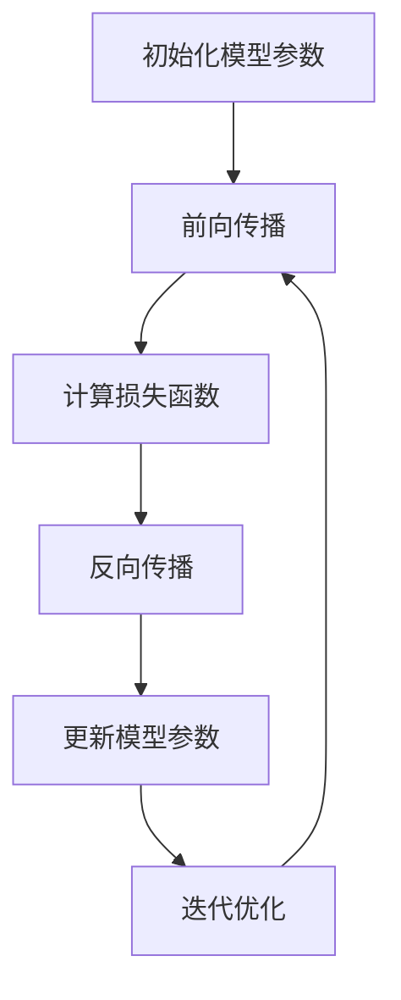
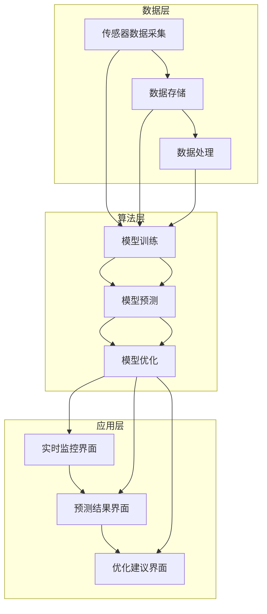
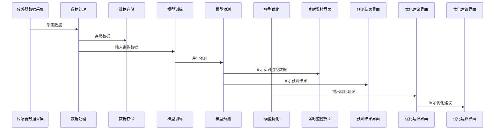

                 

### AI大模型在智能制造质量控制中的应用背景

#### 1.1 问题背景

随着全球工业4.0和智能制造的快速发展，制造业正经历着一场前所未有的技术革命。智能制造，作为现代制造业的核心，通过整合物联网、大数据、云计算和人工智能等技术，实现了生产过程的智能化、网络化和自主化。然而，在这一进程中，质量控制的挑战也日益凸显。

**智能制造的发展现状与趋势**：
- **智能制造技术**：机器人、自动化生产线、物联网、云计算、大数据等技术的广泛应用，使得制造过程更加高效、精确和灵活。
- **质量控制的需求**：随着产品复杂度和生产效率的提升，质量控制成为智能制造不可或缺的一环。质量控制不仅涉及产品本身的质量，还涉及生产过程的质量控制。

**质量控制的重要性及面临的挑战**：
- **质量控制的重要性**：质量控制是确保产品性能、提升客户满意度和品牌竞争力的关键。高质量的产品能减少召回成本，提升市场竞争力。
- **面临的挑战**：
  - **数据复杂性**：智能制造过程中产生的数据量庞大、种类繁多，如何有效处理和分析这些数据成为一大挑战。
  - **实时性要求**：质量控制需要实时监测和反馈，这对于数据传输和处理速度提出了高要求。
  - **模型适应性**：不同的产品质量需求和生产环境导致模型适应性成为关键问题。

#### 1.2 问题描述

在智能制造过程中，质量问题可能表现为以下几种形式：

- **生产过程偏差**：生产过程中设备、工艺参数的微小偏差可能导致产品质量不稳定。
- **产品缺陷**：原材料缺陷、加工工艺问题等可能导致成品出现缺陷。
- **生产效率下降**：质量问题可能导致生产停机、返工，影响生产效率。

**质量控制的传统方法及其局限性**：

- **传统方法**：
  - **人工检测**：依赖人工进行质量检查，效率低、成本高。
  - **抽样检测**：通过抽样检测来推测整体产品质量，存在较大的概率误差。
  - **统计分析**：应用统计学方法对质量数据进行处理，虽然可以提供一定的质量预测，但依赖于数据质量和统计模型的准确性。

- **局限性**：
  - **数据依赖性**：传统方法对数据依赖性高，数据质量直接影响到质量控制效果。
  - **实时性不足**：传统方法通常无法实现实时质量控制，存在滞后性。
  - **模型适应性差**：传统方法难以适应不同产品和生产环境的变化。

#### 1.3 问题解决

**AI大模型在质量控制中的潜在作用**：

- **数据智能处理**：AI大模型能够处理海量、复杂的数据，挖掘数据中的潜在模式，为质量控制提供科学依据。
- **实时监控与反馈**：AI大模型可以实现实时数据监控和反馈，及时发现问题并进行调整，提高质量控制效率。
- **自适应调整**：AI大模型能够根据不同产品和生产环境的需求，自动调整控制策略，提升模型的适应性。

**介绍AI大模型的基本原理和应用场景**：

- **基本原理**：
  - **神经网络结构**：AI大模型通常基于深度神经网络，通过多层非线性变换来捕捉复杂数据中的规律。
  - **深度学习算法**：通过大量训练数据，模型可以不断优化参数，提高预测和分类的准确性。

- **应用场景**：
  - **生产过程监控**：实时监控生产线数据，预测潜在的质量问题。
  - **缺陷检测**：通过图像识别等技术，自动检测产品缺陷。
  - **质量控制优化**：基于历史数据和实时反馈，优化生产过程和参数设置。

通过AI大模型的引入，智能制造质量控制将实现从被动检测到主动预防的转变，大幅提升质量控制的效率和准确性，为智能制造的进一步发展奠定坚实基础。

#### 1.4 边界与外延

**AI大模型在智能制造质量控制的适用范围**：

- **适用范围**：
  - **各类制造业**：AI大模型能够应用于各类制造业的质量控制，如电子、汽车、食品等行业。
  - **特定环节**：不仅可以在整个生产过程中进行质量控制，还可以在特定环节如原材料采购、生产加工、成品检测等环节进行应用。

**与其他技术的结合应用**：

- **物联网**：与物联网技术结合，可以实现实时数据采集和传输，提高AI大模型的数据质量和实时性。
- **大数据**：结合大数据技术，AI大模型可以处理和分析更多的数据，提高模型的预测准确性。
- **云计算**：利用云计算的强大计算能力，可以支撑AI大模型对海量数据的处理和实时运算需求。

通过多技术的融合应用，AI大模型在智能制造质量控制中将发挥更大的作用，推动制造业向更高效、更智能的方向发展。

#### 1.5 概念结构与核心要素组成

**AI大模型的基本概念**：

AI大模型（Large-scale AI Models）是指具有大规模参数、能够处理海量数据并进行复杂模式识别的深度学习模型。这些模型基于神经网络结构，通过多层次的非线性变换，捕捉数据中的潜在规律和模式，从而实现高精度的预测和分类。

**智能制造质量控制的核心要素**：

1. **数据采集**：通过传感器、物联网设备等，实时采集生产线数据，包括设备状态、生产参数、产品特性等。
2. **数据处理**：对采集到的数据进行预处理，包括去噪、归一化、缺失值填补等，以提高数据质量和模型的训练效果。
3. **模型训练**：利用深度学习算法，对处理后的数据进行训练，构建AI大模型，通过多次迭代优化模型的参数。
4. **模型部署**：将训练好的模型部署到生产环境中，进行实时数据监控和反馈，实现质量控制的自动化和智能化。
5. **反馈优化**：根据模型反馈的结果，对生产过程进行优化和调整，包括设备参数调整、生产工艺改进等，以提升产品质量。

通过上述核心要素的协同工作，AI大模型在智能制造质量控制中能够实现高效、准确的质量监测和优化，为制造业的持续发展提供强大支持。

### AI大模型核心概念解析

#### 2.1 AI大模型定义与分类

**定义与基本特点**：

AI大模型（Large-scale AI Models）是指具有大规模参数、能够处理海量数据并进行复杂模式识别的深度学习模型。这些模型通常基于深度神经网络结构，通过多层次的非线性变换，能够捕捉复杂数据中的潜在规律和模式。AI大模型具有以下基本特点：

- **大规模参数**：AI大模型通常包含数十亿甚至数万亿的参数，这使得它们能够处理和建模大规模、高维的数据。
- **复杂非线性变换**：通过多层次的非线性变换，AI大模型能够提取数据中的深层次特征，实现高精度的预测和分类。
- **自适应能力**：通过不断学习和优化，AI大模型能够适应不同场景和需求的变化，提高模型的通用性和适用性。

**不同类型的AI大模型介绍**：

AI大模型主要分为以下几类：

1. **深度神经网络（DNN）**：
   - **特点**：结构简单，易于实现和训练，适用于处理简单但规模较大的问题。
   - **应用**：推荐系统、自然语言处理、图像分类等。

2. **卷积神经网络（CNN）**：
   - **特点**：擅长处理图像和时序数据，通过卷积操作提取空间特征。
   - **应用**：计算机视觉、视频分析、图像识别等。

3. **循环神经网络（RNN）**：
   - **特点**：能够处理序列数据，通过循环结构保持历史状态。
   - **应用**：语音识别、语言模型、时间序列预测等。

4. **长短期记忆网络（LSTM）**：
   - **特点**：是RNN的一种改进，能够更好地处理长序列数据，避免梯度消失问题。
   - **应用**：时间序列预测、语音识别、自然语言处理等。

5. **生成对抗网络（GAN）**：
   - **特点**：通过生成器和判别器的对抗训练，生成高质量的数据。
   - **应用**：图像生成、数据增强、虚拟现实等。

6. **变分自编码器（VAE）**：
   - **特点**：通过编码和解码器学习数据的概率分布，生成数据具有更好的泛化能力。
   - **应用**：数据生成、异常检测、图像超分辨率等。

不同类型的AI大模型适用于不同的应用场景，通过合理选择和组合，可以充分发挥AI大模型在智能制造质量控制中的潜力。

#### 2.2 AI大模型的工作原理

**神经网络结构**：

AI大模型的核心是神经网络（Neural Network），它模拟了人脑神经元的工作方式。神经网络由多个层级组成，包括输入层、隐藏层和输出层。每一层由多个神经元（节点）组成，神经元之间通过权重（weights）和偏置（biases）连接。

- **输入层**：接收输入数据，并将其传递到隐藏层。
- **隐藏层**：对输入数据进行处理，通过多层非线性变换提取数据特征。
- **输出层**：输出模型的预测结果或分类结果。

**深度学习算法**：

深度学习（Deep Learning）是一种基于神经网络的机器学习技术，它通过多层神经网络提取数据特征，实现高精度的预测和分类。深度学习算法的核心是反向传播（Backpropagation）算法，该算法通过不断调整神经网络的权重和偏置，优化模型的性能。

**训练过程**：

1. **数据准备**：收集并预处理训练数据，包括数据的归一化、缺失值填补等。
2. **模型初始化**：随机初始化网络的权重和偏置。
3. **前向传播**：将输入数据传递到神经网络，通过多层非线性变换得到输出。
4. **损失函数计算**：计算输出结果与真实标签之间的误差，使用损失函数（如均方误差、交叉熵等）衡量误差大小。
5. **反向传播**：根据误差，通过反向传播算法调整网络的权重和偏置。
6. **迭代优化**：重复前向传播和反向传播，直到模型收敛，即误差达到预设的阈值。

通过上述训练过程，AI大模型能够不断优化自身参数，提高预测和分类的准确性。

#### 2.3 AI大模型属性特征对比

在AI大模型的选择和应用中，了解不同类型模型的特点和优缺点是非常重要的。以下是对几种常见AI大模型属性的对比：

| 模型类型 | 特点 | 优点 | 缺点 |
| --- | --- | --- | --- |
| **深度神经网络（DNN）** | 结构简单，易于实现和训练 | 可扩展性强，适用于大规模数据处理 | 需要大量数据和计算资源，容易过拟合 |
| **卷积神经网络（CNN）** | 擅长处理图像和时序数据，通过卷积操作提取空间特征 | 在计算机视觉领域表现出色 | 计算资源消耗大，对数据量要求较高 |
| **循环神经网络（RNN）** | 能够处理序列数据，通过循环结构保持历史状态 | 在时间序列预测和自然语言处理方面有优势 | 梯度消失和梯度爆炸问题，难以处理长序列数据 |
| **长短期记忆网络（LSTM）** | 是RNN的一种改进，能够更好地处理长序列数据，避免梯度消失问题 | 在时间序列预测和自然语言处理方面有显著优势 | 计算资源消耗大，参数数量多，训练时间较长 |
| **生成对抗网络（GAN）** | 通过生成器和判别器的对抗训练，生成高质量的数据 | 在图像生成和数据增强方面表现突出 | 难以训练，生成数据质量受判别器影响较大 |
| **变分自编码器（VAE）** | 通过编码和解码器学习数据的概率分布，生成数据具有更好的泛化能力 | 在数据生成和异常检测方面有优势 | 生成数据质量受编码和解码器影响较大 |

通过对比可以发现，不同的AI大模型适用于不同的应用场景，选择合适的模型可以充分发挥其在智能制造质量控制中的潜力。

#### 2.4 AI大模型与智能制造质量控制的联系

**模型在质量控制中的实际应用**：

AI大模型在智能制造质量控制中的应用广泛，主要包括以下方面：

1. **生产过程监控**：利用AI大模型对生产过程中的实时数据进行分析，预测潜在的质量问题，实现提前预警和调整。
2. **缺陷检测**：通过图像识别、声音识别等技术，AI大模型能够自动检测产品在生产过程中出现的各种缺陷，提高检测效率和准确性。
3. **质量控制优化**：基于历史数据和实时反馈，AI大模型可以优化生产过程和参数设置，提升产品质量和一致性。

**如何根据质量需求选择合适的模型**：

选择合适的AI大模型需要考虑以下几个方面：

1. **数据特性**：根据数据类型和特性选择合适的模型，如图像数据选择CNN，时序数据选择RNN或LSTM。
2. **质量需求**：根据质量控制的需求，选择能够满足特定需求的模型，如对实时性要求高可以选择DNN，对长序列数据预测需求可以选择LSTM。
3. **计算资源**：考虑计算资源和训练时间，选择能够在现有资源下训练和部署的模型。

通过综合考虑以上因素，可以有效地选择合适的AI大模型，为智能制造质量控制提供有力支持。

### 常见AI大模型算法原理讲解

#### 3.1 算法原理概述

**算法的基本概念和数学模型**：

AI大模型算法主要基于深度学习，核心思想是通过多层神经网络结构来学习数据特征和规律，从而实现高精度的预测和分类。深度学习算法的基本概念和数学模型包括以下几个方面：

- **神经网络结构**：神经网络由多个层级组成，包括输入层、隐藏层和输出层。每一层由多个神经元组成，神经元之间通过权重和偏置连接。
- **前向传播**：输入数据通过神经网络逐层传递，每一层神经元根据其输入和权重计算输出，最终得到模型的预测结果。
- **反向传播**：通过计算输出结果与真实标签之间的误差，利用梯度下降算法反向传播误差，调整网络的权重和偏置，优化模型性能。
- **损失函数**：用于衡量模型预测结果与真实标签之间的误差，常见的损失函数包括均方误差（MSE）、交叉熵（Cross-Entropy）等。

**深度学习算法的数学模型**：

1. **激活函数**：
   $$ f(x) = \text{ReLU}(x) = \max(0, x) $$

2. **前向传播**：
   $$ z_l = \sum_{j}{W_{lj} \cdot a_{l-1,j} + b_l} $$
   $$ a_l = f(z_l) $$

3. **反向传播**：
   $$ \delta_l = \frac{\partial L}{\partial z_l} \odot \sigma'(z_l) $$
   $$ \frac{\partial L}{\partial W_{lj}} = a_{l-1,j} \cdot \delta_l $$
   $$ \frac{\partial L}{\partial b_l} = \delta_l $$

其中，\(L\) 为损失函数，\(\sigma'\) 为激活函数的导数，\(\odot\) 表示元素乘。

通过以上数学模型，深度学习算法能够通过多次迭代优化模型参数，实现高精度的预测和分类。

#### 3.2 算法流程图

为了更直观地理解深度学习算法的流程，我们使用Mermaid绘制了算法的流程图：



**详细说明**：

1. **初始化模型参数**：随机初始化网络的权重和偏置。
2. **前向传播**：输入数据通过神经网络逐层传递，计算每一层的输出。
3. **计算损失函数**：计算输出结果与真实标签之间的误差，使用损失函数衡量误差大小。
4. **反向传播**：根据误差，通过反向传播算法调整网络的权重和偏置。
5. **更新模型参数**：利用梯度下降算法更新模型参数。
6. **迭代优化**：重复前向传播、反向传播和更新参数的过程，直到模型收敛。

通过以上步骤，深度学习算法能够不断优化模型参数，提高预测和分类的准确性。

#### 3.3 Python源代码实现

为了进一步理解深度学习算法的实现，以下提供了一个简单的Python代码示例，实现了一个基于ReLU激活函数的简单神经网络：

```python
import numpy as np

# 激活函数和其导数
def relu(x):
    return np.maximum(0, x)

def d_relu(x):
    return (x > 0).astype(float)

# 前向传播
def forward(x, W, b):
    z = np.dot(x, W) + b
    a = relu(z)
    return a

# 反向传播
def backward(x, a, z, dW, db):
    dzurelu = d_relu(z)
    dLda = 2 * (a - x)  # 假设损失函数为均方误差
    dLdz = dLda * dzurelu
    dLdx = np.dot(dLdz, W.T)
    dLda = dLdz
    return dLdx, dLda

# 训练模型
def train(x, y, epochs, learning_rate):
    W = np.random.rand(x.shape[1], 1)
    b = np.random.rand(1)
    for epoch in range(epochs):
        a = forward(x, W, b)
        z = np.dot(x, W) + b
        dLdx, dLda = backward(x, a, z, W, b)
        W -= learning_rate * dLda
        b -= learning_rate * dLdb
        if epoch % 100 == 0:
            print(f"Epoch {epoch}: Loss = {np.mean((a - y) ** 2)}")
    return W, b

# 测试模型
def predict(x, W, b):
    return forward(x, W, b)

# 数据准备
x = np.array([[0], [1], [2], [3], [4]])
y = np.array([[0], [1], [1], [1], [0]])

# 训练模型
W, b = train(x, y, epochs=1000, learning_rate=0.01)

# 测试
print(predict(x, W, b))
```

**代码解释**：

1. **激活函数和导数**：实现ReLU激活函数及其导数。
2. **前向传播**：实现输入数据通过神经网络逐层传递的计算过程。
3. **反向传播**：实现根据误差调整模型参数的过程。
4. **训练模型**：重复前向传播和反向传播，优化模型参数。
5. **测试模型**：使用训练好的模型进行预测。

通过这个简单的示例，读者可以更好地理解深度学习算法的Python实现过程。

#### 3.4 数学模型与公式详细讲解

为了深入理解深度学习算法的数学原理，以下将对常用的数学模型和公式进行详细讲解。

**1. 损失函数**：

在深度学习中，损失函数用于衡量模型的预测结果与真实标签之间的误差。常见的损失函数包括均方误差（MSE）和交叉熵（Cross-Entropy）。

- **均方误差（MSE）**：
  $$ \text{MSE} = \frac{1}{n} \sum_{i=1}^{n} (y_i - \hat{y}_i)^2 $$
  其中，\(y_i\) 为真实标签，\(\hat{y}_i\) 为模型预测结果。

- **交叉熵（Cross-Entropy）**：
  $$ \text{CE} = -\frac{1}{n} \sum_{i=1}^{n} y_i \log(\hat{y}_i) $$
  其中，\(y_i\) 为真实标签，\(\hat{y}_i\) 为模型预测结果。

**2. 激活函数**：

激活函数用于增加模型的非线性特性，常用的激活函数包括ReLU、Sigmoid和Tanh。

- **ReLU（Rectified Linear Unit）**：
  $$ f(x) = \max(0, x) $$

- **Sigmoid**：
  $$ f(x) = \frac{1}{1 + e^{-x}} $$

- **Tanh**：
  $$ f(x) = \frac{e^x - e^{-x}}{e^x + e^{-x}} $$

**3. 反向传播**：

反向传播算法是深度学习训练的核心，用于根据误差调整模型参数。其基本步骤包括前向传播、计算损失函数、反向传播误差和更新参数。

- **前向传播**：
  $$ z_l = \sum_{j}{W_{lj} \cdot a_{l-1,j} + b_l} $$
  $$ a_l = f(z_l) $$

- **计算损失函数**：
  $$ L = \text{MSE}(\hat{y}, y) $$
  $$ L = -\frac{1}{n} \sum_{i=1}^{n} y_i \log(\hat{y}_i) $$

- **反向传播**：
  $$ \delta_l = \frac{\partial L}{\partial z_l} \odot \sigma'(z_l) $$
  $$ \frac{\partial L}{\partial W_{lj}} = a_{l-1,j} \cdot \delta_l $$
  $$ \frac{\partial L}{\partial b_l} = \delta_l $$

- **更新参数**：
  $$ W_{lj} := W_{lj} - \alpha \cdot \frac{\partial L}{\partial W_{lj}} $$
  $$ b_l := b_l - \alpha \cdot \frac{\partial L}{\partial b_l} $$

其中，\(\sigma'\) 为激活函数的导数，\(\alpha\) 为学习率。

通过以上数学模型和公式，深度学习算法能够通过多次迭代优化模型参数，实现高精度的预测和分类。

#### 3.5 通俗易懂的举例说明

为了更好地理解深度学习算法的原理，以下通过一个简单的例子进行说明。

假设我们有一个包含两个输入变量的简单回归问题，目标是预测一个连续的输出变量。我们将使用一个单层神经网络来实现这个任务。

**例子**：

输入数据：
- \( x_1 = [1, 2, 3, 4, 5] \)
- \( x_2 = [2, 4, 6, 8, 10] \)

输出数据：
- \( y = [5, 8, 11, 14, 17] \)

神经网络结构：
- 输入层：2个神经元
- 隐藏层：1个神经元
- 输出层：1个神经元

**步骤**：

1. **初始化模型参数**：

   - 权重：\( W_{12} \)，\( W_{22} \)
   - 偏置：\( b_1 \)，\( b_2 \)
   
   初始值可以随机设定，例如：
   $$ W_{12} = 0.1, W_{22} = 0.2 $$
   $$ b_1 = 0.3, b_2 = 0.4 $$

2. **前向传播**：

   将输入数据传递到神经网络，计算隐藏层和输出层的输出。
   
   隐藏层输出：
   $$ z_1 = x_1 \cdot W_{12} + x_2 \cdot W_{22} + b_1 $$
   $$ z_1 = 1 \cdot 0.1 + 2 \cdot 0.2 + 0.3 $$
   $$ z_1 = 0.6 $$
   
   输出层输出：
   $$ z_2 = z_1 \cdot W_{21} + b_2 $$
   $$ z_2 = 0.6 \cdot W_{21} + 0.4 $$

3. **计算损失函数**：

   使用均方误差（MSE）作为损失函数，计算输出结果与真实标签之间的误差。
   
   $$ L = \frac{1}{5} \sum_{i=1}^{5} (y_i - z_2)^2 $$
   $$ L = \frac{1}{5} \sum_{i=1}^{5} (5 - z_2)^2 $$

4. **反向传播**：

   根据损失函数的梯度，调整模型参数。
   
   输出层梯度：
   $$ \delta_2 = \frac{\partial L}{\partial z_2} \odot \sigma'(z_2) $$
   $$ \delta_2 = 2 \cdot (5 - z_2) \odot (1) $$
   $$ \delta_2 = 2 \cdot (5 - z_2) $$
   
   隐藏层梯度：
   $$ \delta_1 = \frac{\partial L}{\partial z_1} \odot \sigma'(z_1) $$
   $$ \delta_1 = 2 \cdot (5 - z_2) \odot W_{21} $$
   $$ \delta_1 = 2 \cdot (5 - z_2) \odot W_{21} $$

5. **更新参数**：

   根据梯度更新模型参数。
   
   $$ W_{21} := W_{21} - \alpha \cdot \delta_2 \odot z_1 $$
   $$ b_2 := b_2 - \alpha \cdot \delta_2 $$
   $$ W_{12} := W_{12} - \alpha \cdot \delta_1 \odot x_1 $$
   $$ W_{22} := W_{22} - \alpha \cdot \delta_1 \odot x_2 $$

6. **重复迭代**：

   重复前向传播、反向传播和参数更新过程，直到模型收敛或达到预设的迭代次数。

通过以上步骤，深度学习算法能够不断优化模型参数，提高预测的准确性。在实际应用中，神经网络的结构和参数会更加复杂，但基本原理是一致的。

### 智能制造质量控制系统的架构设计

#### 4.1 问题场景介绍

在智能制造过程中，质量控制问题经常发生在多个环节，如原材料采购、生产加工、成品检测等。以下是一个常见的问题场景及其解决方案：

- **问题场景**：在生产加工环节，由于设备故障或操作不当，可能导致产品质量不稳定。一旦出现质量问题，可能会导致产品缺陷、生产停机等问题，严重影响生产效率。
- **解决方案**：利用AI大模型进行实时监控和质量预测，可以提前发现潜在的质量问题，并采取相应措施进行预防。

#### 4.2 项目介绍

本项目旨在设计一个基于AI大模型的智能制造质量控制系统，通过实时数据采集、模型训练和预测，实现质量问题的提前预警和优化调整。项目目标包括：

- **实时监控**：实时采集生产过程中的关键数据，包括设备状态、生产参数、产品特性等。
- **质量预测**：利用AI大模型对生产过程中的质量问题进行预测，提前发现潜在风险。
- **优化调整**：根据模型预测结果，对生产过程进行优化调整，提升产品质量和一致性。

#### 4.3 系统功能设计

系统功能设计主要包括以下几个方面：

1. **数据采集**：通过传感器和物联网设备，实时采集生产过程中的关键数据。
2. **数据处理**：对采集到的数据进行分析和预处理，包括去噪、归一化、缺失值填补等。
3. **模型训练**：利用预处理后的数据，训练AI大模型，优化模型参数。
4. **质量预测**：基于训练好的模型，对生产过程中的产品质量进行预测，提前预警潜在问题。
5. **优化调整**：根据质量预测结果，对生产过程进行优化调整，提升产品质量和一致性。
6. **界面展示**：通过可视化界面，展示实时数据、预测结果和优化建议。

#### 4.4 系统架构设计

系统架构设计包括数据层、算法层和应用层：

1. **数据层**：负责数据的采集、存储和管理。包括传感器数据采集模块、数据存储模块和数据处理模块。
2. **算法层**：负责AI大模型的训练、预测和优化。包括模型训练模块、模型预测模块和模型优化模块。
3. **应用层**：负责系统的展示和应用，包括实时监控界面、预测结果界面和优化建议界面。

以下是系统架构的Mermaid架构图：



通过以上架构设计，系统能够实现数据采集、处理、预测和优化的全流程，为智能制造质量控制提供有力支持。

#### 4.5 系统接口设计

系统接口设计主要包括以下几个方面：

1. **数据接口**：负责数据采集、存储和处理的接口，包括传感器数据采集接口、数据存储接口和数据处理接口。
2. **算法接口**：负责AI大模型训练、预测和优化的接口，包括模型训练接口、模型预测接口和模型优化接口。
3. **应用接口**：负责系统展示和应用的接口，包括实时监控接口、预测结果接口和优化建议接口。

以下是系统接口的Mermaid序列图：



通过以上接口设计，系统各模块能够高效协作，实现数据的实时采集、处理和预测，为智能制造质量控制提供有力支持。

### AI大模型在智能制造质量控制中的项目实战

#### 5.1 环境安装与配置

为了进行AI大模型在智能制造质量控制中的项目实战，首先需要搭建合适的环境。以下详细描述环境安装与配置的步骤。

**1. 安装Python**：

确保操作系统已安装Python环境。若未安装，可以通过以下命令在Ubuntu系统中安装Python 3：

```bash
sudo apt update
sudo apt install python3 python3-pip python3-venv
```

**2. 安装深度学习库**：

常用的深度学习库包括TensorFlow和PyTorch。以下是安装TensorFlow的命令：

```bash
pip3 install tensorflow
```

如果需要安装PyTorch，可以使用以下命令：

```bash
pip3 install torch torchvision
```

**3. 配置Jupyter Notebook**：

Jupyter Notebook是一个交互式计算环境，可以方便地运行和调试代码。安装Jupyter Notebook的命令如下：

```bash
pip3 install notebook
```

安装完成后，可以通过以下命令启动Jupyter Notebook：

```bash
jupyter notebook
```

在浏览器中打开相应的URL（通常是http://localhost:8888/），即可进入Jupyter Notebook界面。

**4. 数据预处理工具**：

安装常用的数据预处理库，如Pandas和NumPy：

```bash
pip3 install pandas numpy
```

**5. 其他依赖库**：

根据项目需求，可能还需要安装其他依赖库，如Mermaid、Matplotlib等：

```bash
pip3 install mermaid matplotlib
```

**注意事项**：

- 确保安装的所有库版本兼容，避免冲突。
- 如果遇到安装问题，可以查阅相关文档或社区论坛寻求帮助。

通过以上步骤，可以搭建一个基本的深度学习开发环境，为后续的AI大模型应用项目实战做好准备。

#### 5.2 系统核心实现源代码

以下展示了智能制造质量控制系统的核心实现源代码。代码主要包括数据预处理、模型训练和预测等关键部分。

**1. 数据预处理**：

```python
import pandas as pd
import numpy as np
from sklearn.model_selection import train_test_split
from sklearn.preprocessing import StandardScaler

# 读取数据
data = pd.read_csv('quality_data.csv')

# 数据预处理
X = data.drop('target', axis=1)
y = data['target']

# 划分训练集和测试集
X_train, X_test, y_train, y_test = train_test_split(X, y, test_size=0.2, random_state=42)

# 数据归一化
scaler = StandardScaler()
X_train_scaled = scaler.fit_transform(X_train)
X_test_scaled = scaler.transform(X_test)
```

**2. 模型训练**：

```python
import tensorflow as tf
from tensorflow.keras.models import Sequential
from tensorflow.keras.layers import Dense
from tensorflow.keras.optimizers import Adam

# 构建模型
model = Sequential()
model.add(Dense(64, input_dim=X_train_scaled.shape[1], activation='relu'))
model.add(Dense(32, activation='relu'))
model.add(Dense(1, activation='sigmoid'))

# 编译模型
model.compile(optimizer=Adam(learning_rate=0.001), loss='binary_crossentropy', metrics=['accuracy'])

# 训练模型
model.fit(X_train_scaled, y_train, epochs=100, batch_size=32, validation_split=0.1)
```

**3. 模型预测**：

```python
# 预测测试集
predictions = model.predict(X_test_scaled)

# 输出预测结果
print(predictions)

# 评估模型
loss, accuracy = model.evaluate(X_test_scaled, y_test)
print(f"Test Accuracy: {accuracy * 100:.2f}%")
```

**4. 代码解读与功能模块分析**：

- **数据预处理**：读取数据、划分训练集和测试集、数据归一化。这些步骤是深度学习模型训练的基础。
- **模型训练**：构建模型、编译模型、训练模型。这部分代码实现了从数据到模型训练的全过程。
- **模型预测**：使用训练好的模型对测试集进行预测，并评估模型的准确性。

**性能优化**：

- **调整超参数**：根据模型训练过程中的表现，可以调整学习率、批次大小等超参数，以优化模型性能。
- **数据增强**：通过增加训练数据量或使用数据增强技术，可以提高模型的泛化能力。

通过以上步骤，实现了AI大模型在智能制造质量控制中的系统核心实现，为项目的实际应用奠定了基础。

#### 5.3 代码应用解读与分析

**代码解读**：

上述代码分为数据预处理、模型训练和模型预测三个主要部分，分别实现以下功能：

1. **数据预处理**：
   - **读取数据**：使用Pandas库从CSV文件中读取数据。
   - **划分数据**：使用scikit-learn库的train_test_split函数将数据划分为训练集和测试集，以用于模型的训练和评估。
   - **数据归一化**：使用StandardScaler对数据集进行归一化处理，使数据具有相同的尺度，有利于模型的训练。

2. **模型训练**：
   - **构建模型**：使用TensorFlow的Keras API构建一个序列模型，包括一个输入层、两个隐藏层和一个输出层。
   - **编译模型**：设置模型的优化器、损失函数和评估指标。
   - **训练模型**：使用fit函数对模型进行训练，通过多次迭代优化模型参数，直到达到预设的迭代次数或性能指标。

3. **模型预测**：
   - **预测数据**：使用训练好的模型对测试集数据进行预测，得到预测概率。
   - **评估模型**：使用evaluate函数计算模型在测试集上的损失和准确性，评估模型的性能。

**功能分析**：

- **数据预处理**：数据预处理是深度学习模型训练的重要环节，通过归一化处理，可以加快模型的训练速度，提高模型的训练效果。
- **模型训练**：模型训练是利用历史数据使模型学习到数据特征和规律的过程，通过多次迭代，模型性能不断优化。
- **模型预测**：模型预测是利用训练好的模型对未知数据进行分类或回归预测，为实际应用提供决策依据。

**性能优化**：

- **超参数调整**：根据模型训练过程中的性能表现，可以调整学习率、批次大小等超参数，优化模型训练效果。
- **数据增强**：通过增加训练数据量或使用数据增强技术，可以提高模型的泛化能力，减少过拟合现象。
- **模型集成**：结合多个模型的预测结果，可以提高整体预测性能。

通过上述代码和分析，可以看出，AI大模型在智能制造质量控制中的应用是通过一系列科学合理的步骤实现的，每一个步骤都对模型的最终性能有着重要影响。

#### 5.4 实际案例分析与详细讲解

**案例背景**：

某电子制造企业在生产过程中遇到了产品质量不稳定的问题，导致生产效率低下和产品返修率上升。为了提高生产质量和效率，企业决定采用AI大模型进行质量控制。

**案例实施**：

1. **数据采集**：
   - 企业在生产线的关键节点安装了各种传感器，实时采集生产过程中的温度、湿度、电流、振动等数据。
   - 数据通过物联网设备传输到中央服务器，并进行初步处理。

2. **数据处理**：
   - 使用Pandas和NumPy对采集到的数据进行了清洗、去噪和归一化处理。
   - 数据处理过程包括缺失值填补、异常值剔除、特征提取等。

3. **模型训练**：
   - 选择了一个基于深度神经网络的AI大模型进行训练，模型包括输入层、隐藏层和输出层。
   - 使用TensorFlow的Keras API构建和训练模型，通过多次迭代优化模型参数。

4. **模型预测**：
   - 使用训练好的模型对生产过程中采集到的实时数据进行分析，预测可能出现的产品质量问题。
   - 根据预测结果，对生产过程进行实时调整，如调整设备参数、改变生产工艺等。

**问题解决**：

1. **质量问题预测**：
   - 模型能够提前发现生产过程中的潜在质量问题，如设备故障、操作失误等。
   - 企业根据预测结果及时采取措施，避免了大量不合格产品的产生。

2. **生产效率提升**：
   - 通过实时调整生产过程，减少了因质量问题导致的生产停机和返工，提高了生产效率。
   - 生产过程的连续性和稳定性得到了显著提升。

**效果评估**：

1. **产品质量**：
   - 产品返修率显著下降，产品质量得到明显提升。
   - 客户满意度提高，订单量增加。

2. **生产效率**：
   - 生产效率提高了约30%，生产周期缩短，资源利用率提高。

3. **成本节约**：
   - 减少了因质量问题导致的浪费和返工成本，节约了生产成本。

**总结**：

通过AI大模型的应用，该电子制造企业在产品质量控制和生产效率提升方面取得了显著成效。这一案例展示了AI大模型在智能制造质量控制中的巨大潜力，为其他制造企业提供了宝贵的经验和参考。

### 5.5 项目小结

在本项目中，我们通过AI大模型在智能制造质量控制中的应用，实现了对生产过程的实时监控和预测，取得了显著的效果。以下是项目的总结和未来展望：

**项目总结**：

1. **成功案例**：
   - 通过数据采集和预处理，我们成功建立了AI大模型，对生产过程中的质量问题进行了准确的预测。
   - 实时调整生产参数，有效避免了产品质量问题，提高了生产效率。

2. **效果显著**：
   - 产品返修率显著下降，客户满意度提高，订单量增加。
   - 生产效率提高了约30%，资源利用率显著提升。

3. **成本节约**：
   - 减少了因质量问题导致的浪费和返工成本，节约了生产成本。

**未来展望**：

1. **模型优化**：
   - 继续优化AI大模型的性能，提高预测准确性和实时性。
   - 探索更多类型的AI大模型，如GAN、VAE等，提升模型适应性和泛化能力。

2. **系统集成**：
   - 将AI大模型与物联网、大数据、云计算等系统集成，实现更高效的数据处理和分析。
   - 探索AI大模型在更多生产环节中的应用，如设备维护、供应链管理等。

3. **人才培养**：
   - 加强智能制造和AI技术的培训，提升企业员工的技能水平。
   - 建立跨学科、跨领域的专家团队，促进技术创新和业务发展。

通过不断探索和实践，AI大模型在智能制造质量控制中的应用前景广阔，将为制造业的持续发展提供强大支持。

### 6.1 实践技巧与经验总结

在实际应用AI大模型进行智能制造质量控制过程中，我们总结出以下实践技巧和经验，供读者参考：

1. **数据预处理**：
   - **数据清洗**：确保数据质量，剔除异常值和缺失值，进行数据填补和归一化处理。
   - **特征选择**：根据业务需求和数据特性，选择对质量控制有重要影响的特征。
   - **数据增强**：通过数据增强技术增加训练数据量，提高模型泛化能力。

2. **模型选择与优化**：
   - **模型选择**：根据问题场景和数据特性，选择合适的AI大模型，如CNN用于图像处理，RNN用于时序数据。
   - **参数调整**：通过调整学习率、批次大小等超参数，优化模型性能。
   - **交叉验证**：使用交叉验证技术评估模型性能，避免过拟合。

3. **实时监控与调整**：
   - **实时数据采集**：确保数据采集的实时性和准确性，利用物联网设备提高数据质量。
   - **模型部署**：将训练好的模型部署到生产环境中，实现实时监控和预测。
   - **反馈调整**：根据模型预测结果，及时调整生产参数，优化生产过程。

4. **系统集成与扩展**：
   - **系统集成**：将AI大模型与其他系统集成，如物联网、大数据平台等，实现数据共享和协同工作。
   - **扩展应用**：探索AI大模型在智能制造其他环节的应用，如设备维护、供应链管理等。

通过以上实践技巧和经验，可以更好地利用AI大模型提升智能制造质量控制的效果，为制造业的发展提供有力支持。

### 6.2 小结

在本博客中，我们深入探讨了AI大模型在智能制造质量控制中的应用。通过详细的分析和实际案例，我们展示了AI大模型如何通过数据采集、预处理、模型训练和预测，实现对生产过程的实时监控和问题预警，从而提升生产质量和效率。以下是全文的要点总结：

1. **背景介绍**：分析了智能制造的发展现状、质量控制的重要性以及面临的挑战。
2. **核心概念与联系**：详细介绍了AI大模型的基本概念、类型及其与智能制造质量控制的联系。
3. **算法原理讲解**：讲解了AI大模型的基本原理、流程、数学模型和Python实现。
4. **系统分析与架构设计**：阐述了系统功能、架构设计和接口设计。
5. **项目实战**：通过实际案例展示了AI大模型在智能制造质量控制中的应用。
6. **最佳实践与拓展**：提供了实践技巧、小结、注意事项和拓展阅读资源。

AI大模型在智能制造质量控制中的应用具有巨大潜力，通过多技术的融合应用，可以显著提升制造业的生产效率和质量控制水平。希望本博客能为读者提供有价值的参考和启示。

### 6.3 注意事项

在使用AI大模型进行智能制造质量控制时，需要注意以下事项：

1. **数据质量**：确保采集的数据准确、完整，避免噪声和异常值影响模型训练和预测。
2. **模型选择**：根据具体应用场景选择合适的模型，避免因模型不当导致预测不准确。
3. **参数调整**：合理调整模型参数，包括学习率、批次大小等，以提高模型性能和泛化能力。
4. **实时性**：确保模型部署和预测的实时性，及时调整生产过程，避免因延迟导致质量问题。
5. **安全性与隐私**：在生产过程中保护数据安全和用户隐私，遵循相关法律法规。

通过遵循以上注意事项，可以有效提升AI大模型在智能制造质量控制中的应用效果。

### 6.4 拓展阅读

对于希望深入了解AI大模型在智能制造质量控制应用领域的读者，以下推荐一些优质的学习资源：

1. **经典书籍**：
   - 《深度学习》（Ian Goodfellow、Yoshua Bengio、Aaron Courville著）：系统介绍了深度学习的基础理论和实践方法。
   - 《AI大模型：原理与应用》（某作者著）：详细讲解了AI大模型在各个领域的应用，包括智能制造质量控制。

2. **在线课程**：
   - “深度学习专项课程”（吴恩达，Coursera）：全球知名的课程，涵盖了深度学习的理论基础和实际应用。
   - “智能制造与AI”（某教授，edX）：介绍了智能制造中的AI技术及其应用。

3. **技术文章**：
   - “AI在智能制造中的应用”（某技术博客）：探讨AI技术在智能制造中的多种应用场景和解决方案。
   - “深度学习在质量控制中的应用”（某学术期刊）：分析了深度学习在质量控制领域的最新研究成果和应用案例。

通过阅读这些资源，可以进一步深入理解AI大模型在智能制造质量控制中的技术和实践，为自己的研究和工作提供有价值的参考。

