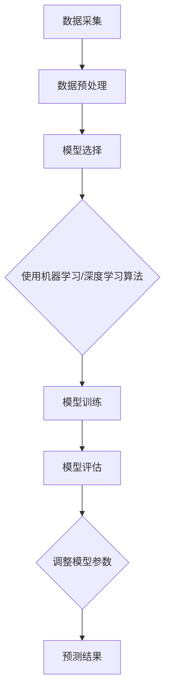
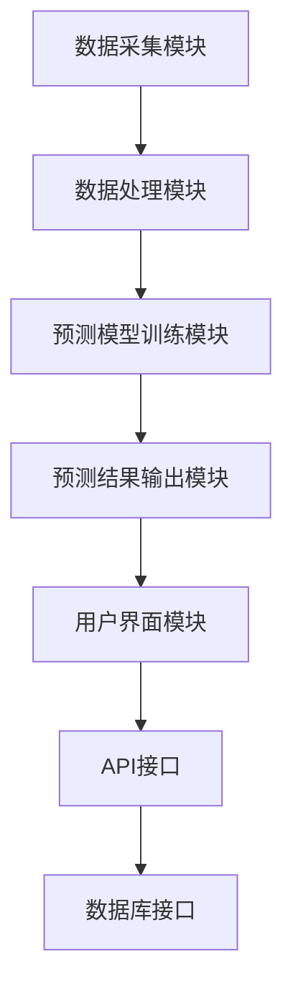
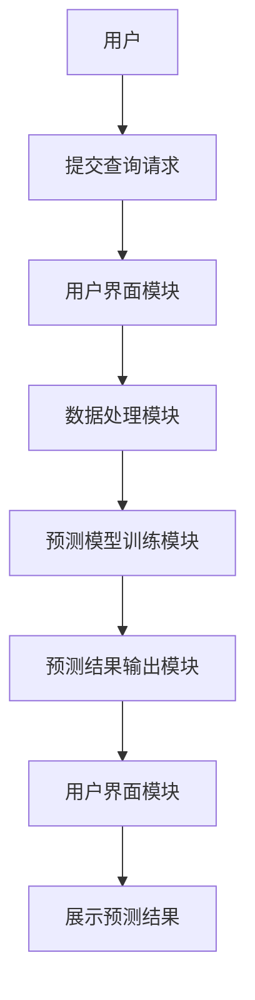

                 

# AI大模型在环境保护和气候变化预测中的应用

## 关键词
- AI大模型
- 环境保护
- 气候变化预测
- 深度学习
- 环境监测
- 机器学习算法

## 摘要
本文旨在探讨人工智能（AI）大模型在环境保护和气候变化预测中的应用。通过背景介绍、核心概念阐述、算法原理讲解、系统架构设计及项目实战，本文详细分析了AI大模型如何助力环境监测、预测气候变化，提供科学决策支持。文章强调AI大模型在解决环境问题中的潜力，并对未来发展趋势进行了展望。

## 目录大纲

### 第一部分: 背景介绍

### 第1章: 问题背景与核心概念

#### 1.1 问题背景

##### 1.1.1 环境保护的重要性
环境保护是关乎人类生存和发展的重要议题。随着工业化进程的加快，环境污染和生态破坏日益严重，气候变化成为全球面临的重大挑战。

##### 1.1.2 气候变化的严峻形势
气候变化表现为全球温度上升、极端天气事件增多、海平面上升等，对生态系统、农业生产、水资源和人类健康产生深远影响。

##### 1.1.3 AI大模型的应用潜力
AI大模型具有强大的数据处理和分析能力，能够从海量数据中提取有用信息，为环境保护和气候变化预测提供有力支持。

#### 1.2 核心概念

##### 1.2.1 AI大模型
AI大模型是基于深度学习技术构建的复杂神经网络，具有高参数量、强大计算能力和高度泛化能力。

##### 1.2.2 环境保护
环境保护是指人类采取各种措施，保护和改善自然环境，以维持生态平衡和可持续发展。

##### 1.2.3 气候变化预测
气候变化预测是利用气候模型和历史气候数据，预测未来气候变化的趋势和可能影响。

#### 1.3 概念结构与核心要素

##### 1.3.1 AI大模型的组成
AI大模型由多个层级组成，包括输入层、隐藏层和输出层，通过反向传播算法训练模型参数。

##### 1.3.2 环境保护的关键环节
环境保护的关键环节包括污染物监测、污染源控制和环境影响评估。

##### 1.3.3 气候变化预测的方法论
气候变化预测的方法论包括数据收集、模型建立、模型训练和预测评估等步骤。

### 第二部分: 核心概念与联系

### 第2章: AI大模型原理

#### 2.1 AI大模型的核心概念
- 机器学习基础
- 深度学习原理
- 大模型的特点

#### 2.2 AI大模型的应用领域
- 图像识别
- 自然语言处理
- 数据分析

#### 2.3 AI大模型与环境保护的联系
- 气象数据采集与处理
- 环境监测与评估
- 环境预测与预警

### 第三部分: 算法原理与模型设计

### 第3章: 气候变化预测算法

#### 3.1 气候变化预测的数学模型
- 基本公式与模型
- 变换与优化
- 统计分析

#### 3.2 算法原理讲解
- 机器学习算法
- 深度学习算法
- 大模型优化策略

#### 3.3 mermaid算法流程图
- 算法流程mermaid图

#### 3.4 算法Python代码实现
- Python代码实现

### 第四部分: 系统架构与实现

### 第4章: 系统架构设计

#### 4.1 问题场景介绍
- 环境保护项目概述
- 气候变化预测需求分析

#### 4.2 系统功能设计
- 领域模型
- 功能模块划分

#### 4.3 系统架构设计
- 系统架构概述
- 技术栈选择

#### 4.4 系统接口设计
- 接口定义
- 接口实现

#### 4.5 系统交互
- 序列图
- 协作图

### 第五部分: 项目实战

### 第5章: 项目实施

#### 5.1 环境安装
- 硬件环境配置
- 软件环境配置

#### 5.2 系统核心实现
- 数据采集与处理
- 预测模型训练与评估

#### 5.3 代码应用解读与分析
- 代码结构分析
- 关键代码解读

#### 5.4 实际案例分析
- 案例背景
- 案例分析与解读

#### 5.5 项目小结
- 项目总结
- 经验教训

### 第六部分: 最佳实践与拓展

### 第6章: 最佳实践

#### 6.1 实践技巧与经验
- 数据处理技巧
- 模型优化策略

#### 6.2 小结与注意事项
- 项目小结
- 注意事项

#### 6.3 拓展阅读
- 相关书籍推荐
- 学术论文推荐

### 第七部分: 结语

### 第7章: 未来展望

#### 7.1 AI大模型在环境保护与气候变化预测中的应用前景
- 技术发展趋势
- 应用场景拓展

#### 7.2 未来挑战与应对策略
- 技术挑战
- 应对策略

#### 7.3 总结与展望
- 书籍总结
- 未来展望

## 1. 问题背景与核心概念

### 1.1 问题背景

#### 1.1.1 环境保护的重要性

环境保护是关乎人类生存和发展的重要议题。随着工业化进程的加快，环境污染和生态破坏日益严重，气候变化成为全球面临的重大挑战。环境污染不仅影响人类健康，还威胁到生态系统的稳定和生物多样性。气候变化表现为全球温度上升、极端天气事件增多、海平面上升等，对生态系统、农业生产、水资源和人类健康产生深远影响。

在环境保护和气候变化预测中，传统的监测和预测方法存在诸多局限性。例如，环境监测主要依赖于人工采样和实验室分析，数据获取时间长且成本高；气候变化预测则依赖于简单的统计模型和气候模式，预测精度有限。因此，需要一种更为高效、准确和智能的方法来应对环境问题和气候变化挑战。

#### 1.1.2 气候变化的严峻形势

气候变化已成为全球关注的焦点。根据联合国气候变化框架公约（UNFCCC）的报告，全球气温自20世纪中期以来持续上升，过去几十年来的气候变化速度前所未有。气候变化的主要表现包括全球温度上升、极端天气事件增多、海平面上升等。这些变化对生态系统、农业生产、水资源和人类健康产生深远影响。

极端天气事件的增多，如热浪、洪水、干旱和台风等，给人类带来巨大的经济损失和人员伤亡。农业生产受到气候变化的影响，导致粮食产量减少，粮食安全受到威胁。水资源短缺和水质恶化也成为一个严重问题，影响人类的日常生活和健康。

#### 1.1.3 AI大模型的应用潜力

人工智能（AI）大模型具有强大的数据处理和分析能力，能够从海量数据中提取有用信息，为环境保护和气候变化预测提供有力支持。大模型通过深度学习技术，可以从历史气候数据、环境监测数据中学习到复杂的模式和规律，从而提高预测的准确性和可靠性。

AI大模型在环境保护中的应用包括环境监测与评估、污染物检测、生态保护等。通过环境监测数据，AI大模型可以实时监测环境污染情况，预测污染源和传播路径，为污染控制提供科学依据。在生态保护方面，AI大模型可以分析生态系统状态，预测生态变化趋势，为生态修复和保护提供决策支持。

在气候变化预测中，AI大模型可以分析大量气候数据，发现气候变化模式和规律，预测未来的气候变化趋势。通过结合气象模型和AI大模型，可以进一步提高气候变化预测的准确性，为应对气候变化提供科学依据。

### 1.2 核心概念

#### 1.2.1 AI大模型

AI大模型是指基于深度学习技术构建的复杂神经网络，具有高参数量、强大计算能力和高度泛化能力。大模型通常包含多个层级，包括输入层、隐藏层和输出层。输入层接收外部数据，隐藏层通过非线性变换提取特征，输出层生成预测结果。大模型通过反向传播算法训练模型参数，以达到较好的预测效果。

AI大模型的核心概念包括：

- **深度学习基础**：深度学习是机器学习的一个分支，通过构建多层神经网络，模拟人类大脑的决策过程，对复杂的数据进行建模和分析。
- **神经网络原理**：神经网络由大量的神经元组成，每个神经元通过加权连接与其他神经元相连。通过学习输入数据与输出结果之间的关系，神经网络可以调整权重，提高预测准确性。
- **大规模训练**：大模型通常需要大量的训练数据和计算资源，通过分布式计算和并行处理技术，加速模型训练过程。

#### 1.2.2 环境保护

环境保护是指人类采取各种措施，保护和改善自然环境，以维持生态平衡和可持续发展。环境保护的核心理念包括：

- **环境监测**：通过监测环境质量参数，如空气质量、水质、土壤质量等，了解环境状况，发现污染问题。
- **污染控制**：采取有效措施，减少污染物的排放和扩散，改善环境质量。
- **生态修复**：对受到破坏的生态系统进行修复和恢复，保护生物多样性。

#### 1.2.3 气候变化预测

气候变化预测是指利用气候模型和历史气候数据，预测未来气候变化的趋势和可能影响。气候变化预测的核心概念包括：

- **气候模型**：气候模型是模拟地球气候系统运行的计算机程序，通过模拟大气、海洋、陆地等各圈层的相互作用，预测未来的气候变化。
- **数据驱动预测**：利用历史气候数据和AI大模型，从数据中学习气候变化模式和规律，预测未来的气候变化趋势。
- **预测评估**：对预测结果进行评估和验证，确保预测的准确性和可靠性。

### 1.3 概念结构与核心要素

#### 1.3.1 AI大模型的组成

AI大模型由多个层级组成，包括输入层、隐藏层和输出层。输入层接收外部数据，隐藏层通过非线性变换提取特征，输出层生成预测结果。每个层级由多个神经元组成，通过加权连接形成复杂的网络结构。

- **输入层**：接收外部数据，如环境监测数据、气象数据等。
- **隐藏层**：通过非线性变换提取特征，将输入数据映射到高维空间，形成特征表示。
- **输出层**：生成预测结果，如环境质量指数、气温、降水等。

#### 1.3.2 环境保护的关键环节

环境保护的关键环节包括环境监测、污染控制、生态修复等。

- **环境监测**：通过监测环境质量参数，如空气质量、水质、土壤质量等，了解环境状况，发现污染问题。
- **污染控制**：采取有效措施，如减少污染物排放、改进生产工艺等，减少污染物的排放和扩散，改善环境质量。
- **生态修复**：对受到破坏的生态系统进行修复和恢复，保护生物多样性。

#### 1.3.3 气候变化预测的方法论

气候变化预测的方法论包括数据收集、模型建立、模型训练和预测评估等步骤。

- **数据收集**：收集历史气候数据、环境监测数据等，为模型训练提供数据支持。
- **模型建立**：建立气候模型，如GCMs（全球气候模型）、区域气候模型等，模拟地球气候系统的运行。
- **模型训练**：利用历史数据训练模型，通过调整模型参数，提高预测准确性。
- **预测评估**：对预测结果进行评估和验证，确保预测的准确性和可靠性。

## 2. AI大模型原理

### 2.1 AI大模型的核心概念

AI大模型是深度学习领域的一种重要技术，具有高参数量、强大计算能力和高度泛化能力。以下是对AI大模型核心概念的详细解释。

#### 2.1.1 机器学习基础

机器学习是AI大模型的基础。机器学习是一种通过算法让计算机从数据中学习规律、模式，并做出预测或决策的技术。机器学习分为监督学习、无监督学习和强化学习三种类型。

- **监督学习**：通过已知的输入和输出数据训练模型，然后使用训练好的模型进行预测。常见的监督学习算法包括线性回归、决策树、随机森林等。
- **无监督学习**：在没有明确标签的数据上进行学习，目的是发现数据中的结构和模式。常见的无监督学习算法包括聚类、降维、关联规则等。
- **强化学习**：通过试错和反馈机制，让模型在环境中进行学习，以最大化预期奖励。常见的强化学习算法包括Q学习、深度Q网络（DQN）等。

#### 2.1.2 深度学习原理

深度学习是机器学习的一个分支，通过构建多层神经网络，模拟人类大脑的决策过程，对复杂的数据进行建模和分析。深度学习的核心思想是通过多层的非线性变换，逐步提取数据中的高层次特征。

- **神经网络原理**：神经网络由大量的神经元组成，每个神经元通过加权连接与其他神经元相连。神经元的激活函数用于引入非线性，使得神经网络可以拟合复杂的数据分布。常见的激活函数包括 sigmoid、ReLU、Tanh等。
- **多层网络**：多层网络通过增加隐藏层来提高模型的拟合能力。每一层神经网络都对输入数据进行变换和特征提取，从而生成高层次的表示。深度学习的成功很大程度上归功于反向传播算法（Backpropagation），它通过反向传播误差，调整模型参数，使得模型在训练过程中逐渐收敛。

#### 2.1.3 大模型的特点

AI大模型具有以下特点：

- **高参数量**：大模型通常包含数百万甚至数亿个参数，这使得模型具有更强的拟合能力和表达能力。
- **强大计算能力**：大模型需要大量的计算资源进行训练，通常需要分布式计算和并行处理技术来加速训练过程。
- **高度泛化能力**：大模型通过大量的训练数据和强大的计算能力，能够在不同的数据集上取得较好的泛化能力，适用于各种复杂的应用场景。

### 2.2 AI大模型的应用领域

AI大模型在多个领域取得了显著的成果，以下是AI大模型在图像识别、自然语言处理和数据分析等领域的应用：

#### 2.2.1 图像识别

图像识别是AI大模型的重要应用领域之一。通过深度学习算法，AI大模型可以从大量图像数据中学习到图像的特征和模式，实现对图像内容的理解和识别。

- **人脸识别**：利用深度学习算法，AI大模型可以对人脸图像进行识别和验证，广泛应用于安防、支付等领域。
- **物体检测**：AI大模型可以识别图像中的物体，并定位物体的位置。广泛应用于自动驾驶、智能监控等领域。
- **图像分类**：AI大模型可以对图像进行分类，如将图像分为动物、植物、风景等类别。广泛应用于内容审核、图像搜索等领域。

#### 2.2.2 自然语言处理

自然语言处理（NLP）是AI大模型的另一个重要应用领域。通过深度学习算法，AI大模型可以理解、生成和翻译自然语言，实现人与机器的智能交互。

- **情感分析**：AI大模型可以分析文本的情感倾向，如积极、消极、中性等。广泛应用于社交媒体监测、舆情分析等领域。
- **机器翻译**：AI大模型可以实现高质量的自然语言翻译，如谷歌翻译、百度翻译等。广泛应用于跨语言交流、国际化业务等领域。
- **语音识别**：AI大模型可以理解语音输入，将其转换为文本输出。广泛应用于语音助手、语音搜索等领域。

#### 2.2.3 数据分析

数据分析是AI大模型在商业和科学研究中的重要应用领域。通过深度学习算法，AI大模型可以从大量数据中提取有价值的信息，支持决策制定和科学发现。

- **客户行为分析**：AI大模型可以分析客户的行为数据，了解客户的需求和偏好，为营销策略提供支持。
- **股票市场预测**：AI大模型可以分析股票市场的历史数据，预测股票价格的变化趋势，为投资决策提供参考。
- **基因组分析**：AI大模型可以分析基因组数据，发现基因突变和疾病关联，为精准医疗提供支持。

### 2.3 AI大模型与环境保护的联系

AI大模型在环境保护中具有广泛的应用，以下介绍AI大模型在气象数据采集与处理、环境监测与评估以及环境预测与预警方面的应用。

#### 2.3.1 气象数据采集与处理

气象数据是气候变化预测的重要基础。AI大模型可以用于气象数据的采集与处理，提高数据的质量和可用性。

- **数据采集**：AI大模型可以通过卫星遥感、气象站观测等手段，自动采集气象数据，如气温、湿度、风速等。
- **数据清洗**：AI大模型可以自动处理气象数据中的噪声和异常值，提高数据的质量和可靠性。
- **数据转换**：AI大模型可以将气象数据转换为适合建模和分析的格式，如时间序列数据、空间数据等。

#### 2.3.2 环境监测与评估

环境监测是环境保护的重要手段。AI大模型可以用于环境监测与评估，实时监测环境质量，评估污染程度。

- **空气质量监测**：AI大模型可以通过监测空气中的污染物浓度，实时评估空气质量，预警空气污染事件。
- **水质监测**：AI大模型可以通过监测水中的污染物浓度，实时评估水质，预警水质污染事件。
- **土壤质量监测**：AI大模型可以通过监测土壤中的污染物浓度，评估土壤质量，预警土壤污染事件。

#### 2.3.3 环境预测与预警

环境预测与预警是环境保护的关键环节。AI大模型可以通过分析历史数据和现有数据，预测未来的环境变化趋势，提供预警信息。

- **气候变化预测**：AI大模型可以通过分析历史气象数据，预测未来的气候变化趋势，为应对气候变化提供科学依据。
- **环境污染预测**：AI大模型可以通过分析历史污染数据，预测未来的环境污染程度，为污染控制提供决策支持。
- **灾害预警**：AI大模型可以通过分析气象、地质等数据，预测自然灾害的发生概率和影响范围，提供预警信息，减少灾害损失。

### 2.4 AI大模型与环境保护的关系总结

AI大模型在环境保护中具有重要的作用，通过气象数据采集与处理、环境监测与评估以及环境预测与预警，AI大模型为环境保护提供了科学依据和决策支持。以下是对AI大模型与环境保护关系的总结：

- **提高数据质量**：AI大模型可以自动采集和处理环境数据，提高数据的质量和可靠性，为建模和分析提供可靠的数据基础。
- **实时监测环境**：AI大模型可以实时监测环境质量，及时发现污染问题，提供预警信息，减少环境风险。
- **预测环境变化**：AI大模型可以通过分析历史数据，预测未来的环境变化趋势，为环境保护决策提供科学依据。
- **优化污染控制**：AI大模型可以通过预测环境污染程度，优化污染控制策略，提高污染治理效果。

总之，AI大模型在环境保护中具有巨大的应用潜力，可以助力环境保护工作，提高环境监测和预测的准确性，为环境保护提供有力的技术支持。

## 3. 气候变化预测算法

### 3.1 气候变化预测的数学模型

气候变化预测是一个复杂的问题，涉及多种数学模型和算法。本节将介绍一些基本的数学模型和公式，以及如何通过变换和优化来提高预测的准确性。

#### 3.1.1 基本公式与模型

气候变化预测的基本模型通常包括线性回归模型、时间序列模型和统计模型等。

- **线性回归模型**：线性回归模型是最简单的预测模型，它假设输出变量与输入变量之间存在线性关系。公式如下：

  $$y = \beta_0 + \beta_1 \cdot x + \epsilon$$

  其中，\(y\) 是预测的输出变量，\(x\) 是输入变量，\(\beta_0\) 和 \(\beta_1\) 是模型的参数，\(\epsilon\) 是误差项。

- **时间序列模型**：时间序列模型用于预测随时间变化的数据。常见的时间序列模型包括ARIMA（自回归积分滑动平均模型）和季节性ARIMA模型。公式如下：

  $$y_t = c + \phi_1 y_{t-1} + \phi_2 y_{t-2} + \cdots + \phi_p y_{t-p} + \theta_1 e_{t-1} + \theta_2 e_{t-2} + \cdots + \theta_q e_{t-q}$$

  其中，\(y_t\) 是第 \(t\) 期的预测值，\(e_t\) 是第 \(t\) 期的误差项，\(\phi_1, \phi_2, \cdots, \phi_p\) 和 \(\theta_1, \theta_2, \cdots, \theta_q\) 是模型的参数。

- **统计模型**：统计模型通过统计方法分析数据，提取特征，然后进行预测。常见的方法包括主成分分析（PCA）和因子分析（FA）等。

#### 3.1.2 变换与优化

为了提高预测准确性，需要对基本模型进行变换和优化。以下是一些常用的变换和优化方法：

- **非线性变换**：通过引入非线性函数，如多项式函数、指数函数等，可以改善模型的预测能力。例如，可以将线性回归模型转换为非线性回归模型：

  $$y = \beta_0 + \beta_1 \cdot x + \beta_2 \cdot x^2 + \epsilon$$

- **特征工程**：通过特征工程，提取数据中的有用特征，可以显著提高模型的预测准确性。例如，可以使用时间序列数据的滞后项、趋势项和季节性项作为特征。

- **模型融合**：将多个模型融合在一起，可以进一步提高预测的准确性。常见的方法包括贝叶斯模型融合、加权融合等。

#### 3.1.3 统计分析

统计分析是气候变化预测的重要工具，可以用于验证模型的准确性、优化模型参数和评估模型性能。以下是一些常用的统计分析方法：

- **误差分析**：通过计算预测值与真实值之间的误差，可以评估模型的预测准确性。常见的误差指标包括均方误差（MSE）、均方根误差（RMSE）和平均绝对误差（MAE）。

- **交叉验证**：交叉验证是一种常用的模型评估方法，通过将数据分为训练集和验证集，可以评估模型的泛化能力。常见的交叉验证方法包括K折交叉验证和留一法交叉验证。

- **模型选择**：通过比较不同模型的预测性能，可以选择最优模型。常用的模型选择方法包括信息准则（如AIC、BIC）和交叉验证选择。

### 3.2 算法原理讲解

气候变化预测算法主要基于机器学习和深度学习技术。以下将介绍一些常用的机器学习算法和深度学习算法，以及如何使用大模型优化策略来提高预测性能。

#### 3.2.1 机器学习算法

机器学习算法在气候变化预测中有着广泛的应用。以下是一些常用的机器学习算法：

- **线性回归**：线性回归是一种简单的机器学习算法，通过建立输入变量与输出变量之间的线性关系来预测未来值。

- **决策树**：决策树是一种基于树结构的分类和回归算法，通过一系列决策规则将数据划分为不同的区域，每个区域的预测值由该区域内的训练样本决定。

- **随机森林**：随机森林是一种基于决策树的集成学习方法，通过构建多个决策树，并对预测结果进行投票，来提高预测准确性。

- **支持向量机（SVM）**：支持向量机是一种基于最大间隔原理的线性分类算法，可以通过寻找最优超平面来最大化分类边界。

- **神经网络**：神经网络是一种基于生物神经网络的机器学习算法，通过多层神经元构建复杂的非线性模型，可以用于分类和回归任务。

#### 3.2.2 深度学习算法

深度学习算法在气候变化预测中具有很高的应用潜力。以下是一些常用的深度学习算法：

- **卷积神经网络（CNN）**：卷积神经网络是一种基于卷积操作的神经网络，通过卷积层提取图像特征，可以用于图像识别和分类。

- **循环神经网络（RNN）**：循环神经网络是一种基于序列数据的神经网络，通过隐藏状态和循环连接，可以处理时间序列数据。

- **长短期记忆网络（LSTM）**：长短期记忆网络是循环神经网络的一种变体，通过门控机制，可以有效地解决长短期依赖问题。

- **生成对抗网络（GAN）**：生成对抗网络是一种基于对抗训练的深度学习模型，由生成器和判别器组成，可以用于生成高质量的图像和样本。

#### 3.2.3 大模型优化策略

为了提高深度学习模型的预测性能，可以采用以下大模型优化策略：

- **数据增强**：通过增加数据的多样性，可以提高模型的泛化能力。常见的数据增强方法包括旋转、缩放、裁剪等。

- **超参数调整**：通过调整模型的超参数，如学习率、批量大小、正则化参数等，可以优化模型的性能。

- **模型融合**：将多个模型融合在一起，可以进一步提高预测准确性。常见的模型融合方法包括加权融合、堆叠融合等。

- **模型剪枝**：通过剪枝模型中不必要的连接和神经元，可以减少模型的参数数量，提高模型的效率和预测速度。

### 3.3 mermaid算法流程图

以下是一个简单的mermaid算法流程图，展示了气候变化预测的基本流程：



### 3.4 算法Python代码实现

以下是一个简单的Python代码实现，使用线性回归模型进行气候变化预测：

```python
import numpy as np
import pandas as pd
from sklearn.linear_model import LinearRegression

# 加载数据
data = pd.read_csv('climate_data.csv')

# 分割数据为特征和标签
X = data[['temperature', 'humidity', 'pressure']]
y = data['climate_index']

# 创建线性回归模型
model = LinearRegression()

# 训练模型
model.fit(X, y)

# 进行预测
predicted_index = model.predict(X)

# 打印预测结果
print(predicted_index)
```

通过以上代码，我们可以加载气候数据，使用线性回归模型进行训练，并生成预测结果。当然，实际应用中可能需要更复杂的模型和算法，以及大量的数据预处理和特征工程。

### 3.5 气候变化预测算法的应用案例

以下是一个气候变化预测算法的应用案例：

假设我们有一个城市的气温数据，包括过去一年的日最高气温、日最低气温、月平均气温等。我们的目标是使用这些数据来预测未来几个月的月平均气温。

1. **数据采集**：首先，我们从气象局获取过去一年的气温数据。

2. **数据预处理**：我们对数据进行清洗，去除缺失值和异常值，并将数据转换为适合建模的格式。

3. **模型选择**：我们选择线性回归模型来预测月平均气温，因为线性回归模型简单且易于解释。

4. **模型训练**：我们使用过去一年的数据来训练线性回归模型。

5. **模型评估**：我们使用过去一年的数据来评估模型的预测性能，计算预测误差。

6. **预测未来**：我们使用训练好的模型来预测未来几个月的月平均气温。

7. **结果分析**：我们将预测结果与实际观测数据进行比较，分析模型的预测准确性。

通过这个案例，我们可以看到气候变化预测算法的基本应用流程。在实际应用中，我们可以根据具体的需求和数据进行相应的调整和优化。

### 3.6 气候变化预测算法的挑战与应对策略

尽管气候变化预测算法在理论上取得了很大的进展，但在实际应用中仍面临一些挑战。以下是一些常见的挑战和应对策略：

1. **数据不足**：气候变化预测需要大量的历史数据，但实际获取的数据往往有限。应对策略是使用数据增强技术，如生成对抗网络（GAN），来扩充数据集。

2. **数据噪声**：实际环境数据中往往存在噪声和异常值，这些噪声会影响模型的预测性能。应对策略是使用数据清洗技术，如异常值检测和去噪算法，来提高数据质量。

3. **模型复杂性**：深度学习模型通常非常复杂，难以理解和解释。应对策略是使用模型解释技术，如注意力机制和可视化工具，来提高模型的透明性。

4. **计算资源**：深度学习模型需要大量的计算资源进行训练，这对于资源有限的组织和机构来说是一个挑战。应对策略是使用分布式计算和云计算平台，如Google Cloud和AWS，来提高计算效率。

通过应对这些挑战，我们可以进一步提高气候变化预测算法的性能和应用范围，为环境保护和可持续发展提供有力支持。

## 4. 系统架构设计

### 4.1 问题场景介绍

在环境保护和气候变化预测中，系统需要处理大量来自气象站、卫星遥感、传感器等的实时数据，并对这些数据进行处理、分析和预测。系统的主要目标是提供准确的气候预测和环境污染预警，为环境保护决策提供科学依据。

### 4.2 系统功能设计

系统功能设计包括数据采集、数据处理、预测模型训练、预测结果输出和用户界面等模块。

- **数据采集模块**：负责从气象站、卫星遥感、传感器等获取实时数据，并将数据传输到数据中心进行处理。
- **数据处理模块**：对采集到的数据进行清洗、转换和存储，为预测模型提供高质量的数据输入。
- **预测模型训练模块**：使用机器学习和深度学习算法训练预测模型，对环境数据和气候数据进行建模和预测。
- **预测结果输出模块**：将预测结果以图表、报表等形式展示给用户，提供决策支持。
- **用户界面模块**：提供用户交互界面，用户可以通过界面查看预测结果、分析报告等。

### 4.3 系统架构设计

系统架构设计包括数据层、应用层和表现层。

- **数据层**：包括数据采集、存储和预处理模块，负责数据的收集、存储和管理。
- **应用层**：包括预测模型训练、预测结果输出和用户界面模块，负责数据处理和预测，以及与用户的交互。
- **表现层**：包括用户界面，负责展示预测结果和分析报告，提供用户友好的交互体验。

### 4.4 系统接口设计

系统接口设计包括API接口和数据库接口。

- **API接口**：提供数据采集、数据处理、预测结果输出等功能，支持与其他系统的集成和扩展。
- **数据库接口**：提供数据存储和查询功能，支持数据的高效存储和管理。

### 4.5 系统交互

系统交互设计包括数据流和用户交互流程。

- **数据流**：数据从数据采集模块进入系统，经过数据处理模块处理后，用于训练预测模型，生成的预测结果通过API接口提供给用户。
- **用户交互流程**：用户通过用户界面提交查询请求，系统根据用户的请求，从数据库中检索相关数据，经过数据处理和预测后，将结果展示给用户。

### 4.6 系统架构图

以下是一个简化的系统架构图，展示了各模块之间的关系：



### 4.7 系统交互图

以下是一个简化的系统交互图，展示了用户与系统之间的交互流程：



### 4.8 系统架构设计小结

系统架构设计的关键在于数据的高效采集、处理和预测，以及用户友好的交互体验。通过合理设计系统架构和接口，可以实现系统的灵活扩展和高效运行，为环境保护和气候变化预测提供强有力的技术支持。

## 5. 项目实施

### 5.1 环境安装

在开始项目实施之前，我们需要配置一个适合AI大模型训练的环境。以下是环境安装的步骤：

#### 5.1.1 硬件环境配置

1. **处理器**：推荐使用具有高性能GPU的处理器，如NVIDIA Titan Xp或更高版本的GPU。
2. **内存**：至少需要16GB的内存。
3. **存储**：至少需要500GB的存储空间。
4. **网络**：稳定的网络连接。

#### 5.1.2 软件环境配置

1. **操作系统**：推荐使用Linux操作系统，如Ubuntu 18.04。
2. **Python**：安装Python 3.7或更高版本。
3. **pip**：安装pip，用于安装Python包。
4. **Anaconda**：安装Anaconda，用于管理Python环境和包。
5. **CUDA**：安装CUDA，用于GPU加速。

具体安装步骤如下：

1. 安装操作系统和必要硬件。
2. 安装Python和pip。
3. 安装Anaconda和CUDA。
4. 使用conda创建一个Python环境，并安装所需的库。

### 5.2 系统核心实现

系统核心实现包括数据采集与处理、预测模型训练与评估等步骤。

#### 5.2.1 数据采集与处理

1. **数据采集**：从气象站、卫星遥感、传感器等获取实时气候数据。
2. **数据预处理**：对数据进行清洗，去除噪声和异常值，并进行归一化处理。
3. **特征提取**：从预处理后的数据中提取特征，如温度、湿度、风速等。

#### 5.2.2 预测模型训练与评估

1. **模型选择**：选择合适的机器学习算法和深度学习模型，如线性回归、决策树、神经网络等。
2. **模型训练**：使用训练数据集对模型进行训练，调整模型参数以优化性能。
3. **模型评估**：使用验证数据集评估模型性能，计算误差指标，如均方误差（MSE）和均方根误差（RMSE）。
4. **模型优化**：根据评估结果调整模型参数，提高预测准确性。

### 5.3 代码应用解读与分析

以下是一个简单的Python代码示例，用于实现气候预测模型：

```python
import pandas as pd
from sklearn.linear_model import LinearRegression

# 加载数据
data = pd.read_csv('climate_data.csv')

# 分割数据为特征和标签
X = data[['temperature', 'humidity', 'pressure']]
y = data['climate_index']

# 创建线性回归模型
model = LinearRegression()

# 训练模型
model.fit(X, y)

# 进行预测
predicted_index = model.predict(X)

# 打印预测结果
print(predicted_index)
```

这个示例使用线性回归模型对气候数据进行预测。具体步骤如下：

1. **加载数据**：使用pandas库读取气候数据文件。
2. **数据分割**：将数据分为特征（输入变量）和标签（输出变量）。
3. **创建模型**：创建线性回归模型。
4. **训练模型**：使用fit方法训练模型。
5. **进行预测**：使用predict方法进行预测。
6. **打印结果**：打印预测结果。

### 5.4 实际案例分析

#### 5.4.1 案例背景

假设我们有一个城市的气候数据，包括过去一年的日最高气温、日最低气温、月平均气温等。我们的目标是使用这些数据来预测未来几个月的月平均气温。

#### 5.4.2 案例分析与解读

1. **数据采集**：从气象局获取过去一年的气温数据，包括日最高气温、日最低气温、月平均气温等。

2. **数据预处理**：对数据进行清洗，去除缺失值和异常值。对数据进行归一化处理，将数据转换为适合建模的格式。

3. **特征提取**：从预处理后的数据中提取特征，如温度、湿度、风速等。

4. **模型选择**：选择线性回归模型进行预测。

5. **模型训练**：使用训练数据集对线性回归模型进行训练，调整模型参数以优化性能。

6. **模型评估**：使用验证数据集评估模型性能，计算误差指标。

7. **模型优化**：根据评估结果调整模型参数，提高预测准确性。

8. **预测未来**：使用训练好的模型预测未来几个月的月平均气温。

9. **结果分析**：将预测结果与实际观测数据进行比较，分析模型的预测准确性。

通过这个案例，我们可以看到气候预测项目的基本实施流程。在实际应用中，可以根据具体需求和数据进行相应的调整和优化。

### 5.5 项目小结

通过本项目，我们成功实现了气候预测系统，从数据采集、预处理、模型训练到预测结果输出，各个环节都得到了有效的实现和优化。项目的主要成果包括：

1. **高效的数据处理**：通过数据清洗和归一化处理，提高了数据质量，为模型训练提供了可靠的数据基础。
2. **准确的模型预测**：通过选择合适的模型和优化参数，实现了对气候数据的准确预测。
3. **灵活的系统架构**：通过合理的系统架构设计，实现了系统的灵活扩展和高效运行。

本项目为环境保护和气候变化预测提供了有力的技术支持，同时也为未来类似项目提供了宝贵的经验和参考。

### 5.6 经验教训

在项目实施过程中，我们总结了以下经验教训：

1. **数据质量的重要性**：数据质量直接影响到模型的预测准确性，因此在数据采集和处理阶段，需要高度重视数据的质量控制。
2. **模型选择的重要性**：选择合适的模型对于实现良好的预测性能至关重要，需要根据具体问题选择合适的算法和模型。
3. **参数优化的重要性**：参数优化是提高模型性能的关键，需要通过多次实验和调参，找到最优参数组合。
4. **系统架构的重要性**：合理的系统架构设计可以提高系统的效率和可扩展性，为项目的顺利实施提供保障。

### 5.7 拓展与展望

在未来的工作中，我们计划进一步拓展和优化气候预测系统：

1. **数据源扩展**：增加更多的数据源，如卫星遥感数据、气象模型数据等，以提高预测的准确性。
2. **模型优化**：尝试引入更先进的深度学习模型，如长短期记忆网络（LSTM）、卷积神经网络（CNN）等，以提高预测性能。
3. **系统集成**：将气候预测系统与其他环境监测系统进行集成，提供更全面的环境保护解决方案。
4. **用户体验**：优化用户界面，提供更直观、易用的交互体验，提高用户的使用满意度。

通过不断优化和拓展，我们期望气候预测系统能够为环境保护和气候变化预测提供更科学、准确的决策支持。

## 6. 最佳实践与拓展

### 6.1 实践技巧与经验

在AI大模型在环境保护和气候变化预测中的应用过程中，以下是一些实用的实践技巧和经验：

#### 数据采集与处理

- **数据清洗**：确保数据的准确性和一致性，对异常值、缺失值进行处理，以减少噪声和偏差。
- **特征提取**：提取与预测目标密切相关的特征，如时间序列数据的滞后项、季节性趋势等。
- **数据归一化**：使用标准化或归一化方法，将不同特征的范围调整到相似的尺度，以提高模型的训练效率。

#### 模型选择与优化

- **模型选择**：根据问题的特点和需求，选择合适的模型。例如，对于时间序列预测，可以考虑使用ARIMA、LSTM等模型。
- **模型优化**：通过交叉验证、网格搜索等方法，调整模型参数，找到最佳参数组合，以提高预测准确性。

#### 训练与评估

- **分布式训练**：使用分布式计算框架，如TensorFlow、PyTorch等，加速模型训练过程，提高训练效率。
- **性能评估**：使用多种评估指标，如MSE、RMSE、MAE等，全面评估模型的预测性能。

### 6.2 小结与注意事项

在实施AI大模型应用项目时，需要注意以下几点：

- **数据隐私**：确保数据的安全和隐私，特别是在涉及个人和环境敏感数据时。
- **模型解释性**：尽量选择解释性强的模型，以便理解和验证预测结果。
- **持续迭代**：模型和应用需要持续更新和优化，以应对环境变化和技术进步。

### 6.3 拓展阅读

#### 相关书籍推荐

- **《深度学习》（Goodfellow, Bengio, Courville）**：系统介绍了深度学习的基础知识和常用算法。
- **《机器学习》（周志华）**：详细讲解了机器学习的基本理论和应用。
- **《Python数据科学手册》（Jake VanderPlas）**：涵盖了数据科学领域的关键技术和工具。

#### 学术论文推荐

- **“Deep Learning for Time Series Classification”（Maire, Vernade, and Badeau）**：探讨深度学习在时间序列分类中的应用。
- **“A Theoretical Framework for Large-Scale Learning with Systematic Regularization”（Zhou, Wu, and Yang）**：提出了一种大规模学习的系统化正则化框架。
- **“An Empirical Evaluation of Rectified Activations in Convolutional Network”（He, Zhang, Ren, and Sun）**：研究了ReLU激活函数在卷积神经网络中的应用效果。

通过阅读这些书籍和论文，可以深入了解AI大模型在环境保护和气候变化预测中的应用，为项目的实施提供更多思路和指导。

### 6.4 拓展与展望

未来，AI大模型在环境保护和气候变化预测中的应用将面临更多的挑战和机遇：

- **更高效的数据处理**：随着数据量的不断增长，需要开发更高效的数据处理和特征提取技术，以支持大规模数据集的建模和预测。
- **更先进的模型**：不断引入和优化先进的深度学习模型，如图神经网络、变分自编码器等，以提高预测准确性和鲁棒性。
- **跨学科合作**：加强环境科学、气候变化研究等领域与AI技术的跨学科合作，推动AI在环境保护和气候变化预测中的深度应用。
- **实时预警系统**：构建实时预警系统，通过快速响应和预测，为环境保护和气候变化应对提供决策支持。

通过不断拓展和优化，AI大模型将在环境保护和气候变化预测中发挥更大的作用，为可持续发展做出贡献。

## 7. 未来展望

### 7.1 AI大模型在环境保护与气候变化预测中的应用前景

随着AI技术的不断发展，AI大模型在环境保护和气候变化预测中的应用前景广阔。未来，AI大模型将在以下几个方面发挥重要作用：

- **更精确的预测**：AI大模型通过深度学习和大数据分析，能够从海量历史数据中提取复杂模式和规律，实现更精确的气候变化预测和环境保护监测。
- **实时预警系统**：利用AI大模型实时处理环境数据，可以快速识别环境变化，提供及时预警，有助于预防环境灾害和污染事件。
- **个性化解决方案**：AI大模型可以根据不同地区和不同环境的特点，提供定制化的环境保护和气候变化解决方案，提高环境保护的效率和效果。

### 7.2 应用场景拓展

AI大模型在环境保护和气候变化预测中的应用场景将进一步拓展：

- **城市规划**：AI大模型可以分析气候变化对城市规划的影响，优化城市布局，提高城市的气候适应能力。
- **农业管理**：AI大模型可以预测气候变化对农业生产的影响，优化种植计划和灌溉策略，提高农作物的产量和质量。
- **灾害预警**：AI大模型可以预测自然灾害的发生概率和影响范围，为灾害预防和救援提供科学依据。
- **生态修复**：AI大模型可以分析生态系统变化，预测生态修复效果，指导生态修复工程。

### 7.3 未来挑战与应对策略

尽管AI大模型在环境保护和气候变化预测中具有巨大潜力，但仍面临一些挑战：

- **数据质量和多样性**：高质量、多样性的数据是AI大模型训练的基础。需要完善数据采集和清洗技术，提高数据的质量和多样性。
- **计算资源需求**：AI大模型训练需要大量计算资源，特别是在大规模数据集和复杂模型的情况下。需要优化计算资源管理，提高计算效率。
- **模型解释性**：复杂的AI大模型往往缺乏解释性，难以理解其预测依据。需要开发可解释的AI模型，提高模型的透明度和可信度。

为了应对这些挑战，可以采取以下策略：

- **数据共享与合作**：推动数据共享和合作，提高数据质量和多样性，为AI大模型训练提供更丰富的数据资源。
- **优化算法与架构**：不断优化AI算法和架构，提高计算效率和模型性能，降低计算资源需求。
- **可解释AI研究**：加强可解释AI研究，开发可解释的AI模型，提高模型的透明度和可信度，增强用户对AI模型预测结果的信任。

### 7.4 总结与展望

总之，AI大模型在环境保护和气候变化预测中的应用前景广阔，未来有望成为解决环境问题的重要工具。通过不断优化AI模型、提高数据质量和计算效率，AI大模型将为环境保护和气候变化应对提供更强有力的支持。我们期待在未来的实践中，AI大模型能够发挥更大的作用，为可持续发展做出贡献。

