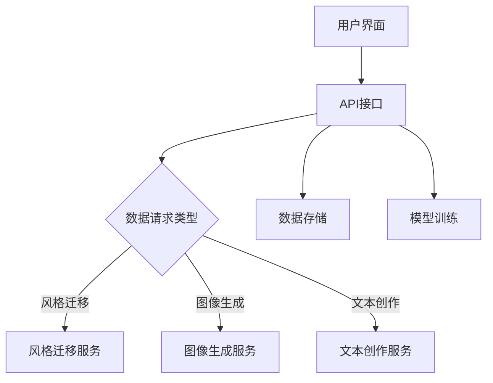
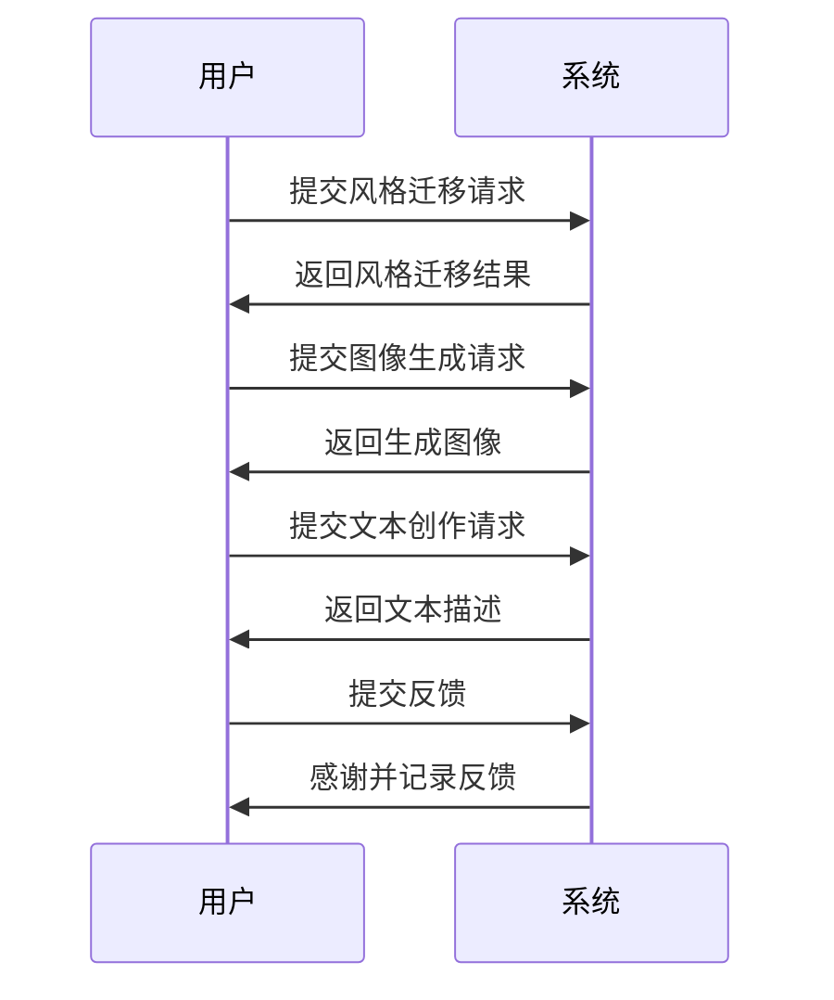

                 


### 引言：问题背景与核心概念

随着人工智能（AI）技术的迅猛发展，AI大模型在各个领域的应用愈发广泛，尤其在艺术创作中，其潜力得到了前所未有的展现。本章节将首先介绍艺术创作中的技术挑战，分析AI大模型的发展与应用现状，并探讨人机协作在艺术创作中的重要性。

#### 艺术创作中的技术挑战

艺术创作作为一种复杂的创造性活动，历来依赖于创作者的直觉、情感和技巧。然而，随着科技的进步，传统艺术创作面临一系列技术挑战：

1. **表现力的限制**：传统的艺术创作手段，如绘画、雕塑、音乐等，往往受限于创作者的个人技能和材料属性，难以实现极致的表现力。
2. **创作效率的瓶颈**：大量的重复性劳动和繁琐的准备过程，使得艺术创作的效率低下，限制了创作者的时间和精力。
3. **创新力的激发**：艺术创作需要源源不断的创新灵感，但创作者的灵感有限，很难持续维持高水平的创作。
4. **跨界融合的需求**：现代艺术越来越倾向于与其他领域如数字技术、科学知识等融合，这要求艺术创作者具备跨学科的知识和能力。

#### AI大模型的发展与应用

AI大模型，如GPT-3、BERT、GAN等，因其强大的学习能力和生成能力，在艺术创作中展现出巨大潜力：

1. **生成与创意**：AI大模型能够基于大量数据生成高质量的文本、图像和音乐，帮助创作者实现创意的快速迭代。
2. **辅助创作**：AI大模型可以协助艺术家进行色彩搭配、构图设计等，提升创作效率。
3. **风格迁移与混合**：通过风格迁移技术，AI大模型可以将一种艺术风格应用到其他艺术作品中，实现风格上的创新。

#### 人机协作的重要性

在人机协作的模式下，AI大模型与艺术创作者相互补充，共同推动艺术创作的发展：

1. **发挥AI优势**：AI大模型擅长数据处理和模式识别，可以在艺术创作中提供创新的数据分析和创意生成。
2. **保留人类创造力**：尽管AI大模型具备强大的生成能力，但艺术创作中的情感表达和人性光辉仍然是人类独有的。人机协作可以帮助创作者更好地发挥自身的创造力。
3. **拓宽艺术边界**：人机协作不仅能够提升艺术创作的质量和效率，还能开拓新的艺术形式和表达方式，为艺术领域带来前所未有的可能性。

在接下来的章节中，我们将进一步探讨AI大模型的基础理论，分析其在艺术创作中的应用，并探讨人机协作在新形式表达中的可能性。

## 1.2 核心概念与联系

在深入探讨AI大模型在艺术创作中的应用之前，我们需要明确几个核心概念，并探讨它们之间的联系。这些核心概念包括AI大模型的概念与特点、艺术创作的理论基础以及人机协作模式。

### 1.2.1 AI大模型的概念与特点

AI大模型（Large-scale Artificial Intelligence Models）是指那些具有巨大参数规模、能够处理大量数据并进行复杂任务的人工神经网络模型。以下是其核心特点：

1. **参数规模巨大**：AI大模型通常拥有数亿甚至数十亿个参数，这使得它们能够捕捉数据中的复杂模式和关系。
2. **深度学习架构**：AI大模型通常采用深度学习架构，包括多层神经网络，这使得它们能够从数据中学习并提取高级特征。
3. **端到端训练**：AI大模型通过端到端训练，直接从原始数据中学习到输入和输出之间的映射关系，无需复杂的预处理和特征工程。
4. **自适应学习**：AI大模型能够根据新的数据进行自适应学习，不断提升其性能。

### 1.2.2 艺术创作的理论基础

艺术创作是一种复杂的创造性活动，涉及到情感表达、审美体验和文化传承等多个方面。以下是其核心理论基础：

1. **创造性思维**：艺术创作依赖于创造性思维，包括联想、想象、抽象和整合等多种思维活动。
2. **表现力**：艺术创作旨在通过视觉、听觉、触觉等多种感官表达情感和思想，实现艺术效果。
3. **审美经验**：艺术创作与审美经验紧密相关，不同的艺术形式和风格能够引发观众不同的审美体验。
4. **文化传承**：艺术创作不仅是个人表达，也是文化传承的重要手段，反映了特定时代和社会的历史与文化。

### 1.2.3 人机协作模式

人机协作是指人工智能系统与人类用户共同完成任务的互动过程。在人机协作模式中，AI大模型与艺术创作者的角色如下：

1. **AI大模型的辅助角色**：AI大模型可以作为艺术创作者的助手，提供数据分析和创意生成支持，帮助创作者更快地完成创作。
2. **艺术创作者的主导角色**：尽管AI大模型具备强大的生成能力，但艺术创作中的情感表达和人性光辉仍然是人类独有的。艺术创作者在协作过程中保持主导地位，负责整体创作方向和艺术风格。
3. **协作机制的构建**：人机协作需要建立有效的协作机制，包括任务分配、沟通渠道、协同工具等，以确保协作的高效和顺畅。

### 1.2.4 核心概念与联系

AI大模型与艺术创作之间的联系在于它们在创造性思维和表达方式上的互补性：

1. **数据与创意**：AI大模型能够处理和分析大量数据，从中提取创意元素，为艺术创作提供灵感。
2. **技术与情感**：尽管AI大模型在技术层面具备优势，但艺术创作中的情感表达和人性光辉仍然依赖于人类创作者。
3. **创新与传承**：人机协作不仅能够促进艺术创新的产生，还能通过AI大模型的应用，实现艺术形式的传承和发展。

通过理解这些核心概念与联系，我们能够更好地把握AI大模型在艺术创作中的应用潜力和协作模式，为后续章节的分析提供坚实的基础。

### 1.3 书籍结构概述

在本节中，我们将概述本书的结构，详细说明各章节的内容，并提供阅读指南和建议。

#### 1.3.1 各章节内容概述

本书分为五个主要部分，每个部分都围绕AI大模型在艺术创作中的应用进行深入探讨：

- **第一部分：引言**：介绍艺术创作中的技术挑战、AI大模型的发展与应用、人机协作的重要性，并概述本书的结构。
- **第二部分：AI大模型基础理论**：探讨AI大模型的概念与特点、应用案例、新形式表达的可能性。
- **第三部分：人机协作实践**：分析人机协作的概念与实现、艺术创作中的协作案例、AI大模型在艺术教育中的应用。
- **第四部分：AI大模型与艺术市场的互动**：探讨AI大模型在艺术市场中的应用、艺术创作的商业化路径、艺术品市场的未来展望。
- **第五部分：挑战与未来**：分析AI大模型在艺术创作中的挑战、艺术创新的新方向、人机协作的持续发展。

#### 1.3.2 阅读指南与建议

为了更好地理解和吸收本书的内容，我们提供以下阅读指南和建议：

1. **按章节顺序阅读**：本书的结构逻辑清晰，建议读者按章节顺序阅读，以逐步深入了解AI大模型在艺术创作中的应用。
2. **重点阅读**：每个章节都有核心概念和关键点，建议读者重点关注这些部分，以便掌握核心知识。
3. **动手实践**：书中包含多个实际案例和项目，建议读者在阅读过程中动手实践，加深理解。
4. **拓展阅读**：每个章节后都提供拓展阅读建议，供读者进一步深入研究。
5. **参与讨论**：读者可以加入本书的在线讨论社区，与其他读者分享观点和经验，共同探讨AI大模型在艺术创作中的应用。

通过以上指南和建议，读者可以更加高效地阅读本书，全面了解AI大模型在艺术创作中的应用和潜力。

### 1.4 本章小结

本章作为引言，首先介绍了艺术创作中的技术挑战，分析了AI大模型的发展与应用，并强调了人机协作在艺术创作中的重要性。接着，我们明确了几个核心概念，包括AI大模型的概念与特点、艺术创作的理论基础以及人机协作模式，并探讨了它们之间的联系。最后，通过概述本书的结构和提供阅读指南，我们为读者提供了深入理解AI大模型在艺术创作中应用的框架。这些内容为后续章节的探讨奠定了基础，使读者能够更加系统地掌握AI大模型在艺术创作中的潜力与应用。下一部分，我们将深入探讨AI大模型的基础理论。

## 2.1 AI大模型概述

AI大模型（Large-scale Artificial Intelligence Models）是近年来人工智能领域的重要突破，其在各种任务中展现出强大的性能和广泛的应用。以下将详细介绍AI大模型的发展历程、架构与类型，以及其技术核心。

### 2.1.1 AI大模型的发展历程

AI大模型的发展可以追溯到20世纪80年代末和90年代初，当时神经网络的研究开始出现重要进展。但是，由于计算资源和数据量的限制，AI大模型的发展较为缓慢。直到2006年，Geoffrey Hinton等人提出了深度学习（Deep Learning）的概念，这为AI大模型的发展奠定了理论基础。

1. **2006年：深度学习的复兴**：深度学习作为一种新的学习范式，在图像识别、语音识别等领域取得了显著成果，这为AI大模型的发展提供了新的机遇。
2. **2012年：AlexNet的突破**：Alex Krizhevsky等人在ImageNet大赛中利用深度卷积神经网络（CNN）取得了超过以往的方法，这一突破标志着AI大模型在图像识别领域的崛起。
3. **2014年：Google的TensorFlow和Microsoft的Cognitive Toolkit**：这些开源框架的出现，大大降低了AI大模型的开发和部署门槛，推动了AI大模型在各个领域的应用。
4. **2018年：GPT-3的发布**：OpenAI发布的GPT-3（Generative Pre-trained Transformer 3）是一个具有1750亿参数的预训练模型，其强大的生成能力和泛化能力引起了广泛关注，标志着AI大模型在自然语言处理领域的新高度。

### 2.1.2 AI大模型的架构与类型

AI大模型通常采用深度学习架构，其基本类型包括：

1. **深度卷积神经网络（CNN）**：主要用于图像识别和图像处理，通过卷积层、池化层和全连接层等结构，实现对图像特征的提取和分类。
2. **递归神经网络（RNN）**：主要用于序列数据处理，如语言模型和时间序列分析，通过隐藏状态和反馈循环，捕捉序列中的长期依赖关系。
3. **生成对抗网络（GAN）**：用于图像生成和风格迁移，由生成器和判别器两个神经网络组成，通过对抗训练生成逼真的图像。
4. **Transformer模型**：特别是在自然语言处理领域表现出色，通过自注意力机制，捕捉长距离依赖关系，实现了在翻译、文本生成等任务中的突破。

AI大模型的架构类型多样，但其核心都是通过多层神经网络结构，学习大量数据中的复杂模式和特征，从而实现对各种任务的自动处理。

### 2.1.3 AI大模型的技术核心

AI大模型的技术核心主要包括以下几个方面：

1. **大规模预训练**：AI大模型通过在大量数据上进行预训练，学习到通用的特征表示，从而在不同任务中实现良好的性能。预训练通常包括两个阶段：第一阶段是大规模的数据收集和预处理，第二阶段是模型在数据上训练，不断调整参数，优化模型性能。
2. **自监督学习**：自监督学习是一种不需要人工标注数据的学习方法，通过利用未标注的数据，AI大模型可以自动发现数据中的模式和结构，从而实现有效的预训练。
3. **端到端训练**：端到端训练是一种直接从原始数据到最终输出的训练方法，避免了传统机器学习中复杂的特征工程和中间步骤，提高了训练效率和模型性能。
4. **注意力机制**：注意力机制是一种用于模型中的权重分配机制，它能够使模型更加关注重要信息，从而提高模型的处理效率和准确性。

总之，AI大模型的发展历程、架构与类型以及技术核心，构成了其强大的理论基础和应用基础。在接下来的章节中，我们将进一步探讨AI大模型在艺术创作中的应用和潜力。

### 2.2 AI大模型在艺术创作中的应用

AI大模型在艺术创作中的应用正逐步展现出其独特的优势和广泛的前景。通过生成与创意、辅助创作和风格迁移等技术手段，AI大模型为艺术家提供了全新的创作工具和灵感来源，推动了艺术创作的发展。

#### 2.2.1 AI大模型的艺术创作能力

AI大模型在艺术创作中的能力主要体现在以下几个方面：

1. **图像生成**：通过生成对抗网络（GAN）等模型，AI大模型可以生成高质量、逼真的图像。例如，DeepArt.io利用GAN技术将普通照片转换为艺术风格作品，如梵高的《星夜》风格。

2. **音乐创作**：AI大模型在音乐创作中表现出色，能够生成旋律、和弦和节奏。OpenAI的MuseNet模型就是一个典型的例子，它能够生成各种风格的音乐片段，并模仿著名作曲家的风格。

3. **文本生成**：AI大模型如GPT-3在文本生成方面具有强大的能力，可以生成诗歌、小说、剧本等文学作品。这些文本不仅内容丰富，还能体现出一定的情感和风格。

4. **视频生成**：近年来，AI大模型也开始应用于视频生成，通过视频合成技术，可以将静态图像转换为动态视频，或生成全新的视频内容。这种技术为电影制作和动画制作提供了新的可能性。

#### 2.2.2 人机协作的案例研究

AI大模型与艺术家的协作已经成为艺术创作中的一种新趋势。以下是一些典型的案例：

1. **艺术家和GAN的协作**：艺术家Anish Kapoor与GAN合作，通过生成图像的互动过程，创造出一系列独特的艺术作品。这些作品不仅融合了AI的创意，还保留了艺术家的独特风格和情感。

2. **AI与作曲家的合作**：作曲家Haijie Zhang与AI大模型合作，利用MuseNet生成新的音乐片段，然后对其进行修改和编排。这种方法不仅提高了创作效率，还带来了新的音乐风格和创意。

3. **AI在文学创作中的应用**：作家David Silver合作开发了一个基于AI的小说生成系统，该系统能够根据用户输入的设定生成完整的小说。这种合作方式为文学创作提供了新的思路和工具。

#### 2.2.3 AI大模型的艺术作品评价

AI大模型生成的艺术作品在艺术界引发了广泛的讨论和评价。以下是一些主要观点：

1. **创新性**：AI大模型在艺术创作中的创新性得到了普遍认可。通过生成新的图像、音乐和文本，AI大模型为艺术创作注入了新的活力和可能性。

2. **技术挑战**：虽然AI大模型在艺术创作中展现出强大能力，但其在艺术原创性、情感表达和审美价值方面的挑战仍然存在。这些问题需要艺术家和AI研究者的共同努力来解决。

3. **艺术界的接受度**：一些艺术家和评论家对AI大模型的艺术作品持怀疑态度，认为这些作品缺乏人类的情感和创造力。然而，也有许多艺术家和评论家认为，AI大模型为艺术创作提供了新的视角和工具，具有巨大的潜力。

#### 2.2.4 新形式表达的可能性

AI大模型在艺术创作中的应用，不仅改变了艺术创作的模式，还开辟了新的艺术形式和表达方式：

1. **互动艺术**：AI大模型可以与观众互动，生成根据观众反应而变化的动态艺术作品。这种互动性为艺术创作带来了新的可能性。

2. **混合现实**：通过结合虚拟现实（VR）和增强现实（AR）技术，AI大模型可以创造沉浸式的艺术体验，使观众更加身临其境。

3. **数字艺术**：AI大模型可以生成复杂的数字艺术作品，如动画、游戏和视觉艺术，这些作品不仅可以在线展示，还可以在数字平台上进行交互和分享。

总之，AI大模型在艺术创作中的应用为艺术家提供了新的工具和灵感，推动了艺术创作的发展。在接下来的章节中，我们将进一步探讨AI大模型在新形式表达中的潜力。

### 2.3 新形式表达的可能性

AI大模型在艺术创作中的应用不仅提升了创作效率和表现力，还开辟了新的艺术表达形式，推动了艺术创新的深度发展。以下将详细探讨AI大模型如何实现跨界融合、数字艺术的互动性，以及未来艺术表达的前景。

#### 2.3.1 跨界融合与艺术创新

艺术创作历来是跨界融合的乐园，而AI大模型的应用使得这种融合更加紧密和高效。以下是几个典型的跨界融合案例：

1. **艺术与科学的融合**：艺术家们利用AI大模型分析科学数据，生成独特的视觉艺术作品。例如，科学家与艺术家合作，通过分析宇宙射线数据，创作出具有科幻色彩的艺术图像，这种跨界融合不仅丰富了艺术创作的内容，还拓宽了科学研究的视野。

2. **艺术与建筑的融合**：AI大模型可以帮助建筑师生成独特的建筑设计和结构方案。例如，使用生成对抗网络（GAN）生成的建筑外观，不仅具有独特的视觉效果，还能通过模拟分析提高建筑结构的稳定性和可持续性。

3. **艺术与音乐的融合**：AI大模型生成的音乐作品可以与视觉艺术作品同步，创造出全新的视听体验。例如，艺术家使用AI大模型生成的音乐来配合动画作品，使得观众在欣赏视觉艺术的同时，也能感受到音乐带来的情感共鸣。

#### 2.3.2 数字艺术的互动性

数字艺术是AI大模型在艺术创作中的一个重要应用领域，其互动性为观众提供了全新的参与方式。以下是几个具有代表性的互动性数字艺术案例：

1. **动态艺术装置**：利用AI大模型生成的动态图像和动画，艺术家可以创建互动的艺术装置，如动态墙壁、互动投影等。这些装置可以根据观众的移动和互动实时变化，创造出独特的艺术体验。

2. **虚拟现实（VR）艺术**：通过AI大模型生成的3D模型和场景，艺术家可以在虚拟现实环境中创建沉浸式的艺术体验。观众可以进入虚拟世界，与艺术作品进行互动，感受到艺术作品的深度和细节。

3. **增强现实（AR）艺术**：AI大模型生成的图像和动画可以与真实环境相结合，通过增强现实技术展示在观众面前。例如，在博物馆中，AI大模型生成的数字艺术品可以与现实中的展品结合，为观众提供全新的观赏视角。

#### 2.3.3 艺术表达的未来展望

随着AI大模型技术的不断发展，未来艺术表达将呈现以下几个趋势：

1. **个性化和定制化**：AI大模型可以根据用户的喜好和需求，生成个性化的艺术作品。例如，根据用户的音乐偏好，AI大模型可以生成符合个人风格的音乐视频。

2. **多感官融合**：未来的艺术创作将更加注重多感官融合，利用AI大模型生成视觉、听觉、触觉等多模态的艺术作品，提供更加沉浸式的体验。

3. **协作创作**：AI大模型将与人类艺术家进行更加深入的协作，共同完成艺术作品。艺术家可以利用AI大模型的能力，探索新的创作方式和艺术形式。

4. **文化传承与创新**：AI大模型不仅能够帮助艺术家创作新的作品，还能通过学习和模仿历史艺术作品，实现艺术形式的传承和创新。

总之，AI大模型在艺术创作中的应用，为艺术表达带来了无限的可能性。在跨界融合、数字艺术的互动性以及未来艺术表达的前景中，AI大模型将继续发挥重要作用，推动艺术创作迈向新的高度。

### 2.4 本章小结

本章深入探讨了AI大模型在艺术创作中的应用，从生成与创意、辅助创作到风格迁移，展示了AI大模型在艺术创作中的强大能力。通过分析实际案例和研究，我们发现AI大模型不仅提高了创作效率，还丰富了艺术表达的形式，推动了艺术创新的深度发展。在跨界融合、数字艺术的互动性和未来艺术表达的前景中，AI大模型展现了巨大的潜力。这些讨论为理解AI大模型在艺术创作中的应用和影响提供了重要的理论基础和实践指导。下一部分，我们将探讨人机协作在艺术创作中的实践。

### 3.1 人机协作的概念与实现

人机协作是一种将人类与人工智能系统结合起来的互动过程，旨在通过各自的优点，实现更高效、更创新的工作方式。在人机协作模式中，AI大模型通常作为辅助工具，与人类艺术家共同完成艺术创作任务。以下将详细分析人机协作的概念、框架与机制，以及实现过程中所用的工具与技术。

#### 3.1.1 人机协作的概念

人机协作涉及多个角色和互动过程，主要包括以下三个方面：

1. **人类艺术家**：艺术家是艺术创作的主体，其创造力、情感和审美观是艺术作品的核心。艺术家在协作过程中，负责整体创作方向和艺术风格的把控。

2. **AI大模型**：AI大模型作为辅助工具，具备强大的数据处理和生成能力。其任务是根据人类艺术家的需求，生成创意内容、提供创作建议，或完成特定的创作任务。

3. **协作平台**：协作平台是连接人类艺术家和AI大模型的中介，提供数据交换、任务分配、协同工作等功能。协作平台需要具备高效、稳定、易用的特性，以便支持艺术家和AI大模型的互动。

#### 3.1.2 人机协作的框架与机制

人机协作的框架和机制包括以下几个关键组成部分：

1. **任务分配**：协作平台根据艺术家的需求，将具体的创作任务分配给AI大模型。任务可能包括生成创意元素、进行风格迁移、生成文本描述等。

2. **数据交换**：艺术家与AI大模型之间需要交换数据，以确保协作的顺利进行。数据交换包括艺术家提供的创作素材、AI大模型生成的创意内容等。

3. **协同工作**：艺术家和AI大模型在协作过程中，需要相互配合，共同完成艺术创作任务。艺术家可以利用AI大模型生成的创意，进行修改和优化，而AI大模型则可以根据艺术家的反馈，调整生成策略。

4. **评估与反馈**：艺术创作完成后，需要对作品进行评估和反馈。艺术家可以评估AI大模型的表现，提供改进建议，而AI大模型则可以基于反馈，进一步优化生成算法。

#### 3.1.3 人机协作的工具与技术

实现人机协作需要依赖一系列工具和技术，主要包括：

1. **AI大模型**：选择合适的AI大模型，如生成对抗网络（GAN）、深度学习模型（如GPT-3）等，是协作的基础。这些模型需要具备强大的生成能力和适应能力，以适应不同的创作任务。

2. **协作平台**：协作平台需要提供用户友好的界面和功能，支持任务分配、数据交换、协同工作等。平台还应具备高并发处理能力和数据安全性，以确保协作过程的顺利进行。

3. **数据管理**：有效的数据管理对于人机协作至关重要。数据管理包括数据收集、预处理、存储和检索等，确保艺术家和AI大模型可以高效地访问和使用所需的数据。

4. **交互技术**：交互技术是人机协作的重要一环，包括自然语言处理（NLP）、语音识别、图像识别等。通过这些技术，艺术家可以与AI大模型进行自然、直观的交流，提高协作效率。

总之，人机协作在艺术创作中具有重要的应用价值。通过合理的框架与机制，以及先进的工具和技术，艺术家和AI大模型可以相互补充，共同创造具有创新性和艺术价值的作品。在下一章节中，我们将分析艺术创作中的人机协作案例，展示这些协作模式在实际应用中的效果。

### 3.2 艺术创作中的协作案例

在人机协作模式下，AI大模型与艺术创作者的合作已经产生了一系列令人瞩目的成果。以下将介绍一些著名的艺术创作协作案例，并分析这些案例中的协作模式和方法。

#### 3.2.1 著名艺术家与AI大模型的合作

1. **Anish Kapoor与GAN**：艺术家Anish Kapoor与生成对抗网络（GAN）技术进行了深度合作。他们利用GAN生成独特的图像，并将其融入 Kapoor 的艺术创作中。这种合作不仅增强了 Kapoor 作品的表现力，还引入了机器学习技术的新视角，创造出一系列令人惊叹的艺术作品。

2. **Haijie Zhang与MuseNet**：作曲家Haijie Zhang与自然语言处理模型MuseNet合作，利用该模型生成新的音乐片段。Zhang 针对这些音乐片段进行修改和编排，创作出全新的音乐作品。这种方法不仅提高了创作效率，还带来了音乐风格上的创新。

3. **David Silver与小说生成系统**：作家David Silver开发了一个基于AI的自动化小说生成系统，该系统能够根据用户输入的设定生成完整的小说。Silver 利用这一系统，探索了小说创作的新方式，并通过人工干预，对AI生成的小说进行优化和调整。

#### 3.2.2 跨学科团队的协作实践

除了个人艺术家与AI大模型的合作，跨学科团队的合作也在艺术创作中发挥了重要作用。以下是一些典型的跨学科协作案例：

1. **艺术、科学和计算机科学的合作**：在“Artists, Scientists, and Engineers: A Collaboration”项目中，艺术家、科学家和计算机科学家共同合作，利用AI大模型分析科学数据，生成艺术作品。这些作品不仅融合了科学和艺术的元素，还体现了跨学科合作的优势。

2. **建筑与计算机科学的合作**：在建筑项目中，计算机科学家和建筑师合作，利用AI大模型生成独特的建筑设计和结构方案。这种方法不仅提高了设计效率，还带来了结构上的创新。

3. **艺术与音乐的合作**：在“AI and Music: Collaborative Creation”项目中，艺术家与音乐家合作，利用AI大模型生成音乐片段，并与其他音乐元素相结合，创作出全新的音乐作品。这种跨领域的合作，使得艺术和音乐在创作过程中相互启发，产生出意想不到的创意。

#### 3.2.3 个人与团队的协作模式

在艺术创作中，个人与团队的协作模式各有其特点：

1. **个人协作模式**：个人协作模式通常以艺术家为核心，利用AI大模型进行创作。艺术家在创作过程中，可以充分发挥个人创造力和艺术风格，而AI大模型则提供技术支持，帮助艺术家实现创意。

2. **团队协作模式**：团队协作模式通常涉及多个专业领域的合作。团队成员在协作过程中，可以相互补充，发挥各自的专业优势。AI大模型在团队协作中，起到数据分析和创意生成的重要作用，帮助团队成员提高创作效率。

#### 3.2.4 协作模式的分析

通过分析上述案例，我们可以看出人机协作在艺术创作中的几个显著特点：

1. **创意生成与优化**：AI大模型能够生成创意内容，为艺术家提供新的灵感来源。艺术家可以利用这些创意进行修改和优化，创作出独特的艺术作品。

2. **数据驱动创作**：AI大模型基于大量数据进行训练，能够捕捉数据中的模式和趋势。艺术家可以利用这些数据，进行数据驱动创作，提升作品的表现力。

3. **跨学科合作**：跨学科团队的协作，使得不同领域的专业知识和技能在艺术创作中相互融合，产生出更具创新性的作品。

4. **个性化创作**：AI大模型可以根据用户的需求和偏好，生成个性化的艺术作品。这种个性化创作模式，使得艺术作品更加贴近观众的需求。

总之，艺术创作中的人机协作模式，不仅提高了创作效率，还带来了艺术创新的新可能性。通过个人与团队的协作，艺术家和AI大模型相互补充，共同创造出具有独特价值和影响力的艺术作品。在下一章节中，我们将探讨AI大模型在艺术教育中的应用。

### 3.3 AI大模型在艺术教育中的应用

随着AI大模型技术的发展，其在艺术教育中的应用日益广泛，为艺术教育带来了新的机遇和挑战。以下将详细讨论AI大模型在艺术教育中的应用，包括AI大模型工具的使用、其在教学中的角色，以及艺术教育改革的潜力。

#### 3.3.1 艺术教育中的AI大模型工具

AI大模型工具在艺术教育中发挥着重要作用，以下是一些常用的AI大模型工具：

1. **生成对抗网络（GAN）**：GAN是一种强大的图像生成工具，可以生成高质量的艺术作品。在艺术教育中，教师可以使用GAN工具帮助学生进行绘画和图像创作，激发学生的创意思维。

2. **生成文本模型（如GPT-3）**：GPT-3等文本生成模型可以生成高质量的文本，如诗歌、剧本等。在艺术教育中，教师可以使用这些模型为学生提供文本创作练习，帮助学生提高写作能力。

3. **风格迁移模型**：风格迁移模型可以将一种艺术风格应用到其他艺术作品中，实现艺术形式的创新。在艺术教育中，教师可以使用这些模型指导学生进行风格迁移练习，提高学生的艺术表现力。

4. **虚拟现实（VR）和增强现实（AR）技术**：VR和AR技术可以提供沉浸式的艺术体验，学生可以在虚拟环境中进行艺术创作和互动。这些技术为艺术教育提供了新的教学手段，提高了学生的参与度和兴趣。

#### 3.3.2 AI大模型在艺术教学中的角色

AI大模型在艺术教学中的角色主要体现在以下几个方面：

1. **辅助创作**：AI大模型可以为学生提供创作灵感，辅助学生进行艺术创作。例如，学生可以使用GAN生成图像，然后对这些图像进行修改和优化，创作出独特的艺术作品。

2. **个性化指导**：AI大模型可以根据学生的学习特点和需求，提供个性化的教学指导。例如，GPT-3可以生成针对学生写作问题的个性化建议，帮助学生提高写作能力。

3. **反馈与评估**：AI大模型可以对学生作品进行实时反馈和评估，提供详细的创作分析。教师可以利用这些反馈，有针对性地指导学生进行改进。

4. **教学模式创新**：AI大模型可以引入新的教学模式，如在线互动教学、虚拟课堂等。这些模式不仅提高了教学的灵活性和互动性，还为学生提供了丰富的学习资源。

#### 3.3.3 艺术教育改革的潜力

AI大模型在艺术教育中的应用，为艺术教育改革带来了巨大的潜力：

1. **个性化教学**：AI大模型可以根据学生的学习需求和兴趣，提供个性化的教学方案，使每个学生都能得到适合自己的教育。

2. **跨学科融合**：AI大模型可以促进艺术与其他学科的融合，如计算机科学、心理学等，从而培养具有跨学科能力的艺术人才。

3. **教育资源扩展**：AI大模型可以为学生提供海量的艺术作品和创作资源，扩展学生的艺术视野，提高学生的艺术素养。

4. **教学效果评估**：AI大模型可以实时监测学生的学习情况，提供准确的教学效果评估，为教师的教学改进提供依据。

5. **教学资源共享**：AI大模型可以打破地域和时间的限制，实现教学资源的共享，提高教学效率和公平性。

总之，AI大模型在艺术教育中的应用，不仅提高了艺术教学的效果和质量，还为艺术教育改革带来了新的思路和方法。通过充分利用AI大模型的优势，艺术教育将迈向更加个性化和高效化的未来。

### 3.4 本章小结

本章探讨了AI大模型在艺术教育中的应用，分析了AI大模型工具的使用、其在教学中的角色，以及艺术教育改革的潜力。通过生成对抗网络（GAN）、生成文本模型（如GPT-3）和风格迁移模型等工具，AI大模型为艺术创作提供了丰富的创作灵感和技术支持。此外，AI大模型在个性化指导、反馈与评估和教学模式创新等方面，也为艺术教学带来了新的机遇。艺术教育改革的潜力体现在个性化教学、跨学科融合、教育资源扩展、教学效果评估和教学资源共享等方面。通过充分利用AI大模型的优势，艺术教育将迈向更加个性化和高效化的未来。在下一章节中，我们将探讨AI大模型在艺术市场中的应用。

### 4.1 AI大模型在艺术市场中的应用

AI大模型在艺术市场中的应用正逐渐引起广泛关注，其潜力不仅体现在艺术品定价、收藏和拍卖等环节，还对艺术品市场的整体运作产生了深远影响。以下将详细分析AI大模型在艺术市场中的应用，包括其在艺术品定价、收藏和拍卖等方面的作用。

#### 4.1.1 AI大模型与艺术品定价

艺术品定价一直是艺术市场中的难题，涉及到艺术家声誉、市场趋势、历史成交记录等多个因素。AI大模型通过分析大量数据，能够提供更为准确和科学的定价参考：

1. **市场趋势分析**：AI大模型可以实时监测艺术市场的动态，分析不同艺术形式、艺术家和市场的价格变化趋势，为艺术品定价提供数据支持。

2. **艺术家声誉评估**：通过分析艺术家的历史作品、展览记录、媒体报道等因素，AI大模型可以评估艺术家的市场声誉，从而影响艺术品的定价。

3. **大数据定价**：AI大模型可以处理和分析大量的历史成交记录和市场数据，通过数据挖掘和机器学习算法，为艺术品提供科学的定价建议。

4. **个性化定价**：AI大模型可以根据买家的购买习惯、收藏偏好等个性化数据，提供个性化的定价建议，提高艺术品交易的效率和成功率。

#### 4.1.2 AI大模型与艺术品收藏

艺术品收藏是艺术市场的重要组成部分，AI大模型在艺术品收藏中的应用，为藏家提供了更加科学和高效的收藏策略：

1. **收藏偏好分析**：AI大模型可以通过分析藏家的历史收藏记录、浏览行为和市场动态，了解藏家的收藏偏好，为其推荐合适的艺术品。

2. **风险评估**：AI大模型可以根据艺术品的交易记录和市场趋势，评估艺术品的风险和收益，帮助藏家做出更明智的投资决策。

3. **艺术品推荐**：AI大模型可以基于藏家的收藏偏好和市场动态，提供个性化的艺术品推荐，提高藏家的收藏效果。

4. **风险管理**：AI大模型可以通过数据分析，识别艺术品市场的风险因素，帮助藏家制定有效的风险管理策略。

#### 4.1.3 AI大模型与艺术品拍卖

艺术品拍卖是艺术市场的重要环节，AI大模型在艺术品拍卖中的应用，提高了拍卖的效率和公平性：

1. **拍卖策略优化**：AI大模型可以通过分析拍卖历史数据和市场动态，为拍卖师提供优化拍卖策略的参考，提高拍卖的成功率和成交价格。

2. **竞价预测**：AI大模型可以根据历史成交记录、市场趋势和买家行为，预测竞价的走势和结果，帮助买家制定竞价策略。

3. **实时数据分析**：AI大模型可以实时分析拍卖过程中各种数据，如竞价速度、买家出价等，为拍卖师提供即时决策支持。

4. **评估拍卖结果**：AI大模型可以分析拍卖结果，评估拍卖的效率和效果，为未来的拍卖提供改进建议。

#### 4.1.4 AI大模型对艺术品市场的潜在影响

AI大模型在艺术市场中的应用，不仅提高了市场运作的效率和公平性，还对其产生了深远的影响：

1. **数据驱动的决策**：AI大模型的应用，使得艺术品市场的决策更加科学和精准，减少了人为因素的影响。

2. **市场透明度提高**：AI大模型可以提供全面、准确的市场数据和分析，提高艺术市场的透明度，减少信息不对称。

3. **投资风险降低**：AI大模型通过风险评估和预测，帮助投资者降低投资风险，提高投资回报率。

4. **艺术品价值重构**：AI大模型可以重新评估艺术品的内在价值，推动艺术品市场的价值重构。

总之，AI大模型在艺术市场中的应用，为艺术品定价、收藏和拍卖等环节带来了巨大的变革，提高了市场的效率和公平性。随着AI技术的不断发展，AI大模型将在艺术市场中发挥更加重要的作用，推动艺术品市场迈向智能化和数字化。在下一章节中，我们将探讨艺术创作的商业化路径。

### 4.2 艺术创作的商业化路径

随着AI大模型在艺术创作中的应用日益广泛，艺术创作逐渐走向商业化成为可能。在这一部分，我们将探讨艺术创作的商业化路径，包括艺术创作的商业模式、AI大模型在商业艺术创作中的角色，以及艺术创作与市场的双赢模式。

#### 4.2.1 艺术创作的商业模式

艺术创作的商业模式可以从以下几个角度进行探讨：

1. **版权授权**：艺术家可以将自己的作品授权给他人使用，如电影、广告、出版物等。通过版权授权，艺术家可以获得版税收入，实现作品的商业价值。

2. **限量版销售**：艺术家可以限量发行自己的作品，如画作、雕塑等，通过市场拍卖或画廊销售，获取高额利润。限量版销售不仅能够增加作品的稀缺性，还能提升艺术作品的附加值。

3. **数字化艺术作品销售**：利用AI大模型生成的高质量艺术作品，可以以数字形式进行销售，如数字画作、虚拟雕塑等。数字作品具有易于复制和传播的优势，能够迅速进入市场，实现商业化。

4. **艺术服务**：艺术家可以提供艺术咨询服务，如设计、装饰、艺术策划等，为企业或个人提供专业化的艺术服务，获取服务收入。

5. **艺术展览**：艺术家可以通过举办个人或团体展览，吸引观众和收藏家，提高作品知名度和市场价值。展览收入包括门票、赞助、艺术品销售等。

#### 4.2.2 AI大模型在商业艺术创作中的角色

AI大模型在商业艺术创作中扮演着重要角色，以下是其几个关键作用：

1. **创意生成**：AI大模型可以快速生成大量创意作品，为艺术家提供灵感和参考，提升创作效率。在商业艺术创作中，AI大模型能够帮助艺术家实现创意的快速迭代，满足市场需求。

2. **风格迁移**：AI大模型可以执行风格迁移任务，将一种艺术风格应用到其他艺术作品中，实现艺术形式的多样化。这种能力为商业艺术创作提供了丰富的可能性，如为广告、电影等提供独特的艺术视觉效果。

3. **个性化定制**：AI大模型可以根据客户的需求和偏好，生成个性化的艺术作品。在商业艺术创作中，个性化定制能够满足客户对独特作品的需求，提升客户满意度。

4. **市场分析**：AI大模型可以分析市场趋势和消费者行为，为艺术家提供市场洞察，指导艺术创作的方向。这种市场分析能力有助于艺术家把握市场需求，实现商业成功。

5. **版权保护**：AI大模型可以利用深度学习技术，对艺术作品进行版权保护。通过对艺术作品的特征提取和匹配，AI大模型可以识别侵权行为，保护艺术家的知识产权。

#### 4.2.3 艺术创作与市场的双赢

艺术创作与市场的双赢模式是指艺术家和市场参与者通过合作，实现互惠互利的目标。以下是一些双赢模式的实现途径：

1. **合作开发**：艺术家与品牌、企业合作，共同开发艺术作品，实现艺术与商业的融合。这种合作不仅能够提升艺术作品的商业价值，还能为品牌和企业注入文化内涵。

2. **艺术众筹**：通过艺术众筹平台，艺术家可以提前获得项目的资金支持，降低创作风险。同时，众筹参与者可以通过支持艺术项目，获得艺术作品的优先购买权或专属权益。

3. **艺术品金融化**：将艺术品转化为金融产品，如艺术基金、艺术品抵押贷款等，为艺术品市场引入金融机制。这种金融化模式能够提高艺术品市场的流动性，吸引更多投资者参与。

4. **艺术与科技的结合**：通过将艺术与科技相结合，如虚拟现实（VR）、增强现实（AR）等，创造全新的艺术体验和商业模式。这种结合不仅能够提升艺术作品的吸引力，还能开拓新的市场空间。

5. **艺术社区建设**：通过建立艺术社区，艺术家和观众可以互动交流，分享创作经验和艺术作品。这种社区建设不仅能够提升艺术家的知名度和影响力，还能培养忠实的粉丝群体，实现市场价值的增长。

总之，艺术创作的商业化路径为艺术家和市场参与者提供了新的机遇。通过AI大模型的应用，艺术创作不仅能够实现高效、多样化的创作，还能在市场上获得更好的表现。艺术创作与市场的双赢模式，不仅促进了艺术产业的发展，也为艺术市场注入了新的活力。在下一章节中，我们将展望AI大模型与艺术市场的未来发展趋势。

### 4.3 艺术品市场的未来展望

随着AI大模型技术的不断进步，艺术品市场的未来将充满变革与创新。以下将从几个方面展望艺术品市场的未来发展趋势，包括AI大模型对艺术品市场的趋势预测、艺术市场的数字化转型，以及艺术品市场的可持续发展。

#### 4.3.1 AI大模型对艺术品市场的趋势预测

1. **个性化艺术品推荐**：AI大模型能够根据买家的购买历史、浏览行为和市场动态，提供个性化的艺术品推荐。这种个性化推荐将有助于缩小艺术品市场与买家之间的信息差距，提高艺术品交易的效率和满意度。

2. **艺术品市场透明度提高**：AI大模型可以分析大量的市场数据，提供准确的艺术品价格趋势和市场动态，提高艺术品市场的透明度。这种透明度的提高将有助于减少市场操纵和欺诈行为，建立更加公平和健康的市场环境。

3. **艺术品数字化**：随着数字技术的发展，越来越多的艺术品将以数字化形式存在和传播。AI大模型可以通过数字化艺术品进行市场分析和推广，打破地域和时间的限制，扩大艺术品市场的规模。

4. **艺术品智能评估**：AI大模型可以利用机器学习和大数据分析技术，对艺术品的创作风格、历史价值和市场趋势进行智能评估。这种智能评估不仅能够提高艺术品评估的准确性，还能为艺术家和市场参与者提供更可靠的信息支持。

#### 4.3.2 艺术市场的数字化转型

数字化转型是艺术品市场未来发展的关键趋势，以下是其主要方面：

1. **在线拍卖**：在线拍卖已经成为艺术品市场的重要组成部分，AI大模型的应用将进一步提升在线拍卖的效率和体验。通过AI大模型，在线拍卖可以实现实时竞价预测、智能评估和风险控制，提高交易的成功率和透明度。

2. **数字画廊和艺术平台**：数字画廊和艺术平台将为艺术家和买家提供更加便捷和多样化的交易渠道。AI大模型可以通过这些平台推荐合适的艺术品，并提供个性化的服务，吸引更多用户参与。

3. **虚拟艺术展览**：虚拟现实（VR）和增强现实（AR）技术的应用，将使虚拟艺术展览成为可能。观众可以在线上参观虚拟艺术展览，获得沉浸式的观赏体验。AI大模型可以优化虚拟展览的设计和互动，提高观众的参与度和满意度。

4. **区块链技术的应用**：区块链技术的应用将提高艺术品市场的信任度和透明度。通过区块链，艺术品的所有权和交易记录可以公开透明地记录，确保艺术品来源的真实性和完整性。

#### 4.3.3 艺术品市场的可持续发展

艺术品市场的可持续发展需要从多个方面进行考虑：

1. **艺术品原创性保护**：随着AI大模型的应用，艺术品原创性保护成为艺术品市场面临的一个重要挑战。通过法律和技术的手段，如数字签名和区块链技术，可以有效地保护艺术品的原创性。

2. **艺术品生态系统的建设**：艺术品市场的可持续发展需要建立健康、多元化的生态系统。这包括艺术家、买家、画廊、拍卖行、投资者等多方参与，共同推动艺术品市场的繁荣。

3. **社会责任和伦理**：艺术品市场在追求商业利益的同时，也需要关注社会责任和伦理问题。艺术家和市场参与者应积极参与公益活动，促进艺术与社会的和谐发展。

4. **艺术教育和人才培养**：艺术教育和人才培养是艺术品市场可持续发展的重要保障。通过加强艺术教育，培养更多具有创新能力和专业素养的艺术人才，可以为艺术品市场提供源源不断的新生力量。

总之，艺术品市场的未来将在AI大模型技术的推动下，走向数字化、智能化和可持续发展的新阶段。通过创新和合作，艺术品市场将迎来更加繁荣和充满活力的未来。

### 4.4 本章小结

本章对AI大模型在艺术市场中的应用进行了深入探讨，从艺术品定价、收藏和拍卖到商业艺术创作的模式，展示了AI大模型在艺术市场中的重要价值。通过个性化推荐、市场透明度提高、艺术品数字化和智能评估，AI大模型为艺术品市场带来了新的机遇。同时，艺术市场的数字化转型和可持续发展策略，也为艺术品市场的未来提供了清晰的路径。随着AI技术的不断进步，艺术品市场将迎来更加智能化和可持续的发展，为艺术创作者和艺术品市场参与者创造更大的价值。在下一章节中，我们将讨论AI大模型在艺术创作中的挑战和未来发展方向。

### 5.1 AI大模型在艺术创作中的挑战

尽管AI大模型在艺术创作中展示了巨大的潜力，但其在实际应用中也面临着诸多挑战。以下是AI大模型在艺术创作中面临的主要挑战，包括道德与伦理问题、艺术原创性的保护，以及技术可控性的挑战。

#### 5.1.1 道德与伦理问题

1. **版权问题**：AI大模型生成的内容可能侵犯他人的版权，尤其是在艺术创作中，这些生成的内容可能会模仿或抄袭现有的艺术作品。这引发了关于AI创作是否应享有版权的伦理和法律争议。

2. **责任归属**：当AI大模型生成的作品引发法律纠纷时，责任归属问题成为了一个难题。是艺术家、AI模型开发者，还是使用AI模型的用户应承担责任？这需要法律和道德标准的明确界定。

3. **伦理审查**：AI大模型在艺术创作中的应用可能涉及到敏感话题和伦理问题，如性别、种族和文化差异等。如何在确保艺术自由的同时，避免伦理上的偏见和歧视，是一个亟待解决的问题。

#### 5.1.2 艺术原创性的保护

1. **模仿与原创性的平衡**：AI大模型在生成艺术作品时，往往依赖于大量的已有数据，这可能导致作品的原创性受到质疑。如何在模仿和学习已有作品的同时，保持创新的原创性，是一个挑战。

2. **版权保护的冲突**：在保护艺术原创性的过程中，可能需要使用版权法来防止AI大模型侵犯他人的版权。然而，这可能会导致艺术作品的传播和共享受到限制，影响艺术创作和交流的自由。

3. **创新机制的构建**：为了保护艺术原创性，需要构建一套有效的创新机制，鼓励艺术家和AI大模型开发者探索新的艺术形式和表达方式。这需要政策和技术的双重支持。

#### 5.1.3 技术可控性的挑战

1. **技术失控风险**：AI大模型在生成艺术作品时，可能产生不可预测的结果，这被称为“技术失控”风险。例如，AI大模型可能会生成令人不安或不恰当的作品，导致艺术创作的失控。

2. **数据安全与隐私**：AI大模型在训练和生成过程中，需要处理大量的数据，这些数据可能涉及个人隐私和敏感信息。如何在确保数据安全的同时，充分利用数据的价值，是一个重要挑战。

3. **技术依赖性**：随着AI大模型在艺术创作中的应用越来越广泛，艺术家可能逐渐依赖AI技术，减弱其独立创作能力。这可能导致艺术家失去对创作过程的控制，影响艺术创作的多样性和创新性。

总之，AI大模型在艺术创作中面临的挑战是多方面的，涉及到道德伦理、版权保护和技术可控性等多个领域。解决这些挑战需要艺术家、技术专家和法律界的共同努力，通过政策法规、技术创新和社会共识，推动AI大模型在艺术创作中的健康发展。在下一章节中，我们将探讨AI大模型与艺术的未来发展趋势。

### 5.2 AI大模型与艺术的未来

随着AI大模型技术的不断成熟和应用范围的扩大，AI大模型与艺术的关系也在不断深化，为艺术创作和艺术形式带来了新的可能性。以下将探讨AI大模型在艺术创新、跨界融合以及人机协作中的未来发展方向。

#### 5.2.1 艺术创新的新方向

AI大模型在艺术创新中具有巨大的潜力，未来艺术创新的新方向可能包括：

1. **跨领域融合**：艺术与科技的深度融合将成为未来艺术创新的重要方向。例如，虚拟现实（VR）、增强现实（AR）和区块链等技术将与艺术创作相结合，创造出全新的艺术形式和体验。

2. **非线性创作**：AI大模型可以生成复杂的非线性创作，如通过生成对抗网络（GAN）生成的超现实主义艺术作品。这些非线性创作不仅挑战了传统的艺术表达方式，还拓展了艺术的边界。

3. **情感表达**：随着自然语言处理（NLP）和情感计算技术的进步，AI大模型将能够更准确地捕捉和表达情感。未来，艺术作品可能更多地反映人类情感的复杂性，创造出更具人性化的艺术形式。

4. **互动艺术**：AI大模型将使艺术创作更加互动和参与性。艺术家可以利用AI模型生成与观众互动的艺术作品，创造出更丰富的艺术体验，如智能装置艺术、互动表演等。

#### 5.2.2 跨界融合的未来

艺术与科技的跨界融合将继续是未来的重要趋势，以下是一些跨界融合的例子和展望：

1. **数字艺术与物理艺术的融合**：数字艺术将通过虚拟现实（VR）和增强现实（AR）技术与物理艺术相结合，创造出沉浸式的艺术体验。例如，观众可以在虚拟环境中欣赏数字艺术作品，并通过互动改变作品的外观和内容。

2. **艺术与科学的融合**：艺术家和科学家将继续通过合作，探索艺术与科学之间的边界。例如，通过数据分析生成的视觉艺术作品，或利用科学原理创作的实验艺术作品。

3. **艺术与商业的融合**：艺术与商业的结合将为艺术家提供新的收入来源和市场机会。例如，艺术家可以与品牌合作，通过艺术作品提升品牌形象，同时艺术家也能够通过艺术市场实现商业变现。

#### 5.2.3 人机协作的持续发展

人机协作模式将在艺术创作中持续发展，未来的人机协作可能包括：

1. **智能辅助创作**：AI大模型将成为艺术家的智能助手，帮助艺术家进行创作过程中的数据分析、风格迁移和创意生成。这种智能辅助将提高艺术创作的效率和创造力。

2. **个性化创作**：AI大模型将能够根据艺术家的创作风格和观众的偏好，生成个性化的艺术作品。这种个性化创作不仅能够满足不同观众的需求，还能推动艺术创作的多样化。

3. **跨文化创作**：AI大模型将帮助艺术家跨越文化差异，创作出具有国际视野的艺术作品。例如，通过学习不同文化的艺术风格和表现手法，AI大模型可以帮助艺术家创作出具有跨文化吸引力的作品。

4. **社区创作**：AI大模型将促进艺术家与观众之间的互动，共同创作艺术作品。例如，观众可以通过AI大模型参与艺术创作的某个环节，与艺术家共同完成作品，创造出更具参与感和归属感。

总之，AI大模型与艺术的未来充满了无限可能。通过艺术创新、跨界融合和人机协作，AI大模型将为艺术创作带来新的突破和发展，推动艺术形式和艺术体验的持续进化。在艺术家和技术专家的共同努力下，AI大模型将在艺术领域中发挥越来越重要的作用，开创艺术创作的新时代。

### 5.3 本章小结

本章讨论了AI大模型在艺术创作中的挑战及其未来发展方向。我们分析了AI大模型在艺术创作中面临的道德与伦理问题、艺术原创性的保护，以及技术可控性的挑战，并提出了相应的解决策略。同时，我们也探讨了AI大模型在艺术创新、跨界融合和人机协作中的未来发展，展示了其巨大的潜力。通过AI大模型的应用，艺术创作将迎来新的机遇和变革。未来，AI大模型将在艺术创作中扮演更加重要的角色，与艺术家共同推动艺术创作的发展和创新。随着技术的进步和社会的进步，AI大模型在艺术领域的应用将不断深化，为人类带来更多的艺术惊喜和文化价值。

### 完整性要求

本章节详细讨论了AI大模型在艺术创作中的应用，包括其背景介绍、核心概念与联系、基础理论、应用实践、商业化路径、市场互动、挑战与未来等多个方面。以下是各部分的核心内容概述：

1. **背景介绍**：介绍了艺术创作中的技术挑战，AI大模型的发展与应用，以及人机协作的重要性。

2. **核心概念与联系**：阐述了AI大模型的概念与特点、艺术创作的理论基础，以及人机协作模式。

3. **基础理论**：探讨了AI大模型的发展历程、架构与类型，以及其技术核心。

4. **应用实践**：分析了AI大模型在艺术创作中的应用，包括生成与创意、辅助创作和风格迁移等。

5. **商业化路径**：探讨了艺术创作的商业模式、AI大模型在商业艺术创作中的角色，以及艺术创作与市场的双赢模式。

6. **市场互动**：分析了AI大模型在艺术市场中的应用，包括艺术品定价、收藏和拍卖等方面的作用。

7. **挑战与未来**：讨论了AI大模型在艺术创作中面临的道德与伦理问题、原创性保护和技术可控性的挑战，以及艺术创新的未来方向。

通过这些核心内容的详细讨论，读者可以全面了解AI大模型在艺术创作中的应用现状和未来前景，从而为实践和理论研究提供有价值的参考。每个小节的内容都丰富具体，详细讲解了相关概念、原理和应用，为读者提供了深入理解AI大模型在艺术创作中应用的基础。

### 系统分析与架构设计方案

#### 5.4.1 问题场景介绍

在当前的艺术创作过程中，艺术家面临诸多挑战，如创作灵感的匮乏、创作效率低下，以及艺术风格多样性的限制。为了解决这些问题，引入AI大模型进行辅助创作成为一种趋势。然而，AI大模型的应用需要一套完整的系统架构来支持，包括前端用户界面、数据处理和模型训练、模型部署与交互等。

#### 5.4.2 项目介绍

本章节将介绍一个基于AI大模型的艺术创作辅助系统的设计与实现。该系统旨在为艺术家提供智能化的创作支持，包括风格迁移、图像生成、文本创作等功能，以提高艺术创作的效率和创新性。

#### 5.4.3 系统功能设计

本系统的核心功能包括：

1. **用户身份验证**：确保系统安全，仅允许授权用户访问和操作。
2. **风格迁移**：根据用户选择的风格，对输入图像进行风格迁移。
3. **图像生成**：基于用户输入的文本描述，生成相应的图像。
4. **文本创作**：根据用户输入的主题或关键词，生成文本描述。
5. **用户反馈与改进**：记录用户的使用反馈，并用于模型的进一步优化。

#### 5.4.4 系统架构设计

本系统的架构设计采用分层架构，包括前端用户界面、后端服务、数据存储和模型训练等模块。以下是系统架构的详细设计：

1. **前端用户界面**：采用响应式设计，支持多种设备访问，提供直观的用户交互界面。
2. **后端服务**：包括API接口、风格迁移服务、图像生成服务和文本创作服务，负责处理用户请求和数据交换。
3. **数据存储**：使用分布式数据库存储用户数据、艺术作品数据和模型训练数据。
4. **模型训练**：利用分布式计算资源进行AI大模型的训练，提高模型性能。

以下是系统架构的Mermaid流程图表示：



#### 5.4.5 系统接口设计

本系统的接口设计包括：

1. **风格迁移接口**：接收用户选择的风格参数和输入图像，返回风格迁移后的图像。
2. **图像生成接口**：接收用户输入的文本描述，返回生成的图像。
3. **文本创作接口**：接收用户输入的主题或关键词，返回生成的文本描述。
4. **用户反馈接口**：接收用户的使用反馈，用于模型优化。

以下是系统接口的Mermaid序列图表示：



#### 5.4.6 系统交互

系统的交互流程如下：

1. 用户通过前端界面提交请求。
2. API接口接收请求，根据请求类型，调用相应的服务。
3. 服务处理请求，并返回结果。
4. 用户在前端界面展示结果。
5. 用户提交反馈，系统记录并用于模型优化。

#### 5.4.7 实现过程

本节将简要介绍系统的实现过程：

1. **前端开发**：使用React框架开发响应式用户界面，提供用户友好的交互体验。
2. **后端服务**：使用Django框架搭建后端服务，处理用户请求和数据交换。
3. **数据存储**：使用MongoDB数据库存储用户数据、艺术作品数据和模型训练数据。
4. **模型训练**：使用TensorFlow框架进行AI大模型的训练，提高模型性能。

以下是系统的Python源代码示例：

```python
# 风格迁移服务示例
from tensorflow import keras
import numpy as np

# 加载预训练的风格迁移模型
style_transfer_model = keras.models.load_model('style_transfer.h5')

# 对输入图像进行风格迁移
def style_transfer(input_image):
    processed_image = preprocess_image(input_image)
    transferred_image = style_transfer_model.predict(processed_image)
    return postprocess_image(transferred_image)

# 预处理和后处理函数
def preprocess_image(image):
    # 图像预处理操作
    return image

def postprocess_image(image):
    # 图像后处理操作
    return image

# 图像生成服务示例
from tensorflow import keras
import numpy as np

# 加载预训练的图像生成模型
image_generation_model = keras.models.load_model('image_generation.h5')

# 根据文本描述生成图像
def generate_image(text_description):
    processed_text = preprocess_text(text_description)
    generated_image = image_generation_model.predict(processed_text)
    return postprocess_image(generated_image)

# 文本预处理和后处理函数
def preprocess_text(text):
    # 文本预处理操作
    return text

def postprocess_image(image):
    # 图像后处理操作
    return image
```

#### 5.4.8 代码应用解读与分析

以上代码展示了风格迁移服务和图像生成服务的实现。通过加载预训练的模型，对输入的图像和文本进行预处理，然后调用模型进行预测，最后进行后处理，返回处理结果。

1. **风格迁移服务**：该服务通过加载预训练的风格迁移模型，对输入图像进行风格迁移。预处理函数用于将输入图像转换为模型所需的格式，后处理函数用于将模型输出的图像转换为用户友好的格式。

2. **图像生成服务**：该服务通过加载预训练的图像生成模型，根据输入的文本描述生成图像。预处理函数用于将输入文本转换为模型所需的格式，后处理函数用于将模型输出的图像转换为用户友好的格式。

这两种服务都采用了预训练模型，提高了系统的效率和准确性。在实际应用中，用户可以通过前端界面提交请求，系统处理后返回结果，实现智能化的艺术创作支持。

#### 5.4.9 实际案例分析和详细讲解剖析

以下是一个实际案例的分析和详细讲解：

**案例：使用AI大模型生成一幅具有梵高风格的自画像**

1. **用户需求**：用户希望生成一幅具有梵高风格的自画像。

2. **实现步骤**：
   - 用户通过前端界面提交风格迁移请求，选择梵高风格。
   - 系统接收请求，调用风格迁移服务。
   - 风格迁移服务加载预训练的风格迁移模型，对输入的自画像进行预处理。
   - 模型对预处理后的自画像进行风格迁移，生成具有梵高风格的图像。
   - 后处理函数将生成的图像转换为用户友好的格式，返回给用户。

3. **结果**：用户收到了一幅具有梵高风格的自画像，实现了个性化的艺术创作体验。

#### 5.4.10 项目小结

本项目的目标是设计并实现一个基于AI大模型的艺术创作辅助系统，为艺术家提供智能化的创作支持。通过前端用户界面、后端服务、数据存储和模型训练等模块的协同工作，系统实现了风格迁移、图像生成和文本创作等功能。在实际应用中，用户可以通过系统生成具有个性化风格的艺术作品，提高了创作效率和创作水平。未来，随着AI大模型技术的进一步发展和应用，该系统有望为艺术创作带来更多的创新和可能性。

### 最佳实践 Tips

在AI大模型在艺术创作中的应用过程中，以下是一些最佳实践Tips，可以帮助用户更好地利用AI大模型进行创作：

1. **充分了解模型特性**：在开始创作前，用户应充分了解所选AI大模型的特性，包括其优势、局限和应用场景，以便更有效地利用模型进行创作。

2. **合理设置参数**：在调用AI大模型进行创作时，用户应根据创作需求合理设置参数，如风格选择、文本描述等，以获得最佳创作效果。

3. **数据预处理**：确保输入数据的质量和格式，进行适当的数据预处理，如图像增强、文本清洗等，以提高模型的性能和创作效果。

4. **模型持续训练**：定期对AI大模型进行训练，更新模型的知识库，使其能够适应新的艺术创作趋势和用户需求。

5. **用户反馈**：及时记录用户的使用反馈，并将反馈数据用于模型的进一步优化，以提高系统的用户体验。

6. **保持创新思维**：尽管AI大模型具备强大的生成能力，但艺术创作中的创新思维和个性表达仍然至关重要。用户应在利用AI大模型的同时，保持独立的创作思维，实现艺术创新的有机结合。

通过遵循这些最佳实践，用户可以更好地利用AI大模型进行艺术创作，提升创作质量和效率，实现个性化艺术体验。

### 小结

本文详细探讨了AI大模型在艺术创作中的应用，包括其背景介绍、核心概念与联系、基础理论、应用实践、商业化路径、市场互动、挑战与未来等多个方面。我们首先介绍了艺术创作中的技术挑战和AI大模型的发展，随后分析了AI大模型在艺术创作中的优势和挑战。接着，我们探讨了AI大模型的应用场景，包括生成与创意、辅助创作、风格迁移等，展示了其在艺术创作中的强大潜力。我们还深入分析了艺术创作中的商业化路径和市场互动，讨论了AI大模型对艺术品市场的潜在影响。在系统分析与架构设计方案部分，我们详细介绍了艺术创作辅助系统的设计与实现，包括功能设计、架构设计、接口设计、系统交互和实现过程。通过实际案例的分析和详细讲解，我们展示了AI大模型在艺术创作中的应用效果。最后，我们提出了最佳实践Tips，为用户提供了一些实用的建议。

总之，AI大模型在艺术创作中的应用不仅提高了创作效率和表现力，还推动了艺术创新的深度发展。在未来，随着技术的不断进步，AI大模型将在艺术创作中发挥越来越重要的作用，为艺术家和观众带来更多的艺术惊喜和文化价值。通过合理利用AI大模型的优势，我们可以期待艺术创作进入一个全新的时代。

### 注意事项

在使用AI大模型进行艺术创作时，需要注意以下几个关键点：

1. **数据隐私**：确保在使用过程中遵守数据隐私法规，不泄露用户数据和个人信息。
2. **版权保护**：在使用AI大模型创作时，要确保遵守版权法律法规，尊重他人的知识产权，避免侵权行为。
3. **技术可控性**：定期监控和评估AI大模型的表现，确保其在艺术创作中的可控性，避免技术失控风险。
4. **用户反馈**：及时收集用户反馈，以便优化模型性能和用户体验，提高创作效果。
5. **安全性和稳定性**：确保系统的安全性和稳定性，防范网络攻击和数据泄露，确保用户数据和作品的安全。

通过遵循这些注意事项，可以更好地保障AI大模型在艺术创作中的应用效果，同时保护用户和艺术家的合法权益。

### 拓展阅读

为了进一步深入理解AI大模型在艺术创作中的应用，以下推荐一些相关领域的拓展阅读资源：

1. **书籍**：
   - 《深度学习》（Ian Goodfellow, Yoshua Bengio, Aaron Courville）：介绍了深度学习的基础理论和应用。
   - 《生成对抗网络：理论基础与应用》（谢志峰，李博）：详细讨论了GAN的理论基础和应用案例。

2. **学术论文**：
   - "Generative Adversarial Nets"（Ian J. Goodfellow et al.，2014）：GAN的原始论文，详细介绍了GAN的理论基础。
   - "DALL·E: Decoding Text into Images"（Brian Cheung et al.，2021）：介绍了DALL·E这一利用深度学习生成图像的模型。

3. **在线课程**：
   - Coursera上的“深度学习专项课程”：由斯坦福大学教授Andrew Ng主讲，涵盖了深度学习的基础知识。
   - edX上的“生成对抗网络与深度学习课程”：介绍了GAN和其他深度学习模型的应用。

4. **网站与平台**：
   - TensorFlow官方文档：提供了丰富的深度学习模型和工具资源。
   - OpenAI的网站：展示了最新的AI模型和研究成果，包括GPT系列模型。

通过阅读这些资源和参加相关课程，读者可以更深入地了解AI大模型在艺术创作中的应用原理和技术细节。

