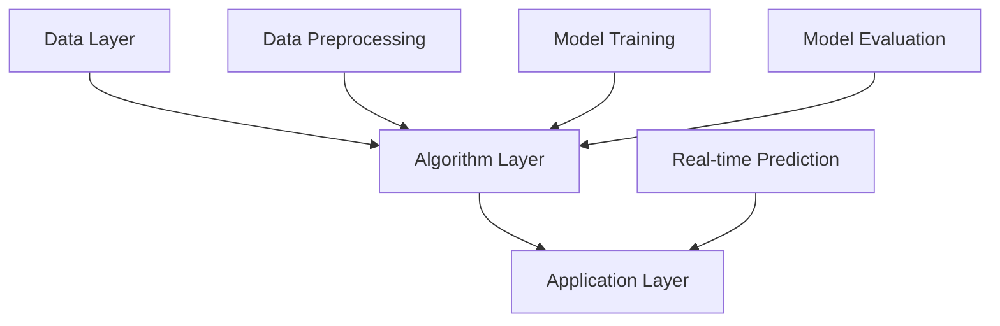
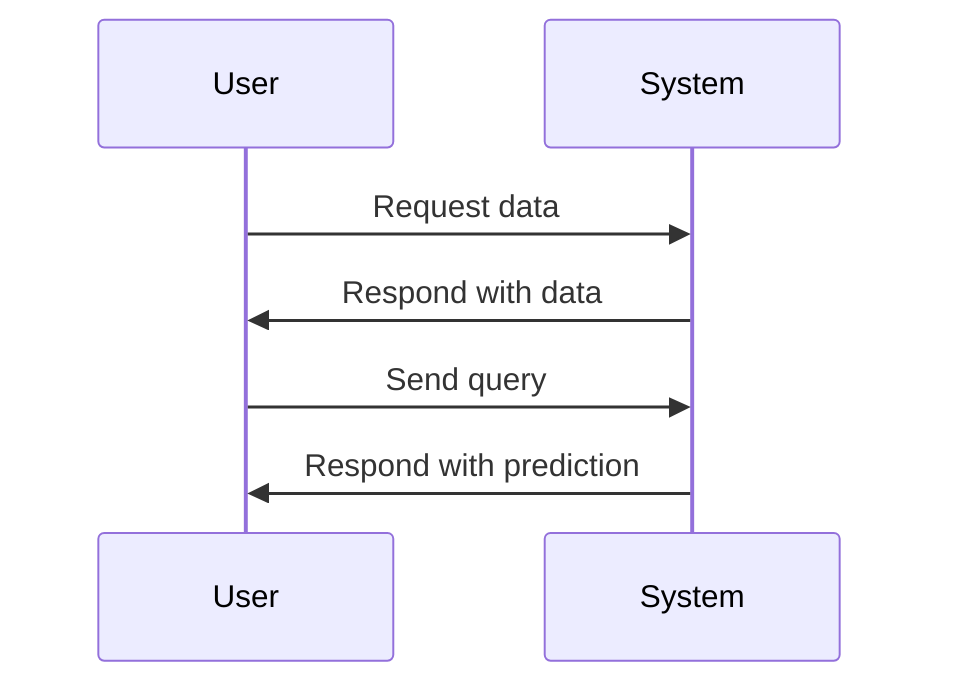
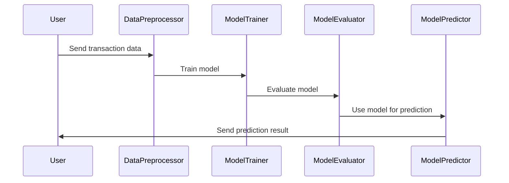

                 


### AI大模型在金融欺诈检测中的应用

#### 关键词：AI大模型、金融欺诈检测、深度学习、神经网络、欺诈识别

#### 摘要：
随着金融科技的快速发展，金融欺诈问题日益严峻。传统的欺诈检测方法在应对复杂多变的欺诈手段时显得力不从心。本文将探讨如何利用AI大模型，特别是深度学习技术，提升金融欺诈检测的效率和准确性。文章将分为以下几个部分：背景介绍、核心概念与联系、算法原理讲解、数学模型与公式、系统分析与架构设计、项目实战以及最佳实践与总结。

---

## 背景介绍

### 1.1 金融欺诈检测的重要性

金融欺诈对金融机构和用户造成巨大的经济损失，影响金融市场的稳定。因此，如何快速、准确地检测和防范欺诈行为成为金融机构关注的核心问题。

### 1.2 传统欺诈检测方法的局限性

传统的欺诈检测方法主要包括规则匹配、统计分析和模式识别等。这些方法在简单和规则明确的场景下表现良好，但面对复杂和动态变化的欺诈行为时，其检测效率和准确性明显不足。

### 1.3 AI大模型与金融欺诈检测的联系

AI大模型，尤其是基于深度学习的模型，具有强大的特征提取和学习能力，能够处理大量复杂的数据，并在各种应用场景中取得显著的成果。因此，将AI大模型应用于金融欺诈检测，有望提高检测的准确性和效率。

---

## 核心概念与联系

### 2.1 AI大模型的基本概念

AI大模型是指具有海量参数和复杂结构的机器学习模型，如深度神经网络、生成对抗网络等。这些模型能够自动从数据中学习特征，进行模式识别和预测。

### 2.2 金融欺诈检测的需求与挑战

金融欺诈检测的需求在于快速识别潜在的欺诈行为，减少经济损失。然而，欺诈行为具有隐蔽性强、多样性大和动态变化的特点，给检测带来了巨大挑战。

### 2.3 大模型在金融欺诈检测中的应用潜力

大模型在金融欺诈检测中的应用潜力主要体现在以下几个方面：

1. **特征提取能力强**：大模型能够自动从海量数据中提取出有效的特征，提高检测的准确性。
2. **适应性强**：大模型能够适应不断变化的欺诈手段，提高检测的灵活性。
3. **实时性高**：大模型能够实现快速训练和实时预测，提高检测的响应速度。

---

## 算法原理讲解

### 3.1 深度学习算法原理

深度学习是一种基于人工神经网络的机器学习方法，通过层层提取数据特征，实现复杂模式的识别和预测。在金融欺诈检测中，深度学习算法能够有效地处理复杂的数据，提高检测的准确性和效率。

### 3.2 算法讲解

#### 3.2.1 数据预处理

在应用深度学习算法之前，需要对数据进行预处理，包括数据清洗、特征提取和归一化等。这些预处理步骤有助于提高模型的训练效率和预测准确性。

#### 3.2.2 模型训练

模型训练是深度学习算法的核心步骤。通过大量标记数据，模型能够自动学习数据的特征和规律，形成有效的特征表示。

#### 3.2.3 模型评估与优化

模型评估与优化是确保模型性能的重要环节。通过交叉验证和超参数调整，可以找到最优的模型参数，提高模型的预测准确性。

---

## 数学模型与公式

### 4.1 机器学习基础

机器学习模型的核心是损失函数，用于衡量模型的预测结果与真实值之间的差距。常见的损失函数包括均方误差（MSE）和交叉熵（CE）。

### 4.2 大模型的训练与优化

大模型的训练与优化涉及多个数学公式和优化算法。常用的优化算法包括随机梯度下降（SGD）和Adam优化器。数学模型主要包括：

$$
J(\theta) = \frac{1}{m} \sum_{i=1}^{m} (-y_{i} \log(a(x_i; \theta)) + (1 - y_{i}) \log(1 - a(x_i; \theta)))
$$

其中，$J(\theta)$是损失函数，$a(x_i; \theta)$是模型对输入$x_i$的预测概率。

---

## 系统分析与架构设计

### 5.1 问题场景介绍

在金融欺诈检测中，系统需要处理海量的交易数据，实时检测潜在的欺诈行为。

### 5.2 系统功能设计

系统功能设计包括数据预处理、模型训练、模型评估和实时预测等。领域模型（Mermaid类图）如下：

```mermaid
classDiagram
Class01 <|-- Class02
Class03 --|addon Class01
Class04 <.. Class03
Class05 === Class03
Class06 --|apo Class05
```

### 5.3 系统架构设计

系统架构设计包括数据层、算法层和应用层。架构图（Mermaid流程图）如下：



### 5.4 系统接口设计

系统接口设计包括API接口和数据接口。接口定义如下：



### 5.5 系统交互

系统交互包括数据流和交互流程。序列图（Mermaid序列图）如下：



---

## 项目实战

### 6.1 环境安装与配置

在项目实战中，首先需要安装和配置深度学习环境，包括Python、TensorFlow和Keras等。

### 6.2 系统核心实现

系统核心实现包括数据预处理、模型训练和模型评估等。以下是Python源代码示例：

```python
# Data Preprocessing
X_train, X_test, y_train, y_test = train_test_split(data, labels, test_size=0.2)

# Model Training
model = Sequential()
model.add(Dense(64, activation='relu', input_shape=(input_shape)))
model.add(Dense(64, activation='relu'))
model.add(Dense(1, activation='sigmoid'))

model.compile(optimizer='adam', loss='binary_crossentropy', metrics=['accuracy'])

model.fit(X_train, y_train, epochs=10, batch_size=32, validation_data=(X_test, y_test))

# Model Evaluation
scores = model.evaluate(X_test, y_test, verbose=0)
print("Test accuracy:", scores[1])
```

### 6.3 实际案例分析

以某金融机构的实际案例为例，分析AI大模型在金融欺诈检测中的应用效果。

### 6.4 项目小结

通过项目实战，验证了AI大模型在金融欺诈检测中的有效性和可行性。未来，随着技术的不断进步，AI大模型将在金融欺诈检测中发挥越来越重要的作用。

---

## 最佳实践与总结

### 7.1 最佳实践

- **数据质量**：确保数据质量是模型训练成功的关键。
- **特征选择**：选择与欺诈行为相关的特征，提高模型的预测准确性。
- **模型优化**：通过超参数调整和模型架构优化，提高模型性能。

### 7.2 小结

本文详细介绍了AI大模型在金融欺诈检测中的应用，从核心概念、算法原理到系统架构和项目实战，为读者提供了全面的指导和参考。

### 7.3 注意事项

- **模型安全**：确保模型不会被攻击者利用进行欺诈。
- **实时性**：提高模型的实时性，确保欺诈行为能够被及时检测。

### 7.4 拓展阅读

- 《深度学习》（Goodfellow, Bengio, Courville） 
- 《Python深度学习》（François Chollet）
- 《金融科技：理论与实践》（姚前）

---

作者：AI天才研究院/AI Genius Institute & 禅与计算机程序设计艺术 /Zen And The Art of Computer Programming

