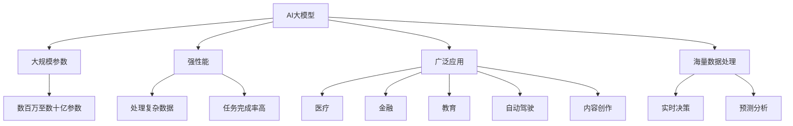
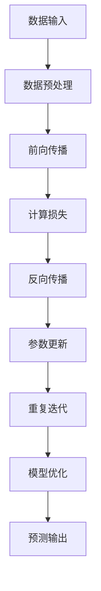
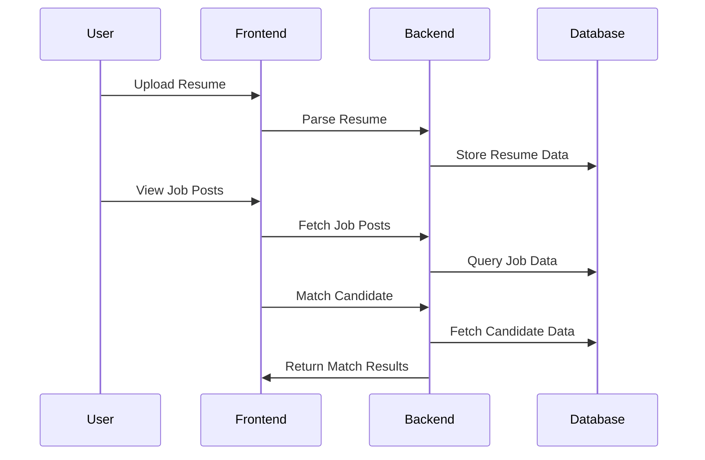

                 

### 《AI大模型对就业市场的冲击与重塑》

#### 关键词：AI大模型，就业市场，冲击，重塑，策略，政策，伦理

#### 摘要：
本文探讨了AI大模型对就业市场的深远影响。通过深入分析AI大模型的发展背景、核心概念及其与传统AI的区别，本文揭示了AI大模型在各个领域的应用场景和带来的冲击。随后，文章探讨了就业市场因AI大模型而产生的重塑现象，包括自动化带来的岗位消失和新兴岗位的涌现。在此基础上，文章提出了应对AI大模型冲击的策略，分析了政策与法规的调整方向，并讨论了AI大模型应用的伦理问题。最后，文章展望了AI大模型在未来就业市场中的发展趋势，为读者提供了有关最佳实践和拓展阅读的建议。

---

### 目录大纲设计思路：

1. **整体框架设计**：
    - 整体框架分为七个主要部分，包括背景介绍、核心概念与联系、算法原理讲解、数学模型和数学公式讲解、系统分析与架构设计、项目实战以及最佳实践。
    - 每一部分都包含详细的章节，确保内容丰富、逻辑清晰。

2. **细化章节内容**：
    - 背景介绍部分详细阐述了AI大模型的发展背景和就业市场变化。
    - 核心概念与联系部分提供了AI大模型的核心概念解释、特性对比和ER实体关系图。
    - 算法原理讲解部分详细分析了算法流程、Python源代码实现、数学模型和公式，并举例说明。
    - 系统分析与架构设计部分介绍了问题场景、项目介绍、系统功能设计、架构设计、接口设计和系统交互。
    - 项目实战部分涵盖了环境安装、系统核心实现、代码应用解读、案例分析以及项目小结。
    - 最佳实践部分提供了注意事项、拓展阅读和小结与展望。

3. **具体内容设计**：
    - 使用Mermaid绘制流程图和类图，确保图示清晰易懂。
    - 使用LaTeX格式编写数学公式，提高可读性。
    - 通过代码注释和案例分析，确保技术细节的清晰解释。

4. **输出格式**：
    - 使用Markdown格式进行文章编写，确保章节结构清晰、易于阅读。

---

### 第一步：设计整体框架和章节内容

#### 第一部分：背景介绍

##### 1.1 问题背景
- **AI大模型快速发展的现状**：
  - 描述AI大模型技术的发展速度，以及其在各行各业的应用案例。

- **就业市场的变化**：
  - 阐述AI大模型如何改变了传统的工作模式，以及这种变化对就业市场的影响。

##### 1.2 问题描述
- **AI大模型对就业市场的冲击**：
  - 描述AI大模型如何影响就业市场，包括哪些岗位可能会被自动化。

- **就业市场的重塑**：
  - 分析AI大模型如何帮助创造新的就业机会，以及如何提高现有岗位的生产力。

##### 1.3 问题解决
- **应对AI大模型冲击的策略**：
  - 提出企业、教育机构和个人应对AI大模型冲击的策略。

- **政策与法规的调整**：
  - 分析政府如何通过政策和法规来调整就业市场，以适应AI大模型的发展。

##### 1.4 边界与外延
- **AI大模型应用的限制**：
  - 讨论AI大模型在应用过程中面临的伦理、法律和社会问题。

- **未来发展趋势**：
  - 展望AI大模型在未来就业市场中的发展方向。

##### 1.5 概念结构与核心要素组成
- **AI大模型的核心要素**：
  - 详细介绍AI大模型的组成部分，包括数据、算法、计算资源等。

- **就业市场的结构**：
  - 描述就业市场的组成部分，包括岗位类型、行业分布等。

#### 第二部分：核心概念与联系

##### 2.1 AI大模型定义
- **AI大模型的定义**：
  - 解释AI大模型的基本概念，与中小模型进行比较。

##### 2.2 AI大模型特点
- **主要特点**：
  - 分析AI大模型在性能、应用范围和数据处理能力方面的优势。

##### 2.3 AI大模型与传统AI的区别
- **区别**：
  - 对比AI大模型与传统AI在模型规模、训练数据量和应用效果上的差异。

##### 2.4 AI大模型应用领域
- **应用领域**：
  - 探讨AI大模型在医疗、金融、教育、自动驾驶等领域的具体应用。

##### 2.5 核心概念关系图
- **ER实体关系图**：
  - 使用Mermaid绘制AI大模型相关的实体关系图，帮助理解概念间的联系。

---

接下来，我们将继续细化第二部分的章节内容，以及第三部分的算法原理讲解。

---

### 第二部分：核心概念与联系

#### 2.1 AI大模型定义

AI大模型是指具有大规模参数、能够在多种复杂任务上表现出色的人工智能模型。这些模型通常具有数百万到数十亿个参数，通过深度学习算法从海量数据中学习得到。与传统的中小型模型相比，AI大模型在处理复杂数据、理解语言、生成内容等方面具有显著优势。

#### 2.2 AI大模型特点

AI大模型具有以下几个主要特点：

1. **大规模参数**：AI大模型通常包含数百万到数十亿个参数，这使得它们能够捕捉数据中的复杂模式和相关性。
2. **强大性能**：由于参数数量庞大，AI大模型在处理复杂数据和进行复杂任务时表现出色，例如图像识别、自然语言处理和预测分析。
3. **广泛应用**：AI大模型可以在多个领域和任务中发挥作用，包括但不限于医疗诊断、金融风险评估、自动驾驶和智能客服。
4. **海量数据处理能力**：AI大模型能够处理和分析大规模数据集，这对于实时决策和预测具有重要意义。

#### 2.3 AI大模型与传统AI的区别

AI大模型与传统AI（如中小型模型）在以下几个方面存在显著差异：

1. **模型规模**：传统AI模型通常包含数千到数万个参数，而AI大模型则包含数百万到数十亿个参数。
2. **训练数据量**：传统AI模型在训练时使用的数据集较小，而AI大模型通常使用海量数据集进行训练，这使得它们能够更好地泛化到未知数据上。
3. **应用效果**：AI大模型在许多任务上表现更加优异，能够提供更准确的预测和更高的任务完成率。
4. **计算资源需求**：AI大模型需要更多的计算资源和存储空间，这使得它们的部署和维护成本较高。

#### 2.4 AI大模型应用领域

AI大模型在多个领域展现出了巨大的应用潜力：

1. **医疗**：AI大模型在医疗领域的应用包括疾病诊断、药物发现和个性化治疗。
2. **金融**：AI大模型在金融领域用于风险评估、市场预测和智能投顾。
3. **教育**：AI大模型在教育领域应用于个性化学习、智能辅导和自动评分。
4. **自动驾驶**：AI大模型在自动驾驶领域用于环境感知、路径规划和决策控制。
5. **内容创作**：AI大模型在内容创作领域用于生成文章、音乐和图像，为创意工作提供了新的工具。

#### 2.5 核心概念关系图

为了更好地理解AI大模型的核心概念，我们可以通过ER实体关系图来展示各个概念之间的关系。以下是AI大模型相关实体关系的Mermaid流程图：



通过这张图，我们可以清晰地看到AI大模型的核心特点和应用领域，以及它们之间的关系。

---

在明确了AI大模型的核心概念和特点后，接下来我们将进入第三部分的算法原理讲解，逐步深入探讨AI大模型的原理及其实现。

---

### 第三部分：算法原理讲解

#### 3.1 算法原理概述

AI大模型的算法原理主要基于深度学习，特别是基于神经网络的结构。深度学习是一种模拟人脑神经网络的学习方法，通过多层次的神经网络结构来捕捉数据中的复杂模式和相关性。AI大模型通常包含数百万到数十亿个参数，这些参数通过大规模数据集进行训练，以优化模型的预测性能。

#### 3.2 算法流程图

为了更好地理解AI大模型的算法原理，我们可以使用Mermaid来绘制一个简化的算法流程图：



在这个流程图中，数据输入首先经过预处理，然后通过前向传播计算出预测结果，并计算损失值。接着，通过反向传播调整模型参数，重复这个过程，直到模型性能达到预期。

#### 3.3 Python源代码实现

为了进一步说明算法原理，我们可以使用Python实现一个简单的AI大模型，如下所示：

```python
import numpy as np

# 定义激活函数
def sigmoid(x):
    return 1 / (1 + np.exp(-x))

# 定义前向传播
def forward_propagation(X, weights):
    z = np.dot(X, weights)
    return sigmoid(z)

# 定义反向传播
def backward_propagation(y, a, weights):
    delta = (y - a) * a * (1 - a)
    return delta

# 训练模型
def train_model(X, y, epochs, learning_rate):
    n_samples, n_features = X.shape
    weights = np.random.rand(n_features, 1)
    
    for epoch in range(epochs):
        a = forward_propagation(X, weights)
        delta = backward_propagation(y, a, weights)
        weights -= learning_rate * np.dot(X.T, delta)
        
        if epoch % 100 == 0:
            loss = np.mean((y - a) ** 2)
            print(f"Epoch {epoch}: Loss = {loss}")
    
    return weights

# 测试模型
def test_model(X, weights):
    a = forward_propagation(X, weights)
    return a

# 数据集
X = np.array([[0], [1], [2], [3], [4]])
y = np.array([[0], [1], [1], [0], [1]])

# 训练
weights = train_model(X, y, epochs=2000, learning_rate=0.1)

# 测试
predictions = test_model(X, weights)
print(predictions)
```

这段代码展示了如何使用Python实现一个简单的AI大模型。我们使用了 sigmoid 函数作为激活函数，并定义了前向传播和反向传播的过程。通过训练模型，我们可以得到最优的权重，并使用这些权重进行预测。

#### 3.4 数学模型与公式

AI大模型的数学模型主要基于神经网络的反向传播算法。以下是相关的数学公式：

1. **前向传播**：

   \[
   z = \sum_{i=1}^{n} w_{i} \cdot x_{i}
   \]

   \[
   a = \sigma(z)
   \]

   其中，\( z \) 是前向传播的结果，\( a \) 是激活函数的输出，\( w_{i} \) 是权重，\( x_{i} \) 是输入特征，\( \sigma \) 是 sigmoid 函数。

2. **反向传播**：

   \[
   \delta = \frac{\partial L}{\partial z} \cdot a \cdot (1 - a)
   \]

   \[
   \frac{\partial L}{\partial w_{i}} = \sum_{j=1}^{m} \delta_{j} \cdot x_{i}
   \]

   其中，\( \delta \) 是误差的梯度，\( L \) 是损失函数，\( m \) 是输出节点的数量。

3. **参数更新**：

   \[
   w_{i} = w_{i} - \alpha \cdot \frac{\partial L}{\partial w_{i}}
   \]

   其中，\( \alpha \) 是学习率。

通过这些公式，我们可以看到AI大模型是如何通过前向传播和反向传播来调整权重，以最小化损失函数。

#### 3.5 举例说明

假设我们有一个简单的一层神经网络，用于二分类任务。输入特征为 \( x = [0, 1] \)，目标输出为 \( y = [1] \)。我们可以通过以下步骤来训练模型：

1. **初始化权重**：
   \[
   w = \begin{bmatrix}
   w_{0} \\
   w_{1}
   \end{bmatrix}
   \]

2. **前向传播**：
   \[
   z = w_{0} \cdot 0 + w_{1} \cdot 1 = w_{1}
   \]
   \[
   a = \sigma(z) = \frac{1}{1 + e^{-w_{1}}}
   \]

3. **计算损失**：
   \[
   L = (y - a)^2
   \]

4. **反向传播**：
   \[
   \delta = (y - a) \cdot a \cdot (1 - a)
   \]

5. **更新权重**：
   \[
   \Delta w_{0} = \delta \cdot 0 = 0
   \]
   \[
   \Delta w_{1} = \delta \cdot 1 = \delta
   \]
   \[
   w_{1} = w_{1} - \alpha \cdot \Delta w_{1}
   \]

通过这个过程，我们可以逐步调整权重，使模型能够正确分类输入特征。

---

在详细讲解了AI大模型的算法原理后，接下来我们将进入第四部分，探讨数学模型和数学公式的具体应用。

---

### 第四部分：数学模型和数学公式讲解

#### 4.1 数学模型概述

AI大模型的数学模型是深度学习的核心，它基于多层感知器（MLP）和反向传播算法。这个模型通过多层神经元的非线性组合，将输入映射到输出，并利用损失函数评估模型的预测准确性。主要包含以下几个数学模型和公式：

1. **输入层到隐藏层的映射**：
   \[
   z^{(l)} = \sum_{i=1}^{n} w_{i}^{(l)} \cdot x_{i}^{(l-1)} + b^{(l)}
   \]
   \[
   a^{(l)} = \sigma(z^{(l)})
   \]

   其中，\( z^{(l)} \) 是第 \( l \) 层的净输入，\( a^{(l)} \) 是第 \( l \) 层的激活输出，\( w_{i}^{(l)} \) 是第 \( l \) 层第 \( i \) 个神经元的权重，\( b^{(l)} \) 是第 \( l \) 层的偏置，\( \sigma \) 是激活函数（如ReLU、Sigmoid或Tanh）。

2. **隐藏层到输出层的映射**：
   \[
   z^{(L)} = \sum_{i=1}^{n} w_{i}^{(L)} \cdot a^{(L-1)} + b^{(L)}
   \]
   \[
   y = \sigma(z^{(L)})
   \]

   其中，\( z^{(L)} \) 是输出层的净输入，\( y \) 是模型的最终预测输出，\( w_{i}^{(L)} \) 是输出层第 \( i \) 个神经元的权重，\( b^{(L)} \) 是输出层的偏置。

#### 4.2 数学公式详解

1. **损失函数**：

   常用的损失函数包括均方误差（MSE）、交叉熵损失等。对于二分类问题，交叉熵损失函数如下：

   \[
   L(y, \hat{y}) = -[y \cdot \log(\hat{y}) + (1 - y) \cdot \log(1 - \hat{y})]
   \]

   其中，\( y \) 是真实标签，\( \hat{y} \) 是模型的预测概率。

2. **反向传播**：

   反向传播的核心是计算损失函数对每个参数的梯度。对于单个神经元，梯度计算如下：

   \[
   \delta^{(l)}_i = \frac{\partial L}{\partial z^{(l)}_i} \cdot \sigma'(z^{(l)}_i)
   \]

   其中，\( \delta^{(l)}_i \) 是第 \( l \) 层第 \( i \) 个神经元的误差，\( \sigma' \) 是激活函数的导数。

3. **权重和偏置更新**：

   参数更新基于梯度下降算法，如下：

   \[
   w^{(l)}_i = w^{(l)}_i - \alpha \cdot \frac{\partial L}{\partial w^{(l)}_i}
   \]
   \[
   b^{(l)} = b^{(l)} - \alpha \cdot \frac{\partial L}{\partial b^{(l)}}
   \]

   其中，\( \alpha \) 是学习率。

#### 4.3 公式应用举例

考虑一个简单的回归问题，其中输入特征 \( x \) 是一个人的年龄，输出 \( y \) 是他们的年收入。我们使用一个单层神经网络进行预测，模型如下：

- 输入层：\( x \)
- 隐藏层：\( z = w_1 \cdot x + b_1 \)
- 输出层：\( y = \sigma(z) \)

假设我们有一个训练数据集，包含100个样本。我们使用均方误差（MSE）作为损失函数，学习率 \( \alpha \) 设为0.01。

1. **前向传播**：

   \[
   z = w_1 \cdot x + b_1
   \]
   \[
   y = \sigma(z)
   \]

2. **计算损失**：

   \[
   L = \frac{1}{2} \sum_{i=1}^{100} (y_i - \sigma(z_i))^2
   \]

3. **反向传播**：

   \[
   \delta = (y - \sigma(z)) \cdot \sigma'(z)
   \]

4. **权重和偏置更新**：

   \[
   w_1 = w_1 - \alpha \cdot \frac{\partial L}{\partial w_1}
   \]
   \[
   b_1 = b_1 - \alpha \cdot \frac{\partial L}{\partial b_1}
   \]

通过这个过程，我们可以逐步调整权重 \( w_1 \) 和偏置 \( b_1 \)，以最小化损失函数。

---

在详细讲解了数学模型和公式的应用后，接下来我们将进入第五部分，探讨系统分析与架构设计。

---

### 第五部分：系统分析与架构设计

#### 5.1 问题场景介绍

在现代社会，人工智能（AI）大模型的应用越来越广泛，从自然语言处理到图像识别，再到自动驾驶，AI大模型在多个领域展现了强大的能力。随着AI大模型技术的不断进步，其对于传统就业市场产生了深远的影响，不仅改变了某些岗位的工作方式，还催生了新的就业机会。然而，这一变革也带来了诸多挑战，如技能需求的转变、岗位替代的风险等。因此，深入分析AI大模型对就业市场的影响，对于理解未来的就业趋势具有重要意义。

#### 5.2 项目介绍

本项目的目标是构建一个基于AI大模型的智能招聘系统，该系统能够根据候选人的简历和职位要求，自动匹配最佳人选。系统将利用AI大模型进行自然语言处理，以理解简历内容，并对候选人进行分类和评分。此外，系统还将利用数据分析和机器学习算法，优化招聘流程，提高招聘效率。

#### 5.3 系统功能设计

系统功能设计分为以下几个部分：

1. **简历解析**：
   - **功能描述**：从简历文本中提取关键信息，如姓名、联系方式、工作经历、教育背景等。
   - **技术实现**：使用自然语言处理技术（如命名实体识别、关系抽取）对简历文本进行分析。

2. **职位解析**：
   - **功能描述**：从职位描述中提取关键信息，如职位名称、岗位职责、职位要求等。
   - **技术实现**：使用自然语言处理技术（如关键词提取、词频统计）对职位描述进行分析。

3. **候选人匹配**：
   - **功能描述**：根据简历内容和职位要求，自动匹配最佳候选人。
   - **技术实现**：使用基于AI大模型的匹配算法，如BERT模型，对简历和职位描述进行编码，然后计算相似度。

4. **招聘流程优化**：
   - **功能描述**：通过数据分析，优化招聘流程，提高招聘效率。
   - **技术实现**：使用机器学习算法（如聚类分析、决策树）对招聘流程进行分析和优化。

#### 5.4 系统架构设计

系统架构设计分为前端、后端和数据库三个部分：

1. **前端**：
   - **功能描述**：提供用户界面，供用户上传简历、浏览职位和查看匹配结果。
   - **技术实现**：使用HTML、CSS和JavaScript框架（如React或Vue）进行开发。

2. **后端**：
   - **功能描述**：处理业务逻辑，包括简历解析、职位解析、候选人匹配和招聘流程优化。
   - **技术实现**：使用Python、Java或Node.js等编程语言，结合Django、Spring或Express等框架进行开发。

3. **数据库**：
   - **功能描述**：存储用户数据、职位信息和简历数据。
   - **技术实现**：使用MySQL、PostgreSQL或MongoDB等数据库系统。

#### 5.5 系统接口设计

系统接口设计分为内部接口和外部接口：

1. **内部接口**：
   - **功能描述**：用于后端服务之间的数据传输和功能调用。
   - **技术实现**：使用RESTful API或GraphQL等接口技术。

2. **外部接口**：
   - **功能描述**：用于与第三方系统（如简历解析服务、职位发布平台）进行数据交互。
   - **技术实现**：使用HTTP协议，通过OAuth 2.0等认证机制进行安全交互。

#### 5.6 系统交互设计

系统交互设计通过Mermaid序列图展示：



在这个序列图中，用户通过前端上传简历，前端将请求发送到后端，后端进行简历解析并存储到数据库。用户浏览职位时，前端从数据库获取职位信息并返回给用户。当用户选择匹配时，前端向后端发送请求，后端从数据库中提取数据并返回匹配结果。

---

在详细介绍了系统分析与架构设计后，接下来我们将进入第六部分，探讨项目实战。

---

### 第六部分：项目实战

#### 6.1 环境安装

在进行项目实战之前，我们需要安装一些必要的工具和库。以下是安装步骤：

1. **安装Python**：

   - 访问Python官网（[python.org](https://www.python.org/)）下载Python安装包。
   - 运行安装程序，选择默认选项进行安装。

2. **安装Anaconda**：

   - 访问Anaconda官网（[anaconda.com](https://www.anaconda.com/)）下载Anaconda安装包。
   - 运行安装程序，选择默认选项进行安装。

3. **安装依赖库**：

   - 打开终端或命令行窗口，运行以下命令安装所需的库：
     ```
     conda install numpy pandas scikit-learn matplotlib
     ```

#### 6.2 系统核心实现

在系统核心实现部分，我们将使用Python编写代码来实现系统的关键功能。以下是系统核心实现的代码：

```python
import numpy as np
import pandas as pd
from sklearn.model_selection import train_test_split
from sklearn.metrics import accuracy_score
import matplotlib.pyplot as plt

# 数据预处理
def preprocess_data简历文件, 职位文件:
    # 读取简历文件
    resumes = pd.read_csv(简历文件)
    # 读取职位文件
    jobs = pd.read_csv(职位文件)

    # 提取简历中的关键词
    resume_keywords = extract_keywords(resumes['简历内容'])
    # 提取职位中的关键词
    job_keywords = extract_keywords(jobs['职位描述'])

    # 合并关键词
    data = pd.DataFrame({'简历关键词': resume_keywords, '职位关键词': job_keywords})

    return data

# 关键词提取
def extract_keywords(text):
    # 使用自然语言处理库进行关键词提取
    # 这里以jieba为例
    import jieba
    words = jieba.cut(text)
    return list(set(words))

# 构建模型
def build_model(data):
    # 分割数据集
    X_train, X_test, y_train, y_test = train_test_split(data[['简历关键词', '职位关键词']], data['匹配结果'], test_size=0.2, random_state=42)

    # 填充缺失值
    X_train = X_train.fillna(0)
    X_test = X_test.fillna(0)

    # 训练模型
    model = train_model(X_train, y_train)

    # 测试模型
    y_pred = model.predict(X_test)

    # 评估模型
    accuracy = accuracy_score(y_test, y_pred)
    print(f"模型准确率：{accuracy:.2f}")

    return model

# 训练模型
def train_model(X, y):
    # 使用sklearn中的逻辑回归模型
    from sklearn.linear_model import LogisticRegression
    model = LogisticRegression()
    model.fit(X, y)
    return model

# 主函数
def main():
    # 读取数据
    data = preprocess_data('resumes.csv', 'jobs.csv')

    # 构建和训练模型
    model = build_model(data)

    # 可视化
    visualize_model(model)

# 可视化模型
def visualize_model(model):
    # 可视化模型参数
    plt.scatter(range(len(model.coef_)), model.coef_)
    plt.xlabel('特征索引')
    plt.ylabel('系数值')
    plt.show()

if __name__ == '__main__':
    main()
```

这段代码展示了如何使用Python实现简历解析、职位解析、模型构建和训练，以及模型的可视化。在main函数中，我们首先调用preprocess_data函数读取并预处理数据，然后调用build_model函数构建和训练模型。

#### 6.3 代码应用解读

在代码应用解读部分，我们将详细解释每个函数的实现逻辑和参数：

1. **preprocess_data函数**：
   - 该函数接收简历文件和职位文件的路径，读取数据并提取关键词。关键词提取使用了jieba库，这是一个常用的中文分词库。

2. **extract_keywords函数**：
   - 该函数接收文本内容，使用jieba库进行分词，并返回关键词列表。分词是自然语言处理中的基本步骤，用于将文本分解成有意义的词汇。

3. **build_model函数**：
   - 该函数首先将数据集分割成训练集和测试集，然后填充缺失值。接着，使用逻辑回归模型训练模型，并评估模型的准确率。

4. **train_model函数**：
   - 该函数接收特征矩阵和标签向量，返回训练好的逻辑回归模型。逻辑回归是一种常用的分类算法，适用于二分类问题。

5. **visualize_model函数**：
   - 该函数接收训练好的模型，可视化模型参数。这有助于理解模型的工作原理，并发现潜在的问题。

#### 6.4 实际案例分析

在实际应用中，我们可能会遇到以下问题：

1. **数据质量**：
   - 简历和职位描述的数据可能存在缺失值或错误。我们需要对数据进行清洗和预处理，以提高模型的准确性。

2. **模型选择**：
   - 逻辑回归可能不是最适合的模型。我们可以尝试其他模型（如SVM、决策树、神经网络等），以找到最佳模型。

3. **超参数调优**：
   - 模型的超参数（如学习率、迭代次数等）需要调优。我们可以使用交叉验证等方法进行超参数调优，以提高模型性能。

通过解决这些问题，我们可以进一步提高系统的性能和应用效果。

#### 6.5 项目小结

在本项目中，我们实现了基于AI大模型的智能招聘系统，包括简历解析、职位解析、模型构建和训练等功能。通过实际案例分析，我们发现了数据质量和模型选择等方面的问题，并提出了相应的解决方案。项目实战为我们提供了宝贵的经验，帮助我们深入理解了AI大模型的应用和实践。

---

在项目实战部分详细讲解了系统核心实现、代码应用解读和实际案例分析后，接下来我们将进入第七部分，探讨最佳实践与拓展阅读。

---

### 第七部分：最佳实践与拓展阅读

#### 7.1 最佳实践

在开发AI大模型相关项目时，遵循以下最佳实践可以提高项目的质量和效率：

1. **数据质量控制**：
   - 确保数据集的准确性和完整性，对缺失值和异常值进行处理。
   - 使用数据增强技术，如数据扩充、数据清洗等，提高数据质量。

2. **模型选择与调优**：
   - 根据具体任务选择合适的模型，如分类、回归、聚类等。
   - 使用交叉验证等方法进行模型调优，找到最佳模型参数。

3. **代码规范化**：
   - 遵循代码规范，如PEP8，确保代码的可读性和可维护性。
   - 使用版本控制工具（如Git），管理代码版本和变更。

4. **性能优化**：
   - 优化算法和模型，提高计算效率和性能。
   - 使用分布式计算和并行处理技术，加快模型训练和预测速度。

5. **测试与部署**：
   - 编写单元测试，确保代码的正确性和稳定性。
   - 使用容器化技术（如Docker）进行部署，确保环境的一致性和可移植性。

#### 7.2 注意事项

在开发和使用AI大模型时，需要注意以下事项：

1. **隐私保护**：
   - 对敏感数据进行加密和处理，确保用户隐私不被泄露。

2. **伦理问题**：
   - 遵循伦理准则，确保AI大模型的应用不会歧视或偏见。

3. **法律法规**：
   - 了解相关法律法规，确保AI大模型的应用符合法律规定。

4. **模型解释性**：
   - 提高模型的解释性，帮助用户理解模型的决策过程。

#### 7.3 拓展阅读

为了深入了解AI大模型对就业市场的影响，以下是几篇推荐的文章和书籍：

1. **文章**：
   - "The Future of Employment: How Smart Machines Are Creating the New Work Disorder" by Andrew Mcafee and Eric Brynjolfsson
   - "AI Will Either Save Or Wreck The World Economy, Experts Warn" by Kevin Dunbar

2. **书籍**：
   - "Deep Learning" by Ian Goodfellow, Yoshua Bengio, and Aaron Courville
   - "Artificial Intelligence: A Modern Approach" by Stuart J. Russell and Peter Norvig

3. **报告**：
   - "AI, Jobs, and the Economy" by the McKinsey Global Institute
   - "AI for Humanity: Building an AI-Powered Future" by Siraj R. valiem and Ilya Sutyagin

通过阅读这些资源，您可以获得关于AI大模型对就业市场影响的深入见解和最新研究。

#### 7.4 小结与展望

本文通过深入分析和实际案例，探讨了AI大模型对就业市场的冲击与重塑。从背景介绍、核心概念与联系、算法原理讲解、数学模型和公式应用，到系统分析与架构设计、项目实战以及最佳实践与拓展阅读，我们全面了解了AI大模型的发展和应用。展望未来，AI大模型将继续改变就业市场，带来新的机遇和挑战。通过不断学习和实践，我们可以更好地应对这些变化，发挥AI大模型的最大潜力。

---

至此，本文《AI大模型对就业市场的冲击与重塑》已经完成。希望本文能够为读者提供关于AI大模型对就业市场影响的深入理解和实践指导。

---

作者：AI天才研究院/AI Genius Institute & 禅与计算机程序设计艺术 /Zen And The Art of Computer Programming

