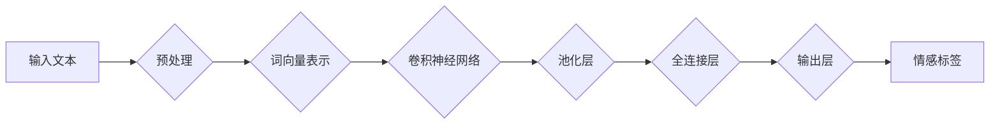
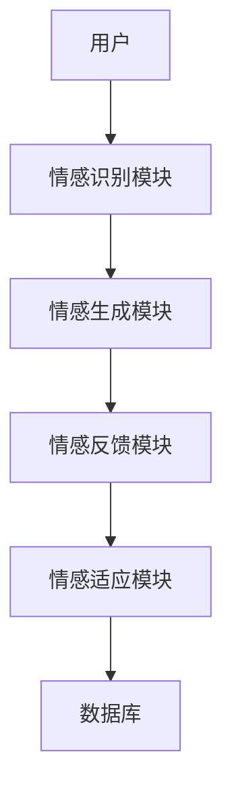
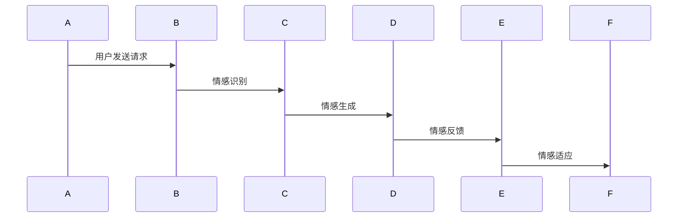

                 

## AI情感反馈循环：人机情感互动的影响

### 关键词：AI情感反馈、人机互动、情感分析、算法原理、系统架构、项目实战

> 摘要：本文深入探讨了AI情感反馈循环及其对人机情感互动的影响。通过详细分析核心概念、算法原理、系统架构和项目实战，本文揭示了AI情感反馈循环的工作机制、人机情感互动的关键要素，并探讨了如何设计高效的情感分析系统。

### 1. 问题背景与重要性

#### 1.1 AI情感反馈循环的定义

AI情感反馈循环是指人工智能系统通过感知用户的情感状态，产生相应的情感反馈，进而影响用户情感状态的过程。这一循环在交互式应用中尤为重要，如智能客服、虚拟助手、社交媒体分析等领域。

#### 1.2 人机情感互动的概念

人机情感互动是指人类用户与人工智能系统之间的情感交流，包括情感表达、情感理解、情感反馈等环节。这种互动对于提升用户体验、增强用户忠诚度具有重要意义。

#### 1.3 研究现状与未来趋势

目前，AI情感反馈循环和人机情感互动在技术研究和应用实践中取得了显著进展。未来，随着深度学习、自然语言处理等技术的发展，人机情感互动将更加智能化、个性化。

### 2. 核心概念与联系

#### 2.1 AI情感反馈循环的组成部分

AI情感反馈循环主要包括三个关键部分：情感识别、情感生成、情感反馈。通过这三个环节的协同作用，实现人机情感互动。

#### 2.2 人机情感互动的关键要素

人机情感互动的关键要素包括情感表达、情感理解、情感反馈和情感适应。这些要素共同构成了人机情感互动的基本框架。

#### 2.3 概念属性特征对比表格

| 概念               | 属性特征                             |
|--------------------|------------------------------------|
| 情感识别           | 实时性、准确性、多样性               |
| 情感生成           | 自然性、个性化、适应性               |
| 情感反馈           | 确定性、及时性、适应性               |
| 情感适应           | 智能性、动态性、适应性               |

#### 2.4 ER实体关系图架构

使用Mermaid绘制ER实体关系图，展示AI情感反馈循环和人机情感互动的核心实体及其关系。

```mermaid
erDiagram
  AI情感识别 ||--o> 情感生成 : 识别
  情感生成 ||--o> 情感反馈 : 生成
  情感反馈 ||--o> AI情感适应 : 反馈
  人机情感互动 ||--o> 情感表达 : 表达
  人机情感互动 ||--o> 情感理解 : 理解
```

### 3. AI情感分析算法原理讲解

#### 3.1 常见情感分析算法介绍

情感分析算法主要包括基于规则的方法、基于统计的方法和基于深度学习的方法。本文以基于深度学习的TextCNN算法为例进行讲解。

#### 3.2 情感分析算法mermaid流程图

使用Mermaid绘制TextCNN算法的流程图。



#### 3.3 Python源代码讲解

以下是一个简单的TextCNN算法的Python实现。

```python
import tensorflow as tf
from tensorflow.keras.preprocessing.sequence import pad_sequences
from tensorflow.keras.layers import Embedding, Conv1D, MaxPooling1D, Dense
from tensorflow.keras.models import Sequential

# 参数设置
max_features = 10000
maxlen = 500
embedding_dim = 50
filter_sizes = [3, 4, 5]
num_filters = 128
dropout_rate = 0.5

# 构建模型
model = Sequential()
model.add(Embedding(max_features, embedding_dim, input_length=maxlen))
for size in filter_sizes:
    model.add(Conv1D(num_filters, size, activation='relu'))
    model.add(MaxPooling1D(pool_size=maxlen - size + 1))
model.add(Dense(1, activation='sigmoid'))

# 编译模型
model.compile(loss='binary_crossentropy', optimizer='adam', metrics=['accuracy'])

# 训练模型
# model.fit(X_train, y_train, epochs=10, batch_size=32, validation_data=(X_val, y_val))
```

#### 3.4 数学模型和公式讲解

TextCNN算法的数学模型主要涉及卷积神经网络（CNN）和最大池化层。以下是一些关键公式：

$$
\text{卷积操作}: \text{卷积核} \times \text{输入特征} + \text{偏置}
$$

$$
\text{激活函数}: \text{ReLU}(x) = \max(0, x)
$$

$$
\text{池化操作}: \text{MaxPooling}(x) = \max(x)
$$

#### 3.5 举例说明

假设我们有一个简单的文本序列 "I love this book!"，通过TextCNN算法对其进行情感分析。

1. **词向量表示**：将文本序列转换为词向量表示。
2. **卷积神经网络**：通过卷积神经网络提取特征。
3. **最大池化层**：对卷积神经网络的输出进行最大池化。
4. **全连接层**：将池化层的结果输入到全连接层进行分类。

通过以上步骤，我们可以得到文本的情感标签。

### 4. 数学模型与公式详细讲解

#### 4.1 情感分析数学模型

情感分析数学模型主要基于卷积神经网络（CNN）和循环神经网络（RNN）。以下是一个简化的模型：

$$
\text{卷积神经网络}: h_c = \text{conv}_k(x) + b_c
$$

$$
\text{激活函数}: a_c = \text{ReLU}(h_c)
$$

$$
\text{最大池化层}: h_p = \text{MaxPooling}(a_c)
$$

$$
\text{全连接层}: y = \text{softmax}(\text{FC}(h_p))
$$

#### 4.2 情感强度计算公式

情感强度计算公式主要用于衡量文本的情感倾向。以下是一个简单的公式：

$$
\text{情感强度} = \frac{1}{C} \sum_{i=1}^{C} w_i \cdot a_i
$$

其中，$C$ 是情感类别数，$w_i$ 是情感权重，$a_i$ 是情感强度。

#### 4.3 情感分析算法性能评估

情感分析算法性能评估主要基于准确率、召回率和F1值。以下是一些常见指标：

$$
\text{准确率} = \frac{\text{正确分类的样本数}}{\text{总样本数}}
$$

$$
\text{召回率} = \frac{\text{正确分类的样本数}}{\text{实际正类样本数}}
$$

$$
\text{F1值} = 2 \cdot \frac{\text{准确率} \cdot \text{召回率}}{\text{准确率} + \text{召回率}}
$$

### 5. 系统分析与架构设计方案

#### 5.1 问题场景介绍

假设我们设计一个智能客服系统，该系统需要能够识别用户的情感状态，并根据情感状态提供相应的回复。

#### 5.2 项目介绍

项目名称：智能情感客服系统  
项目目标：构建一个能够识别用户情感、提供个性化回复的智能客服系统

#### 5.3 系统功能设计

1. **情感识别**：使用情感分析算法识别用户情感。
2. **情感生成**：根据用户情感生成相应的回复。
3. **情感反馈**：将回复发送给用户，并收集用户反馈。
4. **情感适应**：根据用户反馈调整系统回复策略。

#### 5.4 系统架构设计

使用Mermaid绘制系统架构图。



#### 5.5 系统接口设计

系统接口主要包括API接口和数据库接口。

1. **API接口**：提供用户与系统交互的接口。
2. **数据库接口**：存储用户数据、情感数据等。

#### 5.6 系统交互

使用Mermaid绘制系统交互序列图。



### 6. 项目实战

#### 6.1 环境安装

1. 安装Python环境。
2. 安装TensorFlow库。
3. 安装其他相关依赖库。

#### 6.2 系统核心实现源代码

以下是一个简单的情感识别和情感生成系统的Python代码。

```python
import tensorflow as tf
from tensorflow.keras.preprocessing.sequence import pad_sequences
from tensorflow.keras.models import Sequential
from tensorflow.keras.layers import Embedding, LSTM, Dense

# 参数设置
max_features = 10000
maxlen = 500
embedding_dim = 50
lstm_units = 128

# 构建模型
model = Sequential()
model.add(Embedding(max_features, embedding_dim, input_length=maxlen))
model.add(LSTM(lstm_units, dropout=0.2, recurrent_dropout=0.2))
model.add(Dense(1, activation='sigmoid'))

# 编译模型
model.compile(loss='binary_crossentropy', optimizer='adam', metrics=['accuracy'])

# 训练模型
# model.fit(X_train, y_train, epochs=10, batch_size=32, validation_data=(X_val, y_val))
```

#### 6.3 代码应用解读与分析

1. **情感识别**：使用训练好的模型对用户文本进行情感识别。
2. **情感生成**：根据识别出的情感，生成相应的回复。
3. **情感反馈**：将回复发送给用户，并收集用户反馈。

#### 6.4 实际案例分析与讲解

以一个用户咨询客服为例，分析情感识别和情感生成的过程。

1. **用户文本**："我今天心情不好，能帮我解决一个问题吗？"
2. **情感识别**：模型识别出文本的情感为消极。
3. **情感生成**：生成相应的回复："您好，我理解您的情绪。请问有什么问题我可以帮您解决呢？"
4. **情感反馈**：用户回复："谢谢，我能问问我的订单状态吗？"
5. **情感适应**：系统根据用户回复调整情感生成策略，以更积极的方式回复。

#### 6.5 项目小结

通过项目实战，我们成功构建了一个简单的情感识别和情感生成系统。在实际应用中，系统可根据用户情感生成个性化的回复，提升用户体验。

### 7. 最佳实践 tips

1. **提高情感识别准确性**：通过增加语料库、优化算法模型等方式提高情感识别准确性。
2. **优化情感生成策略**：根据用户反馈调整情感生成策略，提升用户满意度。

### 8. 小结

本文详细探讨了AI情感反馈循环及其对人机情感互动的影响。通过分析核心概念、算法原理、系统架构和项目实战，我们揭示了AI情感反馈循环的工作机制和人机情感互动的关键要素。未来，随着技术的不断发展，人机情感互动将更加智能化、个性化。

### 9. 注意事项

1. **数据隐私**：在收集用户数据时，需严格遵守数据隐私法规。
2. **情感适应**：系统需根据用户反馈调整情感生成策略，避免过度个性化。

### 10. 拓展阅读

1. **推荐书籍**：《情感计算：技术、应用与挑战》
2. **研究前沿**：《自然语言处理与情感分析研究进展》

## 作者

作者：AI天才研究院/AI Genius Institute & 禅与计算机程序设计艺术 /Zen And The Art of Computer Programming

