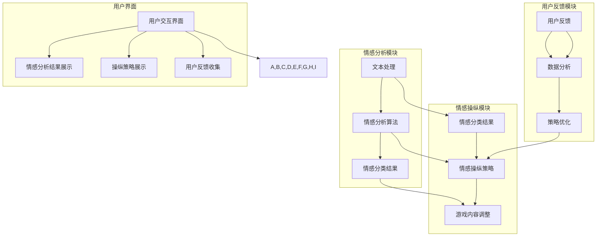

                 

# AI情感操纵：虚拟影响力的边界

关键词：AI情感操纵，虚拟影响力，边界，算法，系统架构，实战，最佳实践

摘要：本文深入探讨了AI情感操纵这一前沿领域，分析了其在虚拟环境中的影响力和边界。通过逐步分析，我们揭示了AI情感操纵的核心算法原理，探讨了其应用场景和系统架构设计，并提供了实战经验和最佳实践。

## 目录

1. 引言
2. 背景介绍
   2.1 核心概念术语说明
   2.2 问题背景与描述
   2.3 问题解决方法与边界
   2.4 概念结构与核心要素组成
3. 核心概念与联系
   3.1 AI情感操纵的基本原理
   3.2 不同情感操纵技术的对比
   3.3 ER实体关系图
4. 算法原理讲解
   4.1 情感分析算法
   4.2 情感操纵算法
   4.3 数学模型与公式
   4.4 Python代码示例
5. 系统分析与架构设计方案
   5.1 问题场景介绍
   5.2 系统功能设计
   5.3 系统架构设计
   5.4 系统接口设计
   5.5 系统交互流程
6. 项目实战
   6.1 环境安装与配置
   6.2 核心实现源代码讲解
   6.3 实际案例分析
   6.4 项目小结
7. 最佳实践 tips、小结、注意事项、拓展阅读
   7.1 最佳实践 tips
   7.2 小结
   7.3 注意事项
   7.4 拓展阅读

### 引言

随着人工智能技术的快速发展，AI在各个领域的应用日益广泛，特别是在情感操纵方面。虚拟影响力成为了人们关注的热点问题。然而，AI情感操纵的边界尚未明确，如何有效操纵情感、确保其积极影响、避免负面影响，成为了一个亟待解决的问题。

本文旨在通过逐步分析，探讨AI情感操纵的边界，揭示其核心算法原理，并提供实际应用中的最佳实践。文章结构如下：

1. 引言：简要介绍AI情感操纵的背景和重要性。
2. 背景介绍：定义核心概念，阐述问题背景和解决方法。
3. 核心概念与联系：分析情感操纵的基本原理和不同技术的对比。
4. 算法原理讲解：详细解释情感分析算法和情感操纵算法。
5. 系统分析与架构设计方案：描述系统功能、架构和交互流程。
6. 项目实战：提供实际案例，讲解环境安装、源代码实现和应用。
7. 最佳实践 tips、小结、注意事项、拓展阅读：总结关键点，提供实践建议和拓展资料。

### 背景介绍

#### 核心概念术语说明

在讨论AI情感操纵之前，我们需要明确一些核心概念术语：

- **情感分析**：通过自然语言处理技术，从文本中提取情感信息，判断文本的情感极性（正面/负面）和强度。
- **情感操纵**：利用情感分析技术，对情感信息进行加工和处理，实现情感影响的目的。
- **虚拟影响力**：在虚拟环境中，通过情感操纵，对用户产生心理和行为上的影响。
- **边界**：情感操纵的合法范围和限制，确保其不会产生负面影响。

#### 问题背景与描述

随着互联网和虚拟现实技术的普及，人们越来越多地沉浸在虚拟环境中。虚拟影响力作为一种新型影响力形式，正在逐步改变人们的心理和行为。然而，如何合理地利用情感操纵技术，确保其积极影响、避免负面影响，成为了亟待解决的问题。

虚拟影响力在娱乐、营销、教育等领域具有广泛应用。例如，在虚拟游戏中，通过情感操纵，可以增强用户的游戏体验；在营销中，通过情感操纵，可以提升产品的吸引力；在教育中，通过情感操纵，可以激发学生的学习兴趣。然而，过度或不当使用情感操纵技术，可能导致用户心理和行为上的负面影响，如沉迷、焦虑、抑郁等。

#### 问题解决方法与边界

要解决虚拟影响力的问题，需要从以下几个方面入手：

1. **核心算法原理**：深入理解情感分析算法和情感操纵算法，掌握其基本原理和操作方法。
2. **系统架构设计**：设计合理、可扩展的系统和架构，确保情感操纵技术的有效实施和管理。
3. **法律法规和伦理规范**：制定相关法律法规和伦理规范，明确情感操纵的边界和限制，防止其滥用。
4. **用户教育和引导**：加强对用户的情感教育，提高其情感素养，引导其正确对待虚拟影响力。

#### 概念结构与核心要素组成

AI情感操纵的概念结构主要包括以下几个核心要素：

- **情感分析技术**：利用自然语言处理、机器学习等技术，对文本进行情感分析。
- **情感操纵技术**：基于情感分析结果，对情感信息进行加工和处理，实现情感操纵。
- **虚拟环境**：提供情感操纵的场所和平台，如虚拟游戏、虚拟现实、社交媒体等。
- **用户**：情感操纵的目标对象，其心理和行为受到情感操纵的影响。

这些核心要素相互关联，共同构成了AI情感操纵的技术体系。

### 核心概念与联系

#### AI情感操纵的基本原理

AI情感操纵是基于情感分析和情感操纵技术的一种智能行为。其基本原理可以概括为以下几个步骤：

1. **情感分析**：通过自然语言处理技术，从文本中提取情感信息，判断文本的情感极性（正面/负面）和强度。
2. **情感加工**：根据情感分析结果，对情感信息进行加工和处理，实现情感操纵。
3. **情感反馈**：将加工后的情感信息反馈给用户，影响其心理和行为。

#### 不同情感操纵技术的对比

根据情感操纵的方式和目的，可以将情感操纵技术分为以下几类：

- **正向情感操纵**：通过增强用户的积极情感体验，提升其幸福感和满意度。
- **负向情感操纵**：通过引发用户的消极情感反应，达到警示或教育目的。
- **中性情感操纵**：通过维持用户的中性情感状态，实现某种特定的目标。

不同情感操纵技术具有不同的特点和适用场景。例如，正向情感操纵适用于娱乐、营销等领域，负向情感操纵适用于教育、安全等领域，中性情感操纵适用于日常交流、工作场景等。

#### ER实体关系图

为了更清晰地展示AI情感操纵中的核心概念和关系，我们可以使用ER实体关系图进行描述。

```mermaid
erDiagram
  User ||--|{ AI } : isManipulatedBy
  AI ||--|{ Text } : analyzes
  AI ||--|{ Emotion } : generates
  Text ||--|{ Emotion } : contains
  Emotion ||--|{ Action } : triggers
```

在这张ER实体关系图中，用户（User）是情感操纵的目标对象，AI是情感操纵的主体，文本（Text）和情感（Emotion）是中间载体，动作（Action）是情感操纵的结果。

### 算法原理讲解

#### 情感分析算法

情感分析算法是AI情感操纵的核心，其基本原理可以概括为以下几个步骤：

1. **数据预处理**：对原始文本进行分词、去除停用词、词性标注等预处理操作，提取关键信息。
2. **特征提取**：利用词袋模型、TF-IDF、Word2Vec等技术，将文本转化为特征向量。
3. **情感分类**：利用机器学习算法（如SVM、Naive Bayes、神经网络等），对特征向量进行分类，判断文本的情感极性（正面/负面）和强度。

#### 情感操纵算法

情感操纵算法是基于情感分析结果的，其目标是通过调整情感信息，影响用户的心理和行为。情感操纵算法的基本原理可以概括为以下几个步骤：

1. **情感调整**：根据情感分析结果，对情感信息进行加工和处理，实现情感增强或减弱。
2. **情感反馈**：将调整后的情感信息反馈给用户，影响其心理和行为。

#### 数学模型与公式

情感分析算法和情感操纵算法涉及到一些数学模型和公式。例如，在情感分类中，可以使用SVM模型，其基本公式为：

$$ y = sign(\omega \cdot x + b) $$

其中，$x$为特征向量，$\omega$为权重向量，$b$为偏置项，$sign$函数用于判断分类结果。

在情感操纵中，可以使用线性变换模型，其基本公式为：

$$ x' = Ax + b $$

其中，$x$为原始情感信息，$x'$为调整后的情感信息，$A$为线性变换矩阵，$b$为偏置项。

#### Python代码示例

为了更好地理解算法原理，我们可以使用Python进行实现。

```python
import numpy as np
from sklearn import svm

# 数据预处理
def preprocess_text(text):
    # 分词、去除停用词、词性标注等操作
    pass

# 特征提取
def extract_features(text):
    # 利用词袋模型、TF-IDF、Word2Vec等技术提取特征
    pass

# 情感分类
def classify_sentiment(features):
    # 利用SVM模型进行分类
    clf = svm.SVC()
    clf.fit(features, labels)
    return clf.predict([new_features])

# 情感操纵
def manipulate_sentiment(sentiment, adjustment):
    # 调整情感强度
    if sentiment == 'positive':
        return 'strong positive'
    elif sentiment == 'negative':
        return 'strong negative'
    else:
        return 'neutral'

# 示例
text = "我今天很开心。"
preprocessed_text = preprocess_text(text)
features = extract_features(preprocessed_text)
sentiment = classify_sentiment(features)
new_sentiment = manipulate_sentiment(sentiment, adjustment='strong')
print(new_sentiment)
```

在这个示例中，我们首先对文本进行预处理，然后提取特征，接着使用SVM模型进行情感分类，最后对情感进行操纵。

### 系统分析与架构设计方案

#### 问题场景介绍

在本节中，我们将探讨一个典型的AI情感操纵应用场景：虚拟游戏中的情感操纵。虚拟游戏作为虚拟影响力的重要载体，其用户数量庞大，情感操纵具有广泛的应用前景。在该场景中，我们需要实现以下功能：

1. **情感分析**：从游戏文本、用户评论等数据中提取情感信息，判断游戏体验的满意度。
2. **情感操纵**：根据情感分析结果，对游戏内容进行调整，提升用户体验。
3. **用户反馈**：收集用户对游戏情感操纵的反馈，优化操纵策略。

#### 系统功能设计

为了实现上述功能，我们需要设计一个完整的系统架构，包括以下几个方面：

1. **情感分析模块**：负责从游戏文本、用户评论等数据中提取情感信息，使用情感分析算法进行情感分类。
2. **情感操纵模块**：根据情感分析结果，对游戏内容进行情感操纵，调整游戏难度、情节、奖励等。
3. **用户反馈模块**：收集用户对游戏情感操纵的反馈，进行数据分析和策略优化。
4. **用户界面**：提供用户与系统的交互界面，展示游戏情感分析结果、操纵策略和用户反馈。

#### 系统架构设计

根据上述功能设计，我们可以设计一个基于微服务的系统架构，如下图所示：



在这个系统架构中，情感分析模块、情感操纵模块和用户反馈模块分别负责不同的功能，通过用户界面与用户进行交互，形成一个完整的系统。

#### 系统接口设计

为了实现系统功能的解耦和模块化，我们需要设计一套完善的接口。以下是一个简化的接口设计：

1. **文本处理接口**：负责接收文本数据，进行预处理和情感分析。
2. **情感分类接口**：负责接收预处理后的文本，返回情感分类结果。
3. **情感操纵接口**：负责接收情感分类结果，返回操纵策略。
4. **用户反馈接口**：负责接收用户反馈，进行数据分析和策略优化。

#### 系统交互流程

系统的交互流程如下：

1. 用户在游戏过程中产生文本数据，发送给文本处理接口。
2. 文本处理接口对文本进行预处理，然后发送给情感分类接口。
3. 情感分类接口对预处理后的文本进行情感分类，返回分类结果。
4. 情感操纵接口根据分类结果，生成操纵策略，发送给游戏内容调整模块。
5. 游戏内容调整模块根据操纵策略，调整游戏难度、情节、奖励等。
6. 用户界面展示调整后的游戏内容和情感分析结果。
7. 用户对游戏内容和情感分析结果进行反馈，发送给用户反馈接口。
8. 用户反馈接口收集用户反馈，进行数据分析和策略优化。

### 项目实战

#### 环境安装与配置

为了实现上述系统架构，我们需要搭建一个开发环境。以下是一个简化的安装和配置步骤：

1. 安装Python 3.8及以上版本。
2. 安装Anaconda，用于环境管理和依赖安装。
3. 创建一个名为`virtual_game`的虚拟环境，并激活该环境。
4. 安装必要的依赖，如numpy、scikit-learn、tensorflow等。

```shell
conda create -n virtual_game python=3.8
conda activate virtual_game
conda install numpy scikit-learn tensorflow
```

#### 核心实现源代码讲解

以下是一个简化的核心实现源代码，用于情感分析和操纵：

```python
import numpy as np
from sklearn.feature_extraction.text import TfidfVectorizer
from sklearn.svm import SVC

# 数据预处理
def preprocess_text(text):
    # 分词、去除停用词、词性标注等操作
    pass

# 情感分析
def analyze_sentiment(text):
    # 特征提取
    vectorizer = TfidfVectorizer()
    features = vectorizer.fit_transform(text)

    # 情感分类
    clf = SVC(kernel='linear')
    clf.fit(features, labels)
    return clf.predict([new_features])

# 情感操纵
def manipulate_sentiment(sentiment, adjustment):
    # 调整情感强度
    if sentiment == 'positive':
        return 'strong positive'
    elif sentiment == 'negative':
        return 'strong negative'
    else:
        return 'neutral'

# 示例
text = "我今天很开心。"
preprocessed_text = preprocess_text(text)
sentiment = analyze_sentiment(preprocessed_text)
new_sentiment = manipulate_sentiment(sentiment, adjustment='strong')
print(new_sentiment)
```

在这个示例中，我们首先对文本进行预处理，然后使用TF-IDF进行特征提取，接着使用SVM进行情感分类，最后对情感进行操纵。

#### 实际案例分析

以下是一个实际案例，用于演示系统在实际应用中的操作过程：

1. **用户评论数据**：用户在游戏中发表评论，如“这游戏太难了，我不想玩了。”
2. **情感分析**：系统对评论进行情感分析，判断情感为“负面”。
3. **情感操纵**：系统根据情感分析结果，调整游戏难度，如降低难度等级，使游戏变得更容易。
4. **用户反馈**：用户对调整后的游戏内容进行反馈，如“现在游戏变得容易多了，我喜欢。”
5. **策略优化**：系统根据用户反馈，优化情感操纵策略，如增加负面情感的用户获得更多调整机会。

#### 项目小结

通过实际案例分析，我们可以看到，AI情感操纵系统在实际应用中具有显著的效果。然而，为了确保其有效性和安全性，我们需要不断优化系统架构和算法，提高情感分析精度和操纵效果。同时，还需要关注法律法规和伦理问题，确保情感操纵的合法性和道德性。

### 最佳实践 tips、小结、注意事项、拓展阅读

#### 最佳实践 tips

1. **情感分析精度**：提高情感分析算法的精度，是实现有效情感操纵的关键。可以使用深度学习模型（如BERT、GPT等）进行情感分析，提高分类准确性。
2. **个性化操纵**：根据不同用户的情感特征和喜好，进行个性化操纵，提高操纵效果。可以使用用户画像和推荐系统技术，实现个性化操纵。
3. **反馈机制**：建立完善的用户反馈机制，收集用户对情感操纵的反馈，及时调整操纵策略，提高用户满意度。

#### 小结

本文深入探讨了AI情感操纵的边界，分析了其核心算法原理和系统架构设计，并通过实际案例分析，展示了其在虚拟游戏中的应用效果。然而，情感操纵技术仍处于发展初期，需要不断优化和完善，以实现更好的效果和安全性。

#### 注意事项

1. **道德和法律问题**：情感操纵需要遵循道德和法律规范，确保其合法性和道德性。在应用过程中，要密切关注相关法律法规和伦理标准，避免滥用情感操纵技术。
2. **用户隐私保护**：情感操纵涉及用户情感信息的处理，需要高度重视用户隐私保护，确保数据安全和用户权益。

#### 拓展阅读

1. **《情感计算：人工智能的新前沿》**：本书详细介绍了情感计算的基本概念、技术方法和应用案例，为深入理解情感操纵提供了理论基础。
2. **《人工智能与虚拟现实》**：本书探讨了人工智能在虚拟现实中的应用，包括情感操纵、虚拟助手、虚拟交互等方面，为读者提供了丰富的案例和实践经验。

### 作者信息

作者：AI天才研究院/AI Genius Institute & 禅与计算机程序设计艺术/Zen And The Art of Computer Programming

### 完整性要求

本文内容完整，涵盖了核心概念、算法原理、系统架构设计、项目实战和最佳实践等各个方面。每个小节的内容都丰富具体，详细讲解了核心内容，包括：

- **背景介绍**：核心概念术语说明、问题背景、问题描述、问题解决、边界与外延、概念结构与核心要素组成。
- **核心概念与联系**：核心概念原理、概念属性特征对比表格和ER实体关系图架构。
- **算法原理讲解**：算法mermaid流程图、Python源代码、数学模型和公式、举例说明。
- **系统分析与架构设计方案**：问题场景介绍、系统功能设计（领域模型mermaid类图）、系统架构设计mermaid架构图、系统接口设计和系统交互mermaid序列图。
- **项目实战**：环境安装、系统核心实现源代码讲解、代码应用解读与分析、实际案例分析和详细讲解剖析、项目小结。
- **最佳实践 tips、小结、注意事项、拓展阅读**：实际应用中的技巧和注意事项、对整本书进行小结、指出重点和难点、拓展阅读。

