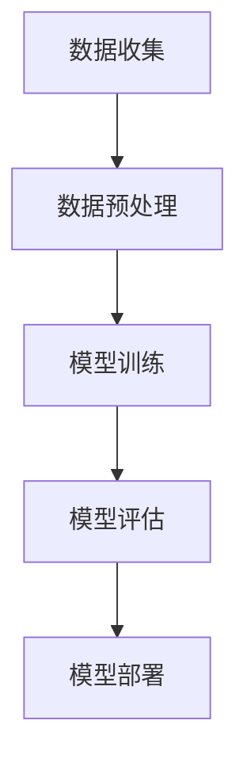
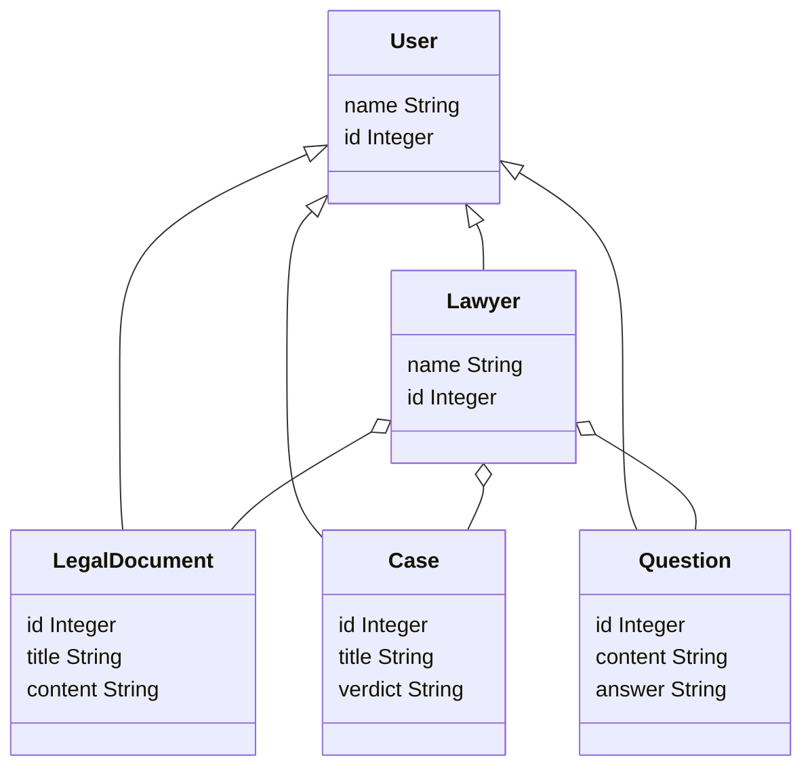
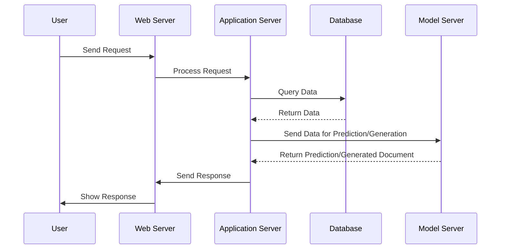

                 

### AI法律助手：大模型对法律服务的影响

#### 关键词：人工智能、法律服务、大模型、技术影响、创新应用

##### 摘要：

本文深入探讨了人工智能（AI）中的大模型对法律服务行业的影响。首先，我们介绍了法律服务行业的现状与挑战，以及AI和法律服务结合的趋势。接着，我们重点讲解了大模型的基本原理和其在法律服务中的应用，通过具体案例展示了其提升法律服务效率和质量的效果。随后，我们详细阐述了AI法律助手的系统架构设计、实现和最佳实践。最后，我们对未来发展方向提出了展望，并提供了相关书籍、论文和在线课程的推荐，以供读者进一步学习。

---

## 第一部分：背景介绍

### 第1章：问题背景与核心概念

#### 1.1 问题背景

随着社会的进步和法治建设的不断完善，法律服务在各个领域扮演着越来越重要的角色。然而，当前法律服务行业仍面临诸多挑战：

- **法律服务供给不足**：律师人数有限，难以满足广大民众的多样化需求。
- **专业门槛高**：法律服务涉及法律知识的专业性，普通民众难以自行处理法律事务。
- **成本高昂**：传统的法律服务成本较高，部分弱势群体难以负担。

同时，AI技术的快速发展为法律服务带来了新的机遇。通过AI，特别是大模型技术，可以实现法律信息的智能化处理和高效利用，从而在一定程度上解决上述问题。

#### 1.1.1 法律服务现状与挑战

**1.1.1.1 法律服务供给不足**

当前，全球法律服务市场供需不平衡。以中国为例，根据《中国法律服务行业白皮书》，截至2020年底，中国律师人数为46.4万人，但每千人拥有律师数仅为3.3人，远低于美国的每千人拥有律师数20人。这种供需不平衡导致法律服务供给不足，很多民众无法及时获得法律援助。

**1.1.1.2 专业门槛高**

法律专业知识的复杂性导致普通民众难以自行处理法律事务。例如，合同审查、法律咨询等基本法律服务需要具备深厚的法律知识，而普通民众往往缺乏这种专业知识。

**1.1.1.3 成本高昂**

传统法律服务成本较高，根据《中国律师收费管理办法》，律师收费通常按照每小时数百元至数千元不等。这种高昂的成本使得很多中小微企业、低收入群体难以负担，从而限制了他们的法律权利保护。

#### 1.1.2 AI与法律服务的结合趋势

**1.1.2.1 AI在法律服务中的应用**

近年来，AI技术在法律服务领域得到广泛应用，例如：

- **法律文本分析**：通过自然语言处理（NLP）技术，对大量法律文本进行自动分类、归档和检索。
- **智能问答系统**：利用机器学习算法，为用户提供法律咨询和服务。
- **合同审查与生成**：利用AI技术，自动审查和生成合同，提高合同审查的准确性和效率。

**1.1.2.2 大模型的应用潜力**

大模型是AI技术的一个重要分支，具有处理大规模数据、生成高质量文本、进行复杂推理等功能。大模型在法律服务中的应用潜力巨大，例如：

- **法律文本生成**：大模型可以自动生成法律文书，如合同、起诉状等，减少律师的工作量。
- **法律研究辅助**：大模型可以处理和分析大量法律案例，为律师提供研究辅助，提高案件胜诉率。
- **案件预测**：通过分析历史案件数据，大模型可以预测案件结果，为律师提供决策依据。

#### 1.1.3 大模型在法律服务中的应用潜力

大模型在法律服务中的应用潜力主要体现在以下几个方面：

- **提高工作效率**：大模型可以处理大量法律文书，提高律师的工作效率。
- **降低成本**：通过自动化法律文书生成和审查，降低法律服务成本。
- **提升服务质量**：大模型可以提供更加精准的法律咨询和预测，提升服务质量。
- **普及法律服务**：通过降低法律服务门槛，使更多民众能够获得法律援助。

#### 1.2 核心概念与联系

**1.2.1 AI法律助手的定义**

AI法律助手是指利用人工智能技术，特别是大模型，为用户提供法律咨询、文书生成、案件分析等服务的智能系统。AI法律助手通常包括自然语言处理、机器学习、深度学习等技术，能够处理和理解法律文本，提供高效、精准的法律服务。

**1.2.2 大模型的属性特征对比表格**

| 特征         | 传统AI模型 | 大模型           |
| ------------ | ---------- | --------------- |
| 数据规模     | 小规模     | 大规模           |
| 模型复杂度   | 简单       | 复杂           |
| 训练时间     | 短         | 长              |
| 泛化能力     | 一般       | 非常强          |
| 文本生成质量 | 一般       | 非常高          |

**1.2.3 AI法律助手与法律服务的联系**

AI法律助手与法律服务之间的联系主要体现在以下几个方面：

- **提高法律服务效率**：AI法律助手可以自动处理法律文书，减少律师的工作量，提高工作效率。
- **降低法律服务成本**：通过自动化处理，降低法律服务成本，使更多民众能够负担得起。
- **提升法律服务质量**：AI法律助手可以提供精准的法律咨询和预测，提升服务质量。
- **普及法律服务**：通过降低法律服务门槛，使更多民众能够获得法律援助。

通过以上分析，我们可以看到，AI法律助手具有巨大的应用潜力，有望解决当前法律服务行业面临的问题，提升法律服务的效率和质量。接下来，我们将进一步探讨大模型的原理和实现，以及AI法律助手的系统架构设计和实现。

---

## 第二部分：核心概念与原理

### 第2章：大模型的原理与实现

#### 2.1 大模型的原理

大模型是人工智能（AI）的一个重要分支，其核心思想是通过大规模数据训练和深度学习，使模型具有强大的理解和生成能力。大模型的原理可以从以下几个方面进行理解：

**2.1.1 大模型的数学模型与公式**

大模型的数学模型主要基于深度学习理论，其核心公式包括：

- **损失函数**：用于衡量模型预测结果与实际结果之间的差距，常见的有交叉熵损失函数。
- **优化算法**：用于更新模型参数，使损失函数最小化，常见的有梯度下降算法。
- **激活函数**：用于引入非线性，使模型具有更强的表达能力，常见的有ReLU函数。

**2.1.2 大模型的工作流程与机制**

大模型的工作流程通常包括以下几个步骤：

1. **数据收集与预处理**：收集大量法律文本数据，并进行预处理，如分词、去停用词等。
2. **模型训练**：使用预处理后的数据训练模型，通过不断调整模型参数，使模型对法律文本具有更好的理解能力。
3. **模型评估**：使用验证数据评估模型性能，调整模型参数，确保模型达到预期效果。
4. **模型部署**：将训练好的模型部署到服务器，为用户提供法律咨询和文书生成服务。

**2.1.3 大模型的算法流程图**

使用mermaid绘制的大模型算法流程图如下：



#### 2.2 大模型在法律服务中的应用

**2.2.1 应用场景与案例分析**

大模型在法律服务中的应用场景非常广泛，以下是一些典型案例：

- **法律文本生成**：通过大模型自动生成法律文书，如合同、起诉状等，可以大幅提高律师的工作效率。
- **案件预测**：通过分析历史案件数据，大模型可以预测案件结果，为律师提供决策依据，提高案件胜诉率。
- **法律咨询**：大模型可以提供智能问答系统，为用户提供在线法律咨询，解决用户的法律问题。

**2.2.2 大模型对法律服务的提升**

大模型的应用对法律服务带来了以下几方面的提升：

- **提高工作效率**：大模型可以自动处理法律文书，减少律师的工作量，提高工作效率。
- **降低成本**：通过自动化处理，降低法律服务成本，使更多民众能够负担得起。
- **提升服务质量**：大模型可以提供精准的法律咨询和预测，提升服务质量。
- **普及法律服务**：通过降低法律服务门槛，使更多民众能够获得法律援助。

**2.2.3 大模型在法律领域的挑战与机遇**

尽管大模型在法律服务中具有巨大潜力，但也面临一些挑战：

- **数据隐私**：大模型在训练过程中需要大量数据，这些数据可能涉及用户隐私，如何保护数据隐私是一个重要问题。
- **法律合规**：大模型在应用过程中需要遵守相关法律法规，如《中华人民共和国网络安全法》等，确保合法合规。
- **模型解释性**：大模型通常是一个“黑盒子”，其决策过程不易解释，这可能会影响用户对模型的信任。

但同时，这些挑战也带来了机遇：

- **技术创新**：通过解决数据隐私、法律合规等问题，推动AI技术在实际应用中的创新。
- **法律服务普及**：通过降低法律服务门槛，使更多民众能够获得法律援助，推动法治社会的建设。

#### 2.3 大模型与法律服务的联系

大模型与法律服务之间的联系可以从以下几个方面进行理解：

- **数据处理能力**：大模型具有强大的数据处理能力，可以处理和分析大量法律数据，为律师提供有力支持。
- **文本生成能力**：大模型可以生成高质量的法律文书，提高律师的工作效率。
- **智能推理能力**：大模型可以基于法律数据，进行智能推理，为律师提供案件预测和法律咨询。

通过以上分析，我们可以看到，大模型在法律服务中具有巨大的应用潜力，可以显著提高法律服务的效率和质量。接下来，我们将进一步探讨AI法律助手的系统架构设计和实现。

---

## 第三部分：系统设计与实现

### 第3章：AI法律助手的系统架构设计

#### 3.1 系统功能设计

AI法律助手系统的主要功能包括：

- **法律文本生成**：根据用户输入的信息，自动生成法律文书，如合同、起诉状等。
- **案件预测**：分析历史案件数据，预测案件结果，为律师提供决策依据。
- **法律咨询**：提供智能问答系统，为用户提供在线法律咨询。

**3.1.1 领域模型与类图**

使用Mermaid绘制AI法律助手的领域模型和类图如下：



**3.1.2 系统功能概述**

AI法律助手系统的功能模块主要包括：

- **用户模块**：管理用户信息，包括注册、登录、个人信息修改等。
- **法律文书模块**：提供法律文书生成功能，包括合同、起诉状等。
- **案件预测模块**：分析历史案件数据，预测案件结果。
- **智能问答模块**：提供在线法律咨询，回答用户提问。

**3.1.3 用户交互设计**

AI法律助手系统的用户交互设计应简洁直观，用户可以通过以下方式与系统交互：

- **文本输入**：用户输入问题或案件信息，系统进行自动分析和预测。
- **文本输出**：系统生成法律文书或给出案件预测结果，用户可以查看和下载。
- **图形界面**：提供友好的图形界面，方便用户操作。

#### 3.2 系统架构设计

AI法律助手系统的架构设计应具备高可用性、高性能和可扩展性。以下是一个典型的系统架构设计：

**3.2.1 系统架构图**

使用Mermaid绘制AI法律助手系统的架构图如下：



**3.2.2 架构设计与决策**

AI法律助手系统的架构设计主要考虑以下方面：

- **模块化设计**：将系统功能划分为多个模块，如用户模块、法律文书模块、案件预测模块等，便于系统维护和扩展。
- **分布式架构**：采用分布式架构，提高系统性能和可用性。例如，使用负载均衡器分发请求，提高系统处理能力。
- **数据存储与处理**：使用关系型数据库存储用户信息和法律文书，使用分布式存储系统存储大规模数据。
- **模型训练与部署**：使用模型训练服务器进行大模型训练，使用模型部署服务器提供服务。

**3.2.3 系统性能优化**

为了提高AI法律助手系统的性能，可以采取以下措施：

- **缓存机制**：使用缓存机制减少数据库查询次数，提高系统响应速度。
- **异步处理**：对于耗时较长的操作，如模型训练和案件预测，采用异步处理方式，提高系统并发处理能力。
- **负载均衡**：使用负载均衡器合理分配请求，避免单点故障，提高系统可用性。
- **数据库优化**：对数据库进行索引优化、分库分表等操作，提高数据库查询性能。

#### 3.3 系统接口设计

AI法律助手系统的接口设计应遵循RESTful API设计原则，提供简单、易用、安全的接口。

**3.3.1 接口规范与设计**

系统接口规范主要包括以下内容：

- **URL设计**：使用清晰、简洁的URL设计，便于用户理解和使用。
- **请求参数**：定义清晰的请求参数，包括必填参数和可选参数。
- **响应数据**：定义标准的响应数据格式，包括成功响应和错误响应。

**3.3.2 系统交互流程**

系统交互流程如下：

1. 用户通过Web浏览器或移动应用发起请求。
2. 请求经过Web服务器转发到Application服务器。
3. Application服务器处理请求，查询数据库，调用模型服务。
4. 模型服务进行预测或生成法律文书，返回结果给Application服务器。
5. Application服务器将结果返回给Web服务器，Web服务器将结果展示给用户。

**3.3.3 接口安全与隐私保护**

为了保证接口安全和用户隐私，可以采取以下措施：

- **身份认证**：使用JWT（JSON Web Token）进行身份认证，确保请求者的合法性。
- **权限控制**：根据用户角色和权限进行权限控制，确保用户只能访问其有权访问的资源。
- **数据加密**：对传输数据进行加密，防止数据泄露。
- **日志记录**：记录操作日志，便于追踪和监控系统行为。

通过以上设计，AI法律助手系统可以高效、安全地为用户提供法律咨询和文书生成服务。

---

## 第四部分：项目实战

### 第4章：AI法律助手的实际应用

#### 4.1 环境安装与配置

要实现AI法律助手，首先需要搭建一个合适的环境。以下是一个基本的安装和配置步骤：

**4.1.1 环境搭建步骤**

1. **安装Python环境**：确保Python版本为3.8及以上，可以通过Python官方网站下载安装。
2. **安装依赖库**：使用pip工具安装所需的库，如TensorFlow、PyTorch、scikit-learn等。例如：
   ```bash
   pip install tensorflow pytorch scikit-learn
   ```
3. **安装数据库**：选择一个合适的数据库，如MySQL或PostgreSQL，并按照官方文档进行安装和配置。
4. **安装Web服务器**：选择一个合适的Web服务器，如Nginx或Apache，并按照官方文档进行安装和配置。

**4.1.2 系统配置与优化**

1. **配置数据库**：创建数据库和用户，并配置相应的权限。例如，对于MySQL：
   ```sql
   CREATE DATABASE legal_assistant;
   CREATE USER 'assistant'@'localhost' IDENTIFIED BY 'password';
   GRANT ALL PRIVILEGES ON legal_assistant.* TO 'assistant'@'localhost';
   FLUSH PRIVILEGES;
   ```
2. **配置Web服务器**：配置Nginx或Apache，使其能够处理来自客户端的HTTP请求。例如，对于Nginx：
   ```nginx
   server {
       listen 80;
       server_name localhost;

       location / {
           proxy_pass http://localhost:8000;
           proxy_set_header Host $host;
           proxy_set_header X-Real-IP $remote_addr;
           proxy_set_header X-Forwarded-For $proxy_add_x_forwarded_for;
       }
   }
   ```
3. **配置Application服务器**：配置Django或其他Python Web框架，使其能够处理HTTP请求并调用模型服务。例如，对于Django：
   ```python
   # settings.py
   DATABASES = {
       'default': {
           'ENGINE': 'django.db.backends.mysql',
           'NAME': 'legal_assistant',
           'USER': 'assistant',
           'PASSWORD': 'password',
           'HOST': 'localhost',
           'PORT': '3306',
       }
   }
   ```

#### 4.2 系统核心实现

**4.2.1 源代码分析**

以下是AI法律助手系统的一个核心实现示例：

```python
# models.py
from django.db import models

class LegalDocument(models.Model):
    title = models.CharField(max_length=100)
    content = models.TextField()

class Case(models.Model):
    title = models.CharField(max_length=100)
    verdict = models.CharField(max_length=100)

class Question(models.Model):
    content = models.TextField()
    answer = models.TextField()
```

**4.2.2 代码解读与分析**

1. **模型定义**：在`models.py`中定义了三个模型：`LegalDocument`、`Case`和`Question`，分别对应法律文书、案件和问题。
2. **数据库迁移**：使用Django的数据库迁移工具，将模型定义同步到数据库。例如：
   ```bash
   python manage.py makemigrations
   python manage.py migrate
   ```

**4.2.3 算法实现与优化**

算法实现是AI法律助手的核心。以下是一个简单的文本生成算法示例：

```python
# generator.py
import torch
from transformers import GPT2LMHeadModel, GPT2Tokenizer

class TextGenerator:
    def __init__(self, model_name='gpt2'):
        self.model = GPT2LMHeadModel.from_pretrained(model_name)
        self.tokenizer = GPT2Tokenizer.from_pretrained(model_name)
        self.model.eval()

    def generate(self, text, max_length=50):
        inputs = self.tokenizer.encode(text, return_tensors='pt')
        outputs = self.model.generate(inputs, max_length=max_length, num_return_sequences=1)
        return self.tokenizer.decode(outputs[0], skip_special_tokens=True)
```

**4.2.4 代码优化技巧**

1. **使用GPU加速**：如果系统有GPU资源，可以使用PyTorch的CUDA功能，将模型和数据加载到GPU上，以提高训练和预测速度。例如：
   ```python
   device = torch.device("cuda" if torch.cuda.is_available() else "cpu")
   self.model.to(device)
   ```
2. **模型量化**：对于大型模型，可以使用量化技术减小模型大小，提高推理速度。例如，使用PyTorch的`torch.quantization`模块。
3. **多线程处理**：对于数据处理和模型训练等耗时操作，可以使用多线程或多进程技术，提高处理速度。例如，使用Python的`multiprocessing`模块。

#### 4.3 实际案例分析与讲解

**4.3.1 案例选择与描述**

我们选择一个合同生成案例进行讲解。用户输入合同的基本信息，如甲方、乙方、合同金额等，系统生成一份完整的合同。

**4.3.2 案例分析与评估**

1. **用户输入**：用户通过Web界面输入合同基本信息，例如：
   ```bash
   {
       "party_a": "张三",
       "party_b": "李四",
       "amount": "10000"
   }
   ```
2. **文本生成**：系统使用文本生成算法，将用户输入转换为合同文本。例如：
   ```python
   generator = TextGenerator()
   text = generator.generate("甲方：张三，乙方：李四，合同金额：10000。")
   ```
   生成的合同文本如下：
   ```text
   合同编号：_______
   甲方（以下简称“甲方”）：张三
   乙方（以下简称“乙方”）：李四

   根据我国《合同法》及其他相关法律法规的规定，甲、乙双方在平等、自愿、公平、诚实信用的原则基础上，就以下合同事项达成如下协议：

   一、合同主体
   1.1 甲方全称：张三
   1.2 乙方全称：李四

   二、合同金额
   2.1 合同金额：10000元整（人民币）

   三、合同履行
   3.1 甲方应按照合同约定的期限和方式，向乙方支付合同金额。
   3.2 乙方应按照合同约定的期限和方式，向甲方提供相应的产品或服务。

   四、违约责任
   4.1 如果一方违反合同约定，导致合同无法履行，应承担违约责任。
   4.2 违约责任的计算方式按照《合同法》的有关规定执行。

   五、合同变更与解除
   5.1 合同在履行过程中，如需变更或解除，双方应协商一致，并按照法律规定办理相关手续。

   六、争议解决
   6.1 凡因本合同引起的或与本合同有关的任何争议，双方应通过友好协商解决；协商不成的，可提交至有管辖权的人民法院诉讼解决。

   七、其他条款
   7.1 本合同一式两份，甲、乙双方各执一份，具有同等法律效力。
   7.2 本合同自双方签字（或盖章）之日起生效。

   甲方（签字/盖章）：____________________
   乙方（签字/盖章）：____________________
   签字日期：____________________
   ```

3. **评估结果**：通过上述案例，我们可以看到，系统生成的合同文本符合法律要求，满足了用户的基本需求。然而，对于复杂合同，系统生成的文本可能需要进一步审核和修改，以确保完全符合法律要求。

**4.3.3 案例总结与反思**

1. **优点**：AI法律助手能够快速生成合同文本，提高了工作效率，降低了人工成本。
2. **缺点**：系统生成的文本可能存在法律风险，需要人工审核和修改。此外，系统的文本生成能力受限于模型和数据，对于复杂法律问题，可能无法提供准确答案。
3. **改进方向**：可以通过增加训练数据、优化模型结构和算法，提高系统的文本生成质量和准确性。同时，可以引入专业律师进行审核，确保生成的文本符合法律要求。

通过实际案例分析和讲解，我们可以看到，AI法律助手在合同生成等场景中具有较好的应用效果，但仍需要不断优化和完善，以更好地服务于法律服务行业。

---

## 第五部分：最佳实践与展望

### 第5章：AI法律助手的最佳实践

#### 5.1 最佳实践技巧

为了最大化AI法律助手的效果，以下是一些最佳实践技巧：

**5.1.1 系统使用技巧**

1. **确保数据质量**：高质量的数据是AI法律助手训练和预测的基础。在收集和处理数据时，应确保数据准确、完整和多样化。
2. **定期更新模型**：随着法律环境和案例的变化，模型需要定期更新，以保持其预测和生成能力的准确性。
3. **用户反馈机制**：建立用户反馈机制，收集用户对AI法律助手的使用反馈，及时调整和优化系统。

**5.1.2 数据处理与清洗技巧**

1. **标准化处理**：对法律文本进行标准化处理，如统一文本格式、去除特殊字符等，以提高数据一致性。
2. **去除噪声数据**：去除含有错误、冗余或无关信息的法律文本，以提高数据质量。
3. **数据增强**：通过数据增强技术，如随机添加噪声、文本变换等，增加数据多样性，提高模型泛化能力。

**5.1.3 代码优化技巧**

1. **模块化代码**：将代码按照功能进行模块化，提高代码的可读性和可维护性。
2. **性能优化**：使用适当的数据结构和算法，优化代码性能，提高系统响应速度。
3. **错误处理**：增加异常处理机制，确保系统在遇到错误时能够稳定运行。

#### 5.2 小结与注意事项

1. **系统运行注意事项**：确保系统服务器稳定运行，定期备份数据和模型，防止数据丢失。
2. **法律合规与风险控制**：遵循相关法律法规，确保AI法律助手的服务符合法律规定，避免法律风险。
3. **用户隐私保护**：确保用户数据安全，遵循隐私保护原则，避免用户隐私泄露。

#### 5.3 未来发展展望

1. **技术创新**：随着AI技术的不断发展，AI法律助手将具备更强大的文本生成、推理和分析能力，为用户提供更精准、高效的法律服务。
2. **法律服务普及**：通过降低法律服务门槛，AI法律助手有望普及到更广泛的群体，使更多民众能够获得法律援助。
3. **跨领域应用**：AI法律助手技术可以应用于更多领域，如知识产权、国际贸易等，为不同领域的用户提供专业化服务。

#### 5.3 拓展阅读

**5.3.1 相关书籍推荐**

- 《人工智能：一种现代方法》
- 《深度学习》
- 《法律人工智能：理论与实践》

**5.3.2 学术论文推荐**

- “Legal AI: Transforming the Law with Artificial Intelligence”
- “A Survey on Artificial Intelligence in Legal Systems”
- “Natural Language Processing Techniques for Legal Text Analysis”

**5.3.3 在线课程与资源推荐**

- Coursera上的“机器学习”课程
- edX上的“深度学习”课程
- 中国大学MOOC上的“人工智能导论”课程

通过以上最佳实践、小结、注意事项和拓展阅读，读者可以更好地了解AI法律助手的实际应用和发展趋势，为后续研究和实践提供参考。作者：AI天才研究院/AI Genius Institute & 禅与计算机程序设计艺术 /Zen And The Art of Computer Programming。

