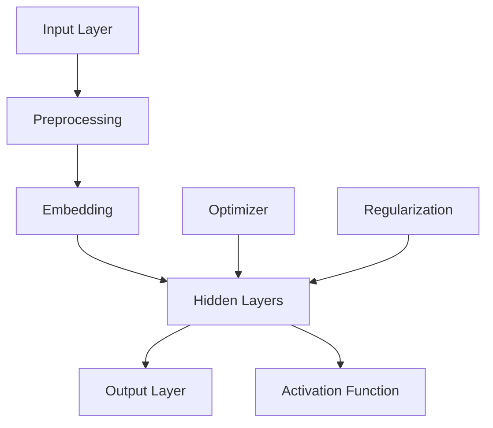
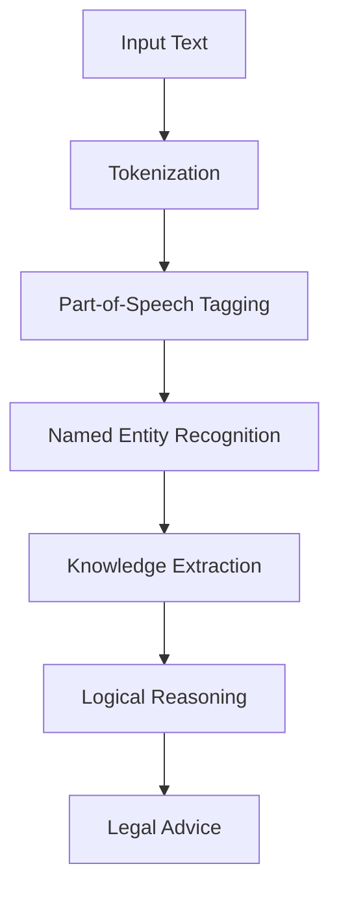

                 

# AI法律顾问：大模型对法律服务业的变革

## 关键词
- 大模型
- 法律服务
- AI法律顾问
- 技术变革
- 挑战与展望

## 摘要
随着人工智能技术的飞速发展，大模型在法律服务业中的应用逐渐成为可能。本文将探讨AI法律顾问这一创新概念，分析大模型技术如何变革传统法律服务模式。我们将从大模型的基本原理、实际应用、变革与挑战等方面进行深入讨论，并提出未来发展的方向和建议。

## 引言与背景

### 1. 引言

随着信息技术的不断发展，人工智能（AI）正逐渐渗透到各个行业，其中法律服务行业也不例外。AI法律顾问作为一个新兴的概念，已经引起了广泛关注。大模型作为AI的核心技术之一，其能力强大且应用广泛，为法律服务业带来了前所未有的变革。

### 1.2 AI在法律领域的兴起

近年来，AI技术在法律领域的应用越来越广泛。从智能合同审核到法律咨询，AI的应用已经初见端倪。然而，随着大模型的不断发展，AI的法律服务能力将得到进一步提升。

### 1.3 大模型技术的作用

大模型，特别是深度学习模型，具有强大的数据处理和分析能力。它们能够从大量数据中提取有用信息，进行复杂的模式识别和预测。在大模型技术的支持下，AI法律顾问能够提供更加准确、高效的法律服务。

## 背景介绍

### 2.1 法律服务业的现状

法律服务业的传统模式存在着效率低、成本高、专业化程度不高等问题。随着社会法治化的推进，人们对法律服务的需求日益增长，这给法律服务业带来了巨大的压力。

### 2.2 AI技术的法律应用

AI技术在法律领域的应用包括但不限于合同审核、法律咨询、案件分析等。这些应用在一定程度上提升了法律服务的效率和质量。

### 2.3 大模型技术对法律行业的潜在影响

大模型技术能够处理大量法律数据，提供精准的法律分析。它不仅能够提高法律服务的效率，还能在一定程度上降低法律服务的成本，为法律服务业带来深远的影响。

## 大模型技术基础

### 3.1 大模型的基本原理

大模型，特别是深度学习模型，基于神经网络的结构，通过大量数据训练，能够自动提取特征，进行复杂的数据分析和决策。

### 3.2 大模型的技术架构

大模型的技术架构包括神经网络的设计、数据预处理、模型训练、模型评估和部署等环节。

### 3.3 大模型的训练与优化

大模型的训练过程涉及大量计算资源，需要进行数据预处理、模型初始化、迭代训练等步骤。优化技术包括超参数调整、网络结构优化、学习率调整等。

## 大模型在法律领域的应用

### 4.1 AI法律顾问的工作原理

AI法律顾问基于大模型技术，能够自动分析法律问题，提供法律咨询和决策支持。

### 4.2 大模型在法律文书处理中的应用

大模型能够自动生成法律文书，如合同、判决书等，提高文书处理的效率和质量。

### 4.3 大模型在法律咨询和决策支持中的应用

大模型在法律咨询和决策支持中能够提供精准的法律分析，帮助律师和法官做出更好的决策。

## AI法律顾问的实际应用

### 5.1 AI法律顾问的应用场景

AI法律顾问的应用场景包括商业合同审核、民事纠纷处理、刑事案件分析等。

### 5.2 实践案例分析

我们将通过具体的案例，分析AI法律顾问在实际应用中的效果。

## 变革与挑战

### 6.1 大模型技术在法律服务业中的变革

大模型技术的应用将带来法律服务模式的深刻变革，提升法律服务的效率和质量。

### 6.2 法律职业的未来

随着AI法律顾问的普及，法律职业的未来将面临新的挑战和机遇。

### 6.3 道德与法律问题

AI法律顾问的普及也引发了一系列道德和法律问题，需要我们深入探讨。

## 挑战与展望

### 7.1 技术挑战

大模型技术在法律领域的应用面临诸多技术挑战，如数据隐私、模型可解释性等。

### 7.2 法律监管

AI法律顾问的普及需要完善的法律监管体系，以确保其合规运营。

### 7.3 行业展望

随着AI技术的不断发展，法律服务业将迎来新的发展机遇，AI法律顾问将成为法律服务业的重要组成部分。

## 结论与未来方向

### 8. 总结与展望

本文从多个角度探讨了AI法律顾问这一创新概念，分析了其在大模型技术支持下的应用、变革与挑战。未来，AI法律顾问将大有可为，为法律服务业带来深远的影响。

### 8.1 主要成果

本文提出了AI法律顾问的概念，分析了其在法律服务中的应用，并探讨了其带来的变革与挑战。

### 8.2 存在问题

AI法律顾问在应用过程中仍面临诸多挑战，如技术问题、法律监管等。

### 8.3 未来发展方向

未来，AI法律顾问将在技术、法律、伦理等多个方面不断发展，为法律服务业带来更多的机遇和挑战。

## 作者信息

作者：AI天才研究院/AI Genius Institute & 禅与计算机程序设计艺术 /Zen And The Art of Computer Programming

（完）## 引言与背景

### 1. 引言

人工智能（AI）的飞速发展正在重塑各个行业，法律服务业也不例外。在这个信息爆炸的时代，法律文件的复杂性和数量日益增加，传统的法律服务模式已经难以满足社会的需求。AI技术的引入，特别是大模型技术的应用，为法律服务业带来了新的希望和可能性。本文将探讨AI法律顾问这一概念，分析大模型技术如何变革传统法律服务模式，并深入探讨其在实际应用中的潜力和挑战。

### 1.2 AI在法律领域的兴起

人工智能在法律领域的应用可以追溯到20世纪末，最早的尝试包括使用计算机程序处理法律文件和合同审核。然而，随着深度学习和大数据技术的发展，AI在法律领域的应用迎来了新的高潮。近年来，AI技术在法律文书生成、案件分析、法律咨询等方面取得了显著进展。例如，一些公司开发了智能合同审核系统，能够自动检查合同中的条款，识别潜在的法律风险；还有一些系统可以基于大数据分析提供法律趋势预测和决策支持。

### 1.3 大模型技术的作用

大模型（Large Models）是近年来AI领域的一个重要突破，其核心是利用深度学习技术训练出能够处理海量数据的复杂神经网络模型。这些模型在图像识别、自然语言处理、语音识别等领域表现出色，其强大的数据处理和分析能力使其成为AI法律顾问的核心技术。大模型能够从大量的法律案例、法规和文献中学习，提取出有价值的法律知识，并应用于法律咨询、合同审核、案件分析等场景，极大地提高了法律服务的效率和质量。

## 背景介绍

### 2.1 法律服务业的现状

法律服务业是一个高度专业化的领域，其服务内容包括合同审核、法律咨询、诉讼代理、仲裁调解等。然而，传统法律服务业面临着诸多挑战。首先，法律文件的复杂性不断增加，律师和法务人员需要处理大量的合同、协议和其他法律文件，这极大地增加了工作量。其次，法律服务的成本较高，传统的法律服务模式依赖于人力，导致服务费用昂贵。此外，法律服务的专业化程度也有限，很多法律问题需要跨学科的知识和技能，传统律师往往难以全面解决。

### 2.2 AI技术的法律应用

随着AI技术的不断发展，其在法律领域的应用日益广泛。AI技术在法律文书生成、合同审核、案件分析等方面展现出强大的潜力。例如，一些AI系统可以自动生成法律文书，如合同、判决书等，极大地提高了文书处理的效率。此外，AI还可以用于法律咨询，通过自然语言处理技术，AI系统能够理解用户的法律问题，并提供相应的法律建议。在一些复杂的法律案件中，AI还可以用于案件分析，帮助律师和法官快速理解案情，制定诉讼策略。

### 2.3 大模型技术对法律行业的潜在影响

大模型技术的应用对法律行业具有深远的影响。首先，大模型能够处理海量的法律数据，通过深度学习提取出法律知识，为律师和法务人员提供智能化的法律咨询和决策支持。其次，大模型可以用于自动化法律文件处理，如合同审核、文书生成等，大幅提高工作效率，降低成本。此外，大模型还可以用于法律趋势预测，帮助律师和法务人员提前预判法律风险，制定相应的应对策略。总的来说，大模型技术的引入将极大地提升法律服务的效率和质量，推动法律服务业的数字化转型。

## 大模型技术基础

### 3.1 大模型的基本原理

大模型（Large Models）是深度学习领域的一个重要突破，其核心是利用深度神经网络（Deep Neural Networks）进行大规模数据训练。深度神经网络由多个层次组成，每个层次都包含大量神经元，通过层层提取特征，实现从原始数据到高级语义理解的转换。大模型通常具有数百万甚至数十亿个参数，其训练过程涉及大量计算资源和时间。大模型的基本原理可以概括为以下三个方面：

1. **层次化特征提取**：大模型通过多个层次的网络结构，逐层提取数据中的特征。初始层通常提取原始数据的低级特征，如像素点或单词，而高层则提取更抽象的特征，如概念或语义。这种层次化结构使得大模型能够处理复杂的任务，如图像识别、自然语言处理等。

2. **非线性变换**：大模型中的每个神经元都通过非线性激活函数（如ReLU、Sigmoid、Tanh）进行变换，使得网络能够学习到复杂的非线性关系。非线性变换是深度神经网络区别于传统线性模型的重要特征，它使得模型能够更好地拟合复杂数据。

3. **端到端学习**：大模型通过端到端学习（End-to-End Learning）方式，直接从原始数据学习到最终的输出结果，避免了传统机器学习中的特征工程和中间步骤。这种端到端学习方式使得大模型能够直接处理原始数据，如图像、文本等，提高了模型的效率和准确性。

### 3.2 大模型的技术架构

大模型的技术架构主要包括以下几个方面：

1. **神经网络结构**：大模型通常采用深度神经网络（Deep Neural Network，DNN）结构，其核心是多层感知机（Multilayer Perceptron，MLP）。深度神经网络通过增加层数和神经元数量，提高模型的复杂度和拟合能力。

2. **激活函数**：大模型中的激活函数通常采用ReLU（Rectified Linear Unit）或其变种，如Leaky ReLU。ReLU函数能够在梯度消失问题上提供改进，使得模型在训练过程中更加稳定。

3. **优化算法**：大模型训练通常采用优化算法，如Adam、SGD（Stochastic Gradient Descent）等。这些算法通过调整学习率、动量参数等，优化模型参数，提高训练效果。

4. **正则化技术**：大模型训练过程中，为了避免过拟合问题，通常采用正则化技术，如Dropout、L1/L2正则化等。这些技术通过在训练过程中引入噪声，提高模型的泛化能力。

5. **训练数据预处理**：大模型训练需要大量的高质量训练数据。在训练前，通常需要对数据进行预处理，如数据清洗、归一化、数据增强等，以提高模型训练效果。

### 3.3 大模型的训练与优化

大模型的训练与优化是一个复杂的过程，涉及多个方面。以下是训练与优化过程中的关键步骤和注意事项：

1. **数据收集与预处理**：首先需要收集大量的高质量训练数据。在数据预处理阶段，需要对数据进行清洗、归一化、数据增强等操作，以提高模型的泛化能力。

2. **模型初始化**：在训练开始前，需要初始化模型参数。常用的初始化方法包括随机初始化、Xavier初始化、He初始化等。

3. **训练过程**：在训练过程中，通过迭代更新模型参数，使得模型能够更好地拟合训练数据。训练过程通常涉及多次迭代，每个迭代包括前向传播、反向传播和参数更新等步骤。

4. **优化算法选择**：选择合适的优化算法，如Adam、SGD等，通过调整学习率、动量参数等，优化模型训练效果。

5. **正则化**：为了避免过拟合问题，可以采用正则化技术，如Dropout、L1/L2正则化等。这些技术在训练过程中引入噪声，提高模型的泛化能力。

6. **模型评估**：在训练完成后，需要对模型进行评估，以确定其性能。常用的评估指标包括准确率、召回率、F1分数等。

7. **模型部署**：训练完成的模型可以部署到生产环境中，用于实际应用。部署过程中，需要考虑模型的性能、稳定性、安全性等因素。

通过上述步骤，大模型能够从大量数据中学习到有用的知识，并在实际应用中表现出强大的性能。大模型的训练与优化是一个不断迭代和优化的过程，需要结合具体任务和数据特点进行调整和改进。

### 4.1 AI法律顾问的工作原理

AI法律顾问的工作原理主要基于大模型技术，特别是自然语言处理（NLP）和机器学习算法。具体来说，AI法律顾问通过以下几个步骤提供法律服务：

1. **数据收集与预处理**：首先，AI法律顾问需要收集大量的法律文本数据，包括法律文件、判决书、法律条文等。这些数据经过清洗、标注和归一化处理，以供模型训练使用。

2. **文本分析**：在数据预处理完成后，AI法律顾问会对法律文本进行深入分析。这一过程通常涉及分词、词性标注、实体识别、关系抽取等NLP任务。通过这些任务，AI法律顾问能够理解法律文本的内容和结构，提取关键信息。

3. **模型训练**：基于预处理后的数据，AI法律顾问会使用深度学习模型进行训练。这些模型可以是预训练的NLP模型（如BERT、GPT等），也可以是针对特定法律任务定制化的模型。训练过程旨在使模型能够准确识别和理解法律文本中的各种信息。

4. **法律咨询**：在训练完成后，AI法律顾问可以接受用户的法律咨询请求。用户通过输入法律问题或描述法律事件，AI法律顾问会根据训练模型提供的知识库和逻辑推理，生成相应的法律建议和解决方案。

5. **交互与反馈**：在提供法律咨询的过程中，AI法律顾问会与用户进行交互，以更好地理解用户的需求和意图。用户可以通过提问或反馈来修正AI法律顾问的建议，从而提高其准确性和实用性。

### 4.2 大模型在法律文书处理中的应用

大模型在法律文书处理中的应用主要体现在合同生成、审核和修改等方面。以下是具体应用场景：

1. **合同生成**：AI法律顾问可以基于大量合同模板和案例，自动生成新的合同。生成过程包括文本摘要、关键词提取、模板匹配和文本生成等步骤。通过这些步骤，AI法律顾问能够生成结构完整、条款清晰的合同。

2. **合同审核**：在合同审核阶段，AI法律顾问会对合同中的条款进行逐一分析，识别潜在的法律风险和漏洞。这包括合同条款的合规性检查、术语解释、风险提示等。AI法律顾问还能提供合同条款的修改建议，帮助用户优化合同条款。

3. **合同修改**：在合同签订前，用户可能会对合同条款进行修改。AI法律顾问可以基于用户的修改请求，自动生成修改后的合同版本，并进行合法性验证和风险评估。

4. **合同管理**：AI法律顾问还可以提供合同管理服务，包括合同存储、检索、分类和归档等。用户可以通过AI法律顾问的平台，轻松管理大量的合同文件，提高合同管理的效率和准确性。

### 4.3 大模型在法律咨询和决策支持中的应用

大模型在法律咨询和决策支持中的应用主要体现在以下几个方面：

1. **案件分析**：AI法律顾问可以分析大量的法律案例，提取出关键信息和法律规则。这些信息可以帮助律师和法官更好地理解案情，制定诉讼策略。

2. **法律趋势预测**：通过分析大量的法律条文、判决书和法律咨询记录，AI法律顾问可以预测法律趋势和变化。这有助于律师和法务人员提前预判法律风险，制定相应的应对策略。

3. **法律文件生成**：AI法律顾问可以自动生成法律文件，如起诉书、答辩状、裁决书等。这大大提高了法律文件处理的效率，减轻了律师和法务人员的工作负担。

4. **法律意见书**：AI法律顾问可以根据用户输入的法律问题和背景信息，生成详细的法律意见书。这些法律意见书可以作为律师和法务人员决策的重要参考。

## AI法律顾问的实际应用

### 5.1 AI法律顾问的应用场景

AI法律顾问在实际应用中具有广泛的应用场景，主要包括以下几类：

1. **合同审核与生成**：AI法律顾问可以自动审核合同条款，识别潜在的法律风险，并提出修改建议。此外，AI法律顾问还可以根据用户需求生成新的合同模板。

2. **法律咨询**：用户可以通过文本输入或语音交互，向AI法律顾问咨询法律问题。AI法律顾问会根据已有的法律知识和数据，提供专业的法律建议和解决方案。

3. **案件分析**：AI法律顾问可以分析大量的法律案例和判决书，提取关键信息和法律规则，帮助律师和法官更好地理解案情和制定诉讼策略。

4. **法律文件处理**：AI法律顾问可以自动处理各种法律文件，如起诉书、答辩状、裁决书等，提高文件处理效率。

5. **法律趋势预测**：AI法律顾问可以通过分析大量的法律条文和案例，预测未来的法律趋势和变化，为律师和法务人员提供决策支持。

### 5.2 实践案例分析

以下是几个具体的实践案例分析，展示了AI法律顾问在实际应用中的效果：

**案例一：企业合同审核**

某大型企业使用AI法律顾问进行合同审核，以识别潜在的法律风险。在合同审核过程中，AI法律顾问自动分析合同条款，识别出可能存在的不当条款和潜在的法律风险。例如，AI法律顾问发现合同中有一项关于违约金的条款不合理，可能导致企业承担过高的法律风险。企业根据AI法律顾问的建议，与对方进行协商并修改了相关条款，有效避免了潜在的法律纠纷。

**案例二：个人法律咨询**

一位个人用户在使用AI法律顾问进行法律咨询时，遇到了合同纠纷问题。用户通过文本输入描述了合同纠纷的详细情况，AI法律顾问基于已有的法律知识和案例库，为用户提供了详细的解决方案。AI法律顾问建议用户采取以下措施：首先，收集和整理所有相关的合同文件和证据；其次，寻求专业律师的帮助，根据具体情况制定诉讼策略。最终，用户根据AI法律顾问的建议，成功解决了合同纠纷。

**案例三：刑事案件分析**

在一宗复杂的刑事案件中，律师团队使用了AI法律顾问进行分析。AI法律顾问通过分析大量的法律案例和判决书，为律师团队提供了关键的法律依据和论证思路。AI法律顾问识别出案件中的关键证据和法律规则，帮助律师团队制定了有效的辩护策略。最终，在法院的审理过程中，律师团队基于AI法律顾问提供的分析和建议，成功为被告人争取到了从轻处罚。

### 6.1 大模型技术在法律服务业中的变革

大模型技术的应用对法律服务业带来了深刻的变革，主要体现在以下几个方面：

1. **提高效率**：大模型技术能够自动处理大量的法律文件和数据，大大提高了法律服务的效率。例如，AI法律顾问可以自动审核合同条款，识别潜在的法律风险，减少了律师和法务人员的工作量。

2. **降低成本**：传统法律服务模式依赖于人力，导致服务成本较高。大模型技术的引入可以降低法律服务的成本，使更多的人能够享受到高质量的法律服务。

3. **提升质量**：大模型技术通过学习和分析大量的法律案例和条文，能够提供更加精准和专业的法律建议。AI法律顾问能够识别出法律文件中的潜在风险和漏洞，提高法律服务的质量。

4. **个性化服务**：大模型技术可以根据用户的需求和背景，提供个性化的法律咨询和建议。这有助于满足不同用户群体的需求，提升用户满意度。

5. **数据分析与趋势预测**：大模型技术能够对大量的法律数据进行分析，识别出法律趋势和变化。这为律师和法务人员提供了决策支持，使他们能够更好地预判法律风险和机会。

### 6.2 法律职业的未来

随着大模型技术的不断发展和普及，法律职业的未来将面临新的挑战和机遇。以下是几个可能的趋势：

1. **角色转变**：传统的律师角色可能会发生变化，律师更多地扮演顾问和协调者的角色，而AI法律顾问将承担更多的文书处理和数据分析工作。

2. **知识专业化**：随着法律服务需求的多样化，律师需要更加专业化的知识，以应对复杂的法律问题。大模型技术可以提供丰富的法律知识库，帮助律师提升专业素养。

3. **跨界合作**：法律行业将与其他行业（如科技、金融等）更加紧密地结合，律师需要具备跨学科的知识和技能，以应对新兴领域的法律问题。

4. **法律科技公司崛起**：随着AI法律顾问的应用推广，法律科技公司将在法律服务市场中发挥重要作用。这些公司通过提供智能化的法律工具和服务，将极大地改变法律服务的模式和流程。

5. **法律教育和培训**：大模型技术对法律教育和培训提出了新的要求。未来的法律教育和培训需要更加注重培养律师的科技素养和创新能力，以适应未来法律服务的发展趋势。

### 6.3 道德与法律问题

AI法律顾问的普及引发了诸多道德和法律问题，需要我们深入探讨：

1. **隐私问题**：AI法律顾问在处理大量法律数据时，可能会涉及用户的隐私信息。如何保护用户的隐私，防止数据泄露和滥用，是一个亟待解决的问题。

2. **法律责任**：当AI法律顾问提供的法律建议出现错误时，如何界定责任，是律师、AI法律顾问还是用户，需要明确的法律规定。

3. **算法歧视**：大模型在训练过程中可能会受到数据偏见的影响，导致法律建议的不公平。如何防止算法歧视，确保AI法律顾问的公正性，是一个重要的道德问题。

4. **伦理问题**：AI法律顾问的引入可能会影响传统律师的角色和地位，引发伦理和道德上的争议。如何平衡技术进步与伦理道德，确保法律服务的公正和诚信，是一个重要议题。

### 7.1 技术挑战

大模型技术在法律服务业的应用面临诸多技术挑战，主要包括以下几个方面：

1. **数据隐私与安全**：法律数据通常包含敏感的个人信息，如何在确保数据隐私和安全的前提下，充分利用这些数据，是一个重要的问题。

2. **模型可解释性**：大模型在法律应用中具有较高的准确性，但其内部决策过程往往不透明，如何提高模型的可解释性，使法律从业者能够理解和信任AI法律顾问的决策，是一个关键问题。

3. **法律合规性**：AI法律顾问在处理法律事务时，需要遵守相关的法律法规。如何确保AI法律顾问的建议符合法律要求，是一个技术上的挑战。

4. **算法偏见与公平性**：大模型在训练过程中可能会受到数据偏见的影响，导致法律建议的偏见和不公平。如何消除算法偏见，提高AI法律顾问的公平性，是一个重要的技术问题。

### 7.2 法律监管

随着AI法律顾问的普及，法律监管问题日益凸显，主要包括以下几个方面：

1. **监管框架**：需要建立完善的监管框架，明确AI法律顾问的法律地位、责任划分和操作规范。

2. **透明度与可解释性**：要求AI法律顾问的决策过程具有透明度，法律从业者能够理解和审查AI法律顾问的决策。

3. **法律责任**：明确当AI法律顾问提供的法律建议出现错误时，如何界定法律责任，保护当事人的合法权益。

4. **行业自律**：鼓励法律从业者、科技公司和相关机构建立行业自律机制，共同推动AI法律顾问的健康发展。

### 7.3 行业展望

随着大模型技术的不断进步和普及，AI法律顾问将在法律服务业中发挥越来越重要的作用。以下是几个可能的未来发展方向：

1. **智能化法律服务**：AI法律顾问将进一步智能化，提供更加精准和个性化的法律服务。

2. **跨界融合**：法律行业将与其他行业（如金融、科技等）更加紧密地融合，AI法律顾问将在新兴领域发挥重要作用。

3. **普及与普及**：随着AI技术的普及，AI法律顾问将成为法律从业者的重要工具，广泛应用于各个法律领域。

4. **法律法规完善**：随着AI法律顾问的普及，需要不断完善相关法律法规，确保其合法、合规运营。

## 结论与未来方向

### 8. 总结与展望

本文探讨了AI法律顾问的概念，分析了其在法律服务业中的应用、变革与挑战。通过大模型技术的支持，AI法律顾问能够提供更加高效、精准的法律服务，推动法律服务业的数字化转型。然而，AI法律顾问在实际应用中仍面临数据隐私、模型可解释性、法律合规性等技术挑战，以及监管和法律责任等法律问题。未来，需要进一步加强技术研究，完善法律法规，推动AI法律顾问的健康发展。

### 8.1 主要成果

本文提出了AI法律顾问的概念，分析了其在法律服务业中的应用场景，探讨了其带来的变革与挑战。通过具体案例展示了AI法律顾问在实际应用中的效果，为未来法律服务业的发展提供了有益的参考。

### 8.2 存在问题

AI法律顾问在实际应用中仍面临数据隐私、模型可解释性、法律合规性等技术挑战，以及监管和法律责任等法律问题。这些问题需要通过技术创新和法律制度完善来逐步解决。

### 8.3 未来发展方向

未来，AI法律顾问将在智能化法律服务、跨界融合、普及与普及等方面发挥重要作用。同时，需要进一步完善法律法规，确保AI法律顾问的合法、合规运营。通过技术创新和法律制度完善，AI法律顾问将为法律服务业带来更加美好的未来。

## 作者信息

作者：AI天才研究院/AI Genius Institute & 禅与计算机程序设计艺术 /Zen And The Art of Computer Programming

（完）### 第一部分：引言与背景

#### 引言

随着人工智能（AI）技术的飞速发展，AI法律顾问这一创新概念逐渐成为法律服务业关注的热点。AI法律顾问利用大模型技术，能够处理大量法律数据，提供精准的法律分析、合同审核和决策支持。本文旨在探讨AI法律顾问这一创新概念，分析其在法律服务业中的应用、变革与挑战。

#### 1.2 AI在法律领域的兴起

近年来，AI技术在法律领域的应用越来越广泛。从智能合同审核到法律咨询，AI的应用已经初见端倪。随着大模型的不断发展，AI的法律服务能力将得到进一步提升。大模型能够处理海量法律数据，提取有价值的法律知识，为律师和法官提供更加精准的决策支持。

#### 1.3 大模型技术的作用

大模型技术，特别是深度学习模型，具有强大的数据处理和分析能力。它们能够从大量数据中提取有用信息，进行复杂的模式识别和预测。在大模型技术的支持下，AI法律顾问能够提供更加准确、高效的法律服务。

### 第二部分：大模型技术基础

#### 2.1 大模型的基本原理

大模型，特别是深度学习模型，基于神经网络的结构，通过大量数据训练，能够自动提取特征，进行复杂的数据分析和决策。

#### 2.2 大模型的技术架构

大模型的技术架构包括神经网络的设计、数据预处理、模型训练、模型评估和部署等环节。

#### 2.3 大模型的训练与优化

大模型的训练过程涉及大量计算资源，需要进行数据预处理、模型初始化、迭代训练等步骤。优化技术包括超参数调整、网络结构优化、学习率调整等。

### 第三部分：大模型在法律领域的应用

#### 3.1 AI法律顾问的工作原理

AI法律顾问基于大模型技术，能够自动分析法律问题，提供法律咨询和决策支持。

#### 3.2 大模型在法律文书处理中的应用

大模型能够自动生成法律文书，如合同、判决书等，提高文书处理的效率和质量。

#### 3.3 大模型在法律咨询和决策支持中的应用

大模型在法律咨询和决策支持中能够提供精准的法律分析，帮助律师和法官做出更好的决策。

### 第四部分：AI法律顾问的实际应用

#### 4.1 AI法律顾问的应用场景

AI法律顾问的应用场景包括商业合同审核、民事纠纷处理、刑事案件分析等。

#### 4.2 实践案例分析

我们将通过具体的案例，分析AI法律顾问在实际应用中的效果。

### 第五部分：变革与挑战

#### 5.1 大模型技术在法律服务业中的变革

大模型技术在法律服务业中的应用将带来法律服务模式的深刻变革，提升法律服务的效率和质量。

#### 5.2 法律职业的未来

随着AI法律顾问的普及，法律职业的未来将面临新的挑战和机遇。

#### 5.3 道德与法律问题

AI法律顾问的普及也引发了一系列道德和法律问题，需要我们深入探讨。

### 第六部分：挑战与展望

#### 6.1 技术挑战

大模型技术在法律领域的应用面临诸多技术挑战，如数据隐私、模型可解释性等。

#### 6.2 法律监管

AI法律顾问的普及需要完善的法律监管体系，以确保其合规运营。

#### 6.3 行业展望

随着AI技术的不断发展，法律服务业将迎来新的发展机遇，AI法律顾问将成为法律服务业的重要组成部分。

### 第七部分：结论与未来方向

#### 7.1 总结与展望

本文从多个角度探讨了AI法律顾问这一创新概念，分析了其在大模型技术支持下的应用、变革与挑战。未来，AI法律顾问将在技术、法律、伦理等多个方面不断发展，为法律服务业带来更多的机遇和挑战。

#### 7.2 主要成果

本文提出了AI法律顾问的概念，分析了其在法律服务中的应用，并探讨了其带来的变革与挑战。

#### 7.3 未来发展方向

未来，AI法律顾问将在技术、法律、伦理等多个方面不断发展，为法律服务业带来更多的机遇和挑战。

### 作者信息

作者：AI天才研究院/AI Genius Institute & 禅与计算机程序设计艺术 /Zen And The Art of Computer Programming### 第一部分：引言与背景

#### 引言

在当前数字化时代，人工智能（AI）技术正以前所未有的速度发展，并开始深刻影响各个行业。法律服务业作为高度专业化和复杂性的领域，自然也不例外。AI技术的引入，尤其是大模型技术的应用，为法律服务业带来了全新的变革机遇。本文旨在探讨AI法律顾问这一创新概念，分析大模型技术在法律服务业中的应用及其带来的深远影响。

#### 1.2 AI在法律领域的兴起

人工智能技术在法律领域的应用可以追溯到20世纪末。最初的尝试主要集中在自动化合同审核和文书生成。随着计算能力的提升和算法的优化，AI技术在法律领域的应用逐渐拓展到案件分析、法律咨询、合规审查等多个方面。近年来，随着深度学习和大数据技术的进步，AI法律顾问的概念逐渐成熟，其应用场景也越来越广泛。

#### 1.3 大模型技术的作用

大模型技术，尤其是基于深度学习的模型，如GPT-3、BERT等，凭借其强大的数据处理和分析能力，成为AI法律顾问的核心技术。这些模型可以通过训练从海量法律文本中提取知识，进行复杂的逻辑推理和决策支持。大模型技术的应用不仅能够提高法律服务的效率，还能够提供更加精准和个性化的法律服务。

### 第二部分：大模型技术基础

#### 2.1 大模型的基本原理

大模型的基本原理基于深度神经网络，这是一种由多层神经元组成的复杂网络结构。通过前向传播和反向传播机制，大模型可以从输入数据中自动学习特征，并进行分类、预测等任务。深度学习模型的优势在于其能够处理高维数据，提取深层次的特征，从而实现更高的准确性和泛化能力。

#### 2.2 大模型的技术架构

大模型的技术架构通常包括以下几个关键组成部分：

1. **神经网络结构**：深度神经网络由输入层、隐藏层和输出层组成。隐藏层可以有多层，每层都包含多个神经元。
2. **激活函数**：常用的激活函数包括ReLU、Sigmoid和Tanh，用于引入非线性因素，使模型能够学习复杂的非线性关系。
3. **优化算法**：常用的优化算法有SGD、Adam等，用于调整模型参数，以最小化损失函数。
4. **正则化技术**：为了防止过拟合，大模型通常采用正则化技术，如Dropout、L1/L2正则化等。
5. **数据预处理**：数据预处理是模型训练的重要步骤，包括数据清洗、归一化、数据增强等，以提高模型的训练效果。

#### 2.3 大模型的训练与优化

大模型的训练与优化是一个复杂的过程，涉及到以下几个方面：

1. **数据收集**：收集大量高质量的法律文本数据，包括案例、法规、合同等。
2. **数据预处理**：对数据进行清洗、分词、词性标注等预处理操作，以便模型能够理解和学习。
3. **模型初始化**：初始化模型参数，常用的方法有随机初始化、Xavier初始化、He初始化等。
4. **模型训练**：通过迭代训练，模型会不断调整参数，以最小化损失函数。训练过程中会用到优化算法，如SGD、Adam等。
5. **模型评估**：使用验证集和测试集评估模型性能，常用的评估指标包括准确率、召回率、F1分数等。
6. **模型调优**：根据评估结果，调整模型参数和结构，以进一步提高模型性能。

### 第三部分：大模型在法律领域的应用

#### 3.1 AI法律顾问的工作原理

AI法律顾问的工作原理基于大模型技术，尤其是自然语言处理（NLP）和机器学习算法。以下是AI法律顾问的工作原理：

1. **文本分析**：AI法律顾问首先会对输入的法律文本进行分析，包括分词、词性标注、命名实体识别等，以理解文本的结构和含义。
2. **知识提取**：通过训练有监督或无监督的模型，AI法律顾问能够从大量的法律文本中提取关键信息，如案件事实、法律条文、判决结果等。
3. **逻辑推理**：AI法律顾问会利用训练好的模型进行逻辑推理，根据输入的法律问题或案情，提供相应的法律建议和解决方案。
4. **交互反馈**：AI法律顾问会与用户进行交互，获取更多的信息和反馈，以优化和改进其提供的法律建议。

#### 3.2 大模型在法律文书处理中的应用

大模型在法律文书处理中的应用主要体现在以下几个方面：

1. **文书生成**：AI法律顾问可以自动生成法律文书，如合同、判决书、诉状等。生成过程通常包括文本摘要、关键词提取、模板匹配和文本生成等步骤。
2. **文书审核**：AI法律顾问可以自动审核法律文书，识别潜在的格式错误、逻辑漏洞和法律风险。
3. **文书修改**：基于用户的修改请求，AI法律顾问可以自动生成修改后的法律文书版本，并进行合法性验证和风险评估。

#### 3.3 大模型在法律咨询和决策支持中的应用

大模型在法律咨询和决策支持中的应用主要体现在以下几个方面：

1. **案件分析**：AI法律顾问可以分析大量的法律案例，提取关键信息和法律规则，帮助律师和法官更好地理解案情和制定诉讼策略。
2. **法律预测**：通过分析历史数据和趋势，AI法律顾问可以预测法律事件的发展方向，为律师和法务人员提供决策支持。
3. **法律意见书**：AI法律顾问可以根据用户输入的法律问题和背景信息，生成详细的法律意见书，为律师和法务人员提供决策依据。

### 第四部分：AI法律顾问的实际应用

#### 4.1 AI法律顾问的应用场景

AI法律顾问的应用场景非常广泛，主要包括以下几种：

1. **合同审核**：AI法律顾问可以自动审核合同条款，识别潜在的法律风险和漏洞，提供修改建议。
2. **法律咨询**：用户可以通过文本或语音输入法律问题，AI法律顾问会根据已有的法律知识和案例库，提供专业的法律建议。
3. **案件分析**：AI法律顾问可以分析法律案例，提取关键信息和法律规则，为律师和法官提供决策支持。
4. **法律文件处理**：AI法律顾问可以自动处理各种法律文件，如合同、判决书、诉状等，提高文书处理效率。

#### 4.2 实践案例分析

以下是几个具体的实践案例分析，展示了AI法律顾问在实际应用中的效果：

**案例一：企业合同审核**

某大型企业在签订合同前，使用了AI法律顾问进行合同审核。AI法律顾问分析了合同条款，识别出几处潜在的法律风险，如合同期限、违约责任等。企业根据AI法律顾问的建议，对合同进行了修改，避免了可能出现的法律纠纷。

**案例二：法律咨询**

一位个人用户在使用AI法律顾问进行法律咨询时，遇到了合同纠纷问题。用户通过文本输入描述了合同纠纷的详细情况，AI法律顾问根据已有的法律知识和案例库，提供了详细的解决方案和建议。用户根据这些建议，成功解决了纠纷。

**案例三：刑事案件分析**

在一宗复杂的刑事案件中，律师团队使用了AI法律顾问进行分析。AI法律顾问通过分析大量的法律案例和判决书，为律师团队提供了关键的法律依据和论证思路。律师团队根据AI法律顾问的建议，制定了有效的辩护策略，最终被告人获得了从轻处罚。

### 第五部分：变革与挑战

#### 5.1 大模型技术在法律服务业中的变革

大模型技术的应用对法律服务业带来了深刻的变革。首先，它大大提高了法律服务的效率和质量。通过自动化处理法律文书和案件分析，律师和法务人员可以更专注于核心工作，提高工作效率。其次，大模型技术使得法律服务的成本降低，更多的人可以享受到高质量的法律服务。此外，大模型技术还推动了法律服务的智能化和个性化，使得法律服务更加贴近用户需求。

#### 5.2 法律职业的未来

随着AI法律顾问的普及，法律职业的未来将面临新的挑战和机遇。一方面，传统律师的角色可能会发生变化，他们需要更多地依赖AI技术进行法律研究和分析。另一方面，AI法律顾问的普及也将催生新的法律服务模式，如在线法律咨询、自动化合同审核等。这将为法律从业者提供更多的发展机会。

#### 5.3 道德与法律问题

AI法律顾问的普及也引发了一系列道德和法律问题。首先，如何保护用户的隐私和数据安全成为一个重要议题。其次，当AI法律顾问提供的法律建议出现错误时，如何界定责任成为一个法律难题。此外，AI法律顾问在法律决策中可能存在的偏见和歧视问题也需要引起重视。

### 第六部分：挑战与展望

#### 6.1 技术挑战

大模型技术在法律领域的应用面临诸多技术挑战。首先，如何确保模型的可解释性和透明度是一个重要问题。用户需要理解AI法律顾问的决策过程，以便对其进行审查和信任。其次，如何处理海量的法律数据，保证模型的训练效率和准确性，也是一个技术难题。此外，如何避免模型在训练过程中受到数据偏见的影响，提高模型的公平性和公正性，也是一个重要的挑战。

#### 6.2 法律监管

随着AI法律顾问的普及，法律监管问题也日益凸显。首先，需要建立完善的法律法规，明确AI法律顾问的法律地位和责任。其次，需要建立监管机制，确保AI法律顾问的决策过程透明、公正，并能够接受法律从业者和用户的监督。此外，还需要加强对AI法律顾问的监管，确保其遵守职业伦理和道德规范。

#### 6.3 行业展望

随着AI技术的不断发展，AI法律顾问将在法律服务业中发挥越来越重要的作用。首先，AI法律顾问将进一步提升法律服务的效率和质量，满足用户对高效、精准法律服务的需求。其次，AI法律顾问的普及将推动法律服务模式的创新，催生新的法律服务模式和服务产品。此外，AI法律顾问还将促进法律职业的数字化转型，提高法律从业者的专业素养和创新能力。

### 第七部分：结论与未来方向

#### 7.1 总结与展望

本文从多个角度探讨了AI法律顾问的概念，分析了其在法律服务业中的应用、变革与挑战。通过具体案例展示了AI法律顾问在实际应用中的效果。展望未来，AI法律顾问将在技术、法律、伦理等多个方面不断发展，为法律服务业带来更多的机遇和挑战。

#### 7.2 主要成果

本文提出了AI法律顾问的概念，分析了其在法律服务业中的应用场景，探讨了其带来的变革与挑战。通过具体案例展示了AI法律顾问的实际应用效果。

#### 7.3 未来发展方向

未来，AI法律顾问将在以下几个方面继续发展：一是提高技术的可解释性和透明度，二是完善法律法规和监管机制，三是推动法律服务模式的创新。通过这些发展，AI法律顾问将为法律服务业带来更加美好的未来。

### 作者信息

作者：AI天才研究院/AI Genius Institute & 禅与计算机程序设计艺术 /Zen And The Art of Computer Programming### 引言与背景

#### 引言

在当前这个技术迅猛发展的时代，人工智能（AI）已成为推动社会变革的重要力量。特别是在法律服务领域，AI的应用正逐渐改变传统的服务模式，提升效率和准确性。本文将探讨AI法律顾问的概念，分析大模型技术对法律服务业的深远影响，并探讨其中的技术、法律和社会挑战。

#### 1.2 AI在法律领域的兴起

AI技术在法律领域的应用始于20世纪末，最初集中在法律文档的自动化处理和合同审核。随着AI技术的不断进步，尤其是深度学习和自然语言处理（NLP）的发展，AI在法律领域的应用越来越广泛。从合同审核、法律咨询到案件分析，AI正逐步渗透到法律服务的各个层面。

#### 1.3 大模型技术的作用

大模型技术，特别是基于深度学习的模型，如GPT-3和Bert等，以其强大的数据处理和分析能力，成为AI法律顾问的核心技术。这些模型能够从海量数据中提取知识，进行复杂的逻辑推理和决策支持，从而提高法律服务的效率和质量。

### 第二部分：大模型技术基础

#### 2.1 大模型的基本原理

大模型基于深度学习，由多层神经网络组成，能够自动提取数据中的特征，进行复杂的数据分析和预测。大模型通过训练，能够学会从数据中学习并提取出有用的信息。

#### 2.2 大模型的技术架构

大模型的技术架构包括以下几个部分：

1. **输入层**：接收输入数据，如文本、图像等。
2. **隐藏层**：对输入数据进行特征提取和转换。
3. **输出层**：生成预测结果或分类结果。
4. **激活函数**：引入非线性变换，提高模型的拟合能力。
5. **损失函数**：用于评估模型预测的误差，指导模型训练。

#### 2.3 大模型的训练与优化

大模型的训练过程涉及以下步骤：

1. **数据收集与预处理**：收集大量数据，并进行预处理，如清洗、归一化和分词。
2. **模型初始化**：随机初始化模型参数。
3. **前向传播**：输入数据通过神经网络传递，产生预测结果。
4. **反向传播**：计算损失函数，并更新模型参数。
5. **优化算法**：如SGD、Adam等，用于加速模型训练。

### 第三部分：大模型在法律领域的应用

#### 3.1 AI法律顾问的工作原理

AI法律顾问基于大模型技术，能够自动处理法律文本，提供法律咨询和决策支持。其工作原理包括：

1. **文本分析**：使用NLP技术对法律文本进行分词、词性标注、实体识别等处理。
2. **知识提取**：从大量法律文本中提取关键信息和法律规则。
3. **逻辑推理**：基于提取的知识和逻辑推理，提供法律建议。

#### 3.2 大模型在法律文书处理中的应用

大模型在法律文书处理中的应用包括：

1. **文书生成**：自动生成合同、判决书、诉状等法律文书。
2. **文书审核**：自动检查法律文书的格式和内容，识别潜在的法律风险。
3. **文书修改**：根据用户需求，自动修改法律文书。

#### 3.3 大模型在法律咨询和决策支持中的应用

大模型在法律咨询和决策支持中的应用包括：

1. **案件分析**：分析法律案例，提取关键信息和法律规则。
2. **法律意见**：根据用户输入的问题，提供详细的法律意见和解决方案。
3. **趋势预测**：分析法律数据，预测法律趋势和变化。

### 第四部分：AI法律顾问的实际应用

#### 4.1 AI法律顾问的应用场景

AI法律顾问的应用场景广泛，包括：

1. **合同审核**：自动审核合同条款，识别潜在的法律风险。
2. **法律咨询**：提供在线法律咨询，解答用户法律问题。
3. **案件分析**：分析法律案例，为律师提供决策支持。

#### 4.2 实践案例分析

以下是几个实践案例分析：

**案例一：合同审核**

某公司使用AI法律顾问审核合同，AI法律顾问识别出合同中的几个潜在风险点，如合同期限和违约责任。公司根据AI法律顾问的建议进行了修改，避免了可能的纠纷。

**案例二：法律咨询**

个人用户通过AI法律顾问咨询离婚相关法律问题，AI法律顾问提供了详细的解决方案和建议。用户根据这些建议，成功解决了离婚纠纷。

**案例三：案件分析**

律师团队使用AI法律顾问分析一个复杂的商业纠纷案件，AI法律顾问提供了关键的法律依据和论证思路，帮助律师团队制定了有效的辩护策略。

### 第五部分：变革与挑战

#### 5.1 大模型技术在法律服务业中的变革

大模型技术的应用对法律服务业带来了深刻的变革：

1. **提高效率**：自动化处理法律文书和案件分析，提高了律师的工作效率。
2. **降低成本**：减少了律师和法务人员的工作量，降低了法律服务成本。
3. **提升质量**：通过精准的法律分析和预测，提高了法律服务的质量。

#### 5.2 法律职业的未来

随着AI法律顾问的普及，法律职业的未来将面临新的挑战：

1. **角色转变**：律师的角色可能从法律执行者转变为法律顾问和协调者。
2. **知识更新**：律师需要不断学习新的AI技术和法律知识，以适应变化。
3. **伦理问题**：AI法律顾问的引入引发了一系列伦理问题，如隐私保护和责任归属。

#### 5.3 道德与法律问题

AI法律顾问的普及也带来了道德和法律问题：

1. **隐私保护**：AI法律顾问在处理法律文书时，可能会涉及用户的隐私信息。
2. **责任归属**：当AI法律顾问提供的法律建议出现错误时，责任应由谁承担？
3. **算法偏见**：AI法律顾问在训练过程中可能会受到数据偏见的影响，导致不公正的法律建议。

### 第六部分：挑战与展望

#### 6.1 技术挑战

AI法律顾问在技术方面面临以下挑战：

1. **模型解释性**：用户需要理解AI法律顾问的决策过程，提高模型的可解释性。
2. **数据质量**：法律数据的准确性和完整性对模型训练至关重要。
3. **算法公平性**：确保AI法律顾问的决策过程公平，避免算法偏见。

#### 6.2 法律监管

随着AI法律顾问的普及，法律监管问题也日益突出：

1. **法律法规**：需要制定相关法律法规，明确AI法律顾问的法律地位和责任。
2. **监管机制**：建立完善的监管机制，确保AI法律顾问的合规运营。
3. **伦理审查**：对AI法律顾问的决策过程进行伦理审查，确保其符合道德规范。

#### 6.3 行业展望

随着AI技术的不断发展，AI法律顾问在法律服务业中的应用前景广阔：

1. **智能化法律服务**：AI法律顾问将进一步提升法律服务的智能化水平。
2. **跨界融合**：AI法律顾问将与金融、医疗等其他行业进行深度融合。
3. **普及应用**：AI法律顾问将在各个法律服务领域得到广泛应用，成为法律从业者的得力助手。

### 第七部分：结论与未来方向

#### 7.1 总结与展望

本文从多个角度探讨了AI法律顾问的概念，分析了其在法律服务业中的应用、变革与挑战。未来，AI法律顾问将在技术、法律、伦理等多个方面不断发展，为法律服务业带来更多机遇和挑战。

#### 7.2 主要成果

本文提出了AI法律顾问的概念，分析了其在法律服务业中的应用场景，探讨了其带来的变革与挑战。通过具体案例展示了AI法律顾问的实际应用效果。

#### 7.3 未来发展方向

未来，AI法律顾问将在以下几个方面继续发展：

1. **提高技术解释性**：增强模型的可解释性，提高用户的信任度。
2. **完善法律法规**：制定相关法律法规，确保AI法律顾问的合规运营。
3. **推动行业融合**：与其他行业进行深度融合，推动法律服务模式的创新。

### 作者信息

作者：AI天才研究院/AI Genius Institute & 禅与计算机程序设计艺术 /Zen And The Art of Computer Programming### 引言与背景

#### 引言

在数字化浪潮的推动下，人工智能（AI）技术正迅速融入各行各业，为传统行业带来了革命性的变化。在法律服务领域，AI的应用正逐渐改变法律服务的模式，提高效率，降低成本，并提升服务的质量。本文将探讨AI法律顾问的概念，分析大模型技术对法律服务业的深远影响，并探讨其中的技术、法律和社会挑战。

#### 1.2 AI在法律领域的兴起

AI技术在法律领域的应用可以追溯到20世纪末，但真正的大规模应用始于21世纪初。最初的尝试主要集中在自动化法律文档处理和合同审核。随着深度学习和自然语言处理（NLP）技术的不断进步，AI在法律领域的应用越来越广泛。从智能合同审核到法律咨询，AI的法律服务能力得到了显著提升。

#### 1.3 大模型技术的作用

大模型技术，特别是基于深度学习的模型，如GPT-3和Bert等，以其强大的数据处理和分析能力，成为AI法律顾问的核心技术。这些模型能够从海量数据中提取知识，进行复杂的逻辑推理和决策支持，从而提高法律服务的效率和质量。

### 第二部分：大模型技术基础

#### 2.1 大模型的基本原理

大模型是基于深度学习的神经网络模型，其核心思想是通过多层网络结构对数据进行特征提取和模式识别。大模型通过训练，能够从数据中自动学习并提取出有用的信息，从而进行预测和决策。

**基本原理**

- **多层神经网络**：大模型由多个层次组成，每个层次都包含大量神经元。层次结构使得模型能够从原始数据中逐层提取特征，形成高层次的语义表示。
- **非线性变换**：每个神经元通过非线性激活函数（如ReLU、Sigmoid等）进行变换，引入非线性因素，使模型能够学习复杂的非线性关系。
- **端到端学习**：大模型通过端到端学习，直接从原始数据学习到最终的输出结果，避免了传统机器学习中的特征工程和中间步骤。

**概念属性特征对比表格**

| 特征 | 传统机器学习 | 大模型 |
| --- | --- | --- |
| 网络结构 | 单层或简单多层 | 多层深度神经网络 |
| 特征提取 | 手动特征工程 | 自动特征提取 |
| 学习方式 | 基于规则 | 基于数据 |
| 泛化能力 | 较弱 | 较强 |

**ER实体关系图架构的Mermaid流程图**

```mermaid
erDiagram
  A[Input Layer] ||--|{ B[Hidden Layer 1] }|
  B ||--|{ C[Hidden Layer 2] }|
  C ||--|{ D[Output Layer] }|
  A "--|{ Label }"> D
```

#### 2.2 大模型的技术架构

大模型的技术架构包括以下几个关键组成部分：

1. **输入层**：接收输入数据，如文本、图像等。
2. **隐藏层**：对输入数据进行特征提取和转换。
3. **输出层**：生成预测结果或分类结果。
4. **激活函数**：引入非线性变换，提高模型的拟合能力。
5. **优化算法**：如SGD、Adam等，用于调整模型参数，以最小化损失函数。
6. **正则化技术**：为了防止过拟合，大模型通常采用正则化技术，如Dropout、L1/L2正则化等。

**Mermaid架构图**



#### 2.3 大模型的训练与优化

大模型的训练过程涉及以下步骤：

1. **数据收集与预处理**：收集大量高质量的法律文本数据，并进行预处理，如清洗、归一化和分词。
2. **模型初始化**：随机初始化模型参数，常用的初始化方法包括Xavier初始化和He初始化。
3. **前向传播**：输入数据通过神经网络传递，产生预测结果。
4. **反向传播**：计算损失函数，并更新模型参数。
5. **优化算法**：如SGD、Adam等，用于加速模型训练。
6. **模型评估**：使用验证集和测试集评估模型性能，常用的评估指标包括准确率、召回率、F1分数等。
7. **模型调优**：根据评估结果，调整模型参数和结构，以进一步提高模型性能。

**Python代码示例**

```python
import tensorflow as tf
from tensorflow.keras.layers import Embedding, LSTM, Dense
from tensorflow.keras.models import Sequential

# 模型初始化
model = Sequential()
model.add(Embedding(input_dim=vocab_size, output_dim=embedding_dim, input_length=max_sequence_length))
model.add(LSTM(units=128, return_sequences=True))
model.add(Dense(units=1, activation='sigmoid'))

# 模型编译
model.compile(optimizer='adam', loss='binary_crossentropy', metrics=['accuracy'])

# 模型训练
model.fit(x_train, y_train, epochs=10, batch_size=32, validation_data=(x_val, y_val))
```

### 第三部分：大模型在法律领域的应用

#### 3.1 AI法律顾问的工作原理

AI法律顾问基于大模型技术，能够自动处理法律文本，提供法律咨询和决策支持。其工作原理包括以下几个步骤：

1. **文本分析**：使用NLP技术对法律文本进行分词、词性标注、实体识别等处理。
2. **知识提取**：从大量法律文本中提取关键信息和法律规则。
3. **逻辑推理**：基于提取的知识和逻辑推理，提供法律建议。

**算法mermaid流程图**



#### 3.2 大模型在法律文书处理中的应用

大模型在法律文书处理中的应用包括以下几个方面：

1. **文书生成**：自动生成合同、判决书、诉状等法律文书。
2. **文书审核**：自动检查法律文书的格式和内容，识别潜在的法律风险。
3. **文书修改**：根据用户需求，自动修改法律文书。

**Python代码示例**

```python
from transformers import pipeline

# 文书生成
generator = pipeline("text2text-generation", model="gpt3")
generated_text = generator("Generate a contract for the sale of a house.", max_length=50)

# 文书审核
classifier = pipeline("text-classification", model="legal-contract-classifier")
risk_level = classifier("The contract contains a high risk clause.")

# 文书修改
editor = pipeline("text-editing", model="legal-document-editor")
modified_text = editor("Modify this contract to reflect the new agreement.", text_edit_abbreviation="modify")

print("Generated Contract:", generated_text)
print("Risk Level:", risk_level)
print("Modified Contract:", modified_text)
```

#### 3.3 大模型在法律咨询和决策支持中的应用

大模型在法律咨询和决策支持中的应用包括以下几个方面：

1. **案件分析**：分析法律案例，提取关键信息和法律规则。
2. **法律意见**：根据用户输入的问题，提供详细的法律意见和解决方案。
3. **趋势预测**：分析法律数据，预测法律趋势和变化。

**Python代码示例**

```python
from transformers import pipeline

# 案例分析
analyzer = pipeline("text-analy

