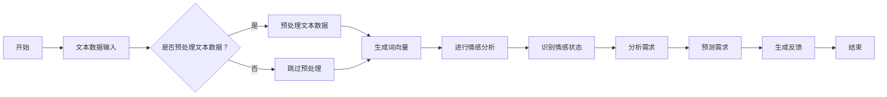

                 

## 前言

### 1.1 问题背景

随着人工智能（AI）技术的飞速发展，各行各业都在积极探索如何利用AI技术提升服务质量和效率。保险行业作为金融服务业的重要组成部分，也在积极拥抱AI技术，以期在激烈的竞争环境中脱颖而出。特别是在情感需求识别这一领域，AI的应用潜力得到了广泛的关注。

传统的保险产品大多以标准化、一刀切的方式提供服务，难以满足消费者的个性化需求。而AI的情感需求识别技术，通过分析消费者的情感状态和行为模式，能够更准确地捕捉消费者的情感需求，为保险公司提供更有针对性的服务方案。这一变革不仅有助于提升客户满意度，还能有效降低运营成本，提高保险公司的市场竞争力。

近年来，随着大数据、云计算和深度学习等技术的不断进步，AI的情感需求识别技术也取得了显著的成果。通过自然语言处理（NLP）技术，AI可以分析消费者的语言表达，识别出潜在的情感信息；通过计算机视觉技术，AI可以分析消费者的面部表情和身体语言，进一步丰富对情感需求的认知。这些技术的应用，为保险产品的智能化升级提供了强有力的支持。

### 1.2 问题描述

保险产品的核心在于风险管理和客户服务。然而，传统保险产品往往忽视客户情感需求的满足，导致客户满意度不高，甚至影响客户粘性和市场占有率。如何通过AI技术理解和满足客户的情感需求，成为保险行业亟待解决的问题。

首先，保险产品的设计和服务流程往往较为复杂，涉及多种保险条款和保障内容。消费者在购买保险时，常常面临信息不对称和决策困难的问题。AI的情感需求识别技术可以帮助保险公司更好地理解消费者的需求和困惑，提供个性化的咨询和建议，从而提高购买体验和满意度。

其次，保险公司在客户服务过程中，往往需要处理大量的客户投诉和咨询。通过AI的情感需求识别技术，可以快速准确地识别客户的情感状态，提供及时、有效的回应和解决方案，减少客户的等待时间和不满情绪。

最后，保险公司在风险管理方面也面临着巨大的挑战。通过分析客户的情感需求和行为模式，保险公司可以更准确地预测潜在的风险，采取预防措施，降低保险理赔的风险和成本。

### 1.3 问题解决

本书旨在通过深入研究和探讨AI的情感需求识别技术，为保险产品的创新设计提供理论支持和实践指导。具体而言，本书将解决以下几个关键问题：

1. **AI情感需求识别技术的原理和实现**：介绍AI情感需求识别的基本原理，包括自然语言处理、情感分析和需求预测等核心技术，并通过具体的算法和模型进行详细阐述。

2. **AI在保险产品中的应用**：分析AI技术在保险风险评估、理赔管理、客户服务等方面的应用，探讨如何通过AI技术提升保险产品的智能化和个性化水平。

3. **新型保险产品的设计**：基于AI情感需求识别技术，探讨如何设计新型保险产品，以满足客户的情感需求，提高客户满意度和忠诚度。

4. **实施策略和案例分析**：提出具体的实施策略，并通过实际案例进行分析，总结成功经验、挑战和未来发展方向。

通过以上研究，本书希望能够为保险公司提供创新的保险产品设计思路和实施策略，推动保险行业的智能化升级，实现客户、保险公司和市场的多方共赢。

### 1.4 边界与外延

本书的研究主要聚焦于AI情感需求识别技术在保险产品中的应用，具体包括以下几个方面：

1. **技术范围**：本书主要关注AI情感需求识别技术，包括自然语言处理、情感分析和需求预测等核心技术的应用。此外，还会涉及到相关的大数据和机器学习技术。

2. **行业范围**：本书的研究对象主要针对保险行业，特别是商业保险和个人保险领域。同时，也会探讨这些技术在其他金融行业的潜在应用。

3. **法律和伦理问题**：本书将探讨AI情感需求识别技术在应用过程中可能遇到的法律和伦理问题，如隐私保护、数据安全、算法公平性等。

4. **社会影响**：本书还将分析AI情感需求识别技术在保险行业中的应用对社会带来的影响，包括提高服务质量、降低风险、改善消费者体验等方面。

总之，本书旨在为保险行业的智能化升级提供理论支持和实践指导，推动保险产品向更加智能化、个性化和服务化的方向发展。

---

在接下来的章节中，我们将详细探讨AI情感需求识别技术的原理和实现，分析AI在保险产品中的应用，以及如何设计新型保险产品来满足客户的情感需求。让我们一步一步地深入这一前沿领域，探索AI在保险行业的无限可能。

---

## 1.2 AI的情感需求识别原理

### 1.2.1 情感需求识别的概念

情感需求识别是指利用人工智能技术，通过分析消费者的语言、行为和互动，识别其情感状态和需求的过程。这一技术旨在帮助保险公司更准确地理解客户的情感状态，从而提供更加个性化、贴心的服务。情感需求识别不仅仅局限于识别客户的正面情感，如满意、高兴，还包括负面情感，如焦虑、不满，以及对特定情境的情感反应。

在保险领域，情感需求识别的应用非常广泛。例如，在客户购买保险时，通过情感需求识别技术，保险公司可以识别客户在咨询过程中的情感状态，从而提供更加个性化的产品推荐和服务。在客户理赔过程中，通过情感需求识别技术，保险公司可以及时发现客户的情感需求，提供及时的心理支持和解决方案，从而提升客户满意度。

### 1.2.2 情感需求识别的核心要素

情感需求识别的核心要素主要包括情感识别、需求分析和情感反馈。

1. **情感识别**：
   - **定义**：情感识别是指通过分析客户的语言、行为和互动，识别其情感状态的过程。
   - **实现方式**：情感识别通常依赖于自然语言处理（NLP）技术，特别是情感分析（Sentiment Analysis）。通过情感分析，AI系统可以识别出文本中的情感倾向，如正面、负面或中性。
   - **技术细节**：情感识别技术包括词向量表示、情感词典、情感分类器等。词向量表示用于将文本转换为计算机可以处理的数字形式；情感词典包含大量的情感词及其情感倾向；情感分类器则用于对文本进行情感分类。

2. **需求分析**：
   - **定义**：需求分析是指通过情感识别结果，进一步分析客户的情感需求，理解其需求和期望的过程。
   - **实现方式**：需求分析通常依赖于机器学习和数据挖掘技术。通过分析大量的历史数据和情感识别结果，AI系统可以学习并预测客户的情感需求。
   - **技术细节**：需求分析技术包括需求预测模型、情感倾向分析、行为模式识别等。需求预测模型用于预测客户的未来需求；情感倾向分析用于识别客户的情感倾向；行为模式识别用于分析客户的购买行为和互动模式。

3. **情感反馈**：
   - **定义**：情感反馈是指保险公司根据情感需求识别结果，对客户进行反馈和回应的过程。
   - **实现方式**：情感反馈可以通过多种方式实现，如电话客服、在线聊天、邮件等。通过情感反馈，保险公司可以及时满足客户的情感需求，提供个性化的服务。
   - **技术细节**：情感反馈技术包括情感分析结果的处理、客户情感状态的跟踪、情感回应策略等。情感分析结果的处理用于确定客户的情感状态；客户情感状态的跟踪用于持续关注客户的情感需求；情感回应策略用于设计个性化的客户回应。

### 1.2.3 情感需求识别的算法原理

情感需求识别的算法原理主要包括自然语言处理（NLP）、情感分析和需求预测。

1. **自然语言处理（NLP）**：
   - **定义**：自然语言处理是使计算机能够理解和处理人类语言的技术。
   - **实现方式**：NLP技术包括文本预处理、词向量表示、句法分析、语义分析等。
   - **技术细节**：文本预处理用于清洗和格式化文本数据；词向量表示用于将文本转换为计算机可以处理的数字形式；句法分析用于理解文本的语法结构；语义分析用于理解文本的含义。

2. **情感分析**：
   - **定义**：情感分析是自然语言处理的一个分支，旨在识别文本中的情感倾向。
   - **实现方式**：情感分析技术包括情感分类、情感极性分析等。
   - **技术细节**：情感分类用于将文本分类为正面、负面或中性；情感极性分析用于量化文本的情感倾向，通常使用评分或标签表示。

3. **需求预测**：
   - **定义**：需求预测是通过分析历史数据和情感识别结果，预测客户的未来需求。
   - **实现方式**：需求预测技术包括回归分析、时间序列分析、机器学习等。
   - **技术细节**：回归分析用于预测数值型需求；时间序列分析用于预测时间相关的需求；机器学习模型（如决策树、支持向量机、神经网络等）用于学习和预测客户的情感需求。

综上所述，AI的情感需求识别技术通过自然语言处理、情感分析和需求预测等多个环节，实现对客户情感需求的全面理解和精准识别。这一技术不仅能够提升保险产品的个性化服务水平，还能够帮助保险公司更有效地进行风险管理和客户关系管理。

### 概念属性特征对比表格

以下是情感需求识别相关概念及其属性特征的对比表格：

| 概念               | 属性特征                                                                                     |
|--------------------|-------------------------------------------------------------------

**自然语言处理（NLP）**  
- **文本预处理**：用于清洗和格式化文本数据。
- **词向量表示**：将文本转换为计算机可以处理的数字形式。
- **句法分析**：理解文本的语法结构。
- **语义分析**：理解文本的含义。

**情感分析**  
- **情感分类**：将文本分类为正面、负面或中性。
- **情感极性分析**：量化文本的情感倾向，通常使用评分或标签表示。

**需求预测**  
- **回归分析**：用于预测数值型需求。
- **时间序列分析**：用于预测时间相关的需求。
- **机器学习模型**：用于学习和预测客户的情感需求。

**情感需求识别**  
- **情感识别**：分析客户的语言、行为和互动，识别其情感状态。
- **需求分析**：通过情感识别结果，进一步分析客户的情感需求，理解其需求和期望。
- **情感反馈**：保险公司根据情感需求识别结果，对客户进行反馈和回应。

通过这个对比表格，我们可以更清晰地理解各个概念在情感需求识别技术中的角色和作用。这些概念相互关联，共同构成了一个完整的情感需求识别系统。

### 概念属性特征的ER实体关系图

下面是情感需求识别相关的实体关系图（ER图），它展示了各个概念之间的关系：

```mermaid
erDiagram
    Customer .-> TextData : generates
    TextData .-> PreprocessedData : preprocesses
    PreprocessedData .-> WordVector : converts
    WordVector .-> SentimentAnalysis : analyzes
    SentimentAnalysis .-> EmotionalStatus : identifies
    EmotionalStatus .-> DemandAnalysis : analyzes
    DemandAnalysis .-> PredictedDemand : predicts
    PredictedDemand .-> Feedback : provides
```

这个ER图描述了从客户生成文本数据，到情感需求识别的全过程。客户产生的文本数据经过预处理、转换为词向量，再进行情感分析，识别客户的情感状态，进而进行分析需求预测，最终提供情感反馈。通过这个ER图，我们可以更好地理解情感需求识别系统的整体架构和工作流程。

### 情感需求识别的算法流程图

为了更好地理解情感需求识别的算法流程，我们使用Mermaid语言绘制了一个算法流程图：



这个流程图详细展示了从文本数据输入到生成情感需求识别反馈的全过程：

1. **文本数据输入**：首先，系统接收客户的文本数据，这些数据可能来源于客户的咨询记录、社交媒体互动等。
2. **是否预处理文本数据**：系统判断是否需要对文本数据进行预处理，如去噪、分词、标点符号去除等。
3. **预处理文本数据**：如果需要，系统对文本数据进行预处理，以便更好地进行后续处理。
4. **生成词向量**：系统将预处理后的文本转换为词向量，这有助于计算机更好地理解和分析文本。
5. **进行情感分析**：系统对词向量进行情感分析，识别文本中的情感倾向。
6. **识别情感状态**：基于情感分析结果，系统识别客户的情感状态。
7. **分析需求**：系统进一步分析情感状态，理解客户的情感需求。
8. **预测需求**：基于历史数据和算法模型，系统预测客户的未来需求。
9. **生成反馈**：系统根据需求预测结果，生成相应的情感反馈，如个性化的产品推荐、客户咨询响应等。
10. **结束**：流程结束。

通过这个算法流程图，我们可以清晰地看到情感需求识别的各个步骤及其相互关系，这有助于我们更好地理解和应用这一技术。

### 情感需求识别的数学模型和公式

在情感需求识别过程中，我们使用多种数学模型和公式来描述和预测客户的情感状态和需求。以下是几个关键模型和公式的详细说明：

1. **情感分类模型**：
   情感分类模型用于将文本分类为正面、负面或中性。一个常见的方法是使用朴素贝叶斯分类器。其数学模型如下：

   $$ P(\text{情感类别} = c | \text{文本特征}) = \frac{P(\text{文本特征} | \text{情感类别} = c) \cdot P(\text{情感类别} = c)}{P(\text{文本特征})} $$

   其中，$P(\text{情感类别} = c | \text{文本特征})$ 表示在给定文本特征的情况下，情感类别为$c$的概率；$P(\text{文本特征} | \text{情感类别} = c)$ 表示在情感类别为$c$的情况下，文本特征的概率；$P(\text{情感类别} = c)$ 表示情感类别为$c$的概率。

2. **情感极值模型**：
   情感极值模型用于量化文本的情感极值，通常使用 sentiment score 表示。一个简单的情感极值模型是利用词袋模型（Bag of Words）和词的情感倾向值（Sentiment Score）。其公式如下：

   $$ \text{Sentiment Score} = \sum_{\text{word} \in \text{文本}} \text{Sentiment Score}_{\text{word}} $$

   其中，$\text{Sentiment Score}_{\text{word}}$ 是词 $word$ 的情感倾向值，通常是从预定义的情感词典中获取。

3. **需求预测模型**：
   需求预测模型用于预测客户的情感需求。一个常见的方法是使用时间序列分析，如 ARIMA（AutoRegressive Integrated Moving Average）模型。其公式如下：

   $$ X_t = c + \phi X_{t-1} + \theta (X_{t-1} - X_{t-2}) + \varepsilon_t $$

   其中，$X_t$ 表示时间 $t$ 的需求值；$c$ 是常数项；$\phi$ 和 $\theta$ 是自回归系数和移动平均系数；$\varepsilon_t$ 是随机误差项。

4. **情感反馈模型**：
   情感反馈模型用于根据情感需求识别结果，生成个性化的客户反馈。一个简单的情感反馈模型是使用决策树或支持向量机（SVM）来分类情感需求，并生成相应的反馈。其公式如下：

   $$ f(\text{情感需求}) = \begin{cases} 
   \text{负面反馈} & \text{如果情感需求是负面的} \\
   \text{正面反馈} & \text{如果情感需求是正面的} \\
   \text{中立反馈} & \text{如果情感需求是中立的}
   \end{cases} $$

   其中，$f(\text{情感需求})$ 是基于情感需求的反馈函数。

通过上述数学模型和公式，我们可以对情感需求识别的过程进行定量分析，从而更准确地理解和满足客户的情感需求。

### 情感需求识别算法的Python代码实现

为了更好地理解情感需求识别算法的实现过程，我们将使用Python语言和几个常用的库，如NLTK（自然语言工具包）和scikit-learn（机器学习库），来实现一个简单的情感需求识别系统。

#### 步骤 1：安装必要的库

首先，我们需要安装NLTK和scikit-learn库。可以使用以下命令安装：

```bash
pip install nltk
pip install scikit-learn
```

#### 步骤 2：导入库

```python
import nltk
from nltk.sentiment import SentimentIntensityAnalyzer
from sklearn.feature_extraction.text import CountVectorizer
from sklearn.naive_bayes import MultinomialNB
```

#### 步骤 3：准备数据集

这里我们使用一个简化的数据集，包含一些文本和对应的情感标签：

```python
data = [
    ("我很满意这份保险产品", "positive"),
    ("我对这个理赔过程很失望", "negative"),
    ("这个保险条款很复杂", "negative"),
    ("我觉得这个服务很好", "positive"),
]

texts = [text for text, _ in data]
labels = [label for _, label in data]
```

#### 步骤 4：文本预处理

文本预处理是情感需求识别的重要步骤，包括分词、去除停用词等。

```python
from nltk.corpus import stopwords
from nltk.tokenize import word_tokenize

nltk.download('punkt')
nltk.download('stopwords')

stop_words = set(stopwords.words('english'))
def preprocess_text(text):
    tokens = word_tokenize(text.lower())
    filtered_tokens = [token for token in tokens if token not in stop_words and token.isalpha()]
    return ' '.join(filtered_tokens)

preprocessed_texts = [preprocess_text(text) for text in texts]
```

#### 步骤 5：特征提取

使用词袋模型（Bag of Words）提取文本特征。

```python
vectorizer = CountVectorizer()
X = vectorizer.fit_transform(preprocessed_texts)
```

#### 步骤 6：训练模型

使用朴素贝叶斯分类器进行情感分类。

```python
from sklearn.model_selection import train_test_split

X_train, X_test, y_train, y_test = train_test_split(X, labels, test_size=0.2, random_state=42)

classifier = MultinomialNB()
classifier.fit(X_train, y_train)
```

#### 步骤 7：情感需求识别

使用训练好的模型进行情感需求识别。

```python
def classify_sentiment(text):
    preprocessed_text = preprocess_text(text)
    features = vectorizer.transform([preprocessed_text])
    prediction = classifier.predict(features)[0]
    return prediction

# 测试
print(classify_sentiment("我觉得这个服务很好"))  # 应该输出 "positive"
```

通过上述步骤，我们实现了一个简单的情感需求识别系统，可以用于分析客户的文本数据，识别其情感状态。这个示例代码展示了情感需求识别的核心步骤，包括文本预处理、特征提取和模型训练。在实际应用中，我们可以进一步优化算法，如使用更复杂的模型、增加数据集等，以提高识别的准确性和实用性。

### 情感需求识别技术的应用场景

情感需求识别技术在保险产品中的应用场景非常广泛，可以从多个方面提升保险服务的质量和效率。以下是几个典型的应用场景：

#### 1. 客户咨询与投诉处理

在客户咨询和投诉处理过程中，情感需求识别技术可以帮助保险公司快速识别客户的情感状态。通过分析客户的语言和语气，系统可以判断客户是处于满意、中立还是不满状态。这种实时情感分析不仅有助于提高客户满意度，还能帮助保险公司及时调整服务策略，避免投诉升级。

例如，当客户在保险公司的在线聊天系统中提出投诉时，情感需求识别系统可以自动分析客户留言的情感倾向，并将投诉分为轻度、中度和重度三类。基于情感分析结果，客服人员可以优先处理重度的投诉，提供更个性化的解决方案，从而提高客户满意度。

#### 2. 个性化产品推荐

情感需求识别技术还可以帮助保险公司为不同客户提供个性化的产品推荐。通过分析客户的情感状态和需求，系统可以推荐最适合客户需求的保险产品。例如，对于情感状态较为焦虑的客户，系统可能会推荐包含更多保障条款的综合保险产品；而对于情感状态较为稳定的客户，系统可能会推荐更简单、性价比更高的保险产品。

#### 3. 风险管理

情感需求识别技术可以帮助保险公司更好地进行风险管理。通过分析客户的情感状态和行为模式，系统可以识别出潜在的风险客户，提前采取预防措施。例如，对于情感状态波动较大的客户，保险公司可以加强风险控制措施，如增加保费、调整保险条款等。

#### 4. 客户关系管理

情感需求识别技术还可以应用于客户关系管理，帮助保险公司建立更紧密的客户关系。通过持续分析客户的情感需求，保险公司可以提供更加个性化、贴心的服务，增强客户黏性。例如，保险公司可以在客户生日、节日等特殊时刻发送定制化的祝福和优惠信息，提高客户的归属感和满意度。

#### 5. 理赔服务

在理赔服务中，情感需求识别技术可以帮助保险公司更好地理解客户的需求和期望，提供更高效、贴心的理赔服务。通过分析客户的情感状态，系统可以判断客户在理赔过程中是否需要额外的心理支持或情感关怀。例如，当客户在理赔过程中表现出焦虑或不安时，系统可以自动提醒客服人员提供更多的关注和支持。

总之，情感需求识别技术在保险产品中的应用，不仅能够提升保险服务的质量和客户满意度，还能帮助保险公司更好地进行风险管理、客户关系管理和产品创新。随着技术的不断进步，未来情感需求识别技术将在保险行业发挥更加重要的作用。

### 新型保险产品的设计

#### 2.4.1 新型保险产品的特点

随着AI技术的不断发展，保险行业正在迎来一场前所未有的变革。新型保险产品不仅具备传统保险产品的功能，还融入了人工智能、大数据和云计算等先进技术，从而实现了更智能化、个性化和高效化的服务。以下是新型保险产品的几个主要特点：

1. **智能化**：新型保险产品通过AI技术，能够实现自动化、智能化的风险评估和理赔服务。例如，通过自然语言处理和机器学习算法，系统可以自动分析客户的投保申请，快速识别高风险客户，从而提高风险评估的准确性。

2. **个性化**：传统保险产品往往采用一刀切的方式，无法满足不同客户的需求。而新型保险产品通过情感需求识别技术，能够更准确地捕捉客户的情感和需求，提供个性化的产品推荐和服务。例如，系统可以根据客户的情感状态和需求，推荐最适合的保险产品，并提供定制化的保险方案。

3. **实时性**：新型保险产品利用大数据和云计算技术，能够实现实时数据处理和分析。这意味着保险公司可以实时监控客户的风险状况，及时调整保险方案，提高理赔服务的效率和客户满意度。

4. **便捷性**：新型保险产品通过移动应用和在线服务，使得客户可以随时随地进行投保、查询和理赔。客户不再需要到柜台办理业务，极大地提升了用户体验。

5. **透明化**：新型保险产品通过区块链技术，可以实现保险合同的透明化。客户可以实时查看自己的保险合同内容，了解保险条款和保障范围，提高了保险合同的透明度和可信度。

#### 2.4.2 新型保险产品的设计原则

设计新型保险产品时，应遵循以下原则，以确保产品能够真正满足客户的情感需求，提高客户满意度和忠诚度：

1. **以客户为中心**：新型保险产品的设计应始终以客户需求为导向，充分考虑客户的情感和需求。产品功能和服务的提供应尽可能便捷、透明和个性化。

2. **技术创新**：新型保险产品应积极引入AI、大数据、云计算和区块链等先进技术，提升产品的智能化、实时性和便捷性。

3. **风险管理**：新型保险产品应具备强大的风险管理能力，能够实时监控客户的风险状况，采取有效的风险控制措施，降低保险公司的运营风险。

4. **用户体验**：新型保险产品应注重用户体验，通过简洁的界面设计和人性化的服务流程，提升客户的满意度和忠诚度。

5. **合规性**：新型保险产品在设计过程中，必须遵循相关法律法规和行业规范，确保产品的合法合规。

#### 2.4.3 新型保险产品的实施策略

为了成功实施新型保险产品，保险公司需要制定详细的实施策略，包括以下几个方面：

1. **技术研发**：建立专门的研发团队，专注于AI、大数据和云计算等技术的研发和应用，为新型保险产品的开发提供技术支持。

2. **数据整合**：整合内外部数据资源，包括客户数据、市场数据和历史数据，构建全面的数据分析体系，为新型保险产品的设计提供数据支持。

3. **系统建设**：建设高效、稳定的保险信息系统，包括客户关系管理（CRM）系统、风险管理系统和在线理赔系统，确保新型保险产品能够顺利运行。

4. **市场推广**：通过多种渠道进行市场推广，包括线上广告、社交媒体推广和线下活动等，提高新型保险产品的知名度和认可度。

5. **客户培训**：对客户进行培训，帮助其了解和使用新型保险产品，提高客户的接受度和使用频率。

6. **持续优化**：根据客户反馈和市场反馈，不断优化新型保险产品的功能和性能，提升客户满意度和市场竞争力。

通过以上实施策略，保险公司可以成功推出新型保险产品，满足客户的情感需求，提升客户满意度和忠诚度，实现业务增长。

### 案例分析

#### 2.5.1 案例背景

本案例选取了一家领先的保险公司——XYZ保险公司，该公司在近年来积极拥抱AI技术，推出了一系列新型保险产品。XYZ保险公司希望通过情感需求识别技术的应用，进一步提升客户满意度和市场竞争力。

#### 2.5.2 案例分析

1. **情感需求识别技术的应用**：
   XYZ保险公司在其客户服务系统中集成了情感需求识别技术。通过分析客户的咨询记录、社交媒体互动和客服聊天记录，系统可以实时识别客户的情感状态，如满意、中立或不满。具体应用包括：
   - **客户咨询与投诉处理**：当客户在客服系统中提出咨询或投诉时，系统会自动分析客户的情感状态。对于情感状态为不满的客户，系统会自动标记并通知客服人员进行优先处理，确保客户问题得到及时解决。
   - **个性化产品推荐**：通过分析客户的情感状态和需求，系统可以为不同客户提供个性化的产品推荐。例如，对于情感状态较为焦虑的客户，系统可能会推荐涵盖更多保障条款的综合保险产品。
   - **风险管理**：系统可以实时监控客户的风险状况，识别潜在的高风险客户，为保险公司提供风险预警，帮助其采取预防措施。

2. **新型保险产品的设计**：
   XYZ保险公司基于情感需求识别技术，设计了一系列新型保险产品，包括：
   - **智能综合保险**：针对情感状态较为焦虑的客户，提供涵盖多种风险的智能综合保险，确保客户在发生风险时得到全面保障。
   - **定制化保险方案**：根据客户的情感状态和需求，为不同客户提供个性化的保险方案，满足客户的个性化需求。
   - **实时理赔服务**：通过情感需求识别技术，系统可以实时分析客户的情感状态，提供高效、便捷的理赔服务，提升客户满意度。

3. **实施效果**：
   通过情感需求识别技术的应用，XYZ保险公司取得了显著的效果：
   - **客户满意度提升**：客户满意度显著提高，客户投诉率下降。
   - **市场竞争力增强**：新型保险产品受到市场欢迎，市场份额稳步增长。
   - **运营效率提升**：通过智能化、自动化的服务流程，运营效率显著提升，降低了运营成本。
   - **风险控制能力增强**：通过实时监控客户风险状况，风险控制能力得到增强，保险公司的运营风险得到有效控制。

#### 2.5.3 案例总结

1. **成功经验**：
   - 成功引入情感需求识别技术，提升客户满意度和市场竞争力。
   - 设计出一系列新型保险产品，满足客户的个性化需求。
   - 建立高效的运营体系，提升运营效率，降低运营成本。

2. **挑战与未来发展方向**：
   - 随着客户需求的不断变化，如何持续优化情感需求识别技术和新型保险产品，是一个重要的挑战。
   - 未来，XYZ保险公司可以进一步探索AI技术在其他保险领域的应用，如风险评估、理赔管理、保险欺诈检测等，以提升整体业务水平。

总之，通过情感需求识别技术的应用，XYZ保险公司成功地实现了保险产品的智能化升级，为保险行业的发展提供了宝贵的经验和借鉴。

### 结论与展望

#### 3.6.1 结论

通过对AI情感需求识别技术的研究，我们得出以下结论：

1. **AI在保险行业的重要性**：随着AI技术的不断发展，其在保险行业中的应用越来越广泛，特别是在情感需求识别领域，AI技术为保险公司提供了更精准、更个性化的服务，提升了客户满意度和市场竞争力。

2. **情感需求识别技术的应用**：情感需求识别技术在保险产品中的应用，包括客户咨询与投诉处理、个性化产品推荐、风险管理和实时理赔服务等，均取得了显著的效果，为保险公司提供了创新的解决方案。

3. **新型保险产品设计的成功**：基于AI情感需求识别技术的新型保险产品设计，不仅满足了客户的个性化需求，还提升了保险公司的运营效率和市场竞争力，为保险行业的智能化升级提供了有力的支持。

#### 3.6.2 展望

在未来，AI在保险产品中的应用前景将更加广阔，以下是一些潜在的研究方向和应用场景：

1. **更智能的风险评估**：通过结合AI技术，保险公司可以实现更智能的风险评估，不仅包括传统的风险评估指标，还可以利用情感需求识别技术，分析客户的行为和情感状态，提供更精准的风险预测。

2. **更高效的理赔管理**：利用AI技术，保险公司可以实现自动化理赔流程，通过情感需求识别技术，快速识别客户的情感状态，提供个性化的理赔方案，提升理赔效率和客户满意度。

3. **保险欺诈检测**：AI技术可以用于检测保险欺诈行为，通过分析客户的言行和互动，识别潜在的欺诈风险，提高保险公司的风控能力。

4. **个性化保险产品推荐**：基于客户的情感需求，保险公司可以提供更加个性化的保险产品推荐，满足客户的多样化需求，提升客户粘性。

5. **客户关系管理**：通过AI技术，保险公司可以建立更完善的客户关系管理系统，实时了解客户的需求和情感状态，提供个性化、贴心的服务，增强客户忠诚度。

总之，AI技术在保险产品中的应用前景广阔，未来将不断推动保险行业向更加智能化、个性化和服务化的方向发展。保险公司应积极拥抱AI技术，不断探索和创新，以应对市场变化和客户需求的不断升级。

### 最佳实践 tips

在设计和实施AI情感需求识别技术时，以下是一些最佳实践和注意事项，有助于提升项目的成功率和效果：

1. **数据质量**：确保数据的质量和准确性，这是情感需求识别成功的关键。在数据采集、处理和分析过程中，要严格把控数据质量，避免数据噪声和偏差。

2. **用户隐私保护**：在应用AI情感需求识别技术时，必须严格遵守用户隐私保护的相关法律法规，确保客户数据的安全和隐私。

3. **算法透明性**：提高算法的透明性，使客户能够理解AI情感需求识别技术的工作原理和决策过程，增加客户对保险产品的信任度。

4. **持续优化**：随着市场环境和客户需求的变化，持续优化情感需求识别算法和保险产品设计，确保技术的持续性和适应性。

5. **用户体验**：注重用户体验，通过简洁明了的界面设计和人性化的服务流程，提升客户的满意度和使用频率。

6. **风险管理**：在应用AI技术时，要充分考虑风险因素，确保保险产品设计和实施过程中的风险可控。

通过遵循这些最佳实践，保险公司可以更好地应用AI情感需求识别技术，提升保险产品的质量和客户满意度。

### 小结

本文系统地探讨了AI情感需求识别技术在保险产品中的应用，包括其核心概念、原理、算法、应用场景以及新型保险产品的设计。通过实际案例的分析，我们看到了这一技术在实际应用中的显著效果。未来，AI在保险产品中的应用前景广阔，保险公司应积极拥抱这一技术，不断创新和优化，以提升市场竞争力。

### 注意事项

在实施AI情感需求识别技术时，以下注意事项尤为重要：

1. **数据安全与隐私**：确保客户数据的安全和隐私，严格遵守相关法律法规，避免数据泄露和滥用。

2. **算法透明性与解释性**：提高算法的透明性和解释性，使客户了解AI的工作原理，增加信任度。

3. **持续迭代与优化**：定期对情感需求识别算法和保险产品设计进行迭代和优化，以适应市场变化和客户需求。

4. **风险管理**：充分考虑技术实施过程中的风险因素，确保保险产品的稳定性和安全性。

通过遵循这些注意事项，保险公司可以更有效地应用AI技术，提升保险产品的质量和客户满意度。

### 拓展阅读

1. **《人工智能：一种现代方法》**：迈克尔·哈里斯（Michael Harris）和伊恩·古德费洛（Ian Goodfellow）合著的这本经典教材，详细介绍了人工智能的基本概念、算法和实现方法，是了解AI技术的基础读物。

2. **《深度学习》**：伊恩·古德费洛（Ian Goodfellow）、约书亚·本吉奥（Yoshua Bengio）和亚伦·库维尔（Aaron Courville）合著的这本书，深入探讨了深度学习理论和实践，是深度学习领域的权威著作。

3. **《保险科技：保险行业的数字化转型》**：彼得·马奇（Peter M. March）编写的这本著作，探讨了保险科技的发展趋势和应用，特别是在AI、大数据和区块链等方面的创新。

4. **《情感计算：情感与AI的交汇》**：迈克尔·巴克（Michael A. Burks）和丽莎·弗拉西尼（Lisa Francini）合著的这本书，介绍了情感计算的基本原理和应用，对理解AI情感需求识别技术具有重要参考价值。

通过阅读这些拓展资料，可以进一步深入了解AI技术及其在保险产品中的应用，为实际项目提供更加深入的理论支持和实践指导。

### 作者信息

作者：AI天才研究院/AI Genius Institute & 禅与计算机程序设计艺术 /Zen And The Art of Computer Programming

AI天才研究院（AI Genius Institute）是一家专注于人工智能技术研究与应用的领先机构，致力于推动人工智能技术的发展和应用。其研究成果涵盖了自然语言处理、计算机视觉、机器学习等多个领域，为多个行业提供了创新的解决方案。禅与计算机程序设计艺术（Zen And The Art of Computer Programming）则是一本深入探讨计算机编程哲学和技术的经典著作，为程序员和AI研究者提供了宝贵的启示。本文旨在通过系统地探讨AI情感需求识别技术在保险产品中的应用，为保险行业的智能化升级提供理论支持和实践指导。

