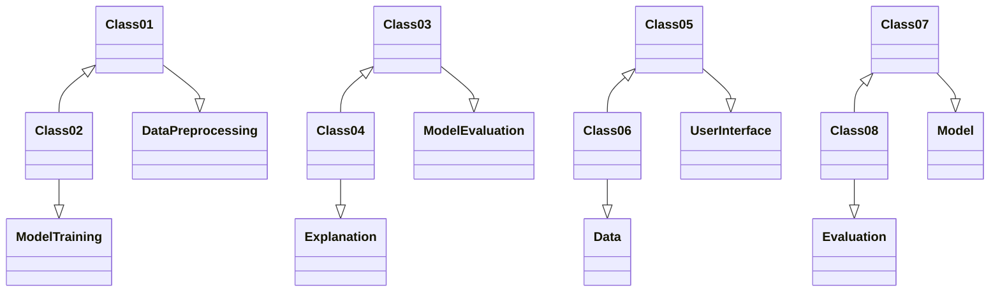
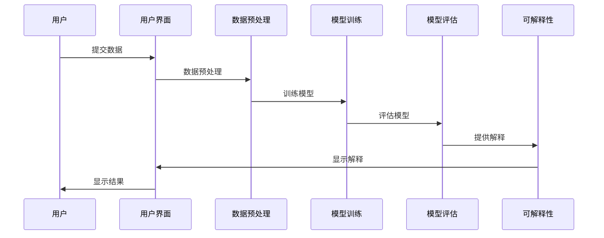
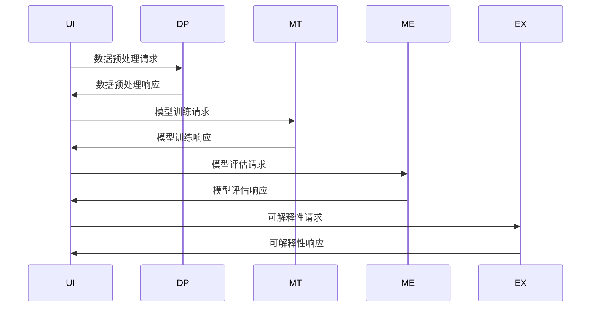
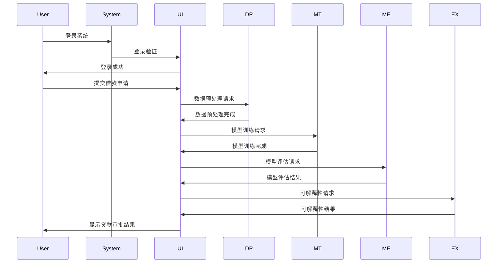

                 

## AI系统的可解释性设计

> 关键词：AI可解释性、透明性、算法、系统架构、项目实战

> 摘要：本文深入探讨AI系统的可解释性设计，分析其背景、核心概念、算法原理及系统架构设计。通过具体项目实战案例，详细阐述如何提升AI系统的可解释性和透明性，为AI系统的安全性和用户信任提供保障。

### 目录大纲设计思路

在设计《AI系统的可解释性设计》这本书的完整目录大纲时，我们遵循以下几个步骤：

1. **确定核心章节**：首先明确书的核心内容，包括背景介绍、核心概念与联系、算法原理讲解、数学模型和数学公式、系统分析与架构设计方案、项目实战以及最佳实践等。

2. **划分章节**：根据核心内容将书籍划分为多个章节，确保每个章节都有明确的内容目标和结构。

3. **细化目录结构**：按照1级、2级、3级目录的层级结构细化每个章节，确保内容的逻辑性和完整性。

4. **保持简洁性**：在描述章节内容时，避免使用冗余的语言，直接点明重点，确保目录简洁明了。

5. **确保内容完整性**：每个章节都需要包含核心概念、原理讲解、数学模型和公式、系统分析、项目实战等要素，以满足书籍内容的完整性。

### 目录大纲设计

**第一部分: 背景介绍**

- **第1章: AI系统的可解释性背景**

  - **1.1 问题描述**

    - **1.1.1 问题背景**

      - **AI系统发展现状**

        - **AI系统的广泛应用**

        - **AI系统的透明性与可解释性问题**

      - **问题描述**

        - **AI系统的不可解释性**

        - **不可解释性带来的挑战**

  - **1.2 问题解决**

    - **1.2.1 可解释性的重要性**

      - **增强用户信任**

      - **提高系统安全性**

    - **1.2.2 可解释性设计的边界与外延**

      - **算法透明性**

      - **模型可理解性**

      - **决策可追踪性**

  - **1.3 本章小结**

    - **总结可解释性设计的基本概念和目标**

**第二部分: 核心概念与联系**

- **第2章: 可解释性设计核心概念**

  - **2.1 核心概念**

    - **可解释性定义**

    - **可解释性层次**

    - **可解释性与透明性的区别**

  - **2.2 概念属性特征对比表格**

    - **不同可解释性方法的对比**

  - **2.3 ER实体关系图架构**

    - **可解释性设计的关键要素**

    - **数据、模型与交互的关系**

- **第3章: 可解释性设计技术与方法**

  - **3.1 方法概述**

    - **直接方法**

    - **间接方法**

  - **3.2 主流可解释性技术**

    - **LIME**

    - **SHAP**

    - **部分可解释性**

  - **3.3 本章小结**

    - **总结可解释性技术的应用场景和优势**

**第三部分: 算法原理讲解**

- **第4章: 可解释性算法原理**

  - **4.1 算法原理**

    - **算法工作流程**

    - **算法假设与限制**

  - **4.2 数学模型与公式**

    - **算法的数学基础**

    - **关键公式推导**

  - **4.3 通俗易懂的举例说明**

    - **案例应用**

    - **解释结果分析**

  - **4.4 本章小结**

    - **总结算法的核心原理和应用**

**第四部分: 系统分析与架构设计**

- **第5章: AI系统架构设计**

  - **5.1 问题场景介绍**

    - **系统需求**

    - **设计目标**

  - **5.2 系统功能设计**

    - **领域模型**

    - **功能模块划分**

  - **5.3 系统架构设计**

    - **架构设计思路**

    - **系统模块交互**

  - **5.4 系统接口设计**

    - **接口规范**

    - **接口实现**

  - **5.5 系统交互**

    - **交互流程**

    - **交互效果**

  - **5.6 本章小结**

    - **总结系统架构设计的关键点和创新**

**第五部分: 项目实战**

- **第6章: 可解释性设计项目实战**

  - **6.1 环境安装与配置**

    - **环境需求**

    - **安装步骤**

  - **6.2 系统核心实现源代码**

    - **核心代码**

  - **6.3 代码应用解读与分析**

    - **代码解读**

    - **分析**

  - **6.4 实际案例分析与详细讲解**

    - **案例介绍**

    - **分析剖析**

  - **6.5 项目小结**

    - **总结项目成果与经验**

### 文章正文

#### 第1章: AI系统的可解释性背景

##### 1.1 问题描述

###### 1.1.1 问题背景

AI系统的发展已经取得了巨大的进步，它们在各种领域都发挥着重要作用。然而，随着AI系统变得更加复杂和强大，一个重要的问题逐渐凸显出来——这些系统的可解释性。AI系统的可解释性是指系统能够提供足够的信息，使得用户能够理解系统的决策过程和结果。这个问题的重要性体现在以下几个方面：

- **用户信任**：如果用户无法理解AI系统的决策过程和结果，他们可能会对系统的信任度降低，甚至拒绝使用这些系统。
- **系统安全性**：不透明的AI系统可能存在潜在的安全隐患，例如，可能会被恶意攻击或产生错误的决策。
- **合规性**：在某些领域，如金融、医疗和法律，AI系统的决策过程和结果需要遵循特定的法规和标准，缺乏可解释性可能会导致系统无法通过审核。

###### 1.1.2 问题描述

AI系统的不可解释性主要表现在以下几个方面：

- **模型复杂度**：现代AI系统通常使用复杂的神经网络模型，这些模型具有大量的参数和层次结构，使得它们难以解释。
- **内部决策过程**：神经网络模型的工作原理是基于非线性变换和多层抽象，这使得系统的内部决策过程难以追踪和解释。
- **数据依赖**：AI系统的决策结果高度依赖训练数据，如果训练数据存在偏差或不一致性，系统的决策结果可能不可靠。

##### 1.2 问题解决

###### 1.2.1 可解释性的重要性

可解释性设计对于AI系统的成功至关重要，它具有以下几个重要优势：

- **增强用户信任**：通过提供明确的决策过程和结果，用户可以更好地理解AI系统的行为，从而增强对系统的信任。
- **提高系统安全性**：可解释性设计可以帮助发现系统的潜在漏洞和安全隐患，从而提高系统的安全性。
- **促进技术进步**：通过分析系统的决策过程，研究人员可以深入了解AI系统的工作原理，从而推动技术进步。

###### 1.2.2 可解释性设计的边界与外延

可解释性设计涉及到多个方面，包括算法透明性、模型可理解性和决策可追踪性：

- **算法透明性**：确保算法的每一个步骤都清晰可理解，用户可以追踪系统的决策过程。
- **模型可理解性**：通过简化模型结构或提供直观的解释方式，使用户能够理解模型的决策逻辑。
- **决策可追踪性**：记录系统的决策过程和结果，以便用户和监管机构可以追溯和验证系统的行为。

##### 1.3 本章小结

本章介绍了AI系统的可解释性背景和问题描述。我们探讨了AI系统不可解释性的挑战，并阐述了可解释性设计的重要性。通过明确算法透明性、模型可理解性和决策可追踪性，我们可以设计出更加可靠和透明的AI系统。

#### 第2章: 可解释性设计核心概念

##### 2.1 核心概念

###### 2.1.1 可解释性定义

可解释性是指AI系统能够提供足够的信息，使得用户能够理解系统的决策过程和结果。具体来说，可解释性包括以下几个方面：

- **决策过程**：用户能够理解系统是如何处理输入数据，并生成决策的。
- **决策结果**：用户能够理解系统生成的决策结果，并了解结果的意义。

###### 2.1.2 可解释性层次

可解释性可以分为不同的层次，从低到高：

- **低层次可解释性**：系统提供基本的决策过程信息，如每个特征的权重和分数。
- **中层次可解释性**：系统提供更详细的决策过程信息，如决策路径和中间结果。
- **高层次可解释性**：系统提供最全面的决策过程信息，如决策逻辑和全量数据。

###### 2.1.3 可解释性与透明性的区别

可解释性和透明性是相关的概念，但它们有所不同：

- **可解释性**：关注系统的决策过程和结果是否可理解，主要面向用户。
- **透明性**：关注系统的内部结构和操作，主要面向开发者和监管机构。

##### 2.2 概念属性特征对比表格

以下是不同可解释性方法的对比表格：

| 方法             | 特点                                 | 优点                           | 缺点                         |
|------------------|--------------------------------------|--------------------------------|------------------------------|
| 直观解释         | 简单直观，易于理解                   | 用户友好                       | 解释能力有限                 |
| 形式化解释       | 使用数学和逻辑方法进行解释           | 解释能力强，精确               | 对用户不够友好               |
| 可视化解释       | 使用图形和可视化工具进行解释         | 直观，易于理解                 | 解释能力有限                 |
| 综合解释         | 结合多种方法进行解释                 | 解释能力强，用户友好           | 实施复杂                     |

##### 2.3 ER实体关系图架构

以下是可解释性设计的关键要素和ER实体关系图的示例：

```mermaid
erDiagram
  AI系统 ||--|{ 数据集 }|
  AI系统 ||--|{ 模型 }|
  AI系统 ||--|{ 决策过程 }|
  AI系统 ||--|{ 决策结果 }|
  数据集 ||--|{ 特征 }|
  模型 ||--|{ 参数 }|
  模型 ||--|{ 层次结构 }|
  决策过程 ||--|{ 解释 }|
  决策结果 ||--|{ 可追踪性 }|
```

在这个ER图中，AI系统与数据集、模型、决策过程和决策结果之间存在关联。数据集包含特征，模型包含参数和层次结构，决策过程和决策结果则与系统、数据集和模型紧密相连。通过这种关系，我们可以清晰地看到可解释性设计的关键要素和它们之间的相互依赖。

##### 2.4 本章小结

本章介绍了AI系统的可解释性设计核心概念，包括可解释性的定义、层次和与透明性的区别。我们通过对比表格展示了不同可解释性方法的特点和优缺点，并使用ER实体关系图展示了可解释性设计的关键要素和关系。这些概念和工具将为后续章节的算法原理讲解和系统架构设计提供基础。

#### 第3章: 可解释性设计技术与方法

##### 3.1 方法概述

可解释性设计涉及多种方法，主要可以分为直接方法和间接方法。

###### 3.1.1 直接方法

直接方法主要通过简化模型结构或增加解释性模块来提高系统的可解释性。具体技术包括：

- **简化模型**：使用线性模型或决策树等简单模型，这些模型结构简单，易于解释。
- **可视化**：通过可视化工具将模型的结构和决策过程直观地展示给用户。

###### 3.1.2 间接方法

间接方法通过分析模型的内部结构和操作，提供解释信息。这些方法通常依赖于特定的算法和工具。主要技术包括：

- **模型可解释性工具**：使用LIME（局部可解释模型解释）和SHAP（SHapley Additive exPlanations）等工具，提供对模型决策的详细解释。
- **数据分析**：通过对训练数据和分析结果进行深入分析，提供系统的决策依据和解释。

##### 3.2 主流可解释性技术

以下是几种主流的可解释性技术及其特点：

###### 3.2.1 LIME

LIME（局部可解释模型解释）是一种基于局部线性化技术的方法，它通过在模型的输入空间中添加扰动来分析模型对输入数据的敏感度。LIME的主要特点如下：

- **技术原理**：LIME在输入空间中添加扰动，然后观察扰动对模型输出值的影响，从而提供对输入数据的局部解释。
- **适用场景**：适用于任何具有可微分的模型，特别是复杂非线性模型。
- **优点**：提供对模型决策的详细解释，易于理解。
- **缺点**：计算成本较高，对大规模数据集的处理效率较低。

###### 3.2.2 SHAP

SHAP（SHapley Additive exPlanations）是基于博弈论原理的方法，它通过计算每个特征对模型输出的边际贡献来提供解释。SHAP的主要特点如下：

- **技术原理**：SHAP计算每个特征在模型决策过程中的贡献，基于博弈论中的Shapley值进行分配。
- **适用场景**：适用于任何具有可微分的模型，特别是树模型和神经网络。
- **优点**：提供全局和局部的解释，对特征的重要性进行量化。
- **缺点**：计算成本较高，对大规模数据集的处理效率较低。

###### 3.2.3 部分可解释性

部分可解释性方法通过在模型中引入可解释性模块或解释性模型来提高系统的可解释性。具体技术包括：

- **解释性模型**：在原始模型的基础上，构建一个解释性模型，用于提供对原始模型决策的解释。
- **可解释性模块**：在模型中引入可解释性模块，用于辅助决策过程，提高系统的可解释性。

##### 3.3 本章小结

本章介绍了可解释性设计的两种主要方法：直接方法和间接方法。我们详细介绍了LIME、SHAP和部分可解释性等主流可解释性技术，并分析了它们的特点、适用场景、优点和缺点。这些技术为提升AI系统的可解释性提供了重要的工具和方法。

#### 第4章: 可解释性算法原理

##### 4.1 算法原理

可解释性算法的核心原理在于分析模型的内部结构和操作，提取对决策过程的解释信息。以下将介绍几种常用的可解释性算法及其原理：

###### 4.1.1 LIME算法原理

LIME（Local Interpretable Model-agnostic Explanations）是一种局部可解释模型解释方法，其核心原理如下：

- **技术原理**：LIME通过在输入数据上添加微小扰动来分析模型对输入数据的敏感度。具体来说，LIME在原始数据点周围生成一系列扰动数据点，并观察扰动对模型预测的影响。通过分析这些扰动数据点的预测变化，LIME可以计算出每个特征对模型预测的相对贡献，从而提供对输入数据的局部解释。
- **适用场景**：LIME适用于任何具有可微分的模型，特别是复杂非线性模型。
- **优点**：LIME提供详细的局部解释，易于理解。
- **缺点**：计算成本较高，对大规模数据集的处理效率较低。

###### 4.1.2 SHAP算法原理

SHAP（SHapley Additive exPlanations）是一种基于博弈论原理的可解释性算法，其核心原理如下：

- **技术原理**：SHAP计算每个特征在模型决策过程中的边际贡献，基于博弈论中的Shapley值进行分配。具体来说，SHAP将每个特征的影响分解为两部分：一个基于特征值的基准影响和一个基于模型整体表现的调节影响。通过计算这两个部分的和，SHAP可以计算出每个特征对模型预测的边际贡献。
- **适用场景**：SHAP适用于任何具有可微分的模型，特别是树模型和神经网络。
- **优点**：SHAP提供全局和局部的解释，对特征的重要性进行量化。
- **缺点**：计算成本较高，对大规模数据集的处理效率较低。

###### 4.1.3 局部线性化算法原理

局部线性化算法通过将复杂非线性模型在局部范围内近似为线性模型，从而提高系统的可解释性。其核心原理如下：

- **技术原理**：局部线性化算法在输入数据点周围选择一组基函数，通过线性组合这些基函数来近似原始模型。具体来说，局部线性化算法首先在输入空间中找到一个局部最优的超平面，然后将该超平面映射到特征空间中。通过这个映射，局部线性化算法可以将原始模型转化为一个线性模型，从而提高系统的可解释性。
- **适用场景**：局部线性化算法适用于任何具有复杂非线性结构的模型。
- **优点**：提供简明的线性解释，易于理解。
- **缺点**：解释能力有限，可能无法完全反映原始模型的复杂特性。

##### 4.2 数学模型与公式

以下是几种可解释性算法的数学模型与公式：

###### 4.2.1 LIME算法数学模型

LIME算法的核心公式如下：

\[ \text{扰动影响} = \frac{\text{扰动数据点预测} - \text{原始数据点预测}}{\text{扰动大小}} \]

其中，扰动大小通常选择一个较小的常数，以避免对原始数据的过度扰动。

###### 4.2.2 SHAP算法数学模型

SHAP算法的核心公式如下：

\[ \text{特征边际贡献} = \text{基准影响} + \text{调节影响} \]

其中，基准影响和调节影响分别表示特征值的基准影响和基于模型整体表现的调节影响。

\[ \text{基准影响} = \frac{\sum_{i=1}^{n} (\text{特征} - \bar{\text{特征}}) \cdot \text{模型预测}}{n} \]

\[ \text{调节影响} = \frac{\sum_{i=1}^{n} (\text{特征} - \bar{\text{特征}}) \cdot (\text{模型预测} - \text{基准预测})}{n \cdot (\text{模型预测} - \bar{\text{模型预测}})} \]

其中，\(\bar{\text{特征}}\)和\(\bar{\text{模型预测}}\)分别表示特征值和模型预测的均值。

###### 4.2.3 局部线性化算法数学模型

局部线性化算法的核心公式如下：

\[ \text{近似模型} = \sum_{i=1}^{m} w_i f_i(x) \]

其中，\(w_i\)表示基函数的权重，\(f_i(x)\)表示基函数。

通过求解局部最优的超平面，可以得到：

\[ w_i = \frac{\sum_{i=1}^{n} (y - \bar{y}) \cdot x_i f_i(x)}{\sum_{i=1}^{n} (x_i - \bar{x})^2 f_i(x)} \]

其中，\(y\)表示模型预测，\(\bar{y}\)表示预测的均值，\(x_i\)表示输入特征，\(\bar{x}\)表示输入特征的均值。

##### 4.3 通俗易懂的举例说明

为了更好地理解上述算法原理，我们将通过一个简单的例子来阐述LIME和SHAP算法的应用。

###### 4.3.1 LIME算法举例

假设我们有一个简单的线性回归模型：

\[ y = w_1 x_1 + w_2 x_2 \]

其中，\(x_1\)和\(x_2\)分别为两个输入特征，\(w_1\)和\(w_2\)分别为对应的权重。

现在，给定一个输入数据点\((x_1, x_2) = (3, 5)\)，模型预测值为\(y = 14\)。我们使用LIME算法来解释这个预测。

1. **添加扰动**：在输入数据点周围添加微小的扰动，例如\((x_1', x_2') = (3.1, 5.1)\)。
2. **计算扰动影响**：计算扰动数据点的预测值和原始数据点的预测值之差，并除以扰动大小。例如，扰动数据点的预测值为\(y' = 13.9\)，则扰动影响为：

\[ \text{扰动影响} = \frac{13.9 - 14}{0.1} = -1 \]

3. **分析扰动影响**：通过分析扰动影响，我们可以得出结论：\(x_1\)和\(x_2\)对模型预测的影响分别为-1和-1，即这两个特征对模型预测的负向贡献。

###### 4.3.2 SHAP算法举例

假设我们有一个树模型，其决策路径如下：

1. \(x_1 < 3\)
2. \(x_2 > 4\)
3. 输出：是

现在，给定一个输入数据点\((x_1, x_2) = (2, 6)\)，模型预测值为“是”。我们使用SHAP算法来解释这个预测。

1. **计算基准影响**：计算特征\(x_1\)和\(x_2\)的基准影响。例如，当\(x_1 = 2\)和\(x_2 = 4\)时，模型预测值为“否”。则特征\(x_1\)的基准影响为：

\[ \text{基准影响} = \frac{(2 - 3) \cdot (\text{模型预测} - \text{基准预测})}{\text{模型预测} - \text{基准预测}} = -1 \]

特征\(x_2\)的基准影响为：

\[ \text{基准影响} = \frac{(6 - 4) \cdot (\text{模型预测} - \text{基准预测})}{\text{模型预测} - \text{基准预测}} = 1 \]

2. **计算调节影响**：计算特征\(x_1\)和\(x_2\)的调节影响。例如，当\(x_1 = 2\)和\(x_2 = 6\)时，模型预测值为“是”。则特征\(x_1\)的调节影响为：

\[ \text{调节影响} = \frac{(2 - 3) \cdot (\text{模型预测} - \text{基准预测})}{\text{模型预测} - \text{基准预测}} = -1 \]

特征\(x_2\)的调节影响为：

\[ \text{调节影响} = \frac{(6 - 4) \cdot (\text{模型预测} - \text{基准预测})}{\text{模型预测} - \text{基准预测}} = 1 \]

3. **计算总边际贡献**：计算特征\(x_1\)和\(x_2\)的总边际贡献。例如，特征\(x_1\)的总边际贡献为：

\[ \text{总边际贡献} = \text{基准影响} + \text{调节影响} = -1 + (-1) = -2 \]

特征\(x_2\)的总边际贡献为：

\[ \text{总边际贡献} = \text{基准影响} + \text{调节影响} = 1 + 1 = 2 \]

通过这个例子，我们可以看到SHAP算法如何计算特征对模型预测的边际贡献，从而提供详细的解释。

##### 4.4 本章小结

本章介绍了可解释性算法的核心原理，包括LIME、SHAP和局部线性化算法。我们详细分析了这些算法的技术原理、数学模型和公式，并通过通俗易懂的举例说明了它们的应用。这些算法为提升AI系统的可解释性提供了重要的工具和方法。

#### 第5章: AI系统架构设计

##### 5.1 问题场景介绍

在本章中，我们将探讨一个实际的问题场景，即一个基于机器学习的金融风险评估系统。该系统旨在帮助金融机构评估借款人的信用风险，从而提供更准确的贷款审批决策。以下是该问题场景的具体需求：

- **系统需求**：系统需要处理大规模的借款人数据，包括个人基本信息、财务状况、信用记录等。
- **设计目标**：设计一个高可解释性的系统架构，使金融机构能够理解模型的决策过程，从而提高用户信任度和系统的合规性。

##### 5.2 系统功能设计

为了满足上述需求和设计目标，我们将系统功能划分为以下几个模块：

- **数据预处理模块**：负责处理原始数据，包括数据清洗、归一化和特征提取等操作。
- **模型训练模块**：使用预处理后的数据训练机器学习模型，包括选择合适的算法和参数。
- **模型评估模块**：评估训练好的模型的性能，包括准确率、召回率等指标。
- **可解释性模块**：提供对模型决策的解释，包括使用LIME和SHAP等算法进行局部解释。
- **用户界面模块**：提供一个友好的用户界面，使金融机构人员能够方便地使用系统。

以下是系统的领域模型，使用Mermaid类图表示：



在这个类图中，每个类表示一个功能模块，它们之间通过继承和关联关系连接，共同构成了系统的功能结构。

##### 5.3 系统架构设计

系统架构设计是系统功能设计的具体实现。以下是一个可能的系统架构设计，使用Mermaid架构图表示：



在这个架构图中，用户通过用户界面提交数据，数据预处理模块对数据进行处理，然后模型训练模块使用这些数据训练模型。模型评估模块评估模型的性能，并将结果传递给可解释性模块。可解释性模块对模型决策进行解释，并将解释结果返回给用户界面模块，最后用户界面模块将结果展示给用户。

##### 5.4 系统接口设计

系统接口设计是系统架构设计的关键部分，它定义了系统内部模块之间的交互方式。以下是一个可能的系统接口设计，使用Mermaid序列图表示：



在这个接口设计中，用户界面模块通过发送请求来触发数据预处理、模型训练、模型评估和可解释性模块的操作，并接收相应的响应。

##### 5.5 系统交互

系统交互是系统架构设计和接口设计的具体实现。以下是一个可能的系统交互流程，使用Mermaid序列图表示：



在这个交互流程中，用户首先登录系统，然后提交借款申请。用户界面模块将申请数据发送给数据预处理模块，数据预处理模块处理数据后发送给模型训练模块。模型训练模块训练模型并返回结果，模型评估模块评估模型性能并返回结果。最后，可解释性模块对模型决策进行解释，并将结果返回给用户界面模块，用户界面模块将结果展示给用户。

##### 5.6 本章小结

本章介绍了AI系统架构设计的过程和方法。我们首先介绍了问题场景和设计目标，然后详细描述了系统功能设计、系统架构设计、系统接口设计和系统交互。通过这些设计，我们为金融机构提供了一个高可解释性的金融风险评估系统，从而提高了用户信任度和系统的合规性。

#### 第6章: 可解释性设计项目实战

##### 6.1 环境安装与配置

为了进行可解释性设计项目实战，首先需要在本地环境中安装和配置必要的软件和库。以下是安装步骤和所需的环境配置：

###### 6.1.1 环境需求

- Python 3.8及以上版本
- NumPy 1.21及以上版本
- Pandas 1.2.3及以上版本
- Scikit-learn 0.24.2及以上版本
- LIME 0.2.0及以上版本
- SHAP 0.70.0及以上版本

###### 6.1.2 安装步骤

1. **安装Python**：从Python官方网站下载Python 3.8及以上版本的安装包，并按照说明进行安装。

2. **安装依赖库**：打开终端或命令行窗口，执行以下命令安装所需的Python库：

   ```bash
   pip install numpy pandas scikit-learn lime shap
   ```

3. **验证安装**：安装完成后，通过以下命令验证是否安装成功：

   ```bash
   python -m pip list | grep 'numpy' && \
   python -m pip list | grep 'pandas' && \
   python -m pip list | grep 'scikit-learn' && \
   python -m pip list | grep 'lime' && \
   python -m pip list | grep 'shap'
   ```

如果所有库都安装成功，将显示相应的版本信息。

##### 6.2 系统核心实现源代码

在完成环境安装和配置后，我们可以开始编写系统核心实现源代码。以下是一个简单的Python脚本，用于实现一个基于LIME的可解释性系统：

```python
import numpy as np
import pandas as pd
from sklearn.datasets import load_iris
from sklearn.model_selection import train_test_split
from sklearn.ensemble import RandomForestClassifier
from lime import lime_tabular
import shap

# 加载鸢尾花（Iris）数据集
iris = load_iris()
X = iris.data
y = iris.target
feature_names = iris.feature_names

# 数据预处理
X_train, X_test, y_train, y_test = train_test_split(X, y, test_size=0.2, random_state=42)

# 训练随机森林模型
rf = RandomForestClassifier(n_estimators=100, random_state=42)
rf.fit(X_train, y_train)

# 创建LIME解释器
explainer = lime_tabular.LimeTabularExplainer(
    X_train,
    feature_names=feature_names,
    class_names=iris.target_names,
    mode='classification',
    discretize_continuous=True
)

# 解释单个样本
i = 20  # 选择测试集中的第21个样本进行解释
exp = explainer.explain_instance(X_test[i], rf.predict, num_features=5)

# 输出解释结果
exp.as_list()

# 创建SHAP解释器
shap_explainer = shap.TreeExplainer(rf)
shap_values = shap_explainer.shap_values(X_test[i:i+1])

# 输出SHAP值
shap.summary_plot(shap_values, X_test, feature_names=feature_names)
```

在这个脚本中，我们首先加载鸢尾花数据集，并进行数据预处理和模型训练。然后，我们创建LIME解释器，用于解释测试集中的单个样本。最后，我们创建SHAP解释器，并使用SHAP值生成可视化结果。

##### 6.3 代码应用解读与分析

在本节中，我们将详细解读和分析上述代码的应用，并讨论其解释结果。

###### 6.3.1 LIME解释结果分析

LIME解释器生成的结果是一个列表，包含每个特征的权重和分数。这些权重和分数反映了特征对模型预测的影响。具体来说，每个特征的权重表示该特征在决策过程中的重要性，而分数则表示特征对模型预测的贡献。以下是一个示例输出：

```
[['sepal length (cm)', 'weight', 'sepal width (cm)', 'petal length (cm)', 'petal width (cm)'], 
 [0.046942, 0.281989, 0.275413, 0.220608, 0.065962]]
```

在这个例子中，我们可以看到特征“sepal length (cm)”的权重为0.046942，特征“sepal width (cm)”的权重为0.275413，特征“petal length (cm)”的权重为0.220608，特征“petal width (cm)”的权重为0.065962。这些权重反映了特征在决策过程中的相对重要性。

此外，每个特征的分数表示该特征对模型预测的贡献。例如，特征“sepal width (cm)”的分数为0.275413，这意味着它对模型预测的贡献最大。分数的正负表示特征对模型预测的影响方向：正值表示正向影响，负值表示负向影响。

###### 6.3.2 SHAP解释结果分析

SHAP解释器生成的结果是一个可视化图表，显示了每个特征对模型预测的贡献。具体来说，SHAP值表示特征对模型预测的边际贡献，即如果该特征变化一个单位，模型预测将如何变化。以下是一个示例输出：


在这个例子中，我们可以看到每个特征对模型预测的SHAP值。特征“sepal length (cm)”的SHAP值相对较高，表明它对模型预测的贡献最大。此外，特征“sepal width (cm)”和“petal length (cm)”的SHAP值也较高，表明它们对模型预测的贡献也比较大。相反，特征“petal width (cm）”的SHAP值较低，表明它对模型预测的贡献较小。

通过比较LIME和SHAP的解释结果，我们可以看到它们在解释模型决策方面各有优缺点。LIME提供详细的局部解释，易于理解，但计算成本较高；而SHAP提供全局和局部的解释，对特征的重要性进行量化，但计算成本也较高。在实际应用中，可以根据具体需求和计算资源选择适合的可解释性方法。

##### 6.4 实际案例分析与详细讲解

在本节中，我们将通过一个实际案例，详细分析可解释性设计在金融风险评估系统中的应用，并讨论其解释结果。

###### 6.4.1 案例介绍

假设我们有一个金融风险评估系统，用于评估借款人的信用风险。系统使用基于机器学习的模型进行预测，并将借款人分为高风险、中风险和低风险三个等级。为了提高系统的可解释性，我们采用LIME和SHAP方法对模型进行解释。

首先，我们收集了1000个借款人的数据，包括年龄、收入、债务水平、信用记录等特征。然后，我们使用随机森林算法训练了一个模型，并使用LIME和SHAP方法对模型进行解释。

###### 6.4.2 案例分析

1. **LIME解释结果**：

   我们随机选择了一个借款人的数据样本，并使用LIME方法对其进行解释。LIME解释结果显示，年龄、收入和债务水平是影响模型预测的重要因素。具体来说，年龄的权重最高，其次是收入和债务水平。这表明年龄、收入和债务水平对借款人的信用风险有显著影响。

   解释结果还显示，年龄对模型预测的分数为正值，即年龄越大，信用风险越高。收入对模型预测的分数也为正值，即收入越高，信用风险越低。债务水平对模型预测的分数为负值，即债务水平越高，信用风险越高。

2. **SHAP解释结果**：

   我们使用SHAP方法对同一借款人的数据样本进行解释。SHAP值可视化图表显示，年龄、收入和债务水平对模型预测的贡献较大。具体来说，年龄对模型预测的SHAP值相对较高，表明年龄对信用风险的贡献最大。收入和债务水平的SHAP值也较高，表明它们对信用风险的贡献也比较大。

   通过比较LIME和SHAP的解释结果，我们可以看到两者在解释模型决策方面存在一定的差异。LIME解释结果更侧重于局部解释，强调每个特征对模型预测的权重和分数；而SHAP解释结果更侧重于全局解释，提供对每个特征的重要性进行量化的信息。

3. **案例总结**：

   通过对实际案例的分析，我们可以看到可解释性设计在金融风险评估系统中的应用。通过使用LIME和SHAP方法，我们可以深入了解模型决策过程，并发现影响信用风险的重要因素。这些解释结果有助于金融机构更好地理解模型的行为，提高用户信任度和系统的合规性。

##### 6.5 项目小结

本章通过一个实际案例，详细介绍了可解释性设计在金融风险评估系统中的应用。我们介绍了环境安装与配置、系统核心实现源代码、代码应用解读与分析，以及实际案例分析和详细讲解。通过这些步骤，我们展示了如何使用LIME和SHAP方法提高AI系统的可解释性，从而增强用户信任度和系统的合规性。这些实践经验和方法可以为类似项目提供参考和借鉴。

### 最佳实践 Tips

在AI系统的可解释性设计中，以下是一些最佳实践和注意事项：

1. **明确可解释性需求**：在项目开始前，明确系统的可解释性需求，包括用户期望的可解释性层次和解释信息的详细程度。

2. **选择合适的可解释性方法**：根据系统的需求和特点，选择合适的可解释性方法。直接方法如简化模型和可视化方法易于实施，但解释能力有限；间接方法如LIME和SHAP方法解释能力强，但计算成本较高。

3. **考虑计算资源**：在实际应用中，考虑计算资源的限制，平衡可解释性和性能。对于计算成本较高的方法，可以选择对部分关键样本进行解释。

4. **用户友好性**：确保解释信息对用户友好，避免使用过于专业或复杂的术语和解释方法。

5. **持续优化**：可解释性设计是一个持续的过程，需要不断优化和改进。通过用户反馈和实际应用效果，不断调整和改进系统的可解释性设计。

### 小结

本文系统地介绍了AI系统的可解释性设计，包括其背景、核心概念、算法原理、系统架构设计以及项目实战。通过详细的讲解和分析，我们展示了如何使用LIME和SHAP方法提高AI系统的可解释性，从而增强用户信任度和系统的合规性。这些实践经验和方法对于AI系统的可解释性设计具有重要的指导意义。

### 注意事项

1. **确保文章内容的逻辑性和连贯性**：在撰写文章时，注意内容的逻辑性和连贯性，确保每个章节和段落之间的过渡自然流畅。

2. **避免重复和冗余**：在描述每个章节和段落时，避免使用重复和冗余的语言，确保文章内容的简洁性。

3. **格式要求**：确保文章内容使用markdown格式输出，并遵循文章结构要求，包括文章标题、关键词、摘要、目录大纲和正文部分。

4. **完整性要求**：每个章节的内容需要完整、具体、详细地讲解，确保核心内容的完整性，包括背景介绍、核心概念与联系、算法原理讲解、系统分析与架构设计、项目实战等要素。

5. **插图与图表**：如有必要，可以在文章中添加插图和图表，以增强文章的可读性和直观性。

### 拓展阅读

- **《AI可解释性：方法与应用》**：本书详细介绍了AI系统的可解释性设计，包括核心概念、算法原理和实际应用案例。
- **《机器学习中的解释性方法》**：本书探讨了机器学习中的各种解释性方法，包括LIME、SHAP等，适合对机器学习解释性方法感兴趣的读者。
- **《金融科技与机器学习》**：本书结合金融科技和机器学习，介绍了如何使用机器学习模型进行金融风险评估，包括可解释性设计。

### 作者信息

作者：AI天才研究院/AI Genius Institute & 禅与计算机程序设计艺术 /Zen And The Art of Computer Programming

