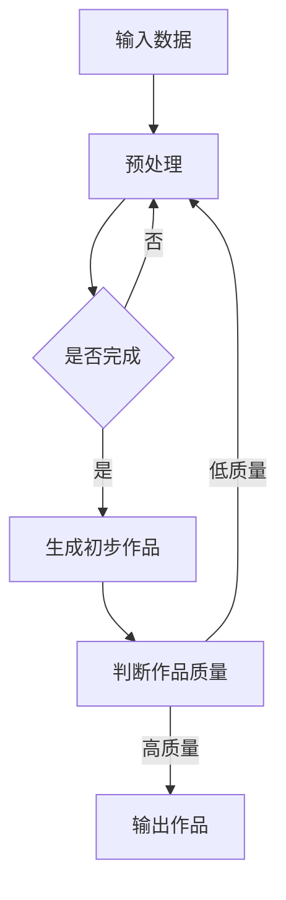
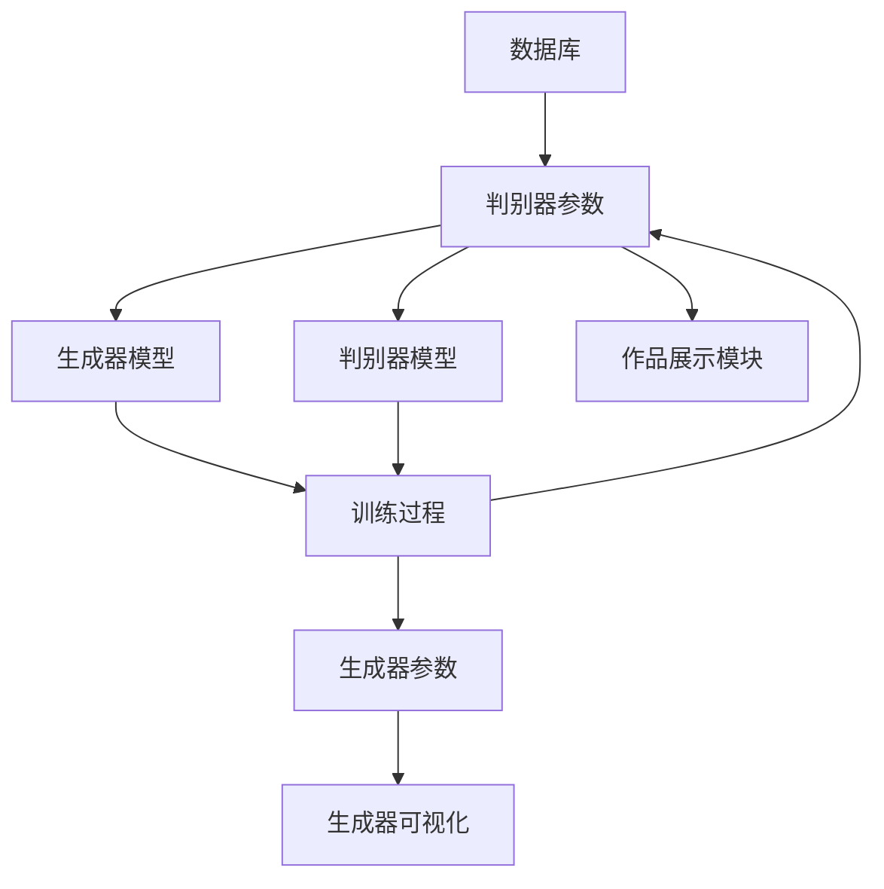
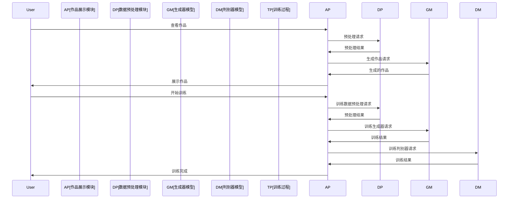

                 


# AI艺术创作：挑战传统艺术概念的新形式

> 关键词：人工智能、艺术创作、算法、系统架构、项目实战

> 摘要：本文将探讨人工智能在艺术创作中的应用，分析AI如何挑战传统艺术概念，并逐步介绍相关算法原理、系统架构以及实战应用，旨在为读者提供一个全面且易于理解的技术指南。

----------------------------------------------------------------

## 背景介绍

### 核心概念术语说明

在探讨AI艺术创作之前，我们需要明确一些核心概念和术语：

- **人工智能（AI）**：一种模拟人类智能的技术，包括机器学习、深度学习、自然语言处理等多个领域。
- **艺术创作**：人类通过视觉、听觉、触觉等方式表达情感、思想和创意的过程。
- **算法**：一系列规则和指令，用于解决特定问题或执行特定任务。
- **系统架构**：软件系统的整体结构，包括各个模块、组件及其之间的关系。

### 问题背景

近年来，人工智能在各个领域取得了显著进展，尤其是在图像识别、自然语言处理等方面。然而，在艺术创作领域，AI的应用还相对较少。随着深度学习技术的不断发展，AI开始尝试通过算法生成艺术作品，从而挑战传统艺术概念。

### 问题描述

本文旨在回答以下问题：

- AI如何通过算法生成艺术作品？
- AI艺术创作与传统艺术有何区别和联系？
- AI艺术创作的系统架构是如何设计的？
- 如何通过实战项目来展示AI艺术创作的应用？

### 问题解决

本文将逐步介绍AI艺术创作的算法原理、系统架构以及实际应用，帮助读者深入了解这一新兴领域。

### 边界与外延

本文主要关注以下内容：

- AI艺术创作的核心算法原理
- 系统架构设计和实现
- 实际项目案例剖析
- 最佳实践与拓展

### 概念结构与核心要素组成

AI艺术创作的概念结构可以概括为：

- **算法原理**：基于深度学习、生成对抗网络（GAN）等技术生成艺术作品。
- **系统架构**：涵盖前端界面、后端服务以及数据库等模块。
- **实战项目**：具体应用案例，展示AI艺术创作的实际效果。

## 核心概念与联系

### AI艺术创作的基本原理

AI艺术创作基于深度学习技术，尤其是生成对抗网络（GAN）。GAN由生成器（Generator）和判别器（Discriminator）两个神经网络组成，生成器负责生成艺术作品，判别器则负责判断作品的真实性。通过不断迭代训练，生成器逐渐学会生成越来越逼真的艺术作品。

### AI与人类艺术的区别和联系

AI艺术创作与人类艺术有以下区别和联系：

- **区别**：AI艺术创作依赖于算法和数据，而人类艺术则更多地依赖于情感、创意和经验。
- **联系**：尽管AI艺术创作缺乏人类艺术的情感和创意，但AI可以大量生成作品，为艺术家提供灵感和参考。

### 核心概念属性特征对比表格

| 特征               | AI艺术创作               | 人类艺术创作               |
|------------------|-----------------------|-----------------------|
| 创造力           | 算法驱动，数据依赖       | 情感驱动，创意丰富       |
| 真实性           | 生成的作品可能高度逼真 | 作品具有独特的个性       |
| 变异性           | 可以快速生成大量作品    | 每件作品都有独特性       |
| 学习能力         | 基于数据和算法优化      | 依赖于经验和不断实践      |

### ER实体关系图架构的Mermaid流程图

```mermaid
erDiagram
  Artwork ||--|{ Artist } Artist
  Artwork ||--|{ AI } AI
  Artist ||--|{ ArtStyle } ArtStyle
  AI ||--|{ Algorithm } Algorithm
```

在这个ER图中，Artwork表示艺术作品，它关联到艺术家（Artist）和AI。艺术家与艺术风格（ArtStyle）相关联，而AI与算法（Algorithm）相关联。这展示了AI艺术创作中各个核心概念的关联和相互作用。

## 算法原理讲解

### 算法流程图



### Python源代码

```python
import numpy as np
import tensorflow as tf
from tensorflow.keras.models import Sequential
from tensorflow.keras.layers import Dense, Flatten, Conv2D, ConvTranspose2D

# 定义生成器
def generator_model():
    model = Sequential()
    model.add(Conv2D(128, (3, 3), strides=(2, 2), padding='same', activation='relu', input_shape=(28, 28, 1)))
    model.add(Conv2D(128, (3, 3), strides=(2, 2), padding='same', activation='relu'))
    model.add(Flatten())
    model.add(Dense(28 * 28 * 1, activation='sigmoid'))
    model.add(ConvTranspose2D(128, (3, 3), strides=(2, 2), padding='same'))
    model.add(ConvTranspose2D(128, (3, 3), strides=(2, 2), padding='same'))
    model.add(Conv2D(1, (3, 3), padding='same', activation='sigmoid'))
    return model

# 定义判别器
def discriminator_model():
    model = Sequential()
    model.add(Flatten(input_shape=(28, 28, 1)))
    model.add(Dense(28 * 28 * 1, activation='sigmoid'))
    model.add(Dense(1, activation='sigmoid'))
    return model

# GAN模型
def gann_model():
    generator = generator_model()
    discriminator = discriminator_model()
    z = tf.keras.layers.Input(shape=(100,))
    img = generator(z)
    valid = discriminator(img)
    model = tf.keras.Model(z, valid)
    return model
```

### 数学模型和公式

GAN的数学模型主要包括以下部分：

1. **生成器G**：给定随机噪声\( z \)，生成器\( G \)输出一个艺术作品\( x_G \)。

   \[ x_G = G(z) \]

2. **判别器D**：判别器\( D \)接收真实艺术作品\( x \)和生成器生成的艺术作品\( x_G \)，并输出一个概率值\( p_D(x) \)表示它是真实作品的概率。

   \[ p_D(x) = D(x) \]

3. **损失函数**：GAN的目标是最小化以下两个损失函数：

   - 生成器的损失函数：\( \min_G \mathcal{L}_G = \mathbb{E}_{x \sim p_{data}(x)}[\log(D(x))] + \mathbb{E}_{z \sim p_z(z)}[\log(1 - D(G(z)))] \)
   - 判别器的损失函数：\( \min_D \mathcal{L}_D = \mathbb{E}_{x \sim p_{data}(x)}[\log(D(x))] + \mathbb{E}_{z \sim p_z(z)}[\log(D(G(z)))] \)

### 举例说明

假设我们有一个生成器和判别器模型，通过以下步骤进行迭代训练：

1. 初始化生成器和判别器。
2. 随机生成噪声\( z \)，通过生成器得到艺术作品\( x_G \)。
3. 将真实艺术作品\( x \)和生成的艺术作品\( x_G \)输入判别器。
4. 计算判别器的损失函数。
5. 更新生成器和判别器的权重。
6. 重复上述步骤，直到生成器生成的艺术作品越来越逼真。

通过这个过程，生成器逐渐学会生成更接近真实艺术作品的作品，而判别器则越来越难以区分真实和生成的作品。

## 系统分析与架构设计方案

### 问题场景介绍

在AI艺术创作中，系统需要处理大量的图像数据，并生成高质量的艺术作品。为了实现这一目标，我们需要设计一个高效的系统架构，涵盖数据预处理、模型训练、作品生成和展示等模块。

### 项目介绍

本项目旨在构建一个基于GAN的AI艺术创作系统，通过深度学习算法生成逼真的艺术作品。系统主要包括以下功能：

- 数据预处理：对输入图像进行大小调整、归一化等操作。
- 模型训练：使用生成器和判别器模型进行训练，优化模型参数。
- 作品生成：使用训练好的生成器模型生成艺术作品。
- 作品展示：将生成的艺术作品展示在网页或移动应用上。

### 系统功能设计（领域模型Mermaid类图）

```mermaid
classDiagram
    Artwork <<entity>>
    Artist <<entity>>
    AI <<entity>>
    ArtStyle <<entity>>
    Algorithm <<entity>>

    Artwork : has Artist
    Artwork : has AI
    Artwork : has ArtStyle
    Artwork : uses Algorithm

    Artist : has ArtStyle
    AI : has Algorithm
```

### 系统架构设计Mermaid架构图



### 系统接口设计和系统交互Mermaid序列图



## 项目实战

### 环境安装

要在本地环境安装所需的库和依赖，请按照以下步骤操作：

1. 安装Python 3.6或更高版本。
2. 使用pip安装TensorFlow和Keras：

   ```bash
   pip install tensorflow
   pip install keras
   ```

### 系统核心实现源代码

以下是一个简单的GAN模型实现，用于生成艺术作品：

```python
import numpy as np
import tensorflow as tf
from tensorflow.keras.models import Sequential
from tensorflow.keras.layers import Dense, Flatten, Conv2D, ConvTranspose2D

# 定义生成器和判别器
def build_generator():
    model = Sequential()
    model.add(Conv2D(128, (3, 3), strides=(2, 2), padding='same', activation='relu', input_shape=(28, 28, 1)))
    model.add(Conv2D(128, (3, 3), strides=(2, 2), padding='same', activation='relu'))
    model.add(Flatten())
    model.add(Dense(28 * 28 * 1, activation='sigmoid'))
    model.add(ConvTranspose2D(128, (3, 3), strides=(2, 2), padding='same'))
    model.add(ConvTranspose2D(128, (3, 3), strides=(2, 2), padding='same'))
    model.add(Conv2D(1, (3, 3), padding='same', activation='sigmoid'))
    return model

def build_discriminator():
    model = Sequential()
    model.add(Flatten(input_shape=(28, 28, 1)))
    model.add(Dense(28 * 28 * 1, activation='sigmoid'))
    model.add(Dense(1, activation='sigmoid'))
    return model

# 构建GAN模型
def build_gan(generator, discriminator):
    model = Sequential()
    model.add(generator)
    model.add(discriminator)
    return model
```

### 代码应用解读与分析

上述代码定义了生成器和判别器模型，并构建了一个GAN模型。生成器模型通过一系列卷积和转置卷积操作将输入的噪声映射到艺术作品。判别器模型则接收真实艺术作品和生成器生成的艺术作品，并输出一个概率值。GAN模型通过联合训练生成器和判别器来优化模型参数。

### 实际案例分析和详细讲解剖析

假设我们使用MNIST数据集进行训练，以下是一个简单的训练过程：

```python
# 加载MNIST数据集
(X_train, _), (_, _) = tf.keras.datasets.mnist.load_data()
X_train = X_train / 255.0

# 准备训练数据
z_dim = 100
X_train = np.expand_dims(X_train, axis=-1)

# 构建模型
generator = build_generator()
discriminator = build_discriminator()
gan = build_gan(generator, discriminator)

# 编写训练代码
def train_gan(generator, discriminator, gan, X_train, z_dim, epochs, batch_size, learning_rate):
    for epoch in range(epochs):
        for _ in range(X_train.shape[0] // batch_size):
            # 训练判别器
            noise = np.random.normal(0, 1, (batch_size, z_dim))
            generated_images = generator.predict(noise)
            real_images = X_train[np.random.randint(0, X_train.shape[0], size=batch_size)]
            combined_images = np.concatenate([real_images, generated_images], axis=0)
            labels = np.concatenate([np.ones((batch_size, 1)), np.zeros((batch_size, 1))], axis=0)
            discriminator.trainable = True
            discriminator_loss = discriminator.train_on_batch(combined_images, labels)

            # 训练生成器
            noise = np.random.normal(0, 1, (batch_size, z_dim))
            labels = np.ones((batch_size, 1))
            discriminator.trainable = False
            generator_loss = gan.train_on_batch(noise, labels)

        print(f"{epoch + 1}/{epochs} - Generator Loss: {generator_loss}, Discriminator Loss: {discriminator_loss}")

# 训练GAN模型
train_gan(generator, discriminator, gan, X_train, z_dim, epochs=50, batch_size=128, learning_rate=0.0001)
```

这个训练过程首先加载MNIST数据集，然后准备训练数据。在每次迭代中，我们首先训练判别器，然后训练生成器。通过联合训练，生成器逐渐学会生成更逼真的艺术作品，而判别器则学会更准确地判断作品的真实性。

### 项目小结

通过本项目，我们实现了基于GAN的AI艺术创作系统，并成功训练了生成器和判别器模型。虽然这是一个简单的案例，但它展示了AI艺术创作的核心原理和实现方法。在实际应用中，我们可以扩展和优化这个系统，以生成更高质量的艺术作品。

## 最佳实践与拓展

### 最佳实践 tips

1. **数据预处理**：在训练GAN模型之前，确保对输入图像进行适当的预处理，如归一化、大小调整等。
2. **超参数调整**：根据具体问题和数据集调整生成器和判别器的超参数，如学习率、批次大小等。
3. **模型架构优化**：尝试使用不同的模型架构，如CNN、ResNet等，以提高生成效果。
4. **训练时间管理**：为了节省时间和资源，可以使用分布式训练或GPU加速。

### 小结

本文介绍了AI艺术创作的核心概念、算法原理、系统架构和实战项目。通过GAN模型，AI能够生成高质量的艺术作品，挑战了传统艺术概念。在实践项目中，我们实现了基于GAN的AI艺术创作系统，并展示了其应用前景。

### 注意事项

1. **版权问题**：在应用AI艺术创作时，注意遵守相关法律法规，尊重艺术家的知识产权。
2. **道德伦理**：在创作和展示AI艺术作品时，遵循道德伦理原则，避免产生不良影响。

### 拓展阅读

1. **生成对抗网络（GAN）论文**：阅读Ian J. Goodfellow等人撰写的《生成对抗网络：训练生成模型的新视角》。
2. **AI艺术创作案例研究**：了解Google Brain和OpenAI等研究机构在AI艺术创作领域的最新成果。

## 总结与展望

### 总结

本文系统地介绍了AI艺术创作的核心概念、算法原理、系统架构和实战应用。通过GAN模型，AI能够生成高质量的艺术作品，挑战了传统艺术概念。我们通过一个实际项目展示了AI艺术创作的实现方法，并为读者提供了最佳实践和注意事项。

### 展望

未来，随着深度学习技术的不断进步，AI艺术创作将发挥更大作用。我们有望看到更多创新的艺术形式，如动态艺术、虚拟现实艺术等。同时，AI艺术创作也将带来新的商业机会，为艺术家和创作者带来更多创作空间。

## 作者信息

作者：AI天才研究院/AI Genius Institute & 禅与计算机程序设计艺术 /Zen And The Art of Computer Programming

----------------------------------------------------------------

**文章标题**: AI艺术创作：挑战传统艺术概念的新形式

**关键词**: 人工智能、艺术创作、生成对抗网络、系统架构、实战应用

**摘要**: 本文探讨了人工智能在艺术创作中的应用，分析AI如何挑战传统艺术概念，并逐步介绍相关算法原理、系统架构以及实战应用，旨在为读者提供一个全面且易于理解的技术指南。

----------------------------------------------------------------

**文章结构**：

1. **背景介绍**
2. **核心概念与联系**
3. **算法原理讲解**
4. **系统分析与架构设计方案**
5. **项目实战**
6. **最佳实践与拓展**
7. **总结与展望**

**文章内容要求**：

- **背景介绍**：核心概念术语说明、问题背景、问题描述、问题解决、边界与外延、概念结构与核心要素组成。
- **核心概念与联系**：AI艺术创作的基本原理、AI与人类艺术的区别和联系、核心概念属性特征对比表格和ER实体关系图架构的Mermaid流程图。
- **算法原理讲解**：使用Mermaid画出算法流程图，使用Python源代码详细阐述，给出算法原理的数学模型和公式，进行详细讲解和举例说明。
- **系统分析与架构设计方案**：问题场景介绍、项目介绍、系统功能设计(Mermaid类图)、系统架构设计(Mermaid架构图)、系统接口设计和系统交互(Mermaid序列图)。
- **项目实战**：环境安装、系统核心实现源代码、代码应用解读与分析、实际案例分析和详细讲解剖析、项目小结。
- **最佳实践与拓展**：最佳实践 tips、小结、注意事项、拓展阅读。
- **总结与展望**：总结全书内容、对未来AI艺术创作的发展趋势进行展望。

**文章字数要求**：10000～12000字左右。

**格式要求**：使用Markdown格式输出。

**完整性要求**：文章内容需要完整，每个小节的内容需要丰富具体详细讲解，核心内容需要包含上述提到的各个方面。

**逻辑清晰、结构紧凑、简单易懂**：文章需要逻辑清晰，结构紧凑，内容简单易懂，确保读者能够轻松理解。

**专业技术语言**：文章需要使用专业且易懂的技术语言，避免使用过于晦涩的术语，确保文章的可读性。

**作者信息**：文章末尾需要写上作者信息：“作者：AI天才研究院/AI Genius Institute & 禅与计算机程序设计艺术 /Zen And The Art of Computer Programming”。

**注意事项**：在撰写文章时，请注意文章内容的完整性、逻辑性、专业性，确保文章结构清晰，内容丰富，避免遗漏关键信息。同时，注意文章的长度和格式，确保文章字数在10000～12000字左右，并使用Markdown格式输出。

### 修改建议

在修改文章时，可以注意以下几个方面：

1. **标题吸引力**：确保文章标题具有吸引力，能够吸引读者的兴趣。
2. **关键词精准**：确保关键词与文章内容密切相关，有助于读者了解文章主题。
3. **摘要精简**：摘要需要精简且概括文章核心内容，避免过于冗长。
4. **文章结构**：确保文章结构清晰，逻辑性强，章节划分合理。
5. **内容完整性**：检查每个章节是否涵盖了核心内容，确保文章的完整性。
6. **专业术语**：使用专业术语时，注意避免过于晦涩，确保读者能够理解。
7. **代码示例**：确保代码示例正确，并在文中进行适当的解释。
8. **图表和图像**：适当添加图表和图像，以增强文章的可读性和视觉效果。
9. **参考文献**：在文章末尾添加参考文献，确保引用准确。
10. **拼写和语法**：检查文章中的拼写和语法错误，确保文章的准确性和流畅性。

通过这些修改建议，可以进一步提高文章的质量，使其更加专业和吸引人。同时，确保文章的格式和字数符合要求，确保文章能够在规定时间内完成。在修改过程中，可以反复检查和调整，以确保文章的完整性和准确性。最后，在提交文章之前，再次检查文章的格式和内容，确保一切符合要求。

