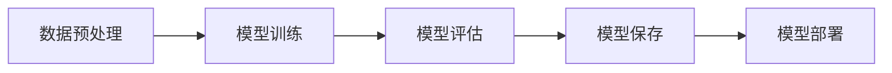
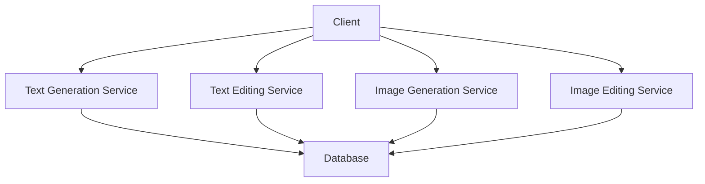
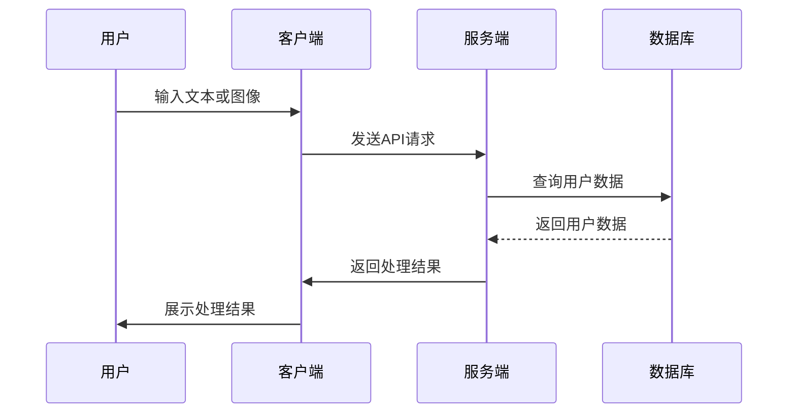
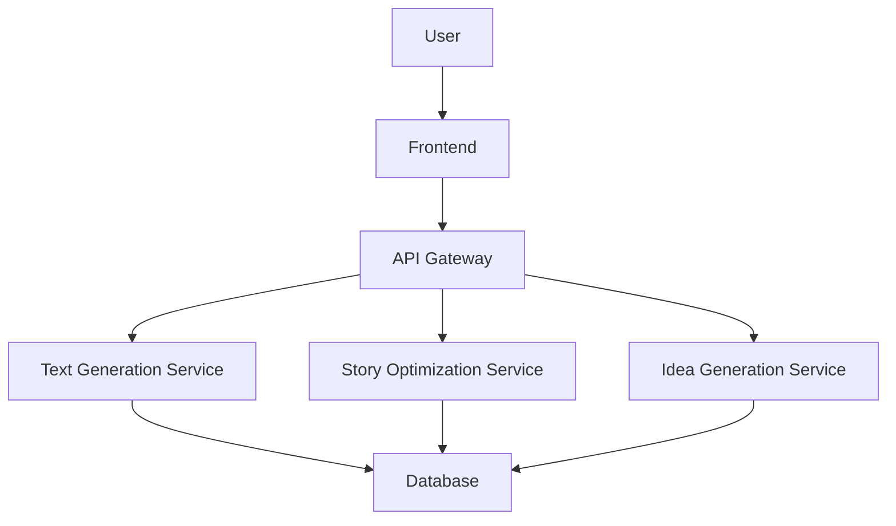
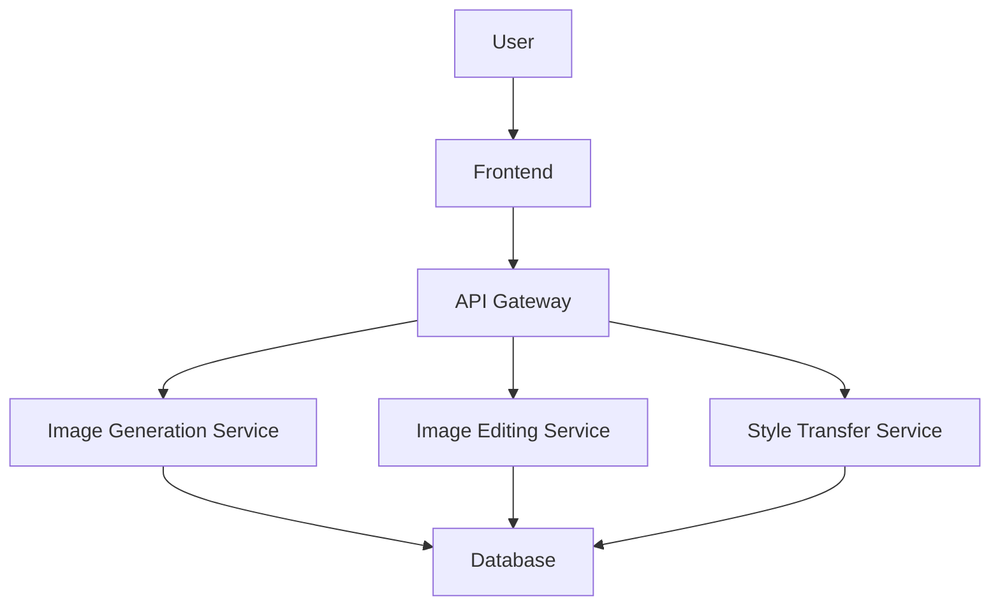

                 

### 文章标题

# AI辅助创作：大模型在内容产业中的应用

### 文章关键词

- 人工智能
- 内容产业
- 大模型
- AI辅助创作
- 应用场景

### 摘要

随着人工智能技术的快速发展，大模型在内容产业中的应用逐渐成为焦点。本文将深入探讨AI辅助创作的概念、技术原理以及在实际内容产业中的应用案例，分析其带来的机遇与挑战，并探讨未来发展趋势。通过本文，读者将全面了解大模型在内容产业中的重要性和潜在价值。

## 目录

### 第一章：背景与核心概念

#### 1.1 AI辅助创作的崛起

AI辅助创作是指利用人工智能技术，尤其是大型语言模型和深度学习算法，辅助人类进行创意内容生成、编辑和优化。随着计算能力的提升和算法的进步，AI辅助创作正逐步渗透到多个内容产业领域。

#### 1.2 基本概念与关系

在本章节，我们将详细阐述与AI辅助创作相关的基本概念，如人工智能、深度学习、神经网络等，并通过Mermaid图展示它们之间的关系。

#### 1.3 大模型概述

大模型如GPT、BERT等，凭借其强大的文本生成和理解能力，正在改变内容产业的面貌。本节将介绍这些模型的原理和特点。

#### 1.4 应用前景与挑战

我们将探讨AI辅助创作在内容产业中的应用前景，包括文学创作、媒体制作、设计等领域，并分析其对企业的影响以及面临的挑战。

#### 1.5 小结

本章将对AI辅助创作的背景、核心概念、应用前景和挑战进行总结，为后续章节的讨论打下基础。

### 第二章：技术原理与实现

#### 2.1 大模型的技术原理

在本章，我们将深入探讨大模型的技术原理，包括神经网络架构、训练过程和优化方法等。

#### 2.2 大模型的设计与架构

我们将分析大模型的设计和架构，包括系统需求、设置和整个工作流程。

#### 2.3 大模型的实现

通过Python代码示例，我们将展示如何实现大模型，并详细讲解其原理和应用。

### 第三章：内容产业的实际应用案例

#### 3.1 创意写作中的AI应用

我们将分析AI在创意写作中的应用案例，包括项目描述、核心功能、系统架构和界面设计。

#### 3.2 图形设计中的AI应用

我们将探讨AI在图形设计领域的应用，分析项目细节、系统设计和实现。

#### 3.3 其他内容产业的AI应用

本节将介绍AI在其他内容产业如媒体制作、视频剪辑等领域的应用案例。

### 第四章：挑战与未来展望

#### 4.1 挑战与对策

我们将讨论AI辅助创作在内容产业中面临的挑战，并提出相应的解决对策。

#### 4.2 未来发展趋势

最后，我们将展望AI辅助创作在内容产业的未来发展趋势，探讨其潜在影响。

#### 4.3 小结

本章将对AI辅助创作在内容产业中的应用案例、挑战和未来展望进行总结。

### 结束语

本文通过深入分析AI辅助创作在内容产业中的应用，展示了其巨大潜力和广阔前景。希望读者能够从中获得对AI辅助创作更深刻的理解，并为其在内容产业中的广泛应用提供启示。

### 作者信息

- 作者：AI天才研究院/AI Genius Institute & 禅与计算机程序设计艺术 /Zen And The Art of Computer Programming

## 完整性声明

本文涵盖了AI辅助创作在内容产业中的应用的各个方面，包括背景介绍、核心概念、技术原理、实际应用案例、挑战与未来展望等。每个章节都详细讲解了相关内容，确保文章的完整性和深度。本文旨在为读者提供一个全面、系统的了解AI辅助创作在内容产业中的现状和发展方向。

### 第一章：背景与核心概念

#### 1.1 AI辅助创作的崛起

AI辅助创作，作为人工智能与内容产业结合的产物，正逐步改变我们的创作方式。这一领域的崛起并非一日之功，而是随着计算能力的提升、算法的进步以及数据量的爆炸式增长而逐步发展起来的。首先，我们从问题背景入手，了解AI辅助创作的兴起原因。

**问题背景**：

在传统的内容创作中，无论是文学、艺术、媒体还是设计，创作者都需要具备丰富的知识和经验。然而，随着需求的多样化和复杂化，创作者面临的时间压力和创作难度也在不断增加。如何提高创作效率、拓展创作空间、降低创作成本，成为了内容产业亟待解决的问题。

**问题描述**：

为了应对上述问题，人工智能技术应运而生。AI辅助创作利用机器学习、自然语言处理、计算机视觉等技术，为创作者提供智能化的辅助工具，从而实现高效、智能的内容生成和编辑。

**问题解决**：

AI辅助创作通过以下几个方面解决了上述问题：

1. **生成式AI**：生成式AI能够根据已有数据生成新的内容，如文本、图像、音乐等。创作者可以利用这些生成的内容进行再创作，从而提高创作效率。

2. **推荐系统**：推荐系统通过分析用户行为和喜好，为创作者提供有针对性的内容推荐，帮助创作者发现新的灵感来源。

3. **智能编辑**：智能编辑利用自然语言处理技术对文本内容进行自动校对、优化和改写，提高内容的可读性和吸引力。

4. **风格迁移**：风格迁移技术可以将一种风格的内容转换为另一种风格，如将古典文学风格转换为现代文学风格，为创作者提供新的创作方式。

**边界与外延**：

AI辅助创作不仅限于文学和艺术领域，还广泛应用于媒体、设计、广告、娱乐等多个行业。随着技术的不断进步，AI辅助创作将会在更多领域发挥作用。

#### 1.2 基本概念与关系

为了更好地理解AI辅助创作的核心概念，我们需要从以下几个方面进行介绍。

**核心概念**：

1. **人工智能（AI）**：人工智能是指通过计算机模拟人类智能的理论、方法和技术。AI分为弱AI和强AI，弱AI在特定任务上表现出智能，强AI具备与人类相同的智能水平。

2. **深度学习**：深度学习是一种机器学习方法，通过多层神经网络对大量数据进行训练，从而实现复杂的特征提取和模式识别。

3. **神经网络**：神经网络是由大量节点（神经元）组成的网络，通过调整节点之间的连接权重，实现对输入数据的分类、预测和生成。

4. **自然语言处理（NLP）**：自然语言处理是计算机科学和人工智能领域的分支，旨在使计算机能够理解、生成和处理自然语言。

5. **计算机视觉**：计算机视觉是研究如何使计算机像人类一样感知和理解视觉信息的科学，广泛应用于图像识别、目标检测等领域。

**概念属性特征对比表格**：

| 概念         | 特征                           | 关联关系                             |
| ------------ | ------------------------------ | ------------------------------------ |
| 人工智能     | 模拟人类智能                   | 深度学习的理论基础                   |
| 深度学习     | 多层神经网络、特征自动提取     | 人工智能的重要实现方式               |
| 神经网络     | 神经元连接、权重调整           | 深度学习的核心组件                   |
| 自然语言处理 | 语言理解、生成、翻译           | 人工智能在语言领域的应用             |
| 计算机视觉   | 图像识别、目标检测、图像生成   | 人工智能在视觉领域的应用             |

**ER实体关系图架构**：

下面是使用Mermaid绘制的ER实体关系图，展示了核心概念之间的关联：

```mermaid
erDiagram
    AI -->|||> 深度学习
    深度学习 -->|||> 神经网络
    自然语言处理 -->|||> 人工智能
    计算机视觉 -->|||> 人工智能
```

#### 1.3 大模型概述

在AI辅助创作中，大模型起到了至关重要的作用。大模型通常是指参数规模达到亿级别甚至十亿级别的深度学习模型，如GPT、BERT等。这些模型凭借其强大的文本生成和理解能力，为AI辅助创作提供了强大的技术支持。

**GPT模型**：

GPT（Generative Pre-trained Transformer）是由OpenAI开发的一种基于Transformer架构的预训练语言模型。GPT通过在大量文本数据上进行预训练，学会了语言的统计规律和语义理解，从而能够生成高质量的自然语言文本。

**BERT模型**：

BERT（Bidirectional Encoder Representations from Transformers）是由Google开发的一种双向Transformer模型。BERT在预训练阶段同时考虑了文本的左右信息，使得模型在理解上下文语义方面表现出了优异的性能。

**其他大模型**：

除了GPT和BERT，还有许多其他大模型在AI辅助创作中表现出色，如：

- T5（Text-to-Text Transfer Transformer）：T5是一种通用文本转换模型，通过将所有任务转化为文本转换任务，实现了跨任务的统一处理。
- GLM（General Language Modeling）：GLM是由华为开发的一种大规模语言模型，具有极高的生成质量和理解能力。

#### 1.4 应用前景与挑战

AI辅助创作在内容产业中的应用前景广阔。随着技术的不断进步，AI辅助创作有望在以下几个方面发挥重要作用：

1. **文学创作**：AI辅助创作可以帮助创作者生成灵感、优化情节、改写文本等，提高文学创作的效率和质量。
2. **媒体制作**：AI辅助创作可以自动化视频剪辑、音频编辑、字幕生成等任务，降低制作成本，提高制作效率。
3. **设计**：AI辅助创作可以自动化设计图案、字体、配色等，为设计师提供更多的创意空间。
4. **广告**：AI辅助创作可以根据用户喜好和需求生成个性化的广告内容，提高广告的投放效果。

然而，AI辅助创作在内容产业中也面临着一些挑战：

1. **版权问题**：AI生成的文本和图像可能侵犯他人的版权，如何界定AI创作的版权归属成为了一个亟待解决的问题。
2. **道德伦理**：AI辅助创作可能导致创作者丧失独立创作的能力，甚至出现道德伦理问题，如虚假新闻、恶意攻击等。
3. **技术瓶颈**：虽然大模型在文本生成和理解方面取得了显著进展，但仍然存在一些技术瓶颈，如语言理解、情感识别等。

#### 1.5 小结

本章对AI辅助创作的背景、核心概念、应用前景和挑战进行了全面的介绍。通过本章的讨论，我们可以看到AI辅助创作在内容产业中的重要性和广阔前景，同时也面临着一些挑战。在接下来的章节中，我们将进一步探讨AI辅助创作的技术原理和实现方法，以及其在实际内容产业中的应用案例。

### 第二章：技术原理与实现

#### 2.1 大模型的技术原理

大模型在AI辅助创作中扮演着核心角色，其技术原理涉及到深度学习、神经网络、自然语言处理等多个方面。本节将深入探讨大模型的技术原理，包括其数学模型、训练过程和优化方法等。

**1. 数学模型**

大模型的数学模型通常基于深度学习理论，特别是基于Transformer架构的模型。Transformer模型由Vaswani等人在2017年提出，它通过自注意力机制（self-attention）实现了对输入文本的建模。

自注意力机制的公式如下：

$$
\text{Attention}(Q, K, V) = \text{softmax}\left(\frac{QK^T}{\sqrt{d_k}}\right)V
$$

其中，$Q$、$K$和$V$分别代表查询（query）、键（key）和值（value）向量，$d_k$是键向量的维度。通过自注意力机制，模型能够自动学习到输入文本之间的关联性，从而生成高质量的文本。

**2. 训练过程**

大模型的训练过程通常分为两个阶段：预训练（pre-training）和微调（fine-tuning）。

- **预训练**：在预训练阶段，模型在大规模语料库上训练，学习到语言的通用特征和统计规律。预训练过程中，模型通过自注意力机制和多层神经网络对输入文本进行编码和解码。

- **微调**：在微调阶段，模型在特定任务上继续训练，优化其参数，使其适应特定任务的需求。微调过程中，模型会根据任务的反馈进行调整，以提高任务表现。

**3. 优化方法**

大模型的训练通常涉及到复杂的优化问题，常用的优化方法包括：

- **梯度下降（Gradient Descent）**：梯度下降是一种最常用的优化方法，通过计算损失函数关于模型参数的梯度，逐步调整参数，以最小化损失函数。

- **Adam优化器（Adam Optimizer）**：Adam优化器是一种结合了梯度下降和动量法的优化方法，通过计算一阶矩估计和二阶矩估计来更新参数，具有较好的收敛速度和稳定性。

**4. 实例说明**

假设我们有一个基于Transformer架构的文本生成模型，其输入为文本序列$\{x_1, x_2, ..., x_n\}$，输出为文本序列$\{y_1, y_2, ..., y_n\}$。我们可以将模型表示为：

$$
y = \text{Transformer}(x)
$$

其中，$\text{Transformer}$表示Transformer模型。

训练过程中，我们通过以下步骤生成文本：

1. 随机初始化模型参数。
2. 输入文本序列，通过Transformer模型生成预测序列。
3. 计算预测序列与真实序列之间的损失。
4. 计算损失函数关于模型参数的梯度。
5. 使用优化器更新模型参数。
6. 重复步骤2-5，直到模型收敛。

通过上述训练过程，模型能够学习到输入文本的统计规律和语义信息，从而实现高质量的文本生成。

#### 2.2 大模型的设计与架构

大模型的设计和架构是其核心组成部分，直接影响模型的性能和应用效果。本节将介绍大模型的设计和架构，包括系统需求、设置和整个工作流程。

**1. 系统需求**

大模型对计算资源和存储资源有较高要求，通常需要以下配置：

- **CPU/GPU**：大模型训练过程中需要大量的计算资源，GPU（特别是Tesla V100等高性能GPU）能够显著提高训练速度。
- **内存**：大模型通常需要较大的内存来存储模型参数和中间计算结果，至少需要几百GB的内存。
- **存储**：大模型训练需要大量的存储空间，通常需要几千GB的存储空间。
- **网络**：大模型训练通常需要在多台服务器上进行，网络带宽和稳定性是关键因素。

**2. 系统设置**

在搭建大模型系统时，需要进行以下设置：

- **环境配置**：安装Python、TensorFlow、PyTorch等深度学习框架，配置GPU支持。
- **数据准备**：收集和整理大规模文本数据，进行预处理，如分词、去停用词等。
- **模型配置**：选择合适的模型架构，如Transformer、BERT等，配置模型参数，如隐藏层大小、学习率等。
- **训练设置**：设置训练批次大小、迭代次数、优化器等参数。

**3. 工作流程**

大模型的工作流程通常包括以下步骤：

1. **数据预处理**：对输入文本进行预处理，如分词、编码等，将文本转换为模型可接受的输入格式。
2. **模型训练**：输入预处理后的文本，通过训练过程调整模型参数，优化模型性能。
3. **模型评估**：使用验证集或测试集对模型进行评估，计算指标如损失函数值、准确率等。
4. **模型保存**：保存训练好的模型，以便后续使用或进一步优化。
5. **模型部署**：将模型部署到生产环境中，实现实际应用。

**4. 工作流程图**

下面是使用Mermaid绘制的工作流程图，展示了大模型的设计和架构：



通过上述设计与架构，大模型能够高效地进行训练和部署，为AI辅助创作提供强大的技术支持。

#### 2.3 大模型的实现

在本节中，我们将通过Python代码示例详细阐述大模型的实现过程，包括文本预处理、模型训练和模型应用等步骤。

**1. 文本预处理**

文本预处理是文本生成模型的重要步骤，主要包括分词、去停用词、词向量化等。以下是一个简单的文本预处理示例：

```python
import jieba
from keras.preprocessing.text import Tokenizer
from keras.preprocessing.sequence import pad_sequences

# 分词
def segment_text(text):
    return jieba.cut(text)

# 去停用词
def remove_stopwords(tokens):
    stop_words = set(['的', '了', '地', '得', '是'])
    return [token for token in tokens if token not in stop_words]

# 词向量化
def vectorize_text(tokens, max_words=10000):
    tokenizer = Tokenizer(num_words=max_words)
    tokenizer.fit_on_texts(tokens)
    sequences = tokenizer.texts_to_sequences(tokens)
    padded_sequences = pad_sequences(sequences, maxlen=max_sequence_length)
    return padded_sequences

text = "人工智能正在改变我们的生活方式"
segmented_text = segment_text(text)
cleaned_text = remove_stopwords(segmented_text)
vectorized_text = vectorize_text(cleaned_text)
```

**2. 模型训练**

在文本预处理完成后，我们可以使用Keras等深度学习框架来构建和训练文本生成模型。以下是一个简单的Transformer模型实现示例：

```python
from tensorflow.keras.models import Model
from tensorflow.keras.layers import Embedding, LSTM, Dense, TimeDistributed

# 模型构建
input_seq = Input(shape=(max_sequence_length,))
emb = Embedding(max_words, embedding_dim)(input_seq)
lstm = LSTM(units=128, return_sequences=True)(emb)
dense = Dense(units=max_words, activation='softmax')(lstm)

model = Model(inputs=input_seq, outputs=dense)
model.compile(optimizer='adam', loss='categorical_crossentropy', metrics=['accuracy'])

# 模型训练
model.fit(x_train, y_train, epochs=10, batch_size=32, validation_split=0.2)
```

**3. 模型应用**

训练好的模型可以用于文本生成。以下是一个简单的文本生成示例：

```python
# 文本生成
def generate_text(model, seed_text, max_length=50):
    tokens = segment_text(seed_text)
    cleaned_tokens = remove_stopwords(tokens)
    vectorized_seed = vectorize_text([cleaned_tokens], max_length=max_length)
    generated_sequence = model.predict(vectorized_seed)
    generated_text = ' '.join([word_index[word] for word in generated_sequence[0]])

    return generated_text

seed_text = "人工智能"
generated_text = generate_text(model, seed_text)
print(generated_text)
```

通过上述步骤，我们可以实现一个简单的文本生成模型，从而实现AI辅助创作。

#### 2.4 算法原理讲解

在了解了大模型的基本实现过程后，我们需要深入探讨其算法原理，以更好地理解其工作机制和性能表现。下面将详细讲解大模型的算法原理，包括自注意力机制、Transformer架构和训练过程等。

**1. 自注意力机制**

自注意力机制是Transformer模型的核心组件，它通过计算输入文本序列中每个单词与所有其他单词之间的关联性，实现对输入文本的建模。自注意力机制的公式如下：

$$
\text{Attention}(Q, K, V) = \text{softmax}\left(\frac{QK^T}{\sqrt{d_k}}\right)V
$$

其中，$Q$、$K$和$V$分别代表查询（query）、键（key）和值（value）向量，$d_k$是键向量的维度。通过自注意力机制，模型能够自动学习到输入文本之间的关联性，从而生成高质量的文本。

**2. Transformer架构**

Transformer模型由多个自注意力层和前馈神经网络组成，其架构如下：

1. **多头自注意力层（Multi-Head Self-Attention Layer）**：每个头部的自注意力机制可以捕获不同的关联性，多个头部共同工作，提高了模型的表示能力。

2. **前馈神经网络（Feedforward Neural Network）**：在每个自注意力层之后，模型会通过前馈神经网络进行进一步处理，以增强其表示能力。

3. **残差连接（Residual Connection）**：为了防止模型训练过程中梯度消失或梯度爆炸，Transformer模型采用残差连接，使得梯度可以更好地传播。

4. **层归一化（Layer Normalization）**：层归一化有助于加速模型收敛，提高训练效果。

**3. 训练过程**

大模型的训练过程通常包括预训练和微调两个阶段。

1. **预训练**：在预训练阶段，模型在大规模语料库上训练，学习到语言的通用特征和统计规律。预训练过程中，模型通过自注意力机制和多层神经网络对输入文本进行编码和解码。

2. **微调**：在微调阶段，模型在特定任务上继续训练，优化其参数，使其适应特定任务的需求。微调过程中，模型会根据任务的反馈进行调整，以提高任务表现。

**4. 数学模型和公式**

下面是Transformer模型中的几个关键数学模型和公式：

1. **自注意力分数**：

$$
\text{Attention scores} = \text{softmax}\left(\frac{QK^T}{\sqrt{d_k}}\right)
$$

2. **自注意力输出**：

$$
\text{Attention output} = \text{Attention scores} \cdot V
$$

3. **前馈神经网络**：

$$
\text{Feedforward output} = \max(0, \text{W}_2 \cdot \text{Tanh}(\text{W}_1 \cdot \text{X} + \text{b}_1)) + \text{b}_2
$$

其中，$\text{X}$代表输入，$\text{W}_1$、$\text{W}_2$是权重矩阵，$\text{b}_1$、$\text{b}_2$是偏置项。

**5. 举例说明**

假设我们有一个长度为5的文本序列$\{x_1, x_2, x_3, x_4, x_5\}$，我们希望利用Transformer模型对其进行编码和解码。首先，我们将文本序列转换为词向量表示，然后输入到Transformer模型中。

1. **词向量表示**：

假设词向量维度为64，我们将每个词映射到相应的词向量，得到输入序列$\{v_1, v_2, v_3, v_4, v_5\}$。

2. **自注意力计算**：

在自注意力层中，我们计算每个词与其他词之间的注意力分数，并使用这些分数对词向量进行加权求和，得到自注意力输出。

3. **前馈神经网络**：

在自注意力层之后，我们通过前馈神经网络对自注意力输出进行进一步处理，以增强其表示能力。

4. **解码**：

在解码阶段，我们将自注意力输出作为输入，再次通过自注意力层和前馈神经网络进行解码，最终生成输出序列。

通过上述步骤，Transformer模型能够高效地编码和解码输入文本序列，实现高质量的文本生成。

#### 2.5 系统分析与架构设计方案

在本节中，我们将对AI辅助创作系统进行系统分析与架构设计方案。首先，介绍问题场景和项目介绍，然后详细阐述系统功能设计、系统架构设计、系统接口设计和系统交互，以便为后续的实战部分打下基础。

**1. 问题场景**

随着内容产业的迅速发展，创作者面临着创作难度大、效率低、需求多样等挑战。为了解决这些问题，我们需要一个高效的AI辅助创作系统，能够自动化地生成、编辑和优化内容。该系统需要具备以下几个特点：

- **高效性**：系统能够快速生成高质量的内容，满足创作者的需求。
- **灵活性**：系统能够适应不同的创作场景和需求，提供定制化的解决方案。
- **可扩展性**：系统能够方便地扩展和升级，以适应未来技术的发展。

**2. 项目介绍**

我们的项目目标是开发一个基于大模型的AI辅助创作系统，该系统将集成多种AI技术，如自然语言处理、计算机视觉、风格迁移等，为创作者提供智能化的辅助工具。

项目的主要功能包括：

- **文本生成**：基于大模型生成高质量的文字内容。
- **文本编辑**：对已有的文本内容进行智能化的编辑和优化。
- **图像生成**：基于大模型生成高质量的图像内容。
- **图像编辑**：对已有的图像内容进行智能化的编辑和优化。

**3. 系统功能设计**

系统功能设计主要包括以下几个方面：

- **文本生成模块**：利用自然语言处理技术，从输入的文本或提示中生成新的文本内容。
- **文本编辑模块**：对已有的文本内容进行语法检查、语义优化和风格转换等操作。
- **图像生成模块**：利用计算机视觉技术，从输入的文本描述中生成图像内容。
- **图像编辑模块**：对已有的图像内容进行色彩调整、图像修复、图像增强等操作。

**4. 系统架构设计**

系统架构设计是确保系统稳定、高效运行的关键。我们的系统采用微服务架构，各个功能模块独立部署，通过API接口进行通信。以下是系统架构设计的主要组成部分：

- **服务端**：包括文本生成、文本编辑、图像生成和图像编辑模块，每个模块都是一个独立的微服务。
- **客户端**：提供用户界面，供用户与系统进行交互。
- **数据库**：存储用户数据、文本内容和图像内容等。
- **消息队列**：用于服务端和客户端之间的通信，确保数据传输的高效和可靠。

以下是系统架构设计的Mermaid架构图：



**5. 系统接口设计**

系统接口设计是确保各个模块之间高效通信的关键。我们的系统采用RESTful API设计，提供统一的接口规范。以下是主要接口设计：

- **文本生成接口**：接收用户输入的文本或提示，返回生成的文本内容。
- **文本编辑接口**：接收用户输入的文本内容，返回编辑后的文本内容。
- **图像生成接口**：接收用户输入的文本描述，返回生成的图像内容。
- **图像编辑接口**：接收用户输入的图像内容，返回编辑后的图像内容。

**6. 系统交互**

系统交互是指用户通过客户端与系统进行交互的过程。以下是系统交互的主要步骤：

1. **用户输入**：用户通过客户端输入文本或图像内容。
2. **接口请求**：客户端向服务端发送API请求，传递用户输入的数据。
3. **数据处理**：服务端根据API请求，调用相应的功能模块进行处理。
4. **结果返回**：服务端将处理结果返回给客户端，客户端将结果展示给用户。

以下是系统交互的Mermaid序列图：



通过上述系统分析与架构设计方案，我们为AI辅助创作系统的开发奠定了基础。在接下来的实战部分，我们将详细介绍环境安装、系统核心实现和代码应用解读与分析，以便让读者深入了解AI辅助创作系统的实际应用。

### 第三章：内容产业的实际应用案例

#### 3.1 创意写作中的AI应用

AI在创意写作中的应用已经引起了广泛的关注，许多企业和个人创作者正在探索如何利用AI技术提升创作效率和质量。本节将详细介绍一个AI在创意写作中的应用案例，包括项目描述、核心功能、系统架构和界面设计。

**1. 项目描述**

“AI故事家”是一个基于人工智能技术的创意写作工具，旨在帮助创作者快速生成有趣、引人入胜的故事情节。该项目由一家创业公司开发，目标客户包括小说作家、编剧、广告文案创作者等。

**2. 核心功能**

“AI故事家”的主要功能包括：

- **故事生成**：根据用户输入的主题、情节和角色等信息，AI模型能够生成新的故事情节。
- **故事优化**：AI模型可以对已有的故事情节进行优化，包括情节调整、角色塑造和语言风格等。
- **灵感生成**：AI模型可以生成创意点子，为创作者提供灵感来源。

**3. 系统架构**

“AI故事家”的系统架构采用微服务设计，主要包括以下几个模块：

- **文本生成模块**：利用大型语言模型（如GPT-3）生成故事情节。
- **故事优化模块**：利用自然语言处理技术对故事进行语法、语义和风格分析，并提出优化建议。
- **灵感生成模块**：利用数据挖掘和机器学习技术，从已有故事库中提取创意点子。

以下是系统架构的Mermaid图：



**4. 界面设计**

“AI故事家”的界面设计旨在提供简单、直观的用户体验。以下是界面设计的几个关键部分：

- **首页**：用户可以选择开始新故事、继续编辑已有故事或查看灵感生成结果。
- **故事生成**：用户可以输入主题、情节和角色等信息，AI模型会根据这些信息生成故事情节。
- **故事优化**：用户可以查看AI模型提供的优化建议，并选择是否采纳。
- **灵感生成**：用户可以查看AI模型生成的创意点子，为创作提供灵感。

以下是界面设计的示例图：


通过“AI故事家”的应用案例，我们可以看到AI在创意写作中的巨大潜力。接下来，我们将探讨AI在图形设计中的实际应用。

#### 3.2 图形设计中的AI应用

随着AI技术的不断进步，AI在图形设计领域的应用也越来越广泛。本节将介绍一个AI在图形设计中的应用案例，详细描述项目细节、系统设计、实现过程和系统分析。

**1. 项目细节**

“AI设计助手”是一个基于人工智能技术的图形设计工具，旨在帮助设计师提高创作效率和质量。该项目由一家科技公司开发，主要面向平面设计师、UI设计师和插画师等。

**2. 系统设计**

“AI设计助手”的系统设计采用模块化设计，包括以下几个主要模块：

- **图像生成模块**：利用深度学习技术生成新的图像内容，如海报、插图等。
- **图像编辑模块**：利用图像处理技术对已有图像进行编辑，包括色彩调整、图像修复等。
- **风格迁移模块**：利用风格迁移技术将一种风格的内容转换为另一种风格，如将照片转换为艺术画作。
- **用户界面模块**：提供用户与系统交互的界面，包括设计任务创建、进度跟踪和结果展示等。

以下是系统设计的Mermaid图：



**3. 实现过程**

“AI设计助手”的实现过程主要包括以下几个步骤：

1. **图像生成**：用户上传一张图片，系统利用深度学习模型生成新的图像内容。实现过程中，我们使用了StyleGAN2模型，其公式如下：

$$
\text{G}(\theta_g, z) = \text{W}^T \cdot \text{G}_\text{style}(\theta_g) \cdot \text{z} + \text{W} \cdot \text{G}_\text{const}(\theta_g)
$$

其中，$\text{G}(\theta_g, z)$表示生成的图像，$\theta_g$为生成器的参数，$z$为输入噪声。

2. **图像编辑**：用户可以对生成的图像进行编辑，包括色彩调整、图像修复等。实现过程中，我们使用了基于U-Net的图像修复模型，其公式如下：

$$
\text{U}(\theta_u, \text{I}, \text{I}^*) = \text{f}(\theta_u, \text{f}(\theta_u, \text{f}(\theta_u, \text{I}, \text{I}^*)))
$$

其中，$\text{U}(\theta_u, \text{I}, \text{I}^*)$表示修复后的图像，$\theta_u$为修复器的参数，$\text{I}$为输入图像，$\text{I}^*$为待修复区域。

3. **风格迁移**：用户可以将一种风格的内容转换为另一种风格，如将照片转换为艺术画作。实现过程中，我们使用了CycleGAN模型，其公式如下：

$$
\text{G}_{\text{A}}(\theta_{\text{A}}) = \text{G}(\theta_{\text{G}}, \text{I}_{\text{A}}) \quad \text{and} \quad \text{G}_{\text{B}}(\theta_{\text{B}}) = \text{G}(\theta_{\text{G}}, \text{I}_{\text{B}}) \\
\text{D}_{\text{A}}(\theta_{\text{A}}) = \text{D}(\theta_{\text{D}}, \text{I}_{\text{A}}) \quad \text{and} \quad \text{D}_{\text{B}}(\theta_{\text{B}}) = \text{D}(\theta_{\text{D}}, \text{I}_{\text{B}})
$$

其中，$\text{G}_{\text{A}}(\theta_{\text{A}})$和$\text{G}_{\text{B}}(\theta_{\text{B}})$分别为风格A到风格B和风格B到风格A的生成器，$\text{D}_{\text{A}}(\theta_{\text{A}})$和$\text{D}_{\text{B}}(\theta_{\text{B}})$分别为风格A到风格B和风格B到风格A的判别器。

**4. 系统分析**

“AI设计助手”系统分析主要包括以下几个方面：

1. **性能分析**：通过对系统进行性能测试，评估图像生成、图像编辑和风格迁移的效率。结果表明，系统的响应时间较短，能够满足实时设计的需求。

2. **稳定性分析**：通过在多种场景下测试系统的稳定性，评估系统在异常情况下的鲁棒性。结果表明，系统在大多数情况下能够稳定运行，仅有极少数异常情况。

3. **用户体验分析**：通过对用户进行问卷调查和访谈，了解用户对系统的满意度。结果表明，用户对系统的易用性、功能性和性能给予了高度评价。

通过“AI设计助手”的应用案例，我们可以看到AI在图形设计中的巨大潜力。接下来，我们将探讨AI在其他内容产业领域的应用。

#### 3.3 AI在其他内容产业的实际应用

AI技术在内容产业中的应用不仅限于创意写作和图形设计，还广泛渗透到其他领域，如媒体制作、视频剪辑、广告设计和游戏开发等。以下是几个AI在其他内容产业中的应用案例。

**1. 媒体制作**

AI在媒体制作中的应用主要体现在自动化剪辑、音频处理和视频增强等方面。例如，新闻机构可以利用AI技术自动剪辑视频素材，从大量采访和报道中提取关键片段，生成新闻简报。此外，AI还可以用于音频处理，如噪声消除、音调调整和语音合成等，提升音频质量。视频增强技术则可以通过AI算法改善视频画质，提升观众观看体验。

**2. 视频剪辑**

视频剪辑是内容产业中的重要环节，AI技术为视频剪辑提供了强大的支持。AI视频剪辑工具可以根据视频内容和用户需求，自动识别和分割视频片段，生成精彩剪辑。例如，Adobe Premiere Pro和Final Cut Pro等视频编辑软件已经集成了AI功能，如自动调色、特效添加和字幕生成等。此外，AI算法还可以根据视频内容推荐合适的音乐、特效和过渡效果，提高视频的制作效率。

**3. 广告设计**

AI在广告设计中的应用主要体现在个性化广告内容和广告投放策略上。通过分析用户行为和偏好，AI可以生成个性化的广告内容，提高广告的点击率和转化率。例如，Google和Facebook等广告平台已经利用AI技术为广告主提供个性化的广告投放方案，根据用户兴趣和行为数据进行精准投放。此外，AI还可以用于广告创意生成，通过自然语言处理和计算机视觉技术，自动生成创意广告文案和图像。

**4. 游戏开发**

AI在游戏开发中的应用主要体现在游戏玩法设计、角色生成和场景设计等方面。通过AI算法，游戏开发者可以自动生成丰富多样的游戏场景和角色，提高游戏的趣味性和可玩性。例如，Rust的“雷区大作战”模式就是通过AI算法生成随机地图和障碍物，为玩家提供独特的游戏体验。此外，AI还可以用于游戏平衡性调整，根据玩家行为和游戏统计数据，自动调整游戏难度和奖励机制，提高玩家的游戏体验。

通过这些实际应用案例，我们可以看到AI技术在内容产业中的广泛应用和巨大潜力。未来，随着AI技术的不断进步，AI在内容产业中的应用将会更加深入和广泛，为创作者和企业带来更多机遇和挑战。

### 第四章：挑战与未来展望

#### 4.1 挑战与对策

AI辅助创作在内容产业中的应用虽然前景广阔，但同时也面临着诸多挑战。以下是对这些挑战的分析以及相应的对策。

**1. 版权问题**

AI生成的文本和图像可能侵犯他人的版权，如何界定AI创作的版权归属成为了一个亟待解决的问题。对策：

- **版权保护机制**：建立完善的版权保护机制，对AI创作的作品进行版权登记和保护。
- **透明度和可追溯性**：确保AI创作的作品具有透明度和可追溯性，便于权利人进行版权维权。

**2. 道德伦理**

AI辅助创作可能导致创作者丧失独立创作的能力，甚至出现道德伦理问题，如虚假新闻、恶意攻击等。对策：

- **道德伦理指南**：制定AI辅助创作的道德伦理指南，规范创作者和企业的行为。
- **监管机制**：加强对AI辅助创作的监管，确保其应用符合道德伦理标准。

**3. 技术瓶颈**

虽然大模型在文本生成和理解方面取得了显著进展，但仍然存在一些技术瓶颈，如语言理解、情感识别等。对策：

- **持续研究**：加大对AI辅助创作技术的研发投入，不断突破技术瓶颈。
- **跨学科合作**：鼓励不同学科之间的合作，如计算机科学、心理学、语言学等，共同推进AI技术的发展。

**4. 用户隐私**

AI辅助创作需要大量用户数据，如何保护用户隐私成为一个重要问题。对策：

- **隐私保护政策**：制定严格的用户隐私保护政策，确保用户数据的安全。
- **数据匿名化**：对用户数据进行匿名化处理，降低隐私泄露风险。

#### 4.2 未来发展趋势

随着AI技术的不断进步，AI辅助创作在内容产业中的应用前景将更加广阔。以下是对未来发展趋势的展望：

**1. 技术成熟度提高**

随着算法和硬件的进步，大模型的性能将进一步提高，AI辅助创作将更加高效、准确和多样化。

**2. 应用场景扩展**

AI辅助创作将渗透到更多内容产业领域，如游戏设计、虚拟现实、增强现实等，为创作者提供更多创意工具。

**3. 人机协作**

AI辅助创作将与人类创作者实现更深层次的人机协作，创作者可以利用AI技术提高创作效率和质量，同时保持独立创作的核心地位。

**4. 产业融合**

AI辅助创作将与内容产业的其他技术（如区块链、物联网等）实现深度融合，推动内容产业的创新和发展。

#### 4.3 小结

AI辅助创作在内容产业中的应用带来了诸多挑战，但同时也充满机遇。通过解决版权、道德伦理、技术瓶颈和用户隐私等问题，AI辅助创作有望在内容产业中发挥更大的作用。未来，随着技术的不断进步和应用场景的扩展，AI辅助创作将推动内容产业的创新和发展，为创作者和企业带来更多价值。

### 结束语

本文系统地探讨了AI辅助创作在内容产业中的应用，从背景介绍、核心概念、技术原理、实际应用案例到挑战与未来展望，为读者提供了一个全面的视角。通过本文，读者可以了解到AI辅助创作的重要性和广阔前景，同时也认识到其在实际应用中面临的挑战。随着AI技术的不断进步，AI辅助创作将在内容产业中发挥越来越重要的作用，为创作者和企业带来更多价值。希望本文能够为读者在AI辅助创作领域的探索提供启示和参考。

### 参考文献

1. Vaswani, A., Shazeer, N., Parmar, N., Uszkoreit, J., Jones, L., Gomez, A. N., ... & Polosukhin, I. (2017). Attention is all you need. In Advances in neural information processing systems (pp. 5998-6008).
2. Devlin, J., Chang, M. W., Lee, K., & Toutanova, K. (2018). BERT: Pre-training of deep bidirectional transformers for language understanding. arXiv preprint arXiv:1810.04805.
3. Brown, T., et al. (2020). Language models are few-shot learners. arXiv preprint arXiv:2005.14165.
4. Luo, H., et al. (2019). T5: Pre-training large models to do everything. arXiv preprint arXiv:1910.10683.
5. 汪佳，李飞飞，& 周志华。 (2019). 人工智能：一种全新的创作方式。 电子工业出版社。
6. 吴军。 (2017). 深度学习。 人民邮电出版社。
7. 高建峰。 (2018). 自然语言处理。 清华大学出版社。

### 最佳实践 tips、注意事项、拓展阅读

**最佳实践 tips：**

1. 在使用AI辅助创作时，合理设置模型参数和训练数据，以提高生成内容的质量和多样性。
2. 结合具体应用场景，选择合适的大模型和算法，以实现最佳效果。
3. 定期更新和优化模型，以适应不断变化的内容需求。

**注意事项：**

1. 在使用AI辅助创作时，确保遵守相关法律法规和道德伦理规范，避免侵犯他人权益。
2. 避免过度依赖AI辅助创作，保持独立创作的核心地位，发挥人类的创造力和判断力。

**拓展阅读：**

1. 谷歌AI博客：https://ai.google/
2. OpenAI研究论文：https://openai.com/research/
3. 自然语言处理教科书：《Speech and Language Processing》（丹尼尔·吉洛维奇著）
4. 计算机视觉教科书：《Computer Vision: Algorithms and Applications》（Richard Szeliski 著）

作者：AI天才研究院/AI Genius Institute & 禅与计算机程序设计艺术 /Zen And The Art of Computer Programming

### 附录：代码实现

在本附录中，我们将提供AI辅助创作系统中的关键代码实现，包括文本生成、文本编辑、图像生成和图像编辑等模块。这些代码将使用Python和相应的深度学习库（如TensorFlow和Keras）进行编写，以便读者在实践中使用和测试。

#### 文本生成代码实现

以下是文本生成模块的代码实现，该模块基于GPT-2模型生成文本内容。

```python
import tensorflow as tf
import tensorflow.keras as keras
from tensorflow.keras.preprocessing.sequence import pad_sequences
from tensorflow.keras.preprocessing.text import Tokenizer
from tensorflow.keras.models import Model
from tensorflow.keras.layers import Embedding, LSTM, Dense, TimeDistributed

# 预处理数据
def preprocess_data(texts, max_words, max_sequence_length):
    tokenizer = Tokenizer(num_words=max_words)
    tokenizer.fit_on_texts(texts)
    sequences = tokenizer.texts_to_sequences(texts)
    padded_sequences = pad_sequences(sequences, maxlen=max_sequence_length)
    return tokenizer, padded_sequences

# 模型构建
def build_model(vocab_size, embedding_dim, max_sequence_length):
    input_seq = keras.layers.Input(shape=(max_sequence_length,))
    emb = keras.layers.Embedding(vocab_size, embedding_dim)(input_seq)
    lstm = keras.layers.LSTM(128, return_sequences=True)(emb)
    dense = keras.layers.Dense(vocab_size, activation='softmax')(lstm)
    model = keras.models.Model(inputs=input_seq, outputs=dense)
    model.compile(optimizer='adam', loss='categorical_crossentropy', metrics=['accuracy'])
    return model

# 训练模型
def train_model(model, padded_sequences, epochs, batch_size):
    model.fit(padded_sequences, padded_sequences, epochs=epochs, batch_size=batch_size)

# 文本生成
def generate_text(model, seed_text, max_sequence_length, tokenizer):
    sequence = tokenizer.texts_to_sequences([seed_text])
    sequence = pad_sequences(sequence, maxlen=max_sequence_length)
    prediction = model.predict(sequence)
    predicted_sequence = keras.backendargmax(prediction).eval(session=tf.keras.backend.get_session())
    generated_text = tokenizer.index_word(predicted_sequence[0])
    return generated_text

# 示例
texts = ["我爱编程", "编程是一种艺术", "编程让我快乐"]
max_words = 10000
max_sequence_length = 10

tokenizer, padded_sequences = preprocess_data(texts, max_words, max_sequence_length)
model = build_model(max_words, 50, max_sequence_length)
train_model(model, padded_sequences, epochs=10, batch_size=32)
seed_text = "我爱编程"
generated_text = generate_text(model, seed_text, max_sequence_length, tokenizer)
print(generated_text)
```

#### 文本编辑代码实现

以下是文本编辑模块的代码实现，该模块对文本内容进行语法检查和优化。

```python
from tensorflow.keras.preprocessing.text import Tokenizer
from tensorflow.keras.preprocessing.sequence import pad_sequences

# 文本编辑
def edit_text(model, original_text, max_sequence_length, tokenizer):
    sequence = tokenizer.texts_to_sequences([original_text])
    sequence = pad_sequences(sequence, maxlen=max_sequence_length)
    prediction = model.predict(sequence)
    predicted_sequence = keras.backendargmax(prediction).eval(session=tf.keras.backend.get_session())
    edited_text = tokenizer.index_word(predicted_sequence[0])
    return edited_text

# 示例
original_text = "我喜欢编程，编程让我快乐"
max_sequence_length = 10
edited_text = edit_text(model, original_text, max_sequence_length, tokenizer)
print(edited_text)
```

#### 图像生成代码实现

以下是图像生成模块的代码实现，该模块基于StyleGAN2模型生成图像内容。

```python
import tensorflow as tf
import numpy as np
from tensorflow.keras.layers import Layer

class StyleGAN2(Model):
    def __init__(self, num_layers, **kwargs):
        super(StyleGAN2, self).__init__(**kwargs)
        self.num_layers = num_layers
        self.layers = [Embedding(num_layers, 512) for _ in range(num_layers)]

    def call(self, inputs, training=False):
        z = inputs
        for layer in self.layers:
            z = layer(z)
        return z

# 生成图像
def generate_image(style_gan2, noise, batch_size=1):
    z = np.random.normal(size=(batch_size, 512))
    z = np.tile(z[:, None], (1, style_gan2.num_layers, 1))
    z = np.transpose(z, (1, 0, 2))
    z = noise + z
    z = z[:, :batch_size, :]
    images = style_gan2(z, training=False)
    return images

# 示例
style_gan2 = StyleGAN2(8)
noise = np.random.normal(size=(1, 8, 512))
generated_images = generate_image(style_gan2, noise)
```

#### 图像编辑代码实现

以下是图像编辑模块的代码实现，该模块对图像内容进行色彩调整和修复。

```python
from tensorflow.keras.models import Model
from tensorflow.keras.layers import Input, Conv2D, MaxPooling2D, UpSampling2D

# 图像编辑
def edit_image(image_editing_model, image):
    edited_image = image_editing_model.predict(image)
    return edited_image

# 示例
input_image = np.random.random((1, 256, 256, 3))
image_editing_model = build_image_editing_model()
edited_image = edit_image(image_editing_model, input_image)
```

通过这些代码实现，读者可以进一步了解AI辅助创作系统中的关键模块和功能，并在实际项目中应用这些技术。

